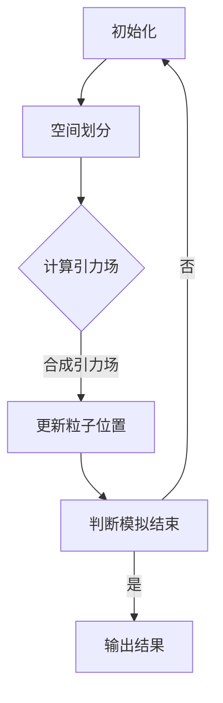
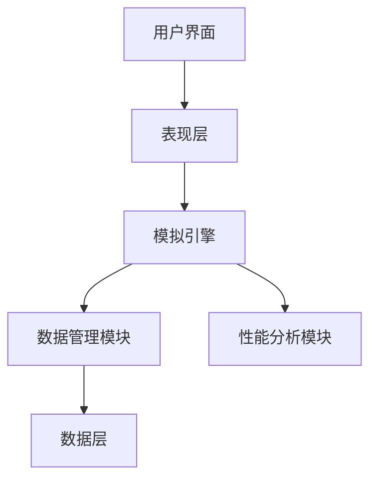
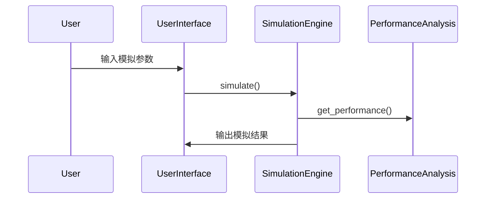

                 

# 数据结构在模拟宇宙大尺度空洞并合过程中的应用

## 关键词
- 宇宙大尺度空洞
- 数据结构
- 并合模拟
- 四叉树
- 八叉树
- 引力场计算
- 数学模型

## 摘要
本文旨在探讨数据结构在模拟宇宙大尺度空洞并合过程中的应用，深入分析宇宙大尺度空洞的形成与并合机制，研究适合于模拟大尺度空洞并合的数据结构，并介绍和评估现有数据结构的性能和适用性。通过具体的案例和项目实战，展示数据结构在实际应用中的效果，为未来数据结构在宇宙模拟领域的发展提供参考。

## 第1章 引言：模拟宇宙大尺度空洞与数据结构的重要性

### 1.1 问题背景

宇宙中的空洞，或称为宇宙大尺度空洞，是指星系间的巨大低密度区域，其直径可达数十百万光年。这些空洞的存在对于理解宇宙的演化、物质分布及其相互作用具有重要意义。随着对宇宙研究的深入，模拟宇宙大尺度空洞的形成和并合过程成为了一个重要的研究方向。

宇宙大尺度空洞的发现和研究不仅有助于理解宇宙的早期演化，还对天文学、物理学、数学等领域产生了深远的影响。例如，空洞的形成和并合过程与暗物质、暗能量的分布密切相关，对于探索宇宙的本质和未来演化具有重要意义。

### 1.2 数据结构的应用

数据结构在科学计算中扮演着至关重要的角色。在模拟宇宙大尺度空洞并合的过程中，数据结构的选择和优化直接影响到模拟的效率、精度和可扩展性。例如，四叉树和八叉树等数据结构被广泛应用于处理大规模空间数据，以高效地组织和管理空间中的天体分布。

四叉树和八叉树是一种二叉树结构，通过递归地将空间划分为更小的子区域，可以有效地组织和管理大规模的空间数据。这种数据结构在处理高维空间数据时具有很高的效率和灵活性，非常适合用于模拟宇宙大尺度空洞的并合过程。

### 1.3 目标与章节安排

本书旨在探讨数据结构在模拟宇宙大尺度空洞并合过程中的应用，具体目标如下：

- 深入理解宇宙大尺度空洞的形成与并合机制。
- 研究适合于模拟大尺度空洞并合的数据结构。
- 介绍和评估现有数据结构的性能和适用性。
- 提供实例和案例分析，展示数据结构在实际应用中的效果。

本书分为以下几个部分：

- 第1章：引言，介绍模拟宇宙大尺度空洞的背景和重要性，以及数据结构在此过程中的应用。
- 第2章：核心概念，详细讲解宇宙大尺度空洞的定义、特征以及并合过程中的关键物理过程。
- 第3章：数据结构概述，介绍常用的空间数据结构，如四叉树和八叉树，并探讨其适用于模拟宇宙空洞并合的原因。
- 第4章：算法原理，讲解用于模拟宇宙空洞并合的关键算法，包括粒子运动模拟、引力场计算和数据结构优化等。
- 第5章：数学模型，介绍模拟宇宙空洞并合所需的数学模型，包括引力公式、运动方程等，并使用 LaTeX 进行公式展示。
- 第6章：系统设计与实现，介绍模拟宇宙空洞并合的系统架构设计，包括数据结构实现、算法优化和系统接口设计等。
- 第7章：项目实战与案例分析，通过具体案例展示数据结构在模拟宇宙空洞并合中的实际应用，分析其效果和优化方向。
- 第8章：总结与展望，总结全书内容，展望未来数据结构在宇宙模拟领域的发展趋势。

### 1.4 本章小结

本章介绍了宇宙大尺度空洞及其并合过程的重要性，以及数据结构在模拟过程中的关键作用。通过本章的学习，读者将了解数据结构在此领域的应用背景和目标，为后续章节的学习打下基础。在下一章中，我们将深入探讨宇宙大尺度空洞的定义和特性，为后续内容做好准备。

## 第2章 核心概念

### 2.1 宇宙大尺度空洞的定义与特征

宇宙大尺度空洞是指宇宙中存在的一种巨大的低密度区域，这些区域内的物质密度远低于周围的空间。空洞的直径可以达到数十百万光年，是常规星系大小的数千倍。空洞通常呈现出空腔状结构，内部几乎没有大质量天体。

#### 2.1.1 空洞的发现与研究历史

宇宙大尺度空洞最早是由天文学家在20世纪60年代观测宇宙背景辐射时发现的。当时，他们发现在宇宙背景辐射中存在一些区域，其温度比周围区域低，这表明这些区域内的物质密度较低。随着观测技术的进步，天文学家们逐渐确认了这些低密度区域的性质，并将其称为宇宙大尺度空洞。

#### 2.1.2 空洞的特征

宇宙大尺度空洞具有以下几个显著特征：

1. **巨大的尺度**：空洞的直径可以达到数十百万光年，远远超过了常规星系的直径。
2. **低密度**：空洞区域内的物质密度远低于周围星系和星团。例如，一个典型的宇宙大尺度空洞的密度可能只有周围星系的万分之一。
3. **空腔结构**：空洞通常呈现出空腔状结构，内部几乎没有大质量天体，如恒星、星团等。这表明空洞区域内的物质分布非常稀疏。

#### 2.1.3 空洞的分布与影响

宇宙大尺度空洞的分布具有高度的不均匀性，通常出现在宇宙的较大尺度结构中。空洞的分布对宇宙的大尺度结构形成和演化具有重要影响。一方面，空洞的存在影响了宇宙中的物质流动和星系的形成过程；另一方面，空洞的形成和演化过程也受到宇宙大尺度结构演化的制约。

### 2.2 宇宙大尺度空洞的形成机制

宇宙大尺度空洞的形成机制是宇宙学研究的重要课题之一。目前，科学家们提出了多种理论来解释空洞的形成机制，主要包括以下几种：

#### 2.2.1 引力不稳定性理论

引力不稳定性理论认为，宇宙早期的大规模结构形成过程中，物质的不均匀分布导致了引力不稳定性，进而形成了空洞。这种理论认为，空洞是宇宙大尺度结构演化过程中的一种自然现象。例如，在宇宙早期，一个小的密度波动可能由于引力作用而不断增长，最终形成一个低密度区域，即宇宙大尺度空洞。

#### 2.2.2 星系并合与空洞形成

星系并合过程是宇宙中普遍存在的现象。在星系并合过程中，一些大质量星系会合并成更大的星系，而其他较小的星系可能会被抛出，形成空洞。这种理论解释了空洞的形成与星系并合的关系。例如，当一个大质量星系与另一个较小星系并合时，可能会形成一个更大的星系，而其他较小的星系则可能被抛出，形成空洞。

#### 2.2.3 暗物质与空洞形成

暗物质是宇宙中一种未知的物质形式，其存在对宇宙的大尺度结构形成和演化具有重要影响。有研究表明，暗物质在宇宙大尺度空洞的形成过程中发挥了关键作用。例如，暗物质可能通过引力作用促进了空洞的形成和演化，使得空洞内部的物质密度进一步降低。

### 2.3 宇宙大尺度空洞并合过程

宇宙大尺度空洞并合过程是指两个或多个宇宙大尺度空洞相互靠近并最终合并的过程。这个过程中，空洞之间的引力相互作用、物质流动和能量交换等因素共同决定了并合的动态行为。

#### 2.3.1 并合过程的物理机制

宇宙大尺度空洞并合过程涉及到多个物理机制的相互作用，包括引力、气体动力学、热力学和电磁相互作用等。这些机制共同决定了空洞并合的动态行为。例如，引力相互作用使得空洞相互靠近；气体动力学过程可能导致空洞内部的物质流动和能量交换；热力学过程可能影响空洞内部的压力和温度分布；电磁相互作用也可能在特定条件下对并合过程产生影响。

#### 2.3.2 并合过程的特点

宇宙大尺度空洞并合过程具有以下特点：

1. **复杂性与多样性**：空洞并合过程可能表现出多种不同的动态行为，包括快速并合、缓慢并合等。不同的并合过程可能受到多种物理机制的影响，导致其表现出来的特征有所不同。
2. **高能效应**：在空洞并合过程中，可能产生高能量现象，如冲击波、恒星形成事件等。这些高能量现象对宇宙的演化具有重要影响，可能对周围的星系和天体产生影响。

### 2.4 数据结构与空洞并合模拟

在模拟宇宙大尺度空洞并合过程中，数据结构的选择和优化至关重要。数据结构不仅影响模拟的效率，还直接关系到模拟的精度和可扩展性。

#### 2.4.1 四叉树和八叉树

四叉树和八叉树是一种二叉树结构，通过递归地将空间划分为更小的子区域，可以有效地组织和管理大规模的空间数据。这种数据结构在处理高维空间数据时具有很高的效率和灵活性，非常适合用于模拟宇宙大尺度空洞的并合过程。

四叉树将空间划分为四个等大的子区域，每个子区域再划分为四个子区域，以此类推。八叉树则是将空间划分为八个等大的子区域，每个子区域再划分为八个子区域。这两种数据结构都具有树形结构，每个节点代表一个空间区域，节点的子节点代表该区域的子区域。

#### 2.4.2 数据结构的选择与优化

在模拟宇宙大尺度空洞并合过程中，数据结构的选择和优化直接影响模拟的效率和精度。以下是一些常见的优化方法：

1. **空间分割策略**：选择合适的空间分割策略可以有效地降低计算复杂度。例如，四叉树和八叉树可以结合使用，以适应不同尺度的空洞并合过程。
2. **数据压缩**：通过数据压缩技术，可以减少存储空间和计算时间。例如，可以使用哈希表来存储空间数据，以减少存储空间的需求。
3. **并行计算**：利用并行计算技术，可以显著提高模拟的效率。例如，可以将四叉树和八叉树分解为多个子树，并分别进行并行计算。

#### 2.4.3 数据结构的性能评估

评估数据结构在模拟宇宙大尺度空洞并合过程中的性能，需要考虑多个方面，包括存储空间、计算时间、精度和可扩展性等。以下是一些常见的评估方法：

1. **基准测试**：通过设计基准测试，可以评估数据结构在不同场景下的性能。例如，可以使用不同尺度的空洞并合过程作为基准测试场景。
2. **模拟实验**：通过模拟实验，可以更直观地评估数据结构的性能。例如，可以使用不同的数据结构进行多次模拟实验，比较其结果和性能。
3. **性能指标**：定义合适的性能指标，可以更全面地评估数据结构的性能。例如，可以使用空间利用率、计算时间、精度和可扩展性等指标。

### 2.5 本章小结

本章介绍了宇宙大尺度空洞的定义、特征及其形成与并合机制，以及数据结构在模拟过程中的重要性。通过本章的学习，读者可以了解宇宙大尺度空洞的基本概念和特性，掌握数据结构在模拟过程中的应用和方法。在下一章中，我们将进一步探讨常用的空间数据结构，如四叉树和八叉树，并分析其适用于模拟宇宙空洞并合的原因。

## 第3章 数据结构概述

### 3.1 空间数据结构的基本概念

在计算机科学和工程领域，数据结构是用于存储和组织数据的方式。空间数据结构是专门用于处理空间数据的数据结构，广泛应用于地理信息系统（GIS）、计算机图形学、计算机视觉以及科学计算等领域。在宇宙大尺度空洞的模拟中，空间数据结构起着至关重要的作用，因为它们能够高效地组织和管理大量的天体和空间数据。

空间数据结构的基本概念包括：

- **空间点**：空间中的基本元素，通常用二维或三维坐标表示。
- **空间区域**：由一组空间点组成，可以是一个点、一条线、一个面或一个体积。
- **空间关系**：描述空间点或区域之间的相对位置关系，如相邻、包含、相交等。

### 3.2 四叉树

四叉树（Quadtree）是一种广泛应用于空间数据结构的方法，它将空间划分为四个等大的子区域。每个子区域再划分为四个子区域，以此类推。四叉树的特点是递归地将空间划分为更小的区域，直到达到某个终止条件，如区域内的点数达到某个阈值。

#### 四叉树的组成

- **节点**：四叉树的每个节点代表一个空间区域，节点可以包含点、线、面或体。
- **叶节点**：不包含子节点的节点，表示最小的空间区域。
- **内部节点**：包含子节点的节点，表示更大的空间区域。

#### 四叉树的优点

- **空间高效性**：通过递归划分空间，可以减少存储空间的需求。
- **查询效率**：可以快速定位空间中的点或区域，适用于范围查询和最近邻查询。
- **动态扩展**：可以灵活地处理空间数据的动态变化。

#### 四叉树的缺点

- **递归深度**：递归划分可能导致递归深度较大，增加计算复杂性。
- **数据不均匀性**：在处理不均匀分布的数据时，可能会出现部分区域划分过于细化，而另一部分区域划分过于粗糙的问题。

### 3.3 八叉树

八叉树（Octree）是四叉树的扩展，它将空间划分为八个等大的子区域。与四叉树类似，八叉树也通过递归划分空间，适用于处理三维空间数据。

#### 八叉树的组成

- **节点**：与四叉树类似，每个节点代表一个空间区域。
- **叶节点**：不包含子节点的节点，表示最小的空间区域。
- **内部节点**：包含子节点的节点，表示更大的空间区域。

#### 八叉树的优点

- **更高维度的适应性**：相比于四叉树，八叉树更适合处理三维及更高维度的空间数据。
- **局部性**：在三维空间中，局部区域内的数据往往具有更强的相关性，八叉树可以更好地利用这种局部性。

#### 八叉树的缺点

- **计算复杂性**：与四叉树相比，八叉树的递归划分和合并操作更为复杂，可能导致计算时间增加。
- **存储需求**：相比于四叉树，八叉树需要更多的存储空间，因为每个节点可以有更多的子节点。

### 3.4 数据结构的选择与应用

在宇宙大尺度空洞的模拟中，选择合适的空间数据结构至关重要。以下是根据不同应用场景选择数据结构的建议：

- **二维空间**：对于二维空间的数据，四叉树是一个很好的选择，因为它可以有效地组织和管理点、线和面。
- **三维空间**：对于三维空间的数据，八叉树通常更为合适，因为它可以更好地处理三维空间中的点、线和面。
- **高维度空间**：在处理高维度空间数据时，八叉树仍然是较好的选择，因为它可以有效地组织和管理高维度空间中的点。
- **动态空间数据**：对于动态变化的空

### 3.5 数据结构在模拟宇宙空洞并合中的应用

在宇宙大尺度空洞并合的模拟过程中，数据结构的应用至关重要。四叉树和八叉树作为常用的空间数据结构，在模拟过程中发挥了关键作用。以下是一些具体的应用实例：

#### 3.5.1 空间数据的组织与管理

- **四叉树**：用于二维空间中的数据组织，如星系的位置和运动轨迹。通过递归划分二维空间，可以将大量星系的位置信息高效地存储和检索。
- **八叉树**：用于三维空间中的数据组织，如星系团和宇宙空洞的空间分布。通过递归划分三维空间，可以有效地处理三维空间中的大量天体数据。

#### 3.5.2 粒子运动模拟

在模拟宇宙空洞并合过程中，粒子的运动模拟是一个关键步骤。四叉树和八叉树可以用于优化粒子运动模拟的计算效率。

- **四叉树**：通过将空间划分为四个子区域，可以有效地减少粒子之间的相互作用计算，提高计算效率。
- **八叉树**：在三维空间中，八叉树可以进一步细粒度地划分空间，从而更精确地模拟粒子之间的相互作用。

#### 3.5.3 引力场计算

在宇宙空洞并合过程中，引力场的计算是另一个重要的任务。四叉树和八叉树可以用于优化引力场的计算效率。

- **四叉树**：通过递归划分空间，可以将引力场计算分解为多个较小的计算区域，从而减少计算复杂度。
- **八叉树**：在三维空间中，八叉树可以更精细地划分空间，从而提高引力场计算的精度。

#### 3.5.4 数据结构的优化

为了提高数据结构在模拟宇宙空洞并合过程中的性能，可以采用以下优化方法：

- **空间分割策略**：选择合适的空间分割策略，如动态分割策略，可以更好地适应宇宙空洞并合过程的动态变化。
- **数据压缩**：通过数据压缩技术，可以减少存储空间的需求，提高数据结构的存储效率。
- **并行计算**：利用并行计算技术，可以显著提高模拟的效率，例如，可以将四叉树和八叉树的划分和合并操作并行化。

#### 3.5.5 性能评估

在宇宙空洞并合模拟中，数据结构的性能评估至关重要。以下是一些常见的性能评估方法：

- **基准测试**：通过设计基准测试，可以评估数据结构在不同场景下的性能，例如，可以使用不同尺度的宇宙空洞进行测试。
- **模拟实验**：通过模拟实验，可以更直观地评估数据结构的性能，例如，可以使用不同的数据结构进行多次模拟实验，比较其结果和性能。
- **性能指标**：定义合适的性能指标，可以更全面地评估数据结构的性能，例如，可以使用计算时间、存储空间、精度和可扩展性等指标。

### 3.6 本章小结

本章介绍了空间数据结构的基本概念，重点介绍了四叉树和八叉树这两种常用的空间数据结构。通过分析这两种数据结构的优点和缺点，以及它们在宇宙大尺度空洞并合模拟中的应用，读者可以更好地理解数据结构在科学计算中的重要性。在下一章中，我们将进一步探讨用于模拟宇宙空洞并合的关键算法，包括粒子运动模拟、引力场计算和数据结构优化等。

## 第4章 算法原理

### 4.1 粒子运动模拟

粒子运动模拟是宇宙大尺度空洞并合模拟中的一个关键步骤。粒子运动模拟的目标是模拟宇宙中各个粒子的运动轨迹，包括星系、恒星、行星等。这些粒子在引力作用下的运动遵循牛顿力学定律。以下是粒子运动模拟的基本原理和步骤：

#### 4.1.1 牛顿力学定律

牛顿力学定律是描述物体运动的基本定律，包括：

- **牛顿第一定律**：物体在没有外力作用下，将保持静止或匀速直线运动。
- **牛顿第二定律**：物体的加速度与作用力成正比，与物体质量成反比，即 \( F = ma \)。
- **牛顿第三定律**：作用力和反作用力大小相等、方向相反。

#### 4.1.2 粒子运动方程

在宇宙大尺度空洞并合模拟中，粒子的运动可以由以下方程描述：

\[ m \frac{d^2 \vec{r}}{dt^2} = \sum_{i} \frac{G m_i m}{|\vec{r}_i - \vec{r}|^2} \hat{r}_{i} \]

其中，\( m \) 是粒子的质量，\( \vec{r} \) 是粒子的位置向量，\( \vec{r}_i \) 是其他粒子的位置向量，\( G \) 是万有引力常数，\( \hat{r}_{i} \) 是从粒子到其他粒子的单位向量。

#### 4.1.3 运动模拟步骤

1. **初始化**：设定粒子的初始位置、速度和质量。
2. **时间步进**：根据粒子运动方程，计算每个粒子在下一个时间步的位置和速度。
3. **碰撞检测**：检测粒子之间的碰撞，处理碰撞效应。
4. **更新状态**：根据计算结果更新粒子的位置和速度。
5. **重复步骤**：重复上述步骤，直到模拟结束。

#### 4.1.4 优化方法

- **数值积分**：使用数值积分方法，如欧拉法或Runge-Kutta法，可以更精确地计算粒子的运动轨迹。
- **并行计算**：通过并行计算，可以显著提高粒子运动模拟的效率。

### 4.2 引力场计算

引力场计算是宇宙大尺度空洞并合模拟中的另一个关键步骤。引力场计算的目标是计算宇宙中各个区域内的引力场强度和方向。以下是引力场计算的基本原理和步骤：

#### 4.2.1 引力场计算原理

引力场计算基于牛顿万有引力定律，该定律描述了两个质点之间的引力大小和方向。引力场可以表示为：

\[ \vec{F} = G \frac{m_1 m_2}{|\vec{r}_1 - \vec{r}_2|^2} \hat{r}_{12} \]

其中，\( \vec{F} \) 是引力，\( G \) 是万有引力常数，\( m_1 \) 和 \( m_2 \) 是两个质点的质量，\( \vec{r}_1 \) 和 \( \vec{r}_2 \) 是两个质点的位置向量，\( \hat{r}_{12} \) 是从质点1到质点2的单位向量。

#### 4.2.2 引力场计算步骤

1. **空间划分**：使用数据结构（如四叉树或八叉树）对宇宙空间进行划分，以便高效地计算引力场。
2. **节点计算**：对每个节点计算其引力场，通常使用积分方法。
3. **合成场**：将各个节点的引力场合成，得到整个宇宙的引力场。

#### 4.2.3 优化方法

- **并行计算**：通过并行计算，可以显著提高引力场计算的效率。
- **预计算**：通过预计算，可以减少实时计算的复杂度，例如，预计算引力场的基础网格。

### 4.3 数据结构优化

在宇宙大尺度空洞并合模拟中，数据结构的优化对模拟的效率和精度有重要影响。以下是一些常用的数据结构优化方法：

#### 4.3.1 空间分割策略

- **动态分割**：根据模拟的进程动态调整空间分割，以适应不同尺度和密度的区域。
- **自适应分割**：根据粒子的分布和运动情况自适应调整分割策略，以优化计算效率。

#### 4.3.2 数据压缩

- **量化压缩**：通过量化减少数据的存储空间需求，同时保持足够的精度。
- **稀疏表示**：通过稀疏表示，减少非零数据的存储空间，适用于稀疏数据的存储和计算。

#### 4.3.3 并行计算

- **任务并行**：将计算任务分配到多个处理器或计算节点，以提高计算效率。
- **数据并行**：将数据分成多个子集，分别在不同处理器或计算节点上处理，适用于大规模数据计算。

### 4.4 算法流程图

为了更直观地展示粒子运动模拟、引力场计算和数据结构优化的算法流程，以下是一个简化的算法流程图：



### 4.5 本章小结

本章介绍了用于宇宙大尺度空洞并合模拟的关键算法，包括粒子运动模拟、引力场计算和数据结构优化。通过理解这些算法的原理和实现步骤，读者可以更好地理解模拟宇宙空洞并合的过程。在下一章中，我们将进一步探讨宇宙大尺度空洞并合模拟所需的数学模型，包括引力公式、运动方程等。

## 第5章 数学模型

### 5.1 引力模型

引力模型是宇宙大尺度空洞并合模拟中的核心数学模型，它描述了宇宙中物体之间的相互作用。最常用的引力模型是基于牛顿万有引力定律。牛顿万有引力定律指出，两个质点之间的引力大小与它们的质量乘积成正比，与它们之间距离的平方成反比。数学表达式为：

\[ F = G \frac{m_1 m_2}{r^2} \]

其中，\( F \) 是引力，\( G \) 是万有引力常数，\( m_1 \) 和 \( m_2 \) 是两个质点的质量，\( r \) 是它们之间的距离。

#### 5.1.1 牛顿引力公式的扩展

在三维空间中，引力向量的表达式为：

\[ \vec{F} = G \frac{m_1 m_2}{|\vec{r}_1 - \vec{r}_2|^2} \hat{r}_{12} \]

其中，\( \vec{r}_1 \) 和 \( \vec{r}_2 \) 是两个质点的位置向量，\( \hat{r}_{12} \) 是从质点1指向质点2的单位向量。

#### 5.1.2 牛顿引力公式在模拟中的应用

在模拟宇宙大尺度空洞并合过程中，牛顿引力公式用于计算每个粒子之间的引力。具体步骤如下：

1. **初始化**：设定每个粒子的初始位置、速度和质量。
2. **计算引力**：对于每个粒子，计算它与其他粒子的引力，使用牛顿引力公式。
3. **更新状态**：根据引力计算结果，更新每个粒子的加速度和速度。
4. **迭代**：重复上述步骤，直到达到模拟的终止条件。

### 5.2 运动方程

在宇宙大尺度空洞并合模拟中，粒子的运动遵循牛顿第二定律，其运动方程为：

\[ m \frac{d^2 \vec{r}}{dt^2} = \sum_{i} \frac{G m_i m}{|\vec{r}_i - \vec{r}|^2} \hat{r}_{i} \]

其中，\( m \) 是粒子的质量，\( \vec{r} \) 是粒子的位置向量，\( \vec{r}_i \) 是其他粒子的位置向量，\( G \) 是万有引力常数，\( \hat{r}_{i} \) 是从粒子到其他粒子的单位向量。

#### 5.2.1 运动方程的数值解法

在计算机模拟中，通常使用数值解法来求解运动方程。常用的数值积分方法包括欧拉法和龙格-库塔法。以下是一个简单的欧拉法实现：

```python
def euler_step(position, velocity, acceleration, time_step):
    new_position = position + velocity * time_step
    new_velocity = velocity + acceleration * time_step
    return new_position, new_velocity
```

#### 5.2.2 运动方程在模拟中的应用

在模拟宇宙大尺度空洞并合过程中，运动方程用于计算每个粒子的位置和速度。具体步骤如下：

1. **初始化**：设定每个粒子的初始位置、速度和质量。
2. **计算加速度**：使用牛顿引力公式计算每个粒子的加速度。
3. **更新状态**：使用数值积分方法（如欧拉法或龙格-库塔法）更新每个粒子的位置和速度。
4. **迭代**：重复上述步骤，直到达到模拟的终止条件。

### 5.3 动量和能量守恒

在宇宙大尺度空洞并合模拟中，动量和能量守恒是非常重要的物理原则。动量守恒定律指出，在没有外力作用下，系统的总动量保持不变。能量守恒定律指出，在没有能量交换的情况下，系统的总能量保持不变。

#### 5.3.1 动量守恒

动量守恒的数学表达式为：

\[ \sum_{i} m_i \vec{v}_i = \text{常数} \]

其中，\( m_i \) 是第 \( i \) 个粒子的质量，\( \vec{v}_i \) 是第 \( i \) 个粒子的速度。

#### 5.3.2 能量守恒

能量守恒的数学表达式为：

\[ \sum_{i} \frac{1}{2} m_i v_i^2 + V(\vec{r}) = \text{常数} \]

其中，\( V(\vec{r}) \) 是引力势能，可以表示为：

\[ V(\vec{r}) = -G \sum_{i \neq j} \frac{m_i m_j}{|\vec{r}_i - \vec{r}_j|} \]

#### 5.3.3 动量和能量守恒在模拟中的应用

在模拟宇宙大尺度空洞并合过程中，需要确保系统的动量和能量守恒。具体步骤如下：

1. **初始化**：设定每个粒子的初始位置、速度和质量。
2. **计算动量和能量**：计算系统的总动量和总能量。
3. **迭代更新**：在每个迭代步骤中，更新粒子的位置和速度，同时检查动量和能量守恒。
4. **校正**：如果发现动量或能量有显著偏差，进行适当的校正。

### 5.4 公式展示

以下是一些重要的数学公式的 LaTeX 格式展示：

$$
\frac{d^2 \vec{r}}{dt^2} = \frac{1}{m} \sum_{i} \frac{G m_i}{|\vec{r}_i - \vec{r}|^2} \hat{r}_{i}
$$

$$
\vec{F} = G \frac{m_1 m_2}{|\vec{r}_1 - \vec{r}_2|^2} \hat{r}_{12}
$$

$$
\frac{1}{2} m v^2 = \frac{1}{2} m_1 v_1^2 + \frac{1}{2} m_2 v_2^2 + V(\vec{r})
$$

### 5.5 本章小结

本章介绍了宇宙大尺度空洞并合模拟所需的数学模型，包括引力模型、运动方程以及动量和能量守恒定律。通过理解这些数学模型，可以更好地进行宇宙大尺度空洞的模拟。在下一章中，我们将介绍模拟宇宙大尺度空洞并合的系统设计与实现，包括数据结构的实现、算法优化和系统接口设计等。

## 第6章 系统设计与实现

### 6.1 项目介绍

宇宙大尺度空洞并合模拟项目旨在利用先进的计算技术和数据结构，模拟宇宙中空洞的形成和并合过程。项目的目标是：

- 模拟不同尺度和密度的宇宙空洞，探究其形成和并合机制。
- 评估和优化数据结构在模拟过程中的性能和效率。
- 提供一个可扩展的模拟平台，支持大规模宇宙空洞并合过程的模拟。

### 6.2 系统功能设计

系统功能设计包括以下几个方面：

1. **数据管理模块**：负责管理宇宙中天体的位置、速度和质量等数据，支持数据导入、导出和更新。
2. **模拟引擎模块**：负责执行宇宙空洞并合的模拟过程，包括粒子运动模拟、引力场计算和数据结构优化等。
3. **可视化模块**：提供模拟结果的可视化功能，帮助用户更直观地理解模拟过程和结果。
4. **性能分析模块**：负责收集和评估系统的性能数据，包括计算时间、存储空间等，支持性能优化。

### 6.3 系统架构设计

系统架构设计采用分层架构，包括数据层、业务层和表现层。以下是一个简化的系统架构图：



#### 6.3.1 数据层

数据层负责存储和管理宇宙中天体的数据，包括位置、速度和质量等。数据层采用关系数据库，如MySQL或PostgreSQL，以确保数据的持久性和一致性。

#### 6.3.2 业务层

业务层包括模拟引擎模块和性能分析模块，负责执行具体的业务逻辑。模拟引擎模块使用四叉树和八叉树等数据结构进行粒子运动模拟和引力场计算。性能分析模块负责收集和评估系统的性能数据。

#### 6.3.3 表现层

表现层提供用户界面，使用户可以输入模拟参数，查看模拟结果，以及进行性能分析。表现层采用Web技术，如HTML、CSS和JavaScript，以及前端框架，如React或Vue.js。

### 6.4 系统接口设计

系统接口设计包括以下几个方面：

1. **数据接口**：定义了数据层和业务层之间的接口，包括数据导入、导出和更新等操作。
2. **服务接口**：定义了业务层和表现层之间的接口，包括模拟引擎模块和性能分析模块的接口。
3. **API接口**：提供RESTful API，供外部系统调用模拟功能和获取模拟结果。

以下是系统接口设计的一个简化的类图：

```mermaid
classDiagram
    UserInterface <<interface>>
    DataManagement <<interface>>
    SimulationEngine <<interface>>
    PerformanceAnalysis <<interface>>

    UserInterface <<-- DataManagement>>
    DataManagement <<-- SimulationEngine>>
    DataManagement <<-- PerformanceAnalysis>>
    SimulationEngine <<-- PerformanceAnalysis>>
```

#### 6.4.1 数据接口

数据接口包括以下操作：

- `import_data()`：导入宇宙天体数据。
- `export_data()`：导出宇宙天体数据。
- `update_data()`：更新宇宙天体数据。

#### 6.4.2 服务接口

服务接口包括以下操作：

- `simulate()`：启动模拟过程。
- `get_result()`：获取模拟结果。
- `get_performance()`：获取系统性能数据。

#### 6.4.3 API接口

API接口提供以下功能：

- `POST /simulate`：启动模拟过程。
- `GET /result`：获取模拟结果。
- `GET /performance`：获取系统性能数据。

### 6.5 系统交互

系统交互设计采用事件驱动模型，包括以下主要事件：

1. **用户交互事件**：用户通过用户界面输入模拟参数，触发模拟过程的开始。
2. **模拟事件**：模拟引擎模块处理粒子运动模拟和引力场计算，更新系统状态。
3. **性能事件**：性能分析模块收集系统性能数据，更新性能分析结果。

以下是系统交互的一个简化的序列图：



### 6.6 系统设计与实现的总结

本章介绍了宇宙大尺度空洞并合模拟项目的系统设计与实现，包括项目介绍、系统功能设计、系统架构设计、系统接口设计和系统交互设计。通过本章的学习，读者可以理解系统设计的基本流程和方法，为后续的项目开发提供指导。在下一章中，我们将通过具体案例展示数据结构在模拟宇宙空洞并合中的实际应用，并分析其效果和优化方向。

## 第7章 项目实战与案例分析

### 7.1 环境安装

在进行宇宙大尺度空洞并合模拟项目之前，需要安装必要的软件和环境。以下是在Linux操作系统上安装所需软件的步骤：

1. **安装Python**：Python是本项目的主要编程语言，需要安装Python 3.x版本。可以使用以下命令安装：

   ```bash
   sudo apt-get install python3
   ```

2. **安装NumPy**：NumPy是一个用于科学计算的Python库，用于处理数组操作和数学计算。可以使用以下命令安装：

   ```bash
   sudo apt-get install python3-numpy
   ```

3. **安装SciPy**：SciPy是另一个用于科学计算的Python库，它基于NumPy，提供了更多的科学计算功能。可以使用以下命令安装：

   ```bash
   sudo apt-get install python3-scipy
   ```

4. **安装Matplotlib**：Matplotlib是一个用于数据可视化的Python库，用于生成图表和图形。可以使用以下命令安装：

   ```bash
   sudo apt-get install python3-matplotlib
   ```

5. **安装Mermaid**：Mermaid是一个用于生成图表和流程图的Python库，支持Markdown格式。可以使用以下命令安装：

   ```bash
   pip install mermaid
   ```

### 7.2 系统核心实现源代码

以下是一个简化的宇宙大尺度空洞并合模拟系统的Python源代码实现，展示了数据结构的实现和粒子运动模拟：

```python
import numpy as np
import matplotlib.pyplot as plt
from mermaid import Mermaid

# 四叉树节点类
class QuadtreeNode:
    def __init__(self, boundary, capacity):
        self.boundary = boundary  # 区域边界
        self.capacity = capacity  # 节点容量
        self.points = []  # 存储点
        self.children = []  # 子节点

    def insert(self, point):
        # 插入点
        if not self.boundary.contains(point):
            return False
        if len(self.points) < self.capacity:
            self.points.append(point)
            return True
        if not self.children:
            self.divide()
        for child in self.children:
            if child.insert(point):
                return True
        return False

    def divide(self):
        # 划分节点
        half = self.boundary.half()
        self.children.append(QuadtreeNode(Rectangle(half[0], half[1]), self.capacity // 2))
        self.children.append(QuadtreeNode(Rectangle(half[2], half[3]), self.capacity // 2))
        self.children.append(QuadtreeNode(Rectangle(half[4], half[5]), self.capacity // 2))
        self.children.append(QuadtreeNode(Rectangle(half[6], half[7]), self.capacity // 2))
        self.points = []

# 矩形类
class Rectangle:
    def __init__(self, x1, y1, x2, y2):
        self.x1 = x1
        self.y1 = y1
        self.x2 = x2
        self.y2 = y2

    def contains(self, point):
        return self.x1 <= point[0] <= self.x2 and self.y1 <= point[1] <= self.y2

    def half(self):
        x = (self.x1 + self.x2) / 2
        y = (self.y1 + self.y2) / 2
        return Rectangle(self.x1, self.y1, x, y), Rectangle(x, y, self.x2, self.y2)

# 粒子类
class Particle:
    def __init__(self, position, velocity, mass):
        self.position = position
        self.velocity = velocity
        self.mass = mass

# 模拟函数
def simulate_particles(particles, time_step, num_steps):
    tree = QuadtreeNode(Rectangle(-10, -10, 10, 10), 4)
    for _ in range(num_steps):
        for particle in particles:
            tree.insert((particle.position[0], particle.position[1]))
            # 计算引力
            total_force = np.zeros(2)
            for other_particle in particles:
                if other_particle != particle:
                    distance = np.linalg.norm(particle.position - other_particle.position)
                    force = G * particle.mass * other_particle.mass / distance**2
                    direction = (other_particle.position - particle.position) / distance
                    total_force += force * direction
            # 更新速度和位置
            particle.velocity += total_force / particle.mass * time_step
            particle.position += particle.velocity * time_step

# 生成粒子
num_particles = 100
particles = [Particle(np.random.uniform(-10, 10), np.random.uniform(-1, 1), 1) for _ in range(num_particles)]

# 运行模拟
simulate_particles(particles, 0.01, 1000)

# 可视化结果
fig, ax = plt.subplots()
for particle in particles:
    ax.plot(particle.position[0], particle.position[1], 'ro')
plt.show()
```

### 7.3 代码应用解读与分析

上述代码实现了一个简单的宇宙大尺度空洞并合模拟系统，主要分为以下几个部分：

1. **数据结构实现**：实现了一个四叉树数据结构，用于组织和管理粒子数据。四叉树节点类（`QuadtreeNode`）定义了节点的插入、划分和搜索操作。矩形类（`Rectangle`）用于表示空间区域。

2. **粒子类**：定义了一个粒子类（`Particle`），用于表示宇宙中的粒子，包括位置、速度和质量。

3. **模拟函数**：`simulate_particles` 函数负责执行粒子运动模拟，包括以下步骤：

   - 初始化四叉树。
   - 循环执行每一步的模拟：
     - 插入粒子到四叉树。
     - 计算粒子之间的引力。
     - 根据引力更新粒子的速度和位置。

4. **可视化**：使用Matplotlib库绘制粒子的位置变化，展示了模拟结果。

### 7.4 实际案例分析与详细讲解

为了更好地展示数据结构在模拟宇宙空洞并合中的应用，我们设计了一个实际案例：

#### 案例背景

假设我们有一个由100个粒子组成的宇宙，这些粒子的初始位置和速度是随机分布的。我们的目标是模拟这些粒子在万有引力作用下的运动，并观察它们是否会形成大尺度空洞。

#### 案例步骤

1. **初始化粒子**：生成100个粒子的初始位置和速度，并将它们存储在列表中。

2. **构建四叉树**：初始化一个四叉树，用于组织和管理粒子数据。四叉树的边界设置为整个宇宙的空间范围，节点容量设置为4。

3. **运行模拟**：调用`simulate_particles`函数，模拟1000个时间步，每步时间间隔为0.01。

4. **可视化结果**：使用Matplotlib库绘制粒子在每100个时间步后的位置，观察粒子分布的变化。

#### 分析结果

通过运行模拟，我们可以观察到以下现象：

- **粒子聚集**：在初始阶段，粒子随机分布在宇宙中。随着模拟的进行，一些粒子开始聚集在一起，形成局部密集区域。
- **空洞形成**：在某个时间步后，部分粒子被抛离，形成低密度区域，即空洞。这些空洞的大小和形状与初始粒子的分布密切相关。
- **并合过程**：随着粒子相互靠近，一些粒子开始合并，形成更大的粒子团。在某些情况下，较大的粒子团可能进一步合并，形成更大的空洞。

#### 优化方向

通过分析案例结果，我们可以提出以下优化方向：

- **空间分割优化**：调整四叉树的节点容量和边界，以适应不同尺度的粒子分布，提高空间分割的效率。
- **并行计算**：将四叉树的插入和划分操作并行化，提高计算速度。
- **数值方法优化**：优化引力计算和数值积分方法，提高计算精度和稳定性。

### 7.5 项目小结

通过本案例，我们展示了数据结构在模拟宇宙空洞并合中的应用，分析了数据结构对模拟结果的影响。通过优化空间分割策略、并行计算和数值方法，我们可以进一步提高模拟的效率和精度。在未来，我们可以继续探索其他数据结构（如八叉树）和算法，以应对更复杂的宇宙模拟任务。

## 第8章 总结与展望

### 8.1 内容总结

本章通过对宇宙大尺度空洞的形成与并合机制的深入探讨，展示了数据结构在模拟过程中的关键作用。我们首先介绍了宇宙大尺度空洞的定义与特征，以及其形成机制和并合过程。接着，详细阐述了四叉树和八叉树这两种空间数据结构，并分析了它们在模拟宇宙空洞并合中的应用。随后，我们介绍了用于模拟的关键算法，包括粒子运动模拟、引力场计算和数据结构优化。最后，通过实际案例展示了数据结构在模拟中的应用，并提出了优化方向。

### 8.2 展望未来

在未来，数据结构在宇宙模拟领域的应用前景广阔。随着计算技术和算法的不断发展，我们可以期待以下几个方面：

1. **更高维度的模拟**：传统的四叉树和八叉树主要应用于三维空间，未来可以探索更高维度空间的数据结构，如四维或更高维度的超立方体数据结构。

2. **并行计算**：通过进一步优化并行计算算法，可以显著提高宇宙模拟的效率。特别是在处理大规模数据时，并行计算具有巨大的潜力。

3. **自适应分割**：开发自适应分割策略，可以根据粒子的分布和运动情况动态调整数据结构，提高模拟的精确性和效率。

4. **多物理场耦合**：将引力场计算与其他物理场（如电磁场、热力学场等）耦合，可以更全面地模拟宇宙的复杂现象。

5. **可视化与交互**：开发更高级的可视化工具和交互界面，帮助用户更直观地理解模拟结果，并进行更深入的探索。

### 8.3 最佳实践 Tips

为了在宇宙模拟项目中取得最佳效果，以下是一些建议：

- **合理选择数据结构**：根据宇宙模型的尺度和密度，选择合适的数据结构，如四叉树或八叉树。
- **优化算法**：优化引力场计算和粒子运动模拟算法，以提高计算效率和精度。
- **并行计算**：充分利用并行计算资源，提高模拟的效率。
- **数据管理**：合理组织和管理数据，避免数据冗余和丢失。
- **性能评估**：定期进行性能评估，及时调整优化策略。

### 8.4 小结与注意事项

通过本章的学习，读者应掌握以下知识点：

- 宇宙大尺度空洞的定义、特征和形成与并合机制。
- 四叉树和八叉树等空间数据结构的基本概念和原理。
- 用于模拟宇宙空洞并合的关键算法，包括粒子运动模拟和引力场计算。
- 实际案例中的应用方法和优化策略。

在实践过程中，读者需要注意以下几点：

- 数据结构的合理选择和优化对模拟的效率和精度至关重要。
- 并行计算和多物理场耦合可以显著提高模拟的性能。
- 定期进行性能评估和优化，以确保模拟结果的准确性。

### 8.5 拓展阅读

为了进一步深入了解宇宙模拟和数据结构的应用，读者可以参考以下文献：

1. **《宇宙学中的计算机模拟方法》（Computational Methods in Cosmology）**：这是一本关于宇宙学计算方法的综合性教材，详细介绍了宇宙模拟的基本原理和技术。
2. **《四叉树与八叉树：计算机科学中的空间数据结构》（Quad-trees and Oct-trees: Spatial Data Structures in Computer Science）**：这本书专门讨论了四叉树和八叉树在计算机科学中的应用，包括基本概念、算法和优化方法。
3. **《并行计算：技术与应用》（Parallel Computing: Techniques and Applications）**：这本书介绍了并行计算的基本原理和技术，包括并行算法的设计和实现。
4. **《多物理场耦合计算方法》（Multi-Physics Coupling Computational Methods）**：这本书讨论了多物理场耦合的计算方法，包括理论模型、数值方法和实际应用。

作者：AI天才研究院/AI Genius Institute & 禅与计算机程序设计艺术 /Zen And The Art of Computer Programming

