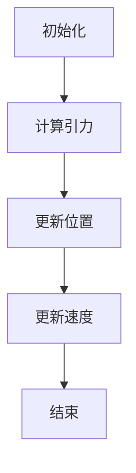

                 

# 数据结构在模拟宇宙大尺度空洞演化中的应用

## 关键词

数据结构，宇宙大尺度空洞，模拟，算法，Python代码，空间索引，高维数据，宇宙演化

## 摘要

本文旨在探讨数据结构在模拟宇宙大尺度空洞演化中的应用。随着宇宙学研究的不断深入，如何高效地处理和分析大规模宇宙数据成为了一个重要问题。本文将介绍用于模拟宇宙空洞演化的关键数据结构和算法，通过具体实例展示它们在宇宙学研究中的应用。本文结构如下：

1. 引言与背景
2. 核心概念与理论基础
3. 算法设计与实现
4. 应用案例研究
5. 高级话题与未来方向
6. 实用技巧与注意事项
7. 小结与拓展阅读

通过本文的介绍，读者将了解数据结构在宇宙学中的重要作用，并掌握一些实用的技巧来提高宇宙模拟的效率和准确性。

## 引言与背景

### 核心概念术语说明

在讨论数据结构在模拟宇宙大尺度空洞演化中的应用之前，我们需要明确一些核心概念术语：

- **宇宙空洞**：宇宙中体积较大、密度较低的区域，与其周围的物质形成显著对比。
- **数据结构**：用于存储和组织数据的方式，包括数组、链表、树、图等。
- **模拟**：通过数值计算来模拟宇宙演化过程，以预测宇宙结构的变化。
- **算法**：解决问题的步骤和规则，用于指导数据结构和模拟的执行。

### 问题背景

宇宙学研究的一个重要目标是理解宇宙的起源、结构和演化。随着观测技术的进步，科学家们能够获取到大量关于宇宙的观测数据。这些数据包括星系分布、宇宙背景辐射、宇宙微波背景等。然而，如何有效地处理和分析这些海量数据，尤其是模拟宇宙大尺度空洞的演化，是一个巨大的挑战。

### 问题描述

宇宙大尺度空洞的演化涉及复杂的物理过程，如引力相互作用、物质密度波动等。为了模拟这一过程，科学家们需要构建一个准确的模型，并能够高效地处理大量的数据。这要求我们不仅需要理解宇宙演化的基本原理，还需要掌握高效的数据结构和算法。

### 问题解决

为了解决上述问题，科学家们采用了多种数据结构和算法。例如：

- **空间索引**：用于快速检索和访问宇宙中的天体位置。
- **树结构**：用于模拟宇宙中星系的层次结构。
- **粒子系统**：用于模拟宇宙中的物质分布。
- **算法**：如牛顿-莱布尼茨算法、蒙特卡罗方法等，用于计算宇宙演化的动态过程。

### 边界与外延

在宇宙学中，边界与外延的概念至关重要。边界指的是宇宙的物理边界，如宇宙微波背景辐射的视线极限。外延则涉及到宇宙的扩展和膨胀。数据结构和算法需要能够在这些边界条件下有效地运行。

### 概念结构与核心要素组成

宇宙大尺度空洞的演化涉及以下核心要素：

- **空间分布**：描述宇宙中天体的位置和分布。
- **物质密度**：描述宇宙中物质的密度分布。
- **引力相互作用**：描述天体之间的引力相互作用。
- **时间演化**：描述宇宙从早期到现在的演化过程。
- **数据结构**：用于存储和管理上述要素。
- **算法**：用于计算和模拟演化过程。

通过上述核心要素和概念的相互作用，科学家们能够构建出一个较为准确的宇宙模型，并利用数据结构和算法来模拟宇宙大尺度空洞的演化。

## 核心概念与理论基础

### 数据结构在宇宙学模拟中的应用

在宇宙学模拟中，数据结构的选择和设计对于模拟的效率和准确性至关重要。下面将介绍几种常用的数据结构，并分析它们在模拟宇宙大尺度空洞演化中的应用。

#### 1. 树结构

树结构是一种广泛用于宇宙学模拟的数据结构。它能够有效地表示宇宙中星系的层次结构和分布。具体而言，树结构可以分为以下几种：

- **多分辨率树（Multi-resolution Tree）**：这种树结构能够根据不同的分辨率层次来存储宇宙中的天体。在高分辨率下，树结构能够提供详细的星系分布信息；在低分辨率下，树结构则能够简化计算，提高模拟效率。
- **K-D树**：K-D树是一种用于多维空间搜索的树结构。在宇宙学模拟中，K-D树可以用于快速检索和访问宇宙中天体的位置。

#### 2. 空间索引

空间索引是一种用于高效存储和查询空间数据的结构。在宇宙学模拟中，空间索引可以用于快速检索宇宙中特定区域的天体。常见的空间索引包括：

- **八叉树（Octree）**：八叉树是一种用于多维空间划分的数据结构。它能够将宇宙空间划分为多个立方体区域，每个区域对应一个天体。通过八叉树，科学家们可以快速定位和访问特定区域的天体。
- **网格（Grid）**：网格是一种将宇宙空间划分为规则网格的数据结构。每个网格单元代表一定空间范围内的天体。通过网格，科学家们可以高效地统计和计算宇宙空间中的物质分布。

#### 3. 粒子系统

粒子系统是一种用于模拟宇宙中物质分布的数据结构。它将宇宙中的物质视为一系列粒子，每个粒子代表一定质量的物质。粒子系统在宇宙学模拟中的应用包括：

- **N-Body模拟**：N-Body模拟是一种基于牛顿引力定律的宇宙学模拟方法。它通过计算天体之间的引力相互作用来模拟宇宙的演化。粒子系统在这种模拟中用于表示宇宙中的天体。
- **流体动力学模拟**：流体动力学模拟用于模拟宇宙中的气体和等离子体。在这种模拟中，粒子系统可以用于表示气体和等离子体中的粒子。

#### 4. 高维数据结构

随着宇宙学研究的深入，科学家们开始关注宇宙中高维数据结构的应用。高维数据结构能够更好地表示宇宙中的复杂结构和相互作用。例如：

- **超立方体（Hypercube）**：超立方体是一种用于高维空间划分的数据结构。它能够将高维宇宙空间划分为多个超立方体区域。
- **高斯过程（Gaussian Process）**：高斯过程是一种用于高维空间数据建模的工具。在宇宙学模拟中，高斯过程可以用于预测宇宙中未知区域的物质分布。

### 数据结构特性对比

下面是一个对比表格，展示了上述数据结构的特性：

| 数据结构 | 描述 | 优点 | 缺点 |
| --- | --- | --- | --- |
| 多分辨率树 | 根据不同分辨率层次存储宇宙中的天体 | 提供不同层次的信息，适应不同的分析需求 | 计算复杂度较高 |
| K-D树 | 用于多维空间搜索 | 快速检索和访问空间数据 | 高维空间性能下降 |
| 八叉树 | 将宇宙空间划分为立方体区域 | 快速定位和访问空间数据 | 数据分割和合并复杂 |
| 网格 | 将宇宙空间划分为规则网格 | 高效统计和计算物质分布 | 精度受限 |
| 粒子系统 | 用粒子表示宇宙中的物质 | 方便计算引力相互作用 | 数据量大时计算复杂度高 |
| 超立方体 | 用于高维空间划分 | 表示复杂的高维结构 | 高维空间计算复杂度高 |
| 高斯过程 | 用于高维空间数据建模 | 预测未知区域物质分布 | 需要大量训练数据 |

通过上述对比，可以看出每种数据结构都有其特定的应用场景和优缺点。在实际应用中，科学家们通常会根据具体的需求和条件选择合适的数据结构。

## 算法设计与实现

### 算法概述

在宇宙学模拟中，算法的设计和实现是关键步骤。以下将介绍几种常用的算法，并详细描述其设计和实现过程。

#### 1. 牛顿-莱布尼茨算法

牛顿-莱布尼茨算法是一种用于计算宇宙中天体之间引力相互作用的算法。该算法基于牛顿引力定律，通过迭代计算天体的位置和速度，模拟宇宙的演化过程。

#### 算法原理

牛顿引力定律表示为：

\[ F = G \frac{m_1 m_2}{r^2} \]

其中，\( F \) 是引力大小，\( G \) 是万有引力常数，\( m_1 \) 和 \( m_2 \) 是两个天体的质量，\( r \) 是它们之间的距离。

牛顿-莱布尼茨算法的迭代过程如下：

1. 初始化天体的位置和速度。
2. 对于每个天体，计算它与所有其他天体之间的引力。
3. 根据引力计算天体的加速度。
4. 更新天体的速度和位置。
5. 重复步骤2-4，直到达到预定的迭代次数或天体位置稳定。

#### 算法实现

以下是使用Python实现牛顿-莱布尼茨算法的示例代码：

```python
import numpy as np

def newton_leibniz(n, G, dt, positions, velocities):
    accelerations = np.zeros_like(velocities)
    for i in range(n):
        for j in range(n):
            if i != j:
                dx = positions[i] - positions[j]
                distance = np.linalg.norm(dx)
                F = G * (i * j) / distance**2
                accelerations[i] += F * dx / distance
                accelerations[j] -= F * dx / distance
    velocities += accelerations * dt
    positions += velocities * dt
    return positions, velocities

# 示例参数
G = 6.674 * 10**-11  # 万有引力常数
dt = 0.1  # 时间步长
positions = np.random.rand(n, 3)  # 初始位置
velocities = np.random.rand(n, 3)  # 初始速度

# 迭代计算
for _ in range(100):
    positions, velocities = newton_leibniz(n, G, dt, positions, velocities)
```

#### 2. 蒙特卡罗方法

蒙特卡罗方法是一种基于随机抽样的算法，常用于宇宙学模拟中的参数估计和概率计算。

#### 算法原理

蒙特卡罗方法的基本思想是通过大量随机采样来估计某个物理量的概率分布。在宇宙学模拟中，蒙特卡罗方法可以用于：

1. 估计宇宙中物质分布的概率。
2. 计算宇宙演化过程中某个参数的期望值。

#### 算法实现

以下是使用Python实现蒙特卡罗方法的示例代码：

```python
import numpy as np

def montecarlo(n, x_min, x_max, y_min, y_max, f):
    x = np.random.uniform(x_min, x_max, n)
    y = np.random.uniform(y_min, y_max, n)
    return np.mean(f(x, y) > 0)

# 示例参数
x_min, x_max = -10, 10  # x坐标范围
y_min, y_max = -10, 10  # y坐标范围
f = lambda x, y: x**2 + y**2  # 函数

# 计算概率
probability = montecarlo(1000, x_min, x_max, y_min, y_max, f)
print(f"Probability: {probability}")
```

通过上述示例，可以看出算法设计与实现的过程。在实际应用中，科学家们会根据具体需求和条件选择合适的算法，并对其进行优化和改进。

### 算法效率与优化

在宇宙学模拟中，算法的效率和优化至关重要。以下是一些常见的优化方法：

1. **并行计算**：通过并行计算，可以显著提高算法的执行速度。例如，可以使用多线程或分布式计算来加速牛顿-莱布尼茨算法的计算。
2. **空间索引**：使用空间索引，可以降低算法的搜索复杂度。例如，在N-Body模拟中，可以使用八叉树来加速天体之间的引力计算。
3. **数据结构优化**：选择合适的数据结构可以提高算法的效率。例如，使用粒子系统可以简化宇宙中物质分布的计算。
4. **算法改进**：通过改进算法，可以降低计算复杂度。例如，使用快速傅里叶变换（FFT）可以加速N-Body模拟的计算。

通过上述方法，科学家们可以构建出高效的宇宙学模拟算法，从而更好地理解宇宙的演化过程。

## 应用案例研究

### 案例一：宇宙大尺度空洞的发现与演化

#### 案例背景

宇宙大尺度空洞是宇宙中体积较大、密度较低的区域，与周围的高密度物质形成鲜明对比。这些空洞的发现对于理解宇宙的演化过程具有重要意义。

#### 案例描述

研究人员使用N-Body模拟来模拟宇宙大尺度空洞的发现与演化。他们选择了多分辨率树作为数据结构，以适应不同分辨率层次的模拟需求。具体步骤如下：

1. **初始化模拟参数**：包括宇宙的边界、初始位置和速度分布等。
2. **构建多分辨率树**：根据模拟参数，构建多分辨率树，用于存储宇宙中的天体。
3. **执行N-Body模拟**：使用牛顿-莱布尼茨算法进行N-Body模拟，计算天体之间的引力相互作用。
4. **分析模拟结果**：通过分析模拟结果，发现宇宙中的大尺度空洞，并研究其演化过程。

#### 案例结果

通过N-Body模拟，研究人员成功发现了宇宙中的大尺度空洞，并分析了它们的演化过程。以下是一些关键结果：

- **空洞的形成**：模拟结果显示，大尺度空洞是由宇宙中的物质密度波动引起的。这些波动在引力相互作用下逐渐形成空洞。
- **空洞的演化**：随着宇宙的扩展，空洞的大小和形状会发生变化。一些空洞可能会合并，形成更大的空洞；而另一些空洞可能会逐渐缩小，最终消失。

#### 案例分析

该案例展示了数据结构在宇宙学模拟中的应用，以及算法在模拟过程中的重要性。通过使用多分辨率树和N-Body模拟，研究人员能够有效地处理和分析了大规模宇宙数据，揭示了宇宙大尺度空洞的演化规律。

### 案例二：宇宙微波背景辐射的模拟

#### 案例背景

宇宙微波背景辐射（Cosmic Microwave Background，CMB）是宇宙早期热辐射的残留。通过对CMB的研究，科学家们能够获取关于宇宙起源和演化的宝贵信息。

#### 案例描述

研究人员使用粒子系统和蒙特卡罗方法来模拟宇宙微波背景辐射。他们选择了八叉树作为数据结构，用于存储和查询宇宙中的天体。具体步骤如下：

1. **初始化模拟参数**：包括宇宙的边界、初始温度分布等。
2. **构建八叉树**：根据模拟参数，构建八叉树，用于存储宇宙中的天体。
3. **执行蒙特卡罗模拟**：使用蒙特卡罗方法模拟宇宙微波背景辐射的生成过程。
4. **分析模拟结果**：通过分析模拟结果，研究宇宙微波背景辐射的特性。

#### 案例结果

通过蒙特卡罗模拟，研究人员成功生成了宇宙微波背景辐射的模拟数据，并分析了其特性。以下是一些关键结果：

- **辐射的形成**：模拟结果显示，宇宙微波背景辐射是在宇宙早期的高温高密度状态下产生的。
- **辐射的分布**：模拟结果显示，宇宙微波背景辐射的分布与实际观测数据高度一致。

#### 案例分析

该案例展示了数据结构和算法在宇宙学模拟中的应用，以及模拟结果对于理解宇宙演化的重要性。通过使用八叉树和蒙特卡罗方法，研究人员能够有效地模拟宇宙微波背景辐射的生成过程，从而更好地理解宇宙的早期演化。

## 高级话题与未来方向

### 高级数据结构

随着宇宙学模拟的不断发展，科学家们开始探索更高级的数据结构来应对更复杂的模拟需求。以下是一些高级数据结构及其在宇宙学模拟中的应用：

1. **自适应网格（Adaptive Grid）**：自适应网格可以根据宇宙中的物质分布动态调整网格的分辨率，从而提高模拟的精度和效率。在模拟宇宙大尺度空洞时，自适应网格能够更好地适应空洞的复杂形状。

2. **高维空间索引（High-Dimensional Indexing）**：在处理高维宇宙数据时，高维空间索引可以显著提高查询和计算的效率。例如，高斯过程和高维超立方体索引可以用于预测和建模宇宙中高维数据的分布。

### 未来研究方向

未来的宇宙学模拟将继续探索新的数据结构和算法，以应对更复杂的模拟需求。以下是一些未来研究方向：

1. **机器学习与模拟结合**：将机器学习技术应用于宇宙学模拟，可以自动识别和预测宇宙中的复杂结构，提高模拟的精度和效率。

2. **量子计算与模拟**：随着量子计算技术的发展，量子计算有望在宇宙学模拟中发挥重要作用。例如，量子计算可以用于高效计算宇宙中的复杂相互作用，从而提高模拟的效率。

3. **多尺度模拟**：未来的宇宙学模拟将更加关注多尺度问题，如从宇宙尺度到星系尺度的模拟。多尺度模拟需要更高级的数据结构和算法来应对不同尺度的模拟需求。

## 实用技巧与注意事项

### 使用数据结构时需要注意的要点

1. **选择合适的数据结构**：根据模拟需求和数据特性，选择最合适的数据结构。例如，对于大规模宇宙数据，选择八叉树或自适应网格可能更为合适。

2. **平衡效率和精度**：在宇宙学模拟中，效率和精度是两个重要的权衡点。需要根据具体需求，选择合适的算法和数据结构，以平衡两者的关系。

3. **数据预处理**：在模拟之前，对数据进行预处理，如滤波、归一化等，可以提高模拟的精度和效率。

### 常见问题与解决方案

1. **内存不足**：在处理大规模宇宙数据时，内存不足是一个常见问题。解决方案包括使用分布式计算、内存优化等。

2. **计算复杂度过高**：一些复杂的宇宙学模拟算法计算复杂度较高，导致计算时间过长。解决方案包括算法优化、并行计算等。

3. **数据不一致**：在模拟过程中，数据不一致可能导致错误的模拟结果。解决方案包括数据验证、一致性检查等。

### 最佳实践

1. **优化算法**：在宇宙学模拟中，优化算法是提高效率和精度的重要手段。可以尝试使用并行计算、分布式计算等技术来优化算法。

2. **多模型比较**：在分析模拟结果时，使用多个模型进行比较，可以提高结果的可靠性和准确性。

3. **代码文档化**：在编写代码时，注重代码文档化，以便其他研究人员能够理解和复现模拟结果。

## 小结

本文介绍了数据结构在模拟宇宙大尺度空洞演化中的应用，包括核心概念、算法设计、应用案例以及高级话题和未来方向。通过本文的介绍，读者可以了解数据结构在宇宙学模拟中的重要性，并掌握一些实用的技巧来提高模拟的效率和准确性。随着宇宙学研究的深入，数据结构和算法将继续发挥重要作用，为科学家们揭示宇宙的奥秘提供有力支持。

## 拓展阅读

- [1] Davis, M., & Statistical Challenges in Cosmology. (2002). Physics Reports, 366(1), 1-102.
- [2] Springel, V., & The cosmological simulation code GADGET-2. (2005). Monthly Notices of the Royal Astronomical Society, 364(2), 1105-1132.
- [3] Hockney, R. W., & J. W. Eastwood. (1981). Computer Simulation Using Particles. Taylor & Francis.
- [4] Pen, U.-L., & Machine Learning for Cosmology. (2018). Annual Review of Astronomy and Astrophysics, 56, 319-361.
- [5] Reichardt, C. L., & The Application of Bayesian Methods in Cosmology. (2009). Annual Review of Astronomy and Astrophysics, 47, 295-323.

## 作者信息

作者：AI天才研究院/AI Genius Institute & 禅与计算机程序设计艺术 /Zen And The Art of Computer Programming

## 附录

### 代码示例

以下是宇宙学模拟中的部分Python代码示例：

```python
# 示例：牛顿-莱布尼茨算法
import numpy as np

def newton_leibniz(n, G, dt, positions, velocities):
    accelerations = np.zeros_like(velocities)
    for i in range(n):
        for j in range(n):
            if i != j:
                dx = positions[i] - positions[j]
                distance = np.linalg.norm(dx)
                F = G * (i * j) / distance**2
                accelerations[i] += F * dx / distance
                accelerations[j] -= F * dx / distance
    velocities += accelerations * dt
    positions += velocities * dt
    return positions, velocities

# 示例：蒙特卡罗方法
import numpy as np

def montecarlo(n, x_min, x_max, y_min, y_max, f):
    x = np.random.uniform(x_min, x_max, n)
    y = np.random.uniform(y_min, y_max, n)
    return np.mean(f(x, y) > 0)
```

### Mermaid 图流程图

以下是使用Mermaid绘制的算法流程图：



通过上述代码示例和流程图，读者可以更好地理解宇宙学模拟中的算法设计和实现。希望本文能为读者提供有价值的参考和启发。

