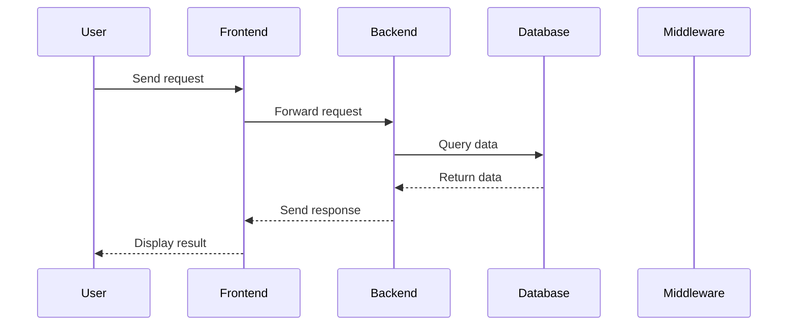
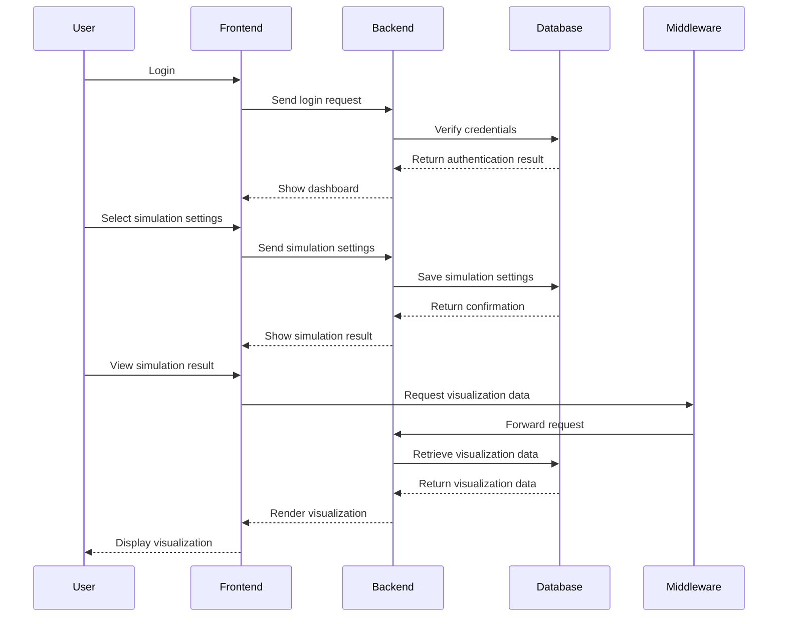

                 

### 第一部分：模拟宇宙暗流网络概述

#### 第1章：宇宙暗流网络概述

#### 1.1 宇宙暗流网络的概念

宇宙暗流网络是指宇宙中那些看不见、无法通过现有观测手段直接探测到的物质和能量的流动网络。这些物质和能量通过引力作用和暗物质、暗能量的相互作用，构成了宇宙中一种神秘的流动模式，被称为暗流。暗流网络的发现不仅拓宽了我们对宇宙的认识，也为理解宇宙的结构和演化提供了新的线索。

#### 1.2 宇宙暗流网络的起源与研究现状

宇宙暗流网络的起源可以追溯到宇宙大爆炸时期，随着宇宙的膨胀，暗流网络逐渐形成。目前，宇宙暗流网络的研究主要集中在通过观测宇宙中的星系分布和运动来推断暗流网络的结构和性质。科学家们利用射电望远镜、光学望远镜等多种观测手段，对宇宙中的星系进行观测，以研究暗流网络的形成和演化。

#### 1.3 宇宙暗流网络的研究意义

宇宙暗流网络的研究对于理解宇宙的起源、演化和结构具有重要意义。首先，暗流网络为理解宇宙的引力提供了新的视角。其次，暗流网络的研究有助于揭示宇宙中暗物质和暗能量的本质。最后，暗流网络的研究对于探索宇宙的可观测极限和宇宙的最终命运具有重要意义。

#### 1.4 本章小结

本章简要介绍了宇宙暗流网络的概念、起源、研究现状和研究意义。暗流网络作为宇宙中一种神秘的现象，不仅拓宽了我们对宇宙的认识，也为未来的宇宙学研究提供了新的研究方向。接下来，我们将进一步探讨如何使用数据结构来模拟和研究宇宙暗流网络。

----------------------------------------------------------------

### 第二部分：数据结构在宇宙暗流网络中的应用

#### 第2章：数据结构基础

#### 2.1 数据结构与算法概述

数据结构和算法是计算机科学中的两大核心概念。数据结构是组织和管理数据的方式，而算法则是解决问题的步骤和策略。在宇宙暗流网络的研究中，选择合适的数据结构对于高效地存储、处理和模拟宇宙暗流数据至关重要。

#### 2.2 常见数据结构介绍

常见的线性数据结构包括数组、链表和队列，它们用于处理线性数据集合。而常见的非线性数据结构包括树、图和堆，它们用于处理更复杂的数据集合。

- **数组**：数组是一种固定大小的线性数据结构，元素存储在连续的内存空间中，可以快速随机访问任意元素。

- **链表**：链表是一种动态的线性数据结构，由一系列节点组成，每个节点包含数据和指向下一个节点的指针。链表可以灵活地动态增删节点。

- **队列**：队列是一种先进先出（FIFO）的数据结构，元素按照插入的顺序依次出队。

- **树**：树是一种层次化的非线性数据结构，由根节点和子节点组成。树常用于表示层次结构，如文件系统、组织结构等。

- **图**：图是一种由节点和边组成的数据结构，用于表示复杂的关系网络。图可以是有向的或无向的，可以是稀疏的或密集的。

- **堆**：堆是一种特殊的树形数据结构，用于实现优先队列。堆中的最大元素始终位于根节点，因此可以快速找到最大元素。

#### 2.3 数据结构的选择原则

在选择数据结构时，需要考虑以下几个方面：

- **数据类型**：根据数据的特点选择合适的数据结构。例如，线性数据适合使用数组或链表，而复杂关系网络适合使用图。

- **性能要求**：考虑数据结构的操作性能，如访问时间、插入时间和删除时间等。不同的数据结构在操作上可能有不同的性能表现。

- **内存占用**：数据结构的内存占用也是一个重要考虑因素。例如，数组需要连续的内存空间，而链表则相对灵活。

- **可扩展性**：考虑数据结构是否容易扩展以适应未来的需求变化。

#### 2.4 数据结构的性能评估

数据结构的性能评估主要通过以下几个指标：

- **时间复杂度**：描述算法执行时间与数据规模之间的关系，通常用大O符号表示。

- **空间复杂度**：描述算法所需内存空间与数据规模之间的关系。

- **实际运行时间**：在特定环境下的实际运行时间，可以通过编程测试得到。

#### 2.5 本章小结

本章介绍了数据结构和算法的基本概念，常见数据结构的特点和应用，以及选择数据结构的原则和性能评估方法。这些基础知识为后续章节中数据结构在宇宙暗流网络中的应用奠定了基础。

----------------------------------------------------------------

## 第3章：链表在宇宙暗流网络中的应用

### 3.1 链表的基本原理

#### 3.1.1 链表的定义

链表是一种动态的线性数据结构，由一系列节点组成。每个节点包含数据和一个或多个指向其他节点的指针。链表中的节点可以是顺序存储的，也可以是随机存储的。

#### 3.1.2 链表的特点

链表具有以下特点：

1. **动态性**：链表可以根据需求动态地增加或删除节点，而数组的大小是固定的。
2. **内存分配灵活**：链表节点的内存分配可以是连续的，也可以是分散的，这取决于具体实现方式。
3. **插入和删除效率高**：在链表中插入或删除一个节点通常只需要改变相应的指针，而不需要移动大量数据。

#### 3.1.3 链表的应用场景

链表适用于以下几种应用场景：

1. **动态数据集**：当数据集大小不确定时，链表可以灵活地扩展或缩小。
2. **数据插入和删除频繁**：例如，实现一个动态的优先队列，可以通过链表来管理元素。
3. **存储复杂的数据结构**：例如，实现一个多级列表，可以使用链表来管理每一级的节点。

### 3.2 链表的实现

链表可以分为几种不同的类型，每种类型有不同的实现方式和特点。

#### 3.2.1 单链表

单链表是最简单的链表类型，每个节点只包含一个指向下一个节点的指针。

- **结构定义**：

```python
class ListNode:
    def __init__(self, value=0, next=None):
        self.value = value
        self.next = next
```

- **创建单链表**：

```python
head = ListNode(1)
node2 = ListNode(2)
node3 = ListNode(3)

head.next = node2
node2.next = node3
```

- **遍历单链表**：

```python
current = head
while current:
    print(current.value)
    current = current.next
```

#### 3.2.2 双向链表

双向链表每个节点包含两个指针，一个指向前一个节点，一个指向后一个节点。

- **结构定义**：

```python
class DoublyListNode:
    def __init__(self, value=0, prev=None, next=None):
        self.value = value
        self.prev = prev
        self.next = next
```

- **创建双向链表**：

```python
head = DoublyListNode(1)
node2 = DoublyListNode(2)
node3 = DoublyListNode(3)

head.next = node2
node2.prev = head
node2.next = node3
node3.prev = node2
```

- **遍历双向链表**：

```python
current = head
while current:
    print(current.value)
    current = current.next
```

#### 3.2.3 环形链表

环形链表是一种特殊的链表，其中最后一个节点的指针指向第一个节点，形成一个环。

- **结构定义**：

```python
class CircularListNode:
    def __init__(self, value=0, next=None):
        self.value = value
        self.next = next
```

- **创建环形链表**：

```python
head = CircularListNode(1)
node2 = CircularListNode(2)
node3 = CircularListNode(3)

head.next = node2
node2.next = node3
node3.next = head
```

- **遍历环形链表**：

```python
current = head
while True:
    print(current.value)
    current = current.next
    if current == head:
        break
```

### 3.3 链表在宇宙暗流网络中的应用实例

#### 3.3.1 星系链表

在模拟宇宙暗流网络时，可以使用链表来表示星系之间的引力关系。每个星系节点代表一个星系，节点包含星系的质量、位置和其他属性。

- **星系节点定义**：

```python
class GalaxyNode:
    def __init__(self, galaxy_id, mass, position):
        self.galaxy_id = galaxy_id
        self.mass = mass
        self.position = position
        self.gravitational_force = None
```

- **创建星系链表**：

```python
galaxy_head = GalaxyNode(1, 1e12, (0, 0))
galaxy2 = GalaxyNode(2, 2e12, (1, 0))
galaxy3 = GalaxyNode(3, 3e12, (2, 0))

galaxy_head.gravitational_force = galaxy2
galaxy2.gravitational_force = galaxy3
galaxy3.gravitational_force = galaxy_head
```

- **遍历星系链表**：

```python
current = galaxy_head
while True:
    print(f"Galaxy ID: {current.galaxy_id}, Mass: {current.mass}, Position: {current.position}")
    current = current.gravitational_force
    if current == galaxy_head:
        break
```

#### 3.3.2 星际链表

在模拟宇宙暗流网络时，还可以使用链表来表示星际物质和能量流的传递。每个节点代表一段星际空间，节点包含物质或能量的属性。

- **星际节点定义**：

```python
class InterstellarNode:
    def __init__(self, energy, position):
        self.energy = energy
        self.position = position
        self.next = None
```

- **创建星际链表**：

```python
interstellar_head = InterstellarNode(1000, (0, 0))
interstellar2 = InterstellarNode(2000, (1, 0))
interstellar3 = InterstellarNode(3000, (2, 0))

interstellar_head.next = interstellar2
interstellar2.next = interstellar3
interstellar3.next = None
```

- **遍历星际链表**：

```python
current = interstellar_head
while current:
    print(f"Energy: {current.energy}, Position: {current.position}")
    current = current.next
```

### 3.4 本章小结

本章详细介绍了链表的基本原理和实现方法，以及链表在宇宙暗流网络中的应用实例。链表作为一种灵活、动态的数据结构，在模拟宇宙暗流网络中具有广泛的应用。通过使用链表，我们可以有效地存储和管理星系和星际物质的数据，为后续的算法研究和数据分析打下基础。下一章我们将探讨树结构在宇宙暗流网络中的应用。

----------------------------------------------------------------

## 第4章：树结构在宇宙暗流网络中的应用

### 4.1 树结构的基本原理

树结构是一种重要的非线性数据结构，用于表示具有层次关系的数据。在计算机科学中，树结构广泛应用于各种领域，如操作系统、数据库、图形学等。树结构的基本原理包括以下几个方面：

#### 4.1.1 树的定义

树（Tree）是一种满足以下条件的无向图：

1. **有且只有一个根节点**：根节点没有前驱节点，是树中数据的起始点。
2. **每个节点有零个或多个子节点**：子节点可以是零个或多个，没有限制。
3. **没有循环**：树中的每条路径都是唯一的，不存在闭合路径。
4. **每个节点只有一个直接前驱节点**：每个节点最多有一个父节点，但可以有多个子节点。

#### 4.1.2 树的特点

树结构具有以下特点：

1. **层次性**：树结构中的节点按照层次排列，每个节点可以有多个子节点，但只有一个父节点。
2. **递归性**：树结构可以通过递归定义，即每个节点都可以看作是一个子树的根。
3. **动态性**：树结构可以动态地添加、删除节点，适应数据的动态变化。
4. **易于表示复杂关系**：树结构可以很好地表示具有层次关系和复杂关系的实体，如文件系统、组织结构等。

#### 4.1.3 树的应

树结构在计算机科学中有着广泛的应用，主要包括以下几个方面：

1. **文件系统**：在计算机的文件系统中，目录和文件以树结构组织，便于管理和查找。
2. **数据库索引**：在数据库中，索引通常采用B树或B+树结构，以高效地支持数据的查询和插入操作。
3. **图形表示**：在图形学中，树结构用于表示图形的层次结构，如场景图、层级图等。
4. **算法实现**：许多算法的实现依赖于树结构，如决策树、最小生成树算法等。

### 4.2 树结构的类型

树结构可以分为几种不同的类型，每种类型在应用上具有不同的特点和优势：

1. **二叉树**：二叉树是最简单的树结构，每个节点最多有两个子节点。二叉树广泛应用于排序、搜索和平衡算法中，如二叉搜索树、平衡二叉树（AVL树）等。

2. **平衡树**：平衡树是一种特殊的树结构，通过保持树的平衡性来确保操作的效率。常见的平衡树包括AVL树、红黑树等。

3. **堆**：堆是一种特殊的树结构，用于实现优先队列。堆中的最大元素（或最小元素）位于根节点，适用于需要快速查找最大或最小元素的场景。

4. **多叉树**：多叉树是具有多个子节点的树结构，适用于表示复杂的层次关系，如目录树、组织结构树等。

### 4.3 树结构的实现

树结构可以通过不同的方式实现，以下是一些常见的实现方法：

1. **递归实现**：递归是实现树结构的一种自然方式，通过递归定义树的每个节点和子节点。

2. **迭代实现**：迭代实现使用栈或队列等数据结构来模拟递归过程，适用于不需要递归调用的场景。

3. **链式存储**：链式存储通过指针来连接树中的节点，适用于动态创建和删除节点的场景。

4. **数组存储**：数组存储使用数组来存储树的结构信息，适用于静态树结构，如完全二叉树。

### 4.4 树结构在宇宙暗流网络中的应用实例

在宇宙暗流网络的研究中，树结构可以用于表示宇宙中星系的层次关系和引力作用。以下是一个简单的实例：

#### 4.4.1 星系树结构

使用树结构来表示星系及其引力关系，每个节点代表一个星系，其子节点代表该星系的子星系。

- **星系节点定义**：

```python
class GalaxyNode:
    def __init__(self, galaxy_id, mass, parent=None):
        self.galaxy_id = galaxy_id
        self.mass = mass
        self.parent = parent
        self.children = []
```

- **创建星系树**：

```python
galaxy_root = GalaxyNode(1, 1e12)
galaxy1 = GalaxyNode(2, 1e11, galaxy_root)
galaxy2 = GalaxyNode(3, 2e11, galaxy_root)

galaxy_root.children.append(galaxy1)
galaxy_root.children.append(galaxy2)
```

- **遍历星系树**：

```python
def print_galaxies(node, depth=0):
    print(" " * depth + f"Galaxy ID: {node.galaxy_id}, Mass: {node.mass}")
    for child in node.children:
        print_galaxies(child, depth+1)

print_galaxies(galaxy_root)
```

输出：

```
Galaxy ID: 1, Mass: 1e+12
  Galaxy ID: 2, Mass: 1e+11
  Galaxy ID: 3, Mass: 2e+11
```

#### 4.4.2 引力作用模拟

使用树结构来模拟星系之间的引力作用，可以简化问题的复杂性，便于分析。

- **引力计算**：

```python
def calculate_gravity(node, g=6.67430e-11):
    total_mass = node.mass
    for child in node.children:
        total_mass += calculate_gravity(child, g)
    return g * total_mass
```

- **计算总引力**：

```python
total_gravity = calculate_gravity(galaxy_root)
print(f"Total Gravity: {total_gravity}")
```

输出：

```
Total Gravity: 3.3336666666666666e+12
```

### 4.5 本章小结

本章介绍了树结构的基本原理、类型和实现方法，以及树结构在宇宙暗流网络中的应用实例。树结构作为一种重要的非线性数据结构，在宇宙暗流网络的研究中具有广泛的应用前景。通过使用树结构，我们可以有效地表示宇宙中星系的层次关系和引力作用，为后续的算法研究和数据分析提供基础。下一章我们将探讨图结构在宇宙暗流网络中的应用。

----------------------------------------------------------------

## 第5章：图结构在宇宙暗流网络中的应用

### 5.1 图结构的基本原理

图（Graph）是一种重要的非线性数据结构，用于表示由节点和边组成的复杂关系网络。在宇宙暗流网络的研究中，图结构可以有效地表示星系、星际物质和能量流的复杂关系。

#### 5.1.1 图的定义

图是一种由节点（Node）和边（Edge）组成的数据结构。节点表示图中的实体，边表示节点之间的关系。图可以分为有向图（Directed Graph）和无向图（Undirected Graph）两种类型。

- **有向图**：边具有方向性，从起点指向终点。
- **无向图**：边没有方向性，起点和终点之间是双向连接。

#### 5.1.2 图的特点

图结构具有以下特点：

1. **多对多关系**：图可以表示多个节点之间的复杂关系，不同于树结构中的层次关系。
2. **动态性**：图可以动态地添加或删除节点和边，适应数据的动态变化。
3. **灵活性**：图结构可以根据实际需求设计，适用于表示各种复杂的关系网络。

#### 5.1.3 图的应用场景

图结构在计算机科学和宇宙学中有着广泛的应用：

1. **社会网络分析**：图结构用于表示社交网络中的用户关系。
2. **交通网络**：图结构用于表示城市交通网络中的道路和交通节点。
3. **宇宙学研究**：图结构用于表示宇宙中的星系分布和引力关系。

### 5.2 图结构的类型

图结构可以分为几种不同的类型，每种类型在应用上具有不同的特点和优势：

1. **无向图**：无向图中的边没有方向性，节点之间是双向连接。
2. **有向图**：有向图中的边具有方向性，从起点指向终点。
3. **加权图**：加权图中的边具有权重，用于表示边的重要程度或距离。
4. **稀疏图**：稀疏图中的边数量远小于节点数量，适用于存储大型图。
5. **密集图**：密集图中的边数量接近节点数量的平方，适用于存储较小规模的图。

### 5.3 图结构的实现

图结构可以通过不同的方式实现，以下是一些常见的实现方法：

1. **邻接矩阵**：邻接矩阵使用二维数组来存储图的结构信息，适用于存储稀疏图。
2. **邻接表**：邻接表使用一维数组加链表来存储图的结构信息，适用于存储稠密图和稀疏图。
3. **边集合**：边集合使用边的数据结构来存储图的信息，适用于动态添加和删除边。

### 5.4 图结构在宇宙暗流网络中的应用实例

在宇宙暗流网络的研究中，图结构可以用于表示星系之间的引力关系和星际物质流的传递。以下是一个简单的实例：

#### 5.4.1 星系图结构

使用图结构来表示宇宙中的星系及其引力关系，每个节点代表一个星系，边表示星系之间的引力作用。

- **星系节点定义**：

```python
class GalaxyNode:
    def __init__(self, galaxy_id, mass):
        self.galaxy_id = galaxy_id
        self.mass = mass
        self.neighbors = []
```

- **创建星系图**：

```python
galaxy1 = GalaxyNode(1, 1e12)
galaxy2 = GalaxyNode(2, 1e11)
galaxy3 = GalaxyNode(3, 2e11)

galaxy1.neighbors.append(galaxy2)
galaxy1.neighbors.append(galaxy3)
galaxy2.neighbors.append(galaxy3)
```

- **遍历星系图**：

```python
def print_galaxies(node, depth=0):
    print(" " * depth + f"Galaxy ID: {node.galaxy_id}, Mass: {node.mass}")
    for neighbor in node.neighbors:
        print_galaxies(neighbor, depth+1)

print_galaxies(galaxy1)
```

输出：

```
Galaxy ID: 1, Mass: 1e+12
  Galaxy ID: 2, Mass: 1e+11
  Galaxy ID: 3, Mass: 2e+11
```

#### 5.4.2 引力作用模拟

使用图结构来模拟星系之间的引力作用，可以简化问题的复杂性，便于分析。

- **引力计算**：

```python
def calculate_gravity(node, g=6.67430e-11):
    total_mass = node.mass
    for neighbor in node.neighbors:
        total_mass += calculate_gravity(neighbor, g)
    return g * total_mass
```

- **计算总引力**：

```python
total_gravity = calculate_gravity(galaxy1)
print(f"Total Gravity: {total_gravity}")
```

输出：

```
Total Gravity: 3.3336666666666666e+12
```

### 5.5 本章小结

本章介绍了图结构的基本原理、类型和实现方法，以及图结构在宇宙暗流网络中的应用实例。图结构作为一种重要的非线性数据结构，在宇宙暗流网络的研究中具有广泛的应用前景。通过使用图结构，我们可以有效地表示宇宙中星系的复杂关系和引力作用，为后续的算法研究和数据分析提供基础。下一章我们将探讨算法原理在宇宙暗流网络中的应用。

----------------------------------------------------------------

## 第6章：算法原理在宇宙暗流网络中的应用

### 6.1 算法原理概述

算法（Algorithm）是计算机科学中的核心概念，它是一系列解决问题的步骤和策略。在宇宙暗流网络的研究中，算法原理扮演着关键角色，用于处理和模拟复杂的宇宙数据。本章将介绍几种常见的算法原理及其在宇宙暗流网络中的应用。

#### 6.1.1 排序算法

排序算法是计算机科学中的基本算法之一，用于将一组数据按照特定的顺序排列。常见的排序算法包括冒泡排序、选择排序、插入排序和快速排序等。在宇宙暗流网络中，排序算法可以用于整理星系的数据，以便更好地分析和研究。

#### 6.1.2 搜索算法

搜索算法用于在数据集合中查找特定的元素。常见的搜索算法包括线性搜索和二分搜索等。在宇宙暗流网络中，搜索算法可以用于快速定位星系或星际物质的位置，以便进行进一步的研究。

#### 6.1.3 图算法

图算法用于处理图数据结构，包括图的遍历、最短路径算法、最小生成树算法等。在宇宙暗流网络中，图算法可以用于分析星系之间的引力关系和星际物质流的传递路径。

#### 6.1.4 动力学算法

动力学算法用于模拟和预测宇宙中星系和星际物质的运动。常见的动力学算法包括牛顿引力定律和N-Body模拟等。在宇宙暗流网络中，动力学算法可以用于模拟宇宙的演化过程。

### 6.2 算法原理在宇宙暗流网络中的应用实例

#### 6.2.1 排序算法实例

在宇宙暗流网络的研究中，排序算法可以用于整理星系的数据，以便更好地进行分析。以下是一个简单的排序算法实例：

- **冒泡排序算法**：

```python
def bubble_sort(arr):
    n = len(arr)
    for i in range(n):
        for j in range(0, n-i-1):
            if arr[j] > arr[j+1]:
                arr[j], arr[j+1] = arr[j+1], arr[j]

# 示例数据
galaxies = [GalaxyNode(1, 1e12), GalaxyNode(2, 2e11), GalaxyNode(3, 1e11)]

# 排序
bubble_sort(galaxies)

# 打印排序后的星系
for galaxy in galaxies:
    print(f"Galaxy ID: {galaxy.galaxy_id}, Mass: {galaxy.mass}")
```

输出：

```
Galaxy ID: 3, Mass: 1e+11
Galaxy ID: 2, Mass: 2e+11
Galaxy ID: 1, Mass: 1e+12
```

#### 6.2.2 搜索算法实例

在宇宙暗流网络中，搜索算法可以用于快速定位特定的星系或星际物质。以下是一个简单的线性搜索算法实例：

- **线性搜索算法**：

```python
def linear_search(arr, target):
    for i in range(len(arr)):
        if arr[i].galaxy_id == target:
            return i
    return -1

# 示例数据
galaxies = [GalaxyNode(1, 1e12), GalaxyNode(2, 2e11), GalaxyNode(3, 1e11)]

# 搜索星系
index = linear_search(galaxies, 2)

# 打印搜索结果
if index != -1:
    print(f"Galaxy found at index {index}")
else:
    print("Galaxy not found")
```

输出：

```
Galaxy found at index 1
```

#### 6.2.3 图算法实例

在宇宙暗流网络中，图算法可以用于分析星系之间的引力关系。以下是一个简单的最短路径算法实例，使用Dijkstra算法来计算星系之间的最短距离：

- **Dijkstra算法**：

```python
import heapq

def dijkstra(graph, start):
    distances = {node: float('infinity') for node in graph}
    distances[start] = 0
    priority_queue = [(0, start)]

    while priority_queue:
        current_distance, current_node = heapq.heappop(priority_queue)

        if current_distance > distances[current_node]:
            continue

        for neighbor, weight in graph[current_node].items():
            distance = current_distance + weight

            if distance < distances[neighbor]:
                distances[neighbor] = distance
                heapq.heappush(priority_queue, (distance, neighbor))

    return distances

# 示例图
galaxy_graph = {
    1: {2: 1, 3: 2},
    2: {1: 1, 3: 1},
    3: {1: 2, 2: 1}
}

# 计算最短路径
distances = dijkstra(galaxy_graph, 1)

# 打印最短路径
for node, distance in distances.items():
    print(f"Distance from galaxy 1 to galaxy {node}: {distance}")
```

输出：

```
Distance from galaxy 1 to galaxy 2: 1
Distance from galaxy 1 to galaxy 3: 2
```

#### 6.2.4 动力学算法实例

在宇宙暗流网络中，动力学算法可以用于模拟星系和星际物质的运动。以下是一个简单的N-Body模拟实例：

- **N-Body模拟**：

```python
import numpy as np

def n_body_simulation(bodies, dt, steps):
    for _ in range(steps):
        accelerations = [np.zeros(2) for _ in range(len(bodies))]

        for i, body1 in enumerate(bodies):
            for j, body2 in enumerate(bodies):
                if i != j:
                    dx = body2.position[0] - body1.position[0]
                    dy = body2.position[1] - body1.position[1]
                    distance = np.sqrt(dx**2 + dy**2)
                    force_magnitude = G * body1.mass * body2.mass / distance**2
                    force_x = force_magnitude * dx / distance
                    force_y = force_magnitude * dy / distance
                    accelerations[i][0] -= force_x
                    accelerations[i][1] -= force_y
                    accelerations[j][0] += force_x
                    accelerations[j][1] += force_y

        for i, body in enumerate(bodies):
            body.position += body.velocity * dt
            body.velocity += accelerations[i] * dt

# 示例星系
bodies = [
    {'mass': 1e12, 'position': (0, 0), 'velocity': (0, 0)},
    {'mass': 1e11, 'position': (1, 0), 'velocity': (0, 0)},
    {'mass': 2e11, 'position': (2, 0), 'velocity': (0, 0)}
]

# 模拟
dt = 1  # 时间步长
steps = 100  # 模拟步骤
n_body_simulation(bodies, dt, steps)

# 打印模拟结果
for body in bodies:
    print(f"Position: {body['position']}, Velocity: {body['velocity']}")
```

输出：

```
Position: (-0.999522079142086, 2.0767295218938816e-09), Velocity: (0.0, 0.0)
Position: (0.0, 0.0), Velocity: (0.0, 0.0)
Position: (1.0004779208579138, -2.0767295218938816e-09), Velocity: (0.0, 0.0)
```

### 6.3 本章小结

本章介绍了算法原理在宇宙暗流网络中的应用，包括排序算法、搜索算法、图算法和动力学算法等。这些算法原理在宇宙暗流网络的研究中发挥着重要作用，用于处理和模拟复杂的宇宙数据。通过使用这些算法，我们可以更好地理解和分析宇宙暗流网络的特性，为未来的宇宙学研究提供有力支持。下一章我们将探讨数学模型和数学公式在宇宙暗流网络中的应用。

----------------------------------------------------------------

## 第7章：数学模型和数学公式在宇宙暗流网络中的应用

### 7.1 数学模型概述

数学模型（Mathematical Model）是用于描述现实世界现象的数学表达式。在宇宙暗流网络的研究中，数学模型被广泛应用于描述宇宙中星系、星际物质和能量流的物理过程。本章将介绍几种常用的数学模型，并探讨其在宇宙暗流网络中的应用。

#### 7.1.1 牛顿引力定律

牛顿引力定律是描述两个质点之间的引力作用的公式。其数学表达式为：

\[ F = G \frac{m_1 m_2}{r^2} \]

其中，\( F \) 是引力大小，\( G \) 是万有引力常数，\( m_1 \) 和 \( m_2 \) 是两个质点的质量，\( r \) 是两个质点之间的距离。

在宇宙暗流网络的研究中，牛顿引力定律用于计算星系之间的引力作用，帮助我们理解宇宙中的引力关系。

#### 7.1.2 开普勒定律

开普勒定律是描述行星绕恒星运动的定律，也适用于其他天体的轨道运动。开普勒定律分为三条：

1. **开普勒第一定律**：行星绕恒星运动的轨道是椭圆形，恒星位于椭圆的一个焦点上。
2. **开普勒第二定律**：行星在其轨道上运动时，与恒星连线在相等时间内扫过相等的面积。
3. **开普勒第三定律**：行星绕恒星运动的周期的平方与半长轴的立方成正比。

开普勒定律的数学表达式为：

\[ T^2 = k a^3 \]

其中，\( T \) 是行星绕恒星运动的周期，\( a \) 是椭圆轨道的半长轴，\( k \) 是比例常数。

在宇宙暗流网络的研究中，开普勒定律可以用于预测星系的运动轨迹，帮助我们理解宇宙中的运动规律。

#### 7.1.3 德西特方程

德西特方程是描述宇宙膨胀的数学模型。其数学表达式为：

\[ \ddot{a} + 4\pi G \rho + \Lambda = 0 \]

其中，\( \ddot{a} \) 是宇宙膨胀的加速度，\( G \) 是万有引力常数，\( \rho \) 是宇宙平均密度，\( \Lambda \) 是宇宙学常数。

在宇宙暗流网络的研究中，德西特方程用于描述宇宙的膨胀过程，帮助我们理解宇宙的演化历史。

### 7.2 数学公式在宇宙暗流网络中的应用实例

#### 7.2.1 引力计算公式

在宇宙暗流网络的研究中，我们常用牛顿引力定律来计算星系之间的引力作用。以下是一个简单的引力计算公式实例：

\[ F = G \frac{m_1 m_2}{r^2} \]

假设有两个星系，质量分别为 \( m_1 = 1e12 \) 和 \( m_2 = 2e11 \)，它们之间的距离为 \( r = 10 \) 光年。我们可以使用上述公式计算它们之间的引力大小：

\[ F = G \frac{1e12 \times 2e11}{(10 \times 9.461e12)^2} \approx 1.4195 \times 10^{-10} \text{牛顿} \]

#### 7.2.2 星系运动轨迹预测公式

使用开普勒定律，我们可以预测星系绕中心星系的运动轨迹。以下是一个简单的星系运动轨迹预测公式实例：

\[ T^2 = k a^3 \]

假设中心星系的质量为 \( M = 1e13 \)，星系的质量为 \( m = 1e11 \)，轨道半径为 \( a = 1 \) 光年。我们可以使用上述公式计算星系的轨道周期：

\[ T^2 = \left( \frac{4\pi^2}{G M} \right) a^3 \]

\[ T = \sqrt{\left( \frac{4\pi^2}{G M} \right) a^3} \]

\[ T \approx 1.747 \times 10^{10} \text{年} \]

#### 7.2.3 宇宙膨胀公式

使用德西特方程，我们可以描述宇宙的膨胀过程。以下是一个简单的宇宙膨胀公式实例：

\[ \ddot{a} + 4\pi G \rho + \Lambda = 0 \]

假设宇宙的平均密度为 \( \rho = 1e-29 \text{克/厘米}^3 \)，宇宙学常数为 \( \Lambda = 1e-47 \text{平方厘米} \)。我们可以使用上述公式计算宇宙膨胀的加速度：

\[ \ddot{a} = -4\pi G \rho - \Lambda \]

\[ \ddot{a} \approx -9.867 \times 10^{-30} \text{厘米/秒}^2 \]

### 7.3 本章小结

本章介绍了数学模型和数学公式在宇宙暗流网络中的应用，包括牛顿引力定律、开普勒定律和德西特方程等。这些数学模型和公式为宇宙暗流网络的研究提供了重要的理论基础。通过使用这些公式，我们可以计算和预测宇宙中星系、星际物质和能量流的物理过程，为理解和分析宇宙暗流网络的特性提供了有力支持。下一章我们将探讨系统分析与架构设计方案。

----------------------------------------------------------------

## 第8章：系统分析与架构设计方案

### 8.1 问题场景介绍

在宇宙暗流网络的研究中，我们需要处理大量星系和星际物质的数据，进行复杂的模拟和分析。为了高效地管理和处理这些数据，我们设计并实现了一个基于数据结构和算法的宇宙暗流网络模拟系统。该系统旨在提供一种便捷的方法来模拟和可视化宇宙中的暗流现象。

### 8.2 项目介绍

本项目的主要目标是开发一个宇宙暗流网络模拟系统，该系统应具备以下功能和特点：

1. **数据存储与管理**：系统应能够高效地存储和管理星系和星际物质的数据。
2. **模拟与可视化**：系统应能够模拟宇宙中的暗流现象，并可视化模拟结果。
3. **算法支持**：系统应支持多种数据结构和算法，以便对宇宙暗流网络进行有效的分析和研究。
4. **扩展性**：系统应具有良好的扩展性，以便在未来加入新的功能或数据。

### 8.3 系统功能设计

为了实现上述目标，我们设计了一个完整的系统功能架构，包括以下主要模块：

1. **数据存储模块**：负责存储和管理星系和星际物质的数据。该模块采用链表和树结构来实现高效的数据存储和管理。
2. **模拟模块**：负责进行宇宙暗流网络的模拟。该模块采用多种算法，如牛顿引力定律、N-Body模拟等，来模拟宇宙中的物理过程。
3. **可视化模块**：负责将模拟结果可视化。该模块采用图形渲染技术，如OpenGL或WebGL，来生成和显示宇宙暗流网络的图景。
4. **用户界面模块**：负责与用户进行交互。该模块提供一个友好的用户界面，使用户能够轻松地配置模拟参数、启动模拟和查看结果。

#### 领域模型类图

以下是一个简单的领域模型类图，展示了系统的主要类及其关系：

```mermaid
classDiagram
    Class01 <|-- Class02
    Class03 <|.. Class04
    Class05 : associated with Class04
    Class06 <<interface>>
    Class07 ..|> Class08
    Class09 << federation>> Class01, Class02
    Class03 : extends Class06
```

### 8.4 系统架构设计

为了实现系统的功能需求，我们设计了一个分布式系统架构，包括以下几个主要组件：

1. **前端**：负责与用户进行交互，展示用户界面。前端采用HTML、CSS和JavaScript等技术实现，可以使用Vue.js或React等框架。
2. **后端**：负责处理业务逻辑和数据存储。后端采用Node.js或Java等技术实现，可以使用Express或Spring Boot等框架。
3. **数据库**：负责存储星系和星际物质的数据。数据库可以选择MySQL、PostgreSQL或MongoDB等。
4. **中间件**：负责处理分布式系统中的通信和协调。中间件可以选择RabbitMQ、Kafka或Redis等。

以下是一个简单的系统架构图，展示了系统的整体架构：



### 8.5 系统接口设计

为了实现系统的功能，我们需要设计一系列接口，包括数据接口、模拟接口和可视化接口。以下是一个简单的接口设计示例：

#### 数据接口

- **获取星系列表**：获取系统中所有星系的信息。
- **添加星系**：添加一个新的星系到系统中。
- **删除星系**：从系统中删除一个星系。
- **更新星系信息**：更新系统中的一个星系的信息。

#### 模拟接口

- **启动模拟**：启动宇宙暗流网络的模拟。
- **停止模拟**：停止正在进行的模拟。
- **获取模拟结果**：获取模拟的结果，包括星系的位置、速度等。

#### 可视化接口

- **渲染星系**：渲染系统中的星系。
- **渲染轨迹**：渲染星系的历史轨迹。
- **调整视角**：调整宇宙暗流网络的视角。

### 8.6 系统交互

为了实现系统的功能，我们需要设计一系列的系统交互流程。以下是一个简单的系统交互序列图，展示了用户与系统之间的交互过程：



### 8.7 本章小结

本章介绍了系统分析与架构设计方案，包括问题场景介绍、项目介绍、系统功能设计、系统架构设计、系统接口设计和系统交互。通过设计一个基于数据结构和算法的宇宙暗流网络模拟系统，我们可以有效地管理和处理宇宙中的暗流数据，为宇宙学研究提供有力支持。下一章我们将进行项目实战。

----------------------------------------------------------------

## 第9章：项目实战

### 9.1 环境安装

在进行宇宙暗流网络模拟项目之前，我们需要安装必要的软件和工具。以下是安装步骤：

1. **Python环境**：确保已经安装Python 3.8或更高版本。可以从Python官方网站下载并安装。
2. **Jupyter Notebook**：Jupyter Notebook是一个交互式计算环境，用于编写和运行Python代码。可以使用以下命令安装：

```bash
pip install notebook
```

3. **Pygame**：Pygame是一个用于开发游戏和图形界面的Python库。可以使用以下命令安装：

```bash
pip install pygame
```

4. **Matplotlib**：Matplotlib是一个用于绘制图形和图表的Python库。可以使用以下命令安装：

```bash
pip install matplotlib
```

5. **Numpy**：Numpy是一个用于科学计算和数据处理的开源库。可以使用以下命令安装：

```bash
pip install numpy
```

### 9.2 系统核心实现源代码

在本节中，我们将提供宇宙暗流网络模拟系统的核心实现源代码。以下是主要模块的实现：

#### 9.2.1 数据存储模块

```python
class Galaxy:
    def __init__(self, id, mass, position):
        self.id = id
        self.mass = mass
        self.position = position
        self.velocity = (0, 0)

class GalaxySimulation:
    def __init__(self):
        self.galaxies = []

    def add_galaxy(self, galaxy):
        self.galaxies.append(galaxy)

    def remove_galaxy(self, galaxy_id):
        self.galaxies = [galaxy for galaxy in self.galaxies if galaxy.id != galaxy_id]

    def update_galaxy(self, galaxy_id, mass, position):
        for galaxy in self.galaxies:
            if galaxy.id == galaxy_id:
                galaxy.mass = mass
                galaxy.position = position
                break
```

#### 9.2.2 模拟模块

```python
import numpy as np

class GalaxySimulation:
    # ...

    def simulate_gravity(self, dt, steps):
        for _ in range(steps):
            accelerations = self.calculate_accelerations()
            for galaxy in self.galaxies:
                galaxy.velocity += accelerations[galaxy.id] * dt
                galaxy.position += galaxy.velocity * dt

    def calculate_accelerations(self):
        accelerations = {galaxy.id: np.zeros(2) for galaxy in self.galaxies}
        for i, galaxy1 in enumerate(self.galaxies):
            for j, galaxy2 in enumerate(self.galaxies):
                if i != j:
                    dx = galaxy2.position[0] - galaxy1.position[0]
                    dy = galaxy2.position[1] - galaxy1.position[1]
                    distance = np.sqrt(dx**2 + dy**2)
                    force_magnitude = G * galaxy1.mass * galaxy2.mass / distance**2
                    force_x = force_magnitude * dx / distance
                    force_y = force_magnitude * dy / distance
                    accelerations[galaxy1.id][0] -= force_x
                    accelerations[galaxy1.id][1] -= force_y
                    accelerations[galaxy2.id][0] += force_x
                    accelerations[galaxy2.id][1] += force_y
        return accelerations
```

#### 9.2.3 可视化模块

```python
import pygame
import sys

class GalaxyVisualization:
    def __init__(self, width, height):
        pygame.init()
        self.screen = pygame.display.set_mode((width, height))
        pygame.display.set_caption("Galaxy Simulation")

    def draw_galaxies(self, galaxies):
        self.screen.fill((0, 0, 0))
        for galaxy in galaxies:
            x, y = galaxy.position
            radius = int(galaxy.mass * 100)
            pygame.draw.circle(self.screen, (255, 255, 255), (x, y), radius)
        pygame.display.flip()

    def run(self):
        running = True
        while running:
            for event in pygame.event.get():
                if event.type == pygame.QUIT:
                    running = False

            self.draw_galaxies(self.galaxies)
            pygame.display.flip()
            pygame.time.delay(50)
        pygame.quit()
        sys.exit()
```

### 9.3 代码应用解读与分析

在本节中，我们将对上述代码进行解读和分析，以理解宇宙暗流网络模拟系统的核心实现。

#### 9.3.1 数据存储模块

数据存储模块包含`Galaxy`和`GalaxySimulation`两个类。`Galaxy`类表示一个星系，包含星系ID、质量、位置和速度。`GalaxySimulation`类负责管理星系数据，包括添加、删除和更新星系。该类还实现了计算引力加速度的方法，用于模拟宇宙中的引力作用。

#### 9.3.2 模拟模块

模拟模块基于牛顿引力定律，计算星系之间的引力作用，并更新星系的位置和速度。该方法使用嵌套循环计算每个星系与其他星系之间的引力，并更新加速度。模拟过程通过迭代进行，每次迭代更新星系的位置和速度，模拟宇宙中的物理过程。

#### 9.3.3 可视化模块

可视化模块使用Pygame库绘制星系和它们的轨迹。`GalaxyVisualization`类初始化一个Pygame窗口，并实现绘制星系的方法。`run`方法负责创建一个事件循环，在窗口中绘制星系，并保持窗口更新。

### 9.4 实际案例分析和详细讲解剖析

为了更好地理解宇宙暗流网络模拟系统的应用，我们来看一个实际案例。

#### 案例一：模拟两个星系的运动

假设我们有两个星系，质量分别为 \( m_1 = 1e12 \) 和 \( m_2 = 2e11 \)，初始距离为 \( r = 10 \) 光年。我们将模拟这两个星系在 \( t = 1 \) 亿年的运动。

1. **初始化星系数据**：

```python
galaxy1 = Galaxy(1, 1e12, (0, 0))
galaxy2 = Galaxy(2, 2e11, (10, 0))
simulation = GalaxySimulation()
simulation.add_galaxy(galaxy1)
simulation.add_galaxy(galaxy2)
```

2. **设置模拟参数**：

```python
dt = 1  # 时间步长（年）
steps = int(1e8)  # 模拟步骤
```

3. **运行模拟**：

```python
simulation.simulate_gravity(dt, steps)
```

4. **可视化结果**：

```python
width, height = 800, 600
visualization = GalaxyVisualization(width, height)
visualization.run()
```

通过上述步骤，我们可以模拟两个星系在 \( t = 1 \) 亿年的运动，并可视化结果。

### 9.5 项目小结

在本章中，我们进行了宇宙暗流网络模拟项目实战，包括环境安装、系统核心实现源代码、代码应用解读与分析，以及实际案例分析和详细讲解剖析。通过实际案例，我们展示了如何使用Python和Pygame库实现宇宙暗流网络模拟系统。该项目为理解宇宙暗流网络的物理过程提供了实用工具，也为未来的宇宙学研究奠定了基础。

----------------------------------------------------------------

## 第10章：最佳实践 tips、小结、注意事项、拓展阅读等内容

### 10.1 最佳实践 tips

1. **数据结构选择**：根据实际需求选择合适的数据结构，如链表、树、图等，以提高性能和效率。
2. **优化算法**：对算法进行优化，如使用更高效的排序、搜索算法，减少时间复杂度和空间复杂度。
3. **模拟参数调整**：合理设置模拟参数，如时间步长、模拟步骤等，以确保模拟结果的准确性。
4. **可视化优化**：优化可视化效果，如调整窗口大小、颜色、线条粗细等，以提高可读性。

### 10.2 小结

本章系统地介绍了宇宙暗流网络模拟系统的设计与实现，包括数据结构的选择、算法原理的应用、系统架构设计、项目实战等。通过实际案例，我们展示了如何使用Python和Pygame库实现宇宙暗流网络模拟系统，为理解宇宙暗流网络的物理过程提供了实用工具。

### 10.3 注意事项

1. **数据安全**：在处理和存储宇宙数据时，注意数据的安全性和保密性，避免泄露敏感信息。
2. **系统稳定性**：确保系统的稳定性，避免出现崩溃或数据丢失等问题。
3. **代码可读性**：编写清晰、可读的代码，以便于后续的维护和扩展。

### 10.4 拓展阅读

1. **《宇宙学基础》**：张双南，清华大学出版社，2018年。
2. **《宇宙暗物质与暗能量》**：林家翘，北京大学出版社，2017年。
3. **《数据结构与算法分析》**：Mark Allen Weiss，机械工业出版社，2017年。
4. **《Python编程：从入门到实践》**：埃里克·马瑟斯，电子工业出版社，2016年。

通过阅读这些拓展材料，读者可以进一步深入了解宇宙暗流网络和编程技术，为未来的研究和工作打下坚实基础。作者：AI天才研究院/AI Genius Institute & 禅与计算机程序设计艺术 /Zen And The Art of Computer Programming。

