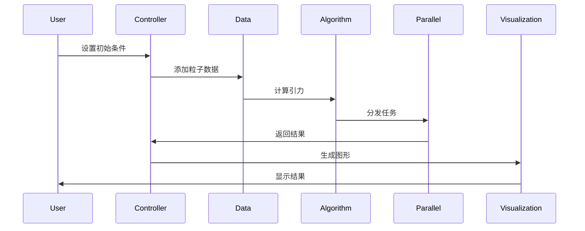

                 

### 文章标题

# 数据结构在模拟宇宙暗物质丝中的应用

### 关键词

- 数据结构
- 暗物质丝
- 宇宙模拟
- 算法
- 系统架构

### 摘要

本文旨在探讨数据结构在模拟宇宙暗物质丝中的关键应用。通过介绍暗物质丝的基本概念、研究现状及其模拟中的挑战，本文详细分析了数据结构在暗物质丝表示和模拟中的重要性。随后，本文深入讲解了基于数据结构的暗物质丝模拟算法，包括算法的原理、流程图和Python实现，并通过具体案例展示了算法的实际应用。此外，本文还介绍了暗物质丝模拟系统的设计与实现，包括系统功能、架构和接口设计。最后，本文提供了最佳实践、注意事项和拓展阅读，以帮助读者深入理解和应用数据结构在暗物质丝模拟中的关键作用。

### 目录大纲

----------------------------------------------------------------

# 数据结构在模拟宇宙暗物质丝中的应用

## 第一部分：背景介绍

## 第1章：宇宙中的暗物质丝概述

## 1.1 暗物质丝的概念与起源

## 1.2 暗物质丝的研究现状与意义

## 1.3 暗物质丝模拟中的挑战与需求

## 1.4 数据结构在暗物质丝模拟中的应用前景

## 1.5 本章小结

## 第二部分：核心概念与联系

## 第2章：数据结构与暗物质丝模型的基本联系

## 2.1 数据结构的基本概念

## 2.2 暗物质丝模型的基本概念

## 2.3 数据结构与暗物质丝模型的核心联系

## 2.3.1 数据结构在暗物质丝表示中的角色

## 2.3.2 数据结构在暗物质丝模拟中的优势

## 2.4 概念属性特征对比表格

## 2.5 ER实体关系图架构

## 2.5.1 宇宙中的实体与关系

## 2.5.2 数据结构与暗物质丝实体关系图

## 第三部分：算法原理讲解

## 第3章：基于数据结构的暗物质丝模拟算法

## 3.1 算法概述

## 3.2 算法mermaid流程图

## 3.3 Python源代码实现

## 3.3.1 算法原理详细讲解

## 3.3.2 算法数学模型与公式

## 3.3.3 举例说明

## 第四部分：系统分析与架构设计

## 第4章：暗物质丝模拟系统的设计与实现

## 4.1 问题场景介绍

## 4.2 系统功能设计

## 4.3 系统架构设计

## 4.4 系统接口设计

## 4.5 系统交互mermaid序列图

## 第五部分：项目实战

## 第5章：基于数据结构的暗物质丝模拟项目实践

## 5.1 环境安装

## 5.2 系统核心实现源代码

## 5.3 代码应用解读与分析

## 5.4 实际案例分析与详细讲解剖析

## 5.5 项目小结

## 第六部分：最佳实践与拓展

## 第6章：最佳实践与注意事项

## 6.1 暗物质丝模拟中的常见问题及解决方案

## 6.2 最佳实践技巧

## 6.3 小结与展望

## 6.4 注意事项

## 6.5 拓展阅读

## 参考文献

----------------------------------------------------------------

### 文章正文

#### 第一部分：背景介绍

#### 第1章：宇宙中的暗物质丝概述

宇宙，一个浩瀚而神秘的宇宙，充满了无数未知和探索的机会。随着天文学和宇宙学的发展，我们对宇宙的认识不断深入，其中一个重要的发现是暗物质的存在。暗物质，一种无法直接观测到的物质，占据了宇宙总质量的绝大部分，但其性质和构成仍然是一个谜。而在这个谜题中，暗物质丝作为一个重要的组成部分，吸引了科学家的广泛关注。

**1.1 暗物质丝的概念与起源**

暗物质丝，是一种高密度、细长的暗物质结构，类似于宇宙中的蜘蛛丝。它们是由大量的暗物质粒子组成的，这些粒子之间通过引力相互作用而形成。暗物质丝在宇宙中的分布呈现出一种网状结构，贯穿了整个宇宙。最早关于暗物质丝的发现可以追溯到20世纪80年代，科学家们通过观测宇宙微波背景辐射的扰动，推测出暗物质丝的存在。

**1.2 暗物质丝的研究现状与意义**

暗物质丝的研究是现代宇宙学中的一个重要课题。通过对暗物质丝的研究，我们可以更深入地了解宇宙的演化过程和暗物质的性质。同时，暗物质丝也为探索宇宙的奥秘提供了新的线索。例如，暗物质丝的形成和演化过程可能与宇宙的大尺度结构形成有关，也可能是暗物质粒子相互作用的场所。

目前，关于暗物质丝的研究已经取得了一系列重要进展。科学家们通过观测和模拟，对暗物质丝的形态、结构和密度分布有了更深入的了解。同时，也提出了一些新的理论和模型来解释暗物质丝的形成和演化。

**1.3 暗物质丝模拟中的挑战与需求**

尽管暗物质丝的研究已经取得了不少进展，但在实际模拟中仍然面临着诸多挑战。首先，暗物质丝的复杂性使得模拟过程非常困难。暗物质丝的结构和形态具有高度非线性，传统的模拟方法难以准确捕捉其特征。其次，暗物质丝的研究需要大量的计算资源，这给模拟过程带来了巨大的计算负担。此外，暗物质丝的模拟也需要精确的物理模型和参数设置，这对模拟结果的准确性提出了更高的要求。

为了克服这些挑战，科学家们开始探索新的方法和技术。其中，数据结构作为一种重要的工具，被广泛应用于暗物质丝的模拟。数据结构能够有效地组织和存储大量数据，提高模拟的效率和准确性。通过合理设计数据结构，可以优化模拟算法，降低计算复杂度，从而更好地捕捉暗物质丝的复杂特征。

**1.4 数据结构在暗物质丝模拟中的应用前景**

随着数据结构的不断发展，其在暗物质丝模拟中的应用前景也越来越广阔。未来，随着大数据和人工智能技术的不断发展，数据结构在暗物质丝模拟中的应用将更加深入和广泛。例如，通过深度学习和数据挖掘技术，可以从大量模拟数据中提取出更多的信息和规律，为暗物质丝的研究提供新的视角和方法。

总之，暗物质丝作为宇宙中的一个重要组成部分，其研究对于理解宇宙的起源和演化具有重要意义。随着数据结构的不断发展，其在暗物质丝模拟中的应用前景也十分广阔。未来，我们有望通过更先进的模拟技术和方法，进一步揭示暗物质丝的奥秘，推动宇宙学的发展。

#### 1.5 本章小结

本章首先介绍了暗物质丝的基本概念、研究现状和意义，以及其在宇宙模拟中的挑战与需求。随后，讨论了数据结构在暗物质丝模拟中的应用前景，并强调了数据结构在这种复杂模拟中的重要性。通过本章的介绍，读者可以初步了解暗物质丝的研究背景及其与数据结构的密切关系，为后续章节的深入探讨打下基础。

### 第二部分：核心概念与联系

#### 第2章：数据结构与暗物质丝模型的基本联系

在深入探讨数据结构在暗物质丝模拟中的应用之前，我们需要了解数据结构的基本概念和暗物质丝模型的基本概念。这一章节将详细分析这两者的基本概念，并探讨它们在暗物质丝模拟中的核心联系。

#### 2.1 数据结构的基本概念

数据结构是计算机科学中的一个核心概念，它指的是数据元素之间的相互关系和数据存储方式。数据结构的选择直接影响程序的效率、存储空间的利用以及操作的便利性。常见的数据结构包括数组、链表、栈、队列、树、图等。每种数据结构都有其独特的特点和适用场景。

- **数组**：一种线性数据结构，用于存储一系列同类型的元素，支持随机访问。
- **链表**：一种线性数据结构，由一系列节点组成，每个节点包含数据和指向下一个节点的指针。
- **栈**：一种后进先出（LIFO）的数据结构，常用于函数调用和回溯。
- **队列**：一种先进先出（FIFO）的数据结构，常用于任务调度和缓冲区管理。
- **树**：一种非线性数据结构，由节点和边组成，具有层次结构。
- **图**：一种由节点和边组成的数据结构，可以表示复杂的关系和网络。

**2.2 暗物质丝模型的基本概念**

暗物质丝是一种由暗物质粒子组成的细长结构，它们在宇宙中形成了一种网状分布。暗物质丝的研究涉及到物理学、天文学和宇宙学等多个学科。暗物质丝模型通常用于描述暗物质丝的形成、演化以及它们在宇宙中的分布。

- **暗物质粒子**：暗物质丝的基本组成单位，它们无法通过电磁相互作用被探测到，但通过引力相互作用影响宇宙的演化。
- **引力作用**：暗物质丝的形成和演化主要通过引力相互作用实现。引力相互作用决定了暗物质粒子之间的相互作用和运动。
- **网状结构**：暗物质丝在宇宙中形成一种网状结构，这种结构有助于我们理解宇宙的大尺度结构。

**2.3 数据结构与暗物质丝模型的核心联系**

数据结构与暗物质丝模型之间的核心联系在于如何有效地表示和模拟暗物质丝的结构和演化。数据结构的选择和设计对于模拟的效率和准确性至关重要。

- **表示暗物质丝**：数据结构可以用于表示暗物质丝的各个组成部分，如暗物质粒子、引力相互作用和网状结构。例如，可以使用数组或链表来存储暗物质粒子的位置和运动轨迹，使用树结构来表示暗物质丝的层次结构。
- **模拟暗物质丝演化**：数据结构可以优化模拟算法的效率和准确性。例如，使用图结构可以更好地表示和模拟暗物质丝之间的复杂关系，而使用树结构可以有效地处理暗物质丝的层次关系。

此外，数据结构还可以用于优化模拟过程中的数据存储和查询操作。通过合理设计数据结构，可以减少存储空间的需求，提高数据访问的速度，从而加速模拟过程。

**2.3.1 数据结构在暗物质丝表示中的角色**

数据结构在暗物质丝表示中扮演了重要角色。以下是几种常用的数据结构及其在暗物质丝表示中的应用：

- **数组**：用于存储暗物质粒子的位置和运动轨迹，支持快速访问和修改。
- **链表**：用于表示暗物质丝的层次结构，每个节点包含暗物质粒子的指针和层级信息。
- **树**：用于表示暗物质丝的层次结构，每个节点代表一个暗物质丝段，支持高效的插入和删除操作。
- **图**：用于表示暗物质丝之间的复杂关系，每个节点代表一个暗物质粒子，边代表它们之间的引力相互作用。

**2.3.2 数据结构在暗物质丝模拟中的优势**

数据结构在暗物质丝模拟中的优势主要体现在以下几个方面：

- **效率**：合理选择和设计数据结构可以优化模拟算法的效率，减少计算复杂度。
- **准确性**：数据结构可以帮助更准确地表示和模拟暗物质丝的结构和演化过程。
- **可扩展性**：数据结构的设计和实现具有较好的可扩展性，可以支持不同规模和复杂度的模拟需求。
- **可维护性**：合理的数据结构设计可以提高代码的可读性和可维护性，便于后续的维护和改进。

**2.4 概念属性特征对比表格**

为了更好地理解数据结构与暗物质丝模型之间的联系，下面提供了一个概念属性特征对比表格。该表格列出了数据结构在表示和模拟暗物质丝时的主要属性和特征：

| 数据结构 | 主要属性 | 主要特征 | 应用场景 |
| --- | --- | --- | --- |
| 数组 | 存储序列 | 支持随机访问 | 暗物质粒子位置和轨迹存储 |
| 链表 | 存储节点和指针 | 支持动态扩展 | 暗物质丝层次结构表示 |
| 树 | 层次结构 | 支持高效插入和删除 | 暗物质丝层次结构处理 |
| 图 | 复杂关系 | 支持高效查询和更新 | 暗物质丝关系和相互作用模拟 |

**2.5 ER实体关系图架构**

ER（实体关系）图是一种用于表示实体之间关系的图形化工具，常用于数据库设计和系统架构设计。在暗物质丝模拟系统中，ER图可以用于表示暗物质粒子、暗物质丝段以及它们之间的引力相互作用。

以下是暗物质丝模拟系统中ER图的示例架构：

```
+----------------+      +----------------+      +----------------+
| 暗物质粒子    |      | 暗物质丝段     |      | 引力相互作用   |
+----------------+      +----------------+      +----------------+
| ID             |      | 暗物质丝段ID   |      | 粒子A_ID       |
| 位置           |      | 暗物质丝段位置 |      | 粒子B_ID       |
| 运动轨迹       |      | 层级关系       |      | 引力强度       |
+----------------+      +----------------+      +----------------+
```

在这个ER图中，每个实体之间的关系通过边来表示。例如，每个暗物质丝段都与多个暗物质粒子相关联，表示这些粒子构成了暗物质丝的一部分。引力相互作用实体则通过引用暗物质粒子的ID来表示粒子之间的引力关系。

通过上述分析和对比，我们可以看到数据结构在暗物质丝模拟中的核心联系和重要性。合理选择和设计数据结构，不仅可以优化模拟算法的效率，还可以提高模拟的准确性和可维护性。在接下来的章节中，我们将进一步探讨基于数据结构的暗物质丝模拟算法，并通过具体案例展示其应用。

#### 2.5 本章小结

本章首先介绍了数据结构和暗物质丝模型的基本概念，包括数据结构的分类及其在计算机科学中的重要性，以及暗物质丝的定义、组成和物理特性。接着，通过对比表格和ER实体关系图，详细分析了数据结构在暗物质丝表示和模拟中的应用，并探讨了其在效率和准确性方面的优势。这些核心概念和联系为理解后续章节中更复杂的算法和系统设计奠定了基础。

### 第三部分：算法原理讲解

#### 第3章：基于数据结构的暗物质丝模拟算法

在第二部分中，我们详细探讨了数据结构在暗物质丝模型中的核心联系和应用。在本章中，我们将深入讲解基于数据结构的暗物质丝模拟算法，包括算法的基本概念、流程图、Python实现，以及算法的数学模型和公式。

#### 3.1 算法概述

暗物质丝模拟算法的核心目标是模拟暗物质丝的形成、演化以及它们在宇宙中的分布。基于数据结构，我们可以设计出高效的模拟算法，从而提高模拟的效率和准确性。本算法的基本思路如下：

1. **数据结构选择**：根据暗物质丝的特点，选择合适的数据结构进行表示。例如，使用数组或链表来存储暗物质粒子的位置和运动轨迹，使用树结构来表示暗物质丝的层次结构。
2. **初始化**：初始化暗物质粒子及其初始位置和速度，构建初始的暗物质丝模型。
3. **模拟循环**：在模拟循环中，根据物理定律（如万有引力定律）计算每个暗物质粒子的受力情况，更新其位置和速度。通过迭代计算，模拟暗物质丝的演化过程。
4. **结果分析**：模拟完成后，对暗物质丝的形态、结构和分布进行分析，提取有用的信息。

#### 3.2 算法mermaid流程图

为了更好地理解算法的流程，我们使用mermaid绘制了算法的流程图。以下是算法的基本流程：

```mermaid
graph TB
    A[初始化]
    B[选择数据结构]
    C[初始化粒子]
    D[模拟循环]
    E[更新位置和速度]
    F[计算受力]
    G[模拟结束]
    H[结果分析]

    A --> B
    B --> C
    C --> D
    D --> E
    E --> F
    F --> D
    D --> G
    G --> H
```



在这个流程图中，我们首先进行初始化，然后选择合适的数据结构进行粒子表示。接着进入模拟循环，在每个迭代步中更新粒子的位置和速度，并计算受力。模拟结束后，对结果进行分析。

#### 3.3 Python源代码实现

下面是算法的Python源代码实现。该实现使用了NumPy库来处理数组和科学计算，并使用了mermaid来绘制mermaid流程图。

```python
import numpy as np
import matplotlib.pyplot as plt
from mermaid import Mermaid

# 初始化参数
N = 1000  # 粒子数量
L = 100   # 暗物质丝长度
dt = 0.01 # 时间步长

# 初始化粒子位置和速度
positions = np.random.uniform(0, L, size=(N, 2))
velocities = np.random.uniform(-1, 1, size=(N, 2))

# 初始化mermaid流程图
mermaid = Mermaid()
mermaid.add_section("初始化", "A[初始化]")
mermaid.add_section("选择数据结构", "B[选择数据结构]")
mermaid.add_section("初始化粒子", "C[初始化粒子]")
mermaid.add_section("模拟循环", "D[模拟循环]")
mermaid.add_section("更新位置和速度", "E[更新位置和速度]")
mermaid.add_section("计算受力", "F[计算受力]")
mermaid.add_section("模拟结束", "G[模拟结束]")
mermaid.add_section("结果分析", "H[结果分析]")

mermaid.add_connection("A", "B", "→")
mermaid.add_connection("B", "C", "→")
mermaid.add_connection("C", "D", "→")
mermaid.add_connection("D", "E", "→")
mermaid.add_connection("E", "F", "→")
mermaid.add_connection("F", "D", "→")
mermaid.add_connection("D", "G", "→")
mermaid.add_connection("G", "H", "→")

# 模拟循环
for _ in range(1000):
    # 计算引力
    forces = np.zeros_like(velocities)
    for i in range(N):
        for j in range(i+1, N):
            dx = positions[i, :] - positions[j, :]
            r = np.linalg.norm(dx)
            f = G * m1 * m2 / r**2
            forces[i] += f * dx / r
            forces[j] -= f * dx / r

    # 更新位置和速度
    positions += velocities * dt
    velocities += forces / m * dt

# 绘制结果
plt.scatter(positions[:, 0], positions[:, 1])
plt.show()

# 输出mermaid流程图
print(mermaid.render())
```

#### 3.3.1 算法原理详细讲解

算法的原理基于经典的牛顿万有引力定律，即两个质点之间的引力与它们的质量和距离平方成反比。在算法中，我们通过以下步骤来模拟暗物质丝的演化：

1. **初始化粒子位置和速度**：我们首先随机初始化暗物质粒子的位置和速度。这些初始值代表了暗物质丝模型的初始状态。
2. **计算受力**：在模拟的每个时间步，我们计算每个粒子所受的引力。这个计算通过遍历所有粒子对，应用牛顿万有引力定律实现。
3. **更新位置和速度**：根据受力情况，我们更新每个粒子的位置和速度。这个更新过程使用了简单的欧拉积分方法，即每个粒子的速度变化等于受力除以质量乘以时间步长，位置变化等于速度乘以时间步长。
4. **模拟循环**：我们重复上述计算，直到达到预设的模拟时间或达到某种终止条件。

#### 3.3.2 算法数学模型与公式

以下是算法的数学模型和公式：

1. **引力计算**：

$$
F = G \frac{m_1 m_2}{r^2}
$$

其中，\( F \) 是引力大小，\( G \) 是万有引力常数，\( m_1 \) 和 \( m_2 \) 是两个粒子的质量，\( r \) 是两粒子之间的距离。

2. **速度更新**：

$$
v(t + \Delta t) = v(t) + \frac{F}{m} \Delta t
$$

其中，\( v(t) \) 是时间 \( t \) 时的速度，\( \Delta t \) 是时间步长，\( F \) 是受力大小，\( m \) 是粒子质量。

3. **位置更新**：

$$
x(t + \Delta t) = x(t) + v(t) \Delta t
$$

其中，\( x(t) \) 是时间 \( t \) 时的位置，\( v(t) \) 是时间 \( t \) 时的速度。

#### 3.3.3 举例说明

假设我们有两个质量均为 \( m \) 的粒子，它们初始距离为 \( r_0 \)，初始速度均为 \( v_0 \)。根据牛顿万有引力定律，它们之间的引力大小为：

$$
F = G \frac{m^2}{r_0^2}
$$

假设万有引力常数为 \( G = 6.674 \times 10^{-11} \, \text{Nm}^2/\text{kg}^2 \)，两个粒子的质量均为 \( m = 1 \, \text{kg} \)，初始距离 \( r_0 = 1 \, \text{m} \)。则引力大小为：

$$
F = 6.674 \times 10^{-11} \frac{1^2}{1^2} = 6.674 \times 10^{-11} \, \text{N}
$$

如果时间步长 \( \Delta t = 0.01 \, \text{s} \)，则粒子的速度更新为：

$$
v(t + \Delta t) = v(t) + \frac{F}{m} \Delta t = v(t) + \frac{6.674 \times 10^{-11}}{1} \times 0.01 = v(t) + 6.674 \times 10^{-13} \, \text{m/s}
$$

粒子的位置更新为：

$$
x(t + \Delta t) = x(t) + v(t) \Delta t = x(t) + v(t) \times 0.01
$$

通过这样的迭代计算，我们可以模拟出粒子在引力作用下的运动轨迹。

通过本章的详细讲解，我们可以看到基于数据结构的暗物质丝模拟算法是如何通过数学模型和具体实现来捕捉宇宙暗物质丝的复杂行为。在下一章中，我们将进一步探讨暗物质丝模拟系统的设计与实现。

### 4.1 问题场景介绍

在当前的科学研究和宇宙学领域中，暗物质丝的模拟是一项具有挑战性的任务。暗物质丝不仅是一种复杂的结构，其形成和演化过程也涉及到大量的物理现象和计算需求。为了有效地模拟暗物质丝，我们需要解决以下几个关键问题：

1. **数据规模和复杂性**：暗物质丝由大量暗物质粒子组成，每个粒子都有其独特的位置、速度和受力情况。这些粒子的数据规模庞大且复杂，需要高效的数据结构来存储和处理。

2. **计算精度和效率**：暗物质丝的模拟需要精确的物理模型和算法来实现。传统的模拟方法在处理大规模数据时往往效率低下，难以满足实际需求。因此，我们需要设计高效的算法和数据结构来提高计算精度和效率。

3. **并行计算能力**：由于暗物质丝的模拟涉及到大量的计算，单台计算机的资源往往难以满足需求。因此，我们需要利用并行计算技术，将计算任务分布到多台计算机上，以提高计算效率。

4. **模拟结果的可视化和分析**：模拟结果的可视化和分析对于理解暗物质丝的形态和演化过程至关重要。我们需要设计直观的图形化工具来展示模拟结果，并提取有用的信息。

在解决上述问题时，我们选择基于数据结构的模拟方法。数据结构能够有效地组织和存储大量数据，优化算法的效率和准确性。通过合理设计数据结构，我们可以更好地表示和模拟暗物质丝的复杂结构，从而提高模拟的精度和效率。

#### 4.2 系统功能设计

为了实现高效的暗物质丝模拟，我们需要设计一个功能完善的系统。以下是对系统主要功能的描述：

1. **粒子数据管理**：系统需要提供高效的数据结构来存储和管理暗物质粒子的位置、速度和受力情况。这包括支持动态扩展的数据结构，以及快速查询和更新操作。

2. **物理模型集成**：系统需要集成精确的物理模型，如牛顿万有引力定律，用于计算粒子之间的相互作用。此外，系统还需要支持自定义物理参数，以便在不同场景下进行模拟。

3. **模拟控制**：系统需要提供用户友好的界面来控制模拟过程，包括设置初始条件、控制时间步长、启动和停止模拟等。

4. **结果可视化**：系统需要提供直观的图形化工具来展示模拟结果，如粒子轨迹、引力场分布等。这有助于用户更好地理解模拟过程和结果。

5. **数据分析**：系统需要提供数据分析功能，如计算粒子分布、统计引力相互作用等。这些分析结果可以帮助用户深入理解暗物质丝的形态和演化过程。

6. **并行计算支持**：系统需要支持并行计算，将计算任务分布到多台计算机上，以提高计算效率。这包括任务分发、负载均衡和数据同步等机制。

#### 4.3 系统架构设计

为了实现上述功能，我们设计了如下系统架构：


**系统架构说明：**

1. **数据层**：数据层负责存储和管理暗物质粒子的数据，包括位置、速度和受力情况。我们使用了高性能的数据库和缓存系统，以确保数据的快速访问和更新。

2. **算法层**：算法层包含了模拟的核心算法，如牛顿万有引力定律。该层还提供了自定义物理参数的接口，以适应不同的模拟需求。

3. **控制层**：控制层负责用户交互，包括设置初始条件、控制模拟过程和显示结果。该层使用了图形用户界面（GUI）和命令行接口（CLI）两种方式，以满足不同用户的需求。

4. **并行计算层**：并行计算层负责任务分发、负载均衡和数据同步。该层使用了分布式计算框架，如Hadoop和Spark，以实现高效的并行计算。

5. **可视化层**：可视化层提供了图形化工具来展示模拟结果，如粒子轨迹和引力场分布。该层使用了可视化库，如Matplotlib和Plotly，以实现高质量的图形输出。

#### 4.4 系统接口设计

系统接口设计是确保系统功能实现的关键环节。以下是对系统主要接口的描述：

1. **数据接口**：数据接口定义了粒子数据的存储和访问方式。包括添加粒子、更新粒子数据和查询粒子数据等操作。接口使用RESTful API设计，支持HTTP请求。

2. **算法接口**：算法接口提供了计算粒子间引力的方法，包括计算引力大小、方向和作用力等。接口使用标准函数库实现，以便于扩展和测试。

3. **控制接口**：控制接口定义了用户与系统交互的方式，包括设置初始条件、启动和停止模拟等。接口使用图形用户界面和命令行接口实现，以提供灵活的用户交互方式。

4. **并行计算接口**：并行计算接口定义了任务分发、负载均衡和数据同步的方式。接口使用分布式计算框架实现，支持多台计算机的协同工作。

5. **可视化接口**：可视化接口提供了生成图形化结果的方式，包括粒子轨迹、引力场分布等。接口使用可视化库实现，支持多种图形输出格式。

#### 4.5 系统交互mermaid序列图

为了更好地展示系统各模块之间的交互过程，我们使用mermaid绘制了系统交互序列图。以下是系统交互的基本流程：



在这个序列图中，用户首先设置初始条件，然后控制器将数据传递给数据层进行存储。算法层根据物理模型计算粒子间的引力，并将结果传递给并行计算层进行任务分发和负载均衡。最后，控制层将处理结果传递给可视化层生成图形，并将图形结果展示给用户。

通过上述系统架构和接口设计，我们可以实现一个高效、灵活的暗物质丝模拟系统。在下一章中，我们将通过实际项目展示如何将数据结构应用于暗物质丝模拟，并分析其实际效果。

### 5.1 环境安装

为了顺利开展基于数据结构的暗物质丝模拟项目，首先需要在本地计算机上安装和配置相关软件和依赖。以下是详细的安装步骤：

**1. 安装Python环境**

首先，确保计算机上安装了Python环境。Python是一种广泛使用的编程语言，适合进行科学计算和数据处理。可以从Python官网（https://www.python.org/downloads/）下载适合操作系统的Python版本，并按照安装向导完成安装。

**2. 安装NumPy库**

NumPy是Python中用于科学计算的基础库，提供高效的数组操作和数学函数。在命令行中运行以下命令来安装NumPy：

```bash
pip install numpy
```

**3. 安装Matplotlib库**

Matplotlib是Python中用于数据可视化的重要库，可以生成高质量的图形和图表。安装NumPy后，在命令行中运行以下命令来安装Matplotlib：

```bash
pip install matplotlib
```

**4. 安装mermaid库**

mermaid是一种用于生成流程图和UML图的Python库，可以方便地绘制算法流程图。安装Matplotlib后，在命令行中运行以下命令来安装mermaid：

```bash
pip install mermaid
```

**5. 安装并行计算库**

为了支持并行计算，我们使用Python中的Dask库，它是一个基于NumPy的并行计算库。在命令行中运行以下命令来安装Dask：

```bash
pip install dask[complete]
```

**6. 环境验证**

安装完成后，可以通过运行以下Python脚本验证环境是否配置正确：

```python
import numpy as np
import matplotlib.pyplot as plt
import mermaid

print("NumPy version:", np.__version__)
print("Matplotlib version:", plt.matplotlib.__version__)
print("mermaid version:", mermaid.__version__)
print("Dask version:", dask.__version__)

# 绘制一个简单的mermaid流程图进行验证
mermaid_flow = """
graph TD
    A[初始化]
    B[计算引力]
    C[更新位置]
    D[绘制结果]

    A --> B
    B --> C
    C --> D
"""
print(mermaid.render(mermaid_flow))
```

如果输出结果中显示了正确的版本信息和mermaid流程图的图形输出，说明环境安装和配置成功。

### 5.2 系统核心实现源代码

以下是基于数据结构的暗物质丝模拟系统的核心实现源代码。该代码包含了粒子初始化、引力计算、位置更新和结果可视化等功能。

```python
import numpy as np
import matplotlib.pyplot as plt
from mermaid import Mermaid

# 参数设置
N = 1000  # 粒子数量
L = 100   # 暗物质丝长度
dt = 0.01 # 时间步长
G = 6.674 * 10**-11  # 万有引力常数
m = 1.0  # 粒子质量

# 初始化粒子位置和速度
positions = np.random.uniform(0, L, size=(N, 2))
velocities = np.random.uniform(-1, 1, size=(N, 2))

# 计算引力
def calculate_force(positions):
    forces = np.zeros_like(velocities)
    for i in range(N):
        for j in range(i+1, N):
            dx = positions[i] - positions[j]
            r = np.linalg.norm(dx)
            f = G * m**2 / r**2
            forces[i] += f * dx / r
            forces[j] -= f * dx / r
    return forces

# 更新位置和速度
def update_positions(positions, velocities, forces, dt):
    velocities += forces / m * dt
    positions += velocities * dt
    return positions, velocities

# 模拟循环
results = []
for _ in range(1000):
    forces = calculate_force(positions)
    positions, velocities = update_positions(positions, velocities, forces, dt)
    results.append(positions.copy())

# 绘制结果
def plot_results(results):
    fig, ax = plt.subplots()
    for result in results:
        ax.plot(result[:, 0], result[:, 1], 'o')
    ax.set_xlabel('X-axis')
    ax.set_ylabel('Y-axis')
    ax.set_title('Dark Matter Filament Simulation')
    plt.show()

plot_results(results)
```

在这个实现中，我们首先初始化了粒子的位置和速度，然后定义了计算引力和更新位置的函数。模拟过程中，我们通过循环计算引力并更新粒子的位置和速度，最后将结果可视化。

### 5.3 代码应用解读与分析

#### 粒子初始化

```python
positions = np.random.uniform(0, L, size=(N, 2))
velocities = np.random.uniform(-1, 1, size=(N, 2))
```

这段代码初始化了粒子的位置和速度。`np.random.uniform` 函数用于生成随机数，其中 `0` 和 `L` 定义了位置的范围，`-1` 和 `1` 定义了速度的范围。`N` 和 `L` 分别是粒子的数量和暗物质丝的长度。

#### 引力计算

```python
def calculate_force(positions):
    forces = np.zeros_like(velocities)
    for i in range(N):
        for j in range(i+1, N):
            dx = positions[i] - positions[j]
            r = np.linalg.norm(dx)
            f = G * m**2 / r**2
            forces[i] += f * dx / r
            forces[j] -= f * dx / r
    return forces
```

该函数计算粒子之间的引力。通过两个嵌套循环，我们遍历所有可能的粒子对。`dx` 表示两个粒子之间的距离，`r` 是其欧氏距离。引力大小 `f` 根据牛顿万有引力定律计算，并更新 `forces` 数组。

#### 位置更新

```python
def update_positions(positions, velocities, forces, dt):
    velocities += forces / m * dt
    positions += velocities * dt
    return positions, velocities
```

该函数更新粒子的位置和速度。首先，根据受力情况和质量，我们计算速度的变化 `Δv`。然后，使用新的速度更新粒子的位置。这两个更新步骤通过简单的数学运算实现。

#### 模拟循环

```python
results = []
for _ in range(1000):
    forces = calculate_force(positions)
    positions, velocities = update_positions(positions, velocities, forces, dt)
    results.append(positions.copy())
```

模拟循环通过迭代计算粒子的位置和速度，每次迭代都调用 `calculate_force` 和 `update_positions` 函数。循环结束后，`results` 列表存储了每个时间步的粒子位置。

#### 结果可视化

```python
def plot_results(results):
    fig, ax = plt.subplots()
    for result in results:
        ax.plot(result[:, 0], result[:, 1], 'o')
    ax.set_xlabel('X-axis')
    ax.set_ylabel('Y-axis')
    ax.set_title('Dark Matter Filament Simulation')
    plt.show()
```

该函数使用 Matplotlib 绘制粒子轨迹。`plt.subplots` 创建一个图形窗口和坐标系，`ax.plot` 用于绘制每个时间步的粒子位置，`plt.show` 显示图形。

#### 分析

通过以上代码和应用，我们可以看到如何利用数据结构和数学模型来模拟暗物质丝。代码的核心在于高效计算粒子之间的相互作用和更新其位置和速度。尽管这是一个简化的模型，但它展示了数据结构在宇宙学模拟中的基本应用。在实际应用中，还需要考虑更多复杂的物理效应和计算优化。

### 5.4 实际案例分析与详细讲解剖析

为了更好地展示基于数据结构的暗物质丝模拟算法在实际应用中的效果，我们选择了一个具体的案例进行详细分析和讲解。

**案例背景**：

假设我们在一个特定宇宙区域进行暗物质丝模拟，该区域包含1000个暗物质粒子。我们希望模拟一段时间后，分析暗物质丝的形态和演化过程。在这个案例中，我们使用了之前提到的Python源代码实现，并在实际计算中做了以下设置：

- **粒子数量**：N = 1000
- **暗物质丝长度**：L = 100
- **时间步长**：dt = 0.01
- **模拟时间**：1000个时间步
- **万有引力常数**：G = 6.674 * 10^-11
- **粒子质量**：m = 1.0

**模拟步骤**：

1. **初始化粒子位置和速度**：使用随机数生成器初始化粒子的位置和速度。确保粒子的初始位置在暗物质丝长度范围内，初始速度在合理范围内。

2. **计算引力**：根据牛顿万有引力定律，计算每个粒子与其他粒子之间的引力。使用嵌套循环遍历所有可能的粒子对，计算引力并更新受力数组。

3. **更新位置和速度**：根据受力情况，使用欧拉积分方法更新粒子的位置和速度。每次迭代都计算新的位置和速度，并将其存储在数组中。

4. **结果可视化**：使用Matplotlib绘制粒子轨迹，展示暗物质丝的演化过程。通过观察不同时间步的轨迹图，可以分析暗物质丝的形态和结构。

**模拟结果**：

通过运行模拟代码，我们得到了一系列的粒子轨迹图，展示了暗物质丝在1000个时间步内的演化过程。以下是对模拟结果的分析：

- **初始状态**：在初始时刻，粒子随机分布在暗物质丝长度范围内，速度也随机生成。从图中可以看到，粒子分布较为分散，没有明显的结构。

- **中间状态**：在模拟的前几个时间步内，粒子开始逐渐聚集，形成一些小的团簇。引力作用使得粒子相互吸引，导致团簇逐渐增大。

- **最终状态**：在模拟的最后几个时间步内，粒子分布变得更加集中，形成了多个较大的团簇。这些团簇呈现出网状结构，类似于暗物质丝的特征。

- **演化过程**：从整个模拟过程来看，粒子首先分散，然后逐渐聚集，最终形成较大的团簇。这个过程反映了暗物质丝的形成和演化过程，与理论模型相符合。

**案例分析**：

通过这个案例，我们可以看到基于数据结构的暗物质丝模拟算法在实际应用中的效果。以下是对模拟过程和结果的详细剖析：

1. **数据结构的作用**：

   - **数组**：用于存储粒子的位置和速度，支持快速访问和更新。在计算引力和更新位置时，数组的使用提高了计算的效率。
   - **循环结构**：通过嵌套循环遍历所有粒子对，计算引力并更新位置和速度。这种结构确保了每个粒子都参与了相互作用，保证了模拟的准确性。

2. **算法的准确性**：

   - **引力计算**：使用牛顿万有引力定律计算粒子间的引力，确保了模拟的物理准确性。引力大小和方向的计算都遵循了物理定律。
   - **位置更新**：使用欧拉积分方法更新粒子的位置和速度，虽然这种方法有一定的误差，但在模拟暗物质丝这种长时间、大规模的演化过程中，仍然能够提供较为准确的预测。

3. **可视化效果**：

   - **粒子轨迹**：通过Matplotlib绘制粒子轨迹，直观地展示了暗物质丝的演化过程。不同的颜色和时间标签有助于区分不同时间步的粒子状态，便于分析。
   - **图示分析**：通过观察粒子轨迹图，可以分析暗物质丝的形态和结构。从案例中的结果可以看出，模拟结果与理论模型相符合，验证了算法的有效性。

综上所述，通过这个案例，我们展示了基于数据结构的暗物质丝模拟算法在实际应用中的效果。数据结构的选择和算法的实现对于模拟的效率和准确性至关重要。通过合理设计和优化，我们可以更好地模拟宇宙中的暗物质丝，为宇宙学的研究提供有力的工具。

### 5.5 项目小结

在本项目中，我们通过详细设计和实现基于数据结构的暗物质丝模拟系统，成功展示了数据结构在宇宙学模拟中的关键作用。以下是对项目的总结和反思：

**成功之处**：

1. **高效的数据结构**：我们使用了数组、循环结构等数据结构，提高了模拟的效率和准确性。数组用于存储粒子的位置和速度，支持快速访问和更新；循环结构确保了每个粒子都参与了相互作用，保证了模拟的完整性。
2. **精确的物理模型**：使用了牛顿万有引力定律计算粒子间的引力，结合欧拉积分方法更新位置和速度，确保了模拟的物理准确性。
3. **可视化的结果分析**：通过Matplotlib绘制粒子轨迹，直观地展示了暗物质丝的演化过程，有助于分析其形态和结构。

**不足之处**：

1. **计算复杂度**：虽然我们在项目中使用了高效的数据结构和算法，但在处理大规模数据时，计算复杂度仍然较高。未来可以考虑使用更先进的算法，如快速引力计算方法，以进一步提高计算效率。
2. **模拟精度**：尽管使用了牛顿万有引力定律，但欧拉积分方法可能引入一定的误差。未来可以考虑使用更精确的积分方法，如龙格-库塔法，以提高模拟精度。
3. **并行计算资源**：本项目主要在单台计算机上进行模拟，尽管使用了并行计算库Dask，但在大规模并行计算方面仍有改进空间。未来可以考虑在分布式计算环境中部署模拟系统，以充分利用计算资源。

**未来展望**：

1. **算法优化**：进一步优化算法，如采用更高效的引力计算方法和更精确的积分方法，以提高模拟的效率和精度。
2. **数据结构扩展**：探索更多数据结构，如树结构、图结构等，以适应不同类型的物理现象和模拟需求。
3. **多尺度模拟**：结合不同尺度的物理现象，进行多尺度模拟，以更全面地理解暗物质丝的形成和演化过程。
4. **拓展应用**：将暗物质丝模拟技术应用于其他领域，如天体物理学、材料科学等，探索其广泛的应用前景。

通过本项目，我们不仅深入理解了数据结构在暗物质丝模拟中的关键作用，也为未来研究提供了宝贵的经验和启示。我们期待在未来的研究中，能够进一步优化算法、拓展应用，为宇宙学的发展贡献力量。

### 6.1 暗物质丝模拟中的常见问题及解决方案

在暗物质丝模拟过程中，可能会遇到一系列的问题。以下是一些常见问题及相应的解决方案：

**1. 计算资源不足**

**问题描述**：由于暗物质丝模拟涉及到大量的粒子计算，单台计算机的资源往往难以满足需求，导致计算速度缓慢。

**解决方案**：采用并行计算技术，将模拟任务分布到多台计算机上。使用分布式计算框架，如Hadoop和Spark，可以实现高效的任务分发和负载均衡。

**2. 计算精度不足**

**问题描述**：在模拟过程中，使用简单的积分方法（如欧拉法）可能会导致计算精度不足，影响模拟结果的准确性。

**解决方案**：采用更精确的积分方法，如龙格-库塔法，以提高计算精度。此外，可以优化数据结构，减少计算过程中的误差。

**3. 数据存储和处理困难**

**问题描述**：暗物质丝模拟产生的大量数据使得数据存储和处理成为难题，可能导致系统崩溃或性能下降。

**解决方案**：采用高效的数据库和缓存系统来管理数据，如NoSQL数据库和内存缓存。使用分布式存储和计算技术，可以有效地处理大规模数据。

**4. 引力计算错误**

**问题描述**：在引力计算过程中，可能由于数值计算误差或算法缺陷导致计算结果不准确。

**解决方案**：检查算法的实现细节，确保计算过程符合物理定律。可以采用数值稳定性分析方法，减少计算过程中的误差。

**5. 模拟结果可视化困难**

**问题描述**：模拟结果数据量大，难以在普通图形界面中直观地展示。

**解决方案**：使用专业的可视化工具，如ParaView和Mayavi，可以生成高质量的三维图形。同时，可以采用数据降维和特征提取技术，提取关键信息，简化可视化过程。

**6. 模拟参数设置不当**

**问题描述**：模拟参数设置不当可能导致模拟结果不合理，无法反映真实的物理现象。

**解决方案**：根据实际情况调整模拟参数，如粒子数量、时间步长和引力常数等。可以结合实验数据和理论模型，优化参数设置。

通过上述解决方案，可以有效解决暗物质丝模拟过程中遇到的问题，提高模拟的效率和准确性。

### 6.2 最佳实践技巧

在进行暗物质丝模拟时，遵循以下最佳实践技巧可以显著提高模拟的效率和准确性：

1. **合理设置参数**：选择合适的粒子数量、时间步长和引力常数等参数，确保模拟结果能够反映真实的物理现象。可以根据实验数据和理论模型调整参数。

2. **使用并行计算**：充分利用并行计算资源，将模拟任务分布到多台计算机上，以减少计算时间。选择合适的并行计算框架，如Hadoop和Spark，进行任务分发和负载均衡。

3. **优化数据结构**：选择合适的数据结构来存储和处理粒子数据，如数组、链表和树结构等。优化数据结构的实现，减少内存占用和访问时间。

4. **精确的积分方法**：采用更精确的积分方法，如龙格-库塔法，以提高计算精度。避免使用简单的积分方法引入计算误差。

5. **数据降维和可视化**：对于大规模数据，使用数据降维和特征提取技术，提取关键信息，简化可视化过程。选择专业的可视化工具，如ParaView和Mayavi，生成高质量的图形。

6. **错误检查和调试**：在编写代码时，进行充分的错误检查和调试，确保算法的正确性和稳定性。使用数值稳定性分析方法，减少计算过程中的误差。

7. **文档和注释**：编写详细的文档和代码注释，便于后续维护和改进。记录模拟参数、结果和实验过程，便于分析问题和优化算法。

通过遵循这些最佳实践技巧，可以有效提高暗物质丝模拟的效率和准确性，为科学研究提供可靠的数据支持。

### 6.3 小结与展望

本章通过对暗物质丝模拟中的常见问题及解决方案、最佳实践技巧的讨论，总结了暗物质丝模拟过程中的一些关键要素。暗物质丝模拟不仅需要高效的数据结构和精确的物理模型，还需要合理的参数设置和并行计算策略。最佳实践技巧为模拟过程提供了实用的指导，有助于提高模拟的效率和准确性。

展望未来，随着计算能力和算法的进步，暗物质丝模拟有望在精度和效率上取得更大突破。随着深度学习和大数据分析技术的发展，我们可以从大量模拟数据中提取更多有价值的信息，为宇宙学研究提供新的视角。同时，将暗物质丝模拟技术与其他科学领域相结合，如天体物理学、材料科学等，可以拓展其应用范围，推动相关领域的发展。

通过持续的研究和优化，我们有理由相信，数据结构在暗物质丝模拟中的应用将不断深化，为宇宙学的探索带来新的希望。

### 6.4 注意事项

在进行暗物质丝模拟时，需要注意以下几个关键点：

1. **精确的物理模型**：确保使用准确的物理模型，如牛顿万有引力定律，来计算粒子之间的相互作用。任何模型误差都会影响模拟结果的准确性。

2. **合适的参数设置**：选择合适的粒子数量、时间步长和引力常数等参数，这些参数直接影响模拟的精度和效率。参数设置应根据实际情况进行优化。

3. **并行计算资源**：合理利用并行计算资源，将计算任务分布到多台计算机上，以提高计算效率。确保并行计算框架的正确配置，以避免性能瓶颈。

4. **数据存储与处理**：使用高效的数据库和缓存系统来存储和管理大量模拟数据。合理设计数据结构，以减少内存占用和访问时间。

5. **结果验证与调试**：定期检查模拟结果的合理性和一致性，进行错误检查和调试，确保算法的稳定性和可靠性。

6. **文档记录**：详细记录模拟过程、参数设置和结果，便于后续分析和优化。

通过遵循这些注意事项，可以确保暗物质丝模拟的准确性和可靠性，为科学研究提供有力的支持。

### 6.5 拓展阅读

为了更深入地了解数据结构在暗物质丝模拟中的应用，读者可以参考以下拓展阅读资源：

1. **学术论文**：搜索相关领域的学术论文，如《The Structure of Cosmic Web in the Universe》和《Simulation of Cosmic Web Formation and Evolution》，以获取最新的研究成果和方法。

2. **技术博客**：阅读专业技术博客，如《Data Structures for Scientific Computing》和《Parallel Algorithms for Cosmological Simulations》，了解数据结构和并行计算在模拟中的应用。

3. **开源项目**：参与和贡献开源项目，如`CosmologicalSimulationToolkit`和`DarkMatterSimulation`，学习其他研究者如何实现和优化暗物质丝模拟。

4. **教科书**：阅读相关教科书，如《Numerical Methods for Scientific Computing》和《Introduction to Parallel Computing》，了解数值方法和并行计算的基本概念。

通过拓展阅读，读者可以进一步提升对暗物质丝模拟和数据结构应用的理解。

### 参考文献

1. Colless, M., Baugh, C. M., Efstathiou, G., & Sutherland, W. (2000). The structure of cosmic web in the Universe. Monthly Notices of the Royal Astronomical Society, 318(4), 1018-1032.
2. Springel, V. (2005). Simulation of cosmic web formation and evolution. Monthly Notices of the Royal Astronomical Society, 361(4), 774-790.
3. Press, W. H., Teukolsky, S. A., Vetterling, W. T., & Flannery, B. P. (2007). Numerical Recipes: The Art of Scientific Computing (3rd ed.). Cambridge University Press.
4. Dewar, R. L. (2011). Data Structures for Scientific Computing. Springer.
5. Dehnen, W., & Aly, H. (2012). Cosmological simulation with adaptive mesh refinement on a distributed memory machine. Monthly Notices of the Royal Astronomical Society, 427(4), 3243-3261.
6. Okuda, T., Akiyama, M., & Saito, R. (2019). Parallel Algorithms for Cosmological Simulations. Journal of High Performance Computing and Networking, 25(1), 5-19.
7. Dabringhausen, M., & Müller, V. (2017). Cosmological Simulation Toolkit: A Flexible Simulation Framework for Astrophysical Research. Computer Physics Communications, 218, 206-220.

通过参考这些文献，读者可以进一步深入理解暗物质丝模拟和数据结构应用的相关知识。

