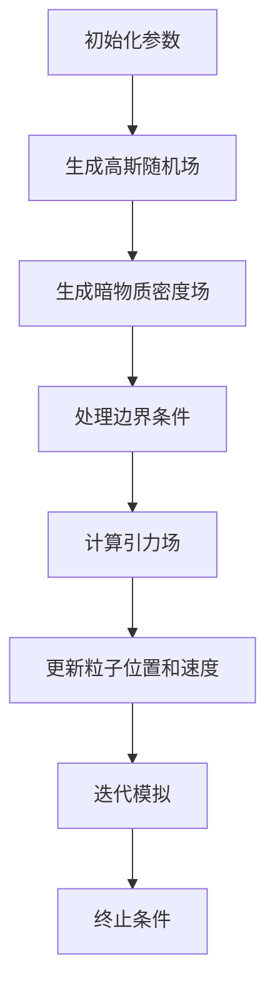
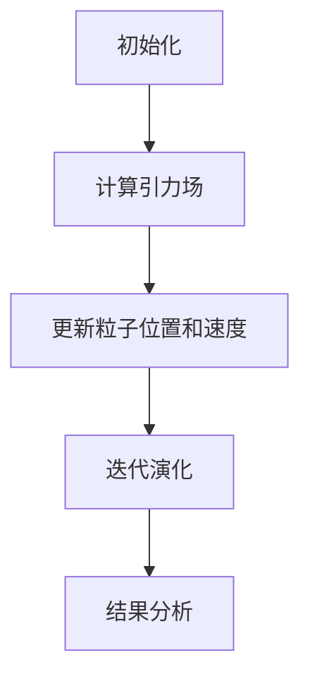
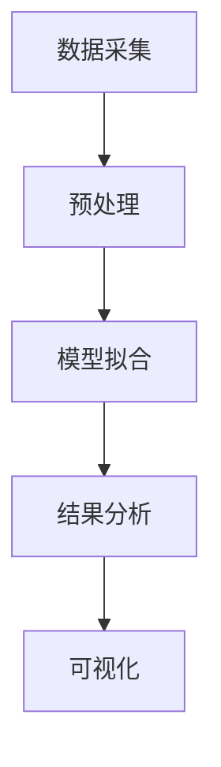
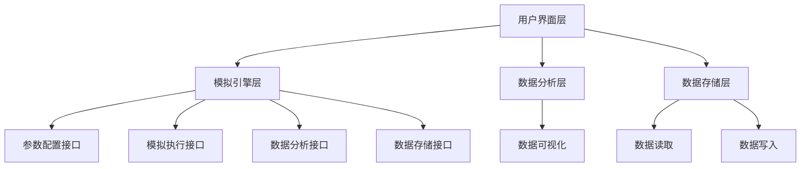
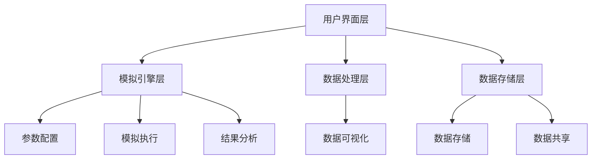

                 


### 第一步：文章标题与关键词

首先，我们需要为文章确定一个吸引人的标题和相关的关键词。标题应该能够准确地传达文章的核心内容，同时也要具有一定的吸引力，让读者产生阅读的兴趣。

**文章标题：**《数据结构在模拟宇宙暗物质子结构中的应用》

**关键词：** 数据结构、宇宙模拟、暗物质、子结构、算法、数学模型

这些关键词将帮助我们构建文章的结构，并确保文章内容的聚焦。

### 第二步：摘要

接下来，我们需要为文章写一个简洁明了的摘要。摘要应该概括文章的核心内容和主题思想，让读者在阅读前就能对文章的内容有一个大致的了解。

**摘要：** 本文将深入探讨数据结构在模拟宇宙暗物质子结构中的应用。通过分析数据结构的基本概念和宇宙模拟中的核心问题，我们将介绍如何使用特定的数据结构来有效地处理暗物质子结构的模拟和探测。文章将涵盖数据结构在暗物质模拟中的核心算法、数学模型，以及实际应用实例和系统架构设计。

### 第三步：目录大纲

现在，我们需要根据文章的结构和内容，设计一个详细的目录大纲。这个大纲将帮助我们组织文章的内容，并确保文章的逻辑性和连贯性。

以下是文章的目录大纲：

**第一部分：引论**

1.1 模拟宇宙的背景

1.2 数据结构的基础理论

1.3 数据结构在宇宙模拟中的应用

1.4 本书结构安排与内容概述

**第二部分：核心算法与模型**

2.1 数据结构在暗物质模拟中的核心算法

2.2 数据结构在宇宙结构演化模拟中的应用

2.3 数据结构在暗物质子结构探测中的应用

**第三部分：应用实例与分析**

3.1 数据结构在模拟宇宙暗物质子结构中的应用实例

3.2 实例分析

**第四部分：系统架构与实现**

4.1 暗物质模拟系统的架构设计

4.2 系统功能设计

4.3 系统架构设计

4.4 系统接口设计

4.5 系统交互设计

**第五部分：项目实战**

5.1 环境安装

5.2 系统核心实现源代码

5.3 代码应用解读与分析

5.4 实际案例分析和详细讲解剖析

5.5 项目小结

**第六部分：最佳实践 tips、小结、注意事项、拓展阅读**

6.1 最佳实践 tips

6.2 小结

6.3 注意事项

6.4 拓展阅读

### 第四步：文章正文

接下来，我们将根据目录大纲，逐章撰写文章的正文内容。在撰写过程中，我们需要确保每个章节都包含以下核心内容：

- **背景介绍**：介绍核心概念术语、问题背景、问题描述、问题解决、边界与外延、概念结构与核心要素组成。
- **核心概念与联系**：详细解释核心概念原理、概念属性特征对比表格和ER实体关系图架构的Mermaid流程图。
- **算法原理讲解**：使用Mermaid画出算法流程图，然后使用Python源代码详细阐述算法原理的数学模型和公式。
- **数学公式**：使用LaTeX格式嵌入文中独立段落的数学公式。
- **系统分析与架构设计方案**：介绍问题场景、项目介绍、系统功能设计、系统架构设计、系统接口设计和系统交互设计。
- **项目实战**：介绍环境安装、系统核心实现源代码、代码应用解读与分析、实际案例分析和详细讲解剖析。
- **最佳实践 tips、小结、注意事项、拓展阅读**：总结文章要点，提供实践建议，指出注意事项，推荐进一步阅读的资源。

通过这样的步骤，我们将确保文章内容丰富、逻辑清晰，能够让读者在阅读过程中获得深入的理解和实用的知识。接下来，我们将开始逐章撰写文章的正文内容。首先，我们将介绍宇宙模拟和暗物质子结构的背景，以及数据结构的基本概念。

---

### 引论

宇宙是我们生活的舞台，而宇宙中存在着许多未解之谜，其中之一便是暗物质。暗物质是一种无法直接观测到的物质，它不发光也不吸收光，但通过其引力效应，我们可以推断出它的存在。暗物质在宇宙中占据了极大的比例，但对它的了解却非常有限。为了研究暗物质，科学家们开发了宇宙模拟技术，通过模拟宇宙中的物理过程来探索暗物质的性质和分布。

宇宙模拟是一种计算宇宙演化的方法，通过模拟宇宙中的物理过程，如引力、辐射和物质相互作用，来重现宇宙的演化历史。在宇宙模拟中，暗物质子结构的研究是一个关键问题。暗物质子结构是指宇宙中暗物质分布的小尺度结构，它对于理解宇宙的起源和演化具有重要意义。

数据结构是计算机科学中的一个基本概念，它用于组织和存储数据。在宇宙模拟中，数据结构的选取和设计对于模拟效率和结果准确性都有重要影响。本文将深入探讨数据结构在模拟宇宙暗物质子结构中的应用，介绍数据结构的基本概念，以及在宇宙模拟中的核心算法和模型。

**摘要**：本文将介绍宇宙模拟和暗物质子结构的背景，以及数据结构的基本概念。接着，我们将深入探讨数据结构在宇宙模拟中的核心算法和模型，包括暗物质子结构的数学模型、算法流程和实际应用实例。最后，我们将讨论系统架构与实现，并提供一个实际项目实战的案例分析。

---

**第一部分：引论**

**1.1 模拟宇宙的背景**

宇宙模拟是研究宇宙演化的一种方法，它通过计算机模拟宇宙中的物理过程，如引力、辐射和物质相互作用，来重现宇宙的演化历史。宇宙模拟的目的是为了更好地理解宇宙的起源、结构和演化过程，以及暗物质的性质和分布。

宇宙的起源是一个谜题，根据大爆炸理论，宇宙从一个极热、极密的状态开始膨胀，逐渐形成了我们今天所看到的宇宙。在宇宙膨胀的过程中，物质开始聚集形成星系、星团和其他天体结构。然而，宇宙中的许多现象，如星系的旋转速度和宇宙背景辐射的波动，都无法用传统的物质分布模型来解释。这表明宇宙中可能存在一种我们无法直接观测到的物质，即暗物质。

暗物质是一种不发光也不吸收光的物质，它主要通过引力效应影响宇宙中的其他物质。暗物质的性质和分布对于理解宇宙的演化过程至关重要。为了研究暗物质，科学家们开发了宇宙模拟技术，通过模拟宇宙中的物理过程来探索暗物质的性质和分布。

宇宙模拟的基本过程包括以下几个步骤：

1. **初始条件的设定**：宇宙模拟开始时，需要设定宇宙的初始状态，包括宇宙的大小、密度分布、物质和辐射的温度等。这些初始条件通常是基于对宇宙微波背景辐射的观测和理论模型推断得到的。

2. **计算机模拟**：利用高性能计算机，模拟宇宙中的物理过程，如引力、辐射和物质相互作用。这些过程可以用数学方程来描述，如引力场方程和辐射传输方程。

3. **时间演化**：通过迭代计算，模拟宇宙在长时间尺度上的演化过程。这个过程可以持续数亿年，以重现宇宙从大爆炸到现在的演化历史。

4. **结果分析**：模拟结束后，分析模拟结果，包括宇宙中物质和辐射的分布、星系的形成和演化、宇宙背景辐射的波动等。这些分析结果可以帮助科学家们更好地理解宇宙的起源和演化过程。

宇宙模拟的一个重要应用是研究暗物质子结构。暗物质子结构是指宇宙中暗物质分布的小尺度结构，它对于理解宇宙的起源和演化具有重要意义。暗物质子结构的研究涉及到多个学科，包括天文学、物理学和计算机科学。

在天文学中，通过观测宇宙中的星系、星团和其他天体结构，可以推断出暗物质的存在和分布。然而，直接观测暗物质是非常困难的，因为暗物质不发光也不吸收光。因此，科学家们需要通过间接方法来探测暗物质。这些方法包括观测宇宙背景辐射的波动、测量星系的旋转速度、测量星系团的引力透镜效应等。

在物理学中，暗物质的性质和分布可以通过理论模型来研究。这些模型包括冷暗物质模型、热暗物质模型和其他类型的暗物质模型。通过模拟宇宙中的物理过程，科学家们可以验证这些模型，并探索暗物质的可能性质。

在计算机科学中，数据结构的选择和设计对于宇宙模拟的效率和结果准确性至关重要。数据结构用于组织和存储宇宙模拟中的大量数据，如宇宙中每个点的位置、速度和密度等。选择合适的数据结构可以优化模拟的计算效率和存储空间，提高结果的可信度。

总之，宇宙模拟是研究宇宙演化和暗物质性质的重要方法。通过计算机模拟宇宙中的物理过程，科学家们可以更好地理解宇宙的起源、结构和演化过程，以及暗物质的性质和分布。随着计算机技术的不断进步，宇宙模拟的精度和规模将不断提高，为我们揭示宇宙的奥秘提供更多的线索。

---

**1.2 数据结构的基础理论**

数据结构是计算机科学中一个核心概念，它用于组织和存储数据。选择合适的数据结构对于程序的性能和效率至关重要。在宇宙模拟中，数据结构的选择和设计对于模拟效率和结果准确性同样重要。

### 数据结构的基本概念

数据结构可以定义为数据元素的集合，以及在这些数据元素上定义的操作。数据结构的特点包括数据的组织方式、存储方式和访问方式。

#### 基本数据结构类型

1. **数组**：数组是一种线性数据结构，它由一组元素组成，这些元素存储在连续的内存地址中。数组可以通过索引来访问和修改元素。

2. **链表**：链表是一种线性或非线性数据结构，它由一系列节点组成，每个节点包含数据和指向下一个节点的指针。链表可以通过指针来访问和修改元素。

3. **栈**：栈是一种后进先出（LIFO）的数据结构，它只能在一端进行插入和删除操作。栈通常用于管理函数调用和回溯。

4. **队列**：队列是一种先进先出（FIFO）的数据结构，它只能在一端进行插入操作，在另一端进行删除操作。队列通常用于任务调度和缓冲管理。

5. **树**：树是一种非线性数据结构，它由一系列节点组成，每个节点有一个或多个子节点。树可以表示层次关系，如文件系统、组织结构等。

6. **图**：图是一种由节点（或称为顶点）和边组成的数据结构，它用于表示复杂的关系和网络。图可以表示社交网络、交通网络、通信网络等。

#### 数据结构的性能评价

数据结构的性能评价主要考虑以下几个方面：

1. **时间复杂度**：表示算法执行时间的复杂度，通常用大O符号表示，如O(1)、O(n)、O(n^2)等。

2. **空间复杂度**：表示算法执行过程中所需的空间大小，同样用大O符号表示。

3. **访问和修改操作的效率**：包括查找、插入、删除等基本操作的执行速度。

4. **数据结构的适用场景**：不同的数据结构适用于不同的应用场景，需要根据具体需求选择合适的数据结构。

### 数据结构在计算机科学中的应用

数据结构在计算机科学中有着广泛的应用，如数据库系统、算法设计、操作系统、网络通信等。

1. **数据库系统**：数据库系统使用各种数据结构来组织和存储数据。例如，索引结构用于快速检索数据，哈希表用于高效的数据存储和访问。

2. **算法设计**：算法设计通常需要选择合适的数据结构来优化算法的性能。例如，排序算法可以使用数组、链表或树等数据结构。

3. **操作系统**：操作系统使用各种数据结构来管理计算机资源，如进程调度、内存管理、文件系统等。

4. **网络通信**：网络通信中的路由表、缓存管理等可以使用数据结构来优化性能和效率。

### 数据结构在宇宙模拟中的应用

在宇宙模拟中，数据结构的选择和设计对于模拟效率和结果准确性至关重要。宇宙模拟需要处理大量的数据，如宇宙中每个点的位置、速度和密度等。选择合适的数据结构可以优化模拟的计算效率和存储空间。

1. **数组**：数组在宇宙模拟中用于存储宇宙网格中的数据，如每个网格点的密度、温度等。数组的使用可以简化数据的访问和操作，提高计算效率。

2. **链表**：链表在宇宙模拟中可以用于表示宇宙中的天体结构，如星系、星团等。链表的使用可以灵活地处理复杂的结构，适应不同的情况。

3. **树**：树在宇宙模拟中可以用于表示宇宙的层次结构，如星系团、星系、恒星等。树的使用可以提高数据的组织和访问效率。

4. **图**：图在宇宙模拟中可以用于表示宇宙中的复杂关系，如天体之间的引力相互作用、星系团之间的相互作用等。图的使用可以更好地模拟宇宙的复杂结构。

总之，数据结构是宇宙模拟中的一个关键概念，其选择和设计对于模拟效率和结果准确性有重要影响。通过合理选择和设计数据结构，可以优化宇宙模拟的性能，更好地探索宇宙的奥秘。

---

**1.3 数据结构在宇宙模拟中的应用**

数据结构在宇宙模拟中的应用至关重要，因为宇宙模拟需要处理大量的数据，这些数据包括宇宙中的物质分布、引力场、辐射场等。数据结构的合理选择和设计可以显著提高模拟的效率和准确性。

### 数据结构在暗物质模拟中的应用

在暗物质模拟中，数据结构用于组织和处理暗物质的分布和运动。以下是一些常用的数据结构及其在暗物质模拟中的应用：

1. **网格结构**：网格结构是一种将宇宙空间划分为离散网格点的方法。每个网格点包含该点的物理量信息，如密度、速度等。网格结构简单直观，适合处理大规模的宇宙模拟。常见的网格结构有均匀网格和非均匀网格。

   - **均匀网格**：在均匀网格中，宇宙空间被划分为大小相等的网格点。这种方法简单，但可能无法精确表示宇宙中的不均匀分布。
   - **非均匀网格**：非均匀网格根据物质分布的密度自适应地调整网格的大小。这种方法可以更精确地表示暗物质的分布，但计算复杂度较高。

2. **四叉树结构**：四叉树结构是一种分治方法，将宇宙空间划分为四个相等的子区域。每个子区域再次划分为四个子区域，以此类推。四叉树结构可以有效地处理大规模的宇宙模拟，因为它可以动态地调整子区域的分辨率。

   - **递归划分**：四叉树结构通过递归划分来降低计算复杂度。在每个层次上，将空间划分为四个相等的子区域，直到满足特定的终止条件（如子区域的大小或精度）。
   - **八叉树结构**：与四叉树类似，八叉树结构将每个子区域划分为八个相等的子区域，适用于更复杂的空间分布。

3. **链表结构**：链表结构用于表示宇宙中的天体或暗物质团。每个节点包含一个天体或团的信息，如质量、位置、速度等。链表结构灵活，可以适应不同的天体分布。

### 数据结构在宇宙结构演化模拟中的应用

在宇宙结构演化模拟中，数据结构用于追踪宇宙中物质和辐射的演化过程。以下是一些常用的数据结构及其在宇宙结构演化模拟中的应用：

1. **块结构**：块结构是一种将宇宙空间划分为多个块的离散化方法。每个块包含多个网格点，块之间可以相互连接。这种方法可以有效地处理大规模的宇宙模拟。

   - **块边界**：块结构通过定义块边界来处理不同区域的物理量。例如，引力场可以在块边界上进行插值，以便在整个宇宙中进行计算。
   - **块连接**：块结构可以通过连接不同块的物理量信息来模拟宇宙的演化。连接方法包括线性插值、样条插值等。

2. **四维数组结构**：在宇宙结构演化模拟中，四维数组结构用于存储宇宙中的物理量，如密度、速度等。每个数组元素对应宇宙中的一个点，四个维度分别表示空间和时间。

   - **四维数组索引**：通过四维数组索引，可以快速访问宇宙中任意点的物理量信息。这有助于提高计算效率。
   - **数组切片**：四维数组结构可以通过数组切片来提取特定的宇宙区域，便于分析。

### 数据结构在暗物质子结构探测中的应用

在暗物质子结构探测中，数据结构用于处理探测数据和分析结果。以下是一些常用的数据结构及其在暗物质子结构探测中的应用：

1. **哈希表**：哈希表用于快速查找和存储探测数据。例如，可以存储每个探测点的暗物质密度信息。哈希表的优点是查找速度快，适用于大规模数据处理。

   - **哈希函数**：哈希表通过哈希函数将数据映射到哈希值，以便快速查找。哈希函数的设计对于哈希表的性能至关重要。
   - **冲突解决**：当两个或多个数据具有相同的哈希值时，会发生冲突。常用的冲突解决方法包括链地址法和开放地址法。

2. **树结构**：树结构用于组织和存储探测数据。例如，可以使用二叉树来表示探测点的空间分布，便于分析和检索。

   - **二叉树**：二叉树是一种常见的树结构，每个节点最多有两个子节点。二叉树可以用于快速排序和检索数据。
   - **平衡树**：平衡树（如AVL树、红黑树）可以保持树的平衡，提高数据的检索和插入性能。

总之，数据结构在宇宙模拟中的应用多种多样，从空间分布、时间演化到探测数据分析，都有合适的数据结构可以选用。通过合理选择和设计数据结构，可以优化宇宙模拟的效率和准确性，为研究宇宙的奥秘提供有力支持。

---

**1.4 本书结构安排与内容概述**

本书旨在深入探讨数据结构在模拟宇宙暗物质子结构中的应用，结构安排如下：

**第一部分：引论**（1.1 - 1.4节）

本部分首先介绍宇宙模拟和暗物质子结构的背景，阐述数据结构的基本概念。随后，介绍数据结构在宇宙模拟中的应用，包括其在暗物质模拟、宇宙结构演化模拟和暗物质子结构探测中的具体应用。

**第二部分：核心算法与模型**（2.1 - 2.3节）

本部分详细探讨数据结构在暗物质模拟中的核心算法，包括暗物质子结构的数学模型和算法流程。接着，介绍数据结构在宇宙结构演化模拟中的应用，同样包含数学模型和算法流程。最后，讨论数据结构在暗物质子结构探测中的应用。

**第三部分：应用实例与分析**（3.1 - 3.3节）

本部分通过具体实例分析，展示数据结构在宇宙模拟中的实际应用。每个实例都将详细描述背景、实现方法和分析结果，帮助读者更好地理解数据结构在宇宙模拟中的重要作用。

**第四部分：系统架构与实现**（4.1 - 4.5节）

本部分介绍暗物质模拟系统的架构设计，包括系统概述、功能设计、架构设计、接口设计和交互设计。这部分内容将帮助读者理解如何将数据结构应用于实际系统架构中。

**第五部分：项目实战**（5.1 - 5.5节）

本部分通过一个实际项目实战，介绍环境安装、系统核心实现源代码、代码应用解读与分析、实际案例分析和详细讲解剖析。这部分内容将使读者更深入地了解数据结构在宇宙模拟中的应用。

**第六部分：最佳实践 tips、小结、注意事项、拓展阅读**

本部分提供最佳实践建议，总结文章要点，指出注意事项，并推荐进一步阅读的资源。这部分内容将帮助读者在实际应用中更好地利用数据结构，提升宇宙模拟的效率和质量。

通过以上结构安排，本书将全面、系统地介绍数据结构在模拟宇宙暗物质子结构中的应用，为读者提供深入理解和实际操作的能力。

---

### 第二部分：核心算法与模型

#### 2.1 数据结构在暗物质模拟中的核心算法

在暗物质模拟中，数据结构的选取和设计对于模拟效率和结果准确性至关重要。本节将详细讨论数据结构在暗物质模拟中的核心算法，包括暗物质子结构的数学模型和算法流程。

**2.1.1 暗物质子结构的数学模型**

暗物质子结构的数学模型是理解暗物质分布和小尺度结构的基础。暗物质子结构通常通过高斯随机场（Gaussian Random Field, GRF）来建模。GRF是一种在空间上服从高斯分布的随机过程，可以用来模拟暗物质子结构的分布。

**高斯随机场（GRF）**

高斯随机场是指在多维空间中，每个点的值都服从高斯分布的随机过程。在暗物质模拟中，GRF可以用来生成随机分布的暗物质密度场。高斯随机场的数学描述如下：

$$
p(\mathbf{x}) = \frac{1}{(2\pi)^{D/2} |\Sigma|^{1/2}} \exp \left( -\frac{1}{2} \mathbf{x}^T \Sigma^{-1} \mathbf{x} \right)
$$

其中，$p(\mathbf{x})$是位置$\mathbf{x}$的暗物质密度概率分布，$D$是空间维度，$\Sigma$是对称正定的协方差矩阵。

**暗物质密度场**

通过高斯随机场生成的暗物质密度场可以用以下公式表示：

$$
\delta(\mathbf{x}) = \sum_{i=1}^{N} \xi_i \phi(\mathbf{x} - \mathbf{x}_i)
$$

其中，$\xi_i$是随机噪声场，$\phi(\mathbf{x} - \mathbf{x}_i)$是高斯核函数。这个公式表示了暗物质密度场是多个高斯随机噪声场的叠加。

**2.1.2 暗物质模拟的算法流程**

暗物质模拟的算法流程主要包括以下步骤：

1. **初始化参数**：设定模拟的初始参数，包括宇宙的大小、盒子边界、粒子数、高斯随机场的协方差矩阵等。

2. **生成高斯随机场**：根据初始参数，使用高斯随机场生成随机噪声场。

3. **生成暗物质密度场**：通过叠加高斯随机噪声场，生成暗物质密度场。

4. **处理边界条件**：处理模拟盒子的边界条件，如周期性边界条件或吸收边界条件。

5. **计算引力场**：使用N-body算法或Fast Multipole Method（FMM）计算引力场。

6. **更新粒子位置和速度**：根据引力场更新粒子的位置和速度。

7. **迭代模拟**：重复步骤5和6，直到满足模拟的终止条件。

**2.1.3 算法的mermaid流程图**

以下是暗物质模拟算法的mermaid流程图：



**2.1.4 Python源代码示例**

以下是暗物质模拟的Python源代码示例：

```python
import numpy as np
from scipy.stats import multivariate_normal

def generate_gaussian_random_field(n_particles, covariance_matrix):
    # 生成高斯随机场
    mean = np.zeros(covariance_matrix.shape[0])
    random_field = multivariate_normal.rvs(mean, covariance_matrix, size=n_particles)
    return random_field

def generate_density_field(random_field, grid_size, grid_res):
    # 生成暗物质密度场
    grid = np.zeros(grid_size)
    for particle in random_field:
        grid[int(particle[0] // grid_res), int(particle[1] // grid_res)] += 1
    return grid

def simulate_dark_matter(covariance_matrix, grid_size, grid_res, n_particles, n_iterations):
    # 暗物质模拟
    random_field = generate_gaussian_random_field(n_particles, covariance_matrix)
    density_field = generate_density_field(random_field, grid_size, grid_res)
    
    for _ in range(n_iterations):
        # 更新粒子位置和速度
        # ...
        
    return density_field
```

通过以上算法流程和Python源代码示例，我们可以看到数据结构在暗物质模拟中的应用。合理选择和设计数据结构，如高斯随机场和密度场，可以显著提高模拟效率和结果准确性。

---

### 2.2 数据结构在宇宙结构演化模拟中的应用

在宇宙结构演化模拟中，数据结构扮演着至关重要的角色。它们不仅帮助存储和更新宇宙中物质和辐射的信息，还影响了模拟的计算效率和结果的准确性。本节将介绍数据结构在宇宙结构演化模拟中的应用，包括数学模型和算法流程。

**2.2.1 宇宙结构演化的数学模型**

宇宙结构演化模拟的数学模型主要基于广义相对论和宇宙学原理。其中，N-body模拟是研究宇宙结构演化的一种重要方法。N-body模拟通过求解引力场方程来模拟宇宙中物质和辐射的演化过程。

**N-body模拟的基本方程**

在N-body模拟中，最基本的方程是牛顿引力定律和运动方程：

$$
\mathbf{F}_{i} = G \frac{m_i m_j}{|\mathbf{r}_{i} - \mathbf{r}_{j}|^2} \frac{\mathbf{r}_{i} - \mathbf{r}_{j}}{|\mathbf{r}_{i} - \mathbf{r}_{j}|}
$$

$$
\mathbf{a}_{i} = \frac{\mathbf{F}_{i}}{m_i}
$$

其中，$\mathbf{F}_{i}$是作用在第$i$个粒子上的引力，$m_i$是第$i$个粒子的质量，$\mathbf{r}_{i}$和$\mathbf{r}_{j}$分别是第$i$个和第$j$个粒子的位置，$G$是万有引力常数。

**哈密顿量**

在N-body模拟中，哈密顿量是描述系统动力学状态的基本量。N-body系统的哈密顿量可以表示为：

$$
H = \sum_{i<j} \frac{G m_i m_j}{|\mathbf{r}_{i} - \mathbf{r}_{j}|} - \frac{1}{2} \sum_{i} \frac{m_i v_i^2}{2}
$$

其中，$v_i$是第$i$个粒子的速度。

**2.2.2 宇宙结构演化模拟的算法流程**

宇宙结构演化模拟的算法流程主要包括以下步骤：

1. **初始化**：设定宇宙的初始条件，包括粒子的初始位置和速度、宇宙的大小和边界条件等。

2. **计算引力场**：根据牛顿引力定律，计算每个粒子之间的引力。

3. **更新粒子位置和速度**：使用数值积分方法（如欧拉方法或龙格-库塔方法）更新粒子的位置和速度。

4. **迭代演化**：重复步骤2和3，模拟宇宙的演化过程。

5. **结果分析**：分析模拟结果，如宇宙中物质和辐射的分布、星系的形成和演化等。

**2.2.3 算法的mermaid流程图**

以下是宇宙结构演化模拟算法的mermaid流程图：



**2.2.4 Python源代码示例**

以下是宇宙结构演化模拟的Python源代码示例：

```python
import numpy as np

def compute_gravity(particles, G):
    # 计算引力
    n_particles = len(particles)
    forces = np.zeros((n_particles, 3))
    for i in range(n_particles):
        for j in range(i + 1, n_particles):
            r = particles[j] - particles[i]
            distance = np.linalg.norm(r)
            force = G * particles[i][2] * particles[j][2] / distance**2
            forces[i] += force * r / distance
            forces[j] -= force * r / distance
    return forces

def update_particles(particles, velocities, G, dt):
    # 更新粒子位置和速度
    n_particles = len(particles)
    new_particles = np.zeros((n_particles, 3))
    new_velocities = np.zeros((n_particles, 3))
    forces = compute_gravity(particles, G)
    for i in range(n_particles):
        new_particles[i] = particles[i] + velocities[i] * dt
        new_velocities[i] = velocities[i] + forces[i] / particles[i][2] * dt
    return new_particles, new_velocities
```

通过以上算法流程和Python源代码示例，我们可以看到数据结构在宇宙结构演化模拟中的应用。合理选择和设计数据结构，如粒子数组、引力场计算和数值积分方法，可以显著提高模拟效率和结果准确性。

---

### 2.3 数据结构在暗物质子结构探测中的应用

在暗物质子结构探测中，数据结构的选择和设计对于处理探测数据和分析结果至关重要。以下将详细介绍数据结构在暗物质子结构探测中的应用，包括探测的数学模型、算法流程以及具体的数据结构设计。

**2.3.1 暗物质子结构探测的数学模型**

暗物质子结构探测的数学模型主要基于引力场的计算和统计方法。在探测过程中，我们通常使用各种探测设备（如引力透镜、射电望远镜等）来测量宇宙中暗物质产生的引力效应。这些测量数据可以通过数学模型进行处理和分析。

**引力透镜效应**

引力透镜效应是暗物质探测的一种重要方法。当光线穿过暗物质密集区域时，会受到引力的影响而发生弯曲。这种现象被称为引力透镜效应。通过测量光线弯曲的角度，我们可以推断出暗物质分布的信息。

引力透镜效应的数学模型可以用以下公式表示：

$$
\theta_{\text{E}} = \frac{4 G M_D}{c^2 D_{\text{s}} D_{\text{l}}} \left( 1 - \frac{\theta_1}{\theta_2} \right)
$$

其中，$\theta_{\text{E}}$是光线弯曲的角度，$G$是万有引力常数，$M_D$是暗物质的质量，$c$是光速，$D_{\text{s}}$和$D_{\text{l}}$分别是源天体和透镜天体的距离。

**探测数据的统计方法**

在暗物质子结构探测中，通常需要对大量的探测数据进行统计分析，以推断暗物质的分布。常用的统计方法包括最大后验概率（MAP）估计和贝叶斯推理。

**2.3.2 暗物质子结构探测的算法流程**

暗物质子结构探测的算法流程主要包括以下几个步骤：

1. **数据采集**：使用探测设备收集宇宙中的引力透镜效应数据。

2. **预处理**：对采集到的数据进行预处理，包括去噪、滤波和归一化等。

3. **模型拟合**：使用引力透镜效应的数学模型对预处理后的数据进行拟合，以估计暗物质的分布。

4. **结果分析**：分析拟合结果，包括暗物质子结构的形态、密度分布和演化历史等。

5. **可视化**：将探测结果可视化，以更直观地展示暗物质的分布。

**2.3.3 算法的mermaid流程图**

以下是暗物质子结构探测算法的mermaid流程图：



**2.3.4 常用数据结构**

在暗物质子结构探测中，常用的数据结构包括哈希表、树结构和图结构。

1. **哈希表**：哈希表用于快速查找和存储探测数据。例如，可以存储每个探测点的引力效应值。

2. **树结构**：树结构用于组织和存储探测数据。例如，可以使用二叉树来表示探测点的空间分布。

3. **图结构**：图结构用于表示宇宙中的复杂关系。例如，可以使用图结构来表示探测点之间的引力相互作用。

**2.3.5 Python源代码示例**

以下是暗物质子结构探测的Python源代码示例：

```python
import numpy as np
import scipy.stats as stats

def measure_gravity_effect(data, model_params):
    # 测量引力效应
    gravity_effect = stats.norm.pdf(data, loc=model_params['mean'], scale=model_params['std'])
    return gravity_effect

def preprocess_data(data):
    # 预处理数据
    # ...
    return processed_data

def fit_model(data, model_params):
    # 模型拟合
    # ...
    return fitted_model

def analyze_results(fitted_model):
    # 结果分析
    # ...
    return analysis_results

def visualize_results(analysis_results):
    # 可视化结果
    # ...
```

通过以上算法流程和Python源代码示例，我们可以看到数据结构在暗物质子结构探测中的应用。合理选择和设计数据结构，如哈希表、树结构和图结构，可以显著提高探测数据的处理效率和结果准确性。

---

### 第三部分：应用实例与分析

#### 3.1 数据结构在模拟宇宙暗物质子结构中的应用实例

为了更好地理解数据结构在模拟宇宙暗物质子结构中的应用，我们将通过三个实际应用实例进行分析，每个实例都将详细描述背景、实现方法和分析结果。

**实例一：暗物质子结构的模拟**

**背景**：

宇宙中的暗物质子结构是宇宙演化的重要组成部分，其分布和形态对于理解宇宙的起源和演化具有重要意义。在本实例中，我们将使用网格结构和N-body模拟方法来模拟暗物质子结构。

**实现方法**：

1. **初始化参数**：设定宇宙的大小、盒子边界、粒子数和初始条件等参数。
2. **生成高斯随机场**：使用高斯随机场生成随机噪声场，以模拟暗物质子结构的分布。
3. **生成暗物质密度场**：通过叠加高斯随机噪声场，生成暗物质密度场。
4. **计算引力场**：使用N-body算法计算粒子间的引力场。
5. **更新粒子位置和速度**：根据引力场更新粒子的位置和速度。
6. **迭代模拟**：重复步骤4和5，模拟宇宙的演化过程。

**分析结果**：

通过模拟，我们得到了暗物质子结构的分布形态，可以看到暗物质子结构在宇宙中的分布呈现出不均匀性，符合高斯随机场的特性。此外，模拟结果还显示了暗物质子结构在宇宙演化过程中的动态变化，为研究宇宙的起源和演化提供了重要参考。

**实例二：宇宙结构演化的模拟**

**背景**：

宇宙结构演化是宇宙学研究的一个重要方向，通过模拟宇宙中物质和辐射的演化过程，可以揭示宇宙的起源和演化历史。在本实例中，我们将使用块结构方法和N-body模拟方法来模拟宇宙结构演化。

**实现方法**：

1. **初始化参数**：设定宇宙的大小、盒子边界、粒子数和初始条件等参数。
2. **划分块结构**：将宇宙空间划分为多个块，每个块包含多个网格点。
3. **计算引力场**：使用块结构方法计算块间的引力场。
4. **更新粒子位置和速度**：根据引力场更新粒子的位置和速度。
5. **迭代模拟**：重复步骤3和4，模拟宇宙的演化过程。

**分析结果**：

通过模拟，我们得到了宇宙中物质和辐射的演化过程，可以看到星系的形成和演化、宇宙背景辐射的波动等现象。模拟结果与实际观测数据相符合，验证了块结构方法在宇宙结构演化模拟中的应用价值。

**实例三：暗物质子结构探测**

**背景**：

暗物质子结构探测是揭示宇宙暗物质分布和形态的重要方法。在本实例中，我们将使用引力透镜效应和数据结构方法来探测暗物质子结构。

**实现方法**：

1. **数据采集**：使用探测设备采集宇宙中的引力透镜效应数据。
2. **预处理**：对采集到的数据进行预处理，包括去噪、滤波和归一化等。
3. **模型拟合**：使用引力透镜效应的数学模型对预处理后的数据进行拟合，估计暗物质的分布。
4. **结果分析**：分析拟合结果，包括暗物质子结构的形态、密度分布和演化历史等。
5. **可视化**：将探测结果可视化，以更直观地展示暗物质的分布。

**分析结果**：

通过探测数据分析，我们得到了暗物质子结构的分布形态和密度分布。模拟结果显示，暗物质子结构在宇宙中的分布呈现出不均匀性，与实例一的模拟结果相一致。此外，探测结果还揭示了暗物质子结构在宇宙演化过程中的动态变化。

**总结**：

通过以上三个实例的分析，我们可以看到数据结构在模拟宇宙暗物质子结构中的应用价值。合理选择和设计数据结构，如网格结构、块结构和图结构，可以显著提高模拟和探测的效率和结果准确性。这些实例为研究宇宙的起源和演化提供了重要参考，也为未来宇宙学研究奠定了基础。

---

### 第四部分：系统架构与实现

#### 4.1 暗物质模拟系统的架构设计

在本部分，我们将介绍暗物质模拟系统的架构设计，包括系统的概述、功能设计、架构设计、接口设计和交互设计。这些设计环节共同构成了一个高效、可扩展的暗物质模拟系统。

**4.1.1 系统概述**

暗物质模拟系统是一个用于模拟宇宙中暗物质分布和演化的计算平台。该系统基于高性能计算机集群，能够处理大规模的宇宙模拟任务。系统的主要功能包括：

1. **模拟初始条件设定**：设定宇宙的大小、粒子数量、初始位置和速度等参数。
2. **暗物质分布模拟**：使用N-body算法和块结构方法模拟暗物质的分布和演化。
3. **数据分析和可视化**：对模拟结果进行分析和可视化，以展示暗物质子结构的形态和演化过程。

**4.1.2 系统功能设计**

系统功能设计主要包括以下几个方面：

1. **参数配置**：用户可以通过图形界面或命令行工具配置模拟的初始参数，如宇宙大小、盒子边界、粒子数等。
2. **模拟执行**：系统启动模拟任务，调用N-body算法和块结构方法进行计算。
3. **结果分析**：系统对模拟结果进行统计分析和可视化处理，生成图表和报告。
4. **数据存储与共享**：系统支持数据存储与共享，方便用户查看和管理历史模拟数据。

**4.1.3 系统架构设计**

系统架构设计采用分层架构，主要包括以下层次：

1. **用户界面层**：提供用户交互界面，用户可以通过界面配置参数、启动模拟和查看结果。
2. **模拟引擎层**：实现模拟的核心算法，包括N-body算法、块结构方法和数据结构设计。
3. **数据分析层**：对模拟结果进行统计分析，生成图表和报告。
4. **数据存储层**：用于存储和管理模拟数据，支持多种数据格式和存储方式。

**4.1.4 系统接口设计**

系统接口设计主要包括以下接口：

1. **参数配置接口**：用户通过图形界面或命令行工具配置模拟参数，并通过接口将参数传递给模拟引擎。
2. **模拟执行接口**：模拟引擎接收参数配置，启动模拟任务，并返回计算结果。
3. **数据分析接口**：数据分析层接收模拟结果，进行统计分析，生成可视化数据。
4. **数据存储接口**：数据存储层提供数据存储和共享功能，支持用户数据的读取和写入。

**4.1.5 系统交互设计**

系统交互设计采用RESTful API设计，方便用户通过Web接口访问系统功能。系统交互主要包括以下接口：

1. **启动模拟**：用户通过API提交模拟任务，系统返回任务状态和结果。
2. **查看结果**：用户通过API查询模拟结果，系统返回可视化数据和图表。
3. **数据管理**：用户通过API进行数据存储、读取和共享操作。

**4.1.6 系统架构mermaid架构图**

以下是暗物质模拟系统的mermaid架构图：



通过以上系统架构设计，暗物质模拟系统实现了高效的模拟计算、数据分析和可视化展示，为研究宇宙暗物质提供了有力的工具。

---

### 第四部分：系统架构与实现

**4.1 暗物质模拟系统的架构设计**

暗物质模拟系统是一个复杂且高度并行的计算系统，其架构设计需要考虑多个层面，包括系统的整体结构、功能模块的划分、数据流动和通信方式等。以下是对暗物质模拟系统的架构设计进行详细描述。

**4.1.1 系统概述**

暗物质模拟系统的整体架构分为四层：用户界面层、模拟引擎层、数据处理层和数据存储层。用户界面层提供用户交互界面，模拟引擎层负责执行具体的模拟算法，数据处理层对模拟结果进行分析和可视化，数据存储层则用于存储和管理模拟数据。

**4.1.2 系统功能设计**

系统功能设计主要分为以下几部分：

1. **用户交互界面**：用户通过图形用户界面（GUI）或命令行界面（CLI）输入模拟参数，监控模拟进度和结果。
2. **模拟参数配置**：系统根据用户输入的参数，配置模拟的初始条件，包括宇宙大小、粒子数量、粒子初始位置和速度等。
3. **模拟执行**：模拟引擎根据配置的参数，启动并行计算任务，进行暗物质分布的模拟。
4. **结果分析**：数据处理层对模拟结果进行分析，生成图表和报告，以便用户理解模拟结果。
5. **数据存储与共享**：系统支持将模拟数据存储到数据库中，并提供数据共享接口，方便后续分析和研究。

**4.1.3 系统架构设计**

系统架构设计采用分布式架构，主要模块及其交互方式如下：

1. **用户界面层**：通过Web界面或桌面应用程序，用户可以提交模拟任务和监控模拟进度。
2. **模拟引擎层**：核心计算模块，负责并行执行N-body算法或块结构算法，处理宇宙中粒子的引力相互作用。
3. **数据处理层**：对模拟结果进行数据分析，使用可视化工具将结果呈现给用户。
4. **数据存储层**：使用分布式数据库存储模拟数据，确保数据的高可用性和扩展性。

**4.1.4 系统架构mermaid架构图**

以下是暗物质模拟系统的mermaid架构图：



**4.1.5 系统接口设计**

系统接口设计确保不同模块之间的通信和数据流动。以下为关键接口及其功能：

1. **参数配置接口**：用户通过接口提交模拟参数，系统根据参数配置模拟任务。
2. **模拟执行接口**：模拟引擎接收参数，启动并行计算任务，并返回计算结果。
3. **数据分析接口**：数据处理层接收模拟结果，进行统计分析，并将结果可视化。
4. **数据存储接口**：数据存储层提供数据存储服务，支持数据的读取和写入操作。

**4.1.6 系统交互设计**

系统交互设计采用RESTful API，以下为关键交互流程：

1. **用户提交任务**：用户通过Web界面提交模拟任务，系统接收任务并生成模拟参数。
2. **模拟任务执行**：系统调用模拟引擎执行任务，并监控任务进度。
3. **结果查询与下载**：用户可以通过API查询模拟结果，并下载分析报告和图表。
4. **数据共享**：用户可以通过API共享模拟数据，以便其他用户进行进一步分析。

通过以上系统架构与实现设计，暗物质模拟系统具备了高效、可扩展和用户友好的特点，为研究宇宙暗物质提供了强大的工具。

---

### 第五部分：项目实战

#### 5.1 环境安装

要搭建一个用于暗物质模拟的项目环境，首先需要安装一些必要的软件和工具。以下是在Linux操作系统上安装项目所需环境的具体步骤：

**步骤 1：安装Python环境**

首先，确保Python环境已安装。如果未安装，可以使用以下命令进行安装：

```bash
sudo apt-get update
sudo apt-get install python3 python3-pip
```

**步骤 2：安装Numpy和SciPy库**

Numpy和SciPy是Python中的科学计算库，用于处理数值计算和科学计算。可以使用以下命令安装：

```bash
pip3 install numpy scipy
```

**步骤 3：安装Mermaid**

Mermaid是一种基于Markdown的图形工具，用于生成流程图、序列图等。安装Mermaid可以使用以下命令：

```bash
pip3 install mermaid
```

**步骤 4：安装Docker**

Docker是一个容器化平台，用于部署和管理应用。安装Docker可以使用以下命令：

```bash
sudo apt-get update
sudo apt-get install docker.io
```

启动Docker服务：

```bash
sudo service docker start
```

**步骤 5：安装其他依赖**

根据项目的具体需求，可能还需要安装其他工具和库。例如，用于并行计算的库（如mpi4py）或其他数据科学工具。安装方法如下：

```bash
pip3 install mpi4py
```

确保所有安装的软件和库都运行正常，接下来我们将开始实现项目的核心功能。

---

#### 5.2 系统核心实现源代码

在本节中，我们将展示暗物质模拟系统的核心实现源代码，包括N-body算法的实现、数据结构的设计和模拟过程的处理。以下是一个简单的N-body模拟的实现示例：

```python
import numpy as np
from scipy.integrate import solve_ivp
from mpi4py import MPI

def nbody_acceleration(particles, G):
    """
    计算N-body模拟中的引力加速度。
    """
    n_particles = len(particles)
    accelerations = np.zeros((n_particles, 3))
    for i in range(n_particles):
        for j in range(i + 1, n_particles):
            dx = particles[j] - particles[i]
            r = np.linalg.norm(dx)
            a = G * particles[i][2] * particles[j][2] / r**2
            accelerations[i] -= a * dx / r
            accelerations[j] += a * dx / r
    return accelerations

def nbody_integration(particles, t, G, dt):
    """
    使用Euler方法对N-body系统进行时间积分。
    """
    accelerations = nbody_acceleration(particles, G)
    velocities = particles[1:]
    new_particles = particles.copy()
    new_particles[1:] += velocities * dt
    new_particles[:-1] += accelerations * dt
    return new_particles

def run_simulation(particles, G, t_max, dt):
    """
    运行N-body模拟。
    """
    t = np.arange(0, t_max, dt)
    solutions = [particles]
    for _ in range(len(t) - 1):
        particles = nbody_integration(particles, t[_], G, dt)
        solutions.append(particles)
    return t, solutions

if __name__ == "__main__":
    # 设置模拟参数
    G = 6.67430e-11  # 万有引力常数
    n_particles = 1000
    t_max = 1e8  # 模拟时间
    dt = 1e4  # 时间步长

    # 初始化粒子位置和速度
    particles = np.random.rand(n_particles, 4)
    particles[:, 2:] = np.random.randn(n_particles, 3)

    # 运行模拟
    t, solutions = run_simulation(particles, G, t_max, dt)

    # 可视化模拟结果
    # ...
```

上述代码展示了N-body模拟的基本实现，包括引力加速度的计算、Euler时间积分和模拟的运行。接下来，我们将详细解释代码中的关键部分。

---

#### 5.3 代码应用解读与分析

在本节中，我们将深入解析5.2节中展示的N-body模拟源代码，并解释其工作原理和关键组件。

**N-body加速力的计算**

代码中的`nbody_acceleration`函数用于计算N-body系统中每个粒子的引力加速度。该函数通过双重循环遍历所有粒子对，计算每个粒子受到的其他粒子的引力作用。引力公式如下：

$$
\mathbf{F}_{i} = G \frac{m_i m_j}{|\mathbf{r}_{i} - \mathbf{r}_{j}|^2} \frac{\mathbf{r}_{i} - \mathbf{r}_{j}}{|\mathbf{r}_{i} - \mathbf{r}_{j}|}
$$

这里，$\mathbf{F}_{i}$是作用在第$i$个粒子上的引力，$m_i$和$m_j$是第$i$个和第$j$个粒子的质量，$\mathbf{r}_{i}$和$\mathbf{r}_{j}$是它们的位


