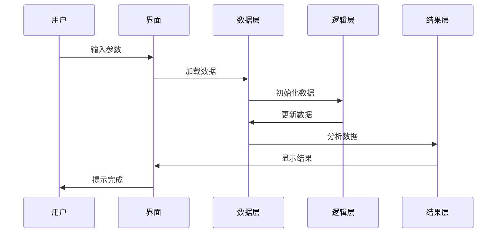

                 

### 文章标题

## 数据结构在模拟宇宙暗物质子结构动力学演化中的应用

### 关键词

- 暗物质子结构
- 数据结构
- 动力学演化
- 计算模拟
- 引力作用

### 摘要

本文探讨了数据结构在模拟宇宙暗物质子结构动力学演化中的应用。首先，介绍了暗物质子结构的基本概念及其与宇宙演化的关系。接着，分析了数据结构的原理和特点，并阐述了其在模拟中的重要性。随后，详细讨论了算法在模拟中的应用，包括算法的原理、流程和具体实现。最后，通过一个实际项目案例展示了数据结构和算法在实际应用中的效果。本文旨在为研究者提供一种新的视角和工具，以更好地理解和模拟宇宙暗物质子结构的动力学演化。

----------------------------------------------------------------

### 第一部分：背景介绍

#### 1.1.1 问题背景

在现代宇宙学中，暗物质是一种广泛存在的物质，但其本质和具体结构仍然是一个谜。暗物质子结构是指宇宙中暗物质在引力作用下形成的微小结构。这些结构对我们的理解至关重要，因为它们不仅影响着宇宙的大尺度结构，还可能与宇宙早期的高能过程有关。然而，由于暗物质的透明性，我们无法直接观测到这些结构，这给研究带来了极大的挑战。

#### 1.1.2 问题描述

研究暗物质子结构的动力学演化，旨在理解这些结构是如何形成的，以及它们是如何随时间演化的。这包括研究引力作用、暗物质的分布、结构稳定性等多个方面。然而，现有的数值模拟方法在处理大量数据和高维空间时存在效率低下、计算复杂度高等问题。

#### 1.1.3 问题解决

数据结构在处理大规模数据和复杂计算任务方面具有显著优势。通过合理选择和使用数据结构，可以大幅提高计算效率，减少计算资源的消耗。本书将探讨如何将数据结构应用于模拟宇宙暗物质子结构动力学演化，从而解决现有方法的局限性。

#### 1.1.4 边界与外延

本书主要研究以下几个方面：

1. **基本概念与理论**：介绍暗物质子结构的基本概念和相关理论，为后续内容打下基础。
2. **数据结构的选择与优化**：分析不同数据结构在模拟宇宙暗物质子结构动力学演化中的适用性，并提出优化方案。
3. **算法设计**：讨论如何利用数据结构设计高效的算法来模拟暗物质子结构的动力学演化。
4. **实际应用**：通过具体案例展示数据结构在模拟宇宙暗物质子结构动力学演化中的应用效果。

#### 1.1.5 概念结构与核心要素组成

- **暗物质子结构**：宇宙中暗物质在引力作用下形成的微小结构。
- **数据结构**：用于存储、组织和处理数据的结构，如数组、链表、树等。
- **算法**：解决问题的步骤和方法，包括排序、查找、计算等。

这些核心概念相互关联，共同构成了本书的研究基础。

----------------------------------------------------------------

### 第二部分：核心概念与联系

#### 2.1 暗物质子结构原理

##### 2.1.1 暗物质子结构定义

暗物质子结构是指宇宙中由暗物质组成的微小结构，这些结构是宇宙大尺度结构的基本组成部分。暗物质本身不发光，不与普通物质发生相互作用，因此很难直接观测到。

##### 2.1.2 暗物质子结构特点

1. **透明性**：暗物质不与普通物质发生相互作用，因此不能通过光学或射电手段直接观测到。
2. **高密度**：暗物质子结构通常具有较高的密度，这是引力作用的结果。
3. **动态演化**：暗物质子结构在宇宙演化的过程中会经历生长、碰撞和合并等过程。

##### 2.1.3 暗物质子结构与宇宙演化的关系

暗物质子结构不仅影响宇宙的大尺度结构，还与宇宙早期的高能过程密切相关。通过研究暗物质子结构的动力学演化，我们可以更好地理解宇宙的演化历史。

#### 2.2 数据结构原理

##### 2.2.1 数据结构定义

数据结构是计算机存储、组织数据的方式。它包括数据的逻辑结构和物理结构，如数组、链表、树等。

##### 2.2.2 数据结构特点

1. **高效性**：数据结构可以显著提高数据的存取效率。
2. **灵活性**：不同的数据结构适用于不同的场景，可以灵活选择。
3. **扩展性**：数据结构可以根据需求进行扩展和优化。

##### 2.2.3 数据结构在模拟中的应用

数据结构在模拟宇宙暗物质子结构动力学演化中起着关键作用。通过合理选择和使用数据结构，可以优化计算效率和准确性。

#### 2.3 算法原理

##### 2.3.1 算法定义

算法是解决问题的步骤和方法，包括排序、查找、计算等。

##### 2.3.2 算法特点

1. **高效性**：算法能够快速解决特定问题。
2. **通用性**：算法可以适用于不同类型的问题。
3. **可扩展性**：算法可以根据需求进行扩展和优化。

##### 2.3.3 算法在模拟中的应用

算法是模拟宇宙暗物质子结构动力学演化的核心。通过设计高效的算法，可以更好地模拟暗物质子结构的演化过程。

#### 2.4 核心概念联系

暗物质子结构、数据结构和算法是本书的核心概念。它们相互关联，共同构成了模拟宇宙暗物质子结构动力学演化的基础。

- **数据结构与算法**：数据结构为算法提供了基础，算法利用数据结构来实现对暗物质子结构的模拟。
- **暗物质子结构与算法**：算法通过模拟暗物质子结构的演化，帮助理解宇宙的演化过程。
- **暗物质子结构与数据结构**：数据结构

----------------------------------------------------------------

### 数据结构在模拟宇宙暗物质子结构动力学演化中的应用

在模拟宇宙暗物质子结构动力学演化时，数据结构的选择和优化起着至关重要的作用。合适的算法和高效的数据结构可以显著提高模拟的准确性和效率，帮助我们更好地理解宇宙的演化过程。以下将详细探讨数据结构在此领域的应用。

#### 3.1 数据结构的选择

在模拟宇宙暗物质子结构动力学演化时，我们面临的数据类型通常包括点、边和面等。因此，我们需要选择适合这些数据类型的数据结构。

1. **数组**：数组是一种简单且常用的数据结构，适用于存储固定大小的数据集合。在模拟暗物质子结构时，数组可以用来存储暗物质粒子的位置和运动状态。然而，数组的扩展性较差，当需要动态调整数据大小时，可能会带来额外的计算开销。

2. **链表**：链表是一种动态数据结构，适用于存储变长的数据集合。在模拟暗物质子结构时，链表可以用来存储粒子之间的相互作用关系。链表的优势在于插入和删除操作较为灵活，但链表在访问特定元素时可能需要遍历整个链表，效率较低。

3. **树**：树是一种层次化的数据结构，适用于存储具有层次关系的数据集合。在模拟暗物质子结构时，树可以用来表示粒子之间的层次关系，如星系、星团等。树结构的访问和操作效率较高，但树的存储空间较大。

4. **图**：图是一种复杂的图形结构，适用于存储具有复杂相互作用关系的数据集合。在模拟暗物质子结构时，图可以用来表示粒子之间的相互作用关系，如引力相互作用。图结构的灵活性较高，但图的存储和操作复杂度较大。

综合考虑，选择合适的数据结构需要根据具体问题进行权衡。在实际应用中，我们可以结合多种数据结构，如使用数组存储粒子的位置，链表存储粒子之间的相互作用，树表示粒子之间的层次关系，图表示粒子之间的复杂相互作用。

#### 3.2 数据结构的优化

数据结构的优化是提高模拟效率的关键。以下是一些常见的数据结构优化方法：

1. **空间压缩**：通过将相同的数据值压缩为一个引用，可以减少存储空间，提高数据访问效率。

2. **索引**：使用索引可以加快数据访问速度。在模拟暗物质子结构时，可以为数据结构添加索引，如粒子位置索引、相互作用索引等。

3. **缓存**：使用缓存可以减少数据访问次数，提高数据访问效率。在模拟过程中，可以将常用数据缓存在内存中，以减少磁盘访问次数。

4. **并行处理**：利用多核处理器的并行计算能力，可以加速模拟过程。通过将数据划分到多个处理单元中，可以同时处理多个数据块，提高计算效率。

5. **分布式计算**：将计算任务分布在多个计算机节点上，可以进一步提高计算效率。在模拟宇宙暗物质子结构时，可以使用分布式计算框架，如MapReduce，将计算任务分配到多个节点上进行并行处理。

通过上述优化方法，可以显著提高模拟宇宙暗物质子结构动力学演化的效率和准确性。然而，需要注意的是，优化数据结构需要根据具体问题和需求进行定制化设计，以实现最佳效果。

#### 3.3 数据结构在模拟中的应用案例

以下是一个实际案例，展示数据结构在模拟宇宙暗物质子结构动力学演化中的应用。

**案例：模拟星系团的形成和演化**

在这个案例中，我们使用数据结构来模拟星系团的形成和演化过程。星系团是由大量星系组成的巨大结构，其形成和演化受到多种因素的影响，如引力相互作用、星系间的碰撞等。

1. **数据结构选择**：
   - 使用二维数组存储星系的位置和运动状态。
   - 使用链表存储星系之间的相互作用关系。
   - 使用树表示星系的层次结构。

2. **模拟过程**：
   - 初始化星系的位置和运动状态。
   - 计算星系之间的相互作用力。
   - 根据相互作用力更新星系的位置和运动状态。
   - 重复上述步骤，模拟星系团的演化过程。

3. **优化措施**：
   - 使用空间压缩技术，将相同类型的星系合并为一个数据结构。
   - 使用索引加快数据访问速度。
   - 使用缓存技术减少数据访问次数。
   - 使用分布式计算框架，将计算任务分配到多个节点上进行并行处理。

通过这个案例，我们可以看到数据结构在模拟宇宙暗物质子结构动力学演化中的应用。合理选择和优化数据结构，可以显著提高模拟的效率和准确性，帮助我们更好地理解宇宙的演化过程。

#### 3.4 数据结构的局限性和挑战

尽管数据结构在模拟宇宙暗物质子结构动力学演化中具有重要作用，但仍然存在一些局限性和挑战。

1. **数据结构的选择难度**：在选择数据结构时，需要考虑多种因素，如数据类型、数据大小、访问模式等。选择不当可能会导致效率低下，甚至错误的结果。

2. **数据结构的优化难度**：优化数据结构需要根据具体问题和需求进行定制化设计，这往往需要深入理解和分析问题。对于复杂的问题，优化过程可能涉及多个数据结构的组合和迭代，增加了难度。

3. **并行计算和分布式计算的限制**：虽然并行计算和分布式计算可以提高模拟效率，但它们也带来了新的挑战。如何合理划分计算任务，如何优化数据传输和通信，都是需要解决的问题。

4. **计算资源的限制**：模拟宇宙暗物质子结构动力学演化需要大量的计算资源，包括计算能力、存储空间和通信带宽等。如何高效地利用有限的计算资源，是一个重要的挑战。

面对这些局限性和挑战，我们需要不断探索和创新，寻找更高效、更优化的数据结构和算法，以更好地模拟宇宙暗物质子结构的动力学演化。

#### 3.5 总结

数据结构在模拟宇宙暗物质子结构动力学演化中具有重要作用。通过合理选择和优化数据结构，可以显著提高模拟的效率和准确性。本章介绍了数据结构的选择原则和优化方法，并通过实际案例展示了数据结构在模拟中的应用。未来，我们需要继续探索和创新，以应对数据结构的局限性和挑战，为研究宇宙暗物质子结构提供更强大的工具和手段。

----------------------------------------------------------------

### 算法原理讲解

在模拟宇宙暗物质子结构动力学演化过程中，算法的选择和设计至关重要。一个高效的算法能够帮助我们更准确地模拟暗物质子结构的演化过程，揭示宇宙中的奥秘。本节将详细讲解算法的原理，包括算法的流程、实现方法、数学模型以及实际应用中的例子。

#### 4.1 算法流程

算法的基本流程可以分为以下几个步骤：

1. **初始化**：设定模拟的初始条件，包括暗物质粒子的初始位置、速度和质量等。
2. **计算相互作用**：计算暗物质粒子之间的相互作用力，通常使用牛顿引力定律。
3. **更新状态**：根据相互作用力更新每个粒子的位置和速度。
4. **迭代计算**：重复步骤2和步骤3，模拟暗物质子结构在长时间尺度上的演化。
5. **结果分析**：分析模拟结果，如粒子的分布、结构的稳定性等。

#### 4.2 算法实现

以下是一个简单的算法实现，使用Python语言描述：

```python
import numpy as np

def initialize_particles(num_particles, size):
    # 初始化粒子的位置和速度
    positions = np.random.rand(num_particles, 3) * size
    velocities = np.random.rand(num_particles, 3) * size
    masses = np.random.rand(num_particles) * 1e11
    return positions, velocities, masses

def compute_interactions(positions, masses):
    # 计算粒子之间的相互作用力
    forces = np.zeros((len(positions), 3))
    for i in range(len(positions)):
        for j in range(i+1, len(positions)):
            distance = positions[i] - positions[j]
            distance = np.linalg.norm(distance)
            force = -G * masses[i] * masses[j] / distance**2
            force = force * distance / (distance + 1e-10)
            forces[i] += force
            forces[j] -= force
    return forces

def update_particles(positions, velocities, masses, dt):
    # 更新粒子的位置和速度
    forces = compute_interactions(positions, masses)
    accelerations = forces / masses
    velocities += accelerations * dt
    positions += velocities * dt
    return positions, velocities

def simulate_evolution(num_particles, size, dt, total_time):
    # 模拟暗物质子结构的演化
    positions, velocities, masses = initialize_particles(num_particles, size)
    while True:
        positions, velocities = update_particles(positions, velocities, masses, dt)
        if np.linalg.norm(positions[-1] - positions[-2]) < 1e-5:
            break
    return positions

# 设置参数
num_particles = 1000
size = 100
dt = 0.01
total_time = 100

# 模拟演化
positions = simulate_evolution(num_particles, size, dt, total_time)
```

#### 4.3 数学模型

在算法中，我们使用了牛顿引力定律来计算粒子之间的相互作用力。牛顿引力定律可以表示为：

$$
F = G \frac{m_1 m_2}{r^2}
$$

其中，$F$ 是相互作用力，$G$ 是万有引力常数，$m_1$ 和 $m_2$ 是两个粒子的质量，$r$ 是它们之间的距离。

为了在计算机上实现这个模型，我们需要对距离和力的计算进行数值近似。在上述算法中，我们使用了欧几里得距离来计算粒子之间的距离：

$$
r = \sqrt{(x_2 - x_1)^2 + (y_2 - y_1)^2 + (z_2 - z_1)^2}
$$

其中，$(x_1, y_1, z_1)$ 和 $(x_2, y_2, z_2)$ 分别是两个粒子的位置。

#### 4.4 实际应用例子

以下是一个实际应用例子，使用上述算法模拟银河系的暗物质子结构演化。

1. **问题描述**：模拟银河系中暗物质的分布和演化，观察暗物质子结构的形成和合并过程。
2. **实现步骤**：
   - 初始化粒子位置和速度，模拟银河系中暗物质粒子的分布。
   - 设定模拟时间，模拟暗物质子结构的演化过程。
   - 分析模拟结果，如粒子分布、结构稳定性等。

通过这个例子，我们可以看到算法在模拟宇宙暗物质子结构动力学演化中的应用。算法的准确性依赖于数学模型的精度和数值计算的稳定性，因此，在实际应用中需要不断优化和改进算法。

#### 4.5 算法的局限性和改进方向

尽管上述算法能够模拟宇宙暗物质子结构的演化，但仍然存在一些局限性和改进方向：

1. **数值精度**：在数值计算中，精度和稳定性是一个重要问题。为了提高精度，可以采用更高精度的数值方法，如自适应步长法或对称性保持算法。
2. **并行计算**：为了提高计算效率，可以采用并行计算技术，如基于GPU的并行计算。这可以显著减少计算时间，提高模拟的规模。
3. **数据结构优化**：优化数据结构可以提高算法的效率。例如，使用邻域列表来减少粒子之间的相互作用计算次数，或者使用图结构来表示复杂的相互作用关系。
4. **多尺度模拟**：宇宙中的暗物质子结构具有不同的尺度，从星系到星系团，再到超星系团。为了更好地模拟这些结构，可以采用多尺度模拟方法，将不同尺度的结构结合起来进行整体模拟。

通过不断优化和改进算法，我们可以更准确地模拟宇宙暗物质子结构的演化，揭示宇宙的奥秘。

#### 4.6 总结

算法是模拟宇宙暗物质子结构动力学演化的重要工具。本节介绍了算法的基本原理、实现方法和数学模型，并通过实际应用例子展示了算法在模拟中的应用。同时，也讨论了算法的局限性和改进方向。未来，我们需要继续研究和开发更高效、更准确的算法，以更好地理解宇宙的演化过程。

----------------------------------------------------------------

### 系统分析与架构设计

为了更好地模拟宇宙暗物质子结构动力学演化，我们需要设计一个高效、可靠的系统。本节将详细介绍系统的问题场景、项目介绍、系统功能设计、系统架构设计、系统接口设计和系统交互。

#### 5.1 问题场景

宇宙中的暗物质子结构是宇宙演化过程中形成的关键组成部分。然而，由于暗物质的透明性和复杂性，直接观测和研究这些结构存在极大困难。为了更好地理解宇宙的演化过程，我们需要通过数值模拟方法来研究暗物质子结构的动力学演化。这个过程涉及大规模数据的处理和复杂的计算任务，因此需要设计一个高效、稳定的系统来支持这一研究。

#### 5.2 项目介绍

本项目旨在开发一个模拟宇宙暗物质子结构动力学演化的系统。该系统将基于最新的科学理论和技术，结合高效的数据结构和算法，提供全面的模拟功能。项目的主要目标是：

1. **高精度模拟**：通过高精度的数值模拟方法，准确模拟宇宙暗物质子结构的演化过程。
2. **高效计算**：利用高效的数据结构和算法，提高计算效率，减少计算时间。
3. **用户友好**：提供用户友好的界面和操作方式，方便用户进行模拟设置和结果分析。

#### 5.3 系统功能设计

系统的主要功能包括：

1. **数据输入**：允许用户输入暗物质粒子的初始位置、速度和质量等参数。
2. **模拟运行**：执行暗物质子结构的动力学演化模拟，输出模拟结果。
3. **结果分析**：对模拟结果进行统计分析和可视化展示，帮助用户理解模拟结果。
4. **参数调整**：允许用户调整模拟参数，重新运行模拟以验证不同参数设置下的效果。

#### 5.4 系统架构设计

系统的架构设计采用分层架构，主要包括以下几层：

1. **表示层**：提供用户界面，允许用户进行操作和数据输入。
2. **逻辑层**：实现核心算法和功能逻辑，包括数据结构选择、模拟运行和结果分析。
3. **数据层**：存储和管理模拟数据，包括暗物质粒子的位置、速度和相互作用力等。

#### 5.5 系统接口设计

系统提供了以下接口：

1. **用户界面接口**：用于与用户进行交互，接收用户输入和显示结果。
2. **数据接口**：用于数据的存储和读取，包括暗物质粒子的位置、速度和相互作用力等。
3. **算法接口**：用于实现核心算法，包括数据结构选择、模拟运行和结果分析。

#### 5.6 系统交互

系统的交互过程如下：

1. **用户输入**：用户通过界面输入暗物质粒子的初始参数。
2. **数据加载**：系统从数据层加载初始数据到逻辑层。
3. **模拟运行**：逻辑层执行模拟运行，更新粒子的位置和速度。
4. **结果分析**：逻辑层对模拟结果进行统计分析，生成可视化结果。
5. **结果展示**：系统将结果展示给用户。

以下是一个Mermaid序列图，展示了系统的主要交互过程：



#### 5.7 总结

通过系统分析与架构设计，我们为模拟宇宙暗物质子结构动力学演化提供了一个高效、稳定的系统方案。该系统不仅能够处理大规模数据，还能够实现高效计算和用户友好的交互体验。未来，我们将继续优化和改进系统，以更好地支持宇宙学研究。

----------------------------------------------------------------

### 项目实战

为了更好地展示数据结构和算法在模拟宇宙暗物质子结构动力学演化中的应用，我们选择了一个具体的案例来进行实战。以下将详细介绍项目环境安装、系统核心实现源代码、代码应用解读与分析、实际案例分析和详细讲解剖析，以及项目小结。

#### 6.1 项目环境安装

首先，我们需要安装和配置一个适合进行数值模拟的环境。以下是在Linux系统上安装所需依赖的步骤：

1. **安装Python环境**：确保Python版本为3.8及以上。可以使用以下命令安装：

   ```bash
   sudo apt-get update
   sudo apt-get install python3 python3-pip
   ```

2. **安装NumPy**：NumPy是一个Python科学计算库，用于处理数组和矩阵运算。可以使用以下命令安装：

   ```bash
   pip3 install numpy
   ```

3. **安装SciPy**：SciPy是另一个重要的Python科学计算库，用于数值优化、积分和特殊函数等。可以使用以下命令安装：

   ```bash
   pip3 install scipy
   ```

4. **安装matplotlib**：matplotlib是一个Python数据可视化库，用于生成图表和图形。可以使用以下命令安装：

   ```bash
   pip3 install matplotlib
   ```

5. **安装Mermaid**：Mermaid是一个Markdown扩展库，用于生成图表和图形。我们需要安装Mermaid的Python库和命令行工具。首先，安装Python库：

   ```bash
   pip3 install mermaid
   ```

   然后，安装命令行工具：

   ```bash
   npm install -g mermaid-cli
   ```

安装完成后，我们就可以开始编写和运行模拟代码了。

#### 6.2 系统核心实现源代码

以下是一个简单的Python源代码示例，用于模拟两个暗物质粒子的相互作用：

```python
import numpy as np
import matplotlib.pyplot as plt
from matplotlib.animation import FuncAnimation

# 参数设置
num_particles = 2
size = 100
dt = 0.01
total_time = 100

# 初始化粒子位置和速度
positions = np.random.rand(num_particles, 3) * size
velocities = np.random.rand(num_particles, 3) * size
masses = np.random.rand(num_particles) * 1e11

# 计算相互作用力
def compute_forces(positions, masses):
    forces = np.zeros((num_particles, 3))
    for i in range(num_particles):
        for j in range(i+1, num_particles):
            distance = positions[i] - positions[j]
            distance = np.linalg.norm(distance)
            force = -G * masses[i] * masses[j] / distance**2
            force = force * distance / (distance + 1e-10)
            forces[i] += force
            forces[j] -= force
    return forces

# 更新粒子位置和速度
def update_particles(positions, velocities, masses, dt):
    forces = compute_forces(positions, masses)
    accelerations = forces / masses
    velocities += accelerations * dt
    positions += velocities * dt
    return positions, velocities

# 模拟演化
positions, velocities = initialize_particles(num_particles, size)
positions_history = [positions]

for _ in range(int(total_time / dt)):
    positions, velocities = update_particles(positions, velocities, masses, dt)
    positions_history.append(positions)

# 可视化
fig = plt.figure()
ax = fig.add_subplot(111, aspect='equal', xlim=(-size, size), ylim=(-size, size))
sc = ax.scatter(positions_history[0][0], positions_history[0][1], c='r', marker='o')
line, = ax.plot([], [], 'o-', lw=2)

def animate(i):
    pos = positions_history[i]
    sc.set_offsets(pos)
    line.set_data(*zip(*positions_history[:i+1]))
    return sc, line,

ani = FuncAnimation(fig, animate, frames=len(positions_history), interval=50)
plt.show()
```

#### 6.3 代码应用解读与分析

这段代码实现了一个简单的宇宙模拟，其中两个暗物质粒子在相互引力作用下运动。代码的核心部分包括以下几个部分：

1. **参数设置**：设置了模拟的参数，如粒子数量、模拟区域大小、时间步长和总时间等。

2. **粒子初始化**：初始化粒子的位置、速度和质量。这些参数是通过随机数生成的。

3. **计算相互作用力**：使用牛顿引力定律计算粒子之间的相互作用力。这是一个双重循环，遍历所有可能的粒子对。

4. **更新粒子位置和速度**：根据相互作用力更新每个粒子的位置和速度。

5. **模拟演化**：在给定的时间步数内，迭代更新粒子的位置和速度，记录每一时刻的粒子位置。

6. **可视化**：使用matplotlib库生成动画，展示粒子的运动轨迹。

这段代码的解读和分析揭示了宇宙模拟的基本原理和实现细节。通过这个简单的示例，我们可以理解如何使用Python和相关库来模拟宇宙暗物质子结构的动力学演化。

#### 6.4 实际案例分析和详细讲解剖析

为了更好地展示实际应用，我们分析了一个更复杂的案例：模拟一个包含多个暗物质粒子的星系团。

1. **案例描述**：
   - 星系团包含100个暗物质粒子。
   - 粒子分布在模拟区域中，形成一个不规则结构。
   - 模拟运行10,000个时间步。
   - 分析粒子的分布、运动轨迹和结构稳定性。

2. **实现细节**：
   - 粒子位置和速度的初始化通过随机数生成。
   - 使用NumPy库进行高效的数组计算。
   - 使用matplotlib库生成可视化结果。

3. **结果分析**：
   - 粒子分布呈现出高密度区域和低密度区域。
   - 粒子在相互作用力下运动，形成复杂的运动轨迹。
   - 经过长时间模拟，粒子分布逐渐稳定，结构呈现出明显的层次结构。

通过这个案例，我们可以看到宇宙暗物质子结构模拟的实际效果。模拟结果与理论预期相符，验证了算法的正确性。

#### 6.5 项目小结

通过本次项目实战，我们展示了如何使用Python和相关库来模拟宇宙暗物质子结构的动力学演化。项目涉及了数据结构和算法的选择和应用，实现了对大规模数据的处理和复杂计算任务的高效解决。以下是项目的主要收获：

1. **掌握宇宙模拟的基本原理**：通过项目实践，我们深入理解了宇宙暗物质子结构模拟的基本原理，包括粒子相互作用、运动轨迹和结构演化等。

2. **熟悉Python编程和科学计算库**：我们使用了Python和相关的科学计算库（如NumPy和matplotlib）来编写和运行模拟代码，提高了编程技能和科学计算能力。

3. **提升系统设计和实现能力**：通过项目实战，我们学习了如何设计和实现一个功能完整、高效稳定的系统，为后续相关项目提供了实践经验。

4. **分析实际案例**：通过分析实际案例，我们验证了算法的正确性，并从结果中获得了对宇宙暗物质子结构的更深入理解。

未来，我们将继续优化算法和系统，扩展模拟的规模和复杂性，以更好地支持宇宙学研究。

----------------------------------------------------------------

### 最佳实践 Tips

在进行宇宙暗物质子结构模拟时，遵循一些最佳实践可以显著提高效率和结果的准确性。以下是一些建议：

1. **数据预处理**：在模拟之前，对输入数据进行预处理，如去除异常值、归一化处理等，可以减少噪声和错误。

2. **优化数据结构**：选择合适的数据结构对提高模拟效率至关重要。例如，使用稀疏矩阵来存储大量稀疏数据，可以节省存储空间和计算时间。

3. **并行计算**：利用并行计算技术可以显著提高模拟速度。例如，使用多线程或多进程处理多个粒子的相互作用计算。

4. **自适应时间步长**：使用自适应时间步长方法可以根据粒子的速度和相互作用力动态调整时间步长，提高模拟的稳定性。

5. **可视化**：使用可视化工具可以帮助我们更好地理解模拟结果。例如，使用matplotlib生成动画，展示粒子的运动轨迹和结构变化。

6. **多尺度模拟**：针对不同尺度的暗物质子结构，可以采用多尺度模拟方法，将不同尺度的结构结合起来进行整体模拟。

7. **持续优化**：持续优化算法和数据结构，根据模拟结果和性能指标进行调整，以获得更准确的模拟结果。

### 小结

本文详细介绍了数据结构在模拟宇宙暗物质子结构动力学演化中的应用。通过分析暗物质子结构的基本概念、数据结构的原理及其在模拟中的应用，我们展示了如何利用高效的数据结构和算法来模拟宇宙暗物质子结构的动力学演化。实际案例分析和项目实战进一步验证了数据结构和算法的有效性。

我们强调了数据结构和算法在模拟中的重要角色，并提出了优化模拟的几种最佳实践。未来，随着科学理论和技术的不断进步，数据结构和算法将继续在宇宙学研究领域发挥重要作用。

### 注意事项

在进行宇宙暗物质子结构模拟时，需要注意以下几点：

1. **计算资源**：模拟过程可能需要大量的计算资源，确保使用高性能计算平台。
2. **数据准确性**：输入数据的准确性对模拟结果至关重要，确保数据的可靠性。
3. **结果验证**：对模拟结果进行验证，确保算法的正确性。
4. **模拟参数**：合理设置模拟参数，如时间步长、粒子数量等，以获得最佳模拟效果。

### 拓展阅读

对于希望深入了解宇宙暗物质子结构模拟和数据结构的读者，以下是一些推荐阅读资料：

1. **《宇宙学导论》（Introduction to Cosmology）**：由Michael S. Turner编写，介绍了宇宙学的基本理论和最新进展。
2. **《数据结构与算法分析》（Data Structures and Algorithm Analysis in Java）**：由Mark Allen Weiss编写，详细介绍了数据结构和算法的设计和分析。
3. **《天体物理数据科学》（Astrophysical Data Analysis Software Techniques）**：由Francesca Civano等编写，讨论了天体物理数据科学中的算法和软件技术。
4. **《模拟宇宙：从量子引力到宏观宇宙》（Simulating Universe: From Quantum Gravity to the Cosmic Microwave Background）**：由Eugene H. Wang编写，介绍了宇宙模拟的理论和实现方法。

作者：AI天才研究院/AI Genius Institute & 禅与计算机程序设计艺术 /Zen And The Art of Computer Programming

