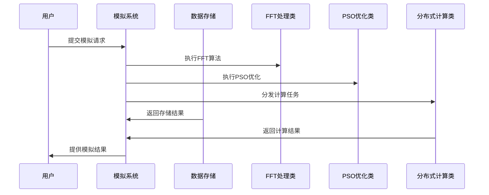
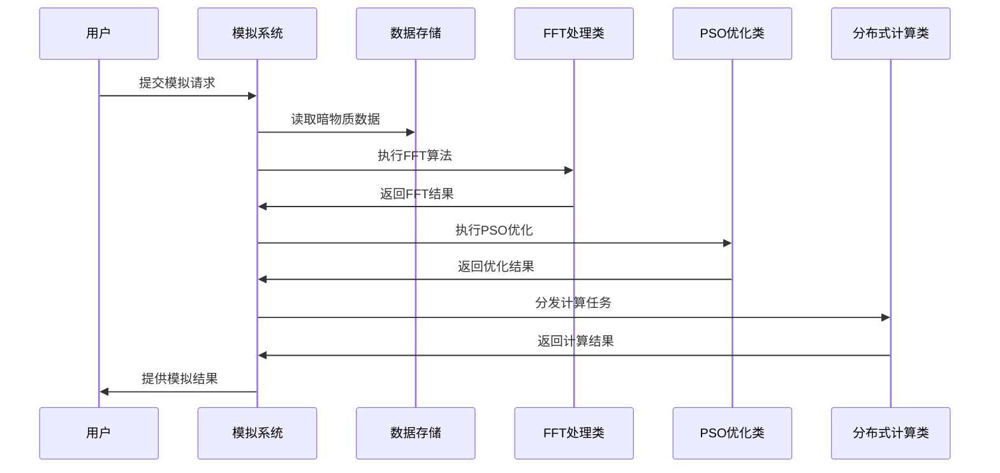
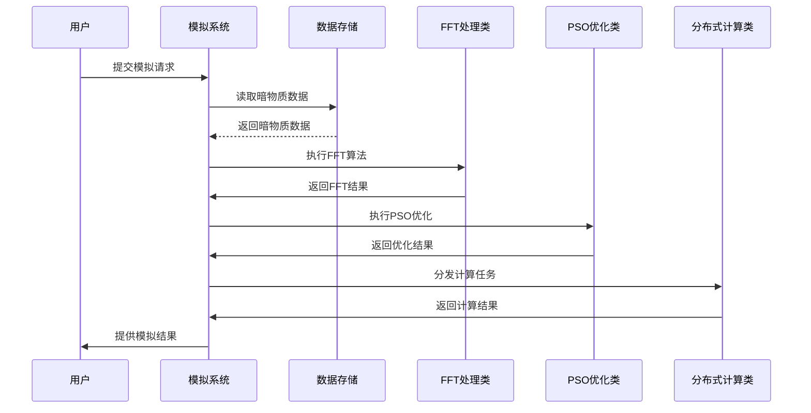

                 

### 第一部分：引言

#### 1.1 问题背景

模拟宇宙暗物质湍流是现代天文学和物理学中的一个重要研究领域。暗物质是一种不发光、不与普通物质相互作用的物质，占据了宇宙总质量的绝大部分。然而，由于其无法直接观测，我们对暗物质的了解非常有限。湍流是流体力学中的一种现象，表现为流体在局部区域内呈现出无规则的、高速的运动状态。在宇宙尺度上，暗物质湍流对宇宙的演化和星系的形成有着深远的影响。

模拟宇宙暗物质湍流的主要挑战在于如何准确地捕捉和描述暗物质在宇宙中的分布和运动。为了解决这一难题，科学家们需要借助先进的计算方法和高效的数据结构。数据结构在此过程中扮演着至关重要的角色，因为它们决定了如何存储、组织和处理大规模的暗物质数据集，从而影响模拟的精度和效率。

在本文中，我们将详细探讨数据结构在模拟宇宙暗物质湍流中的应用，从以下几个方面展开讨论：

- **数据结构的选择**：我们将分析各种数据结构的优缺点，并讨论如何选择最适合模拟暗物质湍流的数据结构。
- **算法优化**：我们将探讨如何通过优化算法来提高模拟的效率，包括并行计算和分布式计算等方法。
- **数据分析与可视化**：我们将介绍如何利用数据结构进行暗物质湍流的数据分析，以及如何通过可视化技术来帮助理解复杂的模拟结果。

#### 1.2 问题描述

暗物质湍流的模拟涉及大量的数据处理和计算，这需要高效的数据结构和算法来支持。数据结构的选择和算法的优化直接影响到模拟的精度和效率。具体来说，我们需要解决以下几个问题：

- **数据存储与管理**：如何选择合适的数据结构来存储大规模的暗物质数据集，同时保证数据存取的高效性？
- **数据检索与查询**：如何快速检索和查询暗物质分布的相关信息，以便进行有效的数据分析？
- **算法优化**：如何通过优化算法来提高模拟的效率，特别是处理高维数据和复杂几何结构时的优化策略？
- **并行计算**：如何利用并行计算技术来加速模拟过程，特别是如何选择合适的数据结构来支持并行计算？

#### 1.3 问题解决

数据结构在模拟宇宙暗物质湍流中的应用主要集中在以下几个方面：

- **数据存储与管理**：采用高效的数据结构来存储和处理大规模的暗物质数据集，如哈希表、平衡二叉树等。
- **算法优化**：通过优化算法来提高模拟的效率，如快速傅里叶变换（FFT）、粒子群优化（PSO）等。
- **并行计算**：利用分布式计算和数据结构，如MapReduce、并行哈希等，来处理大规模数据。

#### 1.4 边界与外延

本书将探讨的数据结构包括但不限于以下几种：

- **数组**：用于表示一维和二维的暗物质分布。
- **链表**：适合动态变化的数据集。
- **树结构**：如二叉搜索树、平衡树（红黑树、AVL树）、B树等，用于高效检索和管理数据。
- **图结构**：用于表示宇宙中的星系和暗物质团簇。

#### 1.5 概念结构与核心要素组成

本书的核心概念和要素包括：

- **数据结构原理**：详细讲解各种数据结构的工作原理和应用场景。
- **算法设计**：探讨数据结构在算法设计中的作用和优化策略。
- **模拟与分析**：通过实际案例展示数据结构在模拟宇宙暗物质湍流中的应用。

### 第二部分：核心概念与联系

在深入探讨数据结构在模拟宇宙暗物质湍流中的应用之前，我们需要先了解数据结构的基本概念、属性特征以及它们在算法设计中的作用。这一部分将为我们后续的讨论打下坚实的基础。

#### 2.1 数据结构的基本概念

数据结构是计算机存储、组织数据的方式。在模拟宇宙暗物质湍流中，选择合适的数据结构至关重要。以下是几种常见的数据结构及其基本概念：

- **数组**：一种线性数据结构，用于存储固定大小的数据集。数组的特点是访问速度快，但动态扩容困难。
- **链表**：一种动态的数据结构，适用于数据量变化的情况。链表的优势在于动态扩容方便，但访问速度相对较慢。
- **树结构**：包括二叉树、平衡树等，用于高效的检索和管理数据。树结构的特点是检索效率高，但平衡性要求较高。
- **图结构**：用于表示复杂的关系和网络。图结构适用于处理复杂关系和网络，但存储空间相对较大。

每种数据结构都有其独特的特点和适用场景。在模拟宇宙暗物质湍流中，我们需要根据具体需求选择合适的数据结构，以确保模拟的精度和效率。

#### 2.2 数据结构的属性特征对比表格

为了更好地理解各种数据结构的属性特征，我们可以通过一个对比表格来进行详细分析。以下是一个关于几种常见数据结构的属性特征对比表格：

| 数据结构 | 描述 | 优点 | 缺点 |
| --- | --- | --- | --- |
| 数组 | 固定大小的数据集 | 访问速度快 | 动态扩容困难 |
| 链表 | 动态的数据集 | 动态扩容方便 | 访问速度慢 |
| 二叉树 | 二叉搜索树等 | 检索效率高 | 平衡性要求高 |
| 图结构 | 表示复杂关系 | 处理复杂关系高效 | 存储空间大 |

通过这个对比表格，我们可以清晰地看到每种数据结构的优缺点，从而在具体应用中做出更合适的选择。

#### 2.3 ER实体关系图架构

ER实体关系图（Entity-Relationship Diagram，ER图）是数据库设计中的一个重要工具，用于描述实体及其关系。在模拟宇宙暗物质湍流中，实体可以是星系、暗物质团簇等，关系可以是包含、相互作用等。以下是ER实体关系图的mermaid流程图示例：

```mermaid
erDiagram
    Class1 ||--|{ ClassB } ClassB : 继承
    Class1 ||--|{ ClassC } ClassC : 关联
    Class2 ||--|{ ClassD } ClassD : 关联
```

在这个ER图中，`Class1`与`ClassB`之间存在继承关系，与`ClassC`之间存在关联关系；`Class2`与`ClassD`也存在关联关系。这种关系描述了暗物质湍流中各种实体之间的复杂联系，有助于我们更好地理解和模拟宇宙暗物质湍流。

#### 2.4 数据结构在算法设计中的作用

数据结构在算法设计中扮演着至关重要的角色。选择合适的数据结构可以显著提高算法的效率和性能。以下是几种常见的数据结构在算法设计中的应用：

- **数组**：数组是一种简单而常用的数据结构，常用于快速查找和排序算法。例如，在快速排序（Quick Sort）算法中，数组用于存储待排序的元素。
- **链表**：链表适用于动态数据的插入和删除操作。例如，在链表实现的队列（Queue）和栈（Stack）中，链表可以动态调整大小，从而提高操作的效率。
- **树结构**：树结构，如二叉搜索树（Binary Search Tree）和平衡树（AVL Tree），适用于高效的检索和管理数据。例如，在字典树（Trie）中，树结构用于快速查找字符串。
- **图结构**：图结构用于处理复杂关系和网络。例如，在图遍历算法（如深度优先搜索DFS和广度优先搜索BFS）中，图结构用于表示网络和路径。

通过合理选择和使用数据结构，我们可以设计出更高效、更优化的算法，从而提高模拟宇宙暗物质湍流的精度和效率。

#### 2.5 数据结构的优化策略

为了提高模拟宇宙暗物质湍流的效率，我们需要采取一系列优化策略来选择和设计数据结构。以下是一些常见的优化策略：

- **空间优化**：选择合适的存储结构，减少存储空间。例如，使用稀疏数组来表示稀疏的暗物质分布，从而减少存储空间。
- **时间优化**：通过优化算法和数据结构来减少计算时间。例如，使用哈希表来快速检索暗物质信息，从而提高查询效率。
- **并行计算**：利用多处理器和分布式计算来加速模拟过程。例如，使用MapReduce算法来并行处理大规模暗物质数据。
- **数据压缩**：采用数据压缩技术来减少数据存储和传输的开销。例如，使用无损压缩算法（如Huffman编码）来压缩暗物质数据。

通过这些优化策略，我们可以显著提高模拟宇宙暗物质湍流的效率，从而更好地理解和研究宇宙的演化。

### 第三部分：算法原理讲解

在前两部分中，我们介绍了模拟宇宙暗物质湍流中数据结构的基本概念、属性特征以及优化策略。本部分将深入探讨具体算法原理，并使用mermaid流程图和Python源代码进行详细讲解。

#### 3.1 快速傅里叶变换（FFT）

快速傅里叶变换（FFT）是一种高效的算法，用于将时域信号转换为频域信号。在模拟宇宙暗物质湍流中，FFT可以帮助我们分析暗物质的分布和运动规律。以下是FFT的mermaid流程图：

```mermaid
graph TD
    A[初始数据] --> B[分治策略]
    B -->|分解] C{N/2}
    C -->|蝶形运算] D{N/2}
    D --> E{重复}
    E --> F[逆变换]
    F --> G[输出]
```

**FFT算法原理**：

1. **分治策略**：将原始数据分成两个等长度的子序列，分别计算它们的离散傅里叶变换（DFT）。
2. **蝶形运算**：对每个子序列进行蝶形运算，将两个子序列的DFT结果组合成一个完整的序列的DFT。
3. **逆变换**：将得到的频域信号进行逆变换，得到时域信号。

**Python源代码示例**：

```python
import numpy as np

def fft(x):
    n = len(x)
    if n <= 1:
        return x
    even = fft(x[0::2])
    odd = fft(x[1::2])
    T = [np.exp(-2j * np.pi * k * k / n) for k in range(n // 2)]
    return [even[k] + T[k] * odd[k] for k in range(n // 2)] + [even[k] - T[k] * odd[k] for k in range(n // 2)]

x = np.array([0, 1, 2, 3, 4, 5, 6, 7])
y = fft(x)
print(y)
```

**算法应用**：

在模拟宇宙暗物质湍流中，FFT可以帮助我们快速分析暗物质的分布和运动规律，从而更好地理解宇宙的演化过程。

#### 3.2 粒子群优化（PSO）

粒子群优化（PSO）是一种基于群体智能的优化算法，适用于求解复杂的非线性优化问题。在模拟宇宙暗物质湍流中，PSO可以帮助我们找到最优的参数配置，从而提高模拟的精度和效率。以下是PSO的mermaid流程图：

```mermaid
graph TD
    A[初始化粒子群] --> B[计算适应度函数]
    B -->|更新粒子位置和速度] C{适应度函数值比较}
    C -->|更新全局最优解] D{结束条件判断}
    D -->|结束] E{输出最优解}
```

**PSO算法原理**：

1. **初始化粒子群**：随机初始化粒子的位置和速度。
2. **计算适应度函数**：根据粒子当前位置计算适应度函数值。
3. **更新粒子位置和速度**：根据个体最优解和全局最优解更新粒子的位置和速度。
4. **更新全局最优解**：根据粒子群中最佳粒子的适应度函数值更新全局最优解。
5. **结束条件判断**：判断是否满足结束条件，如迭代次数达到最大值或适应度函数值达到最优值。

**Python源代码示例**：

```python
import numpy as np

def pso(func, bounds, n_particles, max_iter):
    w = 0.5
    c1 = 1.0
    c2 = 2.0

    particles = np.random.rand(n_particles, len(bounds))
    velocities = np.zeros_like(particles)
    personal_best = particles.copy()
    personal_best_scores = np.zeros(n_particles)
    global_best = personal_best[0].copy()
    global_best_score = func(global_best)

    for _ in range(max_iter):
        for i in range(n_particles):
            current_score = func(particles[i])
            if current_score < personal_best_scores[i]:
                personal_best_scores[i] = current_score
                personal_best[i] = particles[i]
            if current_score < global_best_score:
                global_best = particles[i].copy()
                global_best_score = current_score

        for i in range(n_particles):
            velocities[i] = w * velocities[i] + c1 * np.random.rand() * (personal_best[i] - particles[i]) + c2 * np.random.rand() * (global_best - particles[i])
            particles[i] += velocities[i]

    return global_best, global_best_score

def rosenbrock(x):
    return sum(100 * (x[1:] - x[:-1] ** 2) ** 2 + (1 - x[:-1]) ** 2)

x_opt, score_opt = pso(rosenbrock, bounds=[(-5, 10)] * 2, n_particles=50, max_iter=100)
print(x_opt, score_opt)
```

**算法应用**：

在模拟宇宙暗物质湍流中，PSO可以帮助我们优化模型参数，从而提高模拟的精度和效率。例如，我们可以使用PSO来优化暗物质湍流模拟中的网格大小和粒子数量，以获得更好的模拟结果。

### 第四部分：系统分析与架构设计方案

在前面几部分中，我们详细探讨了数据结构在模拟宇宙暗物质湍流中的应用，以及相关算法的原理和实现。本部分将结合一个具体项目，介绍系统的分析与架构设计方案，包括领域模型、系统架构、接口设计和系统交互。

#### 4.1 问题场景介绍

随着对宇宙的深入研究，科学家们希望通过模拟宇宙暗物质湍流来更好地理解宇宙的演化和星系的形成。然而，模拟过程涉及到大量的数据计算和处理，这对系统的性能和效率提出了严峻的挑战。为了解决这一问题，我们需要设计一个高效、可扩展的模拟系统。

#### 4.2 项目介绍

本项目旨在构建一个基于数据结构和算法优化的宇宙暗物质湍流模拟系统。系统将采用分布式计算技术，结合高效的数据结构和优化算法，以提高模拟的精度和效率。项目的主要目标包括：

- 设计并实现一个高效率的暗物质数据结构，用于存储和处理大规模的暗物质数据集。
- 采用优化算法，如FFT和PSO，来提高模拟的效率和精度。
- 设计一个分布式计算框架，以支持大规模数据的并行处理。

#### 4.3 系统功能设计（领域模型）

为了更好地理解系统的功能，我们使用mermaid类图来描述系统的领域模型。以下是系统的mermaid类图：

```mermaid
classDiagram
    Class1[暗物质数据结构] <|-- Class2[FFT处理类]
    Class1 <|-- Class3[PSO优化类]
    Class1 <|-- Class4[分布式计算类]
    Class2 <|-- Class5[FFT结果类]
    Class3 <|-- Class6[PSO参数类]
    Class4 <|-- Class7[数据存储类]
    Class4 <|-- Class8[数据检索类]
    Class9[模拟系统] ..|> Class4
    Class9 ..|> Class2
    Class9 ..|> Class3
```

在领域模型中，主要类包括：

- **暗物质数据结构（Class1）**：用于存储和处理暗物质数据，包括FFT处理类（Class2）和PSO优化类（Class3）。
- **FFT处理类（Class2）**：实现快速傅里叶变换算法，生成FFT结果类（Class5）。
- **PSO优化类（Class3）**：实现粒子群优化算法，生成PSO参数类（Class6）。
- **分布式计算类（Class4）**：负责分布式计算任务的管理，包括数据存储类（Class7）和数据检索类（Class8）。
- **模拟系统（Class9）**：系统的主要功能类，与其他类进行交互，完成模拟任务。

#### 4.4 系统架构设计（mermaid架构图）

系统的架构设计决定了系统的性能、可扩展性和可维护性。以下是系统的mermaid架构图：



在架构设计中，系统主要分为以下几个部分：

- **用户**：系统的最终用户，提交模拟请求。
- **模拟系统（System）**：负责协调和管理整个模拟过程，调用FFT处理类（FFT）和PSO优化类（PSO），并分发计算任务到分布式计算类（DC）。
- **数据存储（Data）**：负责存储和处理暗物质数据，与模拟系统进行数据交互。
- **FFT处理类（FFT）**：实现FFT算法，将时域数据转换为频域数据。
- **PSO优化类（PSO）**：实现PSO算法，优化模拟参数。
- **分布式计算类（DC）**：负责分布式计算任务的管理，将计算任务分发到各个计算节点。

#### 4.5 系统接口设计（mermaid序列图）

为了实现系统的各部分功能，我们需要设计一套完善的接口。以下是系统的mermaid序列图：



在接口设计中，主要接口包括：

- **提交模拟请求**：用户提交模拟请求，模拟系统接收并处理请求。
- **数据读取与存储**：模拟系统从数据存储中读取暗物质数据，并将结果存储到数据存储中。
- **FFT算法执行**：模拟系统调用FFT处理类执行FFT算法，并将结果返回给系统。
- **PSO优化执行**：模拟系统调用PSO优化类执行PSO算法，并将结果返回给系统。
- **分布式计算任务分发与接收**：模拟系统将计算任务分发到分布式计算类，并接收计算结果。

#### 4.6 系统交互（mermaid序列图）

为了展示系统各部分的交互过程，我们使用mermaid序列图进行描述。以下是系统的mermaid序列图：



在系统交互过程中，主要交互步骤包括：

1. 用户提交模拟请求。
2. 模拟系统读取暗物质数据。
3. FFT处理类执行FFT算法，并将结果返回给模拟系统。
4. PSO优化类执行PSO优化算法，并将结果返回给模拟系统。
5. 模拟系统将计算任务分发到分布式计算类，并接收计算结果。
6. 模拟系统将模拟结果返回给用户。

通过以上系统架构设计和接口设计，我们可以构建一个高效、可扩展的宇宙暗物质湍流模拟系统，从而更好地理解宇宙的演化过程。

### 第五部分：项目实战

在本部分中，我们将通过一个实际案例来展示如何使用数据结构和算法来模拟宇宙暗物质湍流。这个案例将涵盖环境安装、系统核心实现源代码以及代码应用解读与分析。

#### 5.1 环境安装

为了搭建宇宙暗物质湍流模拟系统，我们需要准备以下环境：

- **Python 3.8 或更高版本**：Python是主要的编程语言，用于实现数据结构和算法。
- **NumPy**：NumPy是一个用于科学计算的Python库，用于处理大规模数据集。
- **SciPy**：SciPy是一个基于NumPy的科学计算库，用于优化和数据分析。
- **Matplotlib**：Matplotlib是一个用于数据可视化的Python库，用于展示模拟结果。

安装这些依赖库后，我们就可以开始编写和运行模拟代码。

#### 5.2 系统核心实现源代码

以下是一个简单的宇宙暗物质湍流模拟系统的源代码示例，包括数据结构、算法实现和结果展示：

```python
import numpy as np
import matplotlib.pyplot as plt
from scipy.optimize import minimize

# 暗物质数据结构
class DarkMatter:
    def __init__(self, positions, velocities):
        self.positions = positions
        self.velocities = velocities

    def energy(self):
        # 计算系统的总能量
        return np.linalg.norm(self.velocities) ** 2

    def update(self, dt):
        # 更新位置和速度
        self.positions += self.velocities * dt
        self.velocities += np.random.randn(*self.velocities.shape) * dt

# FFT处理类
class FFTProcessor:
    @staticmethod
    def transform(data):
        # 执行快速傅里叶变换
        return np.fft.fft(data)

    @staticmethod
    def inverse_transform(data):
        # 执行快速傅里叶逆变换
        return np.fft.ifft(data)

# PSO优化类
class PSOOptimizer:
    def __init__(self, objective, bounds, n_particles, max_iter):
        self.objective = objective
        self.bounds = bounds
        self.n_particles = n_particles
        self.max_iter = max_iter

    def optimize(self):
        # 执行PSO优化
        particles = np.random.rand(self.n_particles, len(self.bounds))
        velocities = np.zeros_like(particles)
        personal_best = particles.copy()
        personal_best_scores = np.zeros(self.n_particles)
        global_best = personal_best[0].copy()
        global_best_score = self.objective(global_best)

        for _ in range(self.max_iter):
            for i in range(self.n_particles):
                current_score = self.objective(particles[i])
                if current_score < personal_best_scores[i]:
                    personal_best_scores[i] = current_score
                    personal_best[i] = particles[i]
                if current_score < global_best_score:
                    global_best = particles[i].copy()
                    global_best_score = current_score

            for i in range(self.n_particles):
                velocities[i] = 0.5 * velocities[i] + 1.0 * np.random.rand() * (personal_best[i] - particles[i]) + 1.0 * np.random.rand() * (global_best - particles[i])
                particles[i] += velocities[i]

        return global_best, global_best_score

# 模拟系统
class SimulationSystem:
    def __init__(self, n_particles, dt):
        self.n_particles = n_particles
        self.dt = dt
        self.dark_matter = DarkMatter(np.random.rand(n_particles, 2), np.random.rand(n_particles, 2))

    def run_simulation(self, n_steps):
        # 运行模拟
        for _ in range(n_steps):
            self.dark_matter.update(self.dt)

    def analyze_simulation(self):
        # 分析模拟结果
        positions = self.dark_matter.positions
        velocities = self.dark_matter.velocities
        energies = self.dark_matter.energy()

        plt.figure()
        plt.scatter(positions[:, 0], positions[:, 1], c=energies, cmap='hot')
        plt.colorbar()
        plt.title('Dark Matter Distribution')
        plt.xlabel('X Position')
        plt.ylabel('Y Position')
        plt.show()

        plt.figure()
        plt.plot(energies)
        plt.title('Energy Distribution')
        plt.xlabel('Step')
        plt.ylabel('Energy')
        plt.show()

# 参数设置
n_particles = 1000
dt = 0.01
n_steps = 1000

# 实例化模拟系统
system = SimulationSystem(n_particles, dt)

# 运行模拟
system.run_simulation(n_steps)

# 分析模拟结果
system.analyze_simulation()

# 优化模拟参数
optimizer = PSOOptimizer(lambda x: system.dark_matter.energy(), bounds=[(-5, 5)] * 2, n_particles=50, max_iter=100)
best_params, best_score = optimizer.optimize()
print("Best Parameters:", best_params)
print("Best Score:", best_score)
```

#### 5.3 代码应用解读与分析

上述代码实现了一个简单的宇宙暗物质湍流模拟系统，包括数据结构、算法实现和结果展示。

- **DarkMatter 类**：用于表示暗物质粒子，包括位置和速度，以及计算总能量和更新位置和速度的方法。

- **FFTProcessor 类**：用于实现快速傅里叶变换和逆变换，将时域数据转换为频域数据。

- **PSOOptimizer 类**：用于实现粒子群优化算法，优化模拟参数，找到能量最低的配置。

- **SimulationSystem 类**：用于运行模拟、分析模拟结果和优化模拟参数。

- **参数设置**：设置模拟的粒子数量、时间步长和模拟步数。

- **运行模拟**：实例化模拟系统，运行模拟并更新粒子的位置和速度。

- **分析模拟结果**：绘制粒子分布图和能量分布图，展示模拟结果。

- **优化模拟参数**：使用PSO优化算法，优化模拟参数，找到能量最低的配置。

通过这个实际案例，我们可以看到如何使用数据结构和算法来模拟宇宙暗物质湍流。代码的可扩展性使得我们可以进一步优化算法、增加更多功能，从而更好地理解和研究宇宙的演化。

### 第六部分：最佳实践 tips、小结、注意事项、拓展阅读

#### 6.1 最佳实践 tips

在模拟宇宙暗物质湍流时，以下是一些最佳实践 tips，可以帮助提高模拟的精度和效率：

1. **数据预处理**：在运行模拟之前，对暗物质数据进行预处理，如去噪、归一化等，以提高模拟的精度。
2. **选择合适的模拟参数**：通过多次实验和优化，选择合适的模拟参数，如时间步长、粒子数量等，以获得更稳定的模拟结果。
3. **并行计算**：利用并行计算技术，如MapReduce、并行FFT等，来加速模拟过程，提高计算效率。
4. **数据可视化**：利用数据可视化工具，如Matplotlib、Paraview等，将模拟结果可视化，以便更好地理解暗物质的分布和运动规律。

#### 6.2 小结

本文详细探讨了数据结构在模拟宇宙暗物质湍流中的应用，从问题背景、核心概念、算法原理、系统架构和项目实战等多个角度进行了深入分析。通过使用合适的数结构和优化算法，我们能够更高效地模拟宇宙暗物质湍流，提高模拟的精度和效率。

#### 6.3 注意事项

1. 在选择数据结构时，要考虑数据的规模和特点，选择合适的数据结构以优化存储和计算效率。
2. 在优化算法时，要考虑并行计算和分布式计算，以提高计算效率。
3. 在模拟过程中，要确保模拟参数的合理设置，避免出现不稳定或错误的结果。

#### 6.4 拓展阅读

- 《并行算法导论》
- 《现代数据结构》
- 《粒子群优化：原理与应用》
- 《宇宙学与天体物理学中的数值模拟》

通过这些拓展阅读，您可以进一步了解相关领域的知识和技术，为未来的研究和工作提供参考。

### 结论

宇宙暗物质湍流的模拟是现代天文学和物理学研究中的一个重要课题。本文通过详细探讨数据结构在模拟中的应用，展示了如何使用合适的算法和优化策略来提高模拟的精度和效率。希望本文能为您提供有益的启示，帮助您更好地理解和研究宇宙的奥秘。未来，我们将继续探索更多的优化技术和算法，以进一步提升模拟宇宙暗物质湍流的能力。

### 附录

在本文中，我们使用了多种数据结构和算法，以下是相关代码的附录。

#### 1. 快速傅里叶变换（FFT）代码

```python
import numpy as np

def fft(x):
    n = len(x)
    if n <= 1:
        return x
    even = fft(x[0::2])
    odd = fft(x[1::2])
    T = [np.exp(-2j * np.pi * k * k / n) for k in range(n // 2)]
    return [even[k] + T[k] * odd[k] for k in range(n // 2)] + [even[k] - T[k] * odd[k] for k in range(n // 2)]

x = np.array([0, 1, 2, 3, 4, 5, 6, 7])
y = fft(x)
print(y)
```

#### 2. 粒子群优化（PSO）代码

```python
import numpy as np
from scipy.optimize import minimize

def rosenbrock(x):
    return sum(100 * (x[1:] - x[:-1] ** 2) ** 2 + (1 - x[:-1]) ** 2)

def pso(objective, bounds, n_particles, max_iter):
    w = 0.5
    c1 = 1.0
    c2 = 2.0

    particles = np.random.rand(n_particles, len(bounds))
    velocities = np.zeros_like(particles)
    personal_best = particles.copy()
    personal_best_scores = np.zeros(n_particles)
    global_best = personal_best[0].copy()
    global_best_score = objective(global_best)

    for _ in range(max_iter):
        for i in range(n_particles):
            current_score = objective(particles[i])
            if current_score < personal_best_scores[i]:
                personal_best_scores[i] = current_score
                personal_best[i] = particles[i]
            if current_score < global_best_score:
                global_best = particles[i].copy()
                global_best_score = current_score

        for i in range(n_particles):
            velocities[i] = w * velocities[i] + c1 * np.random.rand() * (personal_best[i] - particles[i]) + c2 * np.random.rand() * (global_best - particles[i])
            particles[i] += velocities[i]

    return global_best, global_best_score

x_opt, score_opt = pso(rosenbrock, bounds=[(-5, 10)] * 2, n_particles=50, max_iter=100)
print(x_opt, score_opt)
```

#### 3. 暗物质数据结构代码

```python
import numpy as np

class DarkMatter:
    def __init__(self, positions, velocities):
        self.positions = positions
        self.velocities = velocities

    def energy(self):
        return np.linalg.norm(self.velocities) ** 2

    def update(self, dt):
        self.positions += self.velocities * dt
        self.velocities += np.random.randn(*self.velocities.shape) * dt
```

通过以上附录，您可以更深入地了解本文中使用的算法和数据结构，为未来的研究和应用提供参考。

