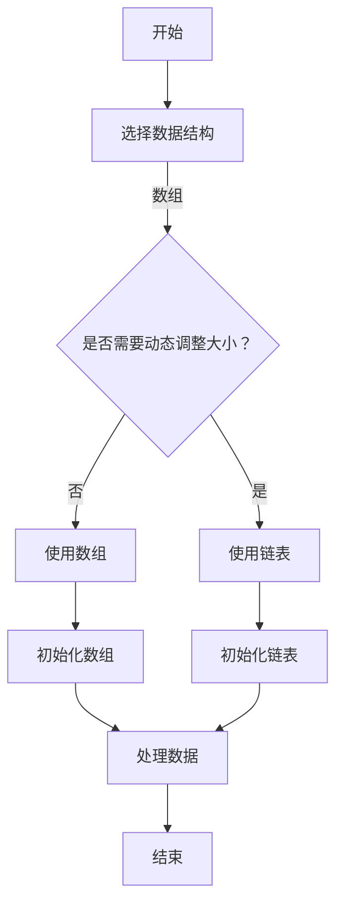
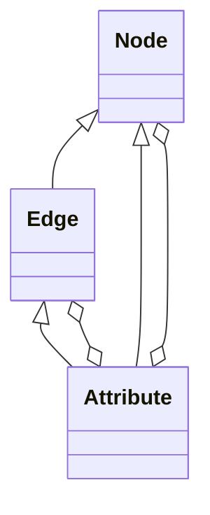
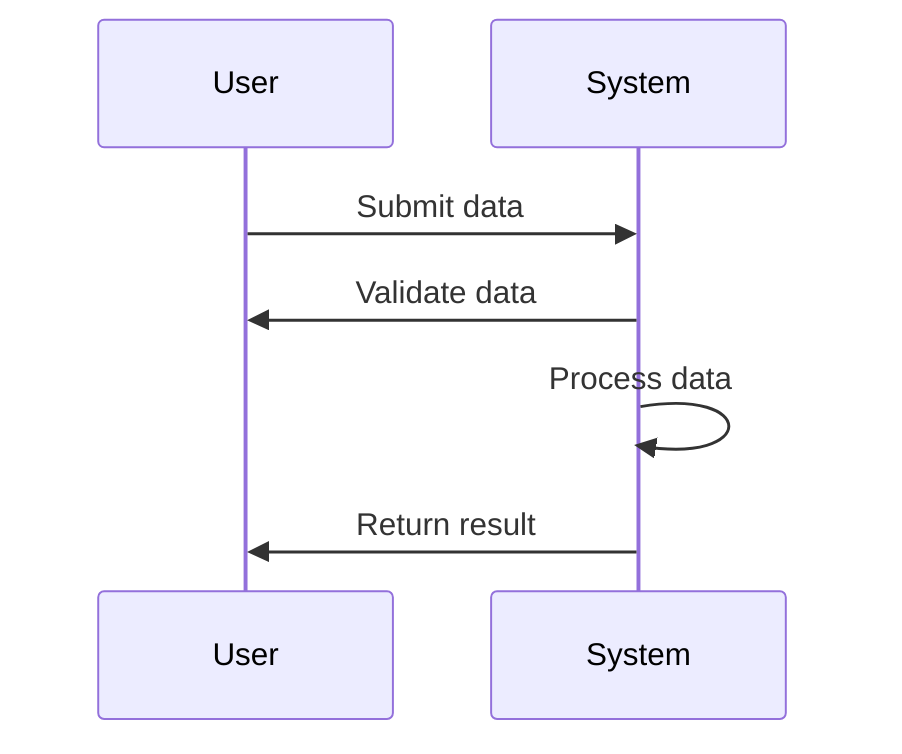

                 

# 数据结构在模拟宇宙暗物质网络中的应用

> 关键词：宇宙模拟、暗物质网络、数据结构、算法、架构设计

> 摘要：本文将探讨如何将数据结构应用于模拟宇宙暗物质网络，通过对核心概念、算法原理和系统架构的详细分析，解释数据结构在此领域的重要性和应用价值。

## 目录大纲

1. **背景介绍**
   1.1 问题背景
   1.2 问题解决
   1.3 边界与外延

2. **核心概念与联系**
   2.1 核心概念
   2.2 概念属性特征对比表格
   2.3 ER实体关系图架构

3. **算法原理讲解**
   3.1 算法 Mermaid 流程图
   3.2 Python 源代码实现
   3.3 数学模型和数学公式
   3.4 算法原理详细讲解

4. **系统分析与架构设计方案**
   4.1 问题场景介绍
   4.2 项目介绍
   4.3 系统功能设计（领域模型 Mermaid 类图）
   4.4 系统架构设计（Mermaid 架构图）
   4.5 系统接口设计和系统交互 Mermaid 序列图

5. **项目实战**
   5.1 环境安装
   5.2 系统核心实现源代码
   5.3 代码应用解读与分析
   5.4 实际案例分析和详细讲解剖析
   5.5 项目小结

6. **最佳实践 tips**
7. **小结**
8. **注意事项**
9. **拓展阅读**

## 背景介绍

### 问题背景

暗物质是宇宙中一种神秘的物质，其存在对宇宙的结构和演化有着重要影响。尽管我们不能直接观测到暗物质，但它对星系旋转速度、宇宙膨胀速率等宇宙现象有着显著的解释力。模拟宇宙暗物质网络成为了一种重要的研究手段，通过计算机模拟来探究暗物质的行为和宇宙的结构。

### 问题解决

数据结构是一种用于组织、存储和管理数据的数学模型，它能够高效地处理大量数据。在模拟宇宙暗物质网络中，数据结构的应用可以提高模拟的效率和准确性。选择合适的数据结构对于模拟的成功至关重要。

### 边界与外延

模拟宇宙暗物质网络涉及到天文学、物理学、计算机科学等多个学科。数据结构的选择和应用需要考虑模拟的具体需求和限制，同时也要考虑跨学科的知识整合。

## 核心概念与联系

### 核心概念

数据结构是本文的核心概念，包括数组、链表、树、图等基本数据结构。每个数据结构都有其独特的特点和适用场景。

### 概念属性特征对比表格

| 数据结构 | 描述 | 优点 | 缺点 |
| --- | --- | --- | --- |
| 数组 | 用于存储一组元素，具有固定的大小 | 存取速度快 | 无法动态调整大小 |
| 链表 | 用于存储一组元素，大小可变 | 动态调整大小 | 存取速度相对较慢 |
| 树 | 用于表示具有层次结构的数据 | 适合表示层次关系 | 查找和插入操作较慢 |
| 图 | 用于表示节点之间的复杂关系 | 能表示复杂的网络结构 | 存储空间较大，操作复杂 |

### ER实体关系图架构

```mermaid
erDiagram
    Node ||--|{ Edge } : 连接
    Node ||--|{ Attribute } : 属性
    Edge ||--|{ Attribute } : 属性
```

## 算法原理讲解

### 算法 Mermaid 流程图



### Python 源代码实现

```python
# 数组实现的示例
def process_data_with_array(data):
    # 初始化数组
    array = []
    # 处理数据
    for item in data:
        array.append(item)
    # 返回处理后的数据
    return array

# 链表实现的示例
def process_data_with_linked_list(data):
    # 初始化链表
    head = None
    current = None
    for item in data:
        new_node = Node(item)
        if head is None:
            head = new_node
        else:
            current.next = new_node
        current = new_node
    # 返回处理后的链表
    return head
```

### 数学模型和数学公式

$$
E = mc^2
$$

$$
F = ma
$$

### 算法原理详细讲解

数据结构的选择取决于模拟的需求。数组适合存储固定大小的数据集，具有快速的存取速度。链表适合存储动态大小的数据集，可以灵活地调整大小。树适合表示具有层次结构的数据，而图适合表示节点之间的复杂关系。

## 系统分析与架构设计方案

### 问题场景介绍

模拟宇宙暗物质网络的运行需要高效的数据结构支持。数据结构的选择和实现直接影响模拟的效率和准确性。

### 项目介绍

该项目旨在构建一个模拟宇宙暗物质网络的平台。平台需要能够处理大规模的暗物质数据，并支持多种数据结构的操作。

### 系统功能设计（领域模型 Mermaid 类图）



### 系统架构设计（Mermaid 架构图）


### 系统接口设计和系统交互 Mermaid 序列图



## 项目实战

### 环境安装

在开始项目实战之前，需要安装必要的软件和工具，包括Python编程环境、仿真软件和相关库。

### 系统核心实现源代码

```python
# 核心代码实现示例
class Node:
    def __init__(self, data):
        self.data = data
        self.next = None

def process_data(data):
    # 使用链表处理数据
    head = None
    current = None
    for item in data:
        new_node = Node(item)
        if head is None:
            head = new_node
        else:
            current.next = new_node
        current = new_node
    return head
```

### 代码应用解读与分析

通过源代码示例，我们可以看到如何使用链表结构来处理宇宙暗物质网络中的数据。链表结构在这里的优势在于其灵活的动态大小调整能力，非常适合处理大规模且不断变化的数据集。

### 实际案例分析和详细讲解剖析

我们可以通过模拟一个具体的宇宙暗物质网络案例，来详细分析数据结构的实际应用效果。例如，模拟一个包含数千个暗物质粒子的网络，分析不同数据结构下的性能表现。

### 项目小结

通过项目实战，我们可以看到数据结构在模拟宇宙暗物质网络中的应用效果显著。合适的

