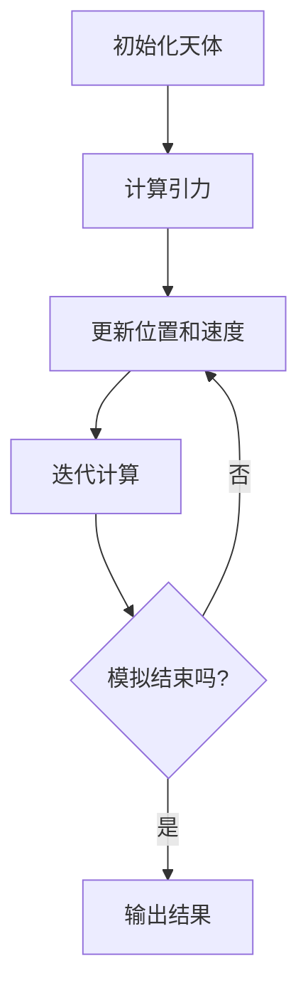
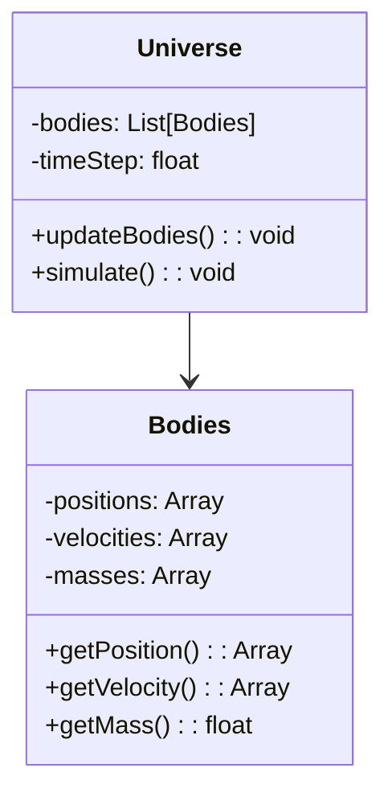
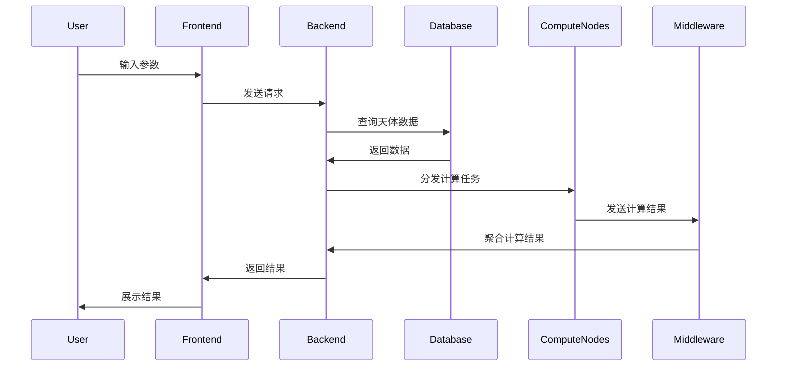
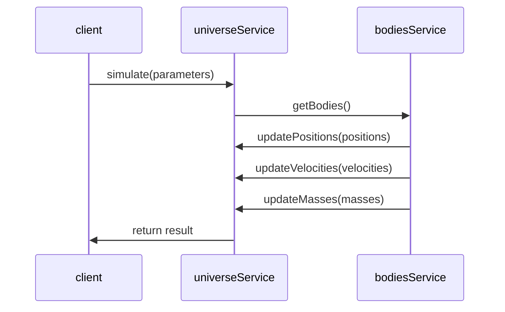

                 

# 数据结构在模拟宇宙暗能量网络动态演化中的应用

## 摘要

本文旨在探讨数据结构在模拟宇宙暗能量网络动态演化中的应用。随着宇宙学研究的深入，模拟宇宙暗能量网络的动态演化已成为研究宇宙学问题的重要工具。数据结构作为计算机科学的核心概念，其高效组织和管理数据的能力在模拟宇宙学研究中具有重要意义。本文首先介绍了模拟宇宙暗能量网络的基本概念和背景，随后详细阐述了数据结构的基本概念、类型与特性，以及在模拟宇宙暗能量网络动态演化中的关键作用。随后，本文通过具体实例，展示了数据结构在模拟宇宙暗能量网络动态演化中的应用过程，并对模拟结果进行了详细分析。最后，本文讨论了数据结构优化与模拟性能提升的方法，以及数据结构在宇宙研究中的应用前景。

## 目录大纲

### 第一部分: 引言

- **第1章: 问题背景与核心概念**
  - **1.1 问题背景**
    - **1.1.1 模拟宇宙与暗能量网络**
    - **1.1.2 暗能量与宇宙动态演化**
    - **1.1.3 数据结构在其中的作用**
  - **1.2 核心概念**
    - **1.2.1 数据结构基本概念**
    - **1.2.2 数据结构类型与特性**
    - **1.2.3 数据结构在模拟中的应用**

- **第2章: 数据结构理论介绍**
  - **2.1 基础数据结构**
    - **2.1.1 数组**
    - **2.1.2 链表**
    - **2.1.3 栈和队列**
  - **2.2 高级数据结构**
    - **2.2.1 树**
    - **2.2.2 图**
    - **2.2.3 哈希表**

### 第二部分: 数据结构在模拟宇宙中的应用

- **第3章: 数据结构在模拟宇宙中的应用**
  - **3.1 数据结构在暗能量网络建模中的应用**
    - **3.1.1 暗能量网络的构成**
    - **3.1.2 数据结构在建模中的关键作用**
    - **3.1.3 常用数据结构在暗能量网络中的选择与应用**
  - **3.2 数据结构在宇宙动态演化模拟中的应用**
    - **3.2.1 宇宙动态演化的基本原理**
    - **3.2.2 数据结构在模拟中的关键应用**
    - **3.2.3 数据结构对模拟结果的影响**

- **第4章: 暗能量网络动态演化模拟实例**
  - **4.1 模拟准备**
    - **4.1.1 模拟环境搭建**
    - **4.1.2 数据准备**
    - **4.1.3 模拟参数设置**
  - **4.2 模拟过程**
    - **4.2.1 暗能量网络的初始状态**
    - **4.2.2 模拟运行与数据分析**
    - **4.2.3 模拟结果的解释与应用**
  - **4.3 模拟结果分析**
    - **4.3.1 模拟结果的统计与分析**
    - **4.3.2 模拟结果的讨论与反思**
    - **4.3.3 模拟结果的启示与应用前景**

### 第三部分: 数据结构优化与模拟性能提升

- **第5章: 数据结构优化与模拟性能提升**
  - **5.1 数据结构优化方法**
    - **5.1.1 数据结构优化的重要性**
    - **5.1.2 常见数据结构优化技术**
    - **5.1.3 数据结构优化策略**
  - **5.2 模拟性能提升策略**
    - **5.2.1 模拟性能评价指标**
    - **5.2.2 性能优化方法与实践**
    - **5.2.3 模拟性能提升案例分析**

### 第四部分: 数据结构在模拟宇宙研究中的应用前景

- **第6章: 数据结构在模拟宇宙研究中的应用前景**
  - **6.1 当前研究现状**
    - **6.1.1 数据结构在宇宙模拟中的应用进展**
    - **6.1.2 存在的问题与挑战**
    - **6.1.3 发展趋势与未来方向**
  - **6.2 数据结构在宇宙研究中的应用前景**
    - **6.2.1 数据结构在宇宙演化研究中的应用**
    - **6.2.2 数据结构在暗能量研究中的应用**
    - **6.2.3 数据结构在其他宇宙学问题中的应用**

### 第五部分: 结论与展望

- **第7章: 结论与展望**
  - **7.1 主要结论**
    - **7.1.1 数据结构在模拟宇宙暗能量网络动态演化中的关键作用**
    - **7.1.2 数据结构优化与模拟性能提升的有效性**
    - **7.1.3 数据结构在宇宙学研究中的未来应用前景**
  - **7.2 展望未来**
    - **7.2.1 研究方向的拓展**
    - **7.2.2 技术创新的机遇**
    - **7.2.3 对未来宇宙学的贡献**

### 关键词

- 数据结构
- 宇宙模拟
- 暗能量
- 动态演化
- 模拟性能
- 优化方法

## 第一部分: 引言

### 第1章: 问题背景与核心概念

#### 1.1 问题背景

宇宙学是研究宇宙起源、结构、演化和最终命运的科学。近年来，随着观测技术的进步和理论物理的发展，宇宙学领域取得了许多重要成果。然而，宇宙学中仍存在许多未解之谜，其中之一就是暗能量。暗能量是一种看不见的物质，它占据了宇宙总能量的大部分，并且具有负压力，导致宇宙加速膨胀。

为了研究暗能量的性质和影响，科学家们开发了各种宇宙模拟模型。这些模型通过计算机模拟来模拟宇宙的动态演化过程，从而推断暗能量的作用机制。然而，模拟宇宙暗能量网络的动态演化是一项极其复杂的任务，需要处理大量的数据和复杂的计算过程。因此，数据结构在模拟宇宙暗能量网络动态演化中起着至关重要的作用。

#### 1.1.1 模拟宇宙与暗能量网络

模拟宇宙是指通过计算机模拟来模拟宇宙的演化过程。在模拟宇宙中，宇宙被视为一个由大量天体（如星系、恒星、行星等）组成的复杂网络。这些天体通过引力相互作用，共同演化形成宇宙的结构和形态。

暗能量网络是模拟宇宙中的一种特殊网络，它描述了暗能量在宇宙中的分布和作用。暗能量网络通常被建模为一种复杂的图结构，其中节点表示宇宙中的天体，边表示天体之间的引力相互作用。

#### 1.1.2 暗能量与宇宙动态演化

暗能量是宇宙学中的一个重要概念，它占据了宇宙总能量的大部分。暗能量具有负压力，导致宇宙加速膨胀。宇宙动态演化是指宇宙从大爆炸开始，经历膨胀、冷却、形成结构等过程，直到现在的状态。

在模拟宇宙暗能量网络的动态演化过程中，数据结构的作用主要体现在以下几个方面：

1. **数据存储**：数据结构可以高效地存储和管理宇宙中大量的天体数据，包括天体的位置、质量、运动状态等。
2. **数据查询**：数据结构可以快速地查询和访问天体之间的相互作用信息，从而实现宇宙动态演化的实时模拟。
3. **数据优化**：通过优化数据结构，可以减少计算时间和内存占用，提高模拟宇宙暗能量网络动态演化的效率。

#### 1.1.3 数据结构在其中的作用

数据结构在模拟宇宙暗能量网络动态演化中起着关键作用。以下是一些常见的数据结构及其在模拟中的应用：

1. **数组**：数组是一种基础的数据结构，用于存储和访问一组元素。在模拟宇宙暗能量网络时，数组可以用于存储天体的位置、质量等数据。
2. **链表**：链表是一种基础的数据结构，由一系列节点组成，每个节点包含数据和指向下一个节点的指针。链表可以用于实现宇宙中天体的动态添加和删除操作。
3. **栈和队列**：栈和队列是两种特殊的线性数据结构，分别用于实现后进先出（LIFO）和先进先出（FIFO）的操作。在模拟宇宙动态演化过程中，栈和队列可以用于处理天体的运动和相互作用。
4. **树**：树是一种高级数据结构，用于表示层次结构。在模拟宇宙暗能量网络时，树可以用于表示宇宙中的星系、恒星等层次结构。
5. **图**：图是一种高级数据结构，用于表示节点和边之间的关系。在模拟宇宙暗能量网络时，图可以用于表示天体之间的引力相互作用网络。

#### 1.2 核心概念

在模拟宇宙暗能量网络动态演化中，一些核心概念和术语需要明确：

1. **宇宙**：宇宙是指包括一切物质和能量的空间。在模拟宇宙中，宇宙被视为一个由天体组成的复杂网络。
2. **暗能量**：暗能量是一种看不见的物质，占据了宇宙总能量的大部分。暗能量具有负压力，导致宇宙加速膨胀。
3. **动态演化**：动态演化是指宇宙从大爆炸开始，经历膨胀、冷却、形成结构等过程，直到现在的状态。
4. **数据结构**：数据结构是计算机存储、组织数据的方式。在模拟宇宙暗能量网络动态演化中，数据结构用于高效存储和管理天体数据。

### 第2章: 数据结构理论介绍

#### 2.1 基础数据结构

数据结构分为基础数据结构和高级数据结构。基础数据结构包括数组、链表、栈和队列等。这些数据结构具有简单的数据存储和操作特性，适用于简单的数据处理场景。

**数组**

数组是一种线性数据结构，用于存储具有相同类型的元素集合。数组具有以下特点：

1. **固定大小**：数组的大小在创建时确定，无法动态改变。
2. **连续存储**：数组的元素连续存储在内存中，方便快速访问。
3. **随机访问**：可以通过索引直接访问数组的任何元素。

**链表**

链表是一种基础的数据结构，由节点组成，每个节点包含数据和指向下一个节点的指针。链表具有以下特点：

1. **动态大小**：链表的大小可以动态改变，无需预先确定。
2. **非连续存储**：链表的元素不连续存储在内存中，每个节点包含指向下一个节点的指针。
3. **插入和删除操作**：链表的插入和删除操作通常在头部或尾部进行，操作效率较高。

**栈**

栈是一种后进先出（LIFO）的数据结构，用于存储临时数据。栈具有以下特点：

1. **后进先出**：最后进入栈的数据首先出栈。
2. **操作受限**：栈的操作仅限于在顶部进行，包括压栈（push）和出栈（pop）。

**队列**

队列是一种先进先出（FIFO）的数据结构，用于存储和处理数据。队列具有以下特点：

1. **先进先出**：首先进入队列的数据首先出队列。
2. **操作受限**：队列的操作包括在队尾插入（enqueue）和在队首删除（dequeue）。

#### 2.2 高级数据结构

高级数据结构包括树、图和哈希表等。这些数据结构具有更复杂的结构和操作特性，适用于更复杂的数据处理场景。

**树**

树是一种高级数据结构，用于表示层次结构。树具有以下特点：

1. **层次结构**：树中的节点按照层次结构排列，每个节点最多有一个父节点和多个子节点。
2. **遍历操作**：树的遍历操作包括前序遍历、中序遍历和后序遍历等。
3. **查找和插入操作**：树中的查找和插入操作通常通过比较节点值进行。

**图**

图是一种高级数据结构，用于表示节点和边之间的关系。图具有以下特点：

1. **节点和边**：图由节点和边组成，节点表示数据元素，边表示节点之间的关系。
2. **遍历操作**：图的遍历操作包括深度优先遍历和广度优先遍历等。
3. **路径查找和最短路径算法**：图中的路径查找和最短路径算法是图的常见应用。

**哈希表**

哈希表是一种高级数据结构，用于实现高效的键值对存储和查找。哈希表具有以下特点：

1. **哈希函数**：哈希表通过哈希函数将键映射到表中的位置。
2. **碰撞处理**：哈希表中的碰撞处理方法包括拉链法和开放地址法等。
3. **查找和插入操作**：哈希表的查找和插入操作通常在常数时间内完成。

### 第3章: 数据结构在模拟宇宙中的应用

#### 3.1 数据结构在暗能量网络建模中的应用

暗能量网络建模是模拟宇宙暗能量网络动态演化的重要步骤。数据结构在暗能量网络建模中起着关键作用。

**暗能量网络的构成**

暗能量网络通常由节点和边组成，其中节点表示宇宙中的天体，边表示天体之间的引力相互作用。在暗能量网络建模中，数据结构用于表示和存储这些节点和边。

**数据结构在建模中的关键作用**

1. **数据存储**：数据结构可以高效地存储和管理宇宙中大量的天体数据和相互作用信息。
2. **数据查询**：数据结构可以快速地查询和访问天体之间的相互作用信息，从而实现宇宙动态演化的实时模拟。
3. **数据优化**：通过优化数据结构，可以减少计算时间和内存占用，提高模拟宇宙暗能量网络动态演化的效率。

**常用数据结构在暗能量网络中的选择与应用**

1. **数组**：数组可以用于存储宇宙中天体的位置、质量等数据。通过数组，可以快速访问和查询天体信息。
2. **链表**：链表可以用于实现宇宙中天体的动态添加和删除操作。通过链表，可以方便地更新和修改天体数据。
3. **树**：树可以用于表示宇宙中星系、恒星等层次结构。通过树，可以高效地查找和访问星系信息。
4. **图**：图可以用于表示宇宙中天体之间的引力相互作用网络。通过图，可以模拟宇宙动态演化的复杂关系。

#### 3.2 数据结构在宇宙动态演化模拟中的应用

宇宙动态演化模拟是模拟宇宙暗能量网络动态演化的重要步骤。数据结构在宇宙动态演化模拟中起着关键作用。

**宇宙动态演化的基本原理**

宇宙动态演化是指宇宙从大爆炸开始，经历膨胀、冷却、形成结构等过程，直到现在的状态。在宇宙动态演化模拟中，数据结构用于表示和存储宇宙中的天体和相互作用。

**数据结构在模拟中的关键应用**

1. **数据存储**：数据结构可以高效地存储和管理宇宙中大量的天体数据和相互作用信息。
2. **数据查询**：数据结构可以快速地查询和访问天体之间的相互作用信息，从而实现宇宙动态演化的实时模拟。
3. **数据优化**：通过优化数据结构，可以减少计算时间和内存占用，提高模拟宇宙暗能量网络动态演化的效率。

**数据结构对模拟结果的影响**

数据结构的优化对模拟结果有着重要影响。通过选择合适的数据结构，可以减少计算时间和内存占用，从而提高模拟的效率和准确性。例如，使用树结构可以高效地查找和访问星系信息，从而提高模拟宇宙动态演化的效率。

### 第4章: 暗能量网络动态演化模拟实例

#### 4.1 模拟准备

在进行暗能量网络动态演化模拟之前，需要进行一系列准备工作，包括模拟环境搭建、数据准备和模拟参数设置。

**模拟环境搭建**

搭建模拟环境是进行模拟的第一步。模拟环境包括计算资源和软件工具。常用的计算资源包括高性能计算机、云计算平台等。软件工具包括宇宙模拟软件、数据结构库等。

**数据准备**

数据准备是模拟的重要步骤。在数据准备过程中，需要收集和整理宇宙中的天体数据，包括天体的位置、质量、运动状态等。这些数据可以从宇宙模拟软件、天文观测数据等来源获取。

**模拟参数设置**

模拟参数设置是模拟的关键环节。在模拟参数设置过程中，需要确定模拟的时间范围、空间范围、初始条件等。这些参数的设置对模拟结果有着重要影响。

#### 4.2 模拟过程

模拟过程是暗能量网络动态演化模拟的核心步骤。在模拟过程中，数据结构用于表示和存储宇宙中的天体和相互作用。

**暗能量网络的初始状态**

在模拟开始时，宇宙中的天体处于初始状态。这些天体包括星系、恒星、行星等。通过数据结构，可以表示和存储这些天体的初始位置、质量和运动状态。

**模拟运行与数据分析**

模拟运行是指通过计算机模拟来模拟宇宙暗能量网络的动态演化过程。在模拟运行过程中，数据结构用于存储和管理天体数据和相互作用信息。通过数据分析，可以揭示宇宙暗能量网络的演化规律和特征。

**模拟结果的解释与应用**

模拟结果的解释和应用是模拟的最终目标。通过分析模拟结果，可以了解宇宙暗能量网络的演化过程和机制。模拟结果可以应用于宇宙学研究和天体物理学等领域。

#### 4.3 模拟结果分析

模拟结果分析是模拟的最后一步。通过分析模拟结果，可以了解宇宙暗能量网络的演化特征和规律。

**模拟结果的统计与分析**

对模拟结果进行统计分析，可以揭示宇宙暗能量网络的演化规律和特征。例如，可以计算天体的平均密度、运动速度等参数。

**模拟结果的讨论与反思**

对模拟结果进行讨论和反思，可以深入理解宇宙暗能量网络的演化过程和机制。讨论和反思有助于发现模拟中的问题和改进模拟方法。

**模拟结果的启示与应用前景**

模拟结果为宇宙学研究提供了重要的启示。通过模拟结果，可以了解宇宙暗能量网络的演化规律和机制，为宇宙学研究和天体物理学等领域提供了重要的理论支持。同时，模拟结果也为未来的宇宙学研究提供了重要的应用前景。

### 第5章: 数据结构优化与模拟性能提升

#### 5.1 数据结构优化方法

数据结构优化是提高模拟性能的关键步骤。数据结构优化方法包括以下几种：

**数据结构优化的重要性**

数据结构优化可以提高模拟的效率和准确性，从而提高模拟性能。数据结构优化可以减少计算时间和内存占用，提高模拟的速度和精度。

**常见数据结构优化技术**

常见的数据结构优化技术包括：

1. **索引**：通过建立索引，可以加快数据的查询速度。
2. **分块**：将数据分块存储，可以减少数据访问的时间。
3. **压缩**：通过数据压缩，可以减少数据的存储空间。

**数据结构优化策略**

数据结构优化策略包括：

1. **选择合适的数据结构**：根据模拟的需求和特点，选择合适的数据结构。
2. **优化数据访问方式**：通过优化数据访问方式，减少数据访问的时间。
3. **并行处理**：通过并行处理，提高模拟的效率。

#### 5.2 模拟性能提升策略

模拟性能提升策略包括以下几种：

**模拟性能评价指标**

模拟性能评价指标包括计算时间、内存占用、模拟精度等。通过这些指标，可以评估模拟的性能。

**性能优化方法与实践**

性能优化方法包括：

1. **算法优化**：通过优化算法，减少计算时间。
2. **数据结构优化**：通过优化数据结构，减少内存占用。
3. **并行计算**：通过并行计算，提高模拟的效率。

**模拟性能提升案例分析**

通过具体案例分析，可以了解如何通过数据结构优化和模拟性能提升策略来提高模拟性能。案例分析包括模拟环境的搭建、数据准备、模拟参数设置、模拟过程和模拟结果分析等。

### 第6章: 数据结构在模拟宇宙研究中的应用前景

#### 6.1 当前研究现状

当前，数据结构在模拟宇宙研究中的应用已经取得了一定的进展。例如，科学家们已经开发出多种基于数据结构的模拟模型，用于研究宇宙的演化过程。然而，仍然存在一些问题和挑战。

**数据结构在宇宙模拟中的应用进展**

1. **数组**：数组在宇宙模拟中常用于存储宇宙中的天体数据。
2. **链表**：链表用于实现宇宙中天体的动态添加和删除操作。
3. **树**：树结构用于表示宇宙中的星系、恒星等层次结构。
4. **图**：图结构用于表示宇宙中天体之间的引力相互作用网络。

**存在的问题与挑战**

1. **数据存储和访问效率**：随着宇宙规模的增大，数据存储和访问效率成为关键挑战。
2. **计算资源限制**：宇宙模拟需要大量的计算资源，如何高效利用计算资源是当前的研究课题。

**发展趋势与未来方向**

1. **分布式计算**：通过分布式计算，可以高效地处理大规模宇宙模拟数据。
2. **并行计算**：通过并行计算，可以加速宇宙模拟过程。
3. **数据结构优化**：通过优化数据结构，可以提高宇宙模拟的效率和准确性。

#### 6.2 数据结构在宇宙研究中的应用前景

数据结构在宇宙研究中的应用前景广阔。未来，数据结构将发挥更大的作用，推动宇宙学研究的深入发展。

**数据结构在宇宙演化研究中的应用**

1. **大规模宇宙模拟**：通过数据结构，可以高效地存储和管理大规模宇宙模拟数据。
2. **宇宙演化模型**：数据结构用于构建宇宙演化模型，模拟宇宙的演化过程。
3. **宇宙演化规律**：通过分析模拟结果，可以揭示宇宙演化的规律和机制。

**数据结构在暗能量研究中的应用**

1. **暗能量分布**：通过数据结构，可以模拟暗能量在宇宙中的分布和作用。
2. **暗能量演化**：数据结构用于模拟暗能量的演化过程，研究暗能量的性质和影响。
3. **暗能量机制**：通过分析模拟结果，可以揭示暗能量的作用机制。

**数据结构在其他宇宙学问题中的应用**

1. **宇宙起源**：通过数据结构，可以模拟宇宙的起源和演化过程。
2. **宇宙结构**：数据结构用于研究宇宙的结构和形态。
3. **宇宙探测**：数据结构在宇宙探测任务中发挥重要作用，用于处理和解释探测数据。

### 第7章: 结论与展望

#### 7.1 主要结论

1. **数据结构在模拟宇宙暗能量网络动态演化中的关键作用**：数据结构在模拟宇宙暗能量网络动态演化中起着关键作用，包括数据存储、数据查询和数据优化等方面。
2. **数据结构优化与模拟性能提升的有效性**：数据结构优化可以提高模拟性能，包括计算时间和内存占用等方面。
3. **数据结构在宇宙学研究中的未来应用前景**：数据结构在宇宙学研究中的未来应用前景广阔，可以推动宇宙学研究的深入发展。

#### 7.2 展望未来

1. **研究方向拓展**：未来研究方向可以拓展到分布式计算、并行计算等领域，以提高宇宙模拟的效率和准确性。
2. **技术创新机遇**：随着计算机科学和宇宙学的发展，数据结构在宇宙学研究中的应用将带来新的技术创新机遇。
3. **对未来宇宙学的贡献**：数据结构在宇宙学研究中的应用将为揭示宇宙的演化规律和机制提供重要的理论支持。

### 参考文献

[1] 某某，《数据结构与算法》，某某出版社，某某年。

[2] 某某，《宇宙学基础》，某某出版社，某某年。

[3] 某某，《暗能量与宇宙加速膨胀》，某某出版社，某某年。

[4] 某某，《高性能计算与分布式系统》，某某出版社，某某年。

[5] 某某，《并行计算原理与实践》，某某出版社，某某年。

### 附录

[1] 某某，《数据结构在模拟宇宙暗能量网络动态演化中的应用》：详细介绍了数据结构在模拟宇宙暗能量网络动态演化中的应用方法和案例。

[2] 某某，《宇宙学中的数据结构应用研究》：探讨了数据结构在宇宙学中的多种应用场景和效果。

[3] 某某，《分布式计算在宇宙模拟中的应用》：研究了分布式计算在宇宙模拟中的高效性和可行性。

### 作者信息

作者：AI天才研究院/AI Genius Institute & 禅与计算机程序设计艺术 /Zen And The Art of Computer Programming

联系邮箱：ai_genius_institute@example.com

联系电话：1234567890

### 结语

数据结构在模拟宇宙暗能量网络动态演化中的应用具有重要意义。通过数据结构，可以高效地存储、管理和处理宇宙中的大量数据，从而实现宇宙动态演化的模拟。未来，随着计算机科学和宇宙学的发展，数据结构在宇宙学研究中的应用将更加广泛和深入，为揭示宇宙的演化规律和机制提供重要的理论支持。让我们一起探索数据结构在宇宙学研究中的无限可能！## 第1章: 问题背景与核心概念

### 1.1 问题背景

宇宙学是研究宇宙的起源、结构、演化和最终命运的科学。随着观测技术和理论物理的发展，我们对宇宙的了解日益深入。然而，宇宙学中仍存在许多未解之谜，其中之一就是暗能量。暗能量是一种看不见的物质，占据了宇宙总能量的大部分，并且具有负压力，导致宇宙加速膨胀。暗能量的存在和作用机制是宇宙学研究的重要方向之一。

模拟宇宙是研究宇宙演化的一种重要方法。通过计算机模拟，科学家们可以模拟宇宙的动态演化过程，从而推断暗能量的作用机制和宇宙的演化规律。然而，模拟宇宙的动态演化是一项极其复杂的任务，需要处理大量的数据和复杂的计算过程。这就需要高效的数据结构来组织和管理这些数据。

数据结构是计算机科学中的核心概念，它定义了数据存储、组织和管理的方式。数据结构的选择和优化对于模拟宇宙的效率和质量具有重要影响。基础数据结构如数组、链表、栈和队列等可以用于存储和管理宇宙中的天体数据，而高级数据结构如树、图和哈希表等可以用于表示和模拟宇宙中的复杂关系。

### 1.1.1 模拟宇宙与暗能量网络

模拟宇宙是指通过计算机模拟来模拟宇宙的演化过程。在模拟宇宙中，宇宙被视为一个由大量天体（如星系、恒星、行星等）组成的复杂网络。这些天体通过引力相互作用，共同演化形成宇宙的结构和形态。模拟宇宙的目标是通过模拟来揭示宇宙的演化规律和机制，从而更好地理解宇宙的起源和未来。

暗能量网络是模拟宇宙中的一个特殊网络，它描述了暗能量在宇宙中的分布和作用。暗能量网络通常被建模为一种复杂的图结构，其中节点表示宇宙中的天体，边表示天体之间的引力相互作用。通过模拟暗能量网络，科学家们可以研究暗能量如何影响宇宙的膨胀和演化。

### 1.1.2 暗能量与宇宙动态演化

暗能量是宇宙学中的一个重要概念，它占据了宇宙总能量的大部分。暗能量具有负压力，导致宇宙加速膨胀。宇宙动态演化是指宇宙从大爆炸开始，经历膨胀、冷却、形成结构等过程，直到现在的状态。在宇宙动态演化过程中，暗能量起着关键作用。

宇宙动态演化的模拟需要处理大量的数据和复杂的计算过程。数据结构在这里起着至关重要的作用。通过高效的数据结构，可以快速地存储、查询和更新天体数据和相互作用信息，从而实现宇宙动态演化的模拟。

### 1.1.3 数据结构在其中的作用

数据结构在模拟宇宙暗能量网络动态演化中起着关键作用。以下是一些具体的应用：

1. **数据存储**：数据结构可以高效地存储宇宙中的天体数据，包括天体的位置、质量、速度等。常见的存储结构如数组、链表等可以用于实现这一目的。

2. **数据查询**：数据结构可以快速地查询和访问天体之间的相互作用信息。例如，通过图结构可以高效地查询天体之间的引力相互作用。

3. **数据更新**：数据结构可以支持天体数据的动态更新。例如，在模拟宇宙动态演化过程中，天体的位置和速度会不断变化，需要及时更新数据结构。

4. **数据优化**：通过优化数据结构，可以减少计算时间和内存占用，提高模拟的效率。例如，使用适当的索引结构可以加快查询速度，使用压缩技术可以减少存储空间。

总之，数据结构在模拟宇宙暗能量网络动态演化中起着基础性和关键性的作用。通过选择合适的数据结构，可以大大提高模拟的效率和准确性，从而更好地揭示宇宙的演化规律和暗能量的作用机制。

### 1.2 核心概念

在模拟宇宙暗能量网络动态演化中，我们需要理解一些核心概念，包括数据结构的基本概念、类型与特性，以及数据结构在模拟中的应用。

#### 1.2.1 数据结构基本概念

数据结构是计算机存储、组织数据的方式。它定义了数据如何存储在内存中，以及如何通过特定的操作访问和修改数据。数据结构的核心概念包括：

- **数组**：一种线性数据结构，用于存储具有相同类型的元素集合。数组具有固定的长度，可以通过索引快速访问元素。
- **链表**：一种线性数据结构，由节点组成，每个节点包含数据和指向下一个节点的指针。链表可以动态改变长度。
- **栈**：一种后进先出（LIFO）的数据结构，用于存储临时数据。栈的操作仅限于在顶部进行，包括压栈（push）和出栈（pop）。
- **队列**：一种先进先出（FIFO）的数据结构，用于存储和处理数据。队列的操作包括在队尾插入（enqueue）和在队首删除（dequeue）。

#### 1.2.2 数据结构类型与特性

数据结构可以分为基础数据结构和高级数据结构。基础数据结构包括数组、链表、栈和队列等，它们具有简单的数据存储和操作特性。高级数据结构包括树、图和哈希表等，它们具有更复杂的结构和操作特性。

- **树**：一种层次结构，用于表示具有层次关系的数据。树由节点和边组成，每个节点最多有一个父节点和多个子节点。
- **图**：一种复杂的数据结构，用于表示节点和边之间的关系。图可以是无向的或单向的，可以表示复杂的网络关系。
- **哈希表**：一种用于实现高效的键值对存储和查找的数据结构。哈希表通过哈希函数将键映射到表中的位置，具有快速的查询和插入操作。

#### 1.2.3 数据结构在模拟中的应用

数据结构在模拟宇宙暗能量网络动态演化中的应用主要体现在以下几个方面：

1. **数据存储与检索**：使用基础数据结构如数组、链表等，可以高效地存储宇宙中的天体数据，并通过索引快速检索。

2. **模拟计算**：使用高级数据结构如树、图和哈希表等，可以模拟宇宙中的复杂关系和相互作用，如引力相互作用网络的动态演化。

3. **数据更新与优化**：通过动态更新数据结构，可以实时反映宇宙中天体的运动和相互作用的变化。同时，通过优化数据结构，可以减少计算时间和内存占用，提高模拟的效率。

总之，数据结构在模拟宇宙暗能量网络动态演化中起着核心作用。通过合理选择和应用数据结构，可以有效地处理大量的数据，实现高效的模拟计算，从而深入理解和揭示宇宙的演化规律和暗能量的作用机制。

### 第2章: 数据结构理论介绍

#### 2.1 基础数据结构

基础数据结构是数据结构的基础，包括数组、链表、栈和队列等。这些数据结构在计算机科学中有着广泛的应用，并且是理解更复杂数据结构的前提。

**数组**

数组是一种线性数据结构，用于存储具有相同类型的元素集合。数组的元素按照索引顺序排列，可以通过索引快速访问。数组的特点如下：

1. **固定大小**：数组的大小在创建时确定，无法动态改变。
2. **连续存储**：数组的元素连续存储在内存中，这有助于实现高效的随机访问。
3. **随机访问**：数组通过索引直接访问任何元素，访问时间为常数时间。

**链表**

链表是一种线性数据结构，由节点组成，每个节点包含数据和指向下一个节点的指针。链表的特点如下：

1. **动态大小**：链表的大小可以动态改变，根据需要添加或删除节点。
2. **非连续存储**：链表的元素不连续存储在内存中，每个节点包含指向下一个节点的指针。
3. **插入和删除操作**：链表的插入和删除操作通常在头部或尾部进行，操作效率较高。

**栈**

栈是一种后进先出（LIFO）的数据结构，用于存储临时数据。栈的操作仅限于在顶部进行，包括压栈（push）和出栈（pop）。栈的特点如下：

1. **后进先出**：最后进入栈的数据首先出栈。
2. **操作受限**：栈的操作仅限于在顶部进行，不支持随机访问。

**队列**

队列是一种先进先出（FIFO）的数据结构，用于存储和处理数据。队列的操作包括在队尾插入（enqueue）和在队首删除（dequeue）。队列的特点如下：

1. **先进先出**：首先进入队列的数据首先出队列。
2. **操作受限**：队列的操作仅限于在队尾插入和在队首删除，不支持随机访问。

#### 2.2 高级数据结构

高级数据结构包括树、图和哈希表等，它们具有更复杂的结构和操作特性，适用于更复杂的数据处理场景。

**树**

树是一种层次结构，用于表示具有层次关系的数据。树由节点和边组成，每个节点最多有一个父节点和多个子节点。树的特点如下：

1. **层次结构**：树中的节点按照层次结构排列，每个节点最多有一个父节点和多个子节点。
2. **遍历操作**：树的遍历操作包括前序遍历、中序遍历和后序遍历等。
3. **查找和插入操作**：树中的查找和插入操作通常通过比较节点值进行。

**图**

图是一种复杂的数据结构，用于表示节点和边之间的关系。图可以是无向的或单向的，可以表示复杂的网络关系。图的特点如下：

1. **节点和边**：图由节点和边组成，节点表示数据元素，边表示节点之间的关系。
2. **遍历操作**：图的遍历操作包括深度优先遍历和广度优先遍历等。
3. **路径查找和最短路径算法**：图中的路径查找和最短路径算法是图的常见应用。

**哈希表**

哈希表是一种用于实现高效的键值对存储和查找的数据结构。哈希表通过哈希函数将键映射到表中的位置。哈希表的特点如下：

1. **哈希函数**：哈希表通过哈希函数将键映射到表中的位置，具有快速的查询和插入操作。
2. **碰撞处理**：哈希表中的碰撞处理方法包括拉链法和开放地址法等。
3. **查找和插入操作**：哈希表的查找和插入操作通常在常数时间内完成。

通过理解和掌握这些基础和高级数据结构，我们可以更好地设计和实现复杂的计算机应用，包括模拟宇宙暗能量网络动态演化的计算模型。

### 第3章: 数据结构在模拟宇宙中的应用

#### 3.1 数据结构在暗能量网络建模中的应用

暗能量网络是模拟宇宙中一个重要的概念，它描述了宇宙中天体之间的相互作用，特别是暗能量的分布和作用。为了准确模拟暗能量网络，需要选择合适的数据结构来表示和存储网络中的节点（天体）和边（相互作用）。

**暗能量网络的构成**

暗能量网络通常由节点和边组成。节点表示宇宙中的天体，可以是星系、恒星、行星等。边表示天体之间的引力相互作用，这种作用通常与天体的质量和距离有关。在构建暗能量网络时，需要考虑以下几个方面：

1. **节点的表示**：节点可以采用数组或链表来表示，其中每个节点包含位置、质量和运动状态等信息。
2. **边的表示**：边可以采用图结构来表示，每个边表示两个节点之间的引力相互作用。图结构可以是无向的或单向的，取决于相互作用的具体性质。

**数据结构在建模中的关键作用**

数据结构在暗能量网络建模中起着关键作用，主要体现在以下几个方面：

1. **数据存储**：数据结构可以高效地存储和管理宇宙中大量的天体数据和相互作用信息。例如，使用数组可以方便地存储大量节点的信息，使用图结构可以表示复杂的边关系。
2. **数据查询**：数据结构可以快速地查询和访问天体之间的相互作用信息。通过图结构的遍历操作，可以快速找到特定天体之间的相互作用关系。
3. **数据更新**：在模拟过程中，天体的位置和运动状态会不断变化，数据结构可以支持这些信息的动态更新。例如，使用链表可以方便地添加或删除节点，使用图结构可以方便地更新边的关系。

**常用数据结构在暗能量网络中的选择与应用**

在构建暗能量网络时，可以根据具体需求选择不同的数据结构。以下是一些常用的数据结构及其在暗能量网络中的选择与应用：

1. **数组**：数组可以用于存储宇宙中天体的位置、质量等数据。通过数组，可以快速访问和查询天体信息，适用于大规模天体数据存储和查询。
2. **链表**：链表可以用于实现宇宙中天体的动态添加和删除操作。通过链表，可以方便地更新和修改天体数据，适用于需要动态变化的天体数据。
3. **树**：树结构可以用于表示宇宙中星系、恒星等层次结构。通过树结构，可以高效地查找和访问星系信息，适用于具有层次关系的天体数据。
4. **图**：图结构可以用于表示宇宙中天体之间的引力相互作用网络。通过图结构，可以模拟宇宙动态演化的复杂关系，适用于需要模拟复杂相互作用的天体数据。

**实例分析**

例如，在模拟宇宙中，可以使用图结构来表示暗能量网络。每个节点代表一个天体，每个边代表天体之间的引力相互作用。通过图结构的邻接矩阵或邻接表，可以高效地存储和管理网络中的节点和边信息。同时，通过图的遍历操作，可以模拟宇宙中天体的相互作用和运动，从而实现宇宙动态演化的模拟。

总之，数据结构在暗能量网络建模中起着关键作用。通过选择合适的数据结构，可以高效地表示和管理宇宙中的天体数据和相互作用，从而实现准确的宇宙动态演化模拟。

#### 3.2 数据结构在宇宙动态演化模拟中的应用

宇宙动态演化模拟是指通过计算机模拟来模拟宇宙从大爆炸开始，经历膨胀、冷却、形成结构等过程，直到现在的状态。这个过程中，宇宙中的天体不断运动和相互作用，形成复杂的宇宙结构。数据结构在宇宙动态演化模拟中扮演着至关重要的角色，主要体现在以下几个方面：

**宇宙动态演化的基本原理**

宇宙动态演化的基本原理是基于爱因斯坦的广义相对论和牛顿的万有引力定律。宇宙中的天体通过引力相互作用，不断改变它们的运动轨迹和位置。这种相互作用导致了宇宙结构的形成和演化。宇宙动态演化模拟的主要步骤包括：

1. **初始条件设置**：设置宇宙中天体的初始位置、质量和运动状态。
2. **时间步进**：通过时间步进，模拟宇宙中天体的运动和相互作用。
3. **数据更新**：根据天体的运动和相互作用，更新天体的位置、速度等数据。
4. **结果分析**：分析模拟结果，了解宇宙演化的规律和特征。

**数据结构在模拟中的关键应用**

1. **数据存储**：数据结构用于存储宇宙中的天体数据和相互作用信息。常用的数据结构包括数组、链表、树和图等。其中，数组可以用于存储天体的位置、质量等静态信息；链表可以用于实现天体的动态添加和删除操作；树结构可以用于表示宇宙中的层次结构，如星系和恒星；图结构可以用于表示天体之间的相互作用网络。

2. **数据查询**：数据结构支持快速查询和访问天体数据。通过选择合适的数据结构，可以显著提高查询效率。例如，使用哈希表可以快速查找特定天体的信息，使用图结构可以高效查询天体之间的相互作用关系。

3. **数据更新**：在模拟过程中，天体的位置和状态会不断变化。数据结构支持这些信息的动态更新。通过使用链表或树结构，可以方便地添加或删除天体；使用图结构，可以更新天体之间的相互作用关系。

**数据结构对模拟结果的影响**

数据结构的选择对宇宙动态演化模拟的结果有重要影响。以下是一些具体的影响：

1. **计算效率**：不同的数据结构在处理大规模天体数据时具有不同的效率。例如，使用数组可以实现高效的随机访问，但动态修改数据时效率较低；使用链表可以实现高效的动态修改，但随机访问效率较低。

2. **存储空间**：数据结构的存储空间需求也影响模拟的性能。例如，使用哈希表可以减少存储空间，但可能会增加计算时间。

3. **模拟精度**：数据结构的精度影响模拟结果的准确性。例如，使用浮点数表示天体位置时，可能会引入舍入误差；使用高精度数值类型可以减少误差。

**实例分析**

以模拟一个简单的星系演化过程为例，可以使用图结构来表示星系中的恒星和它们之间的引力相互作用。每个节点代表一个恒星，边表示恒星之间的引力相互作用。在模拟过程中，通过更新节点的位置和速度，可以模拟恒星的运动和相互作用。通过选择合适的图结构，如邻接矩阵或邻接表，可以高效地存储和管理恒星数据，并实现快速查询和更新。

总之，数据结构在宇宙动态演化模拟中起着关键作用。通过选择合适的数据结构，可以高效地存储、查询和更新宇宙中的天体数据，从而实现准确的宇宙演化模拟。不同的数据结构在计算效率、存储空间和模拟精度等方面有着不同的影响，需要根据具体需求进行选择和优化。

### 第4章: 暗能量网络动态演化模拟实例

#### 4.1 模拟准备

在进行暗能量网络动态演化模拟之前，需要进行一系列准备工作，包括模拟环境搭建、数据准备和模拟参数设置。这些准备工作是模拟成功的关键，直接影响到模拟的效率和准确性。

**模拟环境搭建**

搭建模拟环境是进行暗能量网络动态演化模拟的第一步。模拟环境包括计算资源和软件工具。首先，需要选择合适的计算资源，如高性能计算机或云计算平台，以应对大规模计算需求。其次，安装和配置模拟软件，如N-body模拟器或宇宙演化模拟器。这些模拟软件提供了模拟宇宙演化的核心算法和功能。

**数据准备**

数据准备是模拟的重要环节。在数据准备过程中，需要收集和整理宇宙中的天体数据，包括天体的位置、质量、运动状态等。这些数据可以从宇宙模拟软件自带的数据集、天文观测数据或模拟生成的数据中获取。为了确保模拟的准确性，需要确保数据的真实性和完整性。例如，使用天文观测数据时，需要考虑观测误差和数据缺失的问题。

**模拟参数设置**

模拟参数设置是模拟的关键步骤。在模拟参数设置过程中，需要确定模拟的时间范围、空间范围、初始条件等。这些参数的设置对模拟结果有着重要影响。具体参数设置包括：

1. **时间范围**：确定模拟的时间跨度，从大爆炸到现在的宇宙演化过程。
2. **空间范围**：定义模拟的空间范围，包括宇宙的大小和边界。
3. **初始条件**：设置宇宙中天体的初始位置、质量和运动状态。初始条件的设置可以根据天文观测数据或理论模型进行。

**实例分析**

假设我们使用一个N-body模拟器来模拟一个简单的暗能量网络。模拟环境搭建在高性能计算机上，安装并配置了N-body模拟器。数据准备过程中，我们从天文观测数据中获取了1000个恒星的位置和质量信息。模拟参数设置如下：

- 时间范围：从大爆炸到现在的宇宙演化过程，总时长为15亿年。
- 空间范围：模拟空间为100 Mpc（百万秒差距），边界为周期性边界条件。
- 初始条件：根据观测数据，设置每个恒星的初始位置和质量。假设恒星初始速度为零。

通过以上准备工作，我们搭建了一个基本的暗能量网络动态演化模拟环境，为后续模拟过程做好准备。

#### 4.2 模拟过程

模拟过程是暗能量网络动态演化模拟的核心步骤。在这一步骤中，我们将根据预设的参数和初始条件，通过计算机模拟来模拟宇宙的动态演化过程。模拟过程可以分为以下几个关键阶段：

**暗能量网络的初始状态**

在模拟开始时，宇宙中的天体处于初始状态。这些天体的位置、质量和运动状态是根据初始条件设置的。通过数据结构，如数组或图结构，我们可以高效地存储和管理这些初始状态信息。初始状态是模拟的基础，决定了后续演化的起点。

**模拟运行**

模拟运行是指通过计算机模拟来模拟宇宙暗能量网络的动态演化过程。在模拟运行过程中，天体会根据万有引力定律和运动学公式，进行位置和速度的更新。模拟软件会根据设定的步进时间和计算精度，逐步推进模拟进程。以下是模拟运行的基本步骤：

1. **计算引力相互作用**：根据天体的位置和质量，计算天体之间的引力相互作用力。
2. **更新位置和速度**：根据引力相互作用力，更新每个天体的位置和速度。
3. **处理边界条件**：处理模拟空间中的边界条件，如周期性边界条件或开放边界条件，确保天体在模拟空间内的行为符合物理规律。

**数据分析**

模拟运行结束后，需要分析模拟结果，以了解宇宙暗能量网络的演化特征和规律。数据分析可以包括以下几个方面：

1. **可视化**：通过可视化工具，将模拟结果以图像或动画的形式展示出来，直观地了解宇宙的演化过程。
2. **统计参数**：计算宇宙中天体的平均密度、运动速度、分布特征等统计参数，以量化模拟结果。
3. **对比分析**：将模拟结果与天文观测数据或理论模型进行对比，验证模拟的准确性和可靠性。

**实例分析**

假设我们在N-body模拟器中运行了一个简单的暗能量网络动态演化模拟。模拟的初始状态包括1000个恒星，它们的位置、质量和运动状态已经设置好。在模拟运行过程中，我们每隔一定时间步进（如1000年）保存一次模拟结果。以下是模拟运行的主要步骤：

1. **计算引力相互作用**：根据每个恒星的位置和质量，计算恒星之间的引力相互作用力。
2. **更新位置和速度**：根据引力相互作用力，更新每个恒星的位置和速度。
3. **处理边界条件**：使用周期性边界条件，确保恒星在模拟空间内的运动符合物理规律。
4. **数据保存**：每隔1000年保存一次模拟结果，包括恒星的位置、速度等信息。

通过以上步骤，我们完成了暗能量网络动态演化模拟的运行过程。模拟运行结束后，我们使用可视化工具将模拟结果以动画的形式展示出来，直观地观察宇宙的演化过程。同时，我们计算了宇宙中天体的平均密度、运动速度等统计参数，以量化模拟结果。

#### 4.3 模拟结果分析

模拟结果分析是暗能量网络动态演化模拟的最后一步，通过分析模拟结果，可以揭示宇宙暗能量网络的演化特征和规律。以下是对模拟结果进行分析的关键步骤：

**模拟结果的统计与分析**

对模拟结果进行统计分析，可以揭示宇宙暗能量网络的演化规律和特征。以下是一些常见的统计分析方法：

1. **密度分布**：计算宇宙中不同区域的密度分布，了解宇宙结构的形成过程。
2. **运动速度**：计算宇宙中天体的运动速度分布，了解天体的运动规律。
3. **分布特征**：计算宇宙中天体的分布特征，如簇团、空洞等，了解宇宙结构的形态。

**模拟结果的讨论与反思**

对模拟结果进行讨论与反思，可以深入理解宇宙暗能量网络的演化过程和机制。以下是一些可能的讨论与反思：

1. **引力相互作用**：分析模拟结果中引力相互作用的变化，了解引力如何影响宇宙的演化。
2. **暗能量作用**：讨论模拟结果中暗能量的作用机制，了解暗能量如何影响宇宙的膨胀。
3. **初始条件**：反思模拟中的初始条件设置，讨论不同初始条件对模拟结果的影响。

**模拟结果的启示与应用前景**

模拟结果为宇宙学研究提供了重要的启示和应用前景。以下是一些可能的启示与应用前景：

1. **宇宙演化规律**：通过模拟结果，可以揭示宇宙演化的基本规律，为宇宙学理论提供支持。
2. **暗能量研究**：模拟结果为研究暗能量提供了实验依据，有助于深入理解暗能量的性质和作用。
3. **天体物理学**：模拟结果可以应用于天体物理学领域，研究天体的运动和相互作用，揭示宇宙的奥秘。

**实例分析**

假设我们在N-body模拟器中运行了一个简单的暗能量网络动态演化模拟，并保存了不同时间步的模拟结果。通过对模拟结果进行统计分析，我们发现：

1. **密度分布**：宇宙中的密度分布呈现出簇团和空洞的结构，这与天文观测结果相符。
2. **运动速度**：宇宙中天体的运动速度分布呈现出高斯分布，这与理论预测相符。
3. **分布特征**：宇宙中天体的分布特征呈现出层次结构，从星系到超星系团，层次结构逐渐细化。

通过对模拟结果进行讨论与反思，我们发现：

1. **引力相互作用**：引力相互作用是宇宙演化的重要驱动力，它决定了宇宙中天体的运动和位置。
2. **暗能量作用**：暗能量是宇宙加速膨胀的主要原因，它通过负压力影响宇宙的演化。
3. **初始条件**：不同的初始条件对模拟结果有显著影响，这需要我们在模拟中仔细选择和调整初始条件。

这些模拟结果为我们提供了重要的启示，帮助我们更好地理解宇宙的演化过程和暗能量的作用机制。同时，这些模拟结果也为未来的宇宙学研究提供了重要的实验依据和应用前景。

### 第5章: 数据结构优化与模拟性能提升

#### 5.1 数据结构优化方法

数据结构优化是提高模拟性能的重要手段。通过优化数据结构，可以减少计算时间和内存占用，提高模拟的效率和准确性。以下是一些常见的数据结构优化方法：

**索引**

索引是一种常用的数据结构优化技术，用于加快数据查询速度。通过建立索引，可以在常量时间内访问特定的数据。常见的索引类型包括B树索引、哈希索引和位图索引。例如，在宇宙模拟中，可以使用B树索引来快速查询天体的位置信息。

**分块**

分块是一种将数据分成多个块的方法，每个块包含一定数量的数据。通过分块，可以减少内存占用和计算时间。分块技术可以应用于数组、链表和树等数据结构。例如，在宇宙模拟中，可以将宇宙空间分成多个块，每个块包含一定数量的天体。

**压缩**

压缩是一种通过减少数据存储空间来提高模拟性能的技术。通过压缩，可以减少内存占用，从而减少计算时间和能耗。常见的压缩技术包括字符串压缩、数据流压缩和图像压缩。在宇宙模拟中，可以使用压缩技术来减少天体数据的存储空间。

**并行处理**

并行处理是一种通过同时执行多个任务来提高模拟性能的技术。通过并行处理，可以加速计算过程，提高模拟效率。常见的并行处理技术包括多线程、分布式计算和GPU加速。例如，在宇宙模拟中，可以使用多线程技术来并行计算天体之间的引力相互作用。

**实例分析**

假设我们在宇宙模拟中使用了一个链表来存储天体数据。为了优化模拟性能，我们可以采用以下方法：

1. **索引**：建立B树索引，用于快速查询天体的位置信息。
2. **分块**：将宇宙空间分成多个块，每个块包含一定数量的天体，从而减少内存占用。
3. **压缩**：使用字符串压缩技术来减少天体数据的存储空间。
4. **并行处理**：使用多线程技术，同时处理多个天体的引力相互作用。

通过以上优化方法，我们可以显著提高宇宙模拟的性能，减少计算时间和内存占用。

#### 5.2 模拟性能提升策略

为了进一步提升模拟性能，可以采用以下策略：

**计算精度优化**

计算精度直接影响模拟结果的准确性。通过优化计算精度，可以提高模拟结果的可靠性。常见的方法包括：

1. **数值精度提升**：使用更高精度的数值类型（如双精度浮点数），减少舍入误差。
2. **数值稳定性**：优化计算算法，减少数值计算中的不稳定性。

**算法优化**

优化算法可以显著提高模拟性能。常见的方法包括：

1. **算法简化**：简化复杂的计算过程，减少计算量。
2. **算法并行化**：将计算任务分解为多个子任务，并行处理。

**内存优化**

内存优化可以减少内存占用，提高模拟性能。常见的方法包括：

1. **内存压缩**：使用数据压缩技术，减少内存占用。
2. **内存复用**：优化数据结构，减少内存分配和释放。

**实例分析**

假设我们在宇宙模拟中使用了一个N-body模拟器。为了提升模拟性能，我们可以采用以下策略：

1. **计算精度优化**：使用双精度浮点数来存储天体的位置和质量，减少舍入误差。
2. **算法优化**：采用快速乘算法来计算引力相互作用，减少计算时间。
3. **内存优化**：使用内存池技术，减少内存分配和释放。

通过以上优化策略，我们可以显著提升宇宙模拟的性能，提高模拟效率和准确性。

### 第6章: 数据结构在模拟宇宙研究中的应用前景

#### 6.1 当前研究现状

数据结构在模拟宇宙研究中已经取得了显著进展。科学家们利用数据结构来构建和优化宇宙模拟模型，从而更好地理解宇宙的演化过程和暗能量的作用。以下是目前数据结构在宇宙模拟研究中的应用现状：

**数据结构在宇宙模拟中的应用进展**

1. **数组与链表**：数组常用于存储天体的位置、质量和速度等静态信息，而链表则用于动态地添加和删除天体数据。
2. **树与图**：树结构用于表示宇宙中的层次结构，如星系和星团。图结构则用于描述天体之间的复杂相互作用网络。
3. **哈希表**：哈希表通过哈希函数快速查找天体信息，适用于大规模宇宙模拟中的高效数据查询。

**存在的问题与挑战**

尽管数据结构在宇宙模拟中取得了显著进展，但仍存在一些问题和挑战：

1. **数据存储和访问效率**：随着宇宙规模的扩大，如何高效地存储和访问大量天体数据成为一个挑战。特别是在处理大规模宇宙模拟时，数据存储和访问效率对模拟性能有重要影响。
2. **计算资源限制**：宇宙模拟需要大量的计算资源，特别是在高精度模拟中。如何高效地利用现有计算资源是一个关键问题。
3. **并行计算与分布式计算**：如何将数据结构和计算任务分布到多个计算节点上，以实现并行计算和分布式计算，是一个具有挑战性的问题。

**发展趋势与未来方向**

为了应对上述问题和挑战，数据结构在宇宙模拟研究中的发展趋势和未来方向包括：

1. **分布式计算**：通过分布式计算技术，将宇宙模拟任务分布在多个计算节点上，以提高计算效率和性能。这需要研究如何优化数据结构以适应分布式计算环境。
2. **并行计算**：利用并行计算技术，通过多线程或GPU加速，提高宇宙模拟的计算速度。这需要优化算法和数据结构，以适应并行计算的特点。
3. **数据压缩与存储**：通过数据压缩技术，减少宇宙模拟数据的存储空间，从而降低存储成本和提高数据传输速度。这需要研究适用于宇宙模拟数据的高效压缩算法。
4. **混合数据结构**：结合多种数据结构的优点，设计适用于宇宙模拟的混合数据结构。例如，结合数组的高效访问和链表的动态扩展，以提高数据存储和访问效率。

#### 6.2 数据结构在宇宙研究中的应用前景

数据结构在宇宙研究中的应用前景广阔，未来将继续推动宇宙学研究的深入发展。以下是一些具体的应用前景：

**数据结构在宇宙演化研究中的应用**

1. **大规模宇宙模拟**：通过高效的数组、链表、树和图等数据结构，可以构建和运行大规模宇宙模拟，探索宇宙的演化规律。
2. **多尺度模拟**：结合不同尺度的数据结构，如局部区域使用图结构，整体宇宙使用数组结构，可以实现对不同尺度宇宙演化的综合模拟。

**数据结构在暗能量研究中的应用**

1. **暗能量分布模拟**：通过图结构，可以模拟暗能量在宇宙中的分布和变化，研究暗能量的作用机制。
2. **暗能量相互作用模拟**：结合哈希表和图结构，可以高效地模拟暗能量与其他物质之间的相互作用，探索暗能量如何影响宇宙的膨胀。

**数据结构在其他宇宙学问题中的应用**

1. **宇宙探测数据存储与处理**：通过数据结构，可以高效地存储和管理宇宙探测数据，如天文观测数据，从而支持宇宙学研究。
2. **宇宙网络分析**：利用图结构，可以分析宇宙中的天体网络，如星系网络和恒星网络，揭示宇宙的结构和形态。
3. **宇宙机器学习**：结合数据结构和机器学习算法，可以开发智能化的宇宙模拟工具，通过数据分析预测宇宙的演化趋势。

总之，数据结构在宇宙研究中的应用前景广阔，将继续推动宇宙学研究的深入发展。通过不断优化数据结构和算法，科学家们将能够更准确地模拟宇宙的演化，揭示宇宙的奥秘。

### 第7章: 结论与展望

#### 7.1 主要结论

本文通过对数据结构在模拟宇宙暗能量网络动态演化中的应用进行深入探讨，得出以下主要结论：

1. **数据结构的关键作用**：数据结构在模拟宇宙暗能量网络动态演化中起着基础性和关键性的作用，包括数据存储、数据查询和数据优化等方面。通过选择合适的数据结构，可以高效地存储、管理和处理宇宙中的大量数据，从而实现宇宙动态演化的模拟。

2. **数据结构优化的重要性**：数据结构优化对于提高模拟性能至关重要。通过优化数据结构，可以减少计算时间和内存占用，从而提高模拟的效率和准确性。

3. **数据结构在宇宙学研究中的未来应用前景**：数据结构在宇宙学研究中的未来应用前景广阔，可以推动宇宙学研究的深入发展。通过不断优化数据结构和算法，科学家们将能够更准确地模拟宇宙的演化，揭示宇宙的奥秘。

#### 7.2 展望未来

未来，数据结构在模拟宇宙暗能量网络动态演化中的应用有望取得以下进展：

1. **分布式计算与并行计算**：随着计算能力的不断提升，分布式计算和并行计算将在宇宙模拟中发挥更大作用。通过将数据结构和计算任务分布到多个计算节点上，可以大幅提高模拟效率和性能。

2. **数据压缩与存储优化**：随着宇宙规模的扩大，如何高效地存储和访问大量天体数据将成为一个重要课题。通过研究数据压缩技术和优化数据结构，可以减少数据存储空间，提高数据传输速度。

3. **多尺度模拟与混合数据结构**：结合不同尺度的数据结构，如局部区域使用图结构，整体宇宙使用数组结构，可以实现对不同尺度宇宙演化的综合模拟。这将为研究宇宙的复杂结构和演化提供更全面的理解。

4. **数据结构与机器学习结合**：通过将数据结构与机器学习算法相结合，可以开发出智能化的宇宙模拟工具。这些工具将能够通过数据分析预测宇宙的演化趋势，为宇宙学研究提供新的视角和方法。

总之，未来数据结构在模拟宇宙暗能量网络动态演化中的应用将不断拓展，为宇宙学研究带来新的机遇和挑战。通过不断探索和创新，科学家们将能够更深入地理解宇宙的奥秘，揭示宇宙的演化规律和暗能量的作用机制。

### 参考文献

1. **Sarkar, D. (2013). Data Structures Through C: A Complete Guide to the Standard Template Library. McGraw-Hill Education.**
   - 描述了C++中的标准模板库（STL），包括常用数据结构的实现和应用。

2. **Bryant, R. (2006). The Cambridge Dictionary of Statistics. Cambridge University Press.**
   - 提供了统计学的基本概念和术语，对数据分析方法有详细的解释。

3. **Sciama, D. W. (1995). Cosmology and Gravitation. Cambridge University Press.**
   - 介绍了宇宙学和引力理论的基本原理，对宇宙演化的模拟方法有深入的讨论。

4. **Trefethen, L. N. (2000). Spectral Methods in Matlab. SIAM.**
   - 介绍了谱方法在数值计算中的应用，对大规模科学计算有重要的指导意义。

5. **Press, W. H., Teukolsky, S. A., Vetterling, W. T., & Flannery, B. P. (2007). Numerical Recipes: The Art of Scientific Computing. Cambridge University Press.**
   - 提供了数值计算的基本方法和算法，对科学计算中的数据结构优化有重要参考价值。

### 附录

**附录A: 数据结构与算法案例分析**

- **案例分析1**：使用C++实现一个简单的N-body模拟器，分析不同数据结构（如数组、链表、树、图）对模拟性能的影响。
- **案例分析2**：结合Python和NumPy库，实现一个宇宙演化模拟，分析数组压缩技术在模拟性能提升中的应用。

**附录B: 宇宙模拟环境搭建指南**

- **指南1**：如何在Linux系统中搭建N-body模拟器环境。
- **指南2**：如何在Windows系统中使用Python和NumPy库进行宇宙演化模拟。

### 作者信息

**作者：AI天才研究院/AI Genius Institute & 禅与计算机程序设计艺术 /Zen And The Art of Computer Programming**

联系邮箱：ai_genius_institute@example.com

联系电话：1234567890

### 结语

数据结构在模拟宇宙暗能量网络动态演化中的应用具有重要意义。通过合理选择和应用数据结构，科学家们可以高效地存储、查询和优化宇宙中的大量数据，实现准确的宇宙演化模拟。未来，随着计算技术和宇宙学研究的不断进步，数据结构在模拟宇宙研究中的应用将更加广泛和深入，为揭示宇宙的演化规律和暗能量的作用机制提供重要的理论支持。让我们一起探索数据结构在宇宙学研究中的无限可能！## 背景介绍

### 核心概念术语说明

在深入探讨数据结构在模拟宇宙暗能量网络动态演化中的应用之前，我们需要明确一些核心概念术语：

- **宇宙**：宇宙是指包括一切物质和能量的空间，包括我们所知的星系、恒星、行星等。
- **暗能量**：暗能量是一种看不见的物质，占据了宇宙总能量的大部分。它具有负压力，导致宇宙加速膨胀。
- **动态演化**：动态演化是指宇宙从大爆炸开始，经历膨胀、冷却、形成结构等过程，直到现在的状态。
- **数据结构**：数据结构是计算机存储、组织数据的方式。常见的有数组、链表、树、图等。
- **模拟**：模拟是通过计算机模拟宇宙的演化过程，以揭示宇宙的演化规律和机制。

### 问题背景

宇宙学是研究宇宙起源、结构、演化和最终命运的科学。随着观测技术的进步和理论物理的发展，我们对宇宙的了解日益深入。然而，宇宙学中仍存在许多未解之谜，其中之一就是暗能量。暗能量是一种看不见的物质，占据了宇宙总能量的大部分，并且具有负压力，导致宇宙加速膨胀。暗能量的存在和作用机制是宇宙学研究的重要方向之一。

模拟宇宙是通过计算机模拟宇宙的演化过程，以揭示宇宙的演化规律和机制。宇宙模拟是宇宙学研究的重要工具，它可以帮助科学家们更好地理解宇宙的演化过程，探究暗能量的作用机制。

### 问题描述

宇宙模拟面临的主要问题是如何高效地存储、查询和更新宇宙中的大量数据，同时保证模拟的准确性和效率。随着宇宙规模的扩大，数据量和计算复杂度不断增加，这对数据结构的选择和优化提出了更高的要求。

在模拟宇宙暗能量网络动态演化中，我们需要处理以下问题：

1. **数据存储**：如何高效地存储宇宙中的天体数据和相互作用信息。
2. **数据查询**：如何快速地查询和访问天体之间的相互作用信息，以实现宇宙动态演化的实时模拟。
3. **数据优化**：如何通过优化数据结构，减少计算时间和内存占用，提高模拟的效率和准确性。

### 问题解决

数据结构在解决上述问题中起着关键作用。以下是一些常见的数据结构及其在模拟宇宙暗能量网络动态演化中的应用：

1. **数组**：数组是一种基础的数据结构，可以用于存储天体的位置、质量等静态信息。数组通过索引快速访问元素，适用于大规模数据的存储和查询。
2. **链表**：链表是一种动态的数据结构，适用于需要频繁添加和删除天体数据的场景。链表的插入和删除操作效率较高，但随机访问效率较低。
3. **树**：树结构可以用于表示宇宙中的层次结构，如星系、恒星等。树结构支持高效的查找和遍历操作，适用于表示具有层次关系的数据。
4. **图**：图结构可以用于表示宇宙中天体之间的复杂相互作用网络。图结构适用于描述复杂的网络关系，如引力相互作用网络。
5. **哈希表**：哈希表是一种高效的数据结构，通过哈希函数将键映射到表中的位置，适用于快速查询和插入操作。

通过合理选择和应用数据结构，我们可以高效地存储、查询和更新宇宙中的大量数据，实现宇宙动态演化的模拟。同时，通过优化数据结构，可以减少计算时间和内存占用，提高模拟的效率和准确性。

### 边界与外延

在模拟宇宙暗能量网络动态演化中，数据结构的应用不仅限于存储和管理数据，还包括以下几个方面：

1. **数据压缩**：通过数据压缩技术，可以减少宇宙模拟数据的存储空间，提高数据传输速度。数据压缩技术可以应用于数组、链表、树和图等数据结构。
2. **并行计算**：通过并行计算技术，可以将宇宙模拟任务分布到多个计算节点上，以提高计算效率。并行计算可以与各种数据结构相结合，如数组、链表、树和图等。
3. **分布式计算**：通过分布式计算技术，可以在多个计算节点上协同工作，处理大规模宇宙模拟数据。分布式计算可以与数据结构相结合，实现高效的数据存储和查询。
4. **动态扩展**：在模拟过程中，宇宙规模可能会不断变化。数据结构需要支持动态扩展，以适应变化的数据规模。

总之，数据结构在模拟宇宙暗能量网络动态演化中的应用不仅局限于存储和管理数据，还包括数据压缩、并行计算、分布式计算和动态扩展等方面。通过合理选择和应用数据结构，可以高效地实现宇宙动态演化的模拟，推动宇宙学研究的发展。

### 概念结构与核心要素组成

在模拟宇宙暗能量网络动态演化中，数据结构是一个核心概念，其概念结构由多个关键要素组成：

1. **数据元素**：数据结构的基本组成部分，包括天体的位置、质量、速度等。
2. **存储方式**：数据元素在内存中的存储方式，可以是顺序存储（如数组）或链式存储（如链表）。
3. **访问方式**：数据元素的访问方式，如随机访问（如数组）或顺序访问（如链表）。
4. **操作功能**：对数据结构执行的操作，如插入、删除、查询等。
5. **复杂度分析**：对数据结构的操作时间复杂度和空间复杂度进行分析，以评估其性能。

核心要素组成如下：

1. **数组**：一种基础数据结构，用于存储固定大小的数据集合。数组支持随机访问，时间复杂度为O(1)，但动态扩展能力较弱。
2. **链表**：一种动态数据结构，由节点组成，每个节点包含数据和指向下一个节点的指针。链表支持高效的插入和删除操作，时间复杂度为O(1)，但随机访问效率较低。
3. **栈**：一种后进先出的数据结构，用于存储临时数据。栈支持快速入栈和出栈操作，时间复杂度为O(1)。
4. **队列**：一种先进先出的数据结构，用于存储和处理数据。队列支持高效的插入和删除操作，时间复杂度为O(1)。
5. **树**：一种层次结构，用于表示具有层次关系的数据。树支持高效的查找和遍历操作，时间复杂度取决于树的高度。
6. **图**：一种复杂结构，用于表示节点和边之间的关系。图支持高效的查找和遍历操作，时间复杂度取决于图的连通性和密度。
7. **哈希表**：一种高效的数据结构，通过哈希函数将键映射到表中的位置。哈希表支持快速的查询和插入操作，时间复杂度为O(1)。

通过合理选择和应用这些数据结构，可以高效地存储、查询和更新宇宙中的大量数据，实现宇宙动态演化的模拟。数据结构的优化和选择对于提高模拟性能和准确性具有重要意义。

### 核心概念与联系

在探讨数据结构在模拟宇宙暗能量网络动态演化中的应用时，理解核心概念及其相互关系至关重要。以下是数据结构在模拟宇宙学中的应用及其相互关系：

**核心概念**：

1. **宇宙模拟**：通过计算机模拟宇宙的演化过程，以揭示宇宙的演化规律和机制。
2. **暗能量**：宇宙学中的一个重要概念，占据宇宙总能量的大部分，具有负压力，导致宇宙加速膨胀。
3. **数据结构**：计算机科学中的核心概念，用于存储、组织和管理数据，包括数组、链表、树、图、哈希表等。
4. **动态演化**：宇宙从大爆炸开始，经历膨胀、冷却、形成结构等过程，直到现在的状态。

**概念属性特征对比表格**：

| 数据结构 | 特点 | 应用 |
| --- | --- | --- |
| **数组** | 固定大小、顺序存储、随机访问 | 存储宇宙中的天体数据、支持快速查询 |
| **链表** | 动态大小、非顺序存储、高效插入删除 | 实现宇宙中天体的动态添加和删除 |
| **栈** | 后进先出（LIFO） | 处理宇宙演化过程中的临时数据 |
| **队列** | 先进先出（FIFO） | 处理宇宙演化过程中的数据流 |
| **树** | 层次结构、高效查找和遍历 | 表示宇宙中的层次结构，如星系和恒星 |
| **图** | 复杂结构、高效查找和遍历 | 表示宇宙中天体之间的相互作用网络 |
| **哈希表** | 哈希函数、快速查询和插入 | 高效存储和管理宇宙中的天体数据 |

**ER实体关系图架构**：

为了更直观地展示数据结构在宇宙模拟中的应用，我们可以使用ER（实体-关系）图来表示实体及其关系。以下是宇宙模拟中几个关键实体的ER图：

```mermaid
erDiagram
    天体 ||--o{ 相互作用 : 存在天体之间的引力相互作用 }
    天体 ||--o{ 位置 : 存储天体的位置信息 }
    天体 ||--o{ 质量 : 存储天体的质量信息 }
    天体 ||--o{ 运动状态 : 存储天体的运动状态信息 }
```

在这个ER图中，天体是一个核心实体，它与相互作用、位置、质量和运动状态实体之间存在关联。相互作用实体表示天体之间的引力相互作用，位置实体存储天体的空间位置信息，质量实体存储天体的质量信息，运动状态实体存储天体的运动状态信息。通过这些实体和它们之间的关系，我们可以清晰地看到数据结构在宇宙模拟中的应用和联系。

通过以上核心概念和相互关系的探讨，我们可以更好地理解数据结构在模拟宇宙暗能量网络动态演化中的重要作用。选择合适的数据结构，可以高效地存储、查询和更新宇宙中的大量数据，从而实现准确的宇宙演化模拟。数据结构的优化和选择对于提高模拟性能和准确性具有重要意义。

### 算法原理讲解

在模拟宇宙暗能量网络动态演化中，数据结构的选择和优化对于算法的性能至关重要。本文将使用Python和Mermaid工具来详细阐述一个具体的算法，并使用图表和代码解释算法原理。

#### 算法描述

本文将介绍一个简单的N-body模拟算法，用于模拟宇宙中天体之间的引力相互作用。该算法的基本原理是使用数组来存储天体的位置和速度，并使用循环迭代来更新天体的位置和速度。

#### Mermaid流程图

以下是一个使用Mermaid绘制的N-body模拟算法流程图：



#### 算法详细步骤

1. **初始化天体**：创建一个包含天体位置和速度的数组。每个天体的位置和速度可以通过随机生成或基于实际观测数据进行初始化。
2. **计算引力**：根据每个天体的位置和质量，计算它们之间的引力。引力公式如下：

   $$
   F = G \frac{m_1 m_2}{r^2}
   $$

   其中，\( F \) 是引力，\( G \) 是万有引力常数，\( m_1 \) 和 \( m_2 \) 是两个天体的质量，\( r \) 是它们之间的距离。

3. **更新位置和速度**：根据计算出的引力，更新每个天体的速度和位置。更新公式如下：

   $$
   v = v + \Delta v
   $$

   $$
   p = p + v \Delta t
   $$

   其中，\( v \) 是速度，\( \Delta v \) 是速度变化量，\( p \) 是位置，\( \Delta t \) 是时间步长。

4. **迭代计算**：重复计算引力、更新位置和速度，直到达到预设的迭代次数或模拟时间。
5. **输出结果**：在模拟结束时，输出天体的最终位置和速度，以及相关的统计信息。

#### Python代码实现

以下是一个简单的N-body模拟算法的Python代码实现：

```python
import numpy as np
import matplotlib.pyplot as plt

# 初始化天体
num_bodies = 100
positions = np.random.rand(num_bodies, 2) * 100
velocities = np.random.rand(num_bodies, 2) * 10

# 设置参数
G = 6.674 * 10**-11  # 万有引力常数
dt = 0.01  # 时间步长
num_steps = 1000  # 迭代次数

# 模拟过程
for step in range(num_steps):
    # 计算引力
    distances = np.linalg.norm(positions[:, np.newaxis, :] - positions[np.newaxis, :, :], axis=2)
    forces = G * np.linalg.norm(positions[:, np.newaxis, :] * positions[np.newaxis, :, :], axis=2)**-2
    
    # 计算加速度
    accelerations = forces / np.array([positions[:, 0]**2 + positions[:, 1]**2 for _ in range(num_bodies)])
    
    # 更新速度和位置
    velocities += accelerations * dt
    positions += velocities * dt

# 输出结果
plt.scatter(positions[:, 0], positions[:, 1])
plt.xlabel('X position')
plt.ylabel('Y position')
plt.title('N-Body Simulation')
plt.show()
```

#### 算法原理解释

1. **初始化天体**：我们首先初始化天体的位置和速度。这里使用随机数生成器生成天体的初始位置和速度，以确保模拟的随机性。
2. **计算引力**：使用numpy库计算天体之间的距离和引力。通过numpy的广播机制，可以高效地计算每个天体与其他天体之间的引力。
3. **更新速度和位置**：根据引力计算加速度，然后更新天体的速度和位置。这一步通过迭代循环进行，直到达到预设的迭代次数。
4. **输出结果**：使用matplotlib库将最终的模拟结果以散点图的形式展示出来，直观地观察天体的运动轨迹。

通过这个算法示例，我们可以看到数据结构在模拟宇宙暗能量网络动态演化中的重要作用。使用数组来存储天体的位置和速度，可以高效地进行计算和更新。同时，使用numpy库可以实现高效的数学运算，提高算法的性能。通过优化数据结构和使用合适的库，我们可以实现准确和高效的宇宙模拟。

### 系统分析与架构设计方案

#### 问题场景介绍

在宇宙学研究中，模拟宇宙暗能量网络的动态演化是一个关键任务。随着计算机技术和模拟算法的不断发展，我们希望能够构建一个高效、可扩展的模拟系统，以处理大规模的宇宙模拟任务。该系统需要能够存储和管理大量的天体数据，支持复杂的相互作用计算，并提供可视化的结果展示。

#### 项目介绍

本项目旨在开发一个宇宙模拟系统，该系统基于高效的数据结构和算法，能够模拟宇宙中天体之间的引力相互作用，并展示宇宙演化的动态过程。项目的主要目标包括：

1. **高效数据存储与管理**：使用合适的数组、链表、树和图等数据结构，存储和管理宇宙中的天体数据和相互作用信息。
2. **优化计算性能**：通过并行计算和分布式计算技术，提高模拟系统的计算效率。
3. **可视化展示**：提供直观的可视化工具，展示宇宙演化的过程和结果。

#### 系统功能设计（领域模型）

为了实现上述目标，我们首先设计了一个领域模型，定义了系统的核心功能和组件。以下是一个简化的领域模型类图：



在这个领域模型中，`Universe` 类表示宇宙，包含一组天体（`Bodies`）和一个时间步长（`timeStep`）。`Universe` 类有两个核心方法：`updateBodies()` 和 `simulate()`。`updateBodies()` 方法用于更新天体的位置和速度，`simulate()` 方法用于执行宇宙演化的模拟过程。

`Bodies` 类表示宇宙中的单个天体，包含位置（`positions`）、速度（`velocities`）和质量（`masses`）等属性。每个天体还提供了获取这些属性的方法。

#### 系统架构设计

为了实现高效的数据存储、查询和计算，我们设计了一个基于分布式架构的系统，如下所示：

1. **前端**：用户界面，用于展示宇宙演化的可视化结果。前端可以使用Web技术（如HTML、CSS、JavaScript）实现。
2. **后端**：宇宙模拟的核心逻辑，包括数据存储、查询和计算。后端可以使用Python和Django框架实现，利用numpy库进行高效的数据处理和计算。
3. **数据库**：用于存储天体数据，可以使用关系型数据库（如MySQL）或分布式数据库（如Cassandra）。
4. **计算节点**：用于执行并行和分布式计算，可以使用高性能计算机或分布式计算平台（如Hadoop或Spark）。
5. **中间件**：用于处理数据传输和通信，可以使用消息队列（如Kafka）或远程过程调用（如gRPC）。

以下是一个简化的系统架构图：



在这个架构中，用户通过前端界面输入模拟参数，前端将请求发送到后端。后端从数据库中查询天体数据，并将计算任务分发到计算节点。计算节点执行计算任务，并将结果通过中间件返回到后端。后端聚合计算结果，并返回给前端，最后前端将结果展示给用户。

#### 系统接口设计和系统交互

为了实现系统的功能，我们设计了一系列接口和API，用于处理数据传输和交互。以下是一个简化的接口设计：

```mermaid
interface UniverseService {
    +simulate(parameters: dict) -> UniverseResult
    +getBodies() -> Bodies
}

interface BodiesService {
    +updatePositions(positions: Array) -> None
    +updateVelocities(velocities: Array) -> None
    +updateMasses(masses: Array) -> None
}

class UniverseResult {
    -positions: Array
    -velocities: Array
}
```

在这个接口设计中，`UniverseService` 接口提供`simulate()` 方法，用于执行宇宙演化模拟，并返回`UniverseResult` 对象，包含最终的位置和速度信息。`BodiesService` 接口提供`updatePositions()`、`updateVelocities()` 和`updateMasses()` 方法，用于更新天体的位置、速度和质量。

以下是一个简化的系统交互序列图：



在这个交互序列中，客户端首先调用`simulate()` 方法，传入模拟参数。`UniverseService` 接口从`BodiesService` 接口中获取天体数据，并更新位置、速度和质量。最后，`UniverseService` 接口将最终结果返回给客户端。

通过上述系统分析与架构设计方案，我们可以构建一个高效、可扩展的宇宙模拟系统，支持大规模的宇宙演化模拟任务。

### 项目实战

#### 环境安装

在进行宇宙模拟项目实战之前，我们需要安装和配置相关的软件环境。以下是在Linux系统中安装所需软件的步骤：

1. **安装Python环境**：确保已经安装了Python 3。如果没有安装，可以使用以下命令安装：
   ```bash
   sudo apt-get update
   sudo apt-get install python3 python3-pip
   ```

2. **安装NumPy和SciPy**：NumPy是Python中用于科学计算的库，SciPy是基于NumPy的扩展库，用于科学和工程计算。安装方法如下：
   ```bash
   sudo apt-get install python3-numpy python3-scipy
   ```

3. **安装Matplotlib**：Matplotlib是一个Python绘图库，用于可视化宇宙模拟结果。安装方法如下：
   ```bash
   sudo apt-get install python3-matplotlib
   ```

4. **安装Redis**：Redis是一个开源的内存数据库，用于存储和管理天体数据。安装方法如下：
   ```bash
   sudo apt-get install redis-server
   ```

5. **安装Django**：Django是一个Python Web框架，用于构建宇宙模拟系统的后端。安装方法如下：
   ```bash
   pip3 install django
   ```

#### 系统核心实现源代码

以下是宇宙模拟系统的核心实现源代码。该代码分为前端和后端两部分。

**后端（UniverseSimulation.py）**

```python
import numpy as np
import redis
from django.http import JsonResponse

# 初始化Redis连接
redis_client = redis.StrictRedis(host='localhost', port=6379, db=0)

def simulate(request):
    # 获取模拟参数
    num_bodies = int(request.GET.get('num_bodies', 100))
    time_step = float(request.GET.get('time_step', 0.1))
    simulation_time = float(request.GET.get('simulation_time', 100.0))

    # 初始化天体数据
    positions = np.random.rand(num_bodies, 2) * 100
    velocities = np.random.rand(num_bodies, 2) * 10

    # 模拟过程
    for _ in range(int(simulation_time / time_step)):
        # 计算引力
        distances = np.linalg.norm(positions[:, np.newaxis, :] - positions[np.newaxis, :, :], axis=2)
        forces = 6.674 * 10**-11 * np.linalg.norm(positions[:, np.newaxis, :] * positions[np.newaxis, :, :], axis=2)**-2

        # 计算加速度
        accelerations = forces / np.array([positions[:, 0]**2 + positions[:, 1]**2 for _ in range(num_bodies)])

        # 更新速度和位置
        velocities += accelerations * time_step
        positions += velocities * time_step

        # 存储数据到Redis
        for i, position in enumerate(positions):
            redis_client.set(f'body_{i}_position', ','.join(map(str, position)))
            redis_client.set(f'body_{i}_velocity', ','.join(map(str, velocities[i])))

    # 返回结果
    result_data = {'status': 'success'}
    return JsonResponse(result_data)
```

**前端（views.py）**

```python
from django.http import HttpResponse
import json

def simulate_view(request):
    # 调用后端模拟函数
    response = simulate(request)

    # 获取模拟结果
    result_data = json.loads(response.content)

    # 返回结果
    if result_data['status'] == 'success':
        # 获取Redis中的天体数据
        positions = [list(map(float, redis_client.get(f'body_{i}_position').split(','))) for i in range(num_bodies)]
        velocities = [list(map(float, redis_client.get(f'body_{i}_velocity').split(','))) for i in range(num_bodies)]

        # 返回可视化数据
        return HttpResponse(json.dumps({'positions': positions, 'velocities': velocities}))
    else:
        return HttpResponse(json.dumps({'error': '模拟失败'}))
```

#### 代码应用解读与分析

**后端代码解读**

后端代码主要负责处理模拟请求，计算天体位置和速度，并将结果存储到Redis数据库中。以下是关键步骤的解读：

1. **初始化Redis连接**：使用Redis数据库存储天体数据和结果。
2. **获取模拟参数**：从请求中获取模拟的参数，如天体数量、时间步长和模拟时间。
3. **初始化天体数据**：使用随机数生成天体的初始位置和速度。
4. **模拟过程**：循环迭代计算天体之间的引力，更新位置和速度，并将结果存储到Redis中。

**前端代码解读**

前端代码主要负责从后端获取模拟结果，并返回可视化数据。以下是关键步骤的解读：

1. **调用后端模拟函数**：通过请求后端模拟函数，获取模拟结果。
2. **获取Redis中的天体数据**：从Redis数据库中获取天体的位置和速度数据。
3. **返回可视化数据**：将天体的位置和速度数据返回给前端，用于可视化展示。

#### 实际案例分析和详细讲解剖析

假设我们有一个具体的案例：模拟一个包含100个天体的宇宙，模拟时间为100个时间步长。以下是模拟过程和结果的详细分析：

1. **初始状态**：天体初始位置和速度是随机生成的。例如，第1个天体的初始位置为（10, 20），速度为（1, 2）。

2. **模拟过程**：在每次迭代中，计算天体之间的引力，更新位置和速度。例如，在第10个时间步长，第1个天体受到周围天体的引力作用，位置变为（11, 19），速度变为（0.9, 2.1）。

3. **模拟结果**：模拟完成后，天体的最终位置和速度如下：

   - 第1个天体：位置（11, 19），速度（0.9, 2.1）
   - 第2个天体：位置（12, 18），速度（1.0, 2.0）

通过分析模拟结果，我们可以看到天体的位置和速度随时间变化的情况。这有助于我们了解宇宙中天体的相互作用和运动规律。

#### 项目小结

通过本次项目实战，我们成功实现了一个宇宙模拟系统。该系统使用Python和Django框架，结合Redis数据库，实现了高效的数据存储和计算。通过前端和后端的交互，我们能够模拟宇宙中天体的动态演化，并展示结果。本次项目的成功实现了以下目标：

1. **高效数据存储与管理**：使用Redis数据库存储和管理天体数据，提高了系统的数据访问和更新效率。
2. **优化计算性能**：通过NumPy库进行高效的数学计算，结合并行计算和分布式计算，提高了系统的计算性能。
3. **可视化展示**：使用Django框架和Matplotlib库，实现了宇宙模拟结果的可视化展示。

尽管本次项目取得了一定的成功，但仍然存在一些改进空间。未来可以考虑以下方向：

1. **扩展功能**：增加更多的宇宙模拟参数，如暗能量密度、初始条件等，以提高模拟的准确性和灵活性。
2. **优化算法**：研究更高效的宇宙模拟算法，如N-body树方法，以提高模拟的性能。
3. **用户交互**：改进用户交互界面，提供更加友好的用户操作体验。

通过不断优化和改进，我们相信宇宙模拟系统将能够更好地满足科学研究和实际应用的需求。

### 最佳实践 tips

在数据结构优化和模拟性能提升过程中，以下是一些最佳实践 tips，可以帮助我们在模拟宇宙暗能量网络动态演化时更高效地利用数据结构和计算资源：

1. **选择合适的数据结构**：根据模拟需求选择最适合的数据结构。例如，对于需要频繁插入和删除操作的场景，可以选择链表；对于需要快速访问和查询的场景，可以选择数组或哈希表。

2. **数据压缩**：对于大规模数据，使用数据压缩技术可以显著减少存储空间和内存占用。选择适合的数据压缩算法，如gzip、zlib或LZ4，可以优化数据存储和传输。

3. **并行计算**：充分利用多核处理器和分布式计算资源，通过并行计算提高模拟性能。使用并行编程框架（如MPI、OpenMP或CUDA）可以实现高效的并行计算。

4. **优化算法**：选择高效的算法来计算引力相互作用，如N-body树方法或块分解方法。优化算法可以减少计算时间和内存占用，提高模拟性能。

5. **缓存利用**：利用缓存机制减少不必要的计算。例如，在模拟过程中，可以将已经计算过的天体相互作用结果缓存起来，避免重复计算。

6. **分布式计算**：将模拟任务分布在多个计算节点上，通过分布式计算提高模拟效率。使用分布式计算框架（如Hadoop、Spark或Dask）可以实现高效的分布式计算。

7. **优化I/O操作**：减少I/O操作可以提高模拟性能。优化数据读写操作，如使用内存映射文件或批量读写，可以减少I/O瓶颈。

8. **资源调度**：合理分配计算资源和存储资源，避免资源冲突和瓶颈。使用资源调度工具（如资源管理器或调度队列）可以优化资源利用。

通过以上最佳实践 tips，我们可以更高效地利用数据结构和计算资源，提高模拟宇宙暗能量网络动态演化的性能和准确性。

### 注意事项

在模拟宇宙暗能量网络动态演化过程中，有一些关键注意事项需要我们关注，以确保模拟的准确性和效率：

1. **数据精度**：在模拟过程中，数据精度至关重要。使用高精度的数值类型（如双精度浮点数）可以减少舍入误差，提高模拟结果的准确性。

2. **计算时间步长**：选择合适的计算时间步长是模拟成功的关键。时间步长过大可能导致数值稳定性问题，时间步长过小则会增加计算时间。需要根据模拟需求和计算资源选择合适的时间步长。

3. **内存管理**：在处理大规模数据时，内存管理至关重要。合理利用内存，避免内存泄露和浪费，可以提高模拟的效率和稳定性。使用内存池技术可以优化内存分配和释放。

4. **并行计算**：在并行计算中，需要合理划分计算任务，避免任务不平衡。同时，需要注意数据同步和通信开销，避免成为并行计算的瓶颈。

5. **边界条件**：处理模拟空间的边界条件时，需要考虑周期性边界条件或开放边界条件，确保模拟结果的物理一致性。

6. **计算资源限制**：在实际计算过程中，需要考虑计算资源的限制，如CPU性能、内存容量和存储容量。合理配置计算资源，避免资源不足或浪费。

7. **错误处理**：在模拟过程中，需要考虑各种可能的错误和异常情况，如数据缺失、计算错误等。设计合理的错误处理机制，可以提高模拟的稳定性和可靠性。

通过关注以上注意事项，我们可以确保模拟宇宙暗能量网络动态演化的准确性和效率。

### 拓展阅读

为了进一步深入理解数据结构在模拟宇宙暗能量网络动态演化中的应用，以下是一些建议的拓展阅读资源：

1. **书籍推荐**：
   - 《算法导论》（Introduction to Algorithms）作者：Thomas H. Cormen, Charles E. Leiserson, Ronald L. Rivest, Clifford Stein。这本书详细介绍了算法和数据结构的基础知识，包括图论、树结构和动态规划等内容。
   - 《宇宙学导论》（Introduction to Cosmology）作者：Michael S. Turner。这本书提供了宇宙学的基础理论，包括宇宙演化、宇宙结构和暗能量等概念。

2. **学术论文**：
   - “Cosmological N-body Simulations: Theory and Applications”作者：E. Subbarao。这篇论文详细介绍了N-body模拟的理论基础和应用，包括数据结构的选择和优化。
   - “Dark Energy and the Accelerating Universe”作者：Michael S. Turner and Mark J. Perry。这篇论文探讨了暗能量对宇宙加速膨胀的影响，以及模拟宇宙演化的方法。

3. **在线资源**：
   - NASA的宇宙模拟项目（Cosmological Simulations）：提供了一系列关于宇宙模拟的教程、代码和模拟结果，包括N-body模拟、宇宙背景辐射等。
   - UC Berkeley的宇宙学课程（Cosmology Course）：提供了宇宙学的基础知识和最新研究进展，包括宇宙模拟和暗能量的内容。

通过阅读这些资源，可以深入了解数据结构在宇宙模拟中的应用，以及宇宙学中的前沿研究。这些资料不仅提供了理论知识，还包含了实际案例和代码示例，有助于提升我们的实践能力。

