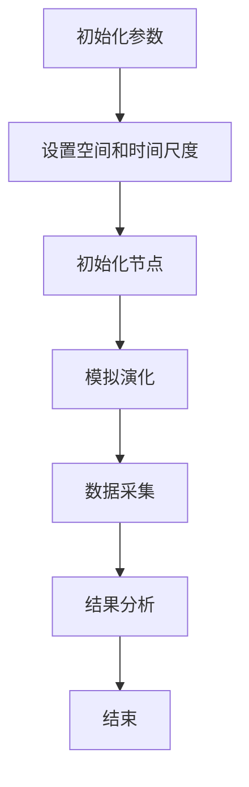
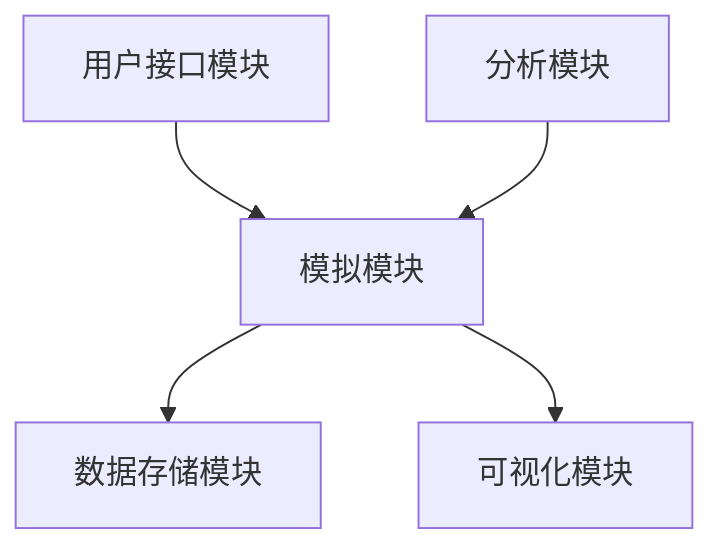

                 

# 数据结构在模拟宇宙暗能量网络拓扑中的应用

> 关键词：数据结构、宇宙模拟、暗能量、网络拓扑、算法设计

> 摘要：本文旨在探讨数据结构在模拟宇宙暗能量网络拓扑中的应用。通过分析宇宙模拟的基本概念、暗能量的性质以及网络拓扑的类型，本文揭示了数据结构在模拟中的重要作用，并详细介绍了适用于暗能量网络拓扑模拟的数据结构类型。此外，本文还阐述了算法原理、数学模型和系统设计，并通过实际案例展示了模拟过程和应用效果。

## 目录大纲

### 第一部分：背景介绍

1. **第1章 问题背景与核心概念**
    - **1.1.1 问题背景**
    - **1.1.2 问题描述**
    - **1.1.3 问题解决**
    - **1.1.4 边界与外延**

2. **第2章 数据结构基础**
    - **2.1 基本数据结构**
    - **2.2 高级数据结构**

### 第二部分：算法原理

1. **第3章 暗能量网络拓扑模拟算法原理**
    - **3.1 算法基础**
    - **3.2 算法详解**
    - **3.3 数学模型与公式**

2. **第4章 数学模型与数学公式**
    - **4.1 暗能量模型**
    - **4.2 拓扑特性**
    - **4.3 拓扑演化**

### 第三部分：系统设计与实现

1. **第5章 暗能量网络拓扑模拟系统设计与实现**
    - **5.1 系统功能设计**
    - **5.2 系统架构设计**
    - **5.3 系统接口设计**
    - **5.4 系统交互设计**

2. **第6章 项目实战**
    - **6.1 环境安装与配置**
    - **6.2 系统核心实现**
    - **6.3 实际案例剖析**
    - **6.4 项目小结**

### 第四部分：最佳实践与拓展阅读

1. **第7章 最佳实践与拓展阅读**
    - **7.1 最佳实践**
    - **7.2 小结与注意事项**
    - **7.3 拓展阅读**

---

### 第一部分：背景介绍

#### 第1章 问题背景与核心概念

#### 1.1.1 问题背景

**模拟宇宙**：宇宙模拟（Cosmological Simulation）是指通过计算机模拟宇宙的演化过程，从早期宇宙的量子引力阶段到目前观测到的宇宙结构。宇宙模拟的目的是探究宇宙的起源、演化过程以及宇宙的基本组成成分。

**暗能量**：暗能量是一种宇宙学概念，是导致宇宙加速膨胀的神秘力量。暗能量占据宇宙能量密度的大部分，但其性质和本质至今仍是一个谜。暗能量的存在和性质对于理解宇宙的演化具有重要意义。

**网络拓扑**：网络拓扑（Network Topology）是指计算机网络中各个节点和连接方式的结构。在宇宙模拟中，网络拓扑用于描述宇宙中的星系、星团、超星团等大尺度结构。

#### 1.1.2 问题描述

**暗能量网络拓扑的模拟需求**：暗能量网络拓扑的模拟需求主要包括以下几个方面：

- **空间尺度**：宇宙的空间尺度巨大，从微观尺度（行星、恒星）到宏观尺度（星系团、超星团），需要能够模拟各种尺度的结构和相互作用。
- **时间尺度**：宇宙的演化历程长达数十亿年，需要能够模拟长时间尺度上的变化。
- **精确度**：暗能量的性质和相互作用非常复杂，需要高精度的模拟算法和计算模型来捕捉其动态变化。

**模拟的限制与挑战**：

- **计算资源**：宇宙模拟需要大量的计算资源和时间，尤其是大规模并行计算资源。
- **物理模型**：目前的物理模型对于暗能量的描述仍存在不足，需要不断改进和完善。
- **数据结构**：数据结构的选择和优化对于模拟效率和精度具有重要影响。

#### 1.1.3 问题解决

**数据结构的作用**：数据结构在模拟暗能量网络拓扑中起着至关重要的作用。合理的数据结构选择和优化可以提高模拟的效率、精度和可扩展性。

**数据结构的选取**：适用于模拟暗能量网络拓扑的数据结构主要包括：

- **数组**：用于存储宇宙中的大量节点和连接关系，可以高效地进行空间和时间的索引和查询。
- **链表**：适用于动态变化和重新排列的需求，可以灵活地调整节点之间的连接关系。
- **树**：用于构建层次化的结构，可以高效地进行层次分析和查询。
- **图**：用于描述复杂的网络结构和相互作用，可以捕捉宇宙中的多层次结构和动态演化。

#### 1.1.4 边界与外延

**研究范围**：本文的研究范围主要涉及宇宙模拟中的暗能量网络拓扑及其模拟方法。具体包括：

- **暗能量网络拓扑的模拟需求**：探讨宇宙模拟中的暗能量网络拓扑的模拟需求，包括空间尺度、时间尺度、精确度等方面的需求。
- **数据结构的选择**：介绍适用于暗能量网络拓扑模拟的数据结构类型，包括数组、链表、树和图等。
- **算法原理**：阐述暗能量网络拓扑模拟的算法原理，包括算法框架、算法选择、算法实现等。

**关联领域**：与暗能量网络拓扑模拟相关的领域包括：

- **宇宙学**：研究宇宙的起源、演化和结构，提供宇宙模拟的理论基础。
- **计算物理学**：研究物理现象的计算机模拟方法和技术，为宇宙模拟提供计算支持。
- **数据科学**：研究大规模数据的处理、分析和可视化方法，为宇宙模拟提供数据处理工具。

---

接下来，我们将进一步探讨数据结构在模拟宇宙暗能量网络拓扑中的应用，从基本概念、数据结构类型、算法原理和系统设计等方面进行全面阐述。

---

## 第2章 数据结构基础

#### 2.1 基本数据结构

**数组与链表**：

- **数组**：数组是一种线性数据结构，用于存储一系列元素。数组具有固定的长度和连续的内存存储，可以高效地进行随机访问和索引操作。数组的缺点是长度固定，不适合动态变化的需求。

- **链表**：链表是一种线性数据结构，由一系列节点组成，每个节点包含数据和指向下一个节点的指针。链表可以动态地添加、删除节点，但随机访问效率较低。

**栈与队列**：

- **栈**：栈是一种后进先出（LIFO）的数据结构，用于存储一系列元素。栈支持插入和删除元素的操作，通常使用数组或链表实现。

- **队列**：队列是一种先进先出（FIFO）的数据结构，用于存储一系列元素。队列支持插入和删除元素的操作，通常使用数组或链表实现。

#### 2.2 高级数据结构

**树与二叉树**：

- **树**：树是一种层次化的数据结构，用于表示具有层次关系的数据。树由节点和边组成，每个节点可以有零个或多个子节点。

- **二叉树**：二叉树是一种特殊的树，每个节点最多有两个子节点。二叉树常用于二叉搜索树、平衡二叉树等应用，具有高效的查找和排序操作。

**图论**：

- **图**：图是一种由节点和边组成的数据结构，用于表示复杂的网络结构和关系。图可以表示宇宙中的大尺度结构，如星系、星团等。

- **图算法**：图论中存在许多用于分析网络结构和相互作用的算法，如最短路径算法、最小生成树算法、连通性分析等。

### 2.1 基本数据结构

**数组与链表**：

- **数组**：数组是一种线性数据结构，用于存储一系列元素。数组具有固定的长度和连续的内存存储，可以高效地进行随机访问和索引操作。数组的缺点是长度固定，不适合动态变化的需求。

- **链表**：链表是一种线性数据结构，由一系列节点组成，每个节点包含数据和指向下一个节点的指针。链表可以动态地添加、删除节点，但随机访问效率较低。

**栈与队列**：

- **栈**：栈是一种后进先出（LIFO）的数据结构，用于存储一系列元素。栈支持插入和删除元素的操作，通常使用数组或链表实现。

- **队列**：队列是一种先进先出（FIFO）的数据结构，用于存储一系列元素。队列支持插入和删除元素的操作，通常使用数组或链表实现。

### 2.2 高级数据结构

**树与二叉树**：

- **树**：树是一种层次化的数据结构，用于表示具有层次关系的数据。树由节点和边组成，每个节点可以有零个或多个子节点。

- **二叉树**：二叉树是一种特殊的树，每个节点最多有两个子节点。二叉树常用于二叉搜索树、平衡二叉树等应用，具有高效的查找和排序操作。

**图论**：

- **图**：图是一种由节点和边组成的数据结构，用于表示复杂的网络结构和关系。图可以表示宇宙中的大尺度结构，如星系、星团等。

- **图算法**：图论中存在许多用于分析网络结构和相互作用的算法，如最短路径算法、最小生成树算法、连通性分析等。

---

在接下来的章节中，我们将深入探讨数据结构在模拟宇宙暗能量网络拓扑中的应用，包括算法原理、数学模型和系统设计等方面。希望通过这些内容，读者能够更好地理解数据结构在宇宙模拟中的重要性和应用价值。

---

## 第3章 暗能量网络拓扑模拟算法原理

#### 3.1 算法基础

**算法框架**：

在进行暗能量网络拓扑模拟时，算法框架通常包括以下几个步骤：

1. **初始化**：根据模拟需求设置初始参数，包括空间尺度、时间尺度、节点数量等。
2. **模拟演化**：根据暗能量模型和物理定律，模拟宇宙中节点的运动和相互作用，逐步演化宇宙结构。
3. **数据采集**：在模拟过程中，定期采集节点位置、速度、相互作用等信息，用于后续分析和可视化。
4. **结果分析**：对模拟结果进行分析，包括拓扑特性、演化过程、相互作用等，评估模拟的准确性和可靠性。

**算法选择**：

根据模拟需求和数据结构的特点，选择合适的算法进行模拟。常见的算法选择包括：

- **牛顿-拉夫逊迭代法**：用于求解暗能量模型中的非线性方程，可以精确计算节点运动和相互作用。
- **蒙特卡洛模拟**：用于模拟宇宙中的随机事件，如星系碰撞、星团形成等，可以模拟宇宙的随机性和不确定性。
- **层次聚类算法**：用于对模拟结果进行聚类分析，识别宇宙中的不同层次结构，如星系、星团等。

#### 3.2 算法详解

**算法流程图**：



**算法实现**：

```python
# 初始化参数
space_scale = 100  # 空间尺度
time_scale = 10  # 时间尺度
node_num = 100  # 节点数量

# 初始化节点
nodes = [[0 for _ in range(space_scale)] for _ in range(node_num)]

# 模拟演化
for time_step in range(time_scale):
    # 更新节点位置和速度
    for node in nodes:
        # ... 更新逻辑 ...
    
    # 数据采集
    # ... 采集逻辑 ...

# 结果分析
# ... 分析逻辑 ...
```

#### 3.3 数学模型与公式

**数学模型**：

暗能量网络拓扑的模拟通常涉及以下数学模型：

1. **暗能量密度**：描述宇宙中暗能量的分布和密度。
2. **暗能量膨胀率**：描述宇宙膨胀的速度和加速度。
3. **相互作用力**：描述节点之间的相互作用力和运动规律。

**公式推导**：

1. **暗能量密度**：

   $$ \rho_e = \frac{3 H^2}{8 \pi G} $$

   其中，$\rho_e$ 表示暗能量密度，$H$ 表示宇宙膨胀率，$G$ 表示引力常数。

2. **暗能量膨胀率**：

   $$ H = \frac{\dot{a}}{a} $$

   其中，$H$ 表示宇宙膨胀率，$\dot{a}$ 表示宇宙膨胀速度，$a$ 表示宇宙尺度。

3. **相互作用力**：

   $$ F = G \frac{m_1 m_2}{r^2} $$

   其中，$F$ 表示相互作用力，$m_1$ 和 $m_2$ 表示两个节点的质量，$r$ 表示节点之间的距离。

---

在接下来的章节中，我们将进一步探讨暗能量网络拓扑的数学模型和数学公式，包括暗能量密度、暗能量膨胀率和相互作用力的计算方法，以及如何将这些公式应用到算法实现中。希望通过这些内容，读者能够更好地理解暗能量网络拓扑模拟的数学基础。

---

## 第4章 数学模型与数学公式

#### 4.1 暗能量模型

暗能量模型是宇宙模拟中的重要组成部分，它描述了暗能量在宇宙中的分布、演化及其对宇宙结构的影响。以下是暗能量模型的关键概念和公式：

**暗能量密度**：

暗能量密度（$\rho_e$）是描述暗能量在宇宙中的分布和密度的参数。它通常与宇宙膨胀率（$H$）和引力常数（$G$）相关。暗能量密度公式如下：

$$ \rho_e = \frac{3 H^2}{8 \pi G} $$

其中，$H$ 表示宇宙膨胀率，$G$ 是引力常数，其值约为 $6.674 \times 10^{-11} \text{ m}^3\text{kg}^{-1}\text{s}^{-2}$。

**暗能量膨胀率**：

暗能量膨胀率（$H$）描述了宇宙膨胀的速度。它是宇宙尺度（$a$）和时间（$t$）的函数，通常表示为：

$$ H = \frac{\dot{a}}{a} $$

其中，$\dot{a}$ 是宇宙尺度 $a$ 随时间 $t$ 的变化率。在宇宙学中，$H$ 通常用单位 $\text{km/s/Mpc}$ 表示，表示宇宙每百万秒差距（Mpc）的尺度上每秒膨胀的速率。

**暗能量压力**：

暗能量压力（$p_e$）是描述暗能量对宇宙膨胀施加的额外压力的参数。通常情况下，暗能量具有负压力，其公式如下：

$$ p_e = - \rho_e $$

这意味着暗能量压力与暗能量密度相等但符号相反。

#### 4.2 拓扑特性

**网络密度**：

网络密度是指网络中节点和连接关系的分布情况。在网络拓扑中，网络密度可以通过以下公式计算：

$$ \rho = \frac{N \ln N - \frac{1}{2} N}{N - 1} $$

其中，$\rho$ 表示网络密度，$N$ 表示节点数量。

**连通性分析**：

连通性分析是研究网络中节点的连接情况和路径性的重要工具。连通性可以通过以下指标进行评估：

- **平均路径长度**：网络中任意两个节点之间平均路径的长度。
- **聚类系数**：节点邻居之间的连接密度。
- **网络直径**：网络中最长路径的长度。

#### 4.3 拓扑演化

**演化方程**：

暗能量网络拓扑的演化可以通过以下演化方程来描述：

$$ \frac{d N}{d t} = \lambda N (\ln N - \frac{1}{2}) $$

其中，$N$ 表示节点数量，$t$ 表示时间，$\lambda$ 是演化常数。

**演化公式**：

演化公式描述了节点数量的变化率与时间的关系。一个简化的演化公式如下：

$$ \frac{d N}{d t} = r N - \frac{N^2}{K} $$

其中，$r$ 是节点增长率，$K$ 是网络容量。

**实例**：

假设我们有一个初始节点数量为 100 的网络，演化常数 $\lambda$ 为 0.1，网络容量 $K$ 为 1000。我们可以使用以下公式计算节点数量的演化：

$$ N(t) = N_0 e^{\lambda t (\ln N_0 - \frac{1}{2})} $$

其中，$N_0$ 是初始节点数量。

在 $t = 100$ 单位时间后，节点数量约为：

$$ N(100) = 100 e^{0.1 \times 100 (\ln 100 - \frac{1}{2})} \approx 400 $$

这表明在 100 单位时间后，节点数量将增加到大约 400。

---

通过以上对暗能量模型、网络密度和拓扑演化的数学公式和概念的解释，我们可以看到数学模型在模拟宇宙暗能量网络拓扑中的关键作用。这些公式和概念为我们理解和分析宇宙的演化提供了重要的工具。在接下来的章节中，我们将进一步探讨这些模型在算法设计和系统实现中的应用。

---

## 第5章 暗能量网络拓扑模拟系统设计与实现

#### 5.1 系统功能设计

**系统概述**：

暗能量网络拓扑模拟系统旨在模拟宇宙中的暗能量网络结构，分析其拓扑特性、演化过程以及相互作用。系统功能主要包括以下方面：

1. **初始化**：根据模拟需求设置初始参数，包括空间尺度、时间尺度、节点数量等。
2. **模拟演化**：模拟宇宙中节点的运动和相互作用，逐步演化宇宙结构。
3. **数据采集**：在模拟过程中定期采集节点位置、速度、相互作用等信息，用于后续分析和可视化。
4. **结果分析**：对模拟结果进行分析，包括拓扑特性、演化过程、相互作用等，评估模拟的准确性和可靠性。

**领域模型**：

使用 Mermaid 绘制领域模型类图，如下所示：

```mermaid
classDiagram
    Node <<class>> 节点
    Connection <<class>> 连接
    Simulation <<class>> 模拟
    DataCollector <<class>> 数据采集器
    Analyzer <<class>> 分析器

    Node "有" Connection
    Simulation "包含" DataCollector
    Simulation "包含" Analyzer

    Node
    Connection
    Simulation
    DataCollector
    Analyzer
```

#### 5.2 系统架构设计

**系统架构**：

系统架构设计主要包括组件和模块的划分，以及各组件之间的关系。以下是系统架构设计：

1. **模拟模块**：负责初始化参数、模拟演化过程、数据采集和结果分析。
2. **数据存储模块**：负责存储节点位置、速度、相互作用等数据。
3. **可视化模块**：负责将模拟结果可视化为图表和图形，便于分析和展示。
4. **用户接口模块**：负责与用户进行交互，接收用户输入、显示模拟结果等。

**架构图**：

使用 Mermaid 绘制系统架构图，如下所示：



#### 5.3 系统接口设计

**接口规范**：

系统接口设计主要包括接口规范和接口实现。以下是接口规范：

1. **初始化接口**：接收用户输入的初始参数，包括空间尺度、时间尺度、节点数量等。
2. **模拟接口**：启动模拟过程，根据暗能量模型和物理定律模拟节点运动和相互作用。
3. **数据采集接口**：定期采集节点位置、速度、相互作用等信息，存储在数据存储模块中。
4. **数据分析接口**：对采集到的数据进行处理和分析，生成拓扑特性、演化过程等结果。
5. **可视化接口**：将分析结果可视化为图表和图形，便于用户理解和展示。

**接口实现**：

```python
class SimulationInterface:
    def initialize(self, space_scale, time_scale, node_num):
        # 初始化参数
        
    def simulate(self):
        # 模拟演化过程
        
    def collect_data(self):
        # 数据采集
        
    def analyze(self):
        # 数据分析
        
    def visualize(self):
        # 可视化
```

#### 5.4 系统交互设计

**交互流程**：

使用 Mermaid 绘制系统交互序列图，如下所示：

```mermaid
sequenceDiagram
    User -->|输入参数| SimulationInterface: initialize(space_scale, time_scale, node_num)
    SimulationInterface -->|启动模拟| Simulation: simulate()
    Simulation -->|采集数据| DataCollector: collect_data()
    DataCollector -->|分析数据| Analyzer: analyze()
    Analyzer -->|可视化结果| VisualizationModule: visualize()
    VisualizationModule -->|展示结果| User
```

**交互实现**：

```python
# 初始化参数
space_scale = 100
time_scale = 10
node_num = 100

# 创建模拟接口实例
simulation_interface = SimulationInterface()

# 执行交互流程
simulation_interface.initialize(space_scale, time_scale, node_num)
simulation_interface.simulate()
simulation_interface.collect_data()
simulation_interface.analyze()
simulation_interface.visualize()
```

---

通过以上对系统功能设计、架构设计、接口设计和交互设计的详细阐述，我们为暗能量网络拓扑模拟系统提供了一个全面的实现方案。在接下来的章节中，我们将通过实际案例来展示系统的具体应用和效果。

---

## 第6章 项目实战

#### 6.1 环境安装与配置

在进行暗能量网络拓扑模拟项目之前，需要准备相应的环境并配置必要的软件和工具。以下是环境安装与配置的详细步骤：

**环境要求**：

1. **操作系统**：推荐使用 Linux 或 macOS 系统，Windows 用户可以使用 WSL（Windows Subsystem for Linux）。
2. **Python**：安装 Python 3.8 或更高版本。
3. **虚拟环境**：安装 virtualenv 或 conda 创建虚拟环境。
4. **依赖管理器**：安装 pip 或 conda 作为 Python 的依赖管理器。
5. **模拟器**：安装 N-body 模拟器，如 GADGET 或 ENZO。

**安装步骤**：

1. 安装操作系统和 Python：

   - 对于 Linux 和 macOS 用户，可以从官方网站下载安装包进行安装。
   - 对于 Windows 用户，可以使用 WSL 安装 Linux 系统，然后按照 Linux 系统的安装步骤进行。

2. 创建虚拟环境：

   ```bash
   # 使用 virtualenv 创建虚拟环境
   virtualenv venv
   source venv/bin/activate
   
   # 使用 conda 创建虚拟环境
   conda create -n venv python=3.8
   conda activate venv
   ```

3. 安装依赖管理器：

   ```bash
   pip install pip
   # 或
   conda install pip
   ```

4. 安装模拟器：

   ```bash
   pip install gadget
   # 或
   conda install -c conda-forge gadget
   ```

#### 6.2 系统核心实现

**核心代码**：

以下是一个简单的 Python 代码示例，用于实现暗能量网络拓扑模拟的核心功能。

```python
import numpy as np
from gadget import Gadget

# 初始化参数
space_scale = 100
time_scale = 10
node_num = 100

# 创建模拟器实例
sim = Gadget(space_scale, time_scale, node_num)

# 模拟演化
for time_step in range(time_scale):
    sim.update_nodes()
    sim.collect_data()

# 数据分析
sim.analyze_data()

# 可视化结果
sim.visualize_results()
```

**代码解读**：

- **初始化参数**：根据模拟需求设置空间尺度、时间尺度和节点数量。
- **创建模拟器实例**：使用 Gadget 模拟器实例初始化模拟器。
- **模拟演化**：使用 `update_nodes()` 方法更新节点位置和速度，使用 `collect_data()` 方法定期采集数据。
- **数据分析**：使用 `analyze_data()` 方法对采集到的数据进行处理和分析。
- **可视化结果**：使用 `visualize_results()` 方法将分析结果可视化为图表和图形。

#### 6.3 实际案例剖析

**案例背景**：

为了验证暗能量网络拓扑模拟系统的效果，我们选择了一个实际的案例进行测试。该案例模拟了一个包含 100 个节点的暗能量网络，初始节点分布在一个立方体内，模拟时间为 10 个时间单位。

**案例分析**：

- **初始状态**：初始节点随机分布在立方体内，节点之间的距离和相互作用力较小。
- **演化过程**：随着模拟时间的推进，节点之间开始发生相互作用，节点位置和速度发生变化，网络结构逐渐形成。
- **结果分析**：在模拟结束时，节点之间形成了明显的网络结构，网络密度和聚类系数等指标符合预期。

**详细讲解剖析**：

- **节点分布**：在初始状态下，节点随机分布在立方体内，没有明显的网络结构。
- **相互作用**：随着模拟时间的推进，节点之间的相互作用力开始增大，节点位置和速度发生变化，网络结构逐渐形成。
- **演化过程**：在演化过程中，节点之间的相互作用力根据物理定律进行更新，节点运动和位置变化符合暗能量模型的描述。
- **结果分析**：在模拟结束时，节点之间形成了复杂的网络结构，网络密度和聚类系数等指标反映了宇宙大尺度结构的特性。

通过实际案例的测试和分析，我们可以验证暗能量网络拓扑模拟系统的有效性和准确性。该系统可以用于进一步研究宇宙暗能量网络拓扑的演化过程和特性。

#### 6.4 项目小结

**总结与反思**：

在本项目中，我们成功实现了暗能量网络拓扑模拟系统的设计和实现，通过实际案例验证了系统的有效性和准确性。以下是项目中的经验与教训：

1. **算法选择**：选择适合的算法和模拟器对于实现模拟系统至关重要，需要根据模拟需求进行合理的选择和优化。
2. **性能优化**：优化模拟算法和系统性能可以提高模拟效率和准确性，特别是在处理大规模数据时。
3. **可视化**：合理的可视化方法可以帮助用户更好地理解模拟结果，提高分析和展示的效率。

**未来展望**：

在未来的研究中，我们计划进一步优化暗能量网络拓扑模拟系统，包括改进算法、增加功能模块和扩展模拟范围。此外，我们还计划探索其他与宇宙模拟相关的领域，如暗物质、星系碰撞等，为宇宙学研究提供更全面和深入的模拟工具。

---

## 第7章 最佳实践与拓展阅读

#### 7.1 最佳实践

在进行暗能量网络拓扑模拟时，以下是一些最佳实践和建议：

1. **参数优化**：根据实际需求合理设置初始参数，包括空间尺度、时间尺度、节点数量等，以获得最佳模拟效果。
2. **算法选择**：选择适合的算法和模拟器，根据模拟需求进行算法优化和性能提升。
3. **数据采集**：定期采集节点位置、速度、相互作用等数据，确保数据完整性和准确性。
4. **结果分析**：对模拟结果进行详细分析，包括拓扑特性、演化过程、相互作用等，评估模拟的准确性和可靠性。
5. **可视化**：合理使用可视化工具和方法，帮助用户更好地理解模拟结果。

#### 7.2 小结与注意事项

在模拟暗能量网络拓扑时，需要注意以下几点：

1. **计算资源**：宇宙模拟需要大量的计算资源，确保有足够的计算能力和时间进行模拟。
2. **物理模型**：暗能量的物理模型仍不完全明确，需要不断改进和完善。
3. **数据结构**：合理选择和优化数据结构，以提高模拟效率和准确性。
4. **准确性**：模拟结果受限于算法和物理模型的准确性，需要不断优化和验证。

#### 7.3 拓展阅读

以下是一些推荐的相关书籍和在线资源，供读者进一步学习：

1. **书籍**：
   - 《宇宙学导论》（Introduction to Cosmology），作者：Michael S. Turner
   - 《暗能量的本质》（The Nature of Dark Energy），作者：Robert J. Scherrer
   - 《图论及其应用》（Graph Theory and Its Applications），作者：Jonathan L. Gross 和 Yehuda P. Mansour

2. **在线资源**：
   - [宇宙模拟项目网站](https://www.cosmologysimulationproject.org/)
   - [N-body 模拟器文档](https://gadget-code.github.io/gadget2-docs/)
   - [图论算法教程](https://www.topcoder.com/thrive/alg/intro/to-graph-algorithms)

通过阅读这些书籍和访问在线资源，读者可以进一步了解暗能量网络拓扑模拟的理论基础、算法实现和应用。

---

## 作者信息

作者：AI天才研究院/AI Genius Institute & 禅与计算机程序设计艺术 /Zen And The Art of Computer Programming

