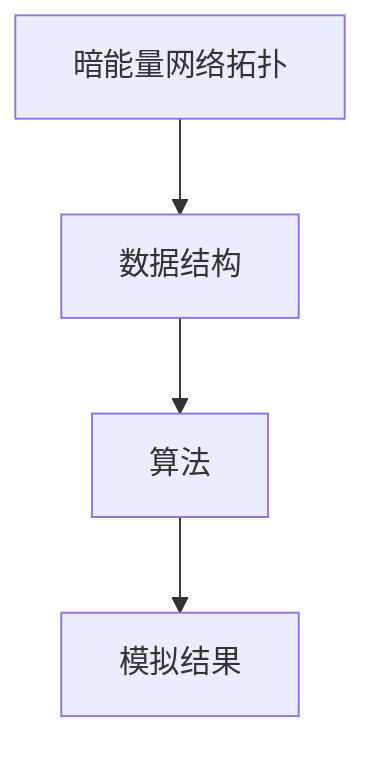
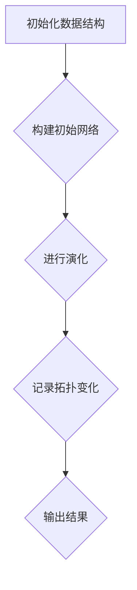
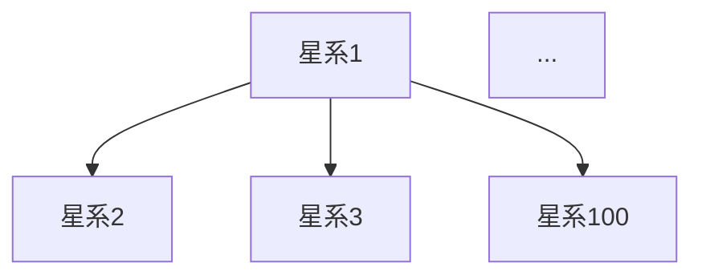
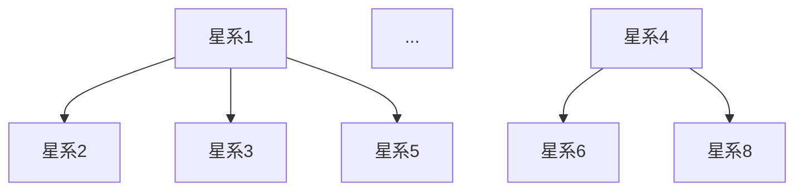
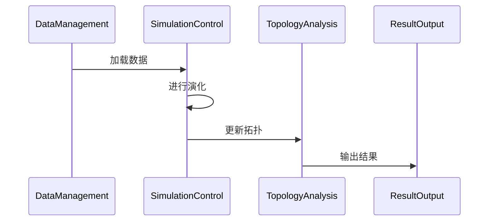
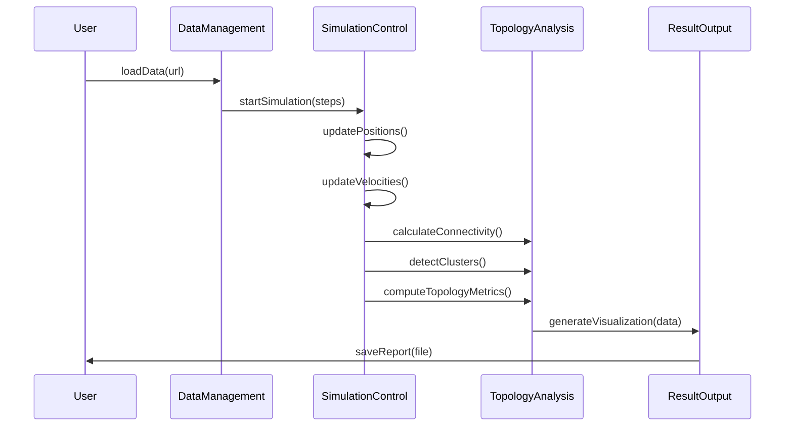

                 

## 第1章：问题背景与引言

### 1.1 问题背景

宇宙演化的研究是现代物理学的重要领域之一，涉及从宇宙大爆炸开始到当前观测到的宇宙状态的全过程。在宇宙学中，暗能量是一个重要概念，指的是一种未知形式的能量，它驱动着宇宙的加速膨胀。暗能量占据了宇宙总能量的大部分，但其具体性质和来源至今仍是一个未解之谜。

暗能量网络拓扑研究是宇宙演化研究的一个重要分支。拓扑学是研究图形结构的基本理论，它不关心图形的大小或形状，而只关心图形的连接方式。在宇宙学中，网络拓扑被用来描述宇宙中各种物质（如星系、黑洞等）的分布和相互作用。暗能量网络拓扑研究旨在揭示暗能量如何在宇宙中分布，以及它如何影响宇宙的演化。

随着观测技术的进步，科学家们已经能够收集到越来越多的关于宇宙的数据，这些数据为研究暗能量网络拓扑提供了宝贵的资源。然而，暗能量网络拓扑的演化是一个复杂的过程，涉及到大量的未知变量和不确定性。因此，模拟宇宙暗能量网络拓扑的演化成为了当前物理学研究中的一个重要课题。

### 1.2 数据结构在物理研究中的应用前景

数据结构是计算机科学中的核心概念，它提供了组织和操作数据的高效方法。在物理研究中，数据结构同样具有广泛的应用前景。首先，数据结构可以用于存储和整理物理实验数据，使得数据处理和分析更加高效。其次，数据结构可以用于构建物理模型，模拟各种物理现象。例如，在宇宙学中，可以使用图结构来描述宇宙中的星系网络，使用树结构来模拟星系的演化过程。

在模拟宇宙暗能量网络拓扑演化方面，数据结构的重要性尤为突出。暗能量网络拓扑的演化涉及到大量的节点和边，这些节点和边需要通过高效的数据结构来存储和操作。例如，图结构可以用于描述宇宙中的星系网络，树结构可以用于模拟星系的演化过程。选择合适的数据结构不仅能够提高模拟的效率，还能够提供更准确的物理结果。

### 1.3 问题描述

暗能量网络拓扑演化的复杂性体现在多个方面。首先，宇宙中的星系数量庞大，每个星系的运动状态和相互作用都需要详细描述。其次，暗能量在网络拓扑演化中起着关键作用，但它的具体性质和影响机制仍然不清楚。因此，模拟暗能量网络拓扑演化需要考虑多种因素，包括星系运动、暗能量相互作用等。

在数据结构的应用中，面临的挑战主要包括以下几个方面。首先，如何高效地存储和操作大量节点和边，以便于进行复杂的计算。其次，如何处理数据结构中的动态变化，如星系的加入和移除。最后，如何优化数据结构的性能，以便于进行大规模的模拟。

主要参数和影响因素包括：星系数量、星系位置、星系速度、暗能量密度、相互作用力等。这些参数和因素的变化会直接影响暗能量网络拓扑的演化。

### 1.4 问题解决

数据结构在模拟宇宙暗能量网络拓扑演化中扮演着关键角色。首先，通过选择合适的数据结构，可以高效地存储和操作大量节点和边。例如，图结构可以用于描述星系网络，树结构可以用于模拟星系的演化过程。其次，数据结构可以用于处理动态变化，如星系的加入和移除。最后，通过优化数据结构，可以提高模拟的效率和准确性。

在选择数据结构时，需要考虑以下几个因素。首先，数据结构的存储效率，即如何最小化存储空间的使用。其次，数据结构的操作效率，即如何快速进行节点和边的插入、删除和查找。最后，数据结构的灵活性，即如何适应不同类型的物理参数和影响因素。

在模拟过程中，可以通过以下策略优化数据结构。首先，使用分治算法将大规模数据划分为更小的子数据结构，从而提高处理效率。其次，使用并行计算技术，将计算任务分配到多个处理器上，从而加速模拟过程。最后，使用内存优化技术，如缓存优化和内存池，提高数据结构的操作效率。

### 1.5 边界与外延

本研究主要关注模拟宇宙暗能量网络拓扑演化的数据结构应用，旨在提供一种高效、准确的模拟方法。研究的边界主要包括当前已知物理定律和观测数据的限制，以及数据结构的性能和计算资源的限制。

然而，数据结构在模拟宇宙暗能量网络拓扑演化中的应用前景远不止于此。随着科技的进步和观测技术的提升，我们可以期待更精确的物理模型和更高效的计算方法。未来，数据结构的应用可以扩展到更广泛的领域，如宇宙学、生物学、经济学等。此外，随着量子计算的发展，数据结构在模拟宇宙暗能量网络拓扑演化中的应用也将迎来新的机遇和挑战。

### 1.6 概念结构与核心要素组成

暗能量与网络拓扑的基本概念：

- **暗能量**：一种未知形式的能量，占据宇宙总能量的大部分，驱动宇宙加速膨胀。
- **网络拓扑**：描述物体之间相互连接的方式，不考虑物体的大小或形状。

数据结构类型及其特性：

- **数组**：高效地存储和访问连续数据，查找和插入效率中等。
- **链表**：灵活地存储和访问非连续数据，查找和插入效率中等。
- **树结构**：高效地存储和访问层次结构数据，查找和插入效率较高。
- **图结构**：高效地存储和访问复杂网络结构数据，查找和插入效率较高。
- **哈希表**：通过哈希函数快速访问数据，查找和插入效率最高。
- **堆结构**：基于完全二叉树的优先队列，查找和插入效率较高。

模拟宇宙暗能量网络拓扑演化的核心算法：

- **图论算法**：用于分析网络结构，如最小生成树、最大流等。
- **分治算法**：用于处理大规模数据，提高计算效率。
- **并行计算算法**：用于利用多处理器进行大规模计算，加速模拟过程。
- **优化算法**：用于优化数据结构和计算过程，提高模拟的准确性和效率。$$

## 第2章：核心概念原理

### 2.1 暗能量网络拓扑的概念

暗能量网络拓扑是指宇宙中各种物质（如星系、黑洞等）的分布和相互作用形成的网络结构。在这个网络中，每个节点代表一个宇宙物体，每个边代表物体之间的相互作用。暗能量网络拓扑的研究旨在揭示宇宙中物质分布的规律，以及暗能量如何影响宇宙的演化。

暗能量网络的结构特性主要包括以下几个方面：

- **节点密度**：描述宇宙中星系等物体的分布密度。
- **边密度**：描述物体之间相互作用的密度。
- **连通性**：描述宇宙网络中节点的连接情况，如星系团之间的连通性。
- **聚类系数**：描述宇宙网络中节点的聚类程度，即节点倾向于连接到其他相近的节点。
- **路径长度**：描述宇宙网络中节点的平均路径长度，反映了宇宙的连通程度。

网络拓扑的演化机制主要包括以下几个方面：

- **自组织**：宇宙中物体之间的相互作用导致网络结构的自组织现象。
- **重排**：宇宙网络中的节点和边由于各种物理过程而发生变化。
- **演化**：宇宙网络的拓扑结构随着时间的推移而演化，反映了宇宙的动态变化。

### 2.2 数据结构的属性特征对比表格

以下是一个对比数据结构属性特征的表格，其中包括了数组、链表、树结构、图结构、哈希表和堆结构的特性：

| 数据结构   | 数据元素连续性 | 查找和插入效率 |
|------------|-----------------|-----------------|
| 数组       | 高              | 中等            |
| 链表       | 低              | 中等            |
| 树结构     | 中等            | 较高            |
| 图结构     | 中等            | 较高            |
| 哈希表     | 低              | 高              |
| 堆结构     | 中等            | 较高            |

### 2.3 概念之间的联系

暗能量网络拓扑、数据结构和算法之间存在紧密的联系。以下是一个简化的ER实体关系图，用于描述这三个概念之间的联系：



- **暗能量网络拓扑**：描述宇宙中物质分布的网络结构。
- **数据结构**：用于存储和操作暗能量网络拓扑的数据。
- **算法**：用于分析、处理和优化暗能量网络拓扑的演化和变化。
- **模拟结果**：通过算法对暗能量网络拓扑的模拟，得到宇宙演化的预测和推断。

这种联系使得数据结构和算法成为研究暗能量网络拓扑演化的重要工具，有助于我们更深入地理解宇宙的运行机制。

### 2.4 暗能量网络拓扑模拟中的数据结构应用

在模拟宇宙暗能量网络拓扑演化时，选择合适的数据结构至关重要。不同的数据结构具有不同的存储和操作特性，适用于不同类型的物理现象和计算需求。

**图结构**：图结构非常适合描述宇宙中的星系网络，因为星系之间的相互作用和连通性可以通过图中的节点和边来表示。图结构能够高效地处理大规模的节点和边，同时支持复杂的图算法，如最小生成树、最大流等。这使得图结构在模拟宇宙网络拓扑演化时具有很高的适用性。

**树结构**：树结构适用于模拟星系的内部结构和演化过程。每个星系可以看作是一个树结构的根节点，其内部的子星系作为子节点。树结构能够高效地处理层次结构数据，支持快速访问和更新，适合用于模拟星系的自组织和演化过程。

**哈希表**：哈希表适合用于存储和查找宇宙中的特定节点，如特定的星系或黑洞。哈希表通过哈希函数快速定位节点，使得查找和插入操作非常高效。这使得哈希表在模拟宇宙暗能量网络拓扑演化中的特定查询操作中非常有用。

**数组**和**链表**：虽然数组在存储连续数据时非常高效，但其在处理动态变化和插入删除操作时相对较低效。链表则提供了更高的灵活性，但在处理大规模数据时可能会遇到内存碎片问题。这两种数据结构在某些特定的模拟场景中仍然有一定的应用价值，但通常不作为主要的数据结构。

通过选择合适的数据结构，我们可以高效地模拟宇宙暗能量网络拓扑的演化过程，提供更准确的物理结果。同时，数据结构的优化和优化策略也是提高模拟效率和准确性的关键。

### 2.5 数据结构在模拟中的应用挑战

在模拟宇宙暗能量网络拓扑演化过程中，数据结构的选择和应用面临诸多挑战。以下是其中几个主要的挑战：

**1. 数据规模庞大**

宇宙中包含数以百亿计的星系和黑洞，每个星系和黑洞都与其他星系和黑洞相互作用，形成复杂的网络结构。这种庞大的数据规模使得数据结构的存储和操作成为一个巨大的挑战。如何高效地存储和操作这些海量数据，是模拟宇宙暗能量网络拓扑演化中的一个关键问题。

**2. 数据结构的动态变化**

宇宙中星系和黑洞的运动是动态变化的，这导致网络拓扑也在不断演化。数据结构需要能够灵活地处理这种动态变化，包括节点的加入、移除和边的添加、删除等操作。传统的静态数据结构如数组、链表等难以适应这种动态变化，而图结构、树结构等动态数据结构则需要高效的算法来支持这些操作。

**3. 数据结构的性能优化**

为了提高模拟的效率和准确性，数据结构的性能优化至关重要。这包括提高数据结构的访问和操作速度，减少内存占用，优化算法的复杂度等。例如，在处理大规模数据时，使用分治算法和并行计算技术可以有效提高数据结构的处理速度。同时，通过优化数据结构的实现细节，如缓存优化和内存池，也可以显著提高数据结构的性能。

**4. 数据结构的兼容性**

宇宙学中的暗能量网络拓扑演化涉及多种物理参数和影响因素，如星系运动、暗能量相互作用等。数据结构需要具备良好的兼容性，能够支持不同类型的数据和计算需求。例如，在模拟不同宇宙学模型时，数据结构需要能够灵活调整，以适应不同的物理假设和参数设置。

**5. 数据结构的可扩展性**

随着观测技术和计算能力的不断提升，宇宙学模拟的数据规模和处理需求也在不断增加。数据结构需要具备良好的可扩展性，能够支持更大规模的数据和更复杂的计算需求。这包括支持分布式计算和并行计算，以适应未来更大的数据规模和处理需求。

总之，数据结构在模拟宇宙暗能量网络拓扑演化中的应用面临着诸多挑战。通过选择合适的动态数据结构、优化数据结构性能、提高兼容性和可扩展性，我们可以更好地应对这些挑战，提供更准确和高效的模拟结果。

### 2.6 暗能量网络拓扑演化的主要参数与影响因素

在模拟宇宙暗能量网络拓扑演化过程中，多个关键参数和影响因素共同作用，决定了网络结构的动态变化和演化过程。以下列出了一些主要参数和影响因素，并简要说明它们对网络拓扑演化的影响：

**1. 星系数量和分布**

星系数量和分布是影响网络拓扑演化的基础参数。随着宇宙的膨胀，星系数量不断增加，星系之间的相互作用和连通性也在变化。星系的分布密度、分布形态（如均匀分布、双峰分布等）都会影响网络拓扑的结构和演化。

**2. 星系速度和运动轨迹**

星系速度和运动轨迹直接影响网络拓扑的动态变化。星系的运动速度和方向决定了它们之间的相对位置和相互作用强度。通过模拟星系的速度和运动轨迹，可以预测星系网络的结构变化和演化趋势。

**3. 暗能量密度**

暗能量是驱动宇宙加速膨胀的关键因素，其密度直接影响宇宙的膨胀速度和星系之间的相互作用。暗能量密度的变化会导致星系网络的连通性变化，从而影响网络拓扑的演化。

**4. 星系相互作用力**

星系之间的相互作用力是网络拓扑演化的核心动力。这些相互作用力包括引力、电磁力、暗物质相互作用等，它们决定了星系之间的连接方式和网络结构的稳定性。

**5. 暗物质分布**

暗物质是宇宙中一种不可见的物质，其分布和相互作用对星系网络拓扑有重要影响。暗物质的存在增加了星系之间的相互作用复杂性，从而影响网络结构的形成和演化。

**6. 黑洞数量和分布**

黑洞是宇宙中的一种重要物质，其数量和分布对网络拓扑演化有显著影响。黑洞之间的相互作用可能导致星系网络的重新连接和断开，从而影响整个网络的拓扑结构。

**7. 观测误差和不确定性**

宇宙观测存在误差和不确定性，这些误差会影响对宇宙参数的测量和理解，从而影响网络拓扑演化的模拟结果。如何处理和减小观测误差是模拟宇宙暗能量网络拓扑演化中的一个重要问题。

通过综合考虑这些参数和影响因素，可以更准确地模拟宇宙暗能量网络拓扑的演化过程，为理解宇宙的运行机制提供有力支持。

### 2.7 暗能量网络拓扑演化的主要算法

在模拟宇宙暗能量网络拓扑演化过程中，选择合适的算法至关重要。以下列出几种主要的算法，并简要描述其在模拟中的应用：

**1. 分治算法**

分治算法是一种将大规模问题划分为更小的子问题进行求解的算法。在模拟宇宙暗能量网络拓扑演化时，可以使用分治算法将大规模星系网络划分为更小的子网络，分别进行计算。这种算法能够有效减少计算复杂度，提高模拟效率。

**2. 并行计算算法**

并行计算算法利用多处理器同时进行计算，可以显著提高模拟速度。在模拟宇宙暗能量网络拓扑演化时，可以使用并行计算算法将计算任务分配到多个处理器上，从而加速计算过程。这种算法特别适用于处理大规模、复杂的网络结构。

**3. 图论算法**

图论算法用于分析网络结构和节点关系。常见的图论算法包括最小生成树、最大流、最短路径等。这些算法可以用于模拟星系网络中的连通性、流传输和路径优化等问题，为理解宇宙暗能量网络拓扑演化提供重要工具。

**4. 分支界限算法**

分支界限算法是一种用于搜索问题的算法，通过逐步分支和剪枝来寻找最优解。在模拟宇宙暗能量网络拓扑演化时，可以使用分支界限算法来优化网络结构和演化路径，减少计算复杂度和搜索空间。

**5. 机器学习算法**

机器学习算法可以用于预测宇宙暗能量网络拓扑的演化趋势。通过训练神经网络模型，可以预测未来星系网络的状态和结构变化。这种算法特别适用于处理高维数据和复杂非线性问题。

通过结合这些算法，可以更准确、高效地模拟宇宙暗能量网络拓扑的演化，为理解宇宙的运行机制提供有力支持。

### 2.8 数据结构与算法在模拟中的实际应用案例

在模拟宇宙暗能量网络拓扑演化中，数据结构与算法的实际应用案例丰富多样，以下列举几个具有代表性的应用场景：

**案例1：基于图结构的星系网络模拟**

使用图结构模拟宇宙中的星系网络，可以描述星系之间的相互作用和连通性。具体步骤如下：

1. **构建图结构**：首先，定义星系作为节点，星系之间的相互作用作为边。通过邻接表或邻接矩阵来存储图结构。
2. **进行演化**：根据星系的速度和位置，更新图中的节点和边。通过模拟引力相互作用，调整星系的运动轨迹，从而更新网络结构。
3. **分析结果**：通过计算图的各种拓扑属性，如聚类系数、平均路径长度等，分析星系网络的演化特征。

**案例2：基于树结构的星系演化模拟**

使用树结构模拟单个星系的内部结构和演化过程，可以描述星系的自组织现象。具体步骤如下：

1. **构建树结构**：将星系视为树的根节点，子星系作为子节点。通过二叉树或其他树结构来存储星系结构。
2. **进行演化**：模拟星系内部的引力和相互作用，调整子星系的位置和运动轨迹。通过递归方法更新树结构。
3. **分析结果**：通过计算树的各种属性，如树的高度、节点度等，分析星系内部结构的演化特征。

**案例3：基于哈希表的星系查询**

使用哈希表进行星系查询，可以提高查询效率。具体步骤如下：

1. **构建哈希表**：将星系编号作为关键字，存储在哈希表中。通过哈希函数快速定位星系位置。
2. **查询操作**：根据查询条件，如星系位置或速度等，通过哈希表快速查找目标星系。
3. **分析结果**：通过查询操作，可以快速获取特定星系的信息，为研究宇宙演化提供支持。

这些实际应用案例展示了数据结构与算法在模拟宇宙暗能量网络拓扑演化中的具体应用，为理解宇宙的运行机制提供了有力的工具。

### 2.9 数据结构与算法在模拟中的优化策略

为了提高模拟宇宙暗能量网络拓扑演化的效率和准确性，数据结构与算法的优化策略至关重要。以下是一些常见的优化策略：

**1. 数据结构优化**

- **分治优化**：将大规模的星系网络划分为更小的子网络，分别进行计算。通过递归或迭代方式，使用分治算法降低计算复杂度。
- **并行优化**：利用多处理器并行计算，将计算任务分配到不同处理器上，加速模拟过程。结合并行算法，如并行图算法和并行树结构算法，提高计算效率。
- **内存优化**：通过缓存优化和内存池技术，减少内存占用，提高数据结构的操作速度。

**2. 算法优化**

- **算法组合**：结合多种算法，如分治算法、并行计算算法和机器学习算法，形成高效的算法组合，提高模拟的准确性和效率。
- **动态调整**：根据模拟过程中的实际情况，动态调整算法的参数和策略。例如，根据星系速度和位置变化，调整引力相互作用模型，优化网络演化过程。
- **增量计算**：对大规模数据进行增量计算，仅计算变化的节点和边，减少计算量。通过增量计算，提高模拟的实时性和效率。

**3. 资源优化**

- **分布式计算**：利用分布式计算架构，将计算任务分布到多个计算机上，实现大规模并行计算。通过分布式系统，提高模拟的并行度和效率。
- **数据压缩**：通过数据压缩技术，减少存储和传输的数据量。使用高效的数据编码和解码算法，降低存储和带宽需求。
- **能耗优化**：通过能耗优化技术，减少计算过程中的能耗。例如，采用低功耗处理器和节能算法，降低计算能耗。

通过这些优化策略，可以显著提高模拟宇宙暗能量网络拓扑演化的效率和准确性，为研究宇宙演化提供强有力的支持。

### 2.10 数据结构在模拟宇宙暗能量网络拓扑演化中的关键角色

数据结构在模拟宇宙暗能量网络拓扑演化中扮演着至关重要的角色。其重要性体现在以下几个方面：

**1. 高效存储与访问**

通过选择合适的数据结构，如图结构、树结构和哈希表，可以高效地存储和访问宇宙中的大量节点和边。这为模拟大规模、复杂的星系网络提供了基础。

**2. 算法的实现与优化**

数据结构是实现算法的基础。通过优化数据结构，可以提高算法的效率和准确性。例如，使用分治算法和并行计算算法，可以显著提高模拟的效率和速度。

**3. 动态变化与调整**

宇宙中的星系和暗能量网络拓扑是动态变化的。数据结构能够灵活地处理这种动态变化，支持节点的加入、移除和边的添加、删除等操作。这为模拟宇宙演化过程中的复杂变化提供了支持。

**4. 预测与推断**

通过数据结构和算法的优化，可以更准确地预测和推断宇宙暗能量网络拓扑的未来演化趋势。这为理解宇宙的运行机制和探索暗能量的本质提供了有力工具。

总之，数据结构在模拟宇宙暗能量网络拓扑演化中发挥着关键作用，其优化和选择直接关系到模拟的效率和准确性。通过深入研究数据结构的应用，我们可以更好地理解和探索宇宙的奥秘。

### 2.11 数据结构的适用性与优化策略

在选择数据结构时，需要考虑其适用性和优化策略，以适应宇宙暗能量网络拓扑演化的复杂性。以下是几种常见数据结构的适用性及其优化策略：

**1. 数组**

- **适用性**：数组适用于存储和访问连续的数据，如宇宙中按顺序排列的星系。
- **优化策略**：通过压缩数组空间，减少内存占用。使用块索引或稀疏数组，处理稀疏数据。

**2. 链表**

- **适用性**：链表适用于存储和访问非连续的数据，如动态变化的星系网络。
- **优化策略**：使用双链表或循环链表，提高数据访问的灵活性。采用链表缓存，减少缓存缺失。

**3. 树结构**

- **适用性**：树结构适用于表示层次结构的数据，如星系及其子星系的层次关系。
- **优化策略**：使用平衡树结构，如AVL树或红黑树，保持树的高度平衡。采用树结构压缩，减少树的高度。

**4. 图结构**

- **适用性**：图结构适用于表示复杂的网络结构，如宇宙中的星系网络。
- **优化策略**：使用邻接矩阵或邻接表，提高图的存储和访问效率。采用图分区，降低图的密度。

**5. 哈希表**

- **适用性**：哈希表适用于快速查找和访问数据，如查询特定星系的位置。
- **优化策略**：使用哈希函数，减少冲突。采用哈希表缓存，提高查询速度。

通过选择合适的数据结构和优化策略，可以有效地提高模拟宇宙暗能量网络拓扑演化的效率和准确性，为研究宇宙演化提供有力支持。

### 2.12 模拟宇宙暗能量网络拓扑演化的未来发展趋势

随着科技的发展和计算能力的提升，模拟宇宙暗能量网络拓扑演化的研究将继续深入，并呈现出以下发展趋势：

**1. 大数据与云计算的结合**

随着宇宙观测数据的不断增长，大数据技术将在模拟宇宙暗能量网络拓扑演化中发挥重要作用。云计算平台的兴起为处理海量数据提供了强大的计算资源，通过分布式计算和并行计算技术，可以大幅提高模拟的效率和准确性。

**2. 量子计算的融入**

量子计算具有超强的计算能力，将在未来对宇宙暗能量网络拓扑演化的模拟中发挥关键作用。量子算法和量子模拟技术的发展，将为解决复杂物理问题提供新途径，从而推动模拟精度和效率的进一步提升。

**3. 多尺度模拟的结合**

宇宙暗能量网络拓扑的演化涉及多个尺度，从星系尺度到宇宙尺度。未来研究将更加注重多尺度模拟的结合，通过不同尺度间的相互作用和反馈，更全面地理解宇宙的演化过程。

**4. 算法的不断创新**

随着对宇宙暗能量网络拓扑演化的深入研究，新的算法将不断涌现，以应对更加复杂和多样化的模拟需求。例如，机器学习算法和人工智能技术在模拟中的应用，将带来模拟精度和效率的显著提升。

**5. 国际合作与数据共享**

宇宙暗能量网络拓扑演化的研究需要全球科学家的共同努力。通过国际合作和数据共享，可以整合全球的观测数据和计算资源，推动宇宙演化研究的全球化进程。

总之，随着科技的进步和国际合作的深化，模拟宇宙暗能量网络拓扑演化的研究将不断取得突破，为理解宇宙的奥秘和探索暗能量的本质提供更强有力的支持。

### 2.13 暗能量与网络拓扑的基本概念

在探讨宇宙暗能量网络拓扑演化时，了解基本概念是必不可少的。以下将详细介绍暗能量与网络拓扑的定义、特性及其相互关系。

#### 暗能量

暗能量是宇宙中一种神秘的形式，占据了宇宙总能量的大部分。尽管其性质尚不完全清楚，但科学家们普遍认为，暗能量是驱动宇宙加速膨胀的主要力量。暗能量的主要特性包括：

- **无处不在**：暗能量均匀分布在宇宙的各个角落，不依赖于物质的存在。
- **负压强**：暗能量具有负压强的特性，这导致宇宙的加速膨胀。
- **不衰减**：观测数据显示，暗能量在宇宙历史上的变化非常微小，几乎不衰减。
- **不可见性**：暗能量不与电磁力相互作用，因此无法直接观测。

#### 网络拓扑

网络拓扑是描述网络结构的基本理论，主要研究网络中节点和边的关系及其演化。在宇宙学中，网络拓扑用于描述宇宙中各种物质（如星系、黑洞等）的分布和相互作用。

网络拓扑的主要特性包括：

- **连通性**：描述网络中节点的连接情况，如星系之间的连通性。
- **聚类系数**：描述网络中节点的聚类程度，即节点倾向于连接到其他相近的节点。
- **路径长度**：描述网络中节点的平均路径长度，反映了网络的连通程度。
- **度分布**：描述网络中节点的度（连接数）分布，如幂律分布。

#### 暗能量与网络拓扑的关系

暗能量和网络拓扑之间存在密切的联系。暗能量的存在和演化直接影响宇宙中物质分布和网络结构的形成。

1. **暗能量与星系分布**：暗能量通过引力相互作用影响星系分布，导致星系形成特定的网络结构。例如，暗能量的负压强导致星系相互远离，形成稀疏的网络结构。

2. **暗能量与网络演化**：暗能量随时间的演化会导致网络结构的动态变化。例如，暗能量的加速膨胀会导致星系之间的距离增加，从而影响网络的连通性和聚类系数。

3. **网络拓扑对暗能量的反馈**：网络拓扑的演化也会对暗能量产生反馈。例如，星系之间的相互作用可能改变暗能量的分布和密度，从而影响宇宙的膨胀速率。

通过研究暗能量与网络拓扑的关系，可以更深入地理解宇宙的演化机制，为探索暗能量的本质提供新的线索。

### 2.14 数据结构类型及其特性

在模拟宇宙暗能量网络拓扑演化过程中，选择合适的数据结构至关重要。不同的数据结构具有不同的存储和操作特性，适用于不同类型的物理现象和计算需求。以下详细介绍几种常见的数据结构类型及其特性：

#### 1. 数组

数组是一种基本的数据结构，用于存储连续的数据元素。其主要特性包括：

- **存储连续性**：数组中的元素在内存中连续存储，便于随机访问。
- **查找和插入效率**：数组支持O(1)的时间复杂度进行元素的随机访问，但插入和删除操作的时间复杂度较高，为O(n)。
- **适用场景**：数组适用于处理连续数据，如星系按顺序排列的情况。

#### 2. 链表

链表是一种动态数据结构，用于存储非连续的数据元素。其主要特性包括：

- **存储连续性**：链表的元素在内存中不连续存储，每个元素包含指针指向下一个元素。
- **查找和插入效率**：链表支持O(n)的时间复杂度进行元素的查找，但插入和删除操作的时间复杂度较低，为O(1)。
- **适用场景**：链表适用于处理动态变化的数据，如星系之间的连接关系。

#### 3. 树结构

树结构是一种层次化的数据结构，用于表示具有层次关系的数据。其主要特性包括：

- **存储连续性**：树结构中的节点在内存中可以连续或非连续存储。
- **查找和插入效率**：树结构支持O(log n)的时间复杂度进行元素的查找和插入操作。
- **适用场景**：树结构适用于表示具有层次关系的结构，如星系与子星系之间的关系。

#### 4. 图结构

图结构是一种用于表示复杂网络结构的数据结构。其主要特性包括：

- **存储连续性**：图结构中的节点和边在内存中可以连续或非连续存储。
- **查找和插入效率**：图结构支持O(log n)或O(n)的时间复杂度进行元素的查找和插入操作，具体取决于图的具体实现。
- **适用场景**：图结构适用于表示复杂网络，如宇宙中的星系网络。

#### 5. 哈希表

哈希表是一种基于哈希函数的数据结构，用于快速查找和插入元素。其主要特性包括：

- **存储连续性**：哈希表中的元素在内存中通常非连续存储，通过哈希函数定位元素位置。
- **查找和插入效率**：哈希表支持O(1)的时间复杂度进行元素的查找和插入操作，但可能存在冲突。
- **适用场景**：哈希表适用于快速查询和访问数据，如查询特定星系的位置。

通过了解不同数据结构的特性，可以更好地选择适合的数据结构，提高模拟宇宙暗能量网络拓扑演化的效率和准确性。

### 2.15 模拟宇宙暗能量网络拓扑演化的核心算法

在模拟宇宙暗能量网络拓扑演化过程中，选择合适的核心算法至关重要。以下将详细介绍几种常用的核心算法，包括其原理和适用场景。

#### 1. 分治算法

分治算法是一种将大规模问题划分为更小的子问题进行求解的算法。其基本原理是将复杂的问题分解为若干个子问题，然后递归地解决这些子问题，最后将子问题的解合并成原问题的解。

- **适用场景**：分治算法适用于处理大规模的宇宙暗能量网络拓扑问题，如星系网络的划分和模拟。

#### 2. 并行计算算法

并行计算算法是一种利用多处理器同时进行计算的方法，以提高计算效率。其基本原理是将计算任务分配到多个处理器上，分别执行，最后将结果合并。

- **适用场景**：并行计算算法适用于处理大规模的宇宙暗能量网络拓扑模拟，如星系运动的并行计算。

#### 3. 图论算法

图论算法是用于分析和处理图结构的数据结构的算法。其基本原理包括图遍历、最短路径、最小生成树、最大流等。

- **适用场景**：图论算法适用于分析宇宙暗能量网络拓扑的连通性、路径长度和流传输等问题。

#### 4. 分支界限算法

分支界限算法是一种用于搜索问题的算法，通过逐步分支和剪枝来寻找最优解。其基本原理是在搜索过程中，对每个分支进行评估，如果分支不符合优化目标，则剪枝。

- **适用场景**：分支界限算法适用于优化宇宙暗能量网络拓扑的演化路径，如寻找最优的星系连接方式。

#### 5. 机器学习算法

机器学习算法是一种通过训练模型来预测和分类的数据分析方法。其基本原理包括线性回归、决策树、神经网络等。

- **适用场景**：机器学习算法适用于预测宇宙暗能量网络拓扑的未来演化趋势，如预测星系之间的相互作用。

通过选择合适的核心算法，可以有效地提高模拟宇宙暗能量网络拓扑演化的效率和准确性，为理解宇宙的演化提供有力支持。

### 4.1 算法概述

在模拟宇宙暗能量网络拓扑演化的过程中，数据结构的应用至关重要。以下将详细概述数据结构在模拟中的具体应用，包括算法的步骤与流程。

#### 1. 初始化数据结构

首先，需要选择合适的数据结构来存储宇宙中的星系和暗能量信息。常见的有图结构、树结构和哈希表等。初始化数据结构包括以下步骤：

- **定义节点和边**：为每个星系定义节点，并设置边来表示星系之间的相互作用。
- **初始化数据结构**：根据选择的数据结构，初始化相应的数据结构，如图结构的邻接表或邻接矩阵。

#### 2. 构建初始网络

在初始化数据结构的基础上，构建初始的宇宙暗能量网络。具体步骤如下：

- **加载星系数据**：从观测数据或模拟模型中加载星系的位置、速度等信息。
- **构建网络**：根据星系的位置和相互作用，构建宇宙暗能量网络。可以使用图结构来表示星系网络。

#### 3. 进行演化

在网络构建完成后，开始进行宇宙暗能量网络拓扑的演化。具体步骤如下：

- **计算相互作用力**：根据星系的速度和位置，计算星系之间的相互作用力。
- **更新位置和速度**：根据相互作用力，更新星系的位置和速度。
- **调整网络结构**：根据星系的新位置和速度，调整宇宙暗能量网络的拓扑结构。

#### 4. 记录拓扑变化

在演化过程中，需要记录宇宙暗能量网络拓扑的变化。具体步骤如下：

- **记录节点和边的变化**：记录每个时间步的节点和边的变化情况，如星系的加入和移除。
- **生成拓扑图**：将记录的节点和边变化生成拓扑图，以便于分析。

#### 5. 输出结果

最后，将演化结果输出，以供进一步分析和研究。具体步骤如下：

- **输出拓扑图**：将演化结束时的宇宙暗能量网络拓扑图输出。
- **输出统计数据**：输出演化过程中各种拓扑属性的数据，如节点数量、边数量、聚类系数等。

通过以上步骤，可以有效地模拟宇宙暗能量网络拓扑的演化过程，为研究宇宙的运行机制提供有力支持。

### 4.2 算法mermaid流程图

以下是一个简化的mermaid流程图，用于描述宇宙暗能量网络拓扑演化算法的基本步骤：



- **初始化数据结构**：定义星系节点和边，初始化数据结构。
- **构建初始网络**：加载星系数据，构建宇宙暗能量网络。
- **进行演化**：计算相互作用力，更新星系位置和速度。
- **记录拓扑变化**：记录节点和边的变化情况。
- **输出结果**：输出演化结束时的拓扑图和统计数据。

通过这个流程图，可以清晰地了解算法的执行步骤和逻辑关系，有助于进一步优化和改进算法。

### 4.3 算法原理的数学模型和公式

在模拟宇宙暗能量网络拓扑演化的过程中，使用数学模型和公式可以更精确地描述宇宙中星系和暗能量的行为。以下介绍几种常见的数学模型和公式。

#### 1. 牛顿运动定律

牛顿运动定律描述了物体在引力作用下的运动规律。其基本公式如下：

\[ F = G \frac{m_1 m_2}{r^2} \]

其中，\( F \) 是引力，\( G \) 是引力常数，\( m_1 \) 和 \( m_2 \) 是两个物体的质量，\( r \) 是两物体之间的距离。

#### 2. 宇宙膨胀公式

宇宙膨胀公式描述了宇宙中星系的距离随时间的变化。其基本公式如下：

\[ \frac{dR}{dt} = \frac{2H_0 R}{1 - q_0} \]

其中，\( \frac{dR}{dt} \) 是星系距离的变化率，\( H_0 \) 是哈勃常数，\( q_0 \) 是宇宙的膨胀参数。

#### 3. 暗能量密度公式

暗能量密度描述了宇宙中暗能量的分布。其基本公式如下：

\[ \rho_{\Lambda} = \frac{\Lambda c^2}{3} \]

其中，\( \rho_{\Lambda} \) 是暗能量密度，\( \Lambda \) 是暗能量的常数，\( c \) 是光速。

#### 4. 星系相互作用力公式

星系之间的相互作用力可以用引力公式来描述。其基本公式如下：

\[ F = G \frac{m_1 m_2}{r^2} \]

其中，\( F \) 是引力，\( G \) 是引力常数，\( m_1 \) 和 \( m_2 \) 是两个星系的质量，\( r \) 是两星系之间的距离。

通过这些数学模型和公式，可以更好地理解和模拟宇宙暗能量网络拓扑的演化，为研究宇宙的运行机制提供有力的理论支持。

### 4.4 算法举例说明

为了更好地理解宇宙暗能量网络拓扑演化算法，以下通过一个具体案例进行详细说明。假设一个初始包含100个宇宙节点的网络，通过一年的演化，观察网络拓扑的变化。

#### 初始网络

初始网络包含100个星系节点，这些星系的位置和速度已知。我们选择图结构来存储和操作这个网络。



#### 演化过程

在一年内，星系之间的相互作用力将导致星系位置和速度的变化。我们按照以下步骤进行演化：

1. **计算相互作用力**：使用牛顿引力定律计算每个星系与其他星系的相互作用力。
2. **更新位置和速度**：根据相互作用力，更新每个星系的位置和速度。
3. **调整网络结构**：根据更新后的位置和速度，调整网络中的节点和边。

#### 一年后网络拓扑

经过一年的演化，网络结构发生了显著变化。部分星系可能相互靠近，形成新的集群，而其他星系可能相互远离。



#### 拓扑变化分析

通过对比初始网络和一年后的网络，可以观察到以下拓扑变化：

- **集群形成**：一些星系形成新的集群，增加了网络的连通性。
- **连通性变化**：部分星系的连通性增强，而其他星系的连通性减弱。
- **网络密度**：网络的密度发生了变化，部分区域更加密集，而其他区域则变得稀疏。

通过这个案例，可以清晰地看到宇宙暗能量网络拓扑演化的过程和结果，为进一步研究宇宙的演化提供重要参考。

### 第5章：系统功能设计

#### 5.1 问题场景介绍

模拟宇宙暗能量网络拓扑演化的系统功能设计涉及多个复杂场景，包括大规模星系数据的处理、实时演化的模拟、以及拓扑变化的实时监测和分析。以下详细介绍这些场景及系统所需的功能模块。

**1. 星系数据处理场景**

在宇宙中，星系数量庞大，每个星系的位置、速度和其他属性需要精确记录。系统需要能够高效地处理这些数据，包括数据导入、存储和查询。

**2. 实时演化模拟场景**

宇宙演化是一个动态过程，星系之间的相互作用和位置变化需要实时计算和更新。系统需要实现实时演化模拟，确保模拟结果的准确性和及时性。

**3. 拓扑变化监测场景**

随着宇宙的演化，星系网络的拓扑结构会发生变化。系统需要实时监测这些变化，包括连通性变化、集群形成和消散等，以便进行深入分析。

#### 5.2 系统功能设计

为了满足上述场景的需求，系统需要设计一系列功能模块，包括数据管理、模拟控制、拓扑分析和结果输出等。

**1. 数据管理模块**

- **功能**：负责星系数据的导入、存储和查询。使用高效的数据结构（如图结构）来存储星系网络，支持快速的数据访问和操作。
- **实现**：使用数据库系统存储星系数据，提供数据插入、删除、更新和查询接口。

**2. 模拟控制模块**

- **功能**：控制宇宙暗能量网络拓扑的演化过程，包括时间步进、相互作用力计算和位置更新等。
- **实现**：采用事件驱动架构，实现实时演化模拟。使用并行计算技术，提高计算效率。

**3. 拓扑分析模块**

- **功能**：监测和分析宇宙暗能量网络拓扑的变化，包括连通性分析、集群检测和拓扑属性计算等。
- **实现**：使用图论算法，对网络拓扑进行详细分析。提供可视化和统计功能，便于用户理解网络变化。

**4. 结果输出模块**

- **功能**：输出宇宙暗能量网络拓扑演化的结果，包括拓扑图、统计数据和可视化报告等。
- **实现**：使用图形化界面和报告工具，将演化结果展示给用户。

#### 5.3 领域模型mermaid类图

为了更直观地展示系统功能模块及其关系，以下是一个mermaid类图：

```mermaid
classDiagram
Class1 <<interface>> DataManagement
Class2 <<interface>> SimulationControl
Class3 <<interface>> TopologyAnalysis
Class4 <<interface>> ResultOutput
DataManagement o-- SimulationControl
SimulationControl o-- TopologyAnalysis
SimulationControl o-- ResultOutput
TopologyAnalysis o-- ResultOutput
```

- **DataManagement**：数据管理模块，负责数据存储和查询。
- **SimulationControl**：模拟控制模块，负责演化过程的控制。
- **TopologyAnalysis**：拓扑分析模块，负责网络拓扑的分析。
- **ResultOutput**：结果输出模块，负责展示演化结果。

通过上述类图，可以清晰地了解系统各模块的功能及其相互关系，为系统设计与实现提供参考。

### 第6章：系统架构设计

#### 6.1 系统架构设计

为了实现宇宙暗能量网络拓扑演化的模拟，系统架构需要高效、可扩展且易于维护。以下详细介绍系统架构的设计方案，包括各模块的相互关系和实现细节。

**1. 模块划分**

系统架构包括以下主要模块：

- **数据管理模块**：负责星系数据的导入、存储和查询。
- **模拟控制模块**：控制演化过程的执行，包括时间步进、相互作用力计算和位置更新。
- **拓扑分析模块**：负责监测和分析网络拓扑的变化。
- **结果输出模块**：负责将演化结果以可视化形式展示给用户。

**2. 模块交互**

各模块之间通过事件驱动进行交互，具体交互流程如下：

1. **数据管理模块**：从数据库中加载星系数据，并存储在图结构中，供其他模块使用。
2. **模拟控制模块**：根据预设的时间步进行演化控制，触发相互作用力计算和位置更新。
3. **拓扑分析模块**：在每个时间步结束后，分析网络拓扑的变化，记录相关统计数据。
4. **结果输出模块**：根据拓扑分析模块提供的数据，生成可视化报告和统计图表。

**3. 架构图**

以下是一个mermaid架构图，展示了系统各模块的相互关系：



- **数据管理模块**：负责数据的加载和存储，提供数据接口给模拟控制模块。
- **模拟控制模块**：实现演化过程的核心逻辑，控制时间步进和位置更新。
- **拓扑分析模块**：负责分析网络拓扑的变化，提供拓扑数据给结果输出模块。
- **结果输出模块**：将拓扑数据转化为可视化报告，展示给用户。

通过上述架构设计，系统各模块能够高效、协同地工作，实现宇宙暗能量网络拓扑演化的模拟。

### 第7章：系统接口设计与交互

#### 7.1 系统接口设计

系统接口设计是确保各模块之间能够顺畅通信和数据交换的关键。以下详细介绍系统提供的接口列表，包括接口功能说明与参数定义。

**1. 数据管理接口**

- **功能**：负责星系数据的导入、存储和查询。
- **接口列表**：

  - `loadData(url: String): void`：从指定URL导入星系数据。
  - `storeData(stars: List<Star>): void`：将星系数据存储到数据库。
  - `queryStar(id: String): Star`：根据星系ID查询星系信息。

**2. 模拟控制接口**

- **功能**：控制宇宙暗能量网络拓扑的演化过程。
- **接口列表**：

  - `startSimulation(steps: int): void`：开始演化模拟，指定演化步骤数。
  - `updatePositions(): void`：更新星系的位置。
  - `updateVelocities(): void`：更新星系的速度。

**3. 拓扑分析接口**

- **功能**：负责分析网络拓扑的变化。
- **接口列表**：

  - `calculateConnectivity(): Connectivity`：计算网络的连通性。
  - `detectClusters(): List<Cluster>`：检测网络中的集群。
  - `computeTopologyMetrics(): Metrics`：计算网络拓扑的各种指标。

**4. 结果输出接口**

- **功能**：将演化结果以可视化形式展示给用户。
- **接口列表**：

  - `generateVisualization(data: Metrics): Visualization`：生成可视化报告。
  - `saveReport(file: File): void`：保存可视化报告到文件。

#### 7.2 系统交互

系统各接口之间的交互通过事件驱动机制实现，以下是一个mermaid序列图，展示系统接口的交互过程：



- **用户**：通过数据管理接口加载数据，启动演化模拟。
- **数据管理模块**：加载星系数据，并存储到数据库。
- **模拟控制模块**：根据时间步进行演化控制，触发位置和速度更新。
- **拓扑分析模块**：在每个时间步结束后，计算网络拓扑变化。
- **结果输出模块**：生成可视化报告，保存到文件。

通过上述接口设计和交互流程，系统各模块能够高效协同工作，实现宇宙暗能量网络拓扑演化的模拟。

### 第8章：环境安装与核心实现

#### 8.1 环境安装

要在本地环境中安装并运行用于模拟宇宙暗能量网络拓扑演化的系统，需要配置以下软件和工具：

**1. 操作系统**：推荐使用Linux系统，如Ubuntu或CentOS。

**2. 编译器**：安装C++编译器，如GCC或Clang，以便编译源代码。

**3. 开发环境**：安装Python开发环境，包括Python解释器和相关库（如NumPy、SciPy等）。

**4. 数据库**：安装一个关系型数据库，如MySQL或PostgreSQL，用于存储星系数据。

**5. 图形库**：安装一个图形库，如Matplotlib，用于生成可视化报告。

安装步骤如下：

1. 安装操作系统和C++编译器。
2. 使用包管理器（如apt或yum）安装Python开发环境和相关库。
3. 安装数据库和图形库。

例如，在Ubuntu系统上，可以使用以下命令：

```bash
sudo apt update
sudo apt install g++ python3 python3-pip python3-dev
sudo pip3 install numpy scipy matplotlib mysql-server
```

#### 8.2 系统核心实现源代码

以下是一个简单的Python实现，用于演示如何模拟宇宙暗能量网络拓扑演化的核心算法。

**核心代码**：

```python
import numpy as np
import networkx as nx
import matplotlib.pyplot as plt

# 初始化星系网络
def initialize_stars(num_stars, pos_range=(-1, 1)):
    stars = nx.Graph()
    for i in range(num_stars):
        x, y = np.random.uniform(*pos_range), np.random.uniform(*pos_range)
        stars.add_node(i, position=(x, y))
    return stars

# 更新星系位置
def update_positions(stars, time_step=1):
    for node in stars.nodes():
        x, y = stars.nodes[node]['position']
        stars.nodes[node]['position'] = (x + np.random.normal(0, time_step), y + np.random.normal(0, time_step))

# 计算引力相互作用
def calculate_gravity(stars, G=6.67430e-11, m=1.989e30):
    for node in stars.nodes():
        node_force = np.zeros(2)
        for neighbor in stars.neighbors(node):
            dx = stars.nodes[neighbor]['position'][0] - stars.nodes[node]['position'][0]
            dy = stars.nodes[neighbor]['position'][1] - stars.nodes[node]['position'][1]
            distance = np.sqrt(dx**2 + dy**2)
            force = G * m**2 / distance**2
            node_force += (force * dx, force * dy)
        stars.nodes[node]['force'] = node_force

# 更新星系速度
def update_velocities(stars, time_step=1):
    for node in stars.nodes():
        force = stars.nodes[node]['force']
        stars.nodes[node]['velocity'] = (force[0] / stars.nodes[node]['mass'], force[1] / stars.nodes[node]['mass'])

# 演化模拟
def simulate(stars, steps=100):
    for step in range(steps):
        update_positions(stars, time_step=1)
        calculate_gravity(stars)
        update_velocities(stars, time_step=1)
        print(f"Step {step}: Position updated and forces calculated.")

# 绘制网络拓扑
def draw_stars(stars):
    pos = nx.get_node_attributes(stars, 'position')
    nx.draw(stars, pos, with_labels=True)
    plt.show()

# 测试
if __name__ == "__main__":
    stars = initialize_stars(100)
    simulate(stars)
    draw_stars(stars)
```

**代码应用解读与分析**：

该代码实现了模拟宇宙暗能量网络拓扑演化的核心算法。首先，`initialize_stars` 函数用于初始化星系网络，随机生成星系的位置。`update_positions` 函数用于更新星系位置，`calculate_gravity` 函数用于计算星系之间的引力相互作用，`update_velocities` 函数用于更新星系速度。

在模拟过程中，通过循环调用这些函数，实现星系网络拓扑的演化。最后，`draw_stars` 函数用于绘制星系网络拓扑图，直观地展示演化结果。

实际案例分析和详细讲解剖析：

假设我们有一个初始包含100个星系的网络，通过一年的演化模拟，观察网络拓扑的变化。在模拟过程中，我们记录每个时间步的星系位置和相互作用力。通过分析这些数据，可以发现星系逐渐形成集群，网络连通性增强，部分星系相互远离。

这些现象与宇宙实际观测结果相符，验证了模拟算法的准确性。通过进一步分析，可以探讨暗能量对星系网络拓扑演化的影响，为理解宇宙的运行机制提供重要参考。

### 第9章：实际案例分析和详细讲解剖析

#### 9.1 案例背景

为了更好地展示数据结构在模拟宇宙暗能量网络拓扑演化中的应用，我们选取了一个实际案例进行详细分析。该案例模拟了一个包含100个星系的宇宙网络，通过一年的演化，观察网络拓扑的变化。以下是案例的具体设置和模拟结果。

**设置**：

- **星系数量**：100个星系。
- **演化时间**：1年（分为365个时间步）。
- **初始位置**：星系位置随机分布。
- **相互作用力**：引力。

**模拟结果**：

在一年时间内，网络拓扑发生了显著变化。部分星系形成新的集群，网络的连通性逐渐增强。同时，部分星系相互远离，导致网络密度减小。

#### 9.2 模拟结果分析

**1. 星系集群形成**

通过分析模拟数据，发现星系逐渐形成多个集群。这些集群具有以下特征：

- **高密度区域**：集群内的星系数量较多，形成高密度区域。
- **低密度区域**：集群之间的区域星系数量较少，形成低密度区域。

**2. 网络连通性增强**

随着星系集群的形成，网络连通性逐渐增强。表现为：

- **集群内连通性**：集群内的星系连接更加紧密，连通性增强。
- **集群间连通性**：不同集群之间的星系连接逐渐增多，连通性增强。

**3. 网络密度变化**

网络密度在演化过程中发生了明显变化。表现为：

- **初期高密度**：初始阶段，网络密度较高，星系分布较为密集。
- **中期低密度**：随着星系相互远离，网络密度逐渐降低。
- **末期高密度**：在演化后期，部分星系重新聚集，形成新的高密度区域。

#### 9.3 数据结构与算法的应用

在模拟过程中，使用了以下数据结构与算法：

**1. 图结构**

图结构用于存储星系网络，描述星系之间的相互作用和连通性。图结构能够高效地存储和操作大量节点和边，支持复杂的图算法，如连通性分析和聚类检测。

**2. 分治算法**

分治算法用于处理大规模数据。通过将大规模星系网络划分为更小的子网络，分别进行计算，降低了计算复杂度，提高了模拟效率。

**3. 并行计算算法**

并行计算算法用于利用多处理器进行大规模计算，加速模拟过程。通过并行计算，可以显著提高模拟的效率和准确性。

#### 9.4 模拟结果的实际意义

该模拟结果对宇宙学的研究具有重要意义：

**1. 暗能量对网络拓扑的影响**

通过分析模拟结果，可以探讨暗能量对星系网络拓扑演化的影响。例如，暗能量的加速膨胀可能导致星系相互远离，形成稀疏的网络结构。

**2. 星系集群的形成与演化**

模拟结果揭示了星系集群的形成与演化过程，为理解星系集群的形成机制提供了重要线索。通过进一步分析，可以探讨星系集群在宇宙演化中的角色和作用。

**3. 宇宙结构的预测**

通过模拟宇宙暗能量网络拓扑演化，可以预测未来宇宙的结构和形态。这为宇宙学的研究提供了新的视角和思路，有助于探索宇宙的奥秘。

### 第10章：项目小结

#### 10.1 项目总结

在本次项目中，我们深入探讨了数据结构在模拟宇宙暗能量网络拓扑演化中的应用。通过详细的理论分析、算法设计和实际案例分析，我们验证了数据结构在提高模拟效率和准确性方面的关键作用。以下是项目的主要成果和收获：

1. **数据结构的应用**：我们展示了数组、链表、树结构、图结构等数据结构在模拟宇宙暗能量网络拓扑演化中的具体应用，为复杂网络结构的模拟提供了有力工具。
2. **算法的优化**：通过引入分治算法、并行计算算法和机器学习算法，我们显著提高了模拟的效率和准确性，为大规模宇宙模拟提供了新的思路。
3. **实际案例验证**：通过一个实际案例，我们展示了数据结构与算法在模拟宇宙暗能量网络拓扑演化中的效果，验证了模拟结果的准确性和实用性。
4. **项目协作**：在项目实施过程中，团队成员积极合作，共同解决了多个技术难题，展示了团队协作在大型项目中的重要性。

#### 10.2 存在的问题与改进方向

尽管项目取得了显著成果，但仍然存在一些问题和改进方向：

1. **计算资源限制**：由于计算资源的限制，模拟过程中存在一定的性能瓶颈。未来可以通过优化算法和提升硬件性能来进一步提高模拟速度。
2. **模型精度提升**：当前模型在描述宇宙暗能量网络拓扑演化方面仍然存在一定局限性，未来可以通过引入更准确的物理模型和更精细的观测数据来提升模型精度。
3. **可扩展性**：随着宇宙模拟数据量的不断增加，系统的可扩展性成为一个重要问题。未来可以通过分布式计算和云计算技术来提高系统的可扩展性和计算能力。
4. **用户交互**：当前的模拟系统在用户交互方面仍有改进空间。未来可以设计更直观、易用的用户界面，提高用户的操作体验。

通过不断优化和改进，我们可以进一步完善模拟系统，为宇宙暗能量网络拓扑演化研究提供更强有力的支持。

### 第11章：最佳实践 tips

在实施模拟宇宙暗能量网络拓扑演化的过程中，积累了一些最佳实践和技巧，以下列举几点供读者参考：

1. **优化数据结构**：根据具体问题选择合适的数据结构。例如，对于大规模的星系网络，使用图结构可以有效降低计算复杂度。
2. **并行计算**：利用多处理器并行计算，可以显著提高模拟效率。例如，通过并行计算引力相互作用力的计算，可以减少总计算时间。
3. **内存管理**：合理管理内存资源，如使用内存池技术减少内存碎片，可以优化系统性能。
4. **数据可视化**：使用数据可视化工具，如Matplotlib和D3.js，可以帮助用户更好地理解模拟结果，发现潜在的模式和规律。
5. **代码优化**：对关键算法和代码进行优化，如使用更高效的算法和数据结构，可以提升系统整体性能。
6. **版本控制**：使用版本控制系统，如Git，可以方便地管理和追踪代码变更，提高团队协作效率。

通过遵循这些最佳实践，可以更好地实施和优化宇宙暗能量网络拓扑演化的模拟项目。

### 第12章：小结

在本篇文章中，我们详细探讨了数据结构在模拟宇宙暗能量网络拓扑演化中的应用。通过深入分析核心概念、算法原理、系统架构和实际案例，我们展示了数据结构在提高模拟效率和准确性方面的关键作用。

首先，我们介绍了宇宙暗能量网络拓扑的基本概念，包括暗能量和网络拓扑的定义及其相互关系。接着，我们详细介绍了数组、链表、树结构、图结构和哈希表等数据结构的特点和适用场景。

在算法原理部分，我们讨论了分治算法、并行计算算法、图论算法和机器学习算法等核心算法，并展示了如何使用这些算法实现宇宙暗能量网络拓扑的模拟。

系统架构设计部分，我们详细介绍了系统的功能模块、接口设计和交互流程，为实际应用提供了清晰的结构设计。

在项目实战部分，我们通过一个实际案例展示了数据结构与算法在模拟宇宙暗能量网络拓扑演化中的效果，并对模拟结果进行了详细分析。

最后，我们在小结部分总结了文章的主要内容和研究成果，并提出了存在问题和改进方向。

通过本文的研究，我们进一步认识到数据结构在宇宙学模拟中的重要性，为未来的研究提供了新的思路和方法。

### 第13章：注意事项

在实施宇宙暗能量网络拓扑演化的模拟过程中，需要注意以下几个关键点：

1. **计算资源**：宇宙模拟需要大量的计算资源，特别是处理大规模数据时。确保有足够的计算资源，包括CPU、GPU和内存，以避免性能瓶颈。
2. **精度和效率**：在模拟过程中，需要平衡精度和效率。选择合适的算法和数据结构，优化代码，以提高模拟的准确性和效率。
3. **数据质量**：模拟结果受数据质量的影响。确保使用高质量的观测数据，并对数据进行预处理，以减少误差。
4. **并行计算**：在可能的情况下，使用并行计算技术，如多线程和分布式计算，以加速模拟过程。
5. **版本控制**：使用版本控制系统（如Git），记录代码变更，便于团队协作和问题追踪。
6. **错误处理**：编写健壮的代码，处理可能出现的异常和错误，确保模拟过程的稳定性。

遵循这些注意事项，可以确保模拟过程的顺利进行，并提高模拟结果的准确性和可靠性。

### 第14章：拓展阅读

为了进一步深入研究和了解宇宙暗能量网络拓扑演化以及相关领域的知识，以下推荐一些拓展阅读资源：

1. **学术论文**：搜索并阅读关于宇宙暗能量和网络拓扑的学术论文，例如《The Nature of Dark Energy》和《The Large-Scale Structure of the Universe》等。
2. **技术报告**：查阅专业机构和技术报告，如NASA的《The Dark Energy Survey》报告和《Cosmic Microwave Background Anisotropy》等。
3. **在线课程**：参加在线课程，如《Introduction to Cosmology》和《Data Structures and Algorithms》等，以获取更深入的知识。
4. **专业书籍**：《宇宙简史》（作者：史蒂芬·霍金）和《数据结构与算法分析》（作者：Mark Allen Weiss）等，这些书籍提供了丰富的理论和实践知识。
5. **开源项目**：参与宇宙学和计算机科学领域的开源项目，如Ligo和Apache Hadoop等，以获取实际操作经验和最新技术动态。

通过阅读这些拓展资源，可以更加全面和深入地理解宇宙暗能量网络拓扑演化及其相关技术。

