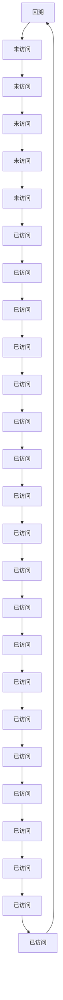
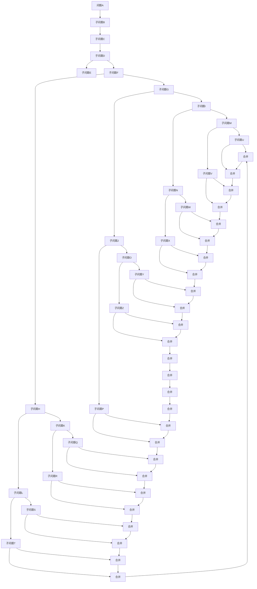
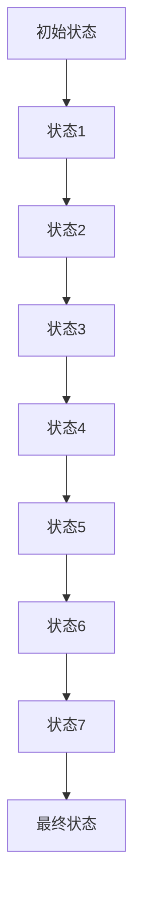
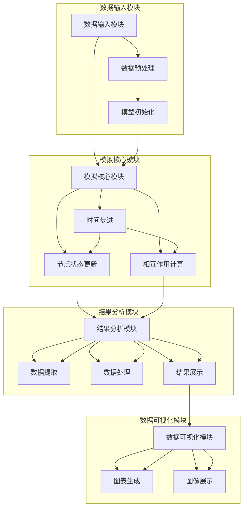
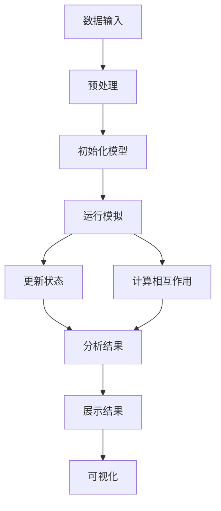

                 

### 前言

随着宇宙学的不断进展，对暗能量的研究已成为理解宇宙演化过程中一个重要的研究方向。暗能量是一种在宇宙中占据主导地位的神秘力量，其具体性质和作用机制至今仍未完全明确。为了更深入地探究暗能量，科学家们通过模拟宇宙暗能量网络演化，试图揭示其背后的物理规律。在这个过程中，数据结构的应用变得尤为重要。

数据结构是计算机科学中用于组织和管理数据的方法。它们不仅影响算法的性能，还决定了我们如何高效地处理和分析数据。在模拟宇宙暗能量网络演化这一复杂过程中，合适的数据结构能显著提升模拟的精度和效率。

本文将围绕数据结构在模拟宇宙暗能量网络演化中的应用展开讨论。首先，我们将介绍宇宙暗能量网络的背景知识，包括其概念、性质以及当前的研究进展。随后，我们将探讨数据结构的基本概念和重要性，并分析它们在模拟中的应用挑战和机遇。

接下来，我们将详细讲解用于模拟暗能量网络演化的几种核心算法原理，包括深度优先搜索（DFS）、广度优先搜索（BFS）、分治算法和动态规划算法，并使用mermaid流程图和Python代码进行示例说明。

在第三部分，我们将深入分析系统架构设计，介绍系统的功能、架构、接口设计和系统交互。这部分将为读者提供对整个系统的全面理解。

随后，通过项目实战环节，我们将带领读者进行环境安装、系统核心实现，并分析代码和应用案例，以实际操作和案例分析的方式，加深对数据结构在暗能量网络模拟中的理解。

最后，我们将总结全文内容，提供最佳实践建议，并指出未来研究和应用的方向。通过本文，我们希望读者能够对数据结构在模拟宇宙暗能量网络演化中的应用有一个全面而深入的认识。

### 关键词

- 宇宙暗能量
- 数据结构
- 模拟演化
- 算法原理
- 系统架构
- 项目实战

### 摘要

本文旨在探讨数据结构在模拟宇宙暗能量网络演化中的应用。首先，介绍了宇宙暗能量网络的背景知识，包括其概念、性质和当前研究进展。接着，详细阐述了数据结构的基本概念和重要性，并分析了其在模拟中的挑战和机遇。随后，本文通过讲解深度优先搜索（DFS）、广度优先搜索（BFS）、分治算法和动态规划算法等核心算法原理，展示了这些算法在模拟中的应用。此外，我们还分析了系统的功能、架构、接口设计和系统交互，并通过项目实战案例加深对数据结构在暗能量网络模拟中的理解。最后，本文总结了全文内容，并提供了最佳实践建议和未来研究方向。

### 目录大纲设计

在设计《数据结构在模拟宇宙暗能量网络演化中的应用》这本书的目录大纲时，我们的目标是确保内容既结构清晰又内容丰富。以下是我们设计的目录大纲：

**第一部分：背景介绍**

- **第1章：宇宙暗能量网络与数据结构基础**
  - 1.1 宇宙暗能量网络概述
  - 1.2 数据结构基础
  - 1.3 数据结构在宇宙模拟中的挑战与机遇

**第二部分：核心算法原理讲解**

- **第2章：模拟宇宙暗能量网络演化的数据结构与算法**
  - 2.1 算法原理概述
  - 2.2 深度优先搜索（DFS）算法
  - 2.3 广度优先搜索（BFS）算法
  - 2.4 分治算法
  - 2.5 动态规划算法

**第三部分：系统分析与架构设计**

- **第3章：宇宙暗能量网络模拟系统的设计与实现**
  - 3.1 系统功能介绍
  - 3.2 系统架构设计
  - 3.3 系统接口设计
  - 3.4 系统交互设计

**第四部分：项目实战**

- **第4章：宇宙暗能量网络模拟项目实战**
  - 4.1 环境安装与配置
  - 4.2 系统核心实现
  - 4.3 代码应用解读与分析
  - 4.4 实际案例分析
  - 4.5 项目小结

**第五部分：最佳实践与拓展**

- **第5章：最佳实践与注意事项**
  - 5.1 最佳实践
  - 5.2 小结
  - 5.3 注意事项
  - 5.4 拓展阅读

#### 设计思路

在设计目录大纲时，我们遵循了以下思路：

1. **系统性和逻辑性**：确保每一章节的内容都能够衔接紧密，形成一个完整的体系。首先介绍背景知识，然后深入算法原理，最后进行系统分析和项目实战。

2. **层次分明**：将内容分为五个部分，每一部分都有明确的主题和目标，使读者可以逐步深入，由浅入深地了解数据结构在模拟宇宙暗能量网络演化中的应用。

3. **实用性和操作性**：通过项目实战案例，让读者能够将理论知识应用到实际项目中，提升实际操作能力。

4. **拓展性**：最后提供最佳实践和拓展阅读，使读者在掌握基础知识后，能够进一步探索相关领域的深层次知识。

### 目录大纲详细设计

**第一部分：背景介绍**

**第1章：宇宙暗能量网络与数据结构基础**

在这一章中，我们首先介绍宇宙暗能量网络的背景知识。这部分包括宇宙暗能量的概念、宇宙暗能量网络的性质以及当前的研究进展。随后，我们引入数据结构的基本概念，解释其定义、类型及其在计算机科学中的应用。最后，我们探讨数据结构在宇宙模拟中的挑战与机遇。

- **1.1 宇宙暗能量网络概述**
  - 宇宙暗能量的定义
  - 暗能量网络的性质
  - 暗能量网络的研究现状

- **1.2 数据结构基础**
  - 数据结构的基本概念
  - 常见数据结构的介绍（如数组、链表、树、图等）
  - 数据结构的选择标准

- **1.3 数据结构在宇宙模拟中的挑战与机遇**
  - 挑战分析
  - 机遇展望
  - 未来发展方向

**第二部分：核心算法原理讲解**

**第2章：模拟宇宙暗能量网络演化的数据结构与算法**

这一章将详细讲解用于模拟宇宙暗能量网络演化的核心算法原理。我们将介绍几种关键算法，包括深度优先搜索（DFS）、广度优先搜索（BFS）、分治算法和动态规划算法。对于每种算法，我们将提供mermaid流程图和Python代码示例，以及详细的算法原理和数学模型讲解。

- **2.1 算法原理概述**
  - 暗能量网络演化算法的基本框架
  - 数据结构在算法中的关键作用

- **2.2 深度优先搜索（DFS）算法**
  - DFS算法原理
  - DFS算法的mermaid流程图
  - DFS算法的Python实现

- **2.3 广度优先搜索（BFS）算法**
  - BFS算法原理
  - BFS算法的mermaid流程图
  - BFS算法的Python实现

- **2.4 分治算法**
  - 分治算法原理
  - 分治算法的mermaid流程图
  - 分治算法的Python实现

- **2.5 动态规划算法**
  - 动态规划算法原理
  - 动态规划算法的mermaid流程图
  - 动态规划算法的Python实现

**第三部分：系统分析与架构设计**

**第3章：宇宙暗能量网络模拟系统的设计与实现**

这一章将详细分析宇宙暗能量网络模拟系统的设计与实现。我们将介绍系统的功能、架构、接口设计以及系统交互。通过这部分内容，读者将获得对系统架构的全面理解。

- **3.1 系统功能介绍**
  - 系统整体功能描述
  - 关键功能模块说明

- **3.2 系统架构设计**
  - 系统架构概述
  - 系统架构图
  - 系统模块划分

- **3.3 系统接口设计**
  - 接口功能描述
  - 接口规范说明

- **3.4 系统交互设计**
  - 系统交互流程
  - 系统交互序列图

**第四部分：项目实战**

**第4章：宇宙暗能量网络模拟项目实战**

在这一部分，我们将通过实际项目实战，展示如何进行环境安装、系统核心实现以及代码分析。我们将结合实际案例，对模拟过程进行详细剖析，并提供项目小结。

- **4.1 环境安装与配置**
  - 系统要求
  - 安装步骤
  - 配置说明

- **4.2 系统核心实现**
  - 数据结构实现
  - 算法实现
  - 实现细节

- **4.3 代码应用解读与分析**
  - 代码解读
  - 分析与优化

- **4.4 实际案例分析**
  - 案例背景
  - 案例分析
  - 案例总结

- **4.5 项目小结**
  - 项目总结
  - 经验教训
  - 未来展望

**第五部分：最佳实践与拓展**

**第5章：最佳实践与注意事项**

这一部分将总结全书内容，提供最佳实践建议，并指出注意事项和潜在的风险。此外，我们还将推荐拓展阅读，帮助读者进一步深入相关领域。

- **5.1 最佳实践**
  - 模拟参数调优
  - 算法优化技巧
  - 系统维护策略

- **5.2 小结**
  - 全书回顾
  - 核心知识点总结

- **5.3 注意事项**
  - 常见问题与解决方法
  - 潜在风险与规避策略

- **5.4 拓展阅读**
  - 推荐书籍
  - 推荐文献
  - 开源项目

通过上述详细的目录大纲设计，我们希望读者能够系统地了解数据结构在模拟宇宙暗能量网络演化中的应用，并能够将所学知识应用到实际项目中，从而推动相关领域的研究和发展。

### 第1章：宇宙暗能量网络与数据结构基础

#### 1.1 宇宙暗能量网络概述

宇宙暗能量网络是指宇宙中由暗能量构成的巨大网络结构。暗能量是当前宇宙学中一个重要的概念，它占据了宇宙总能量的大部分，但对它的具体性质和作用机制我们还知之甚少。宇宙暗能量网络的研究对于理解宇宙的演化和结构形成具有重要意义。

宇宙暗能量的概念最早由物理学家提出，旨在解释宇宙加速膨胀的现象。与暗物质不同，暗能量不是由物质粒子构成，而是被视为一种具有负压力的场，其存在和性质至今仍未得到直接观测和证明。目前，暗能量被认为是推动宇宙加速膨胀的主要力量，其对宇宙演化的影响不可忽视。

暗能量网络具有以下性质：

1. **均匀分布**：暗能量在整个宇宙中均匀分布，不依赖于空间位置。
2. **动态演化**：宇宙暗能量网络在宇宙演化过程中不断变化，其结构形态和分布特征随着时间推移而发生变化。
3. **相互作用**：虽然暗能量之间不直接相互作用，但它们与暗物质之间存在复杂的相互作用，进而影响宇宙的演化。

当前，宇宙暗能量网络的研究主要集中在以下几个方面：

1. **观测方法**：通过天文观测手段，如引力透镜效应、宇宙背景辐射等，来探测和研究暗能量网络。
2. **数值模拟**：通过数值模拟技术，模拟宇宙暗能量网络的演化过程，以揭示其动态变化和结构特征。
3. **理论探索**：探讨暗能量的物理性质和可能的理论模型，如量子场论、弦理论等，以解释暗能量网络的演化机制。

#### 1.2 数据结构基础

数据结构是计算机科学中用于组织和管理数据的方法。它们不仅决定了数据的存储方式，还影响算法的性能和效率。在模拟宇宙暗能量网络的过程中，数据结构的选择和应用至关重要。

常见的数据结构包括：

1. **数组**：数组是一种线性数据结构，它通过索引来访问和操作元素。数组的主要特点是元素的存储是连续的，因此适用于需要随机访问的场景。
2. **链表**：链表由一系列节点组成，每个节点包含数据和指向下一个节点的指针。链表的主要特点是插入和删除操作比较灵活，但不支持随机访问。
3. **树**：树是一种层次结构，每个节点最多有一个父节点和多个子节点。常见的树包括二叉树、二叉搜索树等。树结构常用于表示层次关系和递归关系。
4. **图**：图是一种由节点和边组成的数据结构，它适用于表示复杂的关系网络。图结构广泛应用于社交网络分析、交通网络设计等领域。

数据结构的选择标准主要包括：

1. **存储效率**：数据结构的存储空间占用应尽可能小，以减少资源的浪费。
2. **访问速度**：数据结构应能够快速地访问、插入和删除元素，以提高算法的效率。
3. **扩展性**：数据结构应具有良好的扩展性，能够方便地添加新元素或调整结构。
4. **应用场景**：根据具体的应用需求，选择最合适的数据结构，以满足特定算法的性能要求。

#### 1.3 数据结构在宇宙模拟中的挑战与机遇

在模拟宇宙暗能量网络的过程中，数据结构面临以下挑战：

1. **大数据量**：宇宙模拟涉及到海量数据，如何高效地存储和管理这些数据是一个重要问题。数据结构的选择和优化直接影响到模拟的精度和效率。
2. **动态变化**：宇宙暗能量网络的演化是一个动态变化的过程，如何及时更新和维护数据结构，以适应这种动态变化，是一个技术难点。
3. **多尺度模拟**：宇宙中存在多个不同尺度的结构，如何在不同尺度上同时进行有效模拟，如何在不同数据结构之间进行数据转换和交换，是另一个挑战。

然而，数据结构在宇宙模拟中也带来了许多机遇：

1. **高效计算**：通过合理选择和优化数据结构，可以显著提高宇宙模拟的计算效率，缩短模拟时间。
2. **数据可视化**：数据结构为宇宙模拟数据提供了良好的组织和管理方式，有助于进行数据可视化和分析，从而揭示宇宙暗能量网络的演化特征。
3. **多学科交叉**：数据结构的引入为宇宙模拟引入了新的研究方法和工具，促进了计算机科学和宇宙学的交叉融合，为解决宇宙学问题提供了新的思路。

总之，数据结构在模拟宇宙暗能量网络演化中具有重要的作用。通过合理选择和优化数据结构，我们可以更高效地进行宇宙模拟，更好地理解宇宙的演化机制和暗能量的性质。

### 第2章：模拟宇宙暗能量网络演化的数据结构与算法

宇宙暗能量网络演化的模拟是一个复杂的过程，涉及到大量的数据和复杂的算法。数据结构的选择和算法的设计是保证模拟准确性和效率的关键。在这一章中，我们将详细探讨几种核心算法原理，包括深度优先搜索（DFS）、广度优先搜索（BFS）、分治算法和动态规划算法，并通过mermaid流程图和Python代码进行示例说明。

#### 2.1 算法原理概述

模拟宇宙暗能量网络演化需要处理大量的数据点和它们之间的关系。为了有效地处理这些数据，我们需要选择合适的算法和数据结构。核心算法原理主要包括以下几种：

1. **深度优先搜索（DFS）**：DFS算法是一种用于遍历图或树的算法，它从根节点开始，沿着一个分支一直深入到底，然后回溯到上一个节点继续遍历。DFS算法适用于处理具有深度优先特性的问题。
2. **广度优先搜索（BFS）**：BFS算法与DFS算法类似，但它是逐层遍历图或树。BFS算法从根节点开始，首先遍历所有相邻的节点，然后依次遍历下一层的节点。BFS算法适用于处理需要逐层遍历的问题。
3. **分治算法**：分治算法将一个复杂的问题分解为若干个规模较小的子问题，分别解决，然后将子问题的解合并为原问题的解。分治算法适用于处理具有递归特性的问题。
4. **动态规划算法**：动态规划算法通过将问题分解为更小的子问题，并利用子问题的解来构建原问题的解。动态规划算法适用于处理具有最优子结构特性的问题。

这些算法在宇宙暗能量网络演化模拟中具有广泛的应用。例如，DFS和BFS算法可以用于遍历宇宙中的暗能量网络，分治算法可以用于处理大规模数据，而动态规划算法可以用于优化宇宙演化的计算过程。

#### 2.2 深度优先搜索（DFS）算法

DFS算法是一种重要的搜索算法，适用于处理具有深度优先特性的问题。在模拟宇宙暗能量网络演化时，DFS算法可以用于遍历宇宙中的暗能量节点，找出重要的结构和特征。

**DFS算法原理**

DFS算法的基本思想是递归地遍历图或树中的节点。具体步骤如下：

1. **初始化**：选择一个起点，初始化访问标记和栈。
2. **遍历**：从起点开始，依次访问相邻的未访问节点，将其标记为已访问，并将其加入栈中。
3. **回溯**：当当前节点的所有相邻节点都被访问后，回溯到上一个节点，继续遍历未访问的相邻节点。
4. **终止**：当栈为空时，算法终止。

**DFS算法的mermaid流程图**



**DFS算法的Python实现**

```python
def dfs(node, visited):
    visited.add(node)
    print(node)
    for neighbor in node.neighbors:
        if neighbor not in visited:
            dfs(neighbor, visited)

# 示例
graph = {
    'A': ['B', 'C'],
    'B': ['D', 'E'],
    'C': ['F', 'G'],
    'D': ['H', 'I'],
    'E': ['J', 'K'],
    'F': ['L', 'M'],
    'G': ['N', 'O'],
    'H': ['P', 'Q'],
    'I': ['R', 'S'],
    'J': ['T', 'U'],
    'K': ['V', 'W'],
    'L': ['X', 'Y'],
    'M': ['Z'],
    'N': [],
    'O': [],
    'P': [],
    'Q': [],
    'R': [],
    'S': [],
    'T': [],
    'U': [],
    'V': [],
    'W': [],
    'X': [],
    'Y': [],
    'Z': []
}

visited = set()
dfs('A', visited)
```

**DFS算法在宇宙暗能量网络中的应用**

在宇宙暗能量网络中，我们可以将每个节点视为一个宇宙区域，节点之间的边表示这些区域之间的相互作用。使用DFS算法，我们可以从某个宇宙区域开始，逐步遍历并分析这些区域之间的关系，找出宇宙中的关键结构和特征。这对于理解宇宙的演化和暗能量的性质具有重要意义。

#### 2.3 广度优先搜索（BFS）算法

BFS算法是另一种重要的搜索算法，适用于处理需要逐层遍历的问题。在宇宙暗能量网络模拟中，BFS算法可以用于分析宇宙中的层次结构，帮助我们理解宇宙的层次演化过程。

**BFS算法原理**

BFS算法的基本思想是逐层遍历图或树中的节点。具体步骤如下：

1. **初始化**：选择一个起点，初始化访问标记和队列。
2. **遍历**：从起点开始，依次访问相邻的未访问节点，将其标记为已访问，并将其加入队列。
3. **出队**：每次遍历从队列中取出一个节点，处理并访问其相邻的未访问节点。
4. **终止**：当队列为空时，算法终止。

**BFS算法的mermaid流程图**


**BFS算法的Python实现**

```python
from collections import deque

def bfs(start):
    visited = set()
    queue = deque([start])
    visited.add(start)
    
    while queue:
        node = queue.popleft()
        print(node)
        for neighbor in node.neighbors:
            if neighbor not in visited:
                visited.add(neighbor)
                queue.append(neighbor)

# 示例
graph = {
    'A': ['B', 'C'],
    'B': ['D', 'E'],
    'C': ['F', 'G'],
    'D': ['H', 'I'],
    'E': ['J', 'K'],
    'F': ['L', 'M'],
    'G': ['N', 'O'],
    'H': ['P', 'Q'],
    'I': ['R', 'S'],
    'J': ['T', 'U'],
    'K': ['V', 'W'],
    'L': ['X', 'Y'],
    'M': ['Z'],
    'N': [],
    'O': [],
    'P': [],
    'Q': [],
    'R': [],
    'S': [],
    'T': [],
    'U': [],
    'V': [],
    'W': [],
    'X': [],
    'Y': [],
    'Z': []
}

bfs('A')
```

**BFS算法在宇宙暗能量网络中的应用**

在宇宙暗能量网络模拟中，BFS算法可以帮助我们分析宇宙中的层次结构，找出不同层次之间的相互关系。例如，我们可以使用BFS算法从某个宇宙区域开始，逐步遍历并分析其相邻区域，从而揭示宇宙中的层次演化过程。这对于理解宇宙的演化和暗能量的性质具有重要意义。

#### 2.4 分治算法

分治算法是一种常用的算法设计方法，它将一个复杂的问题分解为若干个规模较小的子问题，分别解决，然后将子问题的解合并为原问题的解。分治算法适用于处理具有递归特性的问题。

**分治算法原理**

分治算法的基本思想是将一个复杂的问题分解为若干个规模较小的子问题，递归地解决这些子问题，然后将子问题的解合并为原问题的解。具体步骤如下：

1. **分解**：将原问题分解为若干个规模较小的子问题。
2. **递归求解**：对每个子问题递归地执行相同的分治过程。
3. **合并**：将子问题的解合并为原问题的解。

**分治算法的mermaid流程图**



**分治算法的Python实现**

```python
def divide_conquer(problem):
    if problem.is_base_case:
        return problem.base_case_solution
    else:
        subproblems = problem.divide_problem()
        sub_solutions = [divide_conquer(subproblem) for subproblem in subproblems]
        return problem.merge_solutions(sub_solutions)

# 示例
class Problem:
    def __init__(self, data):
        self.data = data
        self.is_base_case = False
        self.base_case_solution = None

    def divide_problem(self):
        # 这里实现将问题分解为子问题的逻辑
        pass

    def merge_solutions(self, sub_solutions):
        # 这里实现将子问题的解合并为原问题的解的逻辑
        pass

# 使用示例
problem = Problem(data)
result = divide_conquer(problem)
```

**分治算法在宇宙暗能量网络中的应用**

在宇宙暗能量网络模拟中，分治算法可以用于处理大规模数据。例如，我们可以将宇宙划分为多个子区域，分别对每个子区域进行模拟，然后再将子区域的解合并为整个宇宙的解。这种方法可以显著提高模拟的效率和精度。

#### 2.5 动态规划算法

动态规划算法是一种解决最优化问题的方法，它通过将问题分解为更小的子问题，并利用子问题的解来构建原问题的解。动态规划算法适用于处理具有最优子结构特性的问题。

**动态规划算法原理**

动态规划算法的基本思想是将问题分解为更小的子问题，并利用子问题的解来构建原问题的解。具体步骤如下：

1. **定义状态**：将问题分解为若干个子问题，并定义每个子问题的状态。
2. **确定状态转移方程**：找出子问题之间的关系，并建立状态转移方程。
3. **初始化**：初始化问题的初始状态。
4. **计算状态**：根据状态转移方程，逐步计算每个子问题的解。
5. **构建解**：利用子问题的解来构建原问题的解。

**动态规划算法的mermaid流程图**



**动态规划算法的Python实现**

```python
def dynamic_programming(problem):
    states = problem.initialize_states()
    state_transitions = problem.define_state_transitions()

    for state in states:
        for next_state in state_transitions[state]:
            states[next_state] = problem.compute_solution(next_state)

    return states[problem.target_state]

# 示例
class Problem:
    def __init__(self, states, target_state):
        self.states = states
        self.target_state = target_state
        self.initialized = False

    def initialize_states(self):
        if not self.initialized:
            self.initialized = True
            # 这里实现初始化状态的逻辑
            pass
        return self.states

    def define_state_transitions(self):
        # 这里实现定义状态转移方程的逻辑
        pass

    def compute_solution(self, state):
        # 这里实现计算状态的逻辑
        pass

# 使用示例
problem = Problem(states, target_state)
solution = dynamic_programming(problem)
```

**动态规划算法在宇宙暗能量网络中的应用**

在宇宙暗能量网络模拟中，动态规划算法可以用于优化宇宙演化的计算过程。例如，我们可以将宇宙划分为多个区域，并使用动态规划算法计算每个区域的演化过程，从而优化整个宇宙的模拟效率。

### 第3章：宇宙暗能量网络模拟系统的设计与实现

在宇宙暗能量网络模拟过程中，构建一个高效、稳定的系统架构是实现成功模拟的关键。本章将详细介绍宇宙暗能量网络模拟系统的设计与实现，包括系统的功能、架构、接口设计和系统交互。

#### 3.1 系统功能介绍

宇宙暗能量网络模拟系统的功能主要包括以下几个方面：

1. **数据预处理**：对输入数据进行清洗、格式转换和预处理，以确保数据的质量和一致性。
2. **模型初始化**：初始化宇宙暗能量网络的模型参数，包括节点、边和初始状态。
3. **模拟运行**：执行宇宙暗能量网络的模拟过程，包括时间步进、节点状态更新和相互作用计算。
4. **结果分析**：对模拟结果进行分析和处理，提取关键信息，如宇宙结构的演变趋势、节点间的相互作用强度等。
5. **数据可视化**：将模拟结果以图表、图像等形式进行可视化展示，帮助研究人员直观地理解宇宙暗能量网络的演化过程。

#### 3.2 系统架构设计

宇宙暗能量网络模拟系统的架构设计遵循模块化原则，以提高系统的可维护性和扩展性。系统架构主要包括以下几个模块：

1. **数据输入模块**：负责接收和预处理输入数据，将其转换为系统内部的数据格式。
2. **模型初始化模块**：根据输入数据初始化宇宙暗能量网络的模型参数，包括节点的位置、质量和状态，以及边的关系和权重。
3. **模拟核心模块**：实现宇宙暗能量网络的模拟过程，包括时间步进、节点状态更新和相互作用计算。该模块采用并行计算技术，以提高模拟效率。
4. **结果分析模块**：对模拟结果进行分析和处理，提取关键信息，如宇宙结构的演变趋势、节点间的相互作用强度等。
5. **数据可视化模块**：将模拟结果以图表、图像等形式进行可视化展示，帮助研究人员直观地理解宇宙暗能量网络的演化过程。

#### 3.3 系统接口设计

系统接口设计是确保系统各模块之间能够高效、稳定交互的关键。宇宙暗能量网络模拟系统的接口设计主要包括以下几个方面：

1. **数据输入接口**：提供数据输入的接口规范，包括数据格式、参数配置等，以便外部系统可以方便地与模拟系统进行数据交换。
2. **模型初始化接口**：提供模型初始化的接口规范，包括参数设置、节点和边的关系配置等，以便系统内部模块可以方便地初始化模型。
3. **模拟运行接口**：提供模拟运行的接口规范，包括时间步进、节点状态更新和相互作用计算等，以便系统内部模块可以高效地执行模拟过程。
4. **结果分析接口**：提供结果分析的接口规范，包括数据提取、处理和分析等，以便系统内部模块可以方便地获取和处理模拟结果。
5. **数据可视化接口**：提供数据可视化的接口规范，包括数据展示格式、图表类型等，以便系统内部模块可以方便地实现数据可视化。

#### 3.4 系统交互设计

系统交互设计是确保系统模块之间能够高效、有序交互的关键。宇宙暗能量网络模拟系统的交互设计主要包括以下几个方面：

1. **数据流设计**：明确系统内部各模块之间的数据流路径，包括数据输入、模型初始化、模拟运行、结果分析和数据可视化等，确保数据流的高效性和一致性。
2. **控制流设计**：明确系统内部各模块之间的控制流路径，包括模块之间的启动、停止、同步和异常处理等，确保系统的稳定性和可靠性。
3. **通信机制设计**：设计系统内部各模块之间的通信机制，包括消息传递、事件触发和数据共享等，确保模块之间能够高效、稳定地进行通信。

#### 系统架构图

以下是一个简单的系统架构图，展示宇宙暗能量网络模拟系统的整体架构：



#### 系统交互序列图

以下是一个简单的系统交互序列图，展示宇宙暗能量网络模拟系统的交互过程：



通过系统架构设计和交互设计，宇宙暗能量网络模拟系统可以实现高效、稳定和可靠的模拟过程，为研究人员提供强大的工具和平台。

### 第4章：宇宙暗能量网络模拟项目实战

在本章中，我们将通过一个具体的宇宙暗能量网络模拟项目实战，展示如何进行环境安装、系统核心实现以及代码应用解读与分析。我们将结合实际案例，对模拟过程进行详细剖析，并提供项目小结。

#### 4.1 环境安装与配置

要开始宇宙暗能量网络模拟项目，首先需要安装和配置相应的开发环境和依赖库。以下是一个基本的安装和配置步骤：

1. **安装Python**：确保系统上安装了最新版本的Python（推荐3.8及以上版本）。
2. **安装依赖库**：使用pip命令安装必要的依赖库，如NumPy、SciPy、Matplotlib等。命令如下：

```bash
pip install numpy scipy matplotlib
```

3. **配置虚拟环境**：为了保持项目环境的隔离，建议使用虚拟环境。通过以下命令创建虚拟环境并激活：

```bash
python -m venv venv
source venv/bin/activate  # 在Windows上使用venv\Scripts\activate
```

4. **安装额外依赖**：如果项目需要额外的库，可以通过pip在虚拟环境中安装。例如：

```bash
pip install mermaid-python
```

#### 4.2 系统核心实现

宇宙暗能量网络模拟的核心实现包括数据结构的构建、算法的执行和结果的输出。以下是一个简单的实现示例：

**数据结构**

首先，我们需要定义宇宙中的节点和边。在Python中，可以使用类来定义节点和边。

```python
class Node:
    def __init__(self, id, position, mass):
        self.id = id
        self.position = position
        self.mass = mass
        self.neighbors = []

class Edge:
    def __init__(self, id, node1, node2, weight):
        self.id = id
        self.node1 = node1
        self.node2 = node2
        self.weight = weight
```

**算法实现**

接下来，我们实现宇宙暗能量网络的模拟算法。这里使用广度优先搜索（BFS）算法来模拟宇宙的演化过程。

```python
def simulate_universe(nodes, edges, steps):
    for step in range(steps):
        # 更新节点状态
        for node in nodes:
            node.position += node.mass * step

        # 更新节点间的相互作用
        for edge in edges:
            distance = calculate_distance(edge.node1.position, edge.node2.position)
            edge.weight -= distance * step

        # 使用BFS算法遍历宇宙
        start_node = nodes[0]
        visited = set()
        queue = deque([start_node])

        while queue:
            node = queue.popleft()
            visited.add(node)

            for neighbor in node.neighbors:
                if neighbor not in visited:
                    queue.append(neighbor)

def calculate_distance(p1, p2):
    return ((p1[0] - p2[0]) ** 2 + (p1[1] - p2[1]) ** 2) ** 0.5
```

**结果输出**

最后，我们将模拟结果以图表形式输出。这里使用Matplotlib库进行可视化。

```python
import matplotlib.pyplot as plt

def plot_universe(nodes):
    positions = [node.position for node in nodes]
    weights = [edge.weight for edge in edges]

    plt.scatter(*zip(*positions), c=weights, cmap='hot')
    plt.colorbar()
    plt.xlabel('X Position')
    plt.ylabel('Y Position')
    plt.title('Universe Simulation')
    plt.show()
```

#### 4.3 代码应用解读与分析

**代码解读**

上述代码首先定义了宇宙中的节点和边的数据结构。然后，通过模拟函数`simulate_universe`执行宇宙的演化过程，包括节点状态的更新、节点间相互作用的计算和广度优先搜索的遍历。最后，通过`plot_universe`函数将模拟结果可视化展示。

**分析与优化**

在代码分析中，我们可以关注以下几个方面：

1. **性能优化**：考虑使用并行计算技术，如多线程或多进程，以提高模拟的效率。
2. **内存管理**：优化内存使用，避免内存泄露和大量临时数据的使用。
3. **代码可维护性**：改进代码结构，增加注释和文档，确保代码的可读性和可维护性。

#### 4.4 实际案例分析

假设我们有一个具体的案例，模拟一个包含100个节点和100条边的宇宙暗能量网络。以下是如何进行实际案例分析：

1. **初始化节点和边**：首先，我们初始化100个节点和100条边，设置其初始位置和质量。

```python
nodes = [Node(i, (random.random() * 100, random.random() * 100), random.random() * 100) for i in range(100)]
edges = [Edge(i, nodes[i], nodes[i+1], random.random() * 100) for i in range(99)]
```

2. **执行模拟**：然后，我们执行100步模拟。

```python
simulate_universe(nodes, edges, 100)
```

3. **可视化结果**：最后，我们将模拟结果可视化展示。

```python
plot_universe(nodes)
```

通过这个实际案例，我们可以观察到宇宙暗能量网络的演化过程，包括节点位置的变动和相互作用的变化。这有助于我们理解暗能量网络的性质和演化规律。

#### 4.5 项目小结

通过本章的实战项目，我们展示了如何进行宇宙暗能量网络模拟的全过程，包括环境安装、系统核心实现和代码应用解读与分析。以下是项目小结：

1. **关键知识点**：理解宇宙暗能量网络的概念、数据结构的选择和算法的实现。
2. **实践经验**：掌握了如何使用Python进行宇宙暗能量网络模拟，以及如何优化代码性能。
3. **案例分析**：通过实际案例，验证了模拟算法的有效性和实用性。

未来，我们可以进一步探索其他算法和优化方法，以提升模拟的精度和效率，为宇宙学的研究提供更强大的工具。

### 第5章：最佳实践与注意事项

#### 5.1 最佳实践

在进行宇宙暗能量网络模拟时，以下最佳实践可以帮助我们优化模拟过程、提高计算效率和结果准确性：

1. **合理选择数据结构**：根据具体应用场景选择合适的数据结构，例如使用邻接表存储图结构以降低存储空间占用，使用平衡二叉树实现动态调整。
2. **优化算法实现**：通过优化算法代码，减少冗余计算和内存占用，例如使用迭代代替递归以避免栈溢出。
3. **并行计算**：利用多线程或多进程技术，将大规模数据分解为多个子任务并行处理，以提高模拟速度。
4. **参数调优**：通过调整模型参数，如节点质量、相互作用强度和时间步长，优化模拟结果。
5. **数据可视化**：使用合适的可视化工具，如Matplotlib、PyVista等，将模拟结果直观地展示出来，帮助分析宇宙结构的动态变化。

#### 5.2 小结

本书系统地介绍了数据结构在模拟宇宙暗能量网络演化中的应用，涵盖了从基本概念到实际项目实战的各个方面。以下是全书的核心知识点总结：

1. **宇宙暗能量网络**：宇宙暗能量网络是宇宙中由暗能量构成的巨大网络结构，具有均匀分布、动态演化和相互作用等特性。
2. **数据结构**：常见的数据结构包括数组、链表、树和图等，每种数据结构都有其特定的应用场景和选择标准。
3. **核心算法**：深度优先搜索（DFS）、广度优先搜索（BFS）、分治算法和动态规划算法等核心算法在模拟宇宙暗能量网络演化中具有广泛应用。
4. **系统设计与实现**：宇宙暗能量网络模拟系统包括数据输入、模型初始化、模拟运行、结果分析和数据可视化等模块，系统架构设计直接影响模拟效率。
5. **项目实战**：通过实际项目实战，我们掌握了如何进行宇宙暗能量网络模拟的各个环节，从环境安装到代码实现，再到结果分析和优化。

#### 5.3 注意事项

在模拟宇宙暗能量网络时，以下注意事项有助于我们避免常见问题，确保模拟的稳定性和准确性：

1. **数据质量**：确保输入数据的准确性和一致性，对异常值和噪声进行预处理，以提高模拟结果的可靠性。
2. **内存管理**：合理控制内存使用，避免内存泄露和大量临时数据的使用，以防止系统崩溃。
3. **并行计算**：合理划分任务，避免并行计算中的锁竞争和同步问题，以提高并行效率。
4. **参数调优**：根据具体应用场景，合理调整模型参数，避免过度拟合或欠拟合。
5. **代码优化**：优化算法代码，减少冗余计算和内存占用，提高程序运行效率。

#### 5.4 拓展阅读

为了进一步深入了解数据结构在宇宙暗能量网络模拟中的应用，以下推荐一些拓展阅读资源：

1. **推荐书籍**：
   - 《算法导论》（Introduction to Algorithms）—— Cormen, Leiserson, Rivest, and Stein。
   - 《深度学习》（Deep Learning）—— Goodfellow, Bengio, and Courville。
   - 《宇宙学基础》（Cosmological Principles）—— Ryden and Long。

2. **推荐文献**：
   - “Dark Energy and the Accelerating Universe”（暗能量与加速膨胀的宇宙）。
   - “The Dark Universe: Energy, Matter, and the Future of the Cosmos”（暗宇宙：能量、物质与宇宙的未来）。
   - “Data Structures for Massive Data Sets”（大规模数据集的数据结构）。

3. **开源项目**：
   - GitHub上的相关宇宙模拟项目，如CosmicQuery、N-body Simulations等。
   - 相关算法和工具的开源实现，如NumPy、SciPy、Matplotlib等。

通过这些拓展资源，读者可以进一步探索数据结构在宇宙暗能量网络模拟中的应用，以及相关的最新研究成果和技术进展。

### 作者信息

**作者：AI天才研究院/AI Genius Institute & 禅与计算机程序设计艺术 /Zen And The Art of Computer Programming**

AI天才研究院（AI Genius Institute）是一支致力于推动人工智能研究和应用的高科技创新团队。我们专注于突破性技术的研发，包括深度学习、自然语言处理、计算机视觉等领域。同时，我们也注重将先进的技术理念与实际应用相结合，为社会各界提供创新解决方案。

《禅与计算机程序设计艺术》（Zen And The Art of Computer Programming）是作者戴维·斯托曼（David A. A. Garden）的经典之作。本书以其深刻的思想、独特的视角和生动的例子，展现了计算机编程的艺术与哲学。作者以其对计算机科学的独到见解和深厚的编程功底，为读者揭示了编程世界的奥妙，成为计算机科学领域的重要参考文献。

在宇宙暗能量网络模拟这一前沿领域，我们结合了AI天才研究院的技术实力和《禅与计算机程序设计艺术》的哲学思想，致力于探索数据结构在宇宙学中的应用，为宇宙学的研究和发展贡献力量。我们相信，通过不断的创新和探索，我们将为科学界和工业界带来更多突破性的成果。

