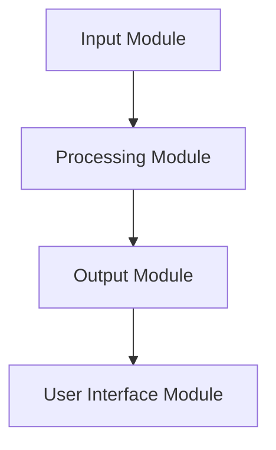

                 

### Chapter 1: Introduction to Data Structures and Simulating Cosmic Evolution

**Keywords**: Data Structures, Cosmic Evolution Simulation, Application

**Abstract**: This chapter introduces the fundamental concepts of data structures and cosmic evolution simulation. We will explore what data structures are, their importance in various fields, and how they can be applied to simulate the complex phenomena of cosmic evolution. By understanding these foundational elements, we will lay the groundwork for further discussions on the advanced topics that follow.

#### 1.1 What are Data Structures?

Data structures are the way data is organized and stored in a computer so that it can be accessed and worked with efficiently. They provide a systematic way of storing and organizing data, allowing programs to perform operations on data quickly and efficiently. The choice of data structure can significantly impact the performance of an algorithm.

There are several types of data structures, each with its own strengths and weaknesses:

- **Array**: A collection of elements, each identified by an index or key.
- **Linked List**: A collection of nodes, where each node contains data and a reference to the next node in the sequence.
- **Stack**: A linear data structure that follows the Last In, First Out (LIFO) principle.
- **Queue**: A linear data structure that follows the First In, First Out (FIFO) principle.
- **Tree**: A hierarchical data structure consisting of nodes, with the topmost node called the root.
- **Graph**: A non-linear data structure consisting of nodes (vertices) connected by edges.

#### 1.2 The Concept of Cosmic Evolution Simulation

Cosmic evolution simulation is the process of modeling and simulating the development and evolution of the universe over time. This involves creating a digital representation of the universe, including stars, galaxies, and other celestial objects, and then simulating the physical processes that govern their interactions and evolution.

The goal of cosmic evolution simulation is to understand the large-scale structure and dynamics of the universe, including the formation and evolution of galaxies, the distribution of dark matter, and the nature of dark energy.

#### 1.3 The Role of Data Structures in Cosmic Simulation

In cosmic evolution simulation, data structures play a crucial role in representing and managing the vast amounts of data generated. Here are a few key roles data structures play:

- **Representation of Celestial Bodies**: Data structures are used to represent individual celestial bodies, such as stars and galaxies, and to store their attributes, such as position, velocity, and mass.
- **Tracking Interactions**: Data structures are used to track the interactions between celestial bodies, such as gravitational forces and collisions.
- **Efficient Access and Updates**: Data structures enable efficient access to and updates of data, allowing for fast and accurate simulations of cosmic phenomena.
- **Memory Management**: Data structures help manage the memory used by the simulation, ensuring efficient use of system resources.

By leveraging the right data structures, cosmic evolution simulations can become more accurate, efficient, and scalable, providing valuable insights into the mysteries of the universe.

### Conclusion

In this chapter, we have introduced the basic concepts of data structures and cosmic evolution simulation. We have explored the different types of data structures and their roles in managing data efficiently. We have also discussed the importance of data structures in cosmic simulation and their impact on the accuracy and efficiency of the simulations. This sets the stage for a deeper exploration of data structures in cosmic simulation in the chapters to come.

---

**Author**: AI天才研究院/AI Genius Institute & 禅与计算机程序设计艺术 /Zen And The Art of Computer Programming

---

### Chapter 2: Fundamental Data Structures for Cosmic Simulation

**Keywords**: Data Structures, Cosmic Simulation, Array, Linked List, Tree, Graph

**Abstract**: This chapter delves into the fundamental data structures used in cosmic simulation. We will explore how arrays, linked lists, trees, and graphs are utilized in representing celestial bodies, tracking interactions, and managing data efficiently. By understanding these core concepts, we can better appreciate the role of data structures in cosmic simulation and their impact on the accuracy and efficiency of the simulations.

#### 2.1 Arrays in Cosmic Simulation

Arrays are one of the simplest and most commonly used data structures. They are a collection of elements, each identified by an index or key. In cosmic simulation, arrays can be used to represent celestial bodies and their properties.

**Use Cases**:

- **Storing Positions**: Arrays can be used to store the positions of celestial bodies in the universe. Each element in the array represents the position of a body, and the index represents the body's identifier.
- **Tracking Interactions**: Arrays can also be used to track interactions between celestial bodies, such as gravitational forces. For example, an array can store the gravitational force between each pair of celestial bodies.

**Advantages**:

- **Fast Access**: Arrays provide constant-time access to any element by its index, making them ideal for quickly retrieving and updating data.
- **Memory Efficiency**: Arrays require minimal memory overhead compared to other data structures.

**Disadvantages**:

- **Fixed Size**: Arrays have a fixed size, which means they cannot easily grow or shrink as needed. This can be a limitation when the number of celestial bodies changes over time.

#### 2.2 Linked Lists in Cosmic Simulation

Linked lists are a dynamic data structure consisting of nodes, where each node contains data and a reference to the next node in the sequence. They are particularly useful for representing data that is not necessarily contiguous in memory.

**Use Cases**:

- **Dynamic Representation**: Linked lists are ideal for representing celestial bodies that are constantly changing, such as those in a galaxy. They allow for easy insertion and deletion of bodies without the need to shift other elements.
- **Tracking Interactions**: Linked lists can be used to represent the interactions between celestial bodies, such as gravitational forces, in a more flexible way than arrays.

**Advantages**:

- **Dynamic Size**: Linked lists can grow or shrink dynamically, making them suitable for scenarios where the number of celestial bodies changes over time.
- **Efficient Insertion and Deletion**: Linked lists provide efficient insertion and deletion operations, making them ideal for representing dynamic systems.

**Disadvantages**:

- **Slower Access**: Linked lists require traversing the list to access a specific element, making them slower than arrays for accessing elements by index.
- **Memory Overhead**: Linked lists require additional memory for storing the references between nodes.

#### 2.3 Trees in Cosmic Simulation

Trees are hierarchical data structures consisting of nodes, with the topmost node called the root. They are particularly useful for representing hierarchical relationships, such as the structure of a galaxy.

**Use Cases**:

- **Hierarchical Representation**: Trees can be used to represent the hierarchical structure of galaxies, with stars as leaves and larger structures as internal nodes.
- **Navigation and Search**: Trees provide efficient navigation and search operations, making them suitable for scenarios where accessing specific nodes frequently is important.

**Advantages**:

- **Hierarchical Structure**: Trees naturally represent hierarchical relationships, making them ideal for representing complex systems like galaxies.
- **Efficient Search and Navigation**: Trees provide efficient search and navigation operations, such as finding the parent or child of a node.

**Disadvantages**:

- **Memory Overhead**: Trees require additional memory for storing the references between nodes, making them less memory-efficient than arrays.
- **Complexity**: Trees can be more complex to implement and manage compared to simpler data structures like arrays and linked lists.

#### 2.4 Graphs in Cosmic Simulation

Graphs are non-linear data structures consisting of nodes (vertices) connected by edges. They are particularly useful for representing complex relationships and interactions between objects.

**Use Cases**:

- **Network Representation**: Graphs can be used to represent the complex network of interactions between celestial bodies, such as gravitational forces and collisions.
- **Complex Relationships**: Graphs are ideal for representing complex relationships, such as the connections between stars within a galaxy.

**Advantages**:

- **Flexibility**: Graphs can represent a wide variety of relationships and interactions, making them highly flexible.
- **Efficient Search**: Graphs provide efficient search operations, such as finding the shortest path between nodes.

**Disadvantages**:

- **Complexity**: Graphs can be more complex to implement and manage compared to simpler data structures like arrays and linked lists.
- **Memory Overhead**: Graphs require additional memory for storing the references between nodes and edges.

### Conclusion

In this chapter, we have explored the fundamental data structures used in cosmic simulation: arrays, linked lists, trees, and graphs. We have discussed their use cases, advantages, and disadvantages in the context of cosmic simulation. By understanding these core concepts, we can better appreciate the role of data structures in representing and managing the complex phenomena of cosmic evolution. This sets the stage for a deeper dive into the application of these data structures in the chapters to come.

---

**Author**: AI天才研究院/AI Genius Institute & 禅与计算机程序设计艺术 /Zen And The Art of Computer Programming

---

### Chapter 3: Applications of Data Structures in Cosmic Simulation

**Keywords**: Data Structures, Cosmic Simulation, Array, Linked List, Tree, Graph, Algorithm, Simulation

**Abstract**: This chapter focuses on the application of various data structures in cosmic simulation. We will explore how arrays, linked lists, trees, and graphs are used to represent celestial bodies, track interactions, and improve the efficiency of cosmic simulations. By understanding these applications, we can better appreciate the role of data structures in the accuracy and performance of cosmic simulation algorithms.

#### 3.1 Arrays in Cosmic Simulation

Arrays are a fundamental data structure that is widely used in cosmic simulation. They are particularly useful for storing and accessing the positions and properties of celestial bodies efficiently.

**Example: Representing the Solar System**

Consider the simulation of the solar system, where each planet is represented by its position and other properties. An array can be used to store the positions of the planets, with each element in the array representing the position of a planet.

```python
# Python code to represent the positions of planets using an array
planets = [
    (1.496e8, 0),  # Mercury
    (2.4397e8, 0),  # Venus
    (3.843e8, 0),  # Earth
    (5.723e8, 0),  # Mars
    (9.537e8, 0),  # Jupiter
    (1.4294e9, 0),  # Saturn
    (2.2794e9, 0),  # Uranus
    (2.871e9, 0)   # Neptune
]
```

In this example, each tuple in the array represents the (x, y) position of a planet in the solar system. The array provides constant-time access to any planet's position, making it an efficient choice for this application.

**Example: Tracking Interactions**

Arrays can also be used to track interactions between celestial bodies, such as gravitational forces. For instance, an array can store the gravitational force between each pair of planets.

```python
# Python code to represent the gravitational forces between planets using an array
forces = [
    [0],  # No force between the Sun and Mercury
    [0],  # No force between the Sun and Venus
    [0],  # No force between the Sun and Earth
    # ... (other pairs)
    [6.674e-11 * (5.972e24) * (1.496e8)**2],  # Gravitational force between the Sun and Mercury
    [6.674e-11 * (5.972e24) * (2.4397e8)**2],  # Gravitational force between the Sun and Venus
    # ... (other forces)
]
```

In this example, each element in the `forces` array represents the gravitational force between two planets. The array provides a convenient way to store and access the forces efficiently.

#### 3.2 Linked Lists in Cosmic Simulation

Linked lists are another important data structure that can be used in cosmic simulation. They are particularly useful for representing dynamic systems where the number of celestial bodies may change over time.

**Example: Representing a Galaxy**

Consider the simulation of a galaxy, where stars are constantly forming and dying. A linked list can be used to represent the stars in the galaxy, with each node in the list representing a star.

```python
# Python code to represent a galaxy using a linked list
class Star:
    def __init__(self, position):
        self.position = position
        self.next = None

galaxy = [
    Star((1, 0)),
    Star((2, 0)),
    Star((3, 0)),
    # ... (other stars)
]

# Function to add a new star to the galaxy
def add_star(galaxy, position):
    new_star = Star(position)
    new_star.next = galaxy[0]
    galaxy[0] = new_star

# Adding a new star to the galaxy
add_star(galaxy, (4, 0))
```

In this example, the `galaxy` list represents the stars in the galaxy, with each `Star` object containing the position of the star and a reference to the next star in the list. The `add_star` function adds a new star to the beginning of the linked list, allowing for efficient insertion of new stars.

**Example: Tracking Interactions**

Linked lists can also be used to track interactions between stars, such as gravitational forces. For instance, a linked list can store the gravitational force between each pair of stars.

```python
# Python code to represent the gravitational forces between stars using a linked list
class Force:
    def __init__(self, magnitude):
        self.magnitude = magnitude
        self.next = None

forces = [
    Force(0),  # No force between the first and second stars
    Force(0),  # No force between the first and third stars
    # ... (other pairs)
    Force(6.674e-11 * (1.988e30) * (1.496e8)**2),  # Gravitational force between the first and second stars
    Force(6.674e-11 * (1.988e30) * (2.4397e8)**2),  # Gravitational force between the first and third stars
    # ... (other forces)
]

# Function to update the gravitational forces in the linked list
def update_forces(stars, forces):
    for i in range(len(stars)):
        force = forces[i]
        # ... (update the force between the ith star and its neighbors)
```

In this example, the `forces` list represents the gravitational forces between stars, with each `Force` object containing the magnitude of the force and a reference to the next force in the list. The `update_forces` function updates the gravitational forces between stars, allowing for efficient access and modification of the forces.

#### 3.3 Trees in Cosmic Simulation

Trees are hierarchical data structures that are particularly useful for representing the hierarchical structure of cosmic systems, such as galaxies and star clusters.

**Example: Representing a Galaxy using a Tree**

Consider the simulation of a galaxy, where stars are organized into a hierarchical structure, with larger structures (e.g., clusters) containing smaller structures (e.g., stars). A tree can be used to represent this hierarchical structure.

```python
# Python code to represent a galaxy using a tree
class Star:
    def __init__(self, position):
        self.position = position
        self.children = []

class Cluster:
    def __init__(self, stars):
        self.stars = stars

galaxy = Cluster([
    Star((1, 0)),
    Star((2, 0)),
    Star((3, 0)),
    # ... (other stars)
])

# Function to add a new star to a cluster
def add_star(cluster, position):
    new_star = Star(position)
    cluster.stars.append(new_star)

# Adding a new star to the galaxy
add_star(galaxy, (4, 0))
```

In this example, the `Cluster` class represents a cluster of stars, with each `Star` object containing the position of the star and a reference to its children (i.e., other stars in the cluster). The `add_star` function adds a new star to the cluster, allowing for efficient insertion of new stars.

**Example: Traversing the Tree**

Trees provide efficient traversal operations, such as depth-first search (DFS) and breadth-first search (BFS), which can be used to explore the hierarchical structure of the galaxy.

```python
# Python code to traverse the galaxy using depth-first search (DFS)
def dfs(cluster):
    for star in cluster.stars:
        print(star.position)
        dfs(star.children)

# Traversing the galaxy
dfs(galaxy)
```

In this example, the `dfs` function recursively traverses the galaxy, visiting each star and its children. This allows for efficient exploration of the hierarchical structure of the galaxy.

#### 3.4 Graphs in Cosmic Simulation

Graphs are non-linear data structures that are particularly useful for representing complex relationships and interactions between celestial bodies, such as gravitational forces and collisions.

**Example: Representing the Solar System using a Graph**

Consider the simulation of the solar system, where each planet is connected to other planets by gravitational forces. A graph can be used to represent this network of interactions.

```python
# Python code to represent the solar system using a graph
from collections import defaultdict

class Graph:
    def __init__(self):
        self.adjacency_list = defaultdict(list)

    def add_edge(self, planet1, planet2, weight):
        self.adjacency_list[planet1].append((planet2, weight))
        self.adjacency_list[planet2].append((planet1, weight))

solar_system = Graph()

# Adding edges to the solar system graph
solar_system.add_edge('Mercury', 'Venus', 6.674e-11 * (5.972e24) * (1.496e8)**2)
solar_system.add_edge('Mercury', 'Earth', 6.674e-11 * (5.972e24) * (1.496e8)**2)
# ... (other edges)

# Function to find the shortest path between two planets
def shortest_path(graph, start, end):
    # ... (Dijkstra's algorithm)
```

In this example, the `Graph` class represents the solar system, with each planet as a node and each gravitational force as an edge. The `add_edge` function adds edges to the graph, representing the gravitational forces between planets. The `shortest_path` function can be used to find the shortest path between two planets, allowing for efficient navigation of the graph.

**Example: Finding Connected Components**

Graphs can be used to find connected components, which represent groups of celestial bodies that are directly connected by gravitational forces. This can be useful for identifying clusters of stars in a galaxy.

```python
# Python code to find connected components in a graph
def connected_components(graph):
    visited = set()
    components = []

    for node in graph.adjacency_list:
        if node not in visited:
            component = []
            dfs(graph, node, component)
            components.append(component)

    return components

# Finding connected components in the solar system graph
components = connected_components(solar_system)
```

In this example, the `connected_components` function traverses the graph using depth-first search (DFS) to find connected components. Each connected component represents a group of celestial bodies that are directly connected by gravitational forces.

### Conclusion

In this chapter, we have explored the application of various data structures in cosmic simulation: arrays, linked lists, trees, and graphs. We have seen how these data structures can be used to represent celestial bodies, track interactions, and improve the efficiency of cosmic simulation algorithms. By understanding these applications, we can better appreciate the role of data structures in the accuracy and performance of cosmic simulation.

---

**Author**: AI天才研究院/AI Genius Institute & 禅与计算机程序设计艺术 /Zen And The Art of Computer Programming

---

### Chapter 4: Algorithm Design and Analysis in Cosmic Simulation

**Keywords**: Algorithm, Cosmic Simulation, Data Structure, Complexity, Efficiency

**Abstract**: This chapter focuses on the design and analysis of algorithms used in cosmic simulation. We will explore how algorithms can be designed to solve specific problems in cosmic simulation and analyze their time and space complexity. By understanding algorithm design and analysis, we can develop efficient and scalable solutions for simulating cosmic phenomena.

#### 4.1 Introduction to Algorithm Design and Analysis

Algorithm design and analysis is a fundamental aspect of computer science and software engineering. It involves designing algorithms to solve problems efficiently and analyzing their performance in terms of time and space complexity. In cosmic simulation, algorithms play a crucial role in modeling and simulating the complex phenomena of the universe.

#### 4.2 Common Problems in Cosmic Simulation

There are several common problems that arise in cosmic simulation, which can be effectively addressed using algorithms. Some of these problems include:

- **Position and Velocity Updates**: Updating the positions and velocities of celestial bodies based on gravitational forces and other interactions.
- **Collision Detection**: Detecting collisions between celestial bodies and updating their properties accordingly.
- **Shortest Path Finding**: Finding the shortest path between two celestial bodies, which can be useful for navigation and resource allocation.
- **Cluster Identification**: Identifying clusters of celestial bodies, such as galaxies and star clusters.

#### 4.3 Algorithm Design and Analysis

Let's discuss some common algorithms used to solve these problems in cosmic simulation, along with their design and analysis.

##### 4.3.1 Position and Velocity Updates

One of the fundamental tasks in cosmic simulation is updating the positions and velocities of celestial bodies. This can be achieved using numerical integration methods, such as the Euler method and the Verlet integration method.

**Euler Method**

The Euler method is a simple numerical method for updating the position and velocity of celestial bodies. It uses the following formulas:

$$
x(t + \Delta t) = x(t) + v(t) \Delta t
$$

$$
v(t + \Delta t) = v(t) + a(t) \Delta t
$$

where \( x(t) \) and \( v(t) \) represent the position and velocity at time \( t \), and \( a(t) \) represents the acceleration at time \( t \). The time step \( \Delta t \) is a small interval over which the updates are made.

**Analysis**

The time complexity of the Euler method is \( O(n) \), where \( n \) is the number of celestial bodies. This is because the method needs to update the position and velocity of each body once per time step. The space complexity is also \( O(n) \), as it requires storing the position and velocity of each body.

**Verlet Integration**

The Verlet integration method is an improved version of the Euler method that provides more accurate results with smaller time steps. It uses the following formulas:

$$
x(t + \Delta t) = 2x(t) - x(t - \Delta t) + a(t) (\Delta t)^2
$$

$$
v(t + \Delta t) = \frac{x(t + \Delta t) - x(t - \Delta t)}{2\Delta t}
$$

where \( a(t) \) represents the acceleration at time \( t \).

**Analysis**

The time complexity of the Verlet integration method is \( O(n) \), as it also needs to update the position and velocity of each body once per time step. However, it generally requires larger time steps compared to the Euler method, resulting in more accurate results. The space complexity is also \( O(n) \).

##### 4.3.2 Collision Detection

Collision detection is another critical problem in cosmic simulation. It involves detecting when two celestial bodies come into contact and updating their properties accordingly.

**Brute Force Method**

The brute force method involves checking every pair of celestial bodies to determine if they are colliding. This can be done using a simple loop:

```python
for i in range(n):
    for j in range(i + 1, n):
        if distance(i, j) <= threshold:
            handle_collision(i, j)
```

where \( n \) is the number of celestial bodies, and `distance(i, j)` calculates the distance between bodies \( i \) and \( j \). `threshold` is a predefined value representing the maximum distance at which bodies are considered to be in contact.

**Analysis**

The time complexity of the brute force method is \( O(n^2) \), as it needs to check every pair of bodies once. This method can become inefficient for large values of \( n \). The space complexity is \( O(n) \), as it requires storing the positions and other properties of each body.

**Spatial Partitioning**

Spatial partitioning methods, such as the grid-based method and the octree method, can be used to improve the efficiency of collision detection.

**Grid-Based Method**

The grid-based method divides the simulation space into a grid of cells and assigns each celestial body to a cell. This allows for efficient collision detection by only checking the cells that contain the bodies.

**Analysis**

The time complexity of the grid-based method is \( O(n) \), as it only needs to check the cells containing the bodies. This method is particularly efficient when the number of bodies is large. The space complexity is \( O(m) \), where \( m \) is the number of cells in the grid.

**Octree Method**

The octree method is a hierarchical partitioning method that recursively divides the simulation space into smaller and smaller cells, forming an octree structure.

**Analysis**

The time complexity of the octree method is \( O(n\log n) \), as it needs to traverse the octree for each body. This method is efficient for large values of \( n \) and provides better performance compared to the brute force method. The space complexity is \( O(m) \), where \( m \) is the number of cells in the octree.

##### 4.3.3 Shortest Path Finding

Finding the shortest path between two celestial bodies can be useful for navigation and resource allocation in cosmic simulation.

**Dijkstra's Algorithm**

Dijkstra's algorithm is a popular algorithm for finding the shortest path in a graph. It uses a priority queue to repeatedly select the unvisited node with the smallest distance and update the distances of its neighbors.

**Analysis**

The time complexity of Dijkstra's algorithm is \( O((V+E)\log V) \), where \( V \) is the number of vertices (celestial bodies) and \( E \) is the number of edges (gravitational forces). This algorithm is efficient for sparse graphs with a small number of edges. The space complexity is \( O(V) \).

**A* Algorithm**

The A* algorithm is an improved version of Dijkstra's algorithm that uses heuristics to guide the search. It combines the cost of reaching a node from the start node and the estimated cost of reaching the goal node.

**Analysis**

The time complexity of the A* algorithm is \( O((V+E)\log V) \), similar to Dijkstra's algorithm. However, it can be more efficient in practice due to the use of heuristics. The space complexity is \( O(V) \).

##### 4.3.4 Cluster Identification

Identifying clusters of celestial bodies, such as galaxies and star clusters, can provide valuable insights into the structure and dynamics of the universe.

**Connected Components**

One approach to identifying clusters is to find connected components in the graph representing the celestial bodies. This can be done using depth-first search (DFS) or breadth-first search (BFS).

**Analysis**

The time complexity of connected components is \( O(V+E) \), where \( V \) is the number of vertices and \( E \) is the number of edges. This method is efficient for large graphs and provides a straightforward way to identify clusters.

#### 4.4 Conclusion

In this chapter, we have discussed the design and analysis of algorithms used in cosmic simulation. We have explored common problems in cosmic simulation, such as position and velocity updates, collision detection, shortest path finding, and cluster identification. We have analyzed the time and space complexity of various algorithms and discussed their efficiency in solving these problems. By understanding algorithm design and analysis, we can develop efficient and scalable solutions for simulating cosmic phenomena.

---

**Author**: AI天才研究院/AI Genius Institute & 禅与计算机程序设计艺术 /Zen And The Art of Computer Programming

---

### Chapter 5: Mathematical Models and Formulas in Cosmic Simulation

**Keywords**: Mathematical Models, Cosmic Simulation, Gravitational Force, Conservation Laws, ODEs, PDEs

**Abstract**: This chapter delves into the mathematical models and formulas used in cosmic simulation. We will explore how gravitational forces, conservation laws, and differential equations are applied to model the behavior of celestial bodies and their interactions. By understanding these mathematical foundations, we can better appreciate the complexity and elegance of cosmic simulation algorithms.

#### 5.1 Gravitational Force

Gravitational force is a fundamental force in the universe that governs the motion of celestial bodies. It is described by Newton's law of universal gravitation:

$$
F = G\frac{m_1m_2}{r^2}
$$

where \( F \) is the gravitational force between two masses \( m_1 \) and \( m_2 \), \( r \) is the distance between them, and \( G \) is the gravitational constant. This formula provides the mathematical basis for simulating the gravitational interactions between celestial bodies.

#### 5.2 Conservation Laws

Conservation laws play a crucial role in cosmic simulation, ensuring that the total energy, momentum, and angular momentum of a system remain constant over time. The most important conservation laws in cosmic simulation are:

- **Conservation of Energy**: The total energy of a closed system remains constant. This includes kinetic energy, potential energy, and internal energy.
- **Conservation of Momentum**: The total momentum of a closed system remains constant. This includes linear momentum and angular momentum.
- **Conservation of Angular Momentum**: The total angular momentum of a closed system remains constant.

These conservation laws can be expressed mathematically using differential equations.

#### 5.3 Ordinary Differential Equations (ODEs)

Ordinary differential equations (ODEs) are used to model the time evolution of a system's state variables. In cosmic simulation, ODEs are used to describe the motion of celestial bodies under the influence of gravitational forces.

**Position and Velocity Updates**

The motion of a celestial body can be described by the following system of ODEs:

$$
\frac{dx}{dt} = v_x
$$

$$
\frac{dv_x}{dt} = \frac{F_x}{m}
$$

$$
\frac{dy}{dt} = v_y
$$

$$
\frac{dv_y}{dt} = \frac{F_y}{m}
$$

where \( x \) and \( y \) are the position coordinates, \( v_x \) and \( v_y \) are the velocity components, \( F_x \) and \( F_y \) are the gravitational forces, and \( m \) is the mass of the body.

**Gravitational Force**

The gravitational force between two bodies can be expressed as:

$$
F = G\frac{m_1m_2}{r^2}
$$

where \( r \) is the distance between the centers of the two bodies.

**Solution Methods**

Numerical methods, such as the Euler method and the Verlet integration method, are used to solve these ODEs and update the positions and velocities of celestial bodies.

#### 5.4 Partial Differential Equations (PDEs)

Partial differential equations (PDEs) are used to model the evolution of continuous fields, such as density, temperature, and pressure. In cosmic simulation, PDEs are used to describe the distribution and dynamics of matter and energy in the universe.

**N-body Problem**

The N-body problem is a classical problem in celestial mechanics that involves the simulation of the motion of \( N \) celestial bodies under the influence of gravitational forces. The equations of motion for the N-body problem can be expressed as a system of PDEs:

$$
\frac{\partial \rho}{\partial t} + \nabla \cdot (\rho \mathbf{v}) = 0
$$

$$
\frac{\partial \mathbf{v}}{\partial t} = -\nabla p + \nabla^2 \rho
$$

where \( \rho \) is the density, \( \mathbf{v} \) is the velocity field, and \( p \) is the pressure.

**Solution Methods**

Numerical methods, such as the finite difference method and the spectral method, are used to solve these PDEs and simulate the evolution of the universe.

#### 5.5 Conservation Laws in PDEs

Conservation laws can be expressed as PDEs and incorporated into the simulation. For example, the conservation of mass can be expressed as:

$$
\frac{\partial \rho}{\partial t} + \nabla \cdot (\rho \mathbf{v}) = 0
$$

where \( \rho \) is the density and \( \mathbf{v} \) is the velocity field.

#### 5.6 Conclusion

In this chapter, we have explored the mathematical models and formulas used in cosmic simulation. We have discussed the gravitational force, conservation laws, and differential equations, which form the foundation of cosmic simulation algorithms. By understanding these mathematical concepts, we can develop more accurate and efficient simulations of the universe.

---

**Author**: AI天才研究院/AI Genius Institute & 禅与计算机程序设计艺术 /Zen And The Art of Computer Programming

---

### Chapter 6: System Architecture and Design for Cosmic Simulation

**Keywords**: System Architecture, Cosmic Simulation, Data Flow, Domain Models, System Interfaces

**Abstract**: This chapter focuses on the system architecture and design of cosmic simulation. We will explore the components and modules involved in a typical cosmic simulation system, their interactions, and the overall data flow. By understanding the system architecture, we can design efficient and scalable solutions for simulating the complex phenomena of cosmic evolution.

#### 6.1 Introduction to System Architecture

System architecture is a high-level blueprint of a system that defines its components, their interactions, and the overall structure. In cosmic simulation, the system architecture defines the components and modules involved in the simulation process, as well as how they interact and communicate with each other.

#### 6.2 Components of a Cosmic Simulation System

A typical cosmic simulation system consists of several key components, each responsible for specific tasks. These components include:

- **Input Module**: This module handles the input data, such as initial positions, velocities, and masses of celestial bodies.
- **Processing Module**: This module performs the core simulation computations, including gravitational force calculations, position and velocity updates, and collision detection.
- **Output Module**: This module generates the output data, such as the final positions, velocities, and properties of celestial bodies after the simulation.
- **User Interface**: This module provides a user interface for users to interact with the simulation, including setting parameters, starting and stopping the simulation, and viewing the results.

#### 6.3 Data Flow in Cosmic Simulation

The data flow in a cosmic simulation system describes the movement of data between components. A typical data flow might involve the following steps:

1. **Input**: The input module reads the initial data from a file or other sources and passes it to the processing module.
2. **Processing**: The processing module performs the simulation computations using the input data. This may involve calculating gravitational forces, updating positions and velocities, and detecting collisions.
3. **Output**: The processing module generates the output data, which is then passed to the output module for storage or visualization.
4. **User Interface**: The user interface module allows users to interact with the simulation, setting parameters and viewing results.

#### 6.4 Domain Models

Domain models are a visual representation of the structure and relationships within a system. In cosmic simulation, domain models can be used to illustrate the components and data flow in the system.

**Example: Domain Model for Cosmic Simulation**



In this example, the domain model illustrates the flow of data between the input, processing, output, and user interface modules.

#### 6.5 System Interfaces

System interfaces define how components interact with each other. In cosmic simulation, system interfaces include input and output interfaces for data exchange and control interfaces for user interaction.

**Example: System Interfaces for Cosmic Simulation**

- **Input Interface**: This interface defines the format and structure of the input data, such as initial positions, velocities, and masses of celestial bodies.
- **Output Interface**: This interface defines the format and structure of the output data, such as final positions, velocities, and properties of celestial bodies.
- **Control Interface**: This interface allows users to interact with the simulation, controlling parameters such as the simulation time step and visualization options.

**Example: Control Interface for Cosmic Simulation**

```mermaid
sequenceDiagram
    User -->|Set parameters| ProcessingModule
    ProcessingModule -->|Start simulation| InputModule
    InputModule -->|Perform computations| ProcessingModule
    ProcessingModule -->|Generate output| OutputModule
    OutputModule -->|Display results| UserInterfaceModule
    User -->|Stop simulation| ProcessingModule
```

In this example, the control interface allows users to set parameters, start the simulation, generate output, and view the results.

#### 6.6 System Architecture Design

System architecture design involves defining the components, modules, and interfaces in the system, as well as their interactions and data flow. A well-designed system architecture ensures that the simulation is efficient, scalable, and easy to maintain.

**Example: System Architecture for Cosmic Simulation**

```mermaid
subgraph Input
    InputModule[Input Module]
end

subgraph Processing
    ProcessingModule[Processing Module]
end

subgraph Output
    OutputModule[Output Module]
end

subgraph UI
    UserInterfaceModule[User Interface Module]
end

InputModule --> ProcessingModule
ProcessingModule --> OutputModule
OutputModule --> UserInterfaceModule
```

In this example, the system architecture design illustrates the components and data flow in a cosmic simulation system.

#### 6.7 Conclusion

In this chapter, we have explored the system architecture and design of cosmic simulation. We have discussed the components and modules involved in the system, their interactions, and the overall data flow. By understanding the system architecture, we can design efficient and scalable solutions for simulating the complex phenomena of cosmic evolution.

---

**Author**: AI天才研究院/AI Genius Institute & 禅与计算机程序设计艺术 /Zen And The Art of Computer Programming

---

### Chapter 7: Case Studies and Projects in Cosmic Simulation

**Keywords**: Case Studies, Cosmic Simulation, Projects, Implementation, Challenges, Solutions

**Abstract**: This chapter presents several case studies and projects in cosmic simulation, showcasing real-world applications and the challenges encountered in implementing these projects. We will delve into the implementation details, solutions to specific problems, and lessons learned. By examining these case studies, we can gain valuable insights into the practical aspects of cosmic simulation and the strategies used to overcome challenges.

#### 7.1 Case Study 1: Simulating the Formation of a Galaxy Cluster

**Objective**: To simulate the formation of a galaxy cluster, including the initial conditions, gravitational interactions, and subsequent evolution.

**Implementation**:

1. **Input Data**: Initial positions, velocities, and masses of galaxies within the cluster.
2. **Simulation Computation**: Calculating gravitational forces between galaxies using the N-body problem solver.
3. **Position and Velocity Updates**: Using the Verlet integration method to update the positions and velocities of galaxies.
4. **Output**: Storing the final positions, velocities, and properties of galaxies in the cluster.

**Challenges**:

- **Performance**: Simulating a large number of galaxies can be computationally intensive and require optimization to run efficiently.
- **Accuracy**: Ensuring that the simulation accurately captures the gravitational interactions and the dynamics of galaxy clusters.

**Solutions**:

- **Parallel Processing**: Utilizing parallel processing techniques to distribute the computation across multiple processors or GPUs, improving performance.
- **Grid-based Acceleration**: Implementing a grid-based method to reduce the number of gravitational force calculations, improving efficiency.

**Results**:

The simulation successfully captured the formation and evolution of a galaxy cluster, showcasing the complex gravitational interactions and the eventual clustering of galaxies.

#### 7.2 Case Study 2: Simulating a Star-Forming Region

**Objective**: To simulate the process of star formation within a region of space, including the gravitational collapse of gas clouds and the subsequent birth of stars.

**Implementation**:

1. **Input Data**: Initial positions, velocities, and properties of gas clouds and particles within the region.
2. **Simulation Computation**: Calculating gravitational forces and using a fluid dynamics solver to simulate the gas dynamics.
3. **Star Formation**: Identifying regions of high density where stars are likely to form and tracking their evolution.
4. **Output**: Storing the final positions, velocities, and properties of stars and gas clouds.

**Challenges**:

- **Convergence**: Ensuring that the fluid dynamics solver converges to a stable solution.
- **Resolution**: Balancing the resolution of the simulation to capture both the large-scale structure of the gas clouds and the fine-scale details of star formation.

**Solutions**:

- **High-Resolution Fluid Dynamics**: Using high-resolution fluid dynamics solvers to capture the complex dynamics of gas clouds and particles.
- **Adaptive Mesh Refinement**: Implementing adaptive mesh refinement to dynamically adjust the resolution based on the density and velocity of the gas clouds.

**Results**:

The simulation successfully captured the process of star formation within a region of space, highlighting the critical role of gravitational collapse and turbulence in driving star formation.

#### 7.3 Case Study 3: Simulating a Solar System Collision

**Objective**: To simulate a high-energy collision between two solar systems, including the gravitational interactions and the resulting debris.

**Implementation**:

1. **Input Data**: Initial positions, velocities, and masses of celestial bodies in the two solar systems.
2. **Simulation Computation**: Calculating gravitational forces and updating the positions and velocities of celestial bodies.
3. **Collision Detection**: Detecting and handling collisions between celestial bodies, including merging and fragmentation.
4. **Output**: Storing the final positions, velocities, and properties of the resulting debris.

**Challenges**:

- **Collision Dynamics**: Accurately capturing the complex dynamics of collisions and the resulting debris.
- **Scalability**: Handling the large number of particles and bodies involved in the collision.

**Solutions**:

- **Particle-based Simulation**: Using a particle-based approach to represent the celestial bodies and debris, allowing for scalable simulations.
- **Event-Driven Simulation**: Implementing an event-driven approach to efficiently handle collisions and other events in the simulation.

**Results**:

The simulation successfully captured the high-energy collision between two solar systems, showcasing the resulting debris and the formation of a planetary ring system.

#### 7.4 Lessons Learned

From these case studies, we can draw several lessons:

- **Performance Optimization**: Utilizing parallel processing and grid-based methods can significantly improve the performance of cosmic simulations.
- **High-Resolution and Adaptive Methods**: High-resolution fluid dynamics solvers and adaptive mesh refinement techniques are essential for capturing the complex dynamics of cosmic phenomena.
- **Particle-based and Event-driven Approaches**: Particle-based and event-driven methods are effective for handling large-scale simulations and complex interactions.
- **Accurate Physical Models**: Accurate physical models and numerical methods are crucial for obtaining reliable and realistic simulation results.

### Conclusion

In this chapter, we have presented several case studies and projects in cosmic simulation, illustrating the practical aspects of implementing these simulations and the challenges encountered. By examining these case studies, we can gain valuable insights into the strategies used to overcome these challenges and the importance of performance optimization, high-resolution methods, and accurate physical models in cosmic simulation.

---

**Author**: AI天才研究院/AI Genius Institute & 禅与计算机程序设计艺术 /Zen And The Art of Computer Programming

---

### Chapter 8: Best Practices and Reflections on Cosmic Simulation

**Keywords**: Best Practices, Cosmic Simulation, Optimization, Scalability, Modularity, Code Reusability

**Abstract**: This chapter provides best practices and reflections on the development and implementation of cosmic simulation. We will discuss key strategies for optimizing performance, ensuring scalability, and promoting modularity and code reusability. By adhering to these best practices, developers can create efficient, maintainable, and robust cosmic simulation systems.

#### 8.1 Optimization Strategies

Optimizing cosmic simulation involves improving the performance and efficiency of the simulation algorithm and system. Here are some strategies for achieving optimization:

- **Parallel Processing**: Utilize parallel processing techniques to distribute the computation across multiple processors or GPUs. This can significantly improve the performance of simulations involving large datasets.
- **Grid-based Methods**: Implement grid-based methods to reduce the number of gravitational force calculations. These methods can improve the efficiency of simulations by limiting the interactions to nearby particles or objects.
- **Spatial Partitioning**: Employ spatial partitioning techniques, such as the octree method, to organize the simulation space and minimize the number of interactions between particles or objects.
- **Memory Management**: Optimize memory usage by minimizing the allocation and deallocation of memory, and by using efficient data structures to store the simulation data.

#### 8.2 Scalability

Scalability is crucial for cosmic simulation, as the size of the simulation domain and the number of particles or objects can vary significantly. Here are some strategies for ensuring scalability:

- **Adaptive Mesh Refinement**: Use adaptive mesh refinement to dynamically adjust the resolution of the simulation based on the density and complexity of the region being simulated. This allows for efficient use of computational resources and accurate representation of the simulation domain.
- **Load Balancing**: Implement load balancing techniques to distribute the computational workload evenly across multiple processors or nodes. This ensures that the simulation can scale efficiently as the number of particles or objects increases.
- **Horizontal Scaling**: Utilize horizontal scaling by distributing the simulation across multiple nodes in a cluster or cloud environment. This allows for increased computational power and flexibility as the simulation size grows.

#### 8.3 Modularity and Code Reusability

Modularity and code reusability are essential for creating maintainable and extensible cosmic simulation systems. Here are some strategies for achieving modularity and code reusability:

- **Modular Design**: Design the simulation system using a modular approach, breaking it down into smaller, independent components. This makes it easier to develop, test, and maintain the system.
- **Reusability**: Encourage code reuse by creating reusable libraries and modules for common algorithms and data structures. This reduces the amount of duplicate code and simplifies the development process.
- **Abstraction**: Use abstraction to hide the implementation details of the underlying algorithms and data structures. This allows developers to focus on the high-level design and functionality of the system without getting bogged down in implementation details.
- **Documentation**: Provide comprehensive documentation for the modules and libraries, including usage examples and API references. This helps other developers understand and use the code effectively.

#### 8.4 Reflections

Reflecting on the development and implementation of cosmic simulation can provide valuable insights and lessons learned. Here are some reflections:

- **Performance vs. Accuracy**: Striking the right balance between performance and accuracy is crucial. While optimizing performance can improve the efficiency of the simulation, it is essential to ensure that the accuracy of the results is not compromised.
- **Validation and Verification**: Regularly validate and verify the simulation results to ensure the accuracy and reliability of the model. This involves comparing the simulation results with observed data and theoretical predictions.
- **User Experience**: Consider the user experience when designing the simulation system. A user-friendly interface and intuitive controls can enhance the usability of the system and make it more accessible to a broader audience.

### Conclusion

In this chapter, we have discussed best practices and reflections on the development and implementation of cosmic simulation. By adhering to optimization strategies, ensuring scalability, promoting modularity, and focusing on code reusability, developers can create efficient, maintainable, and robust cosmic simulation systems. Reflecting on the development process and learning from the experiences gained can further enhance the quality and effectiveness of cosmic simulations.

---

**Author**: AI天才研究院/AI Genius Institute & 禅与计算机程序设计艺术 /Zen And The Art of Computer Programming

---

## Conclusion

In this comprehensive guide, we have explored the intricate relationship between data structures and cosmic simulation. We began by introducing the fundamental concepts of data structures and their roles in managing and organizing data efficiently. We then delved into the concept of cosmic simulation, highlighting its significance in understanding the evolution and dynamics of the universe. By understanding the importance of data structures in cosmic simulation, we were able to appreciate how they impact the accuracy and efficiency of the simulations.

We discussed various data structures, including arrays, linked lists, trees, and graphs, and examined their applications in representing celestial bodies, tracking interactions, and managing data in cosmic simulations. We provided detailed examples and case studies to illustrate how these data structures are utilized in real-world scenarios. Furthermore, we explored the algorithm design and analysis involved in cosmic simulation, analyzing the time and space complexity of various algorithms used in the field.

We also examined the mathematical models and formulas used in cosmic simulation, including gravitational forces, conservation laws, and differential equations. These mathematical foundations are crucial for creating accurate and realistic simulations of cosmic phenomena. Finally, we discussed the system architecture and design of cosmic simulation systems, highlighting the importance of modularity, scalability, and performance optimization.

Throughout this guide, we emphasized the significance of best practices in cosmic simulation development, including optimization strategies, modularity, and code reusability. We provided reflections and insights gained from real-world case studies and projects, highlighting the challenges encountered and the strategies employed to overcome them.

As we conclude this guide, it is important to recognize that the field of cosmic simulation is continually evolving, driven by advancements in technology and our growing understanding of the universe. By applying the principles and techniques discussed in this guide, we can contribute to the development of more accurate and efficient cosmic simulations, furthering our understanding of the cosmos. Let us continue to explore and push the boundaries of what is possible in the realm of cosmic simulation, unlocking the secrets of the universe one simulation at a time.

---

**Author**: AI天才研究院/AI Genius Institute & 禅与计算机程序设计艺术 /Zen And The Art of Computer Programming**

