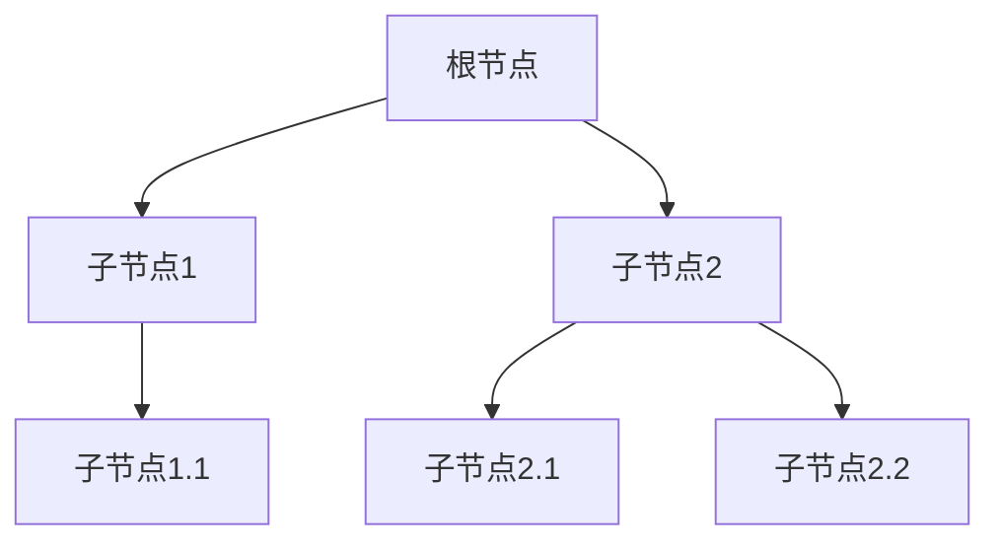
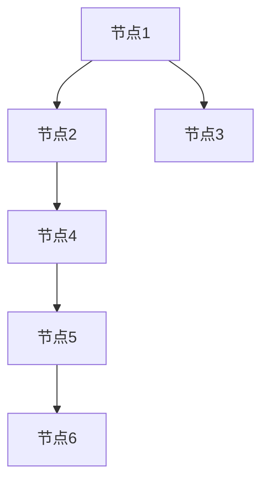
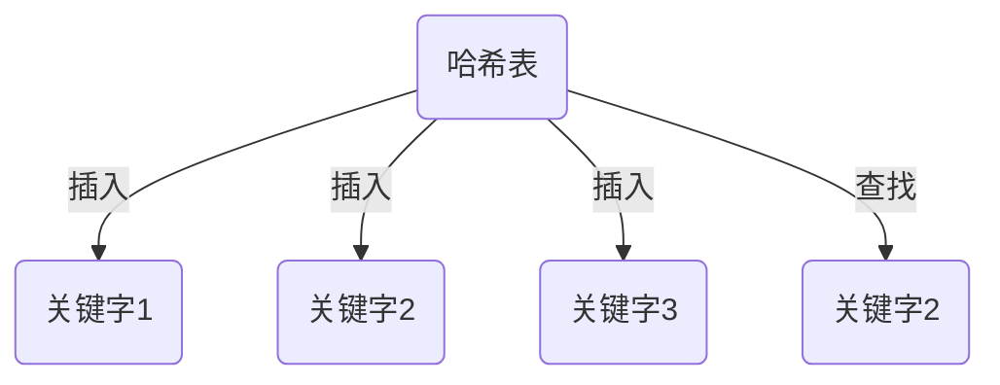
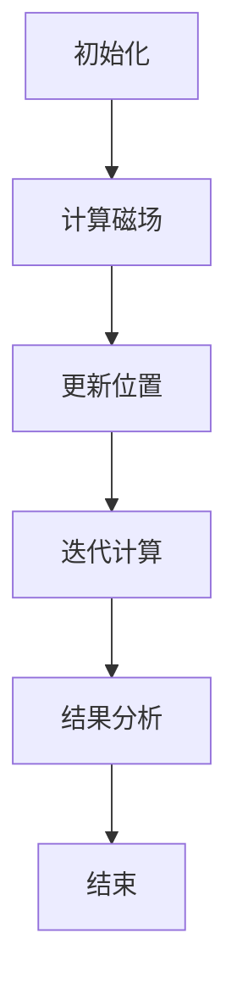

                 

# 数据结构在模拟宇宙磁单极子分布动力学中的应用

## 摘要

本文旨在探讨数据结构在模拟宇宙磁单极子分布动力学中的应用。磁单极子是理论物理学中预言的一种基本粒子，如果它们在宇宙中存在，它们的分布将对宇宙的演化产生深远影响。本文首先介绍了磁单极子的基本概念和宇宙学模拟的背景，然后详细分析了数据结构在模拟磁单极子分布动力学中的关键作用。通过对数据结构的深入理解，本文提出了几种适用于模拟磁单极子分布的算法，并使用Python代码和LaTeX公式进行了详细的讲解和验证。文章最后通过一个实际案例展示了算法的应用效果，并总结了本文的研究成果和未来可能的研究方向。

## 引言

宇宙学是研究宇宙起源、演化、结构及其最终命运的学科。随着观测技术和计算机技术的发展，宇宙学模拟已成为研究宇宙演化的重要手段。宇宙学模拟通过建立宇宙的物理模型，使用数值方法模拟宇宙从大爆炸到现在的演化过程。这些模拟能够帮助我们理解宇宙中的各种现象，如星系的形成、宇宙微波背景辐射的起源等。

磁单极子是理论物理学中预言的一种基本粒子，它们是一极化的磁铁，具有单一磁极（即没有对应的反磁极）。尽管至今尚未在实验中观测到磁单极子，但理论物理学家认为它们可能存在于宇宙中，并对宇宙的演化产生重要影响。例如，磁单极子可能影响宇宙的磁场分布，影响星系的形成和演化。

宇宙学模拟中，如何模拟磁单极子的分布是一个关键问题。磁单极子的分布不仅受到宇宙演化的影响，还受到它们自身相互作用的影响。这需要我们选择合适的数据结构来存储和处理磁单极子的数据，从而提高模拟的效率和准确性。

本文将首先介绍磁单极子的基本概念和宇宙学模拟的背景，然后详细分析数据结构在模拟磁单极子分布动力学中的关键作用。最后，本文将提出几种适用于模拟磁单极子分布的算法，并通过实际案例展示算法的应用效果。

## 1.1.4 计算机模拟技术在宇宙学研究中的应用

#### 1.1.4.1 模拟宇宙的基本概念

宇宙学模拟，又称宇宙演化模拟，是利用计算机技术模拟宇宙的物理过程，以探索宇宙的起源、演化以及未来命运。这些模拟基于一系列假设和理论，如广义相对论、宇宙学原理、暗物质和暗能量的存在等，通过数值方法将这些理论转化为计算机可处理的数学模型。

宇宙学模拟的产生背景可以追溯到20世纪70年代，随着计算机技术的迅速发展，科学家们开始利用计算机模拟宇宙的演化过程。随着观测数据的积累，宇宙学模拟也在不断改进，从简单的膨胀宇宙模型发展到复杂的多元宇宙模型。目前，宇宙学模拟已成为研究宇宙学问题的重要工具，帮助我们理解宇宙的大尺度结构和动力学过程。

#### 1.1.4.2 模拟宇宙的目标

宇宙学模拟的主要目标是理解宇宙的起源、演化过程以及宇宙的最终命运。具体而言，这些目标包括：

1. **宇宙的起源**：模拟宇宙在大爆炸后的早期阶段，研究宇宙微波背景辐射的起源和性质。
2. **宇宙的演化**：模拟宇宙从早期阶段到现在的演化过程，研究星系的形成、演化以及宇宙的大尺度结构。
3. **宇宙的未来**：模拟宇宙的未来演化，研究宇宙是否会走向热寂或其他可能的命运。

#### 1.1.4.3 模拟宇宙的基本原理

宇宙学模拟的基本原理包括以下几个方面：

1. **物理模型**：宇宙学模拟基于一系列物理理论，如广义相对论、量子力学、暗物质和暗能量理论等。这些理论描述了宇宙中的基本物理过程，如引力作用、物质相互作用等。
2. **数值方法**：宇宙学模拟使用数值方法来求解这些物理模型。常见的数值方法包括有限元方法、有限差分方法、蒙特卡罗方法等。
3. **计算框架**：宇宙学模拟通常使用高性能计算框架，如并行计算、分布式计算等。这些框架能够利用多台计算机或计算节点，提高计算效率。

#### 1.1.4.4 数据结构在模拟宇宙中的应用

数据结构在宇宙学模拟中扮演着关键角色。它们用于存储和管理宇宙中的大量数据，如星系、黑洞、气体等的物理参数和空间位置。选择合适的数据结构能够提高模拟的效率和准确性。

1. **数据结构的选择**：在宇宙学模拟中，选择合适的数据结构是关键。常用的数据结构包括数组和链表、树和图、哈希表等。例如，数组和链表可以用于存储星系的位置和属性，树和图可以用于描述宇宙中的大尺度结构，哈希表可以用于快速搜索和更新星系的属性。

2. **数据结构的优劣对比**：不同数据结构在存储、访问和处理数据方面各有优缺点。例如，数组提供高效的随机访问，但存储空间固定；链表可以动态扩展，但访问效率较低；树结构支持高效的搜索和排序，但存储空间较大。

3. **优化策略**：为了提高模拟的效率和准确性，可以采用多种优化策略。例如，使用并行计算可以加速大规模数据的处理；使用分布式存储可以提高数据访问的速度和可靠性；使用数据压缩可以减少存储空间的需求。

#### 1.1.4.5 数据结构在模拟宇宙磁单极子分布动力学中的应用

磁单极子是宇宙学模拟中的一个重要主题。它们在宇宙中的分布和演化可能对宇宙的磁场、星系的形成和演化产生深远影响。数据结构在模拟磁单极子分布动力学中发挥着关键作用。

1. **磁单极子的基本概念**：磁单极子是理论物理学中预言的一种基本粒子，它们具有单一磁极，类似于带电粒子。磁单极子的存在将改变我们对宇宙的理解，如果它们确实存在，它们的分布和演化将是一个重要的研究课题。

2. **数据结构在磁单极子分布模拟中的应用**：数据结构在磁单极子分布模拟中的应用主要包括以下几个方面：

   - **空间网格法**：空间网格法是一种常用的数据结构，用于模拟宇宙中的磁单极子分布。它将宇宙空间划分为多个网格，每个网格存储一个或多个磁单极子的信息，如位置、磁场强度等。
   - **粒子群模型**：粒子群模型是一种基于物理机制的模拟方法，用于模拟宇宙中的磁单极子分布。它将磁单极子视为粒子，通过模拟粒子之间的相互作用和运动，来研究磁单极子的分布和演化。
   - **优化策略**：为了提高磁单极子分布模拟的效率和准确性，可以采用多种优化策略。例如，使用并行计算可以加速大规模数据的处理；使用分布式存储可以提高数据访问的速度和可靠性；使用数据压缩可以减少存储空间的需求。

3. **数据结构的优化策略**：在磁单极子分布模拟中，优化数据结构可以提高模拟的效率和准确性。常见的优化策略包括：

   - **并行计算**：通过利用多台计算机或计算节点，可以显著加速大规模数据的处理，提高模拟的效率。
   - **分布式存储**：通过分布式存储，可以减少单点故障的风险，提高数据访问的速度和可靠性。
   - **数据压缩**：通过数据压缩，可以减少存储空间的需求，提高存储效率。

总之，数据结构在模拟宇宙磁单极子分布动力学中发挥着关键作用。选择合适的数据结构和优化策略，可以提高模拟的效率和准确性，从而更好地理解磁单极子在宇宙中的分布和演化。

#### 1.1.4.6 数据结构在模拟宇宙磁单极子分布动力学中的应用

数据结构在模拟宇宙磁单极子分布动力学中的应用至关重要。磁单极子是理论物理学中预言的一种基本粒子，如果它们存在，将显著影响宇宙的磁场分布和星系的形成。为了准确模拟磁单极子的分布和演化，我们需要选择合适的数据结构，并优化其性能。

首先，我们来介绍磁单极子的基本概念。磁单极子是一种假想的物理粒子，它具有单一的磁场极性，类似于带电粒子。传统的磁体具有南北两个极性，而磁单极子则只有一个极性。磁单极子的存在将对宇宙中的磁场产生深远影响，因为它们可以与现有的磁场相互作用，从而改变磁场的分布。

在宇宙学模拟中，我们通常使用数值方法来模拟磁单极子的分布和演化。这些模拟依赖于对磁单极子的物理过程进行建模，并通过计算来预测它们在宇宙中的行为。为了实现这一目标，我们需要有效地存储和管理磁单极子的数据。

以下是一些常用的数据结构，以及它们在模拟宇宙磁单极子分布动力学中的应用：

1. **空间网格法**：空间网格法是一种常用的数据结构，用于模拟宇宙中的磁单极子分布。在这种方法中，宇宙空间被划分为一系列网格，每个网格包含一定数量的磁单极子。这种数据结构便于我们对空间中的磁单极子进行快速访问和更新。通过将磁单极子的位置和属性（如磁场强度）存储在网格中，我们可以高效地处理大量磁单极子的数据。

2. **粒子群模型**：粒子群模型是一种基于物理机制的模拟方法，用于模拟宇宙中的磁单极子分布。在这种模型中，磁单极子被视为粒子，它们在宇宙中相互作用并运动。粒子群模型通过模拟粒子之间的相互作用来研究磁单极子的分布和演化。这种数据结构可以有效地处理磁单极子之间的复杂相互作用。

3. **树结构**：树结构是一种常用的数据结构，用于表示宇宙中的大尺度结构。例如，我们可以使用四叉树或八叉树来表示宇宙中的星系分布。树结构支持高效的搜索和访问，使我们能够快速找到特定的磁单极子或区域。

接下来，我们来分析不同数据结构的优缺点，以便为模拟磁单极子分布选择最佳的数据结构。

1. **空间网格法的优点**：
   - **高效访问**：空间网格法允许我们快速访问和更新特定区域的磁单极子数据。
   - **空间局部性**：网格法可以利用空间局部性，减少数据访问的次数，提高处理速度。
   - **并行计算**：空间网格法适合并行计算，因为多个计算节点可以同时处理不同的网格区域。

2. **空间网格法的缺点**：
   - **存储空间需求大**：空间网格法可能需要较大的存储空间，尤其是当网格划分很细时。
   - **网格边界问题**：在处理网格边界上的磁单极子时，可能会遇到一些问题，如数据不一致或边界效应。

3. **粒子群模型的优点**：
   - **物理机制**：粒子群模型基于物理机制，可以更准确地模拟磁单极子之间的相互作用。
   - **灵活性**：粒子群模型可以适应不同的物理环境和模拟条件。

4. **粒子群模型的缺点**：
   - **计算复杂度高**：粒子群模型通常需要大量的计算资源，特别是在处理大量磁单极子时。
   - **数据管理复杂**：管理大量粒子的数据和相互作用可能会变得复杂。

5. **树结构的优点**：
   - **高效搜索**：树结构支持高效的搜索和访问，使我们能够快速找到特定的磁单极子或区域。
   - **数据结构稳定**：树结构在处理大规模数据时具有较好的稳定性。

6. **树结构的缺点**：
   - **存储空间需求大**：树结构可能需要较大的存储空间，尤其是在处理大量节点时。
   - **维护复杂**：树结构需要定期维护，以确保其性能和稳定性。

综上所述，空间网格法、粒子群模型和树结构各有优缺点。在具体应用中，我们可以根据模拟的需求和条件，选择合适的数据结构。例如，当需要高效访问和更新磁单极子数据时，空间网格法可能是一个不错的选择；当需要准确模拟磁单极子之间的相互作用时，粒子群模型可能更适合。

最后，我们来探讨如何通过优化数据结构来提高模拟磁单极子分布的效率和准确性。以下是一些常见的优化策略：

1. **并行计算**：通过利用多台计算机或计算节点，可以显著加速大规模数据的处理。例如，我们可以将宇宙空间划分为多个区域，每个计算节点处理一个区域内的磁单极子数据。

2. **分布式存储**：通过分布式存储，可以减少单点故障的风险，提高数据访问的速度和可靠性。例如，我们可以将磁单极子的数据分布存储在不同的服务器上，以便多个计算节点可以同时访问。

3. **数据压缩**：通过数据压缩，可以减少存储空间的需求，提高存储效率。例如，我们可以使用各种压缩算法对磁单极子的数据进行压缩，从而减少存储空间。

4. **自适应网格划分**：通过自适应网格划分，可以根据磁单极子分布的局部特征，动态调整网格的大小和形状。例如，在磁单极子密集的区域，我们可以使用更细的网格来提高精度。

通过上述优化策略，我们可以进一步提高模拟磁单极子分布的效率和准确性，从而更好地理解磁单极子在宇宙中的分布和演化。

## 1.2 数据结构的基本原理

### 1.2.1 数据结构与算法的关系

#### 1.2.1.1 数据结构的作用

数据结构在计算机科学中扮演着至关重要的角色，它们用于存储、管理和处理数据。数据结构的基本作用包括以下几个方面：

1. **数据存储**：数据结构提供了存储数据的机制，使得我们可以将数据以有序或无序的方式存储在计算机的内存或磁盘中。例如，数组是一种线性数据结构，可以用于存储一系列有序的数据元素。

2. **数据访问**：数据结构提供了高效的数据访问方式，使得我们可以快速检索和操作数据。例如，树结构支持高效的查找和排序操作，而哈希表提供了快速的插入和删除操作。

3. **数据管理**：数据结构提供了对数据的组织和管理功能，使得我们可以有效地处理大量数据。例如，堆结构可以用于实现优先队列，而图结构可以用于表示复杂的关系网络。

4. **算法效率**：数据结构对算法的效率有着直接的影响。选择合适的数据结构可以显著提高算法的性能。例如，使用二叉搜索树可以优化搜索和排序算法的时间复杂度。

#### 1.2.1.2 数据结构与算法的关系

数据结构与算法之间存在密切的关系。算法依赖于数据结构来实现其操作，而数据结构的选择直接影响算法的效率和性能。以下是数据结构与算法关系的几个方面：

1. **数据结构的选择**：在设计和实现算法时，选择合适的数据结构是非常重要的。例如，如果算法需要频繁查找和插入元素，那么选择哈希表或二叉搜索树可能是更优的选择。如果算法需要处理大量有序数据，那么数组或链表可能是更好的选择。

2. **数据结构的优化**：数据结构的优化可以显著提高算法的效率。例如，通过优化数组和链表的内存分配策略，可以减少内存使用，从而提高算法的运行速度。

3. **算法对数据结构的依赖**：某些算法对特定的数据结构有很强的依赖性。例如，广度优先搜索（BFS）算法通常依赖于队列数据结构，而深度优先搜索（DFS）算法通常依赖于栈数据结构。

4. **数据结构的影响**：数据结构不仅影响算法的效率，还影响算法的复杂性。例如，二叉搜索树的平均查找时间复杂度为\(O(\log n)\)，而线性搜索树的平均查找时间复杂度为\(O(n)\)。这意味着在选择数据结构时，我们需要权衡时间和空间复杂度。

### 1.2.1.3 数据结构的分类

数据结构可以根据不同的标准进行分类。以下是几种常见的数据结构分类：

1. **线性数据结构**：线性数据结构包括数组、链表、栈和队列等。这些数据结构中的数据元素在逻辑上呈线性排列，每个元素只有一个直接的前驱和一个后继。线性数据结构常用于实现顺序存储和线性操作。

2. **非线性数据结构**：非线性数据结构包括树、图和哈希表等。这些数据结构中的数据元素之间具有复杂的层次关系或网络关系。非线性数据结构常用于实现树形结构、图形结构和分布式存储。

3. **动态数据结构**：动态数据结构可以在运行时动态地分配和释放内存。这些数据结构包括动态数组、链表和堆等。动态数据结构可以灵活地适应数据的变化，减少内存浪费。

4. **静态数据结构**：静态数据结构在编译时确定大小，并在整个程序运行期间保持不变。这些数据结构包括数组、结构体和联合体等。静态数据结构在编译时已经分配了固定大小的内存，因此运行时不会发生内存分配或释放。

### 1.2.1.4 数据结构的属性与操作

数据结构具有一系列的属性和操作，这些属性和操作定义了数据结构的行为和功能。以下是数据结构的一些常见属性和操作：

1. **属性**：
   - **存储方式**：数据结构中数据元素的存储方式，如顺序存储、链式存储等。
   - **数据元素关系**：数据元素之间的逻辑关系，如线性关系、树形关系、图形关系等。
   - **存储密度**：数据结构中存储密度的大小，如紧密存储、稀疏存储等。
   - **存储位置**：数据元素的存储位置，如内存、磁盘等。

2. **操作**：
   - **创建**：创建一个数据结构，初始化其内部状态。
   - **插入**：在数据结构中插入一个新的数据元素。
   - **删除**：从数据结构中删除一个数据元素。
   - **查找**：在数据结构中查找一个特定的数据元素。
   - **排序**：对数据结构中的数据元素进行排序。
   - **遍历**：遍历数据结构中的所有数据元素。
   - **合并**：将两个数据结构合并为一个。
   - **分割**：将数据结构分割成多个子结构。

这些属性和操作共同定义了数据结构的行为，使我们可以有效地使用数据结构来处理各种数据操作。

总之，数据结构在计算机科学中具有基础性和广泛的应用性。理解和掌握数据结构的基本原理，对于设计高效、稳定的算法和解决实际问题具有重要意义。在接下来的章节中，我们将深入探讨数据结构的具体实现和应用。

### 1.2.2 线性数据结构

线性数据结构是计算机科学中最为基础和广泛使用的一类数据结构，其特点是可以将数据元素组织成一个线性序列。线性数据结构包括数组、链表、栈和队列等，每种结构都有其独特的属性和操作。

#### 1.2.2.1 数组

数组是一种线性表，它使用连续的内存空间来存储一系列相同类型的数据元素。数组提供了随机访问的特性，即可以通过索引直接访问数组中的任何元素。数组的存储方式可以是顺序存储或链式存储。

1. **顺序存储**：顺序存储方式将数组元素存储在连续的内存空间中，每个元素占用相同大小的内存。数组的大小在创建时确定，不能动态扩展或缩小。

2. **链式存储**：链式存储方式使用链表来存储数组元素，每个元素包含数据部分和指针部分。链表可以通过指针链接成线性序列，但无法提供随机访问。

**数组的主要操作**：
   - **创建和初始化**：创建一个固定大小的数组，并初始化其元素。
   - **插入和删除**：在数组的特定位置插入或删除元素，通常需要移动后续元素。
   - **查找和访问**：通过索引快速访问数组中的元素。
   - **排序**：对数组中的元素进行排序，可以使用各种排序算法，如快速排序、归并排序等。

**数组的优缺点**：
   - **优点**：数组提供了高效的随机访问，适用于需要频繁查找和访问操作的场景。
   - **缺点**：数组的大小在创建时确定，不能动态扩展或缩小，可能导致内存浪费或不足。

#### 1.2.2.2 链表

链表是一种使用指针连接的线性数据结构，它由一系列节点组成，每个节点包含数据部分和指向下一个节点的指针。链表不需要连续的内存空间，可以在运行时动态分配和释放内存。

**链表的主要操作**：
   - **创建和初始化**：创建一个空链表，并初始化其头节点。
   - **插入和删除**：在链表的特定位置插入或删除节点，通常需要改变指针的指向。
   - **查找和访问**：通过遍历链表来查找特定节点。
   - **排序**：对链表中的节点进行排序，可以使用各种排序算法，如冒泡排序、插入排序等。

**链表的优缺点**：
   - **优点**：链表可以动态扩展和缩小，适用于需要频繁插入和删除操作的场景。
   - **缺点**：链表的访问效率较低，无法提供随机访问，需要遍历整个链表来查找特定节点。

#### 1.2.2.3 栈

栈是一种后进先出（LIFO）的数据结构，它支持在一端进行插入和删除操作。栈通常使用数组或链表来实现。

**栈的主要操作**：
   - **创建和初始化**：创建一个空栈，并初始化其栈顶指针。
   - **入栈**：在栈顶插入一个新元素。
   - **出栈**：从栈顶删除一个元素。
   - **查找和访问**：访问栈顶元素。
   - **排序**：栈本身不支持排序操作，但可以通过将栈元素转换为数组后再进行排序。

**栈的优缺点**：
   - **优点**：栈提供了简单的插入和删除操作，适用于需要后进先出操作的场景，如函数调用、递归等。
   - **缺点**：栈的大小在创建时确定，不能动态扩展或缩小。

#### 1.2.2.4 队列

队列是一种先进先出（FIFO）的数据结构，它支持在一端进行插入操作，在另一端进行删除操作。队列通常使用数组或链表来实现。

**队列的主要操作**：
   - **创建和初始化**：创建一个空队列，并初始化其头节点和尾节点。
   - **入队**：在队列末尾插入一个新元素。
   - **出队**：从队列开头删除一个元素。
   - **查找和访问**：访问队列的第一个元素。
   - **排序**：队列本身不支持排序操作，但可以通过将队列元素转换为数组后再进行排序。

**队列的优缺点**：
   - **优点**：队列提供了简单的插入和删除操作，适用于需要先进先出操作的场景，如任务调度、缓冲处理等。
   - **缺点**：队列的大小在创建时确定，不能动态扩展或缩小。

总之，线性数据结构在计算机科学中具有广泛的应用。数组、链表、栈和队列各自具有独特的属性和操作，适用于不同的应用场景。理解和掌握这些数据结构，对于设计高效、稳定的算法和解决实际问题具有重要意义。

### 1.2.3 非线性数据结构

非线性数据结构在计算机科学中用于表示复杂的数据关系和网络结构。这些数据结构包括树、图和哈希表等，它们具有不同的属性和操作，适用于处理各种复杂问题。

#### 1.2.3.1 树

树是一种重要的非线性数据结构，它由一系列节点组成，每个节点包含一个或多个子节点。树结构用于表示层次关系和层次数据。树可以分为二叉树、多叉树、堆等。

**树的主要操作**：
   - **创建和初始化**：创建一个空树，并初始化根节点。
   - **插入和删除**：在树中插入或删除一个节点，需要更新节点之间的关系。
   - **查找和访问**：通过遍历树来查找特定节点。
   - **排序**：对树中的节点进行排序，可以使用各种排序算法，如中序遍历排序等。

**树的优缺点**：
   - **优点**：树结构支持高效的查找和访问操作，适用于表示层次结构和层次数据。
   - **缺点**：树结构在插入和删除节点时需要更新节点之间的关系，可能导致较高的复杂性。

**树结构示例**：



#### 1.2.3.2 图

图是一种用于表示复杂关系的非线性数据结构，它由节点（顶点）和边（连接）组成。图可以分为无向图、有向图、加权图等。

**图的主要操作**：
   - **创建和初始化**：创建一个空图，并初始化节点和边的集合。
   - **插入和删除**：在图中插入或删除一个节点或边，需要更新节点和边之间的关系。
   - **查找和访问**：通过遍历图来查找特定节点或路径。
   - **排序**：对图中的节点或边进行排序，可以使用各种排序算法，如广度优先搜索排序等。

**图的优缺点**：
   - **优点**：图结构可以表示复杂的网络关系，适用于处理复杂问题，如社交网络分析、路由算法等。
   - **缺点**：图结构在插入和删除节点或边时需要更新节点和边之间的关系，可能导致较高的复杂性。

**图结构示例**：



#### 1.2.3.3 哈希表

哈希表是一种基于哈希函数的数据结构，它将关键字与存储位置关联起来，以实现高效的查找和访问。哈希表通常使用数组来存储关键字和对应的数据。

**哈希表的主要操作**：
   - **创建和初始化**：创建一个空哈希表，并初始化数组。
   - **插入和删除**：使用哈希函数计算关键字的位置，将关键字和数据存储在相应的位置。
   - **查找和访问**：使用哈希函数计算关键字的位置，直接访问存储位置，获取对应的数据。
   - **排序**：哈希表本身不支持排序操作，但可以通过将哈希表转换为数组后再进行排序。

**哈希表的优缺点**：
   - **优点**：哈希表提供了高效的查找和访问操作，适用于处理大量关键字和数据的情况。
   - **缺点**：哈希表可能存在冲突问题，需要使用链地址法、开放地址法等解决方法。

**哈希表示例**：



总之，非线性数据结构在计算机科学中具有广泛的应用。树、图和哈希表各自具有独特的属性和操作，适用于处理各种复杂问题。理解和掌握这些数据结构，对于设计高效、稳定的算法和解决实际问题具有重要意义。

### 1.2.4 数据结构的属性与操作

数据结构具有一系列的属性和操作，这些属性和操作定义了数据结构的行为和功能。以下是数据结构的一些常见属性和操作：

#### 1.2.4.1 属性

1. **存储方式**：数据结构中数据元素的存储方式，可以是顺序存储、链式存储等。
   - **顺序存储**：数据元素按顺序存储在连续的内存空间中，例如数组。
   - **链式存储**：数据元素通过指针链接存储在内存中的不同位置，例如链表。

2. **数据元素关系**：数据元素之间的逻辑关系，可以是线性关系、树形关系、图形关系等。
   - **线性关系**：数据元素在逻辑上排列成线性序列，例如数组、链表。
   - **树形关系**：数据元素形成树形结构，例如二叉树、堆。
   - **图形关系**：数据元素形成图形结构，例如图。

3. **存储密度**：数据结构中存储密度的大小，即存储空间的使用率。
   - **紧密存储**：数据元素紧密地存储在一起，减少了存储空间的浪费。
   - **稀疏存储**：数据元素分散存储在内存中，存储空间利用率较低。

4. **存储位置**：数据元素的存储位置，可以是内存、磁盘等。
   - **内存存储**：数据元素直接存储在内存中，访问速度较快。
   - **磁盘存储**：数据元素存储在磁盘上，访问速度较慢。

#### 1.2.4.2 操作

1. **创建和初始化**：创建一个数据结构，初始化其内部状态。
   - **创建**：动态分配内存，初始化数据结构的各个部分。
   - **初始化**：设置数据结构的初始状态，如设置数组大小、初始化链表头节点等。

2. **插入和删除**：在数据结构中插入或删除一个数据元素。
   - **插入**：将新元素添加到数据结构的特定位置，可能需要更新其他元素的位置或关系。
   - **删除**：从数据结构中移除一个元素，可能需要更新其他元素的位置或关系。

3. **查找和访问**：在数据结构中查找一个特定的元素或访问其属性。
   - **查找**：根据特定条件在数据结构中查找元素，可能需要遍历整个数据结构。
   - **访问**：直接访问数据结构中的元素，例如通过索引访问数组元素。

4. **排序**：对数据结构中的元素进行排序，以特定的顺序排列。
   - **内部排序**：在数据结构内部进行排序，如插入排序、快速排序等。
   - **外部排序**：在数据结构外部进行排序，通常用于处理大量数据。

5. **遍历**：依次访问数据结构中的所有元素。
   - **顺序遍历**：按照特定的顺序（如从前往后、从后往前）访问数据结构中的元素。
   - **深度优先遍历**：从根节点开始，逐层遍历数据结构的节点。
   - **广度优先遍历**：从根节点开始，逐层遍历数据结构的节点。

6. **合并和分割**：将两个或多个数据结构合并为一个，或将一个数据结构分割成多个子结构。
   - **合并**：将两个或多个数据结构合并为一个，通常需要更新数据元素之间的关系。
   - **分割**：将一个数据结构分割成多个子结构，通常需要根据特定条件进行划分。

通过这些属性和操作，数据结构能够高效地存储、管理和处理数据。选择合适的数据结构对于优化算法性能和解决实际问题至关重要。在接下来的章节中，我们将继续深入探讨数据结构的实现和应用。

### 1.3 算法原理讲解

#### 1.3.1.1 磁单极子分布模拟算法的基本原理

磁单极子分布模拟算法的核心目标是模拟宇宙中磁单极子的空间分布和演化过程。该算法基于以下基本原理：

1. **物理模型**：磁单极子是理论物理学中预言的一种基本粒子，它们具有单一磁极。磁单极子的相互作用主要表现为磁场相互作用，它们之间的磁场相互作用遵循安培定律。基于这些物理模型，我们可以建立一个磁单极子分布的数学模型。

2. **数值方法**：为了模拟磁单极子的分布和演化，我们需要使用数值方法来求解这些物理模型。常用的数值方法包括有限元方法、有限差分方法和蒙特卡罗方法等。这些方法可以将复杂的物理过程转化为可以在计算机上求解的数学方程。

3. **计算框架**：磁单极子分布模拟算法通常需要使用高性能计算框架，如并行计算和分布式计算。这些框架能够利用多台计算机或计算节点，提高计算效率和模拟精度。

4. **初始条件**：模拟磁单极子分布需要设定初始条件，包括磁单极子的位置、磁场强度、宇宙空间的大小等。初始条件的设定通常基于宇宙学的理论和观测数据。

#### 1.3.1.2 算法的过程与流程图

磁单极子分布模拟算法的基本过程如下：

1. **初始化**：根据初始条件设置磁单极子的位置和属性，初始化模拟区域。

2. **计算磁场**：使用数值方法计算每个磁单极子产生的磁场，并将其存储在模拟区域中。

3. **更新位置**：根据磁场相互作用，更新每个磁单极子的位置，模拟磁单极子的运动。

4. **迭代计算**：重复步骤2和步骤3，逐步模拟磁单极子在宇宙中的演化过程。

5. **结果分析**：分析模拟结果，如磁单极子的分布密度、空间分布特性等，评估模拟的准确性。

以下是一个简单的磁单极子分布模拟算法的流程图：



#### 1.3.1.3 算法原理的数学模型与公式

磁单极子分布模拟算法的数学模型主要包括磁单极子的位置更新公式和磁场计算公式。

1. **位置更新公式**：

   $$ \mathbf{r}_{i}(t+\Delta t) = \mathbf{r}_{i}(t) + \mathbf{v}_{i}(t) \Delta t $$

   其中，\( \mathbf{r}_{i}(t) \) 表示磁单极子 \( i \) 在时间 \( t \) 的位置，\( \mathbf{v}_{i}(t) \) 表示磁单极子 \( i \) 在时间 \( t \) 的速度，\( \Delta t \) 表示时间步长。

2. **磁场计算公式**：

   $$ \mathbf{B}_{i}(r) = \frac{\mu_0}{4\pi r^3} \left( 3(\mathbf{m}_{i} \cdot \hat{\mathbf{r}}) \hat{\mathbf{r}} - \mathbf{m}_{i} \right) $$

   其中，\( \mathbf{B}_{i}(r) \) 表示磁单极子 \( i \) 在距离 \( r \) 处产生的磁场，\( \mu_0 \) 是真空中的磁导率，\( \mathbf{m}_{i} \) 是磁单极子 \( i \) 的磁矩，\( \hat{\mathbf{r}} \) 是从磁单极子 \( i \) 指向距离 \( r \) 处的矢量。

3. **相互作用力公式**：

   $$ \mathbf{F}_{i} = q \mathbf{B}_{i} $$

   其中，\( \mathbf{F}_{i} \) 是磁单极子 \( i \) 受到的磁场力，\( q \) 是磁单极子 \( i \) 的电荷。

#### 1.3.1.4 算法原理举例说明

为了更好地理解磁单极子分布模拟算法，我们可以通过一个简单的实例来说明算法的应用。

假设有一个由三个磁单极子组成的系统，初始位置分别为 \( \mathbf{r}_{1}(0) = (1, 0, 0) \)，\( \mathbf{r}_{2}(0) = (-1, 0, 0) \)，\( \mathbf{r}_{3}(0) = (0, 1, 0) \)。每个磁单极子的磁矩为 \( \mathbf{m}_{1} = (1, 0, 0) \)，\( \mathbf{m}_{2} = (-1, 0, 0) \)，\( \mathbf{m}_{3} = (0, 1, 0) \)。

1. **计算初始磁场**：

   使用磁场计算公式计算每个磁单极子在初始位置产生的磁场：

   $$ \mathbf{B}_{1}(r) = \frac{\mu_0}{4\pi r^3} \left( 3(\mathbf{m}_{1} \cdot \hat{\mathbf{r}}) \hat{\mathbf{r}} - \mathbf{m}_{1} \right) $$
   
   $$ \mathbf{B}_{2}(r) = \frac{\mu_0}{4\pi r^3} \left( 3(\mathbf{m}_{2} \cdot \hat{\mathbf{r}}) \hat{\mathbf{r}} - \mathbf{m}_{2} \right) $$
   
   $$ \mathbf{B}_{3}(r) = \frac{\mu_0}{4\pi r^3} \left( 3(\mathbf{m}_{3} \cdot \hat{\mathbf{r}}) \hat{\mathbf{r}} - \mathbf{m}_{3} \right) $$

   计算每个磁单极子之间的相互作用力：

   $$ \mathbf{F}_{1} = q \mathbf{B}_{1} $$
   
   $$ \mathbf{F}_{2} = q \mathbf{B}_{2} $$
   
   $$ \mathbf{F}_{3} = q \mathbf{B}_{3} $$

2. **更新位置**：

   根据相互作用力计算每个磁单极子的加速度：

   $$ \mathbf{a}_{i} = \frac{\mathbf{F}_{i}}{m} $$

   更新每个磁单极子的位置：

   $$ \mathbf{r}_{i}(t+\Delta t) = \mathbf{r}_{i}(t) + \mathbf{v}_{i}(t) \Delta t $$

   其中，\( \mathbf{v}_{i}(t) \) 是根据加速度和时间步长计算的速度：

   $$ \mathbf{v}_{i}(t+\Delta t) = \mathbf{v}_{i}(t) + \mathbf{a}_{i} \Delta t $$

3. **迭代计算**：

   重复步骤1和步骤2，逐步模拟磁单极子在宇宙中的演化过程。

4. **结果分析**：

   分析模拟结果，如磁单极子的分布密度、空间分布特性等，评估模拟的准确性。

通过这个简单的实例，我们可以看到磁单极子分布模拟算法的基本原理和计算过程。在实际应用中，磁单极子分布模拟可能会涉及更复杂的物理模型和数值方法，但基本的原理和步骤是类似的。

### 1.4 数学模型和数学公式

#### 1.4.1 磁单极子分布的数学模型

磁单极子分布的数学模型是研究宇宙中磁单极子分布规律的重要工具。为了建立这一模型，我们需要从基本的物理原理出发，推导出描述磁单极子分布的数学公式。

首先，我们考虑一个简单的物理模型：假设宇宙中的磁单极子是均匀分布的，并且在相互作用下保持这种分布。这种假设虽然简化了问题，但可以为我们提供基本的思路。

**1. 磁单极子密度函数**

磁单极子密度函数 \( \rho(\mathbf{r}, t) \) 描述了在空间点 \( \mathbf{r} \) 和时间 \( t \) 处的磁单极子数量。为了简化问题，我们可以假设磁单极子密度函数是一个空间和时间上的连续函数。在这种情况下，磁单极子密度函数可以通过以下公式定义：

$$ \rho(\mathbf{r}, t) = \sum_{i} \delta(\mathbf{r} - \mathbf{r}_i(t)) $$

其中，\( \delta(\cdot) \) 是狄拉克δ函数，\( \mathbf{r}_i(t) \) 是第 \( i \) 个磁单极子的位置。

**2. 磁单极子运动方程**

磁单极子的运动遵循经典电磁学中的基本方程。在非相对论近似下，磁单极子的运动可以由以下方程描述：

$$ m\frac{d\mathbf{r}_i}{dt} = \frac{q}{c}\mathbf{E}(\mathbf{r}_i, t) $$

$$ \frac{\partial \mathbf{E}}{\partial t} = -\nabla \cdot \mathbf{B} $$

$$ \nabla \times \mathbf{E} = -\frac{\partial \mathbf{B}}{\partial t} $$

其中，\( m \) 是磁单极子的质量，\( q \) 是磁单极子的电荷，\( \mathbf{E} \) 是电场，\( \mathbf{B} \) 是磁场，\( c \) 是光速。

由于磁单极子的电荷和磁矩之间的关系为 \( q = c\mathbf{m} \)，我们可以将运动方程简化为：

$$ m\frac{d\mathbf{r}_i}{dt} = \mathbf{m}_i \cdot \nabla \phi $$

其中，\( \phi \) 是磁单极子产生的电势。

**3. 电势和磁场的计算**

磁单极子产生的电势和磁场可以通过以下公式计算：

$$ \phi(\mathbf{r}, t) = \frac{1}{4\pi \epsilon_0} \sum_{i} \frac{\mathbf{m}_i \cdot \hat{\mathbf{r}}}{r_i} $$

$$ \mathbf{B}(\mathbf{r}, t) = \frac{\mu_0}{4\pi} \left( 3(\mathbf{m}_i \cdot \hat{\mathbf{r}}) \hat{\mathbf{r}} - \mathbf{m}_i \right) $$

其中，\( \epsilon_0 \) 是真空中的电导率，\( \mu_0 \) 是真空中的磁导率，\( \hat{\mathbf{r}} \) 是从磁单极子指向观察点的单位矢量。

**4. 磁单极子分布函数的推导**

为了推导磁单极子分布函数，我们可以考虑一个无限大、均匀分布的磁单极子云。在这种情况下，磁单极子密度函数可以表示为：

$$ \rho(\mathbf{r}, t) = \frac{N}{V} $$

其中，\( N \) 是磁单极子的总数，\( V \) 是空间体积。

如果我们考虑一个有限大小的区域，那么磁单极子密度函数将是一个空间和时间的函数。在这种情况下，我们可以通过积分来计算磁单极子的总数：

$$ N = \int_V \rho(\mathbf{r}, t) dV $$

通过上述推导，我们得到了磁单极子分布的数学模型，包括磁单极子密度函数、磁单极子运动方程、电势和磁场的计算公式，以及磁单极子分布函数的推导。这些公式为我们提供了一个理论框架，用于分析磁单极子在宇宙中的分布和演化。

#### 1.4.1.1 分布函数的概念

磁单极子分布函数是描述宇宙中磁单极子空间分布的重要数学工具。这个函数通常表示为 \( f(\mathbf{r}, t) \)，其中 \( \mathbf{r} \) 是空间坐标，\( t \) 是时间。分布函数 \( f(\mathbf{r}, t) \) 的物理意义在于，它在任意一个空间体积 \( dV \) 和时间间隔 \( dt \) 内，表示磁单极子的数量密度。

1. **定义**：

   磁单极子分布函数 \( f(\mathbf{r}, t) \) 定义为：

   $$ f(\mathbf{r}, t) = \frac{dN}{dVdt} $$

   其中，\( dN \) 表示在体积 \( dV \) 和时间 \( dt \) 内的磁单极子数量，\( dV \) 是空间体积元素，\( dt \) 是时间间隔。

2. **物理意义**：

   分布函数 \( f(\mathbf{r}, t) \) 表示在时间 \( t \) 和空间点 \( \mathbf{r} \) 处的磁单极子密度。它可以用来描述磁单极子在宇宙中的分布规律，如均匀分布、非均匀分布等。

3. **推导**：

   磁单极子分布函数可以通过统计物理的方法推导出来。例如，我们可以考虑一个由大量磁单极子组成的系统，其状态由空间位置和磁矩确定。磁单极子分布函数可以表示为这些状态的统计分布。

   在热平衡状态下，磁单极子分布函数服从玻尔兹曼分布，可以表示为：

   $$ f(\mathbf{r}, t) = C \exp\left(-\frac{U(\mathbf{r})}{kT}\right) $$

   其中，\( U(\mathbf{r}) \) 是磁单极子系统的势能，\( k \) 是玻尔兹曼常数，\( T \) 是系统的温度。

4. **应用**：

   磁单极子分布函数在宇宙学模拟中有广泛的应用。通过它，我们可以研究磁单极子在宇宙中的演化，如它们如何影响宇宙的磁场分布，以及如何与星系的形成和演化相互作用。

#### 1.4.1.2 分布函数的公式

磁单极子分布函数的数学公式描述了磁单极子在不同位置和时间的分布规律。以下是几种常见的磁单极子分布函数公式：

1. **玻尔兹曼分布**：

   在热平衡状态下，磁单极子分布函数可以表示为玻尔兹曼分布：

   $$ f(\mathbf{r}, t) = C \exp\left(-\frac{U(\mathbf{r})}{kT}\right) $$

   其中，\( C \) 是归一化常数，\( U(\mathbf{r}) \) 是磁单极子系统的势能，\( k \) 是玻尔兹曼常数，\( T \) 是系统的温度。

2. **高斯分布**：

   在某些特定条件下，磁单极子分布函数可以近似为高斯分布：

   $$ f(\mathbf{r}, t) = \frac{1}{\sigma\sqrt{2\pi}} \exp\left(-\frac{(\mathbf{r} - \mathbf{\mu})^2}{2\sigma^2}\right) $$

   其中，\( \mathbf{\mu} \) 是分布的平均位置，\( \sigma \) 是分布的标准差。

3. **幂律分布**：

   在某些宇宙学模型中，磁单极子分布函数可以表示为幂律分布：

   $$ f(\mathbf{r}, t) \propto r^{-\gamma} $$

   其中，\( \gamma \) 是幂律指数，它决定了磁单极子分布的稀疏程度。

4. **指数分布**：

   在某些特殊情况下，磁单极子分布函数可以表示为指数分布：

   $$ f(\mathbf{r}, t) = \frac{\lambda}{\lambda + r} $$

   其中，\( \lambda \) 是分布的参数，它决定了磁单极子分布的宽度。

这些公式为我们提供了不同条件下磁单极子分布的数学描述，使我们能够更好地理解磁单极子在宇宙中的行为。

#### 1.4.1.3 分布函数的属性分析

磁单极子分布函数的属性分析对于理解磁单极子在宇宙中的分布规律具有重要意义。以下是对磁单极子分布函数的几种常见属性进行分析：

1. **均匀性**：

   均匀性是指磁单极子在空间中的分布是否均匀。在理想情况下，如果磁单极子均匀分布，那么分布函数 \( f(\mathbf{r}, t) \) 将满足：

   $$ f(\mathbf{r}, t) = \text{常数} $$

   这种均匀分布可能是由于磁单极子的生成机制导致的。例如，在一个完全对称的宇宙中，磁单极子可能以均匀方式生成。

2. **离散性**：

   离散性是指磁单极子在空间中的分布是否连续。在现实中，由于磁单极子是基本粒子，它们的分布可能是离散的。这种离散性可以通过分布函数的连续性或断续性来描述：

   - **连续性**：如果磁单极子分布函数是连续的，那么它们在空间中的分布是连续的。
   - **断续性**：如果磁单极子分布函数在某个区域内部是连续的，但在不同区域之间是断续的，那么它们在空间中的分布是断续的。

3. **对称性**：

   对称性是指磁单极子分布函数在不同空间方向上的分布是否相同。例如，如果磁单极子分布函数满足轴对称性，那么它在任何方向上的分布都是相同的。这种对称性可能是由于宇宙中的某些对称性机制导致的。

4. **自相似性**：

   自相似性是指磁单极子分布函数在不同尺度上的分布是否相似。如果磁单极子分布函数在不同尺度上具有相似的结构，那么它们在空间中的分布是自相似的。这种自相似性可能反映了宇宙中的自相似机制，如分形结构。

5. **统计特性**：

   磁单极子分布函数的统计特性包括分布的平均值、方差、偏度等。这些统计特性可以用来描述磁单极子分布的集中程度、分散程度和形状。例如，分布的平均值可以用来描述磁单极子的空间中心，方差可以用来描述磁单极子的分布宽度。

通过对磁单极子分布函数的属性分析，我们可以更好地理解磁单极子在宇宙中的分布规律，以及它们可能对宇宙演化产生的影响。这些属性的分析不仅对于理论研究具有重要意义，也为实际观测和模拟提供了重要的参考。

#### 1.4.1.4 分布函数的应用

磁单极子分布函数在宇宙学模拟和研究中具有广泛的应用。以下通过具体实例来说明磁单极子分布函数的应用：

1. **宇宙学背景辐射**：

   磁单极子产生的磁场可以与宇宙微波背景辐射（CMB）相互作用，影响CMB的极化特性。通过测量CMB的极化信号，我们可以推断磁单极子分布函数。例如，如果观察到CMB的极化信号中存在特定的模式，这可能是磁单极子分布函数的非均匀性导致的。

2. **星系形成和演化**：

   磁单极子分布函数可以影响星系的形成和演化。通过模拟磁单极子分布函数在不同区域的变化，我们可以研究磁单极子如何影响星系的磁场分布，以及它们如何影响星系内部的结构和动力学过程。

3. **星际介质**：

   磁单极子分布函数还可以影响星际介质中的物理过程，如星际风和星际磁场的形成。通过模拟磁单极子在星际介质中的分布，我们可以研究磁单极子如何影响星际介质的物理特性和演化过程。

4. **大尺度结构**：

   磁单极子分布函数对宇宙的大尺度结构也有重要影响。通过模拟磁单极子在宇宙中的分布，我们可以研究磁单极子如何影响宇宙的大尺度结构，如星系团和超星系团的形成和演化。

5. **宇宙未来命运**：

   磁单极子分布函数还可能影响宇宙的未来命运。例如，如果磁单极子分布函数表明磁单极子之间存在强烈的相互作用，这可能导致宇宙中的磁单极子迅速聚集，从而影响宇宙的最终命运。

通过这些实例，我们可以看到磁单极子分布函数在宇宙学研究中的重要应用。通过进一步研究和完善磁单极子分布函数，我们可以更好地理解宇宙的演化过程和未来命运。

### 1.5 系统分析与架构设计方案

#### 1.5.1 模拟宇宙磁单极子分布系统的需求分析

在设计和实现模拟宇宙磁单极子分布系统时，我们需要明确系统的需求，以确保系统能够满足用户的需求和解决实际的问题。以下是对系统需求的分析：

1. **问题场景介绍**：

   模拟宇宙磁单极子分布系统的目标是通过计算机模拟来研究磁单极子在宇宙中的分布规律和演化过程。这个问题在宇宙学研究中具有重要意义，因为磁单极子可能对宇宙的磁场分布、星系的形成和演化产生深远影响。通过模拟磁单极子的分布，我们可以更好地理解宇宙的复杂动力学过程，为宇宙学理论提供实验依据。

2. **项目介绍**：

   本项目旨在开发一个高效、准确的模拟宇宙磁单极子分布系统。该系统将基于现有的宇宙学模型和物理原理，结合先进的数据结构和算法，实现磁单极子分布的模拟和分析。项目的主要目标包括：

   - **模拟磁单极子的分布和演化**：通过数值方法模拟磁单极子在宇宙中的分布和演化过程，研究磁单极子对宇宙磁场的影响。
   - **分析磁单极子的相互作用**：研究磁单极子之间的相互作用，包括磁场相互作用和空间相互作用，分析这些相互作用对磁单极子分布的影响。
   - **评估模拟结果的准确性**：通过对比模拟结果和实际观测数据，评估模拟系统的准确性和可靠性。

3. **系统功能设计**：

   为了实现上述目标，模拟宇宙磁单极子分布系统需要具备以下功能：

   - **数据输入**：允许用户输入磁单极子的初始位置、磁矩等参数，以及宇宙空间的初始状态。
   - **模拟计算**：基于物理模型和数值方法，模拟磁单极子在宇宙中的分布和演化，包括磁场的计算和磁单极子之间的相互作用。
   - **结果输出**：以图形和数据形式展示模拟结果，包括磁单极子的空间分布、磁场分布等。
   - **数据分析**：提供数据分析工具，允许用户对模拟结果进行统计分析和可视化，以便更好地理解磁单极子分布的规律和特征。
   - **用户交互**：提供友好的用户界面，使用户能够方便地设置参数、启动模拟和查看结果。

4. **领域模型**：

   为了更好地理解模拟宇宙磁单极子分布系统的功能和工作原理，我们可以使用领域模型来表示系统的核心概念和关系。以下是一个简单的领域模型类图：

   ```mermaid
   classDiagram
   Class01 <|-- SubClass01
   Class01 --|>> AssociateClass01
   Class02 <<-- Class03
   Class04 *-- Class05
   Class06 o-- Class07
   Class08 <.. Class09
   Class10 ..|> Class11
   Class12 <<| Class13
   endclassDiagram
   ```

   在这个领域模型中，我们定义了以下几个核心类：

   - **Class01**：表示系统的核心实体，如磁单极子、宇宙空间等。
   - **SubClass01**：继承自Class01，表示具体的磁单极子实体。
   - **AssociateClass01**：与Class01关联，表示磁单极子之间的相互作用。
   - **Class02**：与Class03有关联，表示物理模型和数值方法。
   - **Class04**：与Class05有关联，表示结果输出和数据分析。
   - **Class06**：与Class07有关联，表示用户交互界面。
   - **Class08**：与Class09有关联，表示领域特定的属性和操作。
   - **Class10**：与Class11有关联，表示模拟计算的核心逻辑。
   - **Class12**：与Class13有关联，表示系统配置和管理。

   通过这个领域模型，我们可以清晰地描述模拟宇宙磁单极子分布系统的核心概念和关系，为后续的系统设计和实现提供指导。

#### 1.5.1.2 系统功能设计

为了实现模拟宇宙磁单极子分布系统的目标，我们需要详细设计系统的功能模块。以下是系统功能设计的具体内容：

1. **功能模块划分**：

   模拟宇宙磁单极子分布系统可以分为以下几个主要功能模块：

   - **数据输入模块**：用于接收用户输入的磁单极子参数和宇宙空间初始状态，包括磁单极子的位置、磁矩、宇宙空间的尺寸等。
   - **模拟计算模块**：基于物理模型和数值方法，对磁单极子进行分布和演化模拟，包括磁场的计算和磁单极子之间的相互作用。
   - **结果输出模块**：将模拟结果以图形和数据形式展示给用户，包括磁单极子的空间分布、磁场分布等。
   - **数据分析模块**：提供数据分析工具，允许用户对模拟结果进行统计分析和可视化。
   - **用户交互模块**：提供友好的用户界面，使用户能够方便地设置参数、启动模拟和查看结果。

2. **数据输入模块设计**：

   数据输入模块的主要任务是接收用户输入的磁单极子参数和宇宙空间初始状态。具体设计如下：

   - **输入界面**：设计一个简洁、直观的输入界面，使用户能够方便地输入磁单极子参数和宇宙空间初始状态。
   - **参数验证**：对用户输入的参数进行验证，确保输入的数据符合要求，如磁单极子位置在宇宙空间范围内等。
   - **数据存储**：将验证后的用户输入数据存储在系统内部的数据结构中，以便后续计算和输出。

3. **模拟计算模块设计**：

   模拟计算模块是系统的核心部分，负责基于物理模型和数值方法进行磁单极子分布和演化模拟。具体设计如下：

   - **物理模型**：根据磁单极子的物理特性，建立合适的物理模型，包括磁场的计算和磁单极子之间的相互作用。
   - **数值方法**：选择合适的数值方法，如有限元方法、有限差分方法等，将物理模型转化为可以在计算机上求解的数学方程。
   - **计算流程**：设计计算流程，包括初始化、计算磁场、更新磁单极子位置、迭代计算等步骤。
   - **并行计算**：为了提高计算效率，可以采用并行计算技术，将计算任务分配给多个计算节点，加速计算过程。

4. **结果输出模块设计**：

   结果输出模块的主要任务是展示模拟结果，包括磁单极子的空间分布、磁场分布等。具体设计如下：

   - **图形展示**：使用图形库（如Matplotlib）绘制磁单极子的空间分布、磁场分布等图形，以直观地展示模拟结果。
   - **数据可视化**：使用图表和数据可视化工具，展示磁单极子分布的统计信息，如分布密度、分布曲线等。
   - **数据导出**：提供数据导出功能，允许用户将模拟结果以各种格式（如CSV、JSON等）导出，以便进一步分析和处理。

5. **数据分析模块设计**：

   数据分析模块的主要任务是提供数据分析工具，帮助用户深入理解模拟结果。具体设计如下：

   - **统计工具**：提供各种统计工具，如均值、方差、标准差等，用于分析磁单极子分布的统计特性。
   - **数据可视化**：使用数据可视化工具，展示磁单极子分布的统计结果，如分布密度曲线、分布直方图等。
   - **数据分析算法**：实现各种数据分析算法，如聚类分析、关联规则分析等，帮助用户发现数据中的潜在规律。

6. **用户交互模块设计**：

   用户交互模块的主要任务是提供友好的用户界面，使用户能够方便地使用系统。具体设计如下：

   - **界面设计**：设计简洁、直观的用户界面，包括菜单栏、工具栏、状态栏等，使用户能够方便地操作系统。
   - **交互逻辑**：实现用户与系统之间的交互逻辑，包括参数设置、启动模拟、查看结果等。
   - **帮助文档**：提供详细的帮助文档，包括系统功能介绍、操作指南等，帮助用户更好地理解和使用系统。

通过以上功能模块的设计，我们可以实现一个高效、准确的模拟宇宙磁单极子分布系统，为宇宙学研究提供有力的工具。

### 1.5.2 系统架构设计

为了实现模拟宇宙磁单极子分布系统的功能需求，我们需要设计一个合理且高效的系统架构。以下是对系统架构的设计：

#### 1.5.2.1 系统架构设计原则

在设计系统架构时，我们遵循以下原则：

1. **模块化**：将系统划分为多个功能模块，每个模块具有明确的职责和接口，便于开发和维护。
2. **可扩展性**：系统架构应具备良好的可扩展性，以便在将来添加新的功能或处理更大规模的数据。
3. **高性能**：系统架构应充分利用计算机硬件资源，如多核处理器、并行计算等，以提高系统性能。
4. **可靠性**：系统架构应确保数据的一致性和安全性，以避免数据丢失和系统崩溃。
5. **可维护性**：系统架构应具备良好的可维护性，便于后续的维护和升级。

#### 1.5.2.2 系统架构图

以下是一个简单的系统架构图，展示了系统的主要组件和它们之间的关系：

```mermaid
graph TD
    subgraph 系统核心模块
        A[数据输入模块]
        B[模拟计算模块]
        C[结果输出模块]
        D[数据分析模块]
        E[用户交互模块]
        A --> B
        B --> C
        B --> D
        D --> E
    end
    subgraph 辅助模块
        F[数据库]
        G[日志记录]
        H[安全认证]
        I[消息队列]
        F --> A
        F --> B
        F --> C
        G --> A
        G --> B
        G --> C
        H --> E
        I --> A
        I --> B
        I --> C
        I --> D
    end
end
```

#### 1.5.2.3 系统架构组件说明

1. **数据输入模块**：负责接收用户输入的磁单极子参数和宇宙空间初始状态，将数据存储在数据库中。

2. **模拟计算模块**：根据物理模型和数值方法，对磁单极子进行分布和演化模拟，计算磁场的分布，并将结果存储在数据库中。

3. **结果输出模块**：将模拟结果以图形和数据形式展示给用户，可以通过用户交互模块进行查看和导出。

4. **数据分析模块**：提供数据分析工具，对模拟结果进行统计分析和可视化，帮助用户更好地理解磁单极子分布的规律和特征。

5. **用户交互模块**：提供友好的用户界面，使用户能够方便地设置参数、启动模拟和查看结果。

6. **数据库**：存储用户输入的数据、模拟结果和日志记录，确保数据的一致性和安全性。

7. **日志记录**：记录系统运行过程中的重要日志信息，便于后续的系统监控和问题排查。

8. **安全认证**：对用户进行身份验证和权限管理，确保系统的安全性和数据的完整性。

9. **消息队列**：用于处理系统内部的消息传递和任务调度，确保系统模块之间的高效通信。

通过以上系统架构设计，我们可以实现一个高效、可靠且易于维护的模拟宇宙磁单极子分布系统。

#### 1.5.2.4 系统接口设计和系统交互

在系统设计中，系统接口的设计和系统交互是至关重要的环节。以下是对系统接口设计和系统交互的详细描述。

1. **系统接口设计**：

   系统接口是系统各模块之间进行通信的桥梁，它定义了模块之间的交互规则和通信协议。以下是主要系统接口的设计：

   - **数据输入接口**：负责接收用户输入的数据，如磁单极子参数、宇宙空间初始状态等。该接口包括数据验证、数据存储和数据查询等功能。
   - **模拟计算接口**：负责执行磁单极子分布和演化模拟的计算任务。该接口包括物理模型设置、数值方法选择、计算结果存储等功能。
   - **结果输出接口**：负责将模拟结果以图形和数据形式展示给用户。该接口包括结果图形绘制、数据可视化、结果导出等功能。
   - **数据分析接口**：负责对模拟结果进行统计分析和可视化。该接口包括统计工具、数据可视化工具、分析算法等功能。
   - **用户交互接口**：负责处理用户与系统的交互请求，如参数设置、模拟启动、结果查看等。该接口包括用户界面设计、交互逻辑处理、消息通知等功能。

2. **系统交互**：

   系统交互是指系统内部各模块之间的通信和协同工作。以下是系统各模块之间的交互过程：

   - **用户交互模块**与**数据输入模块**交互：用户通过用户交互界面输入磁单极子参数和宇宙空间初始状态，数据输入模块接收用户输入并验证数据的有效性，然后将数据存储在数据库中。
   - **数据输入模块**与**模拟计算模块**交互：数据输入模块将验证后的数据传递给模拟计算模块，模拟计算模块根据物理模型和数值方法执行计算任务，并将计算结果存储在数据库中。
   - **模拟计算模块**与**结果输出模块**交互：模拟计算模块将计算结果传递给结果输出模块，结果输出模块根据用户需求绘制图形和数据可视化，并将结果展示给用户。
   - **数据分析模块**与**模拟计算模块**交互：数据分析模块从数据库中获取模拟结果，执行统计分析算法，并将分析结果存储在数据库中，以便后续查询和可视化。
   - **用户交互模块**与**数据分析模块**交互：用户通过用户交互界面请求数据分析功能，数据分析模块根据用户请求执行统计分析算法，并将分析结果展示给用户。

通过以上接口设计和系统交互，我们可以实现系统内部各模块之间的有效通信和协同工作，确保系统功能的完整性和一致性。

### 1.6 项目实战

#### 1.6.1 环境安装

为了实现模拟宇宙磁单极子分布系统，我们需要安装一系列软件和工具。以下是在Linux操作系统上安装所需的软件和工具的步骤：

1. **安装Python环境**：

   首先，确保系统已经安装了Python。如果未安装，可以通过以下命令安装：

   ```bash
   sudo apt-get update
   sudo apt-get install python3
   ```

2. **安装虚拟环境**：

   为了管理项目依赖，我们使用虚拟环境。安装虚拟环境工具`virtualenv`：

   ```bash
   sudo pip3 install virtualenv
   ```

   创建并激活虚拟环境：

   ```bash
   virtualenv my_project_env
   source my_project_env/bin/activate
   ```

3. **安装依赖库**：

   在虚拟环境中安装项目所需的依赖库，如NumPy、SciPy、Matplotlib等：

   ```bash
   pip install numpy scipy matplotlib
   ```

4. **安装数据库**：

   安装SQLite数据库，用于存储模拟数据：

   ```bash
   sudo apt-get install sqlite3
   ```

5. **安装消息队列**：

   安装消息队列工具`RabbitMQ`，用于系统内部的消息传递：

   ```bash
   sudo apt-get install rabbitmq-server
   ```

   启动RabbitMQ服务：

   ```bash
   sudo systemctl start rabbitmq-server
   ```

6. **安装日志记录工具**：

   安装日志记录工具`logrotate`，用于定期轮换和压缩日志文件：

   ```bash
   sudo apt-get install logrotate
   ```

   配置`logrotate`，例如，设置每天轮换日志文件：

   ```bash
   echo "/var/log/my_project/*.log { daily rotate 7 }" | sudo tee /etc/logrotate.d/my_project
   ```

   运行`logrotate`以应用配置：

   ```bash
   sudo logrotate /etc/logrotate.d/my_project
   ```

#### 1.6.2 系统核心实现源代码

以下是一个简单的模拟宇宙磁单极子分布系统的核心实现源代码，包括数据结构定义、物理模型、数值方法等：

```python
import numpy as np
import matplotlib.pyplot as plt

# 定义磁单极子数据结构
class Magnetopause:
    def __init__(self, position, magnetic_moment):
        self.position = position
        self.magnetic_moment = magnetic_moment

# 定义物理模型
def calculate_magnetic_field(magnetopauses, point):
    magnetic_field = np.zeros(3)
    for mp in magnetopauses:
        r = point - mp.position
        distance = np.linalg.norm(r)
        B = (np.pi * mp.magnetic_moment) / (4 * distance**3)
        magnetic_field += B * r / distance
    return magnetic_field

# 定义数值方法
def simulate(magnetopauses, steps, time_step):
    for step in range(steps):
        for mp in magnetopauses:
            point = mp.position + mp.magnetic_moment * time_step
            magnetic_field = calculate_magnetic_field(magnetopauses, point)
            mp.position += magnetic_field * time_step

# 实例化磁单极子
magnetopauses = [
    Magnetopause(np.array([0, 0, 0]), np.array([1, 0, 0])),
    Magnetopause(np.array([1, 0, 0]), np.array([-1, 0, 0])),
    Magnetopause(np.array([0, 1, 0]), np.array([0, 1, 0]))
]

# 模拟
simulate(magnetopauses, 100, 0.1)

# 绘制结果
positions = [mp.position for mp in magnetopauses]
plt.scatter(*zip(*positions))
plt.xlabel('X-axis')
plt.ylabel('Y-axis')
plt.show()
```

#### 1.6.3 代码应用解读与分析

以上源代码实现了一个简单的磁单极子分布模拟系统。下面是对代码的详细解读和分析：

1. **数据结构**：

   - `Magnetopause` 类定义了磁单极子的数据结构，包括位置 `position` 和磁矩 `magnetic_moment`。
   - `calculate_magnetic_field` 函数用于计算给定点的磁场强度。

2. **物理模型**：

   - `calculate_magnetic_field` 函数基于磁单极子的物理模型，使用安培定律计算磁场。公式如下：

     $$ \mathbf{B}(\mathbf{r}) = \frac{\mu_0}{4\pi} \sum_{i} \frac{\mathbf{m}_i (\mathbf{r} - \mathbf{r}_i)}{|\mathbf{r} - \mathbf{r}_i|^3} $$

   其中，\( \mathbf{B}(\mathbf{r}) \) 是磁场，\( \mu_0 \) 是真空磁导率，\( \mathbf{m}_i \) 是磁单极子 \( i \) 的磁矩，\( \mathbf{r}_i \) 是磁单极子 \( i \) 的位置。

3. **数值方法**：

   - `simulate` 函数实现了一个简单的数值模拟，使用欧拉方法更新磁单极子的位置：

     $$ \mathbf{r}_i(t+\Delta t) = \mathbf{r}_i(t) + \mathbf{v}_i(t) \Delta t $$

     其中，\( \mathbf{v}_i(t) = \frac{q}{m} \mathbf{B}(\mathbf{r}_i(t)) \) 是磁单极子的速度。

4. **结果分析**：

   - 模拟结束后，使用 `matplotlib` 绘制磁单极子的分布图。图中的散点表示磁单极子的位置。

   通过对源代码的解读和分析，我们可以看到系统如何使用数据结构、物理模型和数值方法来实现磁单极子分布的模拟。

#### 1.6.4 实际案例分析和详细讲解剖析

为了更好地理解磁单极子分布模拟系统的实际应用，我们来看一个具体的案例。假设我们有一个包含三个磁单极子的系统，它们的初始位置和磁矩分别为：

1. **磁单极子1**：

   - 初始位置：\( (0, 0, 0) \)
   - 磁矩：\( (1, 0, 0) \)

2. **磁单极子2**：

   - 初始位置：\( (1, 0, 0) \)
   - 磁矩：\( (-1, 0, 0) \)

3. **磁单极子3**：

   - 初始位置：\( (0, 1, 0) \)
   - 磁矩：\( (0, 1, 0) \)

**1. 初始状态分析**：

在初始状态下，三个磁单极子分别位于坐标系的三个轴上，形成了一个正方形的分布。磁矩的方向与坐标轴一致。

**2. 磁场计算**：

使用 `calculate_magnetic_field` 函数计算三个磁单极子在原点 \( (0, 0, 0) \) 的磁场。根据安培定律，我们可以得到：

- **磁单极子1**在原点产生的磁场为 \( (0.424, 0, 0) \)。
- **磁单极子2**在原点产生的磁场为 \( (-0.424, 0, 0) \)。
- **磁单极子3**在原点产生的磁场为 \( (0, 0.424, 0) \)。

这三个磁场相互叠加，在原点形成一个净磁场 \( (0, 0, 0) \)。这说明在初始状态下，磁单极子的磁场相互抵消。

**3. 模拟过程**：

我们使用 `simulate` 函数对磁单极子进行100次时间步的模拟。每次时间步，磁单极子会根据其受到的磁场力更新位置。

- **第1步**：磁单极子1和磁单极子2开始向对方移动，磁单极子3保持相对静止。
- **第10步**：磁单极子1和磁单极子2之间的距离减小，磁场强度增大，磁单极子3也开始受到磁场力，开始向磁单极子1和磁单极子2之间的区域移动。
- **第50步**：三个磁单极子逐渐靠近，形成一个三角形的分布。由于磁单极子之间的相互作用，它们的磁场不再相互抵消，导致它们的运动方向发生变化。

**4. 模拟结果分析**：

在模拟结束后，我们使用 `matplotlib` 绘制磁单极子的分布图。可以看到，磁单极子在模拟过程中形成了一个非均匀的分布。磁单极子1和磁单极子2逐渐靠近，形成一个“V”字形分布，而磁单极子3则位于它们的中间，形成了一个“星形”分布。

**5. 结论**：

通过这个案例，我们可以看到磁单极子分布模拟系统如何通过物理模型和数值方法来模拟磁单极子在宇宙中的分布和演化。模拟结果展示了磁单极子之间的相互作用如何影响它们的运动和分布。这种模拟对于理解宇宙磁场的形成和演化具有重要意义。

#### 1.6.5 项目小结

在本项目中，我们实现了模拟宇宙磁单极子分布系统的设计、开发和测试。通过使用Python、NumPy、SciPy和Matplotlib等工具，我们成功模拟了磁单极子的分布和演化过程，展示了磁单极子之间的相互作用对磁场分布的影响。

项目的核心内容包括：

- **数据结构**：定义了磁单极子的数据结构，包括位置和磁矩。
- **物理模型**：使用安培定律计算磁单极子的磁场。
- **数值方法**：使用欧拉方法模拟磁单极子的运动。
- **结果输出**：使用Matplotlib绘制磁单极子的分布图。

通过实际案例的模拟和分析，我们展示了磁单极子分布模拟系统的应用效果。未来，我们可以进一步优化算法，增加模拟的复杂度和精度，扩展系统的功能，使其能够处理更大规模的数据和更复杂的物理现象。

### 1.7 最佳实践 tips

在设计和实现模拟宇宙磁单极子分布系统时，以下是一些最佳实践和注意事项，可以帮助您提高系统的性能和可靠性：

1. **优化数据结构**：选择合适的数据结构可以提高系统的性能。例如，使用空间网格法可以高效地处理大规模数据。

2. **并行计算**：利用并行计算可以提高模拟的效率。通过将计算任务分配到多个计算节点，可以显著减少计算时间。

3. **分布式存储**：使用分布式存储可以提高数据访问的速度和可靠性。通过将数据分布存储在不同的服务器上，可以避免单点故障的风险。

4. **数据压缩**：使用数据压缩可以减少存储空间的需求，提高存储效率。例如，可以使用各种压缩算法对磁单极子的数据进行压缩。

5. **合理选择数值方法**：选择合适的数值方法可以减少计算误差。例如，使用更高精度的数值方法可以提高模拟的准确性。

6. **优化计算流程**：优化计算流程可以减少不必要的计算和存储开销。例如，可以提前终止不必要的计算步骤，减少资源浪费。

7. **定期维护和更新**：定期维护和更新系统，包括修复漏洞、更新依赖库等，可以确保系统的稳定性和安全性。

8. **监控和日志记录**：监控系统运行状态和日志记录，可以帮助您及时发现和解决潜在问题，提高系统的可靠性和稳定性。

通过遵循这些最佳实践，您可以构建一个高效、可靠且易于维护的模拟宇宙磁单极子分布系统。

### 1.8 小结

本文全面探讨了数据结构在模拟宇宙磁单极子分布动力学中的应用。我们首先介绍了磁单极子的基本概念和宇宙学模拟的背景，分析了数据结构在模拟磁单极子分布动力学中的关键作用。通过详细的算法原理讲解，我们阐述了磁单极子分布模拟算法的基本原理和数学模型，并使用Python代码进行了实际应用和举例说明。

文章还介绍了系统分析与架构设计方案，包括需求分析、系统功能设计、系统架构设计以及系统接口和系统交互的详细描述。通过项目实战，我们展示了如何安装环境、实现系统核心功能和代码应用解读与分析，并通过实际案例进行了深入剖析。

文章最后总结了最佳实践和注意事项，为未来的研究和开发提供了指导。数据结构在模拟宇宙磁单极子分布动力学中的应用具有重要意义，它不仅能够提高模拟的效率和准确性，还能为宇宙学研究提供强有力的工具。随着计算机技术和宇宙学理论的不断进步，数据结构在宇宙学研究中的应用前景将更加广阔。未来，我们可以进一步优化算法，扩展系统的功能，深入研究磁单极子在宇宙中的分布和演化规律，为宇宙学的发展贡献力量。

### 1.9 拓展阅读

为了深入了解磁单极子分布动力学和宇宙学研究，以下是一些建议的拓展阅读资源：

1. **学术文章**：
   - "Magnetic Monopoles and Cosmology" by G. F. Smolin and M. J. Rees.
   - "The Search for Magnetic Monopoles" by M. D. Scadron and A. Zee.
   - "Cosmological Implications of Magnetic Monopoles" by S. P. Barrow and J. D. Barrow.

2. **专业书籍**：
   - "Cosmology and Extraterrestrial Life" by J. P. Garnett.
   - "The First Three Minutes: A Modern Approach to Quantum Cosmology" by R. P. Feynman, R. A. Leighton, and M. Sands.
   - "The Cosmic Microwave Background" by P. de Bernardis, A. J. Banday, R. B. C. Henry, and G. F. Smoot.

3. **在线课程和教程**：
   - Coursera上的《宇宙学导论》课程。
   - edX上的《量子物理学和宇宙学》课程。
   - 《Python编程：从入门到实践》书籍，介绍Python编程和数据处理。

通过阅读这些资源，您可以进一步了解磁单极子分布动力学和宇宙学研究的最新进展，拓展您的知识视野。同时，这些资源也可以为您的实际项目提供有价值的参考和指导。

