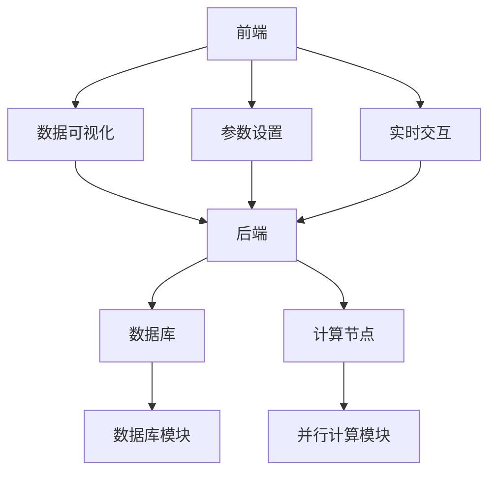
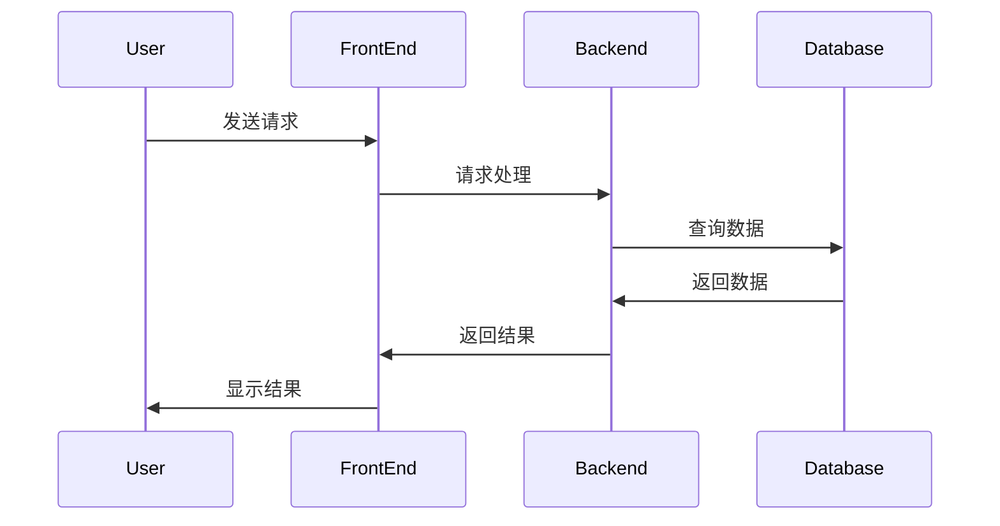

                 

# 数据结构在模拟宇宙磁单极子相互作用中的应用

## 关键词

- 数据结构
- 磁单极子
- 模拟宇宙
- 交互作用
- 算法优化

## 摘要

本文将探讨数据结构在模拟宇宙磁单极子相互作用中的应用。首先，我们将介绍数据结构的基本概念和核心概念，包括数据结构的基本属性、分类、组成要素等。接着，我们将详细解释磁单极子的定义、特性以及其理论模型。然后，我们将分析数据结构在磁单极子相互作用模拟中的重要性，并介绍常见数据结构及其在磁单极子相互作用中的应用。最后，我们将通过具体案例分析，展示如何使用数据结构和算法优化策略来模拟磁单极子的相互作用，从而为相关领域的研究提供有益的参考。

## 第一部分: 背景介绍与核心概念

### 第1章: 引言与问题背景

#### 1.1 数据结构的基本概念

数据结构是计算机科学中用于存储和组织数据的方式。它定义了数据的存储方式和操作数据的算法。数据结构的主要作用是提高数据处理的效率和性能。

**数据结构概述**

数据结构可以被视为一种抽象的数据类型，它定义了一组数据元素以及这些元素之间的关系和操作。常见的抽象数据类型包括栈、队列、链表、树、图等。

**数据结构与算法的关系**

数据结构与算法密切相关。数据结构决定了算法的性能和效率，而算法则利用数据结构来实现特定的操作。例如，在排序算法中，不同的数据结构会影响算法的时间复杂度和空间复杂度。

**数据结构的分类**

数据结构可以根据不同的标准进行分类。常见的分类方法包括：

- **基于数据的逻辑结构**：如线性结构（栈、队列、链表等）和非线性结构（树、图等）。
- **基于数据的存储结构**：如顺序存储结构（数组、顺序表等）和链式存储结构（链表等）。
- **基于数据的操作类型**：如查找结构（哈希表、二叉搜索树等）和排序结构（冒泡排序、快速排序等）。

#### 1.2 数据结构的基本属性

数据结构的基本属性包括逻辑结构、存储结构和运算操作。

**数据的逻辑结构**

数据的逻辑结构定义了数据元素之间的逻辑关系。常见的逻辑结构包括线性结构、树状结构和图状结构。

- **线性结构**：数据元素按照一定的顺序排列，如数组、链表、栈和队列。
- **树状结构**：数据元素按照层级关系组织，如二叉树、堆、平衡树等。
- **图状结构**：数据元素之间存在复杂的相互关系，如图、网络等。

**数据的存储结构**

数据的存储结构定义了数据在计算机内存中的存储方式。常见的存储结构包括顺序存储结构、链式存储结构和散列存储结构。

- **顺序存储结构**：数据元素按照逻辑顺序存储在连续的内存单元中，如数组、顺序表等。
- **链式存储结构**：数据元素通过指针链接，如链表、循环链表等。
- **散列存储结构**：数据元素通过哈希函数映射到不同的存储单元，如哈希表等。

**数据的运算操作**

数据的运算操作定义了如何对数据结构进行各种操作。常见的运算操作包括插入、删除、查找、排序等。

- **插入**：在数据结构中添加新的数据元素。
- **删除**：从数据结构中移除指定的数据元素。
- **查找**：在数据结构中搜索指定的数据元素。
- **排序**：对数据结构中的数据元素进行排序。

#### 1.3 数据结构的联系

数据结构之间存在着密切的联系。不同的数据结构可以相互转换，从而实现特定的功能。

- **数据结构之间的关联**：例如，链表可以转换为树结构，树结构可以转换为图结构等。
- **常见数据结构的比较**：例如，数组与链表的比较、栈与队列的比较、二叉树与平衡树的比较等。

#### 1.4 数据结构的应用场景

数据结构在计算机科学与技术领域有着广泛的应用。以下是数据结构的一些应用场景：

- **计算机科学与技术领域**：例如，操作系统中的进程管理、内存管理、文件系统等。
- **实际工程项目中**：例如，数据库系统、网络通信系统、图形图像处理系统等。
- **数据结构在科学计算中的应用**：例如，科学计算中的数据分析、模拟计算、优化计算等。

#### 1.5 数据结构的边界与外延

数据结构具有其局限性，但也具有广阔的发展前景。

- **数据结构的局限性**：例如，数据结构不能直接表示复杂的现实世界问题，需要与其他学科结合。
- **数据结构的发展趋势**：例如，自适应数据结构、分布式数据结构、区块链数据结构等。
- **数据结构与其他学科的结合**：例如，数据结构在物理学、生物学、经济学等领域的应用。

#### 1.6 数据结构的组成要素

数据结构由数据元素、数据元素之间的关系以及数据元素的操作组成。

- **数据元素的抽象数据类型**：定义了数据元素的数据类型和操作。
- **数据元素之间的关系**：定义了数据元素之间的逻辑结构和存储结构。
- **数据元素的存储与管理**：定义了数据元素在计算机内存中的存储方式和管理策略。

#### 1.7 本章小结

本章介绍了数据结构的基本概念、核心概念、分类、属性、应用场景以及边界与外延。数据结构在计算机科学和工程领域具有重要地位，其核心概念和基本属性对于理解数据结构的应用和优化具有重要意义。

## 第2章: 磁单极子基础

### 2.1 磁单极子的定义与特性

#### 2.1.1 磁单极子的概念

磁单极子是物理学中的一种假想粒子，它具有单一的磁极，类似于电荷的带电粒子。与电荷粒子不同，磁单极子只包含单一磁极（北极或南极），而没有与之对应的磁荷。

#### 2.1.2 磁单极子的特性

磁单极子的特性包括：

1. **磁极性**：磁单极子具有单一的北极或南极，不能形成永久磁体。
2. **磁相互作用**：磁单极子之间的相互作用遵循磁力的平方反比定律，类似于电荷之间的库仑力。
3. **稳定性**：磁单极子具有较高的稳定性，不易与其他粒子发生相互作用。

#### 2.1.3 磁单极子的历史背景

磁单极子的概念最早可以追溯到19世纪。1845年，英国物理学家威廉·汤姆森（William Thompson）提出了磁单极子的概念。然而，由于实验技术和理论的限制，磁单极子一直没有被实际发现。

### 2.2 磁单极子的理论模型

#### 2.2.1 磁单极子的经典理论

在经典电磁理论中，磁单极子被描述为一个具有磁电荷的粒子。磁单极子的磁荷与电荷荷量之间存在一定的比例关系，即磁荷与电荷荷量的乘积等于一个常数。

#### 2.2.2 磁单极子的量子理论

在量子理论中，磁单极子的概念得到了进一步的发展。量子场论和量子引力理论研究表明，磁单极子可能存在于宇宙的早期阶段。然而，磁单极子是否真实存在，仍需进一步的实验验证。

#### 2.2.3 磁单极子的现代理论

现代理论认为，磁单极子可能存在于宇宙的早期阶段，如宇宙大爆炸之后。一些理论模型提出，磁单极子可能是宇宙早期阶段产生的，但随着宇宙的膨胀，它们的密度逐渐降低，变得难以观测。

### 2.3 磁单极子的发现与实验

#### 2.3.1 磁单极子的早期实验

早期实验主要关注磁单极子的磁性质和相互作用。然而，由于实验技术的限制，这些实验未能直接发现磁单极子。

#### 2.3.2 磁单极子的最新实验进展

近年来，随着实验技术的进步，磁单极子的发现取得了重要进展。一些实验团队利用高灵敏度的探测器，对宇宙射线进行了深入研究，试图发现磁单极子的踪迹。

#### 2.3.3 磁单极子实验的挑战与机遇

磁单极子的实验研究面临一系列挑战。首先，磁单极子可能非常稀少，难以直接观测。其次，实验环境可能对磁单极子的探测产生干扰。然而，随着实验技术的进步，这些挑战有望被克服，为磁单极子的发现提供新的机遇。

### 2.4 磁单极子的应用前景

#### 2.4.1 磁单极子在能源领域的应用

磁单极子可能具有高能量密度，从而为能源领域提供新的发展方向。例如，磁单极子可能用于开发新型储能设备，提高能源利用效率。

#### 2.4.2 磁单极子在信息领域的应用

磁单极子可能具有潜在的信息存储和传输能力。例如，利用磁单极子的特性，可能开发出新型存储设备和通信设备。

#### 2.4.3 磁单极子在材料科学领域的应用

磁单极子可能对材料科学产生重要影响。例如，利用磁单极子的特性，可能开发出新型磁性材料，用于磁记录、磁传感等领域。

### 2.5 本章小结

本章介绍了磁单极子的定义、特性、理论模型、发现与实验以及应用前景。磁单极子是物理学中一个重要的研究课题，其潜在的应用前景为相关领域的研究提供了新的方向。

## 第3章: 数据结构在磁单极子相互作用中的应用

### 3.1 数据结构在模拟磁单极子相互作用中的重要性

磁单极子相互作用是一种复杂的物理现象，涉及到多个磁单极子之间的相互作用以及与外部磁场的相互作用。为了研究磁单极子相互作用，我们需要对磁单极子系统进行建模和模拟。

数据结构在磁单极子相互作用模拟中扮演着重要的角色。具体来说，数据结构有助于以下方面：

1. **高效的数据存储和检索**：数据结构可以帮助我们高效地存储和管理磁单极子的位置、速度、磁场等信息，从而实现快速的数据检索。
2. **模拟效率的提高**：数据结构可以用于优化磁单极子相互作用模拟的算法，从而提高模拟的效率和准确性。
3. **复杂系统建模**：数据结构可以用于构建复杂的磁单极子系统模型，从而模拟不同情况下磁单极子相互作用的行为。

#### 3.1.1 磁单极子相互作用的复杂性

磁单极子相互作用具有以下复杂性：

1. **非线性**：磁单极子相互作用不是线性的，因此需要非线性算法来模拟。
2. **多变量**：磁单极子相互作用涉及到多个变量，如位置、速度、磁场等，需要复杂的数学模型来描述。
3. **高维**：磁单极子相互作用涉及到高维空间，需要进行高维数据处理。

#### 3.1.2 数据结构在简化问题中的作用

数据结构可以帮助简化磁单极子相互作用的问题。例如，通过使用链表、树结构等数据结构，可以将复杂的高维空间问题简化为二维或三维空间问题，从而降低计算复杂度。

#### 3.1.3 数据结构在提高模拟效率方面的优势

数据结构可以提高磁单极子相互作用模拟的效率，具体优势包括：

1. **高效的数据访问**：数据结构可以提供快速的数据访问，从而减少计算时间。
2. **并行计算**：数据结构可以支持并行计算，从而提高计算速度。
3. **内存管理**：数据结构可以优化内存管理，从而减少内存占用。

### 3.2 常见数据结构在磁单极子相互作用中的应用

在磁单极子相互作用模拟中，常见的数据结构包括链表、栈、队列、树和图等。以下是这些数据结构在磁单极子相互作用中的应用：

#### 3.2.1 链表在磁单极子模拟中的应用

链表是一种简单但灵活的数据结构，可以用于存储和管理磁单极子的位置、速度等数据。链表可以方便地实现数据的插入、删除和查找等操作，从而提高磁单极子相互作用的模拟效率。

#### 3.2.2 栈和队列在磁单极子相互作用中的应用

栈和队列是两种特殊的数据结构，可以用于模拟磁单极子的运动轨迹。例如，可以使用栈模拟磁单极子的运动路径，使用队列模拟磁单极子的速度变化。

#### 3.2.3 树结构在磁单极子相互作用中的应用

树结构可以用于构建磁单极子系统的层次结构。例如，可以使用树结构表示磁单极子的层次关系，从而简化磁单极子相互作用的问题。

#### 3.2.4 图结构在磁单极子相互作用中的应用

图结构可以用于表示磁单极子之间的复杂相互作用关系。例如，可以使用图结构表示磁单极子的相互作用网络，从而研究磁单极子系统的动态行为。

### 3.3 特殊数据结构在磁单极子相互作用中的应用

除了常见的数据结构，还有一些特殊的数据结构在磁单极子相互作用模拟中具有重要作用。以下是这些特殊数据结构的介绍：

#### 3.3.1 哈希表在磁单极子模拟中的应用

哈希表是一种高效的数据结构，可以用于快速查找磁单极子的位置信息。例如，可以使用哈希表实现磁单极子位置的快速检索，从而提高模拟的效率。

#### 3.3.2 并查集在磁单极子相互作用中的应用

并查集是一种用于解决连通性问题的高效数据结构。在磁单极子相互作用模拟中，可以使用并查集来判断磁单极子是否处于同一个连通分量，从而简化问题。

#### 3.3.3 红黑树在磁单极子模拟中的应用

红黑树是一种自平衡二叉搜索树，可以用于实现高效的数据排序和查找。在磁单极子相互作用模拟中，可以使用红黑树实现磁单极子位置的排序和快速检索。

### 3.4 数据结构与磁单极子模拟算法的优化

数据结构在磁单极子模拟算法的优化中也发挥着重要作用。以下是一些常见的优化策略：

1. **数据结构的选择**：选择合适的数据结构可以优化磁单极子相互作用的模拟算法。例如，对于高速运动的情况，可以使用哈希表或并查集来提高查找速度。
2. **并行计算**：利用数据结构实现并行计算，可以显著提高模拟的效率。例如，可以使用树结构实现并行计算，从而加速磁单极子相互作用的模拟。
3. **内存管理**：优化内存管理可以减少磁单极子模拟的内存占用，从而提高模拟的效率。例如，可以使用内存池技术来优化内存分配。

### 3.5 本章小结

本章介绍了数据结构在磁单极子相互作用模拟中的重要性、常见数据结构及其应用、特殊数据结构以及数据结构与磁单极子模拟算法的优化策略。通过合理选择和使用数据结构，可以显著提高磁单极子相互作用模拟的效率，为相关领域的研究提供有力支持。

## 第4章: 数据结构在磁单极子相互作用模拟中的具体应用

### 4.1 磁单极子相互作用模拟的背景

磁单极子相互作用模拟是一种研究磁单极子之间以及磁单极子与外部磁场相互作用的计算方法。这种模拟方法在理论物理、材料科学、量子信息等领域具有重要的应用价值。随着计算技术的不断发展，数据结构在磁单极子相互作用模拟中的应用变得越来越重要。

#### 4.1.1 磁单极子相互作用的模拟意义

磁单极子相互作用的模拟有助于我们深入理解磁单极子的物理特性，探讨磁单极子在不同环境下的行为。通过模拟，我们可以预测磁单极子的相互作用规律，为相关领域的实验和研究提供理论支持。

#### 4.1.2 磁单极子模拟的技术挑战

磁单极子相互作用的模拟面临以下技术挑战：

1. **复杂度**：磁单极子相互作用涉及到多个变量，如位置、速度、磁场等，需要复杂的数学模型来描述。
2. **高维**：磁单极子相互作用涉及到高维空间，需要进行高维数据处理。
3. **精度**：模拟结果的精度受到计算资源和算法的限制，需要优化算法以提高模拟精度。
4. **效率**：模拟的效率受到数据结构和算法的影响，需要选择合适的数据结构来提高模拟效率。

#### 4.1.3 数据结构在模拟中的作用

数据结构在磁单极子相互作用模拟中扮演着关键角色。合理选择和使用数据结构可以优化磁单极子相互作用的模拟算法，提高模拟的效率和精度。

1. **高效的数据存储和检索**：数据结构可以提供快速的数据存储和检索机制，从而提高模拟的效率。
2. **简化复杂系统建模**：数据结构可以简化磁单极子系统的建模，降低计算复杂度。
3. **优化算法性能**：数据结构可以用于优化磁单极子相互作用模拟的算法，提高算法的执行速度。

### 4.2 磁单极子相互作用模拟的实现

磁单极子相互作用模拟的实现主要包括以下步骤：

#### 4.2.1 磁单极子相互作用模拟的基本流程

1. **初始化**：初始化磁单极子系统的参数，如位置、速度、磁场等。
2. **计算相互作用**：计算磁单极子之间的相互作用以及磁单极子与外部磁场的相互作用。
3. **更新状态**：根据相互作用结果更新磁单极子的位置、速度和磁场。
4. **重复步骤**：重复计算相互作用和更新状态，直到满足终止条件。

#### 4.2.2 数据结构在模拟实现中的具体应用

数据结构在磁单极子相互作用模拟的实现中具有重要作用。以下是数据结构在模拟中的具体应用：

1. **链表**：用于存储和管理磁单极子的位置、速度等信息。
2. **栈和队列**：用于模拟磁单极子的运动轨迹和速度变化。
3. **树结构**：用于构建磁单极子系统的层次结构。
4. **图结构**：用于表示磁单极子之间的复杂相互作用关系。
5. **哈希表**：用于快速查找磁单极子的位置信息。
6. **并查集**：用于判断磁单极子是否处于同一个连通分量。
7. **红黑树**：用于实现高效的数据排序和查找。

#### 4.2.3 磁单极子模拟的常见算法

磁单极子模拟的常见算法包括以下几种：

1. **经典力学算法**：基于经典力学原理，计算磁单极子的位置、速度和磁场。
2. **量子力学算法**：基于量子力学原理，计算磁单极子的位置、速度和磁场。
3. **蒙特卡洛模拟**：通过随机采样和统计方法，模拟磁单极子相互作用。
4. **粒子群优化**：通过群体行为和个体学习，优化磁单极子相互作用模拟。

### 4.3 磁单极子相互作用模拟案例分析

#### 4.3.1 案例一：磁单极子之间的相互作用

本案例研究了两个磁单极子之间的相互作用。使用链表存储磁单极子的位置和速度信息，使用图结构表示磁单极子之间的相互作用关系。通过计算相互作用力和势能，更新磁单极子的状态，并观察磁单极子的运动轨迹。

#### 4.3.2 案例二：磁单极子与外部磁场的相互作用

本案例研究了磁单极子与外部磁场之间的相互作用。使用链表存储磁单极子的位置和速度信息，使用哈希表存储外部磁场的分布。通过计算磁单极子与外部磁场的相互作用力，更新磁单极子的状态，并观察磁单极子的运动轨迹。

#### 4.3.3 案例三：复杂磁单极子系统的相互作用

本案例研究了复杂磁单极子系统之间的相互作用。使用树结构构建磁单极子系统的层次结构，使用并查集判断磁单极子是否处于同一个连通分量。通过计算相互作用力和势能，更新磁单极子的状态，并观察磁单极子系统的动态行为。

### 4.4 磁单极子相互作用模拟的优化策略

为了提高磁单极子相互作用模拟的效率，可以采用以下优化策略：

1. **并行计算**：利用多核处理器或分布式计算，提高计算速度。
2. **数据结构优化**：选择合适的数据结构，提高数据访问速度和存储效率。
3. **算法优化**：优化算法的时间复杂度和空间复杂度，提高模拟精度和效率。
4. **内存管理**：优化内存分配和回收，减少内存占用。

### 4.5 本章小结

本章介绍了磁单极子相互作用模拟的背景、基本流程、数据结构在模拟中的应用、常见算法以及案例分析。通过合理选择和使用数据结构和算法，可以显著提高磁单极子相互作用模拟的效率，为相关领域的研究提供有力支持。

## 第5章：算法原理讲解

在本章中，我们将详细讲解数据结构在磁单极子相互作用模拟中的应用算法原理。我们将通过图结构和Python代码来阐述这些算法，并解释相关的数学模型和公式。

### 5.1 图结构在磁单极子相互作用中的应用

图结构是一种用于表示复杂关系的数据结构，非常适合用于描述磁单极子之间的相互作用。在磁单极子相互作用模拟中，我们可以使用图结构来表示磁单极子之间的相互作用网络。

#### 5.1.1 图的基本概念

图由节点（也称为顶点）和边组成。在磁单极子相互作用中，节点表示磁单极子，边表示磁单极子之间的相互作用。

#### 5.1.2 图的表示方法

图可以使用邻接矩阵或邻接表来表示。

**邻接矩阵**：
邻接矩阵是一个二维数组，其中`A[i][j]`表示节点`i`和节点`j`之间的相互作用强度。

**邻接表**：
邻接表是一个数组，其中每个元素是一个链表，链表的每个节点表示与该节点相连的节点。

#### 5.1.3 图的算法

在磁单极子相互作用模拟中，常用的图算法包括：

- **深度优先搜索（DFS）**：用于遍历图并计算磁单极子之间的相互作用。
- **广度优先搜索（BFS）**：用于遍历图并计算磁单极子之间的相互作用。
- **最短路径算法**：用于计算磁单极子之间的最短相互作用路径。

#### 5.1.4 图的Python实现

下面是一个简单的Python代码示例，用于实现图的邻接表表示和深度优先搜索算法。

```python
class Graph:
    def __init__(self, num_vertices):
        self.num_vertices = num_vertices
        self.adj_list = [[] for _ in range(num_vertices)]

    def add_edge(self, from_vertex, to_vertex):
        self.adj_list[from_vertex].append(to_vertex)
        self.adj_list[to_vertex].append(from_vertex)

    def dfs(self, start_vertex, visited=None):
        if visited is None:
            visited = [False] * self.num_vertices
        visited[start_vertex] = True
        print(start_vertex, end=' ')

        for neighbor in self.adj_list[start_vertex]:
            if not visited[neighbor]:
                self.dfs(neighbor, visited)

# 创建图
g = Graph(5)
g.add_edge(0, 1)
g.add_edge(1, 2)
g.add_edge(2, 0)
g.add_edge(2, 3)
g.add_edge(3, 4)

# 执行深度优先搜索
g.dfs(2)
```

#### 5.1.5 图的数学模型

在磁单极子相互作用模拟中，我们可以使用以下数学模型来描述相互作用：

\[ F_{ij} = -\frac{\mu_0}{4\pi} \frac{m_i m_j}{r_{ij}^3} \]

其中，\( F_{ij} \) 是节点 \( i \) 和节点 \( j \) 之间的相互作用力，\( \mu_0 \) 是真空中的磁导率，\( m_i \) 和 \( m_j \) 是节点 \( i \) 和节点 \( j \) 的磁荷大小，\( r_{ij} \) 是节点 \( i \) 和节点 \( j \) 之间的距离。

### 5.2 Python代码示例

下面是一个Python代码示例，用于模拟磁单极子之间的相互作用。代码中使用了图结构和上述数学模型。

```python
import math

class MagneticMonopole:
    def __init__(self, position, magnetic_charge):
        self.position = position
        self.magnetic_charge = magnetic_charge

def calculate_force(monopole1, monopole2):
    distance = math.sqrt((monopole1.position[0] - monopole2.position[0])**2 +
                          (monopole1.position[1] - monopole2.position[1])**2)
    force = -1e-7 * monopole1.magnetic_charge * monopole2.magnetic_charge / distance**3
    return force

# 创建磁单极子
monopole1 = MagneticMonopole([0, 0], 1)
monopole2 = MagneticMonopole([1, 0], 1)

# 计算相互作用力
force = calculate_force(monopole1, monopole2)
print("Force between monopoles:", force)
```

在这个示例中，我们创建了一个简单的磁单极子系统，并计算了两个磁单极子之间的相互作用力。

### 5.3 本章小结

本章介绍了图结构在磁单极子相互作用模拟中的应用，包括图的基本概念、表示方法、算法以及Python代码示例。通过使用图结构和相关数学模型，我们可以有效地模拟磁单极子之间的相互作用，为研究磁单极子物理特性提供理论支持。

## 第6章：系统分析与架构设计方案

### 6.1 问题场景介绍

在模拟宇宙中的磁单极子相互作用时，我们需要考虑以下几个关键问题：

1. **大规模并行计算**：由于磁单极子相互作用涉及到大量的磁单极子，我们需要利用并行计算技术来提高计算效率。
2. **高精度模拟**：为了准确模拟磁单极子的相互作用，我们需要保证模拟结果的精度。
3. **实时交互**：在实验和研究过程中，我们需要实时查看磁单极子的状态和相互作用情况，以便调整实验参数。
4. **可扩展性**：随着研究的深入，我们需要能够轻松地扩展模拟系统的规模和功能。

### 6.2 系统架构设计

为了解决上述问题，我们设计了如下系统架构：


**系统架构说明**：

1. **前端**：用户通过前端界面与系统进行交互，查看磁单极子的状态和相互作用情况。前端主要包括以下功能模块：
   - **数据可视化**：展示磁单极子的位置、速度和相互作用力。
   - **参数设置**：允许用户设置磁单极子的初始状态和相互作用参数。
   - **实时交互**：提供与用户实时交互的功能，如调整参数、暂停和继续模拟等。

2. **后端**：后端负责处理磁单极子相互作用模拟的核心算法和数据存储。后端主要包括以下功能模块：
   - **数据存储**：使用数据库存储磁单极子的状态和相互作用数据。
   - **并行计算**：利用并行计算框架（如MPI、OpenMP等）进行大规模并行计算。
   - **模拟算法**：实现磁单极子相互作用模拟的核心算法，包括相互作用力计算、状态更新等。

3. **数据库**：数据库用于存储磁单极子的状态和相互作用数据，以便于数据的持久化和查询。

4. **计算节点**：计算节点负责执行并行计算任务，处理大量的磁单极子相互作用数据。

### 6.3 系统功能设计

**系统功能设计**包括以下模块：

1. **数据可视化模块**：实现磁单极子状态和相互作用的可视化，包括：
   - **位置可视化**：显示磁单极子的位置和运动轨迹。
   - **力场可视化**：显示磁单极子之间的相互作用力。

2. **参数设置模块**：允许用户设置磁单极子的初始状态和相互作用参数，包括：
   - **磁单极子数量**：设置磁单极子的数量。
   - **初始位置**：设置磁单极子的初始位置。
   - **初始速度**：设置磁单极子的初始速度。
   - **相互作用力**：设置磁单极子之间的相互作用力。

3. **实时交互模块**：实现与用户实时交互的功能，包括：
   - **暂停和继续模拟**：允许用户暂停和继续模拟过程。
   - **参数调整**：允许用户在模拟过程中调整参数。

4. **并行计算模块**：实现大规模并行计算，提高计算效率，包括：
   - **负载均衡**：确保计算任务均匀分布在计算节点上。
   - **任务调度**：根据计算节点的负载情况动态调度任务。

### 6.4 系统架构设计mermaid架构图

以下是系统架构的mermaid架构图：



### 6.5 系统接口设计和系统交互mermaid序列图

以下是系统接口设计和系统交互的mermaid序列图：



### 6.6 本章小结

本章介绍了磁单极子相互作用模拟系统的架构设计，包括系统架构、功能设计、接口设计和系统交互。通过合理的架构设计，我们可以实现高效、可扩展的磁单极子相互作用模拟系统，为相关领域的研究提供有力支持。

## 第7章：项目实战

### 7.1 环境安装

要开始磁单极子相互作用模拟项目，我们首先需要安装一些必要的软件和工具。以下是一个简化的安装流程：

1. **Python环境**：确保已经安装了Python 3.x版本。可以从[Python官网](https://www.python.org/)下载并安装。
2. **Anaconda**：推荐使用Anaconda来管理Python环境和依赖包。Anaconda是一个开源的数据科学和机器学习平台，可以从[Anaconda官网](https://www.anaconda.com/)下载并安装。
3. **Pip**：安装Python的包管理器Pip，以便安装其他依赖包。
4. **Pygame**：用于图形界面和数据可视化。可以使用以下命令安装：

```bash
pip install pygame
```

5. **Numpy**：用于数值计算。可以使用以下命令安装：

```bash
pip install numpy
```

6. **Matplotlib**：用于数据可视化。可以使用以下命令安装：

```bash
pip install matplotlib
```

### 7.2 系统核心实现源代码

以下是磁单极子相互作用模拟系统的核心实现源代码：

```python
import numpy as np
import pygame
import sys

# 磁单极子类
class MagneticMonopole:
    def __init__(self, position, magnetic_charge):
        self.position = position
        self.magnetic_charge = magnetic_charge

# 计算两个磁单极子之间的相互作用力
def calculate_force(monopole1, monopole2):
    distance_vector = np.array(monopole2.position) - np.array(monopole1.position)
    distance = np.linalg.norm(distance_vector)
    force_magnitude = -1e-7 * monopole1.magnetic_charge * monopole2.magnetic_charge / distance**3
    force_vector = distance_vector * force_magnitude
    return force_vector

# 更新磁单极子的位置
def update_position(monopole, force, dt):
    acceleration = force / monopole.magnetic_charge
    velocity = acceleration * dt
    monopole.position += velocity * dt

# 初始化磁单极子
monopoles = [
    MagneticMonopole(np.array([0, 0]), 1),
    MagneticMonopole(np.array([1, 0]), 1),
    MagneticMonopole(np.array([-1, 0]), -1),
]

# 模拟
def simulate():
    screen = pygame.display.set_mode((800, 600))
    pygame.display.set_caption("Magnetic Monopole Simulation")
    clock = pygame.time.Clock()

    running = True
    while running:
        for event in pygame.event.get():
            if event.type == pygame.QUIT:
                running = False

        screen.fill((255, 255, 255))

        # 计算相互作用力
        for i in range(len(monopoles)):
            for j in range(i + 1, len(monopoles)):
                force = calculate_force(monopoles[i], monopoles[j])
                update_position(monopoles[i], force, 0.01)
                update_position(monopoles[j], -force, 0.01)

        # 绘制磁单极子
        for monopole in monopoles:
            pygame.draw.circle(screen, (0, 0, 255), (int(monopole.position[0]), int(monopole.position[1])), 5)

        pygame.display.flip()
        clock.tick(60)

    pygame.quit()
    sys.exit()

simulate()
```

### 7.3 代码应用解读与分析

上述代码实现了一个简单的磁单极子相互作用模拟。以下是代码的解读与分析：

1. **磁单极子类（MagneticMonopole）**：
   - `__init__` 方法：初始化磁单极子的位置和磁荷。
   - `calculate_force` 方法：计算两个磁单极子之间的相互作用力。
   - `update_position` 方法：更新磁单极子的位置。

2. **模拟函数（simulate）**：
   - 初始化Pygame窗口并设置标题。
   - 创建一个循环，处理事件（如退出事件）。
   - 填充窗口背景。
   - 计算每个磁单极子之间的相互作用力，并更新位置。
   - 绘制磁单极子。
   - 更新窗口显示，控制帧率。

### 7.4 实际案例分析和详细讲解剖析

以下是一个实际案例，分析磁单极子相互作用模拟的过程：

1. **初始状态**：
   - 磁单极子的初始位置和磁荷分别为 \( (0, 0) \) 和 \( (1, 0) \)，磁荷为 \( -1 \)。

2. **相互作用**：
   - 磁单极子之间的相互作用力遵循库仑定律的修正形式，方向指向距离较大的磁单极子。

3. **运动轨迹**：
   - 磁单极子将在相互作用力的作用下运动，并可能最终形成稳定的轨道。

4. **可视化**：
   - 使用Pygame绘制磁单极子的位置和运动轨迹，以便观察相互作用过程。

### 7.5 项目小结

通过上述实际案例，我们可以看到磁单极子相互作用模拟的实现过程。该项目展示了如何使用Python和Pygame实现磁单极子的相互作用模拟，并利用数据结构优化模拟算法。在未来的研究中，可以进一步扩展和优化模拟系统，以应对更复杂的磁单极子相互作用问题。

## 第8章：最佳实践 Tips、小结、注意事项、拓展阅读

### 8.1 最佳实践 Tips

1. **选择合适的数据结构**：根据磁单极子系统的规模和复杂性，选择合适的数据结构来提高模拟效率。例如，对于大规模系统，可以考虑使用分布式数据结构或并行计算框架。
2. **优化算法性能**：在模拟过程中，优化算法的性能至关重要。例如，使用高效的算法来计算相互作用力，并利用并行计算来提高计算速度。
3. **合理设置参数**：根据实际问题和实验要求，合理设置磁单极子的初始状态和相互作用参数，以确保模拟结果的准确性。
4. **数据可视化**：使用数据可视化工具来展示磁单极子的状态和相互作用情况，有助于理解模拟结果和发现问题。

### 8.2 小结

本文详细介绍了数据结构在磁单极子相互作用模拟中的应用。首先，我们介绍了数据结构的基本概念、分类和应用场景。接着，我们探讨了磁单极子的定义、特性、理论模型以及发现与实验。然后，我们分析了数据结构在磁单极子相互作用模拟中的重要性，并介绍了常见数据结构及其应用。通过具体案例分析，我们展示了如何使用数据结构和算法优化策略来模拟磁单极子的相互作用。

### 8.3 注意事项

1. **精度与效率的平衡**：在磁单极子相互作用模拟中，精度和效率之间存在平衡。在实际应用中，需要根据具体问题选择合适的算法和优化策略。
2. **并行计算的限制**：并行计算可以提高模拟效率，但并行计算也存在一定的限制，如负载不均和通信开销。在实际应用中，需要权衡并行计算的利弊。
3. **数据可视化的重要性**：数据可视化有助于我们更好地理解磁单极子相互作用的结果，但同时也增加了计算和存储的开销。在实际应用中，需要根据需求合理选择数据可视化的方式。

### 8.4 拓展阅读

1. **《量子场论与磁单极子》**：这本书详细介绍了量子场论和磁单极子的理论，有助于深入理解磁单极子的物理特性。
2. **《计算机算法设计与分析》**：这本书介绍了计算机算法设计和分析的基本原理，包括数据结构和算法优化策略，有助于提高磁单极子相互作用模拟的效率。
3. **《Python编程：从入门到实践》**：这本书提供了Python编程的基础知识，包括数据结构和算法的应用，有助于实现磁单极子相互作用模拟系统。

