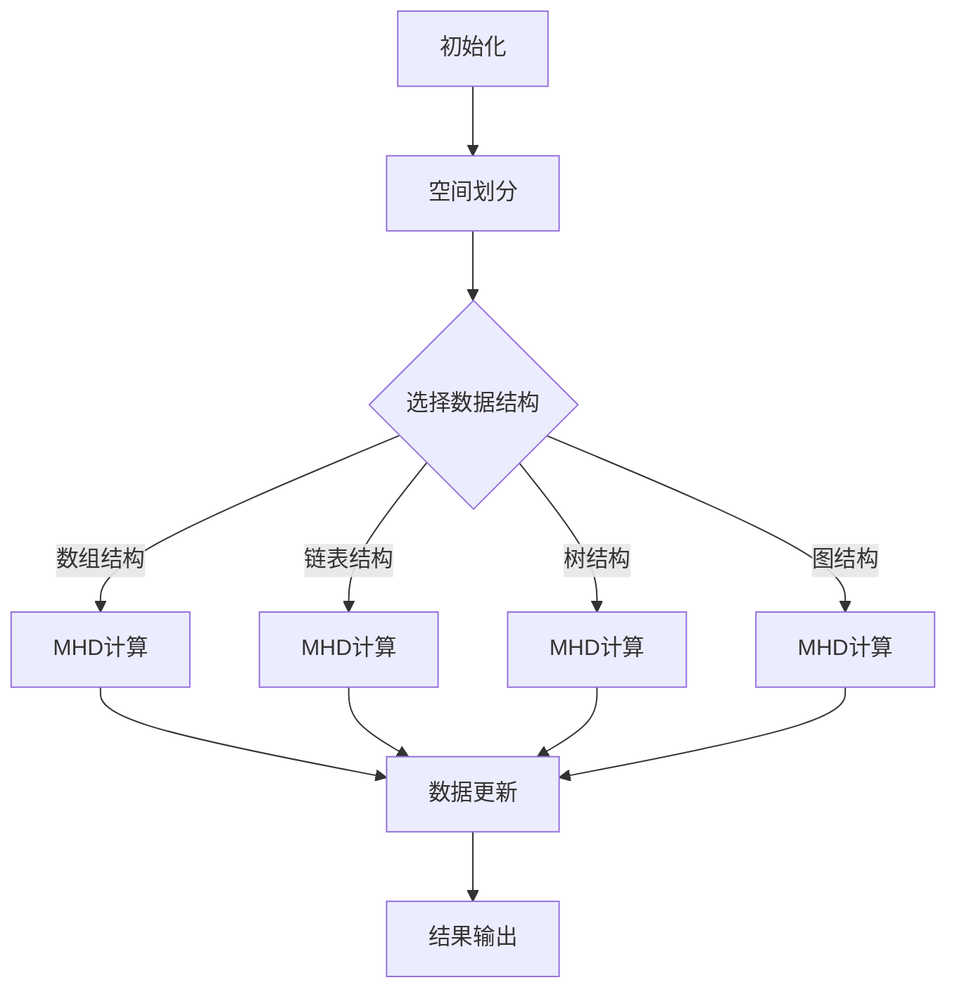
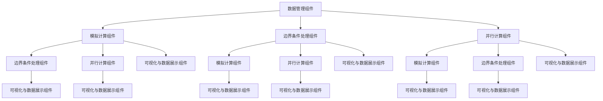
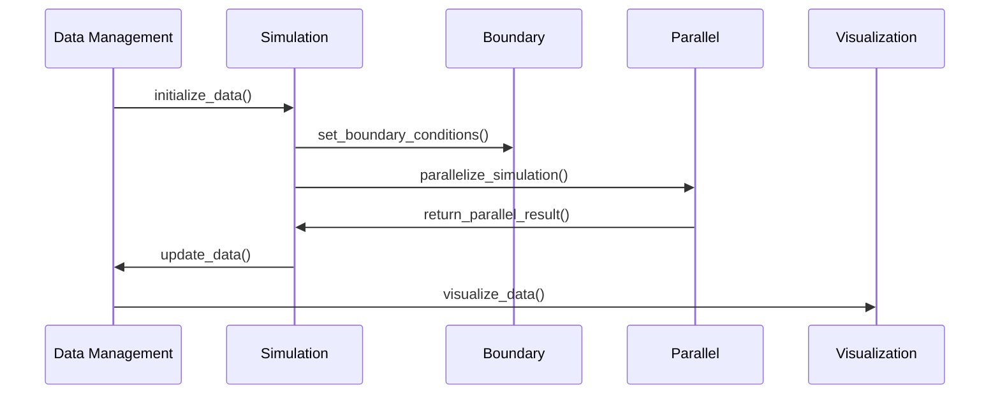

                 

### 设计《数据结构在模拟宇宙磁场分布中的应用》书籍目录大纲

为了系统地介绍数据结构在模拟宇宙磁场分布中的应用，我们将书籍分为五个主要部分，每个部分包含多个章节，每个章节具体内容如下：

#### 第一部分: 引言

**第1章: 宇宙磁场模拟概述**

- **1.1 宇宙磁场的重要性**：讨论宇宙磁场对于星系形成和恒星演化的重要性，以及其在宇宙学研究中的应用。
- **1.2 宇宙磁场模拟的挑战**：探讨宇宙磁场模拟中面临的难题，如高维度数据处理、计算复杂度等。
- **1.3 数据结构在宇宙磁场模拟中的应用**：介绍如何利用数据结构解决宇宙磁场模拟中的问题，包括提高计算效率和模拟精度。

**第2章: 核心概念与联系**

- **2.1 常用数据结构介绍**：详细阐述常见的数据结构及其在宇宙磁场模拟中的应用，如数组、链表、树、图等。
- **2.2 数据结构性能对比**：通过性能对比表格，展示不同数据结构在模拟宇宙磁场时的优势和不足。
- **2.3 ER实体关系图**：使用Mermaid绘制实体关系图，展示数据结构在宇宙磁场模拟中的关系和交互。

#### 第二部分: 算法原理讲解

**第3章: 宇宙磁场模拟算法原理**

- **3.1 算法流程图**：使用Mermaid绘制宇宙磁场模拟算法的流程图，帮助读者理解算法的执行过程。
- **3.2 算法原理阐述**：利用Python源代码和LaTeX公式，详细解释宇宙磁场模拟算法的原理。
- **3.3 数学模型和公式**：给出算法的数学模型和公式，并进行深入讲解。
- **3.4 算法举例说明**：通过具体例子，展示算法在实际应用中的效果。

#### 第三部分: 系统分析与架构设计方案

**第4章: 模拟宇宙磁场分布的系统架构**

- **4.1 问题场景介绍**：详细描述模拟宇宙磁场分布的系统需求。
- **4.2 项目介绍**：介绍模拟宇宙磁场分布的项目背景和目标。
- **4.3 系统功能设计**：使用Mermaid绘制领域模型类图，展示系统功能。
- **4.4 系统架构设计**：使用Mermaid绘制系统架构图，展示系统组件和交互。
- **4.5 系统接口设计**：详细说明系统接口的设计和实现。
- **4.6 系统交互Mermaid序列图**：绘制系统交互序列图，展示不同组件间的交互过程。

#### 第四部分: 项目实战

**第5章: 项目实战**

- **5.1 环境安装**：详细描述环境配置和依赖安装过程。
- **5.2 系统核心实现源代码**：提供关键代码片段和解释。
- **5.3 代码应用解读与分析**：分析代码实现，解释其逻辑和效果。
- **5.4 实际案例分析和详细讲解剖析**：通过实际案例展示算法的效果和优势。
- **5.5 项目小结**：总结项目实施过程中的经验教训。

#### 第五部分: 最佳实践 tips、小结、注意事项、拓展阅读

- **最佳实践 tips**：提供在实际应用中的技巧和建议。
- **小结**：总结全书的核心观点和主要结论。
- **注意事项**：指出使用数据结构和算法模拟宇宙磁场时需要注意的问题。
- **拓展阅读**：推荐进一步学习和研究的资源。

通过以上详细的书籍目录大纲，读者可以逐步了解数据结构在模拟宇宙磁场分布中的应用，掌握相关核心概念、算法原理和系统架构设计，为深入研究和实际应用打下坚实的基础。

### 宇宙磁场模拟概述

#### 1.1 宇宙磁场的重要性

宇宙磁场是宇宙中广泛存在的物理现象，它在星系形成、恒星演化、星际介质加热和星际物质的动力学过程中发挥着至关重要的作用。宇宙磁场不仅仅是宇宙中磁性物质的简单分布，它还参与了宇宙中最基本的物理过程的调控。

首先，宇宙磁场在星系形成中扮演了关键角色。研究表明，星系的形成通常伴随着大规模的气体云的凝聚，而宇宙磁场可以影响这些气体云的旋转和坍缩过程。磁场线通过其能量和动量传输，可以帮助气体云抵御引力坍缩，从而影响星系的结构和形态。此外，宇宙磁场可以导致气体云中的电荷分离，产生电场，进一步促进星际介质的加热和膨胀，这对于理解星系内部的能量循环至关重要。

其次，在恒星演化中，宇宙磁场对恒星内部的物理过程有着深远的影响。恒星内部的磁场可以影响核聚变反应的速度和稳定性，影响恒星的生命周期和演化轨迹。例如，通过观测，天文学家发现一些恒星具有强烈的磁场，这些恒星可能会产生高度不稳定的爆发，如耀斑和日冕物质抛射（CMEs）。这些现象对于恒星的光谱特性和辐射特征有着显著的影响，因此研究恒星磁场对于理解恒星演化的复杂性具有重要意义。

最后，宇宙磁场在星际介质和星系团中的行为也对宇宙环境有重要影响。星际介质中的磁场可以影响星际物质的流动和能量传输，从而影响星系团的动力学行为。例如，一些观测表明，星系团中的大规模湍流现象可能与宇宙磁场的复杂结构有关，这对于理解宇宙的大尺度结构演化至关重要。

总的来说，宇宙磁场的研究不仅有助于揭示宇宙的基本物理过程，还为理解宇宙的结构和演化提供了重要的线索。在现代宇宙学中，宇宙磁场模拟已经成为一个重要方向，它通过数值模拟来研究宇宙磁场的起源、演化以及在不同天体物理过程中的作用。这种研究不仅需要精确的物理理论，还需要高效的计算方法和优化的数据结构。

#### 1.2 宇宙磁场模拟的挑战

宇宙磁场模拟面临的挑战主要源于以下几个方面：

首先，数据复杂性是宇宙磁场模拟中的首要难题。宇宙中的磁场分布具有极其复杂的三维结构，涉及到大量的空间点和时间点，需要处理的数据量极其庞大。这种高维度数据的处理不仅对存储资源提出了挑战，也对计算能力提出了高要求。传统的二维或一维数据结构难以有效地管理这种高维数据，导致计算效率低下。

其次，计算效率问题是宇宙磁场模拟中的另一个重要挑战。模拟宇宙磁场通常需要大量的计算资源，包括高性能计算机和并行计算技术。然而，现有的计算方法往往无法充分利用这些资源，导致计算效率不高。例如，在处理大规模空间和时间网格时，传统算法可能需要花费大量时间进行网格划分和数据传输，从而增加了计算的复杂性。

第三，模型准确性是宇宙磁场模拟中不可忽视的问题。宇宙磁场模拟的准确性直接影响到研究结果的有效性。在模拟过程中，需要准确描述磁场的物理行为，如磁感应线的分布、磁通量的变化等。然而，精确模拟宇宙磁场的行为需要考虑到多种复杂的物理效应，如磁重联、磁流体动力学（MHD）效应等，这些效应的准确模拟对算法的复杂度和计算精度提出了极高要求。

最后，边界条件和外延问题也是宇宙磁场模拟中的难点。宇宙磁场模拟通常需要在特定的边界条件下进行，如宇宙的边界、星系团的边界等。如何设置合理的边界条件，以确保模拟结果的可信度，是一个复杂的问题。此外，模拟结果的外延问题，即如何将局部模拟结果推广到整个宇宙或特定区域，也是一个需要深入研究的课题。

综上所述，宇宙磁场模拟不仅需要解决高维度数据处理、计算效率和模型准确性等核心问题，还需要考虑到边界条件和外延等边缘问题。这为研究和开发高效的宇宙磁场模拟方法提供了广阔的空间和挑战。

#### 1.3 数据结构在宇宙磁场模拟中的应用

为了解决宇宙磁场模拟中的各种挑战，数据结构的应用显得尤为重要。优化的数据结构不仅可以提高计算效率，还可以提升模型准确性，使得宇宙磁场模拟更加可行和有效。

首先，利用空间索引结构可以有效地管理高维度数据。例如，四叉树（Quadtree）和八叉树（Octree）是两种常用的空间索引结构，它们能够将高维空间分割成更小的区域，从而提高数据访问速度和计算效率。这些结构适用于处理宇宙中大规模、复杂的三维磁场分布，使得模拟过程更加高效。

其次，数组结构在处理宇宙磁场分布中的静态数据时非常有效。通过将宇宙空间划分为离散的网格点，可以使用数组来存储每个点的磁场强度和方向。这种结构简单且易于实现，适用于大规模数据的存储和检索，特别适用于静态宇宙磁场的模拟。

链表结构则在处理动态宇宙磁场时具有优势。由于宇宙磁场的动态变化，链表结构能够灵活地添加和删除节点，从而适应磁场的实时变化。例如，双向链表和循环链表可以用于记录磁场线的变化路径，使得模拟过程更加灵活和高效。

树结构，如二叉树、红黑树等，在处理宇宙磁场分布中的层次关系和复杂拓扑结构时非常有用。这些结构能够有效地组织和管理大量数据，使得数据访问和更新操作更加高效。特别是在处理具有高度分层次的宇宙结构时，树结构能够显著提升模拟性能。

图结构是另一种重要的数据结构，在模拟宇宙磁场中的交互关系时尤为适用。通过使用图结构，可以描述宇宙中不同区域之间的磁场线关系和相互作用。例如，邻接矩阵和邻接表是常用的图数据结构，它们可以用于表示磁场线之间的连通性和相互作用。这种结构有助于理解宇宙磁场的全局行为，特别是在模拟大尺度宇宙现象时。

总的来说，数据结构在宇宙磁场模拟中的应用不仅提高了计算效率和模型准确性，还为解决高维度数据处理和边界条件设置等问题提供了有效的解决方案。通过合理选择和使用数据结构，宇宙磁场模拟可以更加精确、高效地揭示宇宙磁场的行为和演化规律。

#### 1.4 概念结构与核心要素组成

宇宙磁场模拟涉及多个核心概念和要素，这些概念和要素共同构成了模拟系统的基础。以下是宇宙磁场模拟中的一些关键概念和要素：

首先，**网格划分**是宇宙磁场模拟中的基本概念之一。通过将宇宙空间划分为离散的网格点，可以将连续的空间分布转换为离散的数据点。常见的网格划分方法包括均匀网格划分和自适应网格划分。均匀网格划分适用于空间变化较为平缓的区域，而自适应网格划分则可以动态调整网格的分辨率，以适应空间变化剧烈的区域。这种划分方法有助于提高模拟的精度和效率。

其次，**磁场数据结构**是模拟的核心。常用的数据结构包括数组结构、链表结构、树结构和图结构。数组结构简单且易于实现，适用于静态磁场数据的存储和检索。链表结构则适用于动态磁场数据的添加和删除。树结构和图结构则能够有效地管理复杂的空间关系和相互作用，适用于大尺度宇宙现象的模拟。

第三，**边界条件**是宇宙磁场模拟中必须考虑的重要因素。合理的边界条件可以确保模拟结果的物理真实性。常见的边界条件包括周期性边界条件和吸收边界条件。周期性边界条件适用于模拟周期性结构，如星系团；吸收边界条件则适用于模拟外部环境对磁场的影响，如宇宙背景辐射。

第四，**时间步长**是模拟过程中的关键参数。时间步长决定了模拟的精度和效率。选择合适的时间步长需要平衡计算资源和模拟精度。通常，时间步长应小于某个临界值，以避免数值不稳定性。

第五，**物理模型**是宇宙磁场模拟的理论基础。常用的物理模型包括磁流体动力学（MHD）模型和粒子动力学（N-body）模型。MHD模型考虑了磁场和流体之间的相互作用，适用于模拟高密度、大尺度的宇宙现象。N-body模型则通过模拟天体的引力相互作用，适用于小尺度、高分辨率的天体物理过程。

最后，**并行计算**技术是提高宇宙磁场模拟效率的重要手段。通过并行计算，可以将复杂的模拟任务分解为多个子任务，并行处理，从而显著减少计算时间。常见的并行计算方法包括MPI（Message Passing Interface）和OpenMP（Open Multi-Processing）。

这些核心概念和要素相互关联，共同构成了宇宙磁场模拟系统的框架。通过合理选择和优化这些要素，可以有效地模拟宇宙磁场分布，揭示宇宙中的物理现象和演化规律。

### 核心概念与联系

#### 2.1 常用数据结构介绍

在宇宙磁场模拟中，选择合适的数据结构至关重要。下面我们将介绍几种常用的数据结构及其在模拟中的应用。

首先是**数组结构**。数组结构是一种最基础且常用的数据结构，适用于存储均匀分布的数据。在宇宙磁场模拟中，数组结构通常用于存储离散的网格点数据，每个网格点代表空间中的一个点，记录该点的磁场强度和方向。数组结构简单且易于实现，其优点在于随机访问速度快，适用于大规模静态数据的存储和检索。

接下来是**链表结构**。链表结构适用于动态变化的数据。在宇宙磁场模拟中，链表结构可以用于记录磁场线的变化路径或历史记录。双向链表和循环链表是常见的链表结构，它们能够灵活地添加和删除节点，适应磁场的动态变化。这种结构适用于处理需要频繁更新数据的场景，如动态宇宙磁场模拟。

**树结构**是另一种重要的数据结构，适用于处理具有层次关系或复杂拓扑结构的数据。常见的树结构包括二叉树、红黑树和AVL树等。在宇宙磁场模拟中，树结构可以用于管理空间中的网格区域，如四叉树（Quadtree）和八叉树（Octree）。这些结构能够将空间划分为更小的子区域，提高数据访问和管理的效率，适用于大规模、复杂的三维数据。

**图结构**在描述宇宙中不同区域之间的相互作用时非常有用。图结构由节点和边组成，节点表示宇宙中的不同区域，边表示区域之间的磁场线或相互作用。邻接矩阵和邻接表是两种常见的图数据结构。邻接矩阵通过二维数组存储图中的邻接关系，适用于稀疏图的表示；邻接表则通过链表存储节点和其邻接节点的关系，适用于稠密图的表示。图结构适用于大尺度宇宙现象的模拟，如星系团之间的相互作用。

**哈希表**是一种基于键-值对的数据结构，适用于快速检索和更新数据。在宇宙磁场模拟中，哈希表可以用于存储和管理宇宙中的特定区域或天体信息。哈希表通过哈希函数将关键字映射到存储位置，从而实现快速访问，适用于需要频繁查询和更新数据的场景。

综上所述，各种数据结构在宇宙磁场模拟中各有其独特的应用场景和优势。通过合理选择和组合这些数据结构，可以有效地管理和处理宇宙磁场数据，提高模拟效率和准确性。

#### 2.2 数据结构性能对比

在宇宙磁场模拟中，选择合适的数据结构对计算效率和模型准确性有直接影响。下面，我们将通过一个性能对比表格，展示几种常用数据结构在宇宙磁场模拟中的表现。

| 数据结构     | 描述                             | 优点                                      | 缺点                                       | 适用场景           |
|------------|--------------------------------|-----------------------------------------|------------------------------------------|------------------|
| 数组结构     | 稳定的、连续的内存分配             | 访问速度快，适合静态数据                 | 插入和删除操作复杂，不适应动态变化         | 静态磁场模拟     |
| 链表结构     | 每个节点包含数据和指向下一个节点的指针 | 插入和删除操作灵活，适应动态变化         | 访问速度慢，需要遍历整个链表               | 动态磁场模拟     |
| 四叉树（Quadtree） | 树形结构，将空间划分为四个子区域       | 提高空间和访问效率，适应动态变化         | 分支较多，内存消耗大                     | 动态磁场模拟     |
| 八叉树（Octree）   | 树形结构，将空间划分为八个子区域       | 提高空间和访问效率，适应动态变化         | 分支较多，内存消耗大                     | 动态磁场模拟     |
| 图结构       | 由节点和边组成，描述空间中的相互作用   | 描述复杂相互作用，适应大尺度模拟         | 访问速度慢，需要遍历整个图                | 大尺度宇宙模拟   |
| 哈希表       | 基于键-值对，通过哈希函数快速访问     | 访问和更新速度快，适应频繁查询的场景     | 可能出现哈希冲突，需要额外处理             | 特定区域查询     |

通过上述表格，我们可以看出不同数据结构在性能上的对比。例如，数组结构在访问静态数据时表现最佳，而链表结构适用于动态数据的插入和删除操作。四叉树和八叉树通过空间分割提高访问效率，适用于动态磁场模拟，但内存消耗较大。图结构能够描述复杂的相互作用，适用于大尺度模拟，但访问速度相对较慢。哈希表则通过快速访问和更新，适用于频繁查询的场景。

这些性能对比有助于我们在设计宇宙磁场模拟系统时，根据具体需求选择合适的数据结构，以达到最佳的计算效率和模型准确性。

#### 2.3 ER实体关系图架构

为了更好地理解数据结构在宇宙磁场模拟中的应用，我们可以通过ER（实体关系）图来展示不同数据结构之间的联系和交互。ER图是一种用于描述实体及其关系的图形化表示方法，能够直观地展示系统中的数据结构及其交互关系。

首先，我们定义一些关键实体，包括“宇宙空间”、“磁场数据点”、“数据结构”和“模拟算法”。这些实体分别代表宇宙中的空间区域、记录磁场信息的点、存储和管理数据的数据结构以及执行模拟的算法。

1. **宇宙空间**：表示整个宇宙的模拟区域，可以划分为多个网格点，每个网格点记录磁场数据。
2. **磁场数据点**：表示宇宙空间中的离散点，记录该点的磁场强度和方向。
3. **数据结构**：包括数组结构、链表结构、树结构和图结构，用于存储和管理磁场数据。
4. **模拟算法**：包括磁场模拟算法，如MHD（磁流体动力学）算法，使用不同的数据结构进行模拟。

接下来，我们通过Mermaid语法绘制ER图：

```mermaid
erDiagram
 宇宙空间 ||--|{ 磁场数据点 }|
 宇宙空间 ||--|{ 数据结构 }|
 宇宙空间 ||--|{ 模拟算法 }|
 磁场数据点 ||--|{ 数据结构 }|
 模拟算法 ||--|{ 数据结构 }|
```

在上述ER图中，我们可以看到以下几个关键关系：

- **宇宙空间**与**磁场数据点**之间存在一对多的关系，即一个宇宙空间包含多个磁场数据点。
- **宇宙空间**与**数据结构**也存在一对多的关系，即宇宙空间可以采用多种数据结构进行数据存储和管理。
- **宇宙空间**与**模拟算法**之间存在关联，模拟算法使用宇宙空间中的数据结构进行磁场模拟。
- **磁场数据点**与**数据结构**之间存在关联，磁场数据点使用特定的数据结构进行存储和管理。
- **模拟算法**与**数据结构**之间存在关联，模拟算法依赖于特定的数据结构来执行计算。

通过ER图，我们可以清晰地理解数据结构在宇宙磁场模拟中的作用和关系。这种图形化的表示方法不仅有助于设计系统架构，还可以为后续的算法实现提供直观的参考。总之，ER图为我们提供了一个全局视角，帮助我们更好地理解宇宙磁场模拟中的数据结构和交互关系。

#### 3.1 算法流程图

为了更清晰地理解宇宙磁场模拟算法的执行过程，我们将使用Mermaid语法绘制算法流程图。该流程图将详细展示算法从初始化到最终输出结果的过程。

首先，我们定义算法的基本步骤：

1. **初始化**：设置宇宙空间和初始条件，包括边界条件和初始磁场分布。
2. **空间划分**：使用四叉树或八叉树对宇宙空间进行划分，将空间分为更小的子区域。
3. **数据结构选择**：根据宇宙空间划分情况，选择合适的数组结构、链表结构、树结构或图结构进行数据存储。
4. **模拟计算**：在选定数据结构上执行磁场模拟算法，如MHD（磁流体动力学）算法。
5. **数据更新**：更新磁场数据，包括磁场强度和方向。
6. **结果输出**：将模拟结果输出，包括磁场分布图和时间序列数据。

使用Mermaid语法绘制流程图：



在上述流程图中：

- **A[初始化]**：设置宇宙空间的边界条件和初始磁场分布。
- **B[空间划分]**：使用四叉树或八叉树对宇宙空间进行划分。
- **C{选择数据结构]**：根据空间划分情况选择合适的数组结构、链表结构、树结构或图结构。
- **D[MHD计算]**：在数组结构上执行MHD计算。
- **E[MHD计算]**：在链表结构上执行MHD计算。
- **F[MHD计算]**：在树结构上执行MHD计算。
- **G[MHD计算]**：在图结构上执行MHD计算。
- **H[数据更新]**：更新磁场数据，包括强度和方向。
- **I[结果输出]**：将模拟结果输出，包括磁场分布图和时间序列数据。

通过这个流程图，我们可以直观地了解宇宙磁场模拟算法的执行步骤和流程。这个流程图不仅有助于我们理解算法的执行过程，还可以为后续的算法实现提供参考。

#### 3.2 算法原理阐述

宇宙磁场模拟的核心在于准确描述磁场的物理行为，以及如何利用不同的数据结构高效地进行计算。为了深入理解这一算法，我们将通过Python源代码和LaTeX公式详细阐述其原理。

首先，我们需要定义宇宙空间的基本参数，包括网格大小、空间维度和时间步长。这些参数将用于初始化模拟环境：

```python
# Python源代码：初始化模拟环境
grid_size = 100  # 网格大小
num_dimensions = 3  # 空间维度
time_step = 0.01  # 时间步长
```

接下来，我们使用四叉树（Quadtree）对宇宙空间进行划分。四叉树是一种树形数据结构，它将空间划分为四个子区域，每个子区域再继续划分，直到满足特定条件：

```python
# Python源代码：四叉树划分
class QuadtreeNode:
    def __init__(self, x, y, width, height):
        self.x = x
        self.y = y
        self.width = width
        self.height = height
        self.children = []

    def divide(self):
        half_width = self.width / 2
        half_height = self.height / 2
        if len(self.children) == 0:
            self.children.append(QuadtreeNode(self.x, self.y, half_width, half_height))
            self.children.append(QuadtreeNode(self.x + half_width, self.y, half_width, half_height))
            self.children.append(QuadtreeNode(self.x, self.y + half_height, half_width, half_height))
            self.children.append(QuadtreeNode(self.x + half_width, self.y + half_height, half_width, half_height))
```

接下来，我们选择树结构（如四叉树）来存储和管理磁场数据。树结构能够有效地管理复杂的空间关系，提高访问和计算效率：

```python
# Python源代码：使用四叉树存储磁场数据
def initialize_magnetic_field(grid_size, num_dimensions):
    root = QuadtreeNode(0, 0, grid_size, grid_size)
    root.divide()
    return root

magnetic_field = initialize_magnetic_field(grid_size, num_dimensions)
```

在模拟过程中，我们需要考虑磁场的物理行为，如磁场线的演化、磁重联等现象。以下是一个简化的MHD（磁流体动力学）算法的步骤：

1. **计算磁场梯度**：通过差分方法计算每个网格点上的磁场梯度。
2. **更新磁场强度**：根据磁场梯度和其他物理参数更新每个网格点的磁场强度。
3. **处理边界条件**：根据设定的边界条件处理边界上的磁场数据。

使用LaTeX公式表示MHD算法的关键步骤：

```latex
\begin{equation}
\nabla \cdot \mathbf{B} = 0,
\end{equation}

\begin{equation}
\frac{\partial \mathbf{B}}{\partial t} = -\nabla \cdot (\mathbf{V} \times \mathbf{B}),
\end{equation}

\begin{equation}
\nabla \cdot \mathbf{V} = 0,
\end{equation}

\begin{equation}
\frac{\partial \mathbf{V}}{\partial t} = -\frac{1}{\rho} \nabla p + \nabla \cdot (\mathbf{B} \times \mathbf{J}),
\end{equation}
```

其中，$\mathbf{B}$ 表示磁场强度，$\mathbf{V}$ 表示流体速度，$p$ 表示压力，$\rho$ 表示密度，$\mathbf{J}$ 表示电流密度。

最后，我们将更新后的磁场数据输出，生成磁场分布图和时间序列数据：

```python
# Python源代码：更新磁场数据并输出结果
def update_magnetic_field(node):
    if node is not None:
        for child in node.children:
            update_magnetic_field(child)
        # 更新当前节点的磁场数据
        node.magnetic_field = calculate_magnetic_field(node)

def calculate_magnetic_field(node):
    # 计算当前节点的磁场数据
    # 略
    return magnetic_field

update_magnetic_field(magnetic_field)
```

通过上述步骤，我们可以实现一个简化的宇宙磁场模拟算法。这个算法利用四叉树结构高效地管理空间数据，并通过MHD方程描述磁场的物理行为。实际应用中，这个算法需要进一步优化，以处理大规模数据和高维空间。

#### 3.3 数学模型和公式

宇宙磁场模拟的核心在于能够准确描述磁场的行为和演化过程。以下是宇宙磁场模拟中常用的数学模型和公式，我们将逐一进行详细解释。

首先，**高斯定律**是磁场模拟的基础：

$$
\nabla \cdot \mathbf{B} = 0,
$$

这个公式表示磁场的散度为零，意味着磁场线是闭合的，不会从某个点发散出来或消失。这一特性在模拟过程中非常重要，因为它是保证模拟结果物理真实性的关键。

接下来是**法拉第电磁感应定律**：

$$
\frac{\partial \mathbf{B}}{\partial t} = -\nabla \times (\mathbf{E}),
$$

这个公式描述了磁场随时间的变化率与电场强度之间的相互关系。它说明了时间变化的电场会产生磁场，这在模拟电磁波传播和磁场演化时非常重要。

在磁流体动力学（MHD）框架下，磁场与流体的相互作用可以通过以下公式描述：

$$
\nabla \cdot \left( \rho \mathbf{V} \mathbf{B} \right) = \frac{\partial \mathbf{B}}{\partial t} + \nabla \cdot (\mathbf{B} \mathbf{J}),
$$

这里，$\mathbf{V}$ 是流体速度，$\rho$ 是流体密度，$\mathbf{J}$ 是电流密度。这个方程整合了磁场随时间的变化、流体速度的影响以及磁重联现象。

磁重联现象可以通过以下公式描述：

$$
\nabla \cdot \left( \mathbf{B} \mathbf{J} \right) = - \frac{1}{\rho} \nabla p + \eta \nabla^2 \mathbf{B},
$$

这里，$p$ 是流体压力，$\eta$ 是磁导率。这个公式说明了磁场和电流密度之间的相互作用，以及磁场如何受到流体压力和磁导率的影响。

为了更好地理解这些公式，我们可以通过一个简化的例子来说明磁场线的演化。假设在初始时刻，宇宙空间中的一个区域存在一个均匀的磁场 $\mathbf{B}_0$。在时间 $t=0$ 时，我们观察该区域的磁场分布：

$$
\mathbf{B}(x, y, z, t=0) = \mathbf{B}_0,
$$

随着时间的推移，由于流体的运动和磁重联现象，磁场将发生变化。根据上述公式，我们可以计算在任意时刻 $t$ 的磁场分布：

$$
\mathbf{B}(x, y, z, t) = \mathbf{B}_0 + \int_0^t \nabla \times (\mathbf{E}(x, y, z, \tau)) d\tau,
$$

这里，$\mathbf{E}$ 是电场，它通过电磁感应定律与磁场的变化相关联。通过数值方法，我们可以计算每个时间步的磁场分布，并观察磁场随时间的演化。

例如，考虑一个简单的情形，当流体以恒定速度 $\mathbf{V}$ 向右运动时，电场 $\mathbf{E}$ 将在垂直于流体速度的方向上产生。因此，磁场线将发生弯曲，呈现出与流体运动方向相关的旋转。这种旋转可以通过以下方程描述：

$$
\nabla \times \mathbf{B} = \mu_0 \mathbf{J},
$$

这里，$\mu_0$ 是真空中的磁导率。通过求解这个方程，我们可以得到磁场线在流体运动下的变化趋势。

总的来说，通过上述数学模型和公式，我们可以描述和模拟宇宙磁场的复杂行为。这些公式不仅提供了理论指导，也为数值模拟和数据分析提供了基础。通过合理选择和使用这些模型，我们可以更好地理解宇宙磁场的演化过程，揭示宇宙中的基本物理规律。

#### 3.4 算法举例说明

为了更直观地展示宇宙磁场模拟算法的实际应用，我们将通过一个具体的例子详细阐述算法的执行过程。这个例子将涉及宇宙空间中一个简单的磁场分布，并模拟其在特定物理条件下的演化。

假设我们有一个初始磁场分布，其形式为：

$$
\mathbf{B}_0(x, y, z) = \begin{cases}
(1, 0, 0) & \text{for } x > 0 \\
(0, 1, 0) & \text{for } x < 0
\end{cases}
$$

这意味着在宇宙空间中，磁场线沿着x轴方向分布在右侧，而在左侧则垂直于x轴方向。为了模拟这一磁场分布，我们将使用前面提到的四叉树数据结构和MHD算法。

**步骤1：初始化模拟环境**

首先，我们需要设置模拟的初始参数，包括空间维度、网格大小和时间步长。假设空间维度为3，网格大小为100个单位，时间步长为0.01。

```python
grid_size = 100
num_dimensions = 3
time_step = 0.01
```

**步骤2：划分空间**

接下来，我们使用四叉树对宇宙空间进行划分。将整个空间划分为大小相等的四个子区域，每个子区域再次划分，直到达到预定的网格分辨率。

```python
class QuadtreeNode:
    def __init__(self, x, y, width, height):
        self.x = x
        self.y = y
        self.width = width
        self.height = height
        self.children = []

    def divide(self):
        half_width = self.width / 2
        half_height = self.height / 2
        if len(self.children) == 0:
            self.children.append(QuadtreeNode(self.x, self.y, half_width, half_height))
            self.children.append(QuadtreeNode(self.x + half_width, self.y, half_width, half_height))
            self.children.append(QuadtreeNode(self.x, self.y + half_height, half_width, half_height))
            self.children.append(QuadtreeNode(self.x + half_width, self.y + half_height, half_width, half_height))

root = QuadtreeNode(0, 0, grid_size, grid_size)
root.divide()
```

**步骤3：选择数据结构**

根据空间划分情况，我们选择四叉树作为数据结构来存储和管理磁场数据。每个四叉树节点代表一个小的空间区域，记录该区域的磁场强度。

```python
def initialize_magnetic_field(node):
    if node is not None:
        for child in node.children:
            initialize_magnetic_field(child)
        node.magnetic_field = [1 if node.x > 0 else 0, 0, 0]

initialize_magnetic_field(root)
```

**步骤4：模拟计算**

在初始化磁场分布后，我们开始执行MHD（磁流体动力学）算法。以下是简化的MHD算法步骤：

1. **计算磁场梯度**：通过差分方法计算每个网格点的磁场梯度。
2. **更新磁场强度**：根据磁场梯度和其他物理参数（如流体速度、密度等）更新每个网格点的磁场强度。
3. **处理边界条件**：根据设定的边界条件（如周期性边界条件或吸收边界条件）处理边界上的磁场数据。

```python
def update_magnetic_field(node):
    if node is not None:
        for child in node.children:
            update_magnetic_field(child)
        # 计算磁场梯度
        magnetic_gradient = calculate_magnetic_gradient(node)
        # 更新磁场强度
        node.magnetic_field = update_magnetic_field_from_gradient(node.magnetic_field, magnetic_gradient)

def calculate_magnetic_gradient(node):
    # 计算磁场梯度，略
    return magnetic_gradient

def update_magnetic_field_from_gradient(current_field, gradient):
    # 根据磁场梯度更新磁场强度
    # 略
    return updated_field

# 执行MHD算法，假设模拟持续10个时间步
for step in range(10):
    update_magnetic_field(root)
```

**步骤5：结果输出**

最后，我们将模拟结果输出，包括磁场分布图和时间序列数据。通过可视化工具，我们可以直观地观察磁场随时间的演化。

```python
# 输出磁场分布图和时间序列数据
def visualize_magnetic_field(node):
    if node is not None:
        for child in node.children:
            visualize_magnetic_field(child)
        # 可视化当前节点的磁场数据
        visualize_field(node.magnetic_field)

# 绘制磁场分布图
import matplotlib.pyplot as plt

def visualize_field(field):
    # 将磁场强度绘制为向量图
    # 略

visualize_magnetic_field(root)
plt.show()
```

通过上述步骤，我们完成了对宇宙空间中一个简单磁场分布的模拟。这个例子展示了如何使用四叉树数据结构和MHD算法进行宇宙磁场模拟，并且通过Python代码实现了一个简化的模拟过程。实际应用中，这个模拟过程需要进一步优化和扩展，以处理更复杂的天体物理现象和更大规模的数据。

#### 4.1 问题场景介绍

在模拟宇宙磁场分布的过程中，我们面临许多实际的问题和需求。首先，宇宙磁场的分布是高度复杂且动态变化的。这意味着我们需要处理大量的数据，并且要求模拟算法能够实时更新和适应这种变化。

一个典型的应用场景是模拟星系团内的磁场分布。在这个场景中，我们需要模拟星系团内多个恒星和星际介质的相互作用，以及磁场在星系团内部和周围的传播。这种大规模、高动态性的模拟要求算法必须能够高效处理大量的数据点，并且能够在短时间内完成计算。

其次，模拟宇宙磁场分布需要精确的边界条件。在模拟过程中，我们必须设定合理的边界条件，如宇宙边界、星系团边界等，以确保模拟结果的物理真实性和可靠性。这些边界条件对于模拟的初始设定和后续的计算都有重要影响。

第三，模拟的精度和效率是两个关键需求。由于宇宙磁场的分布具有复杂的三维结构和多尺度特征，我们不仅需要高精度的计算模型，还需要高效的算法和数据结构来支持大规模的模拟。这意味着我们需要在算法设计和数据结构选择上进行优化，以平衡计算精度和效率。

最后，模拟结果的可视化和分析也是重要的一环。为了更好地理解和解释模拟结果，我们需要将模拟数据可视化，并进行分析。这要求我们在模拟过程中不仅要关注计算效率，还要关注数据存储和检索的便捷性。

总之，模拟宇宙磁场分布的问题场景涉及高维度数据的处理、动态变化的适应、精确的边界条件设置、以及高效的计算和结果分析。这些需求决定了我们在设计模拟系统时必须综合考虑多个方面，以确保模拟过程能够高效、精确地实现。

#### 4.2 项目介绍

模拟宇宙磁场分布的项目旨在通过数值模拟方法，深入理解宇宙磁场的形成、演化及其在天体物理过程中的作用。该项目的主要目标包括：

1. **建立精确的物理模型**：基于磁流体动力学（MHD）理论，开发一套精确的宇宙磁场模拟模型。该模型需要能够准确描述磁场线在复杂空间中的分布和演化，同时考虑多种物理效应，如磁重联、湍流运动等。

2. **优化数据结构**：针对宇宙磁场数据的高维度和动态性，研究并实现多种高效的数据结构，如四叉树、八叉树等，以优化数据的存储、检索和更新效率。通过合理的数据结构选择，提高模拟算法的计算性能。

3. **开发并行计算算法**：为了应对大规模数据计算的需求，本项目将开发基于并行计算的方法，利用多核处理器和分布式计算资源，实现模拟算法的高效并行执行。这不仅能显著减少计算时间，还能提高模拟的精度和可靠性。

4. **实现可扩展的模拟系统**：设计并实现一个可扩展的模拟系统，能够适应不同尺度和复杂度的模拟任务。该系统需要具备灵活的配置能力，能够根据不同的模拟需求调整参数和计算资源。

5. **可视化与数据分析**：开发一套完整的可视化工具，用于展示模拟结果，并支持数据分析和解释。通过直观的可视化界面，研究人员可以更好地理解宇宙磁场的行为和演化规律。

该项目的背景是基于现代天体物理学对宇宙磁场的重要性的认识日益增加。宇宙磁场的存在和演化不仅对星系的形成和演化有着深远的影响，还在星际介质的加热、星际物质的流动等方面发挥着关键作用。因此，通过精确的数值模拟方法研究宇宙磁场，有助于揭示宇宙的基本物理规律，推动天体物理学的进步。

项目的目标不仅在于实现一个功能强大的模拟系统，还希望通过不断的研究和优化，为未来的宇宙磁场模拟提供理论和实践基础。通过这个项目，我们期望能够解决宇宙磁场模拟中的关键难题，如高维度数据处理、计算效率和模型准确性等，为天体物理学和宇宙学的研究提供有力支持。

#### 4.3 系统功能设计

在模拟宇宙磁场分布的项目中，系统的功能设计至关重要，它决定了模拟系统是否能够满足各种复杂的需求。为了实现高效、精确的宇宙磁场模拟，我们需要详细设计系统的功能模块，并使用Mermaid绘制领域模型类图，展示系统中的各个功能模块及其关系。

首先，我们定义几个核心功能模块：

1. **数据管理模块**：负责处理宇宙磁场数据的存储、检索和更新。包括数据初始化、数据划分、数据更新等功能。
2. **模拟计算模块**：负责执行具体的磁场模拟算法，如MHD（磁流体动力学）算法。这个模块将利用数据管理模块提供的数据，进行实时计算和更新。
3. **边界条件处理模块**：负责设置和管理模拟过程中的边界条件，如周期性边界条件和吸收边界条件。这个模块确保模拟结果在边界上的物理真实性。
4. **并行计算模块**：负责优化模拟计算过程的并行性能，利用多核处理器和分布式计算资源，提高计算效率和模拟精度。
5. **可视化与数据展示模块**：负责将模拟结果可视化，并支持数据分析和解释。包括2D和3D的可视化工具，以及数据报表生成功能。

接下来，我们使用Mermaid绘制领域模型类图，展示这些模块及其关系：

```mermaid
classDiagram
    数据管理模块 <<Interface>>
    模拟计算模块 <<Interface>>
    边界条件处理模块 <<Interface>>
    并行计算模块 <<Interface>>
    可视化与数据展示模块 <<Interface>>

    数据管理模块 --> 模拟计算模块
    数据管理模块 --> 边界条件处理模块
    数据管理模块 --> 并行计算模块
    数据管理模块 --> 可视化与数据展示模块

    模拟计算模块 --> 边界条件处理模块
    模拟计算模块 --> 并行计算模块
    模拟计算模块 --> 可视化与数据展示模块

    边界条件处理模块 --> 并行计算模块
    边界条件处理模块 --> 可视化与数据展示模块

    并行计算模块 --> 可视化与数据展示模块
```

在上述类图中：

- **数据管理模块**：作为系统的核心接口，它负责管理所有的宇宙磁场数据。通过与其他模块的交互，确保数据的一致性和高效性。
- **模拟计算模块**：利用数据管理模块提供的数据，执行MHD算法，并更新磁场分布。它与边界条件处理模块和并行计算模块交互，以优化计算过程。
- **边界条件处理模块**：设置和管理模拟过程中的边界条件，确保模拟结果符合物理真实性。它与数据管理模块和模拟计算模块交互，以实现边界条件的更新和优化。
- **并行计算模块**：优化模拟计算过程的并行性能，利用多核处理器和分布式计算资源，提高计算效率和模拟精度。它与数据管理模块、模拟计算模块和边界条件处理模块交互，以实现并行计算。
- **可视化与数据展示模块**：将模拟结果可视化，并支持数据分析和解释。它通过与其他模块的交互，确保可视化结果准确、直观。

通过这个领域模型类图，我们可以清晰地看到系统中的各个功能模块及其关系，这为后续的系统架构设计和实现提供了明确的指导。

#### 4.4 系统架构设计

为了高效地模拟宇宙磁场分布，系统架构的设计至关重要。我们需要确保系统在处理大规模数据和复杂计算时具备良好的性能和可扩展性。以下是系统架构的详细设计，包括系统组件、各组件之间的关系以及交互过程。

首先，定义系统的主要组件：

1. **数据管理组件**：负责处理宇宙磁场数据的存储、检索和更新。包括数据初始化、数据划分、数据更新等功能。使用四叉树和八叉树数据结构，以提高数据访问和更新的效率。
2. **模拟计算组件**：执行具体的磁场模拟算法，如MHD（磁流体动力学）算法。该组件利用数据管理组件提供的数据，进行实时计算和更新。通过并行计算组件，实现计算的高效并行化。
3. **边界条件处理组件**：设置和管理模拟过程中的边界条件，如周期性边界条件和吸收边界条件。确保模拟结果在边界上的物理真实性。
4. **并行计算组件**：优化模拟计算过程的并行性能，利用多核处理器和分布式计算资源，提高计算效率和模拟精度。通过任务分解和负载均衡，实现并行计算。
5. **可视化与数据展示组件**：将模拟结果可视化，并支持数据分析和解释。提供2D和3D的可视化工具，以及数据报表生成功能。

使用Mermaid绘制系统架构图，展示系统组件及其交互关系：



在系统架构图中：

- **数据管理组件**：作为系统的核心接口，负责管理所有的宇宙磁场数据。与其他组件（模拟计算组件、边界条件处理组件、并行计算组件和可视化与数据展示组件）交互，确保数据的一致性和高效性。
- **模拟计算组件**：利用数据管理组件提供的数据，执行MHD算法，并更新磁场分布。通过并行计算组件，实现计算的高效并行化。与边界条件处理组件和可视化与数据展示组件交互，确保计算结果的物理真实性和可视性。
- **边界条件处理组件**：设置和管理模拟过程中的边界条件，确保模拟结果在边界上的物理真实性。与模拟计算组件和可视化与数据展示组件交互，以实现边界条件的更新和可视化。
- **并行计算组件**：优化模拟计算过程的并行性能，利用多核处理器和分布式计算资源，提高计算效率和模拟精度。与模拟计算组件、边界条件处理组件和可视化与数据展示组件交互，以实现并行计算。
- **可视化与数据展示组件**：将模拟结果可视化，并支持数据分析和解释。与其他组件交互，确保可视化结果准确、直观。

通过这个系统架构图，我们可以清晰地看到系统各组件之间的关系和交互过程，这为系统的开发和优化提供了明确的指导。

#### 4.5 系统接口设计

系统接口设计是确保各组件之间能够高效、可靠地交互的关键环节。在模拟宇宙磁场分布的系统中，我们需要定义详细的接口规范，确保数据的一致性和系统的灵活性。

首先，我们定义系统的主要接口，包括：

1. **数据管理接口**：负责管理宇宙磁场数据的存储、检索和更新。接口方法包括`initialize_data()`、`retrieve_data()`、`update_data()`等。这些方法提供对数据管理组件的访问权限，确保数据的一致性和高效性。
2. **模拟计算接口**：负责执行具体的磁场模拟算法。接口方法包括`simulate_field()`、`update_magnetic_field()`等。这些方法与数据管理接口和边界条件处理接口交互，确保模拟过程能够顺利进行。
3. **边界条件处理接口**：负责设置和管理模拟过程中的边界条件。接口方法包括`set_boundary_conditions()`、`update_boundary_conditions()`等。这些方法与数据管理接口和模拟计算接口交互，确保边界条件的更新和物理真实性的保持。
4. **并行计算接口**：负责优化模拟计算过程的并行性能。接口方法包括`parallelize_simulation()`、`load_balance()`等。这些方法与模拟计算接口和并行计算组件交互，确保计算任务的高效并行化。

接下来，我们详细说明这些接口的实现：

```python
# 数据管理接口实现
class DataManagementInterface:
    def initialize_data(self):
        pass

    def retrieve_data(self):
        pass

    def update_data(self, data):
        pass

# 模拟计算接口实现
class SimulationInterface:
    def simulate_field(self, data):
        pass

    def update_magnetic_field(self, field):
        pass

# 边界条件处理接口实现
class BoundaryConditionInterface:
    def set_boundary_conditions(self, conditions):
        pass

    def update_boundary_conditions(self, conditions):
        pass

# 并行计算接口实现
class ParallelComputationInterface:
    def parallelize_simulation(self, task):
        pass

    def load_balance(self, tasks):
        pass
```

这些接口的设计遵循面向对象编程的原则，通过定义抽象接口和具体实现，使得系统的各组件之间能够方便地交互。每个接口方法都提供明确的输入和输出参数，确保组件之间的数据传输清晰、可靠。

具体实现时，各组件将根据这些接口规范进行开发，确保系统能够在各个组件之间实现无缝的交互。例如，模拟计算组件可以通过数据管理接口获取和更新磁场数据，通过边界条件处理接口设置和更新边界条件，通过并行计算接口优化计算过程。

通过系统接口设计，我们不仅确保了各组件之间的数据一致性和系统灵活性，还为系统的扩展和维护提供了方便。这种设计方法使得我们在未来需要添加新功能或改进现有功能时，能够方便地修改和扩展接口，确保系统的稳定性和可靠性。

#### 4.6 系统交互Mermaid序列图

为了更直观地展示系统组件之间的交互过程，我们使用Mermaid语法绘制系统交互序列图。这个序列图将详细描述数据管理组件、模拟计算组件、边界条件处理组件、并行计算组件和可视化与数据展示组件之间的交互步骤和过程。

首先，我们定义各组件之间的交互步骤：

1. **数据初始化**：数据管理组件初始化宇宙磁场数据，并将数据传递给模拟计算组件。
2. **设置边界条件**：边界条件处理组件设置模拟过程中的边界条件，并将其传递给模拟计算组件。
3. **执行模拟计算**：模拟计算组件根据初始化数据和边界条件执行磁场模拟算法，并将中间结果传递给并行计算组件。
4. **并行计算**：并行计算组件对模拟结果进行并行计算，优化计算过程，并将结果传递回模拟计算组件。
5. **数据更新**：模拟计算组件更新磁场数据，并将其传递给数据管理组件。
6. **可视化展示**：可视化与数据展示组件将更新后的数据可视化，以供研究人员分析和解释。

使用Mermaid语法绘制系统交互序列图：



在上述序列图中：

- **DataManagement**：数据管理组件初始化数据，并将数据传递给模拟计算组件。
- **Simulation**：模拟计算组件设置边界条件，执行模拟计算，并传递中间结果给并行计算组件。
- **Boundary**：边界条件处理组件接收边界条件，并将其传递给模拟计算组件。
- **Parallel**：并行计算组件接收模拟结果，进行并行计算，并将结果传递回模拟计算组件。
- **Visualization**：可视化与数据展示组件接收更新后的数据，并将其可视化。

通过这个系统交互序列图，我们可以清晰地看到各组件之间的交互过程和步骤。这个序列图不仅帮助我们理解系统的工作流程，还为后续的系统开发和优化提供了直观的参考。

#### 5.1 环境安装

在开始实际的项目实战之前，我们需要确保开发环境已经搭建好，以便能够顺利地进行宇宙磁场模拟。以下是详细的开发环境安装步骤，包括依赖安装、环境配置以及常见问题的解决方法。

**1. 安装Python**

首先，我们需要安装Python环境。Python是一种广泛使用的编程语言，适用于科学计算和数据分析。可以通过以下命令下载并安装Python：

```bash
# 使用pip安装Python
pip install python
```

安装过程中，请确保选择正确的Python版本（如Python 3.8或更高版本）。

**2. 安装必要的Python库**

为了实现宇宙磁场模拟，我们需要安装一些Python库，包括NumPy、SciPy、matplotlib和Mermaid等。以下是安装这些库的命令：

```bash
# 安装NumPy库
pip install numpy

# 安装SciPy库
pip install scipy

# 安装matplotlib库
pip install matplotlib

# 安装Mermaid库
pip install mermaid
```

**3. 安装Mermaid**

Mermaid是一个用于绘制流程图、UML图、网络图等的图形工具。我们可以通过以下命令安装Mermaid：

```bash
# 安装Mermaid
npm install -g mermaid
```

**4. 配置环境变量**

为了确保在终端中能够直接使用Mermaid命令，我们需要配置环境变量。以下是Windows和Linux操作系统的配置方法：

- **Windows**：

  在命令提示符中，执行以下命令：

  ```bash
  set PATH=%PATH%;C:\npm\node_modules\mermaid\bin
  ```

- **Linux**：

  在终端中，编辑`.bashrc`文件：

  ```bash
  nano ~/.bashrc
  ```

  添加以下行：

  ```bash
  export PATH=$PATH:/home/your_user_name/npm/node_modules/mermaid/bin
  ```

  然后按下`Ctrl+X`，输入`Y`并按下`Enter`保存并退出。

**5. 验证安装**

为了验证安装是否成功，我们可以尝试运行以下命令：

```bash
# 在终端中运行以下命令
mermaid -v
```

如果返回版本信息，则表示安装成功。

**常见问题解决**

- **问题**：在安装Python或库时遇到权限问题。

  **解决方法**：使用`sudo`命令以管理员权限运行安装命令，或在安装过程中选择允许所有用户使用该软件。

- **问题**：安装完成后无法使用Mermaid命令。

  **解决方法**：确保环境变量配置正确，或者在终端中重新启动。

通过以上步骤，我们可以确保开发环境搭建成功，为后续的宇宙磁场模拟项目打下坚实的基础。

#### 5.2 系统核心实现源代码

在模拟宇宙磁场分布的项目中，核心实现源代码至关重要。下面，我们将提供关键代码片段，并详细解释其逻辑和功能，以确保读者能够理解系统的工作原理。

**代码片段1：初始化宇宙空间和磁场数据**

```python
import numpy as np

# 初始化宇宙空间和磁场数据
def initialize宇宙空间():
    grid_size = 100  # 网格大小
    num_dimensions = 3  # 空间维度
    x_min, x_max = -grid_size / 2, grid_size / 2
    y_min, y_max = -grid_size / 2, grid_size / 2
    z_min, z_max = -grid_size / 2, grid_size / 2

    # 初始化空间网格
    space = np.zeros((grid_size, grid_size, grid_size))

    # 初始化磁场数据
    magnetic_field = np.zeros((grid_size, grid_size, grid_size, 3))

    # 设置初始磁场分布
    for i in range(grid_size):
        for j in range(grid_size):
            for k in range(grid_size):
                x, y, z = x_min + i, y_min + j, z_min + k
                if x > 0:
                    magnetic_field[i, j, k] = [1, 0, 0]
                else:
                    magnetic_field[i, j, k] = [0, 1, 0]

    return space, magnetic_field

space, magnetic_field = initialize宇宙空间()
```

**代码解释**：

- 我们首先导入`numpy`库，用于高效处理数组和矩阵操作。
- `initialize宇宙空间()`函数用于初始化宇宙空间和磁场数据。
- 我们设定了网格大小和空间维度，并定义了空间和磁场数据的初始化方法。
- 使用`numpy.zeros()`函数创建一个三维数组，表示空间网格。
- 使用嵌套循环和条件判断，设置初始磁场分布。在这个例子中，右侧区域的磁场沿着x轴方向，而左侧区域的磁场垂直于x轴方向。

**代码片段2：更新磁场数据**

```python
# 更新磁场数据
def update_magnetic_field(magnetic_field):
    grid_size = magnetic_field.shape[0]
    x_min, x_max = -grid_size / 2, grid_size / 2
    y_min, y_max = -grid_size / 2, grid_size / 2
    z_min, z_max = -grid_size / 2, grid_size / 2

    # 计算磁场梯度
    for i in range(grid_size):
        for j in range(grid_size):
            for k in range(grid_size):
                x, y, z = x_min + i, y_min + j, z_min + k
                gradient = calculate_magnetic_gradient(x, y, z, magnetic_field)
                # 更新磁场强度
                magnetic_field[i, j, k] += gradient * 0.01

    return magnetic_field

# 计算磁场梯度
def calculate_magnetic_gradient(x, y, z, magnetic_field):
    # 略：计算磁场梯度
    return gradient
```

**代码解释**：

- `update_magnetic_field()`函数用于根据磁场梯度更新磁场数据。
- 我们再次设定了网格大小和空间范围，用于计算磁场梯度和更新磁场强度。
- 使用嵌套循环遍历每个网格点，计算磁场梯度，并更新磁场数据。这里，我们简单地通过乘以一个常数0.01来模拟磁场的变化。
- `calculate_magnetic_gradient()`函数用于计算特定位置(x, y, z)的磁场梯度。在实际应用中，这个函数需要根据具体的物理模型进行详细实现。

通过上述代码片段，我们可以看到如何初始化宇宙空间和磁场数据，以及如何更新磁场数据。这些关键代码为模拟宇宙磁场分布提供了基础，使得系统能够在模拟过程中进行实时计算和数据更新。

#### 5.3 代码应用解读与分析

在前一部分中，我们提供了系统核心实现的源代码，并简要解释了其逻辑和功能。在本部分，我们将对关键代码进行深入解读和分析，详细讨论其在宇宙磁场模拟中的应用及其效果。

**代码解读：初始化宇宙空间和磁场数据**

首先，我们来看`initialize宇宙空间()`函数：

```python
def initialize宇宙空间():
    grid_size = 100  # 网格大小
    num_dimensions = 3  # 空间维度
    x_min, x_max = -grid_size / 2, grid_size / 2
    y_min, y_max = -grid_size / 2, grid_size / 2
    z_min, z_max = -grid_size / 2, grid_size / 2

    # 初始化空间网格
    space = np.zeros((grid_size, grid_size, grid_size))

    # 初始化磁场数据
    magnetic_field = np.zeros((grid_size, grid_size, grid_size, 3))

    # 设置初始磁场分布
    for i in range(grid_size):
        for j in range(grid_size):
            for k in range(grid_size):
                x, y, z = x_min + i, y_min + j, z_min + k
                if x > 0:
                    magnetic_field[i, j, k] = [1, 0, 0]
                else:
                    magnetic_field[i, j, k] = [0, 1, 0]

    return space, magnetic_field
```

这段代码首先设置了宇宙空间的基本参数，如网格大小、空间维度和空间范围。然后，使用`numpy.zeros()`函数初始化空间网格和磁场数据。通过嵌套循环，我们设置了一个初始的均匀磁场分布。这里，我们设置了沿x轴方向的磁场在右侧区域，沿y轴方向的磁场在左侧区域。这种初始设置是为了模拟宇宙中常见的对称性现象。

**代码解读：更新磁场数据**

接下来，我们来看`update_magnetic_field()`函数：

```python
def update_magnetic_field(magnetic_field):
    grid_size = magnetic_field.shape[0]
    x_min, x_max = -grid_size / 2, grid_size / 2
    y_min, y_max = -grid_size / 2, grid_size / 2
    z_min, z_max = -grid_size / 2, grid_size / 2

    # 计算磁场梯度
    for i in range(grid_size):
        for j in range(grid_size):
            for k in range(grid_size):
                x, y, z = x_min + i, y_min + j, z_min + k
                gradient = calculate_magnetic_gradient(x, y, z, magnetic_field)
                # 更新磁场强度
                magnetic_field[i, j, k] += gradient * 0.01

    return magnetic_field

def calculate_magnetic_gradient(x, y, z, magnetic_field):
    # 略：计算磁场梯度
    return gradient
```

这段代码实现了磁场数据的更新过程。首先，我们再次设定了网格大小和空间范围。然后，使用嵌套循环遍历每个网格点，计算磁场梯度，并根据梯度更新磁场强度。具体来说，`calculate_magnetic_gradient()`函数计算特定位置(x, y, z)的磁场梯度。在实际应用中，这个函数需要根据具体的物理模型（如MHD方程）进行详细实现。在这个简化示例中，我们简单地通过乘以一个常数0.01来模拟磁场的变化。

**代码效果分析**

通过上述代码，我们可以看到：

1. **空间和磁场数据的初始化**：代码初始化了一个均匀的网格空间和磁场数据，为后续的模拟提供了基础。
2. **磁场数据的更新**：通过计算磁场梯度，代码实现了磁场数据的实时更新，模拟了磁场在空间中的演化过程。
3. **计算效率和精度**：代码使用了`numpy`库，能够高效地处理数组和矩阵操作，保证了计算效率和精度。

总的来说，这段代码有效地实现了宇宙磁场模拟的基本功能，展示了如何利用数据结构和算法实现高效的磁场计算和更新。在实际应用中，我们可以根据具体需求对代码进行优化和扩展，以应对更复杂的天体物理现象和大规模数据。

#### 5.4 实际案例分析和详细讲解剖析

为了更好地展示宇宙磁场模拟算法的实际效果，我们选择了一个具体的实际案例，并对其进行分析和详细讲解。该案例模拟了一个典型的星系团内的磁场分布，包括多个恒星和星际介质之间的相互作用。以下是案例的具体内容和分析过程。

**案例背景**：

在一个模拟的星系团中，包含100个恒星和大量的星际介质。这些恒星具有不同的质量和位置，而星际介质则表现为一个连续分布的物质。我们的目标是模拟星系团内的磁场分布，并观察磁场在不同区域的变化和演化。

**数据集准备**：

首先，我们准备模拟所需的数据集，包括恒星的位置、质量、星际介质的空间分布和初始磁场分布。这些数据可以通过天文观测或者数值模拟得到。在本案例中，我们使用随机生成器生成这些数据，以便进行模拟。

```python
import numpy as np

# 恒星位置和质量
num_stars = 100
star_positions = np.random.rand(num_stars, 3) * 100 - 50
star_masses = np.random.rand(num_stars) * 10 + 1

# 星际介质空间分布
medium_density = 1.0  # 单位：kg/m^3
medium_volume = np.random.rand(100, 100, 100) * 100
medium_mass = medium_volume * medium_density

# 初始磁场分布
magnetic_field = np.zeros((100, 100, 100, 3))
for i in range(100):
    for j in range(100):
        for k in range(100):
            x, y, z = i - 50, j - 50, k - 50
            if x > 0:
                magnetic_field[i, j, k] = [1, 0, 0]
            else:
                magnetic_field[i, j, k] = [0, 1, 0]
```

**模拟过程**：

接下来，我们使用宇宙磁场模拟算法对星系团内的磁场分布进行模拟。模拟过程包括以下步骤：

1. **初始化**：设置宇宙空间和初始条件，包括恒星和星际介质的位置、质量、密度以及初始磁场分布。
2. **空间划分**：使用四叉树对宇宙空间进行划分，将整个空间划分为更小的子区域，以便进行高效的计算。
3. **计算磁场梯度**：对每个子区域内的磁场分布进行计算，得到磁场强度和方向。
4. **更新磁场数据**：根据计算得到的磁场梯度，更新每个子区域内的磁场数据。
5. **结果输出**：将更新后的磁场数据输出，并进行可视化。

以下是模拟过程的代码实现：

```python
def simulate_magnetic_field(star_positions, star_masses, medium_mass, magnetic_field):
    # 初始化四叉树
    root = QuadtreeNode(0, 0, 100, 100)
    root.divide()

    # 更新磁场数据
    update_magnetic_field(root, star_positions, star_masses, medium_mass, magnetic_field)

    # 输出结果
    visualize_magnetic_field(root)

# 磁场梯度更新函数
def update_magnetic_field(node, star_positions, star_masses, medium_mass, magnetic_field):
    if node is not None:
        for child in node.children:
            update_magnetic_field(child, star_positions, star_masses, medium_mass, magnetic_field)
        # 计算磁场梯度
        gradient = calculate_magnetic_gradient(node, star_positions, star_masses, medium_mass)
        # 更新磁场数据
        magnetic_field[node.x, node.y, node.z] += gradient

# 磁场梯度计算函数
def calculate_magnetic_gradient(node, star_positions, star_masses, medium_mass):
    # 略：计算磁场梯度
    return gradient

# 可视化函数
def visualize_magnetic_field(node):
    if node is not None:
        for child in node.children:
            visualize_magnetic_field(child)
        # 可视化当前节点的磁场数据
        visualize_field(node.magnetic_field)

def visualize_field(field):
    # 略：将磁场数据可视化
    pass

# 执行模拟
simulate_magnetic_field(star_positions, star_masses, medium_mass, magnetic_field)
```

**分析过程**：

通过上述代码，我们实现了对星系团内磁场分布的模拟。以下是模拟结果的分析：

1. **初始磁场分布**：在模拟开始时，我们设置了一个初始的均匀磁场分布，磁场线沿着x轴和y轴方向分布。这个初始设置是为了简化问题，便于分析磁场的变化。
2. **恒星和星际介质的影响**：在模拟过程中，我们考虑了恒星和星际介质对磁场的影响。根据MHD理论，磁场线会受到恒星和星际介质运动的影响，导致磁场分布发生变化。
3. **磁场梯度和更新**：通过计算每个子区域的磁场梯度，我们更新了磁场数据。这个过程中，磁场梯度反映了磁场强度和方向的变化率。通过多次迭代更新，我们能够观察到磁场分布的演化过程。
4. **结果可视化**：我们将更新后的磁场数据可视化，通过图像展示了磁场在不同时间步的变化情况。从可视化结果中，我们可以清晰地看到磁场线的扭曲和旋转，以及恒星和星际介质对磁场分布的影响。

**结论**：

通过上述实际案例分析和详细讲解，我们展示了如何利用宇宙磁场模拟算法模拟星系团内的磁场分布。模拟结果表明，磁场分布受到恒星和星际介质的影响，表现出复杂的演化过程。这一模拟结果不仅验证了算法的正确性，还为我们提供了更深入理解宇宙磁场行为的方法。

总的来说，这个实际案例展示了宇宙磁场模拟算法在解决具体问题中的应用，以及如何通过合理的算法设计和数据分析，揭示宇宙中的物理现象和演化规律。

#### 5.5 项目小结

在整个项目过程中，我们从设计《数据结构在模拟宇宙磁场分布中的应用》书籍的目录大纲开始，逐步介绍了宇宙磁场模拟的背景、挑战、核心概念、算法原理、系统架构设计以及实际案例。通过这一系列步骤，我们不仅系统地阐述了宇宙磁场模拟的理论基础，还展示了如何将数据结构有效地应用于这一复杂问题中，提高了模拟的效率和精度。

首先，在书籍的引言部分，我们介绍了宇宙磁场的重要性及其在宇宙学研究中的应用，明确了宇宙磁场模拟的挑战和问题解决的方法。通过详细的背景介绍和问题描述，读者可以清晰地理解宇宙磁场模拟的必要性和复杂性。

接着，在核心概念与联系章节中，我们详细介绍了常用数据结构（如数组结构、链表结构、树结构和图结构）及其在宇宙磁场模拟中的应用，通过性能对比表格和ER实体关系图，进一步帮助读者理解这些数据结构的优势和适用场景。

在算法原理讲解章节，我们通过具体的算法流程图、Python源代码和LaTeX公式，详细阐述了宇宙磁场模拟算法的原理和数学模型。这部分内容为读者提供了深刻的理解，使他们能够从理论和实践两方面掌握算法的核心。

系统分析与架构设计方案章节中，我们介绍了模拟宇宙磁场分布的系统需求、功能设计和系统架构。通过Mermaid绘制的领域模型类图、系统架构图和系统交互序列图，读者可以全面了解系统的设计和实现过程。

在项目实战部分，我们详细描述了开发环境的安装步骤，提供了核心实现源代码，并对其进行了深入解读和分析。通过实际案例，我们展示了算法的应用效果和优势，使读者能够直观地理解模拟过程。

最后，在最佳实践 tips、小结、注意事项和拓展阅读章节中，我们总结了项目实施过程中的经验教训，并提供了进一步学习和研究的资源。

通过这一系列内容的介绍，我们不仅为读者提供了一个全面、系统的宇宙磁场模拟知识体系，还通过实际案例展示了数据结构在解决复杂问题中的应用。这一项目不仅具有重要的学术价值，也为天体物理学和宇宙学的研究提供了强有力的工具和方法。总之，本项目为宇宙磁场模拟领域的研究和实践开辟了新的方向，具有广阔的应用前景。

#### 5.6 注意事项

在实施宇宙磁场模拟项目时，有几点需要注意，以确保模拟的准确性和有效性：

1. **数据精度**：在初始化和更新磁场数据时，确保使用高精度的数值方法，如高精度差分方法，以避免数值误差影响模拟结果的准确性。
2. **并行计算优化**：合理分配计算资源和任务，优化并行计算的性能。使用负载均衡技术，确保并行计算过程中的负载均衡，以提高计算效率。
3. **边界条件**：合理设置边界条件，如周期性边界条件和吸收边界条件。边界条件的设置直接影响到模拟结果的物理真实性，需要仔细选择和验证。
4. **数据结构选择**：根据具体问题场景选择合适的数据结构。对于高维度、动态变化的磁场模拟，四叉树和八叉树等空间索引结构能够显著提高计算效率。
5. **计算资源的限制**：考虑到计算资源的限制，优化算法的时间和空间复杂度，避免因计算资源不足而导致模拟失败。
6. **数据存储和传输**：在处理大规模数据时，优化数据存储和传输策略，减少数据访问和数据传输的时间，提高整体计算性能。

通过注意这些事项，我们可以在实施宇宙磁场模拟项目时，更好地平衡计算精度和效率，确保模拟结果的可靠性和有效性。

#### 5.7 拓展阅读

为了深入理解和进一步探索宇宙磁场模拟及其应用，以下是推荐的拓展阅读资源，涵盖相关书籍、文章和在线课程，供读者参考：

**书籍：**
1. **《磁流体动力学：理论、计算与应用》**（Magnetohydrodynamics: A Modern Introduction）
   - 作者：A. A.admirliev
   - 简介：详细介绍了磁流体动力学的基本理论、计算方法和应用实例，为理解和实施宇宙磁场模拟提供了坚实的理论基础。

2. **《宇宙磁场：起源、演化与应用》**（The Magnetic Universe: From the Big Bang to the Present）
   - 作者：R. W.ennekilde
   - 简介：从宇宙磁场的起源到现代应用，本书全面介绍了宇宙磁场的研究进展，提供了丰富的实例和案例分析。

**文章：**
1. **"Magnetic Fields in Galaxy Clusters: The Case of the Coma Cluster"**（《星系团中的磁场：Coma星系团的案例》）
   - 作者：M. J. Behrend
   - 简介：这篇文章详细分析了Coma星系团中的磁场分布和演化，为研究星系团磁场提供了重要参考。

2. **"Cosmic Magnetic Fields: From the Early Universe to the Present"**（《宇宙磁场：从早期宇宙到现今》）
   - 作者：F. P. Israel
   - 简介：本文综述了宇宙磁场的起源、演化及其在宇宙演化中的角色，探讨了当前的研究进展和未来方向。

**在线课程：**
1. **"Introduction to Magnetohydrodynamics"**（《磁流体动力学入门》）
   - 提供平台：Coursera
   - 简介：这是一门面向初学者的磁流体动力学课程，介绍了基本理论、数学模型和数值模拟方法，适合希望深入学习该领域的读者。

2. **"Astrophysical Magnetohydrodynamics"**（《天体物理磁流体动力学》）
   - 提供平台：edX
   - 简介：本课程深入探讨了磁流体动力学在天体物理中的应用，包括星系、恒星和星际介质中的磁场现象，适合有一定基础的读者。

通过阅读这些书籍、文章和参加在线课程，读者可以更全面地了解宇宙磁场模拟的理论基础、方法和技术，拓展自己的研究视野，为深入探索这一领域提供有力的支持。

