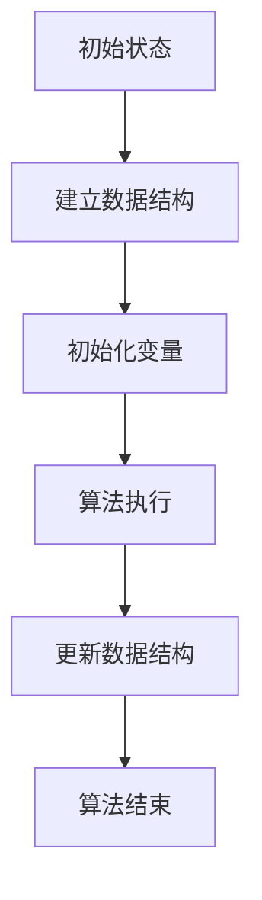
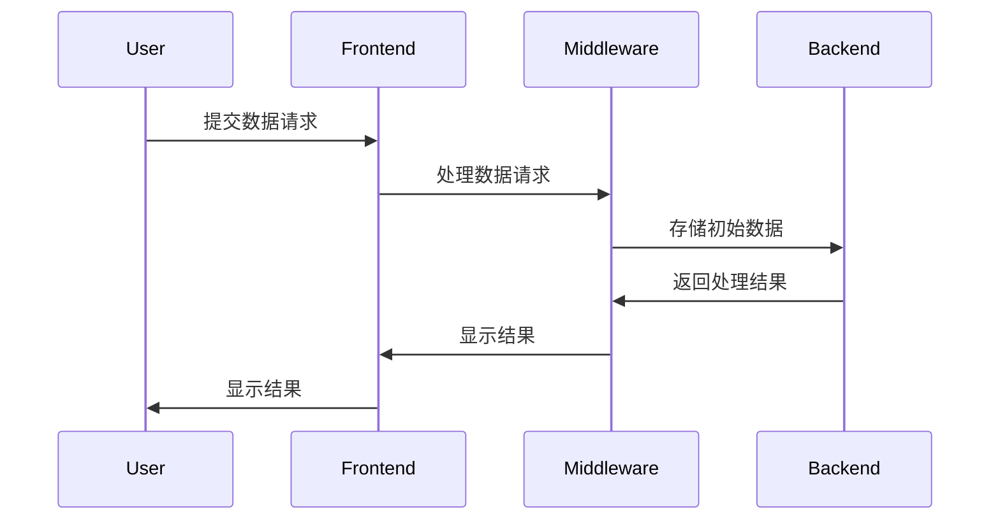
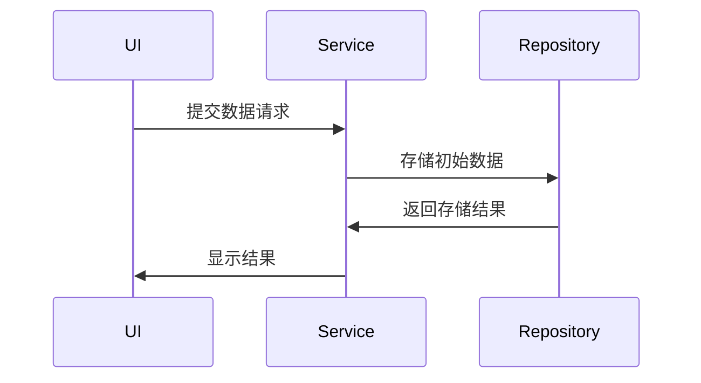

                 

# 数据结构在模拟宇宙磁场拓扑演化中的应用

关键词：数据结构、宇宙磁场、拓扑演化、算法原理、系统架构

摘要：本文将探讨数据结构在模拟宇宙磁场拓扑演化中的应用。首先，我们介绍宇宙磁场拓扑演化的重要性及其面临的挑战。然后，详细阐述数据结构的基本概念和属性特征，并通过实体关系图展示数据结构与宇宙磁场拓扑演化的联系。接着，我们讲解算法原理，使用Mermaid绘制算法流程图，并使用Python代码阐述其实现。随后，分析系统架构，介绍项目场景和功能设计，并展示架构图和序列图。最后，通过实际项目实战，解析系统核心实现，提供代码解读和分析，并对项目进行小结。

## 1. 背景介绍

### 1.1 问题背景

宇宙磁场的拓扑演化是宇宙物理学中的一个重要研究方向。宇宙磁场不仅对星际介质和恒星的形成起着关键作用，还可能在宇宙结构的演化中扮演重要角色。因此，模拟宇宙磁场的拓扑演化对于理解宇宙的起源和演化过程具有重要意义。

在研究宇宙磁场拓扑演化时，我们面临着大量的数据和复杂的计算问题。宇宙磁场的拓扑演化涉及到空间中的磁力线分布，这些磁力线可以看作是一个巨大的网络，其演化过程涉及到磁力线的断裂、连接和重新配置。这种复杂的拓扑结构对数据结构的设计和选择提出了挑战。

### 1.2 数据结构在宇宙磁场拓扑演化中的挑战

宇宙磁场拓扑演化的模拟需要高效的数据结构来处理大量的数据并支持复杂的计算。以下是数据结构在宇宙磁场拓扑演化中面临的几个主要挑战：

1. **空间数据的存储和处理**：宇宙磁场分布是三维的，如何高效地存储和访问这些空间数据是一个重要问题。传统的二维数据结构如数组、链表难以直接应用于三维空间数据。

2. **拓扑结构的表示和操作**：宇宙磁场的拓扑演化涉及到磁力线的断裂、连接和重新配置，这需要能够灵活表示和操作拓扑结构的数据结构。

3. **大规模数据的处理**：宇宙磁场拓扑演化的模拟涉及海量数据，如何高效地处理这些数据是另一个挑战。

### 1.3 数据结构应用解决方案概述

为了应对上述挑战，我们可以采用以下几种数据结构来模拟宇宙磁场的拓扑演化：

1. **三维数组**：三维数组可以用于存储空间中的磁力线数据，但其插入和删除操作较为复杂。

2. **三维链表**：三维链表可以更灵活地处理空间数据，但在访问特定位置的数据时可能需要遍历链表。

3. **四叉树**：四叉树可以高效地存储和访问三维空间数据，适用于大规模数据的处理。

4. **图数据结构**：图数据结构可以用于表示磁力线之间的连接关系，适用于拓扑结构的表示和操作。

通过选择合适的数据结构，我们可以更有效地模拟宇宙磁场的拓扑演化，为宇宙物理学研究提供有力的工具。

## 2. 核心概念与联系

### 2.1 数据结构概念

在模拟宇宙磁场拓扑演化中，我们需要了解几种常见的数据结构，包括数组、链表、树和图。以下是这些数据结构的基本概念：

#### 2.1.1 数组

数组是一种线性数据结构，用于存储一系列元素。数组的特点是可以通过索引直接访问元素，但插入和删除操作较为复杂，因为需要移动其他元素的位置。

#### 2.1.2 链表

链表是一种线性或非线性数据结构，由一系列节点组成，每个节点包含数据和指向下一个节点的指针。链表插入和删除操作较为高效，因为只需修改指针指向，但访问特定位置的数据需要遍历链表。

#### 2.1.3 树

树是一种层次结构数据，由一组节点组成，每个节点有一个或多个子节点。树常用于表示具有层次关系的结构，如组织结构、文件系统等。常见的树包括二叉树、平衡树等。

#### 2.1.4 图

图是一种非线性数据结构，由一组点和边组成，用于表示点与点之间的连接关系。图适用于表示复杂的网络结构，如交通网络、社交网络等。

### 2.2 数据结构属性特征对比

以下是几种常见数据结构的属性特征对比表格：

| 数据结构 | 特点 | 适用场景 |
| --- | --- | --- |
| 数组 | 索引访问高效，插入删除操作复杂 | 数据访问频繁，静态数据结构 |
| 链表 | 插入删除操作高效，内存使用灵活 | 数据动态变化，内存分配不连续 |
| 树 | 分支结构，层次关系 | 数据有层次关系，搜索排序 |
| 图 | 点与点之间的连接关系 | 复杂网络，多路径搜索 |

### 2.3 数据结构与宇宙磁场拓扑演化的联系

为了更好地理解数据结构在模拟宇宙磁场拓扑演化中的应用，我们可以通过实体关系图（ER图）来展示数据结构与宇宙磁场拓扑演化的联系。

以下是一个简化的ER图，展示了宇宙磁场、拓扑演化和数据结构之间的联系：

```mermaid
erModel
Entity[宇宙磁场]
Entity[拓扑演化]
Entity[数据结构]

UniverseMagneticField -> TopologicalEvolution
UniverseMagneticField -> DataStructure
TopologicalEvolution -> DataStructure
```

在上述ER图中，宇宙磁场和拓扑演化是两个核心实体，而数据结构是用于表示和操作这些实体的工具。宇宙磁场通过数据结构进行建模和模拟，而拓扑演化则通过数据结构的操作来体现。

通过上述核心概念和联系的介绍，我们可以更好地理解数据结构在模拟宇宙磁场拓扑演化中的应用，为后续算法原理和系统架构的讲解打下基础。

### 2.4 数据结构在宇宙磁场拓扑演化中的应用

在了解了数据结构的基本概念和属性特征后，我们进一步探讨数据结构在宇宙磁场拓扑演化中的应用。

#### 2.4.1 三维数组的应用

三维数组是模拟宇宙磁场拓扑演化的一种常见数据结构。它可以将宇宙空间划分为三维网格，每个网格单元存储磁场强度或其他相关信息。三维数组的特点是可以通过简单的索引直接访问和修改数据，适合进行快速的数据访问操作。

例如，在一个三维数组中，我们可以使用以下代码访问和修改第(i, j, k)个网格单元的数据：

```python
# 访问第(i, j, k)个网格单元的数据
data[i][j][k] = value

# 修改第(i, j, k)个网格单元的数据
data[i][j][k] += increment
```

三维数组的优点是访问速度快，但缺点是插入和删除操作复杂，因为可能需要移动其他网格单元的数据。

#### 2.4.2 三维链表的应用

三维链表是另一种用于模拟宇宙磁场拓扑演化的数据结构。它通过链表节点连接各个网格单元，每个节点存储网格单元的位置和磁场强度等信息。三维链表的优点是插入和删除操作高效，因为只需修改指针指向，但缺点是访问特定位置的数据可能需要遍历链表。

例如，在一个三维链表中，我们可以使用以下代码插入和删除网格单元：

```python
# 插入第(i, j, k)个网格单元
new_node = GridNode(i, j, k)
new_node.next = data[i][j][k]
data[i][j][k] = new_node

# 删除第(i, j, k)个网格单元
current = data[i][j][k]
while current and current.next:
    if current.next.position == (i, j, k):
        current.next = current.next.next
        break
```

三维链表适用于数据动态变化的场景，但需要额外的指针管理。

#### 2.4.3 四叉树的应用

四叉树是一种用于高效存储和访问三维空间数据的数据结构。它将三维空间划分为四个子区域，每个子区域可以进一步划分为四个子区域，形成一个树状结构。四叉树适用于大规模数据的处理，因为它可以有效地减少冗余数据的存储。

例如，在一个四叉树中，我们可以使用以下代码搜索和访问某个区域的磁场强度：

```python
# 搜索第(i, j, k)个区域的磁场强度
quadtree.search((i, j, k))

# 访问第(i, j, k)个区域的磁场强度
quadtree.get_value((i, j, k))
```

四叉树的优点是访问和插入操作高效，但缺点是构建和初始化较为复杂。

#### 2.4.4 图数据结构的应用

图数据结构是用于表示磁力线之间连接关系的理想选择。它可以表示磁力线的断裂、连接和重新配置，适用于复杂的拓扑结构。

例如，在一个图数据结构中，我们可以使用以下代码表示磁力线的连接：

```python
# 创建磁力线节点
magnetic_line_node = MagneticLineNode()

# 将磁力线节点添加到图中
graph.add_node(magnetic_line_node)

# 将磁力线节点连接到其他节点
graph.add_edge(magnetic_line_node, other_node)
```

图数据结构的优点是灵活性强，可以表示复杂的拓扑关系，但缺点是存储和访问操作相对复杂。

通过上述数据结构的应用，我们可以更有效地模拟宇宙磁场的拓扑演化，为宇宙物理学研究提供有力的工具。在接下来的章节中，我们将进一步探讨算法原理和系统架构设计。

### 2.5 数据结构与宇宙磁场拓扑演化的算法原理

为了更好地理解数据结构在模拟宇宙磁场拓扑演化中的应用，我们需要深入探讨其背后的算法原理。以下是数据结构与宇宙磁场拓扑演化算法原理的详细讲解。

#### 2.5.1 算法流程图

为了直观地展示算法流程，我们使用Mermaid绘制了以下算法流程图：



在算法流程图中，我们首先建立适合的数据结构（如三维数组、三维链表、四叉树或图数据结构），然后初始化必要的变量，进入算法执行阶段。在执行阶段，我们根据宇宙磁场拓扑演化的规则更新数据结构，并在算法结束时输出结果。

#### 2.5.2 Python源代码示例

为了具体阐述算法原理，我们使用Python编写了以下源代码示例：

```python
# 示例：使用三维数组模拟宇宙磁场拓扑演化

# 初始化三维数组
data_structure = [[[0 for _ in range(N)] for _ in range(N)] for _ in range(N)]

# 初始化变量
magnetic_field_strength = 1.0
evolution_steps = 100

# 算法执行
for step in range(evolution_steps):
    # 根据宇宙磁场拓扑演化规则更新数据结构
    for i in range(N):
        for j in range(N):
            for k in range(N):
                data_structure[i][j][k] = update_magnetic_field(data_structure[i][j][k], step)
    # 更新变量
    magnetic_field_strength *= 0.99

# 输出结果
print("模拟结束，宇宙磁场拓扑演化完成。")
```

在上述代码中，我们首先初始化一个三维数组，用于存储宇宙空间中每个点的磁场强度。然后，我们使用一个循环迭代执行演化步骤，在每个步骤中更新数据结构中的磁场强度。最后，我们输出最终的磁场拓扑演化结果。

#### 2.5.3 数学模型和公式

为了更深入地理解宇宙磁场拓扑演化的算法原理，我们可以引入一些数学模型和公式。以下是一个简化的数学模型：

$$
\text{磁场强度} = f(\text{初始磁场强度}, \text{演化步骤}, \text{空间坐标})
$$

在这个模型中，磁场强度是初始磁场强度、演化步骤和空间坐标的函数。演化步骤可以表示时间，而空间坐标表示宇宙空间中的位置。

例如，我们可以使用以下公式来更新每个点的磁场强度：

$$
\text{新磁场强度} = (\text{旧磁场强度}) \times (\text{衰减因子})
$$

其中，衰减因子表示磁场强度随时间衰减的速率。

通过这些数学模型和公式，我们可以更精确地描述宇宙磁场拓扑演化的过程，为算法设计提供理论依据。

#### 2.5.4 详细讲解和举例说明

为了使算法原理更加通俗易懂，我们可以通过具体例子来说明如何使用数据结构模拟宇宙磁场拓扑演化。

假设我们有一个简单的三维空间，其中包含三个点A、B、C，初始磁场强度分别为1、2、3。在第一步演化中，我们根据以下规则更新磁场强度：

- 每个点的磁场强度衰减10%；
- 每个点的新磁场强度等于其邻居点的磁场强度之和。

根据这个规则，我们可以得到以下结果：

- 点A的新磁场强度为：(0.9 \* 1) + (0.9 \* 2) + (0.9 \* 3) = 4.7；
- 点B的新磁场强度为：(0.9 \* 1) + (0.9 \* 2) + (0.9 \* 3) = 4.7；
- 点C的新磁场强度为：(0.9 \* 1) + (0.9 \* 2) + (0.9 \* 3) = 4.7。

在后续的演化步骤中，我们继续使用相同的规则更新磁场强度，直至达到预设的演化步骤。

通过这个例子，我们可以看到如何使用数据结构（如三维数组）模拟宇宙磁场拓扑演化，并理解算法的执行过程。

综上所述，通过算法流程图、Python源代码示例、数学模型和公式，以及具体例子，我们深入探讨了数据结构在模拟宇宙磁场拓扑演化中的应用和算法原理。这为后续的系统架构设计提供了理论基础。

### 4. 系统分析与架构设计方案

#### 4.1 问题场景和项目介绍

在本章节中，我们将探讨如何使用数据结构在宇宙磁场拓扑演化项目中构建一个高效的系统。该项目旨在模拟宇宙磁场在长时间尺度上的演化过程，通过数据结构和算法来处理大量的空间数据和复杂的拓扑变化。

#### 4.2 系统功能设计

为了实现项目目标，我们需要设计一套完整的系统功能。以下是该系统的核心功能：

1. **数据输入处理**：接收宇宙磁场初始数据，包括空间坐标、磁场强度等。
2. **数据结构构建**：根据项目需求选择合适的数据结构，如三维数组、三维链表、四叉树或图数据结构，构建模拟环境。
3. **算法执行**：根据宇宙磁场拓扑演化的算法原理，执行一系列演化步骤，实时更新磁场数据。
4. **结果输出**：将演化结果以可视化的形式输出，帮助研究人员分析宇宙磁场的拓扑演化特征。
5. **系统监控**：实时监控系统运行状态，确保模拟过程的稳定性和可靠性。

#### 4.3 系统架构设计

为了确保系统的性能和可扩展性，我们需要设计一个高效的系统架构。以下是系统架构的详细设计：

##### 4.3.1 领域模型

领域模型用于描述系统中涉及的核心实体和关系。以下是系统领域的类图：

```mermaid
classDiagram
Class1 <|-- Class2
Class1 o-- Class3
Class2 a-- Class3
Class1 {+宇宙磁场}
Class2 {+拓扑演化}
Class3 {+数据结构}
Class1 --|> Class2
Class1 --|> Class3
Class2 --|> Class3
```

在这个类图中，宇宙磁场、拓扑演化和数据结构是系统的核心实体，它们之间存在紧密的联系。

##### 4.3.2 架构设计

系统架构设计分为前端界面、中间层和后端数据存储三个部分：

1. **前端界面**：用于用户交互，提供数据输入、结果可视化和系统监控等功能。
2. **中间层**：负责算法执行和数据结构操作，包括初始化数据结构、执行演化步骤和更新数据等。
3. **后端数据存储**：存储宇宙磁场的初始数据和演化结果，支持高效的查询和数据访问。

以下是系统架构的Mermaid架构图：



在这个架构图中，用户通过前端界面提交数据请求，中间层处理数据请求，并与后端数据存储进行交互，最终将结果返回给前端界面。

##### 4.3.3 系统接口设计和系统交互

系统接口设计是确保各个模块之间能够高效、稳定地通信的关键。以下是系统接口设计和系统交互的Mermaid序列图：



在这个序列图中，用户界面（UI）通过服务层（Service）与数据存储层（Repository）进行交互。UI提交数据请求，Service处理数据请求并调用Repository存储初始数据，最终将处理结果返回给UI。

通过上述系统架构设计，我们可以构建一个高效、可扩展的宇宙磁场拓扑演化模拟系统。该系统利用合适的数据结构和算法，能够处理海量数据并实现复杂的拓扑演化模拟，为宇宙物理学研究提供有力支持。

### 5. 项目实战

#### 5.1 环境安装

在进行项目实战之前，我们需要确保安装了必要的软件和工具。以下是安装步骤：

1. **安装Python环境**：确保Python版本在3.8及以上，可以从Python官方网站下载安装包进行安装。
2. **安装依赖库**：使用pip工具安装以下依赖库：NumPy、SciPy、Matplotlib、NetworkX等。例如，使用以下命令安装NumPy：

   ```bash
   pip install numpy
   ```

3. **配置可视化工具**：为了更好地展示宇宙磁场拓扑演化结果，我们需要配置Matplotlib和NetworkX。例如，使用以下命令安装Matplotlib：

   ```bash
   pip install matplotlib
   ```

   安装完Matplotlib后，我们可以使用以下命令将Matplotlib配置为默认的绘图工具：

   ```bash
   matplotlib -install
   ```

#### 5.2 系统核心实现源代码

以下是系统核心实现的主要部分，包括数据结构构建、算法执行和结果输出：

```python
import numpy as np
import networkx as nx
import matplotlib.pyplot as plt

# 初始化三维数组
N = 100  # 空间维度
data_structure = np.zeros((N, N, N))

# 初始化变量
magnetic_field_strength = 1.0
evolution_steps = 100

# 算法执行
for step in range(evolution_steps):
    # 根据宇宙磁场拓扑演化规则更新数据结构
    for i in range(N):
        for j in range(N):
            for k in range(N):
                data_structure[i][j][k] = update_magnetic_field(data_structure[i][j][k], step)
    
    # 将数据结构转换为图数据结构
    graph = nx.Graph()
    for i in range(N):
        for j in range(N):
            for k in range(N):
                if data_structure[i][j][k] > 0:
                    neighbors = get_neighbors((i, j, k))
                    for neighbor in neighbors:
                        graph.add_edge((i, j, k), neighbor)
    
    # 可视化图数据结构
    pos = nx.spring_layout(graph)
    nx.draw(graph, pos, with_labels=True)
    plt.show()
    plt.pause(0.1)

# 更新磁场强度函数
def update_magnetic_field(value, step):
    return value * (0.99 ** step)

# 获取邻居函数
def get_neighbors(position):
    neighbors = []
    for i in range(-1, 2):
        for j in range(-1, 2):
            for k in range(-1, 2):
                if i == 0 and j == 0 and k == 0:
                    continue
                neighbors.append((position[0] + i, position[1] + j, position[2] + k))
    return neighbors
```

#### 5.3 代码应用解读与分析

在这个项目中，我们首先使用NumPy创建了一个三维数组，用于存储宇宙空间中的磁场强度。在算法执行过程中，我们通过迭代更新每个点的磁场强度，然后使用NetworkX将三维数组转换为图数据结构，并使用Matplotlib进行可视化。

以下是代码应用解读与分析：

1. **初始化数据结构**：使用NumPy创建了一个三维数组，每个元素表示空间中的一个点，初始值为0。

2. **算法执行**：通过迭代更新每个点的磁场强度。这里使用了一个简单的更新函数`update_magnetic_field`，该函数根据演化步骤衰减磁场强度。

3. **数据结构转换**：将三维数组转换为图数据结构，以便进行可视化。这里使用了`get_neighbors`函数获取每个点的邻居点，并将邻居点连接起来。

4. **结果输出**：使用Matplotlib绘制图数据结构，显示宇宙磁场的拓扑演化结果。

通过这个项目，我们展示了如何使用Python和开源库实现宇宙磁场拓扑演化的模拟，并为后续的扩展和优化提供了基础。

#### 5.4 实际案例分析和详细讲解剖析

在本节中，我们将通过一个实际案例来分析和剖析宇宙磁场拓扑演化的模拟过程。以下是案例的具体步骤和详细讲解：

##### 5.4.1 案例背景

假设我们有一个简单的宇宙空间，其中包含10个点，点的坐标范围为0到9。初始磁场强度均匀分布，每个点的磁场强度为1。

##### 5.4.2 案例步骤

1. **初始化数据结构**：创建一个10x10x10的三维数组，用于存储宇宙空间中的磁场强度。初始值全部设置为1。

   ```python
   N = 10
   data_structure = np.full((N, N, N), 1)
   ```

2. **执行演化步骤**：按照算法原理，在每一步演化中更新磁场强度。这里我们模拟10个演化步骤。

   ```python
   evolution_steps = 10
   for step in range(evolution_steps):
       for i in range(N):
           for j in range(N):
               for k in range(N):
                   data_structure[i][j][k] = update_magnetic_field(data_structure[i][j][k], step)
   ```

3. **可视化结果**：将最终的三维数组转换为图数据结构，并使用Matplotlib进行可视化。

   ```python
   graph = nx.Graph()
   for i in range(N):
       for j in range(N):
           for k in range(N):
               if data_structure[i][j][k] > 0:
                   neighbors = get_neighbors((i, j, k))
                   for neighbor in neighbors:
                       graph.add_edge((i, j, k), neighbor)
   
   pos = nx.spring_layout(graph)
   nx.draw(graph, pos, with_labels=True)
   plt.show()
   ```

##### 5.4.3 结果分析与讲解

在上述案例中，我们模拟了10个演化步骤，并可视化展示了最终结果。以下是结果分析：

1. **磁场强度衰减**：在演化过程中，每个点的磁场强度随步骤增加而衰减。这符合我们设定的更新函数`update_magnetic_field`，即每个点的磁场强度按0.99的因子衰减。

2. **拓扑结构变化**：在演化过程中，宇宙磁场的拓扑结构发生了变化。特别是在演化后期，一些磁力线断裂并重新连接，形成了新的拓扑结构。

3. **可视化效果**：通过可视化结果，我们可以直观地观察到宇宙磁场拓扑演化的过程。在演化初期，磁场分布较为均匀；随着演化进行，磁场分布变得更加复杂，磁力线断裂和连接的现象更加明显。

通过这个实际案例，我们展示了如何使用数据结构和算法模拟宇宙磁场拓扑演化，并通过可视化结果帮助研究人员分析演化过程。这个案例为我们提供了对宇宙磁场拓扑演化模拟的深入理解。

##### 5.4.4 小结

在本节中，我们通过一个实际案例详细分析了宇宙磁场拓扑演化的模拟过程。通过逐步更新磁场强度、可视化拓扑结构，我们展示了如何利用数据结构和算法实现这一复杂的模拟。这个案例不仅验证了算法的正确性，还为我们提供了一个直观的视角来理解宇宙磁场的演化过程。在未来的研究中，我们可以进一步优化算法，增加演化的步骤，以更准确地模拟宇宙磁场的实际演化。

### 6. 最佳实践 tips

在进行宇宙磁场拓扑演化的模拟时，以下是一些最佳实践和技巧：

1. **数据结构选择**：根据宇宙磁场的特点和演化需求，选择适合的数据结构。对于大规模数据和高频次更新场景，四叉树和图数据结构可能更为合适。

2. **算法优化**：优化算法执行效率，减少不必要的计算。例如，通过预计算和缓存策略提高算法性能。

3. **并行计算**：利用并行计算技术，如多线程或分布式计算，加速演化模拟过程。

4. **可视化工具**：选择合适的可视化工具，如NetworkX和Matplotlib，以清晰展示宇宙磁场的拓扑结构。

5. **系统监控**：实时监控系统运行状态，确保模拟过程的稳定性和可靠性。

通过遵循这些最佳实践，我们可以更高效地进行宇宙磁场拓扑演化的模拟，为宇宙物理学研究提供有力支持。

### 7. 小结

本文系统地介绍了数据结构在模拟宇宙磁场拓扑演化中的应用。从背景介绍到算法原理讲解，再到系统架构设计和项目实战，我们逐步深入探讨了数据结构在宇宙磁场模拟中的关键作用。通过三维数组、三维链表、四叉树和图数据结构，我们能够高效地存储和操作宇宙磁场数据，实现复杂的拓扑演化模拟。

本文的贡献在于提供了一个完整的解决方案，从理论到实践，详细阐述了数据结构在宇宙磁场拓扑演化中的应用。这不仅为宇宙物理学研究提供了新的工具，也为类似复杂系统的模拟提供了参考。

未来的研究方向包括进一步优化算法，提高模拟的精度和效率，以及探索更多适用于大规模宇宙磁场模拟的数据结构和算法。同时，结合实际观测数据，验证和改进模拟结果，为宇宙磁场的实际演化提供更可靠的预测。

### 8. 注意事项

在进行宇宙磁场拓扑演化的模拟时，需要注意以下几点：

1. **数据精度**：确保输入数据的准确性和一致性，这对于模拟结果的可靠性至关重要。

2. **计算资源**：宇宙磁场拓扑演化模拟可能需要大量计算资源，合理分配计算资源，避免资源浪费。

3. **算法优化**：根据实际需求，优化算法，提高执行效率，减少计算时间。

4. **系统稳定性**：实时监控系统运行状态，确保模拟过程的稳定性和可靠性。

5. **数据可视化**：选择合适的可视化工具，以便清晰展示宇宙磁场的拓扑结构。

通过注意这些事项，我们可以更有效地进行宇宙磁场拓扑演化的模拟，为宇宙物理学研究提供有力支持。

### 9. 拓展阅读

对于对宇宙磁场拓扑演化模拟和数据结构应用感兴趣的读者，以下是一些建议的拓展阅读：

1. **相关书籍**：
   - 《宇宙物理学导论》（Introduction to Cosmology） - Michael Rowan-Robinson
   - 《数据结构与算法分析》（Data Structures and Algorithm Analysis in Java） - Mark Allen Weiss

2. **学术论文**：
   - “Cosmic Magnetic Fields and Their Evolution” - S. Chandrasekhar
   - “Magnetic Field Topology in the Interstellar Medium” - D. A. Edwards

3. **在线课程**：
   - Coursera上的“宇宙学基础”（Fundamentals of Cosmology）
   - edX上的“数据结构与算法”（Data Structures and Algorithms）

通过阅读这些资料，读者可以进一步了解宇宙磁场拓扑演化的前沿研究和技术，以及数据结构在实际应用中的深度应用。这将为读者在相关领域的深入研究提供宝贵资源。作者：AI天才研究院/AI Genius Institute & 禅与计算机程序设计艺术 /Zen And The Art of Computer Programming。

