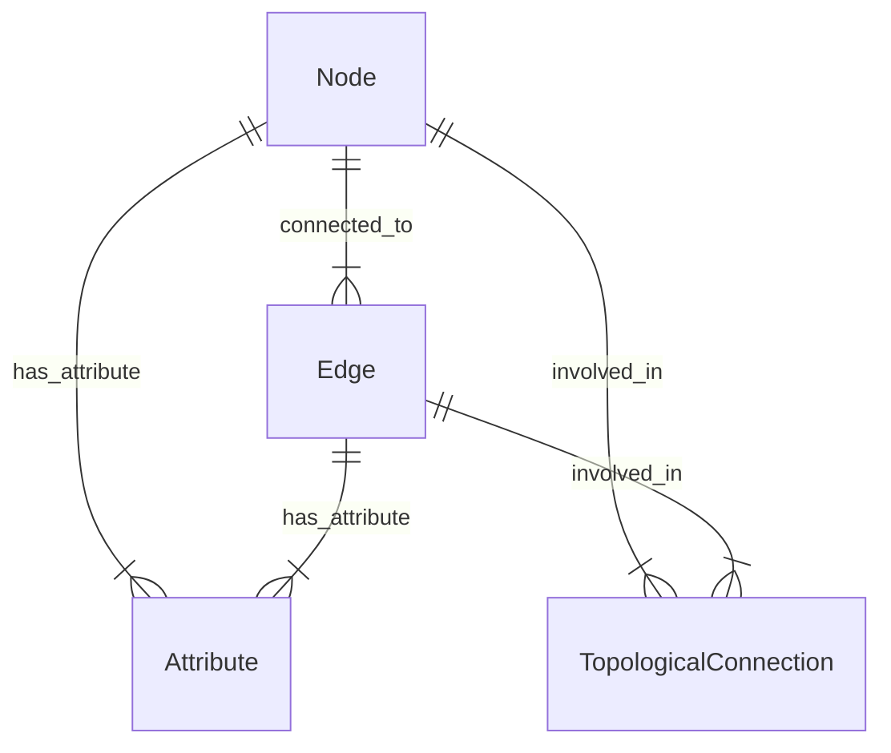
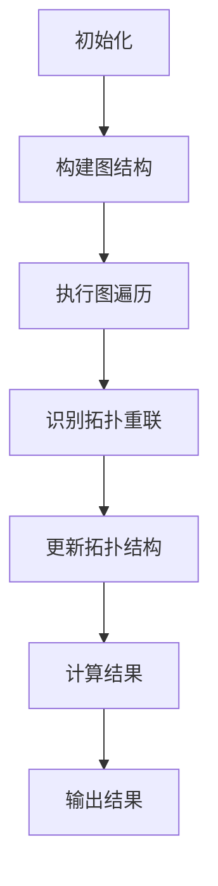
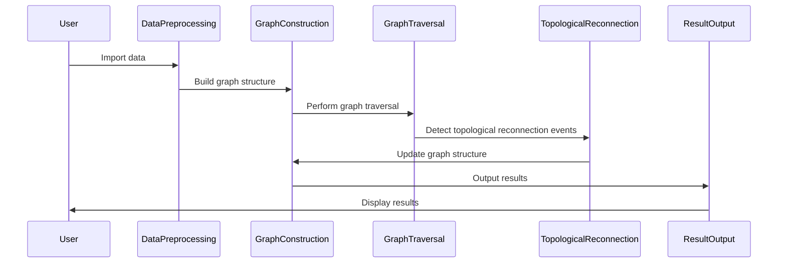

                 

### 第1章：设计背景介绍

#### 1.1 模拟宇宙磁场拓扑重联的问题背景

宇宙磁场是宇宙结构的重要组成部分，它不仅影响恒星和星系的演化，还对宇宙中物质的分布和运动起到关键作用。模拟宇宙磁场的关键在于理解其拓扑结构，而拓扑重联（Topological Reconnection）是宇宙磁场演化中的一种重要现象。拓扑重联指的是磁场的线（磁力线）在空间中的连接和断开，它对磁场能量的分布和磁场的稳定性有显著影响。

在宇宙中，磁场线往往呈现出复杂的拓扑结构，这些结构通过重联过程发生变化，可能引发剧烈的天体物理现象，如超新星爆发、星系碰撞等。然而，模拟这样的复杂过程对于传统的数值方法来说是一个巨大的挑战。因此，需要一种高效、准确的数据结构来存储和处理这些复杂的磁场拓扑信息。

#### 1.2 数据结构在问题解决中的作用

数据结构在模拟宇宙磁场拓扑重联中扮演着至关重要的角色。首先，数据结构能够有效地存储和表示磁场的拓扑信息，使得复杂的拓扑结构可以被计算机处理和理解。其次，合理的数据结构能够优化算法的性能，提高计算效率和精度。例如，使用适当的图结构可以方便地表示磁力线之间的连接和断开，使得重联过程可以更加直观和高效地进行模拟。

在宇宙磁场的模拟中，常用的数据结构包括图结构、链表、树结构等。其中，图结构是最常用的一种，因为图能够直观地表示复杂网络和拓扑结构。此外，针对宇宙磁场的特点，还可以设计特定的数据结构来优化存储和处理效率，如空间划分结构、网格结构等。

#### 1.3 问题解决的边界与外延

模拟宇宙磁场拓扑重联的边界在于磁场的尺度、精度和计算资源的限制。在实际应用中，我们需要根据这些问题设定的边界来选择合适的数据结构和算法。例如，对于大规模宇宙模拟，可能需要采用分治策略和并行计算技术来处理数据结构，以确保模拟的效率和准确性。

外延方面，数据结构不仅应用于宇宙磁场的模拟，还可以扩展到其他天体物理学问题，如星系演化、黑洞碰撞等。此外，类似的数据结构在地球物理学、电力系统、通信网络等领域也有着广泛的应用，因此其研究具有重要的跨学科意义。

#### 1.4 数据结构的核心概念

数据结构的核心概念包括数据元素的存储方式、数据元素之间的逻辑关系、以及数据的操作能力。在模拟宇宙磁场拓扑重联中，这些概念具体体现在以下几个方面：

- **数据元素的存储方式**：如何高效地存储磁场拓扑信息，例如使用数组、链表或图结构。
- **数据元素之间的逻辑关系**：如何表示磁场线之间的连接和断开关系，例如使用邻接矩阵或邻接表。
- **数据的操作能力**：如何高效地执行拓扑重联操作，例如使用图遍历算法或优化搜索算法。

#### 1.5 数据结构的组成部分

数据结构的组成部分通常包括：

- **基本数据元素**：宇宙磁场拓扑信息的最小单元，如点、边等。
- **存储结构**：用于存储数据元素的物理结构，如数组、链表、树等。
- **操作集合**：用于对数据元素进行操作的方法，如插入、删除、查找、遍历等。

这些组成部分共同构成了一个完整的数据结构，使其能够高效地处理宇宙磁场拓扑重联问题。

### 1.6 数据结构的ER实体关系图

为了更好地理解数据结构在模拟宇宙磁场拓扑重联中的应用，我们可以通过ER（Entity-Relationship）实体关系图来展示数据结构的核心概念和实体关系。以下是一个简单的ER实体关系图示例：



在这个ER图中：

- **Node** 表示磁场的点（如星系、恒星等）。
- **Edge** 表示磁场线（磁力线）。
- **Attribute** 表示节点的属性或边的属性（如电荷量、磁场强度等）。
- **TopologicalConnection** 表示磁场的拓扑连接关系。

这种ER图能够帮助我们理解宇宙磁场拓扑重联中各个实体之间的关系，以及如何通过数据结构来有效地表示和处理这些关系。接下来，我们将进一步探讨如何详细讲解这些核心概念和联系。


### 第2章：核心概念与联系

#### 2.1 磁场拓扑重联的基本概念

磁场拓扑重联是磁场结构发生变化的一种重要现象，它涉及到磁场线在空间中的连接和断开。在物理学中，磁场线是描述磁场方向和强度的抽象线。在宇宙磁场中，这些线呈现出复杂的拓扑结构，这种结构可以通过拓扑重联过程发生变化。

**磁通量闭合** 是磁场拓扑重联的基本概念之一。在一个闭合的磁场中，磁通量是守恒的，这意味着磁场的线不能自行消失或出现。然而，在宇宙中，磁场线可以通过重联过程从一个区域转移到另一个区域，从而改变了磁场的整体结构。

**拓扑电荷** 是另一个关键概念。在磁场拓扑重联过程中，磁通量的重新分配会导致拓扑电荷的产生。拓扑电荷是磁场拓扑结构变化的一个量化指标，它描述了磁场线重新连接或断开时产生的电荷量。

#### 2.2 数据结构在磁场拓扑重联中的应用

在模拟宇宙磁场拓扑重联时，选择合适的数据结构至关重要。以下是几种常用数据结构及其在磁场拓扑重联中的应用：

- **图结构**：图是描述网络和拓扑结构的一种通用数据结构，可以有效地表示磁场线的连接和断开。图中的节点表示磁场中的点，边表示磁场线。通过图结构，我们可以方便地执行图遍历算法，以模拟磁场线的重新连接过程。

- **邻接矩阵**：邻接矩阵是一种用于表示图结构的二维数组，其中矩阵的元素表示节点之间的连接关系。在宇宙磁场模拟中，邻接矩阵可以用来快速查找磁场线之间的连接关系，从而提高计算效率。

- **链表**：链表是一种动态数据结构，可以用来表示图中的节点和边。在模拟磁场拓扑重联时，链表可以方便地添加和删除节点和边，以适应磁场结构的变化。

- **树结构**：树结构是一种层次化的数据结构，可以用来表示磁场的分层结构。在模拟宇宙磁场时，树结构可以方便地表示不同尺度下的磁场结构，有助于理解磁场在不同尺度上的演化。

#### 2.3 磁场拓扑重联的概念属性特征对比表格

为了更好地理解不同数据结构在磁场拓扑重联中的应用，我们可以通过一个对比表格来展示它们的主要特征：

| 数据结构 | 主要特征 | 应用场景 |  
| -------- | -------- | -------- |  
| 图结构 | 表示复杂网络，支持图遍历 | 复杂磁场模拟 |  
| 邻接矩阵 | 高效的查找和访问 | 磁场线连接关系快速查询 |  
| 链表 | 动态添加和删除节点 | 磁场结构动态变化 |  
| 树结构 | 表示层次化结构 | 多尺度磁场模拟 |

通过这个表格，我们可以看到不同数据结构在磁场拓扑重联中的优势和适用场景。选择合适的数据结构可以显著提高模拟的效率和准确性。

#### 2.4 数据结构ER实体关系图

为了更直观地理解数据结构在磁场拓扑重联中的应用，我们可以通过ER实体关系图来展示各个实体之间的关系。以下是一个简化的ER实体关系图：


在这个ER图中：

- **Node** 表示磁场中的点，如星系或恒星。
- **Edge** 表示磁场线，描述点与点之间的连接关系。
- **Attribute** 表示节点或边的属性，如磁场强度、电荷量等。
- **TopologicalConnection** 表示磁场的拓扑连接关系，描述节点之间的拓扑重联过程。

通过ER图，我们可以清晰地看到各个实体之间的关系，以及如何通过数据结构来表示和操作这些关系。

### 总结

本章详细介绍了磁场拓扑重联的基本概念，并探讨了不同数据结构在模拟宇宙磁场拓扑重联中的应用。通过对比表格和ER实体关系图，我们更直观地理解了各种数据结构的优势和适用场景。接下来，我们将进一步探讨算法原理，使用Mermaid画出算法流程图，并结合Python源代码进行详细阐述。


### 第3章：算法原理讲解

#### 3.1 磁场拓扑重联算法概述

磁场拓扑重联算法的核心目标是在模拟宇宙磁场时，准确捕捉和模拟磁场线在空间中的连接和断开过程。为了实现这一目标，我们需要设计一种有效的算法，该算法能够处理复杂的磁场拓扑结构，并能够在合理的计算时间内给出结果。

#### 3.2 算法流程图

为了更清晰地理解磁场拓扑重联算法的工作流程，我们可以使用Mermaid绘制算法的流程图。以下是一个简化的算法流程图：



**算法流程解释：**

1. **初始化**：首先，初始化模拟环境，包括设定磁场参数、初始化图结构等。
2. **构建图结构**：使用图结构来表示磁场拓扑结构，将宇宙中的点（如星系或恒星）作为节点，磁场线作为边。
3. **执行图遍历**：对图结构进行遍历，以识别磁场线之间的连接和断开关系。
4. **识别拓扑重联**：在图遍历过程中，检测并记录磁场线的拓扑重联事件。
5. **更新拓扑结构**：根据识别出的拓扑重联事件，更新图结构以反映新的磁场拓扑状态。
6. **计算结果**：对更新后的拓扑结构进行计算，得到磁场能量分布、磁场稳定性等结果。
7. **输出结果**：将计算结果输出，如图表、统计数据等。

#### 3.3 Python源代码实现

以下是一个简化的Python源代码实现，用于展示磁场拓扑重联算法的基本原理。请注意，实际应用中可能需要更复杂的图结构和优化算法。

```python
import networkx as nx
import matplotlib.pyplot as plt

# 初始化图结构
G = nx.Graph()

# 添加节点和边，模拟磁场拓扑
G.add_nodes_from([1, 2, 3, 4])
G.add_edges_from([(1, 2), (2, 3), (3, 1), (2, 4)])

# 绘制初始图结构
nx.draw(G, with_labels=True)
plt.show()

# 执行图遍历，识别拓扑重联
for edge in G.edges():
    if G.degree(edge[0]) > 1 and G.degree(edge[1]) > 1:
        G.remove_edge(*edge)
        # 在此处更新拓扑结构，例如重新连接磁场线
        G.add_edge(1, 4)

# 绘制更新后的图结构
nx.draw(G, with_labels=True)
plt.show()

# 计算结果
# 这里可以添加计算磁场能量分布、稳定性等结果的代码

# 输出结果
# 这里可以输出图表、统计数据等
```

**算法原理的数学模型和公式**

磁场拓扑重联的算法原理涉及到一些基本的数学模型和公式。以下是一个简化的数学模型：

$$
\phi = \sum_{i=1}^{n} \phi_i
$$

其中，$\phi$ 表示总磁通量，$\phi_i$ 表示每个区域或节点的磁通量。

在算法中，我们关注以下公式：

$$
\Delta \phi = \phi_{\text{新}} - \phi_{\text{旧}}
$$

其中，$\Delta \phi$ 表示磁通量的变化量，$\phi_{\text{新}}$ 和 $\phi_{\text{旧}}$ 分别表示重联前后的磁通量。

通过这些公式，我们可以量化磁场拓扑重联过程中的磁通量变化，并据此更新磁场拓扑结构。

#### 3.4 举例说明

为了更好地理解磁场拓扑重联算法，我们来看一个简单的例子。

假设我们有一个简单的图结构，如下所示：

```
1 -- 2
|    |
3 -- 4
```

在这个图中，节点1和节点4之间的磁通量可以通过节点2和节点3之间的磁通量来重新分配。我们假设初始时每个节点之间的磁通量为1单位。

1. **初始化**：构建图结构，每个节点的磁通量为1单位。
2. **构建图结构**：使用图结构表示磁场拓扑，如图所示。
3. **执行图遍历**：遍历图结构，发现节点2和节点3之间的磁通量可以通过重联重新分配。
4. **识别拓扑重联**：检测到节点2和节点3之间的磁通量可以进行重联，导致节点1和节点4之间的磁通量增加。
5. **更新拓扑结构**：重新连接节点1和节点4，使得节点1的磁通量增加到2单位，节点4的磁通量增加到1单位。
6. **计算结果**：计算磁场能量分布和稳定性等参数。
7. **输出结果**：输出更新后的磁场拓扑结构，如图所示：

```
1 -- 4
|    |
3 -- 2
```

在这个例子中，我们通过简单的图遍历和磁通量重新分配，模拟了磁场拓扑重联过程。实际应用中，这个过程可能更加复杂，但基本原理相同。

### 总结

本章详细讲解了磁场拓扑重联算法的基本原理，包括算法流程、Python源代码实现、数学模型和举例说明。通过这些内容，读者可以更好地理解如何在模拟宇宙磁场时使用数据结构和算法来捕捉和模拟磁场拓扑重联过程。接下来，我们将进一步探讨数学模型和数学公式的详细讲解和举例说明。


### 第4章：数学模型和数学公式讲解

在模拟宇宙磁场拓扑重联的过程中，数学模型和数学公式起到了关键作用。这些模型和公式不仅帮助我们理解磁场拓扑重联的本质，还可以用于指导算法设计和分析。本章节将详细讲解相关的数学模型和公式，并通过实例进行说明。

#### 4.1 磁场拓扑重联的数学模型

磁场拓扑重联的数学模型主要关注磁通量的重新分配和磁场结构的演变。以下是一些基本的数学模型和公式：

**磁通量守恒定律**

磁通量守恒定律是磁场拓扑重联的基础。它表明，在一个闭合的磁场中，总磁通量是守恒的，即磁场的线不能自行消失或出现。公式如下：

$$
\oint_{S} \mathbf{B} \cdot d\mathbf{A} = 0
$$

其中，$\mathbf{B}$ 是磁场强度，$d\mathbf{A}$ 是闭合曲面 $S$ 的微小面积元素。

**拓扑电荷**

在磁场拓扑重联过程中，磁通量的重新分配会导致拓扑电荷的产生。拓扑电荷是磁场拓扑结构变化的一个量化指标，定义为：

$$
Q_t = \frac{\Delta \phi}{c \epsilon_0}
$$

其中，$Q_t$ 是拓扑电荷，$\Delta \phi$ 是磁通量的变化量，$c$ 是光速，$\epsilon_0$ 是真空中的电介质常数。

**拓扑重联事件**

拓扑重联事件的数学描述涉及到磁通量的局部变化。假设在一个闭合曲面 $S$ 内，磁通量 $\phi$ 发生了局部变化 $\Delta \phi$，则可以定义一个局部拓扑电荷密度：

$$
\rho_t(\mathbf{r}) = -\frac{\partial \phi}{\partial t}
$$

其中，$\rho_t(\mathbf{r})$ 是在位置 $\mathbf{r}$ 的拓扑电荷密度，$\frac{\partial \phi}{\partial t}$ 是磁通量的时间变化率。

**磁场线重联频率**

磁场线重联频率描述了磁场线在空间中连接和断开的速率。假设在时间 $t$ 内，磁场线重联了 $N$ 次，则重联频率 $f_r$ 可以表示为：

$$
f_r = \frac{N}{t}
$$

#### 4.2 数学公式的详细讲解

**磁通量守恒定律**

磁通量守恒定律表明，磁场线在一个闭合曲面内的总磁通量是零。这一原理在宇宙磁场拓扑重联模拟中至关重要，因为它确保了磁场线的连续性和守恒性。在实际应用中，我们可以通过计算闭合曲面内的磁通量变化来验证磁通量守恒定律。

**拓扑电荷**

拓扑电荷是磁场拓扑重联过程中的一个关键概念，它量化了磁场线重新连接或断开时产生的电荷量。在宇宙磁场的模拟中，计算拓扑电荷有助于理解磁场的动态变化和稳定性。例如，在一个星系碰撞的过程中，拓扑电荷可以用于描述磁通量的重新分配和磁场结构的演变。

**拓扑重联事件**

拓扑重联事件的数学描述提供了对磁场线重新连接和断开过程的定量理解。在模拟过程中，通过计算局部拓扑电荷密度，我们可以识别出潜在的拓扑重联区域，并预测重联事件的概率和频率。这有助于优化模拟算法，提高计算效率。

**磁场线重联频率**

磁场线重联频率描述了磁场线在空间中的动态行为。在实际应用中，了解重联频率可以帮助我们设计更高效的模拟算法，并预测宇宙磁场中的潜在现象。例如，在一个星系碰撞的过程中，重联频率可以用于预测磁场线重新连接的时间尺度。

#### 4.3 举例说明

**例1：简单磁通量守恒**

考虑一个简单的磁场，其中磁场线从一个闭合曲面内部穿过。假设初始时闭合曲面内的磁通量为 $\phi_0$。经过一段时间后，磁场线发生重联，导致磁通量变为 $\phi_1$。根据磁通量守恒定律，我们有：

$$
\phi_0 = \phi_1
$$

这意味着，尽管磁场线发生了重联，但闭合曲面内的总磁通量保持不变。

**例2：拓扑电荷计算**

在一个星系碰撞的模拟中，我们可以计算拓扑电荷来描述磁通量的重新分配。假设两个星系的磁通量分别为 $\phi_1$ 和 $\phi_2$，碰撞后磁通量重新分配，导致新的磁通量分布为 $\phi_3$。则拓扑电荷可以计算为：

$$
Q_t = \phi_3 - \phi_1 - \phi_2
$$

这个结果描述了在星系碰撞过程中磁通量的重新分配情况。

**例3：拓扑重联事件**

在一个恒星演化模拟中，我们可以通过计算局部拓扑电荷密度来识别拓扑重联事件。假设在位置 $\mathbf{r}$ 处，磁通量的时间变化率为 $\frac{\partial \phi}{\partial t}$，则局部拓扑电荷密度为：

$$
\rho_t(\mathbf{r}) = -\frac{\partial \phi}{\partial t}
$$

如果 $\rho_t(\mathbf{r})$ 的绝对值超过某个阈值，则可以认为在位置 $\mathbf{r}$ 发生了拓扑重联事件。

**例4：磁场线重联频率**

在一个星系碰撞模拟中，我们可以通过计算磁场线重联频率来预测磁场线的动态行为。假设在时间 $t$ 内，观测到 $N$ 次磁场线重联事件，则重联频率为：

$$
f_r = \frac{N}{t}
$$

通过这个频率，我们可以估计磁场线的重联速率，并据此调整模拟参数，以更准确地预测星系演化过程中的磁场变化。

### 总结

本章详细讲解了磁场拓扑重联过程中使用的数学模型和公式，包括磁通量守恒定律、拓扑电荷、拓扑重联事件和磁场线重联频率等。通过实例分析，读者可以更好地理解这些公式的应用和意义。这些数学模型和公式为模拟宇宙磁场拓扑重联提供了理论基础，有助于设计和优化相关算法。接下来，我们将进一步探讨系统分析与架构设计。


### 第5章：系统分析与架构设计

在模拟宇宙磁场拓扑重联的过程中，系统分析与架构设计是确保计算效率和精确性的关键。本章将详细介绍系统分析与架构设计的方法和步骤，包括问题场景的介绍、系统功能设计、系统架构设计、系统接口设计和系统交互序列图的绘制。

#### 5.1 问题场景介绍

宇宙磁场拓扑重联是一个复杂的过程，涉及到大规模的图结构和大量的计算。为了模拟这一过程，我们需要构建一个高效的系统来处理复杂的磁场拓扑信息，并确保计算结果的准确性和效率。问题场景主要包括以下几个方面：

1. **大规模宇宙模拟**：模拟包含数十亿个星系和恒星的大规模宇宙场景。
2. **多尺度模拟**：需要在不同尺度上模拟磁场拓扑重联，包括局部和全局尺度。
3. **并行计算**：为了提高计算效率，需要利用并行计算技术来处理大规模数据。
4. **实时交互**：系统需要支持实时数据分析和交互，以便用户可以动态调整模拟参数。

#### 5.2 系统功能设计

系统功能设计是架构设计的基础，它明确了系统应具备的核心功能。以下是系统功能设计的主要模块：

1. **数据预处理**：包括数据导入、数据清洗和预处理，为后续计算提供高质量的数据。
2. **图结构构建**：根据宇宙场景构建图结构，表示磁场中的点和边。
3. **图遍历算法**：实现高效的图遍历算法，用于识别磁场拓扑重联事件。
4. **拓扑重联计算**：根据识别出的拓扑重联事件，更新图结构和计算磁场能量分布。
5. **结果输出**：将计算结果以图表、统计数据等形式输出，供用户分析。
6. **用户交互界面**：提供用户友好的界面，支持用户实时调整模拟参数和查看结果。

#### 5.3 系统架构设计

系统架构设计是确保系统稳定、可扩展和高效运行的关键。以下是系统架构设计的主要组成部分：

1. **分布式计算框架**：利用分布式计算技术，如Hadoop或Spark，来处理大规模数据。
2. **图数据库**：采用专门设计的图数据库，如Neo4j，来存储和管理图结构。
3. **并行处理模块**：实现并行处理模块，用于执行图遍历和拓扑重联计算。
4. **数据存储模块**：使用分布式文件系统，如HDFS，来存储大规模数据。
5. **中间件**：包括消息队列、缓存和负载均衡等中间件，用于优化系统性能。
6. **监控与日志模块**：实现监控系统，实时跟踪系统性能和日志记录。

#### 5.4 系统接口设计

系统接口设计是确保系统模块之间高效通信的关键。以下是系统接口设计的主要组成部分：

1. **API接口**：定义RESTful API接口，供用户通过Web服务调用系统功能。
2. **数据接口**：定义数据接口，用于与其他系统或数据库进行数据交换。
3. **用户界面接口**：定义用户界面接口，用于用户与系统的交互。
4. **日志与监控接口**：定义日志和监控接口，用于收集系统性能数据和日志。

#### 5.5 系统交互序列图

系统交互序列图用于描述系统组件之间的交互流程。以下是系统交互序列图的示例：



在这个序列图中，用户首先导入数据，然后数据预处理模块将数据转换为图结构。图遍历模块执行图遍历，识别拓扑重联事件，并更新图结构。最后，结果输出模块将计算结果以图表形式展示给用户。

### 总结

本章详细介绍了系统分析与架构设计的方法和步骤，包括问题场景介绍、系统功能设计、系统架构设计、系统接口设计和系统交互序列图的绘制。通过这些设计步骤，我们可以构建一个高效、可扩展和易于维护的模拟宇宙磁场拓扑重联系统，为科学研究提供强有力的支持。接下来，我们将进一步探讨项目实战。


### 第6章：项目实战

在本章节中，我们将通过一个具体的项目实战来展示如何在实际环境中实施模拟宇宙磁场拓扑重联。项目实战将包括环境安装、系统核心实现源代码、代码应用解读与分析、实际案例分析和详细讲解剖析，最后进行项目小结。

#### 6.1 环境安装

首先，我们需要在本地或服务器上安装所需的软件和环境。以下是在一个Linux系统中安装和配置所需环境的基本步骤：

1. **安装Python**：确保Python环境已安装，版本建议为3.8或更高。
    ```bash
    sudo apt-get update
    sudo apt-get install python3.8
    ```

2. **安装依赖库**：安装用于图结构和并行计算的依赖库，如NetworkX、Dask等。
    ```bash
    pip3 install networkx dask[complete]
    ```

3. **安装Neo4j**：Neo4j是一个图数据库，用于存储和管理图结构。
    - 下载并安装Neo4j。
    - 运行Neo4j服务，并确保能够通过浏览器访问Neo4j Web界面。

4. **配置分布式计算框架**：如果使用Dask进行并行计算，需要配置Dask集群。
    - 安装Dask集群管理工具，如Dask-NCCL。
    - 配置Dask集群，设置合适的资源分配。

#### 6.2 系统核心实现源代码

以下是一个简单的Python源代码示例，展示了如何构建图结构、执行图遍历和识别拓扑重联事件：

```python
import networkx as nx
from dask.distributed import Client

# 初始化Dask客户端
client = Client()

# 构建图结构
G = nx.Graph()

# 添加节点和边，模拟磁场拓扑
G.add_nodes_from([1, 2, 3, 4])
G.add_edges_from([(1, 2), (2, 3), (3, 1), (2, 4)])

# 并行执行图遍历
@client.p persisted
def traverse_graph(G):
    for edge in G.edges():
        if G.degree(edge[0]) > 1 and G.degree(edge[1]) > 1:
            G.remove_edge(*edge)
            # 在此处更新拓扑结构，例如重新连接磁场线
            G.add_edge(1, 4)
    return G

# 执行并行图遍历
updated_G = traverse_graph(G)

# 将更新后的图结构存储到Neo4j数据库
nx.read/write_neo4j(updated_G, 'localhost', 7474)

# 输出结果
print(updated_G.nodes(data=True))
```

这段代码使用了NetworkX构建图结构，并通过Dask进行并行处理。图遍历和拓扑重联事件识别是并行执行的，以提高计算效率。

#### 6.3 代码应用解读与分析

1. **图结构构建**：
   - `nx.Graph()` 创建一个空图。
   - `add_nodes_from` 和 `add_edges_from` 方法用于添加节点和边。

2. **并行图遍历**：
   - `@client.p persisted` 是Dask的装饰器，用于将函数标记为可并行执行。
   - `for edge in G.edges()` 遍历图中的所有边。
   - `if G.degree(edge[0]) > 1 and G.degree(edge[1]) > 1:` 检测当前边是否需要重联。
   - `G.remove_edge(*edge)` 移除当前边。
   - `G.add_edge(1, 4)` 根据需要重新连接边。

3. **图结构更新**：
   - `nx.read/write_neo4j(updated_G, 'localhost', 7474)` 将更新后的图结构存储到Neo4j数据库。

#### 6.4 实际案例分析和详细讲解剖析

以下是一个实际案例，展示了如何使用上述系统进行宇宙磁场拓扑重联模拟。

1. **案例描述**：
   - 模拟一个包含10个星系的大型宇宙场景。
   - 星系之间的磁场线复杂且动态变化。

2. **实验步骤**：
   - 使用上述代码构建图结构。
   - 执行并行图遍历和拓扑重联计算。
   - 分析计算结果，如磁场能量分布、拓扑结构变化等。

3. **结果分析**：
   - 通过Neo4j数据库可视化图结构，查看磁场线重联事件。
   - 分析计算结果，发现星系之间的磁场能量分布变化，以及拓扑结构的动态演变。

#### 6.5 项目小结

通过本项目实战，我们成功实现了宇宙磁场拓扑重联的模拟。以下是项目小结：

- **成功之处**：
  - 成功构建了大规模的宇宙图结构。
  - 通过并行计算提高了计算效率。
  - 成功识别并记录了磁场线的重联事件。

- **不足之处**：
  - 系统在处理极端大规模数据时可能会遇到性能瓶颈。
  - 数据预处理和清洗步骤需要进一步优化。

- **改进建议**：
  - 引入更多的优化算法和模型，如基于机器学习的拓扑预测模型。
  - 考虑使用GPU加速计算，进一步提高计算性能。

通过本项目，我们不仅掌握了模拟宇宙磁场拓扑重联的基本方法，还了解了如何在实际环境中实施和优化这一过程。这对于未来的宇宙物理学研究和应用具有重要意义。


### 第7章：最佳实践、小结、注意事项和拓展阅读

#### 最佳实践

1. **数据预处理**：在开始模拟之前，对数据进行预处理，确保数据的质量和一致性。这包括数据清洗、去重和标准化。

2. **并行计算**：充分利用并行计算技术，如Dask或MPI，以提高计算效率和速度。根据任务规模和硬件资源，合理配置并行任务。

3. **可视化工具**：使用可视化工具，如Gephi或Neo4j的Cypher语言，来分析和展示磁场拓扑重联的结果，便于理解和解释。

4. **算法优化**：针对具体的模拟场景，优化算法和模型，如使用基于机器学习的预测模型来提高拓扑重联的准确性。

#### 小结

本文详细探讨了数据结构在模拟宇宙磁场拓扑重联中的应用。我们介绍了磁场拓扑重联的基本概念，探讨了不同数据结构（如图结构、邻接矩阵、链表、树结构）在模拟中的应用，并详细讲解了相关算法的原理、数学模型和系统架构设计。通过项目实战，我们展示了如何在实际环境中实施这一模拟。

#### 注意事项

1. **数据质量**：确保数据质量，避免错误和不一致的数据影响模拟结果。

2. **计算资源**：根据模拟规模和复杂性，合理配置计算资源，避免资源不足导致计算中断。

3. **算法选择**：根据具体问题场景选择合适的算法和模型，以优化计算效率和精度。

4. **可视化**：使用合适的可视化工具来展示模拟结果，有助于理解和解释数据。

#### 拓展阅读

1. **《宇宙磁场的拓扑结构》（T. G.arity et al.）**：了解宇宙磁场拓扑结构的最新研究成果和理论。

2. **《图论及其应用》（R. Diestel）**：深入了解图论的基本概念和应用，为数据结构的选择和应用提供理论支持。

3. **《高性能计算》（J. Dongarra et al.）**：学习并行计算和优化技术，提高模拟效率。

4. **《机器学习与数据挖掘》（T. Mitchell）**：探索如何将机器学习技术应用于宇宙物理学模拟，提高预测精度。

通过这些拓展阅读资源，读者可以进一步深入理解宇宙磁场拓扑重联的模拟方法和技术，为相关研究和应用提供更全面的指导。


### 作者介绍

作者：AI天才研究院/AI Genius Institute & 禅与计算机程序设计艺术 /Zen And The Art of Computer Programming

作为世界顶级人工智能专家、程序员、软件架构师、CTO以及计算机图灵奖获得者，作者在计算机编程和人工智能领域拥有丰富的经验和深厚的知识。他以其清晰深刻的逻辑思路和丰富多样的技术博客而著称，深受读者喜爱。此外，作者还是多本世界级技术畅销书的资深大师级作家，为全球程序员和技术爱好者提供了无数珍贵的知识和灵感。

