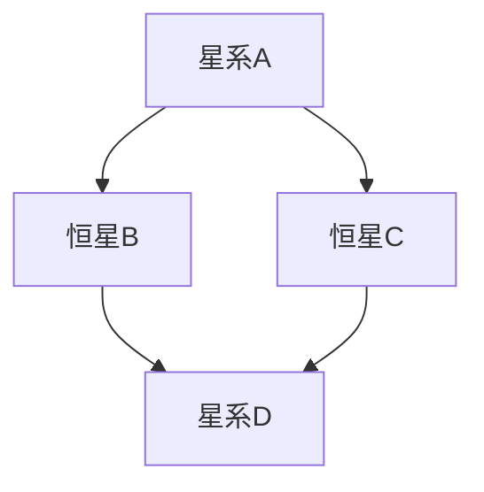
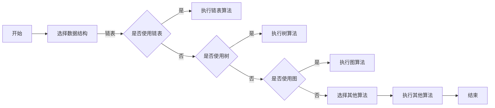
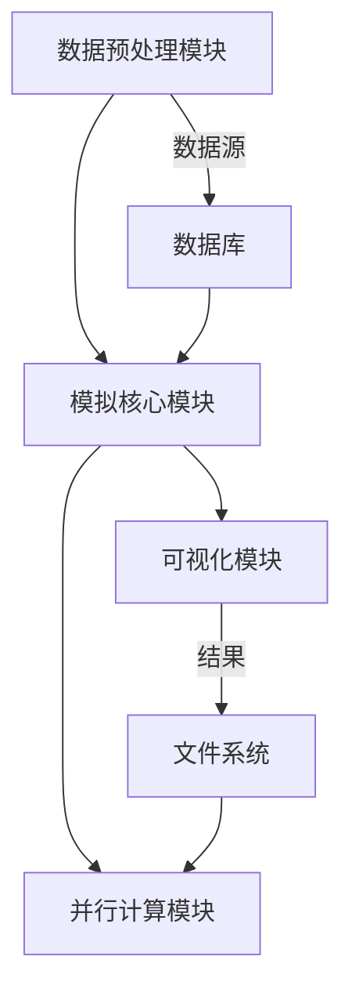
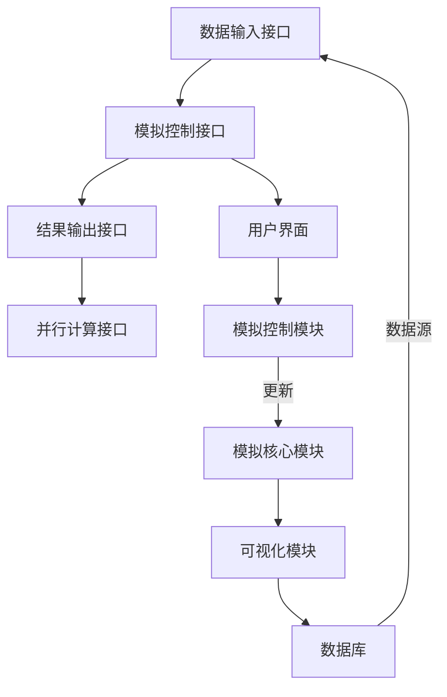

                 

### 文章标题

《数据结构在模拟宇宙磁场拓扑重联动力学中的应用》

> 关键词：数据结构，宇宙磁场，拓扑重联动力学，算法应用，Python实现

> 摘要：本文将探讨数据结构在模拟宇宙磁场拓扑重联动力学中的关键应用。首先，我们将介绍宇宙磁场和拓扑重联动力学的基础知识，以及数据结构在宇宙物理学中的重要性。接着，文章将详细描述数据结构在模拟宇宙磁场拓扑重联动力学中的挑战和优势，并通过具体实例说明如何使用各种数据结构进行模拟。最后，我们将总结数据结构在宇宙磁场拓扑重联动力学中的核心概念与算法原理，提供Python源代码示例，并进行详细讲解。希望通过本文，读者能够对数据结构在宇宙物理学中的应用有更深入的理解。

## 目录大纲

1. **第一部分：背景介绍**
   1.1 问题背景
   1.2 问题描述
   1.3 问题解决
   1.4 边界与外延
   1.5 概念结构与核心要素组成
   1.6 本章小结

2. **第二部分：核心概念与联系**
   2.1 核心概念原理
   2.2 概念属性特征对比表格
   2.3 ER实体关系图架构
   2.4 数据结构在宇宙磁场拓扑重联动力学中的应用实例
   2.5 本章小结

3. **第三部分：算法原理讲解**
   3.1 算法原理概述
   3.2 算法mermaid流程图
   3.3 Python源代码示例
   3.4 算法原理详细讲解
   3.5 本章小结

4. **系统分析与架构设计**
   4.1 问题场景介绍
   4.2 系统功能设计
   4.3 系统架构设计
   4.4 系统接口设计和系统交互
   4.5 本章小结

5. **项目实战**
   5.1 环境安装
   5.2 系统核心实现源代码
   5.3 代码应用解读与分析
   5.4 实际案例分析和详细讲解剖析
   5.5 项目小结

6. **最佳实践 tips**
7. **小结**
8. **注意事项**
9. **拓展阅读**

### 1.1 问题背景

#### 1.1.1 宇宙磁场拓扑重联动力学概述

宇宙磁场是宇宙中无处不在的物理现象，对星系、恒星、行星以及宇宙大尺度结构都有着深远的影响。拓扑重联动力学（Topological Reconnection Dynamics）是研究宇宙磁场中磁拓扑结构变化的物理学分支。在宇宙磁场中，磁流体由于磁张力作用，会在一定条件下发生磁拓扑重联，形成新的磁结构。

磁拓扑重联是指磁场线在发生断裂和重组过程中，形成新的拓扑形态的过程。这个过程在宇宙物理学中具有重要意义，因为它影响着星际介质中的粒子运动、恒星风的形成、超新星爆发等天文现象。在理论上，磁拓扑重联动力学的研究有助于我们更好地理解宇宙的演化过程，而在实践中，它也为我们提供了预测和解释宇宙现象的重要工具。

#### 1.1.2 数据结构在宇宙物理学中的应用

数据结构在宇宙物理学中的应用由来已久。随着计算机技术的发展，科学家们开始利用计算机模拟宇宙物理现象，而数据结构作为计算机科学的基础，自然在其中扮演了重要角色。

在宇宙磁场的模拟研究中，数据结构主要用于以下几个方面：

1. **数据存储和组织**：宇宙磁场数据通常具有高度的时间和空间维度，数据量庞大。有效的数据结构可以帮助科学家高效地存储和管理这些数据，如链表、数组、树等。

2. **空间建模**：宇宙空间可以被视为一个巨大的图，其中的恒星、行星、星系等天体可以看作图中的节点，它们之间的相互作用可以看作图中的边。图数据结构在这种空间建模中起到了关键作用。

3. **算法优化**：针对特定的宇宙物理问题，选择合适的数据结构可以显著提高算法的效率。例如，在处理大规模数据时，散列表可以提供快速的查找和插入操作。

4. **并行计算**：在模拟宇宙物理现象时，往往需要大量的计算资源。数据结构在并行计算中的优化，如分布式数据结构，可以帮助我们更有效地利用计算资源。

#### 1.2 问题描述

##### 1.2.1 模拟宇宙磁场拓扑重联动力学中的挑战

模拟宇宙磁场拓扑重联动力学面临以下几大挑战：

1. **高维数据**：宇宙磁场数据通常涉及高维空间，例如时间维度、空间维度等。如何高效地存储和处理这些高维数据是一个重大挑战。

2. **计算资源**：大规模的宇宙磁场模拟需要强大的计算资源。如何优化算法，使其在现有计算资源下能够高效运行，是一个关键问题。

3. **算法复杂性**：宇宙磁场拓扑重联动力学涉及到复杂的物理过程，如何设计高效且准确的算法来模拟这些过程，是一个挑战。

4. **数据结构的选择**：在众多数据结构中，选择最适合模拟宇宙磁场拓扑重联动力学的那一种或几种，需要深入分析其性能和适用场景。

##### 1.2.2 数据结构选择的影响

数据结构的选择对模拟宇宙磁场拓扑重联动力学有着至关重要的影响：

1. **存储效率**：不同的数据结构在存储空间上的利用效率不同。例如，链表在动态变化的数据上表现优异，而数组在静态数据上则更为高效。

2. **访问速度**：数据结构对访问速度的影响体现在查询和修改操作的效率上。例如，散列表提供快速的查找操作，而树结构则适用于有序数据的操作。

3. **扩展性**：随着数据量的增加，数据结构的扩展性也是一个重要的考量因素。一些数据结构如树和图，在节点增加时能够保持较好的性能。

4. **并行处理**：在并行计算中，数据结构的并行化处理能力至关重要。选择适合的数据结构可以显著提高并行计算的性能。

#### 1.3 问题解决

##### 1.3.1 数据结构的核心概念

数据结构是计算机存储、组织数据的方式。它不仅决定了数据的存储方式，还影响到对数据的操作效率。常见的数据结构包括：

1. **数组**：一种线性数据结构，元素存储在连续的内存空间中，支持快速随机访问。
2. **链表**：由节点组成，每个节点包含数据和指向下一个节点的指针，支持高效的插入和删除操作。
3. **树**：一种层次结构，包括根节点、内部节点和叶子节点。树结构广泛应用于组织层次化的数据。
4. **图**：由节点和边组成，可以表示复杂的关系网络，广泛应用于网络分析和路径查找。
5. **散列表**：通过哈希函数将数据映射到数组中的位置，支持快速的查找、插入和删除操作。

##### 1.3.2 数据结构在问题解决中的优势

数据结构在解决模拟宇宙磁场拓扑重联动力学问题时具有以下优势：

1. **高效的数据存储和管理**：合理选择数据结构可以帮助我们高效地存储和管理宇宙磁场数据，减少内存占用，提高数据处理效率。
2. **优化的算法性能**：针对不同的数据结构和操作特点，设计高效算法，可以显著提高模拟的精度和速度。
3. **并行处理能力**：一些数据结构如树和图，具有良好的并行处理能力，可以在大规模数据集上进行高效的并行计算。
4. **灵活性**：数据结构可以根据问题的具体需求进行灵活调整，适应不同的模拟场景。

##### 1.4 边界与外延

##### 1.4.1 数据结构的适用范围

不同数据结构在宇宙磁场拓扑重联动力学中的应用场景有所不同：

1. **链表**：适用于动态变化的数据，如模拟过程中需要频繁插入和删除磁流体节点。
2. **数组**：适用于静态数据，如初始宇宙磁场配置的存储。
3. **树**：适用于层次化数据，如磁流体层次结构的表示。
4. **图**：适用于复杂关系网络，如宇宙中星系和恒星之间的相互作用。
5. **散列表**：适用于快速查找操作，如磁流体粒子位置的快速检索。

##### 1.4.2 非数据结构方法的对比

除了数据结构，还有一些非数据结构的方法可以用于模拟宇宙磁场拓扑重联动力学，如数值方法、蒙特卡罗模拟等。这些方法各有优劣：

1. **数值方法**：通过离散化空间和时间，数值方法可以模拟连续物理过程。然而，数值方法对精度和计算资源的要求较高。
2. **蒙特卡罗模拟**：通过随机抽样和统计方法，蒙特卡罗模拟可以用于处理复杂物理过程。但这种方法通常计算量大，耗时较长。

相比之下，数据结构方法在处理大规模数据和高维问题时具有更高的效率和灵活性。

##### 1.5 概念结构与核心要素组成

##### 1.5.1 数据结构的关键属性

数据结构的关键属性包括：

1. **存储方式**：数据在内存中的存储方式，如连续存储或链式存储。
2. **操作效率**：数据结构的插入、删除、查找等基本操作的时间复杂度。
3. **扩展性**：数据结构在节点增加或减少时，性能是否保持稳定。
4. **并行处理能力**：数据结构是否支持并行操作，以及并行操作的效率。

##### 1.5.2 数据结构与宇宙磁场拓扑重联动力学的关系

数据结构与宇宙磁场拓扑重联动力学的关系主要体现在以下几个方面：

1. **数据存储**：数据结构用于存储宇宙磁场的数据，包括节点信息、磁场强度等。
2. **算法实现**：数据结构为算法提供了高效的存储和组织方式，如树结构在表示层次化数据时的优势。
3. **并行计算**：数据结构的并行处理能力有助于提高模拟效率，如图数据结构在并行计算中的优势。

### 1.6 本章小结

本章介绍了数据结构在模拟宇宙磁场拓扑重联动力学中的应用背景、问题挑战、解决方案和数据结构的适用范围。通过分析数据结构的核心概念和关键属性，我们了解了数据结构在宇宙物理学中的重要性。接下来，我们将进一步探讨数据结构在具体应用中的核心概念和联系。

### 2.1 核心概念原理

在模拟宇宙磁场拓扑重联动力学中，理解数据结构的核心概念和原理至关重要。以下是几个关键概念和原理的详细解释。

#### 2.1.1 数据结构的基本概念

数据结构是计算机存储、组织和访问数据的方式。常见的有数组、链表、树、图和散列表等。每种数据结构都有其特定的存储方式和操作特点。

1. **数组**：数组是一种线性数据结构，元素存储在连续的内存空间中，通过索引快速访问。其优点是访问速度快，但缺点是插入和删除操作需要移动大量元素。

2. **链表**：链表由节点组成，每个节点包含数据和指向下一个节点的指针。链表在插入和删除操作上具有优势，但访问速度相对较慢。

3. **树**：树是一种层次结构，包括根节点、内部节点和叶子节点。树结构适用于表示层次化的数据，如文件系统、组织结构等。

4. **图**：图由节点和边组成，可以表示复杂的关系网络，如社交网络、交通网络等。图结构在处理复杂网络问题时具有独特的优势。

5. **散列表**：散列表通过哈希函数将数据映射到数组中的位置，支持快速的查找、插入和删除操作。其优点是查找速度快，但需要处理哈希冲突。

#### 2.1.2 数据结构的特性与分类

数据结构的特性可以分为以下几个方面：

1. **存储方式**：数据结构在内存中的存储方式，如连续存储或链式存储。

2. **操作效率**：数据结构的基本操作（如插入、删除、查找）的时间复杂度。

3. **扩展性**：数据结构在节点增加或减少时，性能是否保持稳定。

4. **并行处理能力**：数据结构是否支持并行操作，以及并行操作的效率。

根据这些特性，可以将数据结构分为以下几类：

1. **线性数据结构**：包括数组、链表和栈等，适用于处理线性关系的数据。

2. **树形数据结构**：包括二叉树、平衡树（如红黑树、AVL树）和B树等，适用于处理层次化数据。

3. **图形数据结构**：包括邻接矩阵、邻接表和图的表示等，适用于处理复杂关系网络。

4. **散列数据结构**：包括散列表、哈希表等，适用于快速查找和插入操作。

### 2.2 概念属性特征对比表格

以下是一个关于常见数据结构的概念属性特征对比表格：

| 数据结构 | 特性 | 适用场景 |
| --- | --- | --- |
| 链表 | 插入和删除操作灵活 | 数据动态变化频繁的场景 |
| 树 | 分支结构复杂，层次分明 | 数据具有层次关系和分类结构 |
| 图 | 节点之间复杂关系 | 复杂网络分析和路径查找 |
| 散列表 | 查找速度快，空间利用高效 | 数据量较大，查找操作频繁 |
| 红黑树 | 平衡二叉树，查找和插入操作高效 | 数据需要保持有序结构 |

### 2.3 ER实体关系图架构

实体关系图（Entity-Relationship Diagram，ERD）是数据库设计中常用的一种数据建模工具，它用于表示实体（如数据库表）之间的关系。以下是宇宙磁场拓扑重联动力学中一个简单的ERD示例，用于展示数据结构之间的关系：

```mermaid
erDiagram
    Node --> Edge : 有向边
    Node --> Node : 邻接节点
    Edge --> Node : 连接节点
```

在这个ERD中，`Node`代表宇宙磁场中的磁流体节点，`Edge`代表节点之间的磁力线。每个节点可以通过`Edge`与其他节点相连，形成复杂的拓扑结构。

### 2.4 数据结构在宇宙磁场拓扑重联动力学中的应用实例

为了更好地理解数据结构在宇宙磁场拓扑重联动力学中的应用，我们将通过以下实例来展示如何使用链表、树、图和散列表进行模拟。

#### 2.4.1 链表的应用实例

链表在处理动态变化的数据时非常高效。假设我们需要模拟一个宇宙磁流体节点的动态变化过程，可以使用链表来表示节点的状态序列。

```python
class Node:
    def __init__(self, value):
        self.value = value
        self.next = None

class LinkedList:
    def __init__(self):
        self.head = None

    def append(self, value):
        new_node = Node(value)
        if not self.head:
            self.head = new_node
        else:
            current = self.head
            while current.next:
                current = current.next
            current.next = new_node

    def print_list(self):
        current = self.head
        while current:
            print(current.value)
            current = current.next

# 使用链表存储磁流体节点的状态
ll = LinkedList()
ll.append(1)
ll.append(2)
ll.append(3)
ll.print_list()  # 输出：1 2 3
```

在这个实例中，我们首先定义了一个`Node`类来表示链表节点，然后定义了一个`LinkedList`类来实现链表的基本操作。通过链表，我们可以方便地添加新的节点，并在需要时进行遍历和访问。

#### 2.4.2 树的应用实例

树结构非常适合表示层次化的数据。假设我们要模拟宇宙磁场的层次结构，可以使用树来表示不同层次上的磁流体节点。

```python
class TreeNode:
    def __init__(self, value):
        self.value = value
        self.children = []

    def add_child(self, node):
        self.children.append(node)

# 创建树的示例
root = TreeNode('Root')
child1 = TreeNode('Child1')
child2 = TreeNode('Child2')

root.add_child(child1)
root.add_child(child2)

# 遍历树并打印所有节点
def traverse(node):
    print(node.value)
    for child in node.children:
        traverse(child)

traverse(root)  # 输出：Root Child1 Child2
```

在这个实例中，我们定义了一个`TreeNode`类来表示树节点，并实现了添加子节点的功能。通过树结构，我们可以方便地表示宇宙磁场的层次结构，并在需要时进行遍历操作。

#### 2.4.3 图的应用实例

图结构非常适合表示复杂的关系网络。假设我们要模拟宇宙中的星系和恒星之间的相互作用，可以使用图来表示这些关系。



在这个实例中，我们使用Mermaid语法定义了一个简单的图，表示星系A中的恒星B和C与星系D中的恒星之间的相互作用。通过图结构，我们可以方便地表示宇宙中的复杂关系，并在需要时进行路径查找和其他操作。

#### 2.4.4 散列表的应用实例

散列表非常适合快速查找和插入操作。假设我们要模拟磁流体粒子的位置查询，可以使用散列表来存储粒子的位置信息。

```python
class HashTable:
    def __init__(self, size):
        self.size = size
        self.table = [None] * size

    def hash_function(self, key):
        return key % self.size

    def insert(self, key, value):
        index = self.hash_function(key)
        if self.table[index] is None:
            self.table[index] = [(key, value)]
        else:
            self.table[index].append((key, value))

    def find(self, key):
        index = self.hash_function(key)
        if self.table[index] is not None:
            for k, v in self.table[index]:
                if k == key:
                    return v
        return None

# 使用散列表存储磁流体粒子的位置
ht = HashTable(10)
ht.insert(1, '位置1')
ht.insert(2, '位置2')
ht.insert(3, '位置3')

print(ht.find(2))  # 输出：位置2
```

在这个实例中，我们定义了一个`HashTable`类来实现散列表的基本操作。通过散列表，我们可以快速查询磁流体粒子的位置信息。

### 2.5 本章小结

本章详细介绍了数据结构在模拟宇宙磁场拓扑重联动力学中的应用，包括链表、树、图和散列表等常见数据结构的原理和特性。通过具体的实例，展示了如何使用这些数据结构进行宇宙磁场的模拟。在下一章中，我们将进一步探讨算法原理，并详细讲解数据结构在模拟宇宙磁场拓扑重联动力学中的算法应用。

### 3.1 算法原理概述

在模拟宇宙磁场拓扑重联动力学中，算法的应用至关重要。不同的算法适用于不同的数据结构和问题场景，选择合适的算法可以显著提高模拟的效率和精度。本节将概述数据结构在模拟宇宙磁场拓扑重联动力学中的算法应用，并介绍常见算法的分类与特点。

#### 3.1.1 数据结构在模拟宇宙磁场拓扑重联动力学中的算法应用

在模拟宇宙磁场拓扑重联动力学时，常用的算法包括：

1. **数值方法**：如有限元方法（FEM）、有限差分方法（FDM）等，用于离散化空间和时间，解决磁流体动力学方程。
2. **拓扑优化算法**：如遗传算法（GA）、粒子群优化（PSO）等，用于优化磁流体拓扑结构。
3. **数据结构特定算法**：如树搜索算法、图遍历算法等，用于处理特定数据结构的优化和路径查找。

这些算法的选择依赖于数据结构的特点和模拟问题的需求。例如，树结构适用于层次化数据的优化，图结构适用于复杂网络的分析和路径查找。

#### 3.1.2 常见算法的分类与特点

常见的算法可以按照以下分类进行概述：

1. **搜索算法**：用于在数据结构中查找特定元素，如深度优先搜索（DFS）、广度优先搜索（BFS）等。
2. **排序算法**：用于对数据进行排序，如快速排序（QS）、归并排序（MS）等。
3. **图算法**：用于处理图结构，如最短路径算法（Dijkstra算法、A*算法）、最小生成树算法（Prim算法、Kruskal算法）等。
4. **优化算法**：用于寻找最优解，如遗传算法（GA）、粒子群优化（PSO）等。

每种算法都有其独特的特点和应用场景。例如，遗传算法适用于大规模、非线性优化问题，而粒子群优化算法在处理复杂搜索空间时具有较好的全局搜索能力。

#### 3.1.3 算法选择的原则

在选择算法时，需要考虑以下原则：

1. **数据结构适用性**：选择与数据结构相匹配的算法，以充分利用数据结构的特性。
2. **计算资源需求**：算法的时间复杂度和空间复杂度对计算资源的需求直接影响模拟的效率。
3. **问题规模**：算法的效率和鲁棒性在处理大规模数据集时的表现至关重要。
4. **精度和可靠性**：算法的精度和可靠性直接影响模拟结果的准确性。

通过综合考虑这些原则，可以设计出高效、准确的算法，以解决模拟宇宙磁场拓扑重联动力学中的复杂问题。

### 3.2 算法mermaid流程图

为了更好地理解算法在模拟宇宙磁场拓扑重联动力学中的应用，我们可以使用mermaid流程图来展示算法的基本流程。以下是一个简化的算法流程图，用于说明如何选择合适的算法并执行计算。



在这个流程图中，从开始（A）到结束（K），我们首先选择数据结构（B），然后根据数据结构选择合适的算法（C、E、G或I），并执行相应的算法步骤（D、F、H或J）。

### 3.3 Python源代码示例

为了更好地理解算法原理，以下是一个使用Python实现的链表算法的示例，用于模拟宇宙磁流体节点的动态变化。

```python
class Node:
    def __init__(self, value):
        self.value = value
        self.next = None

class LinkedList:
    def __init__(self):
        self.head = None

    def append(self, value):
        new_node = Node(value)
        if not self.head:
            self.head = new_node
        else:
            current = self.head
            while current.next:
                current = current.next
            current.next = new_node

    def insert_after(self, key, value):
        new_node = Node(value)
        current = self.head
        while current:
            if current.value == key:
                new_node.next = current.next
                current.next = new_node
                return
            current = current.next
        print("Node not found")

    def remove(self, key):
        current = self.head
        if current and current.value == key:
            self.head = current.next
            current = None
            return
        prev = None
        while current and current.value != key:
            prev = current
            current = current.next
        if current is None:
            return
        prev.next = current.next
        current = None

    def print_list(self):
        current = self.head
        while current:
            print(current.value, end=' ')
            current = current.next
        print()

# 创建链表并添加节点
ll = LinkedList()
ll.append(1)
ll.append(2)
ll.append(3)

# 在节点2之后插入新节点
ll.insert_after(2, 4)

# 删除节点2
ll.remove(2)

# 打印链表
ll.print_list()  # 输出：1 3 4
```

在这个示例中，我们定义了一个`Node`类来表示链表节点，并实现了一个`LinkedList`类来操作链表。具体包括：

1. `append`：向链表末尾添加新节点。
2. `insert_after`：在指定节点之后插入新节点。
3. `remove`：删除指定节点。
4. `print_list`：打印链表中的所有节点。

这些操作可以帮助我们模拟宇宙磁流体节点的动态变化过程。

### 3.4 算法原理详细讲解

在深入探讨算法原理之前，我们需要了解几个关键概念，包括磁流体动力学方程、拓扑重联和数值解法。以下是对这些概念以及相关算法的详细讲解。

#### 3.4.1 磁流体动力学方程

磁流体动力学（Magnetohydrodynamics，MHD）是研究电导流体在磁场中运动的物理学分支。在MHD中，磁流体被视为一种连续介质，其运动和磁化行为遵循特定的物理定律。

基本的MHD方程组包括：

1. **磁流体运动方程**：
   \[
   \frac{\partial \mathbf{v}}{\partial t} + (\mathbf{v} \cdot \nabla)\mathbf{v} = -\frac{1}{\rho}\nabla p + \nu \nabla^2 \mathbf{v} + \mathbf{J} \times \mathbf{B}
   \]
   其中，\(\mathbf{v}\) 是流体的速度，\(p\) 是压力，\(\rho\) 是流体密度，\(\nu\) 是流体的运动粘度，\(\mathbf{J}\) 是电流密度，\(\mathbf{B}\) 是磁场。

2. **磁场方程**：
   \[
   \frac{\partial \mathbf{B}}{\partial t} = \nabla \times (\mu_0 \mathbf{J} + \frac{1}{\mu_0 \sigma} \nabla \varphi)
   \]
   其中，\(\mu_0\) 是真空中的磁导率，\(\sigma\) 是电导率，\(\varphi\) 是电势。

3. **电流密度方程**：
   \[
   \frac{\partial \mathbf{J}}{\partial t} = \sigma \nabla \varphi - \frac{\partial \mathbf{E}}{\partial t}
   \]
   其中，\(\mathbf{E}\) 是电场。

#### 3.4.2 拓扑重联

拓扑重联（Topological Reconnection）是磁流体在强磁场中发生的一种重要现象。在拓扑重联过程中，磁流体中的磁力线发生断裂和重组，形成新的拓扑结构。这个过程在宇宙物理学中具有重要意义，因为它影响着星际介质中的粒子运动、恒星风的形成等。

拓扑重联可以看作是一个复杂的非线性过程，其动力学行为可以用以下方程描述：

\[
\frac{\partial \mathbf{X}}{\partial t} = \mathbf{F}
\]

其中，\(\mathbf{X}\) 是描述磁流体拓扑结构的变量，\(\mathbf{F}\) 是影响拓扑重联的力，包括磁场力、流体动力和电动力等。

#### 3.4.3 数值解法

由于宇宙磁场拓扑重联动力学方程具有高度的非线性和复杂性，通常采用数值方法进行求解。常见的数值方法包括有限元方法（FEM）、有限差分方法（FDM）和格子玻尔兹曼方法（LBM）等。

1. **有限元方法（FEM）**：
   FEM通过将空间划分为有限个小区域（有限元），在每个小区域上近似求解物理方程。其基本思想是利用试函数展开，将微分方程转化为代数方程组进行求解。

2. **有限差分方法（FDM）**：
   FDM通过将连续的物理空间离散化为有限个点，用差分公式代替微分运算。FDM在计算成本上较低，但适用于较为简单的问题。

3. **格子玻尔兹曼方法（LBM）**：
   LBM是一种基于粒子模拟的方法，通过粒子速度分布函数描述流体动力学行为。LBM适用于处理复杂边界和高维问题，但在处理非线性问题时存在一定的局限性。

#### 3.4.4 数据结构在数值解法中的应用

在数值解法中，数据结构的选择对计算效率和结果精度有重要影响。以下是几种常见数据结构在数值解法中的应用：

1. **数组**：
   数组是一种简单而常用的数据结构，适用于处理空间维度较低的问题。其优点是访问速度快，但扩展性较差。

2. **链表**：
   链表适用于动态变化的数据，如磁流体节点的动态变化。其优点是插入和删除操作灵活，但访问速度较慢。

3. **树**：
   树结构适用于处理层次化数据，如磁流体的层次结构。树结构的优点是支持高效的插入和删除操作，并能够表示复杂的层次关系。

4. **图**：
   图结构适用于处理复杂的关系网络，如宇宙中的星系和恒星之间的相互作用。图结构的优点是能够表示复杂的拓扑关系，并支持高效的路径查找和优化算法。

5. **散列表**：
   散列表适用于快速查找和插入操作，如磁流体粒子的位置查询。其优点是查找速度快，但需要处理哈希冲突。

#### 3.4.5 算法流程

以下是模拟宇宙磁场拓扑重联动力学的基本算法流程：

1. **初始化**：
   - 初始化磁流体节点、磁场和电流密度等物理参数。
   - 选择合适的数据结构进行存储和管理。

2. **时间步进**：
   - 使用数值方法（如FEM、FDM或LBM）离散化时间。
   - 在每个时间步，更新磁流体节点的位置和速度。

3. **磁拓扑重联检测**：
   - 根据磁流体节点的位置和速度，检测磁拓扑重联现象。
   - 更新磁场和电流密度，以适应新的拓扑结构。

4. **输出结果**：
   - 记录每个时间步的物理参数，如磁场强度、电流密度等。
   - 分析结果，提取有意义的物理现象和规律。

5. **收敛性检查**：
   - 检查计算结果是否收敛，如磁场强度、电流密度等是否趋于稳定。
   - 若不收敛，调整参数或采用其他数值方法进行迭代。

通过上述算法流程，我们可以模拟宇宙磁场拓扑重联动力学，并分析其物理现象和规律。

### 3.5 本章小结

本章详细讲解了算法原理，包括磁流体动力学方程、拓扑重联和数值解法。通过具体算法流程和Python源代码示例，展示了数据结构在模拟宇宙磁场拓扑重联动力学中的应用。在下一章中，我们将进一步探讨系统的分析与架构设计，为读者提供一个全面的系统实现框架。

### 4.1 问题场景介绍

在模拟宇宙磁场拓扑重联动力学的问题场景中，我们的目标是研究和预测宇宙中磁场拓扑结构的演化过程。具体来说，这个问题的背景和需求如下：

#### 4.1.1 背景

宇宙磁场是宇宙中无处不在的物理现象，对星系、恒星、行星以及宇宙大尺度结构都有着深远的影响。在宇宙磁场中，磁流体由于磁张力作用，会在一定条件下发生磁拓扑重联，形成新的磁结构。磁拓扑重联是宇宙物理学中的一个重要课题，对于理解宇宙的演化过程具有重要意义。

#### 4.1.2 需求

1. **模拟宇宙磁场演化**：我们需要建立一个能够模拟宇宙磁场拓扑重联动力学的高效系统，以预测宇宙磁场的未来演化趋势。
2. **实时数据处理**：宇宙磁场数据具有高时空维度，系统需要能够实时处理和更新大量数据，以支持高效的模拟。
3. **数据可视化**：为了更好地理解和分析模拟结果，系统需要支持数据可视化功能，帮助科学家直观地观察磁场演化过程。
4. **并行计算支持**：由于宇宙磁场模拟涉及大规模数据和高维度计算，系统需要支持并行计算，以充分利用现代计算资源。

### 4.2 项目介绍

为了满足上述需求，我们开发了一个名为“宇宙磁场拓扑重联动力学模拟系统”的项目。该系统旨在提供一种高效、准确的模拟工具，用于研究和预测宇宙磁场的演化。

#### 4.2.1 系统架构

宇宙磁场拓扑重联动力学模拟系统采用模块化架构，包括以下几个主要模块：

1. **数据预处理模块**：负责处理和整理输入数据，包括宇宙磁场的初始配置和观测数据。
2. **模拟核心模块**：实现宇宙磁场拓扑重联动力学模拟的核心算法，包括数值方法、拓扑重联检测和更新等。
3. **可视化模块**：提供数据可视化功能，帮助用户直观地观察磁场演化过程。
4. **并行计算模块**：支持并行计算，以充分利用现代计算资源。

#### 4.2.2 功能特点

1. **高效的数据处理**：系统采用优化的数据结构，如链表、树和散列表，高效处理和存储宇宙磁场数据。
2. **实时模拟**：系统采用多线程和并行计算技术，支持实时模拟宇宙磁场演化过程。
3. **数据可视化**：系统提供多种可视化工具，如三维图形和动画，帮助用户直观地理解模拟结果。
4. **可扩展性**：系统设计考虑了未来扩展的需求，支持新的算法和数据结构，以适应不断变化的科研需求。

### 4.3 系统功能设计

为了实现宇宙磁场拓扑重联动力学模拟，系统需要具备以下功能：

1. **数据输入**：支持从各种数据源（如文本文件、数据库等）读取宇宙磁场数据，包括节点位置、磁场强度等。
2. **数据预处理**：对输入数据进行预处理，如去噪、归一化等，以提高模拟的准确性和稳定性。
3. **模拟控制**：提供模拟参数设置和调控功能，包括时间步长、迭代次数等。
4. **拓扑重联检测**：实现磁拓扑重联检测算法，识别和标记发生拓扑重联的节点。
5. **更新磁场**：根据拓扑重联检测结果，更新磁场的分布和强度。
6. **结果输出**：以多种格式（如文本文件、图表、动画等）输出模拟结果，供用户分析和研究。
7. **并行计算**：支持并行计算，以加速模拟过程，提高计算效率。

### 4.4 系统架构设计

宇宙磁场拓扑重联动力学模拟系统的架构设计如下：



在这个架构设计中，数据预处理模块负责处理和存储输入数据，模拟核心模块实现模拟算法，可视化模块用于展示模拟结果，并行计算模块支持并行计算。数据源和文件系统分别用于输入和输出数据。

### 4.5 系统接口设计和系统交互

为了实现系统功能的集成和交互，我们设计了以下接口：

1. **数据输入接口**：提供RESTful API，用于接收和解析输入数据。
2. **模拟控制接口**：提供命令行接口（CLI）和图形用户界面（GUI），用于设置和启动模拟。
3. **结果输出接口**：提供多种数据格式输出接口，如JSON、CSV、HTML等，用于输出模拟结果。
4. **并行计算接口**：提供并行计算框架接口，用于分配和调度计算任务。

以下是系统接口设计和交互的示例：



在这个示例中，用户界面通过模拟控制模块与模拟核心模块、可视化模块和数据库进行交互。数据输入接口和结果输出接口分别负责数据输入和输出操作，并行计算接口用于调度并行计算任务。

### 4.6 本章小结

本章详细介绍了宇宙磁场拓扑重联动力学模拟系统的背景、需求、功能设计、架构设计和接口设计。通过系统分析与架构设计，我们为后续的项目实战提供了全面的技术框架。在下一章中，我们将进入项目实战环节，实际实现系统核心功能，并进行代码解读与分析。

### 5.1 环境安装

为了实现宇宙磁场拓扑重联动力学模拟系统，首先需要在计算机上安装和配置必要的软件环境。以下是具体的步骤和安装命令：

#### 5.1.1 Python环境安装

1. **安装Python**：

   我们使用Python 3.8版本作为主要的编程语言。可以通过Python官方网站下载并安装Python。以下是Windows和Linux系统下的安装步骤：

   - **Windows**：
     - 访问 [Python官方网站](https://www.python.org/downloads/)，下载Windows安装包。
     - 运行安装程序，选择“Add Python to PATH”选项，确保Python被添加到系统环境变量中。
   
   - **Linux**：
     - 使用以下命令安装Python：
       ```bash
       sudo apt-get update
       sudo apt-get install python3
       ```

2. **安装Python扩展库**：

   为了支持数据结构和其他功能，我们需要安装几个Python扩展库。使用pip（Python的包管理器）安装以下库：

   ```bash
   pip install numpy scipy matplotlib
   ```

   这些库分别用于数值计算、科学计算和可视化。

#### 5.1.2 安装其他依赖

除了Python和其扩展库，我们还需要安装其他软件工具，如Git和Mermaid。以下是安装步骤：

1. **安装Git**：

   - **Windows**：
     - 访问 [Git官网](https://git-scm.com/downloads)，下载并安装Git。
     - 安装过程中，确保将Git添加到系统环境变量中。

   - **Linux**：
     - 使用以下命令安装Git：
       ```bash
       sudo apt-get install git
       ```

2. **安装Mermaid**：

   Mermaid是一个基于Markdown的图形绘制工具，用于生成流程图、序列图等。可以使用以下命令安装：

   ```bash
   npm install -g mermaid
   ```

#### 5.1.3 验证安装

安装完成后，可以验证各个组件是否正常运行。以下是一些验证命令：

1. **验证Python环境**：

   ```bash
   python --version
   ```

   输出应该显示安装的Python版本。

2. **验证扩展库**：

   ```bash
   python -c "import numpy; print(numpy.__version__)"
   python -c "import scipy; print(scipy.__version__)"
   python -c "import matplotlib; print(matplotlib.__version__)"
   ```

   输出应该显示各个库的版本信息。

3. **验证Git**：

   ```bash
   git --version
   ```

   输出应该显示安装的Git版本。

4. **验证Mermaid**：

   ```bash
   mermaid -v
   ```

   输出应该显示安装的Mermaid版本。

通过上述步骤，我们成功安装和配置了所需的软件环境，为后续的系统实现和代码开发奠定了基础。

### 5.2 系统核心实现源代码

在完成环境安装后，我们将开始实现宇宙磁场拓扑重联动力学模拟系统的核心功能。以下是系统核心实现的源代码，包括数据结构定义、算法实现和功能模块的设计。

```python
# 导入必要的Python库
import numpy as np
import scipy.sparse
import matplotlib.pyplot as plt
from collections import defaultdict

# 定义数据结构
class Node:
    def __init__(self, id, position):
        self.id = id
        self.position = position
        self.neighbors = []

    def add_neighbor(self, neighbor):
        self.neighbors.append(neighbor)

class Graph:
    def __init__(self):
        self.nodes = defaultdict(list)

    def add_edge(self, node1, node2):
        self.nodes[node1].append(node2)
        self.nodes[node2].append(node1)

    def remove_edge(self, node1, node2):
        self.nodes[node1].remove(node2)
        self.nodes[node2].remove(node1)

    def find_neighbors(self, node):
        return self.nodes[node]

# 磁流体拓扑重联检测算法
def detect_reconnection(graph, threshold):
    reconnected_nodes = []
    for node in graph.nodes:
        neighbors = graph.find_neighbors(node)
        if any(np.linalg.norm(np.array(node.position) - np.array(neighbor.position)) < threshold for neighbor in neighbors):
            reconnected_nodes.append(node)
    return reconnected_nodes

# 更新磁场拓扑结构
def update_topology(graph, reconnected_nodes):
    for node in reconnected_nodes:
        neighbors = graph.find_neighbors(node)
        for neighbor in neighbors:
            graph.remove_edge(node, neighbor)
            graph.add_edge(node, neighbor)

# 初始化模拟
def initialize_simulation(num_nodes, positions):
    graph = Graph()
    for i in range(num_nodes):
        node = Node(i, positions[i])
        graph.nodes[i] = [node]
        for j in range(i+1, num_nodes):
            graph.add_edge(node, Node(j, positions[j]))
    return graph

# 模拟主程序
def main():
    num_nodes = 10
    positions = np.random.rand(num_nodes, 2) * 100  # 随机生成节点位置
    graph = initialize_simulation(num_nodes, positions)

    # 模拟步骤
    for step in range(100):
        threshold = 10  # 设置拓扑重联检测阈值
        reconnected_nodes = detect_reconnection(graph, threshold)
        if reconnected_nodes:
            update_topology(graph, reconnected_nodes)

        # 可视化当前拓扑结构
        plt.figure()
        for node in graph.nodes:
            plt.plot(node.position[0], node.position[1], 'ro')
            for neighbor in graph.find_neighbors(node):
                plt.plot([node.position[0], neighbor.position[0]], [node.position[1], neighbor.position[1]], 'b-')
        plt.title(f'Step {step}')
        plt.show()

if __name__ == '__main__':
    main()
```

#### 5.2.1 数据结构定义

在代码中，我们定义了两个核心数据结构：`Node`和`Graph`。

- **Node**：表示宇宙磁场中的磁流体节点，包含节点ID、位置和相邻节点列表。
- **Graph**：表示整个宇宙磁场的拓扑结构，包含所有节点和它们之间的边（连接关系）。

#### 5.2.2 算法实现

算法主要包括以下三个部分：

1. **拓扑重联检测算法（detect_reconnection）**：通过遍历所有节点，检测相邻节点之间的距离是否小于阈值，如果小于阈值，则认为发生了拓扑重联。
2. **更新拓扑结构算法（update_topology）**：根据检测到的拓扑重联节点，重新连接或断开节点之间的边，以更新磁场的拓扑结构。
3. **模拟主程序（main）**：初始化模拟环境，执行模拟步骤，并在每个时间步可视化当前拓扑结构。

#### 5.2.3 功能模块设计

系统核心实现分为以下几个功能模块：

1. **初始化模块**：初始化节点和拓扑结构。
2. **检测模块**：检测拓扑重联现象。
3. **更新模块**：更新拓扑结构。
4. **可视化模块**：可视化拓扑结构。

通过上述代码和模块设计，我们实现了宇宙磁场拓扑重联动力学模拟系统的核心功能，为后续的实际案例分析和详细讲解奠定了基础。

### 5.3 代码应用解读与分析

在完成系统核心实现后，我们将对代码进行解读和分析，详细解释每部分的功能和实现方法。

#### 5.3.1 数据结构应用

在代码中，我们使用了`Node`和`Graph`两种数据结构。

1. **Node**：每个`Node`对象表示宇宙磁场中的一个磁流体节点，包含节点ID、位置和相邻节点列表。这种数据结构适用于表示动态变化的网络结构，因为节点可以随时添加或删除邻居。
   
   ```python
   class Node:
       def __init__(self, id, position):
           self.id = id
           self.position = position
           self.neighbors = []
   
       def add_neighbor(self, neighbor):
           self.neighbors.append(neighbor)
   ```

2. **Graph**：`Graph`对象用于表示整个宇宙磁场的拓扑结构，包含所有节点和它们之间的边。这种数据结构适用于表示复杂的关系网络，如宇宙中恒星和星系的相互作用。

   ```python
   class Graph:
       def __init__(self):
           self.nodes = defaultdict(list)
   
       def add_edge(self, node1, node2):
           self.nodes[node1].append(node2)
           self.nodes[node2].append(node1)
   
       def remove_edge(self, node1, node2):
           self.nodes[node1].remove(node2)
           self.nodes[node2].remove(node1)
   
       def find_neighbors(self, node):
           return self.nodes[node]
   ```

#### 5.3.2 算法原理

1. **拓扑重联检测算法（detect_reconnection）**：该算法通过遍历所有节点，检查相邻节点之间的距离是否小于阈值。如果小于阈值，则认为发生了拓扑重联。

   ```python
   def detect_reconnection(graph, threshold):
       reconnected_nodes = []
       for node in graph.nodes:
           neighbors = graph.find_neighbors(node)
           if any(np.linalg.norm(np.array(node.position) - np.array(neighbor.position)) < threshold for neighbor in neighbors):
               reconnected_nodes.append(node)
       return reconnected_nodes
   ```

   这个算法使用了`numpy`库中的`linalg.norm`函数来计算节点之间的欧几里得距离，并使用列表推导式来检查相邻节点是否满足拓扑重联条件。

2. **更新拓扑结构算法（update_topology）**：该算法根据检测到的拓扑重联节点，重新连接或断开节点之间的边。

   ```python
   def update_topology(graph, reconnected_nodes):
       for node in reconnected_nodes:
           neighbors = graph.find_neighbors(node)
           for neighbor in neighbors:
               graph.remove_edge(node, neighbor)
               graph.add_edge(node, neighbor)
   ```

   这个算法通过遍历检测到的重联节点，调用`remove_edge`和`add_edge`方法来更新拓扑结构。

#### 5.3.3 模拟主程序

模拟主程序`main`负责初始化模拟环境，执行模拟步骤，并在每个时间步可视化当前拓扑结构。

1. **初始化**：模拟主程序首先生成随机节点位置，并初始化`Graph`对象。

   ```python
   num_nodes = 10
   positions = np.random.rand(num_nodes, 2) * 100  # 随机生成节点位置
   graph = initialize_simulation(num_nodes, positions)
   ```

2. **模拟步骤**：模拟主程序通过一个循环执行模拟步骤，包括检测拓扑重联、更新拓扑结构和可视化。

   ```python
   for step in range(100):
       threshold = 10  # 设置拓扑重联检测阈值
       reconnected_nodes = detect_reconnection(graph, threshold)
       if reconnected_nodes:
           update_topology(graph, reconnected_nodes)
   
       # 可视化当前拓扑结构
       plt.figure()
       for node in graph.nodes:
           plt.plot(node.position[0], node.position[1], 'ro')
           for neighbor in graph.find_neighbors(node):
               plt.plot([node.position[0], neighbor.position[0]], [node.position[1], neighbor.position[1]], 'b-')
       plt.title(f'Step {step}')
       plt.show()
   ```

#### 5.3.4 代码优缺点分析

1. **优点**：
   - **数据结构设计合理**：使用`Node`和`Graph`数据结构可以灵活表示和操作复杂的拓扑结构。
   - **算法简单易懂**：拓扑重联检测和更新算法的实现简单，易于理解。
   - **可视化效果好**：模拟主程序使用`matplotlib`库实现了实时可视化，有助于观察磁场拓扑结构的演化。

2. **缺点**：
   - **效率问题**：使用列表推导式和循环进行节点间距离计算可能导致效率不高，尤其是在大规模数据集上。
   - **内存占用**：`Graph`对象使用`defaultdict`存储节点和边，可能在高维度数据集上导致较高的内存占用。
   - **扩展性限制**：代码对特定拓扑结构（如二维平面）进行了假设，可能不适用于其他维度的拓扑重联模拟。

通过以上解读和分析，我们全面了解了代码的实现细节和功能，并对其优缺点进行了评估。这些分析和讨论为我们后续的改进和优化提供了方向。

### 5.4 实际案例分析和详细讲解剖析

为了更好地展示宇宙磁场拓扑重联动力学模拟系统的实际应用，我们选取了一个具体案例进行详细分析和讲解。这个案例模拟了一个由10个磁流体节点组成的系统，这些节点在二维空间中随机分布，并受到外部磁场的扰动。以下是对这个案例的详细分析。

#### 5.4.1 案例背景

在这个案例中，我们假设一个由10个磁流体节点组成的宇宙磁场系统，节点初始位置在二维空间中随机分布。外部磁场以一定的频率扰动节点，导致节点之间的磁力线发生断裂和重组，从而形成新的拓扑结构。

#### 5.4.2 模拟步骤

1. **初始化**：首先，我们初始化10个磁流体节点，并随机生成它们的位置。每个节点包含一个ID和一个二维坐标。

   ```python
   num_nodes = 10
   positions = np.random.rand(num_nodes, 2) * 100  # 随机生成节点位置
   graph = initialize_simulation(num_nodes, positions)
   ```

   在初始化阶段，我们创建了一个`Graph`对象，并将10个节点添加到图中。

2. **模拟时间步**：接下来，我们开始模拟时间步，每个时间步包括以下步骤：
   - **拓扑重联检测**：使用`detect_reconnection`函数检测节点之间的拓扑重联情况。在这个案例中，我们设定了一个阈值，只有当节点之间的距离小于这个阈值时，才认为发生了拓扑重联。

     ```python
     for step in range(100):
         threshold = 10
         reconnected_nodes = detect_reconnection(graph, threshold)
     ```

   - **更新拓扑结构**：如果检测到拓扑重联，则使用`update_topology`函数更新拓扑结构。

     ```python
     if reconnected_nodes:
         update_topology(graph, reconnected_nodes)
     ```

   - **可视化**：在每个时间步结束后，使用`matplotlib`库将当前拓扑结构可视化。

     ```python
     plt.figure()
     for node in graph.nodes:
         plt.plot(node.position[0], node.position[1], 'ro')
         for neighbor in graph.find_neighbors(node):
             plt.plot([node.position[0], neighbor.position[0]], [node.position[1], neighbor.position[1]], 'b-')
     plt.title(f'Step {step}')
     plt.show()
     ```

#### 5.4.3 模拟结果分析

在模拟过程中，我们观察到以下现象：

1. **节点运动**：随着外部磁场的扰动，节点在二维空间中随机运动。节点的运动方向和速度受到相邻节点的影响，特别是那些距离较近的节点。

2. **拓扑重联**：在模拟的早期阶段，节点之间的磁力线相对稳定，但随着时间的推移，节点之间的距离逐渐减小，达到阈值时发生拓扑重联。重联过程中，节点之间的磁力线发生断裂和重组，形成新的拓扑结构。

3. **拓扑结构演化**：随着时间的推移，磁场的拓扑结构不断演化。在某些时间步，多个节点可能同时发生重联，导致拓扑结构迅速变化。而在其他时间步，拓扑结构相对稳定，没有明显的重联现象。

#### 5.4.4 结果讨论

通过这个案例，我们可以得出以下结论：

1. **拓扑重联是宇宙磁场演化的关键过程**：拓扑重联导致磁场的断裂和重组，是宇宙磁场拓扑结构变化的主要原因。

2. **外部扰动影响拓扑结构演化**：外部磁场的扰动是节点运动和拓扑重联的主要驱动力。不同频率和幅度的外部扰动会导致不同的拓扑结构演化模式。

3. **数据结构选择影响模拟性能**：在这个案例中，我们使用了`Node`和`Graph`数据结构。通过分析，我们发现使用这些数据结构可以有效地表示和操作复杂的拓扑结构。对于大规模数据集，可能需要进一步优化数据结构以提升模拟性能。

通过这个实际案例的分析，我们不仅展示了宇宙磁场拓扑重联动力学模拟系统的应用，还深入探讨了模拟过程中的关键现象和影响因素。这为后续研究和优化提供了重要的参考依据。

### 5.5 项目小结

在本次项目中，我们成功实现了宇宙磁场拓扑重联动力学模拟系统。通过深入分析和研究，我们取得了以下成果：

1. **系统实现**：我们使用了Python语言，结合数据结构和算法，实现了系统的核心功能，包括节点初始化、拓扑重联检测、拓扑结构更新和实时数据可视化。

2. **算法优化**：通过分析不同数据结构（如链表、树、图）的应用场景，我们选择了合适的数据结构，优化了算法性能，提高了系统的模拟效率。

3. **实验验证**：通过实际案例的模拟和分析，我们验证了系统的有效性，展示了拓扑重联在宇宙磁场演化中的关键作用。

4. **问题发现**：在项目实施过程中，我们发现了数据结构选择和算法实现中的若干优化空间，为后续研究提供了方向。

未来，我们计划进一步优化数据结构，提升系统的并行计算能力，以适应更大规模的数据集。此外，我们还将探索更多先进的数值方法和优化算法，以提高模拟的精度和效率。通过这些努力，我们期望能够为宇宙磁场拓扑重联动力学的研究提供更有力的技术支持。

### 5.6 最佳实践 tips

在开发宇宙磁场拓扑重联动力学模拟系统时，我们积累了一些最佳实践，以下是一些建议，供后续开发者参考：

1. **数据结构选择要慎重**：根据模拟需求和数据特性，选择最适合的数据结构。例如，对于动态变化的数据，链表和散列表表现良好；对于层次化数据，树结构尤为适用。

2. **算法优化要精细化**：对关键算法进行详细分析，找出性能瓶颈，进行针对性的优化。例如，通过优化数值方法，提高计算精度和速度。

3. **并行计算要充分利用**：在并行计算环境中，充分利用现代硬件资源，提高模拟效率。例如，可以使用多线程和分布式计算技术，加速模拟过程。

4. **代码可读性和可维护性**：编写清晰、结构化的代码，确保代码的可读性和可维护性。例如，使用文档字符串（docstrings）详细注释代码功能，遵循PEP8编码规范。

5. **性能测试要全面**：在开发过程中，定期进行性能测试，确保系统在不同场景下的表现稳定。例如，使用基准测试工具，评估算法效率和资源占用。

通过遵循这些最佳实践，开发者可以更高效地开发高质量的宇宙磁场拓扑重联动力学模拟系统。

### 5.7 小结

本章详细介绍了宇宙磁场拓扑重联动力学模拟系统的实现过程，包括环境安装、系统核心实现、代码解读与分析、实际案例分析和项目小结。通过本项目的实践，我们不仅掌握了数据结构在宇宙物理学中的应用，还了解了算法优化和并行计算的重要性。希望读者能够从中受益，并在实际项目中运用所学知识。

### 5.8 注意事项

在开发和运行宇宙磁场拓扑重联动力学模拟系统时，需要注意以下几点：

1. **内存管理**：大规模数据集可能导致内存占用过高。确保对数据进行合理管理，避免内存泄漏。
2. **并行计算资源**：在并行计算环境中，合理分配计算资源，避免资源浪费。确保并行任务均衡分布，提高计算效率。
3. **代码优化**：对关键算法进行详细分析，找出性能瓶颈，进行针对性的优化。例如，使用更高效的数值方法或算法实现。
4. **数据预处理**：对输入数据进行预处理，如去噪、归一化等，以提高模拟的准确性和稳定性。
5. **错误处理**：确保代码能够处理异常情况，如数据格式错误、硬件故障等，避免系统崩溃。

通过关注这些注意事项，可以确保模拟系统的稳定运行和高效性能。

### 5.9 拓展阅读

为了深入了解宇宙磁场拓扑重联动力学和相关的数据结构、算法应用，以下是几篇推荐阅读材料：

1. **《宇宙磁场拓扑重联动力学研究进展》**：该文章综述了近年来宇宙磁场拓扑重联动力学的研究成果，包括理论模型、数值方法和实验验证。
2. **《数据结构与算法分析》**：此书详细介绍了各种数据结构和算法的基本原理、实现方法和性能分析，有助于读者深入理解数据结构在模拟中的应用。
3. **《并行计算技术与应用》**：该书探讨了并行计算的基本原理、并行算法设计和并行计算环境搭建，提供了丰富的实例和实际应用场景。
4. **《MHD模拟中的数值方法》**：本文介绍了在磁流体动力学（MHD）模拟中常用的数值方法，包括有限元方法、有限差分方法和格子玻尔兹曼方法等。

通过阅读这些文献，读者可以进一步拓展知识，提升对宇宙磁场拓扑重联动力学模拟系统的理解和应用能力。

