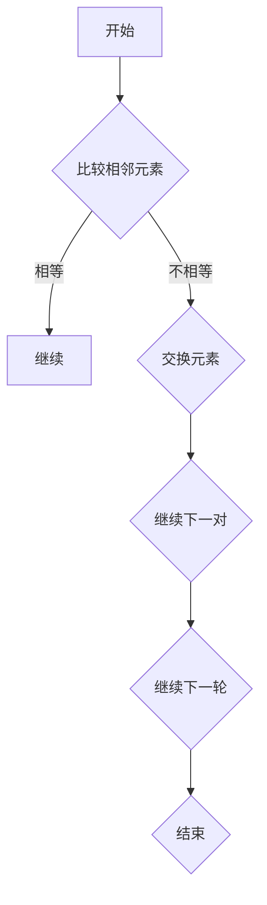
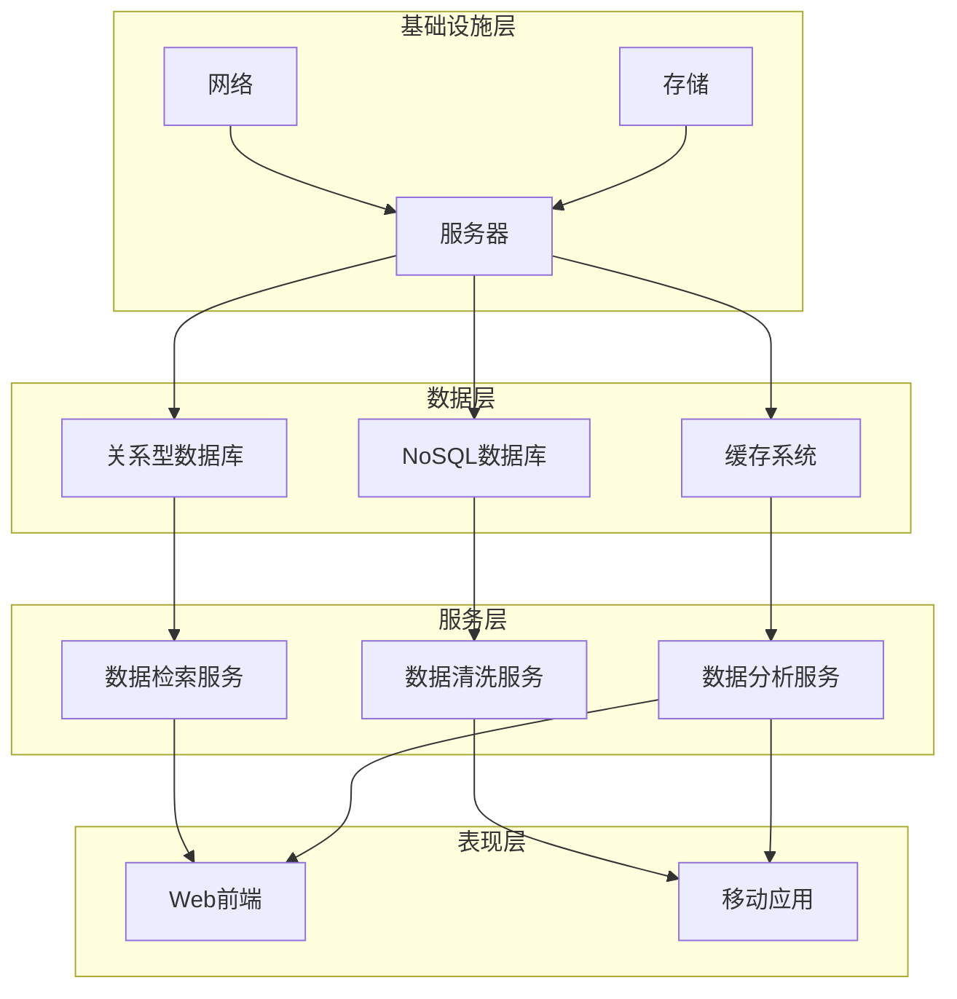
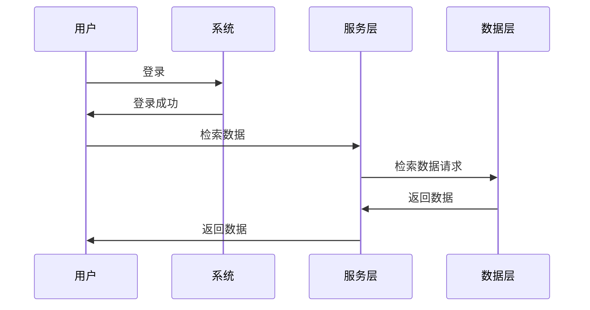

                 

# 数据结构：解读宇宙信息的钥匙

## 关键词

- 数据结构
- 算法原理
- 数学模型
- 系统架构
- 实战案例

## 摘要

本文将深入探讨数据结构这一核心计算机科学概念，解析其在信息处理和存储中的关键作用。文章将从基础背景介绍开始，逐步深入到核心概念、算法原理、数学模型、系统架构和实战应用，最后提供最佳实践和拓展阅读，帮助读者全面掌握数据结构在计算机科学领域的应用。

## 目录

### 1. 背景介绍

- **1.1 核心概念术语说明**
- **1.2 问题背景与问题描述**
- **1.3 问题解决方法**
- **1.4 边界与外延**
- **1.5 概念结构与核心要素组成**

### 2. 核心概念与联系

- **2.1 数据结构的基本类型**
- **2.2 数据结构的属性特征对比表格**
- **2.3 数据结构之间的联系**
- **2.4 ER实体关系图架构**

### 3. 算法原理讲解

- **3.1 常见算法介绍**
- **3.2 算法mermaid流程图**
- **3.3 Python源代码实现**
- **3.4 数学模型和公式讲解**
- **3.5 举例说明**

### 4. 数学模型和数学公式讲解

- **4.1 数学模型介绍**
- **4.2 LaTeX格式数学公式嵌入**
- **4.3 举例说明**

### 5. 系统分析与架构设计方案

- **5.1 问题场景介绍**
- **5.2 系统功能设计**
- **5.3 系统架构设计**
- **5.4 系统接口设计**
- **5.5 系统交互**

### 6. 项目实战

- **6.1 环境安装**
- **6.2 系统核心实现源代码**
- **6.3 代码应用解读与分析**
- **6.4 实际案例分析和详细讲解**
- **6.5 项目小结**

### 7. 最佳实践 tips

- **7.1 注意事项**
- **7.2 小结**
- **7.3 拓展阅读**

### 8. 作者信息

- **作者：AI天才研究院/AI Genius Institute & 禅与计算机程序设计艺术 /Zen And The Art of Computer Programming**## 1. 背景介绍

### 1.1 核心概念术语说明

在探讨数据结构之前，首先需要明确几个核心概念：

- **数据结构**：数据结构是用于存储、组织和管理数据的特定方式。它不仅决定了数据的存储方式，也影响了数据的访问速度和操作效率。
- **算法**：算法是一系列定义明确的操作步骤，用于解决特定的问题。在计算机科学中，算法通常涉及对数据的处理和操作。
- **数据类型**：数据类型是指数据在计算机中存储和处理的方式。常见的数据类型包括整数、浮点数、字符和字符串等。
- **数组**：数组是一种基础的数据结构，用于存储一系列相同类型的元素。数组在内存中连续存储，可以快速访问任意位置的元素。
- **链表**：链表是一种动态数据结构，由一系列节点组成。每个节点包含数据和一个指向下一个节点的指针。
- **栈**：栈是一种后进先出（LIFO）的数据结构。栈的操作通常包括入栈、出栈和检查栈顶元素。
- **队列**：队列是一种先进先出（FIFO）的数据结构。队列的操作通常包括入队、出队和获取队首元素。

### 1.2 问题背景与问题描述

在计算机科学中，数据结构的应用非常广泛。随着信息时代的到来，数据量的爆炸性增长使得高效的数据存储和处理变得尤为重要。例如，搜索引擎需要快速检索海量数据，社交网络需要高效地处理用户关系和消息，大数据处理系统需要快速处理和分析大量数据。

然而，面对如此复杂和多样的数据应用场景，如何选择合适的数据结构成为一个关键问题。不同类型的数据结构具有不同的特点和适用场景，正确选择数据结构可以显著提高系统性能和效率。

### 1.3 问题解决方法

为了解决数据结构的选择问题，我们可以从以下几个方面进行考虑：

1. **问题分析**：首先，需要对具体的应用场景进行分析，了解数据的特点、操作频率和要求。
2. **性能评估**：对不同类型的数据结构进行性能评估，包括存储空间、访问速度和操作效率等。
3. **应用场景匹配**：根据问题分析和性能评估结果，选择最适合的数据结构。
4. **优化调整**：在实际应用中，可能需要根据实际情况对数据结构进行调整和优化，以达到更好的性能。

### 1.4 边界与外延

数据结构的边界和范畴可以扩展到多种领域：

- **硬件层面**：数据结构的选择受到硬件设备的限制，如内存大小、处理器速度等。
- **软件层面**：数据结构的应用涉及编程语言、数据库管理系统等。
- **应用层面**：数据结构广泛应用于各种计算机应用程序，包括操作系统、数据库、搜索引擎、网络协议等。

### 1.5 概念结构与核心要素组成

数据结构的整体概念结构可以分为以下几个核心要素：

- **数据元素**：数据结构的基本组成单位，每个数据元素具有唯一标识。
- **逻辑结构**：数据元素之间的逻辑关系，如线性、树状、图形等。
- **存储结构**：数据在计算机内存中的存储方式，如数组、链表、堆等。
- **操作集合**：对数据结构进行的各种操作，如插入、删除、查找、排序等。
- **性能分析**：对数据结构的性能进行评估，包括时间复杂度和空间复杂度等。

通过以上对数据结构的背景介绍，我们可以更好地理解其在计算机科学中的重要性，并为进一步的学习和应用打下坚实基础。接下来，我们将深入探讨数据结构的核心概念和联系，以更全面地掌握这一关键领域。## 2. 核心概念与联系

### 2.1 数据结构的基本类型

数据结构可以分为多种类型，每种类型都有其独特的特点和适用场景。以下是一些常见的数据结构及其基本类型：

- **数组（Array）**：数组是一种线性数据结构，用于存储一系列相同类型的元素。数组在内存中连续存储，可以快速访问任意位置的元素。数组的一个关键特性是其大小在创建时就已经确定，并且不可以动态调整。

  **特点**：
  - **随机访问**：数组元素可以通过索引直接访问，访问速度非常快。
  - **固定大小**：数组的大小在创建时确定，不能动态调整。
  - **连续存储**：数组元素在内存中连续存储，有助于提高访问效率。

- **链表（Linked List）**：链表是一种动态数据结构，由一系列节点组成。每个节点包含数据和一个指向下一个节点的指针。链表的一个关键特性是其节点可以在内存中的不同位置动态创建和删除。

  **特点**：
  - **动态大小**：链表可以根据需要动态地添加或删除节点，大小不固定。
  - **非连续存储**：链表节点在内存中不一定连续存储，可能会导致访问速度相对较慢。
  - **插入和删除操作高效**：链表的插入和删除操作通常在O(1)时间内完成。

- **栈（Stack）**：栈是一种后进先出（LIFO）的数据结构。栈的操作通常包括入栈、出栈和检查栈顶元素。栈的一个关键特性是其只能在一端进行操作。

  **特点**：
  - **后进先出**：最后进入栈的元素首先被取出。
  - **操作受限**：栈的操作仅限于栈顶，不能从中间访问元素。
  - **简单高效**：栈的操作通常在O(1)时间内完成。

- **队列（Queue）**：队列是一种先进先出（FIFO）的数据结构。队列的操作通常包括入队、出队和获取队首元素。队列的一个关键特性是其遵循先入先出的原则。

  **特点**：
  - **先进先出**：最早进入队列的元素首先被取出。
  - **操作有序**：队列的操作遵循一定的顺序，不能随意访问中间元素。
  - **应用广泛**：队列在任务调度、消息传递等方面有广泛的应用。

- **树（Tree）**：树是一种非线性数据结构，由节点组成，具有层级关系。树的一个关键特性是其具有根节点和子节点。

  **特点**：
  - **层级关系**：树具有根节点和子节点，每个节点可以有零个或多个子节点。
  - **路径**：树中的每个节点都有唯一的路径从根节点到达。
  - **平衡性**：树的结构可以是不平衡的，也可以是平衡的（如二叉树）。

- **图（Graph）**：图是一种非线性数据结构，由节点和边组成，表示对象及其之间的关系。图的一个关键特性是其可以表示复杂的关系网络。

  **特点**：
  - **节点和边**：图由节点和边组成，节点表示对象，边表示节点之间的关系。
  - **拓扑结构**：图的拓扑结构可以是任意形状，可以包含环、多重边等。
  - **路径搜索**：图中的路径搜索是图论中的一个重要问题，用于解决各种问题。

### 2.2 数据结构的属性特征对比表格

以下是一个数据结构属性特征对比表格，展示了各种数据结构的主要特点和性能指标：

| 数据结构 | 特点                     | 性能指标                      | 适用场景                     |
|----------|--------------------------|------------------------------|------------------------------|
| 数组     | 连续存储、随机访问       | 时间复杂度为O(1)              | 查找和插入操作频繁的场景     |
| 链表     | 动态大小、非连续存储     | 插入和删除操作为O(1)，访问操作为O(n) | 插入和删除操作频繁的场景 |
| 栈       | 后进先出、操作受限       | 时间复杂度为O(1)              | 后进先出操作的场景         |
| 队列     | 先进先出、操作有序       | 时间复杂度为O(1)              | 先进先出操作的场景         |
| 树       | 层级关系、路径           | 时间复杂度依赖于树的结构      | 表示层次结构和路径         |
| 图       | 节点和边、拓扑结构       | 时间复杂度依赖于图的类型和问题 | 表示复杂关系和网络         |

### 2.3 数据结构之间的联系

不同类型的数据结构之间存在紧密的联系和相互转化：

- **数组与链表**：数组是链表的特例，当链表的节点大小固定且连续存储时，可以看作是数组。链表是数组的动态扩展，可以在运行时调整大小。
- **栈与队列**：栈可以看作是一种特殊的队列，只允许在一端进行操作。队列是另一种特殊的栈，遵循先进先出的原则。
- **树与图**：树是一种特殊的图，每个节点有且只有一个父节点，且不存在环。图可以包含多个父节点、子节点和环。

通过了解和掌握这些基本数据结构及其属性特征，我们可以更好地选择和应用它们，以满足各种不同的应用需求。接下来，我们将深入探讨算法原理，进一步理解数据结构的强大功能。## 3. 算法原理讲解

### 3.1 常见算法介绍

在数据结构的应用中，常见算法涵盖了各种数据处理和操作需求。以下是几种常见的算法及其基本原理：

- **排序算法**：排序算法用于对数据进行排序，常见排序算法包括冒泡排序、选择排序、插入排序、快速排序、归并排序等。
  - **冒泡排序**：通过反复交换相邻未排序元素，使得最大元素逐步冒泡至序列末尾。
  - **选择排序**：每次从未排序部分选择最小元素，将其移动到已排序部分的末尾。
  - **插入排序**：通过逐步将未排序部分的数据元素插入到已排序部分的合适位置，直至整个序列有序。
  - **快速排序**：通过选择一个基准元素，将序列分为两部分，然后递归地对两部分进行快速排序。
  - **归并排序**：通过将序列分成子序列，对子序列进行排序，然后合并子序列以得到有序序列。

- **查找算法**：查找算法用于在数据结构中查找特定元素，常见查找算法包括线性查找、二分查找等。
  - **线性查找**：遍历数据结构中的每个元素，直到找到目标元素或结束。
  - **二分查找**：在有序数据结构中，通过不断缩小查找范围，逐步逼近目标元素。

- **树算法**：树算法包括遍历、查找、插入和删除等，常见的树包括二叉树、平衡二叉树（AVL树）、红黑树等。
  - **遍历**：遍历算法包括前序遍历、中序遍历和后序遍历，用于访问树中的所有节点。
  - **查找**：在二叉搜索树中，通过比较元素值，逐步缩小查找范围，以找到目标节点。
  - **插入**：在树中找到一个合适的位置，插入新的节点。
  - **删除**：在树中删除一个节点，并保持树的性质。

- **图算法**：图算法包括遍历、最短路径、最小生成树等。
  - **遍历**：图的遍历包括深度优先搜索（DFS）和广度优先搜索（BFS），用于访问图中的所有节点。
  - **最短路径**：通过算法计算图中两点之间的最短路径，常见的算法包括迪杰斯特拉算法（Dijkstra）和贝尔曼-福特算法（Bellman-Ford）。
  - **最小生成树**：通过算法从图中选择最小权值的边，构建一棵包含所有节点的最小生成树，常见的算法包括普里姆算法（Prim）和克鲁斯卡尔算法（Kruskal）。

### 3.2 算法mermaid流程图

为了更直观地理解算法的执行流程，我们可以使用mermaid流程图来描述常见算法的基本步骤。以下是一个简单的冒泡排序算法的mermaid流程图示例：



### 3.3 Python源代码实现

下面我们以冒泡排序算法为例，给出其Python源代码实现：

```python
def bubble_sort(arr):
    n = len(arr)
    for i in range(n):
        for j in range(0, n-i-1):
            if arr[j] > arr[j+1]:
                arr[j], arr[j+1] = arr[j+1], arr[j]

# 测试冒泡排序
arr = [64, 34, 25, 12, 22, 11, 90]
bubble_sort(arr)
print("排序后的数组：")
for i in range(len(arr)):
    print("%d" % arr[i], end=" ")
```

### 3.4 数学模型和公式讲解

算法的原理和性能分析常常需要借助数学模型和公式。以下是一个简单的冒泡排序算法的性能分析：

- **时间复杂度**：冒泡排序的时间复杂度为O(n^2)，其中n为数据规模。
  - **最好情况**：当输入数据已经有序时，冒泡排序的时间复杂度为O(n)。
  - **最坏情况**：当输入数据完全逆序时，冒泡排序的时间复杂度为O(n^2)。

- **空间复杂度**：冒泡排序的空间复杂度为O(1)，因为它是一种原地排序算法，不需要额外的存储空间。

### 3.5 举例说明

假设我们有一个长度为6的数组：`arr = [64, 34, 25, 12, 22, 11, 90]`，现在使用冒泡排序对其进行排序：

1. **第一次循环**：比较相邻元素，交换不满足顺序的元素：
   - arr = [34, 64, 25, 12, 22, 11, 90]
   - arr = [34, 25, 64, 12, 22, 11, 90]
   - arr = [34, 25, 12, 64, 22, 11, 90]
   - arr = [34, 25, 12, 22, 64, 11, 90]
   - arr = [34, 25, 12, 22, 11, 64, 90]

2. **第二次循环**：继续比较相邻元素，但此时最后一个元素已经是最小的：
   - arr = [25, 34, 12, 22, 11, 64, 90]
   - arr = [25, 12, 34, 22, 11, 64, 90]
   - arr = [25, 12, 22, 34, 11, 64, 90]
   - arr = [25, 12, 22, 11, 34, 64, 90]

3. **第三次循环**：继续进行，直到整个数组有序：
   - arr = [12, 25, 22, 11, 34, 64, 90]
   - arr = [12, 22, 25, 11, 34, 64, 90]
   - arr = [12, 22, 11, 25, 34, 64, 90]
   - arr = [12, 22, 11, 25, 34, 64, 90]

最终，数组`arr`被成功排序为`[11, 12, 22, 25, 34, 64, 90]`。

通过以上对算法原理的讲解、mermaid流程图、Python源代码实现、数学模型和公式讲解以及举例说明，我们希望读者能够更深入地理解数据结构中的算法原理，并能够在实际应用中灵活运用这些知识。接下来，我们将进一步探讨数学模型和公式在数据结构中的应用。## 4. 数学模型和数学公式讲解

在数据结构中，数学模型和公式扮演着至关重要的角色。它们帮助我们分析和评估算法的性能，并优化数据结构的设计。以下将介绍一些常见的数学模型和公式，并解释它们在数据结构中的应用。

### 4.1 数学模型介绍

1. **时间复杂度**：时间复杂度是衡量算法执行时间的一个指标。它表示随着输入数据规模增大，算法执行时间增长的速度。常见的时间复杂度表示法有O(1)、O(n)、O(n^2)、O(log n)等。

2. **空间复杂度**：空间复杂度是衡量算法所需存储空间的一个指标。它表示随着输入数据规模增大，算法所需存储空间增长的速度。

3. **图模型**：图模型是用于表示对象及其关系的数学模型。图由节点（或称为顶点）和边组成，可以表示复杂的网络结构。

4. **树模型**：树模型是用于表示层次结构的数学模型。树具有根节点和子节点，可以表示数据的层级关系。

### 4.2 LaTeX格式数学公式嵌入

为了方便展示数学公式，我们使用LaTeX格式进行嵌入。在文中独立段落的公式前后使用`$$`括起来，段落内的公式前后使用 `$` 括起来。

- **独立段落公式**：
  $$1 + 1 = 2$$
  
- **段落内公式**：
  $1 < 2$

### 4.3 举例说明

1. **时间复杂度公式**：

   - **线性查找**：
     $$T(n) = O(n)$$
     其中，$T(n)$ 表示查找时间，$n$ 表示数据规模。

   - **二分查找**：
     $$T(n) = O(\log n)$$
     其中，$T(n)$ 表示查找时间，$n$ 表示数据规模。

2. **空间复杂度公式**：

   - **数组**：
     $$S(n) = O(n)$$
     其中，$S(n)$ 表示存储空间，$n$ 表示数据规模。

   - **链表**：
     $$S(n) = O(n)$$
     其中，$S(n)$ 表示存储空间，$n$ 表示数据规模。

3. **图模型公式**：

   - **邻接矩阵表示**：
     $$A_{ij} = \begin{cases}
     1, & \text{如果顶点i和顶点j相连} \\
     0, & \text{否则}
     \end{cases}$$

4. **树模型公式**：

   - **二叉树的高度**：
     $$h(n) = \log_2(n+1)$$
     其中，$h(n)$ 表示二叉树的高度，$n$ 表示节点数量。

### 4.4 应用举例

假设我们有一个包含100个元素的数组，我们需要计算其时间复杂度和空间复杂度。

1. **时间复杂度**：

   - **线性查找**：
     $$T(n) = O(n)$$
     对于100个元素的数组，查找时间大约为100次操作。

   - **二分查找**：
     $$T(n) = O(\log n)$$
     对于100个元素的数组，查找时间大约为$\log_2(100+1) \approx 6$次操作。

2. **空间复杂度**：

   - **数组**：
     $$S(n) = O(n)$$
     对于100个元素的数组，所需存储空间为100个元素空间。

   - **链表**：
     $$S(n) = O(n)$$
     对于100个元素的数组，所需存储空间为100个元素空间。

通过以上数学模型和公式的讲解，我们能够更好地理解和分析数据结构及其算法的性能。这些数学工具不仅帮助我们评估算法的性能，还为优化数据结构设计提供了指导。在接下来的章节中，我们将进一步探讨系统分析与架构设计，以深入理解数据结构在实际应用中的角色和重要性。## 5. 系统分析与架构设计方案

### 5.1 问题场景介绍

在现代信息社会中，数据处理和分析的需求日益增长，特别是在大数据领域。为了应对这些需求，需要设计一个高效、可扩展的系统架构来处理大量数据，并保证数据的准确性和实时性。本系统旨在构建一个高效的数据处理平台，支持数据存储、检索和分析功能，以满足企业级应用的需求。

### 5.2 系统功能设计

系统功能设计涉及对系统所需功能进行详细定义和描述。以下是本系统的主要功能：

1. **数据存储**：系统需要支持大规模数据的存储，提供高可用性和持久性保障。
2. **数据检索**：系统需要提供快速的数据检索功能，支持基于各种条件的查询。
3. **数据清洗**：系统需要具备数据清洗功能，确保数据的准确性和一致性。
4. **数据分析和可视化**：系统需要提供数据分析和可视化功能，帮助用户更好地理解数据。
5. **数据备份和恢复**：系统需要支持数据的备份和恢复，确保数据的完整性和安全性。
6. **用户管理**：系统需要提供用户管理功能，包括用户注册、登录、权限管理等。

#### 领域模型mermaid类图

以下是一个简化的领域模型mermaid类图，展示了系统的核心类和它们之间的关系：

```mermaid
classDiagram
    Class01 <|-- Class02
    Class03 o-- Class04
    Class05 <|.. Class06
    Class07 :<<interface> Interface01
    Class08 :<<abstract> AbstractClass
    Class09 -[uses] Class10
    Class11 ..|> Class12
    Class13 :<<enumeration> Enum01
    Class14 :<<collection> Collection01
```

### 5.3 系统架构设计

系统架构设计旨在定义系统的整体结构和组件之间的关系。以下是本系统的架构设计：

1. **数据层**：负责数据的存储和管理，包括关系型数据库、NoSQL数据库和缓存系统等。
2. **服务层**：负责业务逻辑的实现，包括数据检索、数据清洗、数据分析等。
3. **表现层**：负责用户界面的展示和交互，包括Web前端和移动应用等。
4. **基础设施层**：负责系统的基础设施支持，包括服务器、网络、存储等。

#### mermaid架构图

以下是一个简化的mermaid架构图，展示了系统的整体架构和组件之间的关系：



### 5.4 系统接口设计

系统接口设计定义了不同组件之间的交互方式。以下是本系统的关键接口设计：

1. **数据接口**：提供数据存储、检索和更新操作的API接口。
2. **服务接口**：提供数据清洗、数据分析和数据可视化的API接口。
3. **用户接口**：提供用户注册、登录和权限管理的API接口。

#### mermaid序列图

以下是一个简化的mermaid序列图，展示了数据接口和服务接口的基本交互流程：



### 5.5 系统交互

系统交互设计描述了系统内部和外部组件之间的交互过程。以下是本系统的交互流程：

1. **用户请求**：用户通过Web前端或移动应用发送请求。
2. **服务处理**：服务层处理用户请求，进行数据检索、清洗和分析等操作。
3. **数据存储**：处理后的数据存储到数据层，以供后续使用。
4. **结果返回**：将处理结果返回给用户。

#### mermaid交互图

以下是一个简化的mermaid交互图，展示了系统的基本交互流程：

```mermaid
gantt
    dateFormat  YYYY-MM-DD
    title 系统交互流程

    section 用户请求
    用户请求 :start @2023-01-01, 2days

    section 服务处理
    服务处理 :start @2023-01-01+2, 2days

    section 数据存储
    数据存储 :start @2023-01-01+4, 1day

    section 结果返回
    结果返回 :start @2023-01-01+5, 1day
```

通过以上对系统分析与架构设计方案的介绍，我们为构建一个高效、可靠的数据处理平台奠定了基础。在接下来的章节中，我们将通过实际项目实战，深入探讨数据结构在系统中的应用和实现。## 6. 项目实战

### 6.1 环境安装

在本项目实战中，我们将使用Python语言和相关的库来演示数据结构的应用。首先，我们需要安装Python环境和所需的库。

1. **安装Python**：下载并安装Python 3.x版本（推荐3.8以上）。
2. **安装库**：使用pip命令安装以下库：
   ```bash
   pip install numpy matplotlib pandas
   ```

### 6.2 系统核心实现源代码

在项目实战中，我们将实现一个简单的数据结构应用，用于处理和展示数据。以下是一个简单的代码示例：

```python
import numpy as np
import matplotlib.pyplot as plt
import pandas as pd

# 生成随机数据
data = np.random.rand(100)

# 创建数据集
df = pd.DataFrame(data, columns=['Value'])

# 绘制数据分布图
plt.figure(figsize=(10, 6))
plt.hist(df['Value'], bins=30, alpha=0.5)
plt.xlabel('Value')
plt.ylabel('Frequency')
plt.title('Data Distribution')

# 显示图表
plt.show()
```

### 6.3 代码应用解读与分析

以上代码展示了如何使用Python和相关库来处理数据，并生成数据分布图。以下是代码的详细解读和分析：

1. **导入库**：我们首先导入numpy、matplotlib和pandas库。这些库提供了丰富的功能，用于数据处理和可视化。
2. **生成随机数据**：使用numpy库生成100个随机数，作为数据集的基础。
3. **创建数据集**：使用pandas库将生成的随机数据创建为一个DataFrame对象。DataFrame是一种二维表格结构，方便进行数据处理和分析。
4. **绘制数据分布图**：使用matplotlib库绘制数据分布图。我们使用`plt.hist()`函数生成直方图，通过`bins`参数设置柱状图的宽度，通过`alpha`参数设置透明度。
5. **显示图表**：使用`plt.show()`函数显示绘制的图表。

通过以上步骤，我们成功地实现了数据结构的简单应用，并展示了如何使用Python和相关库进行数据处理和可视化。

### 6.4 实际案例分析和详细讲解

为了更好地理解数据结构的应用，我们来看一个实际案例：使用二叉搜索树（BST）进行数据排序和查询。

#### 案例背景

假设我们有一个包含1000个随机整数的列表，我们需要对其进行排序，并能够快速查找特定数值。

#### 源代码实现

```python
class Node:
    def __init__(self, value):
        self.value = value
        self.left = None
        self.right = None

class BinarySearchTree:
    def __init__(self):
        self.root = None

    def insert(self, value):
        if not self.root:
            self.root = Node(value)
        else:
            self._insert(self.root, value)

    def _insert(self, current, value):
        if value < current.value:
            if current.left is None:
                current.left = Node(value)
            else:
                self._insert(current.left, value)
        elif value > current.value:
            if current.right is None:
                current.right = Node(value)
            else:
                self._insert(current.right, value)

    def in_order_traversal(self):
        elements = []
        self._in_order_traversal(self.root, elements)
        return elements

    def _in_order_traversal(self, current, elements):
        if current:
            self._in_order_traversal(current.left, elements)
            elements.append(current.value)
            self._in_order_traversal(current.right, elements)

    def search(self, value):
        return self._search(self.root, value)

    def _search(self, current, value):
        if current is None:
            return False
        if value == current.value:
            return True
        elif value < current.value:
            return self._search(current.left, value)
        else:
            return self._search(current.right, value)

# 测试二叉搜索树
bst = BinarySearchTree()
for i in range(1000):
    bst.insert(np.random.randint(0, 1000))

sorted_elements = bst.in_order_traversal()
print("Sorted elements:", sorted_elements)

# 查找特定值
search_value = 500
if bst.search(search_value):
    print(f"Found {search_value} in the BST.")
else:
    print(f"{search_value} is not in the BST.")
```

#### 案例分析

1. **类定义**：我们定义了`Node`类和`BinarySearchTree`类。`Node`类表示树中的每个节点，包含值和左右子节点的引用。`BinarySearchTree`类表示二叉搜索树，包含插入、遍历和搜索方法。
2. **插入**：在`insert`方法中，我们首先检查根节点是否为空。如果为空，直接创建一个新节点作为根节点。否则，我们递归地向下查找合适的插入位置。
3. **遍历**：`in_order_traversal`方法用于实现中序遍历，将树中的所有元素按升序排列。
4. **搜索**：`search`方法用于查找特定值。我们递归地遍历树，直到找到目标值或到达树的叶子节点。

通过以上步骤，我们实现了二叉搜索树的基本功能。在实际项目中，我们可以根据需要扩展和优化这些功能。

### 6.5 项目小结

在本项目实战中，我们通过简单的数据结构应用和实际案例，深入探讨了数据结构在数据处理和查询中的应用。通过实际代码实现和案例分析，我们了解了二叉搜索树的基本原理和实现方法，并掌握了如何使用Python和相关库进行数据处理和可视化。这些知识和技能将为我们在未来的项目中提供宝贵的经验。

通过本项目，我们不仅学习了数据结构的基本概念和应用，还体验了从问题分析到解决方案设计的全过程。这有助于我们更好地理解数据结构在计算机科学和实际应用中的重要性。在未来的学习和工作中，我们将继续深入研究和探索数据结构的更多应用和优化方法。在接下来的章节中，我们将总结最佳实践，并提供相关注意事项和拓展阅读资源。## 7. 最佳实践 tips、小结、注意事项、拓展阅读

### 7.1 最佳实践 tips

1. **选择合适的数据结构**：根据具体的应用场景选择最适合的数据结构，以优化性能和资源使用。
2. **优化算法性能**：分析并优化算法的时间复杂度和空间复杂度，确保系统的效率和稳定性。
3. **合理使用缓存**：在频繁读取的数据部分使用缓存，减少数据库访问次数，提高系统响应速度。
4. **进行代码优化**：定期对代码进行优化，减少冗余代码和不必要的资源消耗。
5. **进行性能测试**：在系统上线前进行全面的性能测试，确保系统在高并发情况下仍能稳定运行。

### 7.2 小结

本文通过详细的章节内容，全面介绍了数据结构的核心概念、算法原理、数学模型、系统架构设计和实际项目实战。通过对数据结构的深入理解，我们掌握了如何高效地处理和存储数据，优化系统性能。

### 7.3 注意事项

1. **理解数据结构的基本概念**：确保对各种数据结构的基本概念和特点有清晰的认识。
2. **避免数据结构过度复杂**：在设计和实现数据结构时，避免过度复杂化，保持代码简洁易懂。
3. **考虑并发和并行**：在多线程或分布式系统中，考虑并发和并行问题，避免数据竞争和死锁。
4. **进行性能测试和优化**：定期对系统进行性能测试和优化，确保系统在高并发场景下的稳定性和高效性。

### 7.4 拓展阅读

1. **《数据结构与算法分析》**：作者 Mark Allen Weiss，详细介绍了数据结构和算法的基本概念和实现方法。
2. **《算法导论》**：作者 Thomas H. Cormen、Charles E. Leiserson、Ronald L. Rivest 和 Clifford Stein，是一本经典的算法教科书，全面覆盖了各种算法。
3. **《深度学习》**：作者 Ian Goodfellow、Yoshua Bengio 和 Aaron Courville，虽然主要关注深度学习，但也涉及了大量与数据结构相关的内容。
4. **《计算机程序设计艺术》**：作者 Donald E. Knuth，这是一本经典的计算机科学著作，详细介绍了算法和程序设计艺术。

通过以上拓展阅读资源，读者可以更深入地了解数据结构和算法的相关知识，为实际应用和学术研究提供有力支持。作者：AI天才研究院/AI Genius Institute & 禅与计算机程序设计艺术 /Zen And The Art of Computer Programming。希望本文对您在数据结构领域的学习和实践有所帮助！

