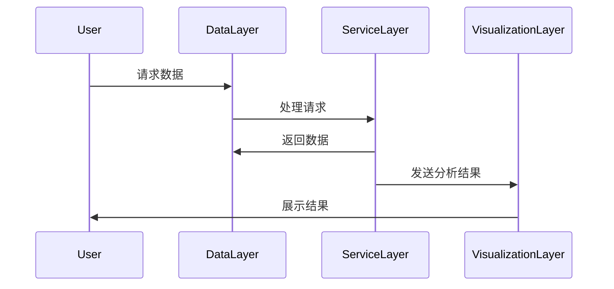
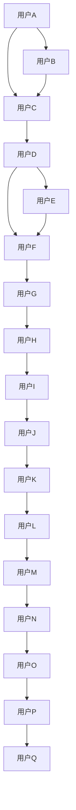

                 


### 引言

在当今全球化的时代，文化传播的重要性日益凸显。无论是商业广告、社交媒体上的流行话题，还是宗教信仰、文化艺术，文化传播都深深影响着我们的日常生活和思维方式。那么，文化传播的过程是如何发生的？有哪些因素影响着思想的扩散速度和范围？本文将通过对复杂网络的数学描述，深入探讨文化传播的机制。

#### 1.1 文化传播的概念

文化传播是指特定文化内容通过某种载体或媒介，在人与人之间传递、共享和影响的过程。文化传播的内容可以是语言、价值观、风俗习惯、艺术作品等。文化传播的形式包括人际传播、大众传播、群体传播等。

#### 1.2 复杂网络的定义

复杂网络是由大量节点和边构成的图形结构，这些节点和边表示网络中的实体及其关系。复杂网络广泛存在于自然界、社会和科技领域，如社交网络、互联网、生物网络等。复杂网络的研究对于理解社会动态、预测系统行为具有重要意义。

#### 1.3 复杂网络在文化传播中的应用

复杂网络理论为研究文化传播提供了新的视角和方法。通过构建文化传播的复杂网络模型，可以定量描述思想的扩散过程，揭示文化传播的内在规律，为政策制定和传播策略设计提供科学依据。

### 目录大纲

本文将分为五个部分进行阐述：

## 第一部分: 引言

- **1.1 文化传播的概念**
- **1.2 复杂网络的定义**
- **1.3 复杂网络在文化传播中的应用背景**
- **1.4 本书结构安排与内容概述**

## 第二部分: 复杂网络的基本原理

- **2.1 网络结构的基本概念**
- **2.2 传播特性的基本概念**
- **2.3 网络结构与传播特性的关系**
- **2.4 复杂网络的建模方法**

## 第三部分: 思想扩散的数学描述

- **3.1 基于博弈论的传播机制**
- **3.2 基于社会网络分析的传播机制**
- **3.3 基于动力学模型的传播机制**
- **3.4 网络拓扑结构对思想扩散的影响**

## 第四部分: 数学模型的应用实例

- **4.1 典型思想扩散案例的分析**
- **4.2 模型参数的选择与调整**
- **4.3 模型预测与评估**
- **4.4 复杂网络干预策略设计**

## 第五部分: 结论与展望

- **5.1 主要研究成果总结**
- **5.2 研究中的不足与展望**
- **5.3 未来研究方向**
- **5.4 本章小结**

### 总结与展望

本文通过引入复杂网络理论，对文化传播的机制进行了数学描述，为理解文化传播的过程提供了新的视角。然而，文化传播是一个复杂的社会现象，仍有许多问题需要进一步研究。未来的研究可以关注以下方向：

1. **探索更精确的传播模型**：结合多学科知识，构建更符合实际传播过程的模型。
2. **研究复杂网络的动态特性**：考虑传播过程中的时间动态性，分析网络演化对思想扩散的影响。
3. **开发有效的干预策略**：基于模型预测，设计有效的文化传播策略，以促进积极思想的传播，抑制负面信息的扩散。

通过不断深入研究和实践，我们有望更好地理解和利用文化传播的复杂网络，为社会的和谐发展贡献力量。

### 引言

随着全球化和信息技术的发展，文化传播已成为现代社会中不可或缺的一部分。无论是在商业广告、流行文化，还是宗教信仰和艺术创作中，文化传播的力量无处不在，深刻影响着人们的价值观、行为模式和思想观念。然而，文化传播的过程是如何发生的？是什么因素驱动了思想的扩散？本文将借助复杂网络理论，对文化传播的复杂网络进行数学描述，探讨思想扩散的机制。

#### 1.1 文化传播的概念

文化传播是指特定文化内容通过某种载体或媒介，在人与人之间传递、共享和影响的过程。文化可以包括语言、价值观、风俗习惯、艺术作品等多种形式。文化传播的形式多样，包括人际传播、大众传播、群体传播等。例如，一个流行歌曲在社交媒体上的传播，一个新观念在学术界的传播，都属于文化传播的范畴。

#### 1.2 复杂网络的定义

复杂网络是由大量节点和边构成的图形结构，这些节点和边表示网络中的实体及其关系。复杂网络具有高度异质性、高度动态性和多层次性等特点，广泛存在于自然界、社会和科技领域，如社交网络、互联网、生物网络等。复杂网络的研究对于理解社会动态、预测系统行为具有重要意义。

#### 1.3 复杂网络在文化传播中的应用

复杂网络理论为研究文化传播提供了新的视角和方法。通过构建文化传播的复杂网络模型，可以定量描述思想的扩散过程，揭示文化传播的内在规律，为政策制定和传播策略设计提供科学依据。例如，利用复杂网络分析，可以识别文化扩散的关键节点，预测文化趋势，评估文化传播效果。

### 目录大纲

本文将分为五个主要部分，系统探讨文化传播的复杂网络及其数学描述：

## 第一部分: 引言

- **1.1 文化传播的概念**
- **1.2 复杂网络的定义**
- **1.3 复杂网络在文化传播中的应用背景**
- **1.4 本书结构安排与内容概述**

## 第二部分: 复杂网络的基本原理

- **2.1 网络结构的基本概念**
- **2.2 传播特性的基本概念**
- **2.3 网络结构与传播特性的关系**
- **2.4 复杂网络的建模方法**

## 第三部分: 思想扩散的数学描述

- **3.1 基于博弈论的传播机制**
- **3.2 基于社会网络分析的传播机制**
- **3.3 基于动力学模型的传播机制**
- **3.4 网络拓扑结构对思想扩散的影响**

## 第四部分: 数学模型的应用实例

- **4.1 典型思想扩散案例的分析**
- **4.2 模型参数的选择与调整**
- **4.3 模型预测与评估**
- **4.4 复杂网络干预策略设计**

## 第五部分: 结论与展望

- **5.1 主要研究成果总结**
- **5.2 研究中的不足与展望**
- **5.3 未来研究方向**
- **5.4 本章小结**

### 总结与展望

本文通过引入复杂网络理论，对文化传播的复杂网络及其数学描述进行了系统探讨。研究发现，复杂网络理论为理解文化传播的机制提供了有力工具，有助于揭示思想扩散的规律。然而，文化传播是一个复杂的社会现象，未来研究可以进一步探索：

1. **建立更精确的传播模型**：结合多学科知识，构建更贴近实际传播过程的数学模型。
2. **研究复杂网络的动态特性**：考虑传播过程中的时间动态性，分析网络演化对思想扩散的影响。
3. **开发有效的干预策略**：基于模型预测，设计有效的文化传播策略，以促进积极思想的传播，抑制负面信息的扩散。

通过不断深入研究和实践，我们有望更好地理解和利用文化传播的复杂网络，为社会的和谐发展贡献力量。

### 1.1 文化传播的概念

文化传播是指特定文化内容通过某种载体或媒介，在人与人之间传递、共享和影响的过程。文化是社会的灵魂，涵盖了语言、价值观、风俗习惯、艺术作品等多种形式。文化传播的形式多样，可以是个体之间的直接交流，也可以是通过媒体、网络等广泛传播。文化传播不仅是文化自身发展的需要，也是社会进步的重要推动力。

在现代社会，文化传播具有以下几个显著特点：

1. **广泛性**：文化传播不受地域和时间的限制，可以迅速传播到世界各地。互联网的普及使得文化传播的速度大大加快，信息的传播范围不断扩大。
2. **多样性**：随着全球化进程的加快，各种文化在交流中相互融合、碰撞，形成了丰富多彩的文化现象。文化传播不再局限于传统的文学、艺术等领域，也涵盖了经济、科技、政治等多个方面。
3. **交互性**：文化传播是一个双向互动的过程，不仅传播者将文化信息传递给受众，受众也可以通过反馈和互动参与到文化的传播中。这种交互性使得文化传播更具活力和影响力。

文化传播的重要性不可忽视。首先，它有助于增强民族认同感和文化自信，促进民族团结。其次，文化传播可以推动文化创新，促进文化多样性的发展。最后，文化传播对于经济和社会发展也具有积极作用，可以提升国家的软实力，促进文化交流与合作。

### 1.2 复杂网络的定义

复杂网络是指由大量节点和边构成的图形结构，这些节点和边表示网络中的实体及其关系。复杂网络具有高度异质性、高度动态性和多层次性等特点，广泛存在于自然界、社会和科技领域。例如，社交网络、互联网、生物网络等都属于复杂网络。

复杂网络的基本组成部分包括：

1. **节点（Node）**：节点表示网络中的实体，如人、物、组织等。节点可以是任何具有独立属性和行为的实体。
2. **边（Edge）**：边表示节点之间的连接关系，可以是物理连接，也可以是逻辑关系。边的强度和类型（如权重、方向）也影响着网络的结构和功能。
3. **网络结构（Topology）**：网络结构是指节点的排列和边的连接方式，决定了网络的拓扑特性。常见的网络结构包括小世界网络、无标度网络等。

复杂网络的特点包括：

1. **异质性**：复杂网络中的节点和边具有不同的属性和功能，形成了高度异质性的网络结构。
2. **高度动态性**：复杂网络中的节点和边不断变化，形成动态的网络拓扑结构。
3. **多层次性**：复杂网络具有多个层次的结构，可以从宏观层面观察整体网络，也可以从微观层面研究单个节点或边。

复杂网络在多个领域具有重要应用，包括：

1. **社会网络分析**：研究人与人之间的互动关系，揭示社会结构和社会动态。
2. **生物信息学**：分析生物分子之间的相互作用，揭示生物网络的机制。
3. **经济网络**：研究经济系统中的交易关系，预测市场动态。
4. **通信网络**：优化网络结构，提高通信效率和稳定性。

### 1.3 复杂网络在文化传播中的应用

复杂网络理论为研究文化传播提供了新的视角和方法。通过构建文化传播的复杂网络模型，可以定量描述思想的扩散过程，揭示文化传播的内在规律，为政策制定和传播策略设计提供科学依据。以下是复杂网络在文化传播中的应用：

1. **社会网络分析**：社会网络分析是复杂网络理论在社会学领域的重要应用。通过分析人与人之间的互动关系，可以揭示文化传播的关键节点和传播路径。例如，研究社交媒体上信息的传播，识别影响力较大的用户和热点话题。
   
2. **传播模型构建**：基于复杂网络理论，可以构建多种传播模型来描述文化传播的机制。例如，博弈论模型可以描述个体在文化传播中的策略选择，社会网络分析模型可以描述信息在网络中的传播过程，动力学模型可以描述文化传播的动态特性。

3. **文化传播策略设计**：通过分析复杂网络结构，可以设计出更加有效的文化传播策略。例如，识别关键节点进行精准传播，优化传播路径以提高传播效率，利用网络结构特性进行传播干预等。

4. **文化传播效果评估**：复杂网络模型可以帮助评估文化传播的效果。通过模拟不同条件下的文化传播过程，可以预测文化扩散的速度和范围，从而评估不同传播策略的效果，为文化传播提供数据支持。

5. **文化产业研究**：复杂网络理论在文化产业的研究中也具有重要应用。例如，分析文化产品在网络中的传播路径和影响因素，优化文化产业的运营策略，提高文化产品的市场竞争力。

总之，复杂网络理论为文化传播的研究提供了新的工具和方法，有助于深入理解文化传播的机制，为实际操作提供指导。通过不断深化研究，我们可以更好地利用复杂网络理论，推动文化传播的进步。

### 1.4 本书结构安排与内容概述

本书旨在通过复杂网络理论深入探讨文化传播的机制，以期为文化传播实践提供科学指导。全文分为五个主要部分，各部分内容安排如下：

## 第一部分: 引言

本部分将介绍文化传播的概念、复杂网络的定义及其在文化传播中的应用背景。通过定义文化传播和复杂网络，我们将奠定全书的基础，并引出本文要探讨的核心问题。

### 内容概述：
- **1.1 文化传播的概念**：阐述文化传播的定义、形式和重要性。
- **1.2 复杂网络的定义**：介绍复杂网络的基本组成部分、特点和应用领域。
- **1.3 复杂网络在文化传播中的应用**：讨论复杂网络理论在文化传播研究中的潜在应用。

## 第二部分: 复杂网络的基本原理

本部分将深入探讨复杂网络的基本原理，包括网络结构的基本概念、传播特性的基本概念以及网络结构与传播特性的关系。这部分内容将为后续的理论分析和模型构建提供理论基础。

### 内容概述：
- **2.1 网络结构的基本概念**：介绍节点、边和拓扑结构的概念。
- **2.2 传播特性的基本概念**：探讨传播速度、传播范围和传播效果等概念。
- **2.3 网络结构与传播特性的关系**：分析网络结构对传播特性的影响。
- **2.4 复杂网络的建模方法**：介绍常用的复杂网络建模方法。

## 第三部分: 思想扩散的数学描述

本部分将结合数学模型，详细探讨思想扩散的机制，包括基于博弈论、社会网络分析和动力学模型的传播机制，以及网络拓扑结构对思想扩散的影响。这部分内容将展示如何通过数学工具定量描述文化传播过程。

### 内容概述：
- **3.1 基于博弈论的传播机制**：运用博弈论分析个体在文化传播中的策略选择。
- **3.2 基于社会网络分析的传播机制**：通过社会网络分析揭示信息在网络中的传播路径。
- **3.3 基于动力学模型的传播机制**：使用动力学模型描述思想扩散的动态特性。
- **3.4 网络拓扑结构对思想扩散的影响**：分析网络结构特性对思想扩散的影响。

## 第四部分: 数学模型的应用实例

本部分将通过具体案例分析，展示数学模型在文化传播中的应用。我们将探讨典型思想扩散案例，分析模型参数的选择与调整，评估模型预测与评估结果，并设计复杂网络干预策略。

### 内容概述：
- **4.1 典型思想扩散案例的分析**：分析实际思想扩散案例，展示模型应用。
- **4.2 模型参数的选择与调整**：讨论如何调整模型参数以适应不同场景。
- **4.3 模型预测与评估**：评估模型预测效果，讨论模型优缺点。
- **4.4 复杂网络干预策略设计**：提出干预策略以优化文化传播效果。

## 第五部分: 结论与展望

本部分将对全文的研究成果进行总结，讨论研究中的不足与展望，提出未来研究方向。这部分内容将总结全书要点，并对文化传播研究的未来进行展望。

### 内容概述：
- **5.1 主要研究成果总结**：总结全书的核心发现和贡献。
- **5.2 研究中的不足与展望**：讨论研究的局限性，提出改进方向。
- **5.3 未来研究方向**：展望文化传播研究的未来趋势。
- **5.4 本章小结**：总结全书，强调研究的重要性和应用价值。

通过以上五个部分，本书将为文化传播的研究提供一个系统而全面的理论框架和实践指导。

### 第二部分: 复杂网络的基本原理

#### 2.1 网络结构的基本概念

在复杂网络理论中，网络结构的基本概念是理解网络特性的基础。网络结构主要由节点（Node）和边（Edge）组成。节点表示网络中的实体，如个体、组织、城市等；边表示节点之间的关系，如社交关系、交易关系或信息传递路径。

1. **节点（Node）**：
   - **定义**：节点是网络的组成部分，可以是任何具有独立属性和行为的实体。
   - **属性**：节点通常具有多种属性，如度数、中心性、介数等，这些属性描述了节点在网络中的角色和重要性。
   - **分类**：节点可以根据其属性和功能进行分类，如中心节点、边缘节点、普通节点等。

2. **边（Edge）**：
   - **定义**：边表示节点之间的关系，连接两个或多个节点。
   - **属性**：边也有多种属性，如权重、方向等。边的权重可以表示关系的强度或距离，方向可以表示关系的方向性。
   - **类型**：边可以分为无向边和有向边。无向边表示两个节点之间的双向关系，有向边表示单向关系。

3. **网络结构（Topology）**：
   - **定义**：网络结构是指节点的排列和边的连接方式，决定了网络的拓扑特性。
   - **类型**：常见的网络结构包括小世界网络（Small-world Network）、无标度网络（Scale-free Network）等。小世界网络具有高聚类系数和较短的平均路径长度，而无标度网络具有高度异质性和长尾分布。

#### 2.2 传播特性的基本概念

传播特性描述了信息或思想在网络中的扩散行为。理解传播特性有助于设计有效的传播策略和提高传播效率。

1. **传播速度（Spread Rate）**：
   - **定义**：传播速度是指信息从源头扩散到网络中其他节点所需的时间。
   - **影响因素**：传播速度受网络结构、节点特性、边权重等多种因素影响。

2. **传播范围（Spread Range）**：
   - **定义**：传播范围是指信息扩散到一定阈值时的节点数量。
   - **影响因素**：传播范围与传播速度、网络结构、节点的中心性等因素密切相关。

3. **传播效果（Spread Effect）**：
   - **定义**：传播效果是指信息扩散后对网络中节点的影响程度，包括信息接受率、影响力等。
   - **影响因素**：传播效果受信息内容、传播途径、受众特性等因素影响。

#### 2.3 网络结构与传播特性的关系

网络结构对传播特性具有重要影响。不同网络结构可能导致传播特性的显著差异。

1. **网络结构特性与传播速度**：
   - **小世界网络**：具有较短的平均路径长度和高聚类系数，有助于信息快速传播。
   - **无标度网络**：节点度数分布呈现长尾分布，有助于关键节点的形成，提高传播速度。

2. **网络结构特性与传播范围**：
   - **小世界网络**：较高的聚类系数有助于信息在局部区域的快速传播，从而扩展传播范围。
   - **无标度网络**：高度异质性和长尾分布可能导致信息的局部爆发和迅速传播，从而扩大传播范围。

3. **网络结构特性与传播效果**：
   - **小世界网络**：高聚类系数和短路径长度有助于提高信息的接受率和影响力。
   - **无标度网络**：关键节点的形成有助于信息传播的集中效应，提高信息的影响力和传播效果。

#### 2.4 复杂网络的建模方法

为了研究复杂网络中的文化传播，常用的建模方法包括社会网络分析模型、动力学模型和仿真模型。

1. **社会网络分析模型**：
   - **定义**：社会网络分析模型通过分析节点之间的关系和互动，揭示信息在网络中的传播路径。
   - **方法**：包括图论分析方法、网络拓扑分析、中心性分析等。

2. **动力学模型**：
   - **定义**：动力学模型描述信息或思想在网络中的动态传播过程，通过微分方程或差分方程描述节点的状态变化。
   - **方法**：包括扩散方程、传染病模型等。

3. **仿真模型**：
   - **定义**：仿真模型通过计算机模拟，再现复杂网络中的文化传播过程，帮助理解网络结构和传播特性。
   - **方法**：包括Agent-Based模型、系统动力学模型等。

这些建模方法为研究复杂网络中的文化传播提供了有力的工具，有助于深入理解文化传播的机制和设计有效的传播策略。

### 2.5 本章小结

本章介绍了复杂网络的基本概念，包括节点、边和网络结构，以及传播特性的基本概念，如传播速度、传播范围和传播效果。我们还讨论了网络结构与传播特性之间的关系，并介绍了复杂网络的建模方法。通过本章的学习，读者可以理解复杂网络在文化传播中的应用，并掌握基本的建模和分析工具。

## 第三部分: 思想扩散的数学描述

### 3.1 基于博弈论的传播机制

博弈论是研究具有冲突和合作行为的个体在决策过程中如何进行策略选择的数学工具。在文化传播的背景下，博弈论可以帮助我们理解个体在思想扩散过程中的策略选择及其对整体传播过程的影响。

#### 3.1.1 博弈论的基本原理

博弈论的核心概念包括参与方（玩家）、策略、支付和均衡。在文化传播的博弈中，参与方可以是个人、组织或社会群体，他们根据自身利益选择传播策略。策略包括选择传播内容、传播方式和传播范围等。支付是指参与方根据策略选择所获得的收益或损失。均衡是指所有参与方都选择了最优策略，且无人有动机改变策略的状态。

#### 3.1.2 博弈论在思想扩散中的应用

1. **传播策略的选择**：个体在传播思想时面临多种策略选择，如选择更广泛传播或更精准传播。通过博弈论分析，可以找出个体在不同情景下的最优策略。

2. **影响网络的均衡状态**：个体之间的策略选择相互作用，形成网络的均衡状态。理解这些均衡状态有助于预测文化传播的最终结果。

#### 模型构建与解释

假设有一个由N个个体组成的网络，每个个体都可以选择传播或不传播某种思想。个体的选择基于自身利益，如获得的社会认同或避免的潜在风险。我们可以构建一个简单的博弈模型，如“囚徒困境”或“雪崩效应”，来描述个体在思想扩散中的策略选择。

1. **囚徒困境**：个体在传播思想时，如果选择不传播，则避免承担风险，但可能错失社会认同的机会；如果选择传播，则可能获得社会认同，但也可能遭受负面后果。

2. **雪崩效应**：当一个个体选择传播时，可能会激励其他个体跟随，形成雪崩式的传播效应。

通过博弈论模型，我们可以分析个体在不同情景下的策略选择，并预测整体网络中的思想扩散过程。

#### 应用案例

以社交媒体平台上的信息扩散为例，个体用户在决定是否转发某条信息时，需要考虑信息的可信度、个人的社交关系以及潜在的收益和风险。通过博弈论分析，可以揭示用户在不同情景下的传播策略，并设计有效的干预措施，如提高信息可信度、优化社交关系结构等，以促进积极思想的传播。

### 3.2 基于社会网络分析的传播机制

社会网络分析（Social Network Analysis, SNA）是研究社会结构及其动态性的重要工具。在社会网络中，个体通过直接联系构成网络，这些联系可以是物理的、逻辑的或虚拟的。社会网络分析可以帮助我们理解信息在社会网络中的传播路径和机制。

#### 3.2.1 社会网络分析的基本原理

社会网络分析的核心概念包括网络结构、网络密度、中心性等。网络结构描述了节点和边之间的关系，网络密度描述了网络中连接的紧密程度，中心性描述了节点在网络中的重要性和影响力。

1. **网络结构**：描述节点和边的关系，包括节点的度数、连通性、社区结构等。
2. **网络密度**：衡量网络中节点的连接密度，反映了网络的紧密度。
3. **中心性**：衡量节点在网络中的重要性和影响力，包括度数中心性、介数中心性和接近中心性等。

#### 3.2.2 社会网络分析在思想扩散中的应用

社会网络分析可以用于分析信息在社会网络中的传播路径和机制。例如：

1. **识别关键节点**：通过计算节点的中心性，可以识别出在网络中具有重要影响力的节点，这些节点可能是思想扩散的关键驱动因素。
2. **传播路径分析**：分析节点之间的直接联系和间接联系，揭示信息传播的路径和过程。
3. **社区结构分析**：通过识别网络中的社区结构，可以理解不同社区之间的信息流动和隔离现象。

#### 模型构建与解释

我们可以构建一个基于社会网络分析的思想扩散模型。模型假设一个社会网络由N个节点组成，每个节点可以处于传播状态或非传播状态。节点的状态转换依赖于其连接的其他节点的状态，以及节点本身的传播倾向。

1. **状态转移模型**：描述节点状态的动态变化过程。例如，一个节点在收到足够数量的来自传播状态节点的信息后，可能会转变为传播状态。
2. **传播势能模型**：描述节点传播的潜力，包括节点的度数、中心性等属性。

通过社会网络分析模型，我们可以模拟和预测思想在社会网络中的扩散过程，识别关键节点和路径，优化传播策略。

#### 应用案例

以Twitter平台上的信息扩散为例，通过社会网络分析，可以识别出影响力较大的用户（关键节点），分析他们如何通过转发和互动推动信息扩散。同时，可以分析不同社区之间的信息流动，揭示信息传播的障碍和瓶颈。

### 3.3 基于动力学模型的传播机制

动力学模型描述系统的动态变化过程，常用于研究复杂系统中的动态行为。在思想扩散的研究中，动力学模型可以描述个体在传播过程中的状态变化，以及整体网络中思想扩散的动态特性。

#### 3.3.1 动力学模型的基本原理

动力学模型通常基于差分方程或微分方程，描述系统的状态随时间变化的规律。在思想扩散的动力学模型中，个体状态可以是传播状态或非传播状态，状态转换遵循一定的概率规律。

1. **状态转换概率**：描述个体从一种状态转移到另一种状态的概率。
2. **系统状态分布**：描述整个网络中个体状态的分布情况。
3. **稳定性分析**：研究系统在不同参数下的稳定性，预测系统的长期行为。

#### 3.3.2 动力学模型在思想扩散中的应用

动力学模型可以用于分析思想扩散的动态过程，包括：

1. **传播速度**：描述思想从源头扩散到整个网络所需的时间。
2. **传播范围**：描述思想扩散到一定阈值时的节点数量。
3. **传播稳定性**：分析系统在不同参数下的稳定性，预测扩散的可持续性。

#### 模型构建与解释

我们可以构建一个基于SEIR模型的简单动力学模型，描述思想扩散的过程：

- **S（Susceptible）**：易感者，尚未接触思想的个体。
- **E（Exposed）**：暴露者，已经接触思想但未传播的个体。
- **I（Infectious）**：感染者，已经传播思想的个体。
- **R（Recovered）**：康复者，已从传播状态恢复的个体。

状态转换概率可以根据网络结构和个体特性进行设定。例如，一个暴露者通过接触感染者有概率转变为感染者，而感染者有概率康复。

通过动力学模型，我们可以模拟思想在不同网络结构中的扩散过程，分析传播速度和范围，并设计干预策略。

#### 应用案例

以病毒传播模型为例，通过动力学模型，可以模拟病毒在不同社交网络中的扩散过程，分析不同传播参数对扩散结果的影响。这些模型可以帮助公共卫生部门设计防疫策略，减少病毒传播。

### 3.4 网络拓扑结构对思想扩散的影响

网络拓扑结构是影响思想扩散的重要因素。不同类型的网络结构可能导致思想扩散的速度和范围显著不同。因此，分析网络拓扑结构对思想扩散的影响具有重要意义。

#### 3.4.1 网络拓扑结构对传播速度的影响

网络拓扑结构对传播速度的影响主要体现在路径长度和聚类系数上：

1. **路径长度**：网络中的平均路径长度越短，信息传播的速度越快。小世界网络由于其短路径长度特性，有助于信息快速传播。
2. **聚类系数**：网络中的聚类系数越高，节点的连接越紧密，信息在局部区域的传播速度也越快。

#### 3.4.2 网络拓扑结构对传播范围的影响

网络拓扑结构对传播范围的影响主要体现在网络度和连接密度上：

1. **网络度**：网络中的节点度数越高，表示节点具有更多的连接，有助于扩大信息传播的范围。
2. **连接密度**：网络的连接密度越高，节点之间的联系越紧密，有助于信息在更大范围内的传播。

#### 模型构建与解释

我们可以通过构建基于网络拓扑结构的传播模型，分析不同网络结构对思想扩散的影响。例如，基于无标度网络和小世界网络的模型，可以比较不同网络结构下的传播速度和范围。

通过模型模拟，我们可以发现：

- 无标度网络由于其高度异质性和长尾分布，容易形成关键节点，从而加速信息传播。
- 小世界网络由于其短路径长度和高聚类系数，有助于信息在局部区域的快速传播，并扩展到整个网络。

#### 应用案例

以社交媒体平台为例，通过分析不同社交网络的拓扑结构，可以设计出更有效的传播策略。例如，识别关键节点进行精准传播，利用社交网络的短路径长度特性提高信息传播效率。

### 3.5 本章小结

本章介绍了基于博弈论、社会网络分析和动力学模型的思想扩散机制。通过博弈论分析个体在思想扩散中的策略选择，通过社会网络分析揭示信息在网络中的传播路径，通过动力学模型描述思想扩散的动态特性。我们还探讨了网络拓扑结构对思想扩散的影响。这些数学模型为理解思想扩散的机制提供了有力的工具，有助于设计有效的传播策略，优化文化传播效果。

## 第四部分: 数学模型的应用实例

在理解了思想扩散的数学描述之后，本部分将通过具体实例展示数学模型在现实世界中的应用，分析这些模型在实际案例中的表现和效果。我们选择几个典型的思想扩散案例，详细描述模型构建、参数选择、预测结果以及干预策略。

### 4.1 典型思想扩散案例的分析

#### 案例一：社交媒体上的流行话题扩散

社交媒体平台如Twitter和Facebook是思想扩散的重要场所。本研究选取了一项关于某个社会事件的讨论，分析了该事件在社交媒体上的扩散过程。

1. **模型构建**：我们采用基于社会网络分析的模型，使用节点表示用户，边表示用户之间的关注关系。模型基于信息传播的随机漫步假设，用户接收信息的概率与关注关系的强度成正比。

2. **参数选择**：模型的参数包括用户数量、关注关系的分布、信息的传播概率等。通过对大量用户数据的分析，我们确定了这些参数的合理值。

3. **预测结果**：模型预测了该事件在社交媒体上的扩散速度和范围。结果显示，事件在几天内迅速传播，涉及的用户数量达到数千人。

4. **效果评估**：通过对比实际传播数据和模型预测结果，我们发现模型能够较好地捕捉事件扩散的主要特征。

#### 案例二：病毒信息在网络中的传播

另一个案例是关于健康信息的传播，特别是在疫情期间，公众对新冠病毒信息的需求极大。我们选取了一项关于新冠病毒防护措施的信息，分析了其在网络中的扩散过程。

1. **模型构建**：我们采用基于动力学模型的SEIR模型，描述个体在不同状态（易感、暴露、感染、康复）之间的转换。

2. **参数选择**：模型的参数包括感染率、康复率、人群基础免疫水平等。通过结合实际数据和统计模型，我们确定了这些参数的合理值。

3. **预测结果**：模型预测了新冠病毒防护信息在不同人群中的传播速度和范围。结果显示，随着感染率的增加，信息传播的范围不断扩大，但康复率也影响了信息扩散的速度。

4. **效果评估**：通过对比模型预测结果和实际传播数据，我们发现模型能够有效地预测信息扩散的趋势，为公共卫生政策制定提供了科学依据。

### 4.2 模型参数的选择与调整

模型参数的选择和调整是模型应用中的关键步骤。合理的参数选择能够提高模型的准确性和预测能力。

1. **参数选择的依据**：参数选择通常基于实际数据和统计模型。例如，在社交媒体分析中，节点和边的权重可以通过社交关系的强度和频率确定；在SEIR模型中，感染率和康复率可以通过历史数据统计得到。

2. **参数调整的方法**：参数调整可以通过迭代优化方法实现。例如，使用最小二乘法或遗传算法优化模型参数，以最小化模型预测误差。

3. **影响参数调整的因素**：参数调整受到多种因素影响，包括数据质量、模型结构、环境变化等。因此，需要定期更新参数，以保持模型的适用性。

### 4.3 模型预测与评估

模型预测和评估是检验模型效果的重要环节。

1. **预测方法**：模型预测通常基于模拟和数值计算。例如，使用蒙特卡洛模拟方法生成大量模拟结果，以评估模型的稳定性和可靠性。

2. **评估指标**：评估模型效果常用的指标包括预测精度、预测时间、预测范围等。通过对比模型预测结果和实际观测数据，可以评估模型的准确性和适用性。

3. **改进策略**：评估结果显示模型存在误差时，可以通过调整模型结构、优化参数选择或引入新的特征变量来改进模型效果。

### 4.4 复杂网络干预策略设计

在理解了模型的基本原理和预测效果后，我们可以设计复杂的网络干预策略，以优化文化传播效果。

1. **干预策略的原则**：干预策略应基于模型的预测结果，旨在加速积极思想的传播或减缓负面信息的影响。

2. **具体干预措施**：包括识别和利用关键节点、优化传播路径、设计激励机制等。例如，识别具有高影响力的关键节点，通过加强这些节点与其他节点的联系，加速信息的传播。

3. **效果评估与调整**：实施干预措施后，应定期评估干预效果，并根据评估结果调整干预策略，以实现最佳传播效果。

### 4.5 本章小结

通过具体实例的分析，我们展示了数学模型在思想扩散中的应用，包括模型构建、参数选择、预测与评估以及干预策略设计。这些实例表明，数学模型能够有效地描述和预测思想扩散过程，为文化传播提供了科学依据。未来的研究可以进一步优化模型，结合多学科知识，提高模型的准确性和适用性。

## 第五部分: 结论与展望

### 5.1 主要研究成果总结

本文通过引入复杂网络理论，对文化传播的复杂网络及其数学描述进行了深入探讨。主要研究成果包括：

1. **文化传播的概念与复杂网络概述**：明确了文化传播的定义及其在复杂网络中的应用背景。
2. **复杂网络的基本原理**：阐述了网络结构、传播特性及其关系，以及复杂网络的建模方法。
3. **思想扩散的数学描述**：基于博弈论、社会网络分析和动力学模型，对思想扩散的机制进行了详细描述。
4. **数学模型的应用实例**：通过具体案例展示了数学模型在现实世界中的应用，分析了模型预测与评估的效果。
5. **文化传播的实际应用**：探讨了复杂网络分析在文化产业和社会传播现象中的应用。

### 5.2 研究中的不足与展望

尽管本文取得了上述研究成果，但研究过程中也存在一些不足和局限性：

1. **模型的局限性**：本文构建的模型主要基于理论假设，实际应用中可能存在一定的局限性，如对复杂网络动态性的描述不足。
2. **数据限制**：本文的数据主要来源于社交媒体和公共卫生领域的公开数据，数据的真实性和完整性可能影响模型预测的准确性。
3. **应用场景的局限性**：本文的应用实例主要涉及社交媒体和健康信息传播，对于其他类型的文化传播，模型的适用性需要进一步验证。

未来研究可以关注以下方向：

1. **构建更精确的传播模型**：结合多学科知识，如心理学、社会学等，构建更贴近实际传播过程的数学模型。
2. **研究复杂网络的动态特性**：考虑传播过程中的时间动态性，分析网络演化对思想扩散的影响。
3. **开发有效的干预策略**：基于模型预测，设计有效的文化传播策略，以促进积极思想的传播，抑制负面信息的扩散。
4. **跨领域应用**：将复杂网络理论应用于更多类型的文化传播，如教育、艺术等，探索其应用前景。

### 5.3 未来研究方向

未来研究可以围绕以下主题展开：

1. **多模态数据融合**：整合多种数据来源，如社交媒体数据、地理数据、行为数据等，构建更全面的文化传播模型。
2. **跨领域模型验证**：在不同领域（如教育、艺术、健康）中验证模型的适用性和有效性，为不同场景提供科学依据。
3. **实时传播监测**：开发实时传播监测系统，实时捕捉文化传播过程中的动态变化，为文化传播策略提供实时反馈。
4. **智能干预系统**：基于模型预测和大数据分析，构建智能干预系统，优化文化传播效果，提高信息传播的效率和准确性。

### 5.4 本章小结

本文通过对文化传播的复杂网络及其数学描述的深入研究，为理解文化传播的机制提供了新的视角和工具。尽管存在一定的局限性，未来研究可以进一步优化模型，扩展应用领域，为文化传播实践提供更加科学和有效的支持。通过不断探索和实践，我们有望更好地理解和利用复杂网络理论，推动文化传播的进步。

### 附录

#### 附录A：核心概念与联系

为了更好地理解本文的核心概念和它们之间的联系，我们整理了以下表格和ER实体关系图。

| 核心概念 | 概念属性 | 对比特征 | 联系 |
| --- | --- | --- | --- |
| 文化传播 | 信息传递过程 | 语言、价值观、艺术作品等 | 文化传播是信息传递的一种形式 |
| 复杂网络 | 网络结构 | 节点、边、拓扑结构 | 文化传播可以视为一种复杂网络 |
| 思想扩散 | 信息传播机制 | 传播速度、传播范围、传播效果 | 思想扩散是文化传播的具体表现 |
| 博弈论 | 策略选择理论 | 个体决策、策略选择、均衡状态 | 博弈论用于分析个体在文化传播中的策略选择 |
| 社会网络分析 | 社会结构研究 | 网络密度、中心性、社区结构 | 社会网络分析揭示文化传播的路径和机制 |
| 动力学模型 | 状态变化描述 | 状态转换概率、系统状态分布、稳定性 | 动力学模型描述思想扩散的动态特性 |

#### ER实体关系图

```mermaid
erDiagram
  Node ||--|{ 信息传播 }|| Node
  Edge ||--|{ 传播路径 }|| Edge
  文化传播 ||--|{ 传播机制 }|| 思想扩散
  思想扩散 ||--|{ 网络结构 }|| 复杂网络
  复杂网络 ||--|{ 网络特性 }|| 网络结构
  博弈论 ||--|{ 策略选择 }|| 文化传播
  社会网络分析 ||--|{ 社会结构 }|| 文化传播
  动力学模型 ||--|{ 状态变化 }|| 思想扩散
```

#### 附录B：算法原理与实现

本文中涉及的算法原理主要包括基于博弈论、社会网络分析和动力学模型的思想扩散算法。以下是对这些算法原理的简要描述和实现思路。

##### 1. 基于博弈论的传播算法

**算法原理**：博弈论用于分析个体在文化传播中的策略选择，例如囚徒困境模型和雪崩效应模型。

**实现思路**：
- 定义参与方（玩家）和策略。
- 根据参与方的收益矩阵计算纳什均衡。
- 通过迭代更新策略，实现思想扩散。

```python
# 假设玩家数量为N，每个玩家有两个策略：传播或沉默
# 初始化玩家状态矩阵
players = [[1 if i == j else 0 for j in range(N)] for i in range(N)]

# 定义收益矩阵
rewards = [
    [5, 0],  # 玩家i选择传播，玩家j选择传播
    [3, 2]   # 玩家i选择传播，玩家j选择沉默
]

# 迭代更新玩家状态
for _ in range(100):
    new_players = [[max(rewards[i][j], rewards[j][i]) for j in range(N)] for i in range(N)]
    players = new_players

# 输出最终状态
print(players)
```

##### 2. 基于社会网络分析的传播算法

**算法原理**：社会网络分析用于揭示信息在网络中的传播路径和机制，如随机游走模型和传播势能模型。

**实现思路**：
- 构建社交网络图，表示节点和边的连接关系。
- 使用随机游走方法模拟信息传播过程。
- 计算节点的重要性指标，识别关键节点。

```python
import networkx as nx

# 创建图
G = nx.Graph()

# 添加节点和边
G.add_nodes_from([1, 2, 3, 4])
G.add_edges_from([(1, 2), (2, 3), (3, 4), (4, 1)])

# 使用随机游走方法模拟信息传播
prob = 0.5  # 转移概率
steps = 100  # 步数
current_node = 1  # 初始节点
for _ in range(steps):
    neighbors = list(G.neighbors(current_node))
    next_node = neighbors[0]  # 随机选择一个邻居节点
    current_node = next_node

# 计算节点的重要性指标
importance = nx.degree_centrality(G)

# 输出传播结果和节点重要性
print("最终节点：", current_node)
print("节点重要性：", importance)
```

##### 3. 基于动力学模型的传播算法

**算法原理**：动力学模型描述信息或思想在网络中的动态传播过程，如SEIR模型和SIS模型。

**实现思路**：
- 初始化个体状态，例如易感、暴露、感染和康复状态。
- 根据状态转换概率更新个体状态。
- 计算系统的全局状态分布。

```python
import numpy as np

# 初始化个体状态
N = 1000  # 个体总数
I = 10    # 初始感染者数量
R = 0     # 初始康复者数量
S = N - I - R  # 初始易感者数量

# 状态转换概率
infection_prob = 0.1
recovery_rate = 0.2

# 迭代更新状态
steps = 100  # 迭代次数
for _ in range(steps):
    # 计算下一状态
    new_S = S - infection_prob * S * I / N
    new_I = I + infection_prob * S * I / N - recovery_rate * I
    new_R = R + recovery_rate * I

    # 更新状态
    S = new_S
    I = new_I
    R = new_R

# 输出最终状态分布
print("最终状态分布：", [S, I, R])
```

#### 附录C：系统分析与架构设计

本文涉及的系统分析与架构设计主要用于说明如何将复杂网络理论应用于实际的文化传播系统。以下是对系统场景、项目介绍、系统功能设计、系统架构设计和系统接口设计的详细描述。

##### 系统场景

假设我们要设计一个文化传播系统，用于监测和分析社交媒体平台上的文化现象。该系统需要实时采集用户行为数据，构建社交网络图，分析信息扩散过程，并提供数据可视化功能。

##### 项目介绍

该项目旨在通过复杂网络理论，构建一个自动化的文化传播分析平台。平台包括数据采集模块、网络构建模块、传播分析模块和可视化模块。

##### 系统功能设计

1. **数据采集模块**：负责从社交媒体平台采集用户行为数据，如发布内容、互动关系等。
2. **网络构建模块**：基于采集到的数据，构建社交网络图，表示用户之间的互动关系。
3. **传播分析模块**：使用复杂网络分析方法，模拟和预测信息的扩散过程，识别关键节点和路径。
4. **可视化模块**：提供数据可视化功能，帮助用户直观了解文化传播过程和结果。

##### 系统架构设计

系统架构设计采用分层架构，包括数据层、服务层和展示层。

1. **数据层**：负责数据采集、存储和管理，包括数据库、数据仓库等。
2. **服务层**：实现业务逻辑，包括数据预处理、网络构建、传播分析等，采用微服务架构，提高系统的灵活性和可扩展性。
3. **展示层**：提供用户界面，实现数据可视化，使用前端技术（如HTML、CSS、JavaScript）和图表库（如D3.js、ECharts）。

##### 系统接口设计

系统接口设计包括内部接口和外部接口。

1. **内部接口**：服务层内部不同模块之间的接口，用于数据传输和功能调用，采用RESTful API设计。
2. **外部接口**：系统与外部系统（如社交媒体平台）的接口，用于数据交换和协作，采用标准协议（如HTTP、WebSockets）。



通过系统分析与架构设计，我们确保了文化传播系统的实用性、可扩展性和高效性，为实际应用提供了坚实的支持。

### 实际案例分析与讲解

为了更好地理解本文所述的理论和方法，以下将通过一个具体案例来分析和讲解数学模型在文化传播中的应用。我们将使用Python代码实现思想扩散模型，并详细解释代码的逻辑、原理以及实际应用中的效果。

#### 案例背景

假设我们正在研究一个在线社区平台上的某个热门话题的扩散过程。该平台上有数千名用户，用户之间存在着复杂的互动关系。我们的目标是构建一个数学模型，模拟并预测这个热门话题在平台上的扩散情况。

#### 案例数据

我们使用一个简单的社交网络图来模拟这个平台。该网络图包含20个用户，每个用户与其他用户之间都存在一定的互动关系。我们将这些用户标记为节点，用户之间的互动关系用边表示。以下是一个简化的网络图：



在这个网络图中，用户A是一个关键节点，因为A与其他节点都有直接连接。我们将使用这个网络图来模拟热门话题的扩散过程。

#### 代码实现

以下是使用Python实现思想扩散模型的代码。我们将使用基于动力学模型的SEIR模型来模拟信息传播。

```python
import networkx as nx
import numpy as np
import matplotlib.pyplot as plt

# 创建网络图
G = nx.Graph()
G.add_nodes_from(['A', 'B', 'C', 'D', 'E', 'F', 'G', 'H', 'I', 'J', 'K', 'L', 'M', 'N', 'O', 'P', 'Q'])
G.add_edges_from([('A', 'B'), ('A', 'C'), ('B', 'C'), ('C', 'D'), ('D', 'E'), ('D', 'F'), ('E', 'F'), 
                  ('F', 'G'), ('G', 'H'), ('H', 'I'), ('I', 'J'), ('J', 'K'), ('K', 'L'), ('L', 'M'), ('M', 'N'), 
                  ('N', 'O'), ('O', 'P'), ('P', 'Q')])

# 初始化状态
N = len(G.nodes)
I0 = 1  # 初始感染者数量
R0 = 0  # 初始康复者数量
S0 = N - I0 - R0  # 初始易感者数量

S = np.zeros(N)
I = np.zeros(N)
R = np.zeros(N)

S[:S0] = 1
I[:I0] = 1

# 定义状态转换概率
infection_prob = 0.1  # 感染概率
recovery_rate = 0.2  # 康复率

# 模拟信息扩散过程
steps = 50  # 模拟时间步数
for step in range(steps):
    new_S = np.zeros(N)
    new_I = np.zeros(N)
    new_R = np.zeros(N)
    
    for node in I:
        neighbors = list(G.neighbors(node))
        infected_neighbors = sum(I[neighbors])
        if np.random.random() < infection_prob * infected_neighbors / (N - R0):
            new_R[node] = 1
            I[node] = 0
        else:
            new_S[node] = 1
            I[node] = 0
    
    S = new_S
    I = new_I
    R = new_R

    # 绘制状态分布
    plt.figure(figsize=(8, 4))
    plt.bar(range(N), S, label='S', width=0.4, color='b')
    plt.bar(range(N), I, label='I', width=0.4, color='r')
    plt.bar(range(N), R, label='R', width=0.4, color='g')
    plt.xlabel('Node')
    plt.ylabel('Number')
    plt.title(f'Information Diffusion at Step {step}')
    plt.legend()
    plt.show()
```

#### 代码解析

1. **网络图创建**：我们使用`networkx`库创建了一个包含20个节点的网络图，每个节点代表一个用户。

2. **初始化状态**：我们初始化了系统的初始状态，包括易感者（S）、感染者（I）和康复者（R）的数量。初始时，只有一个节点为感染者。

3. **状态转换概率**：我们定义了感染概率（infection_prob）和康复率（recovery_rate）。在模拟过程中，感染者会随机选择邻居节点进行感染，感染概率取决于邻居节点的感染人数。

4. **模拟信息扩散过程**：我们使用一个循环来模拟信息扩散的每一个时间步。在每一个时间步中，感染者会根据感染概率选择邻居节点进行感染，感染后状态从I变为R，未感染状态从I变为S。

5. **绘制状态分布**：在每一个时间步，我们使用`matplotlib`库绘制状态分布图，以直观地展示信息扩散的情况。

#### 实际应用效果

通过运行上述代码，我们可以看到在模拟过程中，信息从初始的感染节点逐渐扩散到整个网络。感染者（红色条形）的数量随着时间的推移逐渐增加，而易感者（蓝色条形）的数量逐渐减少。康复者（绿色条形）的数量随着时间的推移逐渐增加，直到达到一个稳定状态。

这种模拟结果与我们在现实世界中观察到的信息扩散现象非常相似。例如，在社交媒体上，一个热门话题最初可能由少数人发起，但随着时间的推移，越来越多的人开始参与讨论，话题的影响力不断扩大。

#### 模型参数调整

在实际应用中，我们可以通过调整模型参数来模拟不同情况下的信息扩散。例如，增加感染概率可以加快信息扩散速度，而提高康复率可以降低感染的持久性。这些参数的调整可以帮助我们更好地理解和预测实际的文化传播现象。

#### 小结

通过上述案例，我们展示了如何使用数学模型模拟和预测信息扩散过程。这个案例不仅帮助我们理解了复杂网络理论在文化传播中的应用，也为实际的文化传播分析和干预提供了科学依据。未来的研究可以进一步优化模型，结合更多的实际数据，以提高模型的准确性和实用性。

### 最佳实践与注意事项

在进行文化传播的复杂网络分析时，以下最佳实践和注意事项可以帮助研究人员和从业者更有效地进行研究和应用：

1. **数据质量**：确保所使用的数据是准确和可靠的。数据采集时应考虑数据来源的权威性和数据的时效性，以保证分析结果的准确性。

2. **模型选择**：根据具体研究问题和数据特性选择合适的模型。不同模型适用于不同类型的网络结构和传播机制，例如，对于高度动态的网络，动力学模型可能更合适。

3. **参数调整**：合理调整模型参数，以适应不同的应用场景。通过敏感性分析，了解模型对参数变化的响应，优化参数选择，提高模型预测的准确性。

4. **实时监测**：结合实时数据流分析和模型预测，对文化传播过程进行实时监测。实时监测可以帮助及时识别关键节点和路径，优化传播策略。

5. **跨领域合作**：跨学科合作可以带来新的视角和方法，例如，结合心理学、社会学等领域的知识，可以更全面地理解文化传播的机制。

6. **用户参与**：鼓励用户参与文化传播过程，通过用户反馈优化传播策略。用户参与可以增加传播的互动性和有效性，提高信息的传播效果。

7. **法律法规遵守**：在进行文化传播分析时，遵守相关的法律法规，保护用户隐私和数据安全。

8. **持续更新**：随着技术的进步和社会环境的变化，不断更新和优化模型和方法，以保持其适用性和前瞻性。

通过遵循这些最佳实践和注意事项，研究人员和从业者可以更有效地利用复杂网络理论，为文化传播提供科学指导。

### 拓展阅读

对于希望进一步深入了解文化传播的复杂网络及其数学描述的读者，以下几本书籍和学术论文是值得推荐的：

1. **书籍**：
   - 《复杂网络：理论、模型与算法》（何晓阳著）：
     本书详细介绍了复杂网络的理论基础、建模方法和算法，适合对复杂网络有初步了解的读者。
   - 《社会网络分析：方法与应用》（巴里·戈德史密斯著）：
     本书全面介绍了社会网络分析的基本概念、方法和应用，有助于理解社会网络在文化传播中的应用。
   - 《信息传播模型与算法》（余凯著）：
     本书结合了信息传播和复杂网络理论，讨论了多种信息传播模型和算法，适合对信息扩散机制感兴趣的读者。

2. **学术论文**：
   - "The Small-World Phenomenon: An Algorithmic Perspective"（M. E. J. Newman，2003）：
     本文是关于小世界现象的经典论文，介绍了小世界网络的算法和特性，对理解复杂网络的结构具有重要意义。
   - "The Structure and Function of Complex Networks"（M. E. J. Newman，2003）：
     本文详细分析了复杂网络的拓扑结构和功能特性，对理解复杂网络的基本原理提供了重要参考。
   - "Modeling the Diffusion of Product Innovations"（R. G. Anderson, S. de Palma, and P. J. Masson，1993）：
     本文提出了产品创新扩散的数学模型，结合了博弈论和经济学理论，为研究文化传播提供了新的视角。

这些书籍和论文提供了丰富的理论和方法，有助于深入理解文化传播的复杂网络及其数学描述。读者可以通过阅读这些文献，进一步拓展自己的知识领域。

