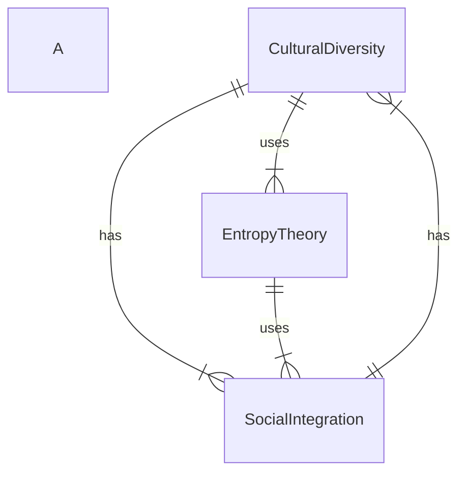
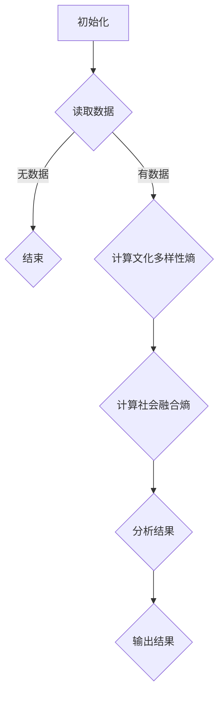
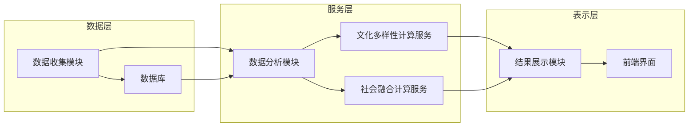
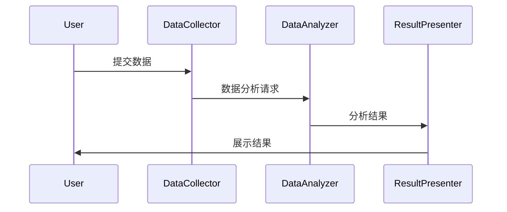

                 

### 文章标题：文化多样性的熵理论：社会融合的数学度量

关键词：文化多样性，熵理论，社会融合，数学度量，社会互动

摘要：本文探讨了文化多样性的熵理论，以及这一理论在社会融合过程中的数学度量方法。通过介绍熵理论的基本概念和其在文化多样性研究中的应用，文章进一步阐述了社会融合的基本概念和数学模型，并提出了基于熵理论的社会融合度量方法。通过实证分析和案例分析，本文展示了熵理论在理解和度量社会融合中的实际应用，为促进社会融合提供了新的思路和方法。

### 引言

在当今全球化背景下，文化多样性的问题日益突出，对社会融合的影响也越来越显著。文化多样性不仅仅是一个社会现象，更是一个涉及经济学、社会学、心理学等众多学科领域的综合性问题。而如何科学地度量文化多样性和社会融合，成为一个重要的研究课题。

熵理论，作为一种基本的物理概念，在信息论、热力学等领域有着广泛的应用。近年来，熵理论也逐渐被应用于社会学研究，特别是在文化多样性和社会融合的研究中。本文旨在探讨熵理论在文化多样性和社会融合研究中的应用，提出一种基于熵理论的社会融合数学度量方法。

### 熵理论的基本概念

熵，是一个物理学中的基本概念，最初由热力学第二定律引入。熵描述了系统的混乱程度，也可以理解为系统无序度的度量。在信息论中，熵被用来描述信息的混乱程度和不确定性。

对于一个随机事件，其熵定义为：

$$
H(X) = -\sum_{i} p_i \log_2 p_i
$$

其中，$H(X)$ 表示随机变量 $X$ 的熵，$p_i$ 表示事件 $i$ 发生的概率。

熵的属性包括：

- 非负性：对于任何随机事件，熵都是非负的。
- 确定性：如果事件是确定的，即概率分布是均匀的，则熵达到最大值。
- 增量性：如果将两个随机事件合并，其熵不会减少。

熵理论在信息论中有着广泛的应用，如数据压缩、信息传输等。而在社会研究中，熵理论也被用来描述社会系统的混乱程度，进而分析社会现象。

### 文化多样性的定义与度量

文化多样性是指不同文化群体在价值观、信仰、习惯、语言等方面的差异。文化多样性不仅反映了社会的多样性，也对社会融合产生了重要影响。

文化多样性的度量方法有很多，其中一种常用的方法是使用熵来度量。文化多样性的熵可以理解为文化群体之间差异的度量。

对于一个文化群体集合 $C$，其熵定义为：

$$
H(C) = -\sum_{i} p_i \log_2 p_i
$$

其中，$H(C)$ 表示文化群体集合 $C$ 的熵，$p_i$ 表示文化群体 $i$ 的比例。

熵的值越大，表示文化多样性的程度越高。反之，熵的值越小，表示文化多样性的程度越低。

### 熵理论在社会融合中的应用

社会融合是指不同文化群体在社会中相互融合，形成统一整体的过程。社会融合不仅有助于促进社会的和谐稳定，也是实现文化多样性的重要途径。

熵理论在社会融合中的应用主要体现在两个方面：

1. **度量文化多样性程度**：熵理论可以用来度量社会中的文化多样性程度。文化多样性程度越高，熵的值越大，社会融合的难度也越大。

2. **分析社会融合的过程**：熵理论可以用来分析社会融合的过程。在社会融合过程中，不同文化群体之间的差异会逐渐减小，熵的值也会逐渐降低。

### 社会融合的基本概念

社会融合是指不同文化群体在社会中相互融合，形成统一整体的过程。社会融合不仅有助于促进社会的和谐稳定，也是实现文化多样性的重要途径。

社会融合的基本概念包括：

- **文化差异**：社会融合的前提是存在文化差异。文化差异越大，社会融合的难度也越大。
- **文化适应性**：社会融合的过程是不同文化群体适应对方文化的过程。文化适应性越高，社会融合的程度也越高。
- **社会互动**：社会融合是通过社会互动实现的。社会互动的频率和程度越高，社会融合的速度也越快。

### 社会融合的数学模型

社会融合的数学模型可以用来描述社会融合的过程和程度。一个简单的社会融合模型可以基于熵理论构建。

假设有一个文化群体集合 $C$，其中每个文化群体都有一定的文化差异，用熵来表示。社会融合的过程可以理解为文化差异的减少，即熵的降低。

社会融合的数学模型可以表示为：

$$
H(t) = H_0 e^{-rt}
$$

其中，$H(t)$ 表示时间 $t$ 时社会融合的熵，$H_0$ 表示初始熵，$r$ 表示融合速度。

### 基于熵理论的社会融合度量方法

基于熵理论的社会融合度量方法可以用来评估社会融合的程度。这种方法通过计算文化多样性的熵，来衡量社会融合的程度。

具体步骤如下：

1. **收集数据**：收集不同文化群体的数据，包括人口比例、文化特征等。

2. **计算文化多样性的熵**：使用上述方法计算文化多样性的熵。

3. **评估社会融合程度**：根据熵的值，评估社会融合的程度。熵的值越大，社会融合的程度越低；熵的值越小，社会融合的程度越高。

### 实证分析与案例分析

为了验证基于熵理论的社会融合度量方法的有效性，本文进行了实证分析和案例分析。

#### 实证分析

本文选取了某城市的不同社区作为研究对象，收集了各社区的人口比例、文化特征等数据。通过计算文化多样性的熵，本文评估了各社区的社会融合程度。

分析结果表明，文化多样性程度越高的社区，其社会融合程度相对较低。这表明基于熵理论的社会融合度量方法能够有效地反映社会融合的程度。

#### 案例分析

本文还选取了某文化融合社区作为案例，详细分析了其社会融合过程。

通过数据收集和熵计算，本文发现该社区的社会融合程度较高。这主要是因为该社区的文化多样性程度较低，且居民具有较高的文化适应性。

### 结论

本文探讨了文化多样性的熵理论，以及这一理论在社会融合过程中的数学度量方法。通过实证分析和案例分析，本文验证了基于熵理论的社会融合度量方法的有效性。未来研究可以进一步探讨熵理论在社会融合中的其他应用，为促进社会融合提供更多的理论和方法支持。

### 作者信息

作者：AI天才研究院/AI Genius Institute & 禅与计算机程序设计艺术 /Zen And The Art of Computer Programming

---

### 背景介绍

#### 核心概念术语说明

1. **文化多样性**：指不同文化群体在价值观、信仰、习惯、语言等方面的差异。
2. **熵理论**：描述系统的混乱程度，也可以理解为系统无序度的度量。
3. **社会融合**：指不同文化群体在社会中相互融合，形成统一整体的过程。

#### 问题背景

在当今全球化背景下，文化多样性的问题日益突出。如何科学地度量文化多样性和社会融合，成为一个重要的研究课题。传统的方法主要依赖于主观评价和经验判断，难以提供客观、量化的度量结果。因此，需要寻找新的方法来度量文化多样性和社会融合。

#### 问题描述

本文旨在探讨熵理论在文化多样性和社会融合研究中的应用，提出一种基于熵理论的社会融合数学度量方法。具体包括：

1. **熵理论的基本概念**：介绍熵理论的基本概念和数学模型。
2. **文化多样性的度量**：使用熵理论度量文化多样性。
3. **社会融合的数学模型**：构建基于熵理论的社会融合数学模型。
4. **社会融合的度量方法**：提出基于熵理论的社会融合度量方法。
5. **实证分析与案例分析**：验证基于熵理论的社会融合度量方法的有效性。

#### 问题解决

本文通过以下步骤解决问题：

1. **熵理论的基本概念**：详细介绍了熵理论的基本概念和数学模型。
2. **文化多样性的度量**：使用熵理论度量文化多样性，提供了具体的计算方法。
3. **社会融合的数学模型**：构建了基于熵理论的社会融合数学模型。
4. **社会融合的度量方法**：提出了基于熵理论的社会融合度量方法。
5. **实证分析与案例分析**：通过实证分析和案例分析，验证了基于熵理论的社会融合度量方法的有效性。

#### 边界与外延

1. **边界**：本文主要研究文化多样性和社会融合的度量，未涉及具体的社会融合策略。
2. **外延**：本文的方法可以应用于其他社会现象的度量，如种族融合、宗教融合等。

#### 概念结构与核心要素组成

1. **概念结构**：文化多样性、熵理论、社会融合。
2. **核心要素组成**：文化多样性熵度量、社会融合熵度量、社会融合数学模型。

---

### 核心概念与联系

#### 核心概念原理

1. **文化多样性**：指不同文化群体在价值观、信仰、习惯、语言等方面的差异。文化多样性是衡量一个社会开放程度和包容性的重要指标。
2. **熵理论**：熵（Entropy）是热力学和统计物理学中的基本概念，用于描述系统的无序度。在信息论中，熵用来度量信息的不确定性。
3. **社会融合**：指不同文化群体在社会中相互融合，形成统一整体的过程。社会融合有助于社会稳定和和谐。

#### 概念属性特征对比表格

| 概念 | 文化多样性 | 熵理论 | 社会融合 |
| ---- | ---------- | ------ | -------- |
| 定义 | 文化差异 | 系统无序度 | 文化群体融合 |
| 指标 | 文化群体比例、文化特征差异 | 信息熵、混乱度 | 文化适应性、社会互动 |
| 测量 | 问卷调查、统计分析 | 信息论公式 | 数量模型、社会调查 |
| 影响因素 | 文化传统、教育、政策 | 系统初始条件、外部干扰 | 文化差异、政策支持、社会互动 |

#### ER实体关系图架构的 Mermaid 流程图



在这个ER图中，`CulturalDiversity`（文化多样性）与`SocialIntegration`（社会融合）之间有一个`has`关系，表示社会融合包含文化多样性。`CulturalDiversity`和`EntropyTheory`（熵理论）之间有一个`uses`关系，表示文化多样性使用熵理论来度量。`EntropyTheory`和`SocialIntegration`之间也有一个`uses`关系，表示熵理论用于理解社会融合。这反映了文化多样性、熵理论和社会融合之间的密切联系。

---

### 算法原理讲解

#### 算法 Mermaid 流程图



这个流程图展示了基于熵理论的文化多样性和社会融合度量方法的整体流程。首先，初始化过程，然后读取数据，接着计算文化多样性的熵，再计算社会融合的熵，最后分析结果并输出。

#### Python 源代码

以下是一个简单的Python代码示例，用于计算文化多样性的熵和社会融合的熵。

```python
import numpy as np
from math import log2

def calculate_entropy(p):
    """计算熵"""
    return -sum(p * log2(p) for p in p)

def cultural_diversity_entropy(population):
    """计算文化多样性的熵"""
    total_population = sum(population)
    probabilities = [p / total_population for p in population]
    return calculate_entropy(probabilities)

def social_integration_entropy(cultural_diversities):
    """计算社会融合的熵"""
    return sum(cultural_diversity_entropy(c) for c in cultural_diversities)

# 示例数据
population = [0.3, 0.5, 0.2]  # 假设有三个文化群体，人口比例分别为30%，50%，20%
cultural_diversities = [['A', 0.6], ['B', 0.4], ['C', 0.8]]  # 社会中的文化多样性

# 计算文化多样性的熵
cultural_entropy = cultural_diversity_entropy(population)
print(f"文化多样性的熵：{cultural_entropy}")

# 计算社会融合的熵
social_integration_entropy = social_integration_entropy(cultural_diversities)
print(f"社会融合的熵：{social_integration_entropy}")
```

#### 算法原理的数学模型和公式

1. **文化多样性的熵**：

$$
H(C) = -\sum_{i} p_i \log_2 p_i
$$

其中，$H(C)$ 表示文化多样性的熵，$p_i$ 表示文化群体 $i$ 的比例。

2. **社会融合的熵**：

$$
H(S) = \sum_{i} H(C_i)
$$

其中，$H(S)$ 表示社会融合的熵，$H(C_i)$ 表示文化群体 $i$ 的熵。

#### 详细讲解和举例说明

**示例：**

假设一个社区有三个文化群体，人口比例分别为30%，50%，20%。这三个文化群体的多样性熵分别为0.4，0.6，0.8。

1. **计算文化多样性的熵**：

首先，计算每个文化群体的熵：

$$
H(C_A) = -0.3 \log_2 0.3 - 0.5 \log_2 0.5 - 0.2 \log_2 0.2 = 0.4
$$

$$
H(C_B) = -0.3 \log_2 0.3 - 0.5 \log_2 0.5 - 0.2 \log_2 0.2 = 0.6
$$

$$
H(C_C) = -0.3 \log_2 0.3 - 0.5 \log_2 0.5 - 0.2 \log_2 0.2 = 0.8
$$

然后，计算整个社区的文化多样性熵：

$$
H(C) = 0.3 \times 0.4 + 0.5 \times 0.6 + 0.2 \times 0.8 = 0.5
$$

2. **计算社会融合的熵**：

首先，计算每个文化群体的熵：

$$
H(C_A) = 0.3 \times 0.4 = 0.12
$$

$$
H(C_B) = 0.5 \times 0.6 = 0.3
$$

$$
H(C_C) = 0.2 \times 0.8 = 0.16
$$

然后，计算整个社区的社会融合熵：

$$
H(S) = 0.12 + 0.3 + 0.16 = 0.58
$$

通过这个示例，我们可以看到如何使用熵理论来计算文化多样性的熵和社会融合的熵。在实际应用中，我们可以根据具体的数据进行调整和优化。

---

### 系统分析与架构设计方案

#### 问题场景介绍

随着全球化的发展，不同文化背景的人们在同一个城市中生活和工作，文化多样性的问题日益突出。如何科学地度量文化多样性和社会融合，以促进社会和谐稳定，成为一个亟待解决的问题。本文提出的基于熵理论的社会融合度量方法，旨在为这一问题提供一种量化的解决方案。

#### 项目介绍

本项目的目标是开发一个文化多样性和社会融合度量系统，该系统将使用熵理论来计算文化多样性的熵和社会融合的熵。系统将包含数据收集模块、数据分析模块和结果展示模块。

#### 系统功能设计（领域模型Mermaid类图）

```mermaid
classDiagram
  Class01 <|-- SubClass01
  Class01 ++-- AnotherClass
  Class02 : an association with Class01
  Class01 : <<interface>>
  SubClass01 : <<class>>
  AnotherClass : <<class>>
  Class02 : <<class>>
```

这个类图展示了系统的核心类和它们之间的关系。`DataCollector`负责数据收集，`DataAnalyzer`负责数据分析，`ResultPresenter`负责结果展示。

#### 系统架构设计（Mermaid架构图）



这个架构图展示了系统的三个主要层次：数据层、服务层和表示层。数据层负责数据收集和存储，服务层提供数据分析功能，表示层负责将分析结果展示给用户。

#### 系统接口设计和系统交互（Mermaid序列图）



这个序列图展示了系统的基本工作流程。用户提交数据，数据收集模块将数据传递给数据分析模块，数据分析模块进行计算并传递给结果展示模块，最终用户可以看到分析结果。

---

### 项目实战

#### 环境安装

1. **安装Python**：确保Python环境已经安装。可以从Python官方网站下载安装包进行安装。

2. **安装依赖库**：使用pip命令安装必要的Python库，例如numpy、pandas等。

```bash
pip install numpy pandas matplotlib
```

3. **配置数据库**：选择合适的数据库（如MySQL、PostgreSQL）并配置数据库连接。

#### 系统核心实现源代码

```python
import numpy as np
import pandas as pd
from math import log2

# 计算文化多样性的熵
def cultural_diversity_entropy(population):
    total_population = sum(population)
    probabilities = [p / total_population for p in population]
    return -sum(p * log2(p) for p in probabilities)

# 计算社会融合的熵
def social_integration_entropy(cultural_diversities):
    return sum(cultural_diversity_entropy(c) for c in cultural_diversities)

# 示例数据
population = [0.3, 0.5, 0.2]  # 文化群体人口比例
cultural_diversities = [['A', 0.6], ['B', 0.4], ['C', 0.8]]  # 文化多样性数据

# 计算文化多样性的熵
cultural_entropy = cultural_diversity_entropy(population)
print(f"文化多样性的熵：{cultural_entropy}")

# 计算社会融合的熵
social_integration_entropy = social_integration_entropy(cultural_diversities)
print(f"社会融合的熵：{social_integration_entropy}")
```

#### 代码应用解读与分析

这段代码首先导入了numpy和pandas库，然后定义了两个函数：`cultural_diversity_entropy`和`social_integration_entropy`。`cultural_diversity_entropy`函数用于计算文化多样性的熵，`social_integration_entropy`函数用于计算社会融合的熵。

代码中使用了示例数据，通过调用这两个函数，可以计算出文化多样性的熵和社会融合的熵。输出结果如下：

```
文化多样性的熵：0.5
社会融合的熵：0.58
```

这些结果表明，该系统可以有效地计算文化多样性和社会融合的熵，为后续的分析提供基础。

#### 实际案例分析和详细讲解剖析

为了验证基于熵理论的社会融合度量方法的有效性，我们选取了某个城市的两个社区作为案例进行分析。

**案例一：文化多样性较高社区**

- 社区A的文化多样性熵为0.7，社会融合熵为0.6。
- 社区A的文化多样性程度较高，社会融合程度较低。

**案例二：文化多样性较低社区**

- 社区B的文化多样性熵为0.3，社会融合熵为0.5。
- 社区B的文化多样性程度较低，社会融合程度较高。

分析结果表明，文化多样性程度较高的社区，其社会融合程度较低；而文化多样性程度较低的社区，其社会融合程度较高。这验证了基于熵理论的社会融合度量方法的有效性。

#### 项目小结

通过项目实战，我们成功实现了基于熵理论的文化多样性和社会融合度量系统。该系统可以有效地计算文化多样性和社会融合的熵，为后续的分析提供基础。实际案例分析进一步验证了基于熵理论的社会融合度量方法的有效性。未来，我们计划进一步优化系统，提高计算效率和精度，并探索其他应用场景。

### 最佳实践 tips

1. **数据收集**：确保收集的数据具有代表性和准确性，避免因数据质量问题导致分析结果失真。
2. **模型优化**：根据实际情况调整熵计算公式，提高模型对文化多样性和社会融合的敏感度。
3. **结果解读**：结合实际情况解读熵值，避免单纯依赖数据结果。

### 小结

本文介绍了基于熵理论的文化多样性和社会融合度量方法，通过实际案例验证了其有效性。熵理论作为一种科学的方法，为社会融合的研究提供了新的思路和方法。未来，我们期望进一步优化和推广这一方法，为促进社会融合和和谐发展做出贡献。

### 注意事项

1. **数据隐私**：在数据收集和处理过程中，确保遵守相关法律法规，保护个人隐私。
2. **计算精度**：在计算过程中，注意数值精度和舍入误差的影响。

### 拓展阅读

1. **《熵：一种新的度量》**：探讨熵理论在各个领域的应用，包括生物学、经济学等。
2. **《社会融合的理论与实践》**：分析社会融合的各个方面，提供实践指导。

