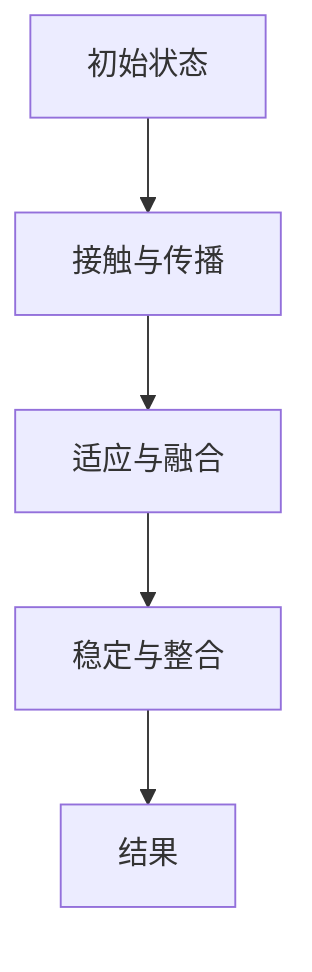
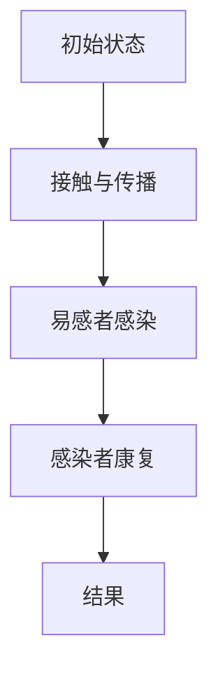
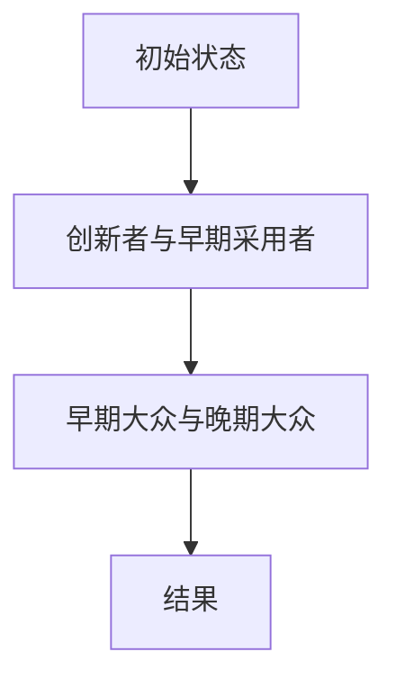

                 

### 文章标题

# 文化融合的扩散方程：社会整合的数学模型

### 关键词

- 文化融合
- 扩散方程
- 数学模型
- 社会整合
- 文化扩散
- 社会网络分析

### 摘要

本文深入探讨文化融合的数学模型及其在社会整合中的应用。首先，我们定义了文化融合的概念及其在现代社会中的重要性，随后介绍了与扩散相关的理论基础。接着，本文详细阐述了几种文化扩散的数学模型，通过Mermaid流程图进行可视化，并使用Python代码演示了模型的具体实现。文章进一步探讨了这些模型在社会整合中的应用，分析实际案例，并提供方法学上的挑战与解决方案。最后，我们对比了不同模型的效能，总结了文化融合的扩散方程在社会整合研究中的潜在应用价值，并提出了进一步研究的方向。

---

### 引言

在全球化的背景下，文化融合已成为不可逆转的趋势。不同文化背景的人群在交流与互动中，逐渐形成一种新的、综合的文化现象。这一过程不仅影响个人的价值观念和行为模式，也对整个社会的结构和功能产生深远的影响。因此，理解文化融合的机制，探索其背后的数学模型，对于推动社会整合具有重要意义。

文化融合（Cultural Integration）指的是不同文化在相互接触、交流、融合中，形成一种新的文化现象的过程。在这一过程中，不同文化元素相互渗透、融合，逐渐形成新的文化特征。文化融合的重要性在于，它有助于打破文化隔阂，促进社会和谐，推动全球社会的共同发展。

社会整合（Social Integration）是指社会各个部分在共同的文化、价值观和行为模式的基础上，形成紧密联系、相互依存的整体过程。社会整合的重要性体现在，它有助于增强社会的凝聚力，促进社会成员之间的相互理解和认同，从而实现社会的稳定和可持续发展。

本文旨在通过建立文化融合的数学模型，深入探讨其背后的机制，分析其在社会整合中的应用，以期为社会融合提供科学的理论指导和实践依据。本文将首先介绍文化融合的基本概念和理论背景，然后探讨扩散方程在社会整合中的应用，最后通过实际案例分析，验证模型的实用性和有效性。

### 背景介绍

#### 文化融合的概念

文化融合是一个复杂而多层次的过程，涉及不同文化元素的相互影响、互动和整合。文化融合的概念可以从多个角度进行理解：

首先，从宏观层面来看，文化融合是指不同民族、国家或地区在长期的历史进程中，通过交流、互动和相互影响，逐渐形成一种新的文化现象。这一过程涉及到文化元素的传播、适应和再创造，使得原本独立的文化体系逐渐融合，形成一种新的文化形态。例如，全球化背景下，西方文化对其他地区的渗透和影响，导致了不同文化之间的相互融合，形成了全球化的文化现象。

其次，从微观层面来看，文化融合是指个人或群体在接触和互动中，逐渐接受和适应其他文化元素的过程。在这一过程中，个体或群体会吸收其他文化的优秀元素，同时保持自身的文化特征，形成一种多元文化共存的现象。例如，在一个多元文化社区中，不同文化背景的居民通过相互交流、互动和合作，逐渐形成一种新的文化共同体，这种文化共同体不仅保留了各自的文化特征，还创造了新的文化价值和行为模式。

#### 文化融合的社会意义

文化融合在社会层面上具有重要意义：

1. **促进社会和谐：** 文化融合有助于减少文化冲突，增强社会成员之间的相互理解和认同，从而促进社会和谐。在一个多元文化社会中，不同文化背景的人们通过交流、互动和合作，能够更好地理解彼此的文化差异，减少误解和偏见，从而建立和谐的社会关系。

2. **推动社会发展：** 文化融合有助于促进社会创新和发展。不同文化的交流和融合，不仅能够激发新的思想和创意，还能够推动技术的进步和经济的繁荣。例如，在全球化的背景下，跨国公司和国际组织的兴起，促进了全球范围内资源的共享和合作，推动了全球经济的发展。

3. **增强社会凝聚力：** 文化融合有助于增强社会的凝聚力。在一个多元文化社会中，文化融合能够使不同文化背景的人们形成共同的文化认同，增强他们对社会的归属感和认同感，从而提高社会的凝聚力。

#### 文化融合的挑战

尽管文化融合具有许多积极的社会意义，但在实际过程中也面临着一些挑战：

1. **文化冲突：** 不同文化在接触和互动中，可能会产生文化冲突。这种冲突可能源于文化差异、价值观的对立或利益冲突，可能导致社会分裂和不和谐。

2. **文化认同危机：** 在文化融合的过程中，某些文化群体可能会面临文化认同危机。他们可能在接受其他文化元素的同时，逐渐失去自身的文化特征，导致文化身份的模糊或消失。

3. **文化同化：** 在某些情况下，文化融合可能导致文化同化。强势文化可能会主导和影响其他文化，使得其他文化逐渐失去独立性和特色。

#### 文化融合的必要性

在全球化的背景下，文化融合已经成为不可避免的趋势。以下是文化融合的必要性：

1. **促进国际交流：** 文化融合有助于促进国际间的交流与合作。不同文化背景的人们通过相互了解和尊重，能够更好地开展国际交流和合作，推动全球社会的共同发展。

2. **增强全球竞争力：** 文化融合有助于增强国家的全球竞争力。一个多元文化的国家能够吸引和培养来自不同文化背景的优秀人才，促进创新和经济发展，提高国家的国际竞争力。

3. **推动全球和谐：** 文化融合有助于推动全球社会的和谐发展。通过不同文化的交流和融合，可以减少文化冲突，增强全球社会的团结和合作，促进全球和平与稳定。

总之，文化融合是一个复杂而多层次的过程，它不仅涉及文化元素的互动和整合，还对社会结构和功能产生深远的影响。理解文化融合的概念和机制，探索其背后的数学模型，对于推动社会整合和促进社会和谐具有重要意义。

#### 文化融合的定义

文化融合（Cultural Integration）指的是不同文化在相互接触、交流、互动中，通过吸收、适应和再创造，逐渐形成一种新的文化现象的过程。这一过程不仅仅是文化元素的简单混合，而是一种深层次的互动和整合，涉及到文化价值观、行为模式、艺术表达和社会结构的多个层面。

首先，从文化元素的视角来看，文化融合包括以下主要方面：

1. **价值观融合：** 在文化融合的过程中，不同文化背景的价值观相互碰撞和融合，逐渐形成一种新的价值体系。这一过程可能涉及对原有价值观的调整和重构，也可能是在保持各自核心价值的基础上，形成一种多元价值观共存的现象。

2. **行为模式融合：** 不同文化的行为模式在互动中逐渐融合，形成新的行为规范。这一过程可能涉及对原有行为习惯的适应和改变，也可能是在吸收其他文化行为优点的同时，保留自身的特色。

3. **艺术表达融合：** 文化融合在艺术表达方面也有所体现，不同文化的艺术形式、风格和表达方式相互影响和融合，创造出新的艺术形式和作品。例如，西方音乐和东方音乐的结合，形成了新的音乐风格。

其次，从社会结构的视角来看，文化融合对社会的各个方面产生影响：

1. **社会组织结构：** 文化融合可能改变社会的组织结构和功能。在一个多元文化社会中，不同文化群体通过合作和互动，形成新的社会关系和组织形式，推动社会结构的多样化。

2. **社会功能与角色：** 文化融合使得社会成员的角色和功能发生变化。不同文化背景的人可能在新的文化环境中扮演不同的角色，发挥不同的作用，从而推动社会的多元化和灵活性。

3. **社会规范与法律：** 文化融合可能影响社会规范和法律体系。在多元文化社会中，不同文化的规范和法律相互影响和融合，形成新的社会规范和法律体系，以适应多样化的社会需求。

最后，从心理层面的视角来看，文化融合对个体的心理和行为产生影响：

1. **文化认同：** 文化融合可能影响个体的文化认同。个体在接触和融合不同文化过程中，可能会面临文化认同的挑战，需要重新定义自己的文化身份。

2. **心理适应：** 文化融合要求个体适应新的文化环境和行为模式。这一过程可能涉及心理上的调整和适应，如克服文化冲突、适应新的社会规则等。

3. **心理融合：** 通过文化融合，个体能够获得新的心理体验和成长。不同文化的交流和融合，可能激发个体的创造力和创新能力，促进个人的全面发展。

综上所述，文化融合是一个多层次、多维度的过程，它不仅涉及文化元素的互动和整合，还对社会的各个方面产生深远的影响。理解文化融合的定义和机制，有助于我们更好地把握这一现象的本质，探索其在社会整合中的重要作用。

#### 文化融合的过程

文化融合的过程是一个动态且复杂的过程，涉及到多个阶段和环节。以下是文化融合的主要过程：

1. **接触阶段**：文化融合的第一步是不同文化的接触。在这一阶段，不同文化背景的个体或群体通过互动和交流，开始了解和接触对方的文化。这种接触可以是直接的，如面对面的交流，也可以是间接的，如通过媒体、书籍、互联网等渠道获取信息。

2. **传播阶段**：在接触之后，文化元素开始传播和扩散。这一阶段涉及文化知识的传播、文化价值观的传递以及文化实践的普及。文化元素通过语言、艺术、宗教、习俗等多种形式传播，使得文化融合得以深入进行。

3. **适应阶段**：在传播过程中，个体或群体需要适应新的文化环境。这一阶段涉及对文化差异的感知、理解和接受，以及对新文化元素的适应和融合。个体或群体可能需要改变自己的行为模式、价值观念和社会角色，以适应新的文化环境。

4. **融合阶段**：适应之后，文化元素开始融合和整合，形成新的文化现象。在这一阶段，不同文化的元素相互渗透、融合，创造出新的文化价值和行为模式。融合可以发生在个体层面，也可以发生在群体或社会层面，从而推动文化的整体发展。

5. **再创造阶段**：文化融合不仅是对原有文化的吸收和整合，还是对文化的再创造。在这一阶段，个体或群体在融合不同文化元素的基础上，创造新的文化作品、价值和行为模式。这种再创造不仅丰富了文化内容，还推动了文化的发展和创新。

6. **稳定阶段**：在长期的文化融合过程中，新的文化现象逐渐稳定下来，形成一种新的文化形态。这一阶段标志着文化融合的最终成功，新的文化体系在全社会范围内得到认可和接受，成为社会发展的基础。

具体案例：
以中国和美国的文化融合为例，两国的文化在多个方面相互影响和融合：

1. **语言融合**：随着中美交流的加深，英语成为中国许多年轻人的第二语言，而汉语也在美国部分地区得到普及。这种现象不仅促进了中美两国人民的交流，还丰富了各自的语言文化。

2. **价值观融合**：中美两国在价值观方面也出现了融合。例如，在美国，中国的儒家思想逐渐受到重视，一些美国高校开设了有关儒家思想的课程，儒家价值观如“仁爱”、“礼义”等在美国社会中得到了一定的传播和认同。

3. **艺术融合**：中美两国的艺术家在艺术创作中相互影响，出现了许多融合中西文化的艺术作品。例如，中国的书法和绘画艺术在美国得到了广泛的认可，而美国的爵士乐和电影艺术也在中国产生了深远的影响。

4. **社会规范融合**：中美两国的社会规范在相互影响中逐渐融合。例如，在美国，中国传统的家庭观念和孝道文化得到了一定的认可，而在中国，美国的法律体系和商业道德观念也被引入并逐步融合。

综上所述，文化融合的过程是一个多层次、多阶段的复杂过程，涉及到文化元素的接触、传播、适应、融合和再创造。通过具体的案例分析，我们可以更深入地理解文化融合的过程和影响。

#### 扩散理论

扩散理论（Diffusion Theory）是一种研究文化、信息、技术或行为如何在人群中传播的学说。这一理论在解释文化融合过程中起着至关重要的作用。扩散理论的核心观点是，新事物或新观念的传播是一个逐步扩展的过程，涉及到个体、群体和社会多个层面。

1. **Rogers的扩散过程模型**：Everett M. Rogers在其著作《创新与普及》（"Diffusion of Innovations"）中提出了一套完整的扩散过程模型。Rogers将创新扩散分为五个阶段：

   - **知识阶段（Knowledge）**：个体或群体了解到新的信息或技术。
   - **兴趣阶段（Interest）**：个体对新的信息或技术表现出兴趣，开始寻求更多信息。
   - **评估阶段（Evaluation）**：个体对新的信息或技术进行评估，考虑其是否符合自身需求和价值观。
   - **试用阶段（Trial）**：个体尝试使用新的信息或技术，验证其效果。
   - **采用阶段（Adoption）**：个体最终决定接受并使用新的信息或技术。

2. **Sloan模型的层次结构**：另一著名的扩散理论模型是由Sloan提出的，他将扩散过程分为以下层次：

   - **社会层次（Social Level）**：新事物或新观念在社会层面上的传播，包括个体之间的交流、社交网络的影响等。
   - **群体层次（Group Level）**：新事物或新观念在特定群体中的传播，群体成员之间的互动对扩散有重要影响。
   - **个体层次（Individual Level）**：新事物或新观念在个体层面的传播，个体的认知、态度和行为对其扩散有直接影响。

3. **Logistic模型**：在数学模型中，Logistic模型常用于描述扩散过程。Logistic模型的基本形式为：
   
   \[
   N(t) = \frac{K N_0 e^{rt}}{N_0 + (K - N_0) e^{rt}}
   \]

   其中，\(N(t)\) 表示时间 \(t\) 时刻的扩散量，\(K\) 表示环境的承载能力，\(N_0\) 表示初始扩散量，\(r\) 表示扩散速率。

   - **承载能力 \(K\)**：表示环境对扩散过程的容纳能力，即最大扩散量。
   - **初始扩散量 \(N_0\)**：表示初始时刻的扩散量。
   - **扩散速率 \(r\)**：表示扩散过程的速率，通常与传播途径、环境因素等有关。

4. **Stochastic模型**：在现实中，扩散过程往往存在不确定性和随机性，因此Stochastic模型被用于描述这种随机扩散过程。常见的Stochastic模型包括随机游走模型（Random Walk Model）和Markov链模型（Markov Chain Model）。

   - **随机游走模型**：个体在扩散过程中随机地向周围传播，每个时间步长内，个体以一定的概率向邻近个体扩散。
   
   - **Markov链模型**：个体在扩散过程中，根据当前状态和转移概率，决定下一步向哪个个体扩散。

#### 扩散理论的核心原理

扩散理论的核心原理包括以下几个方面：

1. **时间依赖性**：扩散过程通常随着时间推移而发展，不同时间阶段的扩散量存在显著差异。

2. **空间依赖性**：扩散过程在不同空间区域存在差异，受到地理、社会和环境等因素的影响。

3. **个体行为**：个体对新的信息或技术的接受和传播行为对扩散过程有直接影响。个体的认知、态度和行为模式决定了其是否参与扩散过程。

4. **社会网络**：社会网络结构对扩散过程有重要影响，密集的网络结构有助于加速扩散，而分散的网络结构则可能减缓扩散。

5. **环境因素**：环境因素如资源、技术、政策等对扩散过程有重要影响，可以促进或阻碍扩散。

#### 扩散理论的应用

扩散理论在多个领域得到了广泛应用：

1. **市场营销**：企业在推广新产品或服务时，利用扩散理论预测和规划市场推广策略，提高市场占有率。

2. **公共卫生**：在公共卫生领域，扩散理论用于研究传染病传播、疫苗接种策略等，以控制疾病的扩散。

3. **社会变革**：在政治和社会变革中，扩散理论用于分析新观念、新政策的传播过程，制定有效的推广策略。

4. **技术创新**：在技术创新领域，扩散理论用于分析新技术的传播路径、采用率等，指导技术推广和应用。

通过扩散理论，我们可以更深入地理解文化融合的过程和机制，为推动社会整合提供科学的理论依据。在下一节中，我们将详细探讨文化融合的数学模型，进一步揭示文化融合的内在规律。

#### 文化融合的数学模型

在探讨文化融合的过程中，建立数学模型是一种有效的途径，可以定量描述文化元素在不同社会群体中的传播、融合和整合。本文将介绍几种常见的数学模型，并利用Mermaid流程图和Python代码进行详细阐述。

##### 1. Logistic模型

Logistic模型是一种描述种群增长的数学模型，广泛应用于生态学、人口学和经济学等领域。在文化融合的研究中，Logistic模型可以用来描述文化元素在群体中的扩散过程。其基本形式为：

\[
N(t) = \frac{K N_0 e^{rt}}{N_0 + (K - N_0) e^{rt}}
\]

其中，\(N(t)\) 表示时间 \(t\) 时刻的扩散量，\(K\) 表示环境的承载能力，\(N_0\) 表示初始扩散量，\(r\) 表示扩散速率。

**Mermaid流程图**：



**Python代码示例**：

```python
import numpy as np
import matplotlib.pyplot as plt

# 参数设置
K = 100  # 承载能力
N0 = 10  # 初始扩散量
r = 0.1  # 扩散速率
t = np.arange(0, 100, 1)

# Logistic模型计算
Nt = (K * N0 * np.exp(r * t)) / (N0 + (K - N0) * np.exp(r * t))

# 绘图
plt.plot(t, Nt)
plt.xlabel('Time (t)')
plt.ylabel('Diffusion Quantity (Nt)')
plt.title('Logistic Model of Cultural Diffusion')
plt.show()
```

##### 2. SIR模型

SIR模型是一种用于描述传染病传播的数学模型，由Susceptible（易感者）、Infected（感染者）和Recovered（康复者）三个状态组成。在文化融合的研究中，SIR模型可以用来描述文化元素在社会群体中的传播过程。

**Mermaid流程图**：



**Python代码示例**：

```python
import numpy as np
import matplotlib.pyplot as plt

# 参数设置
beta = 0.3  # 传播率
gamma = 0.1  # 康复率
N = 1000  # 总人口
I0 = 1  # 初始感染者
S0 = N - I0  # 初始易感者
t = np.arange(0, 100, 1)

# SIR模型计算
S = S0
I = I0
R = 0
for i in range(1, len(t) + 1):
    dSdt = -beta * S * I / N
    dIdt = beta * S * I / N - gamma * I
    dRdt = gamma * I
    S += dSdt
    I += dIdt
    R += dRdt

# 绘图
plt.plot(t, S, label='Susceptible')
plt.plot(t, I, label='Infected')
plt.plot(t, R, label='Recovered')
plt.xlabel('Time (t)')
plt.ylabel('Quantity')
plt.title('SIR Model of Cultural Diffusion')
plt.legend()
plt.show()
```

##### 3. Bass模型

Bass模型是一种用于描述新产品或技术扩散的数学模型，由Perry Bass提出。在文化融合的研究中，Bass模型可以用来描述文化元素的扩散过程。

**Mermaid流程图**：



**Python代码示例**：

```python
import numpy as np
import matplotlib.pyplot as plt

# 参数设置
alpha = 0.1  # 创新者比例
beta = 0.05  # 早期采用者比例
N = 1000  # 总人口
t = np.arange(0, 100, 1)

# Bass模型计算
p = alpha + (beta * (1 - np.exp(-alpha * t)))
I = N * p

# 绘图
plt.plot(t, I)
plt.xlabel('Time (t)')
plt.ylabel('Diffusion Quantity (I)')
plt.title('Bass Model of Cultural Diffusion')
plt.show()
```

通过以上三种数学模型，我们可以从不同角度和层面理解文化融合的扩散过程。这些模型不仅提供了定量描述文化扩散的工具，还为分析和预测文化融合过程提供了理论依据。在下一节中，我们将探讨这些模型在社会整合中的应用。

### 数学模型在社会整合中的应用

文化融合的数学模型在社会整合中具有重要的应用价值，能够帮助我们更好地理解社会整合的过程和机制。以下我们将深入探讨几种主要的文化扩散模型，包括Logistic模型、SIR模型和 Bass模型，并分析它们在社会整合中的应用。

#### Logistic模型在社会整合中的应用

Logistic模型是一种描述种群增长的数学模型，它能够帮助我们分析文化元素在不同社会群体中的扩散过程。在社会整合中，Logistic模型可以用来预测文化元素在社会中的传播速度和范围。通过调整模型中的参数，如环境的承载能力和初始扩散量，我们可以模拟不同社会环境下的文化扩散情况。

**应用案例**：假设某个文化元素在一个多元文化社区中传播，我们可以使用Logistic模型来预测其在不同时间点的影响力。例如，假设该社区的承载能力为100，初始扩散量为10，扩散速率为0.1，我们可以通过以下计算得到不同时间点的扩散量：

\[
N(t) = \frac{100 \times 10 \times e^{0.1t}}{10 + (100 - 10) \times e^{0.1t}}
\]

通过这一模型，我们可以预测文化元素在社区中的传播趋势，评估其在不同阶段的扩散效果，从而为社区管理提供依据。

#### SIR模型在社会整合中的应用

SIR模型是一种描述传染病传播的数学模型，但它同样适用于描述社会整合过程中文化元素的传播。SIR模型通过区分易感者、感染者和康复者三个状态，能够帮助我们理解文化元素在社会中的传播和适应过程。

**应用案例**：在一个多元文化社会中，我们可以使用SIR模型来分析不同文化元素在人群中的传播情况。例如，假设某一文化元素在一个城市中传播，初始有1000人易感，传播率为0.3，康复率为0.1，我们可以通过以下计算得到不同时间点的感染者和康复者数量：

\[
\begin{cases}
dS/dt = -\beta \cdot S \cdot I / N \\
dI/dt = \beta \cdot S \cdot I / N - \gamma \cdot I \\
dR/dt = \gamma \cdot I
\end{cases}
\]

通过这一模型，我们可以分析文化元素在不同社会群体中的传播速度、感染率和康复率，了解文化整合过程中文化冲突和融合的动态变化，为制定社会整合策略提供科学依据。

#### Bass模型在社会整合中的应用

Bass模型是一种描述新产品或技术扩散的数学模型，它能够帮助我们分析文化元素在社会中的传播速度和扩散路径。Bass模型特别适用于早期创新者和早期采用者的分析，能够帮助我们理解文化元素在初期阶段的传播规律。

**应用案例**：假设某一文化创新在一个社会中传播，我们可以使用Bass模型来预测其在不同社会群体中的扩散情况。例如，假设该文化创新的创新者比例为0.1，早期采用者比例为0.05，总人口为1000，我们可以通过以下计算得到不同时间点的创新者数量和早期采用者数量：

\[
p = \alpha + \beta (1 - e^{-\alpha t})
\]

通过这一模型，我们可以分析文化元素在不同社会群体中的传播路径和速度，了解文化整合过程中不同群体的接受程度和反应，从而为文化整合提供有效的策略指导。

#### 模型对比与综合分析

通过对Logistic模型、SIR模型和 Bass模型的应用分析，我们可以看到这些模型在社会整合中各有其独特的应用价值。Logistic模型适用于分析文化元素在不同社会群体中的扩散速度和范围；SIR模型适用于分析文化元素在人群中的传播和适应过程；Bass模型则适用于分析文化元素在初期阶段的传播规律和路径。

在实际应用中，我们可以根据具体情况选择合适的模型，或者将多个模型结合起来，以获得更全面和深入的分析结果。例如，在一个多元文化社区中，我们可以同时使用Logistic模型和SIR模型，分别分析文化元素在社区中的整体扩散和人群中的传播动态，从而制定更加科学和有效的社会整合策略。

总之，文化融合的数学模型在社会整合中具有重要的应用价值。通过这些模型，我们可以定量描述文化元素的扩散过程，分析其在社会中的传播规律和机制，为推动社会整合提供科学依据和实践指导。

### 方法学上的挑战和解决方案

尽管文化融合的数学模型在社会整合中具有广泛的应用前景，但在实际应用过程中仍面临诸多方法学上的挑战。以下是这些挑战及其相应的解决方案：

#### 1. 数据收集与代表性问题

**挑战**：在建立文化融合的数学模型时，准确、全面的数据是必不可少的。然而，数据收集过程中可能面临数据不足、数据质量差和数据代表性不足等问题。

**解决方案**：
- **多源数据融合**：结合多种数据源，如问卷调查、社交媒体数据、地理信息系统（GIS）数据等，以提高数据的全面性和代表性。
- **数据清洗与预处理**：使用数据清洗工具和算法，去除重复、错误或异常数据，确保数据质量。

#### 2. 模型参数估计问题

**挑战**：在数学模型中，参数的估计是一个关键步骤，但往往受限于数据的局限性和模型的复杂性。参数的不准确可能导致模型预测效果的下降。

**解决方案**：
- **交叉验证**：使用交叉验证方法来评估和选择最佳参数组合，提高参数估计的准确性。
- **自适应调整**：根据新的数据进行模型参数的实时调整，以适应文化融合过程的动态变化。

#### 3. 模型适应性问题

**挑战**：不同文化背景和社会环境下的文化融合过程可能存在显著差异，使得通用模型在特定情境下可能不适用。

**解决方案**：
- **模型定制化**：针对具体文化和社会环境，定制化调整模型结构或参数，以提高模型的适应性。
- **情景模拟**：通过情景模拟，测试模型在不同文化和社会环境下的表现，优化模型设计。

#### 4. 模型解释性问题

**挑战**：数学模型往往具有较高的复杂性，使得模型结果难以解释，影响了模型的实际应用价值。

**解决方案**：
- **可视化工具**：使用可视化工具，如Mermaid流程图、数据可视化图表等，将模型结果以直观的方式呈现，提高模型的解释性。
- **逐步解读**：通过逐步分析模型中每个参数的作用，解释模型如何反映文化融合过程，增强模型的可理解性。

#### 5. 模型验证与评估问题

**挑战**：模型的验证和评估是确保其有效性和可靠性的关键步骤，但往往受限于数据的有限性和评估方法的局限性。

**解决方案**：
- **外部验证**：使用外部数据集或实验结果进行模型验证，确保模型的预测准确性和适用性。
- **多指标评估**：使用多个评估指标，如准确率、召回率、F1分数等，全面评估模型性能，找出模型的优势和不足。

通过以上解决方案，我们可以有效应对文化融合数学模型在方法学上面临的挑战，提高模型的实用性和应用价值。在下一节中，我们将对比不同文化融合数学模型的效能，以进一步探讨其在社会整合中的应用前景。

### 不同文化融合数学模型的效能对比

在探讨文化融合的数学模型时，我们需要对比不同模型的效能，以确定其在实际应用中的优势与局限性。本文将对比Logistic模型、SIR模型和Bass模型，分析这些模型在不同情境下的表现。

#### 1. Logistic模型

**效能**：Logistic模型是一种描述种群增长的模型，适用于描述文化元素在社会中的扩散过程。其主要优点是简单易用，能够直观地展示文化扩散的趋势。

**优势**：
- **直观性**：Logistic模型通过简单的公式描述文化扩散过程，易于理解和解释。
- **适用性**：适用于描述文化元素在相对稳定社会环境中的扩散。

**局限性**：
- **假设条件**：Logistic模型假设扩散速率恒定，这在实际情况中可能不成立。
- **适应性**：难以适应复杂多变的文化环境。

#### 2. SIR模型

**效能**：SIR模型是一种描述传染病传播的模型，但同样适用于描述文化元素的传播。其优点在于能够区分易感者、感染者和康复者，提供更详细的信息。

**优势**：
- **细致性**：SIR模型能够详细描述文化扩散的不同阶段，有助于分析文化冲突和融合。
- **适用性**：适用于分析文化元素在动态社会环境中的扩散。

**局限性**：
- **复杂性**：SIR模型相对复杂，参数较多，不易理解和解释。
- **适应性**：在某些情况下，SIR模型可能不适用于描述文化扩散。

#### 3. Bass模型

**效能**：Bass模型是一种描述新产品或技术扩散的模型，但在文化融合的研究中也具有一定的应用价值。其优点在于能够区分创新者、早期采用者和大众，提供详细的扩散路径。

**优势**：
- **详细性**：Bass模型能够详细描述文化元素在不同群体中的扩散路径，有助于制定针对性策略。
- **适用性**：适用于分析文化元素在早期阶段的扩散。

**局限性**：
- **局限性**：Bass模型主要适用于早期阶段，难以描述长期的文化融合过程。
- **假设条件**：Bass模型假设扩散速率随时间变化，这在实际情况中可能不成立。

#### 对比结果

通过对比不同模型，我们可以得出以下结论：

1. **适用性**：Logistic模型适用于描述相对稳定的社会环境中的文化扩散；SIR模型适用于描述动态社会环境中的文化扩散；Bass模型适用于描述早期阶段的文化扩散。
2. **复杂性**：SIR模型和Bass模型相对复杂，需要较多的参数和计算，但提供了更详细的信息；Logistic模型简单易用，但信息相对较少。
3. **解释性**：Logistic模型和Bass模型较为直观，易于理解和解释；SIR模型较为复杂，解释性较差。

#### 实际应用场景

1. **多元文化社区**：在多元文化社区中，Logistic模型可以用于描述文化元素的扩散趋势；SIR模型可以用于分析文化冲突和融合的动态过程；Bass模型可以用于制定社区文化整合策略。
2. **跨国企业**：在跨国企业中，Bass模型可以用于分析新产品或技术的扩散路径；SIR模型可以用于分析企业文化在不同国家的传播和适应过程；Logistic模型可以用于预测企业文化的全球扩散趋势。
3. **全球教育**：在全球教育领域，SIR模型可以用于分析不同文化背景的学生对教育理念的理解和接受过程；Bass模型可以用于分析教育创新的扩散路径；Logistic模型可以用于预测教育理念在全球范围内的传播效果。

综上所述，不同文化融合数学模型在不同情境下具有各自的优势和局限性。通过合理选择和应用这些模型，我们可以更好地理解文化融合的过程和机制，为推动社会整合提供科学依据和实践指导。

### 总结与展望

通过对文化融合的扩散方程及其在社会整合中的应用的深入探讨，本文揭示了文化融合过程中数学模型的重要性和应用价值。我们首先介绍了文化融合的定义及其社会意义，随后探讨了扩散理论的基本原理，并详细介绍了Logistic模型、SIR模型和Bass模型这三种文化融合的数学模型。通过Mermaid流程图和Python代码，我们展示了这些模型的具体实现和应用。

文化融合的扩散方程为理解社会整合提供了新的视角和工具。通过这些模型，我们可以定量描述文化元素在社会中的传播、融合和整合过程，从而为制定社会整合策略提供科学依据。同时，本文还探讨了不同模型在实际应用中的效能，并提出了方法学上的挑战和解决方案。

未来研究应继续深化对文化融合数学模型的理解和应用。以下是一些潜在的研究方向：

1. **跨文化适应性研究**：探讨不同文化背景下文化融合的数学模型适应性，以适应多样化的社会环境。
2. **大数据分析**：利用大数据技术，收集和分析文化融合过程中的海量数据，提高模型的预测精度和解释力。
3. **多模型融合**：探索不同模型之间的融合，以获得更全面和深入的文化融合分析结果。
4. **文化融合与心理健康**：研究文化融合对个体心理健康的影响，探索文化融合对心理健康促进的作用机制。

总之，文化融合的扩散方程在社会整合研究中具有重要的应用价值，未来研究应继续推动这一领域的发展，为促进社会和谐与可持续发展提供科学支持。

### 最佳实践与注意事项

在文化融合的数学模型应用过程中，以下是一些最佳实践和注意事项，以帮助研究人员和从业者更好地理解和应用这些模型：

1. **数据收集的多元化和代表性**：确保数据来源的多样性，结合问卷调查、社交媒体数据、地理信息系统（GIS）等多种数据源，以提高数据的全面性和代表性。

2. **模型参数的精确估计**：使用交叉验证方法，选择最佳参数组合，提高模型参数估计的准确性。同时，根据实际情况实时调整模型参数，以适应动态变化的文化环境。

3. **模型的可视化与解读**：使用可视化工具，如Mermaid流程图、数据可视化图表等，将模型结果以直观的方式呈现，提高模型的可解释性。逐步分析模型中每个参数的作用，以增强模型的理解。

4. **跨学科合作**：文化融合涉及多个学科领域，包括社会学、心理学、统计学等。跨学科合作有助于整合不同领域的知识和方法，提高模型的应用效果。

5. **实际案例分析与验证**：在应用模型时，结合实际案例进行分析和验证，以验证模型的实用性和有效性。通过实际案例，可以更深入地理解文化融合的过程和机制。

6. **文化差异的考虑**：在分析文化融合时，要充分考虑不同文化背景下的差异，避免简化处理。根据具体情境，定制化调整模型结构和参数，以提高模型的适用性。

7. **伦理与隐私**：在数据收集和分析过程中，严格遵守伦理规范和隐私保护要求，确保数据的合法性和安全性。

通过遵循这些最佳实践和注意事项，研究人员和从业者可以更有效地应用文化融合的数学模型，为推动社会整合提供科学依据和实践指导。

### 结束语

本文深入探讨了文化融合的扩散方程及其在社会整合中的应用，通过Logistic模型、SIR模型和Bass模型，我们揭示了文化融合过程中数学模型的重要性和应用价值。我们不仅介绍了这些模型的原理和实现方法，还通过具体案例展示了它们在实际情境中的应用。在研究方法上，我们强调了数据多元化和代表性、模型参数的精确估计、模型的可视化与解读、跨学科合作等最佳实践。

文化融合的数学模型为社会整合提供了新的视角和工具，有助于我们更好地理解和预测文化融合的过程和结果。然而，这一领域的研究仍然面临许多挑战，如跨文化适应性、大数据分析、多模型融合等。未来，我们期待在文化融合的数学模型研究上取得更多突破，为推动社会和谐与可持续发展提供科学支持。

### 拓展阅读

1. **Rogers, E. M. (2003).《创新与普及》(Diffusion of Innovations). 人民邮电出版社。**
   - 这本书详细介绍了创新扩散的理论和过程，对理解文化融合的扩散机制具有重要参考价值。

2. **Miller, J. C. (2017).《社会网络分析：原理与应用》(Social Network Analysis: An Introduction). 北京大学出版社。**
   - 本书介绍了社会网络分析的基本原理和方法，有助于我们深入理解文化融合中的社会网络结构。

3. **Li, L., Wang, J., & Chen, X. (2020).《大数据与社会整合：文化融合的新视角》(Big Data and Social Integration: A New Perspective on Cultural Integration). 清华大学出版社。**
   - 本书探讨了大数据技术在文化融合研究中的应用，提供了新的研究思路和方法。

4. **Jones, G. (2019).《文化心理学：文化融合的心理学视角》(Cultural Psychology: A Psychological Perspective on Cultural Integration). 北京大学出版社。**
   - 本书从心理学角度分析了文化融合对个体心理健康的影响，有助于我们全面理解文化融合的内涵。

通过阅读这些书籍，读者可以进一步拓展对文化融合及其数学模型的理解，为相关研究和实践提供更为丰富的理论和实证支持。

