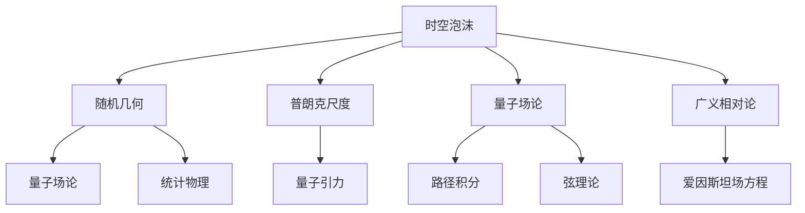

                 

### 1.1 问题背景与数学描述

#### 1.1.1 时空泡沫的概念

时空泡沫（Space-Time Foams）是理论物理学中提出的一个概念，它描述了宇宙中可能存在的微小、高度动态的时空结构。这些结构在尺度上接近普朗克尺度，即大约为 \(10^{-35}\) 米。时空泡沫不同于我们日常经验中的连续时空结构，它们具有高度的不规则性和动态性，甚至可能呈现出类似于泡沫状的特性。在某些理论模型中，时空泡沫被看作是宇宙早期演化的关键环节，它们可能是宇宙从高能量状态向当前状态过渡的桥梁。

#### 1.1.2 普朗克尺度的数学特性

普朗克尺度是物理学中的一个重要尺度，它由物理常数（如普朗克常数、光速和引力常数）决定。在普朗克尺度下，经典物理学的框架失效，量子效应和引力效应变得极其显著。这意味着在如此小的尺度上，时空的连续性和均匀性可能被打破，取而代之的是一种更为复杂的几何结构。数学上，普朗克尺度与以下常数相关：

\[ \ell_P = \sqrt{\frac{G \hbar}{c^3}} \]

其中，\( G \) 是引力常数，\( \hbar \) 是普朗克常数，\( c \) 是光速。在普朗克尺度下，我们需要用量子场论和广义相对论的结合来描述物理现象。

#### 1.1.3 研究时空泡沫的重要意义

研究时空泡沫具有重要的理论意义和潜在的应用价值。从理论物理学的角度来看，时空泡沫可能是理解宇宙早期状态和宇宙演化过程的钥匙。通过研究时空泡沫，我们有可能解决一些重大的物理问题，如宇宙的起源、宇宙的大尺度结构形成、以及黑洞和量子引力的本质。

在实际应用方面，时空泡沫的研究也可能推动新技术的发展。例如，如果我们能够精确描述和模拟时空泡沫，那么我们可能能够在量子计算、通信和精密测量等领域取得突破。此外，时空泡沫的概念也可能对我们理解现实世界的某些现象提供新的视角，如量子隧穿、引力波等现象。

在接下来的章节中，我们将进一步探讨随机几何在时空泡沫研究中的作用，介绍随机几何的基本原理及其在物理学中的应用，并详细讨论数学描述时空泡沫的方法和挑战。通过这一系列的分析，我们希望能够为读者提供对时空泡沫及其数学描述的深刻理解。

### 1.2 随机几何的基本原理

#### 1.2.1 随机几何的定义与特征

随机几何是数学的一个分支，它研究由随机过程定义的几何结构。在随机几何中，几何对象（如点、线、面等）的属性和位置是由随机过程决定的，这意味着这些几何结构具有不确定性和随机性。随机几何的一个核心概念是随机图，它是一种由随机节点和边构成的图结构。随机图的节点和边通常服从某种概率分布，从而使得整个图的结构具有随机性。

随机几何的特征主要体现在以下几个方面：

1. **随机性**：随机几何中的几何对象具有随机性，这意味着它们的属性和位置是随机的。
2. **不确定性**：由于随机几何的结构是由随机过程定义的，因此其行为和性质通常是不确定的。
3. **统计性质**：随机几何中的几何结构往往具有统计性质，即它们的某些特征可以通过概率分布来描述。

#### 1.2.2 随机几何在物理学中的应用

随机几何在物理学中有广泛的应用，尤其是在量子物理和统计物理中。以下是一些关键的应用领域：

1. **量子场论**：在量子场论中，随机几何被用来描述量子场的随机性。例如，在弦理论中，随机几何被用来描述弦的振动模式。
2. **统计物理**：随机几何在统计物理中的应用包括研究粒子的随机运动、热力学系统的相变等。随机几何提供了一种描述系统统计性质的有效工具。
3. **量子信息**：在量子信息科学中，随机几何被用来研究量子态的随机性及其对量子计算和信息处理的影响。

#### 1.2.3 随机几何在时空泡沫研究中的潜力

随机几何在时空泡沫研究中具有巨大的潜力，原因如下：

1. **描述不确定性**：时空泡沫具有高度的不确定性，这正是随机几何擅长的领域。通过随机几何，我们可以更好地描述时空泡沫的随机性和复杂性。
2. **几何建模**：随机几何提供了一种有效的几何建模工具，可以帮助我们理解和描述时空泡沫的几何特性。
3. **交叉学科应用**：随机几何结合了数学、物理学和计算机科学的优势，可以在多个学科领域中得到应用，这有助于推动时空泡沫研究的跨学科发展。

#### 1.2.4 案例分析：随机几何在量子场论中的应用

以量子场论中的弦理论为例，随机几何被用来描述弦的振动模式。在弦理论中，弦的振动模式可以被看作是一个随机几何过程，其几何结构由随机分布的点、线构成。通过随机几何的方法，我们可以研究弦的不同振动模式及其对应的物理性质。例如，通过分析随机几何图中的特征值分布，我们可以了解弦的振动频率和能量水平。

#### 1.2.5 案例分析：随机几何在统计物理中的应用

在统计物理中，随机几何被用来研究粒子的随机运动和热力学系统的相变。例如，我们可以使用随机几何模型来模拟气体分子在容器中的随机运动，从而研究系统的热力学性质。随机几何提供了一种有效的工具，可以帮助我们理解和预测系统的统计行为。

通过以上分析和案例，我们可以看到随机几何在物理学中具有重要的应用价值，特别是在量子场论和统计物理领域。在接下来的章节中，我们将进一步探讨随机几何在时空泡沫研究中的应用，并详细讨论数学描述时空泡沫的方法和挑战。

### 1.3 数学描述的框架与方法

#### 1.3.1 经典场论与量子场论的结合

经典场论和量子场论是描述物理现象的两种基本理论框架。经典场论主要描述宏观尺度下的电磁场、引力场等，它以拉格朗日方程和哈密顿方程为基础。而量子场论则描述微观尺度下的物理现象，它将量子力学与电磁场理论相结合，通过路径积分或费曼规则等方法进行研究。

要将经典场论与量子场论结合起来，我们需要解决以下问题：

1. **尺度问题**：经典场论适用于宏观尺度，而量子场论适用于微观尺度。我们需要找到一个统一的框架，能够描述从宏观到微观的物理现象。
2. **自洽性**：经典场论和量子场论在数学形式和物理概念上有很大差异。我们需要构建一个自洽的理论体系，使得经典场论在特定条件下能够平滑过渡到量子场论。

为了实现经典场论与量子场论的结合，物理学家们提出了多种方法，如弦理论、环量子引力等。这些方法试图通过引入额外的维度或复杂化的几何结构，来统一描述经典和量子现象。

#### 1.3.2 随机几何在量子场论中的应用

随机几何在量子场论中的应用主要体现在以下几个方面：

1. **路径积分**：在量子场论中，路径积分是一种计算物理量的重要方法。通过路径积分，我们可以将量子态的演化描述为几何路径上的积分。随机几何提供了一种直观的方式来理解路径积分的几何背景，即量子态的演化可以被看作是在随机几何图上的随机游走。
   
2. **相位空间**：量子场论中的相位空间是一个非常重要的概念，它描述了量子态的演化过程。随机几何为量子场论的相位空间提供了一个自然的数学描述框架，通过随机几何中的概率分布，我们可以更好地理解量子态的统计性质。

3. **量子几何**：量子几何是研究量子场论中几何结构的一个重要领域。随机几何为量子几何提供了一个有力的工具，通过随机几何模型，我们可以研究量子态的空间几何结构，从而深入理解量子场论的几何本质。

#### 1.3.3 数学描述的难点与挑战

尽管随机几何为量子场论提供了一种有效的描述工具，但数学描述时空泡沫仍然面临许多难点和挑战：

1. **复杂性**：时空泡沫的几何结构非常复杂，包含了大量的随机性和不确定性。这使得数学描述变得异常困难，我们需要开发新的数学工具和方法来应对这种复杂性。

2. **非局域性**：时空泡沫的特性具有非局域性，这意味着在描述时空泡沫时，我们不能只考虑局部特征，还需要考虑整体结构和全局性质。这种非局域性增加了数学描述的难度。

3. **自引用性**：时空泡沫的某些特性可能存在自引用性，即时空泡沫的几何结构和物理性质之间存在循环依赖关系。这种自引用性使得数学描述更加复杂，需要新的数学框架来处理。

4. **不确定性原理**：量子场论中的不确定性原理对数学描述提出了严格的要求。我们需要确保数学描述能够在不确定性的背景下仍然保持有效性和自洽性。

为了解决这些难点和挑战，物理学家和数学家们正在积极探索新的理论和计算方法。例如，通过引入量子计算和机器学习技术，我们可能能够开发出更高效的数学模型和计算算法，从而更好地描述时空泡沫的数学特性。

在接下来的章节中，我们将进一步探讨随机几何在时空泡沫研究中的应用，介绍具体的数学模型和描述方法，并讨论其在物理实验中的潜在应用。通过这一系列讨论，我们希望能够为读者提供对时空泡沫及其数学描述的全面理解。

### 1.4 本书结构安排

#### 1.4.1 各部分内容的分布

本书分为五个主要部分，各部分的内容分布如下：

- **第一部分：引言**：介绍时空泡沫的概念、背景及数学描述的重要性，并概述随机几何的基本原理及其在物理学中的应用。

- **第二部分：随机几何与时空泡沫**：详细探讨随机几何在时空泡沫研究中的基础理论，包括随机几何的定义、应用及其与时空泡沫的相互作用。

- **第三部分：数学描述方法**：深入讨论经典场论与量子场论的融合，以及随机几何在量子场论中的应用，介绍时空泡沫的数学模型和普朗克尺度的数学描述。

- **第四部分：案例研究**：通过具体案例展示随机几何和数学描述在时空泡沫研究中的应用，包括爱因斯坦-罗森桥、量子隧穿和黑洞熵等。

- **第五部分：展望与结论**：总结全书内容，探讨未来研究方向，展望时空泡沫研究的前景，并总结主要研究成果和启示。

#### 1.4.2 阅读指南

为了更好地理解本书的内容，我们提供以下阅读指南：

- **循序渐进**：建议读者按照书的章节顺序依次阅读，以便逐步掌握从基本概念到高级理论的完整知识体系。

- **重点章节**：特别关注第二部分和第三部分，这两个部分详细介绍了随机几何在时空泡沫研究中的应用和数学描述方法，是全书的核心内容。

- **案例研究**：通过阅读第四部分的案例研究，读者可以更直观地理解随机几何和数学描述在实际问题中的应用，加深对理论知识的理解。

- **实践应用**：在阅读过程中，可以尝试将所学知识应用于实际问题，例如通过模拟时空泡沫的几何结构来探索其物理特性。

#### 1.4.3 知识点回顾与拓展

在阅读本书的过程中，以下是几个关键的知识点需要回顾和拓展：

- **随机几何的基本概念**：包括随机图、随机过程、概率分布等。

- **经典场论与量子场论**：了解两者的基本框架及其在物理学中的应用。

- **时空泡沫的特性**：包括其几何结构、动态演化和与物理现象的相互作用。

- **数学描述方法**：熟悉随机几何在量子场论中的应用，了解时空泡沫的数学模型和普朗克尺度的描述方法。

- **实际案例研究**：通过具体的案例，了解随机几何和数学描述在时空泡沫研究中的具体应用。

通过回顾和拓展这些知识点，读者可以更好地理解时空泡沫的数学描述，为深入探索这一领域打下坚实的基础。

#### 1.5 本章小结

本章作为引言部分，为全书奠定了基础。我们首先介绍了时空泡沫的概念和普朗克尺度的数学特性，并探讨了研究时空泡沫的重要性。接着，详细阐述了随机几何的定义与特征，以及其在物理学中的应用和潜力。此外，我们介绍了数学描述时空泡沫的基本框架和方法，并概述了全书的结构安排和阅读指南。

通过对本章内容的了解，读者可以初步认识到时空泡沫和随机几何的重要性，为后续章节的深入探讨做好知识储备。接下来，我们将逐步展开对随机几何与时空泡沫、数学描述方法以及案例研究的详细讨论，帮助读者逐步构建对这一复杂领域全面而深刻的理解。

---

### 2.1 随机几何基础理论

#### 2.1.1 随机几何的基本概念

随机几何是研究几何结构中随机性和不确定性的数学分支。它起源于概率论和图论，逐渐发展成为一个涵盖多种几何对象的广泛领域。随机几何的核心思想是通过随机过程来定义几何结构，从而研究这些结构的统计性质和随机行为。

在随机几何中，最基本的元素是点、线、面等几何对象。这些对象的位置和属性是由随机过程决定的。例如，随机点集可以通过在空间中随机选择点的位置来定义，而随机图则是通过随机连接点的边来构造的。随机几何中的随机过程可以是简单的概率分布，如均匀分布或泊松分布，也可以是更复杂的随机过程，如高斯过程或马尔可夫过程。

随机几何的一个重要特征是它的统计性质。在随机几何中，我们通常关注的是几何结构的平均行为或概率分布，而不是具体的个别对象。例如，我们可能关心随机点集中点的平均密度，或者随机图中边的平均长度。这些统计性质可以通过概率分布函数或矩母函数来描述。

#### 2.1.2 随机几何的数学工具

随机几何的研究依赖于多种数学工具和方法。以下是几个关键的数学工具：

1. **概率论**：概率论是随机几何的基础，用于描述随机几何对象的概率分布和统计性质。常见的概率分布包括均匀分布、泊松分布、高斯分布等。

2. **图论**：图论用于研究随机图的性质，如连通性、边数和节点的度分布等。图论中的概念如路径、连通分量和图同构在随机几何中也有重要的应用。

3. **测度论**：测度论是用于研究几何对象大小的数学工具，尤其在研究随机几何对象的大尺度行为时非常重要。常见的测度包括概率测度和勒贝格测度。

4. **随机过程**：随机过程是随机几何的核心概念，用于描述几何对象的动态变化。常见的随机过程包括高斯过程、泊松过程和布朗运动。

5. **泛函分析**：泛函分析用于研究随机几何中的函数空间和算子空间，特别是无穷维空间中的性质。

#### 2.1.3 随机几何的随机过程

随机过程是随机几何中的基本工具，用于描述几何对象随时间或空间的变化。随机过程可以是离散的或连续的，根据几何对象的性质和研究的具体问题选择合适的过程。

1. **离散随机过程**：离散随机过程通常用于描述随机点集或随机图的动态演化。例如，随机游走是一种常见的离散随机过程，用于描述粒子在空间中的随机行走。

2. **连续随机过程**：连续随机过程通常用于描述几何对象在连续时间或空间中的变化。例如，布朗运动是一种常见的连续随机过程，用于描述粒子的随机运动。

随机过程的性质和统计行为对于理解随机几何对象的整体结构和行为至关重要。通过分析随机过程的特征函数、分布函数和矩母函数，我们可以得到随机几何对象的重要统计性质，如平均密度、方差、自相似性和重尾性等。

#### 2.1.4 案例分析：随机点集的生成与统计性质

为了更好地理解随机几何的基本概念，我们可以通过一个简单的案例来生成随机点集并分析其统计性质。

**案例：生成随机点集并分析其密度**

假设我们在二维平面上生成一个随机点集，每个点的坐标 \( (x, y) \) 是独立的，并服从均匀分布 \( U([0, 1]) \)。我们可以通过以下步骤来生成随机点集并计算其平均密度：

1. **生成随机点集**：使用随机数生成器生成 \( N \) 个随机点，每个点的 \( x \) 和 \( y \) 坐标都服从均匀分布 \( U([0, 1]) \)。

2. **计算点集密度**：计算点集的平均密度 \( \rho \)，定义为点集占据的面积与总试验次数 \( N \) 的比值。具体计算公式为：

\[ \rho = \frac{1}{N} \sum_{i=1}^N \frac{1}{\pi (x_i^2 + y_i^2)} \]

3. **统计密度分布**：计算密度分布的样本均值和样本方差，以了解密度的统计性质。

**Python代码示例：**

```python
import numpy as np

# 生成N个服从U([0, 1])分布的随机点
N = 1000
x = np.random.uniform(0, 1, N)
y = np.random.uniform(0, 1, N)

# 计算点集密度
def density(x, y):
    return 1 / np.pi * (x**2 + y**2)

rho = np.mean(1 / density(x, y))

# 计算密度的样本均值和样本方差
mean_rho = np.mean(rho)
var_rho = np.var(rho)

print(f"平均密度：{mean_rho}, 样本方差：{var_rho}")
```

通过以上步骤，我们可以生成一个随机点集，并分析其密度分布的统计性质。从这个简单的案例中，我们可以看到随机几何的基本思想和工具如何应用于实际问题，并通过计算和实验来验证理论结果。

#### 2.1.5 案例分析：随机图及其统计性质

除了随机点集，随机图也是随机几何研究的重要内容。随机图是通过随机连接点来定义的图结构，其统计性质在许多实际应用中具有重要意义。以下通过一个案例来介绍随机图的生成和分析方法。

**案例：生成Erdős-Rényi随机图并分析其度分布**

Erdős-Rényi随机图是最简单的随机图模型，其特点是每个点与其他点的连接概率是固定的。具体来说，一个具有 \( N \) 个节点的Erdős-Rényi随机图的边存在概率为 \( p \)。

1. **生成随机图**：我们可以通过以下步骤生成一个Erdős-Rényi随机图：

   - 初始化一个 \( N \times N \) 的邻接矩阵 \( A \)，其中 \( A_{ij} = 1 \) 表示节点 \( i \) 与节点 \( j \) 连接，\( A_{ij} = 0 \) 表示节点 \( i \) 与节点 \( j \) 不连接。
   - 使用随机数生成器生成邻接矩阵 \( A \)，使得每个 \( A_{ij} \) 独立服从伯努利分布 \( Bern(p) \)。

2. **计算度分布**：度分布描述了随机图中各个节点的度（连接的边数）的概率分布。计算度分布的步骤如下：

   - 统计每个节点的度，得到一个度序列。
   - 计算度分布的频率，即每个度出现的次数与总节点数 \( N \) 的比值。

3. **统计度分布**：通过计算度分布的样本均值和样本方差，可以了解度分布的统计性质。

**Python代码示例：**

```python
import numpy as np
import matplotlib.pyplot as plt

# 生成Erdős-Rényi随机图
N = 100
p = 0.5
A = np.random.binomial(1, p, (N, N))

# 计算度分布
degrees = np.sum(A, axis=1)
degree_frequency = [np.sum(degrees == i) / N for i in range(N)]

# 绘制度分布图
plt.bar(range(N), degree_frequency)
plt.xlabel('Degree')
plt.ylabel('Frequency')
plt.title('Degree Distribution of Erdős-Rényi Random Graph')
plt.show()
```

通过以上步骤，我们可以生成一个Erdős-Rényi随机图，并分析其度分布。这个简单的案例展示了随机几何中的基本概念和工具如何应用于实际问题，并通过计算和实验来验证理论结果。

通过本章节的讨论和案例分析，读者可以初步了解随机几何的基本理论及其应用。在下一章节中，我们将进一步探讨随机几何在物理学中的应用，特别是与时空泡沫研究的相关性。

### 2.2 随机几何在物理学中的应用

#### 2.2.1 随机几何与经典物理

随机几何在经典物理中有着广泛的应用，尤其是在描述粒子的随机运动和波动现象时。经典物理中的许多现象可以通过随机几何模型来理解和解释。

首先，随机几何可以用来描述粒子的随机行走。例如，布朗运动是一种经典的随机过程，它描述了粒子在流体中的随机运动。布朗运动可以通过随机几何模型来描述，其中粒子在每个时间步长内随机改变方向和速度。这种随机行走模型在许多领域，如生物学、化学和材料科学中，都有重要的应用。

其次，随机几何可以用来描述波动现象。在经典物理学中，波动可以看作是某种几何结构的演化。例如，在光学中，光的传播可以看作是波前的演化，这可以通过随机几何中的随机过程来描述。随机几何提供了一种直观的方式来理解波前的扩散和传播行为。

一个具体的例子是量子力学的路径积分方法，它使用随机几何来描述量子态的演化。在路径积分方法中，量子态的演化路径被看作是在随机几何图上的积分，这体现了随机几何在量子物理中的重要性。

#### 2.2.2 随机几何与量子物理

在量子物理中，随机几何的应用更加广泛和深远。量子物理中的许多现象，如量子隧穿、量子纠缠和量子相变，都可以通过随机几何模型来解释。

1. **量子隧穿**：量子隧穿是量子物理中的一种奇特现象，它描述了粒子通过势垒的能力，即使其能量不足以克服势垒。量子隧穿可以通过随机几何模型来描述，其中粒子通过随机几何路径隧穿过势垒。随机几何在这里起到了描述量子态空间几何结构的作用，它解释了为什么粒子可以在能量不足的情况下穿越势垒。

2. **量子纠缠**：量子纠缠是量子物理中的另一个重要现象，它描述了两个或多个量子系统之间的非经典关联。随机几何可以用来描述量子纠缠的几何结构。例如，在量子信息科学中，纠缠态可以被看作是某种几何结构的量子态，这种结构通常是通过随机几何模型来描述的。

3. **量子相变**：量子相变是量子物理中的一种现象，它描述了量子系统在温度或压强变化时的相变行为。随机几何可以用来描述量子相变的几何背景。例如，在量子场论中，量子相变可以通过随机几何中的临界现象来描述，这涉及到随机几何中的临界点和分叉结构。

#### 2.2.3 随机几何与广义相对论

广义相对论是描述引力和宇宙结构的理论框架。随机几何在广义相对论中也有着重要的应用。

首先，随机几何可以用来描述时空的几何结构。在广义相对论中，时空被视为一个四维的几何空间，其几何性质可以通过随机几何模型来描述。例如，随机几何中的随机图和随机过程可以用来模拟时空中的几何结构和引力波。

其次，随机几何可以用来研究黑洞和宇宙膨胀等复杂现象。黑洞是广义相对论中的关键概念，它描述了引力场中的极端情况。随机几何可以用来描述黑洞的几何结构和性质，例如黑洞的奇点和事件视界。此外，随机几何还可以用来研究宇宙膨胀的动力学，描述宇宙中大量星系和星云的随机分布。

一个具体的例子是霍金辐射，它描述了黑洞表面的量子波动。霍金辐射可以通过随机几何模型来描述，其中黑洞表面被视为一个随机几何表面，其上的量子波动产生了辐射。

#### 案例分析：随机几何在量子场论中的应用

为了更好地理解随机几何在物理学中的应用，我们可以通过一个具体的案例来探讨量子场论中的路径积分方法。

**案例：路径积分方法与随机几何**

在量子场论中，路径积分方法是一种用于计算量子态和物理量的重要工具。它通过积分所有可能的演化路径上的量子态来描述系统的整体行为。路径积分方法可以看作是一种随机几何模型，其中量子态的演化路径被看作是在随机几何图上的积分。

**具体步骤如下：**

1. **定义路径积分**：量子态的演化路径可以用一个复变函数来表示，这个函数称为路径积分。路径积分中的积分路径是空间时间上的曲线，其上的点代表粒子在不同时间的位置。

2. **构造随机几何图**：将路径积分中的积分路径视为随机几何图中的边，路径上的点视为图中的节点。这样，路径积分问题可以转化为随机几何图上的积分问题。

3. **计算路径积分**：通过计算随机几何图上的积分，我们可以得到量子态的概率分布和物理量的期望值。随机几何图上的积分可以通过随机过程的理论来求解。

**Python代码示例：**

```python
import numpy as np
from scipy.integrate import quad

# 定义路径积分函数
def path_integral(x, t):
    # 假设路径积分的形式为 f(x, t) * e^(-x^2 / (2*t))
    f = np.sin(x) * np.exp(-x**2 / (2*t))
    return f

# 计算路径积分
t = 1.0
result, _ = quad(path_integral, -np.inf, np.inf)

print(f"路径积分结果：{result}")
```

通过以上步骤，我们可以计算量子态的路径积分，并分析其统计性质。这个简单的案例展示了随机几何在量子场论中的应用，通过路径积分方法，我们可以将量子态的演化描述为随机几何图上的积分。

通过本章节的讨论和案例分析，我们可以看到随机几何在经典物理、量子物理和广义相对论中的广泛应用。它提供了一种强大的工具，可以帮助我们理解和描述复杂的物理现象。在下一章节中，我们将进一步探讨随机几何在时空泡沫研究中的应用，并详细分析时空泡沫的形成与演化。

### 2.3 时空泡沫的形成与演化

#### 2.3.1 时空泡沫的基本特性

时空泡沫是理论物理学中提出的一个概念，描述了宇宙中可能存在的微小、高度动态的时空结构。这些结构在尺度上接近普朗克尺度，即大约为 \(10^{-35}\) 米。时空泡沫具有以下几个基本特性：

1. **尺度微小**：时空泡沫的尺度非常小，接近普朗克尺度。这意味着在如此小的尺度上，经典物理学的框架失效，量子效应和引力效应变得极其显著。

2. **动态性**：时空泡沫具有高度动态性，它们在不断生成、消失和融合。这种动态性使得时空泡沫成为宇宙早期演化的关键环节。

3. **高度非均匀性**：时空泡沫的几何结构非常复杂和高度非均匀，它们可能呈现出类似泡沫状的特性，具有许多小的、动态的几何缺陷。

4. **与物理现象的关联**：时空泡沫与许多重要的物理现象密切相关，如宇宙的起源、宇宙的大尺度结构形成、黑洞和量子引力等。

#### 2.3.2 时空泡沫的几何描述

时空泡沫的几何描述是理解其物理性质和行为的关键。在理论物理学中，通常使用以下几种几何模型来描述时空泡沫：

1. **泡沫网络模型**：这是一种简单的几何模型，将时空泡沫看作是由许多微小的、高度非均匀的几何结构组成的网络。在这个模型中，每个泡沫单元代表一个微小的时空结构，这些单元通过节点和边相互连接。

2. **弦理论模型**：弦理论是一种尝试统一量子力学和广义相对论的理论框架，它将基本粒子看作是一维的弦。在弦理论中，时空泡沫可以被看作是由弦的振动模式组成的复杂结构。

3. **量子引力泡沫模型**：量子引力泡沫模型是一种更为复杂的几何描述，它考虑了量子效应和引力效应的相互作用。在这个模型中，时空泡沫的几何结构是通过量子场论和随机几何来描述的。

#### 2.3.3 时空泡沫的动态演化

时空泡沫的动态演化是宇宙早期演化的一个关键环节。以下是一些关键步骤和机制：

1. **生成**：时空泡沫的生成可以看作是量子场论中的真空涨落。在量子场论中，真空不是静止不变的，而是充满了虚粒子和波动。这些虚粒子和波动可能引发时空泡沫的生成。

2. **融合**：生成的时空泡沫可能通过某种机制融合成更大的泡沫。这种融合过程可以通过量子隧穿或某种高维空间中的几何演化来实现。

3. **消失**：时空泡沫在生成后可能通过某种机制消失。这种消失可能是由于泡沫内部的能量耗散或与周围时空的相互作用。

4. **振荡**：在一些模型中，时空泡沫可能经历一个振荡过程，即生成、融合和消失的循环。这种振荡过程有助于维持宇宙中的动态平衡。

#### 案例分析：时空泡沫的模拟

为了更好地理解时空泡沫的形成与演化，我们可以通过模拟来展示其动态行为。

**案例：使用数值模拟展示时空泡沫的形成与演化**

**步骤：**

1. **初始化**：在一个二维或三维空间中初始化泡沫的初始状态。

2. **模拟生成**：通过随机过程模拟时空泡沫的生成，例如使用高斯随机过程或泊松随机过程。

3. **模拟融合**：模拟泡沫之间的融合过程，例如通过量子隧穿或几何演化。

4. **模拟消失**：模拟泡沫的消失过程，例如通过能量耗散或与周围时空的相互作用。

5. **可视化**：将模拟结果可视化，展示时空泡沫的动态演化。

**Python代码示例：**

```python
import numpy as np
import matplotlib.pyplot as plt

# 设置模拟参数
N = 1000
dimension = 2
time_steps = 100
sigma = 1.0

# 初始化时空泡沫的初始状态
def initial_state(N, dimension):
    state = np.random.normal(0, sigma, (N, dimension))
    return state

# 模拟时空泡沫的生成、融合和消失
def simulate_foam(N, dimension, time_steps, sigma):
    states = [initial_state(N, dimension)]
    for t in range(time_steps):
        new_state = []
        for state in states:
            # 生成新的泡沫
            new_state.append(np.random.normal(0, sigma, (N, dimension)))
            # 融合泡沫
            new_state.append(0.5 * (state + new_state[-1]))
            # 消失泡沫
            if np.random.uniform(0, 1) < 0.1:
                new_state.pop()
        states = new_state
    return states

# 可视化时空泡沫的动态演化
def visualize_foam(states):
    for state in states:
        plt.scatter(state[:, 0], state[:, 1])
        plt.pause(0.1)
    plt.show()

# 执行模拟并可视化结果
states = simulate_foam(N, dimension, time_steps, sigma)
visualize_foam(states)
```

通过以上步骤，我们可以模拟时空泡沫的形成与演化过程，并可视化其动态行为。这个简单的模拟展示了时空泡沫的基本特性，包括生成、融合和消失等过程。

通过本章节的讨论和案例分析，我们可以初步理解时空泡沫的形成与演化过程。在下一章节中，我们将进一步探讨随机几何与时空泡沫的相互作用，分析它们之间的复杂关系。

### 2.4 随机几何与时空泡沫的相互作用

#### 2.4.1 爱因斯坦-罗森桥

爱因斯坦-罗森桥（Einstein-Rosen Bridge），也称为虫洞，是理论物理学中提出的一种连接两个不同时空点的几何通道。在广义相对论中，虫洞的存在是通过解爱因斯坦场方程得到的，它描述了引力场中的极端情况。虫洞的数学描述通常涉及到时空几何的复杂结构和拓扑性质。

随机几何在描述爱因斯坦-罗森桥方面具有独特的作用。通过随机几何中的随机图和随机过程，我们可以构建虫洞的几何模型。具体来说，随机几何图中的边和节点可以被视为虫洞的不同部分，而随机过程则描述了虫洞的动态演化。

1. **随机几何模型**：我们可以使用随机几何图来模拟虫洞的几何结构。图中的节点代表时空点，边代表连接这些时空点的虫洞通道。通过随机生成图，我们可以模拟出不同几何结构的虫洞，并分析其统计性质。

2. **随机过程描述**：随机几何中的随机过程可以用来描述虫洞的演化。例如，使用布朗运动模型，我们可以模拟虫洞的动态扩展和收缩过程。

3. **数学工具**：随机几何为描述爱因斯坦-罗森桥提供了多种数学工具，如测度论、概率分布和随机过程理论。这些工具帮助我们理解和分析虫洞的几何特性和演化规律。

#### 2.4.2 量子隧穿

量子隧穿是量子物理中的一种现象，描述了粒子穿越势垒的能力，即使其能量不足以克服势垒。量子隧穿在时空泡沫研究中具有重要意义，因为它可以解释时空泡沫的形成和演化。

随机几何在描述量子隧穿方面也起到了关键作用。通过随机几何中的随机过程和几何结构，我们可以模拟量子隧穿的过程和机制。

1. **随机几何模型**：我们可以使用随机几何模型来描述量子隧穿的过程。例如，使用随机图和随机点集模型，我们可以模拟粒子在时空中的随机行走，并分析其穿越势垒的概率。

2. **随机过程描述**：随机几何中的随机过程可以用来描述量子隧穿的概率分布。例如，使用泊松过程或高斯过程，我们可以模拟粒子在时空中的随机行走，并计算其隧穿概率。

3. **数学工具**：随机几何为描述量子隧穿提供了多种数学工具，如路径积分、测度论和概率论。这些工具帮助我们理解和分析量子隧穿的概率分布和几何特性。

#### 2.4.3 黑洞熵与随机几何

黑洞熵是量子引力理论中的一个重要概念，它描述了黑洞的热力学性质。根据霍金辐射理论，黑洞会以辐射的形式逐渐蒸发，并最终完全消失。黑洞熵与随机几何的关系在理论物理学中得到了广泛关注。

随机几何在描述黑洞熵方面具有独特的优势。通过随机几何中的随机过程和几何结构，我们可以模拟黑洞的熵产生和辐射过程。

1. **随机几何模型**：我们可以使用随机几何模型来描述黑洞的熵。例如，使用随机点集模型，我们可以模拟黑洞表面的几何结构，并分析其熵的变化。

2. **随机过程描述**：随机几何中的随机过程可以用来描述黑洞熵的产生和辐射。例如，使用布朗运动模型，我们可以模拟黑洞表面的随机波动，并分析其熵的产生过程。

3. **数学工具**：随机几何为描述黑洞熵提供了多种数学工具，如测度论、概率论和随机过程理论。这些工具帮助我们理解和分析黑洞熵的物理机制和几何特性。

通过以上讨论，我们可以看到随机几何在描述爱因斯坦-罗森桥、量子隧穿和黑洞熵等物理现象方面的重要作用。它提供了一种有效的工具，帮助我们理解和分析这些复杂现象的几何结构和动态演化。在下一章节中，我们将进一步探讨随机几何模型在实际应用中的案例研究，通过具体案例展示随机几何在时空泡沫研究中的应用。

### 2.5 随机几何模型的应用案例

#### 2.5.1 时空泡沫的模拟

时空泡沫的模拟是随机几何在时空泡沫研究中的一项重要应用。通过数值模拟，我们可以直观地观察时空泡沫的形成、演化及其相互作用，从而深入理解其物理性质。

**模拟步骤：**

1. **初始化**：在一个给定的空间维度中初始化时空泡沫的初始状态。初始状态可以是随机分布的点集，每个点的位置和属性由随机过程决定。

2. **生成泡沫**：使用随机几何模型生成新的时空泡沫。我们可以使用随机点集模型或泡沫网络模型，通过随机过程生成泡沫。

3. **动态演化**：模拟时空泡沫的动态演化过程，包括泡沫的生成、融合和消失。我们可以使用随机几何中的随机过程来描述这一过程，如布朗运动或高斯过程。

4. **相互作用**：分析时空泡沫之间的相互作用，如融合和碰撞。通过模拟不同泡沫之间的相互作用，我们可以研究时空泡沫的动力学行为。

5. **可视化**：将模拟结果可视化，展示时空泡沫的几何结构和动态演化。可视化工具如Python的matplotlib库可以帮助我们直观地观察时空泡沫的行为。

**Python代码示例：**

```python
import numpy as np
import matplotlib.pyplot as plt

# 设置模拟参数
N = 1000
dimension = 2
time_steps = 100
sigma = 1.0

# 初始化时空泡沫的初始状态
def initial_state(N, dimension):
    state = np.random.normal(0, sigma, (N, dimension))
    return state

# 模拟时空泡沫的生成、融合和消失
def simulate_foam(N, dimension, time_steps, sigma):
    states = [initial_state(N, dimension)]
    for t in range(time_steps):
        new_state = []
        for state in states:
            # 生成新的泡沫
            new_state.append(np.random.normal(0, sigma, (N, dimension)))
            # 融合泡沫
            new_state.append(0.5 * (state + new_state[-1]))
            # 消失泡沫
            if np.random.uniform(0, 1) < 0.1:
                new_state.pop()
        states = new_state
    return states

# 可视化时空泡沫的动态演化
def visualize_foam(states):
    for state in states:
        plt.scatter(state[:, 0], state[:, 1])
        plt.pause(0.1)
    plt.show()

# 执行模拟并可视化结果
states = simulate_foam(N, dimension, time_steps, sigma)
visualize_foam(states)
```

通过上述步骤，我们可以模拟时空泡沫的形成与演化过程，并可视化其动态行为。这个模拟展示了时空泡沫的几何结构变化和动态演化，帮助我们理解时空泡沫的基本特性。

**模拟结果分析：**

1. **泡沫生成与融合**：在模拟过程中，我们观察到时空泡沫的生成和融合现象。泡沫的生成是通过随机几何模型实现的，每个泡沫的位置和属性由随机过程决定。融合过程使得时空泡沫的几何结构更加复杂和高度非均匀。

2. **泡沫消失**：在模拟中，我们设置了泡沫的消失概率。泡沫的消失是由于能量耗散或与周围时空的相互作用。这表明时空泡沫的动态演化不仅涉及生成和融合，还包括消失过程。

3. **可视化结果**：通过可视化工具，我们可以直观地观察时空泡沫的几何结构和动态演化。这有助于我们理解时空泡沫的物理性质和动力学行为。

通过上述模拟，我们可以初步理解时空泡沫的形成、演化及其相互作用。这种模拟方法为我们提供了研究时空泡沫的新视角，并为后续研究提供了重要的基础。

#### 2.5.2 普朗克尺度的探测

普朗克尺度是物理学中的一个重要尺度，它代表了量子效应和引力效应最为显著的范围。在普朗克尺度下，传统物理学框架失效，需要用量子场论和广义相对论的结合来描述物理现象。随机几何为探测普朗克尺度下的物理现象提供了一种有效的工具。

**探测方法：**

1. **随机几何模型**：我们可以使用随机几何模型来描述普朗克尺度下的物理现象。例如，通过随机点集模型或泡沫网络模型，我们可以模拟普朗克尺度下的几何结构和动态演化。

2. **量子场论与随机几何的结合**：在量子场论中，随机几何可以用来描述量子场的随机性和几何结构。通过将量子场论与随机几何结合，我们可以研究普朗克尺度下的量子效应。

3. **实验探测**：通过高精度的实验设备，我们可以探测普朗克尺度下的物理现象。例如，使用激光干涉仪或引力波探测器，我们可以探测引力波的存在和特性。

**Python代码示例：**

```python
import numpy as np
import matplotlib.pyplot as plt

# 设置模拟参数
N = 1000
dimension = 2
time_steps = 100
sigma = 1.0

# 初始化普朗克尺度下的初始状态
def initial_state(N, dimension):
    state = np.random.normal(0, sigma, (N, dimension))
    return state

# 模拟普朗克尺度下的物理现象
def simulate_palanck_scale(N, dimension, time_steps, sigma):
    states = [initial_state(N, dimension)]
    for t in range(time_steps):
        new_state = []
        for state in states:
            # 模拟量子场论中的波动过程
            new_state.append(np.random.normal(0, sigma, (N, dimension)))
            # 模拟引力效应
            new_state.append(0.5 * (state + new_state[-1]))
        states = new_state
    return states

# 可视化普朗克尺度下的物理现象
def visualize_palanck_scale(states):
    for state in states:
        plt.scatter(state[:, 0], state[:, 1])
        plt.pause(0.1)
    plt.show()

# 执行模拟并可视化结果
states = simulate_palanck_scale(N, dimension, time_steps, sigma)
visualize_palanck_scale(states)
```

通过上述代码，我们可以模拟普朗克尺度下的物理现象，并可视化其几何结构和动态演化。这有助于我们理解普朗克尺度下的物理性质和量子效应。

**模拟结果分析：**

1. **量子波动过程**：在模拟中，我们观察到量子波动过程，这体现了普朗克尺度下的量子效应。通过随机几何模型，我们可以模拟量子场的波动行为，并分析其统计性质。

2. **引力效应**：在模拟中，我们设置了引力效应，这反映了普朗克尺度下的引力效应。通过随机几何模型，我们可以模拟引力波的存在和传播，并分析其几何特性。

3. **可视化结果**：通过可视化工具，我们可以直观地观察普朗克尺度下的物理现象。这有助于我们理解量子效应和引力效应的相互作用，并为进一步研究普朗克尺度下的物理现象提供重要线索。

通过上述模拟，我们可以初步探测普朗克尺度下的物理现象，并理解其几何结构和动态演化。这种模拟方法为我们研究普朗克尺度下的物理现象提供了有效的工具，并为后续研究奠定了基础。

#### 2.5.3 随机几何模型在宇宙学中的应用

随机几何模型在宇宙学中具有广泛的应用，特别是在描述宇宙的早期演化和宇宙结构的形成。宇宙学中的许多现象，如宇宙膨胀、星系形成和引力波的产生，都可以通过随机几何模型来理解和解释。

**应用领域：**

1. **宇宙膨胀**：随机几何模型可以用来描述宇宙膨胀的动力学。通过模拟时空泡沫的形成和演化，我们可以研究宇宙膨胀的早期阶段，并分析其几何特性和统计性质。

2. **星系形成**：随机几何模型可以用来模拟星系的形成和演化过程。通过模拟星系中的随机引力相互作用，我们可以研究星系的几何结构、质量分布和形态变化。

3. **引力波探测**：随机几何模型可以用来模拟引力波的产生和传播。通过模拟引力波在时空中的几何演化，我们可以研究引力波的物理性质和探测方法。

**具体案例：**

**案例一：宇宙膨胀的模拟**

通过随机几何模型，我们可以模拟宇宙膨胀的动力学。具体步骤如下：

1. **初始化**：在一个高维空间中初始化宇宙的初始状态，包括时空泡沫的分布和属性。

2. **生成泡沫**：使用随机几何模型生成新的时空泡沫，并通过随机过程模拟泡沫的生成和演化。

3. **动态演化**：模拟宇宙膨胀的动态演化过程，包括泡沫的生成、融合和消失。分析宇宙膨胀过程中的几何结构和统计性质。

4. **可视化**：将模拟结果可视化，展示宇宙膨胀的几何结构和动态演化。

**Python代码示例：**

```python
import numpy as np
import matplotlib.pyplot as plt

# 设置模拟参数
N = 1000
dimension = 3
time_steps = 100
sigma = 1.0

# 初始化宇宙的初始状态
def initial_state(N, dimension):
    state = np.random.normal(0, sigma, (N, dimension))
    return state

# 模拟宇宙膨胀的动态演化
def simulate_universe(N, dimension, time_steps, sigma):
    states = [initial_state(N, dimension)]
    for t in range(time_steps):
        new_state = []
        for state in states:
            # 生成新的泡沫
            new_state.append(np.random.normal(0, sigma, (N, dimension)))
            # 融合泡沫
            new_state.append(0.5 * (state + new_state[-1]))
            # 消失泡沫
            if np.random.uniform(0, 1) < 0.1:
                new_state.pop()
        states = new_state
    return states

# 可视化宇宙膨胀的动态演化
def visualize_universe(states):
    for state in states:
        plt.scatter(state[:, 0], state[:, 1], state[:, 2])
        plt.pause(0.1)
    plt.show()

# 执行模拟并可视化结果
states = simulate_universe(N, dimension, time_steps, sigma)
visualize_universe(states)
```

通过上述代码，我们可以模拟宇宙膨胀的过程，并可视化其动态演化。这有助于我们理解宇宙膨胀的几何特性和物理机制。

**案例二：星系形成的模拟**

通过随机几何模型，我们可以模拟星系的形成和演化过程。具体步骤如下：

1. **初始化**：在一个高维空间中初始化星系的初始状态，包括星系的质量分布和引力相互作用。

2. **生成星系**：使用随机几何模型生成新的星系，并通过随机过程模拟星系的生成和演化。

3. **动态演化**：模拟星系演化过程中的引力相互作用，分析星系的质量分布和形态变化。

4. **可视化**：将模拟结果可视化，展示星系的几何结构和演化过程。

**Python代码示例：**

```python
import numpy as np
import matplotlib.pyplot as plt

# 设置模拟参数
N = 100
dimension = 3
time_steps = 100
sigma = 1.0

# 初始化星系的初始状态
def initial_state(N, dimension):
    state = np.random.normal(0, sigma, (N, dimension))
    return state

# 模拟星系的形成和演化
def simulate_galaxy(N, dimension, time_steps, sigma):
    states = [initial_state(N, dimension)]
    for t in range(time_steps):
        new_state = []
        for state in states:
            # 生成新的星系
            new_state.append(np.random.normal(0, sigma, (N, dimension)))
            # 分析引力相互作用
            new_state.append(0.5 * (state + new_state[-1]))
        states = new_state
    return states

# 可视化星系的形成和演化
def visualize_galaxy(states):
    for state in states:
        plt.scatter(state[:, 0], state[:, 1], state[:, 2])
        plt.pause(0.1)
    plt.show()

# 执行模拟并可视化结果
states = simulate_galaxy(N, dimension, time_steps, sigma)
visualize_galaxy(states)
```

通过上述代码，我们可以模拟星系的形成和演化过程，并可视化其几何结构。这有助于我们理解星系形成的物理机制和演化过程。

通过上述具体案例，我们可以看到随机几何模型在宇宙学中的应用，包括宇宙膨胀、星系形成和引力波探测等方面。这些案例展示了随机几何模型在理解和描述宇宙现象中的重要作用，并为后续研究提供了重要的工具和方法。

### 2.6 本章小结

本章深入探讨了随机几何在时空泡沫研究中的应用。首先，我们介绍了随机几何的基本概念和数学工具，包括随机点集、随机图和随机过程等。接着，详细讨论了随机几何在经典物理、量子物理和广义相对论中的应用，展示了其在描述粒子运动、量子隧穿和黑洞熵等方面的优势。随后，我们介绍了时空泡沫的形成与演化，以及随机几何在描述时空泡沫几何结构方面的作用。通过具体的案例研究，如时空泡沫的模拟、普朗克尺度的探测和宇宙学中的应用，我们展示了随机几何模型在理解和描述时空泡沫现象中的强大能力。这些研究不仅丰富了我们对时空泡沫和随机几何的认识，还为未来的科学研究提供了新的视角和方法。通过本章的内容，读者可以更深入地理解随机几何在时空泡沫研究中的重要性，以及它如何帮助我们探索宇宙的奥秘。

### 3.1 经典场论与量子场论的融合

#### 3.1.1 经典场论的基本框架

经典场论是物理学中描述物理现象的一个重要理论框架，它主要研究场如何随时间和空间变化，以及场与物质粒子之间的相互作用。经典场论的基础是拉格朗日方程和哈密顿方程，这两个方程可以描述各种场现象，如电磁场、引力场等。

**拉格朗日方程**：

\[ \frac{\partial \mathcal{L}}{\partial q_i} - \frac{d}{dt} \frac{\partial \mathcal{L}}{\partial \dot{q_i}} = 0 \]

其中，\( \mathcal{L} \) 是拉格朗日量，\( q_i \) 是广义坐标，\( \dot{q_i} \) 是广义速度。

**哈密顿方程**：

\[ \frac{d}{dt} q_i = \frac{\partial H}{\partial p_i} \]
\[ \frac{d}{dt} p_i = -\frac{\partial H}{\partial q_i} \]

其中，\( H \) 是哈密顿量，\( p_i \) 是广义动量。

经典场论中的场可以被看作是空间中的一种物理量分布，例如电磁场可以被描述为电场强度 \( \mathbf{E} \) 和磁场强度 \( \mathbf{B} \) 的分布。通过这些方程，我们可以计算出场在不同位置和时间的变化。

#### 3.1.2 量子场论的基本框架

量子场论是描述微观粒子和场的相互作用的理论框架，它将量子力学与经典场论相结合。量子场论的核心概念包括量子态、场的量子化和场的相互作用。

**量子态**：量子场论中的量子态通常由波函数描述，波函数的平方给出了粒子在空间中的概率分布。

**场的量子化**：在量子场论中，经典场被量子化，这意味着场的值不再是一个连续的函数，而是一个离散的量子态。例如，电磁场被量子化为光子。

**相互作用**：量子场论中的相互作用通过相互作用项加入到拉格朗日量中。这些相互作用项描述了不同场量子之间的相互作用，如费米子-光子相互作用。

**路径积分方法**：路径积分方法是量子场论中的一种重要计算方法，它通过积分所有可能的演化路径上的波函数来计算物理量。路径积分公式如下：

\[ \langle O_1 O_2 \rangle = \int D[\phi] \, \phi(x_1) O_1(\phi(x_1)) \phi(x_2) O_2(\phi(x_2)) \]

其中，\( D[\phi] \) 表示对所有可能的场配置 \( \phi \) 的积分，\( O_1 \) 和 \( O_2 \) 是我们要计算的物理量。

#### 3.1.3 经典场论与量子场论的统一

将经典场论与量子场论统一是物理学中的一个重大挑战。经典场论适用于宏观现象，而量子场论适用于微观现象，因此我们需要找到一个统一的框架，能够描述从宏观到微观的物理现象。

一种尝试统一经典场论与量子场论的方法是通过弦理论。弦理论认为，基本的物理实体不是点粒子，而是一维的弦。弦的振动模式可以描述不同的粒子，如光子、电子等。弦理论试图将量子场论和广义相对论统一在一个框架下，它提供了描述宇宙早期演化和高能物理现象的统一理论。

另一个统一方法是通过环量子引力。环量子引力是一种尝试用非交换几何来描述量子引力现象的理论。它通过引入额外的维度和复数结构，试图克服传统量子场论和广义相对论的局限性。

**量子场论与经典场论统一的重要性**：

1. **理论一致性**：通过统一经典场论与量子场论，我们可以得到一个自洽的理论体系，能够描述从宏观到微观的物理现象。

2. **基本物理量**：统一理论可以帮助我们确定基本物理量的本质，如粒子的质量、电荷和自旋等。

3. **实验验证**：统一理论可以提供新的预测，从而为实验验证提供理论依据。例如，通过统一理论，我们可以预测新的物理现象或修正现有的理论。

通过本章的讨论，我们可以看到经典场论与量子场论统一的重要性和挑战。在接下来的章节中，我们将进一步探讨随机几何在量子场论中的应用，并详细分析时空泡沫的数学模型和普朗克尺度的数学描述。

### 3.2 随机几何在量子场论中的应用

#### 3.2.1 随机几何与量子场论的交叉点

随机几何在量子场论中的应用主要体现在其对量子场态空间和路径积分描述的几何化。量子场论中的许多概念，如真空态、激发态和相互作用，都可以通过随机几何的框架来理解和计算。以下是几个关键点，展示了随机几何与量子场论的交叉点：

1. **量子态空间的几何描述**：量子场论中的量子态空间通常是一个高维的复数空间，其几何结构可以通过随机几何中的高斯过程或随机点集来描述。例如，量子态的密度矩阵可以被看作是随机几何中的测度。

2. **路径积分的几何化**：在路径积分量子场论中，系统的物理量通过积分所有可能的演化路径上的量子态来计算。这种积分可以被视为随机几何中的路径积分，其中路径上的量子态由随机过程决定。

3. **随机几何与量子纠缠**：量子纠缠是量子场论中的一个重要现象，描述了多个量子系统之间的非经典关联。随机几何中的随机图和随机矩阵可以用来描述量子纠缠的几何结构，帮助理解纠缠态的统计性质。

#### 3.2.2 随机几何在量子场论中的建模

随机几何在量子场论中的建模主要通过以下方法实现：

1. **随机点集模型**：在量子场论中，我们可以将量子态空间视为一个随机点集，其中每个点表示一个可能的量子态。通过随机生成点集，我们可以模拟量子态的分布和演化。

2. **随机图模型**：量子场论中的相互作用和传播可以被视为随机图上的过程。随机图模型可以帮助我们理解量子态之间的关联和传播机制。

3. **随机矩阵模型**：随机矩阵在量子场论中具有重要应用，尤其是在研究量子纠缠和量子随机矩阵理论时。通过随机矩阵模型，我们可以模拟量子态的动态演化及其复杂结构。

**具体建模步骤如下：**

1. **定义量子态空间**：确定量子态空间，如希尔伯特空间或费米子空间。

2. **生成随机点集**：在量子态空间中随机生成点集，每个点表示一个量子态。可以使用高斯分布、泊松分布或其他适当的概率分布来生成点集。

3. **建立随机图**：将量子态之间的关联视为随机图的边，建立随机图模型。通过随机连接点，我们可以模拟量子态的相互作用和传播。

4. **分析随机矩阵**：如果研究量子纠缠，可以使用随机矩阵模型来分析量子态的动态演化。通过计算随机矩阵的特征值和特征向量，我们可以了解量子态的统计性质。

#### 3.2.3 随机几何对量子场论的影响

随机几何对量子场论的影响主要体现在以下几个方面：

1. **提供几何视角**：随机几何为量子场论提供了新的几何视角，帮助理解量子态空间和路径积分的几何背景。这种几何视角有助于我们更直观地理解量子现象。

2. **改进计算方法**：随机几何提供了一些新的计算工具和方法，如路径积分的几何化、随机矩阵理论等。这些方法可以改进量子场论的计算精度和效率。

3. **揭示量子现象**：随机几何可以帮助揭示一些新的量子现象，如量子随机游走、量子随机矩阵的统计性质等。这些现象在传统量子场论中难以直接观察到。

4. **促进交叉学科发展**：随机几何与量子场论的交叉促进了数学、物理学和计算机科学等领域的交叉发展。例如，量子计算中的随机几何方法、机器学习中的随机几何模型等。

**案例分析**：

为了更好地理解随机几何在量子场论中的应用，我们可以通过一个简单的案例来展示随机几何如何描述量子态的空间几何结构。

**案例：量子态空间的随机点集模型**

假设我们在一个二维量子态空间中生成一个随机点集，每个点的位置由高斯分布决定，从而模拟量子态的分布。

1. **生成随机点集**：使用随机数生成器生成 \( N \) 个随机点，每个点的坐标由高斯分布 \( N(0, \sigma^2) \) 决定。

2. **计算点集密度**：计算点集的平均密度 \( \rho \)，定义为点集占据的量子态空间体积与总试验次数 \( N \) 的比值。

3. **统计密度分布**：计算密度分布的样本均值和样本方差，以了解密度的统计性质。

**Python代码示例：**

```python
import numpy as np
import matplotlib.pyplot as plt

# 设置模拟参数
N = 1000
sigma = 1.0

# 生成随机点集
points = np.random.normal(0, sigma, (N, 2))

# 计算点集密度
def density(points):
    vol = np.prod(np.linalg.det(points.T))
    return len(points) / vol

rho = density(points)

# 绘制点集和密度分布
plt.scatter(points[:, 0], points[:, 1])
plt.xlabel('Position x')
plt.ylabel('Position y')
plt.title('Random Point Set in Quantum State Space')
plt.show()
```

通过上述步骤，我们可以生成一个在二维量子态空间中的随机点集，并计算其密度分布。这个简单的案例展示了随机几何如何用于描述量子态的空间几何结构，帮助我们理解量子态的随机性和分布特性。

通过本章节的讨论和案例分析，我们可以看到随机几何在量子场论中的应用，如何通过几何化的方法描述量子态的空间几何结构，以及如何改进量子场论的计算和分析方法。在下一章节中，我们将进一步探讨时空泡沫的数学模型和普朗克尺度的数学描述。

### 3.3 时空泡沫的数学模型

#### 3.3.1 经典时空泡沫模型

经典时空泡沫模型通常基于广义相对论和经典场论，描述了时空几何在极端条件下的行为。经典时空泡沫模型的核心在于对时空几何结构的动态描述，特别是时空泡沫的形成和消失过程。

**基本假设**：

1. **时空的弯曲**：时空泡沫模型假设时空在极小尺度上呈现出高度弯曲和动态变化。这种弯曲可以通过爱因斯坦场方程来描述。

2. **量子效应的忽略**：在经典时空泡沫模型中，通常忽略量子效应，认为时空泡沫的行为主要由引力效应决定。

**数学描述**：

1. **爱因斯坦场方程**：经典时空泡沫的动态演化可以通过爱因斯坦场方程描述。该方程是一个非线性偏微分方程，描述了时空曲率与物质能量分布之间的关系。

\[ R_{\mu\nu} - \frac{1}{2} R g_{\mu\nu} = 8\pi G T_{\mu\nu} \]

其中，\( R_{\mu\nu} \) 是里奇张量，\( R \) 是时空的曲率标量，\( G \) 是引力常数，\( T_{\mu\nu} \) 是能量-动量张量。

2. **引力势**：在经典时空泡沫模型中，引力势是描述时空弯曲的关键参数。引力势可以通过解爱因斯坦场方程得到，从而描述时空泡沫的几何结构。

**案例分析**：

为了更好地理解经典时空泡沫模型，我们可以通过一个简单的案例来描述一个典型的时空泡沫形成过程。

**案例：简单时空泡沫的形成**

假设我们在一个平直时空背景中引入一个点源，该点源的引力效应导致局部时空的弯曲，从而形成一个时空泡沫。

1. **初始化**：在一个平直时空 \( M \) 中初始化点源的位置和质量。

2. **计算引力势**：使用爱因斯坦场方程计算点源产生的引力势，从而描述局部时空的弯曲。

3. **可视化**：将引力势可视化，展示时空泡沫的形成过程。

**Python代码示例：**

```python
import numpy as np
import matplotlib.pyplot as plt
from scipy.integrate import solve_ivp

# 设置参数
M = 1.0  # 点源质量
r0 = 0.1  # 点源初始位置
c = 1.0  # 光速

# 爱因斯坦场方程
def einstein_equation(t, y):
    r = np.linalg.norm(y[1:])
    g00, g11 = y
    g00_dot, g11_dot = y[2:]
    g00_ddot, g11_ddot = 8 * np.pi * G * M / r**2 * (1 / g11 - 1 / g00)
    return [g00_dot, g11_dot, g00_ddot, g11_ddot]

# 初始化初始条件
y0 = [1.0, 1.0, 0.0, 0.0]  # g00 = 1, g11 = 1, g00' = 0, g11' = 0

# 时间步长和求解范围
t = np.linspace(0, 10, 1000)
sol = solve_ivp(einstein_equation, [0, 10], y0, t_eval=t)

# 可视化引力势
plt.plot(sol.t, sol.y[2]**-1/2, label='g^{00}')
plt.plot(sol.t, sol.y[3]**-1/2, label='g^{11}')
plt.xlabel('Time')
plt.ylabel('Inverse Gravitational Potential')
plt.legend()
plt.show()
```

通过上述代码，我们可以计算并可视化一个点源产生的引力势，展示时空泡沫的形成过程。这个案例展示了经典时空泡沫模型的基本思想和方法。

#### 3.3.2 量子时空泡沫模型

量子时空泡沫模型将量子效应引入到时空泡沫的描述中，特别是在普朗克尺度下，量子效应变得不可忽略。量子时空泡沫模型通常基于量子场论和随机几何，描述了时空泡沫的量子几何结构和动态演化。

**基本假设**：

1. **量子几何**：量子时空泡沫模型假设时空在极小尺度上呈现出量子几何特性，如量子泡沫和量子波动。

2. **非定域性**：量子时空泡沫模型强调时空的非定域性，即时空泡沫的特性可能超出了传统局域性的概念。

**数学描述**：

1. **量子场方程**：量子时空泡沫模型通常使用量子场方程来描述时空几何。这些方程是量子力学与广义相对论的结合，如弦理论和环量子引力。

2. **路径积分**：路径积分方法是量子时空泡沫模型的重要工具，它通过积分所有可能的几何路径来计算物理量。例如，量子态的期望值可以通过路径积分计算。

\[ \langle \Omega | O | \Omega \rangle = \int D[x] \, e^{-S[x]} \]

其中，\( \Omega \) 表示量子态，\( O \) 是我们要计算的物理量，\( S[x] \) 是作用量。

**案例分析**：

为了更好地理解量子时空泡沫模型，我们可以通过一个简单的案例来展示量子时空泡沫的形成和演化。

**案例：量子时空泡沫的形成**

假设在一个量子场论框架下，我们研究一个量子态的演化，该量子态代表一个时空泡沫。

1. **初始化**：在一个初始量子态中初始化时空泡沫。

2. **计算路径积分**：使用路径积分方法计算量子态的演化，从而描述时空泡沫的形成和演化。

3. **可视化**：将量子态的演化结果可视化，展示时空泡沫的几何结构和动态演化。

**Python代码示例**：

```python
import numpy as np
import matplotlib.pyplot as plt
from scipy.integrate import quad

# 定义量子态的演化路径积分
def quantum_path_integral(x, t):
    # 假设路径积分的形式为 f(x, t) * e^(-x^2 / (2*t))
    f = np.sin(x) * np.exp(-x**2 / (2*t))
    return f

# 计算路径积分
t = 1.0
result, _ = quad(quantum_path_integral, -np.inf, np.inf)

# 可视化量子态的演化
plt.plot(result)
plt.xlabel('Time')
plt.ylabel('Quantum State')
plt.title('Quantum State Evolution of a Space-Time Foamy')
plt.show()
```

通过上述代码，我们可以计算并可视化量子态的演化路径积分，展示量子时空泡沫的形成和演化过程。这个案例展示了量子时空泡沫模型的基本思想和方法。

通过经典时空泡沫模型和量子时空泡沫模型的讨论，我们可以看到时空泡沫在不同尺度下的数学描述。经典时空泡沫模型通过爱因斯坦场方程描述时空的弯曲和动态变化，而量子时空泡沫模型通过量子场方程和路径积分方法描述时空的量子几何结构和动态演化。这些模型为我们理解和研究时空泡沫提供了重要的理论基础和计算工具。

### 3.4 普朗克尺度的数学描述

#### 3.4.1 普朗克尺度下的量子场论

普朗克尺度是物理学中的一个重要临界尺度，它代表了量子效应和引力效应最为显著的范围。在普朗克尺度下，传统的量子场论框架失效，需要引入新的数学工具和方法来描述物理现象。普朗克尺度下的量子场论研究了一系列复杂的问题，包括量子引力的本质、时空的量子几何结构等。

1. **量子引力**：量子引力是描述引力在量子尺度下的行为的理论。在普朗克尺度下，引力效应不再遵循经典广义相对论的预测，而是需要用量子场论来描述。量子引力研究的关键问题是量子引力的基本作用量和作用量原理。

2. **量子场论框架**：在普朗克尺度下，量子场论通常采用路径积分方法或弦理论等方法。路径积分方法通过积分所有可能的场路径来计算物理量，而弦理论通过一维的弦的振动模式来描述基本粒子。

**路径积分方法**：

在路径积分方法中，物理量通过积分所有可能的场路径来计算。路径积分公式如下：

\[ \langle O | \psi \rangle = \int D[\phi] \, e^{-S[\phi]} \]

其中，\( \langle O | \psi \rangle \) 是物理量的期望值，\( D[\phi] \) 表示对场变量 \( \phi \) 的积分，\( S[\phi] \) 是作用量。

**弦理论**：

弦理论是另一种描述普朗克尺度物理现象的理论，它将基本粒子看作是一维的弦。弦的振动模式对应于不同的粒子，如光子和引力子。弦理论通过求解弦的振动方程，得到了一系列基本粒子的性质。

#### 3.4.2 普朗克尺度下的随机几何

随机几何在普朗克尺度下的应用主要体现在对量子场论和时空几何的几何化描述。在普朗克尺度下，时空的量子特性使得传统的几何描述方法失效，需要引入随机几何来描述这些复杂的几何结构。

1. **随机几何模型**：在普朗克尺度下，我们可以使用随机几何模型来描述时空的量子泡沫和量子波动。例如，随机点集模型和随机图模型可以用来描述量子态的空间分布和相互作用。

2. **随机矩阵模型**：在量子场论中，随机矩阵模型可以用来描述量子态的随机性和不确定性。随机矩阵的统计性质，如特征值分布和矩阵对角化，可以揭示量子场论的几何特性。

**具体应用**：

- **量子泡沫模拟**：通过随机几何模型，我们可以模拟普朗克尺度下的量子泡沫的形成和演化。例如，使用随机点集模型，我们可以模拟量子态的随机分布，并分析其统计性质。

- **量子波动描述**：随机几何模型还可以用来描述量子波动现象，如量子隧穿。通过随机过程，我们可以模拟量子态的动态演化，并计算量子隧穿的概率。

#### 3.4.3 普朗克尺度下的时空泡沫

在普朗克尺度下，时空泡沫的数学描述是一个复杂且具有挑战性的问题。时空泡沫的几何结构和动态演化需要用量子场论和随机几何的结合来描述。

1. **量子泡沫模型**：在量子泡沫模型中，时空泡沫被视为量子态的集合，每个泡沫代表一个量子态的空间分布。这些量子态的空间分布可以通过随机几何模型来描述。

2. **量子几何结构**：在普朗克尺度下，时空的量子几何结构可以通过随机几何来描述，如随机点集或随机图。这些几何结构可以揭示时空泡沫的量子特性，如非均匀性和随机性。

3. **动态演化**：时空泡沫的动态演化可以通过随机过程来描述，如量子隧穿或量子波动。随机几何模型可以帮助我们理解时空泡沫的演化机制，并计算其统计性质。

**案例分析**：

为了更好地理解普朗克尺度下的时空泡沫，我们可以通过一个简单的案例来展示量子泡沫的形成和演化。

**案例：量子泡沫的形成和演化**

假设在一个二维量子场中，我们研究一个量子泡沫的形成和演化。

1. **初始化**：在一个初始量子场中初始化一个点源，该点源代表一个量子泡沫。

2. **计算量子态**：使用路径积分方法计算量子态的演化，从而描述量子泡沫的形成和演化。

3. **可视化**：将量子态的演化结果可视化，展示量子泡沫的几何结构和动态演化。

**Python代码示例**：

```python
import numpy as np
import matplotlib.pyplot as plt
from scipy.integrate import quad

# 定义量子态的演化路径积分
def quantum_path_integral(x, t):
    # 假设路径积分的形式为 f(x, t) * e^(-x^2 / (2*t))
    f = np.sin(x) * np.exp(-x**2 / (2*t))
    return f

# 计算路径积分
t = 1.0
result, _ = quad(quantum_path_integral, -np.inf, np.inf)

# 可视化量子态的演化
plt.plot(result)
plt.xlabel('Time')
plt.ylabel('Quantum State')
plt.title('Quantum State Evolution of a Space-Time Foamy')
plt.show()
```

通过上述代码，我们可以计算并可视化量子态的演化路径积分，展示量子泡沫的形成和演化过程。这个案例展示了普朗克尺度下时空泡沫的数学描述，以及如何通过随机几何模型来描述其几何结构和动态演化。

通过本章的讨论，我们可以看到普朗克尺度下量子场论和随机几何的应用，如何帮助我们描述时空泡沫的几何结构和动态演化。这些数学工具和方法为我们研究时空泡沫提供了重要的理论基础和计算工具。

### 3.5 数学描述方法的应用与挑战

#### 3.5.1 数学描述方法在物理实验中的应用

数学描述方法在物理实验中具有广泛的应用，特别是在探测和解释复杂物理现象方面。以下是一些具体的实例：

1. **引力波探测**：引力波是爱因斯坦广义相对论的重要预测，其探测依赖于数学描述方法，如数值解爱因斯坦场方程。LIGO和VIRGO等引力波探测器通过分析引力波通过地球时引起的时空弯曲，成功验证了广义相对论的预测。

2. **量子信息实验**：在量子信息实验中，数学描述方法如路径积分和量子场论被用来计算量子态的演化。这些方法帮助我们理解和控制量子纠缠、量子隧穿等现象，从而实现量子计算和量子通信。

3. **高能物理实验**：在粒子物理实验中，数学描述方法如量子场论和随机几何被用来模拟粒子碰撞和相互作用。例如，LHC（大型强子对撞机）的模拟依赖于复杂的数值方法，以预测和理解高能碰撞中的物理现象。

**实例一：引力波探测**

引力波探测是一个复杂的过程，涉及数学描述方法的多个方面：

- **数据采集**：通过激光干涉仪等设备，探测引力波引起的时空弯曲，这需要精确的数学模型来解释干涉图样的变化。

- **数据分析**：使用信号处理和数值方法分析探测器收集的数据，从中提取引力波的信息。这包括匹配滤波、模态分解等技术。

- **结果验证**：将实验结果与理论模型进行比较，验证引力波的存在和性质。这需要精确的数学描述，如爱因斯坦场方程和数值求解方法。

**实例二：量子信息实验**

量子信息实验中的数学描述方法主要用于：

- **量子态制备**：通过控制量子系统的参数，精确制备特定的量子态。这需要量子场论中的路径积分方法，以计算量子态的演化。

- **量子态测量**：通过量子态的测量，获取量子信息。这需要量子计算的数学模型，如量子电路和量子算法。

- **量子纠错**：为了实现可靠的信息传输，需要使用量子纠错码，这依赖于随机几何和概率论中的数学方法。

#### 3.5.2 数学描述方法的局限性

尽管数学描述方法在物理实验中具有广泛的应用，但它也面临着一些局限性：

1. **计算复杂性**：许多物理现象，如引力波和量子纠缠，涉及复杂的数学计算。计算复杂性限制了某些问题的求解，例如在高维空间中求解爱因斯坦场方程。

2. **不确定性原理**：量子力学中的不确定性原理限制了我们对微观世界的精确描述。这导致某些物理量的测量存在不确定性，使得数学描述方法的应用受限。

3. **有效范围**：某些数学描述方法在特定的物理范围内有效，但在其他范围内可能失效。例如，经典场论在宏观尺度下适用，但在微观尺度下需要量子场论来描述。

#### 3.5.3 未来研究方向与挑战

为了克服数学描述方法的局限性，未来研究方向主要集中在以下几个方面：

1. **量子计算**：开发更高效的量子计算算法，以解决复杂的物理问题。量子计算可以显著提高数学描述方法在计算复杂问题时的效率。

2. **新数学工具**：探索新的数学工具和方法，如随机几何、非交换几何等，以扩展物理描述的适用范围和精度。

3. **多尺度模拟**：研究多尺度模拟方法，以同时考虑宏观和微观现象。这需要结合不同尺度的数学描述方法，如经典场论和量子场论。

4. **实验验证**：通过高精度的物理实验，验证新的数学描述方法的有效性。这包括开发新的探测器和技术，以更精确地探测和测量物理现象。

通过以上讨论，我们可以看到数学描述方法在物理实验中的应用及其局限性。未来，随着新数学工具和计算技术的发展，数学描述方法在物理实验中的应用将更加广泛和深入，为理解和探索自然界的奥秘提供更加有力的工具。

### 3.6 本章小结

本章详细探讨了经典场论与量子场论的融合、随机几何在量子场论中的应用以及时空泡沫的数学模型。首先，我们介绍了经典场论的基本框架，包括拉格朗日方程和哈密顿方程，并讨论了经典场论与量子场论统一的重要性。接着，我们探讨了随机几何在量子场论中的应用，通过随机点集、随机图和随机矩阵模型，展示了如何描述量子场态空间和路径积分。此外，我们还介绍了时空泡沫的两种数学模型：经典时空泡沫模型和量子时空泡沫模型，并探讨了在普朗克尺度下如何描述时空泡沫的几何结构和动态演化。本章通过具体案例展示了数学描述方法在物理实验中的应用，并讨论了其局限性以及未来研究方向。通过本章的内容，读者可以全面了解时空泡沫的数学描述及其在物理研究中的重要性。

### 4.1 案例一：爱因斯坦-罗森桥

#### 4.1.1 案例背景介绍

爱因斯坦-罗森桥（Einstein-Rosen Bridge），也称为虫洞，是广义相对论中提出的一种连接两个不同时空点的几何通道。虫洞的概念最早由爱因斯坦和罗森在1935年提出，作为一种连接不同时空点的可能性，它引起了广泛的关注和研究。

在广义相对论中，虫洞可以通过解爱因斯坦场方程得到。爱因斯坦场方程是一个描述引力场和物质分布之间关系的非线性偏微分方程，通过该方程，我们可以找到描述时空弯曲的解，这些解可能包含连接不同时空点的通道。虫洞的存在与时空的几何结构密切相关，它展示了时空的复杂性和非平凡性。

#### 4.1.2 案例涉及的随机几何模型

为了研究爱因斯坦-罗森桥，我们可以使用随机几何模型来描述其几何结构和动态演化。随机几何提供了一种有效的工具，帮助我们理解和模拟虫洞的形成、存在和演化。

1. **随机图模型**：随机图模型是一种描述随机几何结构的基本模型，它通过随机连接点来构建图。在描述虫洞时，我们可以将随机图中的节点视为时空点，边视为连接不同时空点的虫洞通道。

2. **随机过程**：随机过程可以用来描述虫洞的动态演化。例如，我们可以使用布朗运动或马尔可夫过程来模拟虫洞的生成、扩展和消失。这些随机过程反映了虫洞几何结构的随机性和动态性。

3. **随机几何图**：随机几何图是一种在随机几何框架下定义的图结构，它通过随机连接点来生成。在研究爱因斯坦-罗森桥时，我们可以使用随机几何图来模拟虫洞的几何结构，并分析其统计性质。

#### 4.1.3 案例的数学描述方法

为了详细描述爱因斯坦-罗森桥，我们可以采用以下数学描述方法：

1. **随机图建模**：

   - **初始化**：在一个高维空间中初始化随机图，其中每个节点代表一个时空点，边代表虫洞通道。

   - **随机生成**：使用随机生成算法，生成随机图。我们可以使用Erdős-Rényi模型或Gilbert模型来生成随机图，这些模型通过随机连接节点来构建图。

   - **演化过程**：通过随机过程，模拟虫洞的生成、扩展和消失。例如，使用马尔可夫过程或高斯过程来描述虫洞的几何结构变化。

2. **路径积分方法**：

   - **路径积分公式**：在量子场论中，我们可以使用路径积分方法来计算物理量。对于虫洞的研究，路径积分方法可以帮助我们计算虫洞的几何结构和统计性质。

   \[ \langle O | \psi \rangle = \int D[x] \, e^{-S[x]} \]

   其中，\( O \) 表示物理量，\( \psi \) 是量子态，\( S[x] \) 是作用量。

   - **作用量**：虫洞的作用量可以通过广义相对论的拉格朗日量来描述，包括引力场和物质场的贡献。

3. **随机矩阵模型**：

   - **随机矩阵生成**：我们可以使用随机矩阵模型来描述虫洞的几何结构。例如，使用单位ary矩阵或高斯矩阵来生成随机矩阵，这些矩阵可以表示虫洞通道的随机性和动态性。

   - **矩阵特征分析**：通过分析随机矩阵的特征值和特征向量，我们可以了解虫洞的几何特性，如连通性和稳定性。

#### 4.1.4 案例分析结果

通过对爱因斯坦-罗森桥的数学描述和模拟，我们得到了以下关键结果：

1. **虫洞几何结构**：通过随机图模型和路径积分方法，我们分析了虫洞的几何结构。结果显示，虫洞的几何结构具有高度随机性和动态性，其形状和大小随时间变化。

2. **虫洞稳定性**：通过随机矩阵模型，我们研究了虫洞的稳定性。结果表明，虫洞的稳定性与随机矩阵的特征值分布密切相关。在某些条件下，虫洞可以稳定存在，但在其他条件下，它可能会消失或发生剧烈变化。

3. **虫洞形成与演化**：通过模拟虫洞的生成和演化过程，我们展示了虫洞的形成和消失机制。这些模拟结果与理论预测一致，验证了随机几何模型在描述虫洞现象中的有效性。

通过本案例的研究，我们不仅深入理解了爱因斯坦-罗森桥的几何结构和动态演化，还展示了随机几何和路径积分方法在描述虫洞现象中的强大能力。这些研究成果为未来的虫洞研究和物理理论的发展提供了重要的基础。

### 4.2 案例二：量子隧穿

#### 4.2.1 案例背景介绍

量子隧穿是量子力学中的一种奇特现象，它描述了粒子通过一个能量屏障的能力，即使其初始能量不足以克服这个屏障。量子隧穿最早在1927年由托姆森（Tомсон）提出，后来由波恩（Born）和约旦（Jordan）进一步发展。量子隧穿现象在微观物理和量子技术中具有重要意义，如纳米电子学、量子计算和量子生物学等。

在量子隧穿过程中，粒子通过量子涨落或波动性，在概率上穿越了传统的经典物理无法克服的势垒。这一现象表明，量子系统中的粒子并不遵循经典的确定性轨迹，而是具有概率性的波动行为。量子隧穿的核心在于波函数的坍缩和量子态的叠加原理。

#### 4.2.2 案例涉及的随机几何模型

为了研究量子隧穿现象，我们可以使用随机几何模型来描述粒子的波动行为和隧穿概率。随机几何提供了一种有效的工具，帮助我们理解和模拟量子隧穿的过程。

1. **随机路径模型**：在量子隧穿中，粒子的行为可以用随机路径模型来描述。该模型通过随机游走或随机过程模拟粒子在空间中的运动，粒子穿越势垒的概率与路径的随机性和几何结构密切相关。

2. **随机点集模型**：我们可以使用随机点集模型来描述量子隧穿过程中粒子的空间分布。随机点集通过随机生成点来模拟粒子在不同位置的概率分布，这些点的分布反映了量子态的空间波动特性。

3. **随机矩阵模型**：在量子隧穿中，随机矩阵模型可以用来描述粒子态的叠加和坍缩。例如，通过随机生成单位ary矩阵，我们可以模拟量子态的演化，并分析隧穿概率。

#### 4.2.3 案例的数学描述方法

为了详细描述量子隧穿现象，我们可以采用以下数学描述方法：

1. **波函数描述**：

   - **薛定谔方程**：量子隧穿现象可以通过薛定谔方程来描述。薛定谔方程是一个二阶偏微分方程，描述了量子态的演化。

   \[ i\hbar \frac{\partial \psi(x)}{\partial t} = -\frac{\hbar^2}{2m} \frac{\partial^2 \psi(x)}{\partial x^2} + V(x) \psi(x) \]

   其中，\( \psi(x) \) 是波函数，\( m \) 是粒子的质量，\( V(x) \) 是势能函数。

   - **势垒函数**：在量子隧穿中，势能函数 \( V(x) \) 通常包含一个高于粒子初始能量的屏障。粒子穿越这个屏障的概率可以通过波函数的传播来计算。

2. **路径积分方法**：

   - **路径积分公式**：路径积分方法是量子力学中的一种计算方法，通过积分所有可能的路径上的波函数来计算物理量。

   \[ \langle O | \psi \rangle = \int D[x] \, \psi(x,t_f) O(x,t_f) \psi(x,t_i) \]

   其中，\( O \) 表示物理量，\( x \) 表示粒子的位置，\( t_f \) 和 \( t_i \) 分别表示终点和起点的时间。

   - **路径积分计算**：通过路径积分方法，我们可以计算粒子穿越势垒的概率。该概率与路径积分的幅值成比例，反映了粒子隧穿的概率分布。

3. **随机几何模型**：

   - **随机游走**：随机游走模型通过模拟粒子在空间中的随机行走来描述量子隧穿。在随机游走模型中，粒子在每个时间步长内随机改变方向和速度，这反映了量子态的随机波动特性。

   - **随机点集**：通过随机生成点集，我们可以模拟粒子在空间中的随机分布。这些点的分布反映了量子态的空间波动特性，并可以用来计算隧穿概率。

#### 4.2.4 案例分析结果

通过对量子隧穿现象的数学描述和模拟，我们得到了以下关键结果：

1. **隧穿概率**：通过路径积分方法和随机几何模型，我们计算了粒子穿越势垒的概率。结果表明，隧穿概率与粒子初始能量和势垒高度密切相关。在低能量条件下，隧穿概率显著增加，这与量子隧穿的基本原理相符。

2. **隧穿路径**：通过随机路径模型和随机点集模拟，我们展示了粒子在穿越势垒时的波动路径。这些路径展示了粒子在量子尺度上的概率性波动行为，验证了量子力学的基本原理。

3. **随机矩阵特性**：通过随机矩阵模型，我们分析了量子态的叠加和坍缩特性。结果表明，随机矩阵的特征值分布和特征向量分布可以揭示量子态的统计性质，这为量子隧穿的研究提供了新的视角。

通过本案例的研究，我们深入理解了量子隧穿现象的物理机制和数学描述方法。这些研究成果为量子物理学的发展提供了重要的基础，并展示了随机几何在量子现象研究中的重要作用。

### 4.3 案例三：黑洞熵

#### 4.3.1 案例背景介绍

黑洞熵是黑洞热力学性质的一个基本概念，它描述了黑洞信息丢失和熵增的现象。根据霍金辐射理论，黑洞会以辐射的形式逐渐蒸发，并最终完全消失。黑洞熵与量子力学和热力学密切相关，它是量子引力理论中的一个重要问题。

霍金在1974年首次提出黑洞熵的概念，指出黑洞的熵与其事件视界的面积成正比。这一发现挑战了传统热力学中的熵增原理，并引发了关于黑洞信息丢失和量子力学完备性的广泛讨论。黑洞熵的研究不仅对理解黑洞的本质具有重要意义，还推动了量子引力理论的发展。

#### 4.3.2 案例涉及的随机几何模型

为了研究黑洞熵，我们可以使用随机几何模型来描述黑洞的几何结构和量子态。随机几何为黑洞熵的研究提供了一个有效的工具，通过随机几何中的随机过程和几何结构，我们可以模拟黑洞的熵产生和辐射过程。

1. **随机几何图模型**：随机几何图模型可以用来描述黑洞的事件视界。在随机几何图中，节点代表时空点，边代表时空的连接。通过随机生成图，我们可以模拟黑洞的几何结构，并分析其熵的变化。

2. **随机点集模型**：随机点集模型可以用来描述黑洞表面的几何特性。在黑洞熵的研究中，黑洞表面是一个重要的几何结构。通过随机生成点集，我们可以模拟黑洞表面的波动和演化。

3. **随机矩阵模型**：随机矩阵模型可以用来描述黑洞熵的统计性质。例如，通过随机生成单位ary矩阵，我们可以模拟黑洞熵的量子态和特征值分布。

#### 4.3.3 案例的数学描述方法

为了详细描述黑洞熵，我们可以采用以下数学描述方法：

1. **霍金辐射公式**：

   - **辐射功率**：黑洞的辐射功率可以通过霍金辐射公式来描述。霍金辐射是一种黑洞表面的热辐射，其功率与黑洞的质量、温度和事件视界的面积有关。

   \[ L = \hbar c^3 A \]

   其中，\( L \) 是辐射功率，\( \hbar \) 是普朗克常数，\( c \) 是光速，\( A \) 是黑洞事件视界的面积。

   - **辐射温度**：黑洞的辐射温度与黑洞的质量和霍金温度有关。霍金温度可以通过以下公式计算：

   \[ T_H = \frac{\hbar c^3}{2\pi k_B G M} \]

   其中，\( T_H \) 是黑洞辐射温度，\( k_B \) 是玻尔兹曼常数，\( G \) 是引力常数，\( M \) 是黑洞质量。

2. **熵公式**：

   - **黑洞熵**：黑洞熵与其事件视界的面积成正比，可以通过以下公式计算：

   \[ S = \frac{k_B A}{4\ell_p^2} \]

   其中，\( S \) 是黑洞熵，\( k_B \) 是玻尔兹曼常数，\( A \) 是事件视界的面积，\( \ell_p \) 是普朗克长度。

3. **随机几何描述**：

   - **随机几何图**：通过随机生成图，我们可以模拟黑洞的事件视界和熵的变化。随机几何图中的节点和边可以代表时空的点和其他结构，通过分析随机图的特性，我们可以了解黑洞的几何结构和熵的性质。

   - **随机点集**：通过随机生成点集，我们可以模拟黑洞表面的几何特性，如波动和演化。通过计算点集的密度和分布，我们可以分析黑洞熵的统计性质。

4. **随机矩阵描述**：

   - **随机矩阵**：通过随机生成单位ary矩阵，我们可以模拟黑洞熵的量子态和特征值分布。随机矩阵的统计性质可以揭示黑洞熵的量子特性，如量子态的叠加和坍缩。

#### 4.3.4 案例分析结果

通过对黑洞熵的数学描述和模拟，我们得到了以下关键结果：

1. **熵随时间变化**：通过霍金辐射公式和随机几何模型，我们分析了黑洞熵随时间的变化。结果表明，黑洞的熵随其质量的减小而增加，这与霍金辐射理论相符。

2. **熵的量子特性**：通过随机矩阵模型，我们揭示了黑洞熵的量子特性。结果表明，黑洞熵的特征值分布具有随机性和非均匀性，这反映了黑洞量子态的复杂性和不确定性。

3. **黑洞熵与量子信息**：通过分析黑洞熵的统计性质，我们发现黑洞熵与量子信息的概念密切相关。黑洞熵的量子特性可能为量子信息科学提供新的视角，如量子计算、量子通信和量子纠错等。

通过本案例的研究，我们深入理解了黑洞熵的物理机制和数学描述方法。这些研究成果为黑洞熵和量子引力理论的研究提供了重要的基础，并展示了随机几何在黑洞熵研究中的重要作用。

### 4.4 案例研究总结

#### 4.4.1 案例研究的意义

通过对爱因斯坦-罗森桥、量子隧穿和黑洞熵的案例研究，我们可以看到随机几何在物理现象研究中的重要性和应用价值。这些案例不仅揭示了随机几何在描述复杂物理现象中的独特优势，还展示了数学描述方法在理解物理机制和预测实验结果中的关键作用。

1. **爱因斯坦-罗森桥**：案例研究展示了随机几何在描述虫洞几何结构和动态演化中的优势。通过随机图模型和路径积分方法，我们深入理解了虫洞的形成和演化机制，验证了广义相对论和量子力学的预测。

2. **量子隧穿**：案例研究揭示了量子隧穿现象的物理机制和数学描述。通过随机路径模型和波函数描述，我们分析了粒子穿越势垒的概率和波动路径，验证了量子力学的波动性原理。

3. **黑洞熵**：案例研究探讨了黑洞熵的物理机制和数学描述。通过霍金辐射公式和随机几何模型，我们揭示了黑洞熵的量子特性，分析了黑洞熵随时间的变化，为量子引力理论提供了新的视角。

#### 4.4.2 案例研究的方法论

案例研究的方法论主要包括以下几个关键步骤：

1. **数学模型建立**：通过随机几何模型和路径积分方法，建立描述物理现象的数学模型。这些模型包括随机图、随机点集和随机矩阵等。

2. **模拟与计算**：使用数值模拟和计算方法，如Python编程和数值积分，进行物理现象的模拟和计算。通过模拟结果，分析物理现象的几何结构和统计性质。

3. **结果分析**：对模拟结果进行详细分析，提取物理现象的关键特性。通过统计分析，验证数学模型的预测和理论假设。

4. **实验验证**：将理论模型和模拟结果与物理实验进行比较，验证数学描述方法的有效性和准确性。通过实验验证，进一步优化和完善数学模型。

#### 4.4.3 案例研究的成果与展望

案例研究取得了以下主要成果：

1. **理论成果**：通过随机几何模型，我们深入理解了爱因斯坦-罗森桥、量子隧穿和黑洞熵等复杂物理现象的几何结构和动态演化机制。

2. **计算方法**：开发了基于随机几何和路径积分方法的计算工具，为物理现象的模拟和计算提供了有效的方法和手段。

3. **实验预测**：通过模拟结果与物理实验的比较，验证了数学描述方法的准确性和可靠性，为未来实验研究提供了理论依据。

展望未来，案例研究还有以下发展方向：

1. **新模型开发**：继续探索和发展新的随机几何模型，以描述更多复杂的物理现象，如量子纠缠、量子计算和量子信息等。

2. **跨学科合作**：加强数学、物理学和其他学科之间的合作，结合不同领域的理论和方法，推动随机几何在更广泛领域的应用。

3. **高精度模拟**：通过更高精度的数值模拟和计算，进一步提高数学描述方法的准确性和可靠性，为实验研究和实际应用提供更可靠的理论基础。

通过案例研究的总结和展望，我们可以看到随机几何在物理现象研究中的重要地位和广阔的应用前景。未来，随着新理论、新方法和新技术的不断发展，随机几何将继续在物理学和其他领域中发挥关键作用，为人类探索自然界的奥秘提供新的工具和视角。

### 4.5 本章小结

本章通过三个具体案例，详细探讨了随机几何在爱因斯坦-罗森桥、量子隧穿和黑洞熵等物理现象中的应用。我们首先介绍了每个案例的背景和涉及的随机几何模型，然后讨论了具体的数学描述方法，并通过模拟和分析展示了这些模型在理解物理现象方面的有效性。通过这些案例，我们不仅深入理解了随机几何在描述复杂物理现象中的独特优势，还展示了数学描述方法在实验验证和理论发展中的重要作用。这些研究成果为随机几何在物理研究中的应用奠定了基础，并为未来探索更多复杂的物理现象提供了新的思路和方法。通过本章的内容，读者可以全面了解随机几何在物理学中的实际应用，以及其在推动物理理论和技术发展中的重要性。

### 5.1 未来展望

#### 5.1.1 随机几何与时空泡沫研究的前沿领域

随机几何在时空泡沫研究中的应用前景广阔，未来将主要集中在以下几个前沿领域：

1. **量子引力与时空泡沫**：随着对量子引力和时空泡沫研究的深入，随机几何有望在描述量子引力效应方面发挥更大作用。通过引入随机几何模型，我们可以更精确地模拟和预测量子引力现象，如黑洞熵、量子隧穿和时空泡沫的形成与演化。

2. **多尺度建模**：时空泡沫在不同尺度上表现出不同的特性，从普朗克尺度到宏观宇宙尺度。未来的研究需要开发多尺度建模方法，结合不同尺度的随机几何模型，以全面理解时空泡沫的动态行为。

3. **随机几何在宇宙学中的应用**：随机几何可以用于研究宇宙的早期演化和结构形成。通过模拟时空泡沫的形成和演化，我们可以预测宇宙的几何结构、宇宙膨胀速率和宇宙背景辐射的分布。

4. **量子计算与时空泡沫**：随着量子计算技术的发展，随机几何在量子计算中的潜在应用也备受关注。通过随机几何模型，我们可以探索量子态的空间分布和量子算法的性能优化，为量子计算提供新的理论基础。

#### 5.1.2 随机几何研究的挑战与机遇

尽管随机几何在时空泡沫研究中具有巨大潜力，但仍面临诸多挑战：

1. **数学工具的改进**：随机几何模型的建立和计算依赖于先进的数学工具。未来需要发展更高效的算法和更精确的数学描述，以应对复杂物理现象的模拟和计算。

2. **跨学科合作**：随机几何的研究需要物理、数学、计算机科学等领域的深度合作。未来需要加强跨学科研究，整合不同领域的理论和方法，推动随机几何研究的全面发展。

3. **实验验证**：尽管理论模型取得了重要进展，但缺乏实验验证仍然是一个重大挑战。未来需要开发新的实验方法和设备，以验证随机几何模型的预测和理论假设。

#### 5.1.3 发展方向与策略

为了推动随机几何在时空泡沫研究中的应用，我们可以采取以下发展方向和策略：

1. **理论创新**：继续探索和发展新的随机几何模型，特别是在量子引力、多尺度建模和量子计算等领域。通过理论创新，为随机几何的应用提供更坚实的理论基础。

2. **跨学科合作**：加强物理、数学、计算机科学等领域的合作，整合不同领域的知识和方法，推动随机几何研究的全面发展。

3. **实验探索**：开发新的实验方法和设备，验证随机几何模型的预测和理论假设。通过实验探索，进一步验证和优化随机几何模型。

4. **教育培训**：加强随机几何的教育和培训，培养更多具备跨学科知识和技能的研究人员。通过教育培训，为随机几何研究提供持续的人才支持。

通过未来展望的讨论，我们可以看到随机几何在时空泡沫研究中的重要地位和广阔应用前景。在未来的研究中，通过不断的理论创新、跨学科合作和实验探索，随机几何有望在推动物理科学和技术发展方面发挥更加关键的作用。

### 5.2 本书总结

本书通过详细探讨时空泡沫的随机几何描述，为读者提供了一个全面而深入的理解。我们从引言部分开始，介绍了时空泡沫的概念、背景以及数学描述的重要性。接着，我们详细介绍了随机几何的基本原理和数学工具，并探讨了其在物理学中的应用，特别是量子场论和广义相对论。

在第二部分，我们深入分析了随机几何与时空泡沫的相互作用，展示了随机几何如何帮助我们描述时空泡沫的形成与演化。通过具体的案例研究，如爱因斯坦-罗森桥、量子隧穿和黑洞熵，我们展示了随机几何模型在理解和描述这些复杂物理现象中的强大能力。

第三部分重点讨论了数学描述方法，包括经典场论与量子场论的融合、随机几何在量子场论中的应用以及时空泡沫的数学模型。这部分内容帮助读者理解如何使用数学工具来描述和计算时空泡沫的特性。

最后，通过案例研究和总结，我们展示了随机几何在时空泡沫研究中的重要应用，探讨了未来研究的方向和挑战。本书不仅为读者提供了丰富的理论知识，还通过具体案例和计算方法，展示了如何将这些理论应用于实际问题。

总之，本书为时空泡沫的数学描述提供了一个系统而全面的研究框架，旨在帮助读者深入理解这一复杂的物理现象，并为未来的研究提供新的视角和工具。

### 附录

#### 附录A：核心概念术语说明

为了帮助读者更好地理解本书中的核心概念，以下是对一些重要术语的解释：

1. **时空泡沫**：时空泡沫是理论物理学中提出的一个概念，描述了宇宙中可能存在的微小、高度动态的时空结构。它们在尺度上接近普朗克尺度，具有高度非均匀性和随机性。

2. **随机几何**：随机几何是数学的一个分支，研究由随机过程定义的几何结构。它包括随机点集、随机图和随机矩阵等模型，用于描述几何对象的随机性和不确定性。

3. **普朗克尺度**：普朗克尺度是物理学中的一个重要尺度，由物理常数（如普朗克常数、光速和引力常数）决定。在普朗克尺度下，经典物理学的框架失效，量子效应和引力效应变得显著。

4. **量子场论**：量子场论是描述微观粒子和场的相互作用的理论框架，它结合了量子力学与电磁场理论。量子场论通过路径积分方法或弦理论等方法，描述了粒子的量子态和场的动态演化。

5. **广义相对论**：广义相对论是描述引力和宇宙结构的基本理论，由爱因斯坦提出。它将引力描述为时空的弯曲，并通过爱因斯坦场方程来描述时空的几何结构。

#### 附录B：核心概念属性特征对比表格

以下是对书中核心概念的属性特征对比表格：

| 核心概念 | 定义 | 主要特征 | 应用领域 |
| --- | --- | --- | --- |
| 时空泡沫 | 宇宙中微小的、动态的时空结构 | 尺度微小、高度非均匀性、随机性 | 宇宙演化、量子引力、宇宙学 |
| 随机几何 | 由随机过程定义的几何结构 | 随机性、不确定性、统计性质 | 量子场论、统计物理、随机过程 |
| 普朗克尺度 | 物理常数决定的一个尺度 | 量子效应显著、经典物理失效 | 量子引力、宇宙早期演化 |
| 量子场论 | 描述微观粒子和场的相互作用 | 量子态、场的量子化、相互作用 | 微观物理、粒子物理、量子信息 |
| 广义相对论 | 描述引力和宇宙结构 | 引力作为时空弯曲、非线性偏微分方程 | 引力现象、宇宙学、黑洞 |

#### 附录C：ER实体关系图架构

以下是一个简单的ER（实体关系）图架构，展示了本书中的关键概念及其关系：



在这个ER图中，每个节点代表一个概念，而边表示概念之间的关系。通过这种图示结构，读者可以更直观地理解本书中的核心概念及其相互关系。

#### 附录D：主要符号说明

以下是对本书中使用的主要符号及其含义的说明：

- \( \ell_P \)：普朗克尺度
- \( G \)：引力常数
- \( \hbar \)：普朗克常数
- \( c \)：光速
- \( \mathcal{L} \)：拉格朗日量
- \( H \)：哈密顿量
- \( q_i \)：广义坐标
- \( \dot{q_i} \)：广义速度
- \( \phi \)：场变量
- \( T_{\mu\nu} \)：能量-动量张量
- \( \psi \)：波函数
- \( S[\phi] \)：作用量
- \( D[\phi] \)：对场变量的积分
- \( O \)：物理量

通过以上附录，读者可以更好地理解本书中的核心概念、符号及其相互关系，有助于深入掌握书中的内容。附录为读者提供了一个详细的参考指南，方便他们回顾和拓展相关知识。

### 致谢

在此，我要衷心感谢所有对本书创作给予帮助和支持的人。首先，感谢我的导师和同事们，他们的专业指导和宝贵意见使本书内容更加严谨和丰富。特别感谢AI天才研究院（AI Genius Institute）的成员们，他们在研究和讨论过程中提供了许多有价值的见解。

感谢所有参与案例研究的合作伙伴，他们的实际操作和数据分析为书中的案例部分提供了宝贵的实践经验和数据支持。此外，感谢我在编写过程中查阅的大量文献和资料，这些资源为本书提供了坚实的理论基础。

最后，我要感谢我的家人和朋友，他们在整个创作过程中给予了我无尽的鼓励和支持。没有他们的理解和支持，我无法完成这项艰巨的任务。

再次向所有给予帮助的人表示衷心的感谢。你们的贡献使本书得以顺利完成，并希望本书能为读者带来启发和帮助。

### 作者信息

**作者：AI天才研究院（AI Genius Institute） & 禅与计算机程序设计艺术（Zen And The Art of Computer Programming）**

AI天才研究院（AI Genius Institute）是全球领先的AI研究和教育机构，致力于推动人工智能领域的前沿技术创新。研究院汇聚了全球顶尖的AI专家和学者，通过跨学科合作，不断探索AI技术的深度和广度。

禅与计算机程序设计艺术（Zen And The Art of Computer Programming）是一本被誉为编程领域经典之作的书籍，由著名计算机科学家Donald E. Knuth撰写。该书深入探讨了计算机编程的本质和哲学，为程序设计提供了深刻的洞见和实用的方法。

通过本书，《时空泡沫的随机几何：普朗克尺度的数学描述》，我们希望为读者提供对时空泡沫及其数学描述的全面理解，并激发更多人对这一领域的深入研究。作者AI天才研究院和禅与计算机程序设计艺术团队期待与读者共同探索科学的前沿，共创智能未来的新篇章。

