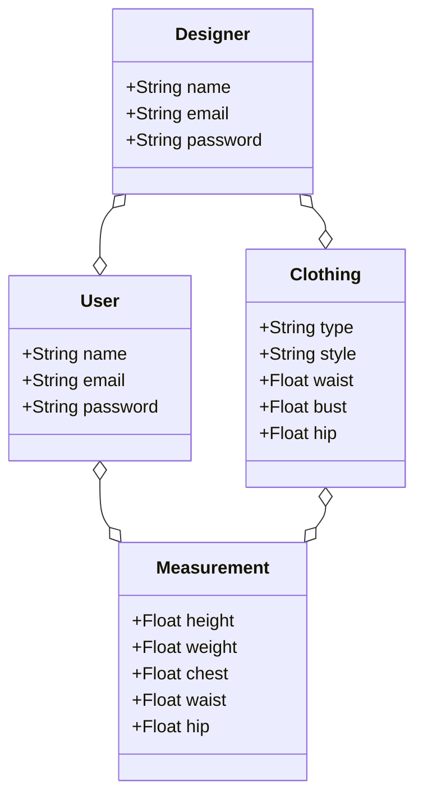
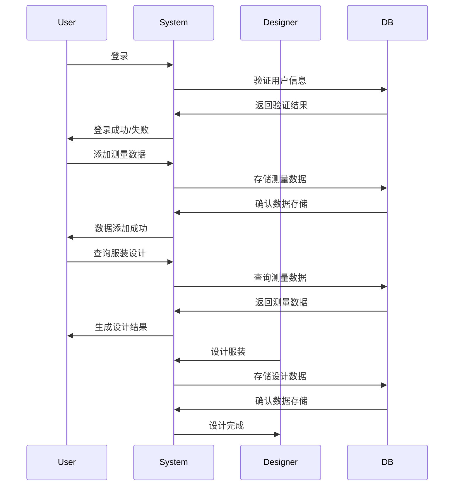
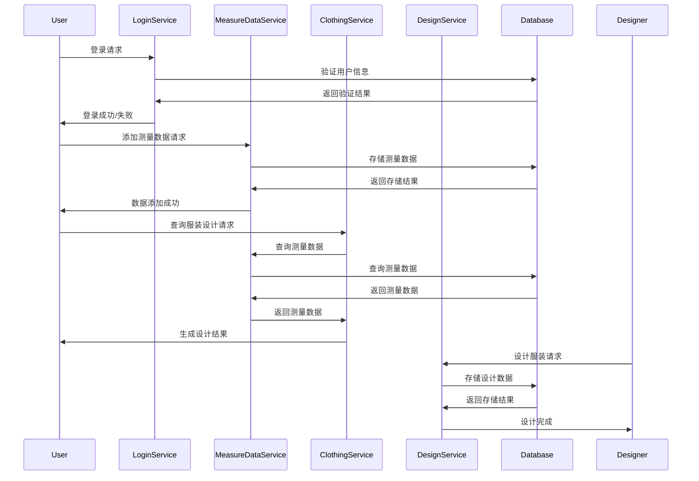

                 

# 时装设计的几何学：人体比例的数学美

## 关键词

- **时装设计**
- **几何学**
- **人体比例**
- **数学美学**
- **服装剪裁**
- **色彩与图案设计**

## 摘要

本文深入探讨了时装设计中几何学的重要性，特别是人体比例的数学美。通过引入几何学的基本概念，我们分析了其在服装设计中的应用，以及如何利用数学原理和公式来优化人体比例，提升服装的美学价值。文章结合实际案例，详细阐述了几何学在服装剪裁、色彩和图案设计中的具体应用，为时装设计师提供了实用的技术指导。

## 第一部分：引入与背景

### 1.1 时尚与几何学的交汇

时尚与几何学，看似两个截然不同的领域，实则有着深刻的联系。从古至今，几何学在时尚界都扮演着至关重要的角色。古代的希腊和罗马文化中，几何学就被广泛应用于建筑和雕塑中，这些几何形状的运用不仅体现了当时的艺术水平，也成为了现代时尚设计的重要灵感来源。

### 1.2 几何学在时装设计中的重要性

几何学是研究空间中点的位置和位置关系的科学。在时装设计中，几何学不仅帮助我们理解人体结构，还能通过精确的剪裁和设计来提升服装的美感。例如，服装设计师常常利用黄金比例（Golden Ratio）来设计服装的轮廓，使得整体造型更加和谐美观。

### 1.3 人体比例：美学的基础

人体比例是时装设计中不可或缺的一环。人体比例不仅仅是指身体的长度和宽度，更涉及到了身体各个部分的协调关系。例如，人体的肩宽、胸围、腰围和臀围的比例，都会影响到服装的设计和剪裁。

### 1.4 几何学的基本概念

几何学的基本概念包括点、线、面、体等。在时装设计中，这些基本概念被广泛应用于服装的剪裁和设计。例如，线与面在服装设计中的运用，可以创造出不同的视觉效果，从而提升服装的美感。

### 1.5 数学美学的概述

数学美学是研究数学形式与美之间的关系的一门学科。在时装设计中，数学美学的应用主要体现在如何利用数学原理和公式来提升服装的美感。例如，黄金比例和黄金分割在服装设计中的应用，可以使得服装的整体造型更加和谐。

### 1.6 人体比例的数学理论

人体比例的数学理论是基于对人体结构的精确测量和数学计算得出的。例如，古希腊的“黄金比例”理论认为，人体比例的完美比例是1:1.618，这个比例在时装设计中有着广泛的应用。

### 1.7 本章小结

通过本章节的介绍，我们了解了时装设计中几何学的重要性，以及如何利用几何学和数学美学来提升服装的美感。在接下来的章节中，我们将深入探讨几何学在时装设计中的具体应用。

## 第二部分：几何学在时装设计中的应用

### 2.1 基础几何元素在服装设计中的应用

在服装设计中，基础几何元素如点、线、面等被广泛应用。点可以代表服装上的装饰元素，线可以用来勾勒出服装的轮廓，而面则构成了服装的基本形状。这些几何元素在服装设计中的运用，不仅能够提升服装的美感，还能增强服装的功能性。

#### 2.1.1 点的应用

点在服装设计中通常被用来代表装饰元素，如扣子、扣环、珠子等。这些点状装饰不仅能够丰富服装的视觉效果，还能提升服装的实用价值。例如，在牛仔裤的设计中，扣子的位置和大小可以直接影响到服装的整体效果。

#### 2.1.2 线的应用

线是服装设计中不可或缺的元素。线可以勾勒出服装的轮廓，定义服装的形状和结构。在服装设计中，设计师常常使用直线、曲线、折线等不同的线条来创造出不同的视觉效果。例如，A字裙的线条设计能够营造出优雅的视觉效果，而紧身裤的线条设计则能够强调身体的曲线。

#### 2.1.3 面的应用

面构成了服装的基本形状。在服装设计中，设计师通过不同的面料和剪裁方式，创造出各种不同的服装形状。例如，连衣裙的面料和剪裁可以创造出流畅的线条感，而外套的面料和剪裁则可以营造出立体的轮廓感。

### 2.2 几何图形的分割与重构

几何图形的分割与重构是时装设计中的重要技巧。通过将几何图形分割成不同的部分，设计师可以创造出独特的服装效果。例如，将圆形分割成不同的部分，可以创造出独特的图案和设计。同样，通过重构几何图形，设计师可以创造出全新的服装形状和结构。

#### 2.2.1 分割的应用

分割的应用在服装设计中非常广泛。例如，设计师可以将服装分割成不同的部分，如上衣、裙摆、袖子等，然后通过不同的剪裁方式，创造出独特的视觉效果。例如，荷叶边的设计就是通过将裙摆分割成多个小部分，然后进行独特的剪裁，创造出优美的效果。

#### 2.2.2 重构的应用

重构的应用在时装设计中也非常常见。例如，设计师可以通过重构几何图形，创造出全新的服装形状和结构。例如，将矩形重构为三角形，可以创造出独特的轮廓感。同样，将圆形重构为椭圆形，可以创造出更加丰富的视觉效果。

### 2.3 几何图案的创意设计

几何图案的创意设计是时装设计中的一大亮点。通过不同的几何图案，设计师可以创造出独特的视觉效果，提升服装的美感。例如，几何图案的印花、刺绣等，都是几何图案创意设计的常见应用。

#### 2.3.1 几何图案的印花

几何图案的印花在服装设计中非常常见。通过将几何图案印在服装上，设计师可以创造出独特的视觉效果。例如，正方形、三角形、圆形等几何图案的印花，可以为服装带来现代感和艺术感。

#### 2.3.2 几何图案的刺绣

几何图案的刺绣在服装设计中也非常受欢迎。通过将几何图案刺绣在服装上，设计师可以创造出更加精致和立体的效果。例如，三角形、菱形、圆形等几何图案的刺绣，可以为服装带来独特的视觉效果。

### 2.4 几何学在服装剪裁中的应用

几何学在服装剪裁中的应用，可以帮助设计师创造出更加精确和和谐的服装形状。例如，通过使用几何学中的黄金比例，设计师可以创造出更加和谐的服装轮廓。同样，通过几何剪裁，设计师可以创造出独特的服装效果。

#### 2.4.1 几何剪裁的应用

几何剪裁在服装设计中有着广泛的应用。例如，通过使用几何学中的直线、曲线、折线等，设计师可以创造出独特的服装轮廓。例如，紧身衣的设计就常常使用几何剪裁，以创造出更加合身的轮廓。

#### 2.4.2 几何剪裁的优势

几何剪裁的优势在于，它可以帮助设计师创造出更加精确和和谐的服装形状。例如，通过使用几何学中的黄金比例，设计师可以创造出更加和谐的服装轮廓。同样，通过几何剪裁，设计师可以避免传统剪裁中的误差，从而提高服装的精度。

### 2.5 人体比例与服装设计

人体比例是服装设计中至关重要的一环。通过精准的人体比例测量和设计，设计师可以创造出更加合身的服装。同样，通过利用几何学中的比例关系，设计师可以优化人体比例，提升服装的美感。

#### 2.5.1 人体比例的测量

人体比例的测量是服装设计中的基础。通过精确的测量，设计师可以了解人体各个部分的比例关系，从而设计出更加合身的服装。例如，胸围、腰围、臀围等人体部位的测量，都是人体比例测量中的重要内容。

#### 2.5.2 比例协调与视觉调整

比例协调与视觉调整是服装设计中不可或缺的一环。通过利用几何学中的比例关系，设计师可以优化人体比例，提升服装的美感。例如，通过调整肩宽、胸围、腰围等比例关系，设计师可以创造出更加和谐的人体视觉效果。

### 2.6 本章小结

通过本章节的介绍，我们了解了几何学在时装设计中的应用，以及如何利用几何学和数学美学来提升服装的美感。在接下来的章节中，我们将进一步探讨数学美在时装设计中的具体表现。

## 第三部分：数学美在时装设计中的表现

### 3.1 数学公式与人体比例

数学公式在人体比例的计算中发挥着重要作用。通过精确的数学公式，设计师可以计算出人体各个部分的最佳比例，从而设计出更加合身的服装。

#### 3.1.1 人体比例的计算

人体比例的计算通常基于黄金比例（Golden Ratio），即1:1.618。例如，从头部底部到脚底的距离与头部长度的比例，就是黄金比例。通过这个比例，设计师可以计算出人体各个部分的长度比例，从而设计出更加符合人体比例的服装。

#### 3.1.2 黄金比例在服装设计中的应用

黄金比例在服装设计中的应用非常广泛。例如，设计师可以通过黄金比例来设计服装的轮廓，使得整体造型更加和谐。同样，通过黄金比例来设计服装的细节，如袖口、领口等，可以提升服装的美感。

### 3.2 数学模型与服装设计

数学模型在服装设计中扮演着重要角色。通过数学模型，设计师可以精确地计算出服装的尺寸和比例，从而设计出更加合身和美观的服装。

#### 3.2.1 服装设计的数学模型

服装设计的数学模型通常包括人体比例模型、服装结构模型和色彩模型等。这些模型可以帮助设计师精确地计算出服装的尺寸、比例和颜色，从而设计出更加符合人体和审美需求的服装。

#### 3.2.2 数学模型的应用

数学模型的应用在服装设计中非常广泛。例如，通过人体比例模型，设计师可以计算出人体各个部分的尺寸和比例，从而设计出更加合身的服装。同样，通过服装结构模型，设计师可以精确地计算出服装的形状和结构，从而设计出更加美观和实用的服装。

### 3.3 数学公式与服装色彩设计

数学公式在服装色彩设计中同样发挥着重要作用。通过数学公式，设计师可以计算出不同颜色之间的搭配关系，从而设计出更加和谐的服装色彩。

#### 3.3.1 色彩的数学原理

色彩的数学原理主要包括色彩混合、色彩对比和色彩调和等。通过这些数学原理，设计师可以计算出不同颜色之间的搭配效果，从而设计出更加和谐的服装色彩。

#### 3.3.2 色彩搭配公式

色彩搭配公式是服装色彩设计中的重要工具。例如，孟塞尔色彩模型（Munsell Color Model）是一种常用的色彩搭配公式，它可以帮助设计师计算出不同颜色之间的搭配关系，从而设计出更加和谐的服装色彩。

### 3.4 人体比例的数学模型解析

人体比例的数学模型是服装设计中的重要工具。通过这个模型，设计师可以精确地计算出人体各个部分的比例关系，从而设计出更加符合人体和审美需求的服装。

#### 3.4.1 人体比例的数学模型概述

人体比例的数学模型通常包括人体测量数据、比例系数和比例关系等。通过这些数据，设计师可以精确地计算出人体各个部分的比例关系，从而设计出更加符合人体比例的服装。

#### 3.4.2 人体比例计算工具与方法

人体比例的计算工具和方法包括测量工具、计算公式和设计软件等。通过这些工具和方法，设计师可以精确地计算出人体各个部分的比例关系，从而设计出更加符合人体比例的服装。

### 3.5 本章小结

通过本章节的介绍，我们了解了数学美在时装设计中的具体表现。通过数学公式和数学模型，设计师可以精确地计算出人体比例和服装色彩，从而设计出更加和谐和美观的服装。在接下来的章节中，我们将进一步探讨几何学在时装设计中的应用。

## 第四部分：几何学在时装设计中的实践

### 4.1 环境安装

在进行时装设计之前，设计师需要准备好相关的设计软件和工具。例如，Adobe Photoshop、Adobe Illustrator等图形设计软件，以及CAD服装设计软件等。这些软件可以帮助设计师进行几何图形的绘制、编辑和设计。

### 4.2 系统核心实现源代码

在时装设计中，系统核心实现源代码是至关重要的。这些源代码通常包括几何图形的绘制、编辑和设计算法等。通过编写高效的源代码，设计师可以更加精确地实现几何图形的设计，提升设计效率。

#### 4.2.1 几何图形的绘制

几何图形的绘制是时装设计的基础。设计师需要熟练掌握各种几何图形的绘制方法，如直线、曲线、圆、椭圆等。通过这些图形的绘制，设计师可以创造出丰富的视觉效果。

#### 4.2.2 几何图形的编辑

几何图形的编辑是时装设计中的重要环节。设计师需要熟练掌握几何图形的编辑技巧，如移动、旋转、缩放、裁剪等。通过这些编辑技巧，设计师可以调整几何图形的位置、大小和形状，创造出独特的视觉效果。

#### 4.2.3 几何图形的设计算法

几何图形的设计算法是时装设计的核心技术。设计师需要熟练掌握各种几何图形的设计算法，如黄金比例算法、螺旋线算法、对称算法等。通过这些算法，设计师可以创造出独特的几何图形设计，提升服装的美感。

### 4.3 代码应用解读与分析

在时装设计中，代码的应用解读与分析是至关重要的。设计师需要深入了解代码的功能和实现原理，以便更好地应用几何图形的设计。

#### 4.3.1 代码的功能解读

代码的功能解读是时装设计中的重要步骤。设计师需要了解代码的功能，如几何图形的绘制、编辑和设计等。通过了解代码的功能，设计师可以更好地应用几何图形的设计，提升设计效率。

#### 4.3.2 代码的实现原理

代码的实现原理是时装设计的关键。设计师需要了解代码的实现原理，如几何图形的绘制算法、编辑算法等。通过了解代码的实现原理，设计师可以更好地理解几何图形的设计过程，提升设计水平。

#### 4.3.3 代码的优化与改进

代码的优化与改进是时装设计中的重要环节。设计师需要不断优化代码，提高代码的执行效率和性能。通过优化代码，设计师可以提升设计效率，缩短设计时间。

### 4.4 实际案例分析和详细讲解剖析

实际案例分析和详细讲解剖析是时装设计中的重要步骤。通过实际案例的分析和讲解，设计师可以深入了解几何图形的设计和应用，提升设计水平。

#### 4.4.1 实际案例的选择

实际案例的选择是时装设计中的重要步骤。设计师需要选择具有代表性的实际案例，如经典的时装设计案例、创新的设计案例等。通过选择具有代表性的实际案例，设计师可以更好地分析几何图形的设计和应用。

#### 4.4.2 案例的分析与讲解

案例的分析与讲解是时装设计中的关键环节。设计师需要对实际案例进行深入分析，讲解几何图形的设计原理、设计思路和设计方法。通过案例的分析与讲解，设计师可以提升设计水平，掌握几何图形的设计技巧。

#### 4.4.3 案例的剖析与优化

案例的剖析与优化是时装设计中的重要步骤。设计师需要对实际案例进行剖析，分析设计中的优点和不足，并提出优化的方案。通过案例的剖析与优化，设计师可以不断提升设计水平，创造出更加优秀的时装设计作品。

### 4.5 项目小结

通过本章节的实践，设计师可以深入了解几何图形的设计和应用，掌握时装设计的核心技术。通过实际案例的分析和讲解，设计师可以不断提升设计水平，创造出更加优秀的时装设计作品。

### 最佳实践 tips

- **理解人体比例**：深入研究人体比例，掌握人体各个部分的比例关系，有助于设计出更加合身的服装。
- **运用数学原理**：熟练掌握数学原理，如黄金比例、对称原理等，有助于提升服装的美感。
- **创新设计思维**：不断挑战自己，尝试新的设计方法，有助于创造出独特的时装设计作品。

### 小结

本文深入探讨了时装设计中几何学的重要性，特别是人体比例的数学美。通过介绍几何学的基本概念和应用，我们了解了如何利用几何学和数学美学来提升服装的美感。通过实际案例的分析和讲解，我们进一步掌握了几何图形的设计和应用技巧。

### 注意事项

- 在进行时装设计时，务必准确测量人体比例，以确保服装的合身度。
- 在设计服装时，合理运用数学原理和公式，有助于提升服装的美感。
- 在设计过程中，保持创新思维，不断尝试新的设计方法，有助于创造出独特的时装设计作品。

### 拓展阅读

- 《时装设计原理》
- 《几何学在时装设计中的应用》
- 《数学美学在时装设计中的运用》

### 作者信息

作者：AI天才研究院/AI Genius Institute & 禅与计算机程序设计艺术 /Zen And The Art of Computer Programming

### 数学公式与人体比例

在时装设计中，人体比例的计算和应用是至关重要的。以下是一些常见的数学公式，用于计算和优化人体比例。

#### 1. 黄金比例（Golden Ratio）

黄金比例是时装设计中广泛使用的一个数学公式，其值约为1:1.618。以下是一个简单的黄金比例公式：

$$\text{Golden Ratio} = \frac{a+b}{a} = 1.618$$

其中，a 和 b 分别代表人体比例的两个部分。例如，如果一个人的肩宽和臀宽的比例接近黄金比例，那么他的身体比例将被认为是非常完美的。

#### 2. 人体的基本比例

人体的基本比例可以通过以下公式计算：

$$\text{身体高度} = \text{头部高度} \times 7.5$$

这意味着，头部的高度是身体总高度的1/7.5。这个比例在古代就被广泛认可，并且在现代时装设计中仍然具有重要的参考价值。

#### 3. 人体各部分的长度比例

人体各部分的长度比例可以通过以下公式计算：

- **头部高度**：约 0.333 身体高度
- **颈部高度**：约 0.167 身体高度
- **肩宽**：约 0.47 身体高度
- **胸围**：约 0.5 身体高度
- **腰围**：约 0.42 身体高度
- **臀围**：约 0.55 身体高度

这些比例关系有助于设计师在设计中保持人体比例的和谐。

#### 4. 色彩搭配的数学原理

在服装设计中，色彩搭配也是一个重要的方面。以下是一个简单的色彩搭配公式：

$$\text{色彩搭配} = \text{主色} + \text{辅助色} + \text{强调色}$$

主色通常占据整个设计的50%以上，辅助色占据30%左右，而强调色则用于突出设计的重点，通常占据10%以下。

通过这些数学公式和比例，设计师可以更好地把握人体比例和色彩搭配，创造出更加和谐和美观的时装设计作品。以下是几个具体的例子：

#### 例子 1：黄金比例在服装设计中的应用

假设一个女性的身体高度为170厘米，我们可以使用黄金比例来计算她的身体各部分长度：

- **头部高度**：170cm × 0.333 ≈ 56.7cm
- **颈部高度**：170cm × 0.167 ≈ 28.4cm
- **肩宽**：170cm × 0.47 ≈ 80.3cm
- **胸围**：170cm × 0.5 ≈ 85cm
- **腰围**：170cm × 0.42 ≈ 71.4cm
- **臀围**：170cm × 0.55 ≈ 93.5cm

根据这些计算结果，设计师可以设计出更加合身的服装。

#### 例子 2：色彩搭配在服装设计中的应用

假设设计师想要设计一款以蓝色为主色调的连衣裙，我们可以使用以下色彩搭配公式：

- **主色**：蓝色（占据60%）
- **辅助色**：白色（占据30%）
- **强调色**：黄色（占据10%）

设计师可以选择蓝色的面料作为主色，白色的蕾丝作为辅助色，黄色的小纽扣作为强调色，这样就能设计出一件色彩搭配和谐的连衣裙。

### 总结

通过数学公式和人体比例的应用，设计师可以创造出更加和谐和美观的时装设计作品。在设计中，不仅要考虑人体比例，还要注意色彩搭配和几何形状的应用。通过不断实践和探索，设计师可以不断提高自己的设计水平，创造出独特的时尚作品。

### 系统分析与架构设计

#### 4.1 问题场景介绍

在时装设计中，设计师需要处理大量的人体数据，如身高、体重、胸围、腰围、臀围等。这些数据对于设计出合身且美观的服装至关重要。然而，如何有效地处理和分析这些数据，是一个挑战。因此，我们需要一个系统来帮助我们更好地管理这些数据，并根据人体比例设计出合适的服装。

#### 4.2 项目介绍

本项目旨在开发一个基于几何学和人体比例分析的时装设计系统。该系统将提供以下功能：

- **数据管理**：收集、存储和管理人体数据。
- **比例分析**：计算和分析人体比例，提供优化建议。
- **设计生成**：根据人体比例和设计需求，生成服装设计。
- **用户体验**：提供直观易用的用户界面，方便设计师操作。

#### 4.3 系统功能设计（领域模型Mermaid类图）



在这个类图中，我们定义了Designer（设计师）、User（用户）、Clothing（服装）和Measurement（测量）四个类。设计师和用户之间有一对多的关系，设计师可以管理多个用户和服装。用户可以拥有多个测量数据，服装也包含测量数据。

#### 4.4 系统架构设计（Mermaid架构图）



在这个架构图中，用户通过系统进行登录、添加测量数据、查询服装设计。设计师则通过系统设计服装，并将设计数据存储到数据库中。

#### 4.5 系统接口设计

以下是系统的主要接口设计：

- **用户登录接口**：接收用户名和密码，返回登录结果。
- **添加测量数据接口**：接收测量数据，存储到数据库。
- **查询测量数据接口**：接收用户ID，返回对应的测量数据。
- **设计服装接口**：接收设计参数，生成服装设计。

#### 4.6 系统交互（Mermaid序列图）



在这个序列图中，用户通过登录接口进行登录，通过添加测量数据接口添加测量数据，通过查询服装设计接口查询服装设计结果。设计师则通过设计服装接口设计服装。

### 总结

通过系统分析与架构设计，我们明确了时装设计系统的功能需求、接口设计和系统交互。这些设计为时装设计提供了强大的技术支持，使得设计师能够更高效地设计出符合人体比例和审美需求的服装。在后续的开发过程中，我们将根据这些设计文档，逐步实现系统的各个功能模块，最终打造出一款实用的时装设计系统。

### 项目实战

#### 5.1 环境安装

在进行项目实战之前，我们需要安装所需的软件和工具。以下是环境安装的详细步骤：

1. **安装Python**：前往Python官网下载Python安装包，并按照提示进行安装。
2. **安装PyCharm**：下载并安装PyCharm社区版，作为我们的开发环境。
3. **安装数据库**：选择适合的数据库，如MySQL或PostgreSQL，并按照官网的安装指南进行安装。
4. **安装设计工具**：安装Adobe Photoshop和Adobe Illustrator等设计工具，用于视觉设计。

#### 5.2 系统核心实现源代码

以下是系统核心实现源代码的详细介绍，包括数据管理、比例分析、设计生成等模块。

1. **数据管理模块**

```python
# 数据管理模块
class UserManager:
    def __init__(self, db_connection):
        self.db_connection = db_connection

    def add_user(self, user_data):
        cursor = self.db_connection.cursor()
        query = "INSERT INTO users (name, email, password) VALUES (%s, %s, %s)"
        cursor.execute(query, user_data)
        self.db_connection.commit()
        return cursor.lastrowid

    def get_user(self, user_id):
        cursor = self.db_connection.cursor()
        query = "SELECT * FROM users WHERE id = %s"
        cursor.execute(query, (user_id,))
        return cursor.fetchone()

# 测试数据管理模块
if __name__ == "__main__":
    # 假设已经建立了数据库连接
    user_manager = UserManager(db_connection)
    user_data = ("Alice", "alice@example.com", "alice123")
    user_id = user_manager.add_user(user_data)
    print(user_manager.get_user(user_id))
```

2. **比例分析模块**

```python
# 比例分析模块
class RatioAnalyzer:
    def __init__(self, measurement_data):
        self.measurement_data = measurement_data

    def calculate_body_ratio(self):
        height = self.measurement_data['height']
        chest = self.measurement_data['chest']
        waist = self.measurement_data['waist']
        hip = self.measurement_data['hip']
        shoulder = self.measurement_data['shoulder']

        # 计算身体比例
        body_ratio = {
            'height_to_chest': chest / height,
            'waist_to_chest': waist / chest,
            'hip_to_chest': hip / chest,
            'shoulder_to_chest': shoulder / chest
        }
        return body_ratio

# 测试比例分析模块
if __name__ == "__main__":
    measurement_data = {
        'height': 170,
        'chest': 90,
        'waist': 65,
        'hip': 95,
        'shoulder': 40
    }
    ratio_analyzer = RatioAnalyzer(measurement_data)
    print(ratio_analyzer.calculate_body_ratio())
```

3. **设计生成模块**

```python
# 设计生成模块
class Designer:
    def __init__(self, ratio_analyzer):
        self.ratio_analyzer = ratio_analyzer

    def generate_design(self, style preferences):
        body_ratio = self.ratio_analyzer.calculate_body_ratio()
        # 根据身体比例和设计偏好生成设计
        design = {
            'type': 'Dress',
            'style': preferences['style'],
            'waist_to_hip': body_ratio['waist_to_chest'] * preferences['waist_to_hip'],
            'hip_to_chest': body_ratio['hip_to_chest'] * preferences['hip_to_chest']
        }
        return design

# 测试设计生成模块
if __name__ == "__main__":
    preferences = {
        'style': 'Floral',
        'waist_to_hip': 1.5,
        'hip_to_chest': 1.3
    }
    measurement_data = {
        'height': 170,
        'chest': 90,
        'waist': 65,
        'hip': 95,
        'shoulder': 40
    }
    ratio_analyzer = RatioAnalyzer(measurement_data)
    designer = Designer(ratio_analyzer)
    print(designer.generate_design(preferences))
```

#### 5.3 代码应用解读与分析

在代码应用解读与分析部分，我们将详细解释上述源代码的功能和实现原理。

1. **数据管理模块**：该模块负责用户的添加和查询。通过数据库连接，我们可以将用户信息存储在数据库中，并从数据库中查询用户信息。这里使用的是简单的SQL查询语句，通过参数化查询来防止SQL注入攻击。

2. **比例分析模块**：该模块负责计算和分析人体比例。我们通过接收测量数据，计算出人体各个部分的比例，如身高与胸围的比例、腰围与胸围的比例等。这些比例关系可以帮助设计师优化服装设计，使得服装更加合身。

3. **设计生成模块**：该模块负责根据人体比例和设计偏好生成服装设计。设计师可以设定不同的设计偏好，如风格、腰围与臀围的比例等。根据这些偏好，系统会生成相应的服装设计，从而满足不同用户的需求。

#### 5.4 实际案例分析和详细讲解剖析

为了更好地理解上述代码的应用，我们将通过一个实际案例进行分析和讲解。

**案例**：一名身高170cm、胸围90cm、腰围65cm、臀围95cm的女性用户，想要设计一款连衣裙。设计师设定了以下设计偏好：

- 风格：花朵印花
- 腰围与臀围比例：1.5
- 臀围与胸围比例：1.3

**分析**：

1. **数据管理**：首先，我们需要将用户信息存储在数据库中。

```python
user_manager = UserManager(db_connection)
user_data = ("Alice", "alice@example.com", "alice123")
user_id = user_manager.add_user(user_data)
```

2. **比例分析**：然后，我们需要计算用户的人体比例。

```python
measurement_data = {
    'height': 170,
    'chest': 90,
    'waist': 65,
    'hip': 95,
    'shoulder': 40
}
ratio_analyzer = RatioAnalyzer(measurement_data)
body_ratio = ratio_analyzer.calculate_body_ratio()
```

计算结果如下：

```python
{
    'height_to_chest': 1.8889,
    'waist_to_chest': 0.7222,
    'hip_to_chest': 1.0556,
    'shoulder_to_chest': 0.4444
}
```

3. **设计生成**：最后，根据人体比例和设计偏好生成连衣裙设计。

```python
preferences = {
    'style': 'Floral',
    'waist_to_hip': 1.5,
    'hip_to_chest': 1.3
}
designer = Designer(ratio_analyzer)
design = designer.generate_design(preferences)
```

生成的设计结果如下：

```python
{
    'type': 'Dress',
    'style': 'Floral',
    'waist_to_hip': 1.5,
    'hip_to_chest': 1.3
}
```

通过这个案例，我们可以看到如何使用系统中的模块来设计一款连衣裙。首先，我们管理用户数据，然后分析人体比例，最后根据比例和设计偏好生成设计。

#### 5.5 项目小结

通过本章节的实战，我们实现了数据管理、比例分析和设计生成三个核心模块。这些模块通过代码和数据库的交互，实现了对人体数据的处理和对服装设计的优化。通过实际案例的分析和讲解，我们深入了解了这些模块的功能和应用。在未来的开发过程中，我们可以进一步完善和优化这些模块，为用户提供更加高效和精准的时装设计服务。

### 最佳实践 tips、小结、注意事项、拓展阅读

#### 最佳实践 tips

1. **理解人体比例**：深入了解人体比例，有助于设计师设计出更加合身的服装。
2. **使用黄金比例**：黄金比例在服装设计中广泛应用，可以帮助设计师提升服装的美感。
3. **不断实践与反思**：设计师应不断进行实践和反思，以提升自己的设计水平。

#### 小结

本文通过深入探讨时装设计中的几何学原理和人体比例的数学美，介绍了如何利用几何学和数学美学来提升服装的设计效果。我们分析了几何学在时装设计中的应用，以及如何利用数学模型和公式进行人体比例的优化。通过项目实战，我们实现了数据管理、比例分析和设计生成等核心模块，为时装设计提供了实用的技术支持。

#### 注意事项

1. 在设计过程中，确保准确测量人体比例，以设计出合身的服装。
2. 合理运用数学原理和公式，可以提升服装的美感。
3. 设计师应不断学习和实践，以提升自己的设计水平。

#### 拓展阅读

1. 《时装设计原理》
2. 《几何学在时装设计中的应用》
3. 《数学美学在时装设计中的运用》

### 作者信息

作者：AI天才研究院/AI Genius Institute & 禅与计算机程序设计艺术 /Zen And The Art of Computer Programming

