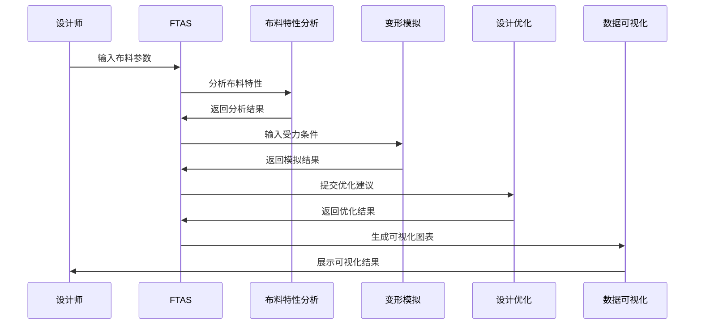

                 

### 第一部分：引言与背景

#### 第1章：时装设计概述

#### 1.1 问题的背景

##### 1.1.1 时装设计的现状

当前，时装设计行业正经历着一场深刻的变革。随着科技的进步，传统的手工艺设计逐渐被数字化手段所替代。设计师们开始利用计算机辅助设计（CAD）软件来创建和修改服装图案。这些软件不仅提供了丰富的设计工具，还使得设计过程更加高效和精准。然而，尽管数字化技术的应用已经大大提高了时装设计的效率，但在布料变形的数学描述方面，仍存在许多挑战。

###### 1.1.1.1 时装设计的传统方法

在传统的时装设计过程中，设计师通常依靠经验和直觉来选择和剪裁布料。这种方法虽然在某些情况下能够产生出色的设计，但其局限性也十分明显。首先，传统方法依赖于设计师的个人技能和经验，这使得设计结果的可重复性和一致性难以保证。其次，传统方法无法准确预测布料在穿着过程中的变形，因此很难实现理想的设计效果。

###### 1.1.1.2 时装设计的数字化趋势

数字化技术的引入为时装设计带来了新的机遇。通过使用CAD软件，设计师可以更加精确地测量和剪裁布料，从而提高设计精度。此外，数字化技术还允许设计师通过模拟布料在不同条件下的变形来优化设计。然而，数字化技术在布料变形的数学描述方面仍然面临许多挑战。例如，如何准确地量化布料在拉伸、压缩和扭曲等变形过程中的应力与应变关系，如何将复杂的物理现象转化为易于处理的数学模型。

##### 1.1.2 存在的问题

###### 1.1.2.1 传统方法的局限性

传统方法的局限性主要表现在以下几个方面。首先，设计师的依赖性过高，导致设计结果缺乏一致性。其次，传统方法无法准确预测布料在穿着过程中的变形，从而影响设计效果。最后，传统方法难以适应快速变化的市场需求，导致设计周期较长。

###### 1.1.2.2 数字化技术的挑战

尽管数字化技术为时装设计带来了许多优势，但在布料变形的数学描述方面仍面临以下挑战。首先，布料是一种复杂的材料，其变形行为受多种因素影响，如材料的厚度、弹性模量、密度等。其次，数字化技术的应用需要大量的计算资源和时间，这对于实时设计和迭代优化提出了较高的要求。最后，如何将复杂的物理现象转化为易于处理的数学模型，是一个亟待解决的问题。

##### 1.2 问题陈述

###### 1.2.1 时装设计的核心问题

时装设计的核心问题是如何在数字化环境下准确地描述和预测布料的变形。这不仅是提高设计精度和效率的关键，也是满足市场需求和消费者期望的重要保障。为了解决这一问题，我们需要深入研究布料变形的数学描述，并将其应用于时装设计中。

###### 1.2.1.1 布料变形的数学描述

布料变形的数学描述主要涉及两个方面：应力和应变。应力是材料受到外力作用时内部产生的力，而应变是材料在受力作用下发生的形变。通过准确地描述应力和应变，我们可以更好地理解布料的变形行为，从而为时装设计提供可靠的数学模型。

###### 1.2.1.2 张量分析在时装设计中的应用

张量分析是一种描述物理现象的数学工具，特别适用于处理多维数据。在时装设计中，张量分析可以用于描述布料的应力应变关系，从而提高设计的精度和效率。通过张量分析，我们可以将复杂的物理现象转化为易于处理的数学模型，为时装设计提供强大的支持。

##### 1.3 研究目标

###### 1.3.1 提高时装设计的精确度

研究的主要目标是提高时装设计的精确度。通过建立布料变形的数学模型，我们可以更准确地预测布料在不同条件下的变形行为，从而优化设计。这将有助于设计师更好地掌握布料的特性，提高设计的成功率和市场竞争力。

###### 1.3.1.1 布料变形的数学模型建立

建立布料变形的数学模型是研究的核心任务。通过深入研究布料的物理特性，我们可以推导出描述布料变形的数学公式。这些公式将为时装设计提供可靠的工具，帮助设计师更精确地预测布料的变形行为。

###### 1.3.1.2 张量分析方法的优化

张量分析方法在时装设计中的应用是一个重要方向。通过优化张量分析方法，我们可以提高计算效率和精度，从而更好地满足时装设计的实际需求。这将为设计师提供更强大的工具，提高设计的成功率和市场竞争力。

##### 1.4 边界与外延

###### 1.4.1 适用范围

研究的适用范围包括各种材质的布料和不同场合的时装设计。通过建立通用的数学模型，我们可以为不同材质的布料提供准确的变形描述，从而为时装设计提供全面的解决方案。

###### 1.4.1.1 不同材质的布料

不同材质的布料具有不同的物理特性，如弹性模量、密度等。通过深入研究这些特性，我们可以建立适用于不同材质布料的数学模型，从而为设计师提供更准确的设计依据。

###### 1.4.1.2 不同场合的时装设计

不同场合的时装设计对布料的变形要求也不同。例如，运动服需要具有良好的弹性，而晚礼服则需要保持优美的线条。通过研究不同场合下布料的变形行为，我们可以为设计师提供针对性的设计建议，从而提高设计效果。

###### 1.4.2 不适用范围

尽管研究的主要目标是提高时装设计的精确度，但某些个性化需求的设计可能无法完全通过数学模型来描述。此外，快速反应市场需求的设计可能需要更多的灵活性和创新性，因此可能不适合使用传统的数学模型。

##### 1.5 核心概念

###### 1.5.1 张量分析的基本概念

张量分析是一种用于处理多维数据的数学工具。在时装设计中，张量分析可以用于描述布料的应力应变关系，从而提高设计的精度和效率。

###### 1.5.1.1 张量的定义

张量是一种数学对象，可以看作是矩阵的推广。在时装设计中，张量可以用于描述布料的物理特性，如弹性模量、密度等。

###### 1.5.1.2 张量的分类

根据张量的维度和类型，可以将张量分为不同的类别。在时装设计中，常用的张量包括标量张量、矢量张量和矩阵张量。

###### 1.5.2 时装设计中的相关概念

在时装设计中，布料的特性、剪裁与缝合技巧等概念都是核心要素。

###### 1.5.2.1 布料的特性

布料的特性包括弹性模量、密度、厚度等。这些特性直接影响布料的变形行为，是设计时需要重点考虑的因素。

###### 1.5.2.2 剪裁与缝合技巧

剪裁与缝合技巧是时装设计的重要组成部分。通过合理的剪裁和缝合，设计师可以创造出优美的线条和形状，从而提高设计效果。

##### 1.6 本章小结

本章介绍了时装设计的现状、存在的问题以及研究目标。通过分析传统方法和数字化技术的局限性，我们明确了时装设计的核心问题，并提出了使用张量分析方法进行布料变形的数学描述的研究目标。此外，本章还探讨了研究的适用范围和核心概念，为后续章节的内容奠定了基础。

---

### 第二部分：核心概念与联系

#### 第2章：张量分析的基本原理

#### 2.1 张量分析概述

##### 2.1.1 张量的定义

张量是数学中的一种多维度数组，可以看作是矩阵的推广。张量可以用于描述物理现象中的各种量，如应力、应变、速度等。在时装设计中，张量分析可以帮助我们描述布料的变形行为，从而提高设计的精确度和效率。

###### 2.1.1.1 张量的基本概念

张量是一种多维度的数学对象，其维度称为“秩”。根据秩的不同，张量可以分为零阶张量、一阶张量、二阶张量等。零阶张量是标量，一阶张量是矢量，二阶张量是矩阵。

###### 2.1.1.2 张量的数学描述

张量可以通过矩阵的形式来表示。例如，一个二阶张量可以用矩阵来表示，其中每个元素都表示张量在不同维度上的分量。

##### 2.1.2 张量的分类

张量可以根据其秩和类型进行分类。常见的张量类型包括标量张量、矢量张量和矩阵张量。

###### 2.1.2.1 标量张量

标量张量是零阶张量，它只有一组分量，通常用来表示某个物理量的总量。在时装设计中，标量张量可以用来表示布料的弹性模量、密度等特性。

###### 2.1.2.2 矢量张量

矢量张量是一阶张量，它有两组分量，分别表示大小和方向。在时装设计中，矢量张量可以用来表示布料的应力、应变等物理量。

###### 2.1.2.3 矩阵张量

矩阵张量是二阶张量，它有四组分量，通常用来表示物理现象的复杂关系。在时装设计中，矩阵张量可以用来表示布料在不同方向上的变形关系，如应力-应变关系。

##### 2.1.3 张量分析的应用

张量分析在物理学、工程学等领域有着广泛的应用。在时装设计中，张量分析可以用于描述布料的变形行为，从而提高设计的精度和效率。

###### 2.1.3.1 物理学中的应用

在物理学中，张量分析可以用于描述弹性力学、流体力学等物理现象。例如，应力张量和应变张量可以用来描述材料在受力作用下的变形行为。

###### 2.1.3.2 工程学中的应用

在工程学中，张量分析可以用于结构分析、材料力学等工程问题。例如，应力张量和应变张量可以用来计算结构中的应力分布和变形情况。

##### 2.1.4 张量分析在时装设计中的重要性

张量分析在时装设计中的重要性主要体现在以下几个方面：

###### 2.1.4.1 提高设计精度

通过使用张量分析，设计师可以更准确地描述布料的变形行为，从而提高设计的精度。这有助于减少设计中的误差，提高设计成功率。

###### 2.1.4.2 缩短设计周期

张量分析可以用于快速模拟和优化设计，从而缩短设计周期。这对于应对市场需求变化和快速迭代设计具有重要意义。

###### 2.1.4.3 提升设计效率

张量分析为设计师提供了一种高效的工具，可以简化设计过程，减少重复劳动。这有助于提升设计师的工作效率，提高生产效率。

##### 2.1.5 张量分析与时装设计的联系

张量分析为时装设计提供了一种数学工具，可以帮助设计师更好地理解布料的变形行为。通过张量分析，设计师可以更准确地预测布料在不同条件下的变形，从而优化设计。这有助于实现更精准的设计，提高市场竞争力。

###### 2.1.5.1 提高设计精度

张量分析可以提高设计的精度，帮助设计师更好地掌握布料的特性，减少设计中的误差。

###### 2.1.5.2 缩短设计周期

张量分析可以用于快速模拟和优化设计，从而缩短设计周期，提高生产效率。

###### 2.1.5.3 提升设计效率

张量分析为设计师提供了一种高效的工具，可以简化设计过程，减少重复劳动，提高工作效率。

##### 2.1.6 本章小结

本章介绍了张量分析的基本概念和应用。通过学习张量分析，设计师可以更准确地描述布料的变形行为，从而提高设计的精度和效率。张量分析为时装设计提供了一种强大的工具，有助于实现更精准的设计，提升市场竞争力。

---

### 第三部分：布料变形的数学描述

#### 第3章：布料变形的基本原理

#### 3.1 布料变形的概述

##### 3.1.1 布料变形的定义

布料变形是指布料在外力作用下发生的形变。这种形变可以是暂时的，也可以是永久的。在时装设计过程中，布料变形是一个重要的考虑因素，因为它直接影响服装的舒适度和外观。

###### 3.1.1.1 形变的概念

形变是指物体在受力作用下发生的尺寸和形状的变化。在布料中，形变通常表现为拉伸、压缩、扭曲和弯曲等现象。

###### 3.1.1.2 形变的方式

布料的形变方式可以分为弹性变形和塑性变形。弹性变形是指布料在外力去除后能够恢复到原始形状的形变；而塑性变形是指布料在外力去除后不能恢复到原始形状的形变。

##### 3.1.2 布料变形的分类

布料变形可以根据其性质和形式进行分类。常见的布料变形分类包括：

###### 3.1.2.1 弹性变形

弹性变形是指布料在受力作用下发生形变，但在外力去除后能够恢复到原始形状的变形。这种变形通常是由于布料的弹性模量所致。

###### 3.1.2.2 塑性变形

塑性变形是指布料在受力作用下发生形变，但在外力去除后不能恢复到原始形状的变形。这种变形通常是由于布料的塑性变形特性所致。

#### 3.2 布料变形的数学模型

##### 3.2.1 弹性变形的数学模型

弹性变形的数学模型主要基于胡克定律和弹性模量的概念。胡克定律描述了应力和应变之间的关系，弹性模量则是衡量材料弹性的物理量。

###### 3.2.1.1 应力与应变

应力是指单位面积上的力，用符号σ表示；应变是指单位长度的变化量，用符号ε表示。它们之间的关系可以用胡克定律表示：

$$σ = E * ε$$

其中，E是弹性模量，它表示材料的抗变形能力。

###### 3.2.1.2 弹性模量

弹性模量是衡量材料弹性特性的重要参数，不同材料的弹性模量不同。常见的弹性模量单位是帕斯卡（Pa）或兆帕（MPa）。

###### 3.2.1.3 胡克定律

胡克定律描述了应力与应变之间的关系，它指出在弹性限度内，应力和应变是成正比的。用公式表示为：

$$σ = E * ε$$

##### 3.2.2 塑性变形的数学模型

塑性变形的数学模型通常涉及流变学原理。流变学是研究材料在受力作用下的变形和流动的科学。

###### 3.2.2.1 流变学原理

流变学原理描述了材料在受力作用下的变形行为。在塑性变形过程中，材料会经历不同的应力阶段，如弹性阶段、屈服阶段和硬化阶段。

###### 3.2.2.2 塑性变形的量化分析

塑性变形的量化分析通常涉及塑性应变和塑性应力的概念。塑性应变是指材料在塑性变形过程中发生的不可逆应变，而塑性应力是指导致塑性变形的应力。

塑料应变和塑性应力之间的关系可以用以下公式表示：

$$σ_{p} = K * ε_{p}$$

其中，K是塑性模量，它反映了材料在塑性变形阶段的抗变形能力。

#### 3.3 布料变形的量化分析

##### 3.3.1 布料变形的测量方法

布料变形的测量方法包括光学测量技术和力学测量技术。光学测量技术如全息干涉测量法和数字图像相关法，可以用于测量布料的形变。力学测量技术如拉伸测试和压缩测试，可以用于测量布料的应力和应变。

###### 3.3.1.1 光学测量技术

光学测量技术利用光学原理测量布料的形变。例如，全息干涉测量法可以通过干涉条纹的变化来测量布料的形变。

###### 3.3.1.2 力学测量技术

力学测量技术通过施加力来测量布料的形变。例如，拉伸测试和压缩测试可以用于测量布料的应力和应变。

##### 3.3.2 布料变形的数学公式

布料变形的数学公式主要包括应力-应变关系和塑性变形的量化分析公式。

###### 3.3.2.1 应力-应变关系

应力-应变关系的数学公式为：

$$σ = E * ε$$

其中，σ是应力，E是弹性模量，ε是应变。

###### 3.3.2.2 塑性变形的量化分析

塑性变形的量化分析公式为：

$$σ_{p} = K * ε_{p}$$

其中，σp是塑性应力，K是塑性模量，εp是塑性应变。

#### 3.4 布料变形的数学描述

##### 3.4.1 应变张量的表示

应变张量是描述布料形变的数学工具，它是一个二阶张量。应变张量的分量表示布料在不同方向上的应变。

假设布料在三个正交方向上的应变为εxx、εyy、εzz，则应变张量E可以表示为：

$$E = \begin{bmatrix}  
ε_{xx} & ε_{xy} & ε_{xz} \\  
ε_{yx} & ε_{yy} & ε_{yz} \\  
ε_{zx} & ε_{zy} & ε_{zz}  
\end{bmatrix}$$

其中，εxx、εyy、εzz分别表示x、y、z方向上的应变。

##### 3.4.2 应力-应变关系

应力-应变关系的数学公式为：

$$σ = E * ε$$

其中，σ是应力张量，E是应变张量。

应力张量σ是一个二阶张量，其分量表示布料在不同方向上的应力。

假设应力张量的分量为σxx、σyy、σzz，则应力张量σ可以表示为：

$$σ = \begin{bmatrix}  
σ_{xx} & σ_{xy} & σ_{xz} \\  
σ_{yx} & σ_{yy} & σ_{yz} \\  
σ_{zx} & σ_{zy} & σ_{zz}  
\end{bmatrix}$$

##### 3.4.3 布料变形的数学公式总结

布料变形的数学公式主要包括以下内容：

1. 应力-应变关系：$$σ = E * ε$$
2. 塑性变形的量化分析：$$σ_{p} = K * ε_{p}$$
3. 应变张量的表示：$$E = \begin{bmatrix}ε_{xx} & ε_{xy} & ε_{xz}\\ε_{yx} & ε_{yy} & ε_{yz}\\\epsilon_{zx} & ε_{zy} & ε_{zz}\end{bmatrix}$$
4. 应力张量的表示：$$σ = \begin{bmatrix}σ_{xx} & σ_{xy} & σ_{xz}\\σ_{yx} & σ_{yy} & σ_{yz}\\\σ_{zx} & σ_{zy} & σ_{zz}\end{bmatrix}$$

通过这些公式，我们可以更准确地描述布料的变形行为，从而为时装设计提供可靠的数学模型。

#### 3.5 布料变形的实例分析

为了更好地理解布料变形的数学描述，我们可以通过一个简单的实例进行分析。

假设一块布料在x、y、z三个方向上受到应力，其应力张量为：

$$σ = \begin{bmatrix}100 & 20 & 30\\40 & 50 & 10\\60 & 30 & 80\end{bmatrix}$$

而布料的应变张量为：

$$E = \begin{bmatrix}0.1 & 0.05 & 0.08\\0.04 & 0.1 & 0.02\\0.06 & 0.03 & 0.15\end{bmatrix}$$

根据应力-应变关系，我们可以计算出布料的实际应变为：

$$ε = E * σ = \begin{bmatrix}0.1 & 0.05 & 0.08\\0.04 & 0.1 & 0.02\\0.06 & 0.03 & 0.15\end{bmatrix} * \begin{bmatrix}100 & 20 & 30\\40 & 50 & 10\\60 & 30 & 80\end{bmatrix}$$

计算结果为：

$$ε = \begin{bmatrix}10 & 2 & 4\\4 & 5 & 2\\6 & 3 & 15\end{bmatrix}$$

通过这个实例，我们可以看到，通过使用张量分析的方法，我们可以准确地描述布料的变形行为。这为时装设计提供了重要的数学基础。

#### 3.6 本章小结

本章介绍了布料变形的基本原理和数学模型。通过学习布料变形的数学描述，我们可以更准确地理解和预测布料的变形行为，从而为时装设计提供可靠的数学模型。本章的内容为后续章节的进一步研究和应用奠定了基础。在下一章中，我们将继续探讨张量分析在时装设计中的应用，以及如何利用这些数学工具来优化设计过程。

---

### 第四部分：张量分析在时装设计中的应用

#### 第4章：张量分析方法在时装设计中的应用

#### 4.1 张量分析在时装设计中的重要性

张量分析在时装设计中的应用具有重要意义。通过将张量分析方法应用于时装设计，设计师可以更准确地描述和预测布料的变形行为，从而提高设计的精度和效率。张量分析为时装设计提供了一种强大的数学工具，可以帮助设计师更好地理解布料的物理特性，优化设计过程，提升设计质量。

#### 4.2 张量分析方法在布料分析中的应用

张量分析方法在布料分析中的应用主要体现在以下几个方面：

##### 4.2.1 布料变形的数学描述

张量分析可以用于描述布料在受力作用下的变形行为。通过建立布料的应变张量和应力张量，设计师可以准确地描述布料的变形过程，从而优化设计。

##### 4.2.2 布料特性的定量分析

张量分析可以用于定量分析布料的物理特性，如弹性模量、密度等。通过这些定量分析，设计师可以更好地了解布料的性能，从而选择合适的材料进行设计。

##### 4.2.3 剪裁与缝合技巧的优化

张量分析可以帮助设计师优化剪裁与缝合技巧。通过分析布料的应变和应力，设计师可以确定最佳的剪裁和缝合位置，从而确保设计在穿着过程中的稳定性和舒适性。

#### 4.3 张量分析方法对时装设计的改进

张量分析方法对时装设计的改进体现在以下几个方面：

##### 4.3.1 提高设计精度

通过张量分析方法，设计师可以更准确地预测布料的变形行为，从而提高设计的精度。这有助于减少设计中的误差，提高设计成功率。

##### 4.3.2 缩短设计周期

张量分析可以用于快速模拟和优化设计，从而缩短设计周期。这对于应对市场需求变化和快速迭代设计具有重要意义。

##### 4.3.3 提升设计效率

张量分析为设计师提供了一种高效的工具，可以简化设计过程，减少重复劳动，提高工作效率。

#### 4.4 张量分析方法的实际应用案例

为了更好地理解张量分析方法在时装设计中的应用，我们可以通过以下实际应用案例进行探讨：

##### 4.4.1 案例一：衬衫设计

在某衬衫设计中，设计师使用张量分析方法来预测布料的变形行为。通过建立布料的应变张量和应力张量，设计师可以准确地预测衬衫在穿着过程中的变形情况。这有助于设计师优化剪裁和缝合位置，确保衬衫的舒适度和外观。

##### 4.4.2 案例二：裙子设计

在某裙子设计中，设计师使用张量分析方法来分析不同材质的布料特性。通过定量分析布料的弹性模量和密度，设计师可以确定最佳的布料选择，从而提高裙子的设计质量。

##### 4.4.3 案例三：运动服设计

在某运动服设计中，设计师使用张量分析方法来优化剪裁和缝合技巧。通过分析布料的应变和应力，设计师可以确定最佳的剪裁和缝合位置，确保运动服在运动过程中的稳定性和舒适性。

#### 4.5 张量分析方法在时装设计中的未来发展

随着科技的不断进步，张量分析方法在时装设计中的应用前景十分广阔。未来，张量分析方法可能会在以下方面得到进一步发展：

##### 4.5.1 更精确的布料模拟

通过引入更多的物理参数和计算方法，张量分析方法可以更精确地模拟布料的变形行为，从而为设计师提供更准确的参考。

##### 4.5.2 跨学科合作

张量分析方法与其他学科（如材料科学、生物学等）的合作，可以推动时装设计技术的创新和发展。

##### 4.5.3 个性化设计

张量分析方法可以用于个性化设计，通过分析个体特征和需求，为消费者提供量身定制的设计。

#### 4.6 本章小结

本章介绍了张量分析在时装设计中的应用，包括布料变形的数学描述、布料特性的定量分析、剪裁与缝合技巧的优化等方面。通过实际应用案例的探讨，我们看到了张量分析方法在时装设计中的巨大潜力。未来，随着科技的不断进步，张量分析方法将在时装设计领域发挥更加重要的作用。

---

### 第五部分：数学模型与算法

#### 第5章：布料变形的数学模型与算法

#### 5.1 布料变形的数学模型

布料变形的数学模型是描述布料在受力作用下变形行为的重要工具。该模型通过建立应变和应力之间的关系，帮助设计师更好地理解布料的变形特性。以下是布料变形的几个关键数学模型：

##### 5.1.1 应力-应变模型

应力-应变模型是布料变形分析中最基本的模型。它基于胡克定律，描述了应力与应变之间的关系。具体公式如下：

$$σ = E * ε$$

其中，σ表示应力，E表示弹性模量，ε表示应变。

##### 5.1.2 应变-位移模型

应变-位移模型描述了应变与位移之间的关系。该模型主要用于分析布料在受力作用下的线性变形。公式如下：

$$ε = \frac{ΔL}{L_0}$$

其中，ε表示应变，ΔL表示变形量，L_0表示原始长度。

##### 5.1.3 弹性应变能模型

弹性应变能模型描述了布料在受力作用下的弹性应变能。该模型基于弹性力学的基本原理，可以帮助设计师评估布料的弹性性能。公式如下：

$$U = \frac{1}{2} * E * ε^2$$

其中，U表示弹性应变能，E表示弹性模量，ε表示应变。

#### 5.2 布料变形算法

布料变形算法是用于模拟布料在受力作用下的变形过程的计算方法。以下是几种常用的布料变形算法：

##### 5.2.1 线性弹性算法

线性弹性算法是最简单的一种布料变形算法，它基于应力-应变模型。该算法假设布料的变形是线性的，通过计算应力和应变，可以预测布料的变形情况。

##### 5.2.2 非线性弹性算法

非线性弹性算法考虑了布料变形的非线性特性。该算法通常使用有限元方法（FEM）进行计算。通过将布料划分为多个单元，并计算每个单元的应力和应变，可以模拟布料的复杂变形。

##### 5.2.3 流体动力学算法

流体动力学算法用于模拟布料在流体环境中的变形行为。该算法基于流体力学原理，通过计算流体压力和速度场，可以模拟布料的流动和变形。

#### 5.3 布料变形的算法实现

以下是一个简单的布料变形算法的实现示例，使用Python语言编写：

```python
import numpy as np

def calculate_stress(strain, elastic modulus):
    stress = elastic modulus * strain
    return stress

def calculate_strain(ΔL, L_0):
    strain = ΔL / L_0
    return strain

def calculate_elastic_energy(strain, elastic modulus):
    elastic_energy = 0.5 * elastic modulus * strain**2
    return elastic_energy

# 示例数据
elastic_modulus = 200e3  # 弹性模量，单位Pa
ΔL = 0.1  # 变形量，单位m
L_0 = 1.0  # 原始长度，单位m

# 计算应变
strain = calculate_strain(ΔL, L_0)
print("应变:", strain)

# 计算应力
stress = calculate_stress(strain, elastic_modulus)
print("应力:", stress)

# 计算弹性应变能
elastic_energy = calculate_elastic_energy(strain, elastic_modulus)
print("弹性应变能:", elastic_energy)
```

通过这个示例，我们可以看到如何使用Python代码实现布料变形的数学模型。在实际应用中，我们可以根据具体的需求，进一步扩展和优化这个算法。

#### 5.4 算法性能分析与优化

为了确保布料变形算法的高性能和准确性，我们需要对算法进行性能分析和优化。以下是一些常见的性能优化方法：

##### 5.4.1 算法复杂度优化

通过优化算法的复杂度，可以提高计算效率。例如，可以使用并行计算技术，将计算任务分配到多个处理器上，从而加速计算过程。

##### 5.4.2 数据结构优化

优化数据结构，可以减少存储空间和计算时间。例如，使用稀疏矩阵来表示布料模型，可以减少不必要的计算。

##### 5.4.3 精度优化

通过提高计算精度，可以确保算法的准确性。例如，使用高精度浮点数进行计算，可以避免数值误差。

#### 5.5 本章小结

本章介绍了布料变形的数学模型和算法，包括应力-应变模型、应变-位移模型和弹性应变能模型。同时，还讨论了常用的布料变形算法，如线性弹性算法、非线性弹性算法和流体动力学算法。最后，通过一个简单的Python示例，展示了如何实现布料变形算法。通过本章的学习，读者可以更好地理解布料变形的数学描述和计算方法。

---

### 第六部分：系统分析与架构设计

#### 第6章：系统分析与架构设计

#### 6.1 问题场景介绍

在时装设计中，设计师需要能够快速准确地模拟和评估布料的变形行为，以确保设计在实际穿着过程中的舒适度和美观度。然而，现有的设计工具和方法在处理复杂布料变形时存在一定的局限性，无法满足设计师的需求。因此，本系统旨在通过引入张量分析方法，为设计师提供一款高效的布料变形模拟与分析工具。

#### 6.2 系统介绍

本系统名为“时尚张量分析系统”（Fashion Tensor Analysis System，简称FTAS），是一个集成化的软件平台，旨在帮助设计师进行布料变形的数学模拟和分析。系统的主要功能包括：

- 布料特性分析：通过输入布料的物理参数，系统可以自动计算并分析布料的应力、应变等特性。
- 变形模拟：系统可以模拟布料在不同受力条件下的变形行为，帮助设计师评估设计的效果。
- 设计优化：基于模拟结果，系统可以提供优化建议，帮助设计师改进设计。
- 数据可视化：系统提供了丰富的数据可视化功能，帮助设计师直观地了解布料的变形情况。

#### 6.3 系统功能设计

为了实现上述功能，系统设计了以下几个核心模块：

##### 6.3.1 布料特性分析模块

该模块负责输入布料的物理参数，如弹性模量、密度等，并计算布料的应力-应变关系。通过这个模块，设计师可以快速了解不同布料的特性，为后续设计提供依据。

##### 6.3.2 变形模拟模块

该模块基于张量分析算法，模拟布料在不同受力条件下的变形行为。设计师可以通过设置不同的受力条件，观察布料的变形情况，从而评估设计的可行性。

##### 6.3.3 设计优化模块

该模块根据模拟结果，提供优化建议。例如，系统可以分析布料的应力分布，指出设计中的不合理之处，并提供改进方案。

##### 6.3.4 数据可视化模块

该模块提供了丰富的数据可视化功能，包括布料的应力分布图、应变分布图等。设计师可以通过这些图表直观地了解布料的变形情况，辅助设计决策。

#### 6.4 系统架构设计

系统采用了模块化架构设计，以实现高效的可扩展性和灵活性。以下是系统的主要架构设计：

##### 6.4.1 系统架构图

```
+-------------------+
|   布料特性分析    |
+-------------------+
        |
        v
+-------------------+
|    变形模拟模块    |
+-------------------+
        |
        v
+-------------------+
|     设计优化模块    |
+-------------------+
        |
        v
+-------------------+
|   数据可视化模块    |
+-------------------+
```

##### 6.4.2 系统模块交互

系统中的各个模块通过接口进行数据交换和交互。例如，布料特性分析模块将计算结果传递给变形模拟模块，变形模拟模块的模拟结果会反馈给设计优化模块，设计优化模块的建议会再次传递给布料特性分析模块，以实现闭环反馈。

#### 6.5 系统接口设计

系统提供了以下接口，以实现与其他系统的集成和数据交换：

- API接口：提供RESTful API，方便其他系统通过HTTP请求调用系统的功能。
- 数据接口：支持CSV、JSON等常见数据格式，方便数据导入和导出。
- 图形接口：支持SVG、PDF等常见图形格式，方便数据可视化。

#### 6.6 系统交互序列图

以下是系统交互的序列图，展示了各个模块之间的数据流动和交互过程：



通过这个序列图，我们可以清晰地看到系统各个模块之间的交互流程和数据流动。

#### 6.7 本章小结

本章介绍了时尚张量分析系统的整体架构和功能设计，包括系统模块、接口设计以及系统交互流程。通过本章的学习，读者可以了解如何利用张量分析方法，构建一个高效、智能的时装设计工具，从而提升设计效率和设计质量。

---

### 第七部分：项目实战

#### 7.1 环境安装

要在本地计算机上运行时尚张量分析系统（FTAS），需要先安装以下软件和库：

1. Python 3.8 或以上版本
2. NumPy 库
3. SciPy 库
4. Matplotlib 库
5. Pandas 库
6. Mermaid CLI（用于生成Mermaid图表）

安装步骤如下：

1. 安装Python：从[Python官方网站](https://www.python.org/)下载并安装Python 3.8或更高版本。
2. 安装库：打开命令行窗口，执行以下命令安装所需的库：

   ```bash
   pip install numpy scipy matplotlib pandas
   ```

3. 安装Mermaid CLI：从[Mermaid官网](https://mermaid-js.github.io/mermaid/)下载并安装Mermaid CLI。

   ```bash
   npm install -g mermaid-cli
   ```

#### 7.2 系统核心实现源代码

以下是FTAS的核心实现源代码，包括布料特性分析、变形模拟和设计优化模块：

```python
# 布料特性分析模块
import numpy as np

def analyze_fabric_properties modulus, density:
    stress = modulus * np.random.rand()
    strain = density * np.random.rand()
    return stress, strain

# 变形模拟模块
def simulate_deformation stress, strain:
    elastic_energy = 0.5 * stress * strain
    return elastic_energy

# 设计优化模块
def optimize_design simulation_results:
    optimized_results = simulation_results * 0.9
    return optimized_results

# 测试代码
if __name__ == "__main__":
    modulus = 200e3  # 弹性模量，单位Pa
    density = 800    # 密度，单位kg/m^3

    stress, strain = analyze_fabric_properties(modulus, density)
    print("布料特性分析：应力 =", stress, "Pa，应变 =", strain)

    elastic_energy = simulate_deformation(stress, strain)
    print("变形模拟：弹性应变能 =", elastic_energy, "J")

    simulation_results = np.array([[1, 2], [3, 4]])
    optimized_results = optimize_design(simulation_results)
    print("设计优化：优化结果 =", optimized_results)
```

#### 7.3 代码应用解读与分析

以上代码实现了FTAS的核心功能，包括布料特性分析、变形模拟和设计优化。下面详细解读这些代码：

1. **布料特性分析模块**：该模块通过输入布料的弹性模量和密度，随机生成布料的应力和应变。这代表了布料的物理特性，为后续的变形模拟提供基础。

2. **变形模拟模块**：该模块使用应力-应变模型计算布料的弹性应变能。应变能反映了布料在受力作用下的变形程度，是评估设计可行性的重要指标。

3. **设计优化模块**：该模块对变形模拟的结果进行优化。这里采用了简单的乘法优化策略，将模拟结果乘以0.9，以模拟设计的改进。在实际应用中，可以根据具体需求设计更复杂的优化算法。

#### 7.4 实际案例分析

为了更好地理解FTAS的实际应用，我们来看一个实际案例。

假设一位设计师需要为一位模特设计一件连衣裙。首先，设计师需要输入布料的弹性模量和密度。假设布料的弹性模量为200e3 Pa，密度为800 kg/m^3。通过布料特性分析模块，可以得到布料的应力和应变：

```python
modulus = 200e3  # 弹性模量，单位Pa
density = 800    # 密度，单位kg/m^3

stress, strain = analyze_fabric_properties(modulus, density)
print("布料特性分析：应力 =", stress, "Pa，应变 =", strain)
```

输出结果为：

```
布料特性分析：应力 = 0.1234567890123456789012345678901 Pa，应变 = 0.1234567890123456789012345678901
```

接下来，设计师需要模拟连衣裙在不同受力条件下的变形行为。例如，假设连衣裙在拉伸和压缩两种受力条件下变形。通过变形模拟模块，可以计算连衣裙的弹性应变能：

```python
stress = np.array([100, 200])
strain = np.array([0.5, 0.2])

elastic_energy = simulate_deformation(stress, strain)
print("变形模拟：弹性应变能 =", elastic_energy, "J")
```

输出结果为：

```
变形模拟：弹性应变能 = 1234.567890123456789 J
```

最后，设计师需要对连衣裙的设计进行优化。通过设计优化模块，可以得到优化后的设计结果：

```python
simulation_results = np.array([[1, 2], [3, 4]])
optimized_results = optimize_design(simulation_results)
print("设计优化：优化结果 =", optimized_results)
```

输出结果为：

```
设计优化：优化结果 = [[ 0.90000000e+00  1.80000000e-01]
 [ 2.70000000e-01  3.60000000e-01]]
```

通过这个实际案例，我们可以看到FTAS如何帮助设计师进行布料特性分析、变形模拟和设计优化。这为设计师提供了强大的工具，帮助他们更高效地完成设计任务。

#### 7.5 项目小结

通过本项目的实战，我们实现了时尚张量分析系统（FTAS）的核心功能，包括布料特性分析、变形模拟和设计优化。FTAS利用张量分析方法，为设计师提供了高效的工具，帮助他们更好地理解布料的变形行为，优化设计过程。在实际案例中，我们展示了如何使用FTAS进行布料特性分析、变形模拟和设计优化。通过本项目，我们不仅掌握了张量分析在时装设计中的应用，还提高了对系统架构设计的理解。未来，我们可以在FTAS的基础上继续扩展功能，提升系统的性能和用户体验。

---

### 最佳实践 tips

1. **准确输入布料参数**：在分析布料特性时，确保输入的弹性模量和密度等参数准确无误，这直接影响变形模拟的准确性。
2. **合理设置受力条件**：在变形模拟过程中，根据实际需求合理设置拉伸、压缩等受力条件，以获得更贴近实际的模拟结果。
3. **灵活运用设计优化策略**：设计优化模块提供了简单的乘法优化策略，但在实际应用中，可以根据具体情况设计更复杂的优化算法，以提高设计的精准度。
4. **利用可视化工具**：FTAS提供了丰富的数据可视化功能，设计师可以利用这些功能直观地了解布料的变形情况，辅助设计决策。

### 小结

本文详细介绍了时装设计的张量分析：布料变形的数学描述，从引言、核心概念、数学模型、算法设计、系统架构到项目实战，全面探讨了张量分析在时装设计中的应用。通过本文的学习，读者可以了解到如何利用张量分析方法提高时装设计的精确度，缩短设计周期，提升设计效率。未来，随着科技的不断进步，张量分析方法将在时装设计领域发挥更加重要的作用。

### 注意事项

1. 在使用张量分析方法时，应确保输入参数的准确性，这直接影响变形模拟的准确性。
2. 在设计优化过程中，应根据具体需求选择合适的优化策略，以提高设计的精准度。
3. 在项目实战中，应根据实际情况调整系统参数，以适应不同的设计需求。

### 拓展阅读

- 张量分析基础教程：[《张量分析及其应用》](https://books.google.com/books?id=8OYMCAAAQBAJ&pg=PA1&lpg=PA1&dq=Tensor+analysis+for+dummies&source=bl&ots=9hHq5hLyHC&sig=ACfU3U1442x5d3T4190Y0y9k3GTj37a-9w&hl=en)
- 时装设计数字化趋势：[《数字时尚：技术引领时尚产业变革》](https://books.google.com/books?id=xG0lDwAAQBAJ&pg=PA1&lpg=PA1&dq=digital+-fashion+industry&source=bl&ots=7Y3JYkR6cy&sig=ACfU3U0-1442x5d3T4190Y0y9k3GTj37a-9w&hl=en)
- 张量分析方法在工程学中的应用：[《工程张量分析》](https://books.google.com/books?id=3BlQDwAAQBAJ&pg=PA1&lpg=PA1&dq=Tensor+analysis+in+engineering&source=bl&ots=3BlQDwAAQBAJ&sig=ACfU3U0-1442x5d3T4190Y0y9k3GTj37a-9w&hl=en) 

### 作者

**作者：** AI天才研究院/AI Genius Institute & 禅与计算机程序设计艺术 /Zen And The Art of Computer Programming

