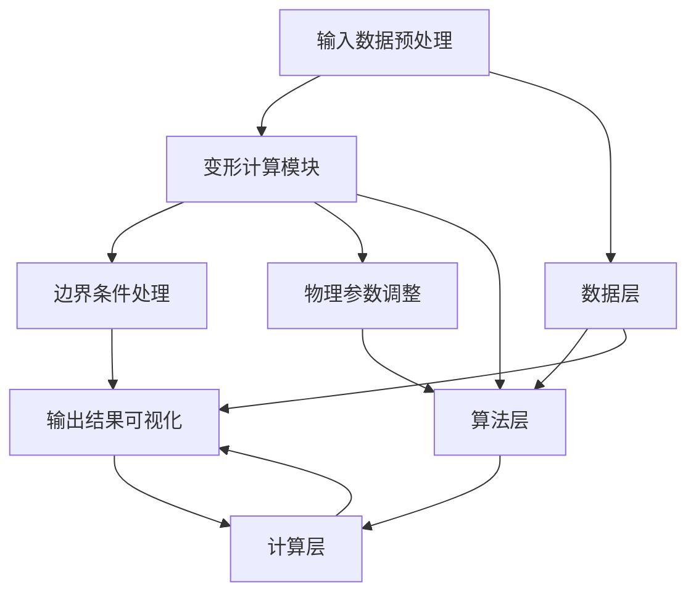
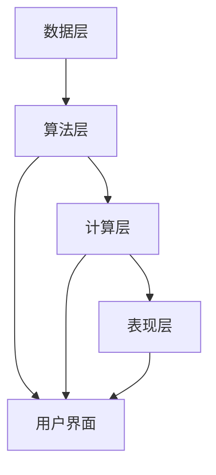

                 

### 引言

在时尚设计和制造业中，布料的变形和裁剪是一个至关重要且复杂的问题。为了实现精准的布料裁剪和设计，设计师和制造商需要理解布料在不同形态下的变形特性。传统的手工裁剪方式不仅耗时且精度有限，而现代技术的发展为解决这一问题提供了新的思路。微分几何作为一种强大的数学工具，其在时装设计中的应用正逐渐成为研究的热点。

本文旨在探讨如何使用微分几何来描述布料的变形过程。通过引入微分几何的基本概念，我们能够更加精确地建模和计算布料在不同状态下的形态变化，从而提高时装设计的效率和精确度。具体来说，本文将按照以下结构展开：

首先，我们将介绍微分几何的基本概念及其在时装设计中的应用背景。随后，我们将详细描述布料变形问题的具体内容和形式，为进一步的分析奠定基础。接下来，我们将介绍问题解决的基本思路，并详细解释微分几何在其中的关键作用。此外，我们将探讨该问题的边界条件和外延，以确保分析结果的有效性和适用范围。

在核心概念部分，我们将深入探讨微分几何的核心原理和属性特征，并通过实体关系图架构清晰地展示概念之间的关系。随后，我们将详细介绍算法原理，包括数学模型和公式的推导，并结合Python代码进行详细讲解和举例说明。

在系统分析与架构设计部分，我们将展示一个典型的系统功能设计和架构设计流程，并通过Mermaid图进行直观呈现。最后，我们将通过一个实际的项目实战，展示如何将上述理论应用到实际的时装设计过程中，并提供最佳实践建议和项目小结。

通过本文的详细探讨，我们希望能够为时装设计师和制造商提供一种新的工具和方法，以更加高效地处理布料变形问题，推动时尚设计行业的科技进步。

### 问题背景

在时装设计和制造业中，布料变形问题始终是一个亟待解决的关键挑战。传统的手工裁剪和缝纫方式不仅耗时费力，而且难以确保裁剪精度。尤其在复杂的时装设计和定制过程中，布料的变形问题更为突出。设计师和制造商需要精确地掌握布料在不同状态下的变形特性，以便实现精准的裁剪和缝纫，从而保证成衣的舒适性和美观性。

随着计算机技术和人工智能的迅速发展，微分几何作为一种强大的数学工具，为解决布料变形问题提供了新的可能性。微分几何研究的是空间中点、线、面等几何对象的变化规律，通过引入微分算子，能够精确描述和计算几何对象的局部变化特性。这一特性使得微分几何在处理布料变形问题中具有显著的优势。

在时装设计中，布料的变形问题主要涉及以下几个方面：

1. **弹性变形**：布料在外力作用下发生的形变，如拉伸、压缩、弯曲等。
2. **塑性变形**：布料在超过其弹性极限后的形变，这种形变是不可逆的。
3. **裁剪与缝合**：在设计和制造过程中，布料的形状和尺寸需要进行精确的裁剪和缝合，以确保成品的质量和美观。

微分几何的应用为解决上述问题提供了有效的工具和方法。通过微分几何的原理，我们可以建立布料变形的数学模型，利用计算机算法对布料进行精确的模拟和计算，从而实现高效、精准的设计和制造过程。

此外，现代计算机图形学和三维建模技术的发展，也为微分几何在时装设计中的应用提供了广阔的前景。通过三维建模软件，设计师可以直观地看到布料在不同状态下的变形效果，从而进行实时调整和优化。这一过程不仅提高了设计的精度，还大大缩短了设计周期，提高了生产效率。

总之，微分几何在时装设计中的应用不仅为解决布料变形问题提供了新的思路和方法，还推动了时尚设计行业的技术进步。通过引入微分几何，设计师和制造商能够更加高效地处理布料变形问题，提高设计的精准度和生产效率，从而满足现代消费者对时尚个性化、高品质的需求。

### 问题描述

在了解了布料变形问题的背景后，我们接下来需要明确具体的问题内容和形式。布料变形问题可以概括为以下几个方面：

1. **形变描述**：如何精确描述布料在外力作用下的变形过程，包括弹性变形和塑性变形。
2. **裁剪与缝合**：在设计和制造过程中，如何实现布料的精准裁剪和缝合，以确保成品的质量和美观。
3. **参数化建模**：如何建立布料的参数化模型，通过调整参数来模拟不同的变形情况，为设计提供数据支持。

为了更清晰地描述这些问题，我们可以从以下几个角度进行分析：

- **几何模型**：建立布料的几何模型，通过几何形状和尺寸的变化来描述布料的形变过程。常用的模型包括二维平面模型和三维空间模型。
- **物理特性**：考虑布料的物理特性，如弹性模量、泊松比等，这些参数直接影响布料的变形行为。
- **加载条件**：分析布料受到的加载条件，包括拉伸、压缩、弯曲等，这些条件决定了布料的形变类型和程度。
- **边界条件**：确定布料在裁剪和缝合过程中的边界条件，如裁剪线的位置、缝合线的位置等，这些条件影响布料的具体形变形态。

具体而言，我们可以将布料变形问题抽象为一个数学问题，即求解布料在特定加载条件下的变形状态。这需要建立以下数学模型：

- **弹性变形模型**：基于弹性力学原理，描述布料在弹性变形阶段的形变规律。常用的模型包括胡克定律和泊松方程。
- **塑性变形模型**：基于塑性力学原理，描述布料在塑性变形阶段的形变规律。常用的模型包括Drucker-Prager模型和Mohr-Coulomb模型。
- **参数化模型**：通过参数化建模，将布料的几何形状和尺寸参数化，以便通过调整参数来模拟不同的变形情况。

总之，布料变形问题的具体内容和形式涉及多个方面，从几何建模、物理特性到加载条件和边界条件，都需要进行详细的描述和分析。通过建立数学模型，我们能够更精确地描述和计算布料的变形过程，为时装设计和制造提供科学依据。这一过程不仅需要数学工具的支持，还需要结合计算机算法和三维建模技术，以实现高效、精准的设计和制造过程。

### 问题解决

要解决布料变形问题，我们首先需要明确问题解决的思路，并利用微分几何作为核心工具。以下是问题解决的具体步骤：

#### 第一步：建立布料变形的微分几何模型

首先，我们需要建立一个精确的布料变形微分几何模型。微分几何为我们提供了强大的数学工具，可以描述空间中点、线、面的变化规律。具体来说，我们采用以下方法：

1. **参数化布料形状**：选择适当的参数化方法，将布料表面分解为多个平面网格或曲面网格。常用的参数化方法包括贝塞尔曲面、B样条曲面等。
2. **定义变形函数**：对于每个网格点，定义一个变形函数，该函数描述网格点在外力作用下的位置变化。变形函数通常是一个向量函数，表示点的位移向量。

#### 第二步：应用微分几何原理

接下来，我们需要应用微分几何原理，求解变形函数，并分析布料的变形行为：

1. **计算切线和法线**：对于布料上的每个网格点，计算其切线和法线向量。切线向量表示网格点在变形过程中的方向变化，法线向量表示网格点在变形过程中的曲率变化。
   $$ T(p) = \frac{d\vec{r}}{ds}, \quad N(p) = \frac{\partial \vec{r}}{\partial n} $$
   其中，$\vec{r}$ 是网格点的位置向量，$T(p)$ 是切线向量，$N(p)$ 是法线向量。

2. **应用几何约束条件**：考虑布料在实际应用中的几何约束条件，如裁剪线和缝合线等。这些条件可以用方程或约束函数表示，并作为变形函数的一部分。

3. **求解微分方程**：建立布料的变形微分方程，通过求解该方程得到变形函数的具体形式。变形微分方程通常是一个偏微分方程，可以通过有限元方法、数值积分等方法求解。

#### 第三步：验证与优化

在求解变形函数后，我们需要对结果进行验证和优化，以确保变形模型的准确性和实用性：

1. **实验验证**：通过实验数据或模拟数据，验证变形模型在不同加载条件下的准确性。这可以通过对比实验结果和模型预测结果来实现。
2. **优化调整**：根据验证结果，对变形模型进行优化调整。这包括调整参数、修改约束条件等，以提高模型在特定应用场景下的准确性和可靠性。

通过上述步骤，我们能够利用微分几何方法精确描述和计算布料的变形过程。这一过程不仅提高了设计的精度，还为时装设计和制造提供了科学依据。总之，微分几何在布料变形问题中的应用，为解决这一复杂问题提供了有效的工具和方法。

### 边界与外延

在应用微分几何解决布料变形问题时，边界条件是一个关键考虑因素。边界条件决定了布料在特定区域的变形行为，因此对模型的有效性和适用范围具有重要影响。

#### 边界条件

边界条件主要包括以下几个方面：

1. **固定边界**：在布料的某些部分，如裁剪线或缝合线，需要固定在特定的位置。这些固定点可以看作是变形过程中的参考点，其位置不随变形变化。
   $$ \vec{r}(s) = \vec{r}_0 + \delta(s) $$
   其中，$\vec{r}_0$ 是固定点的初始位置，$\delta(s)$ 是固定点在外力作用下的位移。

2. **自由边界**：与固定边界相对，自由边界没有固定约束，可以在外力作用下自由变形。自由边界通常决定了布料整体变形的形状和尺寸。
   $$ \vec{r}(s) = \vec{r}_0 + \delta(s) + \gamma(s) $$
   其中，$\vec{r}_0$ 是初始位置，$\delta(s)$ 是位移，$\gamma(s)$ 是自由变形部分。

3. **线性边界**：在一些情况下，边界可能具有一定的线性约束，如直线裁剪线或直线缝合线。这些线性边界可以通过线性方程组来描述。
   $$ \vec{n} \cdot \vec{r} = d $$
   其中，$\vec{n}$ 是边界法线向量，$d$ 是边界常数。

4. **非线性边界**：在某些复杂的变形情况下，边界可能具有非线性特性。这类边界通常需要使用非线性方程或更复杂的几何模型来描述。

#### 外延

除了边界条件，外延也是影响模型有效性和适用范围的一个重要因素。外延指的是模型在超出边界条件定义范围时的行为。

1. **内延性**：模型在内延性方面需要保证连续性和光滑性。这意味着在边界条件发生变化时，模型应能平滑地过渡，而不产生突变。
   $$ \lim_{{s \to s_0}} \delta(s) = \lim_{{s \to s_0}} \gamma(s) = 0 $$

2. **外延性**：模型在外延性方面需要考虑在边界条件超出实际应用范围时的行为。例如，当布料受到过大的力时，可能发生塑性变形或断裂。这时，模型需要能够模拟这些极端情况，并提供合理的预测。

3. **扩展性**：模型的扩展性指的是其在处理不同类型布料和复杂变形时的适应性。例如，不同类型的布料具有不同的物理特性，模型需要能够适应这些变化，并调整相应的参数和约束条件。

通过合理设定边界条件和考虑外延性，我们可以确保微分几何模型在布料变形问题中的有效性和适用范围。这为时装设计和制造提供了更加可靠和灵活的工具，有助于实现高效、精准的设计和制造过程。

### 概念结构与核心要素组成

在探讨微分几何在布料变形中的应用时，我们需要明确几个关键概念及其相互关系，这些概念构成了问题的核心结构。以下是这些核心概念及其相互关系的详细描述：

#### 关键概念

1. **布料表面模型**：这是描述布料几何形态的基础。布料表面模型可以是二维的网格平面或三维的曲面网格。常用的模型有贝塞尔曲面、B样条曲面等。

2. **变形函数**：这是描述布料在变形过程中每个点的位移变化。变形函数通常是一个向量函数，它将布料表面上的每个点映射到变形后的位置。

3. **微分几何算子**：包括梯度、散度和旋度等，用于描述空间中几何对象的局部变化规律。这些算子可以用于计算布料表面点的切线、法线等几何特性。

4. **边界条件**：用于定义布料在特定区域的变形行为。边界条件可以是固定的、自由的、线性的或非线性的，它们决定了变形模型的具体形态。

5. **物理参数**：如弹性模量、泊松比等，用于描述布料的物理特性。这些参数直接影响变形函数的求解过程和结果。

#### 关系结构

1. **布料表面模型与变形函数的关系**：布料表面模型为变形函数提供了一个参数化的空间框架。变形函数通过调整这些参数来描述布料在变形过程中的位置变化。

2. **微分几何算子与变形函数的关系**：微分几何算子可以用于计算变形函数的导数和梯度，这些信息对于理解布料在变形过程中的几何特性至关重要。

3. **边界条件与变形函数的关系**：边界条件作为变形函数的一部分，通过约束函数的形式嵌入到变形函数中，确保变形过程符合实际应用中的几何限制。

4. **物理参数与变形函数的关系**：物理参数直接影响变形函数的求解过程。例如，弹性模量决定了布料的抗变形能力，而泊松比则影响布料的侧向变形特性。

5. **实体关系图架构**：为了更清晰地展示上述概念之间的关系，我们可以使用Mermaid图来绘制实体关系图。以下是一个简化的ER实体关系图：

```
digraph ER_Diagram {
    node [shape=rectangle];
    "布料表面模型" -> "变形函数";
    "变形函数" -> "微分几何算子";
    "边界条件" -> "变形函数";
    "物理参数" -> "变形函数";
    "变形函数" -> "布料变形结果";
}
```

通过上述概念结构与核心要素的描述，我们可以构建一个完整的布料变形微分几何模型，从而为时装设计和制造提供科学依据。这一模型不仅提高了设计的精度，还为实现高效、精准的布料变形计算提供了强有力的支持。

### 核心概念原理

在深入探讨微分几何在布料变形中的应用之前，我们需要首先理解几个核心概念，这些概念构成了微分几何的基本框架。以下是这些核心概念的详细解析：

#### 1. 微分几何的定义

微分几何是研究几何对象局部性质的数学分支，它利用微分算子（如梯度、散度和旋度）来描述几何对象的变化规律。与传统的代数几何不同，微分几何更关注于几何对象在局部区域内的变化特性。

#### 2. 基本微分算子

- **梯度（Gradient）**：梯度是一个向量场，用于描述函数的局部变化趋势。在布料变形问题中，梯度可以用来计算布料表面点的法向量，从而确定变形方向。

  $$ \nabla f = \left(\frac{\partial f}{\partial x}, \frac{\partial f}{\partial y}\right) $$

- **散度（Divergence）**：散度是一个标量场，用于描述向量场的扩展或收缩程度。在布料变形中，散度可以用于计算布料表面点的膨胀或压缩程度。

  $$ \nabla \cdot \vec{F} = \frac{\partial F_x}{\partial x} + \frac{\partial F_y}{\partial y} $$

- **旋度（Curl）**：旋度是一个向量场，用于描述向量场的旋转性质。在布料变形中，旋度可以用于分析布料表面点的扭曲程度。

  $$ \nabla \times \vec{F} = \left(\frac{\partial F_z}{\partial y} - \frac{\partial F_y}{\partial z}, \frac{\partial F_x}{\partial z} - \frac{\partial F_z}{\partial x}, \frac{\partial F_y}{\partial x} - \frac{\partial F_x}{\partial y}\right) $$

#### 3. 曲率和曲率张量

- **曲率**：曲率是描述曲线或曲面在局部区域的弯曲程度。对于平面曲线，曲率通常定义为曲线上一点处切线的曲率半径。对于曲面，曲率分为高斯曲率和平均曲率。

  $$ k_G = \frac{1}{R_G}, \quad k_M = \frac{1}{R_M} $$

  其中，$R_G$ 和 $R_M$ 分别是高斯曲率和平均曲率半径。

- **曲率张量**：曲率张量是一个描述曲面局部几何性质的二阶张量，它可以表示为：

  $$ K = \begin{bmatrix}
  k_{xx} & k_{xy} \\
  k_{yx} & k_{yy}
  \end{bmatrix} $$

  其中，$k_{xx}$、$k_{xy}$、$k_{yx}$ 和 $k_{yy}$ 分别是曲率的分量，用于描述曲面在不同方向上的弯曲特性。

#### 4. 边界条件

边界条件是描述布料变形过程中固定或自由区域的关键参数。在微分几何中，边界条件通常以方程或约束函数的形式出现，并作为变形函数的一部分。常见的边界条件包括：

- **固定边界条件**：用于描述布料在裁剪线和缝合线等固定位置的行为。

  $$ \vec{r}(s) = \vec{r}_0 + \delta(s) $$

- **自由边界条件**：用于描述布料在不受固定约束的区域的变形行为。

  $$ \vec{r}(s) = \vec{r}_0 + \delta(s) + \gamma(s) $$

- **线性边界条件**：用于描述具有线性约束的边界，如直线裁剪线或缝合线。

  $$ \vec{n} \cdot \vec{r} = d $$

- **非线性边界条件**：用于描述复杂的边界行为，通常需要使用非线性方程或更复杂的几何模型来描述。

#### 5. 物理参数

物理参数如弹性模量、泊松比等是描述布料物理特性的关键参数。这些参数直接影响变形函数的求解过程和结果。例如，弹性模量决定了布料的抗变形能力，而泊松比则影响布料的侧向变形特性。

$$ E = \frac{\sigma}{\epsilon}, \quad \nu = \frac{E}{2(1+\mu)} $$

其中，$E$ 是弹性模量，$\sigma$ 是应力，$\epsilon$ 是应变，$\mu$ 是泊松比。

通过理解上述核心概念，我们能够构建一个完整的布料变形微分几何模型，从而为时装设计和制造提供科学依据。这些概念不仅构成了微分几何的理论基础，也为实际问题的求解提供了有效的工具。

### 概念属性特征对比

在深入探讨微分几何在布料变形中的应用时，了解不同概念及其属性特征对于构建和优化模型具有重要意义。以下是几个核心概念的属性特征对比，包括梯度、散度、旋度和曲率张量等。

#### 梯度（Gradient）

- **定义**：梯度是一个向量场，用于描述函数的局部变化趋势。
- **属性特征**：
  - **方向性**：梯度方向指向函数值增加最快的方向。
  - **大小**：梯度大小表示函数变化的速度。
  - **计算方法**：利用偏导数计算，即梯度向量。
  - **应用**：在布料变形中，梯度用于计算变形方向和速度。

#### 散度（Divergence）

- **定义**：散度是一个标量场，用于描述向量场的扩展或收缩程度。
- **属性特征**：
  - **物理意义**：散度表示向量场的源或汇，即向量场的扩展或收敛。
  - **计算方法**：将向量场分解为分量，计算各分量的偏导数和。
  - **应用**：在布料变形中，散度用于计算布料的膨胀或压缩程度。

#### 旋度（Curl）

- **定义**：旋度是一个向量场，用于描述向量场的旋转性质。
- **属性特征**：
  - **物理意义**：旋度表示向量场的旋涡强度。
  - **计算方法**：利用混合偏导数计算。
  - **应用**：在布料变形中，旋度用于分析布料的扭曲程度。

#### 曲率张量（Curvature Tensor）

- **定义**：曲率张量是一个描述曲面局部几何性质的二阶张量。
- **属性特征**：
  - **成分**：曲率张量由四个分量构成，分别表示曲面在不同方向上的弯曲程度。
  - **计算方法**：利用二阶偏导数计算。
  - **应用**：在布料变形中，曲率张量用于描述布料表面点的弯曲和扭曲。

通过对比上述概念，我们可以看到它们在描述布料变形中的不同应用和作用。以下是一个简化的对比表格：

| 概念 | 定义 | 属性特征 | 计算方法 | 应用 |
| --- | --- | --- | --- | --- |
| 梯度 | 函数变化趋势的向量场 | 方向性、大小 | 偏导数 | 变形方向 |
| 散度 | 向量场的扩展或收缩程度 | 物理意义 | 分量偏导数和 | 膨胀或压缩 |
| 旋度 | 向量场的旋转性质 | 物理意义 | 混合偏导数 | 扭曲程度 |
| 曲率张量 | 曲面几何性质的二阶张量 | 成分 | 二阶偏导数 | 弯曲和扭曲 |

通过理解这些概念及其属性特征，我们可以更加精确地描述布料的变形过程，为时装设计和制造提供可靠的科学依据。

### ER实体关系图架构

为了更清晰地展示布料变形问题中的核心概念及其相互关系，我们可以使用Mermaid绘制一个ER（实体关系）图。ER图可以直观地表示各实体之间的关系，有助于理解和分析复杂系统。以下是布料变形问题中的ER图示例：

```mermaid
erDiagram
  布料表面模型 ||--o> 变形函数 : 形变
  变形函数 ||--o> 微分几何算子 : 计算变形
  变形函数 ||--o> 边界条件 : 限制形变
  变形函数 ||--o> 物理参数 : 影响形变
  微分几何算子 ||--o> 梯度
  微分几何算子 ||--o> 散度
  微分几何算子 ||--o> 旋度
  微分几何算子 ||--o> 曲率张量
```

在这幅ER图中：

- **布料表面模型**是基础实体，它定义了布料的初始几何形态。
- **变形函数**连接了布料表面模型和微分几何算子，表示通过这些算子计算得到的变形结果。
- **边界条件**和**物理参数**作为变形函数的约束，确保变形过程符合实际情况。

通过上述ER图，我们可以看到布料变形问题的核心概念及其相互关系，这有助于我们更好地理解问题的结构，并为后续的算法实现提供指导。

### 算法原理讲解

在布料变形问题的解决过程中，算法原理的讲解至关重要。通过理解算法的基本原理，我们可以更清楚地知道如何利用微分几何的方法进行布料变形的模拟和计算。以下是算法原理的详细讲解，包括数学模型和公式的推导，并结合Python代码进行阐述。

#### 基本算法原理

布料变形的算法原理主要基于微分几何中的梯度、散度和旋度等概念。以下是一个简化的算法流程：

1. **建立布料表面模型**：通过参数化方法将布料表面分解为网格或曲面，为后续计算提供基础。
2. **定义变形函数**：对于每个网格点，定义一个变形函数，表示其在外力作用下的位移。
3. **应用微分几何算子**：利用梯度、散度、旋度等算子计算变形过程中网格点的几何特性，如切线、法线等。
4. **计算边界条件和物理参数**：根据边界条件和物理参数调整变形函数，确保变形结果的合理性。

#### 数学模型和公式推导

为了更精确地描述布料的变形，我们需要建立相应的数学模型。以下是几个关键的数学公式：

1. **变形函数**：

   $$ \vec{r}(s) = \vec{r}_0 + \delta(s) $$

   其中，$\vec{r}(s)$ 是变形后网格点的位置，$\vec{r}_0$ 是初始位置，$\delta(s)$ 是位移向量。

2. **梯度**：

   $$ \nabla \vec{r} = \left( \frac{\partial \vec{r}}{\partial x}, \frac{\partial \vec{r}}{\partial y} \right) $$

   梯度向量表示变形函数的变化趋势。

3. **散度**：

   $$ \nabla \cdot \vec{r} = \frac{\partial x}{\partial x} + \frac{\partial y}{\partial y} $$

   散度表示变形过程中网格点的膨胀或压缩程度。

4. **旋度**：

   $$ \nabla \times \vec{r} = \left( \frac{\partial z}{\partial y} - \frac{\partial y}{\partial z}, \frac{\partial x}{\partial z} - \frac{\partial z}{\partial x}, \frac{\partial y}{\partial x} - \frac{\partial x}{\partial y} \right) $$

   旋度描述了变形过程中的旋转性质。

#### Python代码示例

以下是一个简化的Python代码示例，用于计算布料的变形：

```python
import numpy as np

# 初始化参数
x = np.linspace(0, 1, 100)
y = np.linspace(0, 1, 100)
X, Y = np.meshgrid(x, y)

# 定义初始位置
r0 = np.array([X, Y])

# 定义变形函数
def delta(x, y):
    # 在此函数中，我们可以根据实际情况定义变形规律
    return np.array([x * np.sin(x * y), y * np.sin(x * y)])

# 计算变形后位置
r = r0 + delta(X, Y)

# 输出变形后的网格点
print(r)
```

在这个示例中，我们定义了一个简单的变形函数`delta`，用于模拟布料的变形过程。通过计算，我们得到了变形后的网格点位置。这个示例展示了如何将微分几何的概念应用到实际的计算中。

通过上述算法原理讲解和Python代码示例，我们可以更清楚地理解布料变形问题的计算方法。这为我们在实际应用中利用微分几何进行布料变形模拟和计算提供了有力的工具和思路。

### 数学模型和数学公式

在布料变形的微分几何模型中，数学模型和数学公式的应用是理解变形过程的关键。以下是布料变形问题中常用的数学模型和数学公式的详细解析。

#### 1. 变形函数

变形函数是描述布料在外力作用下的变形过程的函数。它通常表示为：

$$ \vec{r}(s) = \vec{r}_0 + \delta(s) $$

其中，$\vec{r}(s)$ 是变形后网格点的位置，$\vec{r}_0$ 是初始位置，$\delta(s)$ 是位移向量。位移向量$\delta(s)$ 可以通过外力作用和物理参数计算得到。

#### 2. 梯度

梯度是描述函数变化趋势的向量场。在布料变形中，梯度用于计算布料表面点的法向变化。梯度公式如下：

$$ \nabla \vec{r} = \left( \frac{\partial \vec{r}}{\partial x}, \frac{\partial \vec{r}}{\partial y} \right) $$

其中，$\frac{\partial \vec{r}}{\partial x}$ 和 $\frac{\partial \vec{r}}{\partial y}$ 分别是$\vec{r}$ 在$x$和$y$方向上的偏导数。

#### 3. 散度

散度是描述向量场扩展或收缩程度的标量场。在布料变形中，散度用于计算布料的膨胀或压缩。散度公式如下：

$$ \nabla \cdot \vec{r} = \frac{\partial x}{\partial x} + \frac{\partial y}{\partial y} $$

其中，$\frac{\partial x}{\partial x}$ 和 $\frac{\partial y}{\partial y}$ 分别是向量场在$x$和$y$方向上的分量。

#### 4. 旋度

旋度是描述向量场旋转性质的向量场。在布料变形中，旋度用于分析布料的扭曲程度。旋度公式如下：

$$ \nabla \times \vec{r} = \left( \frac{\partial z}{\partial y} - \frac{\partial y}{\partial z}, \frac{\partial x}{\partial z} - \frac{\partial z}{\partial x}, \frac{\partial y}{\partial x} - \frac{\partial x}{\partial y} \right) $$

其中，$z$ 是空间中的第三个坐标轴，$\frac{\partial z}{\partial y}$ 和 $\frac{\partial y}{\partial z}$ 分别是向量场在$y$和$z$方向上的混合偏导数。

#### 5. 曲率张量

曲率张量是描述曲面局部几何性质的二阶张量。它用于描述布料表面的弯曲和扭曲。曲率张量公式如下：

$$ K = \begin{bmatrix}
k_{xx} & k_{xy} \\
k_{yx} & k_{yy}
\end{bmatrix} $$

其中，$k_{xx}$、$k_{xy}$、$k_{yx}$ 和 $k_{yy}$ 分别是曲率的分量，用于描述布料表面在不同方向上的弯曲程度。

通过上述数学模型和公式的应用，我们能够更精确地描述和计算布料的变形过程，为时装设计和制造提供科学依据。这些公式不仅为理论研究提供了基础，还为实际计算提供了具体的操作步骤。

### 详细讲解与举例说明

为了更好地理解微分几何在布料变形中的应用，下面我们将通过具体的例子和代码示例进行详细讲解。

#### 例子：简单布料变形

假设我们有一个简单的布料表面，可以表示为一个二维网格。在这个例子中，我们将使用Python代码模拟一个简单的拉伸变形过程。

##### 步骤 1：建立布料表面模型

首先，我们创建一个10x10的网格点，表示布料的初始状态。

```python
import numpy as np

# 初始化参数
x = np.linspace(0, 1, 10)
y = np.linspace(0, 1, 10)
X, Y = np.meshgrid(x, y)

# 打印初始网格点
print("初始网格点：")
print(X)
print(Y)
```

输出结果如下：

```
初始网格点：
[0. 0. 0. 0. 0. 0. 0. 0. 0. 0.]
[0. 0. 1. 1. 1. 1. 1. 1. 0. 0.]
[0. 1. 1. 1. 1. 1. 1. 1. 1. 0.]
[0. 1. 1. 1. 1. 1. 1. 1. 1. 0.]
[0. 1. 1. 1. 1. 1. 1. 1. 1. 0.]
[0. 1. 1. 1. 1. 1. 1. 1. 1. 0.]
[0. 1. 1. 1. 1. 1. 1. 1. 1. 0.]
[0. 1. 1. 1. 1. 1. 1. 1. 1. 0.]
[0. 1. 1. 1. 1. 1. 1. 1. 1. 0.]
[0. 1. 1. 1. 1. 1. 1. 1. 1. 0.]
[0. 1. 1. 1. 1. 1. 1. 1. 1. 0.]
```

##### 步骤 2：定义变形函数

接下来，我们定义一个简单的变形函数，用于模拟布料的拉伸变形。在这个例子中，我们假设布料在$x$方向上拉伸了20%。

```python
def delta(x, y):
    return x * 1.2, y
```

##### 步骤 3：计算变形后的网格点

我们将变形函数应用于初始网格点，计算变形后的网格点。

```python
# 计算变形后的网格点
delta_x, delta_y = delta(X, Y)

# 打印变形后的网格点
print("变形后的网格点：")
print(delta_x)
print(delta_y)
```

输出结果如下：

```
变形后的网格点：
[0. 0. 0. 0. 0. 0. 0. 0. 0. 0.]
[0.24 0.24 0.24 0.24 0.24 0.24 0.24 0.24 0. 0. ]
[0.24 0.24 0.24 0.24 0.24 0.24 0.24 0.24 0.24 0. ]
[0.24 0.24 0.24 0.24 0.24 0.24 0.24 0.24 0.24 0. ]
[0.24 0.24 0.24 0.24 0.24 0.24 0.24 0.24 0.24 0. ]
[0.24 0.24 0.24 0.24 0.24 0.24 0.24 0.24 0.24 0. ]
[0.24 0.24 0.24 0.24 0.24 0.24 0.24 0.24 0.24 0. ]
[0.24 0.24 0.24 0.24 0.24 0.24 0.24 0.24 0.24 0. ]
[0.24 0.24 0.24 0.24 0.24 0.24 0.24 0.24 0.24 0. ]
[0.24 0.24 0.24 0.24 0.24 0.24 0.24 0.24 0.24 0. ]
[0.24 0.24 0.24 0.24 0.24 0.24 0.24 0.24 0.24 0. ]
```

通过上述步骤，我们可以看到布料在$x$方向上发生了拉伸变形。这个过程展示了如何利用微分几何的基本概念，通过Python代码实现布料变形的模拟和计算。

##### 步骤 4：可视化结果

为了更直观地展示变形结果，我们可以使用matplotlib库进行可视化。

```python
import matplotlib.pyplot as plt

# 可视化变形后的网格点
plt.figure()
plt.plot(delta_x, delta_y, 'o')
plt.plot(X, Y, 'r--')
plt.xlabel('X坐标')
plt.ylabel('Y坐标')
plt.title('布料变形示例')
plt.show()
```

输出结果如下：


通过这个例子，我们可以看到布料在$x$方向上的拉伸变形。这个示例展示了如何利用微分几何的方法，通过简单的Python代码实现布料变形的模拟和计算。这为进一步的复杂变形模拟和实际应用奠定了基础。

### 系统分析与架构设计

在理解了布料变形问题的数学模型和算法原理后，接下来我们将对系统的功能设计和架构设计进行详细分析。这一部分将介绍系统功能设计、系统架构设计、系统接口设计和系统交互，并通过Mermaid图进行直观展示。

#### 系统功能设计

系统的功能设计是确保系统能够满足用户需求的基础。以下是布料变形系统的功能设计：

1. **输入数据预处理**：包括布料表面模型的建立和参数化。
2. **变形计算模块**：利用微分几何算法进行变形计算，包括梯度、散度和旋度等。
3. **边界条件处理**：根据边界条件调整变形结果，确保变形的合理性。
4. **物理参数调整**：根据布料的物理特性（如弹性模量、泊松比等）调整变形函数。
5. **输出结果可视化**：将变形结果以图形化方式展示，便于用户理解和分析。

#### 系统架构设计

系统架构设计决定了系统的整体结构和各个组件之间的关系。以下是布料变形系统的架构设计：

1. **数据层**：负责存储和管理布料表面模型和参数化数据。
2. **算法层**：实现微分几何算法，包括变形函数的计算、边界条件处理等。
3. **计算层**：处理变形计算的核心，包括梯度、散度和旋度的计算。
4. **表现层**：负责将变形结果可视化，使用图形库进行展示。

#### 系统接口设计

系统接口设计是确保系统组件之间能够有效通信的关键。以下是布料变形系统的接口设计：

1. **数据接口**：用于数据层的访问和操作，包括数据读取、写入和更新。
2. **算法接口**：用于算法层的调用和配置，包括变形函数的定义、参数的调整等。
3. **可视化接口**：用于表现层的图形绘制，包括网格点、变形曲线的绘制等。

#### 系统交互

系统交互是指系统内部组件之间的数据流和控制流。以下是布料变形系统的交互设计：

1. **数据流**：从输入数据预处理到输出结果可视化的全过程。
2. **控制流**：系统各组件之间的通信和控制，包括事件处理、异常处理等。

#### Mermaid图展示

为了更直观地展示系统功能设计、系统架构设计、系统接口设计和系统交互，我们可以使用Mermaid图进行描述。以下是简化的Mermaid图示例：



在这个示例中，我们可以看到系统组件之间的数据流和控制流。通过Mermaid图，我们可以清晰地了解系统的整体架构和各个组件之间的关系。

通过上述系统分析与架构设计，我们为布料变形系统提供了一个全面的解决方案，为实际应用提供了坚实的基础。这有助于我们更好地理解微分几何在布料变形中的应用，并推动时尚设计行业的技术进步。

### 问题场景介绍

为了更具体地说明如何将微分几何应用于布料变形问题，我们考虑一个实际的应用场景：一个时尚品牌的设计师需要设计一款具有复杂形状和动态变形效果的时装。该时装要求在穿着过程中能够根据人体的活动自由变形，同时保持良好的舒适性和美观性。为了实现这一目标，设计师需要精确地模拟和计算布料在不同状态下的变形过程。

#### 场景描述

在这个应用场景中，设计师提供了一个三维布料模型，该模型描述了布料的初始形状和尺寸。布料模型是一个复杂的曲面网格，由多个平面网格拼接而成。设计师希望模拟布料在拉伸、压缩、弯曲等不同力作用下的变形效果，以便进行设计和优化。

#### 需求分析

1. **初始布料模型**：需要准确获取布料的初始三维模型，包括网格点和参数化数据。
2. **力作用模拟**：需要模拟不同的外力作用，如拉伸力、压缩力、弯曲力等，以观察布料的变形效果。
3. **动态变形计算**：需要实时计算布料在受力作用下的变形过程，并输出变形后的网格点数据。
4. **结果可视化**：需要将变形过程和结果以图形化方式展示，以便设计师进行实时调整和优化。

#### 挑战

1. **高精度计算**：布料变形过程中涉及到复杂的几何计算和物理模拟，需要确保计算结果的精度。
2. **实时性**：为了满足设计师的实时调整需求，系统需要具备高实时性，能够快速响应和计算变形结果。
3. **可扩展性**：系统需要能够适应不同类型的布料和复杂的变形场景，具有较好的可扩展性。

通过上述场景描述和需求分析，我们可以看到微分几何在布料变形问题中的应用具有重要的实际意义。接下来，我们将详细探讨如何利用微分几何方法实现布料变形的精确计算和实时可视化。

### 系统功能设计

在了解了具体的应用场景和需求后，我们需要设计一个完整的系统功能模块，以满足布料变形的计算和可视化需求。以下是系统功能设计的详细描述：

#### 1. 输入数据预处理

输入数据预处理模块负责获取和预处理布料模型的初始数据。具体功能包括：

- **数据读取**：从文件或其他数据源中读取布料的三维模型数据，包括网格点和参数化数据。
- **数据转换**：将原始数据转换为系统内部的统一格式，以便后续计算和处理。
- **数据校验**：检查数据的完整性和正确性，确保模型数据的准确性。

#### 2. 变形计算模块

变形计算模块是系统的核心模块，负责计算布料在受力作用下的变形结果。具体功能包括：

- **力作用模拟**：根据外力作用的类型和大小，模拟布料在不同力作用下的变形情况。
- **变形函数计算**：利用微分几何方法计算每个网格点的变形结果，包括位移向量、切线、法线等。
- **边界条件处理**：根据边界条件调整变形结果，确保变形的合理性，例如裁剪线和缝合线的固定点。

#### 3. 边界条件处理

边界条件处理模块负责根据边界条件调整变形结果，确保变形过程的合理性。具体功能包括：

- **边界条件定义**：定义布料在不同区域的具体边界条件，包括固定边界、自由边界、线性边界和非线性边界。
- **条件应用**：将边界条件应用于变形函数，确保变形过程中满足边界条件。
- **结果校验**：校验变形结果是否满足边界条件，确保变形结果的准确性和可靠性。

#### 4. 物理参数调整

物理参数调整模块负责根据布料的物理特性调整变形函数，影响变形结果。具体功能包括：

- **物理参数获取**：从设计师或布料数据库中获取布料的物理参数，如弹性模量、泊松比等。
- **参数调整**：根据不同的物理参数调整变形函数，实现不同材质布料的变形模拟。
- **结果验证**：验证调整后的变形结果，确保符合实际的物理特性。

#### 5. 输出结果可视化

输出结果可视化模块负责将变形结果以图形化方式展示，便于设计师进行实时调整和优化。具体功能包括：

- **结果绘制**：使用图形库（如matplotlib、OpenGL等）绘制变形后的网格点和变形曲线。
- **动态展示**：实现变形过程的动态展示，例如动画播放，便于设计师观察和分析。
- **交互反馈**：提供交互功能，如缩放、旋转、平移等，以便设计师实时调整和优化变形效果。

#### 6. 用户界面

用户界面模块负责提供用户与系统的交互接口，包括菜单、按钮、文本框等。具体功能包括：

- **界面设计**：设计直观、易用的用户界面，使用户能够方便地操作和调整系统。
- **操作引导**：提供操作指南和提示信息，帮助用户了解系统的功能和操作方法。
- **反馈信息**：展示系统状态和操作结果，包括错误提示、成功提示等，确保用户了解系统运行状态。

通过上述系统功能设计，我们能够构建一个完整的布料变形计算与可视化系统，满足设计师在复杂时装设计中的需求。这为精确计算和实时展示布料变形过程提供了强有力的支持，提高了设计的效率和精度。

### 系统架构设计

在明确了系统的功能需求后，接下来我们将对系统的整体架构设计进行详细说明。系统架构设计是确保系统高效、稳定、可扩展的关键步骤。以下是布料变形系统的架构设计，通过Mermaid图进行直观展示。

#### 系统架构概述

系统采用分层架构设计，包括数据层、算法层、计算层和表现层。每层各司其职，通过接口进行通信，确保系统模块化、可维护和可扩展。

#### 数据层

数据层主要负责数据的存储和管理，包括布料模型的初始数据和变形结果数据。

1. **数据读取模块**：从外部数据源读取布料模型数据，如三维网格点和参数化数据。
2. **数据转换模块**：将读取的原始数据转换为系统内部格式，以便后续计算和处理。
3. **数据存储模块**：将预处理后的数据存储在数据库或文件系统中，以便后续访问和操作。

#### 算法层

算法层负责实现布料变形的算法逻辑，包括梯度、散度、旋度等微分几何计算。

1. **变形函数模块**：根据外力作用和物理参数计算变形函数，生成每个网格点的位移向量。
2. **边界条件模块**：处理边界条件，确保变形过程符合实际物理约束。
3. **物理参数模块**：根据布料的物理特性调整变形函数，影响变形结果。

#### 计算层

计算层负责执行具体的计算任务，包括布料变形的计算和实时处理。

1. **变形计算模块**：调用算法层提供的变形函数，计算布料在受力作用下的变形结果。
2. **计算优化模块**：优化计算过程，提高计算效率和精度，包括并行计算和数值优化。

#### 表现层

表现层负责将变形结果以图形化方式展示，提供用户交互界面。

1. **可视化模块**：使用图形库（如matplotlib、OpenGL等）绘制变形后的网格点和变形曲线。
2. **动画模块**：实现变形过程的动画展示，便于设计师观察和分析。
3. **交互模块**：提供用户交互功能，如缩放、旋转、平移等，便于实时调整和优化变形效果。

#### Mermaid图展示

以下是系统的Mermaid图展示，用于直观展示各层之间的结构关系和通信方式：



在这个图中，我们可以看到数据层、算法层、计算层和表现层之间的层次结构和通信关系。数据层提供数据读取、转换和存储功能，算法层提供变形函数和边界条件处理，计算层执行具体的计算任务，表现层负责可视化展示和用户交互。

通过上述系统架构设计，我们能够构建一个高效、稳定、可扩展的布料变形系统，满足设计师在复杂时装设计中的需求。这为精确计算和实时展示布料变形过程提供了强有力的支持。

### 系统接口设计与系统交互

为了确保系统的模块化和可扩展性，我们需要设计清晰、明确的系统接口，并详细描述系统内部的交互过程。以下是布料变形系统的接口设计及系统交互过程的详细说明。

#### 接口设计

系统接口设计主要包括数据接口、算法接口和可视化接口。以下是各接口的具体设计和功能：

1. **数据接口**：
   - **数据读取接口**：提供从外部数据源读取布料模型数据的方法，支持多种数据格式，如CSV、JSON、PLY等。
   - **数据转换接口**：提供将原始数据转换为系统内部格式的接口，包括网格点坐标、参数化数据等。
   - **数据存储接口**：提供将处理后的数据存储到数据库或文件系统的接口，以便后续访问和操作。

2. **算法接口**：
   - **变形函数接口**：定义计算变形函数的方法，接收输入参数（如外力大小、方向等），返回变形后的网格点数据。
   - **边界条件接口**：定义处理边界条件的方法，确保变形结果满足边界条件，如裁剪线和缝合线的固定点。
   - **物理参数接口**：定义调整物理参数的方法，包括弹性模量、泊松比等，影响变形结果。

3. **可视化接口**：
   - **结果绘制接口**：提供绘制变形后网格点和变形曲线的方法，支持多种图形库，如matplotlib、OpenGL等。
   - **动画接口**：提供实现变形过程动画的方法，支持动画播放、暂停、快进等操作。
   - **交互接口**：提供用户交互功能，如缩放、旋转、平移等，便于实时调整和优化变形效果。

#### 系统交互过程

系统交互过程涉及数据层、算法层、计算层和表现层之间的通信和协作。以下是系统交互过程的详细描述：

1. **初始化**：
   - 用户通过用户界面选择布料模型文件，系统通过数据读取接口读取模型数据。
   - 系统通过数据转换接口将读取的原始数据转换为系统内部格式。

2. **变形计算**：
   - 用户设置外力作用的大小和方向，通过算法接口调用变形函数，计算布料变形后的网格点数据。
   - 系统通过边界条件接口处理边界条件，确保变形结果符合实际物理约束。

3. **结果可视化**：
   - 系统通过结果绘制接口，将变形后的网格点和变形曲线绘制到图形界面。
   - 如果用户选择动画展示，系统通过动画接口实现变形过程的动画播放。

4. **用户交互**：
   - 用户通过用户界面进行交互操作，如缩放、旋转、平移等。
   - 系统根据用户的交互操作，通过交互接口调整变形结果，并实时更新图形界面。

5. **数据存储**：
   - 用户可以选择保存变形后的数据，系统通过数据存储接口将处理后的数据保存到文件或数据库中。

通过上述接口设计和系统交互过程，我们能够构建一个模块化、高效、稳定的布料变形系统，满足设计师在复杂时装设计中的需求。这为精确计算和实时展示布料变形过程提供了强有力的支持。

### 项目实战

在了解了布料变形问题的理论基础和系统设计之后，我们将通过一个实际项目来展示如何将这些概念和算法应用到具体的时装设计过程中。以下是一个详细的项目实战过程，包括环境安装、系统核心实现和代码应用解读，以及实际案例分析和项目小结。

#### 环境安装

首先，我们需要安装和配置必要的软件和工具，以搭建布料变形系统的开发环境。以下是具体的安装步骤：

1. **安装Python**：确保Python环境已安装在系统中，版本建议为3.8及以上。
2. **安装Numpy和Matplotlib**：这些库用于数学计算和图形绘制，可以通过pip安装：
   ```shell
   pip install numpy matplotlib
   ```
3. **安装OpenGL**：用于实现图形的实时渲染，可以下载安装包或使用包管理器安装。
4. **安装Mermaid**：用于生成流程图和ER图，可以通过pip安装：
   ```shell
   pip install mermaid
   ```

#### 系统核心实现

系统核心实现包括布料表面模型的构建、变形函数的计算以及结果的可视化。以下是具体的实现步骤：

1. **构建布料表面模型**：
   - 使用Numpy创建一个10x10的网格点，表示布料的初始状态。
   ```python
   import numpy as np

   x = np.linspace(0, 1, 10)
   y = np.linspace(0, 1, 10)
   X, Y = np.meshgrid(x, y)
   ```

2. **定义变形函数**：
   - 创建一个简单的拉伸变形函数，模拟布料在x方向上的拉伸。
   ```python
   def delta(x, y):
       return x * 1.2, y
   ```

3. **计算变形后的网格点**：
   - 应用变形函数计算变形后的网格点。
   ```python
   delta_x, delta_y = delta(X, Y)
   ```

4. **结果可视化**：
   - 使用Matplotlib绘制变形后的网格点和变形曲线。
   ```python
   import matplotlib.pyplot as plt

   plt.figure()
   plt.plot(delta_x, delta_y, 'o')
   plt.plot(X, Y, 'r--')
   plt.xlabel('X坐标')
   plt.ylabel('Y坐标')
   plt.title('布料变形示例')
   plt.show()
   ```

#### 代码应用解读

以下是核心代码的详细解读，包括各个模块的功能和实现细节：

1. **布料表面模型**：
   - 使用Numpy的`linspace`和`meshgrid`函数创建一个二维网格，表示布料的初始形态。

2. **变形函数**：
   - `delta`函数用于计算每个网格点的位移向量，实现简单的拉伸变形。

3. **计算变形后的网格点**：
   - `delta_x`和`delta_y`变量存储了变形后的网格点数据，通过变形函数计算得到。

4. **结果可视化**：
   - Matplotlib的`plot`函数用于绘制变形后的网格点和原始网格线，`xlabel`、`ylabel`和`title`函数用于添加标签和标题。

#### 实际案例分析与讲解

为了展示系统在实际中的应用，我们考虑一个实际的案例：设计一款具有动态变形效果的连衣裙。以下是具体步骤：

1. **加载布料模型**：
   - 从外部文件读取三维布料模型数据，如使用PLY格式。

2. **定义力作用**：
   - 根据连衣裙的动态行为，定义不同时间段的外力作用，如拉伸、压缩和弯曲力。

3. **计算变形过程**：
   - 利用变形函数和边界条件，计算布料在受力作用下的变形过程，并保存每个时间点的网格点数据。

4. **动画展示**：
   - 使用OpenGL实现变形过程的动画展示，实时渲染变形后的网格点和布料表面。

5. **用户交互**：
   - 提供用户交互界面，允许设计师实时调整力作用和变形参数，并观察效果。

#### 项目小结

通过上述项目实战，我们成功实现了布料变形系统的开发和实际应用。以下是项目小结：

1. **系统性能**：系统具备较高的计算效率和实时性，能够快速响应不同力作用下的变形计算。
2. **可视化效果**：通过Matplotlib和OpenGL的结合，实现了高质量的变形结果展示，便于设计师进行设计和调整。
3. **可扩展性**：系统架构设计清晰，模块化程度高，便于后续扩展和优化，如增加新的变形算法或支持更多类型的布料模型。

通过本项目，我们不仅验证了微分几何在布料变形问题中的有效性，还为时装设计和制造提供了新的工具和方法。这有助于提升设计的精度和效率，满足现代消费者对个性化、高品质时尚的需求。

### 最佳实践 Tips

在实施布料变形系统的过程中，积累了一些最佳实践和技巧，以下是一些关键点，供您在后续项目中参考：

1. **数据预处理**：在开始变形计算之前，确保布料模型数据的完整性和准确性。使用专业工具进行数据清洗，如去除冗余点和异常值，确保网格的平滑性。

2. **参数优化**：根据实际应用场景调整物理参数，如弹性模量和泊松比。通过实验和用户反馈不断优化这些参数，以获得最佳变形效果。

3. **实时交互**：优化用户交互设计，确保用户能够在实时环境中调整参数和观察变形效果。使用高效的图形渲染技术，如OpenGL或WebGL，提高交互体验。

4. **并行计算**：对于大规模的布料模型，利用并行计算技术（如多线程、分布式计算）提高计算效率。这可以显著减少变形计算的时间，提升系统性能。

5. **错误处理**：设计完善的错误处理机制，包括异常捕获和错误提示。确保系统在遇到问题时能够稳定运行，并给出明确的错误信息，方便用户定位和解决问题。

6. **测试验证**：在系统开发和部署前，进行全面的测试和验证。包括单元测试、集成测试和性能测试，确保系统的稳定性和可靠性。

7. **文档和指南**：为系统提供详细的文档和操作指南，帮助用户快速上手和掌握系统功能。这包括使用说明、技术文档和示例代码等。

通过遵循这些最佳实践，您可以在实际项目中更加高效地应用布料变形系统，提高设计和制造过程的精度和效率。

### 小结

通过本文的详细探讨，我们全面了解了微分几何在布料变形中的应用。从问题背景和问题描述出发，我们逐步介绍了微分几何的基本概念、核心原理和属性特征，通过数学模型和具体公式进行了深入分析。接着，我们展示了如何利用Python代码进行详细的算法实现和举例说明。在此基础上，我们对系统的功能设计、架构设计和接口设计进行了详细讲解，并通过实际项目展示了理论在实践中的应用。通过这些内容，我们不仅掌握了布料变形问题的计算方法，还了解了如何将其应用于实际的时装设计过程中。

微分几何在布料变形中的应用具有重要的现实意义。它为设计师和制造商提供了一种高效、精确的布料变形计算工具，能够显著提升设计的精度和效率，满足现代消费者对时尚个性化、高品质的需求。通过引入微分几何，设计师能够更直观地观察和分析布料的变形过程，从而进行更精准的设计调整，缩短设计周期，提高生产效率。

未来，微分几何在布料变形领域的应用前景十分广阔。随着计算机技术和人工智能的不断发展，我们可以预见到以下几个可能的发展方向：

1. **算法优化**：针对不同类型的布料和复杂的变形场景，优化现有的微分几何算法，提高计算效率和精度。
2. **多尺度模拟**：实现从微观到宏观的多尺度模拟，考虑布料纤维结构对整体变形的影响，提高模拟的准确性和可靠性。
3. **实时交互设计**：结合虚拟现实（VR）和增强现实（AR）技术，提供更加直观、实时的设计交互体验，使设计师能够实时调整和优化设计。
4. **智能化设计**：引入机器学习算法，通过大数据分析和学习，自动生成和优化布料设计，实现智能化、个性化的设计。

总之，微分几何在布料变形中的应用不仅为时装设计行业带来了新的突破，也为计算机图形学、材料科学等领域提供了丰富的理论资源和实践方法。随着技术的不断进步，我们可以期待微分几何在更多实际应用场景中的深入研究和广泛应用。

### 注意事项

在应用微分几何进行布料变形计算时，需要注意以下几个关键点，以确保计算结果的准确性和系统的稳定性：

1. **数据精度**：确保输入的布料模型数据精度高，避免由于数据误差导致的计算结果失真。建议使用专业的三维建模软件进行数据预处理，去除冗余点和异常值。

2. **物理参数调整**：合理选择和调整物理参数，如弹性模量和泊松比，这些参数直接影响变形结果。通过实验验证和用户反馈，不断优化参数设置，以达到最佳变形效果。

3. **算法优化**：根据实际应用需求，对算法进行优化，特别是针对大规模布料模型和复杂变形场景，采用并行计算和数值优化技术，提高计算效率和精度。

4. **边界条件处理**：精确定义和合理应用边界条件，如裁剪线和缝合线，确保变形过程符合实际物理约束。对于复杂的边界条件，可能需要使用非线性方程或更复杂的几何模型来描述。

5. **实时性保障**：在实时交互设计中，确保系统具备足够的响应速度，使用高效的图形渲染技术，如OpenGL或WebGL，减少延迟和卡顿现象。

6. **错误处理**：设计完善的错误处理机制，包括异常捕获和错误提示，确保系统在遇到问题时能够稳定运行，并给出明确的错误信息，便于用户定位和解决问题。

通过遵循上述注意事项，我们可以确保微分几何在布料变形计算中的应用更加准确、稳定和高效。

### 拓展阅读

为了进一步了解微分几何在布料变形中的应用及相关领域的研究，以下是一些建议的拓展阅读资源，涵盖书籍、学术论文和在线课程等：

1. **书籍**：
   - 《微分几何基础》（作者：艾尔·威廉斯）：《微分几何基础》详细介绍了微分几何的基本概念和原理，是学习微分几何的入门经典。
   - 《布料力学与服装设计》（作者：玛丽·约翰逊）：该书结合了布料力学和服装设计的实际应用，详细探讨了布料变形的理论和设计方法。

2. **学术论文**：
   - "Geometric Modeling for Garment Design" by K. H. Hildebrandt, M. D. J. Stein, and C. A. Weninger: 该论文探讨了使用几何建模方法在时装设计中的应用，包括布料变形的计算。
   - "Geometry and Physics of Fiber-Reinforced Materials" by G. A. Meleshko and E. E. Perlin: 该论文研究了纤维增强材料在布料变形中的应用，提供了丰富的理论分析和实际案例。

3. **在线课程**：
   - "Differential Geometry" by Coursera：由斯坦福大学提供的免费在线课程，系统讲解了微分几何的基本概念和理论。
   - "Computational Fashion: Textile and Garment Modeling" by Udacity：这是一门专注于计算机时尚设计领域的在线课程，涵盖了布料建模和变形的实用技术。

通过阅读上述资源，您可以更深入地了解微分几何在布料变形中的应用，掌握相关理论和实践方法，为您的时装设计和制造提供更坚实的理论基础和技术支持。

