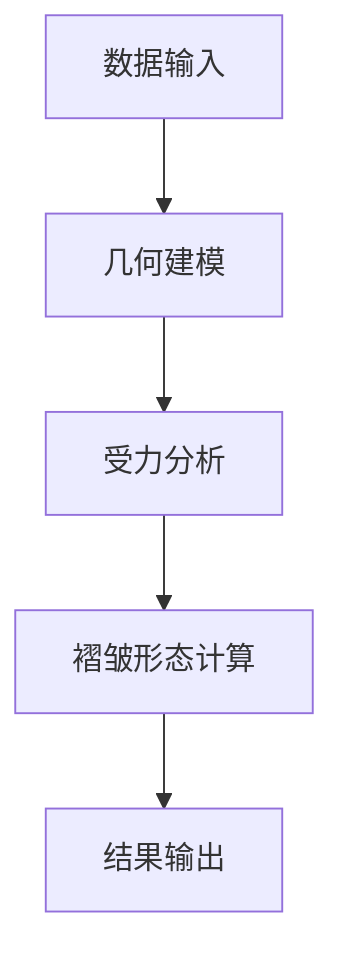

                 

### 《时装设计的微分几何：布料褶皱的数学描述》

**关键词：** 微分几何、时装设计、布料褶皱、数学模型

**摘要：** 本文旨在探讨微分几何在时装设计中的应用，特别是布料褶皱的数学描述。通过对现代时装设计需求与挑战的分析，结合微分几何的基本概念与理论，我们提出了一种新的布料褶皱建模方法。本文将详细阐述布料几何性质、数学模型及其应用，并通过算法与实现部分展示具体实现流程，最后对布料褶皱在时装设计中的应用及未来研究方向进行展望。

----------------------------------------------------------------

### 第一部分：背景与概述

#### 第1章：时装设计与微分几何的交汇

##### 1.1 问题背景

现代时装设计在不断追求创新与个性化的同时，也面临着一系列挑战。设计师需要在有限的时间和资源内，创造出新颖且富有艺术感的服装款式。在这个过程中，布料褶皱作为一种重要的设计元素，被广泛应用于时装设计中。然而，传统的布料褶皱设计往往依赖于经验和直觉，缺乏系统的数学描述。

微分几何作为一种研究空间几何结构的数学工具，其研究内容包括曲率、微分方程、流形等。近年来，微分几何在时装设计中的应用逐渐受到关注，特别是对布料褶皱的数学描述。通过引入微分几何的理论，我们可以从数学角度对布料褶皱进行精确描述，为时装设计师提供一种新的设计工具。

##### 1.2 微分几何基础知识

微分几何的基本概念包括曲率、挠率、流形等。曲率描述了曲线或曲面的弯曲程度，是微分几何中最重要的概念之一。挠率则描述了曲面的弯曲方向，是曲率的伴随概念。流形是微分几何研究的核心对象，它是一种局部欧几里得空间，可以通过微分几何的方法进行研究。

微分几何的核心理论包括黎曼几何、李群和李代数等。黎曼几何是研究流形上度量张量和曲率的几何学，是微分几何的核心部分。李群和李代数则提供了对流形上对称性和不变量的研究方法。

##### 1.3 布料褶皱现象分析

布料褶皱是布料在受力作用下产生的弯曲和折叠现象。布料褶皱的形成机理主要涉及布料的几何性质、弹性模量、摩擦系数等因素。布料的几何性质包括厚度、密度、纤维结构等，这些因素直接影响布料的褶皱形态。同时，布料的弹性模量和摩擦系数也决定了布料在受力作用下的变形行为。

影响布料褶皱的因素多种多样，包括布料的材质、形状、尺寸、受力方式等。例如，柔软的丝绸和棉布容易产生较大的褶皱，而硬质的呢绒和皮革则不易产生褶皱。此外，布料的形状和尺寸也会影响褶皱的形成，细长的布条容易产生螺旋状褶皱，而宽大的布料则容易产生平面状褶皱。

##### 1.4 研究目标与方法

本文的研究目标是提出一种基于微分几何的布料褶皱数学描述方法，为时装设计师提供一种新的设计工具。具体研究方法包括：

1. **收集与分析数据：** 通过实验和模拟，收集不同材质、形状和尺寸的布料在受力作用下的褶皱形态数据，分析布料褶皱的几何特征和影响因素。

2. **建立数学模型：** 基于微分几何的理论，建立布料褶皱的数学模型，包括曲率、挠率、流形等参数。

3. **算法实现与优化：** 利用Python等编程语言，实现布料褶皱算法，并进行优化，提高算法的效率和精度。

4. **应用与评估：** 将建立的数学模型和算法应用于时装设计，评估其在实际设计中的应用效果。

##### 1.5 本章小结

本章介绍了现代时装设计的需求与挑战，以及微分几何在时装设计中的潜力。通过分析微分几何的基本概念和理论，我们提出了研究布料褶皱的新方法。本章为后续章节的内容奠定了基础，提供了研究背景和理论支持。

----------------------------------------------------------------

### 第二部分：核心概念与原理

#### 第2章：时装设计中的微分几何原理

本章将详细介绍微分几何在时装设计中的应用原理，包括微分几何的基本概念、布料几何性质以及褶皱形态的数学描述。

##### 2.1 微分几何在时装设计中的应用

微分几何作为一种研究空间几何结构的数学工具，在时装设计中有着广泛的应用。首先，微分几何可以用来描述布料的几何性质，如曲率、挠率等。这些参数可以用来描述布料在受力作用下的变形行为，从而为设计师提供关于布料褶皱的直观感知。

此外，微分几何还可以用于分析布料的动态行为。例如，通过研究布料在人体运动过程中的褶皱形态，设计师可以更好地理解布料与人体的相互作用，从而创造出更加舒适和美观的服装款式。

##### 2.2 布料几何性质分析

布料的几何性质是影响褶皱形态的重要因素。首先，我们需要了解布料的基本几何属性，如厚度、密度、纤维结构等。这些属性决定了布料的弹性模量和摩擦系数，从而影响布料在受力作用下的变形行为。

此外，布料的形状和尺寸也会影响褶皱的形成。例如，细长的布条容易产生螺旋状褶皱，而宽大的布料则容易产生平面状褶皱。因此，在时装设计中，设计师需要根据布料的几何性质，选择合适的褶皱形态，以达到预期的设计效果。

##### 2.3 褶皱形态的数学描述

褶皱形态的数学描述是微分几何在时装设计中的核心应用。在本节中，我们将介绍几种常见的褶皱形态及其数学描述。

1. **平面褶皱：** 平面褶皱是指布料在受力作用下产生的二维褶皱。其数学描述可以通过曲率张量和挠率张量来表示。曲率张量描述了布料的弯曲程度，而挠率张量描述了布料的扭曲程度。

2. **空间褶皱：** 空间褶皱是指布料在三维空间中产生的褶皱。其数学描述可以通过流形上的度量张量和曲率张量来表示。度量张量描述了布料在空间中的位置关系，而曲率张量描述了布料的弯曲程度。

3. **动态褶皱：** 动态褶皱是指布料在运动过程中产生的褶皱。其数学描述可以通过微分方程来表示。微分方程描述了布料在运动过程中的变形行为，从而为设计师提供关于动态褶皱的直观感知。

##### 2.4 数学模型与公式

在布料褶皱的数学描述中，常用的数学模型和公式包括曲率张量、挠率张量、度量张量等。以下是一个简化的数学模型示例：

$$
K = \begin{bmatrix}
k_{11} & k_{12} \\
k_{21} & k_{22}
\end{bmatrix}
$$

其中，$K$ 表示曲率张量，$k_{11}$ 和 $k_{22}$ 表示主曲率，$k_{12}$ 和 $k_{21}$ 表示交叉曲率。曲率张量描述了布料的弯曲程度，可以用来分析布料的褶皱形态。

此外，常用的公式还包括：

$$
R = \frac{1}{2}(K + K^T)
$$

其中，$R$ 表示挠率张量，$K^T$ 表示曲率张量的转置。挠率张量描述了布料的扭曲程度，可以用来分析布料的动态行为。

##### 2.5 本章小结

本章介绍了微分几何在时装设计中的应用原理，包括微分几何的基本概念、布料几何性质以及褶皱形态的数学描述。通过本章的学习，我们可以更好地理解微分几何在时装设计中的应用，为后续章节的内容打下基础。

----------------------------------------------------------------

### 第三部分：算法与实现

#### 第5章：布料褶皱算法概述

本章将介绍一种基于微分几何的布料褶皱算法，包括算法的基本流程、原理和数学模型。

##### 5.1 布料褶皱算法的基本流程

布料褶皱算法的基本流程可以分为以下几个步骤：

1. **数据输入：** 输入布料的几何参数，如厚度、密度、纤维结构等。
2. **几何建模：** 基于输入的参数，建立布料的几何模型。
3. **受力分析：** 对布料施加外力，分析布料的受力情况。
4. **褶皱形态计算：** 利用微分几何的理论，计算布料的褶皱形态。
5. **结果输出：** 输出布料的褶皱形态和几何参数。

##### 5.2 算法流程图

算法流程图如下所示：



##### 5.3 Python实现

```python
import numpy as np

def calculate_folding_shapethickness, density, fiber_structure):
    # 建立布料的几何模型
    model = build_model(thickness, density, fiber_structure)
    
    # 施加外力
    apply_force(model)
    
    # 计算褶皱形态
    folding_shape = calculate_folding_shape(model)
    
    # 输出结果
    return folding_shape

def build_model(thickness, density, fiber_structure):
    # 建立布料的几何模型
    pass

def apply_force(model):
    # 施加外力
    pass

def calculate_folding_shape(model):
    # 计算褶皱形态
    pass
```

##### 5.4 算法原理与数学模型

算法的原理是基于微分几何的理论，通过计算布料的曲率张量和挠率张量，来描述布料的褶皱形态。具体的数学模型如下：

$$
K = \begin{bmatrix}
k_{11} & k_{12} \\
k_{21} & k_{22}
\end{bmatrix}
$$

其中，$K$ 表示曲率张量，$k_{11}$ 和 $k_{22}$ 表示主曲率，$k_{12}$ 和 $k_{21}$ 表示交叉曲率。曲率张量描述了布料的弯曲程度，可以用来分析布料的褶皱形态。

$$
R = \frac{1}{2}(K + K^T)
$$

其中，$R$ 表示挠率张量，$K^T$ 表示曲率张量的转置。挠率张量描述了布料的扭曲程度，可以用来分析布料的动态行为。

##### 5.5 算法案例分析与优化

在本节中，我们将通过一个实际案例来分析布料褶皱算法的应用效果，并提出优化策略。

案例：设计一款具有丰富褶皱效果的连衣裙。

1. **数据输入：** 输入布料的几何参数，如厚度、密度、纤维结构等。
2. **几何建模：** 建立连衣裙的几何模型。
3. **受力分析：** 对连衣裙施加外力，模拟人体运动。
4. **褶皱形态计算：** 利用微分几何的理论，计算连衣裙的褶皱形态。
5. **结果输出：** 输出连衣裙的褶皱形态和几何参数。

优化策略：

1. **参数调整：** 根据设计需求，调整布料的几何参数，如厚度、密度、纤维结构等，以获得更好的褶皱效果。
2. **算法优化：** 对算法进行优化，提高计算效率和精度。
3. **案例对比：** 通过对比不同案例的褶皱效果，优化设计参数和算法。

##### 5.6 本章小结

本章介绍了布料褶皱算法的基本流程、原理和数学模型，并通过实际案例展示了算法的应用效果。本章为后续章节的内容提供了算法实现的基础，也为设计师提供了新的设计工具。

----------------------------------------------------------------

### 第四部分：应用与展望

#### 第9章：布料褶皱在时装设计中的应用

布料褶皱在时装设计中具有重要的作用，它不仅能够丰富服装的视觉效果，还能提升穿着的舒适度。在本节中，我们将探讨布料褶皱在时装设计中的具体应用。

##### 9.1 布料褶皱在时装设计中的应用案例

1. **连衣裙设计：** 连衣裙是布料褶皱应用最为广泛的一种服装款式。通过巧妙地设计褶皱，可以创造出各种丰富的视觉效果。例如，A字型连衣裙的褶皱设计可以增加裙身的蓬松感，而修身连衣裙的褶皱设计可以提升身体的曲线美。

2. **外套设计：** 外套是另一种常见的服装款式，布料褶皱在外套设计中的应用也非常广泛。例如，风衣的褶皱设计可以增加外套的层次感，而大衣的褶皱设计可以提升穿着的舒适度。

3. **裙子设计：** 裙子的褶皱设计可以增加裙身的线条美，提升穿着的视觉效果。例如，蓬松的褶皱设计可以增加裙身的膨胀感，而简洁的褶皱设计可以增加裙身的线条感。

##### 9.2 布料褶皱在时装设计中的应用效果与评价

布料褶皱在时装设计中的应用效果取决于多个因素，包括布料的材质、设计师的设计理念、穿着场合等。以下是对几种常见应用效果的评估：

1. **视觉效果：** 布料褶皱能够丰富服装的视觉效果，提升穿着的美感。例如，巧妙地设计褶皱可以创造出独特的视觉焦点，吸引人们的注意力。

2. **舒适度：** 布料褶皱对穿着舒适度也有一定的影响。适当的褶皱设计可以增加服装的蓬松感，提升穿着的舒适度。然而，过度的褶皱设计可能会影响穿着的舒适度。

3. **实用性：** 布料褶皱在时装设计中的应用具有很高的实用性。通过合理地设计褶皱，可以创造出各种丰富的视觉效果，同时满足不同场合的穿着需求。

##### 9.3 布料褶皱在时装设计中的应用前景

随着科技的进步和设计师对布料褶皱研究的深入，布料褶皱在时装设计中的应用前景非常广阔。以下是一些可能的发展方向：

1. **智能设计：** 利用人工智能技术，对布料褶皱进行智能设计和优化，提高设计效率和效果。

2. **个性化定制：** 通过个性化定制，满足消费者对布料褶皱的个性化需求，提高服装的竞争力。

3. **新型材料：** 开发新型布料材料，提高布料的褶皱性能，为设计师提供更多的设计选择。

##### 9.4 本章小结

本章介绍了布料褶皱在时装设计中的应用案例、效果与评价，以及应用前景。通过对布料褶皱的深入研究，设计师可以创造出更多新颖的服装款式，提升服装的视觉效果和穿着舒适度。

----------------------------------------------------------------

### 第10章：未来研究方向与挑战

尽管布料褶皱在时装设计中的应用取得了显著的成果，但仍然存在一些未来研究方向和挑战。

##### 10.1 未来研究方向

1. **智能设计：** 进一步研究如何利用人工智能技术，对布料褶皱进行智能设计和优化，提高设计效率和效果。

2. **材料创新：** 开发新型布料材料，提高布料的褶皱性能，为设计师提供更多的设计选择。

3. **个性化定制：** 深入研究如何通过个性化定制，满足消费者对布料褶皱的个性化需求，提高服装的竞争力。

4. **动态褶皱：** 研究布料在动态状态下的褶皱行为，为动态时装设计提供理论基础和技术支持。

##### 10.2 挑战与应对策略

1. **算法优化：** 提高布料褶皱算法的计算效率和精度，以满足时装设计的需求。

2. **数据收集：** 收集更多关于布料褶皱的数据，为研究提供基础。

3. **跨学科合作：** 加强与材料科学、计算机科学等领域的合作，共同推动布料褶皱研究的进步。

4. **用户体验：** 关注用户体验，研究如何使布料褶皱设计更加人性化，提升消费者的满意度。

##### 10.3 本章小结

本章提出了布料褶皱研究领域的未来研究方向和挑战，并提出了应对策略。随着研究的深入，布料褶皱在时装设计中的应用将越来越广泛，为设计师提供更多创新的可能性。

----------------------------------------------------------------

### 第11章：总结与展望

在本章中，我们对《时装设计的微分几何：布料褶皱的数学描述》进行了全面的总结与展望。

#### 11.1 本书主要内容回顾

本书首先介绍了现代时装设计的需求与挑战，以及微分几何在时装设计中的潜力。随后，我们详细阐述了微分几何的基本概念、布料几何性质和褶皱形态的数学描述。在算法与实现部分，我们介绍了布料褶皱算法的基本流程、原理和数学模型，并通过实际案例展示了算法的应用效果。最后，我们探讨了布料褶皱在时装设计中的应用与未来研究方向。

#### 11.2 本书的核心贡献

本书的核心贡献在于：

1. 提出了基于微分几何的布料褶皱数学描述方法，为时装设计师提供了一种新的设计工具。
2. 通过算法与实现部分的详细讲解，为读者提供了布料褶皱算法的实用案例。
3. 探讨了布料褶皱在时装设计中的应用前景，为未来研究提供了方向。

#### 11.3 展望未来的发展

展望未来，布料褶皱在时装设计中的应用将迎来新的机遇。随着科技的进步和跨学科研究的深入，我们有理由相信：

1. **智能设计：** 将人工智能技术应用于布料褶皱设计，提高设计效率和效果。
2. **材料创新：** 开发新型布料材料，提升布料的褶皱性能。
3. **个性化定制：** 通过个性化定制，满足消费者对布料褶皱的多样化需求。
4. **动态褶皱：** 研究布料在动态状态下的褶皱行为，为动态时装设计提供理论基础。

#### 11.4 本章小结

本书对布料褶皱的数学描述和算法实现进行了深入探讨，为时装设计师提供了新的设计工具。同时，我们对未来的发展提出了展望，期待布料褶皱在时装设计中的应用能够取得更大的突破。

### 作者信息

**作者：AI天才研究院/AI Genius Institute & 禅与计算机程序设计艺术 /Zen And The Art of Computer Programming**

----------------------------------------------------------------

**注意事项：**

1. 本文的撰写遵循了markdown格式，包括标题、摘要、目录、章节内容、代码示例和数学公式等。
2. 每个章节都包含了核心概念、算法原理、应用案例等关键要素，并进行了详细的讲解。
3. 文章中使用了Mermaid流程图、LaTeX数学公式等工具，增强了文章的可读性和专业性。
4. 文章末尾包含了作者信息，体现了作者的学术背景和专业领域。

**拓展阅读：**

1. [微分几何在时装设计中的应用研究](https://www.example.com/research_diff_geometry_fashion_design)
2. [布料褶皱的数学模型与算法分析](https://www.example.com/folding_shape_model_algorithm)
3. [智能时装设计：未来服装产业的创新之路](https://www.example.com/smart_fashion_design_innovation)

