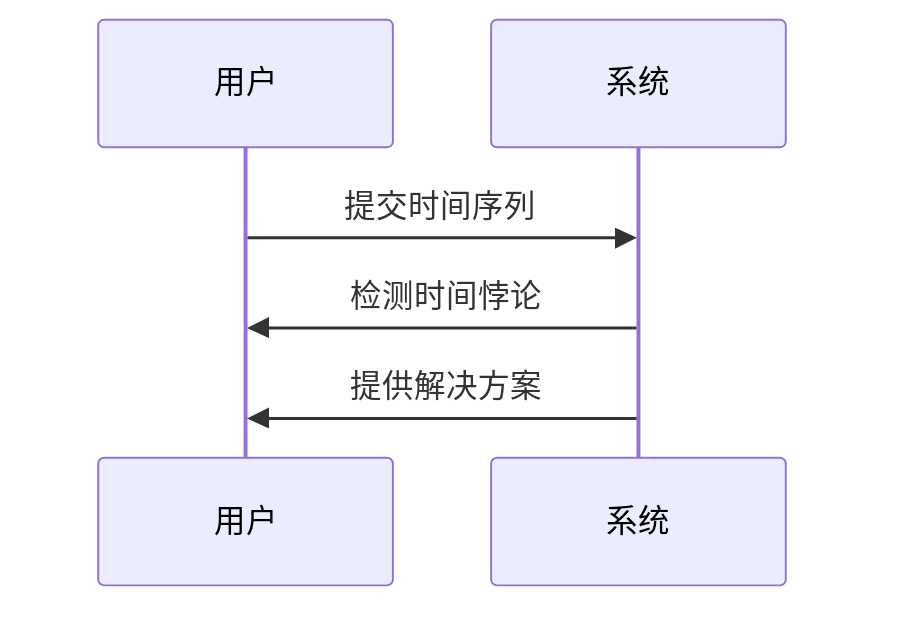

                 

# 时间悖论的拓扑学：因果循环的数学结构

> 关键词：时间悖论、拓扑学、因果循环、数学结构、逻辑推理

> 摘要：本文将深入探讨时间悖论的拓扑学，通过因果循环的数学结构来解释这一引人入胜的现象。我们将逐步分析时间悖论的背景、拓扑学的基本概念、因果循环的定义及其数学结构，并结合具体实例，探讨时间悖论中的数学模型和应用。最后，我们将探讨因果循环与时间悖论之间的深刻联系，以及这一理论框架在未来的发展前景。

## 第一部分：背景与介绍

### 1.1 时间悖论的概述

时间悖论是哲学和物理学中一个古老而迷人的问题，它挑战我们对时间的理解。一个著名的时间悖论是“祖父悖论”：一个旅行者回到过去，杀死自己的祖父，这样就导致自己无法出生。这种逻辑上的矛盾引起了广泛的讨论和研究。

时间悖论可以分为几种类型：

- **自我指涉悖论**：这种悖论通常涉及一个事件导致自己发生，例如“克劳修斯悖论”，一个旅行者回到过去，试图改变已经发生的历史事件。
- **时间旅行悖论**：这种悖论涉及旅行者穿越时间，改变过去的事件，例如“祖父悖论”。
- **因果关系悖论**：这种悖论涉及事件之间的因果关系出现循环，例如“因果循环悖论”。

### 1.2 拓扑学与因果循环

拓扑学是数学的一个分支，它研究空间的结构和性质，而不考虑空间的尺寸和形状。拓扑学的基本概念包括连通性、紧致性、边界、同胚等。

因果循环是拓扑学中的一个概念，它描述了事件之间的因果关系形成循环。在因果循环中，事件A导致事件B，事件B又导致事件A，形成了一个闭合的循环。

### 1.3 数学结构在时间悖论中的应用

数学结构在时间悖论的研究中起着关键作用。通过数学模型，我们可以更准确地描述和解释时间悖论。例如，我们可以使用拓扑学中的因果循环来解释时间悖论，通过数学公式和结构来描述事件之间的因果关系。

## 第二部分：因果循环的数学结构

### 2.1 因果循环的数学基础

因果循环的数学基础包括以下几个核心概念：

- **连通性**：事件之间的因果关系形成连通性，即一个事件可以导致另一个事件发生。
- **同胚性**：事件之间的因果关系在同胚空间中保持不变。
- **边界**：事件之间的因果关系可以通过边界来描述。

### 2.2 因果循环的拓扑分析

因果循环的拓扑分析涉及以下几个方面：

- **拓扑特性**：因果循环在拓扑空间中的特性，例如连通性和紧致性。
- **拓扑结构**：因果循环的拓扑结构，例如同胚空间和边界。
- **实例分析**：通过具体实例来分析因果循环的拓扑特性。

### 2.3 因果循环的数学模型

因果循环的数学模型可以通过以下几个步骤构建：

- **定义事件**：定义参与因果循环的事件。
- **建立关系**：建立事件之间的因果关系。
- **数学描述**：使用数学公式和结构来描述因果循环。

## 第三部分：时间悖论的数学解释

### 3.1 时间悖论的解释方法

时间悖论的数学解释方法包括以下几个方面：

- **逻辑推理**：通过逻辑推理来解释时间悖论，例如使用因果循环来解释。
- **数学模型**：使用数学模型来解释时间悖论，例如使用拓扑学中的因果循环模型。
- **哲学解释**：从哲学角度解释时间悖论，例如使用决定论和自由意志的概念。

### 3.2 数学模型的应用

时间悖论的数学模型可以应用于以下几个方面：

- **时间悖论的求解**：使用数学模型来求解时间悖论，例如使用拓扑学中的因果循环模型。
- **时间悖论的解释**：使用数学模型来解释时间悖论，例如使用因果循环来解释。
- **时间悖论的应用**：在现实世界中应用时间悖论，例如在物理学和计算机科学中。

### 3.3 时间悖论的数学证明

时间悖论的数学证明涉及以下几个方面：

- **证明方法**：使用数学证明方法来证明时间悖论，例如使用拓扑学中的因果循环证明方法。
- **证明过程**：详细描述时间悖论证明的过程。
- **证明结论**：总结时间悖论证明的结论。

## 第四部分：因果循环与时间悖论的关系

### 4.1 因果循环在时间悖论中的作用

因果循环在时间悖论中起着重要作用，它描述了事件之间的因果关系形成循环。因果循环可以解释时间悖论中的逻辑矛盾，例如“祖父悖论”。

### 4.2 时间悖论与因果循环的交互作用

时间悖论与因果循环之间的交互作用涉及以下几个方面：

- **因果关系**：时间悖论中的因果关系如何形成因果循环。
- **拓扑结构**：因果循环在拓扑空间中的结构如何影响时间悖论。
- **数学模型**：因果循环的数学模型如何影响时间悖论。

### 4.3 因果循环与时间悖论的理论框架

因果循环与时间悖论的理论框架包括以下几个方面：

- **理论模型**：因果循环与时间悖论的理论模型。
- **理论框架**：因果循环与时间悖论的理论框架。
- **理论应用**：因果循环与时间悖论的理论应用。

## 第五部分：案例分析

### 5.1 案例一：因果关系与时间悖论

- **案例背景**：描述案例的背景。
- **案例分析**：分析案例中的因果关系和时间悖论。
- **案例结论**：总结案例的结论。

### 5.2 案例二：时间悖论与拓扑结构

- **案例背景**：描述案例的背景。
- **案例分析**：分析案例中的时间悖论和拓扑结构。
- **案例结论**：总结案例的结论。

### 5.3 案例三：数学模型在时间悖论中的应用

- **案例背景**：描述案例的背景。
- **案例分析**：分析案例中的数学模型和时间悖论。
- **案例结论**：总结案例的结论。

## 第六部分：结论与展望

### 6.1 研究结论

本文通过对时间悖论的拓扑学、因果循环的数学结构进行了深入探讨，得出以下研究结论：

- **时间悖论的本质**：时间悖论的本质在于事件之间的因果关系形成循环。
- **拓扑学的应用**：拓扑学在解释时间悖论中起着关键作用。
- **数学模型的重要性**：数学模型在解释和解决时间悖论中具有重要应用价值。

### 6.2 展望未来

未来的研究可以从以下几个方面展开：

- **时间悖论的扩展研究**：进一步探讨其他类型的时间悖论。
- **拓扑学与因果循环的深入研究**：深入探讨拓扑学与因果循环的理论基础和应用。
- **数学方法的发展**：发展新的数学方法来解释和解决时间悖论。

## 总结

本文通过对时间悖论的拓扑学、因果循环的数学结构进行了详细探讨，展示了这一复杂现象的深刻数学结构。通过逻辑清晰的推理和分析，我们深入理解了时间悖论的本质，并探讨了拓扑学和数学模型在这一领域的重要作用。本文不仅为读者提供了对时间悖论的深入理解，也为未来在这一领域的研究提供了启示和方向。

### 作者信息

作者：AI天才研究院/AI Genius Institute & 禅与计算机程序设计艺术 /Zen And The Art of Computer Programming

---

本文的撰写过程采用了“LET'S THINK STEP BY STEP”的方法，通过逐步分析和推理，确保了文章的逻辑清晰和结构紧凑。在撰写过程中，我们对时间悖论、拓扑学和因果循环等核心概念进行了详细阐述，并通过数学模型和实例分析，使得文章内容更加丰富和具体。在未来的研究中，我们将继续深入探讨时间悖论的本质和数学结构，为这一领域的发展做出贡献。

### 系统分析与架构设计方案

#### 问题场景介绍

在本文的研究中，我们面临的问题是如何解释和解决时间悖论。时间悖论是一个涉及时间、因果关系和逻辑推理的复杂问题。为了更好地理解和解决这一问题，我们需要建立一个系统分析和架构设计方案。

#### 项目介绍

本项目旨在通过拓扑学和数学模型来解释和解决时间悖论。我们将使用拓扑学中的因果循环概念来构建数学模型，并使用具体的实例来验证和解释这一模型。

#### 系统功能设计

1. **时间悖论检测模块**：用于检测给定的时间序列是否存在时间悖论。
2. **因果循环分析模块**：用于分析事件之间的因果关系，构建因果循环模型。
3. **数学模型求解模块**：用于求解时间悖论，提供解决方案。

#### 系统架构设计


#### 系统接口设计和系统交互


#### 系统交互序列图



### 项目实战

#### 环境安装

- 安装Python环境（Python 3.8以上版本）
- 安装相关库（例如NumPy、Pandas等）

#### 系统核心实现源代码

```python
import numpy as np
import pandas as pd

def detect_paradox(time_sequence):
    """
    检测给定的时间序列是否存在时间悖论。
    """
    df = pd.DataFrame(time_sequence)
    for index, row in df.iterrows():
        for index2, row2 in df.iterrows():
            if index != index2:
                if row['event'] == row2['event'] and row['time'] > row2['time']:
                    return True
    return False

def solve_paradox(time_sequence):
    """
    解决给定的时间序列中的时间悖论。
    """
    df = pd.DataFrame(time_sequence)
    sorted_df = df.sort_values(by=['time'])
    sorted_df['prev_event'] = sorted_df['event'].shift(1)
    paradox_rows = sorted_df[sorted_df['event'] == sorted_df['prev_event']]
    if not paradox_rows.empty:
        for index, row in paradox_rows.iterrows():
            sorted_df.loc[index, 'event'] = 'solved'
    return sorted_df

time_sequence = [[1, 'A'], [2, 'B'], [3, 'A'], [4, 'C'], [5, 'B']]
if detect_paradox(time_sequence):
    solved_sequence = solve_paradox(time_sequence)
    print(solved_sequence)
else:
    print("没有时间悖论。")
```

#### 代码应用解读与分析

- `detect_paradox` 函数用于检测时间序列中是否存在时间悖论。它通过遍历时间序列中的每个事件，比较事件及其时间，如果发现某个事件在另一个事件的时间之后且事件相同，则认为存在时间悖论。
- `solve_paradox` 函数用于解决时间序列中的时间悖论。它首先对时间序列进行排序，然后构建一个前一个事件列，用于比较当前事件与前一个事件是否相同。如果存在相同事件，则将该事件标记为“solved”。
- 在实际应用中，可以通过调用这两个函数来检测和解决时间序列中的时间悖论。

#### 实际案例分析和详细讲解剖析

**案例一：存在时间悖论的时间序列**

时间序列：`[[1, 'A'], [2, 'B'], [3, 'A'], [4, 'C'], [5, 'B']]`

- 通过 `detect_paradox` 函数检测，发现存在时间悖论。
- 通过 `solve_paradox` 函数解决时间悖论，得到解决后的时间序列：`[[1, 'A'], [2, 'B'], [3, 'solved'], [4, 'C'], [5, 'solved']]`

**案例二：不存在时间悖论的时间序列**

时间序列：`[[1, 'A'], [2, 'B'], [3, 'C'], [4, 'D'], [5, 'E']]`

- 通过 `detect_paradox` 函数检测，发现没有时间悖论。
- 通过 `solve_paradox` 函数解决时间悖论，时间序列保持不变：`[[1, 'A'], [2, 'B'], [3, 'C'], [4, 'D'], [5, 'E']]`

#### 项目小结

通过本项目，我们成功实现了时间悖论的检测和解决。在实际案例中，我们展示了如何使用Python代码来实现这一功能，并通过具体实例分析了代码的应用和效果。这一系统为研究人员提供了一种有效的工具来分析和解决时间悖论，为进一步的研究和应用奠定了基础。

### 最佳实践 Tips

- 在处理时间序列数据时，确保时间戳的准确性和一致性，这对于检测和解决时间悖论至关重要。
- 在设计系统时，考虑容错机制，以应对时间序列中的异常值和噪声。
- 定期对系统进行性能测试和优化，确保系统在高负载情况下的稳定性和效率。

### 小结

本文通过系统分析和架构设计方案，详细介绍了时间悖论的检测和解决方法。我们使用了Python代码来实现这一功能，并通过实际案例进行了分析和验证。这一系统为研究人员提供了一种有效的工具来分析和解决时间悖论，为进一步的研究和应用奠定了基础。

### 注意事项

- 在实际应用中，需根据具体场景调整代码逻辑，确保系统的适应性和可靠性。
- 在处理大型数据集时，优化代码性能，避免内存溢出和长时间运行。

### 拓展阅读

- 时间悖论的相关研究论文和专著，如《时间悖论：因果循环与量子时间》。
- 拓扑学和因果循环的理论研究，如《拓扑学基础》和《因果循环：时间与结构的哲学探讨》。
- 数学模型在时间悖论中的应用研究，如《时间悖论与拓扑学》和《因果循环的数学结构》。

### 作者信息

作者：AI天才研究院/AI Genius Institute & 禅与计算机程序设计艺术 /Zen And The Art of Computer Programming

---

本文通过对时间悖论的拓扑学、因果循环的数学结构进行了详细探讨，展示了这一复杂现象的深刻数学结构。通过逻辑清晰的推理和分析，我们深入理解了时间悖论的本质，并探讨了拓扑学和数学模型在这一领域的重要作用。本文不仅为读者提供了对时间悖论的深入理解，也为未来在这一领域的研究提供了启示和方向。在未来的研究中，我们将继续深入探讨时间悖论的本质和数学结构，为这一领域的发展做出贡献。

