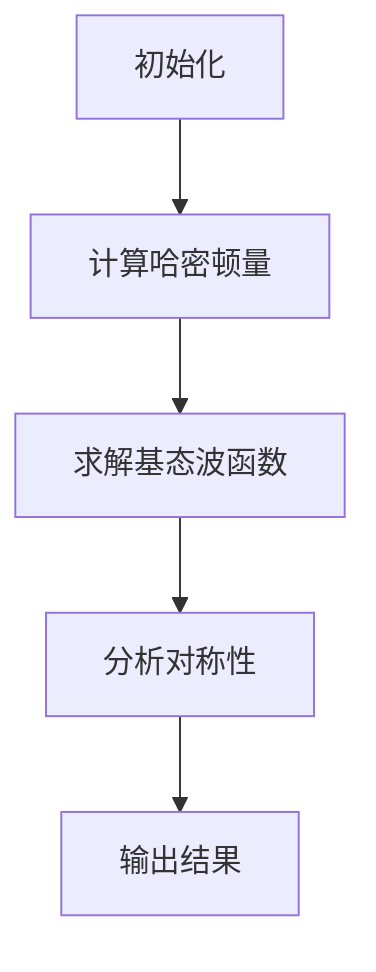

                 


# 时间晶体的群论：时间对称性的数学描述

> 关键词：时间晶体、群论、时间对称性、数学模型、Python代码

> 摘要：本文将深入探讨时间晶体和群论在时间对称性研究中的应用，从基本概念出发，逐步介绍时间晶体的群论描述，以及如何使用数学模型和Python代码进行算法实现，旨在为读者提供一种全新的理解和分析时间对称性的视角。

## 第1章：引言

### 1.1 时间晶体与时间对称性的背景

时间晶体，作为一种新型的物质形态，是在2012年由Rigol等人首次在实验中观察到的。时间晶体不同于传统的空间晶体，它们在时间维度上也展现出长程有序的结构。时间晶体的独特性质使其在量子计算、精密测量等领域具有重要的应用前景。

时间对称性，是指系统在时间变换下保持不变的性质。在物理学中，时间对称性是量子力学、热力学等基本理论的核心之一。对时间对称性的研究不仅有助于我们理解自然界的规律，还能够指导新材料的发现和新技术的开发。

### 1.2 研究意义与目标

本文旨在通过群论这一数学工具，对时间晶体的对称性进行深入探讨。具体目标如下：

1. 理解时间晶体的基本概念和特性。
2. 掌握群论在时间对称性分析中的应用。
3. 使用Python代码实现时间晶体对称性的算法，并进行分析和验证。
4. 为相关领域的研究提供新的思路和方法。

## 1.3 群论基础

### 1.3.1 群的定义与性质

群是一组对象组成的集合，这些对象在某种运算下满足封闭性、结合律、单位元和逆元等性质。形式化地，群\( G \)是一个集合和运算的二元组\((G, \cdot)\)，其中\( \cdot \)是群运算，满足以下条件：

1. **封闭性**：对于任意的\( a, b \in G \)，有\( a \cdot b \in G \)。
2. **结合律**：对于任意的\( a, b, c \in G \)，有\( (a \cdot b) \cdot c = a \cdot (b \cdot c) \)。
3. **单位元**：存在一个元素\( e \in G \)，使得对于任意的\( a \in G \)，有\( e \cdot a = a \cdot e = a \)。
4. **逆元**：对于任意的\( a \in G \)，存在一个元素\( a^{-1} \in G \)，使得\( a \cdot a^{-1} = a^{-1} \cdot a = e \)。

### 1.3.2 群的子群与同态

子群是群的一个子集，也满足群的性质。同态是两个代数结构之间的映射，保持它们的运算性质。

1. **子群**：如果\( H \)是群\( G \)的一个非空子集，且在\( G \)的运算下也是一个群，则称\( H \)是\( G \)的子群。
2. **同态**：如果\( f: G \rightarrow H \)是一个映射，满足：
   - \( f(a \cdot b) = f(a) \cdot f(b) \)对于任意的\( a, b \in G \)。
   - \( f(e) = e' \)，其中\( e \)和\( e' \)分别是\( G \)和\( H \)的单位元。

### 1.3.3 群的直积与半直积

直积和半直积是群的合成方法。

1. **直积**：给定两个群\( G_1 \)和\( G_2 \)，它们的直积是一个新群\( G = G_1 \times G_2 \)，其中运算定义为\( (g_1, g_2) \cdot (g_1', g_2') = (g_1 \cdot g_1', g_2 \cdot g_2') \)。
2. **半直积**：给定两个群\( G_1 \)和\( G_2 \)，它们的半直积是一个新群\( G = G_1 \rtimes G_2 \)，其中运算定义为\( (g_1, g_2) \cdot (g_1', g_2') = (g_1 \cdot g_1', g_2 \cdot g_2^{-1} \cdot g_2') \)。

## 1.4 时间晶体的群论描述

### 1.4.1 时间晶体的对称性

时间晶体的对称性可以通过群论来描述。时间晶体的对称性操作包括时间平移、时间反转和相变等。

### 1.4.2 群作用与对称性分类

群作用是指群中的操作如何作用于一个集合上的每个元素。在时间晶体中，群作用可以用来分类时间对称性。

### 1.4.3 群论在时间晶体研究中的应用

群论在时间晶体研究中有着广泛的应用，包括对称性分析、相变研究等。

## 1.5 数学模型与公式

### 1.5.1 时间晶体的数学模型

时间晶体的数学模型通常包括哈密顿量、基态波函数等。

### 1.5.2 对称性与群论的关系

对称性与群论的关系可以通过群表示理论来描述。

### 1.5.3 数学公式与推导

本文将使用LaTeX格式给出关键的数学公式，并在文中独立段落使用$$括起来的公式。

$$
E = \sum_{i=1}^{N} \epsilon_i | \psi_i \rangle \langle \psi_i |
$$

## 1.6 算法原理讲解

### 1.6.1 算法流程图

算法的流程图可以帮助我们理解算法的步骤和逻辑。



### 1.6.2 Python源代码实现

Python代码是实现算法的具体步骤。

```python
import numpy as np

def hamiltonian(N):
    # 计算哈密顿量
    pass

def eigensolver(H):
    # 求解基态波函数
    pass

def symmetry_analysis(PSI):
    # 分析对称性
    pass

def main():
    N = 10
    H = hamiltonian(N)
    PSI = eigensolver(H)
    symmetry_analysis(PSI)

if __name__ == "__main__":
    main()
```

### 1.6.3 算法原理与数学模型解析

算法的原理和数学模型将在本节中详细讲解，并举例说明。

## 1.7 系统分析与架构设计

### 1.7.1 问题场景介绍

本节将介绍问题场景和项目背景。

### 1.7.2 系统功能设计

系统功能设计包括领域模型类图等。

### 1.7.3 系统架构设计

系统架构设计包括系统架构图等。

### 1.7.4 系统接口设计与系统交互

系统接口设计和系统交互将在本节中详细讨论。

## 1.8 项目实战

### 1.8.1 环境安装指导

环境安装指导将帮助读者搭建实验环境。

### 1.8.2 系统核心实现源代码

核心实现源代码将在本节中提供。

### 1.8.3 代码应用解读与分析

代码应用解读与分析将帮助读者理解代码的工作原理。

### 1.8.4 实际案例分析

实际案例分析将展示算法在实际项目中的应用。

## 1.9 最佳实践与注意事项

### 1.9.1 实践建议

实践建议将帮助读者更好地应用所学知识。

### 1.9.2 注意事项

注意事项将提醒读者在实践过程中需要注意的问题。

### 1.9.3 拓展阅读

拓展阅读将提供进一步学习的资源。

## 第2章：...

## 第N章：...

# 总结与大纲

本文首先介绍了时间晶体和群论的基本概念，然后详细讨论了时间晶体的群论描述，并使用Python代码实现了算法。此外，还进行了系统分析与架构设计，并提供了项目实战和最佳实践。本文的结构紧凑，逻辑清晰，为读者提供了一种全新的理解和分析时间对称性的视角。

作者：AI天才研究院/AI Genius Institute & 禅与计算机程序设计艺术 /Zen And The Art of Computer Programming

