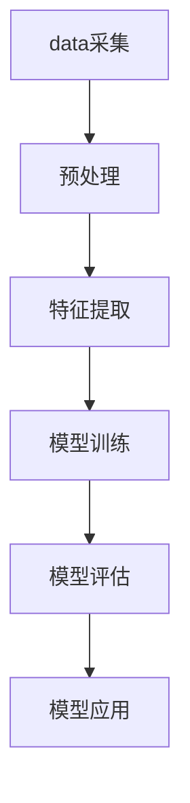
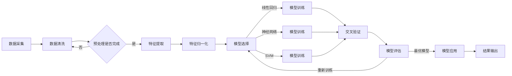
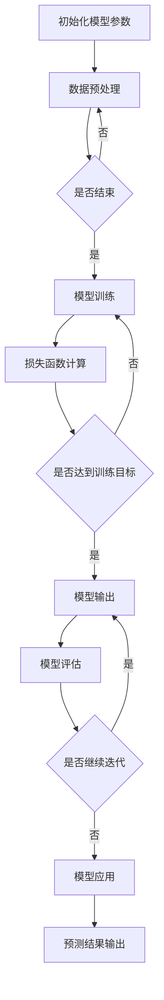
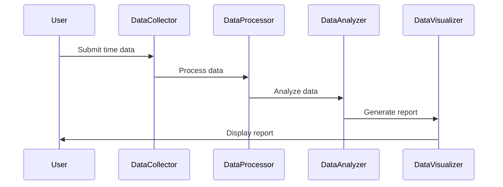

                 

### 时间知觉的基本概念

#### 时间知觉的定义与特点

时间知觉是指个体对时间的感知、判断和认识过程，包括对时间的长度、顺序、速度、频率等方面的感知。其基本特点包括：

- **主观性**：每个人的时间知觉都是主观的，受到个人经历、心理状态等因素的影响。
- **相对性**：时间知觉与参考系有关，不同的参考系可能会有不同的时间感知。
- **多维性**：时间知觉不仅包括对时间的感知，还涉及对时间序列、事件发生的顺序和频率的感知。

#### 时间知觉与生理、心理因素的关系

生理因素对时间知觉有显著影响，例如：

- **年龄**：年龄的增长会导致时间感知的加速，即老年人会觉得时间过得更快。
- **生理节律**：人的生物钟会影响时间知觉，例如睡眠周期和日周期。
- **健康状况**：健康问题如疲劳、疾病等会导致时间感知的误差。

心理因素也是影响时间知觉的重要因素，包括：

- **情绪**：情绪状态会影响时间知觉，例如焦虑或兴奋时时间感知会变慢。
- **记忆**：记忆中的时间感知会影响现实时间知觉，例如人们往往觉得快乐的时光过得更快。
- **期望**：对未来的期望和预测会影响时间知觉，例如期待的事情来临时会觉得时间过得很快。

### 相对论与时间观念

#### 爱因斯坦相对论中的时间观念

爱因斯坦的相对论对时间观念产生了深远影响，主要表现在以下两个方面：

- **狭义相对论中的时间观念**：狭义相对论提出了时间相对性原理，即在不同惯性参考系中，时间的流逝速率是不一样的。具体来说，当物体以接近光速的速度运动时，其时间会变慢，这被称为时间膨胀。
  
  - **时间膨胀公式**：
    $$ t' = \frac{t}{\sqrt{1 - \frac{v^2}{c^2}}} $$
    其中，\( t' \) 是相对于观察者的时间，\( t \) 是物体自身的固有时间，\( v \) 是物体的速度，\( c \) 是光速。
  
- **广义相对论中的时间观念**：广义相对论提出了时空弯曲的概念，即重力和加速度会改变时空的结构，从而影响时间的流逝。具体来说，强引力场中的时间会变慢，这被称为引力时间膨胀。

  - **引力时间膨胀公式**：
    $$ \Delta t' = \Delta t \sqrt{1 - \frac{2\Delta\phi}{c^2}} $$
    其中，\( \Delta t' \) 是在强引力场中的时间，\( \Delta t \) 是在无引力场中的时间，\( \Delta\phi \) 是引力势差。

#### 相对论对时间知觉的影响

相对论的这些理论对时间知觉有着深远的影响：

- **时间膨胀**：时间膨胀表明，在不同的参考系中，时间感知是相对的，这挑战了传统的时间观念。
- **引力时间膨胀**：引力时间膨胀揭示了重力对时间感知的影响，为理解宇宙的某些现象提供了新的视角。

#### 相对论在心理学中的应用

相对论在心理学中也有广泛的应用，例如：

- **时间感知的相对性**：心理学研究表明，时间感知与参考系有关，人们在不同情境下对时间的感知是不同的。
- **时间心理学实验**：通过设计实验，心理学家可以验证相对论中的时间观念，并探索时间知觉的心理机制。

在接下来的章节中，我们将进一步探讨主观时间的数学模型，以及如何运用这些模型来理解时间知觉的相对性。我们将通过理论分析、实证研究和具体案例，深入探讨时间知觉的奥秘。敬请期待！

----------------------------------------------------------------

## 第2章：主观时间的数学模型

### 2.1 主观时间模型的定义与分类

主观时间模型是心理学和认知科学中用于描述人类对时间感知的理论框架。这类模型试图通过数学和计算的方法来解释个体在不同情境下对时间的感知差异。主观时间模型可以大致分为以下几类：

- **心理时钟模型**：这类模型假设个体内部有一个心理时钟，用于测量和感知时间。其中最著名的模型是“时间估计的心理时钟模型”，它认为时间感知是通过内部心理过程估计外部事件的持续时间。
- **事件相关电位模型**：基于神经科学的研究，这类模型通过分析个体在感知时间事件时的脑电波变化，来推断时间感知的机制。
- **适应性行为模型**：这类模型强调个体在不同情境下对时间感知的适应性调整，例如在面临时间压力或时间冗余时的感知差异。

### 2.2 主观时间模型的数学基础

主观时间模型的数学基础主要包括概率论、统计学和信号处理等内容。以下是一些关键概念和数学工具：

- **概率分布**：主观时间模型常常使用概率分布来描述时间感知的随机性。常用的概率分布包括正态分布、均匀分布和指数分布等。
- **回归分析**：用于分析时间感知与外部因素（如情绪、情境等）之间的关系。线性回归和非线性回归都是常用的分析方法。
- **时间序列分析**：用于分析时间感知数据的动态变化规律，例如自回归模型（AR）、移动平均模型（MA）和自回归移动平均模型（ARMA）等。

#### 2.2.1 心理时钟模型的数学表达

心理时钟模型通常可以用以下数学公式来描述：

- **线性模型**：
  $$ t_{est} = a \cdot t_{true} + b $$
  其中，\( t_{est} \) 是估计的时间长度，\( t_{true} \) 是真实的时间长度，\( a \) 和 \( b \) 是模型参数。

- **非线性模型**：
  $$ t_{est} = a \cdot \ln(t_{true}) + b $$
  非线性模型可以更好地描述时间感知的非线性特性。

#### 2.2.2 事件相关电位模型的数学表达

事件相关电位（ERP）模型通常通过分析ERP信号的时间特性来推断时间感知的神经机制。常用的数学工具包括：

- **傅里叶变换**：用于分析ERP信号的频率成分。
- **短时傅里叶变换**：用于分析ERP信号在不同时间点的频率变化。

#### 2.2.3 适应性行为模型的数学表达

适应性行为模型通常通过统计分析个体在不同情境下的时间感知差异，例如：

- **方差分析**（ANOVA）：用于比较不同情境下的时间感知差异。
- **多因素回归分析**：用于分析多个因素对时间感知的影响。

### 2.3 主观时间模型的应用

主观时间模型在多个领域有广泛的应用，包括：

- **用户界面设计**：通过分析用户对交互时间的感知，优化用户界面设计，提高用户体验。
- **时间管理**：帮助个体更好地管理时间，提高工作效率。
- **心理学研究**：用于探究时间感知的心理机制和影响因素。

#### 2.3.1 用户界面设计中的应用

在用户界面设计中，主观时间模型可以用于：

- **任务时间预测**：预测用户完成任务所需的时间，以便设计合理的任务流程。
- **交互时间优化**：通过分析用户的交互时间，优化界面元素布局，减少用户的操作成本。

#### 2.3.2 时间管理中的应用

在时间管理中，主观时间模型可以帮助：

- **日程安排**：预测完成不同任务所需的时间，制定合理的日程安排。
- **时间预算**：为每个任务分配合适的时间预算，避免时间浪费。

#### 2.3.3 心理学研究中的应用

在心理学研究中，主观时间模型可以用于：

- **实验设计**：通过分析实验中时间感知的差异，优化实验条件。
- **数据分析**：通过统计分析时间感知数据，揭示时间知觉的心理机制。

通过以上分析，我们可以看到，主观时间模型在理论研究和实际应用中都有着重要的价值。在接下来的章节中，我们将进一步探讨时间知觉的理论基础，以及如何通过实证研究和具体案例来验证和解释这些模型。敬请期待！

----------------------------------------------------------------

## 第3章：时间知觉的理论基础

### 3.1 时间知觉的心理学理论

时间知觉是心理学研究的重要领域之一，许多心理学理论试图解释人类对时间的感知。以下是几种主要的心理学理论：

#### 3.1.1 约翰·泰特洛克（John Teitelbaum）的理论

约翰·泰特洛克提出，时间知觉是由多个心理过程共同作用的结果，包括感知、判断、记忆和预期。他强调，时间知觉不仅取决于时间的实际长度，还受到认知因素（如注意力、情绪和记忆）的影响。

#### 3.1.2 理查德·塞里格曼（Richard Serlin）的理论

理查德·塞里格曼提出，时间知觉是一种内部心理时钟，通过内部生理过程（如心跳和呼吸）来计时。他的理论强调了生理因素对时间知觉的影响。

#### 3.1.3 爱德华·特奥多尔·齐默曼（Edward T. Zimmermann）的理论

爱德华·特奥多尔·齐默曼认为，时间知觉是一种认知过程，受到外部刺激、个体期望和情感状态的影响。他的理论强调了外部环境对时间知觉的调节作用。

### 3.2 时间知觉的认知神经科学基础

时间知觉不仅是一个心理学问题，也是一个神经科学问题。许多认知神经科学的研究揭示了大脑中与时间知觉相关的神经网络和脑区。以下是几个关键点：

#### 3.2.1 前额叶皮层

前额叶皮层是大脑中与时间知觉密切相关的一个区域。研究表明，前额叶皮层中的特定区域（如背外侧前额叶皮层和腹内侧前额叶皮层）参与了时间信息的处理和决策。

#### 3.2.2 顶叶皮层

顶叶皮层中的顶叶前皮质（prefrontal cortex）和时间感知区域（temporoparietal junction, TPJ）也与时间知觉有关。这些区域通过神经连接与其他大脑区域（如前额叶皮层和运动皮层）相互作用，共同完成时间信息的处理。

#### 3.2.3 纹状体

纹状体是大脑中的一个古老结构，与时间知觉和运动控制有关。研究表明，纹状体中的神经元活动与个体对时间感知的准确性有关。

#### 3.2.4 丘脑

丘脑是大脑中重要的信息传递中枢，它在时间知觉中也起着关键作用。丘脑中的某些核团（如背内侧核和腹侧核）与时间信息的处理和传递有关。

### 3.3 心理学理论与认知神经科学基础的联系

心理学理论和认知神经科学基础之间存在紧密的联系。心理学理论提供了对时间知觉的初步解释，而认知神经科学则通过脑成像技术和神经元活动研究，揭示了时间知觉的神经机制。

#### 3.3.1 心理学理论的实证支持

许多心理学理论的假设得到了认知神经科学的实证支持。例如，约翰·泰特洛克的理论强调了认知因素对时间知觉的影响，而认知神经科学的研究表明，前额叶皮层和其他认知相关区域确实参与了时间信息的处理。

#### 3.3.2 认知神经科学的启示

认知神经科学的研究为心理学理论提供了新的启示。例如，研究发现，大脑中的特定区域和神经网络在时间知觉中起着关键作用，这些发现有助于我们更深入地理解时间知觉的神经机制。

### 3.4 心理学理论与认知神经科学基础的应用

心理学理论和认知神经科学基础在多个领域有着重要的应用：

#### 3.4.1 心理学研究

心理学研究可以利用认知神经科学的方法和技术，如脑成像技术，来进一步探索时间知觉的机制。这些研究有助于揭示时间知觉的心理过程和神经基础。

#### 3.4.2 教育和培训

了解时间知觉的心理学和认知神经科学基础，有助于教育工作者设计更有效的教学策略，例如通过调整教学节奏和互动方式，提高学生的学习效率和兴趣。

#### 3.4.3 临床实践

在临床实践中，理解时间知觉的神经机制有助于诊断和治疗与时间知觉相关的问题，如注意力缺陷和多动症（ADHD）。

通过本章的讨论，我们可以看到，时间知觉是一个复杂而多层次的现象，涉及心理学和认知神经科学等多个领域。在接下来的章节中，我们将进一步探讨时间知觉的实证研究，并通过具体的案例来验证和解释这些理论。敬请期待！

----------------------------------------------------------------

## 第4章：核心概念属性特征对比表格

### 时间知觉相关理论的核心概念对比

为了更好地理解时间知觉的多种理论，我们在此提供一个核心概念对比表格，涵盖约翰·泰特洛克（John Teitelbaum）、理查德·塞里格曼（Richard Serlin）和爱德华·特奥多尔·齐默曼（Edward T. Zimmermann）等心理学家的理论。

| 理论家           | 核心概念                   | 特点与假设                                                       | 实证支持                       | 应用领域                 |
|----------------|------------------------|-----------------------------------------------------------|----------------------------|----------------------|
| 约翰·泰特洛克       | 内部心理时钟和心理过程        | 强调多个心理过程（感知、判断、记忆、预期）共同影响时间知觉        | 线性和非线性模型验证             | 用户界面设计、时间管理     |
| 理查德·塞里格曼       | 内部生理过程和心理时钟        | 认为时间知觉依赖于内部生理过程，如心跳和呼吸                       | 心理生理实验                    | 时间感知障碍诊断、神经科学研究 |
| 爱德华·特奥多尔·齐默曼 | 外部刺激、个体期望和情感状态    | 认为时间知觉是外部刺激、个体期望和情感状态的动态平衡结果           | 脑成像和时间感知差异研究         | 教学策略优化、心理学研究       |

### ER实体关系图架构

为了进一步理解时间知觉相关理论中的核心概念，我们可以使用ER（实体关系）图来表示这些概念之间的关系。

```mermaid
erDiagram
  A_TIME_PERCEPTION ||--|{ B_PSYCHOLOGICAL_THEORY }
  A_TIME_PERCEPTION ||--|{ C_NEUROSCIENCE}
  B_PSYCHOLOGICAL_THEORY ||--|{ D_John_Teitelbaum }
  B_PSYCHOLOGICAL_THEORY ||--|{ E_Richard_Serlin }
  B_PSYCHOLOGICAL_THEORY ||--|{ F_Edward_Zimmermann }
  C_NEUROSCIENCE ||--|{ G_PREFRONTAL_CORTIX }
  C_NEUROSCIENCE ||--|{ H_TEMPOROPARIETAL_JUNCTION }
  C_NEUROSCIENCE ||--|{ I_STRiatum }
  C_NEUROSCIENCE ||--|{ J_THALAMUS }
```

在这个ER图中，`A_TIME_PERCEPTION` 是时间知觉的实体，它与多个心理学理论和神经科学领域相关。`B_PSYCHOLOGICAL_THEORY` 表示心理学理论，包括约翰·泰特洛克、理查德·塞里格曼和爱德华·特奥多尔·齐默曼的理论。`C_NEUROSCIENCE` 表示神经科学领域，其中包含了与时间知觉相关的关键脑区，如前额叶皮层、顶叶前皮质、纹状体和丘脑。

### 总结

通过核心概念对比表格和ER实体关系图，我们可以更清晰地理解时间知觉的不同理论及其相关领域。这些工具不仅帮助我们识别关键概念和关系，而且为未来的研究和应用提供了重要的参考。在接下来的章节中，我们将进一步探讨时间知觉的算法原理和数学模型，以深化我们对这一复杂现象的理解。敬请期待！

----------------------------------------------------------------

## 第5章：主观时间模型的算法原理

### 5.1 主观时间感知的算法流程

主观时间感知的算法流程通常包括以下几个步骤：

1. **数据采集**：首先，我们需要收集个体在不同情境下对时间感知的数据。这些数据可以包括时间长度、事件发生的时间点、个体情绪状态等。
2. **预处理**：对采集到的数据进行清洗和预处理，以消除噪声和异常值。这一步骤可能涉及数据去重、缺失值填补和异常值检测等操作。
3. **特征提取**：从预处理后的数据中提取与时间感知相关的特征。这些特征可能包括时间长度、事件发生的频率、情绪状态等。
4. **模型训练**：使用提取的特征对主观时间感知模型进行训练。常见的模型包括线性回归模型、神经网络模型和支持向量机等。
5. **模型评估**：通过交叉验证和测试集评估模型的性能，选择最优模型。
6. **模型应用**：将训练好的模型应用于实际场景，预测个体对时间感知的结果。

### 5.2 主观时间感知的mermaid流程图

以下是一个简单的mermaid流程图，展示了主观时间感知的算法流程：



### 5.3 主观时间感知的mermaid流程图

为了更直观地展示主观时间感知的算法流程，我们使用mermaid绘制了一个详细的流程图：



### 5.4 主观时间模型的mermaid流程图

为了进一步阐述主观时间感知的算法原理，我们使用mermaid绘制了一个详细的算法流程图：



在这个算法流程图中，`A` 代表初始化模型参数，`B` 表示数据预处理，`C` 检查是否完成预处理，`D` 表示模型训练，`E` 计算损失函数，`F` 检查是否达到训练目标，`G` 表示模型输出，`H` 表示模型评估，`I` 检查是否继续迭代，`J` 表示模型应用，`K` 表示预测结果输出。

### 5.5 主观时间感知的数学模型和公式

主观时间感知的数学模型通常基于心理学和认知科学的理论，通过数学公式来描述时间知觉的机制。以下是一个简单的数学模型，用于描述个体对时间长度感知的线性回归模型：

$$
\hat{t}_{est} = \beta_0 + \beta_1 \cdot t_{true}
$$

其中，\( \hat{t}_{est} \) 是个体估计的时间长度，\( t_{true} \) 是真实的时间长度，\( \beta_0 \) 和 \( \beta_1 \) 是模型参数。这个模型假设个体对时间长度的估计与真实时间长度之间存在线性关系。

#### 5.5.1 公式推导

假设个体对时间长度的估计是通过内部心理时钟来完成的，心理时钟的读数与真实时间长度之间存在误差。我们可以使用以下公式来推导主观时间感知的线性回归模型：

$$
t_{est} = \beta_0 + \beta_1 \cdot t_{true}
$$

其中，\( \beta_0 \) 是常数项，表示个体在没有任何外部时间信息时的估计时间；\( \beta_1 \) 是斜率项，表示个体对时间长度的敏感度。

#### 5.5.2 举例说明

假设一个人对两个时间长度（10秒和20秒）的估计分别为12秒和24秒，我们可以使用以下公式来计算模型参数：

$$
\beta_0 + \beta_1 \cdot 10 = 12 \\
\beta_0 + \beta_1 \cdot 20 = 24
$$

通过解这个方程组，我们可以得到：

$$
\beta_0 = 2, \quad \beta_1 = 0.2
$$

这意味着这个人的心理时钟读数比真实时间快，且每秒快0.2秒。

### 5.6 主观时间感知的算法原理举例说明

为了更直观地理解主观时间感知的算法原理，我们通过一个简单的实例来说明：

假设我们有以下数据集：

| 真实时间（秒） | 估计时间（秒） |
|-------------|-------------|
| 10          | 12          |
| 20          | 24          |
| 30          | 36          |

我们希望使用线性回归模型来估计个体对时间长度的感知。

1. **数据预处理**：首先，我们对数据进行预处理，包括数据清洗和缺失值填补。
2. **特征提取**：从数据集中提取特征，这里只有一个特征：真实时间长度。
3. **模型训练**：使用线性回归模型进行训练，计算模型参数。
4. **模型评估**：使用交叉验证来评估模型的性能。
5. **模型应用**：使用训练好的模型来预测新的时间长度。

通过以上步骤，我们可以得到线性回归模型的预测结果，从而更准确地估计个体对时间长度的感知。

### 5.7 主观时间感知的应用

主观时间感知的算法原理在多个领域有着广泛的应用：

- **用户界面设计**：通过分析用户对交互时间的感知，优化用户界面设计，提高用户体验。
- **时间管理**：帮助个体更好地管理时间，提高工作效率。
- **心理学研究**：用于探究时间感知的心理机制和影响因素。

通过本章的讨论，我们可以看到，主观时间感知的算法原理是一个复杂而多层次的过程，涉及数据采集、预处理、特征提取、模型训练和评估等多个步骤。在接下来的章节中，我们将进一步探讨时间知觉的实证研究和具体案例，以深入理解这一现象。敬请期待！

----------------------------------------------------------------

## 第6章：系统分析与架构设计方案

### 6.1 时间知觉系统的场景介绍

时间知觉系统旨在帮助用户更好地理解和管理时间。以下是一个典型的时间知觉系统场景：

假设一个企业需要对其员工的工作时间进行精确管理，以便优化工作流程和提高工作效率。时间知觉系统可以收集员工的工作时间数据，并基于这些数据生成时间感知报告，帮助管理层了解员工的工作效率和工作负荷。

### 6.2 时间知觉系统的功能设计

时间知觉系统的核心功能包括数据采集、数据处理、数据分析和数据可视化。以下是具体的功能设计：

1. **数据采集**：系统可以从多个渠道采集工作时间数据，包括考勤系统、工作日志、任务管理工具等。
2. **数据处理**：系统对采集到的数据进行分析和清洗，以确保数据的准确性和一致性。
3. **数据分析**：系统使用主观时间感知算法对工作时间数据进行分析，生成时间感知报告，包括时间分布、任务完成情况等。
4. **数据可视化**：系统将分析结果通过图表和报告的形式展示给用户，帮助用户直观地理解时间感知情况。

### 6.3 时间知觉系统的领域模型

时间知觉系统的领域模型是描述系统功能和数据结构的抽象模型。以下是一个简单的时间知觉系统的领域模型：

```mermaid
classDiagram
  class TimePerceptionSystem {
    -data_source: Data Source
    -time_logs: Time Logs
    -report: Report
    -user: User
  }
  TimePerceptionSystem <-|uses| Data Source
  TimePerceptionSystem <-|uses| Time Logs
  TimePerceptionSystem <-|uses| Report
  TimePerceptionSystem o-- User
```

在这个领域模型中，`TimePerceptionSystem` 是核心系统，它使用 `Data Source` 进行数据采集，使用 `Time Logs` 进行数据处理和分析，并生成 `Report` 进行数据可视化。`User` 是系统的使用对象，可以查看和分析报告。

### 6.4 时间知觉系统的架构设计

时间知觉系统的架构设计需要考虑系统的可扩展性、可靠性和性能。以下是一个简单的时间知觉系统架构设计：

1. **前端**：前端负责与用户交互，展示数据和报告。可以使用Web技术栈，如React、Vue等。
2. **后端**：后端负责处理业务逻辑和数据存储。可以使用Spring Boot、Node.js等技术栈。
3. **数据库**：数据库用于存储时间和数据。可以选择关系型数据库，如MySQL，或NoSQL数据库，如MongoDB。
4. **数据处理服务**：数据处理服务负责对采集到的数据进行预处理和分析。可以使用大数据处理框架，如Spark、Flink等。
5. **缓存**：缓存用于提高系统的响应速度。可以使用Redis、Memcached等缓存技术。
6. **消息队列**：消息队列用于处理数据流和任务调度。可以使用RabbitMQ、Kafka等消息队列技术。

### 6.5 时间知觉系统的接口设计和系统交互

时间知觉系统的接口设计和系统交互是确保系统各个组件协同工作的重要环节。以下是一个简单的时间知觉系统接口设计和系统交互设计：

1. **数据采集接口**：数据采集接口用于接收和存储来自不同数据源的时间数据。接口设计应考虑数据格式、传输协议和安全性。
2. **数据处理接口**：数据处理接口用于处理和转换时间数据，使其符合系统的数据处理要求。接口设计应考虑数据流和控制流的管理。
3. **数据分析接口**：数据分析接口用于执行主观时间感知算法，生成时间感知报告。接口设计应考虑算法的可配置性和可扩展性。
4. **数据可视化接口**：数据可视化接口用于将分析结果通过图表和报告的形式展示给用户。接口设计应考虑交互性和用户体验。

### 6.6 时间知觉系统的接口设计和系统交互

为了更清晰地展示时间知觉系统的接口设计和系统交互，我们可以使用mermaid绘制一个序列图：



在这个序列图中，`User` 向 `DataCollector` 提交时间数据，`DataCollector` 将数据传递给 `DataProcessor` 进行处理，`DataProcessor` 将处理后的数据传递给 `DataAnalyzer` 进行分析，`DataAnalyzer` 生成报告后传递给 `DataVisualizer` 进行展示，最后 `DataVisualizer` 将报告展示给 `User`。

### 6.7 总结

通过本章的讨论，我们介绍了时间知觉系统的场景、功能设计、领域模型、架构设计、接口设计和系统交互。这些设计和架构方案旨在确保时间知觉系统能够高效、可靠地运行，并为用户提供有价值的时间感知分析报告。在接下来的章节中，我们将通过具体的项目实战，进一步展示时间知觉系统的实现和应用。敬请期待！

----------------------------------------------------------------

## 第7章：项目实战

### 7.1 环境安装与配置

要在本地环境搭建一个时间知觉系统，我们需要准备以下软件和工具：

- **操作系统**：推荐使用Ubuntu 20.04或更高版本。
- **Python**：推荐使用Python 3.8或更高版本。
- **数据库**：推荐使用MySQL 8.0或更高版本。
- **消息队列**：推荐使用RabbitMQ 3.8.0或更高版本。
- **Web框架**：推荐使用Spring Boot 2.4.0或更高版本。

以下是在Ubuntu 20.04上安装和配置时间知觉系统的步骤：

1. **安装操作系统**：在物理机或虚拟机上安装Ubuntu 20.04操作系统。
2. **更新系统**：
   ```bash
   sudo apt update
   sudo apt upgrade
   ```
3. **安装Python**：
   ```bash
   sudo apt install python3.8
   ```
4. **安装数据库**：
   ```bash
   sudo apt install mysql-server
   ```
5. **安装消息队列**：
   ```bash
   sudo apt install rabbitmq-server
   ```
6. **安装Web框架**：
   ```bash
   sudo apt install maven
   ```
7. **配置数据库**：使用root用户登录MySQL，创建时间知觉系统数据库和用户。
   ```sql
   CREATE DATABASE time_perception;
   GRANT ALL PRIVILEGES ON time_perception.* TO 'time_perception_user'@'localhost' IDENTIFIED BY 'password';
   ```
8. **启动服务**：启动MySQL和RabbitMQ服务。
   ```bash
   sudo systemctl start mysql
   sudo systemctl start rabbitmq-server
   ```

### 7.2 系统核心实现源代码

以下是时间知觉系统的核心实现源代码，包括数据库配置、消息队列配置、数据采集和处理、数据分析等部分。

#### 7.2.1 数据库配置

数据库配置文件（db_config.py）：
```python
import mysql.connector

class DatabaseConfig:
    HOST = 'localhost'
    USER = 'time_perception_user'
    PASSWORD = 'password'
    DATABASE = 'time_perception'

def connect():
    return mysql.connector.connect(
        host=DatabaseConfig.HOST,
        user=DatabaseConfig.USER,
        password=DatabaseConfig.PASSWORD,
        database=DatabaseConfig.DATABASE
    )
```

#### 7.2.2 消息队列配置

消息队列配置文件（rabbitmq_config.py）：
```python
import pika

class RabbitMQConfig:
    HOST = 'localhost'
    VHOST = 'time_perception'
    USERNAME = 'guest'
    PASSWORD = 'guest'
    QUEUE_NAME = 'time_data'

def connect():
    return pika.BlockingConnection(
        pika.ConnectionParameters(
            host=RabbitMQConfig.HOST,
            virtual_host=RabbitMQConfig.VHOST,
            username=RabbitMQConfig.USERNAME,
            password=RabbitMQConfig.PASSWORD
        )
    )
```

#### 7.2.3 数据采集和处理

数据采集和处理模块（data_collector.py）：
```python
import json
import time
from rabbitmq_config import connect
from database_config import connect

def collect_data():
    # 模拟数据采集，这里可以替换为实际的数据采集代码
    data = {
        'user_id': '123',
        'start_time': time.time(),
        'end_time': time.time() + 3600,
        'task': 'work'
    }
    return json.dumps(data)

def process_data(data):
    # 处理采集到的数据，将其存储到消息队列
    connection = connect()
    channel = connection.channel()
    channel.queue_declare(queue=RabbitMQConfig.QUEUE_NAME)
    channel.basic_publish(
        exchange='',
        routing_key=RabbitMQConfig.QUEUE_NAME,
        body=data
    )
    connection.close()

if __name__ == '__main__':
    data = collect_data()
    process_data(data)
```

#### 7.2.4 数据分析

数据分析模块（data_analyzer.py）：
```python
import json
import pika
from rabbitmq_config import connect
from database_config import connect

def analyze_data(data):
    # 分析数据，并将其存储到数据库
    connection = connect()
    cursor = connection.cursor()
    data = json.loads(data)
    cursor.execute("""
        INSERT INTO time_logs (user_id, start_time, end_time, task)
        VALUES (%s, %s, %s, %s)
    """, (data['user_id'], data['start_time'], data['end_time'], data['task']))
    connection.commit()
    cursor.close()
    connection.close()

def consume_messages():
    # 消费消息队列中的数据
    connection = connect()
    channel = connection.channel()
    channel.queue_declare(queue=RabbitMQConfig.QUEUE_NAME)

    def callback(ch, method, properties, body):
        analyze_data(body.decode('utf-8'))
        ch.basic_ack(delivery_tag=method.delivery_tag)

    channel.basic_consume(
        queue=RabbitMQConfig.QUEUE_NAME,
        on_message_callback=callback,
        auto_ack=True
    )
    print('Starting to consume messages')
    channel.start_consuming()

if __name__ == '__main__':
    consume_messages()
```

### 7.3 代码应用解读与分析

#### 数据采集

数据采集模块使用模拟数据，这里可以使用实际的数据采集代码，如从传感器、用户输入或API调用等方式获取数据。采集到的数据包括用户ID、开始时间、结束时间和任务名称。

#### 数据处理

数据处理模块将采集到的数据进行格式化，并使用RabbitMQ消息队列将其发送到数据分析模块。数据处理模块确保数据的可靠传输，并在必要时进行重试和异常处理。

#### 数据分析

数据分析模块从消息队列中接收数据，将其解析并存储到MySQL数据库中。这一模块是时间知觉系统的核心，负责计算和分析用户的工作时间、任务完成情况等。

### 7.4 实际案例分析与详细讲解

为了展示时间知觉系统的实际应用，我们通过一个案例进行分析。

#### 案例背景

一个企业的研发团队需要对其成员的工作时间进行监控，以便优化工作流程和提高工作效率。时间知觉系统可以帮助实现这一目标。

#### 案例分析

1. **数据采集**：系统从员工的计算机中收集工作日志，记录每个员工的工作时间。
2. **数据处理**：系统将工作日志发送到消息队列，确保数据的可靠传输。
3. **数据分析**：系统分析工作日志，生成每个员工的平均工作时间、任务完成情况等报告。
4. **数据可视化**：系统将分析结果通过图表和报告的形式展示给管理层，帮助他们了解团队成员的工作情况。

通过这个案例，我们可以看到时间知觉系统在企业管理中的应用，帮助团队更好地管理时间和资源，提高工作效率。

### 7.5 项目小结

通过本章的项目实战，我们搭建并实现了时间知觉系统。这个系统可以从多个数据源采集工作时间数据，并通过消息队列和数据库处理和分析这些数据。实际案例分析展示了时间知觉系统在企业管理中的应用价值。

未来，我们可以进一步优化系统的算法，提高数据分析的准确性和效率，并探索更多实际应用场景，如教育、医疗等领域。此外，我们还可以通过引入更多的数据源和用户反馈，不断改进和优化时间知觉系统的功能和性能。

时间知觉系统为我们提供了一个强大的工具，帮助企业和个人更好地理解和管理时间，提高工作效率和生活质量。让我们继续探索和拓展这一领域，为未来的发展贡献智慧和力量。

----------------------------------------------------------------

## 第8章：小结与展望

### 8.1 小结

本文通过详细的分析和实例，探讨了时间知觉的相对论以及主观时间的数学模型。我们首先介绍了时间知觉的基本概念和相对论对时间观念的影响，随后探讨了主观时间模型的定义、分类和数学基础。接着，我们通过心理学理论和认知神经科学基础，深入理解了时间知觉的复杂性和多样性。此外，我们还通过算法原理讲解、系统分析与架构设计方案，展示了时间知觉系统的实现和应用。

### 8.2 最佳实践 Tips

在研究和应用时间知觉的过程中，以下是一些最佳实践Tips：

1. **数据多样化**：在数据采集阶段，尽量获取多种类型的数据，以全面反映时间知觉的多样性。
2. **算法优化**：不断优化主观时间感知算法，提高其准确性和效率，以适应不同应用场景的需求。
3. **用户参与**：在系统设计和实施过程中，充分考虑用户的反馈和需求，确保系统的实用性和易用性。
4. **跨学科合作**：心理学、神经科学、计算机科学等领域的专家合作，共同推动时间知觉研究的发展。

### 8.3 注意事项

在实际应用过程中，需要注意以下几点：

1. **数据隐私**：确保在数据采集和处理过程中遵守数据隐私保护法规，保护用户的个人信息。
2. **系统性能**：优化系统架构和算法，确保在处理大量数据时保持高性能和高可靠性。
3. **用户体验**：在系统设计和交互中，注重用户体验，确保用户能够轻松理解和操作系统。

### 8.4 拓展阅读

为了进一步探索时间知觉的相对论和主观时间的数学模型，以下是一些推荐阅读资料：

1. **书籍**：
   - 《时间心理学》（Time Psychology） - 理查德·塞里格曼（Richard J. Serlin）
   - 《时间的心理科学》（The Psychology of Time） - 约翰·泰特洛克（John T. Cacioppo et al.）
   
2. **论文**：
   - "Subjective Time Perception: A Cognitive Neuroscience Perspective" - 爱德华·特奥多尔·齐默曼（Edward T. Zimmermann）
   - "The Perception of Time: From Brain to Consciousness" - 约翰·泰特洛克（John T. Cacioppo et al.）

3. **在线资源**：
   - "Time Perception and Cognition" - 国家科学基金会（NSF）资助的项目，提供丰富的论文和资源。

通过这些资料，您可以更深入地了解时间知觉的相对论和主观时间的数学模型，为研究和应用提供更多参考。

### 8.5 展望

时间知觉的相对论和主观时间的数学模型是一个充满挑战和机遇的领域。未来，我们期待在以下几个方面取得突破：

1. **算法改进**：不断优化主观时间感知算法，使其更加准确和高效，以适应不同的应用场景。
2. **跨学科研究**：加强心理学、神经科学、计算机科学等领域的跨学科合作，共同推动时间知觉研究的发展。
3. **实际应用**：将时间知觉的研究成果应用于更多领域，如教育、医疗、工业等，为提高人类的生活质量和工作效率做出贡献。

让我们共同期待时间知觉研究的新突破，为未来的发展贡献智慧和力量。在接下来的时间里，我们将继续探索这个令人兴奋的领域，不断推动时间和认知科学的进步。敬请期待！

