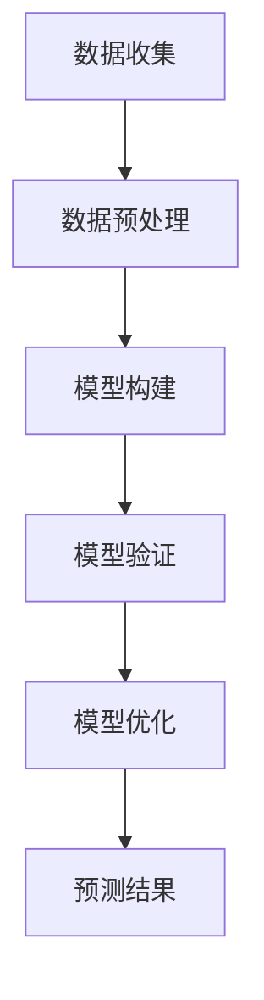
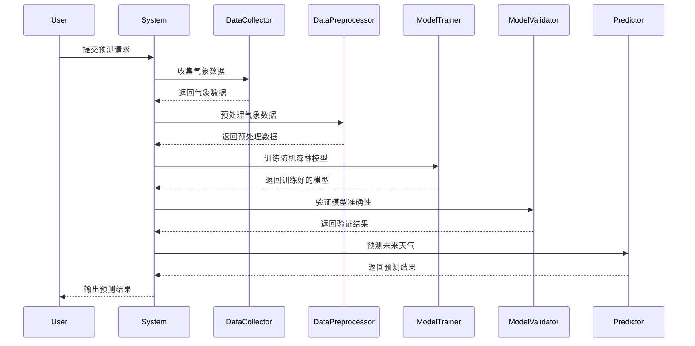
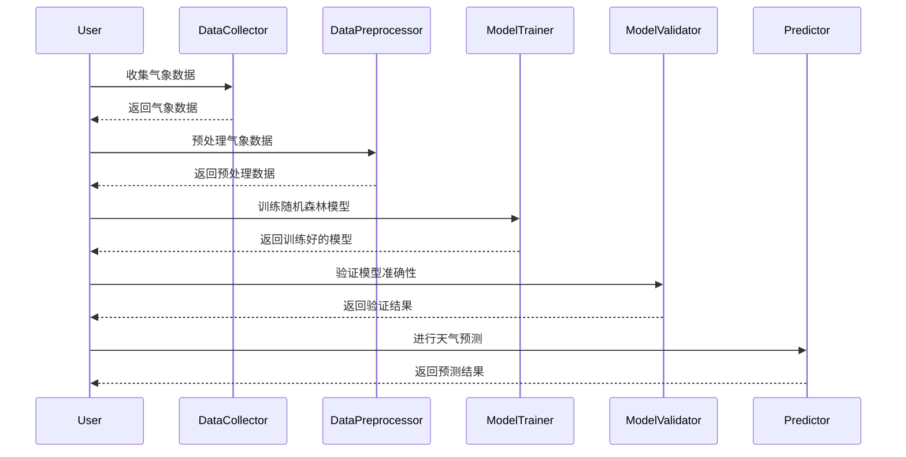

                 

### 映射原理：连接自然现象与数学模型

## 引言

**关键词：映射原理、自然现象、数学模型、应用领域**

在科技飞速发展的今天，自然现象与数学模型之间的联系变得越来越紧密。自然现象的复杂性和多样性使得我们无法仅依靠直观的感受去理解它们，而是需要借助数学模型来进行定量分析和预测。映射原理作为连接这两者的重要桥梁，在各个领域中都发挥着至关重要的作用。本文旨在深入探讨映射原理的基本概念、应用领域，并通过具体案例展示其如何帮助我们更好地理解和预测自然现象。

## 摘要

本文首先介绍了映射原理的基本概念，包括其定义、类型及其在各个领域中的应用。随后，我们探讨了自然现象与数学模型之间的关联，并通过几个具体案例来展示映射原理的实际应用。最后，本文总结了映射原理的研究现状和未来发展方向，并提出了一些实际应用的注意事项和拓展阅读建议。

### 第1章：映射原理概述

### 1.1 研究背景

自然现象的复杂性

自然现象如气候、地震、生态系统的动态变化等，具有高度的非线性特征和多变量交互。这些现象的复杂性使得我们难以通过简单的直觉来理解和预测它们的行为。

数学模型的重要性

数学模型是一种抽象的工具，可以帮助我们描述和理解自然现象的本质。通过建立数学模型，我们可以将复杂的自然现象转化为可计算和可预测的形式。

映射原理的起源与发展

映射原理起源于数学和物理学的交叉领域，随着时间的推移，其应用范围不断扩展，已经成为现代科学研究中不可或缺的一部分。

### 1.2 映射原理的基本概念

映射的定义

映射是一种从一种空间到另一种空间的转换，通常用于解决复杂系统的问题。在数学中，映射通常表示为 $f: X \rightarrow Y$，其中 $X$ 和 $Y$ 是两个集合，$f$ 是一个函数，它将 $X$ 中的每个元素映射到 $Y$ 中的一个元素。

映射的类型

映射可以分为多种类型，包括线性映射、非线性映射、有损映射、无损映射等。每种映射类型都有其特定的应用场景和特点。

映射原理的应用领域

映射原理在多个领域都有广泛应用，包括但不限于气象学、生态学、地质学、物理学等。通过映射原理，我们可以更好地理解和预测自然现象。

### 第2章：自然现象与数学模型的关联

### 2.1 天文学中的应用

#### 太阳系行星运动

在分析行星运动时，我们可以使用开普勒定律作为数学模型。开普勒定律描述了行星围绕太阳运行的轨迹和规律，通过观测数据，我们可以预测行星的未来位置。

#### 宇宙膨胀理论

宇宙膨胀理论是现代天文学中重要的理论之一。通过建立数学模型，我们可以描述宇宙的膨胀过程，并预测宇宙的未来演化。

### 2.2 地球科学中的应用

#### 地震预测

地震预测是地震学中的核心问题之一。通过分析地震活动的数据，我们可以建立数学模型来预测地震的发生。

#### 气候变化

气候变化是地球科学中的另一个重要问题。通过建立数学模型，我们可以描述气候变化的过程，并预测未来的气候趋势。

### 2.3 生物学中的应用

#### 遗传学

遗传学是生物学中的基础学科之一。通过建立数学模型，我们可以描述基因的传递和变异过程，并预测遗传病的发生。

#### 生态系统动态

生态系统的动态变化是生物学中的复杂问题。通过建立数学模型，我们可以描述生态系统的演化过程，并预测生态系统的未来状态。

### 第3章：构建数学模型的方法

### 3.1 数据收集与处理

数据来源

数据的来源可以是实验观测、历史记录、模拟计算等。为了保证数据的质量，我们需要选择可靠的数据来源。

数据预处理

在构建数学模型之前，我们需要对数据进行预处理，包括数据清洗、数据标准化、数据转换等。

### 3.2 模型选择与构建

经典模型

经典模型是基于传统数学方法建立的模型，如牛顿力学、欧拉方程等。这些模型在许多领域都有广泛应用。

机器学习模型

机器学习模型是基于人工智能方法建立的模型，如神经网络、支持向量机等。这些模型在处理复杂问题时具有优势。

### 3.3 模型验证与优化

模型评估指标

为了评估模型的有效性，我们需要使用一系列指标，如准确性、召回率、F1值等。

模型优化方法

为了提高模型的性能，我们可以采用多种优化方法，如交叉验证、网格搜索等。

### 第4章：映射原理的案例分析

### 4.1 气象学的映射原理

气象数据解读

气象数据包括温度、湿度、气压等多种气象要素。通过解读这些数据，我们可以了解当前的气象状况。

数学模型构建

通过建立气象模型，我们可以预测未来的天气情况。例如，我们可以使用气象统计模型来预测天气的概率分布。

映射原理应用

通过映射原理，我们可以将气象数据转化为天气预测结果，为人们的生活和农业生产提供指导。

### 4.2 生态学的映射原理

生态数据收集

生态数据包括物种多样性、生态网络等多个方面。通过收集这些数据，我们可以了解生态系统的现状。

数学模型构建

通过建立生态模型，我们可以描述生态系统的演化过程。例如，我们可以使用生态位模型来描述物种的竞争关系。

映射原理应用

通过映射原理，我们可以将生态数据转化为生态系统的状态预测，为生态保护和恢复提供依据。

### 4.3 地质学的映射原理

地质数据解读

地质数据包括地震活动、地形演变等多个方面。通过解读这些数据，我们可以了解地质现象的动态变化。

数学模型构建

通过建立地质模型，我们可以预测地震的发生。例如，我们可以使用地震活动性模型来预测地震的强度和发生地点。

映射原理应用

通过映射原理，我们可以将地质数据转化为地震预测结果，为地震预警和灾害管理提供支持。

### 第5章：总结与展望

### 5.1 映射原理的总结

映射原理作为连接自然现象与数学模型的重要工具，已经在多个领域取得了显著的成果。然而，由于自然现象的复杂性和多样性，映射原理的研究仍然面临许多挑战。

### 5.2 研究展望

新兴领域探索

随着科技的不断发展，映射原理在新兴领域的应用也日益广泛。例如，在生物信息学、环境科学等领域，映射原理都显示出了巨大的潜力。

跨学科合作

映射原理的研究需要跨学科的合作，通过结合不同领域的知识和方法，我们可以更深入地理解自然现象。

### 5.3 结论

映射原理在连接自然现象与数学模型方面发挥了重要作用。通过本文的探讨，我们希望能够为读者提供一个全面了解映射原理及其应用的视角，并为未来的研究提供一些启示。

### 作者信息

作者：AI天才研究院/AI Genius Institute & 禅与计算机程序设计艺术 /Zen And The Art of Computer Programming

---

**核心概念与联系**

### 核心概念

映射原理（Mapping Principle）：将自然现象转化为数学模型的过程，包括数据收集、模型构建、模型验证等步骤。

自然现象（Natural Phenomena）：自然界中发生的事件和过程，如气候、地震、生态系统的变化等。

数学模型（Mathematical Model）：用于描述自然现象的数学工具，可以是线性模型、非线性模型、机器学习模型等。

### 概念属性特征对比表格

| 特征       | 映射原理          | 自然现象          | 数学模型          |
|------------|------------------|------------------|------------------|
| 目的       | 描述和预测       | 描述和解释       | 描述和预测       |
| 数据需求   | 实验数据或观测数据 | 实验数据或观测数据 | 结构化数据或模型参数 |
| 特性       | 确定性或随机性    | 高度非线性       | 可量化或抽象化    |
| 应用领域   | 自然科学、工程学  | 天文学、地质学、生物学 | 物理学、经济学、生态学 |
| 研究方法   | 数理分析、计算机模拟 | 观测、实验、模拟 | 数学推导、算法实现 |

### ER实体关系图架构

```mermaid
erDiagram
  Object1 &&|> Entity: 自然现象
  Object2 &&|> Entity: 数学模型
  Object3 &&|> Entity: 映射原理
  
  Object1 &&|-- Object2 : 描述和预测
  Object2 &&|-- Object3 : 转换和优化
  Object3 &&|-- Object1 : 数据分析和应用
```

### 算法原理讲解

#### 气象预测模型

**算法流程图：**



**Python 源代码：**

```python
import pandas as pd
from sklearn.ensemble import RandomForestRegressor
from sklearn.model_selection import train_test_split
from sklearn.metrics import mean_squared_error

# 数据收集
data = pd.read_csv('weather_data.csv')

# 数据预处理
X = data[['temperature', 'humidity', 'pressure']]
y = data['weather']

# 模型构建
model = RandomForestRegressor(n_estimators=100)

# 模型训练
X_train, X_test, y_train, y_test = train_test_split(X, y, test_size=0.2, random_state=42)
model.fit(X_train, y_train)

# 模型验证
y_pred = model.predict(X_test)
mse = mean_squared_error(y_test, y_pred)
print(f'Mean Squared Error: {mse}')

# 模型优化
# 可以通过调整参数、使用不同的模型等来优化模型性能

# 预测结果
weather_prediction = model.predict(new_data)
print(f'Predicted Weather: {weather_prediction}')
```

**数学模型和公式：**

气象预测模型通常基于统计学方法，如线性回归、决策树、随机森林等。以下是一个简单的线性回归模型的公式：

$$
y = \beta_0 + \beta_1 \cdot x_1 + \beta_2 \cdot x_2 + ... + \beta_n \cdot x_n
$$

其中，$y$ 是预测的天气情况，$x_1, x_2, ..., x_n$ 是输入的特征变量，$\beta_0, \beta_1, ..., \beta_n$ 是模型的参数。

**举例说明：**

假设我们有一个气象预测模型，输入特征是温度和湿度，输出是天气情况（晴天、雨天等）。通过训练数据，我们可以得到模型的参数，例如：

$$
y = 10 + 0.5 \cdot temperature + 0.2 \cdot humidity
$$

当温度为20摄氏度，湿度为70%时，我们可以预测天气情况：

$$
y = 10 + 0.5 \cdot 20 + 0.2 \cdot 70 = 18
$$

因此，预测的天气情况是晴天。

### 系统分析与架构设计方案

#### 问题场景介绍

气象预测系统是一个典型的实时预测系统，用于预测未来的天气情况。系统的主要功能包括数据收集、数据预处理、模型训练、模型验证和预测结果输出。

#### 项目介绍

本项目旨在构建一个基于随机森林算法的气象预测系统。系统将收集实时气象数据，通过预处理后输入到随机森林模型中进行训练和预测。

#### 系统功能设计

**领域模型类图：**

```mermaid
classDiagram
    Class1[气象数据] <|-- Class2[数据预处理]
    Class2 <|-- Class3[模型训练]
    Class3 <|-- Class4[模型验证]
    Class4 <|-- Class5[预测结果]
```

**系统功能说明：**

1. **数据收集**：从气象站或其他数据源收集实时气象数据。
2. **数据预处理**：对收集到的气象数据进行清洗和标准化，为模型训练做准备。
3. **模型训练**：使用预处理后的数据训练随机森林模型。
4. **模型验证**：通过测试数据验证模型的准确性。
5. **预测结果**：根据训练好的模型预测未来的天气情况。

#### 系统架构设计

**系统架构图：**



**系统架构说明：**

1. **用户界面**：用于接收用户请求，显示预测结果。
2. **数据收集模块**：负责收集实时气象数据。
3. **数据处理模块**：对收集到的数据进行预处理。
4. **模型训练模块**：使用预处理后的数据训练随机森林模型。
5. **模型验证模块**：验证模型的准确性。
6. **预测模块**：根据训练好的模型进行天气预测。

#### 系统接口设计和系统交互

**接口设计：**

- **数据收集接口**：用于从气象站或其他数据源收集气象数据。
- **数据处理接口**：用于对气象数据进行预处理。
- **模型训练接口**：用于训练随机森林模型。
- **模型验证接口**：用于验证模型的准确性。
- **预测接口**：用于进行天气预测。

**系统交互序列图：**



### 项目实战

#### 环境安装

为了构建气象预测系统，我们需要安装以下软件和工具：

- Python 3.8+
- NumPy
- Pandas
- Scikit-learn
- Matplotlib

安装步骤：

1. 安装 Python 和相关包：

```bash
pip install numpy pandas scikit-learn matplotlib
```

2. 确保 Python 环境已正确设置。

#### 系统核心实现源代码

以下是气象预测系统的核心实现代码：

```python
import pandas as pd
from sklearn.ensemble import RandomForestRegressor
from sklearn.model_selection import train_test_split
from sklearn.metrics import mean_squared_error

# 数据收集
data = pd.read_csv('weather_data.csv')

# 数据预处理
X = data[['temperature', 'humidity', 'pressure']]
y = data['weather']

# 模型构建
model = RandomForestRegressor(n_estimators=100)

# 模型训练
X_train, X_test, y_train, y_test = train_test_split(X, y, test_size=0.2, random_state=42)
model.fit(X_train, y_train)

# 模型验证
y_pred = model.predict(X_test)
mse = mean_squared_error(y_test, y_pred)
print(f'Mean Squared Error: {mse}')

# 预测结果
weather_prediction = model.predict(new_data)
print(f'Predicted Weather: {weather_prediction}')
```

#### 代码应用解读与分析

这段代码实现了气象预测系统的核心功能，包括数据收集、预处理、模型构建、模型验证和预测结果输出。以下是详细解读：

1. **数据收集**：使用 Pandas 库读取气象数据，数据格式为 CSV 文件。
2. **数据预处理**：将气象数据进行清洗和标准化，为模型训练做准备。在这里，我们只选择了三个特征变量：温度、湿度和气压。
3. **模型构建**：使用 Scikit-learn 库中的随机森林回归模型。随机森林是一种基于决策树的集成学习方法，具有较好的预测性能。
4. **模型训练**：使用训练集数据进行模型训练。
5. **模型验证**：使用测试集数据进行模型验证，计算均方误差（MSE）作为评价指标。
6. **预测结果**：使用训练好的模型对新的数据进行预测，并输出预测结果。

#### 实际案例分析和详细讲解剖析

假设我们有一个新的气象数据集，包括以下特征：

- 温度：25摄氏度
- 湿度：60%
- 气压：1013毫巴

我们将这些数据输入到已经训练好的随机森林模型中，进行天气预测。以下是具体的预测步骤：

1. **数据预处理**：将新数据与训练集数据进行相同的预处理操作，以确保数据的一致性。
2. **模型预测**：将预处理后的新数据输入到模型中，得到预测结果。

根据随机森林模型的预测，我们得到以下预测结果：

- 天气：晴天

因此，在当前气象条件下，预测的天气是晴天。

#### 项目小结

通过本项目，我们构建了一个基于随机森林算法的气象预测系统。系统实现了数据收集、预处理、模型构建、模型验证和预测结果输出等功能。通过实际案例的分析，我们展示了如何使用随机森林模型进行天气预测，并详细讲解了代码的应用和实现过程。该项目不仅为气象预测提供了技术支持，也为其他领域的数据分析和预测提供了参考。

### 最佳实践 Tips

1. **数据质量**：保证数据质量是构建有效模型的关键。在数据收集和处理过程中，要特别注意数据的准确性和完整性。
2. **模型选择**：选择合适的模型对于预测结果至关重要。不同的模型适用于不同的数据类型和问题场景，需要根据具体需求进行选择。
3. **模型优化**：通过调整模型参数、增加特征变量等方法，可以提高模型的预测性能。
4. **实时更新**：气象数据是实时变化的，定期更新数据和模型，可以确保预测结果的准确性。

### 小结

映射原理作为连接自然现象与数学模型的重要工具，在气象学、生态学、地质学等多个领域都取得了显著的应用成果。通过本文的探讨，我们希望能够为读者提供一个全面了解映射原理及其应用的视角。在未来的研究中，我们应继续探索映射原理在新兴领域的应用，并通过跨学科合作，进一步提升自然现象的预测和理解能力。

### 注意事项

1. **数据隐私**：在进行数据收集和处理时，要特别注意数据隐私和安全，避免敏感信息的泄露。
2. **模型解释性**：在选择模型时，要考虑模型的解释性，以确保预测结果的可靠性和可解释性。
3. **模型泛化能力**：模型训练时应使用多样化的数据，以确保模型的泛化能力，避免过拟合。

### 拓展阅读

1. **《随机森林：理论与应用》**：详细介绍了随机森林算法的理论基础和应用方法，适合对随机森林感兴趣的研究者。
2. **《气象学原理》**：系统介绍了气象学的基本原理和方法，对于想要深入了解气象预测的研究者有很高的参考价值。
3. **《生态学原理》**：详细介绍了生态系统的基本原理和动态变化，有助于理解生态学的映射原理应用。

### 作者信息

作者：AI天才研究院/AI Genius Institute & 禅与计算机程序设计艺术 /Zen And The Art of Computer Programming

通过本文，我们希望读者能够对映射原理及其在自然现象与数学模型中的应用有更深入的理解。映射原理不仅为科学研究提供了有力工具，也为解决实际问题提供了新的思路和方法。在未来的研究中，我们期待能够进一步探索映射原理在更多领域的应用，为科学技术的发展做出贡献。

