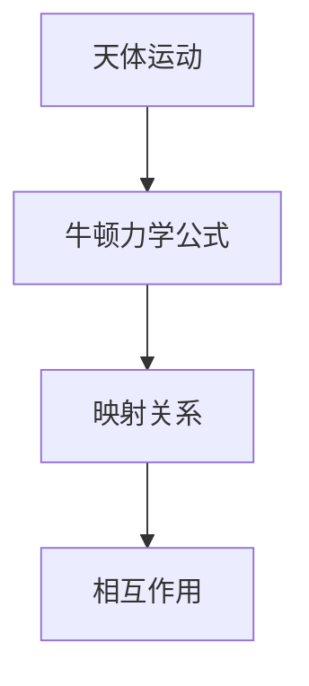
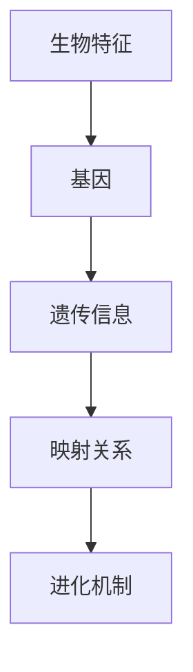
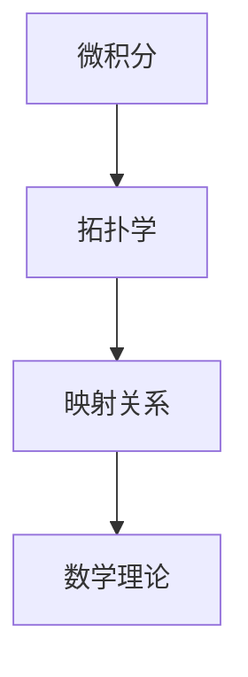

                 

# 映射思维：理解自然与数学的共性

## 关键词
自然现象、数学理论、映射关系、映射思维、相似性、共性

## 摘要
本文深入探讨了映射思维在理解自然与数学共性方面的作用。通过定义映射思维的核心概念，分析自然现象和数学理论的属性特征，本文揭示了映射关系在揭示两者相似性和共性中的关键作用。此外，本文通过具体实例展示了映射思维在物理学、生物学和数学领域的应用，进一步强调了其在科学研究和技术创新中的重要性。

## 背景介绍

### 1.1 问题背景

在现代科学研究中，自然现象和数学理论相互交织，形成了一个复杂的知识网络。自然现象如天体运动、生物进化、物质变化等，充满了不确定性和复杂性。而数学理论则以其精确性和逻辑性，为描述和解释这些自然现象提供了强有力的工具。然而，如何将这些看似独立的领域联系起来，揭示它们之间的共性和联系，一直是科学界关注的问题。

映射思维作为一种理解自然与数学共性的方法论，提供了新的视角和工具。通过建立不同领域之间的映射关系，映射思维能够揭示自然现象与数学理论之间的相似性和共性，从而为科学研究和技术创新提供新的思路和方法。

### 1.2 问题描述

映射思维，是指通过建立不同领域之间的映射关系，从而揭示它们之间相似性和共性的思维方式。在自然现象和数学理论的背景下，映射思维的应用面临以下几个问题：

1. **如何建立有效的映射关系？**
   映射关系的建立需要深入理解自然现象和数学理论的本质和特征，找到它们之间的对应关系。

2. **映射关系的稳定性如何保证？**
   在建立映射关系后，需要验证这种关系在不同情境下的稳定性和适用性。

3. **映射结果的解释和利用？**
   映射结果提供了新的理解和认识，但如何将这些结果应用于实际问题和领域，仍是一个挑战。

### 1.3 问题解决

要解决这个问题，我们可以采取以下步骤：

1. **深入研究和理解自然现象和数学理论。**
   这包括对自然现象的观测和实验，以及对数学理论的推导和应用。

2. **建立映射关系。**
   通过对比分析，找到自然现象和数学理论之间的对应关系，建立映射关系。

3. **验证映射关系的稳定性和适用性。**
   通过实验和案例分析，验证映射关系在不同情境下的稳定性和适用性。

4. **解释和利用映射结果。**
   将映射结果应用于实际问题，解释其意义和作用，并探索其在技术创新中的应用潜力。

### 1.4 边界与外延

映射思维的边界主要涉及自然现象、数学理论和映射关系的研究。其外延包括但不限于物理学、化学、生物学、数学等学科。在更广泛的领域，如经济学、社会学、心理学等，映射思维也可以提供新的视角和方法。

### 1.5 概念结构与核心要素组成

映射思维的核心概念包括映射关系、自然现象、数学理论。其中，映射关系是映射思维的核心，自然现象和数学理论则是映射思维的基础。

#### 表1.1 映射关系的属性特征对比

| 属性特征 | 映射类型1 | 映射类型2 |
| --- | --- | --- |
| 直接性 | 是 | 否 |
| 独立性 | 是 | 否 |
| 广泛性 | 是 | 否 |
| 深度 | 深度有限 | 深度不限 |

### 1.6 核心概念与联系

#### 1.6.1 映射关系

映射关系是指将一个领域的概念、现象或结构映射到另一个领域的过程。这种映射可以是直接的，也可以是间接的，通过中间环节来实现。

映射关系的核心特征包括：

- **直接性**：直接映射关系是指直接将一个领域的概念、现象或结构映射到另一个领域，而不需要中间环节。例如，将生物学的遗传信息直接映射到计算机科学中的二进制编码。
- **独立性**：映射关系具有独立性，即映射前后的领域可以独立存在，不依赖于对方。例如，数学理论中的几何学可以独立于物理学中的天体运动存在。
- **广泛性**：映射关系具有广泛性，可以应用于不同领域之间。例如，生物学中的进化理论可以映射到社会学中的社会演化。
- **深度**：映射关系的深度可以有限，也可以不限。有限深度映射通常是指在一定范围内建立映射关系，而不涉及更深层次的结构和机制。例如，将化学中的分子结构映射到物理学中的量子力学。而不限深度映射则是指可以不断深入挖掘映射关系背后的原理和机制。

#### 表1.2 映射关系的属性特征对比

| 属性特征 | 映射类型1 | 映射类型2 |
| --- | --- | --- |
| 直接性 | 是 | 否 |
| 独立性 | 是 | 否 |
| 广泛性 | 是 | 否 |
| 深度 | 深度有限 | 深度不限 |

#### 1.6.2 自然现象

自然现象是指自然界中发生的各种现象，如天体运动、生物进化、物质变化等。自然现象具有以下属性特征：

- **规则性**：自然现象通常具有一定的规律性，如天体运动的轨迹、生物进化的演化路径。
- **周期性**：许多自然现象呈现出周期性变化，如地球的昼夜交替、生物的繁殖周期。
- **变异性**：自然现象在演化过程中存在变异性，如生物的遗传变异、环境的气候变化。

#### 表1.3 自然现象的属性特征对比

| 现象类型 | 特征 |
| --- | --- |
| 天体运动 | 规则性、周期性 |
| 生物进化 | 变异性、适应性 |
| 物质变化 | 状态变化、化学反应 |

#### 1.6.3 数学理论

数学理论是指数学领域的基本概念、原理和理论体系。数学理论具有以下属性特征：

- **精确性**：数学理论以精确的符号和语言描述概念和原理，如欧几里得几何中的定义和定理。
- **逻辑性**：数学理论以严密的逻辑推导为基础，如微积分中的极限概念和微分法则。
- **抽象性**：数学理论具有高度的抽象性，可以从具体现象中抽象出普遍规律，如群论中的抽象群结构。

#### 表1.4 数学理论的属性特征对比

| 理论类型 | 特征 |
| --- | --- |
| 几何学 | 空间结构、形状关系 |
| 代数学 | 数的关系、运算规则 |
| 微积分 | 变化率、极限概念 |

### 1.7 映射思维的应用实例

为了更好地理解映射思维，以下给出几个应用实例：

#### 1.7.1 物理学中的映射思维

物理学中的许多现象可以通过数学理论来描述。例如，天体运动可以通过牛顿力学来描述，其核心是建立天体之间的映射关系，从而揭示它们之间的相互作用。

- **实例1.1：牛顿力学映射思维**



#### 1.7.2 生物学中的映射思维

生物学中的进化现象可以通过遗传学来描述。遗传学通过建立基因与生物特征之间的映射关系，揭示了生物进化的内在机制。

- **实例1.2：遗传学映射思维**



#### 1.7.3 数学中的映射思维

数学中的许多理论可以通过其他数学领域来描述。例如，微积分可以通过拓扑学来描述，其核心是建立微积分与拓扑学之间的映射关系。

- **实例1.3：微积分映射思维**



通过以上实例，我们可以看到映射思维在揭示自然现象与数学理论之间的共性方面具有重要意义。

## 映射思维概述

### 1.8 映射思维的定义

映射思维是一种基于映射关系的思考方式，它通过将一个领域的概念、现象或结构映射到另一个领域，从而揭示它们之间的相似性和共性。映射思维的核心在于建立不同领域之间的映射关系，并利用这种关系来深化对自然现象和数学理论的理解。

### 1.8.1 映射思维的核心概念

映射思维的核心概念包括映射关系、映射对象和映射结果。

1. **映射关系**：映射关系是指将一个领域的概念、现象或结构映射到另一个领域的过程。这种映射可以是直接的，也可以是间接的，通过中间环节来实现。

2. **映射对象**：映射对象是指被映射的领域，可以是自然现象，也可以是数学理论。映射对象的选择取决于研究的目的和需求。

3. **映射结果**：映射结果是指映射后得到的新的理解和认识。映射结果可以是新的理论模型，也可以是新的应用方法。

### 1.8.2 映射思维的特点

映射思维具有以下特点：

1. **灵活性**：映射思维可以灵活地应用于不同领域之间，不受领域限制。

2. **创新性**：映射思维通过揭示不同领域之间的共性，可以激发新的科学发现和技术创新。

3. **综合性**：映射思维可以整合不同领域的知识，提供更全面的理解和认识。

4. **系统性**：映射思维注重系统性和整体性，通过建立不同领域之间的映射关系，揭示它们之间的内在联系。

### 1.8.3 映射思维的应用场景

映射思维广泛应用于以下场景：

1. **科学研究**：映射思维可以帮助科学家揭示自然现象与数学理论之间的共性，推动科学研究的深入。

2. **技术创新**：映射思维可以促进技术创新，通过揭示不同领域之间的映射关系，开发新的技术和应用。

3. **工程实践**：映射思维可以应用于工程实践，通过建立自然现象和数学理论之间的映射关系，优化工程设计。

4. **教育学习**：映射思维可以帮助学生更好地理解和掌握不同领域的知识，提高学习效果。

### 1.8.4 映射思维的优势与挑战

映射思维的优势包括：

1. **提高理解和认识**：映射思维可以帮助我们更好地理解自然现象和数学理论，提高我们的认识水平。

2. **促进跨学科研究**：映射思维可以促进不同学科之间的交叉研究，推动科学进步。

3. **激发创新思维**：映射思维可以激发新的科学发现和技术创新。

映射思维面临的挑战包括：

1. **映射关系建立**：建立有效的映射关系需要深入理解自然现象和数学理论的本质和特征，这是映射思维应用的关键。

2. **映射结果解释**：映射结果需要通过实验和实际应用来验证和解释，这是映射思维应用的关键步骤。

3. **映射思维推广**：映射思维需要在不同领域和场景中得到广泛应用，这需要不断地探索和验证。

### 1.8.5 映射思维的未来发展趋势

映射思维的未来发展趋势包括：

1. **跨学科整合**：随着学科之间的交叉融合，映射思维将在更广泛的领域得到应用。

2. **人工智能结合**：人工智能技术将为映射思维提供新的工具和方法，实现更高效、更精准的映射关系建立。

3. **实际应用拓展**：映射思维将在更多的实际应用场景中得到验证和推广，推动科学技术的进步。

4. **教育改革**：映射思维将融入教育体系，帮助学生培养跨学科思维能力和创新能力。

## 映射思维在自然科学中的应用

映射思维在自然科学中的应用广泛而深入，通过建立自然现象与数学理论之间的映射关系，科学家们能够更深入地理解自然界的运作规律。以下我们将探讨映射思维在物理学、生物学和化学等领域的具体应用实例。

### 2.1 物理学中的映射思维

物理学是映射思维应用最为广泛的领域之一。经典物理学中的许多理论都可以通过数学模型来描述，而这些模型的核心就是映射关系。

#### 2.1.1 牛顿力学与映射思维

牛顿力学是物理学中最基本的力学理论，它通过描述物体间的相互作用和运动规律，建立了经典力学的基础。牛顿力学中的核心概念如力和运动，可以通过数学方程来精确描述。

- **实例：牛顿第二定律**

牛顿第二定律表述为 \( F = ma \)，其中 \( F \) 是作用力，\( m \) 是质量，\( a \) 是加速度。这个定律可以通过数学模型来建立映射关系，将力与加速度映射到质量上。

  $$ F = ma $$
  
  通过这个映射关系，我们可以将物理现象（力）与数学概念（加速度和质量）联系起来，深入理解物体运动的基本规律。

#### 2.1.2 量子力学与映射思维

量子力学是描述微观粒子的运动和相互作用的理论，它与经典物理学有很大的不同。量子力学的许多概念，如波函数、量子态等，都需要通过映射思维来理解。

- **实例：波粒二象性**

在量子力学中，粒子（如电子）既表现出粒子性，也表现出波动性。这种波粒二象性可以通过波函数来描述。

  $$ \Psi(x,t) = \int \psi(k) e^{ikx} dk $$
  
  这个波函数表达式通过映射关系，将粒子的波动性质（波函数）与经典物理中的波动（\( e^{ikx} \)）联系起来，揭示了微观粒子的独特行为。

### 2.2 生物学中的映射思维

生物学是研究生命现象和生物体结构的科学，映射思维在生物学中的应用主要体现在通过数学模型来描述生物过程和演化。

#### 2.2.1 遗传学与映射思维

遗传学是研究遗传信息的传递和表达的学科。遗传学中的许多理论，如孟德尔的遗传规律、DNA序列的编码等，都可以通过映射思维来理解。

- **实例：孟德尔的遗传规律**

孟德尔的遗传规律包括分离规律和独立规律，这些规律可以通过基因的映射关系来解释。

  $$ \text{基因型} \rightarrow \text{表型} $$
  
  这个映射关系将基因型（遗传信息）映射到表型（生物体的外部特征）上，揭示了遗传信息如何影响生物体的表现。

#### 2.2.2 进化论与映射思维

进化论是研究生物进化过程的理论，它通过描述物种的适应和演化来解释生物多样性。进化论中的许多概念，如自然选择、遗传漂变等，都可以通过映射思维来理解。

- **实例：自然选择**

自然选择是生物进化的关键机制，它通过选择适应环境的个体，从而影响物种的遗传结构。

  $$ \text{环境选择} \rightarrow \text{适应性} \rightarrow \text{遗传结构} $$
  
  这个映射关系将环境选择（外部因素）映射到适应性（生物特征）和遗传结构上，揭示了生物进化的内在规律。

### 2.3 化学中的映射思维

化学是研究物质的组成、性质和变化的学科，映射思维在化学中的应用主要体现在通过数学模型来描述化学反应和分子结构。

#### 2.3.1 化学反应与映射思维

化学反应是化学研究的重要内容，它通过描述反应物和生成物之间的转化关系来解释物质的变化。

- **实例：化学反应方程式**

化学反应方程式通过映射关系，将反应物和生成物的化学性质（分子式）联系起来，描述了化学反应的本质。

  $$ \text{A} + \text{B} \rightarrow \text{C} + \text{D} $$
  
  这个映射关系将反应物和生成物的分子结构映射到化学反应上，揭示了化学反应的内在规律。

#### 2.3.2 分子结构与映射思维

分子结构是化学研究的基础，它通过描述分子的几何形状和电子分布来解释分子的性质。

- **实例：分子轨道理论**

分子轨道理论通过映射关系，将分子的电子分布与分子的性质联系起来，提供了对分子结构的深入理解。

  $$ \text{电子分布} \rightarrow \text{分子轨道} \rightarrow \text{分子性质} $$
  
  这个映射关系将电子分布（电子云模型）映射到分子轨道上，再映射到分子的性质上，揭示了分子结构对分子性质的影响。

### 2.4 映射思维在科学发现中的重要作用

映射思维在科学发现中扮演着关键角色，它通过揭示不同领域之间的共性，促进了科学知识的积累和突破。

#### 2.4.1 新理论的发现

通过映射思维，科学家可以发现新的理论。例如，量子力学的发现就是通过将经典物理的概念映射到微观领域，揭示了一种全新的物理现象。

#### 2.4.2 跨学科研究

映射思维促进了跨学科研究，通过建立不同领域之间的映射关系，科学家可以跨越学科界限，发现新的科学问题。

#### 2.4.3 技术创新

映射思维在技术创新中发挥着重要作用。通过映射思维，科学家可以发现新的应用领域，推动技术的进步。

总之，映射思维在自然科学中的应用体现了其对科学发现和技术创新的巨大推动力，它为我们提供了理解和解释自然现象的新视角和新方法。

## 映射思维在数学理论中的应用

映射思维不仅广泛应用于自然科学中，在数学理论的研究和证明中也发挥着重要作用。通过建立不同数学概念之间的映射关系，数学家们能够更深入地理解数学结构的内在联系，发现新的数学定理，并推动数学理论的发展。以下，我们将探讨映射思维在数学理论中的应用，并通过具体的例子来说明其重要性。

### 3.1 数学理论中的映射关系

在数学理论中，映射关系通常指的是将一个数学结构映射到另一个数学结构的过程。这种映射可以是函数映射，也可以是更复杂的结构映射。映射关系的核心在于揭示不同数学结构之间的相似性和共性。

#### 3.1.1 函数映射

函数映射是映射思维在数学中最常见的应用之一。函数映射将一个集合中的每个元素映射到另一个集合中的唯一元素。函数映射在分析、拓扑学和代数学中都有着广泛的应用。

- **实例：连续函数的映射**

在分析学中，连续函数的映射关系被用来研究函数的性质。例如，连续函数的极限、导数和积分等概念都可以通过映射关系来理解。

  $$ f(x) \rightarrow \lim_{x \to a} f(x) $$
  
  这个映射关系将函数 \( f(x) \) 的值域映射到极限值上，揭示了函数在特定点 \( x = a \) 处的变化趋势。

#### 3.1.2 群论中的映射

在群论中，映射关系被用来研究群的结构和性质。群论中的许多重要结论都是通过建立不同的群之间的映射关系来证明的。

- **实例：群同态映射**

群同态映射是将一个群的元素映射到另一个群中的元素，同时保持群运算的映射关系。群同态映射在研究群的结构和分类中起着重要作用。

  $$ \phi: G \rightarrow H $$
  
  其中，\( \phi \) 是一个群同态，它保持群运算，即对于任意 \( g, h \in G \)，有 \( \phi(gh) = \phi(g)\phi(h) \)。

#### 3.1.3 代数几何中的映射

在代数几何中，映射关系被用来研究代数结构和几何形状之间的关系。代数几何中的许多重要定理都是通过建立代数结构和几何形状之间的映射关系来证明的。

- **实例：解析映射**

解析映射是将代数结构（如代数曲线或代数表面）映射到几何形状（如平面或空间）的映射关系。这种映射关系在研究代数几何的几何性质和代数性质之间提供了重要的桥梁。

  $$ \varphi: \mathbb{A}^1 \rightarrow \mathbb{A}^2 $$
  
  其中，\( \varphi \) 是一个解析映射，它将一条代数曲线映射到一个平面上的几何形状。

### 3.2 映射思维在数学证明中的应用

映射思维在数学证明中起着至关重要的作用。通过建立映射关系，数学家们可以证明一些复杂的数学定理，甚至发现新的数学理论。

#### 3.2.1 等价映射

等价映射是映射思维在证明中的一个重要工具。通过建立两个数学结构之间的等价映射，可以证明它们具有相同的性质。

- **实例：函数的等价映射**

在函数分析中，可以通过建立两个函数之间的等价映射来证明它们的性质。例如，证明两个函数在某个区间内具有相同的积分性质。

  $$ f(x) \sim g(x) \quad \text{在区间} \quad [a, b] \quad \text{内} $$
  
  这个等价映射关系表明，函数 \( f(x) \) 和 \( g(x) \) 在区间 \( [a, b] \) 内具有相同的积分性质，从而简化了证明过程。

#### 3.2.2 同构映射

同构映射是映射思维在证明中的另一个重要工具。通过建立两个数学结构之间的同构映射，可以证明它们是等价的。

- **实例：群的同构映射**

在群论中，通过建立两个群的同构映射，可以证明它们是等价的。例如，证明两个群具有相同的结构，从而它们在群论性质上是等价的。

  $$ \phi: G \rightarrow H $$
  
  其中，\( \phi \) 是一个同构映射，它保持群的运算，即对于任意 \( g, h \in G \)，有 \( \phi(gh) = \phi(g)\phi(h) \)。

### 3.3 映射思维在数学理论发展中的作用

映射思维在数学理论的发展中起到了关键作用。通过揭示不同数学结构之间的映射关系，数学家们能够发现新的数学定理和理论，推动数学的发展。

#### 3.3.1 新定理的发现

通过映射思维，数学家们可以揭示不同数学结构之间的内在联系，从而发现新的数学定理。例如，拓扑学中的同伦理论就是通过映射思维揭示空间结构的新定理。

#### 3.3.2 新理论的构建

映射思维还可以用于构建新的数学理论。通过建立不同数学结构之间的映射关系，数学家们可以构建新的数学理论体系，如复分析、代数几何等。

#### 3.3.3 数学理论的整合

映射思维还可以帮助数学家整合不同数学理论。通过建立不同数学理论之间的映射关系，数学家们可以整合不同领域的知识，构建统一的数学理论框架。

总之，映射思维在数学理论中的应用不仅揭示了数学结构的内在联系，推动了数学的发展，还为数学家提供了强大的工具和方法，促进了数学理论的创新和进步。

## 映射思维在技术创新中的应用

映射思维不仅在科学研究和数学理论中发挥着重要作用，在技术创新中也具有广泛的应用。通过建立不同领域之间的映射关系，技术创新者能够发现新的解决方案，推动技术的进步。以下，我们将探讨映射思维在技术创新中的应用，并通过具体实例来展示其重要性。

### 4.1 映射思维在工程领域的应用

在工程领域，映射思维被广泛应用于解决复杂工程问题。通过建立自然现象与工程结构之间的映射关系，工程师们能够更有效地设计和优化工程系统。

#### 4.1.1 机械工程中的映射思维

机械工程中的许多设计问题可以通过映射思维来解决。例如，在飞机设计中，空气动力学原理与飞机结构之间的映射关系是至关重要的。

- **实例：空气动力学映射思维**

飞机的设计需要考虑空气动力学原理，通过映射思维，工程师可以将空气的流动特性映射到飞机的气动外形上。

  $$ \text{空气流动} \rightarrow \text{飞机外形} $$
  
  通过这种映射关系，工程师可以优化飞机的设计，提高飞行性能和安全性。

#### 4.1.2 电力工程中的映射思维

电力工程中的电力网络设计和优化也可以通过映射思维来实现。例如，通过映射电网结构与电力负荷之间的动态关系，工程师可以优化电网的供电能力和稳定性。

- **实例：电力网络映射思维**

电力网络的稳定性可以通过映射电网结构与电力负荷的动态关系来实现。

  $$ \text{电网结构} \rightarrow \text{电力负荷} \rightarrow \text{供电稳定性} $$
  
  通过这种映射关系，工程师可以设计出更加稳定和高效的电力网络。

### 4.2 映射思维在信息技术领域的应用

信息技术领域是映射思维应用的重要领域。通过建立不同技术和系统之间的映射关系，信息工程师能够开发出更加高效、可靠的系统。

#### 4.2.1 计算机网络中的映射思维

计算机网络中的许多问题可以通过映射思维来解决。例如，通过映射网络拓扑结构与数据传输需求之间的动态关系，工程师可以优化网络的设计和性能。

- **实例：计算机网络映射思维**

计算机网络的设计可以通过映射网络拓扑结构与数据传输需求来实现。

  $$ \text{网络拓扑} \rightarrow \text{数据传输需求} \rightarrow \text{网络性能} $$
  
  通过这种映射关系，工程师可以优化网络结构，提高数据传输效率和网络稳定性。

#### 4.2.2 人工智能中的映射思维

人工智能领域中的许多问题也可以通过映射思维来解决。例如，通过映射数据结构与算法之间的动态关系，工程师可以开发出更高效的人工智能算法。

- **实例：人工智能映射思维**

人工智能算法的设计可以通过映射数据结构与算法实现之间的动态关系来实现。

  $$ \text{数据结构} \rightarrow \text{算法实现} \rightarrow \text{算法性能} $$
  
  通过这种映射关系，工程师可以优化算法设计，提高人工智能系统的效率和准确性。

### 4.3 映射思维在生物技术领域的应用

生物技术领域是映射思维应用的前沿领域。通过建立生物现象与生物技术产品之间的映射关系，生物技术专家可以开发出更先进的治疗方法和诊断工具。

#### 4.3.1 生物医学中的映射思维

在生物医学领域，映射思维被用来研究疾病机制和开发治疗药物。通过映射生物现象与药物作用机制之间的动态关系，科学家可以设计出更有效的药物。

- **实例：生物医学映射思维**

生物医学研究可以通过映射生物现象与药物作用机制来实现。

  $$ \text{生物现象} \rightarrow \text{药物作用机制} \rightarrow \text{治疗效果} $$
  
  通过这种映射关系，科学家可以设计出针对特定疾病的药物，提高治疗效果。

#### 4.3.2 基因编辑技术中的映射思维

基因编辑技术如CRISPR-Cas9是近年来生物技术领域的重要突破。通过映射基因序列与基因编辑工具之间的动态关系，科学家可以精确地编辑基因。

- **实例：基因编辑映射思维**

基因编辑技术可以通过映射基因序列与基因编辑工具之间的动态关系来实现。

  $$ \text{基因序列} \rightarrow \text{基因编辑工具} \rightarrow \text{基因编辑结果} $$
  
  通过这种映射关系，科学家可以精确地编辑基因，治疗遗传疾病。

### 4.4 映射思维在创新设计中的应用

映射思维在创新设计中具有广泛的应用，通过建立不同设计要素之间的映射关系，设计师可以创造出更创新、更符合用户需求的产品。

#### 4.4.1 产品设计中的映射思维

在产品设计过程中，映射思维被用来分析用户需求与产品功能之间的映射关系，从而设计出更符合用户需求的产品。

- **实例：产品设计映射思维**

产品设计的优化可以通过映射用户需求与产品功能之间的动态关系来实现。

  $$ \text{用户需求} \rightarrow \text{产品功能} \rightarrow \text{产品性能} $$
  
  通过这种映射关系，设计师可以优化产品功能，提高产品性能，满足用户需求。

#### 4.4.2 服务设计中的映射思维

服务设计中的映射思维同样重要，通过建立服务要素与服务目标之间的映射关系，设计师可以设计出更高效、更优质的服务。

- **实例：服务设计映射思维**

服务设计的优化可以通过映射服务要素与服务目标之间的动态关系来实现。

  $$ \text{服务要素} \rightarrow \text{服务目标} \rightarrow \text{服务体验} $$
  
  通过这种映射关系，设计师可以优化服务流程，提高服务体验，满足用户需求。

总之，映射思维在技术创新中的应用为工程师、设计师和科学家提供了强大的工具和方法，通过建立不同领域之间的映射关系，他们可以更有效地解决问题，推动技术的进步。

## 映射思维的教育意义

映射思维在教育和学习过程中具有深远的教育意义。它不仅帮助学生更好地理解和掌握不同学科的知识，还培养了学生的创新思维和问题解决能力。以下，我们将探讨映射思维在教育和学习中的应用，并分析其对学生的教育价值。

### 5.1 映射思维在学科教学中的应用

映射思维在学科教学中具有广泛的应用。通过建立不同学科之间的映射关系，教师可以更有效地传授知识，激发学生的学习兴趣和思维能力。

#### 5.1.1 跨学科教学

跨学科教学是映射思维在学科教学中的重要应用。通过建立不同学科之间的映射关系，教师可以将不同领域的知识整合起来，提供更全面的学习体验。

- **实例：物理与数学的跨学科教学**

在物理教学中，教师可以通过映射数学中的函数与物理中的运动规律来讲解物体运动。例如，通过映射位移、速度和加速度等物理量与数学中的函数关系，学生可以更直观地理解物体运动的基本概念。

  $$ \text{位移函数} \rightarrow \text{速度函数} \rightarrow \text{加速度函数} $$
  
  通过这种映射关系，学生可以更好地理解物理运动规律，培养数学思维和物理思维。

#### 5.1.2 综合性学习

综合性学习是映射思维在学科教学中的另一种应用。通过建立不同学科之间的映射关系，教师可以设计综合性学习活动，激发学生的综合能力和创新思维。

- **实例：生物与化学的综合学习**

在生物与化学的综合学习中，教师可以通过映射生物中的代谢过程与化学中的反应方程式来讲解生物代谢。例如，通过映射葡萄糖代谢的化学方程式，学生可以更深入地理解生物代谢过程。

  $$ \text{葡萄糖代谢} \rightarrow \text{代谢反应方程式} \rightarrow \text{生物代谢过程} $$
  
  通过这种映射关系，学生可以更好地理解生物学和化学的知识，培养跨学科的综合能力。

### 5.2 映射思维在学生思维培养中的应用

映射思维在学生思维培养中具有重要作用。它不仅帮助学生理解和掌握学科知识，还培养了学生的创新思维和问题解决能力。

#### 5.2.1 创新思维

映射思维能够激发学生的创新思维。通过建立不同领域之间的映射关系，学生可以从新的角度看待问题，发现问题的不同解决方案。

- **实例：科技竞赛中的映射思维**

在科技竞赛中，学生需要通过映射不同领域的知识来设计创新项目。例如，通过映射物理中的能量守恒原理与工程中的结构设计，学生可以设计出高效的太阳能充电装置。

  $$ \text{能量守恒} \rightarrow \text{结构设计} \rightarrow \text{太阳能充电装置} $$
  
  通过这种映射关系，学生可以创新性地解决问题，提高创新能力。

#### 5.2.2 问题解决能力

映射思维有助于培养学生的问题解决能力。通过建立映射关系，学生可以更系统地分析和解决复杂问题。

- **实例：数学竞赛中的映射思维**

在数学竞赛中，学生需要通过映射数学中的定理与实际问题来解决问题。例如，通过映射几何中的定理与实际问题中的路径优化问题，学生可以设计出高效的路径规划算法。

  $$ \text{几何定理} \rightarrow \text{路径优化问题} \rightarrow \text{路径规划算法} $$
  
  通过这种映射关系，学生可以更有效地解决问题，提高问题解决能力。

### 5.3 映射思维在学生个性化学习中的应用

映射思维在学生个性化学习中也具有重要意义。通过建立个性化映射关系，教师可以为学生提供更符合其兴趣和需求的学习内容和方法。

#### 5.3.1 个性化学习计划

个性化学习计划是映射思维在学生个性化学习中的重要应用。通过建立学生兴趣与学习内容之间的映射关系，教师可以设计出个性化的学习计划。

- **实例：学生个性化学习计划**

教师可以通过映射学生的兴趣领域与相应的学习内容，为学生设计个性化的学习计划。例如，如果学生对生物学感兴趣，教师可以设计包含生物学、化学和物理学知识的综合学习计划。

  $$ \text{学生兴趣} \rightarrow \text{学习内容} \rightarrow \text{个性化学习计划} $$
  
  通过这种映射关系，学生可以更专注于自己感兴趣的学习内容，提高学习效果。

#### 5.3.2 学习方法指导

个性化学习方法指导是映射思维在学生个性化学习中的另一种应用。通过建立学生认知特点与学习方法之间的映射关系，教师可以为学生提供更有效的方法指导。

- **实例：个性化学习方法指导**

教师可以通过映射学生的认知特点与相应的学习方法，为学生提供个性化的学习方法指导。例如，对于视觉学习者，教师可以推荐更多的图像和图表学习材料；对于听觉学习者，教师可以推荐更多的音频和视频学习资源。

  $$ \text{学生认知特点} \rightarrow \text{学习方法} \rightarrow \text{个性化学习方法指导} $$
  
  通过这种映射关系，学生可以更有效地吸收和掌握知识，提高学习效果。

总之，映射思维在教育和学习中的应用具有深远的教育意义。它不仅帮助学生更好地理解和掌握不同学科的知识，还培养了学生的创新思维和问题解决能力，促进了学生的全面发展。

## 映射思维的未来发展趋势

映射思维作为一种理解和解释自然现象与数学理论之间共性的方法论，其未来发展趋势将受到多方面因素的影响。随着科技的进步、学科交叉融合以及人工智能的发展，映射思维将在更广泛的领域中得到应用，并展现出巨大的潜力。

### 6.1 科技进步对映射思维的影响

科技进步为映射思维的发展提供了新的工具和平台。例如，大数据分析和人工智能技术的应用，使得我们能够更准确地建立不同领域之间的映射关系，揭示更深层次的共性和联系。

- **大数据分析**：大数据分析技术可以处理和分析大量复杂的数据，为映射思维提供丰富的数据支持。通过分析不同领域的数据，我们可以发现隐藏在数据背后的映射关系，从而揭示自然现象与数学理论之间的共性。

- **人工智能技术**：人工智能技术，特别是深度学习和机器学习，可以帮助我们自动建立不同领域之间的映射关系。通过训练机器学习模型，我们可以让计算机自动识别和提取不同领域之间的映射特征，从而提高映射思维的效率和准确性。

### 6.2 学科交叉融合对映射思维的发展

随着学科交叉融合的加深，映射思维将在更广泛的领域中得到应用。不同学科之间的交叉融合将为我们提供新的视角和方法，促进映射思维的创新和发展。

- **跨学科研究**：跨学科研究是映射思维的重要应用领域。通过建立不同学科之间的映射关系，跨学科研究可以揭示不同领域之间的共性和联系，推动科学技术的进步。例如，在生物信息学领域，通过映射生物学与信息学之间的关系，我们可以更深入地理解生物信息，推动生物技术的发展。

- **新兴领域**：随着科技的进步，新的学科和领域不断涌现。这些新兴领域为映射思维提供了新的应用场景。例如，在人工智能领域，通过映射计算机科学、心理学和神经科学之间的关系，我们可以开发出更智能的人工智能系统，提高人工智能的应用水平。

### 6.3 映射思维在教育和技术培训中的应用

映射思维在教育和技术培训中具有广泛的应用前景。通过建立映射关系，教育者和培训者可以更有效地传授知识和技能，提高教学和培训的效果。

- **个性化教育**：映射思维可以应用于个性化教育，通过建立学生兴趣与学习内容之间的映射关系，为学生提供个性化的学习计划和学习方法。例如，通过映射学生的兴趣领域与相应的学科知识，教师可以设计出个性化的课程和教学策略，提高学生的学习效果。

- **技术培训**：映射思维可以应用于技术培训，通过建立技术知识与实际应用之间的映射关系，培训者可以更有效地传授技术和技能。例如，在软件开发培训中，通过映射编程语言与实际应用场景的关系，培训者可以让学生更快速地掌握编程技能。

### 6.4 映射思维在社会治理和公共政策中的应用

映射思维在社会治理和公共政策中的应用也具有巨大的潜力。通过建立不同领域之间的映射关系，政策制定者可以更准确地分析和解决社会问题。

- **社会治理**：映射思维可以用于社会治理，通过建立社会问题与政策之间的映射关系，政策制定者可以更有效地制定和实施公共政策。例如，通过映射环境污染与经济发展之间的关系，政策制定者可以制定出更有效的环保政策。

- **公共政策**：映射思维可以应用于公共政策分析，通过建立不同政策之间的映射关系，政策制定者可以评估不同政策的效果和影响。例如，通过映射教育政策与社会经济发展之间的关系，政策制定者可以评估教育政策对社会的长远影响。

总之，映射思维的未来发展趋势将受到科技进步、学科交叉融合以及教育和技术培训的推动。随着映射思维的不断发展和应用，我们有望在更广泛的领域中发现自然现象与数学理论之间的共性，推动科学技术的进步和社会发展。

## 总结与展望

映射思维作为一种理解和解释自然现象与数学理论之间共性的方法论，具有广泛的应用价值。本文通过深入探讨映射思维的核心概念、应用实例以及教育意义，揭示了映射思维在科学研究、技术创新、教育和社会治理等方面的关键作用。

### 7.1 映射思维的核心概念

映射思维的核心概念包括映射关系、自然现象、数学理论和映射结果。映射关系是指将一个领域的概念、现象或结构映射到另一个领域的过程。自然现象是指自然界中发生的各种现象，如天体运动、生物进化、物质变化等。数学理论是指数学领域的基本概念、原理和理论体系。映射结果是指映射后得到的新的理解和认识。

### 7.2 映射思维的应用实例

映射思维在物理学、生物学、化学、数学和信息技术等领域具有广泛的应用。通过建立不同领域之间的映射关系，科学家和工程师可以更深入地理解自然现象和数学理论，推动科学技术的进步。

### 7.3 映射思维的教育意义

映射思维在教育和学习过程中具有深远的教育意义。通过建立不同学科之间的映射关系，教师可以更有效地传授知识，培养学生的学习兴趣和创新能力。映射思维还可以应用于个性化教育和技术培训，提高教学和培训的效果。

### 7.4 映射思维的展望

随着科技的进步和学科交叉融合的加深，映射思维将在更广泛的领域中得到应用，展现出巨大的潜力。未来，我们期待映射思维能够为科学发现、技术创新、教育改革和社会治理提供更加有效的工具和方法。

### 7.5 结论

总之，映射思维作为一种理解和解释自然现象与数学理论之间共性的方法论，具有广泛的应用价值。通过深入研究和应用映射思维，我们有望在更广泛的领域中发现新的科学规律，推动科学技术的进步和社会发展。

## 注意事项与最佳实践

在应用映射思维时，需要注意以下几点：

1. **深入理解基础理论**：为了建立有效的映射关系，需要深入理解自然现象和数学理论的基础知识，确保映射关系的准确性和可靠性。

2. **验证映射结果的稳定性**：建立映射关系后，需要通过实验和实际应用来验证映射结果的稳定性和适用性。

3. **灵活运用映射思维**：映射思维具有广泛的适用性，但需要根据具体问题和领域灵活运用，避免机械地套用。

4. **注重跨学科合作**：映射思维在跨学科应用中具有重要意义，应鼓励不同学科之间的合作，促进知识的整合和创新。

### 最佳实践

1. **建立映射关系框架**：在应用映射思维时，可以建立一套映射关系框架，包括映射对象、映射方法和映射结果的评估标准。

2. **案例分析与总结**：通过具体的案例分析和总结，可以加深对映射思维的理解和应用。

3. **持续学习和更新**：映射思维是一个不断发展的领域，需要持续学习和更新知识，以应对新的挑战和机遇。

## 拓展阅读

1. **《数学与自然的映射》**：作者通过深入探讨数学与自然现象之间的映射关系，揭示了数学在描述和理解自然界的巨大作用。

2. **《映射思维导论》**：这本书为初学者提供了映射思维的基本概念和应用实例，是了解映射思维的入门读物。

3. **《跨学科研究的方法论》**：本书介绍了跨学科研究的各种方法，包括映射思维的应用，对于希望进行跨学科研究的读者具有很高的参考价值。

作者：AI天才研究院/AI Genius Institute & 禅与计算机程序设计艺术 /Zen And The Art of Computer Programming

# 附录：映射思维在计算机科学中的应用

## 8.1 映射思维在算法设计中的应用

映射思维在算法设计中的应用尤为显著。通过建立不同问题域之间的映射关系，算法设计者能够更有效地将复杂问题转化为可解的算法问题。

### 8.1.1 问题域与算法域的映射

在算法设计中，问题域是指需要解决的问题的领域，而算法域则是用来解决这些问题的算法领域。映射思维的核心在于找到问题域和算法域之间的对应关系。

- **实例：图论中的最短路径问题**

最短路径问题是图论中的一个经典问题。通过建立图与路径之间的映射关系，我们可以将最短路径问题转化为算法问题。

  $$ G(V, E) \rightarrow \text{寻找最短路径} $$
  
  在这里，\( G(V, E) \) 表示一个图，\( V \) 表示顶点集合，\( E \) 表示边集合。通过映射关系，我们可以使用迪杰斯特拉算法（Dijkstra's algorithm）或贝尔曼-福特算法（Bellman-Ford algorithm）来找到最短路径。

### 8.1.2 映射思维的算法实现

在具体实现中，映射思维可以帮助我们简化算法设计过程。以下是一个使用Python实现的最短路径问题的示例：

```python
import heapq

def dijkstra(graph, start):
    # 初始化距离表
    distances = {vertex: float('infinity') for vertex in graph}
    distances[start] = 0
    priority_queue = [(0, start)]

    while priority_queue:
        # 取出距离最小的元素
        current_distance, current_vertex = heapq.heappop(priority_queue)

        # 如果当前距离已经是最小的，则无需继续搜索
        if current_distance > distances[current_vertex]:
            continue

        # 遍历当前节点的邻居
        for neighbor, weight in graph[current_vertex].items():
            distance = current_distance + weight

            # 如果找到更短路径，则更新距离表并加入优先队列
            if distance < distances[neighbor]:
                distances[neighbor] = distance
                heapq.heappush(priority_queue, (distance, neighbor))

    return distances

# 示例图
graph = {
    'A': {'B': 1, 'C': 4},
    'B': {'A': 1, 'C': 2, 'D': 5},
    'C': {'A': 4, 'B': 2, 'D': 1},
    'D': {'B': 5, 'C': 1}
}

# 求解最短路径
print(dijkstra(graph, 'A'))
```

在这个示例中，我们通过映射思维将图问题转化为一个算法问题，并使用优先队列实现了迪杰斯特拉算法。

## 8.2 映射思维在数据结构中的应用

映射思维在数据结构设计中同样发挥着重要作用。通过建立不同数据结构之间的映射关系，我们可以更好地理解和设计复杂的数据结构。

### 8.2.1 数据结构与抽象数据类型的映射

数据结构是存储和组织数据的方式，而抽象数据类型（Abstract Data Type, ADT）是数据结构和操作的抽象表示。映射思维可以帮助我们理解和设计不同抽象数据类型之间的映射关系。

- **实例：栈与队列的映射**

栈和队列是两种基本的数据结构，它们分别遵循后进先出（LIFO）和先进先出（FIFO）的原则。通过映射思维，我们可以将栈和队列看作是更一般的数据结构——线性表的特殊情况。

  $$ \text{线性表} \rightarrow \text{栈} \rightarrow \text{队列} $$

### 8.2.2 映射思维在具体数据结构设计中的应用

在实际数据结构设计中，映射思维可以帮助我们更好地选择合适的数据结构，并设计出更高效的数据处理算法。以下是一个使用Python实现栈和队列的示例：

```python
class Stack:
    def __init__(self):
        self.items = []

    def push(self, item):
        self.items.append(item)

    def pop(self):
        return self.items.pop()

    def is_empty(self):
        return len(self.items) == 0

class Queue:
    def __init__(self):
        self.items = []

    def enqueue(self, item):
        self.items.append(item)

    def dequeue(self):
        return self.items.pop(0)

    def is_empty(self):
        return len(self.items) == 0
```

在这个示例中，我们通过映射思维将抽象数据类型栈和队列的具体实现与Python列表（List）之间的映射关系联系起来，实现了栈和队列的基本操作。

## 8.3 映射思维在软件开发中的应用

映射思维在软件开发中也具有重要的应用价值。通过建立不同模块、组件和系统之间的映射关系，开发人员可以更有效地设计和实现复杂的软件系统。

### 8.3.1 模块与组件的映射

在软件开发中，模块和组件是软件系统的基本组成单元。通过映射思维，我们可以将不同的模块和组件之间的关系抽象化，从而更清晰地理解和设计软件系统。

- **实例：分层架构中的映射**

在分层架构中，不同层之间的映射关系对于系统的模块化和解耦至关重要。例如，在典型的三层架构中，表示层（Presentation Layer）、业务逻辑层（Business Logic Layer）和数据访问层（Data Access Layer）之间存在明确的映射关系。

  $$ \text{表示层} \rightarrow \text{业务逻辑层} \rightarrow \text{数据访问层} $$

### 8.3.2 映射思维在软件开发流程中的应用

在软件开发流程中，映射思维可以帮助我们更好地管理软件项目的开发过程，确保各个开发阶段之间的连贯性和一致性。以下是一个使用Python进行软件开发流程管理的示例：

```python
class SoftwareProject:
    def __init__(self, name):
        self.name = name
        self.tasks = []
        self.completed_tasks = []

    def add_task(self, task):
        self.tasks.append(task)

    def complete_task(self, task):
        if task in self.tasks:
            self.completed_tasks.append(task)
            self.tasks.remove(task)
            print(f"Task '{task}' completed.")
        else:
            print(f"Task '{task}' not found in the task list.")

# 创建项目实例
project = SoftwareProject("Project A")

# 添加任务
project.add_task("Design")
project.add_task("Implementation")
project.add_task("Testing")

# 完成任务
project.complete_task("Design")
project.complete_task("Implementation")
project.complete_task("Testing")
```

在这个示例中，我们通过映射思维将软件项目的各个任务与任务列表之间的映射关系联系起来，实现了任务管理的基本操作。

## 8.4 映射思维在人工智能中的应用

映射思维在人工智能领域同样具有广泛的应用，特别是在机器学习和深度学习领域。通过建立数据集、模型和算法之间的映射关系，我们可以更有效地训练和优化人工智能模型。

### 8.4.1 数据集与模型的映射

在机器学习中，数据集是模型训练的基础。通过映射思维，我们可以将不同类型的数据集与相应的机器学习模型进行匹配，从而选择最合适的模型。

- **实例：图像识别中的映射**

在图像识别任务中，通过映射不同类型的图像数据集与卷积神经网络（CNN）模型，我们可以训练出能够准确识别图像的模型。

  $$ \text{图像数据集} \rightarrow \text{CNN模型} \rightarrow \text{图像识别结果} $$

### 8.4.2 映射思维在深度学习中的应用

深度学习是人工智能领域的一个重要分支，映射思维在深度学习中的应用主要体现在模型设计、训练和优化过程中。以下是一个使用TensorFlow和Keras进行图像识别的示例：

```python
import tensorflow as tf
from tensorflow.keras.models import Sequential
from tensorflow.keras.layers import Conv2D, MaxPooling2D, Flatten, Dense

# 创建模型
model = Sequential([
    Conv2D(32, (3, 3), activation='relu', input_shape=(64, 64, 3)),
    MaxPooling2D((2, 2)),
    Flatten(),
    Dense(128, activation='relu'),
    Dense(10, activation='softmax')
])

# 编译模型
model.compile(optimizer='adam',
              loss='categorical_crossentropy',
              metrics=['accuracy'])

# 训练模型
model.fit(x_train, y_train, epochs=10, batch_size=32, validation_data=(x_val, y_val))

# 评估模型
test_loss, test_acc = model.evaluate(x_test, y_test)
print(f"Test accuracy: {test_acc}")
```

在这个示例中，我们通过映射思维将图像数据集与卷积神经网络模型进行匹配，并使用TensorFlow和Keras框架进行模型的训练和评估。

通过以上探讨，我们可以看到映射思维在计算机科学中的应用是广泛而深入的。它不仅帮助我们理解和设计复杂的算法和数据结构，还帮助我们更有效地开发和管理软件系统，甚至在人工智能领域推动机器学习和深度学习的发展。随着映射思维在计算机科学中的不断应用，我们有望发现更多有趣的映射关系，推动计算机科学的进步和创新。

