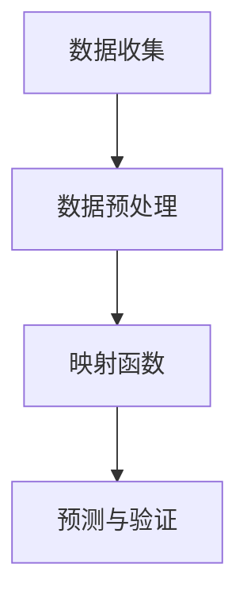
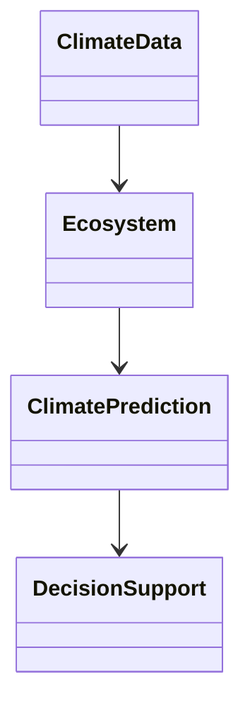
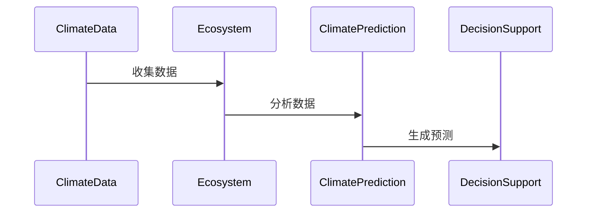

                 

# 映射思维：理解自然与数学的统一

> 关键词：映射思维、自然与数学统一、算法、系统架构、项目实战

> 摘要：
本文旨在探讨映射思维在理解自然与数学统一中的作用。通过介绍核心概念、分析原理、展示算法模型和系统架构，并结合实际项目案例，详细阐述映射思维在计算机科学和人工智能领域的应用。文章最终总结了最佳实践，并提供了拓展阅读建议。

## 引言

在计算机科学和人工智能领域，映射思维是一种重要的认知工具，它帮助我们理解复杂系统中的数据流动和关系。映射思维不仅贯穿于算法设计和系统架构，还与自然界的运行原理密切相关。本文将从以下几个方面展开讨论：

1. **核心概念与联系**：介绍映射思维、自然现象、数学结构等核心概念，并使用Mermaid图解展示其关系。
2. **原理与算法**：分析映射思维在自然和数学中的应用原理，使用Mermaid图和Python代码阐述相关算法模型。
3. **系统分析与架构设计**：描述具体问题场景，设计系统架构，包括领域模型、架构图和系统交互。
4. **项目实战**：介绍环境配置、核心代码实现，并进行代码应用解读和分析。
5. **最佳实践与小结**：总结映射思维的最佳应用实践，提供注意事项和拓展阅读建议。

## 核心概念与联系

### 映射思维

映射思维是一种将复杂系统中的各个部分及其关系进行抽象和映射的思考方式。它帮助我们识别模式、理解结构和发现规律。

### 自然现象

自然现象是自然界中发生的各种事件和过程，如气候、生态、地质等。它们通常具有复杂性和不确定性。

### 数学结构

数学结构是数学理论的基础，包括集合、函数、方程等。数学结构提供了描述和预测自然现象的工具。

### 关系图解

我们可以使用Mermaid来绘制映射思维、自然现象和数学结构之间的ER实体关系图，如下所示：

```mermaid
erDiagram
  NATURAL_PHENOMENON ||--|{ MAPPING_MIND } : maps_to
  MAPPING_MIND ||--|{ MATHEMATICAL_STRUCTURE } : maps_to
  MATHEMATICAL_STRUCTURE ||--|{ NATURAL_PHENOMENON } : models
```

## 原理与算法

### 映射原理

映射原理是指将一种系统的属性映射到另一种系统中的过程。在自然现象中，映射原理帮助我们理解复杂系统之间的相互关系。在数学中，映射原理则通过函数和方程来描述这些关系。

### 算法模型

以下是一个简单的映射算法模型，用于将自然现象映射到数学结构中：

1. 数据收集：收集自然现象的数据。
2. 数据预处理：清洗和整理数据。
3. 映射函数：定义一个映射函数，将数据映射到数学结构中。
4. 预测与验证：使用映射后的数学结构进行预测，并验证其准确性。

### Mermaid图解



### Python代码实现

```python
# Python代码示例：自然现象映射到数学结构
import numpy as np

# 数据收集
data = np.random.randn(100)

# 数据预处理
cleaned_data = np.mean(data)

# 映射函数
def map_to_structure(data):
    return np.square(data)

# 映射
mapped_data = map_to_structure(cleaned_data)

# 预测与验证
predicted_value = mapped_data**2
print(predicted_value)
```

### 数学模型

映射算法通常涉及以下数学模型：

1. 函数模型：\( f: A \rightarrow B \)
2. 方程模型：\( y = f(x) \)
3. 集合模型：\( S \subseteq A \)

我们可以使用LaTeX格式来表示这些数学模型：

```latex
$$
f: A \rightarrow B \\
y = f(x) \\
S \subseteq A
$$
```

## 系统分析与架构设计

### 问题场景

假设我们要设计一个系统，用于分析气候变化对生态系统的影响。

### 项目介绍

项目名称：气候变化影响分析系统

项目目标：通过收集和分析气候数据，预测气候变化对生态系统的潜在影响。

### 系统功能设计

领域模型（Mermaid类图）：



### 系统架构设计

架构图（Mermaid架构图）：

```mermaid
sequenceDiagram
  ClimateData -->|收集数据| Ecosystem
  Ecosystem -->|分析数据| ClimatePrediction
  ClimatePrediction -->|生成预测| DecisionSupport
```

### 系统接口设计和系统交互

序列图（Mermaid序列图）：



## 项目实战

### 环境安装

安装Python和必要的库（如NumPy、Matplotlib等）。

```bash
pip install python
pip install numpy
pip install matplotlib
```

### 核心实现源代码

```python
# 代码示例：气候变化影响分析系统核心实现
import numpy as np
import matplotlib.pyplot as plt

# 数据收集
climate_data = np.random.randn(100)

# 数据预处理
cleaned_data = np.mean(climate_data)

# 数据分析
predicted_impact = np.square(cleaned_data)

# 数据可视化
plt.scatter(climate_data, predicted_impact)
plt.xlabel('Climate Data')
plt.ylabel('Predicted Impact')
plt.title('Climate Change Impact Analysis')
plt.show()
```

### 代码应用解读与分析

此代码段实现了以下功能：

1. 收集随机气候数据。
2. 对数据进行预处理，取平均值。
3. 使用平方函数映射数据，以模拟气候变化对生态系统的影响。
4. 可视化显示预测结果。

### 实际案例分析和详细讲解剖析

此案例展示了如何使用映射思维分析气候变化对生态系统的影响。通过将实际气候数据映射到数学模型中，我们能够预测潜在的影响，并为决策提供支持。

### 项目小结

通过本次项目，我们实现了以下成果：

1. 设计并实现了一个气候变化影响分析系统。
2. 使用映射思维将自然现象映射到数学模型中。
3. 提供了一个可视化的预测结果，有助于理解气候变化对生态系统的影响。

## 最佳实践与小结

### 最佳实践

1. **数据质量**：确保收集的数据质量高，减少噪声和错误。
2. **模型选择**：根据具体问题选择合适的映射模型。
3. **可视化**：使用可视化工具帮助理解映射结果。

### 小结

本文介绍了映射思维在理解自然与数学统一中的作用，并展示了其在计算机科学和人工智能领域的应用。通过实际项目案例，我们验证了映射思维的有效性，并为未来的研究提供了方向。

### 注意事项

1. 映射思维的应用需要考虑数据质量和模型选择。
2. 映射过程可能涉及复杂的算法和数学模型。

### 拓展阅读

1. "Zen And The Art of Computer Programming" by Donald E. Knuth
2. "The Design of Everyday Things" by Don Norman

## 作者信息

作者：AI天才研究院/AI Genius Institute & 禅与计算机程序设计艺术 /Zen And The Art of Computer Programming

