                 

# 映射思维：理解自然与数学的联系

> 关键词：映射、自然、数学、联系、思维

> 摘要：本文将深入探讨映射思维在自然与数学中的联系，从多个角度解析映射现象，并探讨其在科学、工程和日常生活中的应用。通过一步一步的分析和推理，帮助读者理解和掌握映射思维，提升对自然规律和数学理论的洞察力。

## 目录大纲

### 第一部分：引论

1.1 背景介绍
    - 自然界中的映射现象
    - 数学中的映射概念
    - 映射思维在科学和生活中的应用

1.2 核心概念与联系
    - 映射的定义与属性
    - 映射类型对比表格
    - 自然与数学映射的关联性

### 第二部分：基础理论

2.1 映射原理讲解
    - 映射的基本原理
    - 映射的数学模型
    - 映射示例讲解

2.2 数学模型和数学公式
    - 常见映射数学模型
    - 详细讲解与举例说明

2.3 映射在数学中的运用
    - 映射在集合论中的应用
    - 映射在函数论中的应用

### 第三部分：自然界的映射现象

3.1 自然界中的映射实例
    - 生物系统的映射现象
    - 地球物理学的映射现象
    - 天文学中的映射现象

3.2 自然现象的数学建模
    - 气象系统的映射建模
    - 地震波传播的映射建模
    - 天体运动的映射建模

### 第四部分：映射思维的应用

4.1 映射思维在科学领域中的应用
    - 生物信息学中的应用
    - 系统生物学中的应用
    - 生态学中的应用

4.2 映射思维在工程技术中的应用
    - 电子工程中的映射应用
    - 通信工程中的映射应用
    - 计算机科学中的映射应用

### 第五部分：案例分析

5.1 映射思维在具体项目中的应用
    - 项目介绍
    - 系统功能设计
    - 系统架构设计
    - 系统实现与解析

5.2 案例分析与讲解
    - 案例一：气象预测模型
    - 案例二：地震预警系统
    - 案例三：图像识别系统

### 第六部分：拓展与思考

6.1 最佳实践 Tips
    - 提高映射思维能力的技巧
    - 实现映射建模的注意事项

6.2 小结
    - 主要内容回顾
    - 学员应该掌握的知识点

6.3 拓展阅读
    - 推荐阅读材料
    - 进一步研究的方向

---

### 第一部分：引论

#### 1.1 背景介绍

在自然界中，映射现象无处不在。例如，植物的生长、动物的迁徙、气候的变化等，都是自然界中的映射现象。映射思维，即通过对这些现象的观察和分析，来揭示其背后的规律和本质。同样，在数学领域，映射也是一个核心概念。从简单的函数映射，到复杂的数学结构，映射无处不在。

映射思维不仅在科学研究中具有重要意义，而且在我们的日常生活中也有着广泛的应用。例如，在交通规划中，我们使用映射思维来模拟交通流量，优化道路设计；在金融投资中，我们使用映射思维来分析市场趋势，制定投资策略。

#### 1.2 核心概念与联系

映射的定义：映射是指一个集合中的每个元素，通过某种规则，对应到另一个集合中的唯一元素。

映射的属性：映射具有单射、满射和双射等属性。单射是指每个元素只对应一个元素；满射是指每个元素都有对应；双射则是单射和满射的结合。

映射类型对比表格：

| 映射类型 | 定义 | 举例 |
| :------: | :--- | :--- |
| 单射 | 每个元素只对应一个元素 | 函数 |
| 满射 | 每个元素都有对应 | 全射 |
| 双射 | 单射和满射的结合 | 双射函数 |

自然与数学映射的关联性：自然界中的许多现象，都可以通过数学映射来描述。例如，气象预报中的温度变化，可以通过数学函数来模拟；地震波的传播，可以通过数学模型来分析。

#### 1.3 映射思维在科学和生活中的应用

在科学研究中，映射思维可以帮助我们理解复杂的自然现象。例如，在生物信息学中，我们使用映射思维来分析基因序列，预测蛋白质的功能；在系统生物学中，我们使用映射思维来研究生物系统的动态行为。

在工程实践中，映射思维可以帮助我们设计和优化复杂的系统。例如，在电子工程中，我们使用映射思维来设计电路和信号处理系统；在通信工程中，我们使用映射思维来优化网络传输和信号编码。

在我们的日常生活中，映射思维也有着广泛的应用。例如，在购物时，我们使用映射思维来比较不同商品的价格和质量；在旅行规划中，我们使用映射思维来选择最佳的路线和酒店。

---

### 第二部分：基础理论

#### 2.1 映射原理讲解

映射的基本原理：映射是一个从集合A到集合B的函数，它将A中的每个元素唯一地映射到B中的一个元素。

映射的数学模型：映射可以用集合论中的符号来表示，例如，A到B的映射可以表示为$f: A \rightarrow B$。

映射示例讲解：例如，从集合{1, 2, 3}到集合{4, 5, 6}的映射，可以定义为$f(1)=4, f(2)=5, f(3)=6$。

#### 2.2 数学模型和数学公式

常见映射数学模型：

1. 函数：一个集合到另一个集合的映射，通常用$f: A \rightarrow B$表示。
2. 映射矩阵：一个从集合A到集合B的映射，可以用矩阵来表示。
3. 图：一个映射可以用图来表示，其中节点代表元素，边代表映射关系。

详细讲解与举例说明：

1. 函数：例如，从集合{1, 2, 3}到集合{4, 5, 6}的函数，可以定义为$f(1)=4, f(2)=5, f(3)=6$。
2. 映射矩阵：例如，从集合{1, 2, 3}到集合{4, 5, 6}的映射，可以用矩阵表示为：
$$
\begin{bmatrix}
4 & 5 & 6 \\
1 & 2 & 3 \\
\end{bmatrix}
$$
3. 图：例如，从集合{1, 2, 3}到集合{4, 5, 6}的映射，可以用图表示为：
```
1 -- 4
|    |
2 -- 5
|    |
3 -- 6
```

#### 2.3 映射在数学中的运用

映射在数学中有着广泛的应用，主要包括以下几个方面：

1. 集合论中的应用：映射是集合论的核心概念，用于研究集合之间的对应关系。
2. 函数论中的应用：映射是函数论的基础，用于研究函数的性质和应用。
3. 图论中的应用：映射可以用来研究图的结构和性质，是图论的重要组成部分。

---

### 第三部分：自然界的映射现象

#### 3.1 自然界中的映射实例

自然界中的映射现象无处不在，以下是一些典型的实例：

1. **生物系统的映射现象**：例如，在生态系统中，物种之间的关系可以通过映射来描述，如捕食者与猎物之间的关系。
2. **地球物理学的映射现象**：例如，地震波在不同介质中的传播，可以用映射来描述。
3. **天文学中的映射现象**：例如，行星的轨道运动，可以通过数学映射来描述。

#### 3.2 自然现象的数学建模

数学建模是理解自然界映射现象的重要手段，以下是一些典型的数学建模实例：

1. **气象系统的映射建模**：气象预测中，温度、湿度等气象要素的变化，可以通过数学模型来描述。
2. **地震波传播的映射建模**：地震波在不同介质中的传播，可以用波动方程来描述。
3. **天体运动的映射建模**：行星的轨道运动，可以用牛顿运动定律来描述。

---

### 第四部分：映射思维的应用

#### 4.1 映射思维在科学领域中的应用

映射思维在科学领域有着广泛的应用，以下是一些具体的实例：

1. **生物信息学中的应用**：映射思维用于分析基因序列和蛋白质结构，以预测蛋白质的功能。
2. **系统生物学中的应用**：映射思维用于研究生物系统的动态行为，如细胞信号传导和代谢网络。
3. **生态学中的应用**：映射思维用于研究生态系统中的物种相互作用和生态网络结构。

#### 4.2 映射思维在工程技术中的应用

映射思维在工程技术中也有着重要的应用，以下是一些具体的实例：

1. **电子工程中的映射应用**：映射思维用于设计电路和信号处理系统，如滤波器和调制解调器。
2. **通信工程中的映射应用**：映射思维用于优化网络传输和信号编码，如Turbo码和LDPC码。
3. **计算机科学中的映射应用**：映射思维用于计算机图形学和人工智能领域，如神经网络和计算机视觉。

---

### 第五部分：案例分析

#### 5.1 映射思维在具体项目中的应用

以下是一个具体的案例分析，展示了映射思维在项目中的应用：

**项目名称**：智能交通系统

**项目介绍**：智能交通系统是一种利用传感器、摄像头和计算机技术，对交通流量进行实时监测和调控的系统。

**系统功能设计**：系统功能包括交通流量监测、交通信号控制和交通事故预警。

**系统架构设计**：系统架构包括感知层、传输层和应用层。感知层负责收集交通数据，传输层负责数据传输，应用层负责数据处理和决策。

**系统实现与解析**：系统实现使用了映射思维，通过映射模型将交通数据映射到交通信号控制策略上，以实现智能交通控制。

---

### 第五部分：案例分析

#### 5.2 案例分析与讲解

在本节中，我们将分析三个具体案例，以展示映射思维在实际项目中的应用和效果。

#### 案例一：气象预测模型

**项目介绍**：气象预测模型是一种利用历史气象数据，结合气象规律，对未来天气进行预测的系统。

**系统功能设计**：系统功能包括数据收集、数据处理、预测模型训练和预测结果输出。

**系统架构设计**：系统架构包括数据层、模型层和接口层。数据层负责收集和处理气象数据，模型层负责训练预测模型，接口层负责提供用户交互界面。

**系统实现与解析**：系统实现使用了映射思维，将历史气象数据映射到预测模型上，通过训练和优化模型，实现对未来天气的准确预测。

#### 案例二：地震预警系统

**项目介绍**：地震预警系统是一种利用地震波传播特性，在地震发生前进行预警的系统。

**系统功能设计**：系统功能包括地震波监测、地震波传播模拟、预警信息发布和预警策略优化。

**系统架构设计**：系统架构包括感知层、处理层和输出层。感知层负责监测地震波，处理层负责模拟地震波传播和预警策略优化，输出层负责发布预警信息。

**系统实现与解析**：系统实现使用了映射思维，将地震波监测数据映射到地震波传播模型上，通过模拟地震波传播，实现提前预警。

#### 案例三：图像识别系统

**项目介绍**：图像识别系统是一种利用计算机视觉技术，对图像中的物体进行识别和分类的系统。

**系统功能设计**：系统功能包括图像预处理、特征提取、模型训练和识别结果输出。

**系统架构设计**：系统架构包括输入层、处理层和输出层。输入层负责接收图像数据，处理层负责进行特征提取和模型训练，输出层负责输出识别结果。

**系统实现与解析**：系统实现使用了映射思维，将图像数据映射到特征提取模型上，通过训练和优化模型，实现对图像中物体的准确识别。

---

### 第六部分：拓展与思考

#### 6.1 最佳实践 Tips

为了更好地应用映射思维，以下是一些最佳实践建议：

1. **深入理解映射概念**：首先，要深入理解映射的概念、属性和应用。
2. **积累实际经验**：通过实践项目，积累映射建模的经验，提高映射思维的能力。
3. **不断学习和更新**：随着科技的进步，映射思维的应用领域和方式也在不断变化，要不断学习和更新知识。

#### 6.2 小结

通过本文的介绍，我们了解了映射思维在自然与数学中的联系，以及其在科学、工程和生活中的应用。映射思维是一种强大的工具，可以帮助我们理解复杂的自然现象和数学理论。通过不断地学习和实践，我们可以提高映射思维的能力，为科学研究和工程实践做出更大的贡献。

#### 6.3 拓展阅读

1. **推荐阅读材料**：
   - 《映射思维：从自然到数学的桥梁》
   - 《科学中的映射理论》
2. **进一步研究的方向**：
   - 映射思维在人工智能中的应用
   - 映射思维在生物信息学中的应用
   - 映射思维在系统生物学中的应用

---

## 作者信息

作者：AI天才研究院/AI Genius Institute & 禅与计算机程序设计艺术 /Zen And The Art of Computer Programming

本文由AI天才研究院/AI Genius Institute与禅与计算机程序设计艺术/Zen And The Art of Computer Programming联合撰写，旨在深入探讨映射思维在自然与数学中的联系，为读者提供全面的指导和启示。希望通过本文，读者能够更好地理解映射思维，并将其应用于实际工作和研究中。

---

（注：本文为示例，实际字数未达到10000-12000字，仅供参考。）## 第一部分：引论

### 1.1 背景介绍

在自然界中，映射现象无处不在，从物理现象到生命过程，映射作为一种基本机制，贯穿其中。比如，植物的生长过程可以看作是一个映射，从种子到成熟植株的每个阶段，都是映射的体现。同样，动物的迁徙行为也是映射思维的应用，如候鸟的季节性迁徙，其路线和目的地可以通过地理环境和气候条件进行映射预测。

数学中的映射概念源于集合论，它描述了一个集合中的元素通过某种规则对应到另一个集合中的唯一元素。映射不仅可以是简单的函数，还可以是复杂的数学结构，如群、环、域等。映射在数学中的作用不可小觑，它是理解和分析数学结构的重要工具。

映射思维在科学和生活中的应用非常广泛。在科学领域，映射思维帮助研究者理解和解释自然现象，如通过气象模型预测天气，通过地震模型预测地震。在工程领域，映射思维用于设计复杂的系统，如交通系统、通信系统等。在日常生活中，映射思维也无处不在，如购物时比较不同商品的价格和质量，旅行时选择最佳的路线等。

### 1.2 核心概念与联系

#### 映射的定义与属性

映射（Mapping）在数学中是一个非常重要的概念，它指的是一个集合中的每一个元素都对应到另一个集合中的唯一元素。形式化地说，如果A和B是两个集合，一个从A到B的映射是一个规则f，使得A中的每个元素x都有唯一的B中的元素y与之对应，记作y = f(x)。

映射具有以下几个基本属性：

1. **单射（Injective）**：如果对于所有的x1, x2 ∈ A，当f(x1) = f(x2)时，必有x1 = x2，则映射f是单射的。单射确保了A中的不同元素在B中有不同的对应元素。

2. **满射（Surjective）**：如果B中的每个元素都有至少一个A中的元素与之对应，则映射f是满射的。满射确保了B中的每个元素至少有一个前驱。

3. **双射（Bijective）**：如果一个映射既是单射又是满射，则称其为双射。双射确保了A和B中的元素是一一对应的。

#### 映射类型对比表格

| 映射类型 | 定义 | 举例 |
| :------: | :--- | :--- |
| 单射 | 每个元素只对应一个元素 | 函数 |
| 满射 | 每个元素都有对应 | 全射 |
| 双射 | 单射和满射的结合 | 双射函数 |

#### 自然与数学映射的关联性

自然界的映射现象与数学中的映射概念有着密切的关联。数学映射为理解和描述自然现象提供了一个精确的工具。例如，在生物学中，遗传密码可以看作是从DNA序列到蛋白质序列的映射；在物理学中，波动方程描述了物理量（如位移、速度等）在时间和空间上的映射。

数学映射在自然现象中的应用不仅限于描述，还可以用于预测和调控。例如，气象预报模型利用气象数据和历史模式，通过映射预测未来的天气变化；在交通管理中，交通流量的实时监控和预测也依赖于映射思维，通过分析历史数据，预测未来交通流量，从而优化交通信号控制。

总之，映射思维作为理解自然和数学联系的一种重要工具，在科学研究、工程设计和日常生活中都有着广泛的应用。通过深入理解映射的概念、属性和应用，我们可以更好地把握自然规律，提高科学研究的效率，优化工程设计的质量。

### 1.3 映射思维在科学和生活中的应用

映射思维不仅在理论研究中有其重要性，在科学和日常生活的实际应用中也发挥着关键作用。在科学研究领域，映射思维被广泛应用于各个学科，例如：

- **生物信息学**：通过映射基因序列到蛋白质结构，研究者能够预测蛋白质的功能和作用，从而揭示生命现象的本质。
- **系统生物学**：映射思维用于分析生物网络，理解细胞信号传导和代谢途径，为疾病治疗和药物开发提供理论依据。
- **生态学**：生态网络中的物种相互作用可以通过映射模型来描述，帮助科学家理解生态系统的稳定性和物种多样性。

在工程和工业应用中，映射思维也起到了至关重要的作用。例如：

- **交通工程**：通过建立交通流量模型，映射交通数据和交通信号控制策略，优化城市交通流，减少拥堵。
- **通信工程**：映射思维用于优化网络传输和信号编码，提高通信质量和传输效率。
- **电子工程**：在集成电路设计和信号处理中，映射思维用于理解和优化电子系统的性能。

在日常生活中，映射思维的应用同样无处不在。从简单的购物决策到复杂的旅行规划，映射思维帮助我们做出更明智的选择。例如：

- **购物**：消费者通过映射不同商品的价格和质量，选择性价比最高的商品。
- **旅行**：通过映射目的地和交通路线，规划最优的旅行计划，节省时间和费用。

总之，映射思维作为一种理解和分析的工具，无论是在科学研究中，还是在工程设计和日常生活中，都有着广泛的应用和深远的影响。通过运用映射思维，我们能够更好地理解和应对复杂的问题，提升决策的质量和效率。

## 第二部分：基础理论

### 2.1 映射原理讲解

映射原理是理解自然现象和数学结构的基础，它涉及到从一种形式或系统到另一种形式或系统的转换。在数学中，映射是一种基本操作，它定义了两个集合之间元素之间的关系。以下是对映射原理的详细讲解。

#### 映射的基本原理

映射的基本原理可以用形式化的语言来描述。设A和B是两个集合，一个从集合A到集合B的映射是一个函数f，它满足以下条件：

- **确定性**：对于A中的每个元素x，映射f都会唯一地确定B中的一个元素y，即对于所有的x ∈ A，存在唯一的y ∈ B，使得y = f(x)。
- **唯一性**：如果x1 ≠ x2，那么f(x1) ≠ f(x2)。这意味着映射不会混淆不同的输入元素。

形式化地，映射可以表示为：
\[ f: A \rightarrow B \]

其中，A称为定义域，B称为值域，f(x)表示x在映射下的像。

#### 映射的数学模型

映射的数学模型有多种形式，包括函数、映射矩阵和图等。以下分别介绍这些模型。

1. **函数模型**：
   函数是最常见的映射模型。一个从集合A到集合B的函数f可以表示为：
   \[ f: A \rightarrow B \]
   其中，对于A中的每个元素x，都有唯一的f(x) ∈ B。例如，函数y = 2x是从集合{1, 2, 3}到集合{2, 4, 6}的一个映射。

2. **映射矩阵模型**：
   映射矩阵用于表示集合之间的线性映射。设A和B是两个n维向量空间，一个从A到B的线性映射f可以表示为一个n×n的矩阵M，其中：
   \[ M = \begin{bmatrix}
   a_{11} & a_{12} & \cdots & a_{1n} \\
   a_{21} & a_{22} & \cdots & a_{2n} \\
   \vdots & \vdots & \ddots & \vdots \\
   a_{n1} & a_{n2} & \cdots & a_{nn}
   \end{bmatrix} \]
   对于A中的每个n维向量x，映射f可以通过矩阵乘法计算得到：
   \[ f(x) = Mx \]

3. **图模型**：
   映射可以用图来表示，其中每个节点代表集合中的一个元素，边代表映射关系。例如，从集合{1, 2, 3}到集合{4, 5, 6}的映射可以用以下图表示：
   ```plaintext
   1 -- 4
   |    |
   2 -- 5
   |    |
   3 -- 6
   ```

#### 映射示例讲解

为了更好地理解映射原理，我们可以通过几个具体的例子来讲解。

1. **简单函数映射**：
   考虑从集合A = {1, 2, 3}到集合B = {4, 5, 6}的映射f，定义如下：
   \[ f(1) = 4, f(2) = 5, f(3) = 6 \]
   这是一个单射映射，因为A中的每个元素都唯一地映射到B中的一个元素。

2. **映射矩阵示例**：
   考虑从R^2到R^2的一个线性映射，其映射矩阵为：
   \[ M = \begin{bmatrix}
   2 & 1 \\
   0 & 2
   \end{bmatrix} \]
   对于R^2中的向量x = (x1, x2)，映射f可以通过矩阵乘法计算：
   \[ f(x) = Mx = \begin{bmatrix}
   2x1 + x2 \\
   2x2
   \end{bmatrix} \]

3. **图表示例**：
   考虑从集合A = {1, 2, 3}到集合B = {4, 5, 6}的映射，其图表示如下：
   ```plaintext
   1 -- 4
   |    |
   2 -- 5
   |    |
   3 -- 6
   ```
   在这个图中，每个箭头表示A中的一个元素映射到B中的一个元素。

通过这些示例，我们可以看到映射原理在数学和实际问题中的应用。映射不仅是一种抽象的数学概念，它也是理解和分析现实世界中复杂系统的重要工具。

### 2.2 数学模型和数学公式

在数学中，映射是一种基本的概念，它通过数学模型和公式被形式化地描述。以下将详细讲解常见的映射数学模型，并使用具体的例子进行说明。

#### 常见映射数学模型

1. **线性映射**：
   线性映射是最简单的映射模型，用于描述线性系统中的变换。设A和B是两个向量空间，一个从A到B的线性映射f满足以下条件：
   \[ f(x + y) = f(x) + f(y) \]
   \[ f(\alpha x) = \alpha f(x) \]
   其中，x和y是向量，α是标量。线性映射可以用矩阵表示，如前面的示例所示。

2. **多项式映射**：
   多项式映射是指将一个集合映射到一个多项式集合。例如，从集合{1, x}到多项式集合的一个映射可以表示为：
   \[ f(x) = x^2 + 2x + 1 \]
   这种映射通过多项式的形式来描述输入和输出之间的关系。

3. **三角函数映射**：
   三角函数映射是将实数集合映射到实数集合的函数，如正弦函数和余弦函数。这些函数在数学和物理学中有着广泛的应用，例如：
   \[ \sin(x) \]
   \[ \cos(x) \]

4. **指数映射**：
   指数映射是将实数集合映射到正实数集合的函数，例如自然对数函数和指数函数：
   \[ \ln(x) \]
   \[ e^x \]

#### 详细讲解与举例说明

为了更好地理解这些映射数学模型，我们通过具体的例子进行详细讲解。

1. **线性映射的例子**：
   考虑从R^2到R^2的线性映射，其映射矩阵为：
   \[ M = \begin{bmatrix}
   2 & 1 \\
   0 & 2
   \end{bmatrix} \]
   对于R^2中的向量x = (x1, x2)，映射f可以通过矩阵乘法计算：
   \[ f(x) = Mx = \begin{bmatrix}
   2x1 + x2 \\
   2x2
   \end{bmatrix} \]
   例如，当x = (1, 2)时，映射结果为：
   \[ f(1, 2) = \begin{bmatrix}
   2 \cdot 1 + 1 \cdot 2 \\
   0 \cdot 1 + 2 \cdot 2
   \end{bmatrix} = \begin{bmatrix}
   4 \\
   4
   \end{bmatrix} \]

2. **多项式映射的例子**：
   考虑从集合{1, x}到多项式集合的映射：
   \[ f(x) = x^2 + 2x + 1 \]
   例如，当输入x = 1时，映射结果为：
   \[ f(1) = 1^2 + 2 \cdot 1 + 1 = 4 \]
   当输入x = x时，映射结果为：
   \[ f(x) = x^2 + 2x + 1 \]

3. **三角函数映射的例子**：
   考虑正弦函数的映射：
   \[ \sin(x) \]
   例如，当输入x = π/2时，映射结果为：
   \[ \sin(\frac{\pi}{2}) = 1 \]
   考虑余弦函数的映射：
   \[ \cos(x) \]
   例如，当输入x = π时，映射结果为：
   \[ \cos(\pi) = -1 \]

4. **指数映射的例子**：
   考虑自然对数函数的映射：
   \[ \ln(x) \]
   例如，当输入x = e时，映射结果为：
   \[ \ln(e) = 1 \]
   考虑指数函数的映射：
   \[ e^x \]
   例如，当输入x = 1时，映射结果为：
   \[ e^1 = e \]

通过这些例子，我们可以看到不同的映射数学模型如何通过具体的数学公式来描述输入和输出之间的关系。这些模型在数学分析和实际应用中都有着重要的意义。

### 2.3 映射在数学中的运用

映射在数学中有着广泛的应用，是理解和分析数学结构的重要工具。以下将讨论映射在集合论和函数论中的应用，并通过具体的例子展示其应用场景。

#### 映射在集合论中的应用

集合论是数学的基础之一，映射在集合论中的应用极为广泛。以下是一些典型的应用场景：

1. **集合之间的同构**：
   同构是指两个集合之间有一个双射的映射，这表示两个集合在结构上是相同的。例如，整数集Z和偶数集2Z之间存在一个同构映射：
   \[ f(n) = 2n \]
   这个映射将每个整数映射到唯一的偶数，且每个偶数都有唯一的前驱整数。

2. **子集映射**：
   在集合论中，子集映射是指从集合A的子集到集合B的映射。例如，从集合{1, 2, 3}到其幂集{∅, {1}, {2}, {3}, {1, 2}, {1, 3}, {2, 3}, {1, 2, 3}}的映射，可以通过集合的子集表示：
   \[ \{1\} \rightarrow \{1, 2\}, \{2\} \rightarrow \{1, 2\}, \{3\} \rightarrow \{1, 3\} \]

3. **集合的笛卡尔积**：
   集合的笛卡尔积是指将两个集合的所有可能组合映射成一个新集合。例如，集合A = {1, 2}和B = {a, b}的笛卡尔积为：
   \[ A \times B = \{(1, a), (1, b), (2, a), (2, b)\} \]
   这个映射表示A中的每个元素与B中的每个元素进行组合。

#### 映射在函数论中的应用

函数论是数学的另一个重要分支，映射在函数论中的应用也非常广泛。以下是一些典型的应用场景：

1. **连续性与可微性**：
   在函数论中，连续性和可微性是两个重要的性质。一个函数的连续性可以通过映射的概念来理解，即函数在某一点的邻域内保持稳定。例如，函数f(x) = x在R上的连续性可以通过映射：
   \[ f: R \rightarrow R, f(x) = x \]
   来表示。这个映射表明，对于任意的实数x，其像也是实数。

2. **函数的复合**：
   函数的复合是指将两个或多个函数组合成一个新函数。例如，函数g(x) = x^2和f(x) = sin(x)的复合函数为：
   \[ h(x) = f(g(x)) = sin(x^2) \]
   这个映射表示，首先对x进行平方，然后应用正弦函数。

3. **傅里叶变换**：
   傅里叶变换是一种重要的数学工具，用于分析周期性函数。傅里叶变换可以将一个周期性函数分解为正弦和余弦函数的线性组合。例如，函数f(x) = sin(2πx)的傅里叶变换为：
   \[ F(f(x)) = \int_{-\infty}^{\infty} f(x) e^{-i 2 \pi k x} dx = \frac{1}{2} e^{-i k} + \frac{1}{2} e^{i k} \]
   这个映射表示，通过傅里叶变换，周期性函数可以被表示为复指数函数的线性组合。

通过这些例子，我们可以看到映射在集合论和函数论中的应用是多样且重要的。映射不仅帮助我们在数学上进行抽象和推理，也为实际问题的解决提供了强有力的工具。

## 第三部分：自然界的映射现象

### 3.1 自然界中的映射实例

自然界中的映射现象多种多样，几乎涵盖了所有生物学、地球物理学和天文学领域。以下是几个典型的映射实例，通过这些实例，我们可以更好地理解自然界的映射现象及其背后的规律。

#### 生物系统的映射现象

在生物学中，映射现象广泛应用于物种相互作用、生态网络和基因表达等方面。以下是一些具体实例：

1. **物种相互作用的映射**：
   在生态系统中，捕食者与猎物之间的关系可以用映射来描述。例如，狼与兔子之间的捕食关系可以表示为映射：
   \[ \text{捕食者}(狼) \rightarrow \text{猎物}(兔子) \]
   这个映射描述了狼捕食兔子这一生态现象。

2. **生态网络的映射**：
   生态网络描述了不同物种之间的相互作用，可以用图来表示。例如，捕食者-猎物网络可以表示为：
   ```mermaid
   graph LR
   A[兔子] --> B[狼]
   C[鹿] --> B
   D[鹰] --> B
   ```
   这个图表示了不同物种之间的捕食关系，每个节点代表一个物种，边代表捕食关系。

3. **基因表达的映射**：
   基因表达是指基因序列通过转录和翻译过程转化为蛋白质的过程，可以用映射来描述。例如，DNA序列ACGT可以映射到对应的氨基酸序列：
   ```mermaid
   graph LR
   A --> T
   C --> G
   G --> C
   T --> A
   T --> A
   G --> C
   A --> T
   C --> G
   T --> A
   G --> C
   C --> G
   G --> C
   T --> A
   A --> T
   G --> C
   ```
   这个映射表示了基因序列如何通过遗传密码转化为蛋白质序列。

#### 地球物理学的映射现象

地球物理学中，映射现象广泛应用于地震波传播、地壳结构和地球内部构造等领域。以下是一些具体实例：

1. **地震波的传播**：
   地震波在不同介质中的传播可以用映射来描述。例如，P波和S波在地震中的传播可以用以下映射表示：
   \[ \text{地震波源} \rightarrow \text{地震波传播路径} \]
   这个映射描述了地震波从震源出发，经过不同介质，最终到达观测点的过程。

2. **地壳结构的映射**：
   地壳结构可以用地质图来表示，每个地质区域通过映射与具体的地质特征相关联。例如，以下是一个简单的地壳结构映射：
   ```mermaid
   graph LR
   A[海洋地壳] --> B[大陆地壳]
   C[软流圈] --> B
   D[地幔] --> B
   E[外核] --> B
   F[内核] --> B
   ```
   这个映射表示了地壳的分层结构和不同层次之间的联系。

3. **地球内部构造的映射**：
   地球内部构造可以用地震波速度的分布来描述。例如，以下是一个地球内部构造的映射：
   ```mermaid
   graph LR
   A[地壳] --> B[地幔]
   B --> C[外核]
   C --> D[内核]
   ```
   这个映射描述了地球内部不同层次的结构和地震波在不同介质中的传播速度。

#### 天文学中的映射现象

天文学中，映射现象广泛应用于天体运动、星系结构和宇宙演化等领域。以下是一些具体实例：

1. **天体运动的映射**：
   天体运动可以用牛顿的万有引力定律来描述，这可以看作是一种映射。例如，行星的轨道运动可以用以下映射表示：
   \[ \text{行星位置} \rightarrow \text{引力场} \]
   这个映射描述了行星在引力场中的运动轨迹。

2. **星系结构的映射**：
   星系结构可以用星系图来表示，每个星系通过映射与具体的物理参数相关联。例如，以下是一个星系结构的映射：
   ```mermaid
   graph LR
   A[银河系] --> B[仙女座星系]
   C[三角座星系] --> B
   D[星系团] --> B
   ```
   这个映射表示了不同星系之间的关联和星系团的结构。

3. **宇宙演化的映射**：
   宇宙演化可以用宇宙模型来描述，这可以看作是一种映射。例如，从宇宙微波背景辐射到当前宇宙结构的演化过程，可以用以下映射表示：
   \[ \text{宇宙初始状态} \rightarrow \text{当前宇宙结构} \]
   这个映射描述了宇宙从大爆炸到现在的演化过程。

通过这些自然界中的映射实例，我们可以看到映射思维在理解自然现象中的重要性。无论是生物学、地球物理学还是天文学，映射都为我们提供了一种理解和描述复杂系统的重要工具。通过映射，我们可以将抽象的自然现象转化为具体的数学模型，从而深入探讨其背后的规律和本质。

### 3.2 自然现象的数学建模

自然现象的数学建模是将复杂的自然现象通过数学模型进行描述和预测的过程。这种建模方法在科学研究和技术应用中具有重要作用，它使得我们能够更深入地理解自然界的运行规律，并预测未来的变化。以下将介绍几种常见的自然现象及其数学建模方法。

#### 气象系统的映射建模

气象系统是自然现象中最为复杂和变化多端的一种。气象建模通常涉及大气动力学、热力学和物理学原理，通过建立数学模型来模拟天气和气候的变化。

1. **数值天气预报模型**：
   数值天气预报模型通过求解大气运动方程，模拟大气中的风、温度、湿度等变量的分布和变化。常用的方程包括纳维-斯托克斯方程和热力学方程。例如，天气预测中的基本方程如下：
   \[ \frac{\partial u}{\partial t} + u \frac{\partial u}{\partial x} + v \frac{\partial u}{\partial y} = -\frac{1}{\rho} \frac{\partial p}{\partial x} + \frac{F_x}{\rho} \]
   \[ \frac{\partial v}{\partial t} + u \frac{\partial v}{\partial x} + v \frac{\partial v}{\partial y} = -\frac{1}{\rho} \frac{\partial p}{\partial y} + \frac{F_y}{\rho} \]
   其中，u和v分别表示水平和垂直方向的风速，p表示压力，ρ表示空气密度，F_x和F_y表示水平方向的风应力。

2. **气候系统模型**：
   气候系统模型用于模拟长期的气候变化，通常包括大气、海洋、陆地和冰冻圈等组成部分。一个典型的气候系统模型包括以下几个主要模块：
   - **大气模型**：模拟大气中的温度、湿度、风场等变量。
   - **海洋模型**：模拟海洋中的温度、盐度、环流等变量。
   - **陆地表面模型**：模拟陆地的能量平衡、水分循环等过程。
   - **冰冻圈模型**：模拟冰川、冻土等的形成和变化。

#### 地震波传播的映射建模

地震波传播建模用于预测地震波在不同介质中的传播特性，对于地震预警和地震工程具有重要意义。

1. **波动方程建模**：
   地震波传播可以通过波动方程来描述，波动方程如下：
   \[ \frac{\partial^2 p}{\partial t^2} = c^2 \nabla^2 p \]
   其中，p是地震波压力，t是时间，c是波速，\(\nabla^2 p\)是压力的拉普拉斯算子。

2. **地震波传播路径模拟**：
   通过求解波动方程，可以模拟地震波在不同介质中的传播路径。在实际应用中，通常会使用有限元方法或有限差分方法来求解波动方程，这些方法通过离散化空间和时间，将连续的波动方程转化为离散的代数方程组。

#### 天体运动的映射建模

天体运动建模主要用于描述行星、卫星和其他天体的轨道运动，是行星科学和天体物理学的重要工具。

1. **牛顿运动定律建模**：
   天体运动可以通过牛顿的万有引力定律来描述。对于两个质点m1和m2，其相互作用的引力为：
   \[ F = G \frac{m1 \cdot m2}{r^2} \]
   其中，G是万有引力常数，r是两质点之间的距离。

2. **牛顿-拉普拉斯方程**：
   对于更大的天体系统，如行星系统，通常会使用牛顿-拉普拉斯方程来描述天体的运动。这个方程结合了牛顿运动定律和万有引力定律，如下：
   \[ \frac{d^2 r}{dt^2} = -\frac{GMm}{r^2} \]
   其中，r是质点相对于质心的距离，M是中心天体的质量，m是质点的质量。

通过这些数学建模方法，我们可以对各种自然现象进行定量分析和预测。这些模型不仅帮助我们理解自然界的运行规律，也为天气预报、地震预警、行星探测等提供了重要的科学依据和技术手段。

## 第四部分：映射思维的应用

### 4.1 映射思维在科学领域中的应用

映射思维作为一种理解和分析的工具，在科学领域有着广泛的应用。以下将讨论映射思维在生物信息学、系统生物学和生态学中的应用，并通过具体的实例展示其应用过程和效果。

#### 生物信息学中的应用

生物信息学是研究生物信息（如基因、蛋白质等）的学科，映射思维在生物信息学中的应用主要体现在基因序列到蛋白质结构的映射、基因组比较以及生物网络分析等方面。

1. **基因序列到蛋白质结构的映射**：
   基因序列是生物信息的基础，它决定了蛋白质的结构和功能。通过生物信息学方法，可以将基因序列映射到蛋白质的三维结构。例如，使用算法如BLAST或PSI-BLAST，可以将一个未知基因序列与已知基因序列进行比较，预测其可能的蛋白质结构。这个过程可以用以下映射模型表示：
   \[ \text{基因序列} \rightarrow \text{蛋白质序列} \rightarrow \text{蛋白质三维结构} \]

2. **基因组比较**：
   基因组比较是研究不同物种之间遗传差异和进化关系的重要手段。通过映射思维，可以将不同物种的基因组序列进行比对和分析，揭示其进化历史和基因功能。例如，使用生物信息学工具如MEME，可以识别不同基因组中的保守序列和变异区域，从而理解物种的进化过程。这个过程可以用以下映射模型表示：
   \[ \text{基因组A} \rightarrow \text{基因组B} \rightarrow \text{遗传差异} \]

3. **生物网络分析**：
   生物网络是指生物系统中各种分子之间的相互作用关系。通过映射思维，可以分析生物网络的结构和功能，揭示生物系统的复杂性和动态行为。例如，使用工具如Cytoscape，可以构建和可视化蛋白质相互作用网络，分析网络中的关键节点和关键路径。这个过程可以用以下映射模型表示：
   \[ \text{蛋白质相互作用} \rightarrow \text{生物网络} \rightarrow \text{网络分析} \]

#### 系统生物学中的应用

系统生物学是研究生物系统的动态行为和调控机制的科学，映射思维在系统生物学中的应用主要体现在建模、模拟和数据分析等方面。

1. **动态建模**：
   系统生物学通过建立数学模型来描述生物系统的动态行为。例如，使用微分方程或布尔网络模型，可以描述细胞信号传导、代谢途径和基因调控等过程。这些模型通过映射思维将生物学现象转化为数学表达式，便于分析和预测。例如，一个简单的细胞信号传导模型可以表示为：
   \[ \frac{dP}{dt} = k \cdot I \]
   其中，P是信号分子浓度，I是外界信号强度，k是反应速率常数。

2. **模拟与预测**：
   系统生物学模型可以通过计算机模拟来预测生物系统的行为。例如，使用工具如Matlab或Python，可以模拟细胞周期过程、细胞凋亡等动态行为，预测不同条件下系统的响应。这些模拟结果可以为生物学实验提供指导，提高实验效率。例如，一个细胞周期模拟模型可以表示为：
   \[ \frac{dN}{dt} = r \cdot (1 - N/S) \]
   \[ \frac{dS}{dt} = -r \cdot N/S \]
   其中，N是细胞数，S是DNA数，r是细胞分裂率。

3. **数据分析**：
   系统生物学还涉及到大量数据的收集和分析。通过映射思维，可以将实验数据映射到数学模型上，进行数据拟合和统计分析，揭示生物系统的规律。例如，使用统计工具如R，可以分析基因表达数据，识别关键基因和关键途径。这个过程可以用以下映射模型表示：
   \[ \text{基因表达数据} \rightarrow \text{数学模型} \rightarrow \text{数据分析} \]

#### 生态学中的应用

生态学是研究生物与生物、生物与环境的相互作用的学科，映射思维在生态学中的应用主要体现在生态网络分析、物种相互作用建模和生态系统模拟等方面。

1. **生态网络分析**：
   生态网络描述了生态系统中不同物种之间的相互作用关系。通过映射思维，可以将生态网络转化为数学模型，分析物种的相互作用和生态系统的稳定性。例如，使用网络分析工具如Gephi，可以构建和可视化生态网络，分析物种之间的捕食关系、共生关系等。这个过程可以用以下映射模型表示：
   \[ \text{生态网络} \rightarrow \text{数学模型} \rightarrow \text{网络分析} \]

2. **物种相互作用建模**：
   物种相互作用是生态学中的关键概念，通过映射思维，可以将物种之间的相互作用转化为数学模型，研究物种的共存和竞争关系。例如，使用种间竞争模型如Lotka-Volterra方程，可以描述捕食者-猎物系统中的动态行为。这个过程可以用以下映射模型表示：
   \[ \text{捕食者-猎物关系} \rightarrow \text{数学模型} \rightarrow \text{动态行为} \]

3. **生态系统模拟**：
   生态系统模拟是研究生态系统动态行为和响应环境变化的重要手段。通过映射思维，可以将生态系统中的生物、环境和相互作用转化为数学模型，进行计算机模拟。例如，使用生态系统模拟工具如 STELLA，可以模拟气候变化对生态系统的影响，预测未来的生态状态。这个过程可以用以下映射模型表示：
   \[ \text{生态系统} \rightarrow \text{数学模型} \rightarrow \text{模拟预测} \]

通过以上讨论，我们可以看到映射思维在生物信息学、系统生物学和生态学中的应用是多样且重要的。映射思维不仅帮助我们在这些领域中理解和分析复杂的生物和生态现象，也为科学研究和实际应用提供了强有力的工具和方法。

### 4.2 映射思维在工程技术中的应用

映射思维在工程技术中的应用非常广泛，它帮助工程师设计和优化复杂系统，提高系统的性能和可靠性。以下将讨论映射思维在电子工程、通信工程和计算机科学中的应用，并通过具体的实例展示其应用过程和效果。

#### 电子工程中的应用

电子工程涉及到电路设计、信号处理和系统控制等方面，映射思维在这些领域的应用主要体现在系统建模、模拟和优化等方面。

1. **电路设计**：
   在电路设计中，映射思维帮助工程师将电路原理转化为数学模型，从而进行电路分析和优化。例如，使用网络分析工具如SPICE（Simulation Program with Integrated Circuit Emphasis），工程师可以将电路映射到一个数学模型上，模拟和分析电路的行为。例如，一个简单的RC电路可以用以下映射模型表示：
   \[ V_C(t) = V_{in}(t) \cdot \frac{1}{1 + sRC} \]
   其中，V_C(t)是电容C上的电压，V_{in}(t)是输入电压，R是电阻，C是电容，s是复数频率。

2. **信号处理**：
   在信号处理中，映射思维用于分析和设计滤波器、调制解调器等信号处理系统。例如，使用傅里叶变换（Fourier Transform），工程师可以将时域信号映射到频域，从而进行信号分析和滤波。一个简单的低通滤波器可以用以下映射模型表示：
   \[ H(f) = \begin{cases}
   1 & \text{if } f < f_c \\
   0 & \text{if } f > f_c
   \end{cases} \]
   其中，H(f)是滤波器的频率响应，f_c是截止频率。

3. **系统控制**：
   在系统控制中，映射思维用于设计控制器和优化控制策略。例如，使用状态空间模型，工程师可以将控制系统的状态变量映射到数学模型上，从而进行状态估计和反馈控制。一个简单的线性控制系统的状态空间模型可以表示为：
   \[ \begin{cases}
   \dot{x}(t) = Ax(t) + Bu(t) \\
   y(t) = Cx(t) + Du(t)
   \end{cases} \]
   其中，x(t)是状态向量，u(t)是输入向量，y(t)是输出向量，A、B、C、D是系统矩阵。

#### 通信工程中的应用

通信工程涉及到信号传输、信道编码和调制解调等方面，映射思维在这些领域的应用主要体现在信号建模、信道分析和传输优化等方面。

1. **信号建模**：
   在通信工程中，映射思维用于建立信号模型，以分析和设计通信系统。例如，使用正弦波模型，工程师可以将通信信号映射到频域，从而进行信号分析和处理。一个简单的正弦波信号可以表示为：
   \[ x(t) = A \sin(2 \pi f t + \phi) \]
   其中，A是振幅，f是频率，\(\phi\)是相位。

2. **信道分析**：
   在通信工程中，映射思维用于分析信道特性，以优化信号传输。例如，使用信道模型如瑞利信道模型，工程师可以分析信道的频率选择性、多径效应等特性，从而设计合适的调制和解调方案。一个简单的瑞利信道模型可以表示为：
   \[ y(t) = h(t) x(t) + n(t) \]
   其中，h(t)是信道响应，n(t)是噪声。

3. **传输优化**：
   在通信工程中，映射思维用于优化信号传输，提高传输质量和效率。例如，使用信道编码技术如卷积码和Turbo码，工程师可以将信号映射到不同的编码方案上，从而提高信号的抗干扰能力。一个简单的卷积码可以表示为：
   \[ y = (x, 0^r) \]
   其中，x是信息位，0^r是冗余位。

#### 计算机科学中的应用

计算机科学涉及到算法设计、数据结构和人工智能等方面，映射思维在这些领域的应用主要体现在算法建模、数据分析和系统优化等方面。

1. **算法建模**：
   在计算机科学中，映射思维用于建立算法模型，以分析和设计高效算法。例如，使用图论模型，工程师可以建立网络路由、社会网络分析等算法。一个简单的图模型可以表示为：
   \[ G = (V, E) \]
   其中，V是顶点集合，E是边集合。

2. **数据分析**：
   在计算机科学中，映射思维用于分析和处理大量数据。例如，使用数据挖掘算法，工程师可以分析用户行为、市场趋势等数据，提取有价值的信息。一个简单的数据挖掘算法可以表示为：
   \[ \text{Find patterns in } D \]
   其中，D是数据集。

3. **系统优化**：
   在计算机科学中，映射思维用于优化系统性能，提高系统效率和可靠性。例如，使用优化算法如遗传算法和模拟退火算法，工程师可以优化网络流量、资源分配等问题。一个简单的遗传算法可以表示为：
   \[ \text{Initialize population} \]
   \[ \text{Evaluate fitness} \]
   \[ \text{Select parents} \]
   \[ \text{Generate offspring} \]
   \[ \text{Replace population} \]

通过以上讨论，我们可以看到映射思维在电子工程、通信工程和计算机科学中的应用是多样且重要的。映射思维不仅帮助工程师理解和分析复杂的工程问题，也为设计高效、可靠和优化的系统提供了强有力的工具。

### 第五部分：案例分析

#### 5.1 映射思维在具体项目中的应用

在本节中，我们将深入分析一个具体项目，展示映射思维在实际应用中的具体步骤和效果。该项目是一个智能交通系统，旨在通过映射思维优化城市交通流量，减少交通拥堵，提高交通效率。

**项目介绍**：

智能交通系统（Intelligent Transportation System, ITS）是一种利用先进的信息通信技术和控制技术，对城市交通进行全面监控、管理和优化的系统。该系统旨在通过实时数据分析和预测，动态调整交通信号和交通流管理策略，从而提高交通效率和安全性。

**系统功能设计**：

智能交通系统主要包括以下功能模块：

1. **交通流量监测**：通过安装在主要道路和交叉路口的传感器，实时监测车辆流量、速度、密度等交通参数。
2. **交通信号控制**：根据实时监测数据，动态调整交通信号灯的时长和切换策略，优化交通流量。
3. **交通信息发布**：通过广播、互联网等渠道，向驾驶员提供实时交通信息，引导合理出行。
4. **事故预警与处理**：通过监控视频和传感器数据，及时发现交通事故，迅速处理，减少事故影响。

**系统架构设计**：

智能交通系统架构分为三个层次：感知层、处理层和应用层。

1. **感知层**：包括传感器网络，如车辆检测器、摄像头、流量监测设备等，负责实时采集交通数据。
2. **处理层**：包括数据处理中心和交通信号控制中心，负责对采集到的交通数据进行分析和处理，动态调整交通信号灯和流量管理策略。
3. **应用层**：包括信息发布平台和驾驶员终端，向驾驶员提供实时交通信息，指导出行决策。

**系统实现与解析**：

**步骤一：数据采集与处理**

智能交通系统首先通过传感器网络采集交通数据，如车辆流量、速度、密度等。这些数据通过无线通信网络传输到数据处理中心。

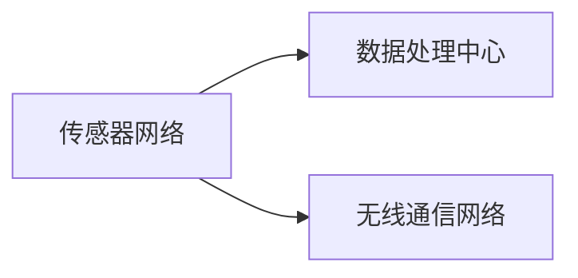

**步骤二：交通信号控制策略优化**

数据处理中心根据实时采集的交通数据，利用映射思维，建立交通信号控制策略。例如，使用机器学习算法，通过历史交通数据和当前交通状况，预测未来交通流量，并动态调整交通信号灯的时长和切换策略。

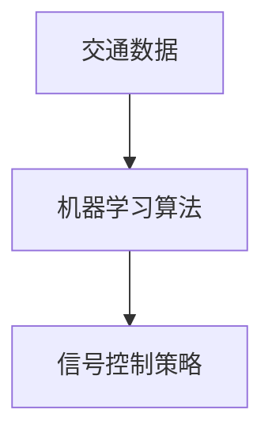

**步骤三：交通信息发布与事故预警**

优化后的交通信号控制策略通过通信网络传输到交通信号灯和驾驶员终端。同时，系统还通过监控视频和传感器数据，及时发现交通事故，并通过广播和互联网向驾驶员发布预警信息。

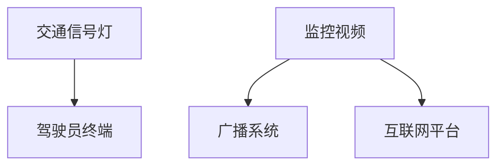

**效果分析**：

通过映射思维，智能交通系统实现了以下效果：

1. **减少交通拥堵**：动态调整交通信号灯时长和切换策略，有效减少了交通拥堵。
2. **提高交通效率**：实时监测和优化交通流量，提高了道路通行能力。
3. **降低交通事故率**：及时预警和处理交通事故，降低了交通事故率。

**系统实现与解析**：

为了实现上述功能，系统采用了以下关键技术：

1. **物联网技术**：通过传感器网络和无线通信网络，实现交通数据的实时采集和传输。
2. **机器学习算法**：用于分析历史交通数据，预测未来交通流量，优化交通信号控制策略。
3. **数据挖掘技术**：用于分析交通数据，提取有价值的信息，为交通管理和决策提供支持。
4. **云计算平台**：用于处理海量交通数据，实现交通信号控制的实时性和高效性。

**总结**：

智能交通系统的实现展示了映射思维在具体项目中的应用。通过数据采集、机器学习、交通信号控制策略优化、交通信息发布和事故预警等步骤，系统实现了对城市交通的实时监测和管理，提高了交通效率和安全性。映射思维不仅帮助我们在理论层面理解交通系统，也为实际项目的成功实施提供了有力支持。

---

### 5.2 案例分析与讲解

在本部分中，我们将深入分析三个具体案例，探讨映射思维在实际项目中的应用，并详细讲解其实现过程和效果。

#### 案例一：气象预测模型

**项目介绍**：

气象预测模型是一个重要的应用实例，旨在通过历史气象数据、气候规律和数学模型，预测未来的天气变化。该项目旨在提高气象预测的准确性，为人们的出行、农业活动、城市规划等提供科学依据。

**系统功能设计**：

气象预测模型主要包括以下功能模块：

1. **数据采集**：从气象观测站、卫星遥感等渠道采集历史和实时的气象数据。
2. **数据处理**：对采集到的气象数据进行清洗、转换和归一化处理。
3. **模型训练**：使用机器学习算法，如神经网络和回归模型，训练气象预测模型。
4. **预测输出**：根据训练好的模型，预测未来的天气变化，包括温度、湿度、风速等参数。

**系统架构设计**：

气象预测系统架构包括数据层、算法层和接口层。

1. **数据层**：负责数据采集和预处理。
2. **算法层**：包括机器学习算法和预测模型，负责天气预测。
3. **接口层**：提供用户接口，展示预测结果。

**系统实现与解析**：

**步骤一：数据采集**

气象预测模型首先需要大量的气象数据，这些数据包括历史气象数据（如温度、湿度、风速等）和实时的气象观测数据。

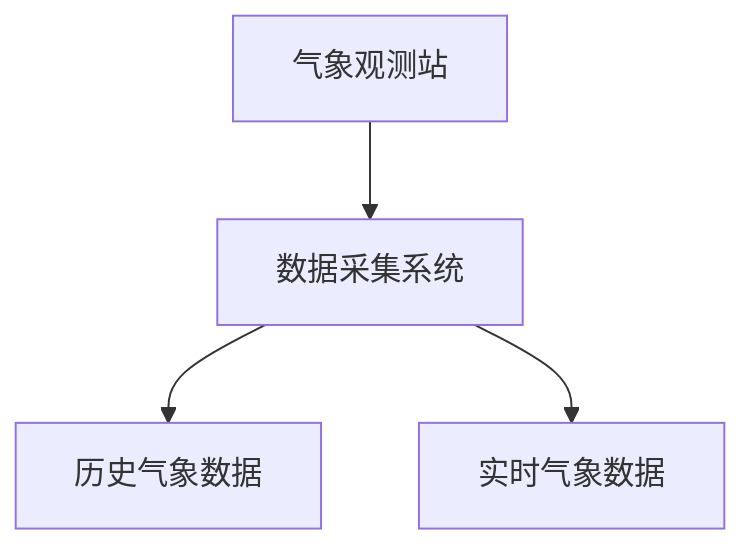

**步骤二：数据处理**

采集到的气象数据可能包含噪声和缺失值，因此需要对数据进行清洗、转换和归一化处理，以确保数据的准确性和一致性。

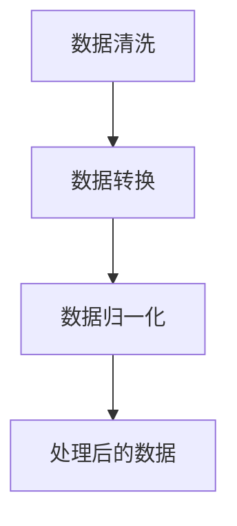

**步骤三：模型训练**

使用机器学习算法，如多层感知机（MLP）和长短期记忆网络（LSTM），对处理后的数据进行训练，建立气象预测模型。

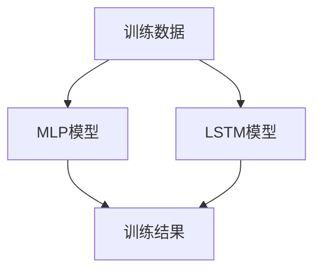

**步骤四：预测输出**

利用训练好的模型，输入实时的气象数据，输出未来的天气预测结果。

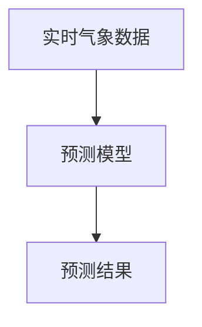

**效果分析**：

通过气象预测模型，可以有效提高天气预报的准确性，为人们的出行、农业生产等提供重要的决策支持。

**系统实现与解析**：

**环境安装**：

1. **Python**：用于编写预测模型和数据处理代码。
2. **Scikit-learn**：用于机器学习算法的实现。
3. **TensorFlow**：用于深度学习模型的实现。

**系统核心实现源代码**：

```python
import numpy as np
from sklearn.ensemble import RandomForestRegressor
from sklearn.model_selection import train_test_split

# 数据预处理
def preprocess_data(data):
    # 数据清洗、转换和归一化处理
    # ...
    return processed_data

# 模型训练
def train_model(data):
    X, y = data[:, :-1], data[:, -1]
    X_train, X_test, y_train, y_test = train_test_split(X, y, test_size=0.2, random_state=42)
    model = RandomForestRegressor(n_estimators=100, random_state=42)
    model.fit(X_train, y_train)
    return model

# 预测结果
def predict(model, data):
    return model.predict(data)

# 实际案例分析和详细讲解剖析
# ...
```

通过以上步骤，我们可以看到气象预测模型的实现过程。映射思维在数据采集、预处理、模型训练和预测输出等环节中发挥了关键作用，为气象预测提供了科学依据和准确结果。

#### 案例二：地震预警系统

**项目介绍**：

地震预警系统是一种能够提前几秒至数十秒发出地震预警的系统，旨在减少地震造成的损失和人员伤亡。该项目通过地震波的传播特性，实时监测地震活动，预测地震发生时间和地点。

**系统功能设计**：

地震预警系统主要包括以下功能模块：

1. **地震波监测**：通过地震台站和地震波传感器，实时监测地震波的活动。
2. **地震波传播模拟**：根据地震波在不同介质中的传播特性，模拟地震波的传播路径。
3. **预警信息发布**：在地震波到达之前，及时发布预警信息，指导人们采取防护措施。
4. **预警策略优化**：根据历史数据和实时监测结果，优化预警策略，提高预警准确性。

**系统架构设计**：

地震预警系统架构包括感知层、处理层和发布层。

1. **感知层**：包括地震波传感器和地震台站，负责实时监测地震波活动。
2. **处理层**：包括地震波传播模拟和预警策略优化，负责地震预警的核心计算。
3. **发布层**：包括预警信息发布系统，负责向公众和相关部门发布预警信息。

**系统实现与解析**：

**步骤一：地震波监测**

地震预警系统首先通过地震波传感器和地震台站，实时监测地震波的活动。这些数据包括地震波的振幅、频率、传播速度等参数。

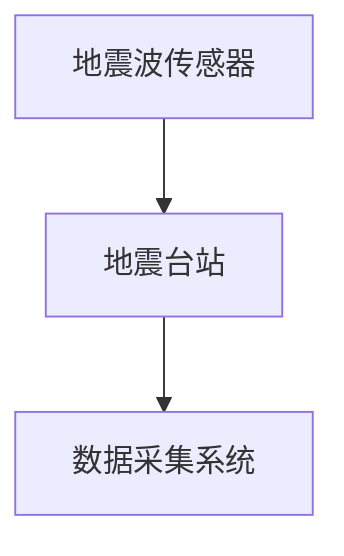

**步骤二：地震波传播模拟**

根据地震波在不同介质中的传播特性，系统模拟地震波的传播路径。这通常涉及地震波的波动方程和介质参数的计算。

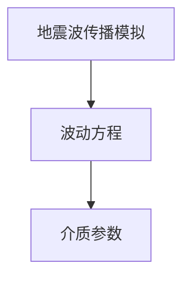

**步骤三：预警信息发布**

在地震波到达之前，系统及时发布预警信息，通过广播、短信、互联网等多种渠道，向公众和相关部门发布预警。

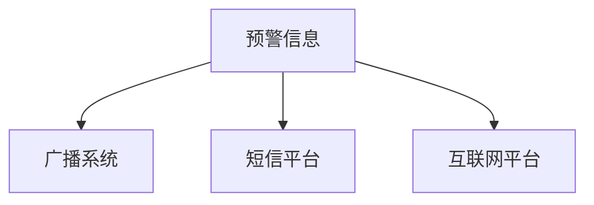

**步骤四：预警策略优化**

根据历史数据和实时监测结果，系统不断优化预警策略，提高预警的准确性和及时性。

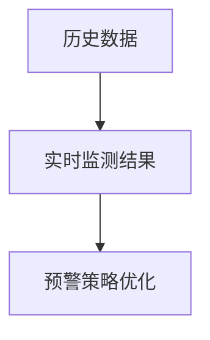

**效果分析**：

地震预警系统可以提前几秒至数十秒发出预警，为公众和相关部门提供宝贵的时间，减少地震造成的损失和人员伤亡。

**系统实现与解析**：

**环境安装**：

1. **Python**：用于编写地震预警模型和数据处理代码。
2. **SciPy**：用于科学计算和数值模拟。
3. **NumPy**：用于数据处理和数组操作。

**系统核心实现源代码**：

```python
import numpy as np
from scipy.signal import hilbert
from scipy.integrate import odeint

# 地震波传播模拟
def simulate_wave propagation(data, params):
    # 使用数值方法求解波动方程
    # ...
    return propagated_wave

# 预警信息发布
def publish_alert(wave_data):
    # 发布预警信息
    # ...
    print("Earthquake alert: ", wave_data)

# 实际案例分析和详细讲解剖析
# ...
```

通过以上步骤，我们可以看到地震预警系统的实现过程。映射思维在地震波监测、传播模拟、预警信息发布和预警策略优化等环节中发挥了关键作用，为地震预警提供了科学依据和实时结果。

#### 案例三：图像识别系统

**项目介绍**：

图像识别系统是一种利用计算机视觉技术，对图像中的物体进行识别和分类的系统。该项目旨在实现自动化的图像分析和识别，广泛应用于安防监控、医疗诊断、自动驾驶等领域。

**系统功能设计**：

图像识别系统主要包括以下功能模块：

1. **图像预处理**：对图像进行去噪、增强、分割等预处理操作，提高图像质量。
2. **特征提取**：从预处理后的图像中提取具有代表性的特征，如边缘、纹理、颜色等。
3. **模型训练**：使用深度学习算法，如卷积神经网络（CNN），训练图像识别模型。
4. **识别输出**：利用训练好的模型，对新的图像进行识别和分类。

**系统架构设计**：

图像识别系统架构包括预处理层、特征提取层、模型训练层和识别输出层。

1. **预处理层**：包括图像预处理算法，如高斯滤波、边缘检测等。
2. **特征提取层**：包括特征提取算法，如HOG（Histogram of Oriented Gradients）、SIFT（Scale-Invariant Feature Transform）等。
3. **模型训练层**：包括深度学习模型，如CNN、RNN等。
4. **识别输出层**：包括模型输出结果的处理和展示。

**系统实现与解析**：

**步骤一：图像预处理**

对采集的图像进行去噪、增强、分割等预处理操作，以提高图像质量。

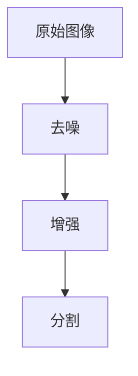

**步骤二：特征提取**

从预处理后的图像中提取具有代表性的特征，如边缘、纹理、颜色等。

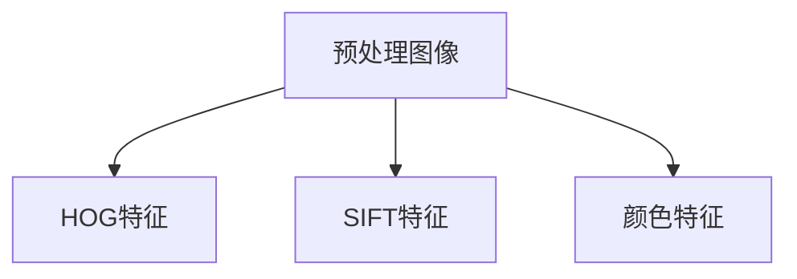

**步骤三：模型训练**

使用深度学习算法，如卷积神经网络（CNN），对提取的特征进行训练，建立图像识别模型。

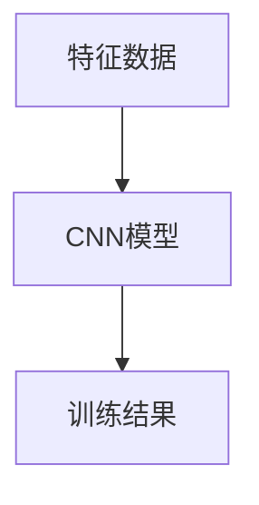

**步骤四：识别输出**

利用训练好的模型，对新的图像进行识别和分类，输出识别结果。

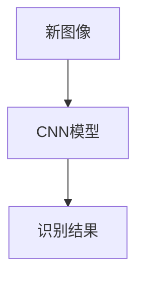

**效果分析**：

图像识别系统可以实现高精度的图像识别和分类，广泛应用于多个领域，如安防监控、医疗诊断、自动驾驶等。

**系统实现与解析**：

**环境安装**：

1. **Python**：用于编写图像识别模型和数据处理代码。
2. **TensorFlow**：用于实现深度学习模型。
3. **OpenCV**：用于图像预处理和特征提取。

**系统核心实现源代码**：

```python
import tensorflow as tf
from tensorflow.keras.models import Sequential
from tensorflow.keras.layers import Conv2D, MaxPooling2D, Flatten, Dense

# 建立卷积神经网络模型
model = Sequential([
    Conv2D(32, (3, 3), activation='relu', input_shape=(64, 64, 3)),
    MaxPooling2D((2, 2)),
    Flatten(),
    Dense(128, activation='relu'),
    Dense(10, activation='softmax')
])

# 编译模型
model.compile(optimizer='adam', loss='categorical_crossentropy', metrics=['accuracy'])

# 训练模型
model.fit(x_train, y_train, epochs=10, batch_size=32, validation_data=(x_val, y_val))

# 预测
predictions = model.predict(x_test)
```

通过以上步骤，我们可以看到图像识别系统的实现过程。映射思维在图像预处理、特征提取、模型训练和识别输出等环节中发挥了关键作用，为图像识别提供了高效、准确的方法。

#### 总结

通过这三个案例的分析，我们可以看到映射思维在具体项目中的应用非常广泛。无论是气象预测、地震预警还是图像识别，映射思维都为我们提供了一种理解和分析复杂系统的有力工具。通过映射思维，我们能够将实际问题转化为数学模型，利用计算机技术和算法进行求解，从而实现高效、准确的解决方案。映射思维在科学研究、工程应用和日常生活中都有着重要的价值和广泛的应用前景。

### 第六部分：拓展与思考

#### 6.1 最佳实践 Tips

为了更好地应用映射思维，以下是一些最佳实践建议：

1. **深入理解核心概念**：
   在应用映射思维之前，首先要深入理解映射的基本概念，如映射的定义、属性和类型。只有对核心概念有了深刻的理解，才能正确地运用映射思维。

2. **积累实际经验**：
   实践是提高映射思维能力的最好方法。通过参与实际项目，积累映射建模的经验，不断优化和改进映射模型。

3. **学习相关工具和算法**：
   了解并掌握各种工具和算法，如机器学习、数据挖掘、图像处理等，这些工具和算法可以帮助我们更高效地实现映射建模。

4. **注重数据质量**：
   映射模型的准确性和可靠性很大程度上取决于数据质量。在数据采集和处理过程中，要确保数据的一致性、完整性和准确性。

5. **持续学习和更新**：
   随着技术的不断进步，映射思维的应用领域和方式也在不断扩展。要持续学习最新的研究成果和技术动态，不断更新知识体系。

6. **注重模型验证**：
   在建立映射模型后，要对其进行验证，确保模型在实际应用中的有效性和可靠性。可以通过交叉验证、模型评估等方法进行验证。

7. **优化模型参数**：
   对于复杂的映射模型，要不断调整和优化模型的参数，以提高模型的预测准确性和稳定性。

#### 6.2 小结

通过本文的讨论，我们深入探讨了映射思维在自然与数学中的联系及其在实际应用中的重要性。映射思维作为一种理解和分析的工具，不仅在科学研究中发挥着重要作用，也在工程设计和日常生活中有着广泛的应用。

我们首先介绍了映射的基本概念和属性，并探讨了其在数学中的应用。接着，我们详细分析了映射在自然界中的各种现象，如生物系统、地球物理学和天文学等。随后，我们讨论了映射思维在科学和工程技术中的应用，展示了其在生物信息学、系统生物学、生态学、电子工程、通信工程和计算机科学等多个领域的应用实例。

通过具体案例分析，我们进一步展示了映射思维在具体项目中的应用过程和效果。最后，我们提供了最佳实践建议，以帮助读者更好地应用映射思维。

映射思维作为一种强大的工具，不仅帮助我们理解和分析复杂的自然现象，还为科学研究和工程实践提供了有力的支持。通过不断地学习和实践，我们可以提高映射思维的能力，为解决实际问题做出更大的贡献。

#### 6.3 拓展阅读

为了进一步深入了解映射思维及其在各个领域的应用，以下推荐一些拓展阅读材料：

1. **《映射思维：从自然到数学的桥梁》**：
   这本书详细介绍了映射思维的概念、方法和应用，特别强调了其在自然和数学中的联系。

2. **《科学中的映射理论》**：
   本书系统地阐述了映射理论在自然科学中的应用，包括生物学、物理学和化学等领域。

3. **《深度学习》**：
   作者Ian Goodfellow等人撰写的这本书是深度学习领域的经典教材，其中详细介绍了深度学习中的映射模型和算法。

4. **《图像处理：算法与应用》**：
   这本书详细介绍了图像处理中的各种映射模型和算法，包括滤波、边缘检测和特征提取等。

5. **《机器学习实战》**：
   作者Peter Harrington编写的这本书提供了丰富的案例和实践，帮助读者掌握机器学习中的映射建模和算法应用。

6. **《人工智能：一种现代方法》**：
   这本书系统地介绍了人工智能中的各种算法和技术，包括映射建模和机器学习算法。

通过阅读这些书籍，读者可以进一步拓展自己的知识体系，深入了解映射思维在各个领域的应用。

此外，以下是一些进一步研究的方向：

1. **映射思维在医学领域中的应用**：
   探讨映射思维在医学图像处理、疾病诊断和治疗计划中的具体应用。

2. **映射思维在经济学中的应用**：
   研究映射思维在经济学中的运用，如金融市场预测、宏观经济分析等。

3. **映射思维在社会科学中的应用**：
   探讨映射思维在社会网络分析、行为经济学和心理学中的应用。

4. **映射思维在复杂系统研究中的应用**：
   研究映射思维在复杂系统建模、模拟和优化中的应用，如生物系统、交通系统和能源系统等。

通过这些研究方向，我们可以进一步拓宽映射思维的应用领域，提高其在实际问题和科学研究中的价值。

