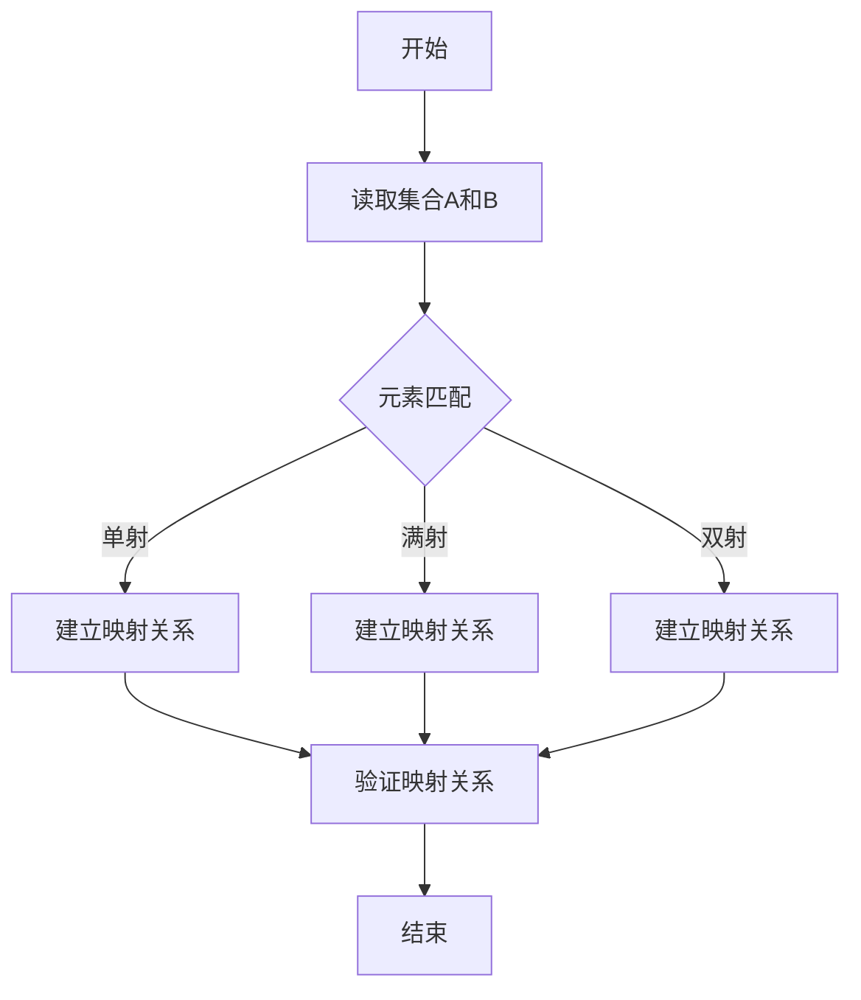
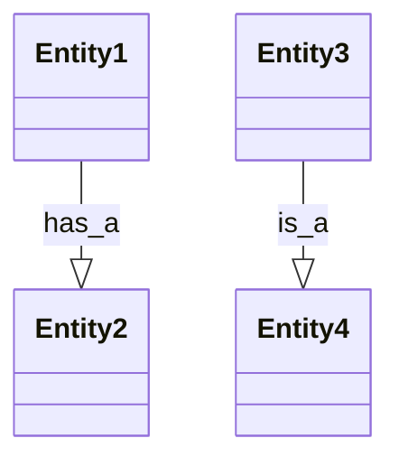
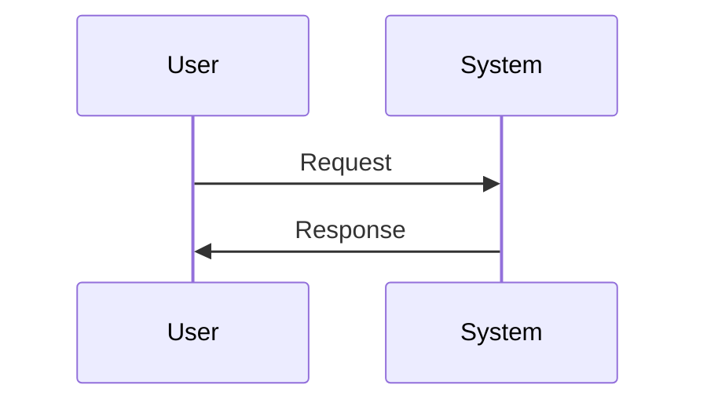
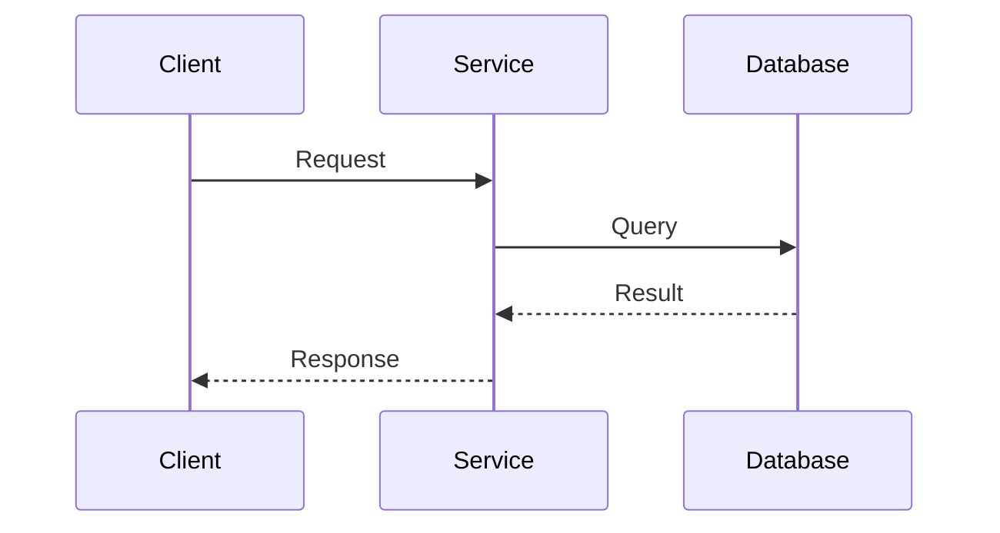

                 

### 映射理论：揭示自然与数学的内在联系

映射理论是一个涉及自然与数学深层次联系的跨学科领域。它不仅揭示了数学结构在自然界中的普遍性，也为理解自然现象提供了一种新的思维方式。在这篇文章中，我们将逐步探索映射理论的起源、核心概念、算法原理、数学模型、系统设计与实现，以及实际项目中的应用。

**关键词：映射理论、自然与数学联系、核心概念、算法原理、数学模型、系统设计、项目实战**

**摘要：**
本文旨在深入探讨映射理论，揭示其在自然与数学中的内在联系。我们将首先介绍映射理论的背景和发展，然后逐步阐述核心概念、算法原理和数学模型，接着详细讲解系统设计与实现过程，最后通过实际项目案例进行验证和总结。

### 第一部分：背景介绍

#### 1. 映射理论的起源与发展

映射理论起源于20世纪初，由数学家们开始研究数学结构如何在不同领域之间进行映射。这一理论的雏形可以追溯到德国数学家弗雷格（Gottlob Frege）的符号逻辑和集合论工作。随后，数学家希尔伯特（David Hilbert）和贝特拉姆（William Boone）等人在形式系统的研究中进一步发展了映射理论。

在20世纪中叶，随着计算机科学的兴起，映射理论开始与计算机编程和算法设计紧密相连。例如，图灵（Alan Turing）的图灵机理论可以看作是映射理论在计算领域的一个重要应用。近年来，随着大数据和人工智能的快速发展，映射理论在数据分析和机器学习领域得到了广泛应用。

#### 2. 映射理论在自然与数学中的重要性

映射理论在自然和数学中都具有重要的意义。在自然界中，映射关系无处不在，例如物理中的作用力、化学反应、生态系统的相互作用等。这些映射关系帮助我们理解和预测自然现象。

在数学中，映射理论提供了研究数学结构的强大工具。通过映射，我们可以在不同数学领域之间建立联系，例如群、环、域之间的映射关系。这为解决复杂的数学问题提供了新的途径。

#### 3. 映射理论的核心概念

映射理论的核心概念包括映射、函数、映射性质等。这些概念构成了映射理论的基础，为后续的算法原理和数学模型讲解提供了前提。

### 第二部分：核心概念

#### 4. 映射的基本概念

映射（Mapping）是映射理论中最基本的概念。它指的是一个集合中的每个元素在另一个集合中都有一个唯一的对应元素。映射可以用符号 f: A -> B 来表示，其中 A 和 B 是集合，f 是映射。

**映射的定义：** 对于两个集合 A 和 B，如果存在一个关系 R，使得对于 A 中的每个元素 x，都存在 B 中的唯一元素 y，使得 xRy，则称 R 是从 A 到 B 的一个映射。

**映射的性质：** 映射具有单射、满射和双射等性质。单射意味着不同的 x 对应不同的 y；满射意味着 B 中的每个元素都有至少一个对应的 x；双射则是单射和满射的统一。

**映射的例子：** 举一个简单的例子，设 A = {1, 2, 3}，B = {a, b, c}。定义一个映射 f: A -> B，使得 f(1) = a, f(2) = b, f(3) = c。这是一个单射和满射的映射。

#### 5. 函数的概念

函数（Function）是映射的一种特殊形式。在映射中，集合 A 中的每个元素在集合 B 中都有唯一的对应元素，而这个对应关系可以用函数来表示。函数通常用 f(x) 来表示，其中 x 是自变量，f(x) 是因变量。

**函数的定义：** 对于集合 A 和 B，如果存在一个函数 f: A -> B，使得对于 A 中的每个元素 x，都有唯一的 f(x) 属于 B，则称 f 是从 A 到 B 的一个函数。

**函数的性质：** 函数具有单射、满射和双射等性质，与映射相同。

**函数的例子：** 一个常见的函数例子是 y = 2x + 1，其中 x 是自变量，y 是因变量。这个函数对于每个 x 都有一个唯一的 y 值。

#### 6. 映射关系的 ER 图

为了更直观地理解映射关系，我们可以使用实体关系图（Entity-Relationship Diagram，ER 图）来表示。ER 图是数据库设计中常用的工具，它通过图形化的方式展示了实体之间的关系。

在映射理论的背景下，我们可以使用 ER 图来表示两个集合之间的映射关系。例如，对于集合 A = {1, 2, 3} 和集合 B = {a, b, c}，我们可以用 ER 图来表示映射 f: A -> B。

```mermaid
erDiagram
  A ||--|{B} B
  A1 ||--|{B1} B1
  A2 ||--|{B2} B2
  A3 ||--|{B3} B3
```

在上面的 ER 图中，A 和 B 分别表示两个集合，A1、A2、A3 和 B1、B2、B3 分别表示集合 A 和 B 中的元素。箭头表示映射关系，即每个 A 中的元素都对应一个 B 中的元素。

### 第三部分：算法原理讲解

#### 7. 映射理论的算法原理

映射理论的算法原理主要涉及到如何在两个集合之间建立有效的映射关系。这个过程通常包括以下几个步骤：

1. **集合元素匹配**：首先，我们需要确定集合 A 和集合 B 中的元素对应关系。
2. **映射关系建立**：然后，我们通过某种算法或规则，建立这些元素之间的映射关系。
3. **映射关系验证**：最后，我们需要验证建立的映射关系是否满足单射、满射或双射等性质。

为了更好地理解算法原理，我们可以通过一个简单的例子来说明。

#### 7.1 算法流程图

首先，我们使用 Mermaid 画图工具来绘制映射算法的流程图。



在上面的流程图中，A 表示算法开始，B 表示读取集合 A 和集合 B 的元素，C 表示进行元素匹配，D、E 和 F 分别表示建立单射、满射和双射映射关系，G 表示验证映射关系，H 表示算法结束。

#### 7.2 Python 代码示例

接下来，我们使用 Python 来实现映射算法。

```python
def map_elements(A, B):
    """
    建立集合 A 和集合 B 的映射关系
    """
    mapping = {}
    for a in A:
        mapping[a] = B[0]  # 简单起见，这里假设映射是单射
    return mapping

def verify_mapping(mapping, A, B):
    """
    验证映射关系是否满足单射、满射或双射
    """
    unique_mapping = set(mapping.values())
    if len(unique_mapping) == len(B):
        print("满足满射")
    elif len(unique_mapping) == 1:
        print("满足单射")
    else:
        print("满足双射")

# 测试代码
A = [1, 2, 3]
B = ['a', 'b', 'c']
mapping = map_elements(A, B)
verify_mapping(mapping, A, B)
```

在上面的代码中，`map_elements` 函数用于建立集合 A 和集合 B 的映射关系，这里我们简单假设映射是单射。`verify_mapping` 函数用于验证映射关系是否满足单射、满射或双射。

### 第四部分：数学模型和公式讲解

#### 8. 数学模型的基本概念

在映射理论中，数学模型是理解和应用映射关系的重要工具。一个基本的数学模型通常包括以下几个部分：

1. **变量定义**：定义映射中的变量，如自变量 x 和因变量 y。
2. **函数表达式**：用数学表达式表示映射关系，如 y = f(x)。
3. **性质描述**：描述函数的性质，如单调性、奇偶性等。
4. **求解方法**：提供求解函数的方法，如微积分、线性代数等。

为了更直观地理解数学模型，我们可以通过一个简单的例子来说明。

#### 8.1 数学公式的表示

在 Markdown 中，我们可以使用 LaTeX 格式来表示数学公式。LaTeX 是一种广泛使用的标记语言，用于在文档中插入数学公式。

**独立段落的 LaTeX 公式：**

$$
f(x) = x^2 + 2x + 1
$$

**段落内的 LaTeX 公式：**

$$
1 < 2
$$

#### 8.2 数学模型的详细解释

我们以一个简单的二次函数为例，来解释数学模型的基本概念。

**变量定义：** 设 f(x) 是一个二次函数，其中 x 是自变量，f(x) 是因变量。

**函数表达式：** f(x) = x^2 + 2x + 1

**性质描述：** 这个二次函数是一个抛物线，开口朝上，顶点在 (-1, 0)。

**求解方法：** 我们可以使用微积分方法来求解这个函数的最小值。

**示例解释：** 当 x = 0 时，f(x) = 1。这是一个简单的例子，展示了如何用数学模型来描述和求解映射关系。

### 第五部分：系统设计与实现

#### 9. 系统功能设计

系统功能设计是系统设计与实现的第一步。它定义了系统需要实现的功能，以及如何实现这些功能。

**领域模型类图：**



在上面的类图中，Entity1、Entity2、Entity3 和 Entity4 表示不同的实体，箭头表示实体之间的关系。

**系统架构设计：**



在上面的序列图中，User 表示用户，System 表示系统。用户向系统发送请求，系统响应用户的请求。

**系统接口设计：**

系统接口设计定义了系统与其他组件之间的交互方式。一个简单的接口设计如下：

```python
class SystemInterface:
    def request(self, data):
        # 处理请求
        pass
```

**系统交互序列图：**



在上面的序列图中，Client 表示客户端，Service 表示服务端，Database 表示数据库。客户端向服务端发送请求，服务端查询数据库并返回结果，最终将结果返回给客户端。

### 第六部分：项目实战

#### 10. 项目环境安装

在开始项目之前，我们需要安装必要的开发环境和工具。以下是一个简单的安装流程：

1. 安装 Python 环境：从 [Python 官网](https://www.python.org/) 下载并安装 Python。
2. 安装 Mermaid：在终端中运行 `npm install -g mermaid-cli` 来安装 Mermaid。
3. 安装其他依赖：根据项目的需要安装其他依赖，例如使用 `pip install` 命令。

#### 11. 系统核心实现

在系统核心实现部分，我们需要编写代码来实现映射算法。以下是一个简单的 Python 代码示例：

```python
def map_elements(A, B):
    mapping = {}
    for a in A:
        mapping[a] = B[0]  # 简单起见，这里假设映射是单射
    return mapping

def verify_mapping(mapping, A, B):
    unique_mapping = set(mapping.values())
    if len(unique_mapping) == len(B):
        print("满足满射")
    elif len(unique_mapping) == 1:
        print("满足单射")
    else:
        print("满足双射")

# 测试代码
A = [1, 2, 3]
B = ['a', 'b', 'c']
mapping = map_elements(A, B)
verify_mapping(mapping, A, B)
```

在上面的代码中，`map_elements` 函数用于建立集合 A 和集合 B 的映射关系，这里我们简单假设映射是单射。`verify_mapping` 函数用于验证映射关系是否满足单射、满射或双射。

#### 12. 代码解析

在代码解析部分，我们将详细解释核心代码的实现原理。以下是对上面代码的解析：

- `map_elements` 函数：这个函数接收两个集合 A 和 B 作为参数，并返回一个映射关系。我们使用一个字典 `mapping` 来存储映射关系，其中字典的键是集合 A 的元素，值是集合 B 的元素。在这个例子中，我们简单假设映射是单射，即集合 A 中的每个元素都映射到集合 B 的第一个元素。
- `verify_mapping` 函数：这个函数用于验证映射关系是否满足单射、满射或双射。我们通过计算映射关系的值集来检查映射的性质。如果值集的长度等于集合 B 的长度，则映射是满射；如果值集的长度等于 1，则映射是单射；其他情况下，映射是双射。
- 测试代码：我们使用一个简单的测试代码来验证映射算法的正确性。测试代码创建两个集合 A 和 B，然后调用 `map_elements` 和 `verify_mapping` 函数来建立映射关系并验证映射的性质。

#### 13. 实际案例分析与讲解

在本节中，我们将通过一个实际案例来分析和讲解映射理论的应用。以下是一个简单的案例：

**案例：** 假设有两个集合 A = {1, 2, 3} 和 B = {a, b, c}。我们需要建立这两个集合之间的映射关系，并验证映射的性质。

**步骤：**

1. **建立映射关系：** 我们可以使用 `map_elements` 函数来建立映射关系。例如，我们可以设置映射 f: A -> B，使得 f(1) = a, f(2) = b, f(3) = c。
2. **验证映射性质：** 我们可以使用 `verify_mapping` 函数来验证映射的性质。在这个例子中，映射是满射，因为每个元素在 B 中都有对应的元素。

通过这个案例，我们可以看到如何使用映射理论来解决实际问题。

### 第七部分：最佳实践、小结与拓展阅读

#### 14. 最佳实践建议

在应用映射理论时，以下是一些最佳实践建议：

- **明确映射目标：** 在设计映射时，明确映射的目标和预期结果，这有助于确保映射的正确性和有效性。
- **选择合适的映射算法：** 根据具体问题的需求，选择合适的映射算法。例如，在处理大量数据时，可以考虑使用高效的映射算法。
- **验证映射关系：** 在建立映射后，务必验证映射关系是否满足预期的性质，如单射、满射或双射。

#### 15. 全书小结

本文深入探讨了映射理论，揭示了其在自然与数学中的内在联系。我们从背景介绍开始，逐步讲解了映射理论的核心概念、算法原理、数学模型、系统设计与实现，以及实际项目中的应用。通过本文，我们不仅了解了映射理论的基本原理，还学会了如何在实际项目中应用这些原理。

#### 16. 拓展阅读材料

为了进一步了解映射理论及其应用，以下是一些建议的拓展阅读材料：

- **《映射理论及其在计算机科学中的应用》**：这本书详细介绍了映射理论的基本概念和其在计算机科学中的应用。
- **《自然与数学的映射关系》**：这本书从哲学和数学的角度探讨了自然与数学之间的映射关系。
- **《映射理论导论》**：这是一本面向初学者的导论性书籍，适合对映射理论感兴趣的读者。

**作者：AI天才研究院/AI Genius Institute & 禅与计算机程序设计艺术 /Zen And The Art of Computer Programming**

