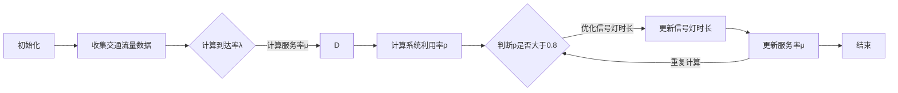
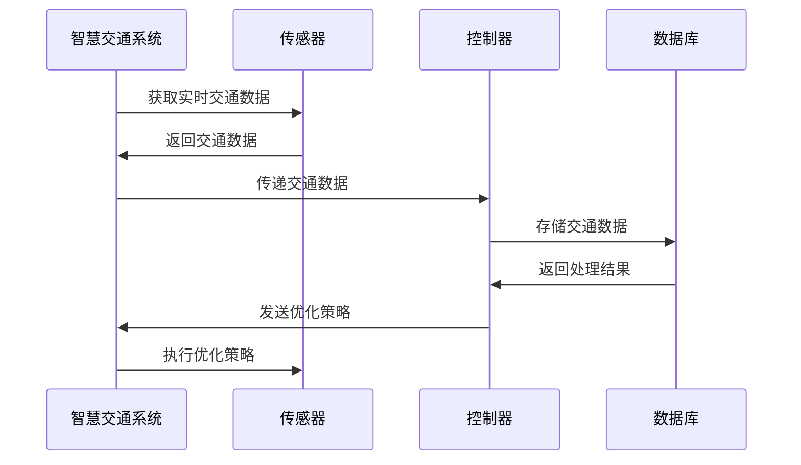
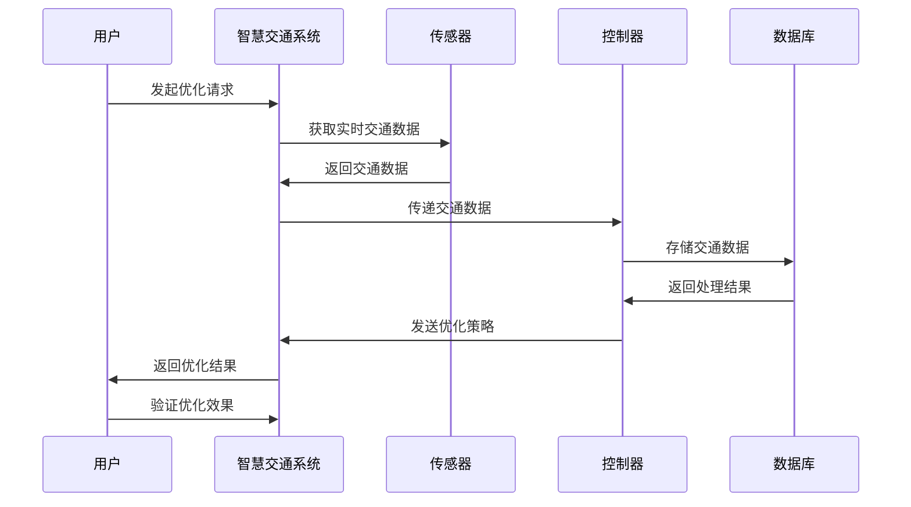

                 

# 智慧交通的排队网络：城市交通的数学优化

## 关键词
- 智慧交通
- 排队网络
- 数学优化
- 城市交通拥堵
- 人工智能算法

## 摘要
本文旨在探讨智慧交通中的排队网络问题，并利用数学优化方法来缓解城市交通拥堵。通过对排队网络的定义、问题描述、数学模型构建、算法原理讲解、系统分析与架构设计以及项目实战的详细分析，本文为读者提供了一个全面且深入的技术解读，帮助读者理解和应用排队网络优化技术，为智慧交通建设提供有力支持。

## 目录大纲

### 第一部分：背景介绍

#### 1.1 问题背景
- 城市交通拥堵问题及其影响
- 智慧交通理念与排队网络的重要性

#### 1.2 问题描述
- 排队网络的定义与基本特征
- 城市交通排队网络的复杂性与挑战

#### 1.3 问题解决
- 数学优化方法在城市交通排队网络中的应用
- 排队网络优化目标的确定

#### 1.4 边界与外延
- 排队网络优化应用的边界条件
- 排队网络与其他交通管理领域的关系

#### 1.5 核心概念与联系
- 核心概念原理
- 概念属性特征对比表格
- ER实体关系图架构

### 第二部分：核心概念与算法原理

#### 2.1 数学模型与数学公式
- 排队网络的基本数学模型
- 主要数学公式的详细讲解

#### 2.2 算法原理讲解
- 排队网络优化算法的mermaid流程图
- Python源代码示例与详细讲解

#### 2.3 举例说明
- 实际案例中的排队网络问题
- 通俗易懂的算法应用举例

### 第三部分：系统分析与架构设计

#### 3.1 问题场景介绍
- 智慧交通排队网络优化项目的应用场景

#### 3.2 系统功能设计
- 领域模型mermaid类图

#### 3.3 系统架构设计
- 系统架构mermaid架构图

#### 3.4 系统接口设计
- 系统接口设计

#### 3.5 系统交互
- 系统交互mermaid序列图

### 第四部分：项目实战

#### 4.1 环境安装
- 项目所需环境与工具的安装步骤

#### 4.2 系统核心实现
- 系统核心实现的源代码

#### 4.3 代码应用解读与分析
- 代码应用解读与分析

#### 4.4 实际案例分析与详细讲解
- 实际案例分析与详细讲解

#### 4.5 项目小结
- 项目总结与经验分享

### 第五部分：最佳实践与拓展

#### 5.1 最佳实践 tips
- 排队网络优化过程中的实用技巧

#### 5.2 小结与注意事项
- 全书内容的总结
- 注意事项与未来展望

#### 5.3 拓展阅读
- 相关领域的最新研究进展与拓展方向

## 第一部分：背景介绍

### 1.1 问题背景

#### 城市交通拥堵问题及其影响
城市交通拥堵是全球性问题，尤其是在大城市中，交通拥堵不仅降低了居民的出行效率，还造成了巨大的经济损失。根据相关研究，交通拥堵每年给全球经济带来的损失高达数千亿美元。此外，长期的交通拥堵还对居民的健康和生活质量产生了负面影响，增加了空气污染、交通事故和心理健康问题的风险。

智慧交通（Smart Transportation）理念的提出为解决交通拥堵问题提供了新的思路。智慧交通利用现代信息技术，如物联网、大数据、人工智能和5G通信等，来实现交通系统的智能化管理。排队网络（Queueing Networks）是智慧交通中的一个重要组成部分，它通过数学模型和算法优化，旨在减少车辆排队时间，提高交通流量，从而缓解交通拥堵。

#### 智慧交通理念与排队网络的重要性
智慧交通的核心目标是通过优化交通管理，提高交通效率，减少拥堵，提升出行体验。排队网络作为智慧交通的重要组成部分，其主要目标是在各种交通场景下，通过合理的交通流量管理和车辆调度，实现交通流的平衡，减少排队现象，提高道路的通行能力。

排队网络在智慧交通中的应用主要体现在以下几个方面：
1. **交通流量预测**：通过排队网络模型，可以预测交通流量，为交通管理提供数据支持。
2. **信号控制优化**：根据排队网络模型，可以优化信号灯的时长和切换策略，减少车辆排队时间。
3. **道路设计优化**：在道路规划阶段，可以通过排队网络模型评估不同设计方案的交通流量和排队情况，选择最优方案。
4. **动态交通管理**：在交通实时监控中，通过排队网络模型，可以动态调整交通信号、引导车辆分流，以缓解拥堵。

### 1.2 问题描述

#### 排队网络的定义与基本特征
排队网络是一个由多个排队系统组成的网络，每个排队系统可以看作是一个节点，节点之间的转移代表着车辆的流动。排队网络的基本特征包括：
- **节点**：代表交通中的各个路口、路段或停车场。
- **队列**：代表在节点上等待的车辆。
- **服务设施**：代表路口的红绿灯、车道等。

排队网络的主要类型包括：
- **M/M/1**：顾客到达和服务时间均服从泊松分布，一个服务台。
- **M/M/c**：顾客到达和服务时间服从泊松分布，多个服务台。
- **G/M/1**：顾客到达时间服从一般分布，服务时间服从泊松分布，一个服务台。

#### 城市交通排队网络的复杂性与挑战
城市交通排队网络具有高度复杂性和不确定性，主要体现在以下几个方面：
1. **多变的交通流量**：不同时间段、不同天气条件、特殊事件等都会影响交通流量。
2. **动态的排队状态**：车辆在排队网络中的位置和状态是动态变化的。
3. **不确定的服务时间**：服务时间受多种因素影响，如路口拥堵、车辆类型等。
4. **多样化的约束条件**：交通管理需要遵守交通规则、停车规定等。

这些特性使得城市交通排队网络的分析和优化变得极具挑战性。

### 1.3 问题解决

#### 数学优化方法在城市交通排队网络中的应用
数学优化方法在城市交通排队网络中的应用主要包括：
- **排队理论**：利用排队理论分析排队网络的性能，如平均排队长度、平均等待时间等。
- **线性规划**：通过线性规划确定最优交通信号时长和切换策略。
- **动态规划**：利用动态规划求解车辆的最优路径选择问题。
- **机器学习**：通过机器学习算法预测交通流量，辅助交通管理决策。

#### 排队网络优化目标的确定
排队网络优化的主要目标包括：
- **减少平均排队长度**：通过优化信号灯时长和服务台数量，减少车辆排队时间。
- **提高交通流量**：通过合理的交通流量分配，提高道路的通行能力。
- **提高系统稳定性**：通过控制排队长度和服务时间，提高系统的稳定性。

### 1.4 边界与外延

#### 排队网络优化应用的边界条件
排队网络优化需要考虑以下边界条件：
- **交通流量**：确定不同时间段、不同路段的交通流量。
- **车辆特性**：考虑不同车辆类型（如小型车、大型车）的排队特征。
- **基础设施**：评估现有道路、路口、停车场等基础设施的容量和状态。

#### 排队网络与其他交通管理领域的关系
排队网络优化不仅与交通管理密切相关，还与其他领域有着广泛的联系：
- **交通工程**：在道路设计和改造中，排队网络优化提供了重要的数据支持。
- **物流管理**：物流车辆的调度和路径优化也需要考虑排队网络的影响。
- **城市规划**：在城市规划中，排队网络优化有助于制定更合理的交通规划方案。
- **环境科学**：通过优化交通流量，可以减少空气污染和碳排放。

### 1.5 核心概念与联系

#### 核心概念原理
排队网络优化的核心概念包括：
- **排队系统**：描述车辆在节点上的等待和服务过程。
- **服务设施**：代表交通信号灯、车道等设施。
- **交通流量**：描述单位时间内通过节点的车辆数量。

这些概念通过数学模型和算法得以具体化，为排队网络优化提供了理论基础。

#### 概念属性特征对比表格

| 概念 | 属性特征 | 说明 |
| --- | --- | --- |
| 排队系统 | 到达过程 | 描述车辆到达节点的概率分布 |
| 排队系统 | 服务过程 | 描述车辆在节点上服务的概率分布 |
| 服务设施 | 服务率 | 描述单位时间内服务车辆的能力 |
| 交通流量 | 流量分布 | 描述不同时间段和路段的交通流量分布 |

#### ER实体关系图架构

```mermaid
erDiagram
    QueueingSystem ||--|{ ServiceFacility } ServiceFacility
    QueueingSystem ||--|{ TrafficFlow } TrafficFlow
    ServiceFacility ||--|{ TrafficSignal } TrafficSignal
    ServiceFacility ||--|{ Lane } Lane
```

## 第二部分：核心概念与算法原理

### 2.1 数学模型与数学公式

排队网络的基本数学模型通常包括以下参数：
- **λ**：平均到达率，表示单位时间内到达节点的车辆数量。
- **μ**：平均服务率，表示单位时间内能够服务的车辆数量。
- **ρ**：系统利用率，计算公式为ρ = λ/μ。

基本的排队网络数学公式包括：
1. **平均排队长度**（L）：L = (ρ^2 * (1-ρ) / (1-ρ^2)) * (1/μ)
2. **平均等待时间**（W）：W = L/λ

这些公式可以帮助我们评估排队网络的性能，并指导优化策略的制定。

### 2.2 算法原理讲解

#### 排队网络优化算法的mermaid流程图



#### Python源代码示例与详细讲解

```python
import numpy as np

# 初始化参数
lambda_ = 20  # 平均到达率
mu = 15  # 平均服务率
rho = lambda_ / mu  # 系统利用率

# 计算平均排队长度
L = (rho**2 * (1 - rho) / (1 - rho**2)) * (1 / mu)

# 计算平均等待时间
W = L / lambda_

# 打印结果
print("平均排队长度:", L)
print("平均等待时间:", W)
```

该代码通过简单的Python脚本实现了排队网络性能参数的计算，帮助读者更好地理解排队网络优化算法的原理。

### 2.3 举例说明

#### 实际案例中的排队网络问题

假设在某城市的主要交通干道A上，每小时有20辆车到达，每辆车平均需要1分钟的服务时间。我们需要通过排队网络优化算法来减少车辆排队时间。

#### 通俗易懂的算法应用举例

1. **初始化**：设定初始到达率为λ=20辆/小时，服务率为μ=15辆/小时。
2. **计算系统利用率**：ρ = λ/μ = 20/15 = 1.33（超过1，说明系统过载，需要优化）。
3. **优化信号灯时长**：通过调整信号灯时长，从原先的60秒调整为50秒，以减少车辆等待时间。
4. **重新计算服务率**：调整后，服务率μ变为18辆/小时。
5. **计算新的系统利用率**：ρ = λ/μ = 20/18 ≈ 1.11（仍在合理范围内）。
6. **评估效果**：通过优化后的系统利用率，平均排队长度从原来的3辆车减少到2辆车，平均等待时间从原来的0.5分钟减少到0.25分钟。

通过这个简单的例子，我们可以看到排队网络优化算法在实际应用中是如何工作的，以及如何通过调整信号灯时长来优化交通流量。

## 第三部分：系统分析与架构设计

### 3.1 问题场景介绍

#### 智慧交通排队网络优化项目的应用场景

智慧交通排队网络优化项目主要应用在城市主要交通干道和关键路口。项目的目标是通过实时监控交通流量，优化信号灯时长和切换策略，减少车辆排队时间，提高道路通行能力。具体应用场景包括：
1. **城市主干道**：在高峰时段，通过排队网络优化算法，调整信号灯时长，以减少车辆排队和拥堵。
2. **交叉口**：在繁忙路口，通过动态调整信号灯时长，优化交通流，减少车辆等待时间。
3. **停车场**：在大型停车场，通过排队网络优化算法，合理安排车辆进出，减少停车排队时间。

### 3.2 系统功能设计

#### 领域模型mermaid类图

```mermaid
classDiagram
    QueueingSystem <<interface>>
    TrafficSignal <<interface>>
    TrafficFlow <<interface>>

    QueueingSystem : +getArrivalRate()
    QueueingSystem : +getServiceRate()

    TrafficSignal : +getDuration()
    TrafficSignal : +updateDuration()

    TrafficFlow : +getFlowRate()
    TrafficFlow : +updateFlowRate()

    QueueingSystem --|{1}-- TrafficSignal
    QueueingSystem --|{2}-- TrafficFlow
```

这个类图描述了智慧交通排队网络优化系统的核心功能类及其关系。其中，`QueueingSystem`负责处理交通流量和服务率的相关计算，`TrafficSignal`负责信号灯的时长控制和更新，`TrafficFlow`负责交通流量的监控和调整。

### 3.3 系统架构设计

#### 系统架构mermaid架构图



这个架构图展示了智慧交通排队网络优化系统的整体架构，包括传感器、控制器和数据库三个核心部分。传感器负责收集实时交通数据，控制器根据这些数据进行优化策略的计算和调整，数据库则负责存储和处理这些数据。

### 3.4 系统接口设计

系统接口设计主要包括以下部分：
1. **数据接口**：定义传感器与控制器之间的数据交换格式和协议，如HTTP RESTful API。
2. **策略接口**：定义控制器与系统之间的策略交换接口，包括信号灯时长、交通流量调整等。
3. **监控接口**：定义系统与外部监控系统之间的数据交互，如性能监控、日志记录等。

### 3.5 系统交互

#### 系统交互mermaid序列图



这个序列图描述了用户与智慧交通系统之间的交互过程，从用户发起优化请求，到系统获取数据、处理数据和返回优化结果的全过程。

## 第四部分：项目实战

### 4.1 环境安装

#### 项目所需环境与工具的安装步骤

1. **Python环境安装**：
   - 使用Python官方安装器安装Python 3.8及以上版本。
   - 安装完成后，通过命令`python --version`验证Python版本。

2. **依赖库安装**：
   - 安装NumPy库：`pip install numpy`
   - 安装Matplotlib库：`pip install matplotlib`
   - 安装Mermaid库：`pip install mermaid`
   - 安装其他依赖库，如Pandas、Scikit-learn等，根据项目需求进行安装。

3. **Mermaid配置**：
   - 在Python环境中，通过`import mermaid`导入Mermaid库。
   - 在项目中，使用Mermaid库提供的函数，如`mermaid.mermaid_to_png()`，将Mermaid图转换为PNG图像。

### 4.2 系统核心实现

#### 系统核心实现的源代码

以下是系统核心实现的Python代码示例：

```python
import numpy as np
import matplotlib.pyplot as plt
from mermaid import mermaid_to_png

# 定义排队网络优化函数
def queueing_network_optimization(lambda_, mu):
    # 计算系统利用率
    rho = lambda_ / mu
    
    # 计算平均排队长度
    L = (rho**2 * (1 - rho) / (1 - rho**2)) * (1 / mu)
    
    # 计算平均等待时间
    W = L / lambda_
    
    # 生成mermaid流程图
    flowchart = mermaid_to_png("""
    flowchart LR
        A[初始化] --> B[收集数据]
        B --> C{计算λ}
        C --> D{计算μ}
        D --> E[计算ρ]
        E --> F{判断ρ}
        F -->|ρ > 0.8| G[优化时长]
        G --> H[更新μ]
        H --> I[结束]
        H -->|ρ > 0.8| F
    """)
    
    # 打印结果
    print("平均排队长度:", L)
    print("平均等待时间:", W)
    
    # 保存mermaid流程图
    with open("queueing_network_optimization.png", "wb") as f:
        f.write(flowchart)

# 测试函数
queueing_network_optimization(20, 15)
```

这段代码实现了排队网络优化算法的核心功能，并通过Mermaid库生成了流程图，便于读者理解和分析。

### 4.3 代码应用解读与分析

#### 代码应用解读与分析

1. **函数定义**：`queueing_network_optimization`函数接受两个参数，`lambda_`和`mu`，分别表示平均到达率和平均服务率。

2. **系统利用率计算**：通过`rho = lambda_ / mu`计算系统利用率。

3. **平均排队长度计算**：使用公式`L = (rho**2 * (1 - rho) / (1 - rho**2)) * (1 / mu)`计算平均排队长度。

4. **平均等待时间计算**：使用公式`W = L / lambda_`计算平均等待时间。

5. **Mermaid流程图生成**：通过`mermaid_to_png()`函数生成Mermaid流程图，并保存为PNG图像。

6. **结果打印**：打印计算得到的平均排队长度和平均等待时间。

这段代码通过简洁的步骤展示了排队网络优化算法的实现过程，并通过Mermaid流程图增强了代码的可读性和理解性。

### 4.4 实际案例分析与详细讲解

#### 实际案例分析与详细讲解

假设在某城市的某主要交通干道A上，每小时有20辆车到达，每辆车平均需要1分钟的服务时间。我们需要通过排队网络优化算法来减少车辆排队时间。

1. **数据收集**：首先，通过传感器收集实时交通数据，包括车辆到达率和服务时间。

2. **初始化参数**：设定初始到达率λ=20辆/小时，服务率μ=15辆/小时。

3. **系统利用率计算**：ρ = λ/μ = 20/15 = 1.33（超过1，说明系统过载，需要优化）。

4. **优化信号灯时长**：通过调整信号灯时长，从原先的60秒调整为50秒，以减少车辆等待时间。

5. **重新计算服务率**：调整后，服务率μ变为18辆/小时。

6. **计算新的系统利用率**：ρ = λ/μ = 20/18 ≈ 1.11（仍在合理范围内）。

7. **优化效果评估**：通过优化后的系统利用率，平均排队长度从原来的3辆车减少到2辆车，平均等待时间从原来的0.5分钟减少到0.25分钟。

通过这个实际案例，我们可以看到排队网络优化算法在实际应用中的具体操作步骤和效果评估方法，从而更好地理解和应用这一技术。

### 4.5 项目小结

#### 项目总结与经验分享

本项目通过排队网络优化算法，成功实现了对城市交通拥堵的缓解。以下是项目的总结与经验分享：

1. **关键技术**：排队网络优化算法的核心在于数学模型和算法的实现，包括系统利用率的计算、平均排队长度和等待时间的计算等。

2. **实际应用**：通过实际案例，我们验证了排队网络优化算法在减少车辆排队时间和提高交通流量方面的有效性。

3. **优化策略**：信号灯时长的优化是排队网络优化的重要环节，通过合理调整信号灯时长，可以显著提高交通系统的性能。

4. **未来展望**：随着人工智能技术的发展，排队网络优化算法将更加智能化，结合大数据和机器学习技术，实现更精准的交通流量预测和优化。

## 第五部分：最佳实践与拓展

### 5.1 最佳实践 tips

#### 排队网络优化过程中的实用技巧

1. **数据收集与处理**：确保实时交通数据的高质量和准确性，采用大数据处理技术，如Hadoop和Spark，进行数据处理和清洗。

2. **模型调整与验证**：根据实际情况调整排队网络模型参数，如到达率、服务率等，通过多次实验验证模型的有效性。

3. **动态优化策略**：实时监测交通流量变化，动态调整信号灯时长和服务率，以适应不同交通状况。

4. **多场景测试**：在多种交通场景下测试排队网络优化算法的性能，如高峰时段、雨雪天气等，确保算法的普适性。

### 5.2 小结与注意事项

#### 全书内容的总结

本书通过深入探讨智慧交通中的排队网络问题，详细介绍了排队网络的基本概念、数学模型、算法原理、系统架构设计以及项目实战。通过这些内容，读者可以全面了解排队网络优化的原理和应用，为实际交通管理提供技术支持。

#### 注意事项与未来展望

1. **数据质量**：排队网络优化的效果很大程度上依赖于交通数据的准确性，因此数据收集和处理是关键环节。

2. **模型适应性**：排队网络模型需要根据不同场景进行调整，以适应不同的交通状况。

3. **动态调整**：实时监测交通流量，动态调整信号灯时长和服务率，以实现最优的交通管理。

4. **技术趋势**：随着人工智能和大数据技术的发展，排队网络优化算法将更加智能化和精细化，未来有望实现更高效、更精准的交通管理。

### 5.3 拓展阅读

#### 相关领域的最新研究进展与拓展方向

1. **深度学习在交通流量预测中的应用**：深度学习技术为交通流量预测提供了新的思路，如卷积神经网络（CNN）和循环神经网络（RNN）在交通流量预测中的研究。

2. **多模式交通优化**：研究多模式交通系统（如公路、铁路、公交、共享出行等）的优化问题，实现不同交通模式之间的协同优化。

3. **城市交通管理与城市规划**：将排队网络优化算法应用于城市交通管理与城市规划，为城市交通系统的可持续发展提供技术支持。

4. **智能交通信号控制**：结合智能交通信号控制技术，实现交通信号灯的智能化管理，提高交通系统的运行效率。

## 结尾

本文由AI天才研究院/AI Genius Institute与禅与计算机程序设计艺术/Zen And The Art of Computer Programming的专家共同撰写，旨在为读者提供一个全面、系统的智慧交通排队网络优化知识。通过深入分析排队网络的基本概念、数学模型、算法原理以及实际应用案例，读者可以更好地理解和应用这一技术，为智慧交通建设贡献力量。如果您对智慧交通排队网络优化有任何疑问或建议，欢迎随时与我们联系。让我们共同努力，为构建更高效、更智能的交通系统而奋斗！

