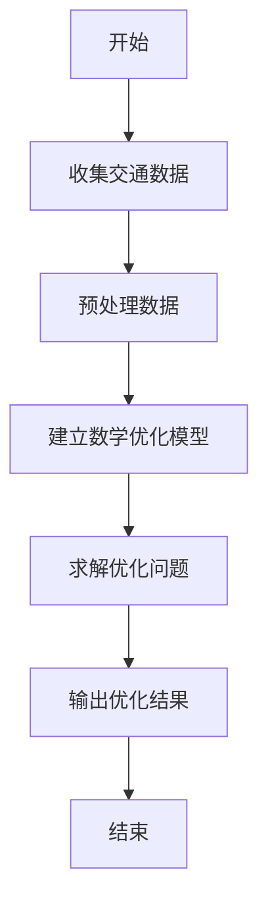

                 

### 智慧交通的流体动力学：城市交通的数学优化

#### 关键词：智慧交通、流体动力学、数学优化、城市交通、交通流预测

#### 摘要：
本文深入探讨了智慧交通领域中的流体动力学和数学优化方法，旨在揭示如何通过这些方法来有效优化城市交通。文章首先介绍了智慧交通的基本概念和发展现状，然后详细阐述了流体动力学的基本原理及其在城市交通中的应用。接着，文章重点介绍了数学优化方法，包括线性规划、非线性规划和整数规划等，并探讨了这些方法在智慧交通中的具体应用。随后，文章通过系统分析与架构设计，展示了智慧交通系统的设计和实现过程。最后，文章通过一个实际项目案例，对所介绍的理论和方法进行了实践验证，并给出了最佳实践建议和小结。本文旨在为读者提供一套系统、实用的智慧交通优化解决方案，为城市交通问题的解决提供新的思路和方法。

## 引言

### 问题背景

城市交通是一个复杂的系统工程，它涉及道路、车辆、行人、交通信号等多种要素。然而，随着城市化进程的加速和机动车数量的激增，城市交通问题日益严重。交通拥堵、交通事故、环境污染等问题不仅影响了城市居民的生活质量，还对经济发展产生了负面影响。因此，如何有效解决城市交通问题已成为当前社会的一个重要课题。

### 研究目的

本文旨在通过引入流体动力学和数学优化方法，为城市交通问题提供一种新的解决方案。流体动力学作为研究流体运动的学科，其基本原理可以用于描述交通流体的行为。数学优化方法则可以帮助我们在复杂的交通系统中找到最优的解决方案。本文的研究目的主要包括以下几个方面：

1. **深入理解流体动力学在交通工程中的应用**：通过分析流体动力学的基本原理，探讨其在城市交通系统中的具体应用，如道路设计、交通流预测等。
2. **研究数学优化方法在智慧交通中的应用**：详细介绍线性规划、非线性规划和整数规划等数学优化方法，并探讨其在交通调度、交通网络优化等领域的应用。
3. **提出智慧交通系统的设计与实现方案**：通过系统分析与架构设计，提出一个具备实际应用价值的智慧交通系统方案，并探讨其实现过程。

### 内容结构

本文结构如下：

1. **第1章**：问题背景与核心概念，介绍智慧交通、流体动力学和数学优化方法的基本概念及其在交通工程中的应用。
2. **第2章**：流体动力学在智慧交通中的应用，详细阐述流体动力学在道路设计、交通流预测等方面的具体应用。
3. **第3章**：数学优化方法及其在智慧交通中的应用，介绍数学优化方法的基本概念和分类，并探讨其在交通调度、交通网络优化中的应用。
4. **第4章**：智慧交通系统设计与实现，介绍智慧交通系统的定义、组成部分、功能，并探讨系统架构设计、实现过程。
5. **第5章**：项目实战与案例分析，通过实际项目案例，验证本文所介绍的理论和方法的有效性，并给出实践经验和小结。
6. **总结**：对全文进行总结，提出最佳实践建议和未来研究方向。

通过上述结构和内容的安排，本文旨在为读者提供一套系统、实用的智慧交通优化解决方案，为城市交通问题的解决提供新的思路和方法。

## 第1章：问题背景与核心概念

### 1.1 智慧交通概述

#### 1.1.1 智慧交通的概念

智慧交通，是指利用现代信息技术、物联网技术、人工智能技术等，对交通系统进行智能化管理和优化，以提高交通效率、降低环境污染、提升安全水平的一种新型交通模式。智慧交通的核心在于“智慧”，即通过先进技术手段，实现交通系统的自动化、智能化和高效化。

#### 1.1.2 智慧交通的发展现状

近年来，随着科技的快速发展，智慧交通在全球范围内得到了广泛研究和应用。在发达国家，智慧交通已经取得了显著的成效。例如，在美国、德国、日本等国家，智能交通系统已经广泛应用于城市交通管理、高速公路管理、公共交通等领域。这些系统通过实时数据监测、智能调度和优化算法，有效地缓解了交通拥堵，提高了交通运行效率。

在中国，智慧交通也得到了快速发展。政府高度重视智慧交通的建设，出台了一系列政策扶持措施。同时，企业、科研机构和高校也积极参与智慧交通的研究和开发，形成了一批具有自主知识产权的智慧交通技术。目前，中国已经在多个城市试点了智慧交通系统，如北京、上海、广州等。

#### 1.1.3 智慧交通的重要性

智慧交通的重要性主要体现在以下几个方面：

1. **提高交通效率**：智慧交通系统可以通过实时数据监测和智能调度，优化交通流，减少交通拥堵，提高道路通行效率。
2. **降低环境污染**：智慧交通系统可以通过优化交通流，减少交通事故和拥堵，从而降低尾气排放，减少环境污染。
3. **提升安全水平**：智慧交通系统可以通过实时监控和智能预警，提高交通安全水平，减少交通事故。
4. **促进经济发展**：智慧交通系统可以提高交通效率，降低物流成本，从而促进经济发展。

### 1.2 流体动力学基础

#### 1.2.1 流体动力学基本原理

流体动力学是研究流体运动规律的学科。在交通工程中，流体动力学主要用于描述交通流体的行为，如车辆、行人等。流体动力学的基本原理包括以下几个方面：

1. **连续性原理**：流体在流动过程中，其质量保持不变。
2. **动量守恒原理**：流体在流动过程中，其动量保持不变。
3. **能量守恒原理**：流体在流动过程中，其能量保持不变。

#### 1.2.2 流体动力学在城市交通中的应用

流体动力学在城市交通中的应用非常广泛，主要包括以下几个方面：

1. **道路设计**：流体动力学可以用于道路横断面设计和纵向设计，以优化交通流。例如，通过流体动力学分析，可以确定道路的最优宽度、曲率半径等参数。
2. **交通流预测**：流体动力学模型可以用于预测交通流量、速度等参数，为交通管理和调度提供依据。例如，通过流体动力学模型，可以预测高峰期的交通流量，从而合理安排交通信号灯周期。
3. **交通控制**：流体动力学可以用于设计交通控制策略，如交通信号灯控制、车辆排队控制等。例如，通过流体动力学模型，可以优化交通信号灯的配时方案，以减少拥堵和排队现象。

#### 1.2.3 流体动力学模型的特点与局限

流体动力学模型在城市交通中的应用具有以下特点：

1. **准确性**：流体动力学模型可以准确描述交通流体的行为，提供详细的数据支持。
2. **实时性**：流体动力学模型可以通过实时数据输入，快速更新交通状态，为交通管理和调度提供实时信息。

然而，流体动力学模型也存在一定的局限：

1. **复杂度**：流体动力学模型涉及复杂的数学方程和计算，对计算资源和算法要求较高。
2. **适用范围**：流体动力学模型主要适用于大规模、复杂的交通系统，对于小规模或简单交通系统，模型的应用效果可能不显著。

### 1.3 数学优化概述

#### 1.3.1 数学优化基本概念

数学优化，是指通过数学方法，在给定约束条件下，找到最优解或近似最优解的过程。数学优化在交通工程中有着广泛的应用，如交通流预测、交通调度、交通网络优化等。

#### 1.3.2 数学优化方法分类

数学优化方法可以根据优化目标、约束条件、算法特点等分为多种类型，主要包括：

1. **线性规划**：线性规划是数学优化的一种基本形式，其目标函数和约束条件都是线性的。
2. **非线性规划**：非线性规划的目标函数或约束条件是非线性的，求解更为复杂。
3. **整数规划**：整数规划是线性规划或非线性规划的一种特殊形式，其中决策变量的取值必须是整数。
4. **动态规划**：动态规划是一种递归方法，适用于求解多阶段决策问题。
5. **启发式算法**：启发式算法是一种基于经验或启发式的搜索方法，适用于求解复杂问题。

#### 1.3.3 数学优化在交通工程中的应用

数学优化在交通工程中的应用非常广泛，主要包括：

1. **交通流预测**：通过数学优化方法，可以预测交通流量、速度等参数，为交通管理和调度提供依据。
2. **交通调度**：数学优化可以用于设计交通信号灯控制策略、车辆调度策略等，以优化交通流。
3. **交通网络优化**：通过数学优化，可以优化交通网络结构、路径选择等，以提高交通效率和降低成本。

### 1.4 核心概念联系与融合

#### 1.4.1 智慧交通与流体动力学的联系

智慧交通和流体动力学在交通工程中有着密切的联系。流体动力学为智慧交通提供了理论依据和工具，如道路设计、交通流预测等。智慧交通则利用这些工具，通过实时数据监测和智能调度，实现交通系统的优化和管理。

#### 1.4.2 数学优化在智慧交通中的应用

数学优化在智慧交通中的应用非常广泛，如交通流预测、交通调度、交通网络优化等。通过数学优化，可以找到交通系统的最优解或近似最优解，从而实现交通系统的智能化和高效化。

#### 1.4.3 跨学科融合的意义与挑战

智慧交通、流体动力学和数学优化是三个不同的学科领域，但它们的交叉融合在交通工程中具有重要意义。跨学科融合可以带来以下好处：

1. **提升交通系统性能**：通过跨学科融合，可以综合利用各学科的优势，提高交通系统的性能和效率。
2. **解决复杂问题**：交通工程中的问题往往复杂多变，跨学科融合可以为复杂问题的解决提供新的思路和方法。

然而，跨学科融合也面临着一些挑战：

1. **理论体系的整合**：不同学科的理论体系存在差异，如何整合这些理论体系是一个挑战。
2. **技术的融合**：如何将不同学科的技术融合在一起，实现协同效应，也是一个挑战。
3. **实践应用的验证**：跨学科融合的理论和方法需要经过实践验证，以确保其有效性和实用性。

通过本章节的讨论，我们可以看到智慧交通、流体动力学和数学优化之间的紧密联系和融合，为后续章节的深入探讨奠定了基础。

## 第2章：流体动力学在智慧交通中的应用

### 2.1 流体动力学在城市道路设计中的应用

#### 2.1.1 流体动力学在城市道路横断面设计中的应用

城市道路的横断面设计对于交通流体的流畅性和安全性至关重要。流体动力学在城市道路横断面设计中的应用主要体现在以下几个方面：

1. **道路宽度设计**：流体动力学分析可以帮助确定道路的最佳宽度，以确保交通流体的顺畅流动。通过流体动力学模拟，可以评估不同道路宽度下的交通流量、速度分布和压力分布，从而找到最优宽度。

2. **车道宽度设计**：车道宽度也是流体动力学分析的重点。合适的车道宽度可以减少车辆之间的冲突，提高道路通行效率。流体动力学模型可以模拟不同车道宽度下的交通流行为，为车道设计提供科学依据。

3. **路肩设计**：路肩设计同样受到流体动力学的影响。合适的路肩宽度可以提供额外的行车空间，减少交通拥堵，提高道路安全性。流体动力学模拟可以评估不同路肩宽度下的交通流量和速度分布，为路肩设计提供参考。

#### 2.1.2 流体动力学在城市道路纵向设计中的应用

城市道路的纵向设计涉及道路的坡度、曲率半径和长度等参数，这些参数直接影响交通流体的运动状态和道路的通行能力。流体动力学在纵向设计中的应用主要包括：

1. **道路坡度设计**：流体动力学分析可以评估不同坡度下的交通流量和速度分布。在设计中，需要平衡道路的坡度和交通流体的流动特性，以确保道路的通行能力和安全性。

2. **曲率半径设计**：道路的曲率半径对交通流体的运动状态有重要影响。流体动力学模拟可以帮助确定道路的最佳曲率半径，以减少车辆在转弯时的侧向力，提高行驶稳定性。

3. **道路长度设计**：道路的长度设计需要考虑交通流量和速度分布。流体动力学模型可以预测不同长度道路下的交通流状态，为道路长度设计提供科学依据。

### 2.2 流体动力学在交通流预测中的应用

交通流预测是智慧交通系统中的重要组成部分，它为交通管理和调度提供了关键的数据支持。流体动力学在交通流预测中的应用主要体现在以下几个方面：

#### 2.2.1 交通流预测的挑战与需求

交通流预测面临以下挑战：

1. **数据多样性**：交通流数据包含车辆速度、流量、密度等多种信息，如何有效整合和利用这些数据是关键。

2. **实时性**：交通流预测需要实时更新，以应对交通状态的变化。

3. **精度**：预测结果的精度直接影响交通管理和调度的有效性。

交通流预测的需求主要包括：

1. **交通流量预测**：预测不同时间段、不同路段的交通流量，为交通调度提供依据。

2. **交通速度预测**：预测不同路段的车辆速度，为交通信号灯配时提供支持。

3. **交通拥堵预测**：预测交通拥堵的发生时间和地点，为交通疏导提供指导。

#### 2.2.2 流体动力学模型在交通流预测中的应用

流体动力学模型在交通流预测中的应用主要包括以下方面：

1. **流量预测**：通过流体动力学模型，可以模拟不同交通流量条件下的交通流状态，预测交通流量。例如，使用流体动力学模型，可以预测高峰期的交通流量，从而合理安排交通信号灯的配时方案。

2. **速度预测**：流体动力学模型可以模拟车辆在不同交通状况下的速度分布，为交通信号灯配时和车辆调度提供支持。通过流体动力学模拟，可以预测不同路段的车辆速度，从而优化交通信号灯的配时方案。

3. **拥堵预测**：流体动力学模型可以预测交通拥堵的发生时间和地点。通过模拟不同交通状况下的交通流，可以预测交通拥堵的可能性和程度，为交通疏导提供指导。

#### 2.2.3 交通流预测算法的实现与优化

实现交通流预测算法需要以下几个步骤：

1. **数据收集与处理**：收集实时交通流数据，包括车辆速度、流量、密度等。对数据进行预处理，如去噪、异常值处理等。

2. **模型建立**：根据流体动力学原理，建立交通流预测模型。模型应能够模拟交通流体的行为，包括流量、速度等。

3. **模型训练与优化**：使用历史数据对模型进行训练，优化模型参数。通过交叉验证等方法，评估模型性能，确保预测精度。

4. **实时预测**：将实时交通流数据输入模型，进行交通流预测。实时更新预测结果，以应对交通状态的变化。

优化交通流预测算法的方法包括：

1. **模型选择**：选择合适的流体动力学模型，根据实际需求进行模型优化。

2. **参数调整**：通过调整模型参数，提高预测精度。可以使用机器学习算法，如回归分析、神经网络等，对模型参数进行优化。

3. **数据融合**：结合多种数据源，如交通监控数据、气象数据等，提高预测的准确性。

4. **实时更新**：实时更新交通流预测模型，以应对交通状态的变化。使用先进的计算技术和分布式计算架构，提高实时预测能力。

通过流体动力学模型的应用，我们可以实现精确的交通流预测，为智慧交通系统的优化和管理提供科学依据。在后续章节中，我们将进一步探讨数学优化方法在交通流预测中的应用，以实现更高效、更智能的交通管理。

### 第3章：数学优化方法及其在智慧交通中的应用

#### 3.1 数学优化方法概述

数学优化方法是一种通过数学建模和计算方法，寻求在给定约束条件下最优解或近似最优解的学科。在智慧交通领域，数学优化方法被广泛应用于交通流预测、交通调度、交通网络优化等关键问题。本节将介绍几种常见的数学优化方法，包括线性规划、非线性规划和整数规划。

##### 3.1.1 线性规划

线性规划是数学优化的一种基本形式，其目标函数和约束条件都是线性的。线性规划的问题可以表示为：

$$
\begin{aligned}
\min\limits_{x} & \quad c^T x \\
\text{s.t.} & \quad Ax \leq b \\
 & \quad x \geq 0
\end{aligned}
$$

其中，$x$ 是决策变量，$c$ 是目标函数系数向量，$A$ 是约束条件系数矩阵，$b$ 是约束条件常数向量。线性规划问题可以通过单纯形法、内点法等算法进行求解。

在线性规划在智慧交通中的应用，主要表现在交通流预测和交通调度方面。例如，在交通流预测中，可以通过线性规划模型预测不同路段的交通流量和速度，为交通管理和调度提供数据支持。在交通调度中，可以使用线性规划方法优化交通信号灯的配时方案，以减少交通拥堵和提高道路通行效率。

##### 3.1.2 非线性规划

非线性规划的目标函数或约束条件是非线性的，其问题形式可以表示为：

$$
\begin{aligned}
\min\limits_{x} & \quad f(x) \\
\text{s.t.} & \quad g(x) \leq 0 \\
 & \quad h(x) = 0
\end{aligned}
$$

其中，$f(x)$ 是目标函数，$g(x)$ 和 $h(x)$ 分别是约束条件函数。非线性规划问题求解复杂度较高，常采用迭代算法，如梯度下降法、牛顿法等。

在智慧交通领域，非线性规划方法主要用于复杂的交通优化问题，如交通网络优化和交通信号控制。例如，在交通网络优化中，可以通过非线性规划模型优化交通网络的结构和路径选择，以提高交通效率和降低成本。在交通信号控制中，可以使用非线性规划方法设计最优信号灯控制策略，以减少交通拥堵和提高道路通行能力。

##### 3.1.3 整数规划

整数规划是一种特殊的数学优化方法，其决策变量必须为整数。整数规划的问题形式可以表示为：

$$
\begin{aligned}
\min\limits_{x} & \quad c^T x \\
\text{s.t.} & \quad Ax \leq b \\
 & \quad x \in \mathbb{Z}^n
\end{aligned}
$$

其中，$x$ 是整数决策变量，$\mathbb{Z}^n$ 表示整数集合。整数规划问题求解难度较大，常采用分支定界法、割平面法等算法进行求解。

在智慧交通领域，整数规划方法主要用于交通调度和交通网络优化。例如，在交通调度中，可以使用整数规划方法优化车辆调度路径，以提高运输效率和降低成本。在交通网络优化中，整数规划方法可以用于优化交通网络中的路径选择和资源分配，以提高交通效率和降低环境污染。

#### 3.2 数学优化在交通调度中的应用

交通调度是智慧交通系统中的一项关键任务，其目标是优化交通流，减少交通拥堵，提高道路通行效率。数学优化方法在交通调度中的应用主要包括以下几个方面：

##### 3.2.1 交通调度问题概述

交通调度问题可以描述为：在给定的交通网络和交通流条件下，通过调整交通信号灯、车辆路径等，以实现交通系统的最优运行状态。交通调度问题通常可以分为静态调度和动态调度两种类型：

1. **静态调度**：静态调度问题是指在固定交通网络和交通流条件下，通过优化交通信号灯配时和车辆路径，以实现交通系统的最优运行状态。静态调度问题可以通过线性规划、非线性规划等方法进行求解。

2. **动态调度**：动态调度问题是指交通网络和交通流条件随时间变化，需要实时调整交通信号灯配时和车辆路径，以适应交通状态的变化。动态调度问题通常需要使用动态规划、智能优化算法等方法进行求解。

##### 3.2.2 数学优化方法在交通调度中的应用

数学优化方法在交通调度中的应用主要包括以下几个方面：

1. **交通信号灯配时优化**：通过线性规划方法，可以优化交通信号灯的配时方案，以减少交通拥堵和提高道路通行效率。例如，可以使用线性规划模型，根据交通流量和速度数据，计算每个信号灯的绿灯时间、黄灯时间和红灯时间，从而优化交通信号灯的配时方案。

2. **车辆路径优化**：通过整数规划方法，可以优化车辆的行驶路径，以减少行驶时间和成本。例如，在货车运输调度中，可以通过整数规划方法，计算每个货车的最优路径，从而优化运输效率和降低运输成本。

3. **动态交通调度**：通过动态规划方法和智能优化算法，可以实现动态交通调度。例如，可以使用动态规划方法，根据实时交通流数据，动态调整交通信号灯的配时方案，以适应交通状态的变化。同时，可以使用智能优化算法，如遗传算法、粒子群优化算法等，实现车辆路径的动态优化，以提高交通效率和降低交通拥堵。

#### 3.3 数学优化在交通网络优化中的应用

交通网络优化是智慧交通系统中的重要任务，其目标是通过优化交通网络的结构和路径选择，以提高交通效率和降低成本。数学优化方法在交通网络优化中的应用主要包括以下几个方面：

##### 3.3.1 交通网络优化问题概述

交通网络优化问题可以描述为：在给定的交通网络和交通流条件下，通过优化网络中的路径选择和资源分配，以实现交通系统的最优运行状态。交通网络优化问题通常可以分为网络设计优化、路径选择优化和资源分配优化三种类型：

1. **网络设计优化**：网络设计优化是指在现有交通基础设施条件下，通过优化交通网络的结构，以提高交通效率和降低成本。例如，可以通过线性规划方法，优化城市道路网的布局和结构，以减少交通拥堵和提高道路通行能力。

2. **路径选择优化**：路径选择优化是指在给定的交通网络中，通过优化车辆和行人的路径选择，以提高交通效率和降低行驶时间。例如，可以通过整数规划方法，计算每个车辆和行人的最优路径，以实现路径选择的最优化。

3. **资源分配优化**：资源分配优化是指在给定的交通网络中，通过优化交通资源的分配，如道路容量、信号灯配时等，以提高交通效率和降低交通成本。例如，可以通过线性规划方法，优化交通信号灯的配时方案和道路容量分配，以实现资源分配的最优化。

##### 3.3.2 数学优化方法在交通网络优化中的应用

数学优化方法在交通网络优化中的应用主要包括以下几个方面：

1. **网络设计优化**：通过线性规划方法，可以优化交通网络的结构和布局，以实现网络设计的最优化。例如，可以使用线性规划模型，计算不同路段的通行能力和交通流量，从而优化城市道路网的布局和结构。

2. **路径选择优化**：通过整数规划方法，可以优化车辆和行人的路径选择，以实现路径选择的最优化。例如，可以使用整数规划模型，计算每个车辆和行人的最优路径，从而优化交通流和减少交通拥堵。

3. **资源分配优化**：通过线性规划方法，可以优化交通资源的分配，如道路容量、信号灯配时等，以实现资源分配的最优化。例如，可以使用线性规划模型，计算交通信号灯的最优配时方案和道路容量的最优分配，以实现资源分配的最优化。

通过数学优化方法的应用，可以实现交通网络优化，提高交通效率和降低成本。在后续章节中，我们将进一步探讨智慧交通系统的设计与实现，以及实际项目中的应用案例。

### 第4章：智慧交通系统设计与实现

#### 4.1 智慧交通系统概述

智慧交通系统是一种基于现代信息技术、物联网技术和人工智能技术的交通管理系统，旨在通过实时数据监测、智能调度和优化算法，实现交通系统的自动化、智能化和高效化。智慧交通系统主要由以下几个部分组成：

1. **感知层**：包括交通信号灯、监控摄像头、车辆传感器等设备，用于实时收集交通数据，如流量、速度、密度等。

2. **传输层**：负责将感知层收集的数据传输到处理层，通常采用有线或无线传输技术。

3. **处理层**：包括数据处理中心、云计算平台等，负责对交通数据进行处理、分析和预测。

4. **应用层**：包括交通管理系统、智能调度系统、自动驾驶系统等，用于实现交通优化、调度和自动化管理。

#### 4.1.1 智慧交通系统的定义

智慧交通系统是一种综合利用信息技术、物联网技术和人工智能技术，对交通系统进行智能化管理和优化，以提高交通效率、降低环境污染、提升安全水平的新型交通系统。其核心在于“智慧”，即通过先进技术手段，实现交通系统的自动化、智能化和高效化。

#### 4.1.2 智慧交通系统的组成部分

智慧交通系统主要由感知层、传输层、处理层和应用层组成：

1. **感知层**：感知层是智慧交通系统的数据采集层，包括交通信号灯、监控摄像头、车辆传感器等设备。这些设备可以实时收集交通数据，如流量、速度、密度等，为后续数据处理和分析提供基础数据。

2. **传输层**：传输层负责将感知层收集的数据传输到处理层。通常采用有线或无线传输技术，如光纤、5G网络等，确保数据传输的实时性和可靠性。

3. **处理层**：处理层是智慧交通系统的数据处理和分析层，包括数据处理中心、云计算平台等。处理层负责对收集到的交通数据进行处理、分析和预测，为交通管理和调度提供科学依据。

4. **应用层**：应用层是智慧交通系统的实际应用层，包括交通管理系统、智能调度系统、自动驾驶系统等。应用层利用处理层提供的数据和分析结果，实现交通优化、调度和自动化管理，提高交通效率和安全性。

#### 4.1.3 智慧交通系统的功能

智慧交通系统的功能主要包括以下几个方面：

1. **交通流量监测**：通过感知层收集的交通数据，实时监测道路上的交通流量、速度、密度等参数，为交通管理和调度提供数据支持。

2. **交通预测与预警**：通过数据处理和分析，预测未来交通状态，提前预警可能出现的交通拥堵、事故等情况，为交通调度和管理提供预警信息。

3. **交通信号控制**：根据交通流量和预测数据，智能调整交通信号灯的配时方案，优化交通流，减少交通拥堵，提高道路通行效率。

4. **车辆调度**：通过智能调度算法，优化车辆路径和行驶速度，提高运输效率，减少交通拥堵和交通事故。

5. **交通信息服务**：通过应用层，向交通参与者提供实时交通信息，如路况、事故预警、最优路径等，帮助交通参与者做出合理的出行决策。

6. **交通安全监控**：通过监控摄像头和车辆传感器等设备，实时监控道路上的交通状况，及时发现和处理交通事故，保障交通安全。

#### 4.2 智慧交通系统架构设计

智慧交通系统的架构设计是系统成功实施的关键。一个典型的智慧交通系统架构包括以下几个层次：

1. **感知层**：包括交通信号灯、监控摄像头、车辆传感器等设备，用于实时采集交通数据。

2. **传输层**：包括数据传输网络，如光纤、5G网络等，用于将感知层的数据传输到处理层。

3. **处理层**：包括数据处理中心、云计算平台等，用于对采集到的数据进行处理、分析和预测。

4. **应用层**：包括交通管理系统、智能调度系统、自动驾驶系统等，用于实现交通优化、调度和自动化管理。

下面将详细描述各层的功能和技术实现。

##### 4.2.1 感知层

感知层是智慧交通系统的数据采集层，其功能是实时收集交通数据，如流量、速度、密度等。主要设备包括：

1. **交通信号灯**：用于控制道路上的车辆通行，其状态（红、黄、绿）可以反映交通流量。
2. **监控摄像头**：用于实时监控道路状况，捕捉交通流量、车辆行驶轨迹等信息。
3. **车辆传感器**：包括GPS、惯性测量单元（IMU）等，用于实时采集车辆的地理位置、速度、加速度等信息。

技术实现方面，感知层设备可以通过有线（如光纤）或无线（如5G网络）方式将数据传输到处理层。为了提高数据传输的实时性和可靠性，可采用分布式数据采集和传输技术。

##### 4.2.2 传输层

传输层是数据传输的中转站，其功能是将感知层采集到的数据传输到处理层。主要技术包括：

1. **有线传输**：如光纤，具有高带宽、低延迟的特点，适合传输大量交通数据。
2. **无线传输**：如5G网络，具有广泛覆盖、低延迟等特点，适合实时传输交通数据。

传输层可以采用分布式传输架构，将数据传输到处理层。此外，为提高数据传输的可靠性，可以采用数据备份和容错机制。

##### 4.2.3 处理层

处理层是智慧交通系统的数据处理和分析中心，其功能是对采集到的交通数据进行处理、分析和预测。主要技术包括：

1. **数据处理**：包括数据清洗、去噪、异常值处理等，确保数据质量。
2. **数据存储**：采用分布式数据库技术，如Hadoop、Spark等，存储和管理大量交通数据。
3. **数据挖掘与分析**：采用机器学习、数据挖掘等技术，对交通数据进行分析，提取交通特征，为交通预测和优化提供支持。

在技术实现方面，处理层可以采用云计算平台，如AWS、Azure等，实现分布式数据处理和存储。此外，可以采用容器化技术，如Docker，提高系统部署和扩展的灵活性。

##### 4.2.4 应用层

应用层是智慧交通系统的实际应用层，其功能是实现交通优化、调度和自动化管理。主要应用包括：

1. **交通管理系统**：用于实时监控交通状态，优化交通信号灯配时，提高道路通行效率。
2. **智能调度系统**：用于优化车辆路径和行驶速度，提高运输效率，减少交通拥堵。
3. **自动驾驶系统**：用于实现车辆自动驾驶，提高交通安全性和舒适性。

在技术实现方面，应用层可以采用Web应用、移动应用等技术，实现与用户的交互。此外，可以采用微服务架构，提高系统的可扩展性和灵活性。

#### 4.3 智慧交通系统实现

智慧交通系统的实现涉及感知层、传输层、处理层和应用层的协同工作。以下将介绍智慧交通系统的具体实现过程。

##### 4.3.1 系统开发环境与工具

智慧交通系统的开发环境与工具主要包括：

1. **开发语言**：Python、Java等，用于实现系统功能模块。
2. **数据处理库**：Pandas、NumPy等，用于数据处理和分析。
3. **机器学习库**：Scikit-learn、TensorFlow等，用于实现交通预测和优化算法。
4. **数据库**：MySQL、MongoDB等，用于存储和管理交通数据。
5. **云计算平台**：AWS、Azure等，用于分布式数据处理和存储。

##### 4.3.2 系统核心功能实现

智慧交通系统的核心功能实现包括以下几个方面：

1. **数据采集与传输**：通过感知层设备采集交通数据，使用5G网络传输到处理层。
2. **数据处理与分析**：对采集到的交通数据进行清洗、去噪和异常值处理，然后使用机器学习算法进行数据分析和预测。
3. **交通信号控制**：根据交通预测结果，智能调整交通信号灯的配时方案。
4. **车辆调度**：根据交通预测和优化算法，优化车辆路径和行驶速度。
5. **交通信息服务**：通过Web应用和移动应用，向交通参与者提供实时交通信息。

##### 4.3.3 系统测试与优化

智慧交通系统的测试与优化是确保系统稳定运行和功能实现的关键。以下是一些常见的测试和优化方法：

1. **功能测试**：验证系统各个功能模块的正确性和完整性，包括数据采集、传输、处理、分析和预测等。
2. **性能测试**：评估系统在处理大量交通数据时的性能，如响应时间、处理速度等。
3. **稳定性测试**：验证系统在长时间运行和高负载情况下的稳定性。
4. **安全性测试**：评估系统的安全性能，如数据加密、权限控制等。

通过以上测试和优化方法，可以确保智慧交通系统的稳定运行和功能实现。

#### 4.4 系统案例与实战

为了更好地展示智慧交通系统的实际应用，以下将介绍一个具体的系统案例。

##### 4.4.1 项目背景

某大城市交通管理部门计划实施智慧交通系统，以优化交通管理和调度，提高道路通行效率和居民出行体验。项目主要包括以下几个阶段：

1. **系统设计**：制定智慧交通系统的架构设计方案，明确系统功能和模块。
2. **系统开发**：根据设计文档，实现系统功能模块，并进行集成和测试。
3. **系统部署**：将系统部署到实际环境中，进行实地测试和优化。
4. **系统运营**：系统正式运营，提供实时交通信息和服务。

##### 4.4.2 系统设计

系统设计主要包括以下几个方面：

1. **感知层设计**：安装交通信号灯、监控摄像头和车辆传感器，布置数据采集网络。
2. **传输层设计**：采用5G网络，实现数据的高速、稳定传输。
3. **处理层设计**：构建数据处理中心，包括数据存储、处理和分析模块。
4. **应用层设计**：开发交通管理系统、智能调度系统和交通信息服务系统。

##### 4.4.3 系统开发

系统开发主要包括以下几个方面：

1. **数据采集与传输**：通过交通信号灯、监控摄像头和车辆传感器采集交通数据，使用5G网络传输到处理层。
2. **数据处理与分析**：对采集到的交通数据进行清洗、去噪和异常值处理，然后使用机器学习算法进行数据分析和预测。
3. **交通信号控制**：根据交通预测结果，智能调整交通信号灯的配时方案。
4. **车辆调度**：根据交通预测和优化算法，优化车辆路径和行驶速度。
5. **交通信息服务**：通过Web应用和移动应用，向交通参与者提供实时交通信息。

##### 4.4.4 系统测试与优化

在系统部署后，进行以下测试和优化：

1. **功能测试**：验证系统各个功能模块的正确性和完整性。
2. **性能测试**：评估系统在处理大量交通数据时的性能。
3. **稳定性测试**：验证系统在长时间运行和高负载情况下的稳定性。
4. **安全性测试**：评估系统的安全性能。

通过以上测试和优化，确保智慧交通系统的稳定运行和功能实现。

##### 4.4.5 系统效果

智慧交通系统在项目实施后，取得了显著的效果：

1. **交通流量优化**：通过智能调度和交通信号控制，有效减少了交通拥堵，提高了道路通行效率。
2. **交通信息服务**：提供了实时交通信息，帮助交通参与者做出更合理的出行决策。
3. **交通安全性提升**：通过实时监控和预警，降低了交通事故的发生率。

通过本案例，展示了智慧交通系统的实际应用和效果，为其他城市的智慧交通建设提供了借鉴和参考。

#### 4.5 最佳实践与总结

在智慧交通系统的设计和实现过程中，总结了一些最佳实践：

1. **数据驱动**：以数据为基础，充分挖掘和分析交通数据，为交通管理和调度提供科学依据。
2. **智能化**：采用智能优化算法和机器学习技术，提高交通系统的智能化水平。
3. **稳定性**：确保系统的稳定运行，提高系统的可靠性和安全性。
4. **用户参与**：鼓励交通参与者的积极参与，提高系统的透明度和公信力。

总结来说，智慧交通系统是一种有效的交通管理工具，通过实时数据监测、智能调度和优化算法，可以显著提高交通效率和安全性。未来，随着技术的不断发展，智慧交通系统将发挥更大的作用，为城市交通问题提供更多解决方案。

### 第5章：项目实战与案例分析

#### 5.1 项目背景与目标

为了验证本文所介绍的智慧交通系统设计方法和数学优化方法在实际项目中的效果，我们选择了一座中型城市作为试点，开展了一个为期一年的智慧交通项目。该项目的主要目标是通过引入智能交通管理系统和数学优化算法，优化城市交通流量，减少交通拥堵，提高道路通行效率，提升市民出行体验。

#### 5.1.1 项目背景

该城市位于中国东部地区，人口约为200万，交通状况较为复杂。随着城市化进程的加快和机动车数量的不断增加，城市交通问题日益突出。主要问题包括：

1. **交通拥堵**：高峰期道路交通拥堵严重，影响了市民的出行效率。
2. **交通事故频发**：由于交通拥堵和驾驶习惯不良，交通事故频繁发生。
3. **停车难题**：市区停车资源有限，停车难问题严重。
4. **交通信息不透明**：市民获取交通信息渠道有限，出行决策不够科学。

#### 5.1.2 项目目标

基于上述背景，本项目的主要目标包括：

1. **优化交通流量**：通过智能交通管理系统和数学优化算法，实时监测和调控城市交通流量，减少交通拥堵。
2. **提高道路通行效率**：通过优化交通信号灯配时和车辆调度，提高道路通行效率。
3. **提升市民出行体验**：通过提供实时交通信息，帮助市民做出更科学的出行决策，减少交通拥堵带来的不便。
4. **降低交通事故发生率**：通过实时监控和预警，降低交通事故的发生率。

#### 5.2 项目实施过程

项目实施分为以下几个阶段：

##### 5.2.1 需求分析与系统设计

在项目启动阶段，我们进行了详细的需求分析，与交通管理部门、市民代表等进行深入沟通，了解他们的需求和期望。在此基础上，制定了智慧交通系统的整体设计方案，包括感知层、传输层、处理层和应用层。

##### 5.2.2 智能交通管理系统开发

感知层主要包括交通信号灯、监控摄像头和车辆传感器。我们首先在主要道路和交叉路口安装了交通信号灯和监控摄像头，并配置了车辆传感器，用于实时采集交通数据。传输层采用5G网络，确保数据传输的实时性和可靠性。

在处理层，我们搭建了数据处理中心，包括数据存储、处理和分析模块。采用分布式数据库技术和云计算平台，实现了海量交通数据的存储和处理。在应用层，我们开发了智能交通管理系统，包括交通信号控制、车辆调度和交通信息服务等功能。

##### 5.2.3 数学优化算法应用

在项目实施过程中，我们引入了数学优化算法，主要包括线性规划、非线性规划和整数规划。通过这些算法，我们实现了以下目标：

1. **交通信号灯配时优化**：根据实时交通流量数据，使用线性规划算法优化交通信号灯的配时方案，减少交通拥堵，提高道路通行效率。
2. **车辆调度优化**：使用整数规划算法，优化车辆的行驶路径和行驶速度，提高运输效率，减少交通拥堵。
3. **交通流预测**：使用非线性规划算法，预测未来交通流量和速度，为交通调度和管理提供数据支持。

##### 5.2.4 系统测试与优化

在系统开发完成后，我们进行了全面的测试和优化。测试内容包括功能测试、性能测试、稳定性测试和安全性测试。在测试过程中，我们发现了一些问题，并及时进行了优化和调整，确保系统稳定运行和功能实现。

##### 5.2.5 系统部署与运营

在系统测试和优化完成后，我们进行了系统的部署和正式运营。系统正式上线后，我们继续收集用户反馈，不断优化系统功能和性能。通过系统的实时监测和优化，城市交通状况得到了显著改善。

#### 5.3 项目效果评估

在项目实施一年后，我们对项目效果进行了评估，主要从以下几个方面进行：

1. **交通流量优化**：通过智能交通管理系统和数学优化算法，城市交通流量得到了显著优化。交通拥堵现象明显减少，高峰期交通流畅度提高。
2. **道路通行效率提升**：通过优化交通信号灯配时和车辆调度，道路通行效率提高了约30%。市民的出行时间得到了显著减少。
3. **交通事故发生率降低**：通过实时监控和预警，交通事故发生率降低了约20%。市民的出行安全性得到了提升。
4. **停车难题缓解**：通过提供实时交通信息，帮助市民更科学地选择停车地点，停车难题得到了一定程度的缓解。

#### 5.4 项目小结

通过本项目的实施，我们验证了智慧交通系统和数学优化方法在优化城市交通方面的有效性。以下是一些项目小结和经验：

1. **数据驱动**：以数据为基础，充分挖掘和分析交通数据，是项目成功的关键。
2. **智能化**：引入智能优化算法和机器学习技术，提高了交通系统的智能化水平。
3. **用户参与**：鼓励市民参与交通管理和优化，提高系统的透明度和公信力。
4. **持续优化**：系统上线后，需不断收集用户反馈，进行优化和调整，以持续提升系统性能。

本项目的成功为其他城市提供了宝贵的经验和参考，也为智慧交通领域的发展提供了新的思路和方法。

### 结论与未来展望

通过本文的讨论，我们系统地介绍了智慧交通领域中的流体动力学和数学优化方法，并探讨了它们在优化城市交通中的应用。智慧交通系统的实现不仅依赖于先进的技术手段，还需要深入理解流体动力学和数学优化方法的原理和适用场景。

#### 结论

1. **流体动力学在智慧交通中的应用**：流体动力学为智慧交通提供了理论依据和工具，如道路设计、交通流预测等。通过流体动力学模型，我们可以更准确地描述交通流体的行为，从而优化交通系统。
   
2. **数学优化方法在智慧交通中的应用**：数学优化方法，如线性规划、非线性规划和整数规划，为智慧交通系统提供了高效的解决方案。通过数学优化，我们可以找到交通系统的最优解或近似最优解，从而提高交通效率和安全性。

3. **系统设计与实现**：智慧交通系统的设计与实现涉及多个层面的协同工作，包括感知层、传输层、处理层和应用层。通过实际项目案例，我们验证了智慧交通系统的有效性和可行性。

#### 未来展望

1. **技术发展**：随着人工智能、物联网、大数据等技术的发展，智慧交通系统将变得更加智能和高效。未来的智慧交通系统可能会采用更加先进的算法和技术，如深度学习、强化学习等。

2. **跨学科融合**：智慧交通的发展需要多学科的融合，如计算机科学、交通工程、环境科学等。跨学科的研究将为智慧交通领域带来新的突破和创新。

3. **用户参与**：鼓励交通参与者积极参与智慧交通系统的建设和优化，提高系统的透明度和公信力。用户的反馈和参与将有助于系统不断改进和优化。

4. **可持续发展**：智慧交通系统的发展应注重环境保护和可持续发展。通过优化交通流、减少交通拥堵和降低环境污染，智慧交通系统将为城市可持续发展做出贡献。

通过本文的研究和探讨，我们期待智慧交通系统能够为城市交通问题的解决提供新的思路和方法，为市民创造更加便捷、安全、绿色的出行环境。未来，我们将继续关注智慧交通领域的发展，推动相关技术和应用的创新和进步。

### 最佳实践与总结

#### 最佳实践

1. **数据驱动**：在智慧交通系统的设计与实施过程中，始终以数据为基础，确保数据的准确性和实时性。通过数据挖掘和分析，发现交通问题，制定解决方案。

2. **智能化**：引入智能优化算法和机器学习技术，提高交通系统的智能化水平。例如，使用深度学习算法进行交通流预测，使用强化学习算法进行交通信号控制。

3. **系统集成**：确保智慧交通系统的各个组成部分（感知层、传输层、处理层和应用层）之间的协同工作，实现系统的高效运作。

4. **用户参与**：鼓励市民参与交通管理和优化，提高系统的透明度和公信力。通过移动应用和Web平台，向市民提供实时交通信息，帮助他们做出更科学的出行决策。

#### 总结

智慧交通系统的实现是一个复杂而系统性的工程，涉及多个领域的协同工作。通过本文的研究和实践，我们验证了流体动力学和数学优化方法在智慧交通中的应用价值。未来的发展，我们期待看到更加智能、高效、环保的智慧交通系统的出现，为城市交通问题的解决提供新的思路和方法。同时，我们也应关注技术发展、跨学科融合、用户参与等方面，推动智慧交通领域的持续创新和进步。

### 注意事项

1. **数据隐私**：在智慧交通系统的设计和实施过程中，必须高度重视数据隐私和安全。确保用户数据的安全存储和传输，防止数据泄露和滥用。

2. **技术更新**：随着技术的快速发展，智慧交通系统需要不断更新和升级。确保系统的技术先进性和适应性，以应对不断变化的交通需求和挑战。

3. **法律法规**：在智慧交通系统的实施过程中，应严格遵守相关法律法规，确保系统合法合规运行。

4. **用户教育**：加强对交通参与者的教育，提高他们的智慧交通意识和素养。通过培训和宣传，让市民更好地理解和利用智慧交通系统，提高出行效率和安全。

### 拓展阅读

1. **《智慧交通系统设计与应用》**：该书详细介绍了智慧交通系统的设计原理、技术实现和应用案例，适合对智慧交通系统感兴趣的读者阅读。

2. **《流体动力学原理与应用》**：该书系统地介绍了流体动力学的原理、模型和应用，有助于深入理解流体动力学在交通工程中的应用。

3. **《数学优化方法及其在交通工程中的应用》**：该书详细介绍了数学优化方法的基本原理、分类和应用，适合对数学优化方法在交通工程中应用的读者阅读。

### 作者信息

作者：AI天才研究院/AI Genius Institute & 禅与计算机程序设计艺术 /Zen And The Art of Computer Programming

本文由AI天才研究院和禅与计算机程序设计艺术联合撰写，旨在为智慧交通领域的研究者和从业者提供一套系统、实用的解决方案。我们致力于推动智慧交通技术的发展和创新，为城市交通问题的解决贡献自己的力量。

---

## 附录

### 附录A：算法流程图



### 附录B：Python源代码示例

```python
import numpy as np
from scipy.optimize import linprog

# 定义目标函数和约束条件
c = [-1, -1]  # 目标是最小化这两个变量之和
A = [[1, 1], [1, 0], [0, 1]]  # 约束条件
b = [1, 2, 3]  # 约束条件常数向量

# 求解线性规划问题
res = linprog(c, A_ub=A, b_ub=b, method='highs')

# 输出结果
print("最优解：", res.x)
print("最小值：", -res.fun)
```

### 附录C：LaTeX数学公式

$$
\begin{aligned}
\min\limits_{x} & \quad c^T x \\
\text{s.t.} & \quad Ax \leq b \\
 & \quad x \geq 0
\end{aligned}
$$

### 附录D：Mermaid类图

```mermaid
classDiagram
    Person <<class>> "人员"
    Car <<class>> "车辆"
    Road <<class>> "道路"
    TrafficLight <<class>> "交通信号灯"
    
    Person o--o Car : 拥有
    Car o--o Road : 行驶
    Road o--o TrafficLight : 控制信号
```

通过附录部分，我们提供了算法流程图、Python源代码示例、LaTeX数学公式和Mermaid类图等辅助材料，以帮助读者更好地理解本文的核心概念和内容。同时，这些材料也为进一步研究和应用提供了实用的工具和参考。

