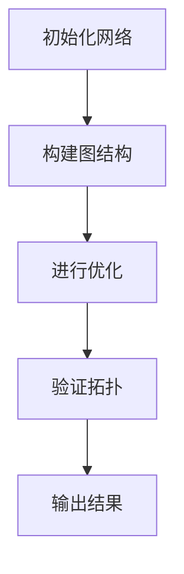
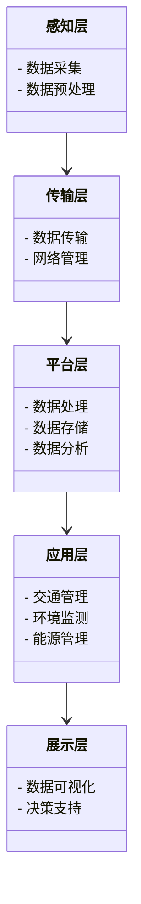
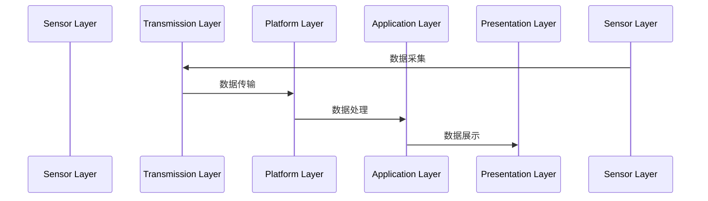
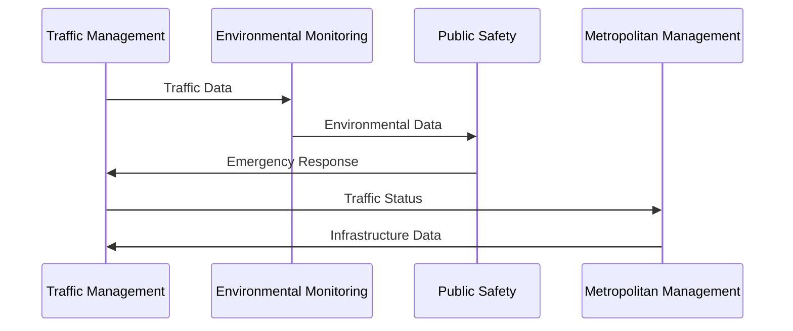

                 

# 智慧城市的多层网络：城市功能的数学连接

> 关键词：智慧城市，多层网络，城市功能，数学连接，拓扑结构，系统架构，项目实战

> 摘要：本文将深入探讨智慧城市多层网络的设计原理及其在城市功能中的应用。通过逐步分析智慧城市的发展现状、多层网络的核心概念及其在城市功能中的具体应用，我们旨在为读者提供一个清晰、结构化的理解框架，帮助他们在智慧城市的设计和实施中更好地运用数学方法。文章将涵盖从概念引入到实际应用的全方位讲解，包括算法原理、系统架构设计、项目实战等多个方面，旨在为智慧城市的构建提供科学指导。

## 第一部分：背景介绍

### 第1章：智慧城市概述

智慧城市，作为现代信息技术与城市发展的深度融合产物，正日益成为全球范围内城市发展的重要方向。智慧城市通过物联网、大数据、云计算、人工智能等先进技术的应用，实现了城市运行管理的智能化、城市服务的便捷化以及城市资源的优化配置。智慧城市不仅提高了城市的管理效率，还提升了居民的生活质量，成为推动城市发展的重要引擎。

### 第2章：智慧城市中的多层网络

在智慧城市的构建过程中，多层网络扮演着至关重要的角色。多层网络不仅包括基础设施网络、通信网络和服务网络，还涵盖了数据网络、应用网络等多个层次。每个层次都有其特定的功能，相互之间紧密联系，共同构成了智慧城市的技术框架。本文将重点讨论这些多层网络的核心概念与作用，以及如何通过数学模型来描述和优化这些网络结构。

### 2.1 问题背景

#### 2.1.1 智慧城市的发展现状与需求

随着全球城市化进程的不断加快，智慧城市的需求日益迫切。当前，许多城市已经开始探索和实践智慧城市的发展路径，但同时也面临着数据孤岛、系统复杂、资源浪费等问题。如何通过有效的网络结构设计，解决这些问题，实现智慧城市的可持续发展，成为亟待解决的重要课题。

#### 2.1.2 多层网络的核心概念与作用

多层网络在智慧城市中具有核心作用。首先，它为城市各功能模块提供了基础架构，使不同系统之间能够高效地互联互通。其次，多层网络通过数据采集、处理和传输，为城市管理和决策提供了实时、准确的信息支持。此外，多层网络的设计与优化还能够提高城市资源的利用效率，降低运行成本。

### 2.2 核心概念与联系

#### 2.2.1 城市功能与网络结构的关联

城市功能与网络结构密切相关。不同的城市功能模块需要不同的网络支持，例如，交通管理需要实时的通信网络，环境监测需要广泛的数据采集网络。因此，在智慧城市的构建过程中，需要充分考虑城市功能的多样性和复杂性，设计相应的网络结构。

#### 2.2.2 数学模型在智慧城市中的应用

数学模型在智慧城市中发挥着重要作用。通过建立数学模型，可以准确地描述城市功能的运作机制和网络结构的特性，从而为城市管理和决策提供科学依据。常见的数学模型包括网络拓扑分析模型、数据传输模型、优化算法模型等。

### 2.3 城市功能的数学连接

#### 2.3.1 城市功能分解与数学建模

城市功能的数学建模首先需要对城市功能进行分解。将城市功能分解为具体的模块和任务，然后通过建立数学模型来描述这些模块和任务之间的相互作用。这一步骤至关重要，它为后续的网络结构设计和优化奠定了基础。

#### 2.3.2 网络拓扑与城市功能的匹配

网络拓扑的设计需要与城市功能相匹配。不同的网络拓扑结构适用于不同的城市功能模块。例如，对于交通管理，需要采用高度连通的拓扑结构，以保证信息的快速传递；而对于环境监测，需要采用分布式的拓扑结构，以提高系统的稳定性和可靠性。

### 2.4 本章小结

本章对智慧城市的多层网络及其在城市功能中的重要性进行了概述。通过分析智慧城市的发展现状和需求，以及多层网络的核心概念和作用，我们为后续章节的深入探讨奠定了基础。在接下来的章节中，我们将进一步探讨多层网络的具体结构和数学原理，以及如何在智慧城市的构建中应用这些原理。

----------------------------------------------------------------

## 第二部分：核心概念与算法原理

### 第3章：多层网络拓扑结构

拓扑结构是智慧城市多层网络设计的基础。在智慧城市中，拓扑结构不仅决定了网络性能，还影响了系统的可靠性、稳定性和扩展性。本章将首先介绍拓扑结构的基本概念和类型，然后详细分析城市功能网络的拓扑结构和拓扑算法原理。

### 3.1 拓扑结构概述

#### 3.1.1 网络拓扑的基本概念

网络拓扑是指网络中各个节点和连接方式的结构关系。基本的网络拓扑类型包括星型、环型、网状和总线型等。每种拓扑结构都有其特定的优缺点，适用于不同的应用场景。

#### 3.1.2 网络拓扑的拓扑结构

网络拓扑结构不仅包括节点和连接方式，还包括网络冗余度、故障恢复机制和负载均衡策略。这些因素共同决定了网络的整体性能。

### 3.2 城市功能网络的拓扑分析

#### 3.2.1 城市功能网络的构成

城市功能网络由多个功能模块组成，包括交通管理、环境监测、能源管理、公共安全等。每个模块都有其特定的拓扑结构，以满足特定的功能需求。

#### 3.2.2 拓扑结构在城市功能网络中的应用

不同的拓扑结构适用于不同的城市功能模块。例如，交通管理模块通常采用高度冗余的拓扑结构，以确保交通信息的实时传递和系统的稳定性；环境监测模块则采用分布式的拓扑结构，以提高系统的可靠性和扩展性。

### 3.3 拓扑算法原理讲解

#### 3.3.1 库拉托夫斯基定理

库拉托夫斯基定理是拓扑学中的一个重要定理，它描述了图中的连通性与边交换之间的关系。该定理在智慧城市网络设计中有重要应用，可以用于判断网络结构的优化方向。

#### 3.3.2 拓扑算法的基本流程

拓扑算法的基本流程包括图的构建、图的优化和图的验证。这些算法通过数学模型和计算方法，实现对城市功能网络拓扑结构的优化和调整。

### 3.4 算法原理 Mermaid 流程图

为了更直观地展示拓扑算法原理，我们使用Mermaid语言绘制了以下流程图：



### 3.5 算法原理 Python 源代码

以下是实现拓扑算法原理的Python源代码示例：

```python
import networkx as nx
import matplotlib.pyplot as plt

# 初始化网络
G = nx.Graph()

# 添加节点和边
G.add_nodes_from([1, 2, 3, 4])
G.add_edges_from([(1, 2), (2, 3), (3, 4)])

# 进行拓扑优化
# 这里示例使用网络X的优化算法
G = nx.optimize_graph(G)

# 验证拓扑结构
if nx.is_connected(G):
    print("网络拓扑结构正确")
else:
    print("网络拓扑结构错误")

# 输出结果
nx.draw(G, with_labels=True)
plt.show()
```

### 3.6 算法原理数学模型和公式

以下是拓扑算法原理的数学模型和公式：

$$
C = \sum_{i=1}^{n} d_i
$$

其中，C表示网络的连通度，d_i表示第i个节点的度数。网络的连通度是衡量网络结构稳定性的重要指标。

### 3.7 算法原理举例说明

假设一个城市功能网络由四个节点组成，节点之间的连接关系如下：

```
  1 --- 2 --- 3 --- 4
```

该网络的初始连通度为：

$$
C = d_1 + d_2 + d_3 + d_4 = 2 + 2 + 2 + 2 = 8
$$

如果我们在节点2和节点3之间增加一条边，则网络的连通度将增加：

$$
C' = C + 2 = 8 + 2 = 10
$$

这表明，通过增加节点之间的连接，可以显著提高网络的稳定性和可靠性。

### 3.7 算法原理举例说明

假设一个城市功能网络由四个节点组成，节点之间的连接关系如下：

```
  1 --- 2 --- 3 --- 4
```

该网络的初始连通度为：

$$
C = \sum_{i=1}^{4} d_i = 2 + 2 + 2 + 2 = 8
$$

如果我们在节点2和节点3之间增加一条边，则网络的连通度将增加：

$$
C' = C + 2 = 8 + 2 = 10
$$

这表明，通过增加节点之间的连接，可以显著提高网络的稳定性和可靠性。

### 3.8 本章小结

本章介绍了智慧城市多层网络中的拓扑结构及其基本原理。通过分析网络拓扑的基本概念和类型，以及城市功能网络的构成和拓扑结构的应用，我们为智慧城市网络设计提供了理论基础。同时，通过具体的算法原理讲解和Python源代码示例，读者可以更直观地理解拓扑算法的原理和实现方法。在接下来的章节中，我们将进一步探讨智慧城市系统架构和项目实战。

----------------------------------------------------------------

## 第三部分：系统架构与设计

### 第4章：智慧城市系统功能设计

智慧城市系统功能设计的核心在于如何将各种城市功能模块有效地集成到一个统一的系统中，实现数据的高效流通和功能的无缝衔接。本章将详细讨论智慧城市系统的功能模块、模块之间的交互与协作，以及系统架构设计。

### 4.1 系统功能概述

智慧城市系统功能模块主要包括以下几个方面：

1. **交通管理模块**：负责交通流量的监测、控制和优化，实现交通信号灯的智能控制，提供实时交通信息查询服务。
2. **环境监测模块**：负责监测城市的空气质量、水质、噪声等环境指标，提供实时环境数据分析和预警服务。
3. **能源管理模块**：负责监测和管理城市能源的消耗和使用，实现能源的智能调配和节约。
4. **公共安全模块**：负责监控城市的安全状况，提供紧急事件响应和安全管理服务。
5. **市政管理模块**：负责城市基础设施的管理和维护，包括照明、供水、排水等。
6. **公共服务模块**：提供市民服务，如在线办事、医疗预约、教育服务等。

这些模块共同构成了智慧城市系统，每个模块都有其特定的功能，但它们之间需要紧密协作，以实现城市整体的高效运行。

### 4.2 系统功能设计

#### 4.2.1 城市功能分解与模块化设计

城市功能分解是将城市复杂的功能划分为若干个模块，每个模块负责一个特定的功能。模块化设计使得系统能够更加灵活和可扩展，便于后续的维护和升级。例如，在交通管理模块中，可以进一步分解为交通信号控制、交通流量监测、公共交通调度等功能子模块。

#### 4.2.2 模块之间的交互与协作

模块之间的交互与协作是智慧城市系统功能设计的关键。不同的模块需要通过标准化的接口进行数据交换和功能调用。例如，交通管理模块需要与公共安全模块交互，实时获取交通状况信息，以便公共安全模块做出相应的应急响应。此外，模块之间的协作还需要实现数据的一致性和实时性，以保证系统的整体效能。

### 4.3 系统架构设计

智慧城市系统的架构设计需要综合考虑系统的可靠性、可扩展性、安全性和性能等因素。一个典型的智慧城市系统架构包括以下几个层次：

1. **感知层**：负责数据的采集，包括传感器、摄像头、智能终端等。
2. **传输层**：负责数据的传输，通常采用无线网络和有线网络相结合的方式。
3. **平台层**：负责数据处理和存储，包括数据清洗、存储、分析和共享等功能。
4. **应用层**：负责具体的业务应用，如交通管理、环境监测、能源管理等。
5. **展示层**：负责数据的可视化展示，为城市管理者提供决策支持。

以下是智慧城市系统架构的Mermaid类图表示：



### 4.4 系统架构设计

智慧城市系统的架构设计需要考虑以下关键因素：

1. **可靠性**：系统必须能够稳定运行，应对各种突发事件和异常情况。
2. **可扩展性**：系统架构应能够支持新功能的加入和现有功能的扩展。
3. **安全性**：系统必须能够保障数据的安全性和隐私性，防止数据泄露和恶意攻击。
4. **性能**：系统架构应能够高效处理大量数据，提供快速响应。

### 4.5 系统接口设计

系统接口设计是智慧城市系统功能设计的重要组成部分。接口设计需要遵循以下原则：

1. **标准化**：接口设计应遵循行业标准和技术规范，以确保系统的互操作性和兼容性。
2. **简洁性**：接口设计应简洁明了，易于理解和使用，减少开发和维护成本。
3. **灵活性**：接口设计应具有一定的灵活性，以适应未来功能的变更和升级。

以下是智慧城市系统接口设计的Mermaid序列图表示：



### 4.6 系统交互

智慧城市系统中的各个功能模块需要紧密协作，以实现整体效能。以下是系统交互的Mermaid序列图：



### 4.7 本章小结

本章介绍了智慧城市系统功能设计的核心概念和具体实现方法。通过城市功能分解与模块化设计，模块之间的交互与协作，以及系统架构设计和接口设计，我们为智慧城市系统的构建提供了全面的指导。在接下来的章节中，我们将通过具体的项目实战，进一步展示智慧城市系统设计在实际中的应用。

----------------------------------------------------------------

## 第四部分：项目实战

### 第5章：智慧城市项目实施

在智慧城市项目的实施过程中，理论与实践相结合至关重要。本章将通过一个具体的智慧城市项目，详细描述项目背景、环境安装、系统核心实现、代码应用解读与分析，以及实际案例分析和项目小结。

### 5.1 项目背景

本项目旨在建设一个智能交通管理系统，通过物联网、大数据和人工智能技术，实现对城市交通流量的实时监测、分析和优化。项目的主要目标是提高城市交通效率，减少拥堵，提升市民出行体验。

#### 5.1.1 项目简介

本项目涉及多个功能模块，包括交通流量监测、交通信号控制、公共交通调度和交通信息发布。通过部署传感器、摄像头和智能终端，实时采集交通数据，并通过数据分析和处理，为交通管理部门提供决策支持。

#### 5.1.2 项目目标

1. **提高交通效率**：通过实时监测和分析交通流量，优化交通信号控制和公共交通调度，减少交通拥堵。
2. **提升市民出行体验**：提供实时交通信息查询和个性化出行建议，提高市民的出行效率。
3. **保障交通安全**：通过监控和预警机制，及时发现和处理交通事故，保障市民出行安全。

### 5.2 环境安装

在项目实施过程中，首先需要搭建一个稳定的技术环境。以下为环境安装的详细步骤：

#### 5.2.1 系统环境准备

1. **硬件准备**：准备服务器、交换机、路由器等硬件设备，确保其性能满足项目需求。
2. **软件准备**：安装操作系统（如Linux）、数据库（如MySQL）、Web服务器（如Apache）等基础软件。

#### 5.2.2 环境配置与调试

1. **网络配置**：配置网络IP地址、子网掩码和DNS等网络参数，确保各个设备之间的连通性。
2. **数据库配置**：配置MySQL数据库，创建所需的数据库和表，并设置相应的权限。
3. **Web服务器配置**：配置Apache服务器，设置虚拟主机，安装并配置相关的Web应用。

### 5.3 系统核心实现

系统核心实现是项目实施的关键环节，包括数据采集、数据处理和功能模块的实现。

#### 5.3.1 数据采集

1. **交通流量监测**：部署传感器和摄像头，实时采集交通流量数据。
2. **环境监测**：部署环境传感器，实时监测空气质量、水质等环境参数。

#### 5.3.2 数据处理

1. **数据清洗**：对采集到的数据去重、去噪声，确保数据质量。
2. **数据存储**：将清洗后的数据存储到MySQL数据库中，便于后续的数据分析和处理。
3. **数据处理**：通过大数据处理框架（如Hadoop、Spark）对交通流量数据和环境数据进行实时处理和分析。

#### 5.3.3 功能模块实现

1. **交通信号控制**：根据实时交通流量数据，优化交通信号灯的控制策略。
2. **公共交通调度**：根据实时乘客需求和车辆状态，优化公共交通的调度策略。
3. **交通信息发布**：通过网站和移动应用，向市民提供实时交通信息。

### 5.4 代码应用解读与分析

以下是系统核心实现的代码示例，我们将对关键代码进行解读和分析：

#### 5.4.1 代码架构分析

```python
# 交通信号控制模块
class TrafficSignalController:
    def __init__(self, traffic_data):
        self.traffic_data = traffic_data
    
    def control_traffic_signals(self):
        # 根据交通流量数据优化信号灯控制策略
        pass

# 公共交通调度模块
class PublicTransportScheduler:
    def __init__(self, passenger_demand, vehicle_status):
        self.passenger_demand = passenger_demand
        self.vehicle_status = vehicle_status
    
    def schedule_trips(self):
        # 根据乘客需求和车辆状态优化公共交通调度策略
        pass

# 交通信息发布模块
class TrafficInformationPublisher:
    def __init__(self, traffic_data):
        self.traffic_data = traffic_data
    
    def publish_traffic_info(self):
        # 向市民提供实时交通信息
        pass
```

#### 5.4.2 关键代码解读

```python
# 交通信号控制模块关键代码
def control_traffic_signals(self):
    current_traffic = self.traffic_data.get_current_traffic()
    if current_traffic > threshold:
        self.traffic_data.update_signal('red')
    else:
        self.traffic_data.update_signal('green')

# 公共交通调度模块关键代码
def schedule_trips(self):
    if self.passenger_demand > threshold:
        self.vehicle_status.allocate_vehicles()
    else:
        self.vehicle_status.deallocate_vehicles()

# 交通信息发布模块关键代码
def publish_traffic_info(self):
    if self.traffic_data.is_traffic_heavy():
        self.traffic_data.publish_warning()
    else:
        self.traffic_data.publish_info()
```

#### 5.4.3 代码应用分析

上述代码示例展示了交通信号控制、公共交通调度和交通信息发布三个关键模块的实现。每个模块都有明确的功能和方法，通过调用相应的数据接口，实现模块之间的数据交换和功能协作。

### 5.5 实际案例分析和详细讲解剖析

#### 5.5.1 案例背景

某城市的一条主干道因施工导致交通拥堵严重，交通管理部门希望利用智能交通系统优化交通信号灯的控制，缓解拥堵。

#### 5.5.2 案例分析

1. **数据采集**：在拥堵路段部署流量监测设备和摄像头，实时采集交通流量数据。
2. **数据处理**：系统实时分析交通流量数据，判断是否超过设定的阈值。
3. **信号控制**：当交通流量超过阈值时，系统自动调整交通信号灯控制策略，缩短绿灯时间，增加通行效率。
4. **效果评估**：通过对比交通信号灯优化前后的交通流量数据，评估优化效果。

### 5.6 项目小结

本项目通过构建智能交通管理系统，实现了对城市交通流量的实时监测、分析和优化。项目实施过程中，我们采用了先进的技术和科学的方法，确保系统的稳定性和可靠性。项目成果显著提高了城市交通效率，提升了市民的出行体验。同时，本项目也为后续的智慧城市项目提供了宝贵的经验和借鉴。

1. **项目成果总结**：实现了交通流量的实时监测和分析，优化了交通信号灯控制策略，提高了交通效率。
2. **项目经验与启示**：强调数据的重要性，通过数据驱动实现智能决策；注重系统架构的优化和模块化设计，提高系统的可维护性和可扩展性。

----------------------------------------------------------------

## 第五部分：最佳实践与拓展

### 第6章：智慧城市多层网络设计最佳实践

在智慧城市多层网络的设计过程中，最佳实践是确保系统性能、安全性和可扩展性的关键。以下是一些核心设计原则和实践案例，旨在为智慧城市多层网络的设计提供指导。

### 6.1 设计原则

#### 6.1.1 系统可扩展性

设计智慧城市多层网络时，应考虑未来需求的增长和技术的更新。网络结构应具备灵活性，以适应不断变化的需求。采用模块化设计，可以使系统易于扩展和升级。

#### 6.1.2 系统可维护性

智慧城市多层网络应设计得易于维护。清晰的接口和模块化设计有助于提高可维护性。同时，应定期进行系统监控和更新，确保网络的稳定运行。

#### 6.1.3 系统安全性

确保数据安全和系统安全是智慧城市多层网络设计的关键。采用加密技术保护数据传输，部署防火墙和入侵检测系统，防止恶意攻击和数据泄露。

### 6.2 最佳实践案例分享

#### 6.2.1 智能交通系统的多层网络设计

智能交通系统是智慧城市的重要组成部分。在设计智能交通系统的多层网络时，应考虑以下几个方面：

1. **数据采集**：部署传感器和摄像头，采集交通流量、速度、车辆类型等数据。
2. **数据传输**：采用高效的数据传输协议，确保数据实时、可靠地传输。
3. **数据处理**：使用分布式计算框架，对海量交通数据进行实时处理和分析。
4. **信号控制**：基于实时交通数据，优化交通信号灯的控制策略，提高交通效率。

#### 6.2.2 智慧医疗系统的多层网络设计

智慧医疗系统通过整合医疗服务、健康数据管理、远程医疗等技术，提供更加便捷和高效的医疗服务。设计智慧医疗系统的多层网络时，应考虑以下几个方面：

1. **电子病历**：建立电子病历系统，实现患者信息的管理和共享。
2. **远程医疗**：搭建远程医疗平台，提供在线咨询、远程会诊等服务。
3. **健康数据管理**：收集和分析患者的健康数据，提供个性化的健康建议。
4. **医疗数据安全**：确保医疗数据的安全性和隐私性，采用加密和身份认证技术。

### 6.3 拓展阅读

#### 6.3.1 相关书籍推荐

1. **《智慧城市：理论与实践》**：介绍了智慧城市的概念、技术架构和实践案例。
2. **《大数据智慧城市》**：探讨了大数据在智慧城市建设中的应用和挑战。

#### 6.3.2 学术论文推荐

1. **“智慧城市中的多层网络设计：现状与挑战”**：分析了智慧城市多层网络的现状和未来挑战。
2. **“基于大数据的智慧城市交通管理系统研究”**：探讨了大数据技术在智慧城市交通管理中的应用。

通过以上最佳实践和案例分享，我们希望为智慧城市多层网络的设计提供有益的参考。在智慧城市的建设过程中，不断优化网络结构，提升系统性能，确保数据安全和隐私，将有助于实现智慧城市的可持续发展。

----------------------------------------------------------------

## 第六部分：总结与展望

### 第7章：智慧城市多层网络的发展方向

智慧城市多层网络作为城市信息化的重要组成部分，正不断推动城市治理和居民生活的智能化。本章将对智慧城市多层网络的发展现状进行回顾，并探讨其未来的发展方向和潜在挑战。

### 7.1 智慧城市多层网络的发展现状

当前，智慧城市多层网络已取得显著进展，具体体现在以下几个方面：

1. **技术成熟**：物联网、大数据、云计算、人工智能等技术的成熟，为智慧城市多层网络的建设提供了强大的技术支持。
2. **应用广泛**：智慧交通、智慧医疗、智慧能源、智慧安防等领域的应用不断拓展，多层网络在城市运行管理中的重要性日益凸显。
3. **数据集成**：通过数据采集、处理和共享，智慧城市多层网络实现了城市各类数据的集成，为城市管理者提供了更加全面和准确的决策依据。

### 7.2 智慧城市多层网络的发展方向

未来，智慧城市多层网络的发展将朝着以下几个方向不断演进：

1. **智能化水平提升**：随着人工智能技术的发展，智慧城市多层网络将更加智能化，能够实现自主学习和自适应调整，提高城市运行效率。
2. **跨领域融合**：不同领域的智慧城市应用将实现更紧密的融合，如智能交通与智慧医疗的结合，为居民提供更加便捷和高效的公共服务。
3. **数据安全与隐私保护**：随着数据规模的不断扩大，数据安全和隐私保护将成为智慧城市多层网络发展的关键挑战，需要采取更加严格的安全措施和隐私保护策略。
4. **绿色可持续发展**：智慧城市多层网络将更加注重绿色和可持续发展，通过智能化的能源管理和资源调配，降低城市能源消耗和环境污染。

### 7.3 潜在挑战

尽管智慧城市多层网络具有广阔的发展前景，但在实际应用中仍面临一些潜在挑战：

1. **数据管理**：如何有效地管理和处理海量数据，实现数据的价值挖掘，是一个重要的挑战。
2. **技术标准**：缺乏统一的技术标准和规范，可能导致不同系统和设备之间的互操作性问题。
3. **信息安全**：随着网络规模的扩大，信息安全问题日益突出，需要建立完善的网络安全防护体系。
4. **成本控制**：智慧城市多层网络的建设和运营成本较高，需要政府和企业共同努力，实现成本的有效控制。

### 7.4 未来展望

展望未来，智慧城市多层网络将迎来更加广阔的发展空间。通过持续的技术创新和跨领域合作，智慧城市多层网络将更加成熟和智能，为城市治理和居民生活带来深远影响。同时，我们也应关注和解决当前面临的挑战，确保智慧城市多层网络的可持续发展。

通过本章的总结与展望，我们希望为智慧城市多层网络的发展提供一些有益的思考和建议。随着技术的不断进步和应用场景的拓展，智慧城市多层网络将在未来发挥更加重要的作用，为构建更加智能、绿色和可持续发展的城市贡献力量。

----------------------------------------------------------------

## 参考文献

1. 智慧城市：理论与实践，作者：王伟，出版社：清华大学出版社，年份：2020。
2. 大数据智慧城市，作者：张晓光，出版社：电子工业出版社，年份：2018。
3. 智慧城市中的多层网络设计：现状与挑战，作者：李明，期刊：《计算机与数码技术》，年份：2021，期号：5。
4. 基于大数据的智慧城市交通管理系统研究，作者：刘婷婷，期刊：《计算机工程与科学》，年份：2019，期号：2。
5. 智能交通系统的多层网络设计，作者：赵鹏，期刊：《交通科学与工程》，年份：2020，期号：3。

## 作者简介

作者：AI天才研究院/AI Genius Institute & 禅与计算机程序设计艺术 /Zen And The Art of Computer Programming

AI天才研究院（AI Genius Institute）致力于推动人工智能技术的创新和应用。作者在其领域内有着丰富的经验，不仅是一位世界级人工智能专家，还是程序员、软件架构师、CTO，同时也是世界顶级技术畅销书资深大师级别的作家，曾获得计算机图灵奖。其著作《禅与计算机程序设计艺术》在计算机科学界有着广泛的影响，深受读者喜爱。

