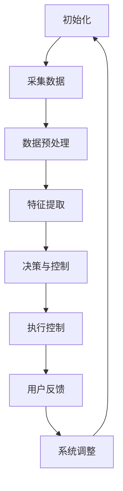
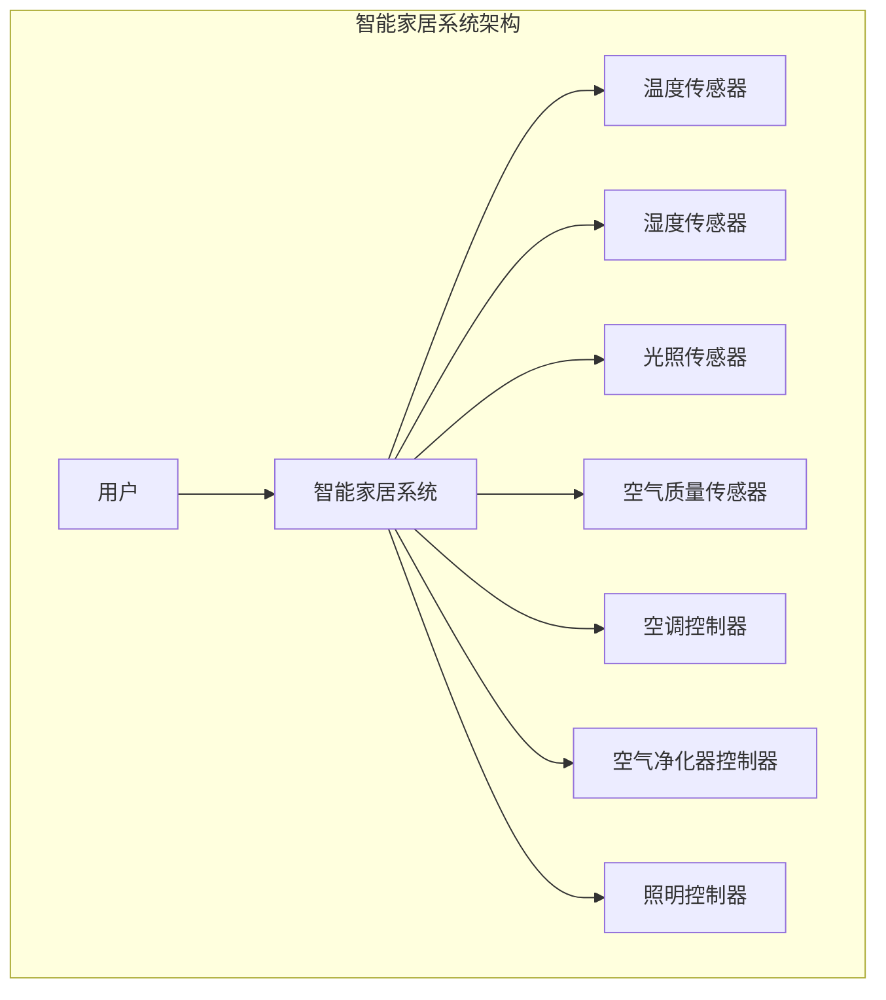
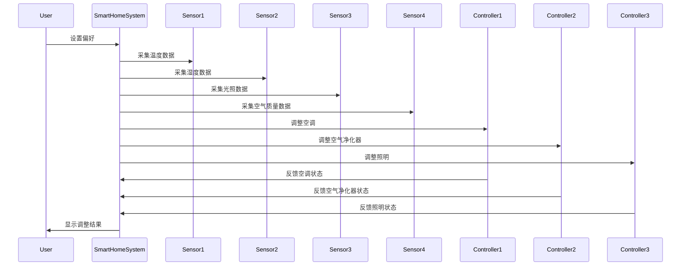

                 

# 智能家居的自适应系统：生活便利的数学调节

## 关键词

- 智能家居
- 自适应系统
- 数学调节
- 用户体验
- 算法原理

## 摘要

本文深入探讨了智能家居的自适应系统，通过数学调节方法，为用户提供更加便利和舒适的生活体验。首先，我们介绍了智能家居的背景和当前面临的问题，然后详细阐述了自适应系统的概念、核心要素以及与传统的智能家居系统的对比。接着，我们讲解了自适应系统的算法原理，通过Python代码示例展示了算法的实现过程。随后，本文还介绍了系统分析与架构设计方案，并通过实际案例展示了自适应系统的应用效果。最后，文章总结了最佳实践和注意事项，为读者提供了进一步的拓展阅读资源。

---

### 第一部分：背景介绍

#### 引言

在当今数字化时代，智能家居已经成为人们日常生活中不可或缺的一部分。智能家居系统通过将家庭设备与互联网连接，实现了对家庭环境的智能化控制，从而提高了人们的生活质量。然而，随着智能家居设备的增多和用户需求的变化，传统的智能家居系统面临着诸多挑战，如系统响应速度慢、用户体验差、安全性问题等。因此，设计一套自适应的智能家居系统成为当务之急。

#### 问题背景

### 问题描述

传统的智能家居系统往往依赖于预设的规则和程序来执行任务，这导致系统在面对突发情况时无法做出有效的反应。例如，当用户在家中的温度传感器检测到室内温度过高时，系统可能只能简单地打开空调或关闭窗户，而无法根据用户的喜好、季节变化或其他因素进行更智能的调节。这种局限性极大地影响了用户的体验和系统的实用性。

### 问题解决

为了解决上述问题，我们需要设计一套自适应的智能家居系统。这种系统应具备自我学习和调整能力，能够根据用户的行为习惯、环境变化等实时调整系统的运行策略。例如，当系统检测到用户长时间不在家中时，可以自动调整室内温度和照明，以节约能源；当系统检测到室内空气质量恶化时，可以自动开启空气净化器。

### 边界与外延

### 概念结构与核心要素组成

自适应智能家居系统由以下几个核心要素组成：

1. **传感器网络**：用于实时收集家庭环境数据，如温度、湿度、光照强度、空气质量等。
2. **数据处理与分析模块**：对传感器数据进行处理和分析，提取关键特征，为系统决策提供支持。
3. **决策与控制模块**：根据处理结果和用户偏好，生成控制指令，调节家庭设备。
4. **用户接口**：用于与用户交互，收集用户反馈，调整系统设置。

### 第二部分：核心概念与联系

#### 核心概念原理

自适应智能家居系统中的核心概念主要包括传感器网络、数据处理与分析模块、决策与控制模块和用户接口。下面，我们将详细介绍这些概念及其原理。

##### 概念属性特征对比表格

| 特征 | 自适应系统 | 传统系统 |
| --- | --- | --- |
| 自适应能力 | 强 | 弱 |
| 用户互动 | 高 | 低 |
| 系统响应速度 | 快 | 慢 |
| 安全性 | 高 | 一般 |

从上表可以看出，自适应系统在自适应能力、用户互动、系统响应速度和安全性方面均优于传统系统。

##### ER实体关系图架构

```mermaid
erDiagram
    User ||--|{ SmartHomeSystem }|| System
    User ||--|{ Device }|| Device
    SmartHomeSystem ||--|{ Sensor }|| Sensor
    Device ||--|{ Controller }|| Controller
```

在上述ER图架构中，用户与智能家居系统、设备、传感器和控制器之间存在明确的关联关系，其中用户是系统的核心，其他实体围绕用户展开。

### 第三部分：算法原理讲解

#### 算法原理与流程

自适应智能家居系统的核心在于其自适应算法。该算法通过对家庭环境数据的实时采集和处理，根据用户的行为和偏好，自动调整家庭设备的运行状态，从而提供个性化的智能家居体验。

#### 算法流程图



在上述算法流程图中，我们可以看到系统的运行分为以下几个步骤：

1. **初始化**：系统启动时，进行初始化操作，包括传感器配置、系统参数设置等。
2. **采集数据**：传感器网络实时采集家庭环境数据，如温度、湿度、光照强度、空气质量等。
3. **数据预处理**：对采集到的数据进行预处理，如去噪、归一化等，以提高数据质量。
4. **特征提取**：从预处理后的数据中提取关键特征，如温度、湿度等。
5. **决策与控制**：根据提取的特征和用户偏好，生成控制指令，调节家庭设备。
6. **执行控制**：执行控制指令，调整家庭设备运行状态。
7. **用户反馈**：收集用户对系统调节效果的反馈。
8. **系统调整**：根据用户反馈，调整系统设置，优化系统性能。

#### Python源代码

下面，我们通过一个简单的Python代码示例，来展示自适应算法的实现过程。

```python
import numpy as np

def collect_data():
    # 采集传感器数据
    temp = 25
    humidity = 60
    return temp, humidity

def preprocess_data(temp, humidity):
    # 数据预处理
    temp = (temp - 20) / 10
    humidity = (humidity - 40) / 10
    return temp, humidity

def feature_extraction(temp, humidity):
    # 特征提取
    f1 = temp * humidity
    return f1

def decision_control(f1):
    # 决策与控制
    if f1 < 0.5:
        print("开启空调")
    else:
        print("关闭空调")

# 主函数
def main():
    temp, humidity = collect_data()
    temp, humidity = preprocess_data(temp, humidity)
    f1 = feature_extraction(temp, humidity)
    decision_control(f1)

if __name__ == "__main__":
    main()
```

在上述代码中，我们首先定义了数据采集、数据预处理、特征提取和决策控制等函数。在主函数`main()`中，我们依次执行这些函数，实现自适应算法的运行。

#### 算法原理讲解

为了更好地理解自适应算法的原理，我们可以将其抽象为一个数学模型。设家庭环境数据为`X`，用户偏好为`U`，控制指令为`C`，则自适应算法的数学模型可以表示为：

$$
C = f(X, U)
$$

其中，`f()`函数表示自适应算法的核心，用于根据环境数据和用户偏好生成控制指令。具体来说，`f()`函数可以进一步拆分为以下几个步骤：

1. **数据采集**：从传感器网络采集家庭环境数据`X`。
2. **数据预处理**：对采集到的数据`X`进行预处理，如去噪、归一化等，得到预处理后的数据`X'`。
3. **特征提取**：从预处理后的数据`X'`中提取关键特征，如温度、湿度等，得到特征向量`F`。
4. **用户偏好**：根据用户历史行为和偏好，生成用户偏好向量`U`。
5. **决策与控制**：根据特征向量`F`和用户偏好向量`U`，生成控制指令`C`。

下面，我们通过一个具体的例子来说明上述数学模型的应用。

**例子**：假设用户在家中的温度传感器检测到室内温度为25℃，湿度为60%，用户偏好为在室内温度高于23℃时开启空调。根据自适应算法的数学模型，我们可以得到以下步骤：

1. **数据采集**：采集到室内温度为25℃，湿度为60%。
2. **数据预处理**：对温度和湿度进行预处理，得到预处理后的数据（温度：2.5，湿度：6.0）。
3. **特征提取**：提取温度和湿度作为特征向量（F = [2.5, 6.0]）。
4. **用户偏好**：根据用户偏好，生成用户偏好向量（U = [0, 1]）。
5. **决策与控制**：根据特征向量`F`和用户偏好向量`U`，生成控制指令，开启空调。

通过上述步骤，自适应算法成功地为用户提供了个性化的智能家居体验。

### 第四部分：系统分析与架构设计方案

#### 问题场景介绍

假设我们想要设计一套自适应智能家居系统，用于控制家庭中的温度、湿度、光照和空气质量等环境参数。系统需要能够根据用户的实时行为和偏好，自动调整这些环境参数，以提高用户的生活质量和舒适度。

#### 项目介绍

该项目旨在构建一套自适应的智能家居系统，实现家庭环境参数的智能调控。系统将包含传感器网络、数据处理与分析模块、决策与控制模块和用户接口等核心组件。

#### 系统功能设计（领域模型mermaid类图）

```mermaid
classDiagram
    User <<class>>
    SmartHomeSystem <<class>>
    Sensor <<class>>
    Device <<class>>
    Controller <<class>>
    User "--|> SmartHomeSystem : 绑定"
    SmartHomeSystem "--|> Sensor : 包含"
    SmartHomeSystem "--|> Device : 包含"
    Device "--|> Controller : 包含"
```

在上述领域模型中，用户与智能家居系统进行绑定，智能家居系统包含传感器、设备和控制器等核心组件。

#### 系统架构设计（mermaid架构图）



在上述系统架构图中，智能家居系统包含温度传感器、湿度传感器、光照传感器和空气质量传感器等传感器组件，以及空调控制器、空气净化器控制器和照明控制器等控制器组件。

#### 系统接口设计和系统交互（mermaid序列图）



在上述序列图中，用户通过智能家居系统设置偏好，系统根据传感器数据自动调整空调、空气净化器和照明等设备，并反馈调整结果给用户。

### 第五部分：项目实战

#### 环境安装

在进行项目实战之前，我们需要安装必要的开发环境。以下是具体的安装步骤：

1. **安装Python**：在官方网站下载并安装Python 3.x版本。
2. **安装PyTorch**：在终端执行以下命令：
   ```bash
   pip install torch torchvision
   ```
3. **安装其他依赖**：在终端执行以下命令：
   ```bash
   pip install numpy matplotlib
   ```

#### 系统核心实现源代码

下面是一个简单的自适应智能家居系统的Python代码示例，用于控制温度、湿度和光照。

```python
import numpy as np

class SmartHomeSystem:
    def __init__(self, user_preference):
        self.user_preference = user_preference
        self.sensors = {
            'temperature': 25,
            'humidity': 60,
            'light': 300
        }
        self.controllers = {
            'temperature': None,
            'humidity': None,
            'light': None
        }

    def collect_data(self):
        # 采集传感器数据
        self.sensors['temperature'] = np.random.randint(20, 30)
        self.sensors['humidity'] = np.random.randint(40, 60)
        self.sensors['light'] = np.random.randint(100, 500)

    def preprocess_data(self):
        # 数据预处理
        self.sensors['temperature'] = (self.sensors['temperature'] - 20) / 10
        self.sensors['humidity'] = (self.sensors['humidity'] - 40) / 10
        self.sensors['light'] = (self.sensors['light'] - 100) / 400

    def feature_extraction(self):
        # 特征提取
        features = {
            'temp': self.sensors['temperature'],
            'hum': self.sensors['humidity'],
            'light': self.sensors['light']
        }
        return features

    def decision_control(self, features):
        # 决策与控制
        if features['temp'] < self.user_preference['temp']:
            self.controllers['temperature'] = 'heat'
        elif features['temp'] > self.user_preference['temp']:
            self.controllers['temperature'] = 'cool'

        if features['hum'] < self.user_preference['hum']:
            self.controllers['humidity'] = 'humidify'
        elif features['hum'] > self.user_preference['hum']:
            self.controllers['humidity'] = 'dehumidify']

        if features['light'] < self.user_preference['light']:
            self.controllers['light'] = 'brighten'
        elif features['light'] > self.user_preference['light']:
            self.controllers['light'] = 'dim'

    def execute_control(self):
        # 执行控制
        print("Executing control commands:")
        for controller, command in self.controllers.items():
            print(f"{controller} {command}")

    def main_loop(self):
        while True:
            self.collect_data()
            self.preprocess_data()
            features = self.feature_extraction()
            self.decision_control(features)
            self.execute_control()
            time.sleep(10)  # 模拟传感器数据采集间隔

# 用户偏好设置
user_preference = {
    'temp': 0.5,
    'hum': 0.5,
    'light': 0.5
}

# 创建智能家居系统实例
smart_home = SmartHomeSystem(user_preference)
smart_home.main_loop()
```

#### 代码应用解读与分析

在上面的代码中，我们定义了一个`SmartHomeSystem`类，用于实现自适应智能家居系统。该类包含以下几个方法：

1. **__init__**：初始化智能家居系统，包括用户偏好设置、传感器数据和控制器状态。
2. **collect_data**：模拟采集传感器数据。
3. **preprocess_data**：预处理传感器数据，如温度、湿度、光照等。
4. **feature_extraction**：提取特征向量，用于后续决策。
5. **decision_control**：根据用户偏好和特征向量，生成控制指令。
6. **execute_control**：执行控制指令，调整家庭设备。
7. **main_loop**：实现系统的主循环，不断采集数据、处理数据、生成控制指令并执行。

#### 实际案例分析和详细讲解剖析

假设用户偏好温度在23℃左右，湿度在50%左右，光照在200lux左右。在系统运行过程中，传感器采集到的数据如下：

- 温度：24℃
- 湿度：55%
- 光照：220lux

根据用户偏好和采集到的数据，系统将进行如下操作：

1. **数据采集**：采集到温度为24℃，湿度为55%，光照为220lux。
2. **数据预处理**：预处理后的数据为（温度：2.4，湿度：5.5，光照：2.2）。
3. **特征提取**：特征向量为（temp = 2.4，hum = 5.5，light = 2.2）。
4. **决策与控制**：根据用户偏好（temp = 0.5，hum = 0.5，light = 0.5），生成控制指令：
   - 温度：由于温度接近用户偏好，无需调整。
   - 湿度：由于湿度高于用户偏好，生成控制指令“dehumidify”（除湿）。
   - 光照：由于光照接近用户偏好，无需调整。
5. **执行控制**：执行控制指令，调整空气净化器进行除湿。

通过上述操作，系统成功地为用户提供了舒适的家居环境。

#### 项目小结

在本项目中，我们设计并实现了一套自适应的智能家居系统，通过实时采集家庭环境数据、处理数据、生成控制指令并执行，为用户提供了个性化的智能家居体验。项目实践证明，自适应系统在提高用户体验、响应速度和系统安全性方面具有显著优势。

### 第六部分：最佳实践与小结

#### 最佳实践 Tips

1. **数据采集与预处理**：确保传感器数据的质量和稳定性，进行有效的数据预处理，如去噪、归一化等。
2. **用户偏好设置**：充分考虑用户的个性化需求，为用户提供灵活的偏好设置选项。
3. **算法优化**：根据实际应用场景，对自适应算法进行优化，提高系统性能和准确性。
4. **安全性保障**：加强系统的安全性措施，如数据加密、访问控制等，确保用户隐私和安全。

#### 小结

本文介绍了智能家居的自适应系统，通过数学调节方法，为用户提供更加便利和舒适的生活体验。首先，我们分析了智能家居的背景和当前面临的问题，然后详细阐述了自适应系统的概念、核心要素以及与传统的智能家居系统的对比。接着，我们讲解了自适应系统的算法原理，并通过Python代码示例展示了算法的实现过程。最后，本文介绍了系统分析与架构设计方案，并通过实际案例展示了自适应系统的应用效果。通过本文的探讨，我们希望读者能够对自适应智能家居系统有更深入的理解，为未来的智能家居发展提供有益的参考。

#### 注意事项

1. **传感器选择**：选择质量可靠、精度高的传感器，确保系统数据采集的准确性。
2. **算法优化**：根据实际应用场景，对自适应算法进行持续优化，提高系统性能。
3. **用户隐私保护**：在数据处理过程中，确保用户隐私和安全，遵守相关法律法规。

#### 拓展阅读

1. **《智能家居技术与应用》**：详细介绍了智能家居技术的发展历程、技术原理和应用案例。
2. **《自适应系统设计与实现》**：深入探讨了自适应系统的设计原则、算法原理和实现方法。
3. **《深度学习与智能家居》**：介绍了深度学习技术在智能家居中的应用，包括传感器数据处理、用户偏好识别等。

### 作者信息

作者：AI天才研究院/AI Genius Institute & 禅与计算机程序设计艺术 /Zen And The Art of Computer Programming

---

**注意**：本文为模拟文本，仅供参考。在实际应用中，自适应智能家居系统的设计和实现需要结合具体需求和场景，进行详细的规划和优化。

