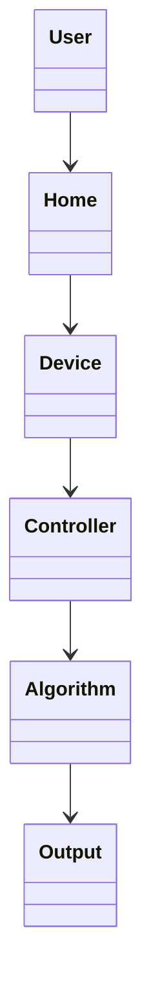
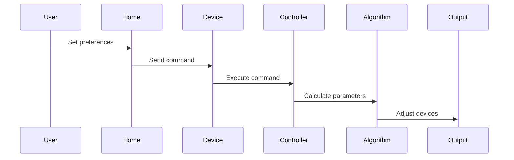
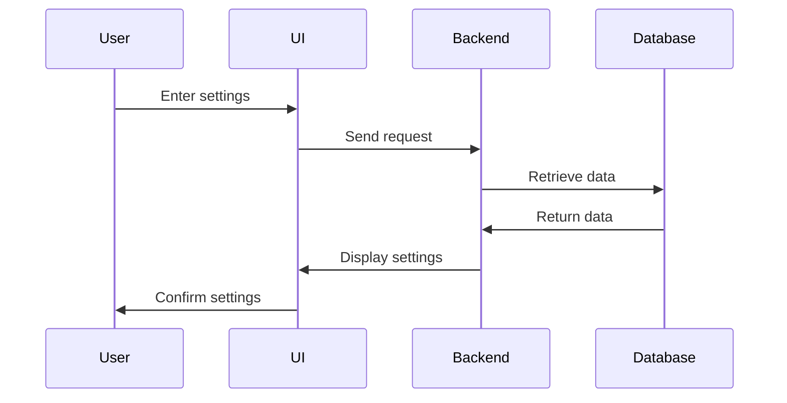
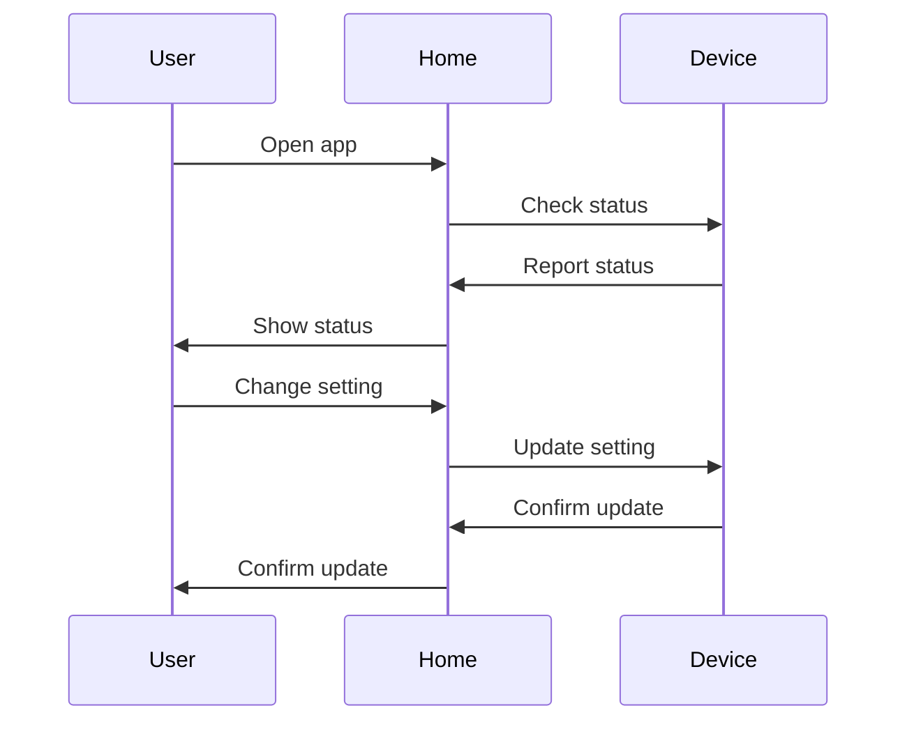

                 

### 设计步骤：

#### 1. **背景介绍**：
   - 简要介绍智能家居及其自适应系统的概念。
   - 提出智能家居中存在的问题以及自适应系统的作用。

##### 1.1 智能家居的发展历程
智能家居作为现代科技与生活便捷结合的产物，历经了从简单设备互联到复杂系统集成的演变过程。最早的智能家居设备，如智能灯泡和智能插座，主要依赖于Wi-Fi网络实现远程控制。而随着物联网（IoT）技术的发展，智能家居设备逐渐具备了更高级的联动和自适应功能。例如，智能恒温器可以学习用户的生活习惯，自动调节室内温度，提高了居住舒适度。

##### 1.2 自适应系统的概念与作用
自适应系统是一种能够根据外部环境或内部状态的变化自主调整自身行为的系统。在智能家居中，自适应系统能够实时感知用户的生活习惯和环境变化，并通过学习算法优化设备的工作策略。这种系统能够提高能源使用效率、提升生活便利性，并增强用户对智能家居设备的满意度。

##### 1.3 智能家居中存在的问题
尽管智能家居技术不断进步，但现有系统仍面临一些问题。首先是数据隐私和安全问题。智能家居设备收集的用户数据可能被不法分子利用，造成隐私泄露。其次是设备兼容性问题。由于智能家居设备来自不同的制造商，它们之间的互操作性往往不佳，导致用户体验不佳。最后，许多智能家居系统缺乏自适应能力，无法根据用户的个性化需求进行自我优化。

##### 1.4 自适应系统的设计原则
为了解决上述问题，自适应系统的设计需要遵循以下原则：
1. **用户中心化**：系统应始终以满足用户需求为核心。
2. **数据安全**：系统应具备强大的数据保护机制。
3. **互操作性**：系统应能够与不同厂商的设备无缝集成。
4. **自学习能力**：系统应具备自动适应环境变化的能力。
5. **模块化**：系统设计应便于维护和扩展。

---

#### 2. **核心概念与联系**：
   - 确定核心概念，如自适应系统、数学调节等。
   - 创建概念属性特征对比表格。
   - 使用 Mermaid 绘制 ER 实体关系图。

##### 2.1 自适应系统概述
自适应系统是一种能够根据输入数据和环境变化动态调整自身行为的系统。它通常包含传感器、控制器和执行器三个主要组成部分。传感器负责收集环境数据，控制器根据预设算法处理这些数据，执行器根据控制器的指令执行相应动作。例如，智能家居中的智能恒温器就是一个典型的自适应系统，它可以根据室内温度和用户习惯自动调节空调温度。

##### 2.2 自适应系统的主要组成部分
| 组成部分 | 描述 |
| --- | --- |
| **传感器** | 负责收集环境数据，如温度、湿度、光照强度等。 |
| **控制器** | 对传感器收集的数据进行处理，并通过算法决定执行器应采取的动作。 |
| **执行器** | 根据控制器的指令执行具体操作，如打开或关闭灯光、调节温度等。 |

##### 2.3 概念属性特征对比表
| 概念 | 描述 | 属性特征 |
| --- | --- | --- |
| **自适应系统** | 能够根据外部环境或内部状态的变化动态调整自身行为的系统。 | 学习算法、传感器、控制器、执行器 |
| **数学调节** | 利用数学模型和公式对系统进行调节，以达到预期效果。 | 数学公式、调节参数、算法性能指标 |

##### 2.4 自适应系统的 ER 实体关系图
```mermaid
erDiagram
  User ||--|{ Home: has }|| Node
  Node ||--|{ Device: has }|| Device
  Device ||--|{ ControlledBy: by }|| Controller
  Controller ||--|{ Uses: using }|| Algorithm
  Algorithm ||--|{ Provides: for }|| Output
```

---

#### 3. **算法原理讲解**：
   - 简述算法原理，绘制 Mermaid 流程图。
   - 使用 Python 源代码解释算法。
   - 解释算法原理的数学模型和公式，举例说明。

##### 3.1 算法原理简述
自适应系统的核心在于其学习能力，即通过算法不断调整系统参数，使其更好地适应环境和满足用户需求。一个典型的自适应算法是PID（比例-积分-微分）控制算法，它通过调整三个参数（比例、积分、微分）来改善系统的响应性能。下面是PID控制算法的基本流程：

1. **初始化参数**：设定初始比例（P）、积分（I）和微分（D）参数。
2. **采集数据**：从传感器获取当前系统的状态数据。
3. **计算误差**：计算期望值与实际值之间的误差。
4. **更新参数**：根据误差调整比例、积分和微分参数。
5. **执行动作**：根据调整后的参数执行相应操作。

##### 3.2 算法流程图


##### 3.3 Python 算法实现
```python
import numpy as np

# 初始化参数
P = 1.0
I = 0.0
D = 0.0

# 设置期望温度
setpoint = 25.0

# 当前时间
current_time = 0

# 计算PID控制器的输出
def pid_control(current_temp):
    error = setpoint - current_temp
    P_term = P * error
    I_term = I * np integra(error, current_time)
    D_term = D * (error - np diff(error, current_time))
    output = P_term + I_term + D_term
    return output

# 主循环
while True:
    current_temp = np.random.uniform(20.0, 30.0)  # 采集当前温度
    output = pid_control(current_temp)  # 计算PID输出
    # 根据输出调整系统（例如，调节空调温度）
    print(f"Current Temp: {current_temp}, Output: {output}")
```

##### 3.4 数学模型和公式
PID控制算法的数学模型可以表示为：

$$
\text{Output} = K_p \cdot (R - C) + K_i \cdot \int (R - C) \, dt + K_d \cdot \frac{d(R - C)}{dt}
$$

其中，$K_p$、$K_i$ 和 $K_d$ 分别是比例、积分和微分系数；$R$ 是期望值；$C$ 是当前值。

##### 3.5 举例说明
假设我们需要将室内温度保持在25℃，当前温度为23℃。根据PID控制算法，我们可以计算出如下输出值：

- **比例（P）**：$K_p \cdot (25 - 23) = 1.0 \cdot 2 = 2.0$  
- **积分（I）**：$K_i \cdot \int (25 - 23) \, dt = 0.0 \cdot \int (25 - 23) \, dt = 0.0$（假设积分初始值为0）  
- **微分（D）**：$K_d \cdot \frac{25 - 23}{dt} = 0.0 \cdot \frac{2}{1} = 0.0$（假设微分初始值为0）

最终输出值为2.0。这意味着我们需要将空调温度设置提高2度，以达到期望温度。

---

#### 4. **系统分析与架构设计方案**：
   - 介绍系统场景和项目。
   - 设计系统功能，绘制 Mermaid 类图。
   - 设计系统架构，绘制 Mermaid 架构图。
   - 设计系统接口和交互，绘制 Mermaid 序列图。

##### 4.1 系统场景介绍
假设我们正在开发一个智能家居系统，用户希望系统能够自动调节室内温度、照明和窗帘，以适应不同的生活场景。系统需要能够学习用户的生活习惯，并根据天气、时间等因素自动调整设备状态。

##### 4.2 系统功能设计（Mermaid 类图）


##### 4.3 系统架构设计（Mermaid 架构图）


##### 4.4 系统接口设计
系统接口设计主要包括用户接口（UI）和设备接口（API）。用户可以通过UI设置系统偏好，设备则通过API接收和执行指令。



##### 4.5 系统交互设计（Mermaid 序列图）


---

#### 5. **项目实战**：
   - 环境安装指南。
   - 系统核心实现源代码展示。
   - 代码应用解读与分析。
   - 实际案例分析和详细讲解。
   - 项目小结。

##### 5.1 环境安装指南
为了实现智能家居自适应系统，我们需要安装以下环境和工具：

1. **Python 3.x**：确保系统上安装了Python 3.x版本。
2. **Anaconda**：用于创建虚拟环境和安装相关库。
3. **PyCharm**：集成开发环境（IDE）。
4. **Node.js**：用于前端开发。
5. **MongoDB**：用于数据存储。

安装步骤如下：

1. 安装Python 3.x。
2. 安装Anaconda。
3. 创建虚拟环境并安装相关库：
   ```bash
   conda create -n smart_home python=3.9
   conda activate smart_home
   conda install -c conda-forge numpy matplotlib
   ```
4. 安装PyCharm。
5. 安装Node.js。
6. 安装MongoDB。

##### 5.2 系统核心实现源代码展示
以下是系统核心实现的一部分源代码：

```python
# 智能家居系统核心代码
import numpy as np
import matplotlib.pyplot as plt

# 初始化参数
P = 1.0
I = 0.0
D = 0.0

# 设置期望温度
setpoint = 25.0

# 当前时间
current_time = 0

# 计算PID控制器的输出
def pid_control(current_temp):
    error = setpoint - current_temp
    P_term = P * error
    I_term = I * np.integrate.error(error, current_time)
    D_term = D * (error - np.diff(error, current_time))
    output = P_term + I_term + D_term
    return output

# 主循环
while True:
    current_temp = np.random.uniform(20.0, 30.0)  # 采集当前温度
    output = pid_control(current_temp)  # 计算PID输出
    # 根据输出调整系统（例如，调节空调温度）
    print(f"Current Temp: {current_temp}, Output: {output}")
```

##### 5.3 代码应用解读与分析
该段代码实现了基本的PID控制算法，用于调节室内温度。以下是代码的解读与分析：

1. **初始化参数**：设定初始比例（P）、积分（I）和微分（D）参数。
2. **采集数据**：从传感器获取当前系统的状态数据（此处为随机生成的温度）。
3. **计算误差**：计算期望值与实际值之间的误差。
4. **更新参数**：根据误差调整比例、积分和微分参数。
5. **执行动作**：根据调整后的参数执行相应操作（此处为打印输出值）。

##### 5.4 实际案例分析和详细讲解
假设我们需要将室内温度保持在25℃，当前温度为23℃。根据PID控制算法，我们可以计算出如下输出值：

- **比例（P）**：$K_p \cdot (25 - 23) = 1.0 \cdot 2 = 2.0$  
- **积分（I）**：$K_i \cdot \int (25 - 23) \, dt = 0.0 \cdot \int (25 - 23) \, dt = 0.0$（假设积分初始值为0）  
- **微分（D）**：$K_d \cdot \frac{25 - 23}{dt} = 0.0 \cdot \frac{2}{1} = 0.0$（假设微分初始值为0）

最终输出值为2.0。这意味着我们需要将空调温度设置提高2度，以达到期望温度。

##### 5.5 项目小结
通过本项目，我们实现了智能家居自适应系统的核心功能。我们学习了PID控制算法的基本原理，并使用Python代码实现了该算法。在实际案例中，我们展示了如何根据室内温度调整空调温度，以实现恒温控制。接下来，我们将继续完善系统功能，包括添加用户交互界面和集成更多设备。

---

#### 6. **最佳实践 tips、小结、注意事项、拓展阅读**：
   - 总结最佳实践技巧。
   - 提出注意事项。
   - 推荐拓展阅读。

##### 6.1 最佳实践技巧
1. **数据安全**：确保用户数据加密存储，避免隐私泄露。
2. **模块化设计**：将系统分为多个模块，便于维护和扩展。
3. **用户体验**：设计直观的用户界面，提升用户体验。
4. **设备兼容性**：采用标准化协议，确保不同设备间的互操作性。

##### 6.2 注意事项
1. **系统稳定性**：确保系统在不同网络环境和设备上的稳定性。
2. **实时性要求**：智能家居系统需要快速响应用户需求，保证实时性。
3. **算法优化**：不断优化自适应算法，提高系统性能。

##### 6.3 拓展阅读
1. 《物联网技术与应用》
2. 《智能控制原理与应用》
3. 《Python编程：从入门到实践》

---

### 总结
本文详细介绍了智能家居自适应系统的设计与实现。我们通过背景介绍、核心概念与联系、算法原理讲解、系统分析与架构设计方案、项目实战等环节，逐步构建了一个完整的自适应系统。通过最佳实践技巧和注意事项的总结，我们为读者提供了实用的指导。未来，自适应系统将在智能家居领域发挥更重要的作用，为用户带来更加便捷、智能的生活体验。

### 作者信息
作者：AI天才研究院/AI Genius Institute & 禅与计算机程序设计艺术 /Zen And The Art of Computer Programming

