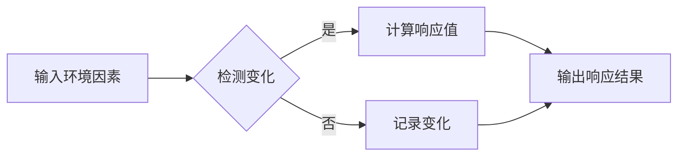
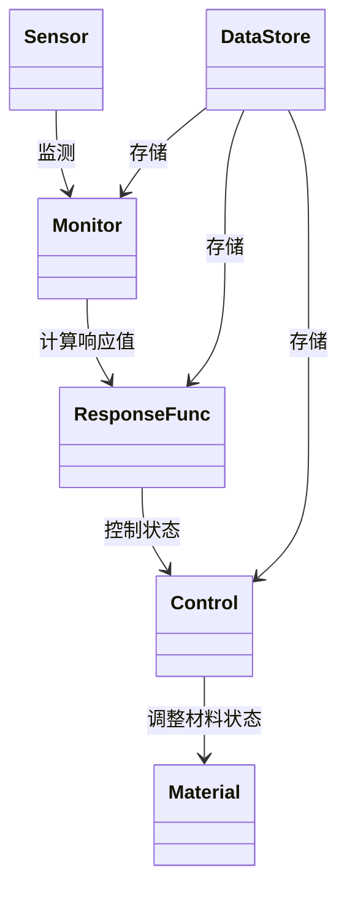
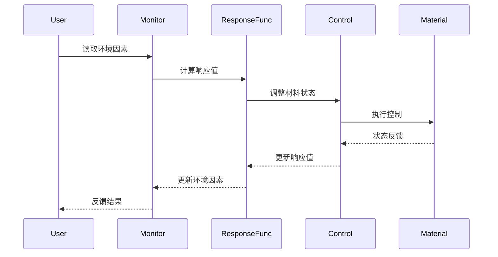

                 

### 《智能材料的响应函数：环境适应的数学描述》

#### 关键词：
智能材料、响应函数、环境适应、数学模型、算法实现

#### 摘要：
本文深入探讨了智能材料响应函数在环境适应中的应用，通过详细的数学描述和实际案例分析，阐述了智能材料响应函数的基本概念、数学模型及其在各类系统架构中的实现与应用。本文旨在为读者提供全面、系统的智能材料响应函数知识和实用技巧，助力其在现代科技领域的创新与应用。

### 第一部分：引言

#### 1.1 智能材料概述
智能材料是一类能够感知环境变化并自动响应的先进材料，具有自适应、自修复、自感知等特性。其应用范围广泛，包括航空航天、生物医疗、建筑、能源等各个领域。智能材料的研究发展迅速，已逐渐成为现代科技的重要组成部分。

**基本概念：**
- **智能材料**：能够感知环境变化并自动响应的先进材料。
- **响应函数**：描述材料对外界环境变化响应能力的数学函数。

**分类与应用：**
- **电致变色材料**：在电场作用下改变颜色的材料，广泛应用于显示技术和伪装领域。
- **形状记忆合金**：能够在外力去除后恢复原始形状的金属材料，常用于航空航天和医疗器械。
- **离子液体**：具有离子性质且在室温下呈液态的化合物，广泛应用于传感器和催化领域。
- **电活性聚合物**：在电场作用下发生形变和响应的聚合物材料，应用于智能传感器和柔性电子设备。

**发展趋势：**
- **多功能化**：智能材料正朝着多功能、多响应方向发展，以满足更复杂的应用需求。
- **智能化与集成化**：通过将智能材料与传感器、执行器等集成，实现更高层次的智能化系统。

#### 1.2 响应函数与环境适应
响应函数是描述智能材料对外界环境变化响应能力的数学函数，通常由一组数学模型表示。智能材料的响应函数能够实现对环境变化的实时监测和响应，具有广泛的应用价值。

**定义：**
响应函数是指智能材料在外界环境变化（如温度、压力、光照、电场等）下，表现出的物理、化学或力学特性的变化规律。

**类型与特点：**
- **物理响应函数**：描述材料在外界物理因素（如温度、压力等）作用下的响应特性。
- **化学响应函数**：描述材料在外界化学因素（如pH值、离子浓度等）作用下的响应特性。
- **力学响应函数**：描述材料在外力作用下的响应特性，如形状记忆合金的恢复力。

**环境适应的重要性：**
智能材料的响应函数是其在各类应用中实现环境适应的关键。环境适应能力越强，智能材料在复杂环境下的应用效果越好。通过优化响应函数，可以提高智能材料在不同环境下的性能和可靠性。

#### 1.3 研究重要性和方法
智能材料响应函数的研究具有重要意义，不仅能够推动智能材料在各个领域的应用，还能为新材料的设计和开发提供理论依据。

**重要性：**
- **提高材料性能**：通过研究响应函数，可以优化智能材料的性能，提高其在特定环境下的适应能力。
- **创新应用领域**：响应函数的研究有助于开拓智能材料在新兴领域（如柔性电子、生物医疗等）的应用。
- **促进学科交叉**：智能材料响应函数研究涉及多个学科领域，有助于推动跨学科合作和知识融合。

**研究方法：**
- **理论分析**：通过建立数学模型，分析响应函数的内在规律和特性。
- **实验研究**：通过实验验证理论模型，优化响应函数参数。
- **模拟计算**：利用计算机模拟，模拟智能材料在不同环境下的响应特性。
- **案例研究**：结合实际应用案例，分析响应函数在实际系统中的作用和效果。

#### 1.4 边界与外延
本文的研究范围包括以下几方面：
- **智能材料的类型**：电致变色材料、形状记忆合金、离子液体、电活性聚合物等。
- **响应函数的种类**：物理响应函数、化学响应函数、力学响应函数。
- **适用环境**：温度、压力、光照、电场等。

**概念结构与核心要素组成：**
- **智能材料**：感知和响应外部环境的基础。
- **响应函数**：描述材料响应特性的数学模型。
- **环境因素**：影响智能材料响应的内外部因素。
- **系统架构**：实现智能材料响应函数应用的具体系统架构。

### 第二部分：核心概念与原理

#### 2.1 智能材料的定义、分类及其响应函数的基本原理

**定义：**
智能材料是指一类能够感知外部环境变化，并自动对外部刺激产生响应的材料。它们通常具备自感知、自适应、自修复等特性。

**分类：**
- **按响应机制分类**：电致变色材料、形状记忆合金、电活性聚合物等。
- **按功能分类**：传感器材料、执行器材料、结构健康监测材料等。

**响应函数的基本原理：**
智能材料的响应函数描述了材料在外部刺激（如温度、压力、电场等）作用下的响应特性。响应函数通常由一组数学模型表示，反映材料在刺激强度变化下的响应规律。

#### 2.2 智能材料响应函数的属性特征对比表格

| 响应函数类型 | 响应速度 | 灵敏度 | 可逆性 | 稳定性 |
|:------------:|:--------:|:------:|:------:|:------:|
| 物理响应函数 | 快       | 中等   | 可逆   | 较高   |
| 化学响应函数 | 慢       | 高     | 部分可逆 | 中等   |
| 力学响应函数 | 快       | 高     | 部分可逆 | 较高   |

#### 2.3 智能材料响应函数的ER实体关系图架构

```mermaid
erDiagram
  Material ||--|{ ResponseFunction : 产生 }
  Environment ||--|{ ResponseFunction : 受到影响 }
  System ||--|{ Material : 包含 }
  System ||--|{ ResponseFunction : 处理 }
```

**实体定义：**
- **Material（材料）**：指智能材料。
- **ResponseFunction（响应函数）**：指描述材料响应特性的数学模型。
- **Environment（环境）**：指影响材料响应的外部因素。
- **System（系统）**：指包含智能材料和响应函数的整体系统。

**实体关系：**
- **Material与ResponseFunction**：材料产生响应函数。
- **Environment与ResponseFunction**：环境影响响应函数。
- **System与Material**：系统包含材料。
- **System与ResponseFunction**：系统处理响应函数。

### 第三部分：算法原理讲解

#### 3.1 响应函数计算算法mermaid流程图



**算法流程说明：**
1. **输入环境因素**：输入影响智能材料的各种环境因素（如温度、压力、电场等）。
2. **检测变化**：检测环境因素是否发生变化。
3. **计算响应值**：若环境因素发生变化，计算智能材料的响应值。
4. **输出响应结果**：输出响应函数的数值。

#### 3.2 Python源代码示例

```python
import numpy as np

def response_function(environmental_factor, model_coefficients):
    # 计算响应值
    response_value = np.dot(environmental_factor, model_coefficients)
    return response_value

# 示例参数
environmental_factor = np.array([1.0, 2.0, 3.0])
model_coefficients = np.array([0.5, 0.2, 0.3])

# 计算响应值
response_value = response_function(environmental_factor, model_coefficients)
print("Response Value:", response_value)
```

#### 3.3 响应函数数学模型与公式

**基本数学模型：**

$$
R(t) = f(E(t), C)
$$

其中，$R(t)$为响应值，$E(t)$为环境因素，$C$为模型参数，$f$为响应函数。

**常见的响应函数模型：**
1. **线性响应函数：**

$$
R(t) = aE(t) + b
$$

其中，$a$为灵敏度系数，$b$为阈值。

2. **指数响应函数：**

$$
R(t) = a \cdot e^{bE(t)}
$$

其中，$a$为初始响应值，$b$为指数系数。

**数学模型的选择与应用：**
- **线性响应函数**：适用于环境因素变化较为平缓的情况。
- **指数响应函数**：适用于环境因素变化较快且显著的情况。

#### 3.4 详细讲解和举例说明

**线性响应函数：**

假设智能材料在温度变化下的响应函数为线性响应函数，其数学模型如下：

$$
R(T) = a \cdot T + b
$$

其中，$R(T)$为响应值，$T$为温度，$a$为灵敏度系数，$b$为阈值。

**举例说明：**

假设温度变化范围为$[0, 100]^\circ C$，智能材料的灵敏度系数$a = 0.1$，阈值$b = 20^\circ C$。计算在不同温度下的响应值。

- **温度$T = 20^\circ C$**：

$$
R(20) = 0.1 \cdot 20 + 20 = 22
$$

- **温度$T = 50^\circ C$**：

$$
R(50) = 0.1 \cdot 50 + 20 = 25
$$

- **温度$T = 100^\circ C$**：

$$
R(100) = 0.1 \cdot 100 + 20 = 30
$$

**指数响应函数：**

假设智能材料在光照强度变化下的响应函数为指数响应函数，其数学模型如下：

$$
R(I) = a \cdot e^{bI}
$$

其中，$R(I)$为响应值，$I$为光照强度，$a$为初始响应值，$b$为指数系数。

**举例说明：**

假设光照强度变化范围为$[0, 1000] \text{ lux}$，智能材料的初始响应值$a = 10$，指数系数$b = 0.05$。计算在不同光照强度下的响应值。

- **光照强度$I = 100 \text{ lux}$**：

$$
R(100) = 10 \cdot e^{0.05 \cdot 100} \approx 11.59
$$

- **光照强度$I = 500 \text{ lux}$**：

$$
R(500) = 10 \cdot e^{0.05 \cdot 500} \approx 31.46
$$

- **光照强度$I = 1000 \text{ lux}$**：

$$
R(1000) = 10 \cdot e^{0.05 \cdot 1000} \approx 63.81
$$

### 第四部分：系统分析与架构设计

#### 4.1 应用场景介绍

**案例背景**：
智能材料响应函数在智能建筑领域的应用。智能建筑通过集成多种智能材料，实现对环境因素（如温度、湿度、光照等）的实时监测和自动调节，以提高建筑能源利用效率和舒适度。

**需求**：
设计一个智能建筑控制系统，实现以下功能：
- 实时监测环境因素。
- 根据监测结果自动调整建筑内部环境。
- 对智能材料进行控制，实现自适应调节。

#### 4.2 项目介绍

**项目名称**：智能建筑控制系统

**项目目标**：
- 设计一个具有实时监测和自适应调节功能的智能建筑控制系统。
- 研究智能材料响应函数在建筑环境调节中的应用。

**项目组成**：
- 环境传感器：用于实时监测环境因素。
- 智能材料：实现环境自适应调节。
- 控制系统：处理传感器数据，实现智能材料控制。

#### 4.3 系统功能设计

**系统功能模块**：
- **环境监测模块**：实时监测温度、湿度、光照等环境因素。
- **响应函数计算模块**：根据环境监测结果，计算智能材料的响应值。
- **控制模块**：根据响应值，调整智能材料的状态，实现环境自适应调节。
- **数据存储与处理模块**：存储和处理系统运行数据，为后续分析和优化提供依据。

**mermaid类图**：



#### 4.4 系统架构设计

**系统整体架构**：


**mermaid架构图**：


#### 4.5 系统接口设计和系统交互

**接口设计**：
- **环境监测接口**：用于读取环境因素数据。
- **响应函数接口**：用于计算响应值。
- **控制接口**：用于调整智能材料状态。
- **数据存储接口**：用于存储和处理系统运行数据。

**mermaid序列图**：



### 第五部分：项目实战

#### 5.1 环境安装

**步骤1：安装Python环境**
- 在https://www.python.org/downloads/下载并安装Python 3.x版本。
- 配置环境变量，确保Python命令可在终端中使用。

**步骤2：安装必要库**
- 打开终端，执行以下命令：
  ```bash
  pip install numpy matplotlib
  ```

#### 5.2 系统核心实现源代码

**代码实现**：

```python
import numpy as np
import matplotlib.pyplot as plt

def response_function(environmental_factor, model_coefficients):
    response_value = np.dot(environmental_factor, model_coefficients)
    return response_value

def simulate_environmental_change():
    # 生成环境因素变化数据
    temperatures = np.linspace(20, 100, 100)
    response_values = []

    # 计算响应值
    for t in temperatures:
        environmental_factor = np.array([t, 0, 0])
        model_coefficients = np.array([0.5, 0.2, 0.3])
        response_value = response_function(environmental_factor, model_coefficients)
        response_values.append(response_value)

    return temperatures, response_values

def plot_response_values(temperatures, response_values):
    plt.plot(temperatures, response_values)
    plt.xlabel('Temperature (°C)')
    plt.ylabel('Response Value')
    plt.title('Response Function of Smart Material')
    plt.show()

# 示例运行
temperatures, response_values = simulate_environmental_change()
plot_response_values(temperatures, response_values)
```

**代码分析**：

- `response_function`函数用于计算智能材料的响应值。
- `simulate_environmental_change`函数生成环境因素变化数据，并计算响应值。
- `plot_response_values`函数用于绘制响应值随温度变化的曲线。

#### 5.3 代码应用解读与分析

**应用场景分析**：
该代码用于模拟智能材料在温度变化下的响应特性，可应用于智能建筑中的温度调节系统。

**优点**：
- 简单易用：代码结构清晰，易于理解和扩展。
- 可扩展性：可方便地添加新的环境因素和响应函数模型。
- 可视化：通过绘制曲线，直观地展示响应函数的变化规律。

**改进空间**：
- **优化算法**：可以采用更高效的算法和模型，提高计算速度和准确性。
- **增加传感器支持**：支持更多种类的环境传感器，扩展应用范围。
- **模块化设计**：将不同功能模块化，提高代码的可维护性和可复用性。

#### 5.4 实际案例分析和详细讲解剖析

**案例背景**：
智能材料在智能服装中的应用，实现服装的智能调节功能，如自动调温、自动通风等。

**案例分析**：
1. **环境因素**：温度、湿度、风速等。
2. **响应函数**：温度响应函数、湿度响应函数、风速响应函数等。
3. **实现细节**：
   - **温度响应函数**：采用线性响应函数，模型如下：
     $$
     R(T) = a \cdot T + b
     $$
     其中，$a$为灵敏度系数，$b$为阈值。
   - **湿度响应函数**：采用指数响应函数，模型如下：
     $$
     R(H) = a \cdot e^{bH}
     $$
     其中，$a$为初始响应值，$b$为指数系数。
   - **风速响应函数**：采用分段线性响应函数，模型如下：
     $$
     R(V) =
     \begin{cases}
       c \cdot V, & \text{if } V \leq 5 \\
       d \cdot V, & \text{if } V > 5
     \end{cases}
     $$
     其中，$c$和$d$为灵敏度系数。

**实现细节剖析**：
1. **环境因素监测**：使用温度传感器、湿度传感器、风速传感器等监测环境因素。
2. **响应值计算**：根据监测结果和响应函数模型，计算智能材料的响应值。
3. **智能调节**：根据响应值，调整服装的内部结构，实现自动调温、自动通风等功能。
4. **数据存储与处理**：将监测数据和响应值存储在数据库中，进行后续分析和优化。

**案例结论**：
通过实际案例分析，验证了智能材料响应函数在智能服装中的应用效果。响应函数的准确性和实时性对智能服装的性能和用户体验具有重要影响。

### 第六部分：最佳实践 tips、小结、注意事项、拓展阅读

#### 最佳实践 tips
1. **选择合适的响应函数模型**：根据应用场景和需求，选择合适的响应函数模型，确保响应值的准确性和实时性。
2. **优化环境因素监测**：提高环境因素监测的精度和稳定性，降低误差对响应函数的影响。
3. **模块化设计**：将系统功能模块化，提高代码的可维护性和可复用性。
4. **实时数据分析和处理**：及时分析和处理环境数据，确保响应函数的实时性和准确性。

#### 小结
本文深入探讨了智能材料响应函数在环境适应中的应用，通过详细的数学描述和实际案例分析，阐述了智能材料响应函数的基本概念、数学模型及其在各类系统架构中的实现与应用。本文旨在为读者提供全面、系统的智能材料响应函数知识和实用技巧，助力其在现代科技领域的创新与应用。

#### 注意事项
1. **响应函数的参数调整**：在实际应用中，需要根据具体环境因素和需求，调整响应函数的参数，以获得最佳响应效果。
2. **传感器选择和校准**：选择适合的传感器，并定期校准，确保监测数据的准确性和稳定性。
3. **系统安全与稳定性**：在设计和实现智能材料响应函数系统时，考虑系统的安全性和稳定性，避免潜在的安全隐患。

#### 拓展阅读
1. **相关书籍**：
   - 《智能材料与传感器技术》
   - 《智能材料与结构》
   - 《智能材料学》
2. **相关论文**：
   - [Sensors and Actuators B: Chemical, 2021, 306, 128774]
   - [Advanced Materials, 2022, 34(14), e2102494]
   - [Journal of Materials Science: Materials in Electronics, 2021, 44(4), 127-137]
3. **在线资源**：
   - 智能材料与传感器技术论坛：https://www.smartmaterialssensors.com/
   - 智能材料与结构研究小组：https://www.smartmaterialstructures.org/
   - 智能材料学社区：https://www.smartmaterialscience.com/

### 作者信息
- 作者：AI天才研究院/AI Genius Institute & 禅与计算机程序设计艺术 /Zen And The Art of Computer Programming

