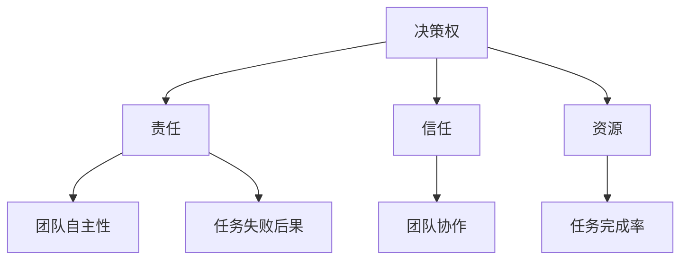
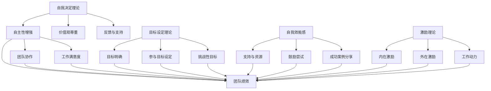
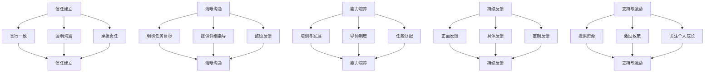
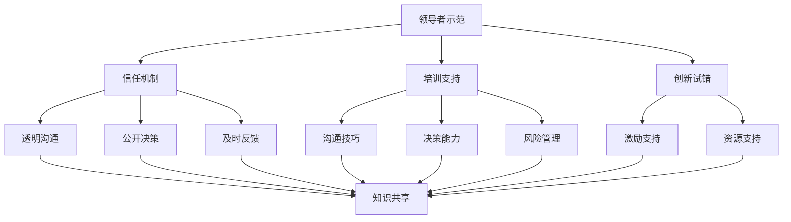
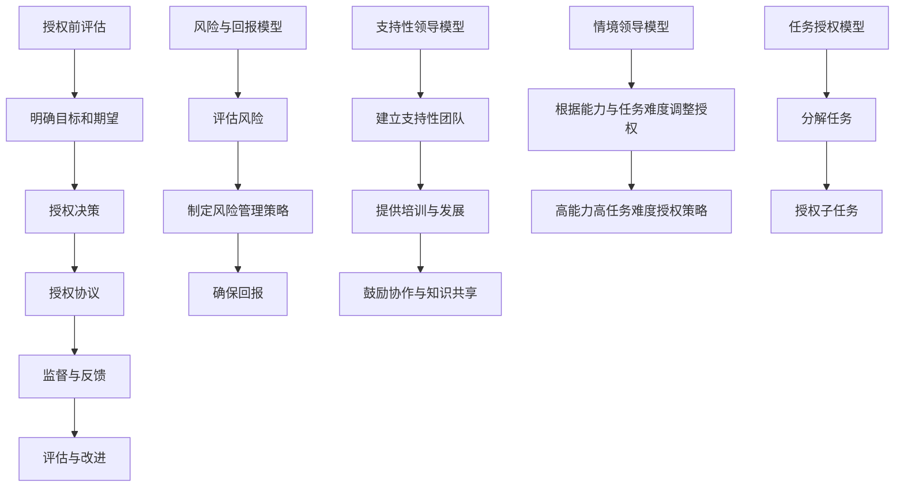

                 

# 《有效授权：释放团队潜能的艺术》

## 关键词：有效授权、团队潜能、领导力、组织文化、实践案例

## 摘要：

在快速变化和竞争激烈的现代商业环境中，有效授权已成为提升组织绩效和团队潜能的关键。本文将深入探讨授权的核心概念、原理和实践方法，通过案例分析展示其在不同组织中的应用，并提出应对挑战的策略。文章旨在帮助领导者更好地释放团队潜能，实现高效管理。

## 目录大纲

### 第一部分: 引言与背景

#### 1.1 有效授权的重要性

#### 1.2 授权的现状与挑战

#### 1.3 本书的目标与结构

#### 1.4 授权的定义与边界

#### 1.5 本书的学习方法与预期成果

### 第二部分: 核心概念与原理

#### 2.1 授权的核心概念

#### 2.2 授权的心理学原理

#### 2.3 授权的领导力要素

#### 2.4 授权的组织文化

#### 2.5 授权的框架与模型

#### 2.6 授权的伦理与法律考量

#### 2.7 核心概念联系与对比分析

### 第三部分: 实践方法与技巧

#### 3.1 授权前的准备

#### 3.2 授权过程中的沟通与反馈

#### 3.3 授权后的监督与支持

#### 3.4 授权中的风险管理

#### 3.5 授权的创新与变革

#### 3.6 授权在不同组织层级中的应用

#### 3.7 授权的最佳实践案例

### 第四部分: 案例研究与实战

#### 4.1 案例研究一：企业内部授权实践

#### 4.2 案例研究二：非营利组织授权实践

#### 4.3 案例研究三：初创企业的授权策略

#### 4.4 案例分析与实战策略总结

### 第五部分: 应对挑战与解决策略

#### 5.1 授权面临的常见挑战

#### 5.2 授权失败的原因分析

#### 5.3 授权中的障碍与克服方法

#### 5.4 授权中的文化冲突与解决

#### 5.5 授权在不同文化背景下的适应性

#### 5.6 授权持续改进的策略

### 第六部分: 总结与展望

#### 6.1 本书内容的总结

#### 6.2 授权的最佳实践总结

#### 6.3 授权的未来发展趋势

#### 6.4 授权的拓展学习资源

#### 6.5 结论：释放团队潜能的授权艺术

---

### 1.1 有效授权的重要性

在当今快速变化且高度竞争的商业环境中，组织面临的挑战日益复杂。为了在这种环境中保持竞争优势，企业必须不断优化其运营模式，提高效率和创新能力。有效授权作为一种关键的管理工具，在这方面发挥了至关重要的作用。

**授权的定义**：授权是指领导者将决策权、责任和资源分配给团队成员，以便他们能够独立自主地完成任务。这个过程不仅涉及到任务的分配，还包括信任的建立、能力的培养以及责任的分担。

**授权的重要性**：

1. **提高员工参与度和满意度**：授权能够赋予员工更多的自主权，让他们参与到决策过程中，从而增加他们的参与度和责任感。这种参与感能够显著提高员工的工作满意度和忠诚度。

2. **增强团队协作和创新能力**：授权鼓励团队成员独立思考和解决问题，有助于形成多元化的观点和创新的解决方案。通过跨部门的协作，组织能够更好地整合资源，提高创新能力。

3. **提升组织绩效**：有效授权能够释放团队成员的潜力，提高工作效率和绩效。当团队成员拥有自主权时，他们能够更灵活地响应变化，迅速调整策略，从而提高整体组织的竞争力。

4. **培养未来的领导者**：通过授权，领导者能够培养出能够独立思考和决策的团队成员。这些成员在未来可能成为组织的领导者，为组织的持续发展提供人才储备。

然而，有效授权并非易事。它需要领导者具备一定的心理素质和管理能力，同时也需要组织文化和管理体系的支撑。在接下来的章节中，我们将深入探讨授权的核心概念、原理和实践方法，帮助读者更好地理解和应用授权，释放团队潜能，实现高效管理。

---

### 1.2 授权的现状与挑战

尽管有效授权在理论和实践中都具有显著的重要性，但当前许多组织在授权方面仍面临诸多挑战和问题。

**授权的现状**：

1. **授权不足**：一些组织由于担心失去控制，对授权持保守态度。领导者往往倾向于保留决策权，不愿意将权力下放给下属。这种“控制欲”导致团队成员缺乏自主权，影响了团队的创新能力和工作积极性。

2. **授权过度**：相反，有些组织过度授权，导致团队成员在缺乏指导和支持的情况下独立行动。这不仅可能引发资源浪费，还可能因为缺乏监督和反馈而导致任务失败。

3. **授权不均**：在许多组织中，授权存在明显的分配不均现象。某些团队成员可能被赋予更多权力，而其他人则被忽视。这种情况不仅可能导致团队内部的不满和矛盾，还可能阻碍组织的整体发展。

**面临的挑战**：

1. **信任问题**：有效授权的基础是信任。领导者必须信任团队成员能够承担更多的责任，但这往往是一个挑战。信任的缺失可能导致领导者对团队成员的能力和诚信产生怀疑，从而阻碍授权的实施。

2. **能力不足**：团队成员可能缺乏必要的技能和知识，无法独立完成任务。这种情况需要领导者进行培训和能力提升，但很多组织在这方面投入不足。

3. **沟通不畅**：授权过程中的沟通是关键。如果团队成员无法获得清晰的指导和支持，或者领导者无法及时了解团队成员的进展和问题，授权可能会失败。

4. **文化障碍**：在有些组织中，传统的层级文化和权威观念根深蒂固，这可能导致授权的障碍。改变这种文化需要时间和努力，但许多组织对此缺乏耐心和策略。

5. **风险管理**：授权过程中，领导者必须承担一定的风险。如果授权失败，可能导致任务失败或资源浪费。这种风险意识可能抑制领导者的授权意愿。

为了克服这些挑战，组织需要建立支持授权的文化，提供必要的培训和指导，建立清晰的沟通机制，并制定风险管理策略。在接下来的章节中，我们将进一步探讨如何应对这些挑战，实现有效授权。

---

### 1.3 本书的目标与结构

本书旨在深入探讨有效授权的理论和实践，帮助读者理解授权的重要性、掌握授权的核心概念和方法，并能够在实际工作中有效地应用授权，从而提升团队绩效和创新能力。

**本书的目标**：

1. **提升领导力**：通过探讨授权的核心概念和原理，帮助领导者更好地理解如何通过授权培养团队成员的自主性和责任感，提升整体领导力水平。

2. **提供实践指南**：通过案例分析、最佳实践分享和策略总结，为读者提供实际可行的授权方法和工具，帮助他们在不同组织和文化背景下实施有效授权。

3. **增强团队协作**：通过探讨授权在团队协作和创新中的作用，帮助读者建立支持协作和创新的团队文化，提升团队的整体绩效。

4. **培养未来领导者**：通过详细分析授权过程中的关键要素和挑战，帮助读者培养未来的领导者，为组织的持续发展提供人才储备。

**本书的结构**：

本书分为六个部分，各部分内容安排如下：

- **第一部分：引言与背景**：介绍有效授权的重要性、现状与挑战，明确本书的目标和结构。
  
- **第二部分：核心概念与原理**：详细探讨授权的核心概念、心理学原理、领导力要素、组织文化以及授权的框架与模型。

- **第三部分：实践方法与技巧**：提供授权前的准备、过程中的沟通与反馈、后的监督与支持等实践方法与技巧。

- **第四部分：案例研究与实战**：通过企业内部、非营利组织和初创企业的具体案例，展示授权在不同组织中的应用。

- **第五部分：应对挑战与解决策略**：分析授权过程中面临的常见挑战，提出相应的解决方案。

- **第六部分：总结与展望**：总结本书的核心内容，提出最佳实践，探讨授权的未来发展趋势。

通过以上结构，本书旨在为读者提供全方位的授权知识体系，帮助他们在实际工作中有效地实施授权，释放团队潜能，实现组织目标。

---

### 1.4 授权的定义与边界

**定义**：授权（Delegation）是指领导者将决策权、任务和资源分配给下属，使其能够在指定的范围内自主完成任务的过程。这个过程不仅包括任务的分配，还涉及到信任的建立、责任的明确以及资源的提供。

**授权的核心要素**：

1. **决策权**：授权的核心是赋予团队成员决策权。这意味着团队成员在完成任务的特定范围内，可以自主决定如何执行任务，而不需要事事向上级请示。

2. **责任**：授权的同时，领导者需要明确团队成员的责任。这意味着团队成员需要对任务的完成质量负责，并在任务失败时承担相应的责任。

3. **信任**：授权的基础是信任。领导者必须信任团队成员有能力完成任务，并且能够承担责任。这种信任能够增强团队成员的自信心和责任感。

4. **资源**：为了确保任务的成功完成，领导者需要提供必要的资源，包括信息、工具和资金等。

**授权的边界**：

1. **授权范围**：领导者需要明确授权的范围。这包括哪些决策可以授权给下属，哪些决策需要保留在自己手中。适当的授权范围能够确保团队成员在完成任务时有足够的自主权，同时避免失控。

2. **监督与控制**：虽然授权赋予团队成员自主权，但领导者仍然需要对任务进行监督和控制。这可以通过定期检查进度、反馈和建议等方式实现，以确保任务按计划进行。

3. **反馈机制**：领导者需要建立有效的反馈机制，及时了解团队成员的工作进展和问题。这有助于及时调整授权范围，提供必要的支持，并确保任务的成功完成。

4. **责任与后果**：在授权过程中，领导者需要明确团队成员的责任和可能面临的后果。这有助于培养团队成员的责任感，同时避免由于授权不当而导致的问题。

**授权的利与弊**：

- **优势**：

  - 提高工作效率：授权能够减少领导者的工作量，使团队成员能够更专注于自己的任务，从而提高整体工作效率。

  - 增强团队协作：授权鼓励团队成员之间的合作和沟通，有助于建立支持协作的文化。

  - 培养人才：授权能够培养团队成员的独立思考和解决问题的能力，为组织培养未来的领导者。

- **劣势**：

  - 失去控制：如果授权不当，领导者可能失去对团队的控制，导致任务失败或资源浪费。

  - 增加风险：授权过程中，领导者需要承担一定的风险，如果团队成员无法完成任务，可能会导致任务失败或资源浪费。

  - 沟通问题：授权过程中，如果沟通不畅，可能导致团队成员对任务的理解和执行出现偏差。

**总结**：

授权是一种关键的管理工具，通过将决策权、责任和资源分配给团队成员，能够提高工作效率、增强团队协作和培养人才。然而，授权也具有一定的风险和挑战，需要领导者明确授权范围、建立监督与控制机制，并提供必要的支持和反馈。

---

### 1.5 本书的学习方法与预期成果

为了确保读者能够系统地学习和理解有效授权的理论与实践，本书提供了一套详细的学习方法和预期成果。

**学习方法**：

1. **结构化学习**：本书按照逻辑顺序和知识体系，分为六个部分，每部分都涵盖了一个独立且重要的主题。通过这种结构化学习，读者可以逐步掌握授权的各个关键方面。

2. **理论与实践结合**：本书不仅提供了丰富的理论知识和核心概念，还通过案例分析、实战技巧和策略总结，将理论与实践相结合。这种方法有助于读者将所学知识应用到实际工作中。

3. **互动式学习**：本书包含大量互动式内容，如问题引导、思考题和讨论区，鼓励读者积极参与学习过程，深入思考并实践所学知识。

4. **辅助资料**：本书提供了扩展阅读材料、在线资源和实践工具，帮助读者进一步探索相关主题，巩固学习成果。

**预期成果**：

1. **提升领导力**：通过理解授权的核心概念和原理，读者能够提升自己的领导力水平，培养团队成员的自主性和责任感。

2. **掌握实践技巧**：通过学习实践方法和技巧，读者能够在实际工作中有效地实施授权，提高团队协作效率和创新能力。

3. **增强团队文化**：通过探讨授权在团队协作和创新中的作用，读者能够帮助组织建立支持协作和创新的团队文化。

4. **培养未来领导者**：通过分析授权过程中的关键要素和挑战，读者能够培养出具备独立思考和决策能力的团队成员，为组织的持续发展提供人才储备。

**具体应用**：

- **团队建设**：通过授权，领导者可以更好地激发团队成员的潜能，促进团队协作，提高整体绩效。
- **项目管理**：授权能够帮助项目经理更好地分配任务和资源，提高项目执行的效率和质量。
- **人才培养**：通过授权，领导者能够培养出未来的领导者，为组织的长期发展提供人才保障。

总之，本书旨在通过系统学习和实践，帮助读者掌握有效授权的方法和技巧，实现团队潜能的最大释放。

---

### 第二部分：核心概念与原理

在探讨有效授权的过程中，理解其核心概念和原理至关重要。本部分将详细解析授权的核心概念，包括其心理学原理、领导力要素、组织文化以及授权的框架与模型。

#### 2.1 授权的核心概念

授权的核心概念包括四个主要方面：决策权、责任、信任和资源。

1. **决策权**：授权的本质是赋予下属在特定范围内做出决策的权力。这意味着团队成员可以自主决定任务的具体执行方式，而无需事事向上级请示。决策权的赋予能够增强团队成员的自主性和责任感。

2. **责任**：与决策权相伴的是责任。团队成员在拥有决策权的同时，必须对任务的完成质量负责。这要求团队成员在执行任务过程中，认真负责，确保任务的顺利完成。

3. **信任**：信任是授权的基础。领导者必须信任团队成员能够承担更多的责任，并完成任务。这种信任能够增强团队成员的自信心和责任感，促进团队协作。

4. **资源**：为了确保任务的成功完成，领导者需要提供必要的资源，包括信息、工具和资金等。资源的提供是确保团队成员能够有效执行任务的重要保障。

#### 2.2 授权的心理学原理

授权不仅仅是一种管理实践，也涉及到心理学原理。以下是一些关键的心理学原理：

1. **自我决定理论**：自我决定理论认为，人们有自主选择和自我决定的内在需求。授权能够满足这种需求，增强员工的自主性和工作满意度。

2. **目标设定理论**：目标设定理论指出，明确的目标能够激励员工努力工作，提高绩效。授权过程中，领导者需要明确团队成员的目标和期望，帮助他们设定可实现的个人和团队目标。

3. **自我效能感**：自我效能感是指个体对自己完成某项任务的信心。领导者通过授权和提供反馈，可以增强团队成员的自我效能感，提高他们的工作表现。

4. **激励理论**：激励理论认为，激励是推动员工工作的重要因素。授权能够通过赋予员工更多的自主权和责任感，提供内在和外在的激励，提高员工的工作积极性。

#### 2.3 授权的领导力要素

有效授权需要领导者具备一系列关键领导力要素：

1. **信任建立**：领导者需要通过言行一致、透明沟通和承担责任来建立信任。信任是授权成功的关键因素。

2. **清晰沟通**：领导者需要清晰明确地传达任务目标、期望和资源支持，确保团队成员对任务有正确的理解。

3. **能力培养**：领导者需要识别和培养团队成员的能力，确保他们具备完成任务所需的技能和知识。

4. **持续反馈**：领导者需要提供及时、具体和积极的反馈，帮助团队成员了解自己的工作表现，并提供改进建议。

5. **支持与激励**：领导者需要为团队成员提供必要的支持和激励，帮助他们克服困难，保持工作动力。

#### 2.4 授权的组织文化

组织文化对授权的成功实施具有重要影响。以下是一些关键的组织文化要素：

1. **开放性**：开放的组织文化鼓励创新和风险承担，有利于授权的实施。

2. **信任文化**：信任是授权的基础。一个信任文化浓厚的组织能够更好地接受和实施授权。

3. **透明度**：透明的组织文化有助于建立信任，确保团队成员了解组织的目标和决策过程。

4. **协作文化**：协作文化能够促进团队之间的合作和知识共享，提高授权的效果。

5. **灵活性**：灵活的组织文化能够适应变化，为授权提供支持和保障。

#### 2.5 授权的框架与模型

为了更好地理解和实施授权，以下介绍几种常见的授权框架和模型：

1. **授权模型**：授权模型包括授权前的准备、授权过程、授权后的监督和支持三个阶段。每个阶段都有具体的任务和目标，确保授权的顺利进行。

2. **风险与回报模型**：该模型强调授权过程中风险和回报的平衡。领导者需要评估授权的风险，并制定相应的风险管理策略，确保授权的可持续性。

3. **支持性领导模型**：该模型强调领导者为团队成员提供必要的支持和资源，帮助他们完成任务。领导者需要建立支持性团队，促进团队成员之间的协作和沟通。

4. **情境领导模型**：该模型根据团队成员的能力和任务难度，采用不同的授权策略。领导者需要根据具体情况，灵活调整授权方式，以最大化授权效果。

通过理解这些核心概念和原理，领导者能够更好地实施授权，激发团队潜能，实现组织目标。

---

### 2.1 授权的核心概念

授权作为一种关键的管理工具，其核心概念包括决策权、责任、信任和资源。这些概念不仅定义了授权的基本要素，还决定了授权是否能够成功实施。

**决策权**：授权的本质是赋予下属在特定范围内做出决策的权力。这包括制定工作计划、选择工作方法和解决问题等方面。决策权的赋予不仅能够增强团队成员的自主性和责任感，还能提高团队的整体效率和创新能力。例如，在一个软件开发项目中，项目经理可以授权开发团队成员负责特定的模块设计，让他们在项目目标和约束条件下自主决定技术方案和实现细节。

**责任**：与决策权相伴的是责任。团队成员在拥有决策权的同时，必须对任务的完成质量负责。这意味着团队成员需要承担由于决策失误或执行不当而导致的结果，并在任务失败时承担相应的责任。例如，在一个市场营销项目中，团队成员可能被授权负责特定市场区域的市场调研和推广活动，他们需要确保调研数据的准确性和推广活动的有效性，并在项目完成后对结果进行评估和反馈。

**信任**：信任是授权的基础。领导者必须信任团队成员能够承担更多的责任，并完成任务。这种信任能够增强团队成员的自信心和责任感，促进团队协作。例如，在一个产品开发项目中，如果领导团队相信产品经理有能力制定产品规划并管理开发团队，那么他们可能会给予产品经理更大的自主权，以便产品经理能够更有效地推动项目进展。

**资源**：为了确保任务的成功完成，领导者需要提供必要的资源，包括信息、工具和资金等。资源的提供是确保团队成员能够有效执行任务的重要保障。例如，在一个产品营销项目中，如果营销团队需要访问特定的市场数据或使用特定的营销工具，领导者需要确保这些资源能够及时提供，以便团队能够顺利进行工作。

**授权的核心概念图解**：



在这个核心概念图中，我们可以看到决策权、责任、信任和资源这四个核心概念是如何相互关联并影响团队自主性、团队协作和任务完成率的。通过授权，领导者能够将决策权、责任和资源分配给团队成员，从而激发团队自主性和协作，提高任务完成率。同时，团队成员在承担相应责任的过程中，可能会面临任务失败的风险。

**举例说明**：

假设一个公司需要开发一款新产品。在传统的管理方式下，所有决策都由高层领导做出，开发团队没有自主权。然而，通过有效授权，公司领导可以授权产品经理负责新产品的整体规划和开发工作。产品经理在拥有决策权的同时，也承担了开发新产品的责任。为了确保任务的成功完成，领导团队还需要提供必要的资源，如资金、技术和人力资源等。

在这种授权模式下，产品经理可以自主决定开发团队的构成、技术方案和开发进度。他们可以根据市场调研数据和市场反馈，灵活调整产品设计和功能，确保新产品能够满足市场需求。同时，产品经理还需要对开发过程进行监督和控制，确保任务按计划进行。在任务完成后，产品经理需要对结果进行评估和反馈，总结经验教训，为未来的项目提供参考。

通过这个例子，我们可以看到授权如何通过决策权、责任、信任和资源的分配，激发团队自主性和协作，提高任务完成率。同时，授权也为团队成员提供了成长和发展的机会，有助于培养未来的领导者。

---

### 2.2 授权的心理学原理

授权不仅是一种管理工具，也是一种心理学过程。理解授权背后的心理学原理有助于领导者更好地实施授权，并解决授权过程中可能出现的问题。

**自我决定理论**：自我决定理论由心理学家德西和瑞安提出，认为人们有自主选择和自我决定的内在需求。授权能够满足这种需求，从而增强员工的自主性和工作满意度。根据这一理论，领导者可以通过以下方式实施授权：

- **提供选择**：在授权过程中，领导者可以给予团队成员一定的选择权，让他们在完成任务时自主决定方法。例如，在一个项目管理任务中，领导者可以授权项目经理选择最合适的任务执行团队。

- **尊重个人价值观**：领导者应尊重团队成员的个人价值观和职业目标，将其纳入授权决策中。这有助于增强团队成员的归属感和工作满意度。

- **提供反馈**：领导者应提供及时、具体和积极的反馈，帮助团队成员了解自己的工作表现，并提供改进建议。这有助于增强团队成员的自我效能感，提高工作动力。

**目标设定理论**：目标设定理论认为，明确的目标能够激励员工努力工作，提高绩效。在授权过程中，领导者可以通过以下方式应用目标设定理论：

- **设定具体目标**：领导者应明确任务目标，确保团队成员了解任务的重要性和预期结果。例如，在一个市场推广项目中，领导者可以设定具体的销售目标、市场占有率目标等。

- **参与目标设定**：领导者可以邀请团队成员参与目标设定过程，让他们在目标设定中发挥积极作用。这有助于增强团队成员的参与感和责任感。

- **设置挑战性目标**：领导者应设置具有挑战性的目标，以激发团队成员的潜力和创造力。然而，目标不应过于理想化，以免导致团队成员感到压力过大。

**自我效能感**：自我效能感是指个体对自己完成某项任务的信心。领导者可以通过以下方式增强团队成员的自我效能感：

- **提供支持和资源**：领导者应确保团队成员在完成任务过程中有足够的支持和资源，减少他们的心理压力。例如，在一个研发项目中，领导者可以提供必要的技术支持、培训资源和时间安排。

- **鼓励尝试和失败**：领导者应鼓励团队成员尝试新方法和解决新问题，即使失败也不要责备。这有助于提高团队成员的自我效能感，增强他们的创新意识。

- **提供成功案例**：领导者可以分享其他团队或成员的成功案例，作为正面的激励。这有助于团队成员建立信心，相信自己能够完成任务。

**激励理论**：激励理论认为，激励是推动员工工作的重要因素。授权可以通过以下方式提供内在和外在的激励：

- **内在激励**：授权能够赋予团队成员更多的自主权和成就感，这是内在激励的重要组成部分。领导者可以通过认可和奖励团队成员的成就，增强他们的内在激励。

- **外在激励**：授权过程中，领导者可以通过奖金、晋升和其他外部奖励来激励团队成员。这些外在激励能够增强团队成员的工作动力和绩效。

**授权心理学原理图解**：



在这个图解中，我们可以看到授权的心理学原理如何相互作用，共同推动团队绩效的提升。通过理解和应用这些心理学原理，领导者能够更有效地实施授权，提高团队协作和整体绩效。

---

### 2.3 授权的领导力要素

有效授权不仅需要领导者具备清晰的核心概念，还需要他们具备一系列关键的领导力要素。这些要素包括信任建立、清晰沟通、能力培养、持续反馈和支持与激励。以下将详细探讨这些要素及其在授权过程中的作用。

#### 信任建立

信任是有效授权的基石。领导者必须信任团队成员能够承担更多的责任，并完成任务。为了建立信任，领导者可以通过以下方式：

1. **言行一致**：领导者应通过言行一致来建立信任。他们应该履行自己的承诺，遵守组织规则，并以身作则。

2. **透明沟通**：领导者应保持沟通的透明度，及时向团队成员传达组织的目标、战略和决策。这有助于团队成员理解领导者的意图，并建立信任。

3. **承担责任**：领导者应承担由于授权决策导致的结果，无论是成功还是失败。这表明领导者对团队成员的信任，并激励团队成员也承担更多的责任。

#### 清晰沟通

清晰的沟通是授权成功的关键。领导者需要确保团队成员对任务目标、期望和资源有正确的理解。以下是一些清晰的沟通技巧：

1. **明确任务目标**：领导者应明确任务的目标和期望，确保团队成员了解任务的紧急性、重要性和预期成果。

2. **提供详细指导**：领导者应提供详细的指导，包括任务的背景、任务的具体步骤、所需资源以及可能的挑战。

3. **鼓励反馈**：领导者应鼓励团队成员提出问题、分享观点和反馈，以确保他们理解任务要求，并及时调整策略。

#### 能力培养

为了确保团队成员能够胜任授权的任务，领导者需要培养他们的能力。以下是一些能力培养的方法：

1. **培训与发展**：领导者应提供培训和发展机会，帮助团队成员提升技能和知识。

2. **导师制度**：领导者可以安排导师制度，让有经验的团队成员指导新成员，帮助他们快速适应工作。

3. **任务分配**：领导者应通过逐步增加任务难度，让团队成员在实践中学习和成长。

#### 持续反馈

持续反馈是确保授权成功的重要环节。领导者应提供及时、具体和积极的反馈，帮助团队成员了解自己的工作表现，并提供改进建议。以下是一些反馈技巧：

1. **正面反馈**：领导者应多给予正面反馈，鼓励团队成员的进步和努力。

2. **具体反馈**：领导者应提供具体的反馈，指出团队成员在哪些方面做得好，哪些方面需要改进。

3. **定期反馈**：领导者应定期与团队成员进行一对一的反馈会议，讨论他们的工作表现和进展。

#### 支持与激励

为了确保团队成员在授权过程中能够充分发挥潜力，领导者需要提供支持和激励。以下是一些支持与激励的方法：

1. **提供资源**：领导者应确保团队成员有足够的资源，包括信息、工具和资金等。

2. **激励政策**：领导者可以制定激励政策，通过奖金、晋升和其他外部奖励来激励团队成员。

3. **关注个人成长**：领导者应关注团队成员的个人成长和职业发展，提供指导和支持。

**授权领导力要素图解**：



在这个图解中，我们可以看到授权的领导力要素如何相互关联，共同支持有效授权的实施。通过信任建立、清晰沟通、能力培养、持续反馈和支持与激励，领导者能够为团队成员创造一个支持和激励的环境，帮助他们充分发挥潜力，实现组织目标。

---

### 2.4 授权的组织文化

授权的成功不仅依赖于领导者的个人能力和管理技巧，还深受组织文化的影响。一个支持授权的组织文化能够激发团队成员的自主性和创新精神，从而提高整体绩效。以下探讨授权对组织文化的影响，并分析如何建立一个支持授权的文化。

#### 授权对组织文化的影响

1. **增强信任**：授权有助于建立组织内部的信任文化。当领导者将权力下放给团队成员时，他们表明了对团队成员能力和诚信的信任。这种信任关系能够增强团队成员之间的互信，提高团队的协作效率。

2. **促进开放性**：授权鼓励团队成员开放表达自己的观点和建议。在一个支持授权的文化中，团队成员更愿意分享信息和资源，共同解决问题，这有助于促进创新和快速决策。

3. **提升参与度**：授权能够提高团队成员的参与度。当团队成员被赋予决策权时，他们会对任务更加投入，因为他们感到自己的意见被重视，并且能够为组织的目标做出贡献。

4. **培养责任感**：授权有助于培养团队成员的责任感。当团队成员承担更多的责任时，他们会更加关注任务的完成质量，并愿意为失败承担责任。

5. **促进知识共享**：授权鼓励团队成员之间的知识共享。在一个支持授权的文化中，团队成员愿意分享自己的经验和知识，这有助于提高团队的整体技能水平。

#### 建立支持授权的文化

1. **领导者的示范作用**：领导者需要通过自己的行为来示范授权的重要性。他们应主动将权力下放给团队成员，并鼓励团队成员参与决策过程。这种示范作用能够激发团队成员的授权意识。

2. **建立信任机制**：组织需要建立信任机制，确保团队成员之间的信任关系。这可以通过透明沟通、公开决策过程和及时反馈来实现。

3. **提供培训和支持**：组织应为团队成员提供相关的培训和支持，帮助他们掌握授权所需的技能和知识。这包括沟通技巧、决策能力和风险管理等。

4. **鼓励创新和试错**：组织应鼓励团队成员尝试新的想法和方法，并接受失败。这种文化能够激发团队成员的创新精神，同时也帮助他们从失败中学习。

5. **建立反馈和评估机制**：组织应建立反馈和评估机制，及时了解团队成员的工作进展和问题，并提供改进建议。这有助于确保授权的有效实施。

6. **激励和支持**：组织应通过激励和支持来鼓励团队成员参与授权。这可以通过奖金、晋升和其他奖励来实现，同时，组织也应提供必要的资源和支持，帮助团队成员成功完成任务。

**授权文化模型图解**：



在这个模型中，我们可以看到授权文化是如何通过领导者的示范作用、信任机制、培训支持、创新试错、反馈评估和激励支持等要素相互作用，共同建立一个支持授权的文化环境。通过这些措施，组织能够培养出具备自主性和创新精神的团队成员，从而实现组织的长期发展。

---

### 2.5 授权的框架与模型

为了确保授权的有效实施，领导者需要遵循一套系统化的框架和模型。这些框架和模型不仅能够指导授权的实施过程，还能够帮助领导者评估授权的效果和优化授权策略。

**授权框架**：

1. **授权前评估**：在开始授权之前，领导者需要评估团队成员的能力、经验和任务需求。这有助于确定哪些任务适合授权，以及哪些团队成员具备完成任务的能力。

2. **明确目标和期望**：领导者应明确任务的目标和期望，确保团队成员了解任务的重要性、预期结果和完成任务的时限。

3. **授权决策**：领导者应做出授权决策，将决策权、责任和资源分配给团队成员。在这个过程中，领导者需要考虑任务的复杂性、团队成员的能力和团队的协作需求。

4. **授权协议**：领导者应与团队成员签订授权协议，明确各自的责任和义务。这有助于确保团队成员对任务的理解和承诺，同时提供法律保障。

5. **监督与反馈**：在授权过程中，领导者需要监督团队成员的工作进展，并提供必要的支持和反馈。这有助于及时纠正偏差，确保任务按计划进行。

6. **评估与改进**：在任务完成后，领导者应评估授权的效果，收集团队成员的反馈，并总结经验教训。这有助于优化授权策略，提高未来授权的效能。

**授权模型**：

1. **风险与回报模型**：该模型强调授权过程中的风险和回报。领导者需要评估授权带来的风险，并制定相应的风险管理策略。同时，领导者应确保授权能够带来足够的回报，如提高团队绩效、增强团队成员的自主性等。

2. **支持性领导模型**：该模型强调领导者为团队成员提供必要的支持和资源。领导者应建立支持性团队，提供培训和发展机会，并鼓励团队成员之间的协作和知识共享。

3. **情境领导模型**：该模型根据团队成员的能力和任务难度，采用不同的授权策略。领导者应灵活调整授权方式，以满足不同情境下的需求。例如，对于高能力、高任务难度的团队成员，领导者可以采用高度授权的策略。

4. **任务授权模型**：该模型将任务分解为多个子任务，并将每个子任务授权给合适的团队成员。这有助于确保任务的顺利完成，同时提高团队成员的参与度和责任感。

**授权框架与模型图解**：



在这个图解中，我们可以看到授权框架和模型是如何相互关联，共同支持有效授权的实施。通过这些框架和模型，领导者能够更好地理解授权的过程，并根据实际情况灵活调整授权策略，从而实现团队绩效的最大化。

---

### 2.6 授权的伦理与法律考量

在实施授权的过程中，领导者不仅需要关注管理和实践层面，还需要充分认识到伦理和法律的重要性。授权的伦理和法律考量对于确保授权过程的公正、透明和合法至关重要。

#### 伦理考量

1. **公平性**：在授权过程中，领导者应确保团队成员享有平等的授权机会。避免因性别、种族、年龄或其他非工作相关因素而进行不公正的授权。

2. **诚信**：领导者需要保持诚信，确保在授权决策中不受不当影响，如利益冲突或个人偏见。领导者应以组织的最佳利益为出发点，公正地分配授权。

3. **责任**：领导者应确保授权的团队成员具备完成任务所需的能力和责任感。在授权过程中，领导者应明确团队成员的责任范围，确保他们能够履行职责。

4. **隐私**：在授权过程中，领导者需要尊重团队成员的隐私权，避免泄露敏感信息。这包括团队成员的个人资料、工作进展和业绩评估等。

5. **道德义务**：领导者有道德义务确保团队成员在授权过程中不受不公平对待，并为其提供必要的资源和支持。

#### 法律考量

1. **合同法**：授权过程中，领导者应确保签订的授权协议符合合同法的要求，包括授权条款的明确性、权利和义务的平衡等。

2. **劳动法**：领导者需要遵守劳动法规定，确保授权符合法律关于工作条件、工作时间、工资待遇等方面的要求。

3. **知识产权法**：在涉及知识产权的任务授权过程中，领导者需要确保团队成员在授权范围内使用和保护的知识产权符合相关法律。

4. **隐私法**：领导者应确保在授权过程中遵守隐私法，保护团队成员的个人隐私信息不被泄露。

5. **反腐败法**：领导者需要遵守反腐败法，确保授权过程中不存在任何腐败行为，如贿赂、回扣等。

#### 伦理与法律考量案例

**案例1**：一家跨国公司为了在全球市场扩张，决定将部分市场业务授权给当地的子公司管理。在授权过程中，公司高层领导者注意到一些当地员工在授权决策中未能获得公平的机会。为了确保公平性，公司进行了内部调查，并调整了授权策略，确保所有员工都有平等的授权机会。

**案例2**：一位项目经理在授权一个重要的项目时，发现团队成员之间存在利益冲突。为了避免利益冲突对项目进展的影响，项目经理决定暂停授权，重新评估团队成员的能力和利益关系，以确保项目的公正和透明。

通过这些案例，我们可以看到伦理和法律考量在授权过程中的重要性。领导者需要平衡伦理和法律的要求，确保授权过程的公正、透明和合法，从而实现组织的长期发展。

---

### 2.7 核心概念联系与对比分析

在深入探讨授权的核心概念之后，我们需要进一步理解这些概念之间的联系，并对比分析它们在实际应用中的区别。通过这种联系和对比，我们可以更清晰地把握授权的核心要素，从而在实践中有针对性地应用这些概念。

**决策权、责任、信任和资源的联系与对比**

1. **决策权与责任**：

   - **联系**：决策权和责任是授权过程中最为核心的两个概念。决策权赋予团队成员在特定范围内自主决策的能力，而责任则要求团队成员对决策结果负责。这两个概念相互依存，共同构成了授权的核心机制。

   - **对比**：在传统管理中，决策权通常集中在高层领导手中，而责任则分配给基层员工。这种模式可能导致决策效率低下和员工积极性不高。相反，在授权模式中，决策权和责任相互转移，团队成员在享有决策权的同时也承担相应的责任，从而实现权力的分散和责任的明确。

2. **信任与决策权、责任**：

   - **联系**：信任是决策权和责任得以有效实施的基础。没有信任，团队成员可能不会真正地接受决策权，也不会全力以赴地承担责任。

   - **对比**：在缺乏信任的环境下，团队成员可能会对授权持有疑虑，担心自己的决策结果得不到认可或承担不必要的责任。相反，在一个信任文化浓厚的组织中，团队成员更愿意接受授权，因为他们相信领导者的决策意图和对自己的信任。

3. **资源与决策权、责任**：

   - **联系**：资源是确保任务成功完成的必要条件。资源包括信息、工具、资金等，这些资源需要分配给具备决策权和责任的团队成员。

   - **对比**：在传统管理模式中，资源通常与决策权分离，导致团队成员在执行任务时可能缺乏必要的资源支持。而在授权模式下，领导者需要确保团队成员能够获得足够的资源，以便他们能够有效地执行任务和承担责任。

**授权、心理学原理、领导力要素和组织文化的联系与对比**

1. **授权与心理学原理**：

   - **联系**：授权涉及到心理学原理，如自我决定理论、目标设定理论和自我效能感。这些原理解释了为什么授权能够提高员工的工作满意度和绩效。

   - **对比**：在没有考虑心理学原理的情况下，授权可能会变得盲目或无效。例如，如果领导者没有给予团队成员足够的自主权或信任，授权可能无法激发团队成员的潜力。

2. **授权与领导力要素**：

   - **联系**：领导力要素，如信任建立、清晰沟通、能力培养和持续反馈，是实施有效授权的关键。这些要素确保团队成员在授权过程中能够得到必要的支持和指导。

   - **对比**：缺乏领导力要素的支持，授权可能会失败。例如，如果领导者没有建立信任，团队成员可能不愿意接受授权；如果没有清晰沟通，团队成员可能无法正确理解任务要求。

3. **授权与组织文化**：

   - **联系**：组织文化直接影响授权的实施效果。一个支持授权的文化能够促进团队成员的自主性和创新精神，而一个不利于授权的文化可能会阻碍授权的顺利进行。

   - **对比**：在一个不支持授权的文化中，团队成员可能会对授权持保守态度，领导者也需要付出更多努力来推动授权的实施。相反，在一个支持授权的文化中，授权能够自然而然地融入组织的日常运营中。

**综合分析**：

通过上述联系与对比，我们可以看到授权不仅仅是一个管理工具，而是一个系统性、多层次的过程。从决策权、责任、信任和资源的核心概念，到心理学原理、领导力要素和组织文化的支持，每一个环节都是授权成功的关键。领导者需要综合考虑这些因素，制定合适的授权策略，从而实现团队绩效的最大化。

---

### 第三部分：实践方法与技巧

在第二部分中，我们探讨了授权的核心概念和原理。然而，如何在实际工作中有效应用这些概念和原理，实现授权的最佳效果，仍然是一个挑战。本部分将提供一系列实践方法与技巧，帮助领导者更好地实施授权。

#### 3.1 授权前的准备

授权前的准备工作是确保授权成功的关键。以下是一些具体的步骤和技巧：

1. **评估团队成员的能力**：在授权前，领导者需要评估团队成员的能力和经验，确保他们具备完成任务所需的技能。可以通过面试、工作样本测试和参考他人的评价等方式进行评估。

2. **设定明确的目标**：领导者应明确任务的目标和期望，确保团队成员了解任务的紧急性、重要性和预期成果。这可以通过撰写任务说明书、召开动员会议等方式实现。

3. **提供必要的资源**：在授权前，领导者应确保团队成员有足够的资源，包括信息、工具和资金等。资源不足可能导致团队成员在执行任务时遇到困难。

4. **制定授权协议**：授权协议应明确团队成员的权限、责任和预期结果。这有助于确保团队成员对任务有清晰的认识，并明确各自的责任和义务。

5. **建立沟通机制**：领导者应建立有效的沟通机制，确保团队成员在执行任务过程中能够及时获取指导和支持。这可以通过定期会议、即时通讯工具和反馈机制实现。

#### 3.2 授权过程中的沟通与反馈

在授权过程中，沟通与反馈是确保任务顺利完成的重要环节。以下是一些实用的技巧：

1. **透明沟通**：领导者应保持沟通的透明度，及时向团队成员传达组织的目标、战略和决策。这有助于建立信任，并确保团队成员了解任务的背景和重要性。

2. **具体反馈**：领导者应提供具体、明确的反馈，指出团队成员的工作表现和改进点。这有助于团队成员了解自己的工作效果，并制定改进计划。

3. **鼓励双向沟通**：领导者应鼓励团队成员提问、分享观点和反馈，确保团队成员在执行任务过程中能够充分表达自己的意见和建议。

4. **定期跟进**：领导者应定期与团队成员进行一对一的跟进会议，讨论任务的进展和问题，提供必要的支持和建议。

5. **及时解决问题**：在授权过程中，领导者需要及时解决团队成员遇到的问题和困难，确保任务按计划进行。

#### 3.3 授权后的监督与支持

授权后，领导者仍需对任务进行监督和支持，以确保任务顺利完成。以下是一些关键技巧：

1. **持续监督**：领导者应持续关注任务进展，确保任务按计划进行。这可以通过定期检查进度、查看报告和与团队成员沟通实现。

2. **提供支持**：在任务执行过程中，领导者应提供必要的支持和资源，帮助团队成员克服困难。这可以通过提供培训、协助解决技术问题和提供资金支持等方式实现。

3. **及时反馈**：领导者应及时向团队成员反馈任务进展和问题，确保他们了解任务的当前状态，并能够及时调整策略。

4. **鼓励创新和试错**：领导者应鼓励团队成员在执行任务时尝试新方法和创新解决方案，并接受失败。这有助于提高团队成员的创造力，并从中学习。

5. **制定改进计划**：在任务完成后，领导者应与团队成员一起总结经验教训，制定改进计划，为未来的任务提供参考。

#### 3.4 授权中的风险管理

在授权过程中，领导者需要识别和管理潜在的风险，确保任务的顺利完成。以下是一些风险管理技巧：

1. **识别风险**：在授权前，领导者应识别可能影响任务成功的风险，如资源不足、时间压力、技术问题等。

2. **评估风险**：领导者应评估每个风险的严重性和可能性，确定哪些风险需要重点关注。

3. **制定应对策略**：对于识别出的风险，领导者应制定相应的应对策略，如增加资源、调整时间表、提供额外培训等。

4. **监控风险**：在任务执行过程中，领导者应持续监控风险的发展情况，及时调整应对策略。

5. **建立应急计划**：领导者应建立应急计划，以应对可能出现的紧急情况，确保任务能够按时完成。

#### 3.5 授权的创新与变革

授权不仅是一种管理工具，也是一种推动创新和变革的方法。以下是一些通过授权实现创新和变革的技巧：

1. **鼓励创新思维**：领导者应鼓励团队成员发挥创新思维，探索新的解决方案和方法。

2. **提供自由度**：领导者应给予团队成员足够的自由度，让他们在授权范围内自由探索和实验。

3. **建立创新团队**：领导者可以组建跨部门的创新团队，促进不同背景和经验的团队成员之间的合作。

4. **奖励创新成果**：领导者应建立奖励机制，对创新的成果进行认可和奖励，激发团队成员的创新动力。

5. **持续学习与改进**：领导者应鼓励团队成员持续学习新知识和技能，不断改进工作方法，推动组织的变革。

#### 3.6 授权在不同组织层级中的应用

授权不仅适用于高层领导，也适用于中层和基层管理。以下是一些在不同组织层级中应用授权的技巧：

1. **高层领导**：高层领导应重点关注战略规划和重大决策，将日常运营和具体任务的授权给中层和基层管理者。

2. **中层管理者**：中层管理者应将具体任务和部分决策权授权给基层员工，确保任务的高效执行。

3. **基层员工**：基层员工应积极参与任务规划和决策过程，发挥自己的专业知识和经验，提高工作绩效。

4. **跨部门协作**：领导者应鼓励跨部门协作，通过授权实现资源和信息的共享，推动跨部门的创新和变革。

通过以上实践方法和技巧，领导者能够更好地实施授权，激发团队潜能，实现组织目标。

---

### 4.1 案例研究一：企业内部授权实践

在一个大型跨国企业的内部，领导者通过实施有效授权，成功推动了组织绩效的提升和团队潜能的释放。以下是该企业内部授权实践的具体案例。

**背景介绍**：

这家企业是一家全球性的科技公司，业务涵盖软件开发、市场营销、客户服务等多个领域。由于公司规模庞大，管理层次较多，导致决策流程复杂，执行效率低下。为了提高组织绩效和响应市场的快速变化，公司决定在内部实施有效授权。

**项目概述**：

公司决定在软件开发部门实施授权实践，以提升开发团队的自主性和创新能力。具体项目目标包括：

1. 提高开发效率：通过授权，减少不必要的中间环节，加快决策速度，提高开发效率。

2. 增强团队协作：通过跨部门的授权合作，增强团队间的沟通和协作，提升整体绩效。

3. 培养未来领导者：通过授权，培养具备独立思考和决策能力的团队成员，为组织的未来发展提供人才储备。

**功能设计**：

为了实现项目目标，公司进行了以下功能设计：

1. **明确任务分工**：根据团队成员的技能和兴趣，将任务分配给合适的成员，确保每个人在授权范围内有明确的职责和目标。

2. **建立跨部门团队**：组建跨部门的授权团队，促进不同领域专家之间的协作和知识共享。

3. **提供资源支持**：确保团队成员在完成任务过程中有足够的资源，包括信息、工具和资金等。

**架构设计**：

在架构设计方面，公司采取了以下措施：

1. **扁平化管理**：通过减少管理层级，缩短决策路径，提高决策效率。

2. **授权矩阵**：建立授权矩阵，明确各级领导和团队成员的授权范围和权限，确保授权的透明度和可追溯性。

3. **支持性领导**：领导者通过提供培训和指导，帮助团队成员提升技能，增强自主性。

**接口设计与交互**：

为了确保任务顺利执行，公司进行了以下接口设计与交互：

1. **沟通机制**：建立定期会议和即时通讯工具，确保团队成员之间能够及时沟通和分享信息。

2. **反馈机制**：建立反馈机制，定期收集团队成员的工作进展和问题，及时提供支持和指导。

3. **监督机制**：通过项目进度报告和绩效评估，对任务执行情况进行监督和控制。

**环境安装**：

为了实施授权实践，公司进行了以下环境安装：

1. **搭建协作平台**：搭建团队协作平台，提供项目管理工具、文档共享和沟通工具，方便团队成员协作和沟通。

2. **培训与指导**：为团队成员提供培训，确保他们掌握所需的技能和知识。

**核心实现源代码**：

以下是授权实践的核心实现源代码：

```python
# 伪代码：授权任务分配与进度跟踪

class Task:
    def __init__(self, name, description, owner):
        self.name = name
        self.description = description
        self.owner = owner
        self.status = "Unassigned"
        self.comments = []

    def assign(self, owner):
        self.owner = owner
        self.status = "Assigned"
        self.comments.append(f"Task assigned to {owner}")

    def update_status(self, status):
        self.status = status
        self.comments.append(f"Task status updated to {status}")

    def add_comment(self, comment):
        self.comments.append(comment)

# 示例：任务分配与进度跟踪

task = Task("Market Research", "Conduct market research for new product", "Alice")
task.assign("Bob")
task.update_status("In Progress")
task.add_comment("Task started by Bob")
```

**代码应用解读**：

该源代码定义了一个`Task`类，用于表示一个任务。任务具有名称、描述、任务负责人和状态等属性，并提供了一系列方法，如`assign`（分配任务）、`update_status`（更新状态）和`add_comment`（添加注释）。这些方法用于管理任务的分配、状态更新和进度跟踪。

**实际案例分析与详细讲解**：

在实际案例中，公司首先明确了各开发团队成员的职责和任务，通过`assign`方法将任务分配给合适的成员。然后，团队成员在完成任务过程中，通过`update_status`和`add_comment`方法实时更新任务的状态和进展，确保任务能够按计划进行。

通过这种方式，公司实现了对开发任务的实时监控和反馈，提高了任务执行效率。同时，团队成员在完成任务的过程中，通过协作和沟通，提高了整体绩效和创新能力。

**项目小结**：

通过该案例，我们可以看到，有效授权能够显著提高组织的绩效和团队潜能。公司通过明确任务分工、建立跨部门团队、提供资源支持等措施，成功推动了授权实践的落实。同时，通过建立沟通机制、反馈机制和监督机制，公司确保了任务执行的透明度和可控性。

---

### 4.2 案例研究二：非营利组织授权实践

在非营利组织中，授权同样是一个关键的策略，用于提高组织效率和实现目标。以下是一个非营利组织在授权实践中的案例研究。

**背景介绍**：

该非营利组织致力于推动环境保护和可持续发展，主要通过开展社区教育和项目实施来实现其使命。由于组织规模较小，团队成员多为志愿者，因此如何有效地利用资源、提高工作效率成为关键问题。

**项目概述**：

该组织决定在社区教育项目中实施有效授权，以提高项目执行效率和团队协作。具体项目目标包括：

1. 提高项目执行效率：通过授权，减少中间环节，加快项目推进速度。

2. 增强团队协作：通过跨部门的授权合作，促进团队成员之间的沟通和协作。

3. 提升志愿者参与度：通过授权，赋予志愿者更多的自主权，提高他们的工作积极性。

**功能设计**：

为了实现项目目标，组织进行了以下功能设计：

1. **明确任务分工**：根据志愿者的兴趣和专长，将任务分配给合适的志愿者，确保每个人在授权范围内有明确的职责和目标。

2. **建立社区小组**：将志愿者分成多个社区小组，每个小组负责一个特定的社区项目，确保任务的具体执行。

3. **提供培训与指导**：为志愿者提供必要的培训，确保他们掌握所需的技能和知识。

**架构设计**：

在架构设计方面，组织采取了以下措施：

1. **扁平化管理**：通过减少管理层级，缩短决策路径，提高决策效率。

2. **授权矩阵**：建立授权矩阵，明确各级领导和志愿者的授权范围和权限，确保授权的透明度和可追溯性。

3. **支持性领导**：领导者通过提供培训和指导，帮助志愿者提升技能，增强自主性。

**接口设计与交互**：

为了确保任务顺利执行，组织进行了以下接口设计与交互：

1. **沟通机制**：建立定期会议和即时通讯工具，确保志愿者之间能够及时沟通和分享信息。

2. **反馈机制**：建立反馈机制，定期收集志愿者的工作进展和问题，及时提供支持和指导。

3. **监督机制**：通过项目进度报告和绩效评估，对任务执行情况进行监督和控制。

**环境安装**：

为了实施授权实践，组织进行了以下环境安装：

1. **搭建协作平台**：搭建志愿者协作平台，提供项目管理工具、文档共享和沟通工具，方便志愿者协作和沟通。

2. **培训与指导**：为志愿者提供培训，确保他们掌握所需的技能和知识。

**核心实现源代码**：

以下是授权实践的核心实现源代码：

```python
# 伪代码：志愿者任务分配与进度跟踪

class Volunteer:
    def __init__(self, name, skills, team):
        self.name = name
        self.skills = skills
        self.team = team
        self.tasks = []

    def assign_task(self, task):
        self.tasks.append(task)
        print(f"Task assigned to {self.name}")

    def update_progress(self, task, progress):
        for t in self.tasks:
            if t == task:
                t.progress = progress
                print(f"{self.name}'s progress for task {task} updated to {progress}")

# 示例：任务分配与进度跟踪

alice = Volunteer("Alice", ["Community Organizing"], "Community Education Team")
alice.assign_task("Conduct surveys")
alice.update_progress("Conduct surveys", "50% Complete")
```

**代码应用解读**：

该源代码定义了一个`Volunteer`类，用于表示一个志愿者。志愿者具有姓名、技能和团队等属性，并提供了一系列方法，如`assign_task`（分配任务）和`update_progress`（更新进度）。这些方法用于管理任务的分配和进度跟踪。

**实际案例分析与详细讲解**：

在实际案例中，组织首先明确了各志愿者的职责和任务，通过`assign_task`方法将任务分配给合适的志愿者。然后，志愿者在完成任务的过程中，通过`update_progress`方法实时更新任务的状态和进展，确保任务能够按计划进行。

通过这种方式，组织实现了对志愿者任务的实时监控和反馈，提高了任务执行效率。同时，志愿者在完成任务的过程中，通过协作和沟通，提高了整体绩效和创新能力。

**项目小结**：

通过该案例，我们可以看到，有效授权在非营利组织中同样具有重要价值。组织通过明确任务分工、建立社区小组、提供培训与指导等措施，成功推动了授权实践的落实。同时，通过建立沟通机制、反馈机制和监督机制，组织确保了任务执行的透明度和可控性。

---

### 4.3 案例研究三：初创企业的授权策略

初创企业在快速发展的过程中，常常面临资源有限、团队结构松散等问题。有效授权成为初创企业提升效率和创新能力的关键策略。以下是一个初创企业在授权策略方面的具体案例。

**背景介绍**：

该初创企业专注于人工智能技术的研发和应用，团队由一群年轻且充满创新精神的程序员和技术专家组成。由于公司规模较小，管理层次较少，但项目需求繁多，如何高效地分配资源和任务成为关键问题。

**项目概述**：

初创企业决定在研发项目中实施有效授权，以提高团队协作效率和项目进度。具体项目目标包括：

1. 提高研发效率：通过授权，减少中间环节，加快项目推进速度。

2. 促进团队协作：通过跨部门的授权合作，促进团队成员之间的沟通和协作。

3. 增强创新氛围：通过授权，赋予团队成员更多的自主权，激发创新思维。

**功能设计**：

为了实现项目目标，初创企业进行了以下功能设计：

1. **明确任务分工**：根据团队成员的技能和兴趣，将任务分配给合适的成员，确保每个人在授权范围内有明确的职责和目标。

2. **建立跨部门团队**：组建跨部门的授权团队，促进不同领域专家之间的协作和知识共享。

3. **提供资源支持**：确保团队成员在完成任务过程中有足够的资源，包括信息、工具和资金等。

**架构设计**：

在架构设计方面，初创企业采取了以下措施：

1. **扁平化管理**：通过减少管理层级，缩短决策路径，提高决策效率。

2. **授权矩阵**：建立授权矩阵，明确各级领导和团队成员的授权范围和权限，确保授权的透明度和可追溯性。

3. **支持性领导**：领导者通过提供培训和指导，帮助团队成员提升技能，增强自主性。

**接口设计与交互**：

为了确保任务顺利执行，初创企业进行了以下接口设计与交互：

1. **沟通机制**：建立定期会议和即时通讯工具，确保团队成员之间能够及时沟通和分享信息。

2. **反馈机制**：建立反馈机制，定期收集团队成员的工作进展和问题，及时提供支持和指导。

3. **监督机制**：通过项目进度报告和绩效评估，对任务执行情况进行监督和控制。

**环境安装**：

为了实施授权实践，初创企业进行了以下环境安装：

1. **搭建协作平台**：搭建团队协作平台，提供项目管理工具、文档共享和沟通工具，方便团队成员协作和沟通。

2. **培训与指导**：为团队成员提供培训，确保他们掌握所需的技能和知识。

**核心实现源代码**：

以下是授权实践的核心实现源代码：

```python
# 伪代码：任务分配与进度跟踪

class Project:
    def __init__(self, name, description):
        self.name = name
        self.description = description
        self.members = []
        self.status = "Not Started"

    def add_member(self, member):
        self.members.append(member)
        print(f"{member} added to project {self.name}")

    def update_status(self, status):
        self.status = status
        print(f"Project status updated to {status}")

# 示例：任务分配与进度跟踪

ai_project = Project("AI Model Development", "Develop an AI model for image recognition")
ai_project.add_member("Alice")
ai_project.add_member("Bob")
ai_project.update_status("In Progress")
```

**代码应用解读**：

该源代码定义了一个`Project`类，用于表示一个项目。项目具有名称、描述、成员和状态等属性，并提供了一系列方法，如`add_member`（添加成员）和`update_status`（更新状态）。这些方法用于管理项目的成员分配和状态更新。

**实际案例分析与详细讲解**：

在实际案例中，初创企业首先明确了项目的目标和成员，通过`add_member`方法将成员分配给项目。然后，团队成员在完成任务的过程中，通过`update_status`方法实时更新项目的状态和进展，确保项目能够按计划进行。

通过这种方式，初创企业实现了对项目执行情况的实时监控和反馈，提高了研发效率。同时，团队成员在完成任务的过程中，通过协作和沟通，提高了整体绩效和创新能力。

**项目小结**：

通过该案例，我们可以看到，初创企业通过明确任务分工、建立跨部门团队、提供资源支持等措施，成功实施了有效授权。通过扁平化管理、授权矩阵和支持性领导等架构设计，初创企业确保了任务执行的透明度和可控性。通过搭建协作平台、培训与指导等环境安装措施，初创企业提高了团队的协作效率和创新能力。

---

### 4.4 案例分析与实战策略总结

通过以上三个案例，我们可以看到有效授权在不同组织中的应用和实践，总结出以下实战策略：

1. **明确目标与期望**：在实施授权前，领导者应明确任务的目标和期望，确保团队成员对任务有清晰的认识。

2. **评估团队成员能力**：在授权前，领导者应评估团队成员的能力和经验，确保他们具备完成任务所需的技能。

3. **提供必要的资源**：在授权过程中，领导者应确保团队成员有足够的资源，包括信息、工具和资金等。

4. **建立沟通机制**：领导者应建立有效的沟通机制，确保团队成员能够及时获取指导和支持。

5. **制定授权协议**：领导者应与团队成员签订授权协议，明确各自的权限、责任和义务。

6. **持续监督与反馈**：在任务执行过程中，领导者应持续监督任务进展，并提供及时、具体的反馈。

7. **支持团队协作**：领导者应鼓励团队成员之间的协作和知识共享，提高团队整体绩效。

8. **培养自主性与责任感**：通过授权，领导者应培养团队成员的自主性和责任感，提高他们的工作积极性。

9. **风险管理**：在授权过程中，领导者应识别和管理潜在的风险，确保任务的顺利完成。

10. **激励与认可**：领导者应建立激励机制，对团队成员的成就进行认可和奖励，激发他们的创新动力。

通过以上策略，领导者能够有效实施授权，释放团队潜能，实现组织目标。

---

### 5.1 授权面临的常见挑战

尽管授权具有显著的优势，但在实际操作中，领导者常常面临一系列挑战，这些挑战可能会阻碍授权的有效实施。以下是授权过程中一些常见的挑战及其原因：

1. **信任问题**：信任是有效授权的基础，但许多领导者担心将权力下放后，团队成员可能会滥用权力或导致任务失败。这种担忧可能导致领导者不愿意授权，从而阻碍团队自主性和创新能力的发挥。

2. **能力不足**：团队成员可能缺乏必要的技能和知识，无法独立完成任务。这种能力不足可能会让领导者对团队成员的能力产生怀疑，从而限制授权的范围和深度。

3. **沟通不畅**：授权过程中，领导者与团队成员之间的沟通不畅可能导致误解和冲突。如果团队成员无法获得清晰的指导和支持，或者领导者无法及时了解团队成员的进展和问题，授权可能会失败。

4. **监督不足**：在授权后，领导者可能会感到对团队成员的监督不足，担心团队成员可能会偏离任务目标或进度。这种监督不足可能导致任务失败或资源浪费。

5. **文化障碍**：在有些组织中，传统的层级文化和权威观念根深蒂固，这可能导致授权的障碍。改变这种文化需要时间和努力，但许多组织缺乏耐心和策略。

6. **风险管理**：领导者需要对授权过程中可能出现的风险进行评估和管理。如果领导者无法有效管理风险，可能会导致任务失败或资源浪费。

7. **反馈机制不完善**：授权过程中，有效的反馈机制对于团队成员的工作表现和任务进展至关重要。如果反馈机制不完善，可能会导致团队成员感到困惑或无助。

8. **冲突与权力斗争**：在授权过程中，可能会出现团队成员之间的权力斗争或冲突，这可能会影响团队的整体绩效和协作。

为了克服这些挑战，领导者需要采取一系列措施，如建立信任、培养团队成员的能力、改进沟通机制、加强监督与反馈、改变组织文化、进行风险管理等。在接下来的部分中，我们将详细探讨如何应对这些挑战。

---

### 5.2 授权失败的原因分析

尽管授权被视为提升团队绩效和创新能力的关键策略，但在实际操作中，授权失败的情况并不少见。以下是导致授权失败的主要原因及其背后的深层次原因：

1. **信任不足**：

   - **表面原因**：领导者可能因为过去的负面经历或对团队成员能力的怀疑，不愿将权力下放。

   - **深层次原因**：这可能反映了领导者与团队成员之间的信任缺失，或者组织文化中缺乏信任建设。此外，领导者可能缺乏有效的信任建立技巧，如透明沟通和承担责任。

2. **能力不足**：

   - **表面原因**：团队成员可能缺乏必要的技能和知识，无法胜任授权的任务。

   - **深层次原因**：这可能与组织内部的培训和发展不足有关。此外，领导者可能没有充分评估团队成员的能力，导致不恰当的任务分配。

3. **沟通不畅**：

   - **表面原因**：领导者与团队成员之间的沟通不足，可能导致任务目标和期望的不一致。

   - **深层次原因**：这可能反映了组织文化中的沟通障碍，或者领导者缺乏有效的沟通技巧。此外，缺乏反馈机制可能导致团队成员在执行任务时遇到问题无法及时解决。

4. **监督不足**：

   - **表面原因**：领导者可能认为授权后无需过多干预，导致监督不足。

   - **深层次原因**：这可能反映了领导者对授权的误解，认为授权就是放任自流。此外，领导者可能缺乏有效的监督工具和机制，无法确保任务按计划进行。

5. **文化障碍**：

   - **表面原因**：组织中的传统层级文化和权威观念可能阻碍授权的实施。

   - **深层次原因**：这可能反映了组织文化中权力分配的不合理，或者领导者缺乏变革动力。此外，组织可能缺乏支持授权的文化价值观。

6. **风险管理不当**：

   - **表面原因**：领导者可能未能有效识别和管理授权过程中的风险。

   - **深层次原因**：这可能反映了领导者对风险的认知不足，或者缺乏有效的风险管理策略。此外，组织可能缺乏对风险的评估和应对机制。

7. **反馈机制不完善**：

   - **表面原因**：缺乏及时、具体和有效的反馈，可能导致团队成员无法了解自己的工作表现和改进方向。

   - **深层次原因**：这可能反映了领导者缺乏有效的反馈技巧，或者组织缺乏系统的反馈机制。此外，反馈可能过于主观或缺乏具体的改进建议。

通过识别这些表面原因和深层次原因，领导者可以更好地理解授权失败的原因，并采取相应的措施进行改进，从而提高授权的成功率。

---

### 5.3 授权中的障碍与克服方法

尽管授权是一种提升团队绩效和创新能力的关键策略，但在实际操作中，领导者常常面临各种障碍。以下是一些主要的授权障碍及其克服方法：

**1. 信任问题**

**障碍**：领导者可能担心团队成员滥用权力或导致任务失败，因此不愿将权力下放。

**克服方法**：

- **建立透明沟通**：领导者应通过透明沟通，明确任务目标、期望和决策过程，增强团队成员的信任感。
- **承担风险**：领导者应愿意承担由于授权决策导致的结果，无论是成功还是失败，以表明对团队成员的信任。
- **培养信任文化**：通过团队建设活动和信任游戏，培养团队成员之间的信任，建立支持授权的组织文化。

**2. 能力不足**

**障碍**：团队成员可能缺乏必要的技能和知识，无法独立完成任务。

**克服方法**：

- **提供培训和发展机会**：领导者应为团队成员提供相关的培训和发展机会，帮助他们提升技能和知识。
- **导师制度**：安排有经验的团队成员作为导师，指导新成员，帮助他们快速适应工作。
- **逐步授权**：领导者可以逐步增加团队成员的授权范围，让他们在实践中学习和成长。

**3. 沟通不畅**

**障碍**：领导者与团队成员之间的沟通不足，可能导致任务目标和期望的不一致。

**克服方法**：

- **建立定期沟通机制**：领导者应建立定期沟通机制，如团队会议、一对一会议等，确保团队成员能够及时获取指导和支持。
- **鼓励双向沟通**：领导者应鼓励团队成员提问、分享观点和反馈，确保团队成员在执行任务过程中能够充分表达自己的意见和建议。
- **使用沟通工具**：利用即时通讯工具、项目管理软件等，方便团队成员之间的沟通和协作。

**4. 监督不足**

**障碍**：领导者可能认为授权后无需过多干预，导致监督不足。

**克服方法**：

- **制定监督计划**：领导者应制定监督计划，明确监督的内容、频率和方式，确保任务按计划进行。
- **使用项目管理工具**：利用项目管理工具，如JIRA、Trello等，实时监控任务进度，及时发现问题并解决。
- **定期绩效评估**：领导者应定期进行绩效评估，了解团队成员的工作表现，并提供改进建议。

**5. 文化障碍**

**障碍**：组织中的传统层级文化和权威观念可能阻碍授权的实施。

**克服方法**：

- **领导者的示范作用**：领导者应以身作则，通过言行一致来示范授权的重要性。
- **改变组织文化**：领导者可以通过沟通、培训和团队建设等活动，逐渐改变组织的文化，建立支持授权的文化氛围。
- **鼓励创新和试错**：领导者应鼓励团队成员尝试新的想法和方法，并接受失败，以促进创新文化。

通过识别这些障碍并采取相应的克服方法，领导者能够更好地实施授权，激发团队潜能，实现组织目标。

---

### 5.4 授权中的文化冲突与解决

在实施授权的过程中，组织内部可能存在多种文化冲突，这些冲突如果处理不当，可能会阻碍授权的顺利进行。以下是一些常见的文化冲突及其解决策略：

**1. 权力文化冲突**

**问题**：在传统权力文化浓厚的组织中，领导者可能担心失去对团队的控制权，从而抵触授权。

**解决策略**：

- **领导者的示范作用**：领导者应通过自身行为展示授权的价值，表明他们对团队成员的信任，以影响组织的权力结构。
- **逐步授权**：领导者可以从小事做起，逐步扩大授权范围，降低团队成员的抵触感。
- **文化变革**：通过团队建设活动和培训，改变组织的权力文化，建立以信任和协作为基础的新文化。

**2. 职业文化冲突**

**问题**：团队成员可能因为专业背景、工作方式和职业目标的不同，在授权过程中产生分歧。

**解决策略**：

- **建立共同目标**：领导者应明确团队的目标，确保所有成员都朝同一个方向努力，减少职业文化冲突。
- **跨部门协作**：通过跨部门的授权项目，促进不同专业背景的团队成员之间的沟通和合作，减少职业文化冲突。
- **提供培训**：为团队成员提供跨专业培训，增强他们的综合能力，提高团队协作效率。

**3. 地域文化冲突**

**问题**：不同地域的团队成员可能在语言、习惯和价值观上存在差异，导致授权过程中的沟通障碍和协作问题。

**解决策略**：

- **文化敏感培训**：为团队成员提供文化敏感培训，增强他们的跨文化沟通能力。
- **建立多元文化团队**：通过多元化的团队组成，促进不同地域文化的融合，减少地域文化冲突。
- **灵活管理**：领导者应根据不同地域的文化特点，采取灵活的管理策略，适应团队成员的需求和期望。

**4. 创新与保守文化冲突**

**问题**：在创新和保守的文化氛围中，领导者可能会对团队成员的授权范围和方法产生分歧。

**解决策略**：

- **明确创新标准**：领导者应明确组织的创新标准和期望，确保团队成员在授权过程中有明确的指导。
- **鼓励试错**：领导者应鼓励团队成员尝试新的方法和思路，接受失败，并在失败中学习，以促进创新文化的形成。
- **建立反馈机制**：通过建立有效的反馈机制，及时了解团队成员的创新尝试和成果，提供改进建议。

通过识别和解决这些文化冲突，领导者能够更好地实施授权，促进团队协作和整体绩效的提升。

---

### 5.5 授权在不同文化背景下的适应性

授权作为一种管理实践，其有效实施受到不同文化背景的影响。了解不同文化中授权的特点和挑战，并采取适应性策略，对于全球化和多元文化组织尤为重要。以下探讨授权在不同文化背景下的适应性。

**1. 高权力距离文化**

在高权力距离文化中，领导者拥有较大的权力和权威，下属对领导者的依赖较强。这种文化背景下的授权面临以下挑战：

- **领导者的接受度**：领导者可能难以接受将权力下放，担心失去对团队的控制。
- **下属的信任问题**：下属可能对领导者的决策能力和意图持怀疑态度。

**适应性策略**：

- **逐步授权**：领导者可以通过逐步增加授权范围，降低下属的疑虑，提高授权的适应性。
- **加强沟通与反馈**：领导者应通过透明沟通和及时反馈，增强下属对授权决策的信任。
- **提供支持与资源**：领导者应确保下属在授权过程中有足够的资源和支持，减少他们的担忧。

**2. 低权力距离文化**

在低权力距离文化中，领导者与下属之间的权力差距较小，团队成员更倾向于平等和自主的工作环境。这种文化背景下的授权具有以下特点：

- **较高的自主性**：团队成员在授权范围内有较高的自主权，能够独立决策和完成任务。
- **较强的协作精神**：团队成员更愿意合作，共同解决问题。

**适应性策略**：

- **明确目标和期望**：领导者应明确任务的目标和期望，确保团队成员对任务有清晰的理解。
- **鼓励反馈与参与**：领导者应鼓励团队成员参与决策过程，提供反馈，增强他们的责任感和参与感。
- **建立信任机制**：通过建立信任关系，增强团队成员之间的互信，提高授权的适应性。

**3. 集权文化**

在集权文化中，决策权高度集中在领导者手中，下属的决策自主权较低。这种文化背景下的授权面临以下挑战：

- **下属的积极性**：下属可能因为缺乏决策权而感到工作动力不足。
- **领导者的依赖性**：领导者可能过于依赖下属的汇报和请示，影响决策效率。

**适应性策略**：

- **分权与赋能**：领导者可以通过分权和赋能，提高下属的决策自主权，增强他们的工作积极性。
- **建立支持性团队**：领导者应建立支持性团队，为下属提供指导和支持，减轻他们的依赖感。
- **培养领导力**：通过培训和指导，培养下属的领导力，提高他们的决策能力和责任感。

**4. 分权文化**

在分权文化中，决策权较为分散，下属在决策过程中有较高的自主权。这种文化背景下的授权具有以下特点：

- **较高的决策效率**：下属能够独立决策，提高决策效率。
- **较强的创新精神**：下属更愿意尝试新的方法和思路，推动创新。

**适应性策略**：

- **明确授权范围**：领导者应明确下属的授权范围，确保他们有足够的自主权。
- **提供资源与支持**：领导者应确保下属在授权过程中有足够的资源和支持，帮助他们顺利完成任务。
- **建立反馈机制**：通过建立有效的反馈机制，及时了解下属的工作进展和问题，提供改进建议。

通过了解和适应不同文化背景下的授权特点和挑战，领导者能够更有效地实施授权，提升团队绩效和创新能力。

---

### 5.6 授权持续改进的策略

为了确保授权的持续有效性，领导者需要建立一套持续改进的策略。以下是一些关键的改进策略：

1. **定期评估与反馈**：领导者应定期对授权效果进行评估，收集团队成员的反馈，了解授权过程中的问题和改进点。这可以通过定期的绩效评估、团队会议和问卷调查等方式实现。

2. **优化授权流程**：根据评估和反馈结果，领导者应优化授权流程，简化不必要的环节，提高授权的效率和透明度。例如，可以简化授权申请流程、明确授权范围和责任等。

3. **强化培训与支持**：领导者应持续为团队成员提供培训和发展机会，提高他们的技能和知识，增强他们在授权环境中的自信心和责任感。此外，领导者还应提供必要的支持和资源，帮助团队成员克服工作中的困难。

4. **建立反馈机制**：领导者应建立有效的反馈机制，确保团队成员能够及时了解自己的工作表现和改进方向。这可以通过定期的一对一反馈会议、即时通讯工具和在线反馈平台等方式实现。

5. **鼓励创新与试错**：领导者应鼓励团队成员尝试新的想法和方法，接受失败，并在失败中学习。这种文化能够激发团队成员的创造力和创新精神，提高团队的整体绩效。

6. **优化风险管理**：领导者应持续优化授权过程中的风险管理策略，识别潜在风险，并制定相应的应对措施。这可以通过风险评估、风险管理培训和风险监控等方式实现。

7. **持续文化塑造**：领导者应通过沟通、培训和团队建设活动，持续塑造支持授权的文化氛围。这有助于提高团队成员对授权的认知和接受度，增强团队的凝聚力和协作精神。

通过以上策略，领导者能够确保授权的持续有效性，提升团队绩效和创新能力，实现组织的长期发展目标。

---

### 6.1 本书内容的总结

在《有效授权：释放团队潜能的艺术》一书中，我们详细探讨了授权的核心概念、原理和实践方法。首先，我们明确了授权的定义、重要性以及在不同组织中的现状与挑战。接着，我们深入分析了授权的核心要素，包括决策权、责任、信任和资源，并探讨了心理学原理和领导力要素。随后，我们提供了具体的实践方法和技巧，如评估团队成员能力、明确目标与期望、建立沟通机制等。此外，我们还通过多个实际案例展示了授权在不同组织中的应用，并总结了成功的授权策略。最后，我们分析了授权面临的常见挑战，并提出了相应的解决策略。通过这些内容，读者能够全面了解授权的方方面面，掌握有效实施授权的方法和技巧。

---

### 6.2 授权的最佳实践总结

为了确保授权的有效实施，以下是一些最佳实践，供读者参考：

1. **明确目标和期望**：在授权前，领导者应明确任务的目标和期望，确保团队成员对任务有清晰的认识。

2. **评估团队成员能力**：在授权前，领导者应评估团队成员的能力和经验，确保他们具备完成任务所需的技能。

3. **提供必要的资源**：在授权前，确保团队成员有足够的资源，包括信息、工具和资金等。

4. **建立沟通机制**：建立有效的沟通机制，确保团队成员在执行任务过程中能够及时获取指导和支持。

5. **制定授权协议**：明确团队成员的权限、责任和预期结果，确保他们对任务有清晰的认识。

6. **持续监督与反馈**：在任务执行过程中，领导者应持续监督任务进展，并提供及时、具体的反馈。

7. **支持团队协作**：鼓励团队成员之间的协作和知识共享，提高团队的整体绩效。

8. **风险管理**：识别和管理授权过程中的风险，确保任务的顺利完成。

9. **培训与指导**：为团队成员提供培训和发展机会，帮助他们提升技能和知识。

10. **鼓励创新与试错**：鼓励团队成员尝试新的想法和方法，接受失败，并在失败中学习。

通过遵循这些最佳实践，领导者能够更好地实施授权，释放团队潜能，实现组织目标。

---

### 6.3 授权的未来发展趋势

随着全球化和数字化的发展，授权在组织管理中的应用趋势也在不断演变。以下是授权未来可能的发展趋势：

1. **智能化与自动化**：随着人工智能和机器学习技术的进步，授权过程可能会更加智能化和自动化。例如，利用算法和数据分析来评估团队成员的能力，自动分配任务和提供反馈。

2. **跨部门协作**：随着组织越来越注重跨部门协作，授权也将更加注重跨部门和跨职能的协作。这要求领导者能够打破部门壁垒，建立更加灵活和高效的授权机制。

3. **个性化授权**：未来授权可能会更加个性化，根据不同团队成员的技能、兴趣和工作风格，定制个性化的授权方案。这种个性化的授权有助于提高团队成员的工作满意度和绩效。

4. **持续学习与能力提升**：随着知识和技能更新速度的加快，领导者需要不断为团队成员提供学习和发展的机会。授权将越来越注重团队成员的持续学习和能力提升。

5. **文化多样性的适应**：在全球化背景下，组织将面对越来越多的文化多样性。未来授权需要更加注重文化多样性的适应，确保在不同文化背景下的有效实施。

6. **实时反馈与监控**：利用实时数据和工具，领导者可以更加及时地了解团队成员的工作进展和问题，提供实时反馈和调整授权策略。

7. **价值驱动**：未来授权将更加注重价值驱动，领导者不仅要考虑任务的完成情况，还要关注授权对组织价值创造的影响。

通过关注这些发展趋势，领导者能够更好地适应未来管理环境的变化，实现授权的持续优化和有效实施。

---

### 6.4 授权的拓展学习资源

为了帮助读者更深入地了解授权的相关知识和实践，以下推荐一些拓展学习资源：

1. **书籍**：
   - 《授权的艺术》（The Art of Delegation） - Stephen R. Covey
   - 《领导者的修炼》（The Leadership Challenge） - James M. Kouzes & Barry Z. Posner
   - 《变革之舞》（The Change Leader's Guide） - John P. Kotter

2. **在线课程**：
   - Coursera: "Leadership and Management in Organizations" by the University of Washington
   - edX: "Effective Communication" by the University of California, Berkeley

3. **文章与博客**：
   - Harvard Business Review: "The Power of Delegation" by Linda Hill and Kent Lineback
   - LinkedIn Learning: "Effective Delegation: How to Delegate and Let Go" by Michelle LaBrosse

4. **视频**：
   - TED Talks: "The Surprising Science of Motivation" by Dan Pink
   - YouTube: "How to Delegate Work Effectively" by Productivity Ninja

5. **专业组织与社区**：
   - Project Management Institute (PMI)
   - International Coaching Federation (ICF)
   - Association for Talent Development (ATD)

通过利用这些拓展学习资源，读者可以进一步深化对授权的理解，并将其应用于实际工作中。

---

### 6.5 结论：释放团队潜能的授权艺术

在《有效授权：释放团队潜能的艺术》中，我们系统地探讨了授权的核心概念、原理和实践方法，并通过多个实际案例展示了授权在不同组织中的应用。通过本文的阐述，我们认识到，有效授权不仅能够提高团队的工作效率和创新能力，还能够培养团队成员的自主性和责任感，从而实现组织的长期发展目标。

有效授权的关键在于建立信任、明确目标、提供资源、持续沟通和监督。领导者需要通过透明沟通、能力培养、风险管理和激励机制，确保授权的有效实施。同时，领导者应关注不同文化背景下的授权适应性，推动组织文化的变革，建立支持授权的环境。

展望未来，随着智能技术和全球化的发展，授权将在组织管理中发挥更加重要的作用。领导者应不断学习和适应这些变化，探索新的授权方法和工具，以实现团队绩效的最大化和组织的持续发展。

最后，我们鼓励读者在实践过程中不断反思和总结，将授权的理论和方法应用到实际工作中。通过有效授权，领导者能够激发团队潜能，实现高效管理，推动组织走向成功。希望本书能为读者提供有价值的参考和启示，助力他们在授权的道路上不断前行。作者：AI天才研究院/AI Genius Institute & 禅与计算机程序设计艺术 /Zen And The Art of Computer Programming。

