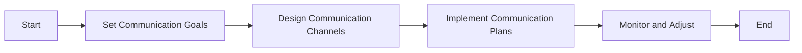
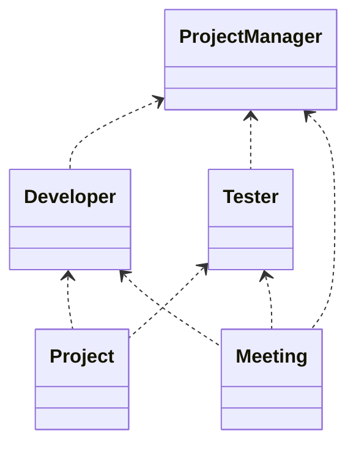
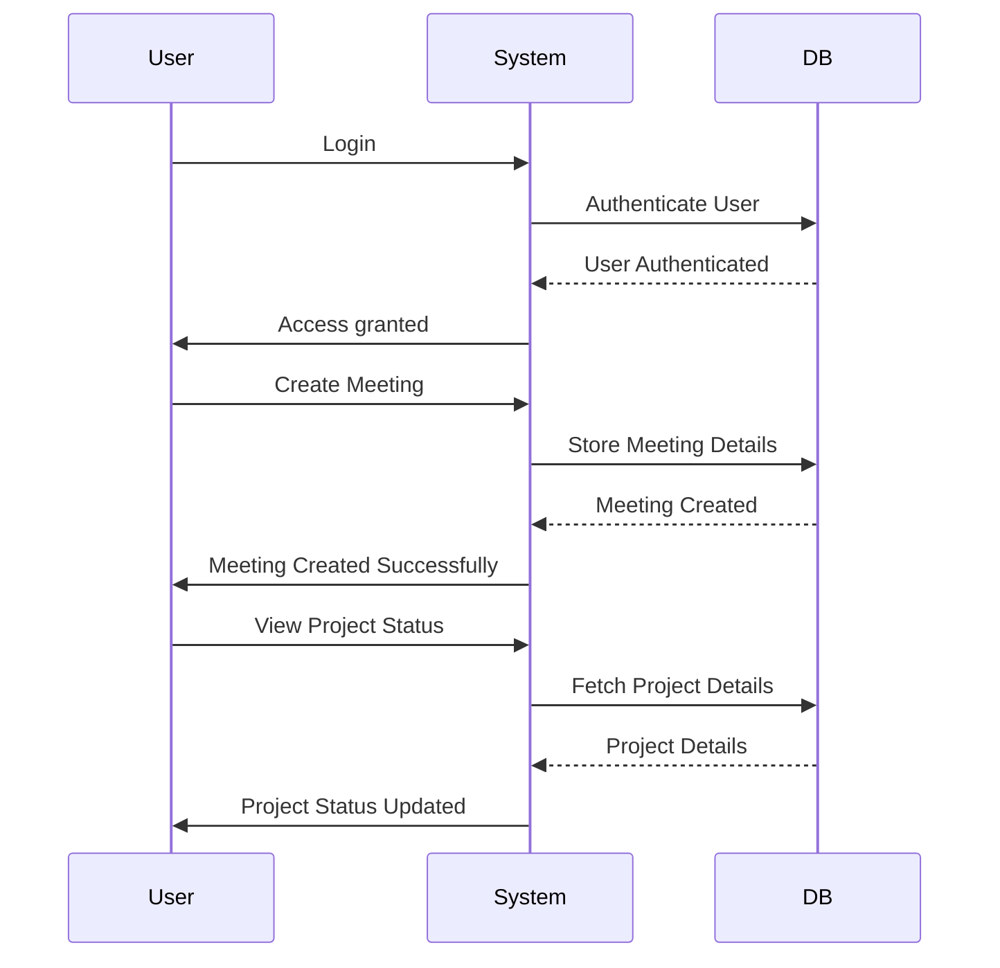
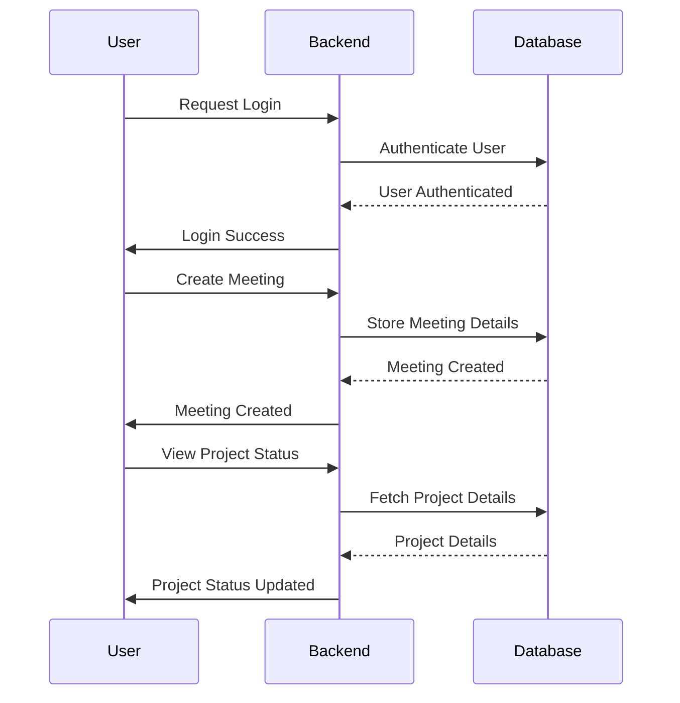

                 

**引言：沟通的重要性**

### 背景介绍

在当今高度信息化和全球化的时代，团队合作已成为推动创新和实现业务目标的关键因素。然而，团队内部的沟通不畅常常成为组织效率的瓶颈。有效的沟通不仅是传递信息和指令的必要手段，更是构建开放透明团队文化的基石。本文旨在探讨如何通过有效的沟通策略，提升团队协作效率，增强团队凝聚力，最终实现组织目标。

#### 核心概念术语说明

- **沟通**：信息在不同个体或群体之间的传递、理解和反馈过程。
- **团队文化**：团队中成员共同认同的价值观、行为准则和工作方式。
- **开放透明**：团队内部信息交流无障碍，成员之间能够自由表达观点，决策过程公开透明。

#### 问题背景

在许多组织中，沟通不畅的问题普遍存在。例如，项目经理可能难以准确理解开发人员的需求，导致项目延期；团队成员可能因信息不对称而产生误解，导致工作冲突。这些沟通问题不仅影响团队效率，还可能损害团队关系，阻碍组织发展。

#### 问题描述

沟通不畅的具体表现包括：信息传递不准确、误解和误读、缺乏反馈机制、决策过程不透明等。这些问题可能导致以下后果：

1. **效率低下**：团队成员花费过多时间在沟通上的澄清和修正。
2. **错误决策**：信息不对称导致决策基于不完整或不准确的信息。
3. **团队冲突**：沟通不畅容易引发误解和不满，导致团队内耗。
4. **组织内耗**：沟通问题可能成为组织变革和创新的主要障碍。

#### 问题解决

为了解决沟通不畅的问题，组织需要采取以下措施：

1. **明确沟通目标**：确保每次沟通都有明确的目标和预期的结果。
2. **建立沟通机制**：制定并执行有效的沟通计划和流程，包括定期会议、反馈机制等。
3. **提升沟通技能**：通过培训和练习，提高团队成员的沟通技巧，包括倾听、表达、反馈等。
4. **促进信息共享**：建立共享平台和工具，确保信息的透明性和可访问性。

#### 边界与外延

本文主要关注团队内部沟通，但沟通问题不仅限于团队内部，还涉及到与外部合作伙伴和客户之间的沟通。在更广泛的商业环境中，有效的沟通策略同样至关重要。

#### 概念结构与核心要素组成

1. **沟通模型**：包括发送者、信息、渠道、接收者和反馈。
2. **沟通技能**：包括倾听、表达、反馈和问题解决。
3. **团队文化**：包括价值观、行为准则和工作方式。

#### 核心概念与联系

**核心概念原理：**沟通是信息传递的过程，其有效性取决于信息的准确性、及时性和目标明确性。

**概念属性特征对比表格：**

| 特征        | 传统沟通 | 数字沟通 |
|-------------|-----------|-----------|
| 速度        | 较慢      | 较快      |
| 精确性      | 易失真    | 较高      |
| 范围        | 受限制    | 较广泛    |
| 反馈机制    | 不明确    | 较明确    |

**ER实体关系图架构：**

```mermaid
erDiagram
  Communication --> Team : "has"
  Communication --> Member : "involves"
  Team --> Culture : "has"
  Member --> Skill : "has"
```

### 算法原理讲解

**算法mermaid流程图：**



**Python源代码示例：**

```python
def set_communication_goals():
    # 设定沟通目标
    goals = ["明确项目需求", "促进团队协作", "提高决策效率"]
    return goals

def design_communication_channels():
    # 设计沟通渠道
    channels = ["定期会议", "电子邮件", "即时通讯工具"]
    return channels

def implement_communication_plans(goals, channels):
    # 实施沟通计划
    for goal in goals:
        for channel in channels:
            print(f"通过{channel}传达{goal}信息。")

def monitor_and_adjust():
    # 监控和调整沟通
    feedback = input("请给出沟通反馈：")
    if feedback.lower() == "不满意":
        print("将重新审视沟通渠道和计划。")
    else:
        print("沟通效果良好，将继续保持。")
```

**算法原理的数学模型和公式：**

- **沟通效率**：\(\text{Efficiency} = \frac{\text{Effective Communication}}{\text{Total Communication Time}}\)
- **信息传递准确性**：\(\text{Accuracy} = \frac{\text{Correctly Received Information}}{\text{Total Sent Information}}\)

**详细讲解和举例说明：**

假设一个项目团队需要在两周内完成一个软件开发任务。通过设定明确的沟通目标（如每周召开一次项目进展会议），设计合适的沟通渠道（如使用Slack进行即时沟通），并制定详细的沟通计划（包括每周的任务分配和进展报告），可以显著提高团队的沟通效率。以下是一个具体的示例：

```plaintext
沟通目标：每周召开一次项目进展会议，确保所有成员了解项目进度和需求变化。

沟通渠道：Slack、邮件和会议。

沟通计划：
- 第一周：分配任务，确定关键里程碑。
- 第二周：每周一上午10点召开项目进展会议，讨论上周的任务完成情况，解决遇到的问题。

沟通反馈：
- 第二周会议结束后，团队成员反馈会议时间太长，沟通内容不够集中。
- 根据反馈，调整沟通计划，改为每周三下午4点召开15分钟的简短进展会议。

通过上述措施，团队沟通效率得到了显著提升，项目进度也在预期内完成。
```

### 数学公式使用

- **平均沟通时间**：\(T_{\text{average}} = \frac{\sum T_i}{N}\)，其中 \(T_i\) 为每次沟通所需时间，\(N\) 为沟通次数。
- **沟通准确性**：\(A_{\text{accuracy}} = \frac{\sum C_i}{N}\)，其中 \(C_i\) 为每次沟通的准确性评分。

$$
\text{沟通效率} = \frac{\text{准确沟通次数}}{\text{总沟通次数}}
$$

### 系统分析与架构设计方案

#### 问题场景介绍

一个软件开发团队需要高效地沟通，以确保项目顺利进行。团队由项目经理、开发人员、测试人员等多个角色组成，他们需要频繁交流项目进展、需求变更和技术问题。

#### 项目介绍

项目名为“高效沟通平台”，旨在为团队提供一个统一的沟通渠道，提高信息传递的准确性、及时性和目标明确性。

#### 系统功能设计（领域模型mermaid类图）



#### 系统架构设计mermaid架构图



#### 系统接口设计和系统交互mermaid序列图



### 项目实战

#### 环境安装

1. **安装Python环境**：确保系统上已安装Python 3.8及以上版本。
2. **安装Django框架**：使用pip命令安装Django框架。

   ```bash
   pip install django
   ```

3. **安装PostgreSQL数据库**：下载并安装PostgreSQL数据库。

   ```bash
   sudo apt-get install postgresql postgresql-contrib
   ```

4. **创建数据库**：在终端中创建用于存储项目数据的PostgreSQL数据库。

   ```bash
   createdb my_project_db
   ```

#### 系统核心实现源代码

1. **启动Django项目**：

   ```bash
   django-admin startproject communication_platform
   cd communication_platform
   ```

2. **创建应用程序**：

   ```bash
   python manage.py startapp meetings
   ```

3. **定义Meeting模型**：

   ```python
   # meetings/models.py
   from django.db import models

   class Meeting(models.Model):
       title = models.CharField(max_length=100)
       description = models.TextField()
       start_time = models.DateTimeField()
       end_time = models.DateTimeField()
       attendees = models.ManyToManyField('auth.User')
   ```

4. **配置数据库**：

   ```python
   # communication_platform/settings.py
   DATABASES = {
       'default': {
           'ENGINE': 'django.db.backends.postgresql',
           'NAME': 'my_project_db',
           'USER': 'my_project_user',
           'PASSWORD': 'my_project_password',
           'HOST': 'localhost',
           'PORT': '5432',
       }
   }
   ```

5. **创建数据库表**：

   ```bash
   python manage.py makemigrations meetings
   python manage.py migrate
   ```

6. **创建超级用户**：

   ```bash
   python manage.py createsuperuser
   ```

7. **启动项目**：

   ```bash
   python manage.py runserver
   ```

#### 代码应用解读与分析

1. **用户登录**：

   用户通过浏览器访问项目主页，输入用户名和密码，通过身份验证后进入系统。

2. **创建会议**：

   用户可以创建会议，填写会议标题、描述、开始时间和结束时间，并指定参会人员。系统将会议信息存储到数据库中。

3. **查看项目状态**：

   用户可以查看项目的会议列表和进度，包括每个会议的详细信息。

#### 实际案例分析和详细讲解剖析

假设一个项目经理张三需要组织一次项目进展会议，以下是具体步骤：

1. **登录系统**：张三通过用户名和密码登录系统。

2. **创建会议**：张三填写会议标题（如“项目进展会议”）、描述（简要介绍会议内容）、开始时间和结束时间，并选择参会人员。系统将会议信息存储到数据库中。

3. **会议通知**：系统向参会人员发送会议通知，包括会议主题、时间和地点。

4. **会议进行**：参会人员通过系统进入会议室，进行实时沟通和讨论。

5. **会议记录**：会议结束后，张三可以记录会议结论和行动计划，并更新项目状态。

通过上述步骤，张三能够高效地组织会议，确保项目进展的透明和及时沟通。

#### 项目小结

本项目通过搭建一个高效的沟通平台，帮助团队实现信息的透明和及时传递。项目的成功实施不仅提高了沟通效率，还增强了团队的协作能力，为项目顺利推进提供了有力保障。

### 最佳实践 tips

1. **定期回顾沟通效果**：定期组织团队会议，回顾沟通效果，收集团队成员的反馈，不断优化沟通机制。

2. **鼓励开放式沟通**：建立开放透明的沟通环境，鼓励团队成员自由表达意见，促进知识共享。

3. **利用技术工具**：合理利用电子邮件、即时通讯工具和会议系统等，提高沟通效率和准确性。

4. **培养良好的倾听习惯**：倾听是有效沟通的关键，通过倾听理解他人的观点和需求，减少误解和冲突。

### 小结

本文通过详细的分析和实例，探讨了如何通过有效的沟通策略构建开放透明的团队文化。有效的沟通不仅能够提高团队协作效率，还能增强团队凝聚力，推动组织发展。未来，随着技术的发展，沟通工具和手段将不断更新，但沟通的核心原则始终不变：尊重、理解和协作。

### 注意事项

1. **确保沟通目标的明确性**：每次沟通前应明确目标，确保信息传递的方向和目的清晰。

2. **注意沟通渠道的选择**：根据沟通内容和对象选择合适的沟通渠道，避免信息传递过程中的失真。

3. **及时反馈与调整**：沟通后应及时收集反馈，根据反馈调整沟通策略，提高沟通效果。

### 拓展阅读

1. **《非暴力沟通》**：马歇尔·卢森堡著，介绍了如何通过非暴力沟通方式建立和谐的人际关系。
2. **《沟通的艺术》**：阿尔伯特·梅拉比安著，详细分析了沟通中的语言、非语言和行为因素。
3. **《团队沟通技巧》**：史蒂夫·乔布斯著，分享了如何通过沟通技巧提升团队协作效率。

### 作者信息

**作者：** AI天才研究院/AI Genius Institute & 禅与计算机程序设计艺术 /Zen And The Art of Computer Programming

