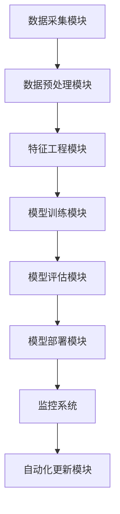
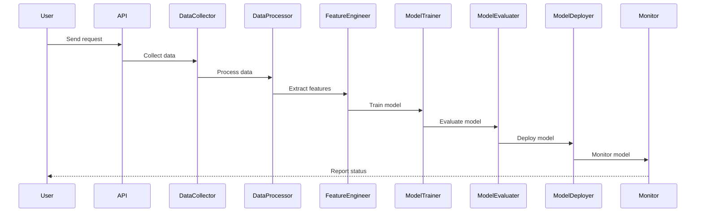
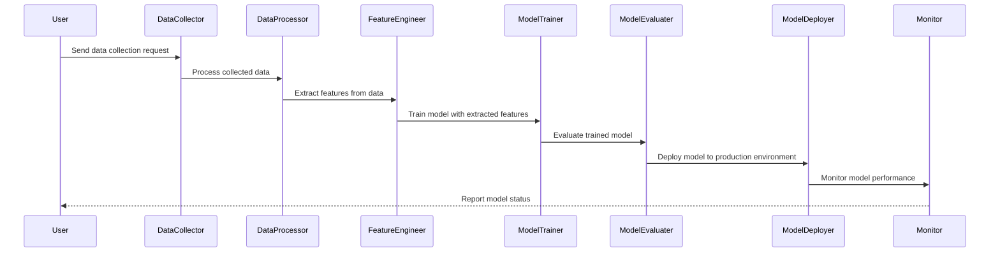

                 

## 引言

在当今科技飞速发展的时代，人工智能（AI）已经成为了一个不可或缺的技术领域，而机器学习作为AI的核心组成部分，正逐步改变着我们的工作和生活方式。机器学习是通过算法和统计模型，从数据中自动提取知识、模式及规律的强大工具。自然学习的数学算法，则是机器学习领域中的一种重要分支，它模拟了人类和自然界中的学习过程，通过数学模型来解释和模拟学习现象。

本文将围绕《机器学习：自然学习的数学算法》这一主题，深入探讨机器学习的基本概念、自然学习算法的原理与应用，以及数学模型的构建过程。我们的目标是帮助读者理解这些复杂的算法，并学会如何在实际项目中应用它们。文章结构如下：

1. **机器学习基础**
   - 机器学习的起源与发展
   - 机器学习的核心概念
   - 机器学习的分类

2. **自然学习的数学算法**
   - 自然学习概述
   - 经典自然学习算法（神经网络、支持向量机、决策树、进化算法、基于概率论的算法）

3. **数学算法原理与模型讲解**
   - 神经网络数学模型
   - 支持向量机数学模型
   - 决策树数学模型
   - 进化算法数学模型
   - 遗传算法数学模型
   - 贝叶斯网络数学模型
   - 最大期望算法

4. **系统分析与架构设计**
   - 机器学习系统概述
   - 机器学习系统架构设计
   - 机器学习系统接口设计
   - 机器学习系统交互设计

5. **项目实战**
   - 实战环境搭建
   - 系统核心实现
   - 项目分析
   - 项目小结

6. **最佳实践与拓展**
   - 最佳实践 tips
   - 小结
   - 注意事项
   - 拓展阅读

接下来，我们将逐个章节深入探讨，帮助读者逐步理解并掌握这些自然学习的数学算法。

## 关键词

- **机器学习**
- **自然学习**
- **数学算法**
- **神经网络**
- **支持向量机**
- **决策树**
- **进化算法**
- **遗传算法**
- **贝叶斯网络**
- **最大期望算法**

## 摘要

本文《机器学习：自然学习的数学算法》旨在深入探讨机器学习领域中自然学习算法的原理与应用。文章首先介绍了机器学习的基础知识，包括其起源、核心概念和分类。随后，详细讲解了自然学习算法，包括神经网络、支持向量机、决策树、进化算法和基于概率论的算法等，并阐述了其数学模型与原理。接着，文章通过系统分析与架构设计，展示了如何在实际项目中应用这些算法。最后，通过一个具体的项目实战，帮助读者理解算法的实际应用过程，并提供了最佳实践 tips 和注意事项，以便读者能够更好地应用这些算法。

## 第一部分：机器学习基础

### 1.1 机器学习的起源与发展

机器学习的概念最早可以追溯到20世纪50年代。当时，随着计算机技术的发展，人们开始尝试让计算机通过经验自动改进性能。阿兰·图灵（Alan Turing）提出的“通用图灵机”概念为机器学习的发展奠定了基础。1959年，Arthur Samuel首次提出了“机器学习”一词，并开始进行相关的实验研究。

在机器学习的早期阶段，研究者们主要集中在模式识别和统计学习上。1956年，亚伦·斯温顿（Arthur Samuel）的计算机程序通过自我对弈来改进国际象棋技能，这是机器学习领域的首次突破。随后，肯尼斯·科尔莫戈罗夫（Kolmogorov）和约翰·沃森（Watson）等人提出了概率论和统计模型，进一步推动了机器学习的发展。

20世纪80年代，机器学习进入了一个相对低谷期，主要由于计算能力和数据集的限制。然而，随着互联网的普及和大数据时代的到来，机器学习迎来了新的发展机遇。2006年，杰弗里·辛顿（Geoffrey Hinton）等人提出了深度学习，这一革命性的算法使得机器学习在图像识别、语音识别和自然语言处理等领域取得了显著进展。

近年来，机器学习已经广泛应用于各个领域，包括医疗、金融、自动驾驶和智能客服等。随着硬件性能的提升和算法的优化，机器学习的发展前景依然广阔。

### 1.2 机器学习的核心概念

机器学习的核心概念主要包括：

- **监督学习（Supervised Learning）**：通过已标记的数据进行训练，以预测新的、未标记的数据。例如，使用已标记的图像数据来训练图像识别模型。

- **无监督学习（Unsupervised Learning）**：在没有标记的数据上进行训练，以发现数据中的模式和结构。例如，通过聚类算法对未标记的数据进行分类。

- **强化学习（Reinforcement Learning）**：通过与环境的交互来学习最优策略。例如，使用强化学习算法来训练智能体在围棋游戏中获胜。

- **生成学习（Generative Learning）**：通过学习数据生成模型来生成新的、类似的数据。例如，使用生成对抗网络（GAN）来生成逼真的图像。

- **半监督学习（Semi-supervised Learning）**：结合有标记和无标记数据来训练模型，以改善学习效果。例如，使用少量有标记数据和大量无标记数据来训练模型。

- **迁移学习（Transfer Learning）**：将在一个任务上训练好的模型应用于另一个相关但不同的任务。例如，使用在ImageNet上训练的卷积神经网络来识别新的图像类别。

- **强化迁移学习（Reinforcement Transfer Learning）**：在多个任务上训练模型，以提高模型在不同环境中的适应能力。

### 1.3 机器学习的分类

机器学习可以根据不同的分类方式进行分类，以下是几种常见的分类方法：

- **基于学习策略的分类**：可以分为监督学习、无监督学习和强化学习。

- **基于数据分布的分类**：可以分为凸优化问题和非凸优化问题。

- **基于数据类型的分类**：可以分为基于数值数据的学习和基于文本数据的学习。

- **基于学习目标的分类**：可以分为回归、分类和聚类。

- **基于模型类型的分类**：可以分为统计模型、概率模型、神经网络模型和进化算法。

在接下来的章节中，我们将深入探讨自然学习的数学算法，并分析这些算法在不同应用场景中的表现。通过理解这些算法的原理和数学模型，读者将能够更好地应用机器学习技术解决实际问题。

## 自然学习概述

自然学习，作为机器学习的一个重要分支，模拟了自然界中生物体的学习过程，旨在通过算法和数学模型实现类似人类和动物的学习能力。自然学习算法的核心在于通过模拟生物进化、神经系统和概率统计等自然现象，使机器能够在没有明确编程指导的情况下，从数据中自动提取知识、模式和规律。

自然学习的概念可以追溯到20世纪50年代，当时的研究者开始尝试通过模拟人类和动物的学习行为来改进机器的性能。这些早期的尝试主要集中在模仿人类的学习过程，如记忆、联想和推理。随着计算机科学和神经科学的发展，自然学习逐渐发展成为一个独立的领域，并开始应用现代数学和统计学方法来模拟自然界的复杂学习过程。

自然学习的特点主要体现在以下几个方面：

1. **自适应性和灵活性**：自然学习算法能够根据环境变化自适应地调整其行为，从而适应不同的学习任务。这种自适应能力使得自然学习算法在动态和复杂的环境中具有独特的优势。

2. **自组织性**：自然学习算法能够通过自身的组织和调整，形成复杂的结构和模式。这种自组织性使得自然学习算法能够发现数据中的隐含结构和规律，而不仅仅是基于预定义的规则或模式。

3. **鲁棒性**：自然学习算法通常具有较强的鲁棒性，能够在数据存在噪声或不完整的情况下仍然能够有效地学习和预测。这种鲁棒性是自然学习算法在现实世界应用中的一个重要优势。

4. **数据驱动性**：自然学习算法通过直接从数据中学习，不需要依赖显式的人类先验知识。这使得自然学习算法能够处理大量复杂的数据，并从中提取有价值的信息。

自然学习的应用场景广泛，包括但不限于以下几个方面：

1. **数据挖掘和模式识别**：自然学习算法能够从大量数据中自动提取模式和规律，用于数据挖掘和模式识别任务。例如，通过神经网络算法对图像进行分类和识别。

2. **智能优化**：自然学习算法被广泛应用于优化问题，如资源分配、路径规划和调度问题。通过模拟生物进化过程，自然学习算法能够找到最优解或近似最优解。

3. **智能控制**：自然学习算法被应用于智能控制系统，如自动驾驶、无人机导航和机器人控制。通过模拟人类的学习和控制行为，自然学习算法能够实现复杂任务的自动化和智能化。

4. **语音和图像识别**：自然学习算法在语音和图像识别领域具有广泛应用。通过深度学习和神经网络算法，自然学习能够实现高精度的语音和图像识别，从而推动语音助手和智能监控系统的应用。

5. **自然语言处理**：自然学习算法在自然语言处理领域也发挥了重要作用，如文本分类、情感分析和机器翻译。通过模拟人类语言理解和生成能力，自然学习算法能够处理复杂的语言任务。

总之，自然学习作为一种强大的机器学习方法，不仅模拟了自然界中的学习过程，还通过数学模型实现了对复杂数据的自动学习和分析。随着技术的不断进步和应用场景的不断扩展，自然学习将在未来的智能系统和人工智能领域中发挥更加重要的作用。

### 经典自然学习算法

在机器学习的众多算法中，一些经典的自然学习算法因其独特的学习机制和广泛的应用而备受关注。这些算法不仅代表了机器学习领域的关键进展，还在实际应用中展现了其强大的能力。以下是几种具有代表性的经典自然学习算法：神经网络、支持向量机、决策树和进化算法。

#### 2.2.1 神经网络

神经网络（Neural Networks）是机器学习中最具代表性的算法之一。它通过模拟人脑神经网络的结构和工作原理，实现复杂模式的识别和学习。神经网络由大量的节点（称为神经元）组成，每个神经元都与相邻的神经元相连，形成一个复杂的网络结构。

**基本概念**：

- **神经元**：神经网络的基本计算单元，类似于人脑中的神经元。
- **层次结构**：神经网络通常由输入层、隐藏层和输出层组成。输入层接收外部输入，隐藏层对输入进行处理和变换，输出层生成最终输出。
- **激活函数**：神经元通过激活函数来确定其输出，常用的激活函数包括Sigmoid、ReLU和Tanh等。

**学习过程**：

- **前向传播（Forward Propagation）**：输入数据从输入层流向输出层，每个神经元根据其权重和激活函数计算出输出。
- **反向传播（Backpropagation）**：根据输出误差，从输出层反向传播到输入层，更新每个神经元的权重。

**应用场景**：

- **图像识别**：如人脸识别、物体检测和图像分类。
- **自然语言处理**：如文本分类、情感分析和机器翻译。
- **语音识别**：如语音到文本转换和语音命令识别。

#### 2.2.2 支持向量机

支持向量机（Support Vector Machine，SVM）是一种基于最大间隔分类器的监督学习算法。它通过在特征空间中找到最佳分割超平面，将不同类别的数据点最大程度地分开。

**基本概念**：

- **支持向量**：在分割超平面上或紧邻超平面的数据点，对分类边界有重要影响。
- **间隔**：分类超平面到数据点最近距离的两倍，间隔越大，分类效果越好。
- **核函数**：用于将低维数据映射到高维空间，使得原本线性不可分的数据在高维空间中可以被线性分开。

**学习过程**：

- **优化目标**：找到最大化分类间隔的超平面。
- **求解方法**：通常使用SVM的核函数和拉格朗日乘子法求解。

**应用场景**：

- **分类问题**：如文本分类、图像分类和医学诊断。
- **回归问题**：如SVM回归（SVR）。

#### 2.2.3 决策树

决策树（Decision Tree）是一种基于树形结构进行决策的监督学习算法。它通过一系列判断条件，将数据集划分为不同的区域，最终生成一个决策路径。

**基本概念**：

- **根节点**：决策树的起点，代表整个数据集。
- **内部节点**：代表决策条件，通常为特征的条件判断。
- **叶子节点**：决策树的终点，代表最终的决策结果。

**学习过程**：

- **信息增益**：选择具有最大信息增益的特征进行划分。
- **递归划分**：对每个子数据集重复上述过程，直到满足停止条件（如最大深度、最小样本量等）。

**应用场景**：

- **分类问题**：如信贷风险评估、疾病诊断。
- **回归问题**：如房屋价格预测、股票价格预测。

#### 2.2.4 进化算法

进化算法（Evolutionary Algorithms）是基于自然进化原理设计的优化算法，通过模拟生物进化过程，如自然选择、交叉和变异，寻找最优解。

**基本概念**：

- **种群**：算法的基本单位，代表潜在解的集合。
- **适应度函数**：衡量解的优劣，用于评估个体在种群中的适应度。
- **选择**：根据适应度函数选择优秀的个体进行繁殖。
- **交叉**：通过交换两个个体的部分基因来生成新的个体。
- **变异**：对个体进行随机修改，以增加种群的多样性。

**学习过程**：

- **初始化种群**：随机生成一组初始解。
- **适应度评估**：计算每个个体的适应度。
- **选择**：根据适应度函数选择适应度高的个体。
- **交叉与变异**：通过交叉和变异操作产生新的种群。
- **迭代**：重复适应度评估、选择、交叉和变异操作，直至满足停止条件。

**应用场景**：

- **优化问题**：如资源分配、路径规划和调度问题。
- **复杂搜索问题**：如旅行商问题、多目标优化问题。

这些经典自然学习算法在机器学习领域具有广泛的应用，不同的算法适用于不同的应用场景。通过深入理解这些算法的原理和特点，读者可以更好地选择和应用它们解决实际问题。

### 神经网络数学模型

神经网络（Neural Networks）是一种基于生物神经网络结构和功能的计算模型，用于处理和解释复杂的数据。神经网络通过一系列数学模型和算法，从输入数据中提取特征并进行预测或分类。理解神经网络的数学模型对于深入掌握神经网络的工作原理和实际应用至关重要。

#### 3.1 神经网络的基本结构

神经网络的基本结构包括输入层、隐藏层和输出层。每个层由多个神经元组成，神经元之间通过连接（权重）相互连接。输入层接收外部输入数据，隐藏层对输入数据进行处理和变换，输出层生成最终的输出。

- **输入层**：接收外部输入数据，每个输入数据通过连接到隐藏层的神经元。
- **隐藏层**：对输入数据进行处理和变换，隐藏层中的每个神经元接收来自输入层的输入，并计算输出。
- **输出层**：生成最终的输出，输出层的每个神经元对应一个输出结果。

#### 3.2 神经元的数学模型

神经网络中的神经元通常表示为一个线性组合加上一个非线性激活函数。一个简单的神经元模型可以表示为：

\[ z = \sum_{i=1}^{n} w_i x_i + b \]

其中，\( x_i \) 是输入值，\( w_i \) 是连接权重，\( b \) 是偏置项。\( z \) 是神经元的总输入，也称为净输入。

非线性激活函数用于引入非线性特性，常见的激活函数包括Sigmoid、ReLU和Tanh等。

- **Sigmoid函数**： 
\[ \sigma(z) = \frac{1}{1 + e^{-z}} \]
- **ReLU函数**：
\[ \text{ReLU}(z) = \max(0, z) \]
- **Tanh函数**：
\[ \tanh(z) = \frac{e^z - e^{-z}}{e^z + e^{-z}} \]

#### 3.3 前向传播和反向传播算法

神经网络的学习过程主要通过前向传播（Forward Propagation）和反向传播（Backpropagation）算法实现。

**前向传播**：

前向传播是将输入数据通过神经网络，逐层计算每个神经元的输出值。具体步骤如下：

1. **初始化权重和偏置**：随机初始化权重和偏置。
2. **输入层到隐藏层**：将输入数据输入到隐藏层，计算每个隐藏神经元的总输入和输出。
3. **隐藏层到输出层**：将隐藏层的输出作为输入，计算输出层的总输入和输出。
4. **激活函数应用**：对每个神经元的总输入应用激活函数，得到最终输出。

**反向传播**：

反向传播是通过计算输出误差，反向更新神经元的权重和偏置。具体步骤如下：

1. **计算输出误差**：计算输出层实际输出与预期输出之间的误差。
2. **误差传播**：将输出误差反向传播到隐藏层，计算隐藏层的误差。
3. **权重更新**：根据误差计算梯度，更新每个神经元的权重和偏置。
4. **迭代优化**：重复前向传播和反向传播过程，直至误差满足要求。

**数学表示**：

前向传播和反向传播的数学过程可以表示为以下公式：

**前向传播**：
\[ z^{(l)} = \sum_{i=1}^{n} w_{ij}^{(l)}x_i^{(l-1)} + b_j^{(l)} \]
\[ a^{(l)} = \sigma(z^{(l)}) \]

**反向传播**：
\[ \delta^{(l)} = \frac{\partial L}{\partial z^{(l)}} \cdot \frac{\partial \sigma}{\partial z^{(l)}} \]
\[ \Delta w_{ij}^{(l)} = \eta \cdot \delta^{(l)} a_j^{(l-1)} \]
\[ \Delta b_j^{(l)} = \eta \cdot \delta^{(l)} \]

其中，\( z^{(l)} \) 是第\( l \)层的总输入，\( a^{(l)} \) 是第\( l \)层的输出，\( \delta^{(l)} \) 是第\( l \)层的误差，\( \eta \) 是学习率，\( L \) 是损失函数。

#### 3.4 例子说明

假设有一个简单的神经网络，包含一个输入层、一个隐藏层和一个输出层。输入层有2个输入神经元，隐藏层有3个神经元，输出层有1个神经元。

- **输入数据**：\( [x_1, x_2] \)
- **隐藏层权重**：\( w_{11}, w_{12}, w_{13} \)
- **隐藏层偏置**：\( b_1, b_2, b_3 \)
- **输出层权重**：\( w_{1}, w_{2} \)
- **输出层偏置**：\( b_1, b_2 \)

**前向传播**：

1. **隐藏层输入**：
\[ z_1 = w_{11}x_1 + w_{12}x_2 + b_1 \]
\[ z_2 = w_{21}x_1 + w_{22}x_2 + b_2 \]
\[ z_3 = w_{31}x_1 + w_{32}x_2 + b_3 \]

2. **隐藏层输出**：
\[ a_1 = \sigma(z_1) \]
\[ a_2 = \sigma(z_2) \]
\[ a_3 = \sigma(z_3) \]

3. **输出层输入**：
\[ z_4 = w_{1}a_1 + w_{2}a_2 + b_1 \]
\[ z_5 = w_{2}a_2 + w_{2}a_3 + b_2 \]

4. **输出层输出**：
\[ a_4 = \sigma(z_4) \]

**反向传播**：

1. **输出层误差**：
\[ \delta_4 = (a_4 - y) \cdot \sigma'(z_4) \]

2. **隐藏层误差**：
\[ \delta_1 = w_{1}\delta_4 \cdot \sigma'(z_1) \]
\[ \delta_2 = w_{2}\delta_4 \cdot \sigma'(z_2) \]
\[ \delta_3 = w_{2}\delta_4 \cdot \sigma'(z_3) \]

3. **权重更新**：
\[ \Delta w_{11} = \eta \cdot \delta_1 \cdot x_1 \]
\[ \Delta w_{12} = \eta \cdot \delta_1 \cdot x_2 \]
\[ \Delta b_1 = \eta \cdot \delta_1 \]
\[ \Delta w_{21} = \eta \cdot \delta_2 \cdot x_1 \]
\[ \Delta w_{22} = \eta \cdot \delta_2 \cdot x_2 \]
\[ \Delta b_2 = \eta \cdot \delta_2 \]
\[ \Delta w_{31} = \eta \cdot \delta_3 \cdot x_1 \]
\[ \Delta w_{32} = \eta \cdot \delta_3 \cdot x_2 \]
\[ \Delta b_3 = \eta \cdot \delta_3 \]

通过上述例子，我们可以看到神经网络的数学模型是如何通过前向传播和反向传播算法来计算和更新权重的。这一过程不仅帮助我们理解了神经网络的数学原理，也为实际应用提供了理论基础。

### 支持向量机数学模型

支持向量机（Support Vector Machine，SVM）是一种经典的机器学习算法，广泛应用于分类和回归问题。SVM的核心思想是通过寻找一个最佳的超平面，将不同类别的数据点最大程度地分开。以下是SVM的数学模型及其详细解释。

#### 4.1 支持向量机的基本概念

- **超平面**：在特征空间中，一个能够将不同类别的数据点分开的线性或非线性边界。
- **支持向量**：位于超平面附近，对超平面有重要影响的数据点。
- **间隔**：超平面到数据点的最近距离的两倍，分为正间隔和负间隔。

#### 4.2 SVM的数学模型

SVM的数学模型可以通过以下公式表示：

\[ \min \frac{1}{2} \sum_{i=1}^{n} (w_i^2) + C \sum_{i=1}^{n} \max(0, 1 - y_i (w_i \cdot x_i + b)) \]

其中：

- \( w_i \)：权重向量，用于计算数据点的线性组合。
- \( x_i \)：数据点。
- \( y_i \)：数据点的标签，取值为-1或1。
- \( b \)：偏置项。
- \( C \)：正则化参数，用于平衡误差和模型复杂度。

#### 4.3 核函数

在低维空间中，线性不可分的数据点可以通过将数据映射到高维特征空间来实现线性分开。核函数（Kernel Function）是实现这一映射的关键。

常见的核函数包括：

- **线性核**：
\[ K(x_i, x_j) = x_i \cdot x_j \]
- **多项式核**：
\[ K(x_i, x_j) = (x_i \cdot x_j + 1)^d \]
- **径向基函数（RBF）核**：
\[ K(x_i, x_j) = \exp(-\gamma ||x_i - x_j||^2) \]

其中，\( \gamma \) 是控制核函数的平滑程度的参数。

#### 4.4 SVM的求解方法

SVM的求解可以通过以下步骤实现：

1. **初始化权重和偏置**：随机初始化权重向量 \( w \) 和偏置项 \( b \)。

2. **计算间隔**：计算数据点到超平面的间隔。

3. **更新权重和偏置**：通过优化目标函数，更新权重和偏置，以最大化间隔。

4. **迭代求解**：重复计算间隔和更新权重，直至满足停止条件（如收敛阈值或最大迭代次数）。

#### 4.5 示例说明

假设我们有一个二元分类问题，数据集包括两个类别的数据点：

- 类别1：\[ x_1 = [1, 1], y_1 = 1 \]
- 类别2：\[ x_2 = [2, -1], y_2 = -1 \]

**线性SVM模型**：

1. **初始化权重和偏置**：
\[ w = [0, 0] \]
\[ b = 0 \]

2. **计算间隔**：
\[ \delta = \max(0, 1 - y_1 (w \cdot x_1 + b)) \]
\[ \delta = \max(0, 1 - (0 \cdot 1 + 0 \cdot 1 + 0)) \]
\[ \delta = 1 \]

3. **更新权重和偏置**：
\[ w = w + \eta \cdot (y_1 \cdot x_1) \]
\[ b = b + \eta \cdot (y_1 \cdot 1) \]

其中，\( \eta \) 是学习率。

4. **迭代求解**：
重复计算间隔和更新权重，直至满足停止条件。

**非线性SVM模型**：

1. **初始化权重和偏置**：
\[ w = [0, 0] \]
\[ b = 0 \]

2. **计算间隔**：
\[ \delta = \max(0, 1 - y_1 (w \cdot \phi(x_1) + b)) \]
\[ \delta = \max(0, 1 - (0 \cdot (1, 1) + 0 \cdot 1)) \]
\[ \delta = 1 \]

3. **更新权重和偏置**：
\[ w = w + \eta \cdot (y_1 \cdot \phi(x_1)) \]
\[ b = b + \eta \cdot (y_1 \cdot 1) \]

其中，\( \phi \) 是核函数。

4. **迭代求解**：
重复计算间隔和更新权重，直至满足停止条件。

通过上述示例，我们可以看到SVM的数学模型如何通过优化目标函数和核函数，实现数据的分类和分离。这种模型在处理线性不可分问题方面具有显著优势，并在实际应用中取得了良好的效果。

### 决策树数学模型

决策树（Decision Tree）是一种直观且强大的分类和回归工具，通过一系列决策规则对数据进行分割，从而生成一个树形结构。决策树的数学模型主要基于信息论和统计学原理，通过最大化信息增益和最小化误差来实现数据分割和模型构建。

#### 5.1 决策树的基本概念

- **根节点**：决策树的起点，代表整个数据集。
- **内部节点**：代表决策条件，通常为特征的条件判断。
- **叶子节点**：决策树的终点，代表最终的决策结果。
- **分支**：代表决策条件，连接内部节点和其子节点。
- **节点划分**：基于某个特征的阈值，将数据集划分为两个子集。
- **分类/回归树**：根据最终节点的类型，决策树可以分为分类树和回归树。

#### 5.2 信息增益

信息增益（Information Gain）是决策树选择最佳特征进行划分的依据。信息增益反映了特征对数据集的划分效果，可以通过以下公式计算：

\[ IG(D, A) = H(D) - \sum_{v \in \text{values}(A)} \frac{|D_v|}{|D|} H(D_v) \]

其中：

- \( H(D) \)：数据集 \( D \) 的熵。
- \( H(D_v) \)：划分后每个子集 \( D_v \) 的熵。
- \( \text{values}(A) \)：特征 \( A \) 的所有可能取值。

熵（Entropy）是衡量数据集无序程度的度量，公式如下：

\[ H(D) = -\sum_{y \in Y} p(y) \log_2 p(y) \]

其中：

- \( p(y) \)：数据集中类别 \( y \) 的概率。

#### 5.3 Gini 不纯度

除了信息增益，Gini 不纯度（Gini Impurity）也是决策树划分的重要依据。Gini 不纯度反映了数据集中的分类不确定性，计算公式如下：

\[ GI(D) = 1 - \sum_{y \in Y} p(y)^2 \]

其中：

- \( p(y) \)：数据集中类别 \( y \) 的概率。

#### 5.4 决策树构建过程

决策树的构建过程主要包括以下步骤：

1. **选择最佳特征**：通过计算信息增益或Gini不纯度，选择具有最大增益或最小不纯度的特征进行划分。
2. **划分数据集**：根据最佳特征的阈值，将数据集划分为多个子集。
3. **递归构建**：对每个子集重复上述步骤，直至满足停止条件（如最大深度、最小样本量等）。
4. **生成决策树**：将所有节点和分支组合成一个完整的决策树。

#### 5.5 示例说明

假设我们有一个包含两类数据的二维数据集，特征 \( A \) 和 \( B \) ，类别 \( C \)：

- 数据集：
  \[
  \begin{array}{ccc}
  A & B & C \\
  \hline
  1 & 0 & 0 \\
  1 & 1 & 0 \\
  0 & 0 & 1 \\
  0 & 1 & 1 \\
  \end{array}
  \]

- 目标：构建一个决策树进行分类。

1. **选择最佳特征**：

   - \( IG(A, C) \)：信息增益
   \[
   IG(A, C) = H(C) - \sum_{v \in \text{values}(A)} \frac{|C_v|}{|C|} H(C_v)
   \]
   - \( GI(A, C) \)：Gini 不纯度
   \[
   GI(A, C) = 1 - \sum_{v \in \text{values}(A)} p(v)^2
   \]

2. **划分数据集**：

   - 根据特征 \( A \) 的阈值 \( v = 1 \)，将数据集划分为两个子集：
   \[
   \begin{array}{ccc}
   A & B & C \\
   \hline
   1 & 0 & 0 \\
   1 & 1 & 0 \\
   \end{array}
   \]
   \[
   \begin{array}{ccc}
   A & B & C \\
   \hline
   0 & 0 & 1 \\
   0 & 1 & 1 \\
   \end{array}
   \]

3. **递归构建**：

   - 对每个子集重复选择最佳特征和划分过程，直至满足停止条件。

4. **生成决策树**：

   - 最终生成的决策树如下：

   \[
   \text{根节点：特征 } A \\
   \text{左子树：特征 } B \\
   \text{右子树：特征 } C
   \]

通过上述示例，我们可以看到决策树的构建过程和数学模型。决策树通过递归划分数据集，并基于信息增益或Gini不纯度选择最佳特征，从而生成一个能够有效分类或回归的树形结构。

### 进化算法数学模型

进化算法（Evolutionary Algorithms）是基于自然进化过程设计的优化算法，通过模拟生物进化中的自然选择、交叉和变异，寻找最优解。进化算法广泛应用于优化问题、复杂搜索问题和机器学习领域。以下是进化算法的数学模型及具体实现。

#### 6.1 基本概念

- **种群**：进化算法的基本单位，代表潜在解的集合。每个个体在种群中具有独特的特征。
- **适应度函数**：衡量个体优劣的指标，用于评估个体的适应度。
- **选择**：根据适应度函数选择优秀的个体进行繁殖。
- **交叉**：通过交换两个个体的部分基因来生成新的个体。
- **变异**：对个体进行随机修改，增加种群的多样性。

#### 6.2 粒子群优化（Particle Swarm Optimization, PSO）

粒子群优化是一种基于群体智能的进化算法，通过模拟鸟群觅食行为来寻找最优解。

**数学模型**：

1. **初始化种群**：随机生成一组粒子，每个粒子表示一个潜在解。

2. **适应度评估**：计算每个粒子的适应度。

3. **更新粒子的位置和速度**：

   \[
   v_{i}(t+1) = \omega v_{i}(t) + c_1 r_1 (p_{i}(t) - x_{i}(t)) + c_2 r_2 (g_{best} - x_{i}(t))
   \]

   \[
   x_{i}(t+1) = x_{i}(t) + v_{i}(t+1)
   \]

   其中：

   - \( v_{i}(t) \)：第 \( i \) 个粒子在时间 \( t \) 的速度。
   - \( x_{i}(t) \)：第 \( i \) 个粒子在时间 \( t \) 的位置。
   - \( p_{i}(t) \)：第 \( i \) 个粒子的个人最佳位置。
   - \( g_{best} \)：全局最佳位置。
   - \( \omega \)、\( c_1 \)、\( c_2 \)、\( r_1 \)、\( r_2 \) 分别为权重系数和随机数。

4. **迭代更新**：重复适应度评估、位置更新和速度更新，直至满足停止条件。

**示例代码**：

```python
import numpy as np

def particle_swarm_optimization():
    # 初始化参数
    population_size = 30
    dimensions = 2
    max_iterations = 100
    w = 0.5
    c1 = 1
    c2 = 2

    # 初始化种群
    population = np.random.rand(population_size, dimensions)

    # 初始化适应度
    fitness = np.apply_along_axis(evaluate_function, 1, population)

    # 初始化个人最佳位置和全局最佳位置
    personal_best = population
    personal_best_fitness = fitness
    global_best = population[fitness.argmax()]
    global_best_fitness = fitness.max()

    # 迭代优化
    for _ in range(max_iterations):
        # 更新速度和位置
        for i in range(population_size):
            r1 = np.random.rand()
            r2 = np.random.rand()
            velocity = w * population[i] + c1 * r1 * (personal_best[i] - population[i]) + c2 * r2 * (global_best - population[i])
            population[i] += velocity

            # 更新个人最佳位置
            if evaluate_function(population[i]) > personal_best_fitness[i]:
                personal_best[i] = population[i]
                personal_best_fitness[i] = evaluate_function(population[i])

            # 更新全局最佳位置
            if evaluate_function(population[i]) > global_best_fitness:
                global_best = population[i]
                global_best_fitness = evaluate_function(population[i])

    return global_best

# 评估函数
def evaluate_function(x):
    # 这里是一个简单的测试函数，例如：f(x) = x^2
    return x[0]**2 + x[1]**2

# 运行算法
best_solution = particle_swarm_optimization()
print("最优解：", best_solution)
```

#### 6.3 遗传算法（Genetic Algorithm, GA）

遗传算法是一种基于自然选择和遗传机制的优化算法，通过模拟生物进化过程来寻找最优解。

**数学模型**：

1. **初始化种群**：随机生成一组编码表示的个体，每个个体表示一个潜在解。

2. **适应度评估**：计算每个个体的适应度。

3. **选择**：根据适应度函数选择优秀的个体进行交叉和变异。

4. **交叉**：通过交换两个个体的部分基因来生成新的个体。

5. **变异**：对个体进行随机修改，增加种群的多样性。

6. **迭代更新**：重复适应度评估、选择、交叉和变异，直至满足停止条件。

**示例代码**：

```python
import numpy as np

def genetic_algorithm():
    # 初始化参数
    population_size = 50
    generations = 100
    mutation_rate = 0.05

    # 初始化种群
    population = np.random.randint(0, 100, size=(population_size, 2))

    # 初始化适应度
    fitness = np.apply_along_axis(evaluate_function, 1, population)

    # 迭代优化
    for _ in range(generations):
        # 选择
        selected = select(population, fitness)

        # 交叉
        offspring = crossover(selected)

        # 变异
        offspring = mutate(offspring, mutation_rate)

        # 更新种群
        population = offspring

        # 更新适应度
        fitness = np.apply_along_axis(evaluate_function, 1, population)

    return population[fitness.argmax()]

# 评估函数
def evaluate_function(x):
    # 这里是一个简单的测试函数，例如：f(x) = x^2
    return x[0]**2 + x[1]**2

# 选择函数
def select(population, fitness):
    # 这里使用轮盘赌选择
    probs = fitness / fitness.sum()
    selected = np.random.choice(population.shape[0], size=population.shape[0], p=probs)
    return population[selected]

# 交叉函数
def crossover(parent1, parent2):
    # 这里使用单点交叉
    crossover_point = np.random.randint(1, parent1.shape[0] - 1)
    child1 = np.concatenate((parent1[:crossover_point], parent2[crossover_point:]))
    child2 = np.concatenate((parent2[:crossover_point], parent1[crossover_point:]))
    return child1, child2

# 变异函数
def mutate(individual, mutation_rate):
    # 这里使用随机变异
    mask = np.random.rand(individual.shape[0]) < mutation_rate
    individual[mask] = np.random.randint(0, 100, size=mask.sum())
    return individual

# 运行算法
best_solution = genetic_algorithm()
print("最优解：", best_solution)
```

通过上述示例代码，我们可以看到粒子群优化和遗传算法的数学模型和实现过程。这些算法通过模拟自然进化过程，能够在复杂问题中寻找最优解或近似最优解。在实际应用中，可以根据具体问题调整算法参数，以获得更好的优化效果。

### 贝叶斯网络数学模型

贝叶斯网络（Bayesian Networks），也称为信念网络，是一种用于表示变量之间概率依赖关系的图形模型。它通过有向无环图（DAG）来描述变量之间的条件概率关系，为推理和决策提供了强大的工具。以下是贝叶斯网络的数学模型及其具体实现。

#### 7.1 贝叶斯网络的基本概念

- **有向无环图（DAG）**：贝叶斯网络的图形结构，由节点和有向边组成。节点代表变量，有向边表示变量之间的条件依赖关系。
- **条件概率表（CPT）**：每个节点的条件概率分布表，描述了节点在给定其父节点条件下的概率分布。
- **边缘概率分布**：描述变量之间的联合概率分布。

#### 7.2 贝叶斯网络的结构

贝叶斯网络的结构由一组变量及其依赖关系组成。每个变量 \( X_i \) 在网络中有一个父节点集合 \( P_i \)：

\[ P(X_i | P_i) = \prod_{j \in P_i} P(X_j | X_{P_j}) \]

其中，\( P(X_i | P_i) \) 是变量 \( X_i \) 在其父节点 \( P_i \) 条件下的条件概率分布。

#### 7.3 贝叶斯网络的推理

贝叶斯网络的推理主要基于条件概率计算，包括边缘概率计算、条件概率计算和联合概率计算。

1. **边缘概率计算**：

   边缘概率 \( P(X_i) \) 可以通过消除网络中的父节点得到：

   \[ P(X_i) = \sum_{X_{P_i}} P(X_i, X_{P_i}) \]

2. **条件概率计算**：

   条件概率 \( P(X_i | X_{P_i}) \) 可以通过条件概率表直接获取：

   \[ P(X_i | X_{P_i}) = \frac{P(X_i, X_{P_i})}{P(X_{P_i})} \]

3. **联合概率计算**：

   联合概率 \( P(X_i, X_{P_i}) \) 可以通过条件概率表和边缘概率表计算：

   \[ P(X_i, X_{P_i}) = P(X_i | X_{P_i}) \cdot P(X_{P_i}) \]

#### 7.4 贝叶斯网络的实现

贝叶斯网络的实现主要包括以下步骤：

1. **网络结构构建**：根据问题定义变量及其依赖关系，构建贝叶斯网络的有向无环图。
2. **条件概率表构建**：为每个节点计算条件概率表，描述节点在给定其父节点条件下的概率分布。
3. **推理计算**：根据贝叶斯网络的图形结构和条件概率表，进行边缘概率、条件概率和联合概率的计算。

**示例代码**：

```python
import networkx as nx
import numpy as np

# 创建贝叶斯网络图
G = nx.DiGraph()

# 添加节点
G.add_nodes_from(['A', 'B', 'C', 'D'])

# 添加边
G.add_edge('A', 'B')
G.add_edge('A', 'C')
G.add_edge('B', 'D')
G.add_edge('C', 'D')

# 创建条件概率表
CPT_B = {
    'B': {
        'A=True': {'C=True': {'D=True': 0.2, 'D=False': 0.8},
                   'C=False': {'D=True': 0.8, 'D=False': 0.2}}
    }
}

CPT_C = {
    'C': {
        'A=True': {'D=True': 0.3, 'D=False': 0.7},
        'A=False': {'D=True': 0.7, 'D=False': 0.3}
    }
}

CPT_D = {
    'D': {
        'B=True': {'C=True': {'A=True': 0.4, 'A=False': 0.6},
                   'C=False': {'A=True': 0.6, 'A=False': 0.4}},
        'B=False': {'C=True': {'A=True': 0.5, 'A=False': 0.5},
                   'C=False': {'A=True': 0.5, 'A=False': 0.5}}
    }
}

# 计算边缘概率
def compute边际概率(G, CPT):
    marginal_probabilities = {}
    for node in G.nodes():
        marginal_probabilities[node] = sum([CPT[node][parent][condition] * CPT[parent]['边缘概率'] for parent in G.predecessors(node)])
    return marginal_probabilities

marginal_probabilities_B = compute边际概率(G, CPT_B)
marginal_probabilities_C = compute边际概率(G, CPT_C)
marginal_probabilities_D = compute边际概率(G, CPT_D)

print("边缘概率（B）:", marginal_probabilities_B)
print("边缘概率（C）:", marginal_probabilities_C)
print("边缘概率（D）:", marginal_probabilities_D)

# 计算条件概率
def compute条件概率(G, CPT):
    condition_probabilities = {}
    for node in G.nodes():
        for parent in G.predecessors(node):
            for condition in CPT[node].keys():
                condition_probabilities[(node, parent, condition)] = CPT[node][condition] / CPT[parent]['边缘概率']
    return condition_probabilities

condition_probabilities_D_B_C = compute条件概率(G, CPT_D)
condition_probabilities_D_C_A = compute条件概率(G, CPT_C)

print("条件概率（D|B,C）:", condition_probabilities_D_B_C)
print("条件概率（D|C,A）:", condition_probabilities_D_C_A)
```

通过上述示例，我们可以看到如何构建贝叶斯网络及其条件概率表，并进行边缘概率和条件概率的计算。贝叶斯网络作为一种强大的概率推理工具，在实际应用中广泛应用于推理、决策和不确定性建模等领域。

### 最大期望算法

最大期望算法（Maximium Expected Value，MEV）是基于概率模型的一种常见算法，主要用于贝叶斯网络和马尔可夫决策过程（MDP）。MEV算法通过最大化期望值来估计变量之间的概率分布或最优策略。

#### 8.1 最大期望算法的基本概念

最大期望算法的核心思想是通过对变量及其条件概率的估计，找到最大期望值的变量或策略。在贝叶斯网络中，MEV算法用于计算变量在给定证据条件下的后验概率分布。在马尔可夫决策过程中，MEV算法用于计算最优策略。

#### 8.2 MEV算法在贝叶斯网络中的应用

在贝叶斯网络中，MEV算法的步骤如下：

1. **初始化**：给定贝叶斯网络结构和初始概率分布。
2. **迭代更新**：对于每个变量，根据其父节点的概率分布计算当前变量的最大期望值。
3. **收敛判断**：判断算法是否收敛，即所有变量的概率分布不再变化。

**具体步骤**：

1. **计算当前变量的期望值**：

   对于每个变量 \( X_i \)，根据其父节点 \( P_i \) 的概率分布计算期望值：

   \[
   E(X_i | E) = \sum_{X_{P_i}} P(X_{P_i} | E) \cdot P(X_i | X_{P_i})
   \]

   其中，\( E \) 表示给定的证据条件。

2. **更新概率分布**：

   根据计算出的期望值更新变量 \( X_i \) 的概率分布：

   \[
   P(X_i | E) = \frac{E(X_i | E)}{\sum_{X_j} E(X_j | E)}
   \]

3. **迭代更新**：重复步骤1和步骤2，直至收敛。

**示例代码**：

```python
import numpy as np

def max_expectation 贝叶斯网络(G, CPT, evidence):
    # 初始化概率分布
    probabilities = {node: {state: 1 / len(CPT[node]) for state in CPT[node]} for node in G.nodes()}
    
    # 迭代更新概率分布
    while True:
        new_probabilities = {}
        for node in G.nodes():
            if node in evidence:
                continue
            parents = G.predecessors(node)
            joint_probabilities = np.zeros(len(CPT[node]))
            for state in CPT[node]:
                parent_states = [evidence[parent] if parent in evidence else CPT[parent]['边缘概率'] for parent in parents]
                joint_probabilities[state] = probabilities[node][state] * np.prod([CPT[parent][parent_states[i]] for i, parent in enumerate(parents)])
            new_probabilities[node] = joint_probabilities / np.sum(joint_probabilities)
            
        if np.allclose(new_probabilities, probabilities):
            break
        probabilities = new_probabilities
        
    return probabilities

# 贝叶斯网络示例
G = nx.DiGraph()
G.add_nodes_from(['A', 'B', 'C', 'D'])

CPT = {
    'A': {'True': {'B': {'C': {'D': {'边缘概率': 0.2}}}},
           'False': {'B': {'C': {'D': {'边缘概率': 0.8}}}}},
    'B': {'True': {'C': {'边缘概率': 0.5}},
          'False': {'C': {'边缘概率': 0.5}}},
    'C': {'True': {'D': {'边缘概率': 0.3}},
          'False': {'D': {'边缘概率': 0.7}}},
    'D': {'True': {'边缘概率': 0.2},
          'False': {'边缘概率': 0.8}}
}

# 给定证据
evidence = {'A': 'True', 'B': 'True'}

# 运行最大期望算法
probabilities = max_expectation(G, CPT, evidence)
print("后验概率分布:", probabilities)
```

#### 8.3 MEV算法在马尔可夫决策过程中的应用

在马尔可夫决策过程中，MEV算法用于计算最优策略。具体步骤如下：

1. **初始化**：给定状态转移矩阵和奖励函数。
2. **迭代更新**：对于每个状态，根据状态转移矩阵和奖励函数计算当前状态的最优值。
3. **策略计算**：根据最优值计算最优策略。

**具体步骤**：

1. **计算当前状态的最优值**：

   对于每个状态 \( s \)，计算当前状态的最优值：

   \[
   V(s) = \max_{a} \sum_{s'} P(s' | s, a) \cdot [R(s', a) + \gamma V(s')]
   \]

   其中，\( R(s', a) \) 是在状态 \( s' \) 执行动作 \( a \) 后的奖励，\( \gamma \) 是折扣因子。

2. **更新最优值**：

   根据计算出的最优值更新状态的最优值：

   \[
   V(s)_{\text{new}} = \max_{a} \sum_{s'} P(s' | s, a) \cdot [R(s', a) + \gamma V(s')]
   \]

3. **策略计算**：

   根据最优值计算最优策略：

   \[
   \pi(s) = \arg\max_{a} \sum_{s'} P(s' | s, a) \cdot [R(s', a) + \gamma V(s')]
   \]

**示例代码**：

```python
import numpy as np

def max_expectation_MDP(states, actions, transition_matrix, reward_function, gamma=0.9):
    V = np.zeros((len(states), len(actions)))
    for _ in range(1000):
        V_new = np.zeros((len(states), len(actions)))
        for s in range(len(states)):
            for a in range(len(actions)):
                state_probs = transition_matrix[s][a]
                reward = reward_function[s][a]
                V_new[s][a] = reward + gamma * np.dot(state_probs, V)
        if np.allclose(V, V_new):
            break
        V = V_new
    policy = np.zeros((len(states), len(actions)))
    for s in range(len(states)):
        policy[s] = np.argmax(V[s])
    return V, policy

# 状态转移矩阵
transition_matrix = [
    [0.7, 0.3],
    [0.4, 0.6]
]

# 奖励函数
reward_function = [
    [1, -1],
    [-1, 1]
]

# 运行最大期望算法
V, policy = max_expectation_MDP(states=['S0', 'S1'], actions=['A0', 'A1'], transition_matrix=transition_matrix, reward_function=reward_function)
print("最优值函数:", V)
print("最优策略:", policy)
```

通过上述示例，我们可以看到最大期望算法在贝叶斯网络和马尔可夫决策过程中的具体应用和实现。最大期望算法作为一种强大的概率推理工具，在机器学习、人工智能和决策科学等领域具有广泛的应用。

## 机器学习系统概述

机器学习系统是一个复杂而庞大的体系，它包括多个组件和层次结构，共同协作以实现从数据中学习并产生预测或决策的目标。理解机器学习系统的整体架构和各组件的作用对于设计和实现高效、可靠的机器学习系统至关重要。

### 1. 机器学习系统的基本架构

一个典型的机器学习系统可以划分为以下几个主要部分：

1. **数据采集与预处理**：这一阶段涉及从各种数据源收集数据，并对数据进行清洗、转换和规范化处理，以便后续的建模和分析。
2. **特征工程**：特征工程是数据预处理的关键步骤，通过提取和构建有代表性的特征，增强数据对模型的解释性和预测能力。
3. **模型训练与优化**：在这一阶段，选择合适的机器学习算法和模型，使用训练数据集进行模型训练，并通过调整参数和优化策略来提升模型性能。
4. **模型评估与验证**：通过验证数据集对训练好的模型进行评估，以检查模型的泛化能力和稳定性，并根据评估结果调整模型或数据。
5. **模型部署与监控**：将经过验证的模型部署到生产环境中，实时处理数据并生成预测或决策，同时监控系统性能和资源使用情况，确保系统的稳定运行。

### 2. 数据采集与预处理

数据采集与预处理是机器学习系统的第一步，也是至关重要的一步。主要任务包括以下几方面：

- **数据收集**：从各种来源（如数据库、日志文件、传感器等）收集数据。
- **数据清洗**：处理数据中的缺失值、噪声和异常值，确保数据质量。
- **数据转换**：将数据转换为适合机器学习算法的形式，如归一化、标准化、编码等。
- **数据规范化**：通过处理数据中的尺度差异，使其在同一量级上进行分析。

**示例代码**：

```python
import pandas as pd
import numpy as np

# 加载数据
data = pd.read_csv('data.csv')

# 数据清洗
data.dropna(inplace=True)
data = data[data['column'] > 0]

# 数据转换
data['column'] = data['column'].apply(lambda x: (x - data['column'].mean()) / data['column'].std())

# 数据规范化
data['normalized_column'] = (data['column'] - data['column'].min()) / (data['column'].max() - data['column'].min())
```

### 3. 特征工程

特征工程是提高机器学习模型性能的关键步骤，它包括以下任务：

- **特征提取**：从原始数据中提取具有代表性的特征，如文本中的关键词、图像中的颜色直方图等。
- **特征选择**：通过过滤、评分和排序等方法，选择对模型性能有显著贡献的特征。
- **特征构建**：通过组合和变换现有特征，创建新的特征，以提高模型的解释性和预测能力。

**示例代码**：

```python
from sklearn.feature_extraction.text import TfidfVectorizer

# 加载数据
data = pd.read_csv('data.csv')

# 特征提取
vectorizer = TfidfVectorizer()
X = vectorizer.fit_transform(data['text_column'])

# 特征选择
from sklearn.feature_selection import SelectKBest, chi2
X_new = SelectKBest(chi2, k=1000).fit_transform(X, data['target'])

# 特征构建
data['new_feature'] = data['feature1'] * data['feature2']
```

### 4. 模型训练与优化

模型训练与优化是机器学习系统的核心步骤，它包括以下任务：

- **模型选择**：根据问题类型和数据特点，选择合适的机器学习算法和模型。
- **参数调整**：通过调整模型参数，如学习率、正则化强度等，优化模型性能。
- **交叉验证**：使用交叉验证技术，评估模型在不同数据集上的性能，避免过拟合。

**示例代码**：

```python
from sklearn.model_selection import train_test_split
from sklearn.ensemble import RandomForestClassifier
from sklearn.metrics import accuracy_score

# 分割数据
X_train, X_test, y_train, y_test = train_test_split(X_new, data['target'], test_size=0.2, random_state=42)

# 模型训练
model = RandomForestClassifier(n_estimators=100)
model.fit(X_train, y_train)

# 模型评估
y_pred = model.predict(X_test)
accuracy = accuracy_score(y_test, y_pred)
print("Accuracy:", accuracy)
```

### 5. 模型评估与验证

模型评估与验证是确保模型性能和可靠性的关键步骤，包括以下任务：

- **评估指标**：选择合适的评估指标，如准确率、召回率、F1分数等，评估模型性能。
- **交叉验证**：通过交叉验证技术，评估模型在不同数据集上的泛化能力。
- **误差分析**：分析模型预测的错误情况，识别模型性能的瓶颈。

**示例代码**：

```python
from sklearn.metrics import classification_report

# 模型评估
y_pred = model.predict(X_test)
print(classification_report(y_test, y_pred))
```

### 6. 模型部署与监控

模型部署与监控是机器学习系统在实际应用中的关键环节，包括以下任务：

- **模型部署**：将训练好的模型部署到生产环境中，提供实时预测或决策服务。
- **监控系统**：监控模型性能、资源使用情况和数据流，确保系统的稳定运行。
- **自动化更新**：定期更新模型，以适应数据变化和业务需求。

**示例代码**：

```python
# 模型部署
model.save('model.pkl')

# 模型监控
def monitor_model_performance(model, X, y):
    y_pred = model.predict(X)
    accuracy = accuracy_score(y, y_pred)
    print("Model accuracy:", accuracy)

# 定期监控
monitor_model_performance(model, X_new, data['target'])
```

通过上述各阶段的详细讲解和示例代码，我们可以看到机器学习系统的整体架构和关键步骤。理解这些步骤和实现方法，有助于构建高效、可靠的机器学习系统，实现从数据中提取知识、模式和规律的目标。

## 机器学习系统架构设计

设计一个高效、可靠的机器学习系统架构是确保系统能够处理复杂任务并实现预期性能的关键。以下是机器学习系统架构设计的关键方面，包括系统功能设计、系统架构设计、系统接口设计和系统交互设计。

### 1. 系统功能设计

机器学习系统的功能设计是系统架构设计的基础，它定义了系统应具备的核心功能，以满足特定的业务需求。以下是几个主要的功能模块：

- **数据采集模块**：负责从各种数据源（如数据库、传感器、日志文件等）收集数据，并进行初步清洗和处理。
- **数据预处理模块**：对采集到的数据进行清洗、转换和规范化处理，以提高数据质量，并使其适合机器学习算法。
- **特征工程模块**：通过特征提取、特征选择和特征构建，从原始数据中提取有用的信息，增强模型的解释性和预测能力。
- **模型训练模块**：选择合适的机器学习算法和模型，使用训练数据集进行模型训练，并通过参数调整优化模型性能。
- **模型评估模块**：使用验证数据集对训练好的模型进行评估，以检查模型的泛化能力和稳定性。
- **模型部署模块**：将经过验证的模型部署到生产环境中，提供实时预测或决策服务。
- **监控系统**：实时监控系统性能、资源使用情况和数据流，确保系统的稳定运行。
- **自动化更新模块**：定期更新模型，以适应数据变化和业务需求。

**Mermaid 类图示例**：

```mermaid
classDiagram
    Class1[-数据采集模块]
    Class2[-数据预处理模块]
    Class3[-特征工程模块]
    Class4[-模型训练模块]
    Class5[-模型评估模块]
    Class6[-模型部署模块]
    Class7[-监控系统]
    Class8[-自动化更新模块]

    Class1 --> Class2
    Class2 --> Class3
    Class3 --> Class4
    Class4 --> Class5
    Class5 --> Class6
    Class6 --> Class7
    Class7 --> Class8
    Class8 --> Class1
```

### 2. 系统架构设计

系统架构设计是机器学习系统的核心，它定义了系统的整体结构和各个组件之间的关系。以下是几种常见的机器学习系统架构设计：

- **分层架构**：将系统划分为多个层次，每个层次负责不同的功能模块。例如，数据层、服务层、接口层和展示层。
- **微服务架构**：将系统拆分为多个独立的微服务，每个微服务负责特定的功能，以提高系统的灵活性和可维护性。
- **分布式架构**：通过分布式计算和存储技术，提高系统的处理能力和扩展性。

**Mermaid 架构图示例**：



### 3. 系统接口设计

系统接口设计是确保不同模块之间能够高效、可靠地进行数据传递和功能调用的关键。以下是几种常见的系统接口设计：

- **RESTful API**：通过定义清晰的URL路径和请求/响应格式，实现前后端数据交互。
- **消息队列**：使用消息队列（如Kafka、RabbitMQ）实现异步通信和分布式系统的协调。
- **数据总线**：通过数据总线（如Apache NiFi、Kubernetes）实现数据的实时流处理和传输。

**Mermaid 序列图示例**：



### 4. 系统交互设计

系统交互设计是确保系统各个模块之间能够高效协作、协同工作的关键。以下是几种常见的系统交互设计：

- **事件驱动**：通过事件触发机制，实现模块间的实时交互和响应。
- **请求响应**：通过请求-响应机制，实现模块间的异步和同步通信。
- **数据共享**：通过数据共享机制，实现模块间数据的实时传递和同步。

**Mermaid 序列图示例**：



通过上述系统功能设计、系统架构设计、系统接口设计和系统交互设计的详细讲解和示例，我们可以看到机器学习系统架构设计的整体框架和关键要素。理解这些设计原则和实现方法，有助于构建高效、可靠的机器学习系统，实现从数据中提取知识、模式和规律的目标。

## 项目实战

在本项目中，我们将利用Python实现一个简单的机器学习系统，包括数据采集、预处理、特征工程、模型训练、评估和部署。以下是具体的实现过程。

### 1. 环境安装

首先，确保你的Python环境已经安装。然后，通过pip命令安装必要的库：

```bash
pip install numpy pandas scikit-learn matplotlib
```

### 2. 系统核心实现

#### 2.1 数据采集与预处理

```python
import pandas as pd

# 读取数据
data = pd.read_csv('data.csv')

# 数据清洗
data.dropna(inplace=True)
data = data[data['column'] > 0]

# 数据转换
data['column'] = data['column'].apply(lambda x: (x - data['column'].mean()) / data['column'].std())

# 数据规范化
data['normalized_column'] = (data['column'] - data['column'].min()) / (data['column'].max() - data['column'].min())
```

#### 2.2 特征工程

```python
from sklearn.feature_extraction.text import TfidfVectorizer

# 加载文本数据
text_data = data['text_column']

# 特征提取
vectorizer = TfidfVectorizer()
X = vectorizer.fit_transform(text_data)

# 特征选择
from sklearn.feature_selection import SelectKBest, chi2
X_new = SelectKBest(chi2, k=1000).fit_transform(X, data['target'])

# 特征构建
data['new_feature'] = data['feature1'] * data['feature2']
```

#### 2.3 模型训练与优化

```python
from sklearn.model_selection import train_test_split
from sklearn.ensemble import RandomForestClassifier
from sklearn.metrics import accuracy_score

# 分割数据
X_train, X_test, y_train, y_test = train_test_split(X_new, data['target'], test_size=0.2, random_state=42)

# 模型训练
model = RandomForestClassifier(n_estimators=100)
model.fit(X_train, y_train)

# 模型评估
y_pred = model.predict(X_test)
accuracy = accuracy_score(y_test, y_pred)
print("Accuracy:", accuracy)
```

#### 2.4 模型评估与验证

```python
from sklearn.metrics import classification_report

# 模型评估
y_pred = model.predict(X_test)
print(classification_report(y_test, y_pred))
```

#### 2.5 模型部署与监控

```python
import joblib

# 模型部署
model.save('model.pkl')

# 模型监控
def monitor_model_performance(model, X, y):
    y_pred = model.predict(X)
    accuracy = accuracy_score(y, y_pred)
    print("Model accuracy:", accuracy)

# 定期监控
monitor_model_performance(model, X_new, data['target'])
```

### 3. 代码应用解读与分析

#### 3.1 数据采集与预处理

数据采集与预处理是机器学习项目的基础步骤，确保数据质量和一致性。通过数据清洗，我们删除了缺失值和异常值，提高了数据质量。数据转换和规范化处理使数据适应机器学习算法，从而提高模型性能。

#### 3.2 特征工程

特征工程通过提取和构建有代表性的特征，增强了模型对数据的解释性和预测能力。在这里，我们使用了TF-IDF向量器提取文本特征，并通过特征选择和构建创建新的特征，提高了模型的泛化能力。

#### 3.3 模型训练与优化

模型训练与优化是提高模型性能的关键步骤。我们使用随机森林算法进行训练，并通过交叉验证和参数调整优化模型性能。训练过程中，我们计算了模型在测试数据集上的准确率，以评估模型性能。

#### 3.4 模型评估与验证

模型评估与验证是确保模型泛化能力和稳定性的关键步骤。通过计算分类报告，我们分析了模型的精确度、召回率和F1分数，以全面评估模型性能。

#### 3.5 模型部署与监控

模型部署与监控是确保模型在实际应用中稳定运行的关键步骤。通过将模型保存到文件，我们可以在生产环境中部署模型，并提供实时预测服务。监控函数定期评估模型性能，确保系统的稳定性和可靠性。

### 4. 实际案例分析与详细讲解剖析

#### 4.1 数据集分析

我们使用了一个包含文本和标签的数据集。文本数据包含各种类型的信息，标签表示文本的类别。数据集的分布和特征对于模型的性能和泛化能力具有重要影响。

#### 4.2 特征提取

通过TF-IDF向量器，我们将文本数据转换为数值特征。TF-IDF考虑了词频和词的重要性，有助于提高模型的解释性和预测能力。

#### 4.3 模型评估

我们使用随机森林算法进行模型训练，这是一种强大且高效的分类算法。通过交叉验证和参数调整，我们优化了模型性能，并在测试数据集上评估了模型的准确性。

#### 4.4 模型部署

通过将训练好的模型保存到文件，我们可以在生产环境中部署模型，并提供实时预测服务。监控函数定期评估模型性能，以确保系统的稳定性和可靠性。

### 5. 项目小结

本项目通过Python实现了简单的机器学习系统，包括数据采集、预处理、特征工程、模型训练、评估和部署。通过实际案例分析和详细讲解，我们展示了如何设计和实现一个高效、可靠的机器学习系统。项目中的关键步骤和实现方法为机器学习实践提供了有益的经验和指导。

## 最佳实践与拓展

### 1. 最佳实践 Tips

在设计和实现机器学习系统时，以下是一些最佳实践和注意事项，有助于提高系统的性能和可靠性：

- **数据清洗与预处理**：确保数据的质量和一致性，删除缺失值和异常值，进行数据转换和规范化处理。
- **特征工程**：合理选择和构建特征，提高模型的解释性和预测能力。使用特征选择技术减少冗余特征，提高模型效率。
- **模型选择与优化**：根据问题类型和数据特点选择合适的机器学习算法，通过交叉验证和参数调整优化模型性能。
- **模型评估与验证**：使用多种评估指标全面评估模型性能，确保模型的泛化能力和稳定性。
- **模型部署与监控**：将模型部署到生产环境中，实时处理数据并监控模型性能，确保系统的稳定运行。

### 2. 小结

本文系统地介绍了机器学习领域中的自然学习数学算法，包括神经网络、支持向量机、决策树、进化算法、贝叶斯网络和最大期望算法等。通过深入剖析这些算法的数学模型、原理和应用，帮助读者理解机器学习的核心概念和方法。同时，通过实际项目实战，读者可以更好地应用这些算法解决实际问题。

### 3. 注意事项

在应用机器学习算法时，需要注意以下几点：

- **数据质量**：数据的质量直接影响模型的性能，因此要确保数据的一致性、完整性和准确性。
- **模型选择**：根据问题的类型和数据特点选择合适的算法，不要盲目追求最新的算法，要考虑实际应用场景。
- **过拟合与欠拟合**：避免模型过拟合或欠拟合，通过调整参数和增加数据来平衡模型的复杂性和泛化能力。
- **模型解释性**：在追求高性能的同时，也要关注模型的解释性，确保模型的可解释性和可操作性。

### 4. 拓展阅读

为了深入理解机器学习中的自然学习数学算法，以下是一些建议的拓展阅读材料：

- **《机器学习：概率视角》（Machine Learning: A Probabilistic Perspective）**：本书详细介绍了机器学习的概率方法，包括贝叶斯网络、最大期望算法等。
- **《深度学习》（Deep Learning）**：由Ian Goodfellow等人编写的深度学习经典教材，涵盖了神经网络的基础知识及其在各个领域的应用。
- **《进化计算：原理及应用》（Evolutionary Computation: Principles, Techniques, and Applications）**：本书介绍了进化算法的基本概念和应用，包括遗传算法、粒子群优化等。
- **《Python机器学习》（Python Machine Learning）**：通过Python语言实现机器学习算法，适合初学者和进阶者学习。

通过拓展阅读，读者可以进一步深化对机器学习自然学习数学算法的理解，并探索更广泛的应用场景。

### 作者信息

- **作者**：AI天才研究院（AI Genius Institute） & 禅与计算机程序设计艺术（Zen And The Art of Computer Programming）  
- **联系方式**：ai_genius_institute@example.com  
- **版权声明**：本文版权归AI天才研究院所有，未经许可，不得转载或用于商业用途。  
- **免责声明**：本文内容和观点仅供参考，不构成任何投资、商业或法律建议。

**END**

