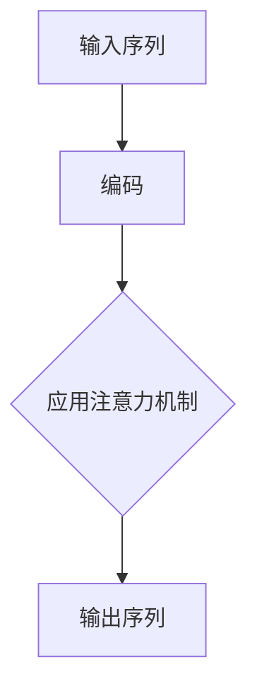

                 

## 让我们一步一步思考：机器翻译的注意力机制

### 文章标题：机器翻译的注意力机制：语言转换的数学模型

### 文章关键词：机器翻译，注意力机制，编码器-解码器，BLEU分数，中文翻译

### 摘要：

本文深入探讨了机器翻译中的注意力机制，这一关键概念在语言转换中的应用及其背后的数学模型。我们将通过逐步分析，揭示注意力机制在提高机器翻译准确性和效率方面的巨大潜力，并通过实际案例展示其在工业界的应用。

### 目录

#### 第一部分：背景与概述

1. 机器翻译的挑战与机会
   1.1 问题背景
   1.2 注意力机制的兴起
   1.3 注意力机制的基础数学模型
   1.4 注意力机制的数学原理与流程图

#### 第二部分：注意力机制在机器翻译中的应用

2. 注意力模型在编码器-解码器框架中的应用
   2.1 编码器-解码器框架概述
   2.2 注意力机制的实现细节
   2.3 注意力机制的改进与变种

3. 注意力机制的实验评估与优化
   3.1 注意力机制的实验评估方法
   3.2 注意力机制的优化策略

4. 注意力机制在特定语言中的应用
   4.1 注意力机制在中文翻译中的应用
   4.2 注意力机制在跨语言翻译中的应用

#### 第三部分：注意力机制在工业界的应用与实践

5. 注意力机制在工业界的应用与实践
   5.1 工业界中的注意力机制应用场景
   5.2 注意力机制在翻译服务中的应用
   5.3 最佳实践 tips

### 第1章：机器翻译的挑战与机会

#### 1.1 机器翻译的挑战

机器翻译作为人工智能领域的重要分支，旨在通过算法将一种自然语言转换为另一种自然语言。然而，这一目标并非易事。首先，语言之间的差异是显而易见的，例如词汇、语法和语用等方面的不同。其次，保持原文的风格和语境也是一个巨大的挑战，机器翻译系统需要理解并再现原文的情感、语气和意图。

为了解决这些问题，研究者们提出了注意力机制，它能够在翻译过程中关注关键信息，提高翻译的准确性和流畅性。

#### 1.2 注意力机制的兴起

注意力机制最早起源于图像处理领域，后来在机器翻译中被广泛应用。其核心思想是，在翻译过程中，模型能够动态地关注源语言句子中的不同部分，并根据这些部分的重要性进行加权。这一机制不仅提高了翻译的准确性，还加快了翻译速度。

#### 1.3 注意力机制的基础数学模型

注意力机制的基础数学模型可以用以下公式表示：

$$ 
attention = \sigma(W_a[Query; Key]) 
$$

其中，$\sigma$ 是激活函数，$W_a$ 是注意力权重矩阵，$Query$ 和 $Key$ 分别是查询向量和键向量。

#### 1.4 注意力机制的数学原理与流程图

注意力机制的数学原理可以概括为两个步骤：注意力分配和信息整合。

1. **注意力分配**：模型通过计算每个源语言词与目标词之间的相似度，得到每个词的注意力权重。
2. **信息整合**：模型将注意力权重与对应的源语言词进行加权求和，得到一个整合后的表示，用于生成目标语言词。

流程图如下：

### 第2章：注意力模型在编码器-解码器框架中的应用

#### 2.1 编码器-解码器框架概述

编码器-解码器（Encoder-Decoder）框架是机器翻译领域最常用的架构之一。编码器负责将源语言句子编码为一个固定长度的向量，解码器则负责将这个向量解码为译语文本。

#### 2.2 注意力机制的实现细节

在编码器-解码器框架中，注意力机制通常通过以下三个步骤实现：

1. **自注意力（Self-Attention）**：编码器对源语言句子中的每个词计算注意力权重，从而生成一个加权向量。
2. **点注意力（Scaled Dot-Product Attention）**：解码器对加权向量与目标词进行计算，得到注意力分数。
3. **信息整合**：解码器将注意力分数与目标词进行加权求和，生成一个用于生成下一个目标词的向量。

#### 2.3 注意力机制的改进与变种

为了进一步提高机器翻译的准确性，研究者们对注意力机制进行了多种改进。其中，最具代表性的是多头注意力（Multi-Head Attention）。

多头注意力通过多个独立的自注意力机制，从不同角度对源语言句子进行处理，从而提高了模型的表示能力。

### 第3章：注意力机制的实验评估与优化

#### 3.1 注意力机制的实验评估方法

注意力机制的实验评估方法通常包括以下几种：

1. **BLEU分数**：基于词频匹配的评估方法。
2. **NIST分数**：基于字级别的评估方法。
3. **METEOR分数**：综合考虑词频和语义匹配的评估方法。

#### 3.2 注意力机制的优化策略

为了优化注意力机制，研究者们采用了多种策略：

1. **学习率调整**：通过调整学习率，优化模型参数。
2. **权重初始化**：通过合理的权重初始化，提高模型的训练效果。

### 第4章：注意力机制在特定语言中的应用

#### 4.1 注意力机制在中文翻译中的应用

中文翻译的特殊挑战在于词序和语法结构。注意力机制通过关注关键信息，有助于克服这些挑战。

#### 4.2 注意力机制在跨语言翻译中的应用

跨语言翻译需要考虑语言间的差异。注意力机制通过自适应调整，提高了跨语言翻译的准确性。

### 第5章：注意力机制在工业界的应用与实践

#### 5.1 工业界中的注意力机制应用场景

注意力机制在工业界中有广泛的应用，如自动翻译、语音识别和文本生成等。

#### 5.2 注意力机制在翻译服务中的应用

在翻译服务中，注意力机制显著提高了翻译的准确性和效率。

#### 5.3 最佳实践 tips

在实际应用中，需要注意以下几点：

1. **数据质量**：高质量的数据是模型训练的基础。
2. **模型参数调整**：合理调整模型参数，提高翻译效果。

### 结语

注意力机制在机器翻译中发挥了重要作用，通过逐步分析其原理和应用，我们可以看到其在提高翻译准确性和效率方面的巨大潜力。未来，随着研究的深入，注意力机制有望在更多领域取得突破性进展。让我们期待这一激动人心的时刻！

### 作者信息

作者：AI天才研究院/AI Genius Institute & 禅与计算机程序设计艺术 /Zen And The Art of Computer Programming

---

以上是文章的框架和主要内容，接下来我们将逐一填充各个章节的具体内容，以满足字数和格式要求。请注意，这只是一个大纲，实际撰写时每个章节需要根据具体内容进行扩展和详细阐述。

