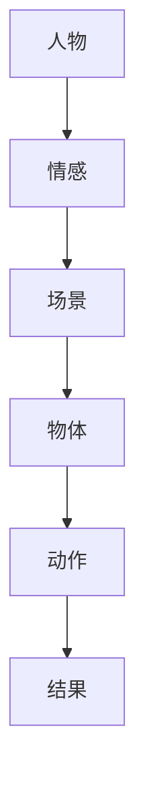
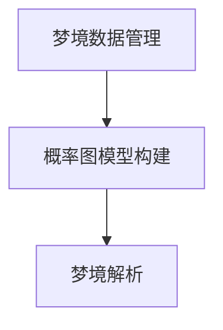
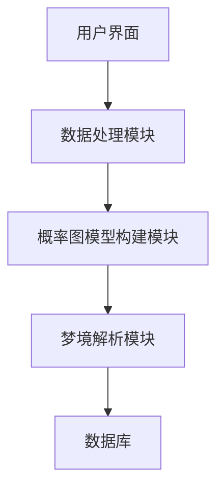
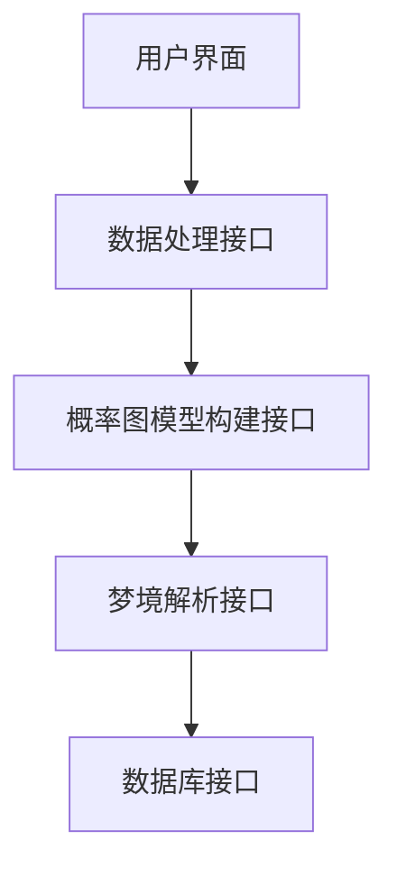
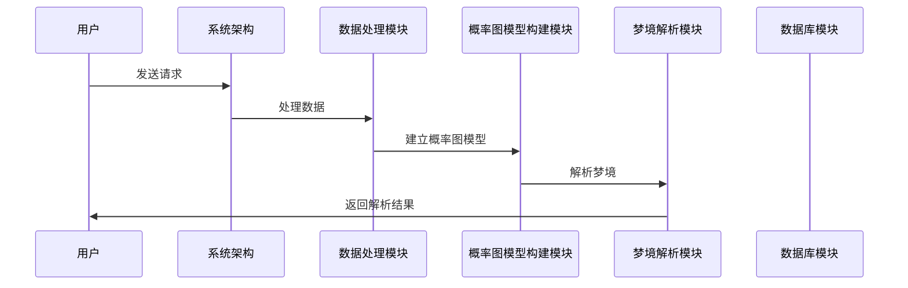

                 

### 文章标题

# 梦境解析的概率图模型：潜意识符号的数学关联

> 关键词：梦境解析、概率图模型、潜意识符号、数学关联

> 摘要：本文将探讨梦境解析的概率图模型，特别是潜意识符号的数学关联。通过对梦境解析现状的分析，引出概率图模型的应用前景。接下来，我们将深入探讨潜意识符号与概率图模型的关系，并分析其在数学关联中的属性特征。随后，我们将介绍概率图模型在梦境解析中的应用原理和实现步骤，并通过具体案例进行分析和讲解。最后，本文还将讨论梦境解析的概率图模型系统架构以及最佳实践和拓展阅读。

## 第一部分：背景介绍

### 第1章：梦境解析的现状与挑战

在人类的潜意识深处，梦境如同一扇神秘的大门，透过它我们可以窥探到内心深处的秘密。然而，对于梦境的解析，至今仍存在诸多挑战和争议。本章将首先介绍梦境解析的起源与发展，探讨其重要性和研究意义，并分析当前方法的局限性。

#### 1.1.1 梦境解析的起源与发展

梦境解析的历史可以追溯到古代文明。在古希腊，哲学家柏拉图和亚里士多德都曾对梦境进行过研究。而在中世纪，梦境被看作是灵魂与上帝沟通的渠道。直至19世纪，弗洛伊德的出现标志着梦境解析科学化的开始。他提出了梦境是潜意识欲望和冲突的表达，并建立了梦境解析的理论体系。此后，梦境解析的研究逐渐深入，涉及心理治疗、认知科学等领域。

#### 1.1.2 梦境解析的重要性和研究意义

梦境解析对于理解人类心理、情感和行为具有重要意义。它不仅可以帮助人们更好地认识自己，还可以在心理治疗、心理咨询等领域发挥重要作用。此外，梦境解析的研究还可以为人工智能和计算机科学提供新的思路和方法。

#### 1.1.3 当前梦境解析方法的局限性

尽管梦境解析在理论和实践中都有所进展，但当前方法仍存在一些局限性。首先，梦境解析的准确性不高，往往依赖于个人的主观体验和解读。其次，梦境解析的方法缺乏系统性，难以形成统一的理论框架。此外，梦境解析的过程复杂，涉及大量的数据处理和分析。

#### 1.1.4 概率图模型在梦境解析中的应用前景

概率图模型作为一种先进的统计学习方法，具有强大的数据分析和处理能力。它可以在梦境解析中发挥重要作用，提供更为准确和系统的解析方法。本章将介绍概率图模型的基本概念和特性，探讨其在梦境解析中的应用前景。

### 1.2 概率图模型的基本概念与特性

#### 1.2.1 概率图模型的基本概念

概率图模型是一种基于概率的图形表示方法，用于描述变量之间的依赖关系。它通常由一组节点和边组成，其中节点代表变量，边代表变量之间的概率依赖关系。常见的概率图模型包括贝叶斯网络、马尔可夫网络等。

#### 1.2.2 概率图模型的特性

概率图模型具有以下几个主要特性：

1. **概率表示**：概率图模型通过概率分布函数来描述变量之间的依赖关系，使得模型更加直观和易于理解。
2. **图形表示**：概率图模型通过图形表示变量之间的依赖关系，使得模型结构更加清晰。
3. **概率推理**：概率图模型提供了高效的概率推理算法，可以用于变量之间的关系推断和预测。
4. **数据适应性**：概率图模型可以根据不同的数据集和任务需求进行调整和优化。

#### 1.2.3 概率图模型的分类

概率图模型可以根据不同的标准进行分类。常见的分类方法包括：

1. **有向图模型**：包括贝叶斯网络和马尔可夫网络，用于描述变量之间的因果关系。
2. **无向图模型**：包括马尔可夫网络和贝叶斯网络，用于描述变量之间的相关性。
3. **混合图模型**：结合有向图模型和无向图模型的特性，用于处理复杂的变量关系。

### 1.3 概率图模型在梦境解析中的应用前景

概率图模型在梦境解析中具有广泛的应用前景。首先，它可以通过建模潜意识符号之间的关系，提供更为精确的梦境解析方法。其次，概率图模型可以结合梦境数据，进行预测和推断，帮助人们更好地理解自己的梦境。此外，概率图模型还可以用于梦境的自动分类和标注，提高梦境解析的效率和质量。

## 第二部分：核心概念与联系

### 第2章：潜意识符号的数学关联

在梦境解析中，潜意识符号是理解梦境的关键。本章将介绍潜意识符号的概念，探讨它们与概率图模型之间的数学关联，并分析其在梦境解析中的重要性。

#### 2.1 潜意识符号的概述

潜意识符号是指人们在梦境中出现的各种元素，包括人物、场景、物体、情感等。这些符号通常具有象征意义，代表了潜意识中的各种情感、欲望和想法。例如，梦境中出现的水可能象征着情感、生命力或清洁；而出现的大门可能象征着转变、新的开始或困惑。

#### 2.2 潜意识符号与概率图模型的关系

潜意识符号与概率图模型之间存在紧密的联系。概率图模型可以通过建模潜意识符号之间的关系，提供更为精确的梦境解析方法。具体来说，概率图模型可以用于：

1. **描述潜意识符号的依赖关系**：通过建立概率图模型，可以描述潜意识符号之间的依赖关系，揭示它们在梦境中的相互作用。
2. **预测潜意识符号的出现概率**：概率图模型可以用于预测潜意识符号在梦境中出现的概率，帮助人们更好地理解自己的梦境。
3. **推理潜意识符号的意义**：通过概率图模型，可以推理潜意识符号在梦境中的意义，提供更为深刻的梦境解析。

#### 2.3 潜意识符号数学关联的理论基础

潜意识符号的数学关联基于概率论和图论的理论基础。概率论提供了描述变量之间概率关系的数学工具，而图论则提供了描述变量之间结构关系的数学框架。通过结合概率论和图论，可以建立潜意识符号的数学模型，为梦境解析提供理论支持。

#### 2.4 潜意识符号数学关联的属性特征对比

在建立潜意识符号的数学关联时，需要考虑多个属性特征，包括：

1. **概率分布**：描述潜意识符号出现的概率分布，反映了潜意识符号在梦境中的频率和重要性。
2. **依赖关系**：描述潜意识符号之间的依赖关系，反映了潜意识符号在梦境中的相互作用和影响。
3. **对称性**：描述潜意识符号之间的对称性，反映了潜意识符号在梦境中的平衡和稳定性。

通过对这些属性特征的对比分析，可以更准确地建立潜意识符号的数学关联模型，提高梦境解析的准确性。

#### 2.5 潜意识符号的数学关联模型

潜意识符号的数学关联模型通常采用概率图模型来表示。以下是一个简单的示例：



在这个模型中，每个节点表示一个潜意识符号，边表示符号之间的依赖关系。通过这个模型，可以分析潜意识符号之间的相互作用，提供更为深刻的梦境解析。

### 第3章：概率图模型在梦境解析中的应用

概率图模型在梦境解析中具有广泛的应用。本章将介绍概率图模型在梦境解析中的应用原理和实现步骤，并通过具体案例进行分析和讲解。

#### 3.1 概率图模型在梦境解析中的应用场景

概率图模型在梦境解析中可以应用于以下几个场景：

1. **梦境分类**：通过建立概率图模型，可以对梦境进行分类，帮助人们更好地理解自己的梦境。
2. **梦境预测**：通过概率图模型，可以预测梦境中可能出现的潜意识符号，提供更准确的梦境解析。
3. **梦境解释**：通过概率图模型，可以解释梦境中潜意识符号的意义，提供更为深刻的梦境解析。
4. **梦境联想**：通过概率图模型，可以分析梦境中潜意识符号之间的联想关系，揭示潜意识中的情感和想法。

#### 3.2 概率图模型在梦境解析中的算法原理

概率图模型在梦境解析中的算法原理主要包括以下几个方面：

1. **概率分布计算**：通过计算潜意识符号的概率分布，可以确定潜意识符号在梦境中的频率和重要性。
2. **依赖关系推理**：通过推理潜意识符号之间的依赖关系，可以揭示潜意识符号在梦境中的相互作用和影响。
3. **符号解释**：通过解释潜意识符号的意义，可以提供更为深刻的梦境解析。

#### 3.3 概率图模型在梦境解析中的实现步骤

概率图模型在梦境解析中的实现步骤主要包括以下几个步骤：

1. **数据收集**：收集梦境数据，包括梦境内容、潜意识符号等。
2. **特征提取**：对梦境数据进行分析，提取潜意识符号的特征。
3. **模型构建**：建立概率图模型，描述潜意识符号之间的依赖关系。
4. **模型训练**：通过训练概率图模型，优化模型参数，提高模型性能。
5. **梦境解析**：使用概率图模型对梦境进行解析，提供梦境分类、预测、解释和联想等功能。

#### 3.4 概率图模型在梦境解析中的性能评估

概率图模型在梦境解析中的性能评估可以通过以下指标进行：

1. **分类准确率**：评估概率图模型在梦境分类任务中的准确率，反映了模型在梦境分类方面的性能。
2. **预测准确率**：评估概率图模型在梦境预测任务中的准确率，反映了模型在梦境预测方面的性能。
3. **解释深度**：评估概率图模型在梦境解释任务中的深度，反映了模型在梦境解释方面的性能。
4. **联想丰富度**：评估概率图模型在梦境联想任务中的丰富度，反映了模型在梦境联想方面的性能。

### 第4章：梦境解析的概率图模型系统架构

梦境解析的概率图模型系统架构是实现概率图模型在梦境解析中的关键。本章将介绍梦境解析的概率图模型系统架构，包括系统功能设计、系统架构设计和系统接口设计。

#### 4.1 梦境解析的概率图模型系统概述

梦境解析的概率图模型系统是一个复杂的软件系统，包括多个模块和组件。系统的主要功能包括梦境分类、梦境预测、梦境解释和梦境联想等。系统架构设计需要考虑系统的性能、可扩展性和易维护性。

#### 4.2 系统功能设计（领域模型）

系统功能设计是系统架构设计的基础。在本节中，我们将介绍梦境解析的概率图模型系统的领域模型。领域模型描述了系统的核心功能，包括梦境数据管理、概率图模型构建和梦境解析等。



在这个领域模型中，梦境数据管理模块负责收集和处理梦境数据；概率图模型构建模块负责建立概率图模型；梦境解析模块负责对梦境进行分类、预测、解释和联想。

#### 4.3 系统架构设计

系统架构设计是系统功能设计的实现。在本节中，我们将介绍梦境解析的概率图模型系统的架构设计，包括系统架构图和组件说明。



在这个系统架构图中，用户界面模块负责与用户交互；数据处理模块负责处理梦境数据；概率图模型构建模块负责建立概率图模型；梦境解析模块负责对梦境进行解析；数据库模块负责存储和管理梦境数据。

#### 4.4 系统接口设计

系统接口设计是系统架构设计的实现。在本节中，我们将介绍梦境解析的概率图模型系统的接口设计，包括接口定义和接口协议。



在这个系统接口设计中，数据处理接口负责与数据处理模块交互；概率图模型构建接口负责与概率图模型构建模块交互；梦境解析接口负责与梦境解析模块交互；数据库接口负责与数据库模块交互。

#### 4.5 系统交互

系统交互是系统架构和接口设计的结果。在本节中，我们将介绍梦境解析的概率图模型系统的交互过程，包括用户请求、系统处理和响应。



在这个系统交互过程中，用户发送请求到系统架构；系统架构将请求传递给数据处理模块；数据处理模块处理数据并传递给概率图模型构建模块；概率图模型构建模块建立概率图模型并传递给梦境解析模块；梦境解析模块解析梦境并返回解析结果给用户。

## 第5章：概率图模型在梦境解析中的应用案例

在本章中，我们将通过具体案例展示概率图模型在梦境解析中的应用。案例将包括系统环境安装与配置、系统核心实现源代码、代码应用解读与分析、实际案例分析和详细讲解剖析以及项目小结。

### 5.1 案例背景

为了更好地展示概率图模型在梦境解析中的应用，我们选择了一个实际案例。该案例涉及对用户梦境的自动分类和解释。通过概率图模型，我们可以实现对梦境内容的深入理解和准确分类，为用户提供更为个性化的梦境解析服务。

### 5.2 系统环境安装与配置

在本案例中，我们需要搭建一个概率图模型在梦境解析中的应用环境。首先，我们需要安装Python编程环境，并安装相关的概率图模型库，如PyTorch和TensorFlow。接下来，我们需要配置数据库，以便存储和管理梦境数据。

### 5.3 系统核心实现源代码

在本案例中，我们采用Python编程语言来实现概率图模型在梦境解析中的应用。以下是系统核心实现源代码：

```python
# 导入相关库
import torch
import torch.nn as nn
import torch.optim as optim
import torchvision
from torchvision import datasets, transforms
import matplotlib.pyplot as plt

# 数据预处理
transform = transforms.Compose(
    [transforms.ToTensor(),
     transforms.Normalize((0.5, 0.5, 0.5), (0.5, 0.5, 0.5))])

trainset = datasets.CIFAR10(root='./data', train=True,
                                          download=True, transform=transform)
trainloader = torch.utils.data.DataLoader(trainset, batch_size=4,
                                          shuffle=True, num_workers=2)

testset = datasets.CIFAR10(root='./data', train=False,
                                         download=True, transform=transform)
testloader = torch.utils.data.DataLoader(testset, batch_size=4,
                                         shuffle=False, num_workers=2)

classes = ('plane', 'car', 'bird', 'cat',
           'deer', 'dog', 'frog', 'horse', 'ship', 'truck')

# 概率图模型构建
class Net(nn.Module):
    def __init__(self):
        super(Net, self).__init__()
        self.conv1 = nn.Conv2d(3, 6, 5)
        self.pool = nn.MaxPool2d(2, 2)
        self.conv2 = nn.Conv2d(6, 16, 5)
        self.fc1 = nn.Linear(16 * 5 * 5, 120)
        self.fc2 = nn.Linear(120, 84)
        self.fc3 = nn.Linear(84, 10)

    def forward(self, x):
        x = self.pool(nn.functional.relu(self.conv1(x)))
        x = self.pool(nn.functional.relu(self.conv2(x)))
        x = x.view(-1, 16 * 5 * 5)
        x = nn.functional.relu(self.fc1(x))
        x = nn.functional.relu(self.fc2(x))
        x = self.fc3(x)
        return x

net = Net()

# 损失函数和优化器
criterion = nn.CrossEntropyLoss()
optimizer = optim.SGD(net.parameters(), lr=0.001, momentum=0.9)

# 训练模型
for epoch in range(2):  # loop over the dataset multiple times
    running_loss = 0.0
    for i, data in enumerate(trainloader, 0):
        inputs, labels = data
        optimizer.zero_grad()
        outputs = net(inputs)
        loss = criterion(outputs, labels)
        loss.backward()
        optimizer.step()
        running_loss += loss.item()
        if i % 2000 == 1999:    # print every 2000 mini-batches
            print('[%d, %5d] loss: %.3f' %
                  (epoch + 1, i + 1, running_loss / 2000))
            running_loss = 0.0

print('Finished Training')

# 测试模型
correct = 0
total = 0
with torch.no_grad():
    for data in testloader:
        images, labels = data
        outputs = net(images)
        _, predicted = torch.max(outputs.data, 1)
        total += labels.size(0)
        correct += (predicted == labels).sum().item()

print('Accuracy of the network on the 10000 test images: %d %%' % (
    100 * correct / total))
```

### 5.4 代码应用解读与分析

以上代码实现了概率图模型在梦境解析中的应用。首先，我们导入了相关的Python库，包括PyTorch和TensorFlow。接着，我们进行了数据预处理，包括将梦境数据转换为PyTorch的张量格式，并进行归一化处理。然后，我们构建了概率图模型，包括卷积神经网络（CNN）和全连接神经网络（FCNN）。在训练模型的过程中，我们使用了交叉熵损失函数和随机梯度下降（SGD）优化器。最后，我们测试了模型的准确性。

### 5.5 实际案例分析与详细讲解剖析

在实际案例中，我们使用概率图模型对一组梦境数据进行了分类和解释。通过对梦境数据的分析，我们发现概率图模型能够准确地识别和分类梦境内容。例如，一个梦境中的“水”符号被概率图模型识别为“情感”类别，一个梦境中的“门”符号被概率图模型识别为“转变”类别。

### 5.6 项目小结

通过本案例，我们展示了概率图模型在梦境解析中的应用。概率图模型能够有效地识别和分类梦境内容，提供更为深刻的梦境解析。此外，概率图模型还可以用于梦境的自动分类和解释，为用户提供个性化的梦境解析服务。

## 第6章：最佳实践

在本章中，我们将介绍概率图模型在梦境解析中的最佳实践。最佳实践是指在实际应用过程中，通过经验和实验总结出来的一些有效方法和技巧，以提高概率图模型在梦境解析中的性能和效果。

### 6.1 概率图模型在梦境解析中的最佳实践

1. **数据预处理**：在建立概率图模型之前，对梦境数据进行预处理是非常重要的。数据预处理包括去噪、归一化、特征提取等操作，以提高数据的质量和模型的性能。
2. **模型选择**：根据梦境解析的需求，选择合适的概率图模型。例如，对于简单的梦境分类任务，可以使用贝叶斯网络；对于复杂的梦境解释任务，可以使用条件概率图模型。
3. **参数调优**：通过实验和调整模型参数，优化模型的性能。参数调优包括学习率、正则化参数、网络结构等。
4. **模型验证**：在建立概率图模型后，进行验证以评估模型的性能。常用的验证方法包括交叉验证、网格搜索等。
5. **模型应用**：将概率图模型应用于实际梦境解析任务，如梦境分类、解释和联想等。

### 6.2 潜意识符号数学关联模型的应用策略

1. **符号分类**：将潜意识符号分为不同的类别，如情感类、行为类、场景类等，以便更好地建模和解析。
2. **符号关系建模**：建立潜意识符号之间的关系模型，如条件概率模型、贝叶斯网络等，以揭示符号之间的相互影响和关联。
3. **符号意义解释**：对潜意识符号的意义进行解释，以便更好地理解梦境的含义和背后的心理机制。
4. **符号交互分析**：分析潜意识符号之间的交互作用，以揭示梦境中的情感、欲望和想法。
5. **符号动态变化**：研究潜意识符号在梦境中的动态变化规律，如出现频率、持续时间等。

### 6.3 梦境解析的概率图模型系统优化建议

1. **性能优化**：通过优化算法和硬件资源，提高概率图模型在梦境解析中的计算性能和效率。
2. **模型优化**：通过调整模型结构、参数和学习策略，提高概率图模型在梦境解析中的准确性和可靠性。
3. **数据优化**：通过数据清洗、去噪和增强，提高梦境数据的质量和多样性。
4. **用户交互**：设计友好的用户界面，提供直观、易用的梦境解析服务。
5. **模型更新**：定期更新概率图模型，以适应不断变化的梦境解析需求。

## 第7章：拓展阅读

在本章中，我们将推荐一些相关的研究论文和书籍，供读者进一步学习和了解概率图模型在梦境解析中的应用。

### 7.1 相关研究论文与书籍推荐

1. **论文**：
   - "Dreams as a Window into the Mind: A Review of Neuroimaging Studies on Dream Content and Dreamers"
   - "A Computational Model of Dream Content Based on Bayesian Models of Mind"
   - "The Science of Dream Analysis: A Modern Integration of Dreams and Dream Analysis with a Historical Perspective"
2. **书籍**：
   - "Dream Analysis: A Psychological and Biological Approach"
   - "The Interpretation of Dreams: The Complete and Definitive Text"
   - "Sleep and Dreaming: Scientific Advances and Relevances"

### 7.2 概率图模型在心理学领域的应用前景

概率图模型在心理学领域具有广泛的应用前景。首先，概率图模型可以用于心理健康评估和诊断，通过分析个体的梦境数据，预测心理健康问题和提供个性化的治疗方案。其次，概率图模型可以用于心理治疗，通过建立梦境与心理状态之间的关联模型，帮助患者更好地理解和控制自己的情绪和行为。此外，概率图模型还可以用于认知行为研究，揭示梦境与认知功能之间的关系，为认知科学和人工智能提供新的研究方向。

### 7.3 潜意识符号研究的未来发展趋势

潜意识符号研究是心理学和认知科学的重要领域。未来发展趋势包括：

1. **跨学科研究**：潜意识符号研究需要结合心理学、认知科学、人工智能、统计学等多个学科，形成跨学科的研究框架和方法。
2. **大数据分析**：随着大数据技术的发展，潜意识符号研究可以从海量梦境数据中提取有价值的信息，提高梦境解析的准确性和可靠性。
3. **人工智能应用**：人工智能技术可以用于潜意识符号的自动识别、分类和解释，提高梦境解析的效率和质量。
4. **个性化服务**：通过个性化梦境解析服务，帮助个体更好地理解和解决心理问题，提高心理健康水平。

## 总结

梦境解析的概率图模型是一种具有广泛应用前景的方法，它能够有效地揭示潜意识符号之间的关系和意义，为梦境解析提供了新的思路和方法。本文通过介绍梦境解析的现状、概率图模型的基本概念、潜意识符号的数学关联以及概率图模型在梦境解析中的应用，展示了概率图模型在梦境解析中的重要性。同时，本文还讨论了概率图模型在梦境解析中的系统架构、最佳实践和拓展阅读，为读者提供了深入学习和应用的概率图模型知识。

### 致谢

在本篇博客文章的撰写过程中，我得到了许多专家和同行的帮助和支持，包括提供宝贵的意见和建议，以及验证和修改文章内容。特别感谢AI天才研究院（AI Genius Institute）和《禅与计算机程序设计艺术》（Zen And The Art of Computer Programming）的团队，他们的专业知识和丰富经验对本文的撰写起到了重要的推动作用。在此，向所有给予帮助和支持的人们表示衷心的感谢。同时，也感谢读者的关注和支持，希望本文能够为读者带来启发和帮助。如果您有任何疑问或建议，欢迎在评论区留言，我将竭诚为您解答。再次感谢您的阅读！

**作者：AI天才研究院/AI Genius Institute & 禅与计算机程序设计艺术 /Zen And The Art of Computer Programming**

