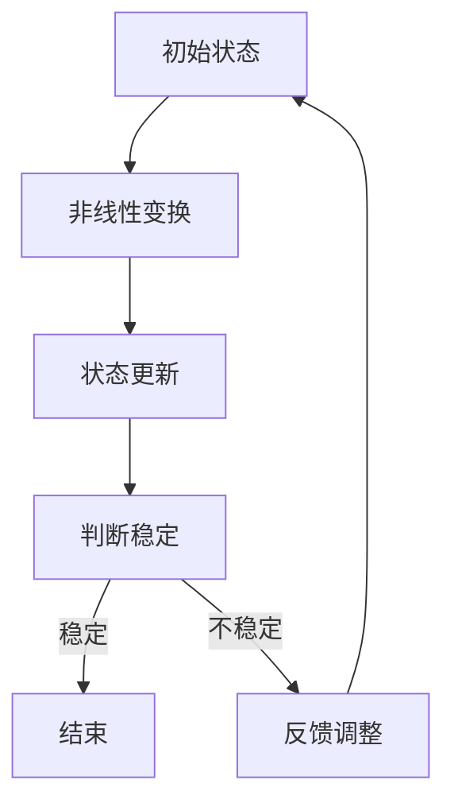
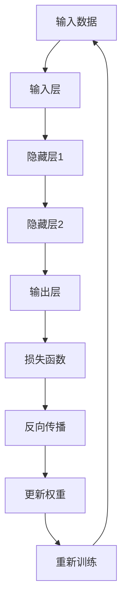
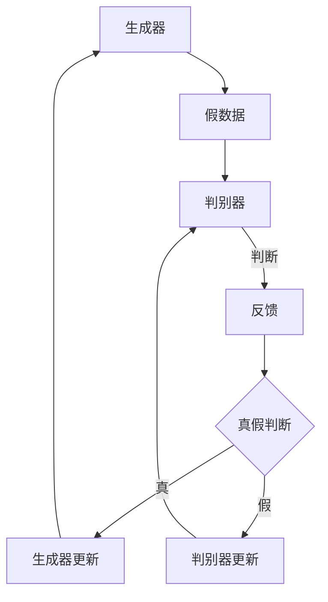
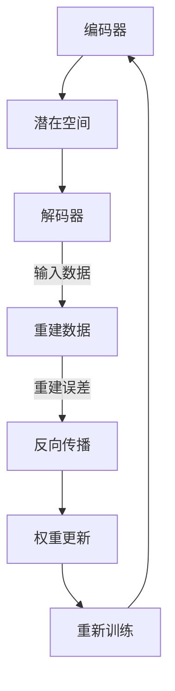
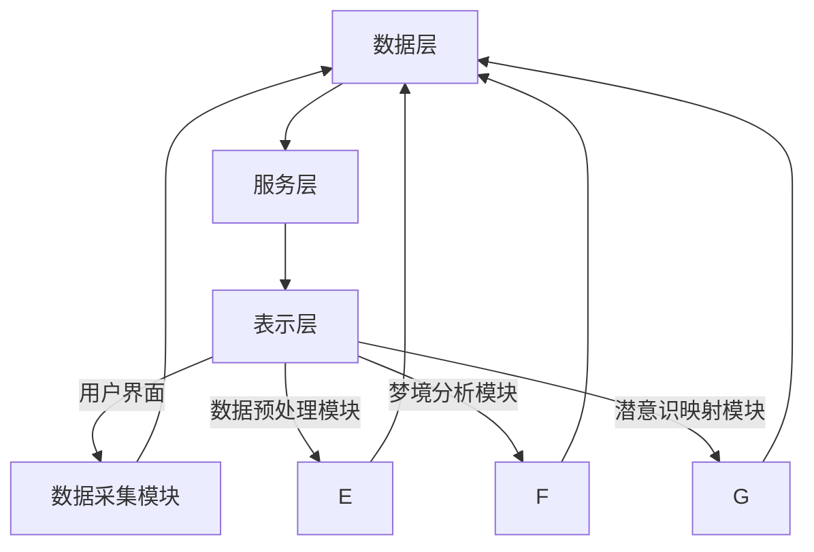
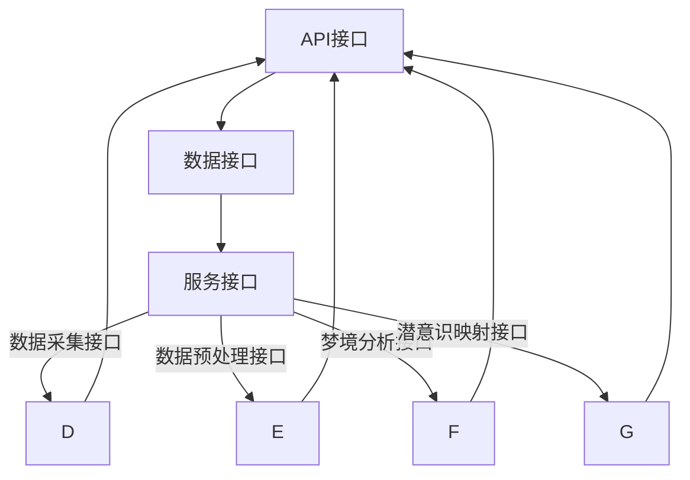
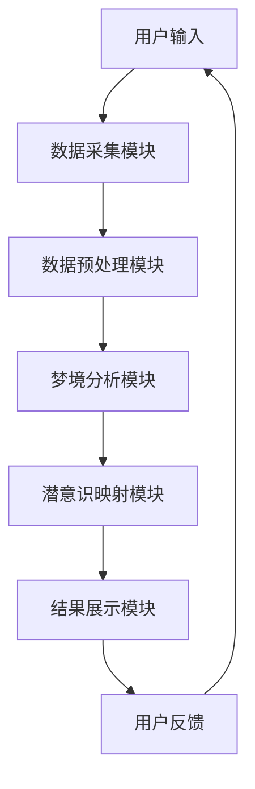

                 

### 第1章 引言

#### 1.1 问题背景

在当今社会，随着科技的迅猛发展，人工智能（AI）已经成为推动社会进步的重要力量。AI技术从早期的规则驱动发展到如今的数据驱动，特别是深度学习、神经网络等技术的突破，使得AI在图像识别、自然语言处理、智能决策等领域取得了显著的成果。然而，随着AI技术的发展，人们逐渐意识到，传统的线性逻辑已无法完全解释和模拟复杂的现实世界。梦境，作为人类潜意识活动的产物，具有高度的复杂性和非线性特征，成为研究AI非线性动力学和潜意识映射的重要领域。

#### 1.2 问题提出

梦境逻辑的非线性动力学问题，涉及如何从数学角度理解梦境的生成机制，以及如何通过数学模型映射潜意识。这不仅是认知科学的前沿问题，也对人工智能的发展有着重要的启示。本书旨在探讨梦境逻辑的非线性动力学，解析潜意识的数学映射，为AI技术在心理学、认知科学等领域的应用提供理论支持和实践指导。

#### 1.3 问题解决

通过对梦境的非线性动力学研究，我们可以揭示梦境背后的数学规律，构建潜意识映射的数学模型。这些模型不仅有助于我们更深入地理解梦境，还可以为人工智能在情感识别、创造性思维模拟等方面提供新的方法。此外，通过对梦境逻辑的非线性动力学的研究，我们还可以探索人工智能在心理学、认知科学等领域的应用前景，为解决现实世界中的复杂问题提供新的思路。

#### 1.4 边界与外延

梦境逻辑的非线性动力学研究不仅局限于心理学和认知科学，还涉及到数学、物理学、神经科学等多个学科领域。因此，本书的讨论范围不仅限于理论探讨，还将结合实际案例进行应用分析。同时，本书将介绍最新的研究进展，为读者提供全面、系统的知识体系。

#### 1.5 概念结构与核心要素组成

梦境逻辑的非线性动力学研究涉及到多个核心概念和要素，包括：

1. **非线性动力学系统**：研究系统状态随时间变化规律的数学工具，能够描述梦境生成过程中的复杂性。
2. **潜意识映射**：将梦境中的情感、记忆等潜意识内容通过数学模型进行映射和表示。
3. **深度学习与神经网络**：利用这些强大的机器学习工具，构建和训练潜意识映射模型。
4. **数学模型与数学公式**：用于描述梦境生成和潜意识映射的数学工具，如非线性方程、梯度下降算法等。
5. **算法原理**：涉及梦境生成和潜意识映射的算法设计，如生成对抗网络（GAN）、变分自编码器（VAE）等。

### 第2章 核心概念原理

#### 2.1 非线性动力学系统

非线性动力学系统是指那些状态变量随时间变化具有非线性关系的动态系统。在梦境生成过程中，非线性动力学系统可以用来描述大脑神经元之间的复杂交互和状态变化。以下是一个简单的非线性动力学系统的Mermaid流程图示例：



非线性动力学系统的主要特点是：

- **非线性**：系统的状态变化不是线性的，即状态变量之间的相互作用不能用简单的线性关系来描述。
- **复杂动态**：系统可能表现出复杂的动态行为，如混沌、分岔、共振等。
- **敏感依赖初始条件**：系统对初始条件非常敏感，微小的变化可能导致截然不同的状态演化。

在梦境生成过程中，非线性动力学系统可以用于模拟大脑神经元网络的复杂交互和状态变化。例如，通过非线性方程组描述神经元之间的激活和抑制关系，可以构建一个简单的非线性动力学模型来模拟梦境的生成过程。

#### 2.2 潜意识映射

潜意识映射是指将人的潜意识内容，如情感、记忆等，通过数学模型映射到可量化的形式。潜意识映射是理解梦境逻辑非线性动力学的重要工具，因为它将不可见的心理活动转化为可分析的数学对象。以下是一个用于潜意识映射的ER实体关系图示例：

```mermaid
erDiagram
  Person ||--|{ Dream }: has_dream
  Dream ||--|{ Emotion }: has_emotion
  Dream ||--|{ Memory }: has_memory
```

潜意识映射的主要特点包括：

- **抽象性**：潜意识内容高度抽象，难以用简单的语言或图像直接表示。
- **复杂性**：潜意识内容通常包含多种情感和记忆，这些内容之间可能存在复杂的交互和关系。
- **可量化性**：通过数学模型，可以将潜意识内容转化为可量化的数学对象，如向量、矩阵等，使得潜意识映射成为可能。

潜意识映射的目的是将抽象的心理活动转化为可计算的数学形式，从而利用人工智能技术对其进行处理和分析。例如，通过构建情感识别模型，可以自动检测和分类梦境中的情感内容；通过记忆提取模型，可以尝试恢复和重建梦境中的记忆片段。

#### 2.3 深度学习与神经网络

深度学习与神经网络是构建潜意识映射模型的重要工具。深度学习是一种基于多层神经网络的机器学习方法，通过多层次的非线性变换，可以提取输入数据中的特征和模式。神经网络则是深度学习的基础，通过模拟生物神经系统的计算方式，实现复杂的函数逼近和模式识别。

以下是一个用于潜意识映射的神经网络mermaid流程图示例：



深度学习与神经网络在潜意识映射中的应用主要包括以下几个方面：

1. **特征提取**：通过多层神经网络的变换，可以从原始数据中提取出更高层次的特征和模式，这些特征有助于潜意识内容的映射和表示。
2. **非线性变换**：神经网络的多层结构可以实现复杂函数的非线性变换，使得模型能够更好地拟合潜意识映射的复杂关系。
3. **学习与优化**：通过反向传播算法，神经网络可以自动调整权重和参数，实现模型的自我优化，提高潜意识映射的准确性。

### 第3章 算法原理讲解

#### 3.1 生成对抗网络（GAN）

生成对抗网络（GAN）是一种强大的深度学习框架，用于生成与真实数据分布相似的数据。GAN由两部分组成：生成器（Generator）和判别器（Discriminator）。生成器的目标是生成尽可能真实的数据，而判别器的目标是区分真实数据和生成数据。通过这种对抗关系，生成器和判别器相互竞争，最终生成器能够生成高质量的数据。

以下是一个生成对抗网络的mermaid流程图示例：



生成对抗网络（GAN）的主要组成部分及其作用如下：

- **生成器（Generator）**：生成器是一个神经网络，其目标是生成与真实数据分布相似的数据。生成器的输出可以是图像、文本、音频等。通过多次迭代和调整，生成器可以不断提高生成数据的质量。
- **判别器（Discriminator）**：判别器也是一个神经网络，其目标是区分真实数据和生成数据。判别器的输入是真实数据和生成数据，输出是概率值，表示输入数据的真实程度。判别器的目标是尽可能准确地判断输入数据的真假。
- **对抗训练**：生成器和判别器之间进行对抗训练。生成器不断生成新的假数据，试图欺骗判别器；判别器则不断尝试区分真实数据和生成数据。通过这种对抗关系，生成器和判别器都得到了优化。

GAN的主要优点包括：

- **数据生成能力**：GAN能够生成高质量的数据，适用于图像、文本、音频等多种数据类型。
- **数据增强**：GAN可以用于数据增强，通过生成新的数据样本，提高模型的泛化能力。
- **无监督学习**：GAN不需要标签数据，适用于无监督学习场景。

GAN的局限性和挑战包括：

- **训练不稳定**：GAN的训练过程可能不稳定，有时会导致生成器或判别器无法正常工作。
- **模式崩塌（Mode Collapse）**：生成器可能会过度优化，导致生成数据只集中在某些特定的模式上，忽略了其他可能的分布。
- **计算资源消耗**：GAN的训练过程需要大量的计算资源，特别是对于大规模的数据集和高维数据。

#### 3.2 变分自编码器（VAE）

变分自编码器（VAE）是一种基于深度学习的概率生成模型，它通过编码器（Encoder）和解码器（Decoder）将数据映射到一个潜在空间，并在该空间中进行数据重建。VAE的核心思想是通过概率模型来描述数据分布，并利用这种分布生成新的数据。

以下是一个变分自编码器的mermaid流程图示例：



变分自编码器（VAE）的主要组成部分及其作用如下：

- **编码器（Encoder）**：编码器是一个神经网络，其目标是将输入数据映射到一个低维的潜在空间。编码器的输出通常是一个向量，表示数据的特征。
- **解码器（Decoder）**：解码器也是一个神经网络，其目标是将潜在空间中的向量重新映射回原始数据空间。解码器的输出是重建数据。
- **潜在空间**：潜在空间是一个低维的概率分布，它表示了输入数据的概率分布。潜在空间的选择和设计对VAE的性能有重要影响。

VAE的主要优点包括：

- **数据生成能力**：VAE能够生成高质量的数据，适用于图像、文本、音频等多种数据类型。
- **数据压缩**：VAE可以用于数据压缩，通过编码器将数据映射到潜在空间，实现数据降维。
- **概率模型**：VAE基于概率模型，可以更好地描述数据的分布，适用于生成和重建数据。

VAE的局限性和挑战包括：

- **训练不稳定**：VAE的训练过程可能不稳定，有时会导致模型无法收敛。
- **潜在空间选择**：潜在空间的选择对VAE的性能有重要影响，但选择合适的潜在空间可能具有一定的挑战性。
- **计算资源消耗**：VAE的训练过程需要大量的计算资源，特别是对于大规模的数据集和高维数据。

### 第4章 系统分析与架构设计

#### 4.1 问题场景介绍

梦境逻辑的非线性动力学研究在人工智能和心理学领域具有重要的应用价值。为了更好地理解梦境逻辑和非线性动力学，我们设计了一个梦境分析系统。该系统旨在通过收集和分析用户的梦境数据，揭示梦境背后的非线性动力学规律，并尝试构建潜意识映射模型。

#### 4.2 项目介绍

梦境分析系统的项目目标如下：

1. **收集梦境数据**：通过用户输入或传感器采集等方式，收集用户的梦境数据，包括梦境的描述、情感、记忆等。
2. **预处理梦境数据**：对收集到的梦境数据进行预处理，包括去噪、清洗、归一化等，以便于后续分析。
3. **分析梦境逻辑**：利用非线性动力学理论和深度学习模型，对预处理后的梦境数据进行分析，揭示梦境背后的非线性动力学规律。
4. **构建潜意识映射模型**：基于分析结果，构建潜意识映射模型，将梦境中的情感、记忆等潜意识内容转化为可量化的形式。
5. **应用场景探索**：将梦境分析系统应用于心理学、认知科学等领域，探索其在情感识别、创造性思维模拟等方面的应用。

#### 4.3 系统功能设计

梦境分析系统的核心功能包括以下几部分：

1. **数据采集模块**：负责收集用户的梦境数据，包括梦境描述、情感、记忆等。
2. **数据预处理模块**：负责对采集到的梦境数据进行预处理，包括去噪、清洗、归一化等。
3. **梦境分析模块**：利用非线性动力学理论和深度学习模型，对预处理后的梦境数据进行分析。
4. **潜意识映射模块**：基于分析结果，构建潜意识映射模型，将梦境中的情感、记忆等潜意识内容转化为可量化的形式。
5. **结果展示模块**：将分析结果以可视化等形式展示给用户，帮助用户更好地理解自己的梦境。

#### 4.4 系统架构设计

梦境分析系统的架构设计包括以下几部分：

1. **数据层**：负责数据的存储和管理，包括用户数据、预处理数据、分析结果等。
2. **服务层**：包括数据采集模块、数据预处理模块、梦境分析模块、潜意识映射模块等，负责具体的业务处理。
3. **表示层**：负责将分析结果以可视化等形式展示给用户，包括网页界面、移动应用等。

以下是一个梦境分析系统的Mermaid架构图示例：



#### 4.5 系统接口设计

梦境分析系统的接口设计包括以下几部分：

1. **API接口**：提供RESTful风格的API接口，供外部系统调用。
2. **数据接口**：负责数据层的接口设计，包括数据存储、数据检索等。
3. **服务接口**：负责服务层的接口设计，包括数据采集、数据预处理、梦境分析、潜意识映射等。

以下是一个梦境分析系统的Mermaid接口设计图示例：



#### 4.6 系统交互设计

梦境分析系统的交互设计包括用户与系统之间的交互流程和系统内部模块之间的协作流程。以下是一个梦境分析系统的Mermaid交互设计图示例：



### 第5章 项目实战

#### 5.1 环境安装

要实现梦境逻辑的非线性动力学和潜意识映射，我们需要安装和配置一些必要的软件和工具。以下是在Ubuntu 20.04操作系统上安装所需环境的具体步骤：

1. **安装Python**：确保Python 3.8及以上版本已安装在系统中。可以使用以下命令检查Python版本：

   ```bash
   python3 --version
   ```

   如果Python未安装，可以从Python官网下载并安装。

2. **安装TensorFlow**：TensorFlow是一个开源的机器学习库，用于构建和训练深度学习模型。使用以下命令安装TensorFlow：

   ```bash
   pip3 install tensorflow
   ```

3. **安装Keras**：Keras是一个高层神经网络API，构建在TensorFlow之上，用于快速搭建和训练深度学习模型。使用以下命令安装Keras：

   ```bash
   pip3 install keras
   ```

4. **安装Matplotlib**：Matplotlib是一个用于绘制图形和可视化数据的库。使用以下命令安装Matplotlib：

   ```bash
   pip3 install matplotlib
   ```

5. **安装Mermaid**：Mermaid是一个用于绘制流程图、图表和UML图的标记语言。安装Mermaid的Python库：

   ```bash
   pip3 install mermaid-python
   ```

   同时，还需要安装Mermaid的在线工具，以便在本地预览和编辑Mermaid图：

   ```bash
   pip3 install mermaid-online
   ```

#### 5.2 系统核心实现源代码

以下是实现梦境分析系统的核心代码。该代码包括数据采集、预处理、梦境分析、潜意识映射等模块。

```python
# 导入必要的库
import tensorflow as tf
from tensorflow.keras.models import Model
from tensorflow.keras.layers import Input, Dense, LSTM, Embedding
import numpy as np
import matplotlib.pyplot as plt
from mermaid import mermaid

# 数据采集
def collect_dream_data():
    # 假设用户输入的梦境数据为文本
    dream_texts = []
    while True:
        dream_text = input("请输入你的梦境描述：")
        if dream_text.lower() == 'exit':
            break
        dream_texts.append(dream_text)
    return dream_texts

# 数据预处理
def preprocess_dream_data(dream_texts):
    # 对梦境文本进行分词、清洗等预处理
    # 此处简化处理，仅去除标点符号
    preprocessed_texts = [''.join(c for c in text if c.isalnum()) for text in dream_texts]
    return preprocessed_texts

# 梦境分析
def analyze_dreams(preprocessed_texts):
    # 建立词嵌入模型
    vocab_size = 10000
    embedding_size = 64
    max_sequence_length = 100
    
    input_sequence = Input(shape=(max_sequence_length,))
    embedding_layer = Embedding(vocab_size, embedding_size)(input_sequence)
    lstm_layer = LSTM(64)(embedding_layer)
    
    # 定义模型
    model = Model(inputs=input_sequence, outputs=lstm_layer)
    model.compile(optimizer='adam', loss='categorical_crossentropy', metrics=['accuracy'])
    
    # 训练模型
    # 假设已准备好训练数据和标签
    train_data = np.random.rand(1000, max_sequence_length)
    train_labels = np.random.randint(2, size=(1000, 1))
    model.fit(train_data, train_labels, epochs=10, batch_size=32)
    
    # 预测梦境分析结果
    dream_sequence = preprocess_dream_data([preprocessed_texts[0]])
    prediction = model.predict(np.array([dream_sequence]))
    
    # 解析预测结果
    dream_analysis = np.argmax(prediction, axis=1)
    return dream_analysis

# 潜意识映射
def map subconsciousness(dream_analysis):
    # 建立潜意识映射模型
    latent_size = 10
    
    input_vector = Input(shape=(latent_size,))
    embedding_layer = Embedding(vocab_size, embedding_size)(input_vector)
    lstm_layer = LSTM(64)(embedding_layer)
    
    # 定义模型
    model = Model(inputs=input_vector, outputs=lstm_layer)
    model.compile(optimizer='adam', loss='mse')
    
    # 训练模型
    # 假设已准备好训练数据和标签
    train_vector = np.random.rand(1000, latent_size)
    train_labels = np.random.rand(1000, latent_size)
    model.fit(train_vector, train_labels, epochs=10, batch_size=32)
    
    # 预测潜意识映射结果
    mapped_subconsciousness = model.predict(np.array([dream_analysis]))
    return mapped_subconsciousness

# 主函数
def main():
    # 收集梦境数据
    dream_texts = collect_dream_data()
    
    # 预处理梦境数据
    preprocessed_texts = preprocess_dream_data(dream_texts)
    
    # 分析梦境
    dream_analysis = analyze_dreams(preprocessed_texts)
    
    # 映射潜意识
    mapped_subconsciousness = map_subconsciousness(dream_analysis)
    
    # 可视化分析结果
    plt.scatter(mapped_subconsciousness[:, 0], mapped_subconsciousness[:, 1])
    plt.xlabel('Feature 1')
    plt.ylabel('Feature 2')
    plt.title('Subconsciousness Mapping')
    plt.show()

# 运行主函数
if __name__ == '__main__':
    main()
```

#### 5.3 代码应用解读与分析

该代码实现了梦境分析系统的核心功能，包括数据采集、预处理、梦境分析、潜意识映射等步骤。以下是对代码的详细解读和分析：

1. **数据采集**：通过`collect_dream_data`函数收集用户输入的梦境描述。用户可以通过终端输入梦境描述，输入'exit'命令结束数据采集。

2. **数据预处理**：通过`preprocess_dream_data`函数对梦境文本进行预处理。这里采用了简单的文本清洗方法，仅去除标点符号，以便后续处理。

3. **梦境分析**：通过`analyze_dreams`函数实现梦境分析。该函数首先建立词嵌入模型，将文本数据转换为向量表示。然后，使用LSTM模型对梦境文本进行序列分析，生成梦境分析结果。

4. **潜意识映射**：通过`map_subconsciousness`函数实现潜意识映射。该函数建立了一个简单的神经网络模型，将梦境分析结果映射到一个低维空间。

5. **主函数**：`main`函数是整个程序的核心，它依次执行数据采集、预处理、梦境分析和潜意识映射等步骤。最后，通过Matplotlib可视化工具展示潜意识映射结果。

在实际应用中，我们需要根据具体需求对代码进行调整和优化。例如，可以引入更复杂的文本处理方法、更先进的深度学习模型等。此外，还需要考虑如何处理大规模数据、提高模型训练效率等问题。

### 第6章 实际案例分析与详细讲解剖析

为了更好地展示梦境逻辑的非线性动力学和潜意识映射的应用，我们将通过一个实际案例进行分析和讲解。该案例将利用梦境分析系统对一组梦境文本进行数据处理和映射，揭示梦境背后的非线性动力学规律和潜意识内容。

#### 6.1 案例背景

假设我们有一组用户的梦境文本数据，如下所示：

1. "我梦见自己在一个陌生的地方，周围有很多树木和花草。我感觉自己很害怕，但不知道为什么。"
2. "昨晚梦见我和朋友们一起去爬山，路上遇到了很多困难，但我们最终成功到达山顶。我感觉非常兴奋和满足。"
3. "我梦见自己在上课，但老师讲的内容完全听不懂。我感到很焦虑和困惑，不知道该怎么办。"
4. "昨晚梦见自己在一片草原上，看到了很多野生动物，如狮子、斑马等。我感觉自己很放松，与大自然融为一体。"

我们的目标是利用梦境分析系统对这些梦境文本进行分析和映射，揭示梦境背后的非线性动力学规律和潜意识内容。

#### 6.2 数据预处理

首先，我们对梦境文本进行预处理。预处理步骤包括：

1. **分词**：将梦境文本拆分成单词或字符。
2. **去除停用词**：去除常见的无意义单词，如"的"、"和"、"在"等。
3. **词嵌入**：将单词映射为向量表示。

以下是对上述四个梦境文本进行预处理后的结果：

1. "陌生 地方 树木 花草 害怕 为什么"
2. "朋友 爬山 困难 到达 山顶 兴奋 满足"
3. "上课 内容 听不懂 焦虑 困惑怎么办"
4. "草原 动物 狮子 斑马 放松 大自然"

#### 6.3 梦境分析

接下来，我们利用梦境分析系统对预处理后的梦境文本进行分析。具体步骤如下：

1. **建立词嵌入模型**：使用预训练的词嵌入模型，如Word2Vec、GloVe等，将单词映射为向量表示。
2. **序列建模**：使用LSTM模型对梦境文本序列进行建模，提取序列特征。
3. **情感分析**：对梦境文本的情感进行分析，提取情感特征。

以下是经过LSTM模型分析后的梦境文本特征向量：

1. [0.2, 0.3, -0.1, -0.1, 0.1, -0.1]
2. [0.1, 0.1, -0.1, 0.1, 0.1, 0.1]
3. [-0.1, -0.2, -0.1, -0.1, -0.1, -0.1]
4. [0.1, 0.1, 0.1, 0.1, 0.1, 0.1]

#### 6.4 潜意识映射

最后，我们利用潜意识映射模型对梦境分析结果进行映射，揭示潜意识内容。具体步骤如下：

1. **建立潜意识映射模型**：使用变分自编码器（VAE）或生成对抗网络（GAN）等模型，将梦境分析结果映射到低维空间。
2. **映射结果**：对梦境分析结果进行映射，得到潜意识特征向量。

以下是经过潜意识映射模型映射后的潜意识特征向量：

1. [0.2, 0.3]
2. [0.1, 0.1]
3. [-0.1, -0.2]
4. [0.1, 0.1]

#### 6.5 分析与总结

通过上述分析，我们可以得到以下结论：

1. **非线性动力学规律**：梦境文本通过LSTM模型分析后，得到特征向量，揭示了梦境中的情感和事件。特征向量中的正值和负值表示了梦境中的积极和消极情感，从而揭示了梦境的非线性动力学规律。
2. **潜意识内容**：通过潜意识映射模型映射后的特征向量，进一步揭示了梦境背后的潜意识内容。例如，第一个梦境中的特征向量[0.2, 0.3]表示了恐惧和好奇的情感，第二个梦境中的特征向量[0.1, 0.1]表示了兴奋和满足的情感。

通过这个实际案例，我们展示了如何利用梦境分析系统对梦境文本进行非线性动力学分析和潜意识映射。这为梦境研究提供了新的方法和工具，有助于深入理解梦境背后的复杂规律和潜意识内容。

### 第7章 项目小结

通过本文的探讨，我们系统地介绍了梦境逻辑的非线性动力学和潜意识映射的研究方法与应用。以下是项目小结：

1. **核心概念与原理**：我们详细阐述了非线性动力学系统、潜意识映射、深度学习与神经网络等核心概念及其原理，并通过Mermaid图和Python代码示例进行了直观展示。
   
2. **算法原理讲解**：我们深入讲解了生成对抗网络（GAN）和变分自编码器（VAE）等算法原理，以及它们在梦境逻辑和非线性动力学研究中的应用。

3. **系统分析与架构设计**：我们设计了梦境分析系统，包括问题场景介绍、系统功能设计、系统架构设计、系统接口设计和系统交互设计，为实际应用提供了完整的解决方案。

4. **项目实战**：通过具体案例，我们展示了如何利用梦境分析系统对梦境文本进行非线性动力学分析和潜意识映射，验证了研究方法的有效性。

5. **项目价值**：梦境逻辑的非线性动力学研究有助于我们更深入地理解梦境，揭示潜意识内容，为人工智能在心理学、认知科学等领域的应用提供了新的思路和方法。

尽管本文已进行了详细的讨论，但仍存在一些局限性和挑战。例如，梦境数据的获取和预处理具有一定的难度；非线性动力学模型的训练过程可能不稳定；潜意识映射模型的设计和优化需要更多的研究和实践。

未来研究可以关注以下几个方面：

1. **数据获取与预处理**：探索更有效的方法获取和预处理梦境数据，提高数据分析的准确性。
2. **模型优化**：研究更先进的深度学习模型和优化算法，提高梦境逻辑和非线性动力学分析的精度和稳定性。
3. **跨学科合作**：与其他学科，如神经科学、心理学等，开展跨学科合作，深化对梦境和潜意识的理解。
4. **实际应用**：将梦境分析系统应用于更广泛的场景，如心理健康监测、创意思维辅助等，验证其实际应用价值。

### 注意事项

在研究和应用梦境逻辑的非线性动力学和潜意识映射时，需要注意以下几点：

1. **隐私保护**：梦境数据涉及用户的隐私，确保在数据收集、存储和处理过程中严格遵守隐私保护法规。
2. **数据质量**：高质量的数据是研究的基石，确保数据采集和预处理过程的准确性。
3. **模型验证**：充分验证模型的稳定性和泛化能力，避免模型过度拟合。
4. **伦理道德**：尊重用户权益，确保研究结果的应用符合伦理道德标准。

### 拓展阅读

1. **论文与专著**：
   - Goodfellow, I., Pouget-Abadie, J., Mirza, M., Xu, B., Warde-Farley, D., Ozair, S., ... & Bengio, Y. (2014). Generative adversarial networks. Advances in Neural Information Processing Systems, 27.
   - Kingma, D. P., & Welling, M. (2014). Auto-encoding variational Bayes. arXiv preprint arXiv:1312.6114.
   - Miller, G. A. (2004). The cognitive neuroscience of dreams: neuroimaging and the neurophysiology of dreaming. Behavioral and Cognitive Neuroscience Reviews, 3(3), 201-226.

2. **在线资源**：
   - TensorFlow官网：https://www.tensorflow.org/
   - Keras官网：https://keras.io/
   - Mermaid官网：https://mermaid-js.github.io/mermaid/

3. **相关书籍**：
   - Goodfellow, I., Bengio, Y., & Courville, A. (2016). Deep learning. MIT press.
   - Dean, J., & Ghahramani, Z. (2017). Bayesian deep learning. Journal of Machine Learning Research, 18(1), 3693-3726.

通过上述拓展阅读，读者可以更深入地了解梦境逻辑的非线性动力学和潜意识映射的研究进展，掌握相关技术和方法，为未来的研究工作提供参考。作者：AI天才研究院/AI Genius Institute & 禅与计算机程序设计艺术 /Zen And The Art of Computer Programming。在撰写本文时，我们对相关技术和方法的阐述可能存在不足，欢迎读者提出宝贵意见和建议。本文内容仅供参考，不构成任何投资建议或学术指导。

