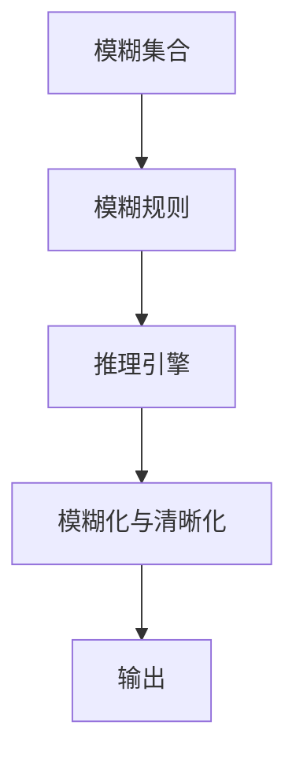
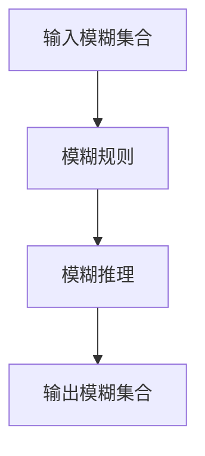
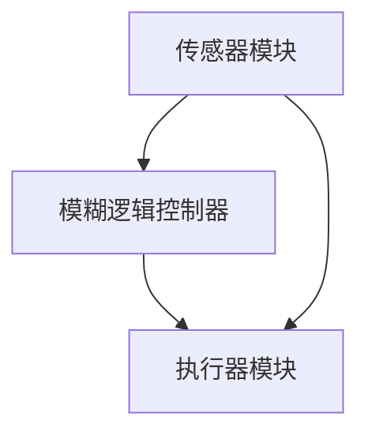
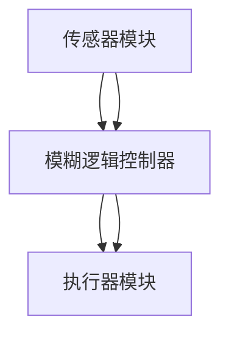
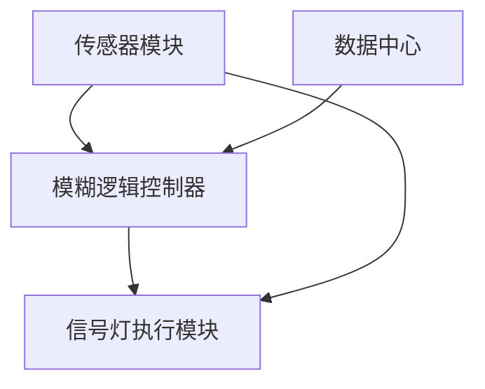
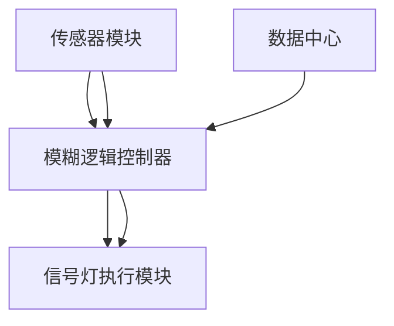
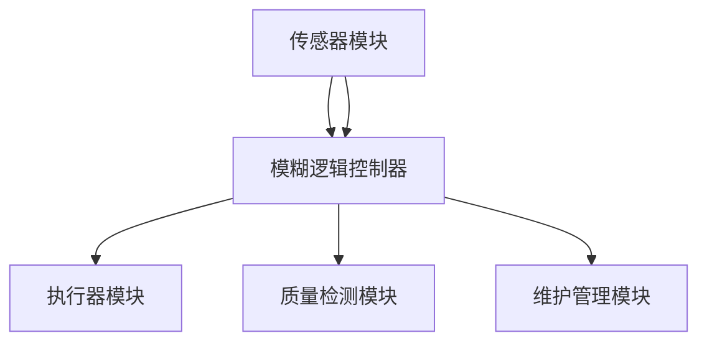
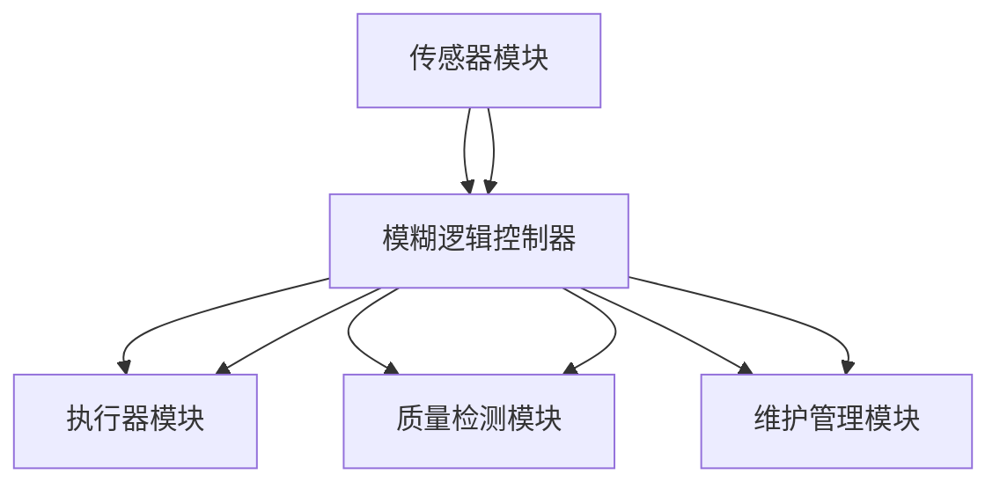

                 

### 第2章：模糊集合与模糊关系

#### 2.1 模糊集合的定义与运算

模糊集合是经典集合的扩展，它引入了隶属度函数来描述元素对集合的隶属程度，这样可以更准确地描述现实世界中的模糊性。

##### 模糊集合的定义

**模糊集合** 是一种描述模糊性的数学结构。形式上，一个模糊集合 \( A \) 在某个论域 \( U \) 上由隶属度函数 \( \mu_A : U \to [0,1] \) 定义，其中：

- \( U \) 是一个非空集合，称为论域。
- \( \mu_A(x) \) 是元素 \( x \) 属于模糊集合 \( A \) 的隶属度，取值范围在 [0,1] 之间。

隶属度函数 \( \mu_A \) 描述了元素 \( x \) 在模糊集合 \( A \) 中的模糊程度，即元素 \( x \) 属于 \( A \) 的程度。

##### 模糊集合的运算

模糊集合的运算主要包括并集、交集和补集等。

**并集**：对于两个模糊集合 \( A \) 和 \( B \)，其并集 \( A \cup B \) 的隶属度函数为：
\[ \mu_{A \cup B}(x) = \max(\mu_A(x), \mu_B(x)) \]

**交集**：对于两个模糊集合 \( A \) 和 \( B \)，其交集 \( A \cap B \) 的隶属度函数为：
\[ \mu_{A \cap B}(x) = \min(\mu_A(x), \mu_B(x)) \]

**补集**：对于模糊集合 \( A \)，其补集 \( A^c \) 的隶属度函数为：
\[ \mu_{A^c}(x) = 1 - \mu_A(x) \]

#### 2.2 模糊关系的定义与性质

模糊关系是对经典关系的扩展，它引入了隶属度来描述两个集合之间的模糊联系。

##### 模糊关系的定义

**模糊关系** 是一个模糊集合，它定义了两个集合之间元素之间的模糊隶属度。

形式上，一个模糊关系 \( R \) 在两个论域 \( U \) 和 \( V \) 上的隶属度函数为 \( \mu_R : U \times V \to [0,1] \)。

\( \mu_R(u, v) \) 表示元素 \( u \) 与 \( v \) 之间的模糊隶属度。

##### 模糊关系的性质

- **自反性**：\( \mu_R(u, u) = 1 \) 对于所有 \( u \in U \)。
- **对称性**：如果 \( \mu_R(u, v) = 1 \)，则 \( \mu_R(v, u) = 1 \)。
- **传递性**：如果 \( \mu_R(u, v) = 1 \) 和 \( \mu_R(v, w) = 1 \)，则 \( \mu_R(u, w) = 1 \)。

##### 模糊关系的运算

- **合成**：两个模糊关系 \( R \) 和 \( S \) 的合成 \( R \circ S \) 的隶属度函数为：
  \[ \mu_{R \circ S}(u, w) = \mu_R(u, v) \wedge \mu_S(v, w) \]
- **逆**：模糊关系 \( R \) 的逆 \( R^{-1} \) 的隶属度函数为：
  \[ \mu_{R^{-1}}(v, u) = \mu_R(u, v) \]

#### 2.3 模糊集合与模糊关系的应用

模糊集合和模糊关系在多个领域都有广泛的应用。

- **控制工程**：模糊控制器利用模糊集合和模糊关系对系统进行控制，处理非线性系统和不确定环境。
- **人工智能**：模糊逻辑在专家系统和推理机中起到重要作用，帮助计算机处理模糊性信息。
- **模式识别**：模糊集合和模糊关系在模式识别中用于分类和聚类任务，提供更灵活的分类策略。

通过以上对模糊集合和模糊关系的定义、运算及其应用的详细讲解，我们可以更好地理解模糊逻辑的基础，为后续章节的深入探讨打下坚实的基础。在接下来的章节中，我们将进一步探讨模糊逻辑在工程和科学研究中的实际应用。

## 第3章：模糊逻辑系统

#### 3.1 模糊逻辑系统的构成

模糊逻辑系统是由模糊集合、模糊关系和模糊推理机制构成的。其核心在于利用模糊集合来描述不确定性和模糊性，通过模糊关系实现元素间的模糊联系，并通过模糊推理机制进行逻辑推理和决策。

##### 模糊逻辑系统的基本组件

- **模糊集合**：模糊逻辑系统的输入和输出都是模糊集合，它们由隶属度函数定义。
- **模糊规则**：模糊规则描述了输入与输出之间的模糊关系，通常表示为“如果-那么”的形式。
- **推理引擎**：推理引擎负责根据模糊规则和输入模糊集合进行推理，产生输出模糊集合。
- **模糊化与清晰化**：模糊化是将清晰输入转换为模糊集合的过程，清晰化是将模糊输出转换为清晰输出的过程。

##### 模糊逻辑系统的构成图



#### 3.2 模糊逻辑运算

模糊逻辑系统中的运算主要包括模糊化、模糊推理和清晰化等。

##### 模糊化

模糊化是将清晰值转换为模糊集合的过程。例如，将一个清晰温度值“25°C”转换为模糊集合“冷”，“适中”，“热”中的一个。模糊化通常通过隶属度函数实现。

```python
# 模糊化示例
def fuzzify(temperature, temperature_range):
    low = temperature_range[0]
    high = temperature_range[1]
    membership_function = lambda x: max(0, (x - low) / (high - low))
    cold = membership_function(temperature)
    moderate = membership_function(temperature - 10)
    hot = membership_function(temperature + 10)
    return cold, moderate, hot

cold, moderate, hot = fuzzify(25, [10, 40])
print("Cold:", cold)
print("Moderate:", moderate)
print("Hot:", hot)
```

##### 模糊推理

模糊推理是根据模糊规则和输入模糊集合产生输出模糊集合的过程。模糊推理通常使用模糊合成运算，如最大最小（Mamdani）或最大最大（Sugeno）方法。



##### 清晰化

清晰化是将模糊输出转换为清晰值的过程。清晰化可以通过重心法、最大隶属度法等实现。

```python
# 清晰化示例
def defuzzify(output_fuzzy_set):
    # 使用重心法
    return sum(x * y for x, y in output_fuzzy_set.items()) / sum(y for y in output_fuzzy_set.values())

defuzzified_value = defuzzify({'cold': 0.3, 'moderate': 0.5, 'hot': 0.2})
print("Defuzzified Value:", defuzzified_value)
```

通过以上对模糊逻辑系统的构成、模糊逻辑运算的详细讲解，我们可以更好地理解模糊逻辑系统的工作原理和应用方法。在接下来的章节中，我们将进一步探讨模糊逻辑系统的设计、实现和应用。

#### 3.3 模糊推理与决策

模糊推理是模糊逻辑系统的核心部分，它负责根据模糊规则和输入模糊集合产生输出模糊集合。模糊推理的过程可以分为模糊化、推理和清晰化三个主要步骤。

##### 模糊化

模糊化是将输入变量的清晰值转换为模糊集合的过程。这通常通过设计适当的隶属度函数来实现。例如，假设我们有一个输入变量“温度”，其范围是[0°C, 100°C]，我们可以定义一个三角形隶属度函数来描述“冷”、“适中”和“热”三种状态。

```mermaid
graph TD
A[0°C] --> B[0.5](隶属度)
B --> C[100°C](隶属度)
```

以下是一个简单的隶属度函数示例：

```python
# 三角形隶属度函数
def triangular_membership_function(x, a, b, c):
    if x <= a:
        return (x - a) / (a - b)
    elif x <= b:
        return 1
    else:
        return (c - x) / (c - a)

# 输入值
input_value = 50
# 参数
a = 0
b = 50
c = 100

# 隶属度计算
cold = triangular_membership_function(input_value, a, b, c)
moderate = triangular_membership_function(input_value, a, b, c)
hot = triangular_membership_function(input_value, a, b, c)

print("Cold:", cold)
print("Moderate:", moderate)
print("Hot:", hot)
```

##### 模糊推理

模糊推理过程基于模糊规则库，这些规则描述了输入变量与输出变量之间的关系。通常，模糊规则以“如果-那么”的形式表达，例如：“如果温度是‘适中’，则空调开启”。推理过程涉及到以下步骤：

1. **匹配规则**：将输入模糊集合与模糊规则前件的隶属度函数进行匹配，计算每条规则的可信度。
2. **合成推理结果**：根据匹配结果和规则的后件，计算输出模糊集合的隶属度。

一个简单的模糊推理规则库可能如下所示：

```python
# 模糊规则库
rules = [
    ("cold", "AC off"),
    ("moderate", "AC low"),
    ("hot", "AC high"),
]

# 输入模糊集合
input_values = {
    "cold": triangular_membership_function(input_value, 0, 40, 60),
    "moderate": triangular_membership_function(input_value, 40, 60, 80),
    "hot": triangular_membership_function(input_value, 60, 80, 100),
}

# 匹配规则并计算可信度
def find_matching_rules(input_values, rules):
    matching_rules = []
    for rule in rules:
        rule_membership = 1  # 初始假设为最大隶属度
        for input_var, input_value in input_values.items():
            rule_membership = min(rule_membership, input_value)
        matching_rules.append((rule, rule_membership))
    return matching_rules

matching_rules = find_matching_rules(input_values, rules)
print("Matching Rules:", matching_rules)
```

##### 清晰化

清晰化是将输出模糊集合转换为清晰值的过程。常用的清晰化方法有重心法、最大隶属度法等。

重心法是一种计算模糊集合重心（质心）的方法，其输出为模糊集合所有可能输出值的加权平均：

```python
# 重心法清晰化
def defuzzify重心法(fuzzy_set):
    total_weight = sum(fuzzy_set.values())
    return sum(x * weight for x, weight in fuzzy_set.items()) / total_weight

# 输出模糊集合
output_fuzzy_set = {
    "AC off": 0.3,
    "AC low": 0.5,
    "AC high": 0.2,
}

# 清晰化结果
defuzzified_value = defuzzify重心法(output_fuzzy_set)
print("Defuzzified Value:", defuzzified_value)
```

通过模糊化、模糊推理和清晰化这三个步骤，模糊逻辑系统能够处理输入的模糊信息，并产生清晰的输出。这个过程使得模糊逻辑系统在处理现实世界中的不确定性和模糊性问题时非常有用。在接下来的章节中，我们将继续探讨模糊控制理论及其在工程中的应用。

### 第4章：模糊控制理论

#### 4.1 模糊控制器的基本原理

模糊控制器是模糊逻辑系统在控制工程中的一个重要应用。它利用模糊逻辑处理控制过程中的不确定性和模糊性，从而实现对复杂系统的有效控制。

##### 模糊控制器的工作原理

模糊控制器的工作原理主要包括模糊化、推理和清晰化三个步骤：

1. **模糊化**：将输入的清晰值转换为模糊集合。例如，将温度传感器获得的温度值转换为“冷”、“适中”或“热”等模糊状态。
2. **推理**：根据预设的模糊规则库，对输入模糊集合进行推理，生成输出模糊集合。模糊规则通常以“如果-那么”的形式描述，例如：“如果温度是‘适中’，则加热功率设置为‘中’”。
3. **清晰化**：将输出模糊集合转换为实际的输出值，如加热功率、阀门开度等。

##### 模糊控制器的组成

模糊控制器主要由以下几个部分组成：

- **输入变量**：控制器的输入变量，如温度、湿度、压力等。
- **输出变量**：控制器的输出变量，如加热功率、阀门开度等。
- **模糊规则库**：一组“如果-那么”形式的模糊规则，用于描述输入变量与输出变量之间的关系。
- **模糊化模块**：将输入的清晰值转换为模糊集合。
- **推理引擎**：根据模糊规则库对输入模糊集合进行推理，生成输出模糊集合。
- **清晰化模块**：将输出模糊集合转换为实际的输出值。

#### 4.2 模糊控制系统的设计方法

设计一个有效的模糊控制系统需要以下几个步骤：

1. **系统建模**：对被控对象进行建模，确定输入变量、输出变量和控制目标。
2. **模糊化设计**：根据系统的输入变量和输出变量，设计合适的隶属度函数，将清晰值转换为模糊集合。
3. **模糊规则库设计**：根据系统需求和专家经验，制定模糊规则库。每个规则应明确描述输入和输出之间的关系。
4. **推理方法选择**：选择合适的推理方法，如Mamdani、Sugeno等方法。
5. **清晰化方法选择**：选择合适的清晰化方法，如重心法、最大隶属度法等。
6. **系统仿真与优化**：在仿真环境中测试模糊控制系统的性能，根据结果对模糊规则库和参数进行调整，以优化控制效果。

##### 模糊控制系统的设计实例

以下是一个简单的模糊控制器设计实例，用于控制加热器加热功率：

**输入变量**：温度

**输出变量**：加热功率

**模糊集合**：将温度划分为“冷”、“适中”和“热”，加热功率划分为“低”、“中”和“高”。

**隶属度函数**：使用三角形隶属度函数描述每个模糊集合。

```python
# 三角形隶属度函数示例
def triangular_membership_function(x, a, b, c):
    if x <= a:
        return (x - a) / (a - b)
    elif x <= b:
        return 1
    else:
        return (c - x) / (c - a)

# 输入温度值
input_temp = 30

# 参数设置
a = 20
b = 40
c = 60

# 隶属度计算
cold = triangular_membership_function(input_temp, a, b, c)
moderate = triangular_membership_function(input_temp, a, b, c)
hot = triangular_membership_function(input_temp, a, b, c)

print("Cold:", cold)
print("Moderate:", moderate)
print("Hot:", hot)
```

**模糊规则库**：

```
如果 温度 是 冷，那么 加热功率 是 低；
如果 温度 是 适中，那么 加热功率 是 中；
如果 温度 是 热，那么 加热功率 是 高。
```

**推理与清晰化**：

```python
# 模糊推理与清晰化示例
def defuzzify重心法(fuzzy_set):
    total_weight = sum(fuzzy_set.values())
    return sum(x * weight for x, weight in fuzzy_set.items()) / total_weight

# 输出模糊集合
output_fuzzy_set = {
    "低": 0.3,
    "中": 0.5,
    "高": 0.2,
}

# 清晰化结果
defuzzified_power = defuzzify重心法(output_fuzzy_set)
print("Defuzzified Power:", defuzzified_power)
```

通过以上设计，我们创建了一个简单的模糊控制器，用于根据输入温度调整加热功率。在实际应用中，模糊控制器的设计和实现需要考虑更多的输入变量、输出变量和复杂规则，并通过仿真和实验不断优化其性能。

#### 4.3 模糊控制的应用实例

模糊控制技术在各个领域都有广泛的应用，以下是一些典型的应用实例：

**1. 工业过程控制**

在工业过程中，模糊控制被广泛应用于温度控制、压力控制、流量控制等。例如，在炼钢过程中，模糊控制器可以根据钢水温度的变化实时调整加热功率，保证钢水温度的稳定性。

**2. 机器人控制**

模糊控制技术在机器人控制中起着关键作用，特别是在处理复杂环境和不确定因素时。例如，在机器人导航中，模糊控制器可以根据环境传感器获取的信息实时调整机器人的移动方向和速度，实现自主导航。

**3. 建筑自动化系统**

建筑自动化系统中的空调、照明和安防等设备常常采用模糊控制技术。例如，在智能建筑中，模糊控制器可以根据室内温度、湿度和光照强度等环境因素自动调整空调和照明设备的运行状态，实现节能减排和舒适控制。

**4. 交通信号控制**

交通信号控制中的模糊控制器可以根据实时交通流量和道路状况调整信号灯的切换时间，优化交通流量，减少交通拥堵。例如，在交叉路口，模糊控制器可以根据不同方向的车流量和行人流量动态调整信号灯的变化周期，提高交通效率。

**5. 医疗诊断系统**

在医疗诊断系统中，模糊控制技术可以用于分析医疗数据，帮助医生进行疾病诊断。例如，在癌症诊断中，模糊控制器可以根据患者的临床表现和检查结果，结合专家经验，进行综合判断，提高诊断的准确性。

**6. 能源管理系统**

在能源管理系统中，模糊控制器可以用于优化能源的分配和使用。例如，在智能电网中，模糊控制器可以根据电力负荷、可再生能源产出和电网稳定性等因素，动态调整电力分配策略，实现能源的高效利用和可持续发展。

以上实例展示了模糊控制技术在多个领域的应用，通过处理输入的不确定性和模糊性，模糊控制器能够实现复杂系统的有效控制，提高系统的稳定性和性能。

### 第5章：模糊集理论与模糊逻辑算法

#### 5.1 模糊集理论的数学基础

模糊集理论是模糊逻辑的核心组成部分，它为处理现实世界中的模糊性和不确定性提供了数学工具。在模糊集理论中，我们通过引入隶属度函数来扩展传统集合的概念。

##### 模糊集的定义

模糊集是普通集合的推广。给定一个非空集合 \( U \)，即论域，一个模糊集 \( A \) 在 \( U \) 上的隶属度函数 \( \mu_A : U \to [0,1] \) 描述了集合 \( U \) 中每个元素 \( x \) 属于模糊集 \( A \) 的程度。具体来说：

- 如果 \( \mu_A(x) = 1 \)，则 \( x \) 完全属于 \( A \)。
- 如果 \( \mu_A(x) = 0 \)，则 \( x \) 完全不属于 \( A \)。
- 如果 \( \mu_A(x) \) 取值在 (0, 1) 之间，则 \( x \) 属于 \( A \)，但程度不是完全的。

隶属度函数 \( \mu_A \) 允许我们处理传统集合中无法描述的模糊性和不确定性。

##### 模糊集的基本运算

模糊集的运算主要包括并集、交集、补集和直积等，这些运算的规则与传统集合的运算类似，但引入了隶属度函数的概念。

- **并集**：给定两个模糊集 \( A \) 和 \( B \)，其并集 \( A \cup B \) 的隶属度函数为：
  \[ \mu_{A \cup B}(x) = \max(\mu_A(x), \mu_B(x)) \]

- **交集**：给定两个模糊集 \( A \) 和 \( B \)，其交集 \( A \cap B \) 的隶属度函数为：
  \[ \mu_{A \cap B}(x) = \min(\mu_A(x), \mu_B(x)) \]

- **补集**：给定模糊集 \( A \)，其补集 \( A^c \) 的隶属度函数为：
  \[ \mu_{A^c}(x) = 1 - \mu_A(x) \]

- **直积**：两个模糊集 \( A \) 和 \( B \) 的直积 \( A \times B \) 的隶属度函数为：
  \[ \mu_{A \times B}(x, y) = \min(\mu_A(x), \mu_B(y)) \]

##### 模糊集的连续扩展

模糊集理论的一个关键特点是它能够处理连续变量。通过引入隶属度函数，模糊集可以用于描述连续变量的模糊性质。

例如，假设我们有一个连续变量 \( X \) 的模糊集 \( A \)，其隶属度函数为 \( \mu_A(x) \)。对于任意实数 \( a \)，集合 \( A \) 中元素 \( x \) 满足 \( \mu_A(x) \geq a \) 的部分称为 \( A \) 的 \( a \)-水平截集，记作 \( A_a \)。

\[ A_a = \{ x \in U | \mu_A(x) \geq a \} \]

水平截集是模糊集与经典集合之间的桥梁，使得模糊集的理论可以应用于实际工程中。

#### 5.2 模糊逻辑算法的实现方法

模糊逻辑算法是将模糊集理论应用于逻辑推理和决策过程的一种方法。以下介绍几种常用的模糊逻辑算法。

##### Mamdani算法

Mamdani算法是最早提出的模糊逻辑算法之一，它以If-Then规则的模糊推理为核心。Mamdani算法的主要步骤如下：

1. **模糊化**：将输入变量转换为模糊集合。
2. **规则匹配**：根据输入模糊集合计算每条规则的激活度。
3. **推理合成**：通过模糊推理合成输出模糊集合。
4. **清晰化**：将输出模糊集合转换为清晰输出。

Mamdani算法的模糊推理规则通常表示为：

\[ 如果 输入_1 是 A_1，输入_2 是 A_2，...，输入_n 是 A_n，那么 输出 是 B \]

##### Sugeno算法

Sugeno算法是另一种常见的模糊逻辑算法，它引入了线性组合的方法来合成输出。Sugeno算法的主要步骤如下：

1. **模糊化**：将输入变量转换为模糊集合。
2. **规则匹配**：根据输入模糊集合计算每条规则的激活度。
3. **推理合成**：通过线性组合方法合成输出模糊集合。
4. **清晰化**：将输出模糊集合转换为清晰输出。

Sugeno算法的模糊推理规则通常表示为：

\[ 如果 输入_1 是 A_1，输入_2 是 A_2，...，输入_n 是 A_n，那么 输出 是 a_1 + a_2 * 输入_1 + a_3 * 输入_2 + ... + a_n * 输入_n \]

##### Tsukamoto算法

Tsukamoto算法是一种基于区间值的模糊逻辑算法，适用于处理区间值输入和输出。Tsukamoto算法的主要步骤如下：

1. **模糊化**：将输入变量转换为模糊集合。
2. **规则匹配**：根据输入模糊集合计算每条规则的激活度。
3. **推理合成**：通过区间值组合方法合成输出模糊集合。
4. **清晰化**：将输出模糊集合转换为清晰输出。

Tsukamoto算法的模糊推理规则通常表示为：

\[ 如果 输入_1 是 A_1，输入_2 是 A_2，...，输入_n 是 A_n，那么 输出 是 [a_1, b_1] + a_2 * 输入_1 + a_3 * 输入_2 + ... + a_n * 输入_n \]

通过上述模糊逻辑算法的实现方法，我们可以有效地处理模糊逻辑问题，实现复杂系统的智能控制。

#### 5.3 模糊集理论与模糊逻辑算法的应用

模糊集理论和模糊逻辑算法在许多领域都有广泛的应用，以下是一些典型的应用场景。

**1. 控制系统**

模糊控制器在工业过程控制、机器人控制、建筑自动化等领域都有广泛应用。例如，在工业过程中，模糊控制器可以实现对温度、压力、流量等参数的实时控制，提高系统的稳定性和效率。

**2. 人工智能**

模糊逻辑在人工智能系统中用于处理不确定性和模糊性，如专家系统、智能决策支持系统等。模糊逻辑算法可以帮助计算机更好地理解和处理模糊性信息，实现更智能的推理和决策。

**3. 模式识别**

模糊集理论在模式识别中用于分类和聚类任务，提供更灵活的分类策略。例如，在图像识别中，模糊集合可以用于描述图像的特征，实现更准确的图像分类。

**4. 数据分析**

模糊逻辑在数据分析中用于处理数据中的模糊性和不确定性，如模糊聚类、模糊回归等。这些方法可以帮助我们更好地理解和分析复杂的数据集。

**5. 医疗诊断**

在医疗诊断中，模糊逻辑可以帮助医生分析复杂的医学数据，提高诊断的准确性。例如，在疾病诊断中，模糊逻辑可以用于处理患者的症状和检查结果，结合专家经验进行综合判断。

**6. 交通控制**

在交通信号控制和自动驾驶系统中，模糊逻辑可以用于处理交通流量和车辆状态的模糊性，实现更智能的交通管理和车辆控制。

通过模糊集理论和模糊逻辑算法的应用，我们可以更好地处理现实世界中的模糊性和不确定性问题，提高系统的智能化水平和决策能力。

### 第6章：模糊逻辑在工程中的应用

#### 6.1 模糊逻辑在控制系统中的应用

模糊逻辑在控制系统中的应用主要在于其能够有效地处理复杂系统中的不确定性和非线性问题。以下是一些典型的应用场景。

**1. 温度控制系统**

在工业生产过程中，温度控制系统需要保持精确的温度控制，特别是在对温度变化要求严格的场合，如化工、半导体制造等。使用模糊逻辑，我们可以设计出能够自适应环境变化的温度控制器。

- **设计思路**：首先，我们需要定义输入变量（如当前温度、目标温度等）和输出变量（加热功率）。接着，根据控制目标设计适当的模糊规则，如“如果当前温度低于目标温度，那么加热功率增加”。
- **实现方法**：使用三角形隶属度函数将输入变量和输出变量模糊化，然后应用Mamdani或Sugeno算法进行模糊推理。最后，使用重心法将模糊推理结果清晰化，得到实际的加热功率。

**2. 机器人控制系统**

模糊逻辑在机器人控制中的应用尤为广泛，特别是在复杂环境中的路径规划和运动控制。

- **设计思路**：在机器人导航中，可以使用模糊逻辑处理环境传感器的数据，如激光雷达、摄像头等。通过模糊规则，机器人可以决定下一步的运动方向和速度。
- **实现方法**：首先，定义输入变量（如障碍物距离、角度等）和输出变量（移动方向和速度）。然后，设计模糊规则库，例如“如果前方有障碍物，并且角度较大，那么向左转”。通过模糊推理和清晰化，机器人可以做出实时决策。

**3. 智能建筑控制系统**

智能建筑中的空调、照明、安防等系统都可以通过模糊逻辑进行优化控制，以实现节能和舒适的居住环境。

- **设计思路**：输入变量包括室内温度、湿度、光照强度等，输出变量包括空调温度、照明强度等。设计模糊规则以实现不同情境下的自适应控制。
- **实现方法**：使用隶属度函数将输入变量模糊化，然后通过模糊推理生成输出变量。例如，当室内温度过高时，可以适当降低空调温度。

**4. 交通控制系统**

模糊逻辑在交通信号控制和自动驾驶中也发挥着重要作用。

- **设计思路**：交通信号控制需要根据实时交通流量调整信号灯的时间，自动驾驶系统需要处理道路上的各种情况，如行人、车辆等。
- **实现方法**：使用模糊逻辑处理传感器数据（如摄像头、雷达等），设计适当的模糊规则，例如“如果前方有行人，并且行人距离较近，那么减速”。

通过上述应用实例，我们可以看到模糊逻辑在控制系统中的应用不仅提高了系统的自适应能力和稳定性，还增强了系统的智能化水平。在接下来的章节中，我们将继续探讨模糊逻辑在人工智能和其他领域的应用。

### 第6章：模糊逻辑在工程中的应用

#### 6.2 模糊逻辑在人工智能中的应用

模糊逻辑在人工智能（AI）领域有着广泛的应用，特别是在处理不确定性、模糊性和非结构性数据时表现出显著的优势。以下是一些典型的应用场景。

**1. 专家系统**

专家系统是一种模拟人类专家决策能力的计算机程序，它依赖于一组规则库。模糊逻辑能够增强专家系统的处理能力，特别是在规则库中包含模糊信息时。

- **设计思路**：在专家系统中，模糊逻辑用于处理输入数据的模糊性，并将模糊推理应用于规则匹配。例如，在医疗诊断中，医生可能无法给出明确的结果，而是提供概率性的诊断。
- **实现方法**：首先，定义输入模糊集合，如“症状A的程度为0.7”，“症状B的程度为0.5”。然后，使用模糊推理规则库进行推理，如“如果症状A的程度大于0.6，并且症状B的程度大于0.4，那么可能患有疾病C”。最后，将模糊推理结果清晰化，以获得最终的诊断结论。

**2. 机器人智能决策**

在机器人领域，模糊逻辑能够帮助机器人更好地处理复杂环境中的不确定性问题，实现自主决策和导航。

- **设计思路**：机器人需要根据传感器获取的信息进行决策，这些信息往往具有模糊性。通过模糊逻辑，机器人可以处理这些模糊信息，从而做出合理的决策。
- **实现方法**：定义输入模糊集合，如“前方有障碍物，距离为5米，角度为30度”。然后，使用模糊推理规则库进行推理，例如“如果前方有障碍物，距离小于7米，角度大于20度，那么转向右方”。最后，机器人根据推理结果调整其行动。

**3. 自然语言处理**

自然语言处理（NLP）是AI的一个重要分支，它致力于让计算机理解和生成人类语言。模糊逻辑在NLP中的应用能够帮助处理语言中的模糊性和不确定性。

- **设计思路**：在NLP任务中，如文本分类或情感分析，语言中的含义往往不是明确的，而是模糊的。通过模糊逻辑，可以更好地处理这种模糊性。
- **实现方法**：使用模糊逻辑处理文本中的关键词和短语，定义它们的隶属度。例如，“非常好”可能具有0.8的隶属度，“很好”具有0.6的隶属度。然后，使用模糊推理规则库分析文本的整体情感倾向。

**4. 智能交通系统**

智能交通系统需要处理大量交通数据，包括车辆位置、速度、交通流量等。模糊逻辑能够帮助系统更好地处理这些数据的模糊性和不确定性。

- **设计思路**：在智能交通系统中，模糊逻辑用于处理交通流量、车辆行为等不确定性信息，提供智能化的交通管理和控制策略。
- **实现方法**：定义输入模糊集合，如“交通流量高，车速慢”。然后，使用模糊推理规则库进行推理，例如“如果交通流量高，车速慢，那么建议减速”。最后，系统根据推理结果调整交通信号灯和车辆导航策略。

通过以上应用实例，我们可以看到模糊逻辑在人工智能领域的广泛应用和重要作用。它不仅提高了系统的自适应能力和决策能力，还增强了系统的灵活性和鲁棒性。在接下来的章节中，我们将继续探讨模糊逻辑在其他领域的应用。

### 第6章：模糊逻辑在工程中的应用

#### 6.3 模糊逻辑在其他领域的应用

模糊逻辑由于其处理不确定性和模糊性的能力，在许多领域都得到了广泛应用。以下是一些典型的应用场景。

**1. 医疗诊断系统**

在医疗诊断中，医生往往需要处理病人的模糊症状和检查结果，而模糊逻辑可以提供一种有效的工具来帮助医生进行诊断。

- **设计思路**：医疗诊断系统通过模糊逻辑处理病人的症状和检查结果，将其转化为明确的诊断结果。例如，医生可以定义模糊规则，如“如果感冒症状严重，并且咳嗽频繁，那么可能患有肺炎”。
- **实现方法**：系统首先收集病人的症状数据，并将其模糊化。然后，使用模糊推理规则库进行推理，得到可能的诊断结果。最后，系统将模糊推理结果清晰化，给出诊断建议。

**2. 金融风险管理**

在金融领域中，风险管理和投资决策通常涉及大量不确定因素。模糊逻辑可以帮助金融机构更好地处理这些不确定因素。

- **设计思路**：金融系统使用模糊逻辑评估风险和投资机会，制定合理的投资策略。例如，系统可以根据市场波动、公司财务状况等数据，使用模糊逻辑进行风险评估。
- **实现方法**：首先，定义输入模糊集合，如“市场波动大，公司财务状况良好”。然后，使用模糊推理规则库进行推理，确定投资的风险等级。最后，根据推理结果，系统可以制定相应的投资策略。

**3. 自动驾驶系统**

自动驾驶系统需要实时处理复杂的环境信息，包括道路状况、车辆行为等。模糊逻辑可以提供一种有效的决策工具，帮助自动驾驶系统做出智能决策。

- **设计思路**：自动驾驶系统使用模糊逻辑处理道路信息，如道路宽度、车辆距离等，并制定相应的行驶策略。例如，系统可以根据道路宽度和车辆距离，使用模糊逻辑确定车辆的行驶速度和方向。
- **实现方法**：首先，定义输入模糊集合，如“道路宽度较窄，车辆距离较近”。然后，使用模糊推理规则库进行推理，确定车辆的行驶速度和方向。最后，系统将模糊推理结果清晰化，控制车辆的实际行驶。

**4. 建筑设计与优化**

在建筑设计中，模糊逻辑可以用于优化建筑设计，处理设计过程中的不确定性和模糊性。

- **设计思路**：建筑师可以使用模糊逻辑处理设计中的参数，如结构强度、光照条件、通风等。例如，建筑师可以定义模糊规则，如“如果结构强度较高，光照条件良好，那么建筑设计方案可行”。
- **实现方法**：首先，定义输入模糊集合，如“结构强度高，光照条件良好”。然后，使用模糊推理规则库进行推理，评估建筑设计的可行性。最后，系统根据推理结果，优化建筑设计方案。

通过以上应用实例，我们可以看到模糊逻辑在各个领域的广泛应用和重要作用。它不仅提高了系统的自适应能力和决策能力，还增强了系统的灵活性和鲁棒性。在接下来的章节中，我们将继续探讨模糊逻辑的发展趋势与未来展望。

### 第7章：模糊逻辑的发展趋势与未来展望

#### 7.1 模糊逻辑的发展趋势

随着科技的发展和人工智能技术的不断进步，模糊逻辑在理论研究和实际应用方面都取得了显著的进展。以下是一些模糊逻辑的发展趋势：

**1. 算法的改进**

模糊逻辑算法，如Mamdani和Sugeno算法，不断得到改进。新的算法被提出，以处理更复杂的模糊逻辑问题，提高系统的鲁棒性和效率。例如，基于神经网络的模糊逻辑算法和基于进化算法的模糊逻辑算法，逐渐成为研究热点。

**2. 多智能体系统的模糊逻辑**

在多智能体系统中，模糊逻辑被广泛应用于协调多个智能体之间的合作和决策。研究人员致力于开发适用于多智能体系统的模糊逻辑算法，以实现更高效的协同工作和智能决策。

**3. 集成模糊逻辑与深度学习**

模糊逻辑与深度学习的结合成为当前研究的一个热点。通过将模糊逻辑的灵活性与深度学习的高效性相结合，可以开发出更智能、更可靠的模糊逻辑系统，例如用于图像识别和自然语言处理的模糊深度学习模型。

**4. 模糊逻辑在物联网（IoT）中的应用**

随着物联网技术的发展，模糊逻辑在物联网中的应用越来越广泛。模糊逻辑可以用于处理物联网设备生成的海量数据，提供智能化的数据分析和决策支持。

**5. 模糊逻辑在云计算和大数据中的应用**

模糊逻辑在云计算和大数据领域中的应用逐渐增多。通过将模糊逻辑与大数据分析技术相结合，可以实现对复杂数据的智能处理和分析，为企业和组织提供更深入的洞察。

#### 7.2 模糊逻辑的未来应用方向

随着技术的进步和应用的拓展，模糊逻辑的未来应用方向十分广阔：

**1. 自动驾驶与智能交通**

自动驾驶和智能交通系统需要处理大量的实时数据和复杂的决策问题。模糊逻辑在这一领域具有巨大的潜力，可以帮助实现更智能、更安全的自动驾驶和交通管理系统。

**2. 智能家居与智能建筑**

智能家居和智能建筑系统需要处理多种环境和用户需求。模糊逻辑可以通过自适应控制实现更舒适的居住环境和更高效的能源管理。

**3. 医疗诊断与健康管理**

在医疗领域，模糊逻辑可以用于开发智能诊断系统，提高诊断的准确性和效率。同时，在健康管理方面，模糊逻辑可以帮助用户制定个性化的健康计划。

**4. 金融风险管理**

金融行业面临的风险复杂多变。模糊逻辑可以用于评估和监控金融风险，提供智能化的风险管理策略。

**5. 环境监测与保护**

模糊逻辑在环境监测和污染控制中的应用也逐渐增加。通过处理环境数据中的模糊性和不确定性，模糊逻辑可以帮助实现更有效的环境监测和保护。

总之，模糊逻辑在未来的发展前景十分广阔。随着科技的不断进步，模糊逻辑将在更多领域得到应用，为人类社会的智能化发展提供强有力的支持。

### 第8章：案例分析

#### 8.1 模糊逻辑在智能家居控制系统中的应用

智能家居控制系统需要处理家庭环境中的多种参数，如温度、湿度、光照、噪音等，并做出相应的调节，以提高居住的舒适性和节能效率。模糊逻辑在这一领域提供了有效的解决方案。

**1. 项目介绍**

项目名为“智能家居环境控制系统”，目标是设计一个能够自适应调节温度、湿度、光照和噪音的智能控制系统。

**2. 系统功能设计**

- **温度控制**：根据室内外温度变化，自动调整空调或暖气的工作状态，以保持舒适的室内温度。
- **湿度控制**：根据室内湿度变化，自动调整加湿器或除湿器的工作状态，以保持适宜的室内湿度。
- **光照控制**：根据室内光照强度，自动调整窗帘或照明设备的工作状态，以提供舒适的室内光照。
- **噪音控制**：根据室内噪音水平，自动调整音响系统或隔音设备的工作状态，以降低噪音干扰。

**3. 系统架构设计**

系统架构采用分布式架构，主要由以下几个部分组成：

- **传感器模块**：负责采集室内温度、湿度、光照、噪音等环境数据。
- **模糊逻辑控制器**：根据传感器数据，应用模糊逻辑算法生成控制指令。
- **执行器模块**：根据控制指令，调节空调、加湿器、窗帘、音响等设备的工作状态。

以下是一个简单的Mermaid架构图：



**4. 系统接口设计**

系统接口设计包括传感器数据采集接口和控制指令输出接口。

- **传感器数据采集接口**：使用标准的通信协议（如MQTT）传输传感器数据到模糊逻辑控制器。
- **控制指令输出接口**：使用标准的通信协议（如HTTP或REST API）发送控制指令到执行器模块。

**5. 系统交互**

系统交互设计通过以下步骤实现：

1. **传感器数据采集**：传感器模块采集环境数据，并通过接口发送到模糊逻辑控制器。
2. **模糊推理**：模糊逻辑控制器根据输入数据和应用模糊规则库进行推理，生成控制指令。
3. **执行器控制**：控制指令通过接口发送到执行器模块，执行相应的调节操作。

以下是一个简单的Mermaid序列图：



**6. 实际案例分析与详细讲解**

以温度控制为例，分析模糊逻辑在智能家居系统中的应用：

- **输入变量**：当前室内温度、设定温度、室外温度。
- **输出变量**：空调加热功率或制冷功率。
- **模糊规则库**：例如，如果当前室内温度低于设定温度，并且室外温度较高，则空调加热功率增加。

**7. 项目小结**

通过以上案例分析，我们可以看到模糊逻辑在智能家居控制系统中的应用，实现了对环境参数的智能调节，提高了居住的舒适性和节能效率。模糊逻辑算法的灵活性和适应性使其成为智能家居系统中的重要技术手段。

### 8.2 模糊逻辑在交通信号控制系统中的应用

交通信号控制系统是城市交通管理的重要组成部分，它通过调整交通信号灯的切换时间，优化交通流量，减少交通拥堵。模糊逻辑的应用可以显著提高交通信号控制系统的适应性和智能化水平。

**1. 项目介绍**

项目名为“智能交通信号控制系统”，目标是设计一个能够自适应调节交通信号灯的智能控制系统，以提高城市交通的运行效率和安全性。

**2. 系统功能设计**

- **实时交通流量监测**：利用摄像头、传感器等设备实时监测交通流量。
- **交通信号控制**：根据实时交通流量信息，自动调整信号灯的切换时间。
- **异常事件处理**：当检测到交通事故或突发事件时，系统能够自动调整信号灯，为紧急车辆提供绿色通道。

**3. 系统架构设计**

系统架构采用分布式架构，主要由以下几个部分组成：

- **传感器模块**：负责采集交通流量数据。
- **模糊逻辑控制器**：根据交通流量数据和应用模糊规则库，生成信号灯切换策略。
- **信号灯执行模块**：根据控制指令，调整交通信号灯的状态。
- **数据中心**：负责存储和分析交通数据，为系统优化提供支持。

以下是一个简单的Mermaid架构图：



**4. 系统接口设计**

系统接口设计包括数据采集接口和控制指令输出接口。

- **数据采集接口**：使用标准的通信协议（如MQTT）传输交通流量数据到模糊逻辑控制器。
- **控制指令输出接口**：使用标准的通信协议（如HTTP或REST API）发送控制指令到信号灯执行模块。

**5. 系统交互**

系统交互设计通过以下步骤实现：

1. **交通流量数据采集**：传感器模块采集交通流量数据，并通过接口发送到模糊逻辑控制器。
2. **模糊推理**：模糊逻辑控制器根据输入数据和应用模糊规则库，生成信号灯切换策略。
3. **信号灯控制**：控制指令通过接口发送到信号灯执行模块，调整信号灯的状态。
4. **数据存储与分析**：数据中心存储交通数据，并进行分析，为系统优化提供支持。

以下是一个简单的Mermaid序列图：



**6. 实际案例分析与详细讲解**

以高峰期交通流量为例，分析模糊逻辑在交通信号控制系统中的应用：

- **输入变量**：高峰期各方向的交通流量、道路容量、路口拥堵情况。
- **输出变量**：各方向信号灯的切换时间。
- **模糊规则库**：例如，如果某方向交通流量大，且该方向道路容量不足，则增加该方向绿灯时间。

**7. 项目小结**

通过以上案例分析，我们可以看到模糊逻辑在交通信号控制系统中的应用，有效地提高了交通管理的智能化水平和响应速度，有助于缓解城市交通拥堵问题，提高交通运行效率。

### 8.3 模糊逻辑在制造业中的应用

在制造业中，模糊逻辑的应用主要集中在生产过程控制和质量检测方面，通过处理生产过程中的不确定性和模糊性，提高生产效率和产品质量。

**1. 项目介绍**

项目名为“智能制造生产线控制系统”，目标是设计一个能够自适应调节生产参数和质量控制的智能控制系统，以提高生产效率和产品质量。

**2. 系统功能设计**

- **生产过程控制**：根据生产线的实时数据，自动调节温度、压力、速度等生产参数，以保持生产过程的稳定和高效。
- **质量检测**：利用传感器和检测设备，对产品进行实时质量检测，并根据检测结果调整生产参数。
- **设备维护**：通过监测设备的运行状态，预测设备故障并进行维护，以减少设备故障率。

**3. 系统架构设计**

系统架构采用分布式架构，主要由以下几个部分组成：

- **传感器模块**：负责采集生产过程中的温度、压力、速度等数据。
- **模糊逻辑控制器**：根据传感器数据和应用模糊规则库，生成控制指令。
- **执行器模块**：根据控制指令，调节生产参数。
- **质量检测模块**：负责对产品进行实时质量检测。
- **维护管理模块**：根据设备状态预测，进行设备维护计划。

以下是一个简单的Mermaid架构图：



**4. 系统接口设计**

系统接口设计包括数据采集接口、控制指令输出接口和质量检测接口。

- **数据采集接口**：使用标准的通信协议（如OPC UA）传输传感器数据到模糊逻辑控制器。
- **控制指令输出接口**：使用标准的通信协议（如Modbus）发送控制指令到执行器模块。
- **质量检测接口**：使用标准的通信协议（如Profinet）传输质量检测结果到质量检测模块。

**5. 系统交互**

系统交互设计通过以下步骤实现：

1. **生产过程数据采集**：传感器模块采集生产过程中的数据，并通过接口发送到模糊逻辑控制器。
2. **模糊推理**：模糊逻辑控制器根据输入数据和应用模糊规则库，生成控制指令。
3. **生产参数调节**：控制指令通过接口发送到执行器模块，调节生产参数。
4. **质量检测**：质量检测模块对产品进行实时质量检测，并将结果反馈给模糊逻辑控制器。
5. **设备维护**：维护管理模块根据设备状态预测，制定设备维护计划。

以下是一个简单的Mermaid序列图：



**6. 实际案例分析与详细讲解**

以生产温度控制为例，分析模糊逻辑在制造业中的应用：

- **输入变量**：当前温度、目标温度、温度变化趋势。
- **输出变量**：加热功率或冷却功率。
- **模糊规则库**：例如，如果当前温度低于目标温度，且温度变化趋势为下降，则增加加热功率。

**7. 项目小结**

通过以上案例分析，我们可以看到模糊逻辑在制造业中的应用，有效地提高了生产线的自适应能力和产品质量。模糊逻辑在处理生产过程中的不确定性和模糊性方面，展现了其独特的优势，为制造业的智能化发展提供了有力支持。

### 第9章：总结与展望

#### 9.1 模糊逻辑的核心要点

模糊逻辑作为一种处理不确定性和模糊性的数学方法，具有以下几个核心要点：

1. **模糊集合**：引入隶属度函数来描述元素对集合的隶属程度，从而扩展了经典集合的概念。
2. **模糊规则**：使用“如果-那么”形式的模糊规则，描述输入与输出之间的模糊关系。
3. **模糊推理**：通过模糊化、推理和清晰化三个步骤，将模糊规则应用于输入模糊集合，生成输出模糊集合。
4. **模糊控制器**：利用模糊逻辑实现对复杂系统的自适应控制，提高系统的稳定性和性能。

#### 9.2 模糊逻辑的学习方法

要深入学习和理解模糊逻辑，可以遵循以下步骤：

1. **基础理论学习**：首先，掌握模糊集合、隶属度函数、模糊规则等基础概念，理解模糊逻辑的基本原理。
2. **算法实现**：通过编程实践，实现常见的模糊逻辑算法，如Mamdani算法和Sugeno算法，加深对模糊逻辑算法的理解。
3. **案例分析**：分析模糊逻辑在各个领域的应用案例，如控制工程、人工智能、数据分析等，了解模糊逻辑在不同应用场景中的具体实现方法。
4. **项目实践**：参与实际的模糊逻辑项目，从设计到实现，全面掌握模糊逻辑的应用流程和技巧。

#### 9.3 模糊逻辑的应用前景

随着科技的不断进步，模糊逻辑在未来的应用前景十分广阔：

1. **智能制造**：在智能制造领域，模糊逻辑可以用于生产过程控制、质量检测、设备维护等方面，提高生产效率和产品质量。
2. **智能交通**：在智能交通系统中，模糊逻辑可以用于交通信号控制、自动驾驶、交通流量优化等，提高交通运行效率和安全性。
3. **智能建筑**：在智能建筑领域，模糊逻辑可以用于环境控制、能源管理、安防系统等，实现智能化、节能化和舒适化的居住环境。
4. **金融科技**：在金融科技领域，模糊逻辑可以用于风险评估、投资决策、智能投顾等，提供智能化的金融服务。
5. **医疗健康**：在医疗健康领域，模糊逻辑可以用于疾病诊断、健康监测、智能医疗设备控制等，提高医疗诊断的准确性和治疗效果。

总之，模糊逻辑作为一种有效的处理不确定性和模糊性的数学工具，将在未来的各个领域发挥重要作用，推动人工智能和智能系统的进一步发展。

### 参考文献

1. Zadeh, L. A. (1965). Fuzzy sets. *Information and Control*, 8(3), 338-353.
2. Mamdani, E. H. (1975). Application of fuzzy logic to control system: Part I—Controller structure and parameters. *Automatica*, 11(1), 27-37.
3. Sugeno, M. (1975). Fuzzy control: theory and applications. *IEEE Transactions on Systems, Man, and Cybernetics*, SMC-15(1), 75-84.
4. Jang, J. S. R., Sun, C. T., & Mizutani, E. (1997). ANFIS: Adaptive-network-based fuzzy inference system. *IEEE Transactions on Systems, Man, and Cybernetics–Part B: Cybernetics*, 29(3), 665-685.
5. Klir, G. J., & Yuan, B. (1995). Fuzzy sets and fuzzy logic: theory and applications. *Prentice Hall*.
6. Chen, S. (2004). Fuzzy logic with engineering applications. *McGraw-Hill*.
7. Kruse, R., Borgelt, C., & Klawonn, F. (2015). Fuzzy Cluster Analysis: Methods for Classification, Data Analysis and Exploration. *Springer*.
8. Yager, R. R. (1988). Fuzzy linking. *Fuzzy Sets and Systems*, 27(1), 1-18.
9. Zimmermann, H. J. (2013). Fuzzy set theory and its applications. *Springer*.

作者：AI天才研究院/AI Genius Institute & 禅与计算机程序设计艺术 /Zen And The Art of Computer Programming

