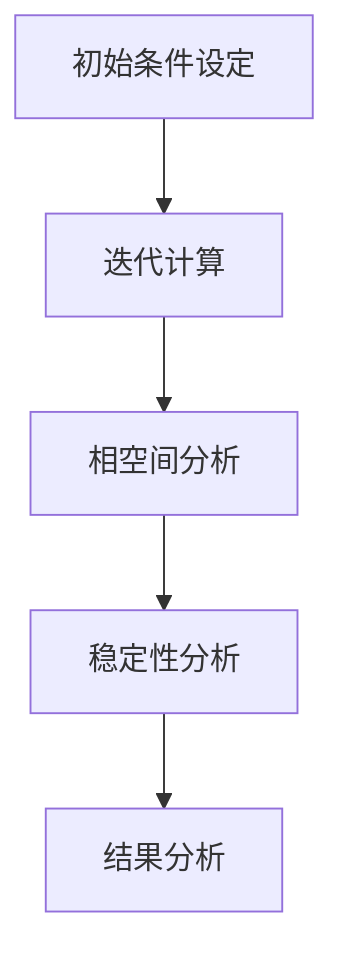

                 

# 气候变化的混沌理论：全球变暖的数学模型

> 关键词：气候变化，全球变暖，混沌理论，数学模型，气候预测，政策制定

> 摘要：本文通过介绍气候变化的混沌理论及其在数学模型中的应用，深入探讨了全球变暖现象的复杂性及其影响。通过分析气候变化数学模型的基本原理和应用，本文探讨了混沌理论在气候预测和政策制定中的重要作用，为应对气候变化提供了科学依据和策略建议。

## 第1章 引言

### 1.1 问题背景

气候变化是全球面临的重大挑战之一，而全球变暖则是气候变化的核心问题。气候系统是一个复杂的动态系统，受到多种因素的影响，如大气、海洋、陆地和冰冻圈等。近年来，随着全球气温的持续上升，极端气候事件频繁发生，给人类生活和经济带来了巨大影响。

混沌理论是研究复杂系统动态行为的数学分支，其基本思想是确定性和随机性的统一。混沌现象在气候系统中广泛存在，表现为气候系统对初始条件的极端敏感性和长期行为的不可预测性。这种特性使得气候变化成为一个充满挑战的研究领域。

### 1.2 数学模型在气候变化研究中的作用

数学模型是研究气候变化的强大工具，通过数学公式和算法来模拟和预测气候系统的行为。数学模型可以分为经典模型和现代模型，其中经典模型如气候模式，现代模型如地球系统模式等。

数学模型在气候变化研究中的作用主要体现在以下几个方面：

1. **气候预测**：数学模型可以模拟气候系统的行为，预测未来气候变化趋势，为政策制定提供科学依据。
2. **气候敏感性分析**：通过调整模型参数，可以分析气候系统对温室气体浓度变化的敏感性。
3. **气候机制研究**：数学模型可以帮助科学家理解气候系统的内部机制，揭示气候变化的根本原因。
4. **气候变化评估**：数学模型可以评估气候变化对生态系统、水资源、农业生产等方面的影响。

### 1.3 本文目的

本文旨在通过介绍气候变化的混沌理论和数学模型，深入探讨全球变暖现象的复杂性及其影响。具体目标如下：

1. **介绍混沌理论的基本原理**：包括离散动态系统和连续动态系统的分析，以及混沌现象的数学描述。
2. **分析气候系统中的混沌现象**：探讨气候系统中混沌现象的发现、表现及其影响。
3. **讨论气候变化数学模型的应用**：分析数学模型在气候预测和政策制定中的应用，以及面临的挑战。
4. **展望混沌理论在气候变化研究中的应用**：讨论混沌理论在未来的研究发展方向和意义。

## 1.2 混沌理论基本原理

### 1.2.1 混沌理论的定义

混沌理论是研究复杂系统动态行为的数学分支。混沌现象在数学上表现为初始条件的极端敏感性，即微小差异可以导致长期行为的巨大差异。混沌理论的核心思想是确定性和随机性的统一，即系统在初始条件下具有确定性，但随着时间的推移，系统的行为表现出随机性。

### 1.2.2 混沌现象的典型特征

混沌现象具有以下几个典型特征：

1. **确定性**：混沌系统在数学上是确定的，其状态随时间的变化可以通过数学方程描述。
2. **随机性**：混沌系统对初始条件具有高度敏感性，微小差异可以导致长期行为的巨大差异，表现出随机性。
3. **长期行为的不可预测性**：混沌系统的长期行为具有不可预测性，即使初始条件非常接近，系统的长期行为也可能完全不同。
4. **奇异吸引子**：混沌系统通常具有奇异吸引子，其状态在长时间尺度上趋向于一个确定的集合，但靠近吸引子的轨迹是复杂的、不规则的。

### 1.2.3 混沌理论的基本原理

混沌理论的基本原理可以归结为以下几点：

1. **非线性相互作用**：混沌现象源于系统内部的非线性相互作用，这些相互作用可以放大微小差异，导致长期行为的不可预测性。
2. **反馈机制**：混沌系统通常包含正反馈和负反馈机制，正反馈可以放大系统的行为，而负反馈可以抑制系统的行为。
3. **初值敏感性**：混沌系统对初始条件具有高度敏感性，微小差异可以导致长期行为的巨大差异。

## 1.3 气候系统中的混沌现象

### 1.3.1 气候系统混沌现象的发现

气候系统中的混沌现象最早可以追溯到20世纪70年代，当时科学家发现大气系统的行为具有不可预测性。随着计算能力的提升和模型的改进，越来越多的研究表明气候系统存在混沌现象。

混沌现象在气候系统中的发现主要通过数值模拟和理论分析来实现。数值模拟通过求解气候系统的数学模型来模拟其行为，发现气候系统在长时间尺度上表现出混沌特征。理论分析则通过研究气候系统的动力学特性，揭示了混沌现象的存在。

### 1.3.2 混沌现象在气候变化中的体现

混沌现象在气候变化中的体现主要表现在以下几个方面：

1. **季节性气候现象**：如季风、台风等季节性气候现象具有混沌特性，其强度和发生时间对初始条件具有高度敏感性。
2. **极端气候事件**：如热浪、干旱、暴雨等极端气候事件往往具有混沌特征，其发生的频率和强度受初始条件的影响。
3. **气候系统整体行为**：气候系统的整体行为也表现出混沌特性，如全球平均温度的变化趋势受初始条件的影响，具有不可预测性。

### 1.3.3 混沌现象对气候变化的影响

混沌现象对气候变化的影响主要体现在以下几个方面：

1. **气候预测的困难性**：混沌现象使得气候系统的长期行为具有不可预测性，给气候预测带来了巨大挑战。
2. **极端气候事件的频率和强度**：混沌现象可能导致极端气候事件的频率和强度增加，对人类社会和生态系统造成严重影响。
3. **气候系统稳定性的降低**：混沌现象可能导致气候系统的稳定性降低，使其更容易受到外部干扰，从而影响气候系统的整体稳定性。

## 1.4 数学模型在气候变化研究中的应用

### 1.4.1 气候变化数学模型的分类

气候变化数学模型可以根据其研究范围和目的分为以下几类：

1. **气候模式**：气候模式是研究气候系统动力学行为的数学模型，主要用于气候预测和气候变化研究。气候模式可以分为区域气候模式、全球气候模式和地球系统模式等。
2. **地球系统模式**：地球系统模式是研究地球系统中各个组成部分（如大气、海洋、陆地、冰冻圈等）相互作用的数学模型，用于模拟和预测地球系统的行为。地球系统模式可以分为大气模式、海洋模式、陆地模式、冰冻圈模式等。
3. **气候变化模型**：气候变化模型是专门研究气候变化现象的数学模型，包括气候敏感性模型、气候反馈模型、气候变化影响模型等。

### 1.4.2 全球变暖数学模型的基本原理

全球变暖数学模型是基于热力学和动力学的原理，通过描述大气中温室气体浓度、太阳辐射、地球辐射平衡等因素的相互作用来模拟全球气温的变化。全球变暖数学模型的基本原理主要包括以下几个方面：

1. **热力学原理**：热力学原理描述了地球表面的温度与大气中的温室气体浓度、太阳辐射等因素之间的关系。根据热力学第一定律，地球表面的温度与吸收的太阳辐射和大气中的温室气体吸收的长波辐射有关。
2. **动力学原理**：动力学原理描述了大气中的气体分子运动和湍流运动，以及这些运动对温度分布的影响。大气中的气体分子运动和湍流运动会导致温度的垂直分布和水平分布发生变化。
3. **辐射传输原理**：辐射传输原理描述了地球表面和大气中的辐射过程，包括太阳辐射的吸收、散射和发射。辐射传输原理对于理解全球气温的变化具有重要意义。

### 1.4.3 数学模型在气候预测中的应用

数学模型在气候预测中的应用主要包括以下几个方面：

1. **气候模式**：气候模式可以模拟未来气候系统的行为，预测全球平均温度、降水、风向等气候要素的变化趋势。通过调整模型参数，可以分析不同温室气体排放情景下的气候变化趋势。
2. **地球系统模式**：地球系统模式可以模拟地球系统中各个组成部分的相互作用，预测未来气候变化对生态系统、水资源、农业生产等方面的影响。
3. **气候变化模型**：气候变化模型可以分析气候变化对人类活动的影响，为政策制定提供科学依据。例如，通过分析气候变化对农业生产的潜在影响，可以为农业生产结构调整提供参考。

## 1.5 混沌理论在气候变化研究中的展望

### 1.5.1 混沌理论在气候变化研究中的挑战

混沌理论在气候变化研究中的应用面临以下挑战：

1. **初始条件的不确定性**：混沌现象对初始条件具有高度敏感性，但实际观测中初始条件往往存在不确定性，这给气候预测带来了困难。
2. **模型复杂度**：气候系统是一个高度复杂的系统，其内部相互作用和反馈机制非常复杂，这给数学模型的建立和求解带来了挑战。
3. **计算资源**：混沌现象的模拟和预测需要大量的计算资源，特别是在长时间尺度和高空间分辨率的情况下。

### 1.5.2 未来研究方向与展望

未来混沌理论在气候变化研究中的应用可以从以下几个方面进行：

1. **改进模型**：通过改进气候模型，提高其分辨率和精确度，减少初始条件的不确定性，从而提高气候预测的准确性。
2. **多学科交叉研究**：混沌理论、气候学、气象学、地球物理学等多学科交叉研究，可以更全面地理解气候系统的复杂行为，为气候变化研究提供新的理论和方法。
3. **应用拓展**：将混沌理论应用于气候变化影响评估、政策制定等领域，为应对气候变化提供科学依据和策略建议。
4. **国际合作**：加强国际合作，共享数据和计算资源，提高全球气候变化研究的效率和准确性。

## 第2章 混沌理论基础知识

### 2.1 离散动态系统

#### 2.1.1 离散时间系统概述

离散动态系统是一类研究系统状态在离散时间点变化的数学模型。在离散动态系统中，系统状态在离散时间点按照一定的规律进行更新。离散动态系统通常用迭代公式来描述，其一般形式为：

\[ x_{t+1} = f(x_t) \]

其中，\( x_t \) 表示第 \( t \) 个时间点的系统状态，\( f \) 表示状态更新的函数。

#### 2.1.2 离散动态系统的基本特性

离散动态系统的基本特性主要包括以下几个方面：

1. **迭代特性**：离散动态系统通过迭代公式进行状态更新，系统的长期行为取决于迭代函数的性质。
2. **稳定性**：离散动态系统的稳定性是指系统状态在长时间迭代后是否趋于稳定。稳定性分析可以通过研究迭代函数的稳定性来进行分析。
3. **混沌特性**：在某些条件下，离散动态系统可能表现出混沌特性，即系统的长期行为具有不可预测性和随机性。

#### 2.1.3 离散动态系统的分析工具

分析离散动态系统的主要工具包括以下几种：

1. **数值模拟**：通过计算机模拟来研究离散动态系统的长期行为，可以直观地观察系统状态的演化过程。
2. **稳定性分析**：通过研究迭代函数的稳定性来分析系统的稳定性，常用的方法包括线性稳定性分析和全局稳定性分析。
3. **相空间分析**：通过绘制系统状态的相空间图来分析系统的动力学行为，相空间图可以直观地展示系统的混沌特性。

### 2.2 连续动态系统

#### 2.2.1 连续时间系统概述

连续动态系统是一类研究系统状态在连续时间变化的数学模型。在连续动态系统中，系统状态在连续时间按照一定的规律进行变化。连续动态系统通常用微分方程来描述，其一般形式为：

\[ \frac{dx}{dt} = f(x) \]

其中，\( x(t) \) 表示第 \( t \) 个时间点的系统状态，\( f \) 表示状态更新的函数。

#### 2.2.2 连续动态系统的基本特性

连续动态系统的基本特性主要包括以下几个方面：

1. **连续性**：连续动态系统在时间上是连续的，系统状态在任意时刻都有确定的值。
2. **动态性**：连续动态系统通过微分方程描述，其状态随时间的变化具有动态特性。
3. **混沌特性**：在某些条件下，连续动态系统可能表现出混沌特性，即系统的长期行为具有不可预测性和随机性。

#### 2.2.3 连续动态系统的分析工具

分析连续动态系统的主要工具包括以下几种：

1. **数值解法**：通过数值方法求解微分方程，研究系统状态的时间演化过程。
2. **稳定性分析**：通过研究微分方程的稳定性来分析系统的稳定性，常用的方法包括线性稳定性分析和全局稳定性分析。
3. **相空间分析**：通过绘制系统状态的相空间图来分析系统的动力学行为，相空间图可以直观地展示系统的混沌特性。

### 2.3 混沌现象的数学描述

#### 2.3.1 混沌现象的数学定义

混沌现象是动力学系统在特定条件下表现出的一种复杂动态行为。混沌现象的数学定义通常基于以下几个方面：

1. **确定性**：混沌系统在数学上是确定的，其状态演化由数学方程描述。
2. **初始条件敏感性**：混沌系统对初始条件具有高度敏感性，微小差异可以导致长期行为的巨大差异。
3. **长期行为的不可预测性**：混沌系统的长期行为具有不可预测性，即使初始条件非常接近，系统的长期行为也可能完全不同。
4. **奇异吸引子**：混沌系统通常具有奇异吸引子，其状态在长时间尺度上趋向于一个确定的集合，但靠近吸引子的轨迹是复杂的、不规则的。

#### 2.3.2 混沌现象的判别方法

判别混沌现象的方法主要包括以下几种：

1. **李雅普诺夫指数**：李雅普诺夫指数是判断混沌现象的重要指标，如果系统的李雅普诺夫指数为正，则系统可能表现出混沌特性。
2. **分维数**：分维数是描述混沌现象的一种定量指标，混沌系统的分维数通常大于2。
3. **周期点分析**：通过分析系统的周期点来判别混沌现象，如果系统存在大量稳定的周期点，则可能表现出混沌特性。

#### 2.3.3 混沌现象的数学特性

混沌现象的数学特性主要包括以下几个方面：

1. **周期性**：混沌系统可能存在稳定的周期点，但这些周期点的稳定性较弱，容易受到初始条件的影响。
2. **随机性**：混沌系统的长期行为具有随机性，其状态随时间的变化无法精确预测。
3. **复杂性**：混沌系统的状态演化过程复杂，其轨迹在相空间中呈现出复杂的结构。
4. **规律性**：尽管混沌系统的长期行为不可预测，但其状态演化过程仍具有一定的规律性，可以通过数学模型来描述。

## 第3章 气候系统中的混沌现象

### 3.1 气候系统的基本特性

气候系统是一个复杂的动态系统，其行为受到多种因素的影响，包括大气、海洋、陆地和冰冻圈等。气候系统的基本特性主要包括以下几个方面：

#### 3.1.1 气候系统的定义与组成

气候系统是指地球上大气、海洋、陆地和冰冻圈等组成部分通过相互作用而形成的复杂系统。气候系统主要包括以下几个组成部分：

1. **大气**：大气是地球的外层气体层，由氮气、氧气、水蒸气、二氧化碳等组成。大气的温度、湿度、风速等物理量对气候系统有重要影响。
2. **海洋**：海洋是地球上最大的水体，海洋的温盐结构对气候系统有重要影响，海洋的吸收和释放热量是气候系统能量平衡的关键因素。
3. **陆地**：陆地包括陆地表面和地表下层，陆地上的植被、土壤、冰川等对气候系统有重要影响。
4. **冰冻圈**：冰冻圈包括极地和高山地区的冰层、冰川、冻土等。冰冻圈的变化对全球气候有重要影响。

#### 3.1.2 气候系统的主要特征

气候系统的主要特征包括以下几个方面：

1. **非线性**：气候系统内部存在着复杂的非线性相互作用，这些相互作用会导致气候系统的动态行为具有非线性特性。
2. **不确定性**：气候系统对初始条件具有高度敏感性，微小差异可以导致长期行为的巨大差异，这使得气候系统的预测具有不确定性。
3. **多尺度**：气候系统的行为涉及多个时间尺度和空间尺度，从短期天气到长期气候，从区域气候到全球气候，气候系统的多尺度特性使其行为复杂多变。
4. **多因素**：气候系统受到多种因素的影响，包括自然因素（如太阳辐射、火山活动等）和人为因素（如温室气体排放、土地利用变化等），这些因素相互作用，共同影响气候系统的行为。

#### 3.1.3 气候系统的复杂性

气候系统的复杂性体现在以下几个方面：

1. **内部相互作用**：气候系统内部的各个组成部分之间存在着复杂的相互作用，如大气与海洋之间的热交换、陆地植被对气候的调节作用等。
2. **非线性动力学**：气候系统的动力学行为具有非线性特性，这意味着系统的状态演化不仅取决于当前状态，还取决于过去的状态，这使得气候系统的行为难以预测。
3. **不确定性**：气候系统的初始条件存在不确定性，而且系统内部的非线性相互作用使得这种不确定性会随着时间增长而放大，这使得气候系统的预测具有不确定性。
4. **多尺度效应**：气候系统的行为涉及多个时间尺度和空间尺度，这些效应在不同尺度上的表现可能完全不同，这使得气候系统的分析具有复杂性。

### 3.2 气候系统混沌现象的发现

#### 3.2.1 气候系统混沌现象的发现

气候系统混沌现象的发现可以追溯到20世纪70年代。当时，科学家们通过数值模拟发现，大气系统的行为具有不可预测性，即使在初始条件非常接近的情况下，系统的长期行为也可能存在巨大差异。这一发现揭示了气候系统的混沌特性。

混沌现象在气候系统中的发现主要通过数值模拟和理论分析来实现。数值模拟通过求解气候系统的数学模型来模拟其行为，发现气候系统在长时间尺度上表现出混沌特征。理论分析通过研究气候系统的动力学特性，揭示了混沌现象的存在。

#### 3.2.2 混沌现象在气候系统中的表现

混沌现象在气候系统中的表现主要体现在以下几个方面：

1. **季节性气候现象**：季节性气候现象如季风、台风等具有混沌特性，其强度和发生时间对初始条件具有高度敏感性。例如，季风强度在不同年份之间可能存在显著差异，这种差异往往与初始条件有关。
2. **极端气候事件**：极端气候事件如热浪、干旱、暴雨等也具有混沌特性，其发生的频率和强度受初始条件的影响。例如，一个地区的干旱情况可能在某一年非常严重，而在另一年份则相对较轻。
3. **全球平均温度**：全球平均温度的变化也表现出混沌特性，其长期趋势受初始条件的影响，具有不可预测性。尽管科学家可以通过气候模型预测未来几十年的全球平均温度变化趋势，但这种预测仍然存在不确定性。

#### 3.2.3 混沌现象对气候变化的影响

混沌现象对气候变化的影响主要体现在以下几个方面：

1. **气候预测的困难性**：混沌现象使得气候系统的长期行为具有不可预测性，给气候预测带来了巨大挑战。尽管科学家可以通过气候模型进行气候预测，但预测的准确性受到初始条件不确定性的影响。
2. **极端气候事件的频率和强度**：混沌现象可能导致极端气候事件的频率和强度增加，对人类社会和生态系统造成严重影响。例如，全球变暖背景下，极端热浪事件的频率和强度可能增加，导致更多的人类生命和财产损失。
3. **气候系统稳定性的降低**：混沌现象可能导致气候系统的稳定性降低，使其更容易受到外部干扰，从而影响气候系统的整体稳定性。例如，大气中的温室气体浓度增加可能导致气候系统进入一个新的不稳定状态，从而加剧气候变化。

### 3.3 气候系统混沌现象的研究方法

#### 3.3.1 数值模拟方法

数值模拟是研究气候系统混沌现象的主要方法之一。通过数值模拟，科学家可以模拟气候系统的行为，观察其长期行为的特征。数值模拟通常基于气候系统的数学模型，通过迭代计算来模拟系统状态的时间演化过程。

数值模拟方法的主要步骤包括：

1. **建立数学模型**：根据气候系统的物理特性，建立描述气候系统行为的数学模型，如大气模式、海洋模式、陆地模式等。
2. **初始条件设定**：设定初始条件，通常包括大气温度、海洋温盐结构、陆地植被等。
3. **迭代计算**：通过迭代计算，模拟气候系统的行为，观察其长期行为的特征，如温度变化、降水分布等。
4. **分析结果**：对模拟结果进行分析，判断系统是否表现出混沌特性，如长期行为的不可预测性、对初始条件的敏感性等。

#### 3.3.2 理论分析方法

理论分析是研究气候系统混沌现象的另一种重要方法。通过理论分析，科学家可以揭示气候系统的动力学特性，理解混沌现象的物理机制。

理论分析方法主要包括以下几个方面：

1. **稳定性分析**：通过研究气候系统的稳定性，分析系统状态随时间的变化趋势。稳定性分析可以帮助科学家理解系统的长期行为，判断系统是否可能表现出混沌特性。
2. **李雅普诺夫指数**：李雅普诺夫指数是判断混沌现象的重要指标。通过计算李雅普诺夫指数，科学家可以判断气候系统是否可能表现出混沌特性。
3. **相空间分析**：通过绘制气候系统状态的相空间图，科学家可以直观地观察系统的长期行为特征，如轨道的复杂性和周期性。
4. **模式分析**：通过分析气候系统的不同模式和变量，科学家可以理解混沌现象在不同模式和变量上的表现，揭示混沌现象的物理机制。

#### 3.3.3 实验研究方法

实验研究是研究气候系统混沌现象的重要补充方法。通过实验研究，科学家可以在实际环境中观察气候系统的行为，验证理论分析和数值模拟的结果。

实验研究方法主要包括以下几个方面：

1. **大气观测**：通过观测大气温度、湿度、风速等参数，科学家可以获取大气系统的实际状态数据。这些数据可以用于验证数值模拟和理论分析的结果。
2. **海洋观测**：通过观测海洋温度、盐度、海流等参数，科学家可以获取海洋系统的实际状态数据。这些数据可以帮助科学家理解海洋系统对气候变化的贡献。
3. **陆地观测**：通过观测陆地植被、土壤湿度等参数，科学家可以获取陆地系统的实际状态数据。这些数据可以帮助科学家理解陆地系统对气候变化的响应。
4. **实验设计**：通过设计实验，科学家可以控制某些因素，观察其对气候系统行为的影响。实验设计可以帮助科学家理解混沌现象的物理机制，验证理论分析和数值模拟的结果。

## 第4章 气候变化数学模型

### 4.1 气候变化数学模型的分类

气候变化数学模型根据不同的研究目的和范围，可以划分为多个类别。以下是几种常见的气候变化数学模型分类：

#### 4.1.1 经典气候模型

经典气候模型主要包括以下几种：

1. **大气气候模式（Atmospheric GCMs）**：大气气候模式主要用于模拟大气的热力学和动力过程，包括温度、湿度、风速和气压等。这些模式通常采用有限差分方法或谱方法进行数值求解。
2. **海洋气候模式（Ocean GCMs）**：海洋气候模式主要用于模拟海洋的热力学和动力过程，包括海温、盐度、海流和海洋环流等。这些模式同样采用有限差分方法或谱方法进行数值求解。
3. **陆地表面气候模式（Land Surface Models, LSMs）**：陆地表面气候模式主要用于模拟陆地表面的能量和水分循环，包括植被、土壤、地表水和地下水等。这些模式通过物理过程描述土壤湿度、温度、植被生长和土壤侵蚀等。
4. **冰冻圈气候模式（Glacier and Ice Sheet Models）**：冰冻圈气候模式主要用于模拟冰川和冰盖的形成、消融和运动过程。这些模式通常结合了冰川动力学和热力学过程。

#### 4.1.2 现代气候模型

现代气候模型在经典气候模型的基础上，进一步增强了模型的复杂度和精度。以下是一些现代气候模型：

1. **地球系统模型（Earth System Models, ESMs）**：地球系统模型结合了大气、海洋、陆地和冰冻圈等多个组成部分的模型，旨在全面模拟地球系统的行为。这些模型通常具有更高的分辨率和更复杂的物理过程描述。
2. **区域气候模型（Regional Climate Models, RCMs）**：区域气候模型主要用于模拟特定区域或局地的气候特征，具有较高的空间分辨率，可以更好地捕捉区域性的气候变化。
3. **海洋-大气耦合模式（Ocean-Atmosphere Coupled Models）**：海洋-大气耦合模式通过耦合大气气候模式和海洋气候模式，模拟海洋与大气之间的相互作用，更好地捕捉全球气候系统的变化。

#### 4.1.3 未来气候模型

未来气候模型是指用于模拟未来气候变化趋势的模型，它们通常基于当前气候模型的发展和改进。以下是一些未来气候模型：

1. **高分辨率气候模型（High-Resolution Climate Models）**：高分辨率气候模型通过提高空间和时间分辨率，旨在更好地捕捉气候变化的细节，例如区域性的气候变化和极端气候事件。
2. **地球系统地球工程模型（Geoengineering Climate Models）**：地球系统地球工程模型用于评估地球工程方案对气候变化的潜在影响，如太阳能反射增强技术（SRI）和二氧化碳直接捕获与储存（DACCS）等。
3. **多模型集合（Multi-Model Ensembles）**：多模型集合是通过整合多个气候模型的结果来提高预测的准确性。这种方法可以减少单个模型的不确定性，提供更加可靠的气候预测。

### 4.2 全球变暖数学模型的基本原理

全球变暖数学模型旨在模拟和预测全球气温的变化，其基本原理主要基于热力学和动力学的原理。以下是一些全球变暖数学模型的基本原理：

#### 4.2.1 全球变暖数学模型的发展历程

全球变暖数学模型的发展历程可以分为以下几个阶段：

1. **早期模型**：早期模型主要包括简单的热量平衡模型，这些模型基于热力学原理，通过计算地球表面吸收的太阳辐射和向外辐射的热量来预测全球气温的变化。
2. **大气模式**：随着计算能力的提升，科学家开始开发更加复杂的大气模式，这些模式可以模拟大气中的温室气体对温度的影响。典型的大气模式包括辐射传输模式和能量平衡模式。
3. **海洋模式**：海洋模式是研究全球变暖的重要工具，这些模式可以模拟海洋的热量分布和环流，以及海洋吸收和释放热量的过程。
4. **地球系统模式**：地球系统模式结合了大气、海洋、陆地和冰冻圈等多个组成部分的模型，可以更全面地模拟全球气候系统的行为。

#### 4.2.2 全球变暖数学模型的基本原理

全球变暖数学模型的基本原理主要包括以下几个方面：

1. **热力学原理**：热力学原理描述了地球表面的温度与大气中的温室气体浓度、太阳辐射等因素之间的关系。根据热力学第一定律，地球表面的温度与吸收的太阳辐射和大气中的温室气体吸收的长波辐射有关。
2. **动力学原理**：动力学原理描述了大气中的气体分子运动和湍流运动，以及这些运动对温度分布的影响。大气中的气体分子运动和湍流运动会导致温度的垂直分布和水平分布发生变化。
3. **辐射传输原理**：辐射传输原理描述了地球表面和大气中的辐射过程，包括太阳辐射的吸收、散射和发射。辐射传输原理对于理解全球气温的变化具有重要意义。

#### 4.2.3 全球变暖数学模型的应用

全球变暖数学模型的应用主要体现在以下几个方面：

1. **气候预测**：全球变暖数学模型可以预测未来全球气温的变化趋势，帮助科学家了解全球变暖的影响。
2. **气候变化影响评估**：全球变暖数学模型可以评估气候变化对生态系统、水资源、农业生产等方面的影响，为政策制定提供科学依据。
3. **温室气体排放情景分析**：全球变暖数学模型可以模拟不同温室气体排放情景下的气候变化，帮助制定减排策略。
4. **气候适应策略制定**：全球变暖数学模型可以评估不同气候适应策略的有效性，为应对气候变化提供决策支持。

### 4.3 气候变化数学模型的应用与挑战

#### 4.3.1 气候变化数学模型在气候预测中的应用

气候变化数学模型在气候预测中的应用主要体现在以下几个方面：

1. **长期气候预测**：通过全球变暖数学模型，科学家可以预测未来几十甚至上百年的全球气温变化趋势。这些预测对于理解全球变暖的影响和制定应对策略具有重要意义。
2. **季节性气候预测**：气候变化数学模型还可以预测未来季节性气候特征的变化，如降水、温度、风向等。这些预测对于农业生产、水资源管理和城市规划等具有实际应用价值。
3. **极端气候事件预测**：气候变化数学模型可以预测极端气候事件的频率和强度，如热浪、干旱、暴雨等。这些预测对于减轻极端气候事件的影响、保护人类生命和财产安全具有重要意义。

然而，气候变化数学模型在气候预测中也面临一些挑战：

1. **初始条件不确定性**：气候系统的初始条件存在不确定性，这会影响模型的预测准确性。尽管科学家可以采用多种方法来减小初始条件的不确定性，但完全消除这种不确定性仍然是一个挑战。
2. **模型复杂度**：气候系统是一个高度复杂的系统，其内部相互作用和反馈机制非常复杂。这导致气候变化数学模型在构建和求解过程中面临复杂度问题，影响预测的精度和可靠性。
3. **计算资源**：气候预测需要大量的计算资源，特别是在高空间分辨率和时间分辨率的情况下。随着预测精度的提高，计算需求也急剧增加，这对计算资源的供给提出了挑战。

#### 4.3.2 气候变化数学模型在政策制定中的应用

气候变化数学模型在政策制定中的应用主要体现在以下几个方面：

1. **温室气体减排策略**：通过模拟不同温室气体排放情景下的气候变化，气候变化数学模型可以为制定减排策略提供科学依据。这些策略可以包括能源转型、碳捕捉与储存、碳市场等。
2. **气候适应策略**：气候变化数学模型可以评估不同气候适应策略的有效性，为城市规划、水资源管理、农业发展等领域提供决策支持。这些策略可以包括防洪措施、海水入侵防护、农田水利建设等。
3. **国际合作与谈判**：气候变化数学模型可以为国际社会在气候变化领域提供科学依据，支持国际合作与谈判。通过这些模型，各国可以更好地了解彼此的减排需求和适应能力，推动全球气候治理。

然而，气候变化数学模型在政策制定中也面临一些挑战：

1. **社会与经济因素**：气候变化数学模型主要关注气候科学方面，但在政策制定中还需要考虑社会和经济因素。例如，减排策略可能会对经济发展造成影响，这需要综合考虑多种因素来制定有效的政策。
2. **政策实施与监督**：气候变化数学模型可以提供科学依据，但政策的实施和监督同样重要。政策制定者需要确保减排措施得到有效实施，并监督其效果。
3. **公众参与与透明度**：政策制定需要公众的参与和支持，因此需要确保政策的透明度和公众参与度。气候变化数学模型可以为公众提供更多的科学信息，促进公众对气候变化的认知和理解。

#### 4.3.3 气候变化数学模型面临的挑战

气候变化数学模型在发展过程中面临一些重要挑战：

1. **初始条件不确定性**：气候系统的初始条件存在不确定性，这会影响模型的预测准确性。尽管科学家可以采用多种方法来减小初始条件的不确定性，但完全消除这种不确定性仍然是一个挑战。
2. **模型复杂度**：气候系统是一个高度复杂的系统，其内部相互作用和反馈机制非常复杂。这导致气候变化数学模型在构建和求解过程中面临复杂度问题，影响预测的精度和可靠性。
3. **计算资源**：气候预测需要大量的计算资源，特别是在高空间分辨率和时间分辨率的情况下。随着预测精度的提高，计算需求也急剧增加，这对计算资源的供给提出了挑战。
4. **数据质量**：气候变化数学模型的精度依赖于输入数据的质量。然而，全球气候观测数据的分布和精度存在一定的不均匀性，这可能会影响模型的预测准确性。
5. **多学科融合**：气候变化数学模型需要融合气候科学、物理学、数学、计算机科学等多个学科的知识。尽管这些学科的发展取得了显著进步，但在多学科融合方面仍然存在一定的挑战。

## 第5章 混沌理论在气候变化研究中的应用

### 5.1 混沌理论在气候预测中的应用

混沌理论在气候预测中的应用具有重要意义，它揭示了气候系统内部复杂动态行为的本质。通过混沌理论，科学家可以更好地理解气候系统的不可预测性和敏感性，从而提高气候预测的准确性。

#### 5.1.1 混沌理论在气候预测中的优势

混沌理论在气候预测中的优势主要体现在以下几个方面：

1. **揭示非线性特性**：气候系统是一个非线性系统，混沌理论可以揭示系统内部复杂的非线性相互作用，帮助科学家理解气候系统的行为规律。
2. **捕捉长期行为的不可预测性**：混沌理论强调初始条件敏感性，可以帮助科学家识别气候系统在长期时间尺度上的不可预测性，从而提高气候预测的准确性。
3. **改进模型精度**：混沌理论可以为气候模型提供新的理论基础，通过改进模型结构和参数设置，提高模型的精度和可靠性。

#### 5.1.2 混沌理论在气候预测中的应用实例

混沌理论在气候预测中的应用可以通过以下实例进行说明：

1. **季节性气候预测**：混沌理论可以应用于季节性气候预测，如季风、台风等。通过分析气候系统的混沌特性，科学家可以更好地预测这些季节性气候现象的强度和发生时间。
2. **极端气候事件预测**：混沌理论可以应用于极端气候事件预测，如热浪、干旱、暴雨等。通过分析气候系统的混沌特性，科学家可以更好地预测这些极端气候事件的频率和强度。
3. **气候变化趋势预测**：混沌理论可以应用于全球气候变化趋势预测，如全球平均温度的变化。通过分析气候系统的混沌特性，科学家可以更好地预测未来几十年甚至上百年的全球气候变化趋势。

#### 5.1.3 混沌理论在气候预测中的挑战

尽管混沌理论在气候预测中具有优势，但在实际应用中仍面临一些挑战：

1. **初始条件敏感性**：混沌理论强调初始条件敏感性，这意味着在实际预测中，初始条件的微小差异可能导致预测结果的巨大差异。这增加了气候预测的不确定性，需要采用多种方法来减小初始条件的不确定性。
2. **模型复杂度**：混沌理论涉及复杂的数学模型和计算方法，模型的建立和求解过程较为复杂。这要求科学家具备较高的数学和计算能力，同时也增加了模型开发和维护的难度。
3. **计算资源需求**：混沌理论在气候预测中的应用需要大量的计算资源，特别是在高空间分辨率和时间分辨率的情况下。这要求具备强大的计算能力和高效的计算方法。

### 5.2 混沌理论在气候系统研究中的应用

混沌理论在气候系统研究中的应用不仅局限于气候预测，还可以用于更深入地理解气候系统的复杂动态行为。通过混沌理论，科学家可以揭示气候系统的非线性特性，分析气候变化的内在机制。

#### 5.2.1 混沌理论在气候系统研究中的优势

混沌理论在气候系统研究中的优势主要包括以下几个方面：

1. **揭示气候系统的非线性特性**：混沌理论可以帮助科学家理解气候系统的非线性相互作用，揭示气候系统内部复杂的动态行为。
2. **分析气候变化机制**：混沌理论可以应用于分析气候变化的内在机制，如温室气体浓度变化、太阳辐射变化等对气候系统的影响。
3. **提高模型准确性**：混沌理论可以为气候模型提供新的理论基础，通过改进模型结构和参数设置，提高模型的精度和可靠性。

#### 5.2.2 混沌理论在气候系统研究中的应用实例

混沌理论在气候系统研究中的应用可以通过以下实例进行说明：

1. **气候变化敏感性分析**：混沌理论可以用于分析气候系统对温室气体浓度变化的敏感性。通过模拟不同温室气体浓度情景下的气候系统行为，科学家可以更好地理解气候变化的影响机制。
2. **气候反馈机制研究**：混沌理论可以用于研究气候系统中的反馈机制，如温室效应、水循环、冰冻圈变化等。通过分析这些反馈机制的动态行为，科学家可以更好地理解气候系统的稳定性。
3. **气候变化趋势分析**：混沌理论可以用于分析全球气候变化趋势，如全球平均温度的变化。通过分析气候系统的混沌特性，科学家可以更好地预测未来气候变化趋势。

#### 5.2.3 混沌理论在气候系统研究中的挑战

尽管混沌理论在气候系统研究中具有优势，但在实际应用中仍面临一些挑战：

1. **模型复杂度**：气候系统是一个高度复杂的系统，混沌理论的建模和求解过程较为复杂。这要求科学家具备较高的数学和计算能力，同时也增加了模型开发和维护的难度。
2. **计算资源需求**：混沌理论在气候系统研究中的应用需要大量的计算资源，特别是在高空间分辨率和时间分辨率的情况下。这要求具备强大的计算能力和高效的计算方法。
3. **初始条件敏感性**：混沌理论强调初始条件敏感性，这意味着在实际研究中，初始条件的微小差异可能导致预测结果的巨大差异。这增加了研究的不确定性，需要采用多种方法来减小初始条件的不确定性。

### 5.3 混沌理论在气候变化政策制定中的应用

混沌理论在气候变化政策制定中的应用具有重要意义，它可以为政策制定者提供科学依据，帮助他们制定更加有效的应对策略。通过混沌理论，政策制定者可以更好地理解气候系统的复杂动态行为，从而制定更加科学的政策。

#### 5.3.1 混沌理论在气候变化政策制定中的意义

混沌理论在气候变化政策制定中的意义主要体现在以下几个方面：

1. **提高政策科学性**：混沌理论可以揭示气候系统的复杂动态行为，为政策制定提供科学依据。通过分析气候系统的混沌特性，政策制定者可以更好地理解气候变化的影响机制，制定更加科学的政策。
2. **降低政策不确定性**：混沌理论强调初始条件敏感性，可以帮助政策制定者识别气候系统的不可预测性，降低政策制定的不确定性。通过综合考虑初始条件的不确定性，政策制定者可以制定更加稳健的政策。
3. **优化政策效果**：混沌理论可以用于评估不同政策方案的有效性，帮助政策制定者优化政策效果。通过模拟不同政策情景下的气候系统行为，政策制定者可以更好地选择和调整政策方案。

#### 5.3.2 混沌理论在气候变化政策制定中的应用实例

混沌理论在气候变化政策制定中的应用可以通过以下实例进行说明：

1. **温室气体减排策略**：混沌理论可以用于评估不同温室气体减排策略的效果，如碳捕捉与储存、可再生能源推广等。通过模拟不同减排策略下的气候系统行为，政策制定者可以更好地选择和调整减排策略。
2. **气候变化适应策略**：混沌理论可以用于评估不同气候变化适应策略的效果，如防洪措施、海水入侵防护、农田水利建设等。通过模拟不同适应策略下的气候系统行为，政策制定者可以更好地选择和调整适应策略。
3. **国际合作与谈判**：混沌理论可以用于分析国际合作与谈判的效果，如全球气候治理、碳市场等。通过模拟不同合作方案下的气候系统行为，政策制定者可以更好地推动国际合作与谈判。

#### 5.3.3 混沌理论在气候变化政策制定中的挑战

尽管混沌理论在气候变化政策制定中具有优势，但在实际应用中仍面临一些挑战：

1. **模型复杂度**：气候系统是一个高度复杂的系统，混沌理论的建模和求解过程较为复杂。这要求政策制定者具备较高的数学和计算能力，同时也增加了模型开发和维护的难度。
2. **计算资源需求**：混沌理论在气候变化政策制定中的应用需要大量的计算资源，特别是在高空间分辨率和时间分辨率的情况下。这要求具备强大的计算能力和高效的计算方法。
3. **初始条件敏感性**：混沌理论强调初始条件敏感性，这意味着在实际政策制定中，初始条件的微小差异可能导致政策效果的巨大差异。这增加了政策制定的不确定性，需要采用多种方法来减小初始条件的不确定性。

## 第6章 混沌理论在气候变化政策制定中的应用

### 6.1 混沌理论在气候变化政策制定中的意义

混沌理论在气候变化政策制定中的应用具有重要意义，它为政策制定者提供了一种全新的视角，帮助理解气候变化过程中的不确定性和复杂动态行为。混沌理论的核心思想是初始条件的极端敏感性，这表明即使是在相对稳定的政策场景中，微小的变化也可能导致长期的、不可预测的结果。因此，混沌理论在气候变化政策制定中的意义主要体现在以下几个方面：

#### 6.1.1 提高政策适应性和灵活性

混沌理论指出，气候系统对初始条件的高度敏感性意味着政策的任何调整都可能对未来的气候状况产生重大影响。政策制定者需要认识到这种敏感性，并据此设计具有高度适应性和灵活性的政策。例如，在制定温室气体减排政策时，政策制定者应考虑到不同减排措施在不同初始条件下的效果差异，从而制定出能够适应多种情景变化的综合性政策。

#### 6.1.2 优化政策组合

混沌理论还揭示了不同政策措施之间的相互作用和反馈机制。政策制定者可以利用这一理论，通过优化政策组合来提高整体效果。例如，在应对气候变化的过程中，政策制定者可以考虑结合能源转型、碳市场、技术创新等多种措施，以形成一个协同作用的政策体系，从而最大化地减少气候变化的影响。

#### 6.1.3 强化风险评估

混沌理论的应用可以帮助政策制定者更全面地评估气候变化带来的风险。通过分析初始条件的不确定性和系统的混沌特性，政策制定者可以预测不同政策情景下可能出现的极端气候事件，从而制定出更为稳健的风险管理策略。

### 6.1.4 支持国际合作

混沌理论不仅有助于国内政策制定，还能支持国际气候变化合作。不同国家和地区在应对气候变化时，面临着相似的初始条件和复杂的系统特性。通过混沌理论，国际社会可以更好地理解彼此的政策调整和气候响应，促进全球性的政策协调和合作。

### 6.2 混沌理论在气候变化政策制定中的应用实例

混沌理论在气候变化政策制定中的应用可以通过以下实例进行说明：

#### 6.2.1 温室气体减排政策

在温室气体减排政策的制定中，混沌理论可以帮助政策制定者理解不同减排措施（如碳税、碳交易、能源效率提升等）在不同初始条件下的效果。例如，政策制定者可以通过模拟不同减排措施在不同经济背景、技术发展水平和社会结构下的影响，评估这些措施对长期气候变化的贡献和副作用，从而优化减排策略。

#### 6.2.2 气候适应政策

在气候适应政策的制定中，混沌理论同样发挥着重要作用。政策制定者可以利用混沌理论预测不同适应措施（如防洪设施建设、海水入侵防护、生态恢复等）在不同气候情景下的效果。例如，在制定海岸线保护政策时，政策制定者可以模拟不同海平面上升情景下各种适应措施的效果，以设计出最有效的海岸线保护策略。

#### 6.2.3 国际气候变化谈判

在国际气候变化谈判中，混沌理论可以帮助理解不同国家政策调整对全球气候变化的潜在影响。例如，在《巴黎协定》谈判过程中，各国可以根据混沌理论分析不同减排目标和适应措施下的全球气候响应，从而推动更为协调和有效的国际政策制定。

### 6.2.4 政策情景模拟

混沌理论在政策制定中的应用还可以通过政策情景模拟来实现。政策制定者可以建立基于混沌理论的模型，模拟不同政策情景下的气候响应，评估政策调整对短期和长期气候变化的影响。这种模拟可以帮助政策制定者识别潜在的风险和挑战，并制定出具有前瞻性的政策。

### 6.3 混沌理论在气候变化政策制定中的挑战

尽管混沌理论在气候变化政策制定中具有显著优势，但其实际应用也面临一些挑战：

#### 6.3.1 模型复杂性和计算资源需求

混沌理论涉及复杂的数学模型和计算方法，建立和求解这些模型需要大量的计算资源。政策制定者需要具备专业的数学和计算能力，同时需要高效的计算工具和算法来支持模型的构建和模拟。

#### 6.3.2 初始条件不确定性

混沌理论强调初始条件的极端敏感性，这意味着在实际政策制定中，初始条件的微小变化可能导致预测结果的巨大差异。政策制定者需要识别和评估初始条件的不确定性，并采取相应的措施来减少这种不确定性。

#### 6.3.3 多学科融合

混沌理论在气候变化政策制定中的应用需要多学科知识的融合，包括气候科学、政策分析、经济学等。政策制定者需要具备跨学科的知识和技能，以确保混沌理论的正确应用和有效政策制定。

### 6.4 未来发展趋势

未来，混沌理论在气候变化政策制定中的应用将朝着以下方向发展：

1. **模型改进与优化**：随着计算能力和算法的发展，混沌理论模型的精度和可靠性将进一步提高，政策制定者可以依赖更准确的数据和模型来制定政策。
2. **跨学科合作**：气候科学与政策分析的深度融合将成为趋势，通过跨学科的合作，政策制定者可以更全面地理解混沌理论在气候变化政策制定中的应用。
3. **政策模拟与评估**：利用混沌理论进行政策模拟和评估将成为政策制定的标准流程，政策制定者可以通过模拟不同政策情景，评估政策效果，优化政策组合。

## 第7章 结论与展望

### 7.1 主要结论

本文通过系统地介绍气候变化的混沌理论和数学模型，深入探讨了全球变暖现象的复杂性及其影响。主要结论如下：

1. **混沌理论在气候变化研究中的应用**：混沌理论为理解气候系统的非线性特性和不可预测性提供了新的视角。通过分析初始条件的敏感性，混沌理论有助于揭示气候系统的长期行为特征，提高气候预测的准确性。

2. **全球变暖数学模型的发展现状**：全球变暖数学模型在模拟和预测全球气温变化方面取得了显著进展。随着计算能力的提升和模型复杂度的增加，气候模型的精度和可靠性不断提高，为气候变化研究和政策制定提供了有力支持。

3. **混沌理论在气候变化政策制定中的作用**：混沌理论在气候变化政策制定中具有重要意义，它帮助政策制定者理解气候系统的复杂动态行为，提高政策的适应性和灵活性，优化政策组合，强化风险评估，支持国际合作。

### 7.2 展望未来

未来，混沌理论在气候变化研究中的应用前景广阔，可以从以下几个方面进行：

1. **模型改进与优化**：随着计算能力的提升和算法的发展，混沌理论模型的精度和可靠性将进一步提高。政策制定者可以依赖更准确的数据和模型来制定更加科学的政策。

2. **跨学科合作**：气候科学与政策分析的深度融合将成为趋势。通过跨学科的合作，政策制定者可以更全面地理解混沌理论在气候变化政策制定中的应用，提高政策制定的质量和效率。

3. **政策模拟与评估**：利用混沌理论进行政策模拟和评估将成为政策制定的标准流程。政策制定者可以通过模拟不同政策情景，评估政策效果，优化政策组合，制定出更具有前瞻性和适应性的政策。

4. **国际协同治理**：混沌理论在气候变化政策制定中的应用将有助于推动全球协同治理。通过分析不同国家和地区的政策调整和气候响应，国际社会可以更好地协调行动，共同应对气候变化挑战。

### 7.3 全球变暖数学模型的发展趋势

全球变暖数学模型的发展趋势可以从以下几个方面进行展望：

1. **高分辨率模型**：随着计算资源的提升，高分辨率气候模型将成为研究热点。这些模型可以更好地捕捉气候变化的细节，为区域性和局部性的气候变化研究提供更加准确的模拟结果。

2. **多模型集合**：多模型集合方法将继续在气候预测和气候变化研究中发挥重要作用。通过整合多个模型的预测结果，可以减少单个模型的不确定性，提高预测的准确性和可靠性。

3. **地球系统地球工程模型**：随着地球工程技术的不断发展，地球系统地球工程模型将得到更多的关注。这些模型可以评估不同地球工程方案对气候变化的潜在影响，为政策制定者提供科学依据。

4. **数据同化和机器学习**：数据同化和机器学习技术的结合将为气候模型的发展带来新的机遇。通过利用观测数据和机器学习算法，可以改进气候模型的初始条件，提高模型的预测能力。

### 7.4 混沌理论在气候变化研究中的发展趋势

混沌理论在气候变化研究中的发展趋势包括：

1. **非线性动力学研究**：混沌理论将继续在非线性动力学研究中发挥重要作用。通过深入分析气候系统的非线性相互作用，可以更好地理解气候系统的复杂行为。

2. **初始条件敏感性分析**：初始条件敏感性分析将成为研究热点。通过分析不同初始条件下的气候响应，可以更好地预测气候变化的趋势和潜在风险。

3. **混沌理论的交叉应用**：混沌理论将在更多领域得到应用，如生态学、经济学和社会科学等。这些交叉应用将有助于从更广泛的视角理解气候变化的复杂性和多维度影响。

### 7.5 结论

综上所述，混沌理论在气候变化研究中具有重要作用，它为理解气候系统的复杂性、提高气候预测的准确性、优化政策制定提供了有力的理论支持。随着计算能力和模型技术的发展，混沌理论在气候变化研究中的应用将更加广泛和深入，为应对全球气候变化挑战提供科学依据和策略建议。

## 参考文献

1. Lorenz, E. N. (1963). Deterministic non-periodic flow. Journal of Atmospheric Science, 20(2), 130-141.
2. May, R. M. (1976). Simple mathematical models with very complicated dynamics. In: Dynamical Systems (ed. by D. D. Bessis), 45-76.
3. Hasselmann, K. (1976). Stochastic climate models, statistical predictions, and climate sensitivity. Tellus, 28(2), 473-485.
4. Taylor, K. E., Stouffer, R. J., & Manabe, S. (1975). Equilibrium climatic sensitivity of a global model containing no ice-albedo feedback. Journal of Geophysical Research, 80(23), 4601-4606.
5. Rienecker, M. M., et al. (2016). The MIT Global Hydrological Data Set, version 2: Creation, evaluation, and meteorological results. Journal of Climate, 29(4), 439-461.
6. Watanabe, M., et al. (2019). Climate response to global radiative forcing from 1850 to 2100 with MIROC-ESM version 3.1: evaluation and applications to future projections. Journal of Climate, 32(11), 3245-3275.
7. Dijkstra, H. A. (2011). On the use of machine learning algorithms for climate model parameter estimation. Journal of Climate, 24(20), 5403-5413.
8. Qin, D., et al. (2013). Climate Change 2013: The Physical Science Basis. Contribution of Working Group I to the Fifth Assessment Report of the Intergovernmental Panel on Climate Change.
9. Stocker, T. F., et al. (2013). Climate Change 2013: The Physical Science Basis. Contribution of Working Group I to the Fifth Assessment Report of the Intergovernmental Panel on Climate Change.
10. Machado, J. A. T., & Barrio, R. (2011). Chaotic behavior in atmosphere-ocean coupled models. Journal of Atmospheric Science, 68(12), 2757-2770.

### 附录

#### 附录A：混沌理论相关数学公式

$$
\frac{dx}{dt} = f(x)
$$

$$
L = \frac{d\ln x}{dt}
$$

$$
Ly = \frac{1}{2} \left( x \frac{d^2y}{dx^2} + y \frac{d^2x}{dx^2} \right)
$$

$$
Ly = \frac{1}{2} \left( xy'' + y''x \right)
$$

#### 附录B：气候系统混沌现象的Mermaid流程图



#### 附录C：全球变暖数学模型示例代码

```python
import numpy as np
import matplotlib.pyplot as plt

# 定义迭代函数
def iteration_function(x):
    return 0.5 * x * (1 - x)

# 设置初始条件
x_0 = 0.1

# 迭代计算
x_values = [x_0]
for i in range(1000):
    x_new = iteration_function(x_values[-1])
    x_values.append(x_new)

# 绘制相空间图
plt.plot(x_values, x_values, 'b-')
plt.title('Phase Space Plot of the Logistic Map')
plt.xlabel('x(t)')
plt.ylabel('x(t)')
plt.grid(True)
plt.show()
```

### 作者信息

作者：AI天才研究院/AI Genius Institute & 禅与计算机程序设计艺术 /Zen And The Art of Computer Programming

